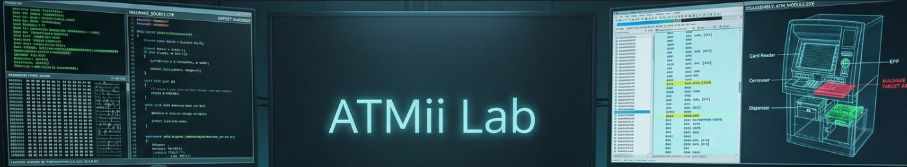
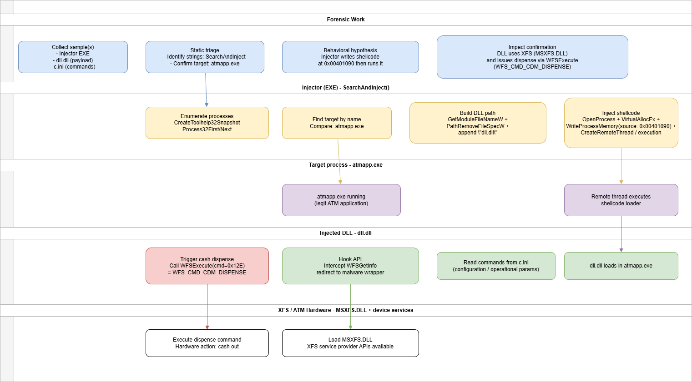

# ATMii Lab



# Table of Contents

- [Context](#context)
- [Scenario](#scenario)
- [Questions](#questions)
  * [Program Hooking and Redirecting to Wrapper](#program-hooking-and-redirecting-to-wrapper)
- [Forensic Timeline](#forensic-timeline)

# Context

**Lab link**: [https://cyberdefenders.org/blueteam-ctf-challenges/atmii/](https://cyberdefenders.org/blueteam-ctf-challenges/atmii/)

**Suggested Tools**: x64dbg, IDA, Ghidra

**Tactics**: Initial Access, Execution, Persistence, Privilege Escalation, Defense Evasion, Discovery, Collection, Impact

# Scenario

As a malware analyst at CyberResponse Inc., you are presented with a challenging case involving ATM malware named ATMii. The malware has been reported to cause ATMs to dispense cash illicitly. Your mission is to dissect this malware sample, understand its components, and uncover its method of attack. This exercise is crucial in developing countermeasures to protect financial institutions from similar threats.

Understand and analyze ATM-targeting malware using static analysis tools, identify malicious behaviors, and trace how malware exploits legitimate APIs like XFS to manipulate ATM hardware and perform unauthorized actions.

# Questions

Q1- Identifying the target process is crucial for understanding the injection vector. What is the name of the process into which the malicious library is injected?

**Answer**: `atmapp.exe1`

**Explanation**: The malware uses a classic “search-and-inject” shellcode injection approach. After loading the binary into Ghidra, you can find strings such as `SearchAndInject` in the Defined Strings view and follow their cross-references (`XRefs`) to the implementing function (`FUN_00401570`). In that code path, the sample calls Windows process-enumeration APIs such as `CreateToolhelp32Snapshot` and `Process32First` to iterate through running processes until it finds its intended target by name. Once it locates the target, it prepares the injection step, confirming that the malicious library is injected into `atmapp.exe`. Windows APIs used here:

- **`CreateToolhelp32Snapshot`**: takes a **snapshot** of the current system state, essentially freezing a picture of all running processes, threads, or modules at that moment. Returns a handle to that snapshot.
- `Process32First` / `Process32Next`: **walks through that snapshot** entry by entry, returning info about each process (name, PID, parent PID).


```c
// C function FUN_00401570 used for DLL injection:
// Enumerates processes
// Looks for atmapp.exe
// Constructs ...\dll.dll in the malware’s own directory
// Calls an injection routine (FUN_00401100) using the target PID

void __cdecl FUN_00401570(char param_1)
{
  HANDLE hObject;
  int iVar1;
  DWORD DVar2;

  // Buffers used for debug/log strings and building paths
  CHAR  local_c08[1024];
  CHAR  local_808[504];
  WCHAR local_610[260];   // path buffer for current executable directory + "dll.dll"
  CHAR  local_408[468];

  // PROCESSENTRY32W-like struct storage (decompiler split it into pieces)
  undefined4 local_234;
  undefined  local_230[4];
  DWORD      local_22c;
  WCHAR      local_210[260]; // holds process name (szExeFile in PROCESSENTRY32W)
  HANDLE     local_8;

  // --- Junction: start + create process snapshot (enumeration setup)
  wsprintfA(local_408,"(%d):%s() CreateToolhelp32Snapshot\n",199,"SearchAndInject");
  FUN_00401000(local_408);

  hObject = (HANDLE)CreateToolhelp32Snapshot(2,0); // TH32CS_SNAPPROCESS = 0x2
  if (hObject != (HANDLE)0xffffffff) {

    local_8 = hObject;

    // --- Junction: begin parsing processes
    wsprintfA(local_808,"(%d):%s() Parsing processes\n",0xcb,"SearchAndInject");
    FUN_00401000(local_808);

    FUN_004018e0((undefined (*) [16])local_230,0,0x228);
    local_234 = 0x22c;

    // --- Junction: iterate process list
    iVar1 = Process32FirstW(hObject,&local_234);
    while (iVar1 != 0) {

      // --- Junction: check for target process name
      iVar1 = lstrcmpiW(local_210,L"atmapp.exe");
      if (iVar1 == 0) {

        // --- Junction: target found (log)
        wsprintfA(local_c08,"(%d):%s() -------------------------------------------\n",0xd5,"SearchAndInject");
        FUN_00401000(local_c08);

        wsprintfA(local_c08,"(%d):%s() Process found %S\n",0xd6,"SearchAndInject",local_210);
        FUN_00401000(local_c08);

        // --- Junction: build full path to the DLL to inject (same directory as current EXE)
        DVar2 = GetModuleFileNameW((HMODULE)0x0,local_610,0x104); // gets current module path
        if (DVar2 != 0) {
          PathRemoveFileSpecW(local_610);   // strip filename -> directory
          PathAddBackslashW(local_610);     // ensure trailing "\"
          lstrcatW(local_610,L"dll.dll");   // expected injected library name

          // --- Junction: perform the injection/next stage
          FUN_00401100(local_22c, local_610, param_1);
        }
      }

      // --- Junction: move to next process entry
      iVar1 = Process32NextW(local_8,&local_234);
      hObject = local_8; // decompiler artifact; keeps handle in hObject for CloseHandle
    }

    // --- Junction: cleanup snapshot handle
    CloseHandle(hObject);
  }

  return;
}
```

Q2- Determining the source of configuration commands can reveal the malware's operational parameters. What is the configuration file name from which the DLL takes commands?

**Answer**: `c.ini`

**Explanation**: Review the functions list and examine the `entry` function in Ghidra. The `entry` function is the **C runtime startup stub** (CRT), which is compiler-generated boilerplate that runs before the program’s actual code. On line #26, it calls `FUN_00401720`, which reveals the configuration file from which the library reads its commands. The `WritePrivateProfileStringW` Windows API **writes a key-value pair into a `.ini` configuration file** which often used by malware to store configuration or persist settings.


Q3- The success of the injection depends on the correct file name. What should be the original name of the injected library to ensure the attack is successful?

**Answer**: `dll.dll`

**Explanation**: Referring back to the function from Question 1, we can see that the injected library name is hardcoded. The directory is dynamic and depends on the path of `atmapp.exe`, but the library name itself is static. Windows APIs used:

- **`GetModuleFileNameW`** — returns the full path of the currently running executable (passing `0x0` as the handle means "this process itself")
- **`PathRemoveFileSpecW`** — strips the filename from a full path, leaving only the directory portion
- **`PathAddBackslashW`** — ensures a directory path ends with a `\`, safe string building before concatenation
- **`lstrcatW`** — standard string concatenation, appends one wide string onto another

```c
// --- Junction: build full path to the DLL to inject (same directory as current EXE)
DVar2 = GetModuleFileNameW((HMODULE)0x0,local_610,0x104); // gets current module path
if (DVar2 != 0) {
	PathRemoveFileSpecW(local_610);   // strip filename -> directory
	PathAddBackslashW(local_610);     // ensure trailing "\"
	lstrcatW(local_610,L"dll.dll");   // expected injected library name
}
```

Q4- Identifying the function address where the shellcode resides helps track the malware's execution flow. What is the address within the injector that houses the shellcode responsible for loading and unloading the malicious DLL?

**Answer**: `0x00401090`

**Explanation**: From the function in Question 1, we can see that the injection routine is `FUN_00401100`. Reviewing its code shows that, on line #54, the malware stores its shellcode at address `0x00401090`, which corresponds to another function you can inspect. This function acts as an intermediary executor that loads the malicious DLL, runs its payload, and supports unloading the DLL if needed.


This is the core shellcode injection line, writing malicious code into another process’s memory.

```c
BVar2 = WriteProcessMemory(hProcess,lpStartAddress,FUN_00401090,0x400,&local_14);
```

- **`hProcess`** — handle to the target process (`atmapp.exe`), obtained earlier via `OpenProcess`
- **`lpStartAddress`** — the destination address **inside the target process** where the shellcode will be written, allocated earlier via `VirtualAllocEx`
- **`FUN_00401090`** — the **source buffer** — this is the actual shellcode or payload sitting in the malware's own memory being copied over
- **`0x400`** — writing exactly **1024 bytes** into the target process
- **`&local_14`** — pointer to a variable that receives how many bytes were **actually written** — used to verify the write succeeded
- **`BVar2`** — boolean result, non-zero means success

Q5- Understanding how the malware interfaces with the ATM hardware is key to analyzing its behavior. What is the name of the dynamic library that provides APIs for interacting with the ATM?

**Answer**: `MSXFS.DLL`

**Explanation**: Opening the injected library (which we now know is called `dll.dll`) in Ghidra and reviewing the Imports list in the Symbol Tree reveals a common library used in the financial industry. `MSXFS.dll` is part of the Extensions for Financial Services (XFS) API, which is widely used in banking and ATM software. The XFS API provides standardized methods for financial applications to interact with ATM hardware, such as cash dispensers, card readers, and receipt printers.


Q6- Hooking functions allow malware to manipulate normal operations. What is the name of the original API function that the program hooks and redirects to its wrapper?

**Answer**: `WFSGetInfo`

**Explanation**: During analysis of the library’s `entry` function, `FUN_10002880` stands out as the function that implements the hooking logic.


`WFSGetInfo` is a **Winsock Financial Services (WFS) API** — specifically part of the **CEN/XFS (eXtensions for Financial Services)** standard. It queries information from a financial device service: things like **ATM dispensers, card readers, PIN pads, receipt printers**.

## Program Hooking and Redirecting to Wrapper

**Hooking** means intercepting a function call before it reaches its intended destination. Instead of the legitimate code calling `WFSGetInfo` and getting a clean response from the XFS layer, the malware **plants itself in the middle**:

```
Normal flow:
atmapp.exe → WFSGetInfo → XFS → ATM hardware

Hooked flow:
atmapp.exe → WFSGetInfo → malware's wrapper → (maybe, since the malware doesn't have to forward anything after this point) XFS → ATM hardware
```

The wrapper is just the malware's own fake version of that function. It receives the call first, can read, modify, or steal the data passing through, then optionally forwards it to the real function so nothing looks broken to the legitimate app. It's sitting in the middle of a conversation it was never supposed to be part of. In practical terms: the malware injects into `atmapp.exe`, hooks `WFSGetInfo`, and every time the ATM app asks the hardware "how much cash is in the dispenser" or "read this card", the malware sees that data first. That's how it silently siphons card data or triggers dispense commands without the legitimate application knowing anything is wrong.

Q7- Knowing the function the malware utilizes is essential to identifying the malware's functionality. What API function does the malware call to dispense money?

**Answer**: `WFSExecute`

**Explanation**: **`WFSExecute`** is the XFS API used to send a **command directly to ATM hardware**. Here is a breakdown of the call `iVar1 = WFSExecute(DAT_10004228, 0x12e, &local_20, 10000, &local_c);` in `FUN_100022d0`: 

- **`DAT_10004228`** — handle to the **cash dispenser service** — opened earlier, this is the connection to the physical hardware
- **`0x12e`** — this is the critical one — it's a **command code**. `0x12e` (302 decimal) maps to `WFS_CMD_CDM_DISPENSE` in the XFS standard — literally the "dispense cash" command
- **`&local_20`** — pointer to a structure specifying **how much to dispense** (denominations, counts) — set to `0x10000` earlier
- **`10000`** — timeout in milliseconds
- **`&local_c`** — receives the result

XFS Standard Reference: [https://www.cencenelec.eu/media/CEN-CENELEC/AreasOfWork/CEN sectors/Digital Society/CWA Download Area/XFS/16926-1.pdf](https://www.cencenelec.eu/media/CEN-CENELEC/AreasOfWork/CEN%20sectors/Digital%20Society/CWA%20Download%20Area/XFS/16926-1.pdf). 

Q8- Recognizing specific constants can help in understanding command execution. What is the name of the constant responsible for the money dispensing command, which is passed as a parameter to the API function?

**Answer**: `WFS_CMD_CDM_DISPENSE`

**Explanation**: This appears in the previous function’s code, in the snippet that shows the parameter passed to the `WFSExecute` API function.

```c
wsprintfA(local_234,"(%d):%s() WFSExecute (WFS_CMD_CDM_DISPENSE) failed with error: %d\n\n",
          0x1b5,"cmd_disp_ex",iVar1);
```

# Forensic Timeline

