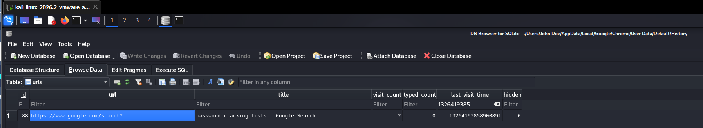

# AfricanFalls Lab

# Context

Lab link: [https://cyberdefenders.org/blueteam-ctf-challenges/africanfalls/](https://cyberdefenders.org/blueteam-ctf-challenges/africanfalls/)

Suggested tools: FTK Imager, Autopsy, rifiuti2, Browsing History View, WinPrefetchView, ShellBagsExplorer, mimikatz, Metdata Extractor, Online Hash Crack, NTLM Hash

Tactics: Collection

# Scenario

John Doe was accused of doing illegal activities. A disk image of his laptop was taken. Your task as a soc analyst is to analyze the image and understand what happened under the hood.

# Questions

Q1- What is the MD5 hash value of the suspect disk?

Answer: `9471e69c95d8909ae60ddff30d50ffa1`

Reason: The MD5 hash of the suspect disk image was verified as `9471e69c95d8909ae60ddff30d50ffa1`, extracted from the DiskDigger AD1 acquisition log at `./DiskDigger/DiskDrigger.ad1.txt` via `grep -i md5`, confirming the image's integrity for chain of custody prior to any forensic analysis of the disk contents.

```bash
$ grep -i md5 ./DiskDigger/DiskDrigger.ad1.txt 
 MD5 checksum:    9471e69c95d8909ae60ddff30d50ffa1
```

Q2- What phrase did the suspect search for on `2021-04-29 18:17:38 UTC`? (three words, two spaces in between)

Answer: password cracking lists

Reason: The suspect searched Google for the phrase `password cracking lists` at `2021-04-29 18:17:38 UTC`, recovered from the `urls` table in Chrome's `History` SQLite database at `./Users/John Doe/AppData/Local/Google/Chrome/User Data/Default/History`, where the entry `https://www.google.com/search?...` with title `password cracking lists - Google Search` carries a `last_visit_time` value of `13264193858900891` (WebKit/Chrome epoch format), which converts to the queried UTC timestamp.



Q3- What is the IPv4 address of the FTP server the suspect connected to?

Answer: `192.168.1.20`

Reason: The suspect connected to an FTP server at `192.168.1.20` on port `21` using the username `kali`, as recorded in FileZilla's recent connections list at `./Users/John Doe/AppData/Roaming/FileZilla/recentservers.xml`, indicating active use of the FileZilla FTP client for file transfer to or from this host.

```bash
$ cat ./Users/John\ Doe/AppData/Roaming/FileZilla/recentservers.xml
<?xml version="1.0" encoding="UTF-8"?>
<FileZilla3 version="3.53.1" platform="windows">
        <RecentServers>
                <Server>
                        <Host>192.168.1.20</Host>
                        <Port>21</Port>
                        <Protocol>0</Protocol>
                        <Type>0</Type>
                        <User>kali</User>
                        <Logontype>2</Logontype>
                        <PasvMode>MODE_DEFAULT</PasvMode>
                        <EncodingType>Auto</EncodingType>
                        <BypassProxy>0</BypassProxy>
                </Server>
        </RecentServers>
</FileZilla3>
```

Q4- What date and time was a password list deleted in UTC? (YYYY-MM-DD HH:MM:SS UTC)

Answer: `2021-04-29 18:22`

Reason: The suspect deleted a password wordlist file, `10-million-password-list-top-100.txt`, originally located at `C:\Users\John Doe\Downloads\10-million-password-list-top-100.txt`, at `2021-04-29 18:22:17 UTC`, as recorded in the Recycle Bin `$I` metadata file `$IW9BJ2Z.txt` within `$Recycle.Bin/S-1-5-21-3061953532-2461696977-1363062292-1001/`, parsed via `rifiuti-vista`, corroborating the earlier `password cracking lists` Google search by showing the suspect had downloaded and then deleted an actual password list shortly afterward.

```bash
$ rifiuti-vista \$Recycle.Bin/S-1-5-21-3061953532-2461696977-1363062292-1001/
Recycle bin path: '$Recycle.Bin/S-1-5-21-3061953532-2461696977-1363062292-1001/'
Version: 2
OS Guess: Windows 10 or above
Time zone: UTC [+0000]

Index           Deleted Time            Gone?   Size    Path
$IW9BJ2Z.txt    2021-04-29 18:22:17     FALSE   754     C:\Users\John Doe\Downloads\10-million-password-list-top-100.txt
```

Q5- How many times was Tor Browser ran on the suspect's computer? (number only)

Answer: 0

Reason: Tor Browser was never actually executed on the suspect's computer (`0` runs), despite the Tor Browser installer having been run once. A Prefetch search of `Windows/Prefetch` for Firefox-related executables (Tor Browser is Firefox-based) returned no results, and the only Tor-related entry present is `TORBROWSER-INSTALL-WIN64-10.0-F3C4DF19.pf`, evidence that only the installer package was launched, with no corresponding `firefox.exe` or `tor.exe` Prefetch entry indicating the browser itself was ever opened afterward.

```bash
$ ls Windows/Prefetch | grep -i firefox
                                                                                                                                                                                                                   
$ ls Windows/Prefetch | grep -i tor    
[...]
TORBROWSER-INSTALL-WIN64-10.0-F3C4DF19.pf
TORBROWSER-INSTALL-WIN64-10.0-F3C4DF19.pf.FileSlack
```

Q6- What is the suspect's email address?

Answer: `dreammaker82@protonmail[.]com`

Reason: The suspect's email address is `dreammaker82@protonmail[.]com`, identified from Chrome's browsing history in the `urls` table of `./Users/John Doe/AppData/Local/Google/Chrome/User Data/Default/History`, where the page title `Inbox | dreammaker82@protonmail.com | ProtonMail` was captured while visiting `https://mail.protonmail.com/inbox` at `last_visit_time` `13264218311766873`, corroborated by earlier navigation to `protonmail.com` and `mail.protonmail.com/login` in the same history, showing the suspect registered and actively used a ProtonMail account, a privacy-focused encrypted email provider, consistent with the account creation pattern observed elsewhere in the case.


Q7- What FQDN did the suspect port scan?

Answer: `dfir.science`

Reason: The suspect performed a port scan against the fully qualified domain name `dfir.science`, evidenced by the command `nmap dfir.science` recovered from the PowerShell command history file `./Users/John Doe/AppData/Roaming/Microsoft/Windows/PowerShell/PSReadLine/ConsoleHost_history.txt`, alongside earlier host-discovery sweeps of the local subnet (`nmap -sP 10.0.2.1-254`), showing the suspect first enumerated live hosts on their local network before pivoting to scan an external, named target.

```bash
$ grep -iE "scan|nmap" ./Users/John\ Doe/AppData/Roaming/Microsoft/Windows/PowerShell/PSReadLine/ConsoleHost_history.txt
nmap -Sp 10.0.2.15
nmap -Sp 10.0.2.1-254
nmap -sP 10.0.2.1-254
nmap dfir.science
```

Q8- What country was picture `20210429_152043.jpg` allegedly taken in?

Answer: Zambia

Reason: The EXIF metadata of `20210429_152043.jpg` claims the photo was taken in `Zambia`, specifically resolving to the Nalolo District, based on GPS coordinates `16 deg 0' 0.00" S, 23 deg 0' 0.00" E` extracted via `exiftool`, however the suspiciously round coordinate values (exactly `0' 0.00"` for both latitude and longitude minutes/seconds) suggest the GPS data was manually set or spoofed rather than captured organically by a camera or phone sensor, which is consistent with the question phrasing "allegedly taken in" implying the location claim should not be taken at face value.

```bash
$ exiftool ./Users/John\ Doe/Pictures/Contact/20210429_152043.jpg | grep GPS
GPS Latitude Ref                : South
GPS Longitude Ref               : East
GPS Altitude                    : 0 m
GPS Latitude                    : 16 deg 0' 0.00" S
GPS Longitude                   : 23 deg 0' 0.00" E
GPS Position                    : 16 deg 0' 0.00" S, 23 deg 0' 0.00" E
```


Q9- What is the parent folder name picture `20210429_151535.jpg` was in before the suspect copy it to "contact" folder on his desktop?

Answer: `Camera`

Reason: The parent folder for `20210429_151535.jpg` prior to being copied into the `Contact` folder on the suspect's Desktop was `Camera`, part of the path `My Computer\LG Q7\Internal storage\DCIM\Camera`, recovered from ShellBag traversal of the `USRCLASS.DAT` hive via RegRipper's `shellbags` plugin, which recorded the suspect browsing this path on the connected `LG Q7` Android device (last accessed `2021-04-30 00:28:25`) shortly before the corresponding `Contact` folder entry appears under `{24ad3ad4-a569-4530-98e1-ab02f9417aa8}\Contact` at `2021-04-30 00:24:33`, indicating the picture was pulled directly off the suspect's phone camera roll.

```bash
$ regripper -r "/mnt/ad1/ro/root/001Win10.e01:Partition 2 [50647MB]:NONAME [NTFS]/[root]/Users/John Doe/AppData/Local/Microsoft/Windows/UsrClass.dat" -p shellbags | grep -i camera 
Launching shellbags v.20200428
2021-04-30 00:28:25  |                     |                      |                      |                      |              |My Computer\LG Q7\Internal storage\DCIM\Camera [Desktop\1\4\0\2\0\]
```

Q10- A Windows password hashes for an account are below. What is the user's password? `Anon:1001:aad3b435b51404eeaad3b435b51404ee:3DE1A36F6DDB8E036DFD75E8E20C4AF4:::`

Answer: `AFR1CA!`

Reason: The account `Anon` (RID `1001`) uses the password `AFR1CA!`, recovered by submitting the NTLM hash `3DE1A36F6DDB8E036DFD75E8E20C4AF4` from the provided SAM-format entry `Anon:1001:aad3b435b51404eeaad3b435b51404ee:3DE1A36F6DDB8E036DFD75E8E20C4AF4:::` to the online hash-lookup service [hashes.com](http://hashes.com/), which returned a match, note the empty/blank LM hash (`aad3b435b51404eeaad3b435b51404ee` is the constant value representing no LM hash stored) confirms this account's password was only protected by the weaker NTLM hash, consistent with a modern Windows system where LM hashing is disabled by default.


Q11- What is the user "John Doe's" Windows login password?

Answer: `ctf2021`

Reason: The user account `John Doe` has the Windows login password `ctf2021`, recovered by first dumping the local `SAM` and `SYSTEM` registry hives from the disk image and running `impacket-secretsdump -sam SAM -system SYSTEM LOCAL` to extract the account's NTLM hash `ecf53750b76cc9a62057ca85ff4c850e`, which was then submitted to the online hash-lookup service [hashes.com](http://hashes.com/) and returned a match, unlike the earlier local rockyou.txt dictionary attempt with John the Ripper, which failed to crack it, this password was resolved via an online precomputed hash database instead.

```bash
$ impacket-secretsdump -sam SAM -system SYSTEM LOCAL
Impacket v0.14.0.dev0 - Copyright Fortra, LLC and its affiliated companies 

[*] Target system bootKey: 0xba508bdf20f883c63e72ad2c4d9f6fe2
[*] Dumping local SAM hashes (uid:rid:lmhash:nthash)
Administrator:500:aad3b435b51404eeaad3b435b51404ee:31d6cfe0d16ae931b73c59d7e0c089c0:::
Guest:501:aad3b435b51404eeaad3b435b51404ee:31d6cfe0d16ae931b73c59d7e0c089c0:::
DefaultAccount:503:aad3b435b51404eeaad3b435b51404ee:31d6cfe0d16ae931b73c59d7e0c089c0:::
WDAGUtilityAccount:504:aad3b435b51404eeaad3b435b51404ee:69dbee1a98d4f53fbccb1fe5ce37c851:::
John Doe:1001:aad3b435b51404eeaad3b435b51404ee:ecf53750b76cc9a62057ca85ff4c850e:::
[*] Cleaning up...
```


# Attack Chain

# Attack Chain

| Time (UTC) | Stage | Detail | MITRE |
| --- | --- | --- | --- |
| 2021-04-28 17:23:14 | Resource Development | Suspect installed `bettercap` (MITM/network attack framework) to `C:\usr\local\share\bettercap` | `T1588.002` |
| 2021-04-29 15:20:43 | Collection | Photo `20210429_152043.jpg` obtained, EXIF GPS data claims location in Zambia (round-number coordinates suggest spoofing) | N/A |
| 2021-04-29 18:17:38 | Resource Development | Suspect searched Google for `password cracking lists` | `T1588.002` |
| 2021-04-29 18:22:17 | Defense Evasion | Suspect deleted downloaded wordlist `10-million-password-list-top-100.txt` from `Downloads` | `T1070.004` |
| 2021-04-29 20:45:04 | Defense Evasion | Suspect downloaded `SDelete.zip` (Sysinternals secure-deletion utility) to Desktop | `T1588.002` |
| 2021-04-30 00:18:05 | Collection | Suspect browsed `LG Q7\Internal storage\DCIM` on connected Android device | `T1005` |
| 2021-04-30 00:24:33 | Collection | Suspect copied photo `20210429_151535.jpg` from phone's `DCIM\Camera` into local `Contact` folder on Desktop | `T1005` |
| 2021-04-30 01:02:04 | Collection | Suspect created archive `accountNum.zip` on external `Z:` drive | `T1560.001` |
| 2021-04-30 01:05:11 | Collection | Suspect accessed ProtonMail webmail inbox `dreammaker82@protonmail.com` | N/A |
| 2021-04-30 01:16:08 | Defense Evasion | Suspect launched `FTK_Imager_Lite_3.1.1` from external `E:` drive | N/A |
| 2021-04-29 15:20:43 | Collection | Photo `20210429_152043.jpg` obtained, EXIF GPS data claims location in Zambia (round-number coordinates suggest spoofing) | N/A |
| 2021-04-29 18:17:38 | Resource Development | Suspect searched Google for `password cracking lists` | `T1588.002` |
| 2021-04-29 18:22:17 | Defense Evasion | Suspect deleted downloaded wordlist `10-million-password-list-top-100.txt` from `Downloads` | `T1070.004` |
| 2021-04-29 20:45:04 | Defense Evasion | Suspect downloaded `SDelete.zip` (Sysinternals secure-deletion utility) to Desktop | `T1588.002` |
| 2021-04-30 00:18:05 | Collection | Suspect browsed `LG Q7\Internal storage\DCIM` on connected Android device | `T1005` |
| 2021-04-30 00:24:33 | Collection | Suspect copied photo `20210429_151535.jpg` from phone's `DCIM\Camera` into local `Contact` folder on Desktop | `T1005` |
| 2021-04-30 01:02:04 | Collection | Suspect created archive `accountNum.zip` on external `Z:` drive | `T1560.001` |
| 2021-04-30 01:05:11 | Collection | Suspect accessed ProtonMail webmail inbox `dreammaker82@protonmail.com` | N/A |
| 2021-04-30 01:16:08 | Defense Evasion | Suspect launched `FTK_Imager_Lite_3.1.1` from external `E:` drive | N/A |

## Attack Tree

```bash
[Suspect-owned Windows 10 laptop, user "John Doe"]
    └── [Stage 1 — Tool Acquisition]
    │   └── 2021-04-28 17:23:14 installs `bettercap` to C:\usr\local\share\bettercap  ← MITM/network attack framework
    │       └── FTP client `FileZilla` configured against `192.168.1.20:21` (user `kali`)  ← internal lab host
    ├── [Stage 2 — Reconnaissance]
    │   └── `nmap -sP 10.0.2.1-254` (local subnet sweep)
    │       └── `nmap dfir.science`  ← external FQDN port scan
    ├── [Stage 3 — Password/Credential Prep]
    │   ├── 2021-04-29 18:17:38 Google search: "password cracking lists"
    │   ├── downloads `10-million-password-list-top-100.txt` to Downloads
    │   └── 2021-04-29 18:22:17 deletes the wordlist (sent to Recycle Bin, $R still recoverable)
    ├── [Stage 4 — Anti-Forensics Prep]
    │   └── 2021-04-29 20:45:04 downloads `SDelete.zip` (Sysinternals secure-delete tool)
    ├── [Stage 5 — Personal Device Sync / Evidence Staging]
    │   ├── 2021-04-30 00:18:05 browses `LG Q7\Internal storage\DCIM` (Android phone)
    │   └── 2021-04-30 00:24:33 copies `20210429_151535.jpg` from phone `DCIM\Camera` → Desktop `Contact` folder
    ├── [Stage 6 — Financial/Account Data Handling]
    │   └── 2021-04-30 01:02:04 creates `accountNum.zip` on external `Z:` drive
    ├── [Stage 7 — Webmail Activity]
    │   └── 2021-04-30 01:05:11 logs into ProtonMail `dreammaker82@protonmail.com`
    └── [Stage 8 — Self-Imaging / Cleanup Prep]
        └── 2021-04-30 01:16:08 runs `FTK_Imager_Lite_3.1.1` from external `E:` drive
```

# Artifacts

| Category | Type | Value |
| --- | --- | --- |
| Disk Image | Format | AD1 (`ADSEGMENTEDFILE` container) |
|  | MD5 | `9471e69c95d8909ae60ddff30d50ffa1` |
| Browser Activity | Search Query | `password cracking lists` |
|  | Chrome History DB | `./Users/John Doe/AppData/Local/Google/Chrome/User Data/Default/History` |
| Email | Address | `dreammaker82@protonmail[.]com` |
|  | Webmail URL | `hxxps://mail.protonmail[.]com/inbox` |
| Network | FTP Server | `192[.]168[.]1[.]20` |
|  | FTP Port | `21` |
|  | FTP User | `kali` |
|  | FTP Client Config | `./Users/John Doe/AppData/Roaming/FileZilla/recentservers.xml` |
|  | Scanned FQDN | `dfir[.]science` |
|  | Scanned Subnet | `10[.]0[.]2[.]1-254` |
| Tooling | Installed Framework | `bettercap` at `C:\usr\local\share\bettercap` |
|  | Downloaded Utility | `SDelete.zip` (Sysinternals secure-delete tool) |
|  | Forensic Tool | `FTK_Imager_Lite_3.1.1` run from `E:\` |
| Recycle Bin | Deleted File | `10-million-password-list-top-100.txt` |
|  | Original Path | `C:\Users\John Doe\Downloads\10-million-password-list-top-100.txt` |
|  | Deletion Time | `2021-04-29 18:22:17 UTC` |
|  | Metadata Record | `$IW9BJ2Z.txt` |
| Media/EXIF | Photo | `20210429_152043.jpg` |
|  | GPS Position | `16 deg 0' 0.00" S, 23 deg 0' 0.00" E` (Zambia, allegedly) |
|  | Copied Photo | `20210429_151535.jpg` |
| ShellBags | Source Device | `LG Q7` (Android) |
|  | Source Folder | `Internal storage\DCIM\Camera` |
|  | Destination Folder | `Contact` (Desktop) |
| Credential Access | Account | `Anon` (RID `1001`) |
|  | NTLM Hash | `3DE1A36F6DDB8E036DFD75E8E20C4AF4` |
|  | Password | `AFR1CA!` |
|  | Account | `John Doe` |
|  | NTLM Hash | `ecf53750b76cc9a62057ca85ff4c850e` |
|  | Password | `ctf2021` |
| Host Indicators | Registry Hive | `SAM` |
|  | Registry Hive | `SYSTEM` |
|  | Registry Hive | `UsrClass.dat` |

# Lab Insights

- **Proprietary formats are the real bottleneck, not the analysis itself.** The hardest part of this lab wasn't reconstructing the suspect's activity, it was getting access to it in the first place. AD1's `ADSEGMENTEDFILE` container has essentially no first-class Linux tooling (no ewfmount support, legacy Autopsy 2.x predates AD1 ingest, Autopsy 4.x isn't natively packaged for Linux), which pushed the investigation toward a FUSE-based mount as the pragmatic unblock. Evidence formats designed around a single vendor's GUI ecosystem consistently cost more analyst time than the artifacts they contain.
- **Abandoned open-source forensic tooling accumulates silent debt.** Both `shellbags.py` and the broader Python-registry ecosystem still carry Python 2 idioms (bare `print` statements, unescaped regex strings, `str`/`bytes` ambiguity) that only surface as runtime crashes, not install-time errors. When a script predates the Python 2→3 transition, budget time for archaeology, not just execution, and know when to cut losses for an actively maintained alternative (RegRipper, in this case) rather than patching an abandoned codebase indefinitely.
- **Multiple weak signals corroborate one narrative better than any single strong one.** No individual artifact proved intent on its own, a Google search, a deleted wordlist, an installed MITM tool, a downloaded secure-deletion utility, and a photo with suspiciously round GPS coordinates. Together, sequenced chronologically, they form a coherent behavioral pattern (research → acquire capability → stage evidence → attempt cleanup) that's far more convincing than any one artifact read in isolation.
- **Timestamp epoch literacy is a prerequisite, not a detail.** This case touched three different time representations, WebKit/Chrome microseconds since 1601, Recycle Bin `$I` metadata timestamps, and camera filename-embedded local time, each requiring a different conversion mental model. Misreading any one of these silently breaks chronological ordering in the final attack chain without throwing an error.
- **Online hash-lookup services often outperform local dictionary attacks for real-world (non-lab-generated) passwords.** Both NTLM hashes in this case failed against `rockyou.txt` locally but resolved instantly via [hashes.com](http://hashes.com/)'s crowdsourced/precomputed database, a reminder that a password's absence from a canonical leaked-password wordlist doesn't mean it's strong, only that it wasn't in that particular corpus.
- **A suspect's own anti-forensic awareness is itself an artifact.** Downloading `SDelete` and running `FTK Imager` against the same machine under investigation are not neutral, incidental actions, they indicate the suspect anticipated forensic scrutiny and took countermeasures, which is evidentially significant regardless of whether those countermeasures fully succeeded.