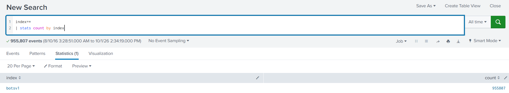

# Boss Of The SOC v1 Lab

# Context

Lab link: [https://cyberdefenders.org/blueteam-ctf-challenges/boss-of-the-soc-v1/](https://cyberdefenders.org/blueteam-ctf-challenges/boss-of-the-soc-v1/)

Suggested tools: Splunk

Tactics: Initial Access, Execution, Persistence, Privilege Escalation, Stealth, Credential Access, Command and Control, Impact

# Scenario

Scenario 1 (APT):

The focus of this hands on lab will be an APT scenario and a ransomware scenario. You assume the persona of Alice Bluebird, the soc analyst who has recently been hired to protect and defend Wayne Enterprises against various forms of cyberattack.

Today is Alice's first day at the Wayne Enterprises' Security Operations Center. Lucius sits Alice down and gives her first assignment: A memo from Gotham City Police Department (GCPD). Apparently GCPD has found [evidence online](http://pastebin.com/Gw6dWjS9) that the website www.imreallynotbatman.com hosted on Wayne Enterprises' IP address space has been compromised. The group has multiple objectives... but a key aspect of their modus operandi is to deface websites in order to embarrass their victim. Lucius has asked Alice to determine if www.imreallynotbatman.com. (the personal blog of Wayne Corporations CEO) was really compromised.

In this scenario, reports of the below graphic come in from your user community when they visit the Wayne Enterprises website, and some of the reports reference "P01s0n1vy." In case you are unaware, P01s0n1vy is an APT group that has targeted Wayne Enterprises. Your goal, as Alice, is to investigate the defacement, with an eye towards reconstructing the attack via the Lockheed Martin Kill Chain.


---

Scenario 2 (Ransomeware):

In the second scenario, one of your users is greeted by this image on a Windows desktop that is claiming that files on the system have been encrypted and payment must be made to get the files back. It appears that a machine has been infected with Cerber ransomware at Wayne Enterprises and your goal is to investigate the ransomware with an eye towards reconstructing the attack.





| Source | What it is | Likely scenario |
| --- | --- | --- |
| `stream:http`, `stream:dns`, `stream:tcp`, `stream:ip`, `stream:icmp` | Splunk Stream: network traffic decoded by protocol into searchable fields | Defacement (web traffic to and from the site) |
| `/var/log/suricata/eve.json` | Suricata IDS (intrusion detection system) alerts | Both |
| `C:\inetpub\logs\LogFiles\W3SVC1\u_ex160810.log` and `u_ex160824.log` | IIS web server access logs for 2016-08-10 and 2016-08-24 | Defacement |
| `udp:514` | Syslog sent over UDP, possibly from a firewall or network device | Both |
| `WinEventLog:Microsoft-Windows-Sysmon/Operational` | Sysmon logs of process, network and file activity | Mainly Cerber |
| `WinRegistry`, `WinEventLog:Security` / `System` / `Application` | Windows host logs | Mainly Cerber |
| `stream:smb` | Windows file-sharing traffic | Probably Cerber, since it can show encryption of network shares |
| `https://192.168.2.50:8834/scans/...` | Nessus vulnerability scan results (8834 is Nessus's default port) | Context |

# Questions

Q1- This is a simple question to get you familiar with submitting answers. What is the name of the company that makes the software that you are using for this competition? Just a six-letter word with no punctuation.

Answer: Splunk

Reason: This is a warm-up question with no event evidence and no timestamp. The lab environment runs on `Splunk`, the SIEM (Security Information and Event Management platform) used to search the `botsv1` dataset for both the P01s0n1vy defacement and Cerber ransomware scenarios.

Q2- Web Defacement: What content management system is `imreallynotbatman.com` likely using? (Please do not include punctuation such as . , ! ? in your answer. We are looking for alpha characters only.)

Answer: Joomla

Reason: The HTTP request headers to `imreallynotbatman.com` in `stream:http` show requests to Joomla-specific paths: 412 `GET` requests to the admin login `/joomla/administrator/index.php` (User-Agent `Python-urllib/2.7`) and 88 `POST` requests to the search component `/joomla/index.php/component/search/`. The `POST` requests carry `Acunetix-Product: WVS/10.0` headers, which identifies the client as the Acunetix Web Vulnerability Scanner.

```sql
index=* source="stream:http" "imreallynotbatman.com"
| table _time, src_headers
| stats count by src_headers

# Sample
src_headers	count
GET /joomla/administrator/index.php HTTP/1.1
Accept-Encoding: identity
Host: imreallynotbatman.com
Connection: close
User-Agent: Python-urllib/2.7
412

POST /joomla/index.php/component/search/ HTTP/1.1
Content-Length: 121
Content-Type: application/x-www-form-urlencoded
Referer: http://imreallynotbatman.com:80/
Cookie: ae72c62a4936b238523950a4f26f67d0=v7ikb3m59romokqmbiet3vphv3
Host: imreallynotbatman.com
Connection: Keep-alive
Accept-Encoding: gzip,deflate
User-Agent: Mozilla/5.0 (Windows NT 6.1; WOW64) AppleWebKit/537.21 (KHTML, like Gecko) Chrome/41.0.2228.0 Safari/537.21
Acunetix-Product: WVS/10.0 (Acunetix Web Vulnerability Scanner - Free Edition)
Acunetix-Scanning-agreement: Third Party Scanning PROHIBITED
Acunetix-User-agreement: http://www.acunetix.com/wvs/disc.htm
Accept: */*
88
```

Q3- Web Defacement: What is the likely IP address of someone from the Po1s0n1vy group scanning `imreallynotbatman.com` for web application vulnerabilities?

Answer: `40.80.148.42`

Reason: A keyword search for `scanner` in `stream:http` returns 20,000+ events against `imreallynotbatman.com`, all from `src_ip` `40.80.148.42`, from `2016-08-10 21:36:48 UTC` to at least `2016-08-10 22:22:27 UTC`. Every request carries `Acunetix-Product: WVS/10.0 (Acunetix Web Vulnerability Scanner - Free Edition)` headers and rotates through spoofed User-Agents (`Windows NT 6.1` Chrome, `iPhone OS 6_0` Safari). The server's `303` response at `22:22:26 UTC` shows a time-based SQL injection probe (`if(now()=sysdate(),sleep(3),0)`) in the `searchword` parameter of `/joomla/index.php/component/search/`. The server identifies as `Microsoft-IIS/8.5` with `X-Powered-By: PHP/5.5.38`. Its `Date: Wed, 10 Aug 2016 22:22:26 GMT` header matches the event `_time` .

```sql
index=* source="stream:http" "scanner"
| table _time, src_headers, src_ip

_time	src_headers	src_ip
2016-08-10 22:22:27.612	POST /joomla/index.php/component/search/ HTTP/1.1
Content-Length: 78
Content-Type: application/x-www-form-urlencoded
Referer: http://imreallynotbatman.com:80/
Cookie: ae72c62a4936b238523950a4f26f67d0=v7ikb3m59romokqmbiet3vphv3
Host: imreallynotbatman.com
Connection: Keep-alive
Accept-Encoding: gzip,deflate
User-Agent: Mozilla/5.0 (Windows NT 6.1; WOW64) AppleWebKit/537.21 (KHTML, like Gecko) Chrome/41.0.2228.0 Safari/537.21
Acunetix-Product: WVS/10.0 (Acunetix Web Vulnerability Scanner - Free Edition)
Acunetix-Scanning-agreement: Third Party Scanning PROHIBITED
Acunetix-User-agreement: http://www.acunetix.com/wvs/disc.htm
Accept: */*

40.80.148.42
2016-08-10 22:22:26.560	HTTP/1.1 303 See other
Content-Type: text/html; charset=UTF-8
Location: http://imreallynotbatman.com/joomla/index.php/component/search/?searchword=if(now()=sysdate(),sleep(3),0)/*'XOR(if(now()=sysdate(),sleep(3),0))OR'"XOR(if(now()=sysdate(),sleep(3),0))OR"*/&ordering=newest&searchphrase=all&areas[0]=categories
Server: Microsoft-IIS/8.5
X-Powered-By: PHP/5.5.38
Date: Wed, 10 Aug 2016 22:22:26 GMT
Content-Length: 385

40.80.148.42

[20,000+ more]

2016-08-10 21:36:48.122	GET / HTTP/1.1
User-Agent: Mozilla/5.0 (iPhone; CPU iPhone OS 6_0 like Mac OS X) AppleWebKit/536.26 (KHTML, like Gecko) Version/6.0 Mobile/10A5376e Safari/8536.25
Host: imreallynotbatman.com
Connection: Keep-alive
Accept-Encoding: gzip,deflate
Acunetix-Product: WVS/10.0 (Acunetix Web Vulnerability Scanner - Free Edition)
Acunetix-Scanning-agreement: Third Party Scanning PROHIBITED
Acunetix-User-agreement: http://www.acunetix.com/wvs/disc.htm
Accept: */*

40.80.148.42
2016-08-10 21:36:48.122	GET / HTTP/1.1
Acunetix-Aspect: enabled
Acunetix-Aspect-Password: 082119f75623eb7abd7bf357698ff66c
Host: imreallynotbatman.com
Connection: Keep-alive
Accept-Encoding: gzip,deflate
User-Agent: Mozilla/5.0 (Windows NT 6.1; WOW64) AppleWebKit/537.21 (KHTML, like Gecko) Chrome/41.0.2228.0 Safari/537.21
Acunetix-Product: WVS/10.0 (Acunetix Web Vulnerability Scanner - Free Edition)
Acunetix-Scanning-agreement: Third Party Scanning PROHIBITED
Acunetix-User-agreement: http://www.acunetix.com/wvs/disc.htm
Accept: */*

40.80.148.42
```

Q4- Web Defacement: What company created the web vulnerability scanner used by Po1s0n1vy? Type the company name. (For example, "Microsoft" or "Oracle")

Answer: Acunetix

Reason: The scan traffic from `40.80.148.42` identified in Q3 brands itself in every request: the `Acunetix-Product` header names the tool `WVS/10.0 (Acunetix Web Vulnerability Scanner - Free Edition)`, and the `Acunetix-User-agreement` header points to the vendor's own domain, `acunetix.com`.

Q5- Web Defacement: What IP address is likely attempting a brute force password attack against `imreallynotbatman.com`?

Answer: `23.22.63.114`

Reason: Filtering `stream:http` for `POST` request bodies containing `passwd`, with the Acunetix scanner `40.80.148.42` excluded, leaves 400+ Joomla admin login attempts from `src_ip` `23.22.63.114` between `2016-08-10 21:45:21 UTC` and `2016-08-10 21:46:51 UTC`. That is roughly 90 seconds. Each body targets `username=admin` through `option=com_login&task=login` with a different dictionary password (`12345678`, `letmein`, `qwerty`, `august`, `cool`, `sammy`, `rock`) and a fresh random token parameter. The `return=aW5kZXgucGhw` value is Base64 for `index.php`. The speed and the rotating wordlist point to an automated brute force tool.

```sql
index=* source="stream:http" src_content=* http_method=POST "passwd" NOT "40.80.148.42"
|table  _time, src_content, src_ip

_time	src_content	src_ip
2016-08-10 21:45:21.226	username=admin&task=login&return=aW5kZXgucGhw&option=com_login&passwd=12345678&9d873c2becd118318849d13cf18b60ff=1	23.22.63.114
2016-08-10 21:45:21.241	username=admin&863349a657c211fbfeb90ebe9427654c=1&task=login&return=aW5kZXgucGhw&option=com_login&passwd=letmein	23.22.63.114
2016-08-10 21:45:21.247	username=admin&task=login&return=aW5kZXgucGhw&option=com_login&passwd=qwerty&af4df60674155567dee0566f87045251=1	23.22.63.114

[400+]

2016-08-10 21:46:51.394	username=admin&task=login&return=aW5kZXgucGhw&option=com_login&passwd=rock&4a40c518220c1993f0e02dc4712c5794=1	23.22.63.114
2016-08-10 21:46:51.156	username=admin&task=login&return=aW5kZXgucGhw&option=com_login&passwd=sammy&0d3bb0020f70044ffba32f7d0fa7fa88=1	23.22.63.114
2016-08-10 21:46:51.154	username=admin&task=login&return=aW5kZXgucGhw&option=com_login&passwd=cool&a09349d0d6bdbf078ad72cf8e9348583=1	23.22.63.114
2016-08-10 21:46:50.873	username=admin&task=login&return=aW5kZXgucGhw&option=com_login&passwd=august&9800c58b682f234e562dee5972a58b8d=1	23.22.63.114

```

Q6- Web Defacement: What was the first brute force password used?

Answer: `12345678`

Reason: The earliest login attempt from `23.22.63.114` against the Joomla admin login was at `2016-08-10 21:45:21.226 UTC`. Its `POST` body submitted `username=admin` with `passwd=12345678`, and the next attempts tried `letmein` (`21:45:21.241`) and `qwerty` (`21:45:21.247`).

Q7- Web Defacement: What is the name of the executable uploaded by Po1s0n1vy? Please include the file extension. (For example, `notepad.exe` or `favicon.ico`)

Answer: `3791.exe`

Reason: `3791.exe` first appeared in `Sysmon` as a process creation event (`EventCode=1`) for `C:\inetpub\wwwroot\joomla\3791.exe` at `2016-08-10 21:56:18 UTC`, inside the Joomla web root. Sysmon shows the binary ran on the host but not how it arrived, so the analysis pivoted back to the network layer to find its delivery. Filtering `stream:http` for `POST` requests carrying a multipart upload filename (`part_filename{}=*`) returns a single upload event at `2016-08-10 21:52:47 UTC` to `dest_ip` `192.168.250.70`, uploading `3791.exe` and `agent.php` together. The upload came about 3.5 minutes before execution, and the same filename appears independently in both sources, which confirms the delivery path: HTTP upload to the web root, then execution on the host.

```sql
index=botsv1 source="stream:http" http_method=POST part_filename{}=*
| table _time, src_ip, dest_ip, uri, part_filename{}
| sort _time

_time	src_ip	dest_ip	uri	part_filename{}
2016-08-10 21:52:47.035	 	192.168.250.70	 	
3791.exe
agent.php
```

Q8- Web Defacement: What is the MD5 hash of the executable uploaded?

Answer: `AAE3F5A29935E6ABCC2C2754D12A9AF0`

Reason: The Sysmon process creation event (`EventCode=1`) for `C:\inetpub\wwwroot\joomla\3791.exe` at `2016-08-10 21:56:18 UTC` records the binary's hashes in its `Hashes` field: MD5 `AAE3F5A29935E6ABCC2C2754D12A9AF0`, SHA1 `65DF73D77324D008C83C3E57B445DF0FD43A3A51`, SHA256 `EC78C938D8453739CA2A370B9C275971EC46CAF6E479DE2B2D04E97CC47FA45D` and IMPHASH `481F47BBB2C9C21E108D65F52B04C448`. The file ran from the Joomla web root about 3.5 minutes after the HTTP upload at `21:52:47 UTC` found in Q7.

```sql
index=botsv1 Image="C:\\inetpub\\wwwroot\\joomla\\3791.exe" EventCode=1
| table _time, Hashes

_time	Hashes
2016-08-10 21:56:18	SHA1=65DF73D77324D008C83C3E57B445DF0FD43A3A51,MD5=AAE3F5A29935E6ABCC2C2754D12A9AF0,SHA256=EC78C938D8453739CA2A370B9C275971EC46CAF6E479DE2B2D04E97CC47FA45D,IMPHASH=481F47BBB2C9C21E108D65F52B04C448
```

Q9- Web Defacement: What was the correct password for admin access to the content management system running `imreallynotbatman.com`?

Answer: `batman`

Reason: Extracting `passwd` from `form_data` on `POST` requests to `/joomla/administrator/index.php` and keeping only passwords submitted more than once leaves a single value: `batman`, submitted twice. The first submission came from the brute-forcer `23.22.63.114` (User-Agent `Python-urllib/2.7`) at `2016-08-10 21:46:33 UTC`, inside the Q5 brute-force window. The second came from the scanner IP `40.80.148.42` at `2016-08-10 21:48:05 UTC`, 92 seconds later, with an Internet Explorer 11 User-Agent (`Trident/7.0; rv:11.0`). The automated tool found the password, and the same credential was then used manually from a browser on the second IP. That connects both IPs to one operation.

```sql
index=botsv1 sourcetype=stream:http dest_ip="192.168.250.70" http_method=POST uri_path="/joomla/administrator/index.php"
| rex field=form_data "passwd=(?<password>[^&]+)"
| stats count, values(src_ip) as src_ips, values(http_user_agent) as user_agents by password
| where count > 1

password	count	src_ips	user_agents
batman	2	
23.22.63.114
40.80.148.42
Mozilla/5.0 (Windows NT 6.1; WOW64; Trident/7.0; rv:11.0) like Gecko
Python-urllib/2.7

index=botsv1 sourcetype=stream:http dest_ip="192.168.250.70" http_method=POST uri_path="/joomla/administrator/index.php"
| rex field=form_data "passwd=(?<password>[^&]+)"
| search password="batman"
| table _time, src_ip, http_user_agent, password
| sort _time

_time	src_ip	http_user_agent	password
2016-08-10 21:46:33.689	23.22.63.114	Python-urllib/2.7	batman
2016-08-10 21:48:05.858	40.80.148.42	Mozilla/5.0 (Windows NT 6.1; WOW64; Trident/7.0; rv:11.0) like Gecko	batman
```

Q10- Web Defacement: What is the name of the file that defaced the `imreallynotbatman.com` website? Please submit only the name of the file with the extension (For example, "notepad.exe" or "favicon.ico").

Answer: `poisonivy-is-coming-for-you-batman.jpeg`

Reason: Earlier, `23.22.63.114` appeared only as a source, brute-forcing the Joomla admin login. Here it appears as a destination: an HTTP server answering requests. Filtering `stream:http` for `GET` requests with `dest_ip` `23.22.63.114` returns two downloads of `/poisonivy-is-coming-for-you-batman.jpeg` from the site `prankglassinebracket.jumpingcrab.com` on non-standard port `1337`, at `2016-08-10 22:06:21 UTC` and `2016-08-10 22:13:46 UTC`. Both were requested by `192.168.250.70`, the web server hosting `imreallynotbatman.com`. The compromised server itself pulled the defacement image from attacker infrastructure, and that infrastructure is the same IP that brute-forced the CMS.

```sql
index="botsv1" sourcetype="stream:http" http_method=GET dest_ip=23.22.63.114 
| table _time, http_method, uri, src_ip, dest_ip, site

_time	http_method	uri	src_ip	dest_ip	site
2016-08-10 22:13:46.915	GET	/poisonivy-is-coming-for-you-batman.jpeg	192.168.250.70	23.22.63.114	prankglassinebracket.jumpingcrab.com:1337
2016-08-10 22:06:21.569	GET	/poisonivy-is-coming-for-you-batman.jpeg	192.168.250.70	23.22.63.114	prankglassinebracket.jumpingcrab.com:1337
```

Q11- Web Defacement: This attack used dynamic DNS to resolve to the malicious IP. What is the fully qualified domain name (FQDN) associated with this attack?

Answer: `prankglassinebracket.jumpingcrab.com`

Reason: The Q10 defacement downloads went to `site` `prankglassinebracket.jumpingcrab.com:1337` on `23.22.63.114`. Searching `Sysmon` for that FQDN independently confirms it on the host side, with two manual lookups. At `2016-08-10 22:11:06 UTC`, `C:\Windows\SysWOW64\PING.EXE` ran with the malformed command line `ping <http://prankglassinebracket.jumpingcrab.com>:`, a URL prefix that `ping` cannot resolve. At `2016-08-10 22:11:30 UTC`, `C:\Windows\SysWOW64\nslookup.exe` ran `nslookup prankglassinebracket.jumpingcrab.com`. The broken `ping` syntax followed 24 seconds later by a corrected `nslookup` suggests hands-on-keyboard troubleshooting of name resolution.

```sql
index=botsv1 source="WinEventLog:Microsoft-Windows-Sysmon/Operational" "prankglassinebracket.jumpingcrab.com"
| table _time, CommandLine, Image

_time	CommandLine	Image
2016-08-10 22:11:30	nslookup  prankglassinebracket.jumpingcrab.com	C:\Windows\SysWOW64\nslookup.exe
2016-08-10 22:11:06	ping  http://prankglassinebracket.jumpingcrab.com:	C:\Windows\SysWOW64\PING.EXE
```

Q12- Web Defacement: What IP address has Po1s0n1vy tied to domains that are pre-staged to attack Wayne Enterprises?

Answer: `23.22.63.114`

Reason: In Splunk, `23.22.63.114` plays three roles in this intrusion. It is the brute-force source against the Joomla admin login (Q5, `2016-08-10 21:45:21` to `21:46:51 UTC`). It is the first submitter of the cracked password `batman` (Q9, `21:46:33 UTC`). And it is the HTTP server for the dynamic DNS FQDN `prankglassinebracket.jumpingcrab.com:1337`, which served the defacement image to `192.168.250.70` (Q10, `22:06:21` and `22:13:46 UTC`). The question's broader claim, that this IP is tied to other domains pre-staged against Wayne Enterprises, comes from passive DNS OSINT (ThreatCrowd per the lab brief) and is not observable in the `botsv1` index.

Q13- Web Defacement: Based on the data gathered from this attack and common open-source intelligence sources for domain names, what is the email address most likely associated with the Po1s0n1vy APT group?

Answer: `LILLIAN.ROSE@PO1S0N1VY.COM`

Reason: ThreatCrowd, which the lab brief names, has been retired and its data folded into AlienVault OTX, so this OSINT pivot used OTX outside the offline lab environment. Pivoting on the attack IP `23.22.63.114` (Q5, Q10, Q12) leads to the domain `wynecorpinc.com`, a typosquat of Wayne Corp. OTX passive DNS records it resolving to `23.22.63.114` (A record, first and last seen `2019-02-18`, `AS14618 amazon.com inc.`). Its WHOIS registration lists registrant email `LILLIAN.ROSE@PO1S0N1VY.COM`, name `LILLIAN ROSE` and org `TOXICODENDRON INC.`. The domain was created `2016-08-09T00:08:18`, one day before the `2016-08-10` attack, which fits the "pre-staged" framing in Q12. The `PO1S0N1VY.COM` email domain matches the group's own spelling.


Q14- Web Defacement: GCPD reported that common TTP (Tactics, Techniques, Procedures) for the Po1s0n1vy APT group, if initial compromise fails, is to send a spear-phishing email with custom malware attached to their intended target. This malware is usually connected to Po1s0n1vy's initial attack infrastructure. Using research techniques, provide the SHA256 hash of this malware.

Answer: `9709473ab351387aab9e816eff3910b9f28a7a70202e250ed46dba8f820f34a8`

Reason: This is an OSINT pivot done outside the offline lab. Pivoting on the attack IP `23.22.63.114` (Q5, Q10, Q12) leads to an ANY.RUN sandbox report. In it, process PID `796`, `9709473ab351387aab9e816eff3910b9f28a7a70202e250ed46dba8f820f34a8.exe`, connected to `23.22.63.114:80` (`Amazon.com, Inc.`, US). The sandbox names the sample after its own SHA256, so the process name is the malware's hash. Its callback to the same IP used for the brute force and the defacement image ties it to Po1s0n1vy's initial attack infrastructure.


Q15- Web Defacement: What is the special hex code associated with the customized malware discussed in the previous question? (Hint: It's not in Splunk)

Answer: `53 74 65 76 65 20 42 72 61 6e 74 27 73 20 42 65 61 72 64 20 69 73 20 61 20 70 6f 77 65 72 66 75 6c 20 74 68 69 6e 67 2e 20 46 69 6e 64 20 74 68 69 73 20 6d 65 73 73 61 67 65 20 61 6e 64 20 61 73 6b 20 68 69 6d 20 74 6f 20 62 75 79 20 79 6f 75 20 61 20 62 65 65 72 21 21 21`

Reason: This is an OSINT pivot done outside the offline lab. Looking up the Q14 SHA256 `9709473ab351387aab9e816eff3910b9f28a7a70202e250ed46dba8f820f34a8` on VirusTotal leads to its Community tab, where a comment posted by user `R00T_X` contains the hex string. The trailing text `Adham was here :)` is the commenter's own addition, not part of the code. Decoded as ASCII, the hex reads: `Steve Brant's Beard is a powerful thing. Find this message and ask him to buy you a beer!!!`. This is an Easter egg planted by the BOTS creators, not a functional malware indicator.


Q16- Web Defacement: One of Po1s0n1vy's staged domains has some disjointed "unique" Whois information. Concatenate the two codes together and submit them as a single answer.

Answer: `31 73 74 32 66 69 6E 64 67 65 74 73 66 72 65 65 62 65 65 72 66 72 6F 6D 72 79 61 6E 66 69 6E 64 68 69 6D 74 6F 67 65 74`

Reason: This is an OSINT pivot done outside the offline lab using WHOXY WHOIS history. The registrant contact for the staged domain carries the Q13 persona: `LILLIAN ROSE`, `TOXICODENDRON INC.`, `1 EDGE FORREST LANE`, `SPRINGFIELD`, `MO`, `65803`, `lillian.rose@po1s0n1vy.com`, `+1.7357647667`. The administrative contact repeats that persona except for two fields, which are replaced with hex: `company_name` `31 73 74 32 66 69 6E 64 67 65 74 73 66 72 65 65 62 65 65 72` and `mailing_address` `66 72 6F 6D 72 79 61 6E 66 69 6E 64 68 69 6D 74 6F 67 65 74`. Joined in that order and decoded as ASCII, they read `1st2findgetsfreebeerfromryanfindhimtoget`, a second BOTS Easter egg like the one in Q15.


Q17- Web Defacement: One of the passwords in the brute force attack is James Brodsky's favorite Coldplay song. Hint: we are looking for a six-character word on this one. Which is it?

Answer: `yellow`

Reason: Six-character Coldplay song titles (`Broken`, `Church`, `Clocks`, `Fly On`, `Oceans`, `Shiver`, `Sparks`, `Yellow`) were matched against passwords extracted from `form_data` in the Joomla admin brute force against `192.168.250.70`. Only `yellow` appears, submitted once by the Q5 brute-forcer `23.22.63.114` at `2016-08-10 21:45:30 UTC`, nine seconds into the brute-force window that began at `21:45:21 UTC`.

```sql
index=botsv1 sourcetype=stream:http dest_ip="192.168.250.70" http_method=POST uri_path="/joomla/administrator/index.php"
| rex field=form_data "passwd=(?<password>[^&]+)"
| where len(password)=6 AND lower(password) IN ("broken", "church", "clocks", "fly on", "oceans", "shiver", "sparks", "yellow")
| table _time, password, src_ip

_time	password	src_ip
2016-08-10 21:45:30.867	yellow	23.22.63.114
```


Q18- Web Defacement: What was the average password length used in the password brute-forcing attempt? (Round to a closest whole integer. For example "5" not "5.23213")

Answer: 6

Reason: The search was limited to the brute-forcer `23.22.63.114`, which leaves out the manual `batman` login from `40.80.148.42`. Across all `412` brute-force `POST` attempts against `/joomla/administrator/index.php`, the `passwd` values extracted from `form_data` average `6.174757281553398` characters, which rounds to `6`. The `412` attempts match the 400+ count seen in Q5, so `form_data` was populated on the events in scope.

```sql
index=botsv1 sourcetype=stream:http dest_ip="192.168.250.70" src_ip="23.22.63.114" http_method=POST uri_path="/joomla/administrator/index.php"
| rex field=form_data "passwd=(?<password>[^&]+)"
| eval pw_len=len(password)
| stats count as attempts, avg(pw_len) as avg_len
| eval avg_len_rounded=round(avg_len, 0)

attempts	avg_len	avg_len_rounded
412	6.174757281553398	6
```

Q19- Web Defacement: How many seconds elapsed between the brute force password scan identified the correct password and the compromised login? Round to 2 decimal places.

Answer: `92.17`

Reason: Exactly `2` events submitted `passwd=batman` to `/joomla/administrator/index.php`. The first was the brute-force hit from `23.22.63.114` at `2016-08-10 21:46:33.689 UTC`, and the second was the manual login from `40.80.148.42` at `2016-08-10 21:48:05.858 UTC` (Q9). `range(_time)` measures the gap between them as `92.169` seconds, which rounds to `92.17`.

```sql
index=botsv1 sourcetype=stream:http dest_ip="192.168.250.70" http_method=POST uri_path="/joomla/administrator/index.php"
| rex field=form_data "passwd=(?<password>[^&]+)"
| search password="batman"
| stats count, range(_time) as elapsed
| eval elapsed=round(elapsed, 2)

count	elapsed
2	92.17
```

Q20- Web Defacement: How many unique passwords were attempted in the brute force attempt?

Answer: `412`

Reason: From `23.22.63.114`, `412` `POST` attempts reached `/joomla/administrator/index.php` on `192.168.250.70`, and a distinct count over the `passwd` values extracted from `form_data` also returns `412`. Every attempt used a different password, so the tool never repeated an entry. This fits Q9, where `batman` appears only once from this IP; its second submission came from `40.80.148.42`.

```sql
index=botsv1 sourcetype=stream:http dest_ip="192.168.250.70" src_ip="23.22.63.114" http_method=POST uri_path="/joomla/administrator/index.php"
| rex field=form_data "passwd=(?<password>[^&]+)"
| stats count as attempts, dc(password) as unique_passwords

attempts	unique_passwords
412	412
```

Q21- Ransomware: What fully qualified domain name (FQDN) makes the Cerber ransomware attempt to direct the user to at the end of its encryption phase?

Answer: `cerberhhyed5frqa.xmfir0.win`

Reason: The Cerber ransom note lists six personal-page addresses under the subdomain `cerberhhyed5frqa` (five `.win` domains and one `.onion`). Filtering `stream:dns` from the infected host `192.168.250.100` for queries containing `cerber` returns a lookup of `cerberhhyed5frqa.xmfir0.win` at `2016-08-24 17:15:12 UTC`, sent to the resolver `192.168.250.20`. It matches entry 1 in the ransom note, `http://cerberhhyed5frqa.xmfir0.win/30EF-3C4E-A460-005E-93C9`. None of the other note domains appear in this search.

```sql
index=botsv1 source="stream:dns" src_ip="192.168.250.100" query{}="*cerber*"
| table _time, dest_ip, query{}
| sort -_time

_time	dest_ip	query{}
2016-08-24 17:15:12.668	192.168.250.20	
cerberhhyed5frqa.xmfir0.win
cerberhhyed5frqa.xmfir0.win
```

Q22- Ransomware: What was the most likely IP address of `we8105desk` on `24 AUG 2016`?

Answer: `192.168.250.100`

Reason: With the time range limited to `2016-08-24`, counting the Sysmon `SourceIp` values on host `we8105desk` shows `192.168.250.100` as the source of `47608` network events. The other values are not assigned host addresses: `192.168.250.255` is the subnet broadcast (`59`), `127.0.0.1` is loopback (`41`), `0.0.0.0` means unassigned (`38`), and `224.0.0.252` is the LLMNR multicast group (`4`). This is the same IP that issued the Cerber DNS lookup for `cerberhhyed5frqa.xmfir0.win` in Q21.

```sql
index=botsv1 SourceIp="*"  host=we8105desk 
| stats count by SourceIp

SourceIp	count
192.168.250.100	47608
192.168.250.255	59
127.0.0.1	41
0.0.0.0	38
224.0.0.252	4
```

Q23- Ransomware: Amongst the Suricata signatures that detected the Cerber malware, which one alerted the fewest number of times? Submit ONLY the signature ID value as the answer. (No punctuation, just 7 integers.)

Answer: 2816763

Reason: Counting Suricata alerts in `/var/log/suricata/eve.json` that mention `cerber`, grouped by `alert.signature_id`, returns three signatures. `2816763` (`ETPRO TROJAN Ransomware/Cerber Checkin 2`) fired once, and `2816764` and `2820156` fired twice each.

```sql
index=botsv1 source="/var/log/suricata/eve.json" "cerber"
| stats count by alert.signature_id

alert.signature_id	count
2816763	1
2816764	2
2820156	2

# ETPRO TROJAN Ransomware/Cerber Checkin 2
```

Q24- Ransomware: The VBScript found in question 25 launches 121214.tmp. What is the ParentProcessId of this initial launch?

Answer: `3968`

Reason: Sysmon process creation events (`EventCode=1`) on `we8105desk` link the full chain through both `ProcessId` and `ProcessGuid`. At `2016-08-24 16:48:21 UTC`, `C:\Windows\SysWOW64\wscript.exe` (PID `3968`, `{0F2D76F0-CEA9-57BD-0000-0010C8133100}`), running `C:\Users\bob.smith.WAYNECORPINC\AppData\Roaming\20429.vbs`, spawned `cmd.exe` (PID `1476`) with `/C START "" "C:\Users\bob.smith.WAYNECORPINC\AppData\Roaming\121214.tmp"`. That `cmd.exe` launched `121214.tmp` (PID `2948`) in the same second. At `16:48:29 UTC`, PID `2948` spawned a second `121214.tmp` (PID `3828`). At `16:48:41 UTC`, PID `3828` spawned `cmd.exe` (PID `1280`), which ran `taskkill /t /f /im "121214.tmp"` (PID `1684`), then `ping -n 1 127.0.0.1` as a short delay, then `del` against the `121214.tmp` file. The process deleted its own dropper file.

```sql
index=botsv1 source="WinEventLog:Microsoft-Windows-Sysmon/Operational" EventCode=1 host=we8105desk
    (CommandLine="*121214.tmp*" OR ParentImage="*\\wscript.exe")
| table _time, ProcessId, ProcessGuid, Image, CommandLine, ParentProcessId, ParentProcessGuid, ParentImage, ParentCommandLine
| sort _time

# wscript.exe (3968, 20429.vbs) -> cmd.exe (1476) -> 121214.tmp (2948) -> 121214.tmp (3828) -> cmd.exe (1280) -> taskkill.exe (1684)
```

| _time | ProcessId | ProcessGuid | Image | CommandLine | ParentProcessId | ParentProcessGuid | ParentImage | ParentCommandLine |
| --- | --- | --- | --- | --- | --- | --- | --- | --- |
| 2016-08-24 16:48:21 | 2948 | {0F2D76F0-CFD5-57BD-0000-00108BB43400} | `C:\Users\bob.smith.WAYNECORPINC\AppData\Roaming\121214.tmp` | "`C:\Users\bob.smith.WAYNECORPINC\AppData\Roaming\121214.tmp"` | 1476 | {0F2D76F0-CFD5-57BD-0000-0010E3AC3400} | `C:\Windows\SysWOW64\cmd.exe` | "`C:\Windows\System32\cmd.exe"` `/C` START "" "`C:\Users\bob.smith.WAYNECORPINC\AppData\Roaming\121214.tmp"` |
| 2016-08-24 16:48:21 | 1476 | {0F2D76F0-CFD5-57BD-0000-0010E3AC3400} | `C:\Windows\SysWOW64\cmd.exe` | "`C:\Windows\System32\cmd.exe"` `/C` START "" "`C:\Users\bob.smith.WAYNECORPINC\AppData\Roaming\121214.tmp"` | 3968 | {0F2D76F0-CEA9-57BD-0000-0010C8133100} | `C:\Windows\SysWOW64\wscript.exe` | "`C:\Windows\System32\WScript.exe"` "`C:\Users\bob.smith.WAYNECORPINC\AppData\Roaming\20429.vbs"` |
| 2016-08-24 16:48:29 | 3828 | {0F2D76F0-CFDD-57BD-0000-001069CF3400} | `C:\Users\bob.smith.WAYNECORPINC\AppData\Roaming\121214.tmp` | "`C:\Users\bob.smith.WAYNECORPINC\AppData\Roaming\121214.tmp"` | 2948 | {0F2D76F0-CFD5-57BD-0000-00108BB43400} | `C:\Users\bob.smith.WAYNECORPINC\AppData\Roaming\121214.tmp` | "`C:\Users\bob.smith.WAYNECORPINC\AppData\Roaming\121214.tmp"` |
| 2016-08-24 16:48:41 | 1684 | {0F2D76F0-CFE9-57BD-0000-0010D80F3500} | `C:\Windows\SysWOW64\taskkill.exe` | taskkill  `/t` `/f` `/im` "121214.tmp" | 1280 | {0F2D76F0-CFE9-57BD-0000-0010B7043500} | `C:\Windows\SysWOW64\cmd.exe` | `/d` `/c` taskkill `/t` `/f` `/im` "121214.tmp" > NUL & ping -n 1 `127.0.0.1` > NUL & del "`C:\Users\bob.smith.WAYNECORPINC\AppData\Roaming\121214.tmp"` > NUL |
| 2016-08-24 16:48:41 | 1280 | {0F2D76F0-CFE9-57BD-0000-0010B7043500} | `C:\Windows\SysWOW64\cmd.exe` | `/d` `/c` taskkill `/t` `/f` `/im` "121214.tmp" > NUL & ping -n 1 `127.0.0.1` > NUL & del "`C:\Users\bob.smith.WAYNECORPINC\AppData\Roaming\121214.tmp"` > NUL | 3828 | {0F2D76F0-CFDD-57BD-0000-001069CF3400} | `C:\Users\bob.smith.WAYNECORPINC\AppData\Roaming\121214.tmp` | "`C:\Users\bob.smith.WAYNECORPINC\AppData\Roaming\121214.tmp"` |

Q25- Ransomware: During the initial Cerber infection a VB script is run. The entire script from this execution, pre-pended by the name of the launching .exe, can be found in a field in Splunk. What is the length in characters of the value of this field?

Answer: 4490

Reason: Pivoting one level above `wscript.exe` (PID `3968`) through its `ParentProcessGuid` `{0F2D76F0-CEA9-57BD-0000-001037FE3000}` leads to `C:\Windows\SysWOW64\cmd.exe` (PID `3884`), created at `2016-08-24 16:43:21 UTC` by parent PID `3756` (`{0F2D76F0-CEA0-57BD-0000-00108D2B3000}`). Its `CommandLine` contains the whole VBScript inline. It starts with `cmd.exe /V /C set "GSI=%APPDATA%\%RANDOM%.vbs"`, which names the script file with a random number, producing `20429.vbs`. It then uses a `for %i in (...)` loop to write the script one line at a time, with mixed-case keywords (`DIm`, `FuNCtioN`, `WSCRiPt.sLEeP(11)`) and random variable names (`GNbiPp`, `Pt5SZ1`, `UJv`, `G4coQ`) as obfuscation. `len(CommandLine)` returns `4490`. This count is the field as Splunk stores it, including HTML-escaped characters such as `&amp;&amp;` and `&lt;&gt;`, and the platform accepted it in that form.

```sql
index=botsv1 source="WinEventLog:Microsoft-Windows-Sysmon/Operational" EventCode=1 host=we8105desk
    ProcessGuid="{0F2D76F0-CEA9-57BD-0000-0010C8133100}"
| table _time, ProcessId, Image, CommandLine, ParentProcessId, ParentProcessGuid, ParentImage

_time	ProcessId	Image	CommandLine	ParentProcessId	ParentProcessGuid	ParentImage
2016-08-24 16:43:21	3968	C:\Windows\SysWOW64\wscript.exe	"C:\Windows\System32\WScript.exe" "C:\Users\bob.smith.WAYNECORPINC\AppData\Roaming\20429.vbs"	3884	{0F2D76F0-CEA9-57BD-0000-001037FE3000}	C:\Windows\SysWOW64\cmd.exe

index=botsv1 source="WinEventLog:Microsoft-Windows-Sysmon/Operational" EventCode=1 host=we8105desk
    ProcessGuid="{0F2D76F0-CEA9-57BD-0000-001037FE3000}"
| eval cmd_len=len(CommandLine)
| table _time, ProcessId, Image, cmd_len, CommandLine, ParentProcessId, ParentProcessGuid, ParentImage
```


Q26- Ransomware: The malware downloads a file that contains the Cerber ransomware crypto code. What is the name of that file?

Answer: `mhtr.jpg`

Reason: Within the window between the VBScript launch (`16:43:21 UTC`, Q25) and the first execution of `121214.tmp` (`16:48:21 UTC`, Q24), the infected host `192.168.250.100` made a single HTTP request. At `2016-08-24 16:48:13 UTC` it sent `GET /mhtr.jpg` to `solidaritedeproximite.org` (`37.187.37.150`), eight seconds before `121214.tmp` first ran. The filename claims to be a JPEG, but the response `Content-Type` is `text/html; charset=utf-8`, which doesn't match the extension.

```sql
index=botsv1 sourcetype=stream:http src_ip="192.168.250.100"
    earliest="08/24/2016:16:43:00" latest="08/24/2016:16:49:00"
| table _time, dest_ip, site, http_method, uri, http_content_type, bytes_in
| sort _time

_time	dest_ip	site	http_method	uri	http_content_type	bytes_in
2016-08-24 16:48:13.285	37.187.37.150	solidaritedeproximite.org	GET	/mhtr.jpg	text/html; charset=utf-8	356
```

Q27- Ransomware: Now that you know the name of the ransomware's encryptor file, what obfuscation technique does it likely use?

Answer: Steganography

Reason: The Cerber payload was fetched as `mhtr.jpg` from `solidaritedeproximite.org` (`37.187.37.150`) at `2016-08-24 16:48:13 UTC` (Q26), eight seconds before the executable `121214.tmp` first ran at `16:48:21 UTC` (Q24). Delivering executable crypto code under an image filename points to steganography: hiding a payload inside, or disguised as, an image so that it passes network and file inspection as harmless media. This is an inference from the filename and the timing, as the question's "likely" wording allows. The image content itself wasn't inspected in Splunk.

Q28- Ransomware: What is the name of the USB key inserted by Bob Smith?

Answer: `MIRANDA_PRI`

Reason: The `WinRegistry` source on `we8105desk` records two `friendlyname` writes at `2016-08-24 16:42:17 UTC`, both with the value `MIRANDA_PRI`. One is under `HKLM\system\controlset001\enum\wpdbusenumroot\umb\...` and the other under `HKLM\software\microsoft\windows portable devices\devices\...`. Both paths name the same USB mass storage volume: `usbstor#disk&ven_generic&prod_flash_disk&rev_8.07`, instance `7d961196&0`. That is a generic flash disk, firmware revision `8.07`. The key was mounted about one minute before the infection's `cmd.exe` (PID `3884`) launched at `16:43:21 UTC` (Q25).

```sql
index=botsv1 source="WinRegistry" host=we8105desk "FriendlyName"
| table _time, registry_path, registry_value_name, registry_value_data
| sort _time

_time	registry_path	registry_value_name	registry_value_data
2016-08-24 16:42:17	HKLM\system\controlset001\enum\wpdbusenumroot\umb\2&37c186b&0&storage#volume#_??_usbstor#disk&ven_generic&prod_flash_disk&rev_8.07#7d961196&0#	friendlyname	MIRANDA_PRI
2016-08-24 16:42:17	HKLM\software\microsoft\windows portable devices\devices\wpdbusenumroot#umb#2&37c186b&0&storage#volume#_??_usbstor#disk&ven_generic&prod_flash_disk&rev_8.07#7d961196&0#	friendlyname	MIRANDA_PRI
```

Q29- Ransomware: Bob Smith's workstation (`we8105desk`) was connected to a file server during the ransomware outbreak. What is the IP address of the file server?

Answer: `192.168.250.20`

Reason: Counting `stream:smb` traffic from `we8105desk` (`192.168.250.100`) by destination shows `192.168.250.20` far ahead of the rest, with `39204` SMB events between `2016-08-10 21:54:25 UTC` and `2016-08-24 18:27:38 UTC`. That range covers the whole outbreak window, which began with the VBScript at `16:43:21 UTC` (Q25). The other destinations are not file servers. `192.168.250.255` (`76` events) is the subnet broadcast address. `192.168.2.50` (`24` events, `16:34:51` to `16:36:08 UTC`) is the Nessus scanner host seen in the lab's `https://192.168.2.50:8834/scans/...` sources. `192.168.250.20` is also the DNS resolver that answered the Cerber lookup in Q21, so the same server provides both name resolution and file sharing.

```sql
index=botsv1 sourcetype=stream:smb src_ip="192.168.250.100"
| stats count, earliest(_time) as first, latest(_time) as last by dest_ip
| convert ctime(first) ctime(last)
| sort -count

dest_ip	count	first	last
192.168.250.20	39204	08/10/2016 21:54:25.653658	08/24/2016 18:27:38.160471
192.168.250.255	76	08/24/2016 16:28:35.864895	08/24/2016 18:23:35.754066
192.168.2.50	24	08/24/2016 16:34:51.550444	08/24/2016 16:36:08.125515
```

Q30- Ransomware: How many distinct PDFs did the ransomware encrypt on the remote file server?

Answer: 257

Reason: On the file server `we9041srv` (`192.168.250.20`, Q29), share access events (`EventCode=5145`) for files ending in `.pdf` come from a single client, Bob's infected workstation `192.168.250.100`. That client generated `525` access events across `257` distinct `Relative_Target_Name` values, about two accesses per file. Counting distinct filenames rather than events gives the number of PDFs touched by the ransomware.

```sql
index=botsv1 host=we9041srv source="WinEventLog:Security" EventCode=5145 Relative_Target_Name="*.pdf"
| stats count as events, dc(Relative_Target_Name) as distinct_pdfs by Source_Address
| sort -distinct_pdfs

Source_Address	events	distinct_pdfs
192.168.250.100	525	    257
```

Q31- Ransomware: The Cerber ransomware encrypts files located in Bob Smith's Windows profile. How many .txt files does it encrypt?

Answer: 406

Reason: Sysmon file creation time changed events (`EventCode=2`) for `.txt` files under `C:\Users\bob.smith.WAYNECORPINC\` come from a single process: `C:\Users\bob.smith.WAYNECORPINC\AppData\Roaming\{35ACA89F-933F-6A5D-2776-A3589FB99832}\osk.exe` (PID `3588`). It touched `406` distinct `.txt` files in `406` events, one per file, between `2016-08-24 17:04:31 UTC` and `17:10:01 UTC`. That `osk.exe` was launched from the Roaming GUID folder by `121214.tmp` (PID `3828`) at `16:48:41 UTC` (Q24), so it is the Cerber encryptor rather than the legitimate Windows On-Screen Keyboard in `C:\Windows\System32`. Encryption ended about five minutes before the ransom-page lookup of `cerberhhyed5frqa.xmfir0.win` at `17:15:12 UTC` (Q21).

```sql
index=botsv1 source="WinEventLog:Microsoft-Windows-Sysmon/Operational" host=we8105desk EventCode=2 TargetFilename="C:\\Users\\bob.smith.WAYNECORPINC\\*.txt"
| stats count as events, dc(TargetFilename) as distinct_txt, earliest(_time) as first, latest(_time) as last by Image, ProcessId
| convert ctime(first) ctime(last)
| sort -distinct_txt

Image	ProcessId	events	distinct_txt	first	last
C:\Users\bob.smith.WAYNECORPINC\AppData\Roaming\{35ACA89F-933F-6A5D-2776-A3589FB99832}\osk.exe	3588	406	406	08/24/2016 17:04:31	08/24/2016 17:10:01
```

Q32- Ransomware: What was the first suspicious domain visited by we8105desk in 24AUG2016?

Answer: `solidaritedeproximite.org`

Reason: Taking the first-seen time of every DNS lookup from `we8105desk` (`192.168.250.100`) on `2016-08-24`, with Microsoft and local noise filtered out, leaves four domains. The earliest, `dns.msftncsi.com` at `16:34:39 UTC`, is the Windows Network Connectivity Status Indicator probe that Windows uses to check internet access, so it is benign. The first suspicious domain is `solidaritedeproximite.org`, first looked up at `2016-08-24 16:48:12 UTC`, one second before the `GET /mhtr.jpg` download from it at `16:48:13 UTC` (Q26). After it come `ipinfo.io` at `16:49:24 UTC`, a public IP lookup service, and the ransom-page domain `cerberhhyed5frqa.xmfir0.win` at `17:15:12 UTC` (Q21).

```sql
index=botsv1 source="stream:dns" src_ip="192.168.250.100" query{}="*.*"
    earliest="08/24/2016:00:00:00" latest="08/25/2016:00:00:00"
    NOT (query{}="*.arpa" OR query{}="*.microsoft.com" OR query{}="*.msn.com" OR query{}="*.windows.com" OR query{}="*.local" OR query{}="*.bing.com")
| stats earliest(_time) as first_seen, count by query{}
| sort first_seen
| convert ctime(first_seen)

query{}	first_seen	count
dns.msftncsi.com	08/24/2016 16:34:39.352644	4
solidaritedeproximite.org	08/24/2016 16:48:12.267033	2
ipinfo.io	08/24/2016 16:49:24.308332	2
cerberhhyed5frqa.xmfir0.win	08/24/2016 17:15:12.668498	2
```

# Attack Chain

| Time (UTC) | Stage | Detail | MITRE |
| --- | --- | --- | --- |
| `2016-08-09 00:08` | Resource Development | Typosquat `wynecorpinc[.]com` registered to `LILLIAN.ROSE@PO1S0N1VY[.]COM`, later seen resolving to `23[.]22[.]63[.]114` (OSINT, OTX WHOIS) | `T1583.001` |
| `2016-08-10 21:36` | Reconnaissance | Acunetix `WVS/10.0` scan of `imreallynotbatman[.]com` (Joomla on IIS 8.5) from `40[.]80[.]148[.]42`, including time-based SQLi probes | `T1595.002` |
| `2016-08-10 21:45` | Credential Access | `Python-urllib/2.7` brute force of Joomla `admin` from `23[.]22[.]63[.]114`, `412` unique passwords, first `12345678` | `T1110.001` |
| `2016-08-10 21:46` | Credential Access | Brute force submits the correct password `batman` at `21:46:33` | `T1110.001` |
| `2016-08-10 21:48` | Initial Access | Manual admin login with `batman` from `40[.]80[.]148[.]42` (IE11 User-Agent), `92.17` s after the crack | `T1078` |
| `2016-08-10 21:52` | C2 | `3791.exe` and `agent.php` uploaded via multipart HTTP `POST` to `192[.]168[.]250[.]70` | `T1105` |
| `2016-08-10 21:56` | Execution | `C:\inetpub\wwwroot\joomla\3791.exe` executed, MD5 `AAE3F5A29935E6ABCC2C2754D12A9AF0` | N/A |
| `2016-08-10 22:06` | C2 | Web server fetches `poisonivy-is-coming-for-you-batman.jpeg` from dynamic DNS host `prankglassinebracket[.]jumpingcrab[.]com:1337` (`23[.]22[.]63[.]114`) | `T1105`, `T1568` |
| `2016-08-10 22:11` | Discovery | Malformed `ping <http://prankglassinebracket>[.]jumpingcrab[.]com:` then `nslookup` of the same FQDN | `T1016.001` |
| `2016-08-10 22:13` | Impact | Second fetch of the defacement image by `192[.]168[.]250[.]70`; site defaced | `T1491.002` |
| `2016-08-24 16:42` | Initial Access | USB key `MIRANDA_PRI` (`ven_generic&prod_flash_disk`) mounted on `we8105desk`, about one minute before the infection chain; vector suspected, not confirmed | N/A |
| `2016-08-24 16:43` | Execution | `cmd.exe` (PID `3884`) writes a `4490`-character inline, case-obfuscated VBScript to `%APPDATA%\%RANDOM%.vbs` | `T1059.003`, `T1027` |
| `2016-08-24 16:43` | Execution | `wscript.exe` (PID `3968`) runs `C:\Users\bob.smith.WAYNECORPINC\AppData\Roaming\20429.vbs` | `T1059.005` |
| `2016-08-24 16:48` | C2 | DNS lookup of payload domain `solidaritedeproximite[.]org` at `16:48:12` | N/A |
| `2016-08-24 16:48` | C2 | `GET /mhtr.jpg` from `solidaritedeproximite[.]org` (`37[.]187[.]37[.]150`) at `16:48:13`, crypto payload disguised as an image | `T1105`, `T1027.003` |
| `2016-08-24 16:48` | Execution | `cmd.exe` (PID `1476`) runs `START` on `C:\Users\bob.smith.WAYNECORPINC\AppData\Roaming\121214.tmp` (PID `2948`) at `16:48:21` | `T1059.003` |
| `2016-08-24 16:48` | Execution | `121214.tmp` (PID `2948`) spawns a second `121214.tmp` (PID `3828`) at `16:48:29` | N/A |
| `2016-08-24 16:48` | Defense Evasion | PID `3828` launches `osk.exe` from `C:\Users\bob.smith.WAYNECORPINC\AppData\Roaming\{35ACA89F-933F-6A5D-2776-A3589FB99832}\` at `16:48:41`, mimicking the Windows On-Screen Keyboard | `T1036.005` |
| `2016-08-24 16:48` | Defense Evasion | `cmd.exe` (PID `1280`) runs `taskkill /t /f /im "121214.tmp"`, `ping -n 1 127.0.0.1`, `del` to remove the dropper at `16:48:41` | `T1070.004` |
| `2016-08-24 16:49` | Discovery | DNS lookup of public IP service `ipinfo[.]io` | `T1016` |
| `2016-08-24 17:04` | Impact | `osk.exe` (PID `3588`) encrypts `406` `.txt` files in Bob's profile, `17:04:31` to `17:10:01` | `T1486` |
| `2016-08-24 17:15` | Impact | DNS lookup of ransom page `cerberhhyed5frqa[.]xmfir0[.]win` after encryption ends | N/A |
| `2016-08-24` (time not measured) | Impact | `257` distinct PDFs on file server `we9041srv` (`192[.]168[.]250[.]20`) accessed over SMB by `192[.]168[.]250[.]100` (`525` EID `5145` events) | `T1486` |

## Attack Tree

```sql
[Scenario 1 - Web Defacement, 2016-08-10]
wynecorpinc[.]com registered 2016-08-09  ← pre-staged, LILLIAN.ROSE@PO1S0N1VY[.]COM (OSINT)
40[.]80[.]148[.]42 + 23[.]22[.]63[.]114  ← Po1s0n1vy → imreallynotbatman[.]com (192[.]168[.]250[.]70, IIS 8.5, PHP 5.5.38, Joomla)
    ├── [Stage 1 - Reconnaissance]
    │   └── Acunetix WVS/10.0 scan from 40[.]80[.]148[.]42  ← 21:36:48, time-based SQLi probes
    ├── [Stage 2 - Credential Access]
    │   └── Python-urllib/2.7 brute force from 23[.]22[.]63[.]114 → /joomla/administrator/index.php
    │       └── 412 unique passwords, avg length 6, hit "batman"  ← 21:46:33
    ├── [Stage 3 - Initial Access]
    │   └── manual login admin/batman from 40[.]80[.]148[.]42, IE11  ← 21:48:05, +92.17 s
    ├── [Stage 4 - Upload and Execution]
    │   └── HTTP POST upload: 3791.exe + agent.php  ← 21:52:47, uploader src_ip not captured
    │       └── C:\inetpub\wwwroot\joomla\3791.exe  ← 21:56:18, MD5 AAE3F5A29935E6ABCC2C2754D12A9AF0
    └── [Stage 5 - Impact]
        └── 192[.]168[.]250[.]70 → hxxp://prankglassinebracket[.]jumpingcrab[.]com:1337/poisonivy-is-coming-for-you-batman.jpeg
            ├── GET  ← 22:06:21
            ├── ping / nslookup of the FQDN  ← 22:11, hands-on troubleshooting
            └── GET  ← 22:13:46, site defaced

[Scenario 2 - Cerber Ransomware, 2016-08-24]
we8105desk (192[.]168[.]250[.]100), user bob.smith
    ├── [Stage 1 - Initial Access]
    │   └── USB key MIRANDA_PRI mounted  ← 16:42:17, suspected vector, not confirmed
    ├── [Stage 2 - Execution]
    │   └── parent PID 3756  ← image not confirmed
    │       └── cmd.exe (PID 3884)  ← 16:43:21, 4490-char inline VBScript
    │           └── wscript.exe (PID 3968) 20429.vbs
    │               └── cmd.exe (PID 1476) /C START 121214.tmp  ← 16:48:21
    │                   └── 121214.tmp (PID 2948)
    │                       └── 121214.tmp (PID 3828)  ← 16:48:29
    │                           ├── [Stage 3 - Defense Evasion]
    │                           │   ├── osk.exe from Roaming\{35ACA89F-933F-6A5D-2776-A3589FB99832}\  ← 16:48:41, masquerade
    │                           │   └── cmd.exe (PID 1280) → taskkill.exe (PID 1684) + ping + del  ← self-delete
    │                           └── [Stage 4 - Impact]
    │                               └── osk.exe (PID 3588)  ← encryptor, linked to the 16:48:41 launch by path match
    │                                   └── 406 .txt files encrypted in profile  ← 17:04:31 to 17:10:01
    └── [Network Activity - host-level, not attributed to a process]
        ├── solidaritedeproximite[.]org (37[.]187[.]37[.]150)  ← DNS 16:48:12
        │   └── GET hxxp://solidaritedeproximite[.]org/mhtr.jpg  ← 16:48:13, steganography
        ├── ipinfo[.]io  ← 16:49:24, public IP lookup
        ├── SMB → we9041srv (192[.]168[.]250[.]20)  ← 257 distinct PDFs
        └── cerberhhyed5frqa[.]xmfir0[.]win  ← 17:15:12, ransom page
```

# Artifacts

| Category | Type | Value |
| --- | --- | --- |
| Attacker Infrastructure | Scanner / manual login IP | `40[.]80[.]148[.]42` |
|  | Brute force / image host IP | `23[.]22[.]63[.]114` |
|  | Dynamic DNS FQDN | `prankglassinebracket[.]jumpingcrab[.]com` |
|  | Image server port | `1337` |
|  | Pre-staged typosquat (OSINT) | `wynecorpinc[.]com` (created `2016-08-09T00:08:18`) |
|  | Registrant email (OSINT) | `lillian.rose@po1s0n1vy[.]com` |
|  | Registrant name / org (OSINT) | `LILLIAN ROSE` / `TOXICODENDRON INC.` |
|  | Spear-phish malware SHA256 (OSINT) | `9709473ab351387aab9e816eff3910b9f28a7a70202e250ed46dba8f820f34a8` |
| Web Target | Site | `imreallynotbatman[.]com` |
|  | Server IP | `192[.]168[.]250[.]70` |
|  | Stack | `Microsoft-IIS/8.5`, `PHP/5.5.38`, Joomla |
|  | Admin login URI | `/joomla/administrator/index.php` |
| Reconnaissance | Scanner | `Acunetix WVS/10.0 (Free Edition)` |
|  | SQLi probe | `if(now()=sysdate(),sleep(3),0)` in `searchword` of `/joomla/index.php/component/search/` |
| Credential Attack | Brute force User-Agent | `Python-urllib/2.7` |
|  | Target account | `admin` |
|  | Attempts | `412` unique passwords, average length `6`, first `12345678` |
|  | Cracked password | `batman` |
|  | Manual login User-Agent | `Mozilla/5.0 (Windows NT 6.1; WOW64; Trident/7.0; rv:11.0) like Gecko` |
| Uploaded Files | Executable | `C:\inetpub\wwwroot\joomla\3791.exe` |
|  | MD5 | `AAE3F5A29935E6ABCC2C2754D12A9AF0` |
|  | SHA1 | `65DF73D77324D008C83C3E57B445DF0FD43A3A51` |
|  | SHA256 | `EC78C938D8453739CA2A370B9C275971EC46CAF6E479DE2B2D04E97CC47FA45D` |
|  | IMPHASH | `481F47BBB2C9C21E108D65F52B04C448` |
|  | Companion upload | `agent.php` |
| Defacement | Image | `poisonivy-is-coming-for-you-batman.jpeg` |
|  | URL | `hxxp://prankglassinebracket[.]jumpingcrab[.]com:1337/poisonivy-is-coming-for-you-batman.jpeg` |
| Victim Hosts | Workstation | `we8105desk` (`192[.]168[.]250[.]100`) |
|  | User profile | `C:\Users\bob.smith.WAYNECORPINC\` |
|  | File server | `we9041srv` (`192[.]168[.]250[.]20`), also DNS resolver |
| Removable Media | USB volume label | `MIRANDA_PRI` |
|  | Device ID | `usbstor#disk&ven_generic&prod_flash_disk&rev_8.07#7d961196&0#` |
| Execution Chain | Inline VBScript launcher | `cmd.exe /V /C set "GSI=%APPDATA%\%RANDOM%.vbs"` (PID `3884`, `4490` chars) |
|  | VBScript | `C:\Users\bob.smith.WAYNECORPINC\AppData\Roaming\20429.vbs` (run by `wscript.exe` PID `3968`) |
|  | Dropper | `C:\Users\bob.smith.WAYNECORPINC\AppData\Roaming\121214.tmp` (PIDs `2948`, `3828`) |
|  | Encryptor | `C:\Users\bob.smith.WAYNECORPINC\AppData\Roaming\{35ACA89F-933F-6A5D-2776-A3589FB99832}\osk.exe` (PID `3588`) |
|  | Self-delete command | `taskkill /t /f /im "121214.tmp" > NUL & ping -n 1 127[.]0[.]0[.]1 > NUL & del "...\121214.tmp"` |
| Delivery | Payload domain | `solidaritedeproximite[.]org` |
|  | Payload IP | `37[.]187[.]37[.]150` |
|  | Payload URL | `hxxp://solidaritedeproximite[.]org/mhtr.jpg` |
|  | Obfuscation | Steganography (crypto code disguised as `.jpg`, response `Content-Type: text/html`) |
| Network | Public IP lookup | `ipinfo[.]io` |
|  | Ransom page (resolved) | `cerberhhyed5frqa[.]xmfir0[.]win` |
|  | Ransom note mirrors | `cerberhhyed5frqa[.]gkfit9[.]win`, `cerberhhyed5frqa[.]305iot[.]win`, `cerberhhyed5frqa[.]dkrti5[.]win`, `cerberhhyed5frqa[.]cneo59[.]win`, `cerberhhyed5frqa[.]onion` |
|  | Victim ID | `30EF-3C4E-A460-005E-93C9` |
| Impact | Local files encrypted | `406` `.txt` files in Bob's profile (`17:04:31` to `17:10:01`) |
|  | Remote files encrypted | `257` distinct PDFs on `we9041srv` via SMB |
| Detection | Suricata SIDs | `2816763` (`ETPRO TROJAN Ransomware/Cerber Checkin 2`), `2816764`, `2820156` |

# Lab Insights

- **Empty results are not evidence of absence:** In this lab, several searches returned nothing for reasons that had nothing to do with the data: a multivalue field with a different name, placeholder text left in a copied query, and single quotes that SPL treats as literal characters. Each one looked exactly like a clean negative finding. Before a "nothing found" goes into a report, run a broad search that proves the data and the field names exist.
- **Count events or count things, never confuse the two:** Ransomware opens, rewrites and re-stamps the same file several times, so event volume overstates impact by roughly the number of touches per file. Putting `count` and `dc()` side by side in every aggregation exposes the gap immediately and turns a wrong submission into a sanity check. The question is always which unit the stakeholder means: actions, files or victims.
- **Host and network telemetry each tell half the story:** Endpoint logs proved that files executed and encrypted data, while wire data proved how payloads arrived and where they came from. Neither source alone could connect delivery to execution, but pivoting back and forth on filenames and timing closed the loop in both scenarios. A lead found in one layer is not confirmed until the other layer agrees.
- **Shared secrets collapse attacker separation:** The web compromise used separate infrastructure for scanning, brute forcing and hosting, which made it look like several unrelated actors. Reusing one cracked credential across two sources within minutes, and reusing an attack IP to serve the final payload, tied the whole operation together. Attackers compartmentalize tools far more easily than they compartmentalize what they've learned.
- **Location betrays a disguise better than the name does:** Both intrusions relied on things that looked harmless: an encryptor named after a built-in accessibility tool, a crypto payload named like a picture, and a dropper that deleted itself after handing off. Each one was given away by context, not by its name: a system binary running from a user's roaming folder, an image served with the wrong content type, a parent chain no legitimate program produces. Hunting on path, lineage and metadata mismatches is more durable than hunting on names.
- **Process command-line logging captures whole scripts:** The initial ransomware stage built its script inline on the command line, so the full obfuscated code was preserved in a single process creation field even though no file content was ever collected. Mixed-case keywords and random identifiers defeat simple string matching but survive intact in the log. Command-line auditing is among the highest-value and lowest-cost telemetry a defender can enable.
- **Timing suggests a story, but evidence has to prove it:** A removable drive appeared about a minute before the infection chain, which makes a compelling narrative but remains unproven until the parent process is identified. Keeping inferred links labelled as inferred, in the timeline as well as the tree, stops a plausible story from hardening into a reported fact. The strongest reports show clearly where evidence ends and interpretation begins.
- **OSINT is a moving target:** The threat intelligence platform named in the lab brief has since been retired, passive DNS observations post-date the incident by years, and the most useful clues were registration dates and planted WHOIS fields rather than live resolution. External intelligence should be timestamped at collection and weighed by how close its observation date is to the incident. Registration and history records age far better than current-state lookups.