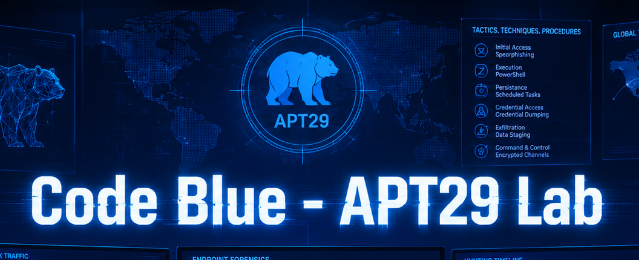
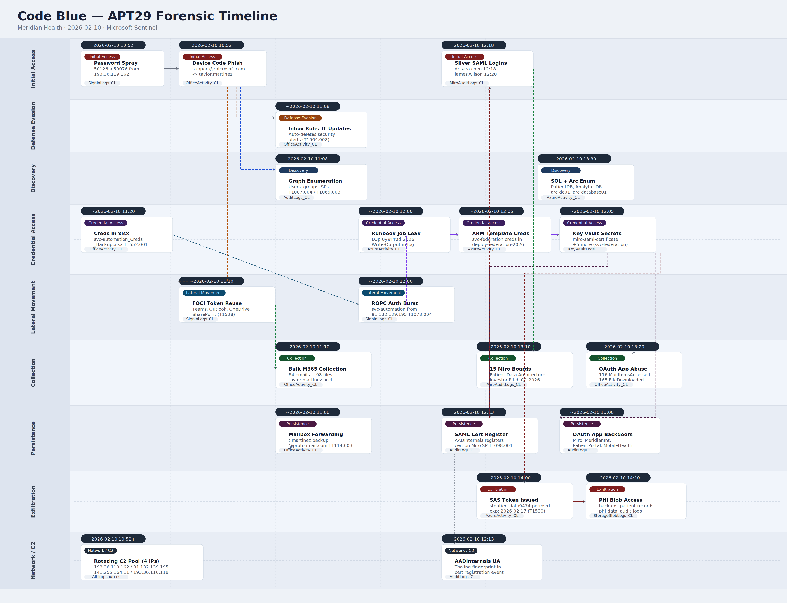

# Code Blue - APT29 Lab

<p align="center">
  
</p>

# Table of Contents
- [Context](#context)
- [Scenario](#scenario)
  * [Sentinel Tables](#sentinel-tables)
- [Initial Access](#initial-access)
- [Post Compromise Token Abuse and Initial Discovery](#post-compromise-token-abuse-and-initial-discovery)
  * [OAuth Token Families FOCI](#oauth-token-families-foci)
- [Mailbox Exploitation and Credential Discovery](#mailbox-exploitation-and-credential-discovery)
- [Privilege Escalation and Lateral Movement](#privilege-escalation-and-lateral-movement)
- [High-Value Asset Discovery](#high-value-asset-discovery)
- [Federation Compromise](#federation-compromise)
  * [Silver SAML Attack](#silver-saml-attack)
- [Data Exfiltration Collaboration Platform](#data-exfiltration-collaboration-platform)
- [Data Exfiltration Cloud and Hybrid Infrastructure](#data-exfiltration-cloud-and-hybrid-infrastructure)
- [Persistence Application Backdoors](#persistence-application-backdoors)
- [Threat Intelligence and Remediation](#threat-intelligence-and-remediation)
- [Attack Chain](#attack-chain)
  * [Text Tree](#text-tree)
- [Artifacts](#artifacts)
- [Lab Insights](#lab-insights)
- [Forensic Timeline](#forensic-timeline)

# Context

Lab link: [https://cyberdefenders.org/blueteam-ctf-challenges/code-blue-apt29/](https://cyberdefenders.org/blueteam-ctf-challenges/code-blue-apt29/)

Suggested tools: Entra ID Sign-in Logs, ,Entra ID Audit Logs, Azure Activity Logs, Office 365 Audit Logs, Azure Diagnostics Logs, Microsoft Sentinel, KQL Query Editor

Tactics: Initial Access, Persistence, Privilege Escalation, Defense Evasion, Credential Access, Discovery, Lateral Movement, Collection

# Scenario

On February 10, 2026, the Security Operations Center (SOC) at Meridian Health, a mid-sized healthcare organization managing outpatient clinics, diagnostic centers, and a small research division, received multiple security alerts indicating suspicious authentication activity.

Meridian Health recently modernized their IT infrastructure, migrating critical workloads to Microsoft Azure and adopting cloud-based collaboration tools including Microsoft 365 and Miro for their clinical research teams. As part of their digital transformation, they implemented federated authentication using SAML for single sign-on across their SaaS applications.

The incident began when the SOC detected multiple failed authentication attempts against a user account, followed by a successful login from an unfamiliar external IP address. Shortly after, suspicious OAuth consent activity and unauthorized access patterns were detected across Azure resources, Key Vault, and third-party applications.

Initial triage suggests the attacker leveraged the initial compromise to pivot through multiple accounts, access sensitive secrets, and potentially exfiltrate protected health information (PHI). The attack pattern indicates sophisticated techniques consistent with advanced persistent threat (APT) activity.

Your task is to investigate the full scope of this breach using Microsoft Sentinel. The available logs for this investigation include: `SignInLogs`, `AuditLogs`, `KeyVaultLogs`, `AzureActivity`, `StorageBlobLogs`, `MiroAuditLogs`, and `OfficeActivity`, trace the attacker's movements across Azure and connected applications, identify all compromised accounts, and document the techniques used throughout the attack chain.

## Sentinel Tables

**Sentinel Tables used in this lab:**

- **SignInLogs:** Native Entra ID table. Every authentication attempt against Azure AD — user, IP, app, device, MFA result, Conditional Access outcome, risk score. Primary source for tracing initial access and token abuse.
- **AuditLogs:** Native Entra ID table. Control-plane identity changes — OAuth consent grants, app registrations, role assignments, user creation/deletion, group modifications. Key for catching persistence and privilege escalation moves.
- **KeyVaultLogs:** Native Azure Diagnostics table (ingested under AzureDiagnostics with resource type Microsoft.KeyVault/vaults). Tracks every secret read, key unwrap, certificate access. The smoking gun for credential and secret theft post-compromise.
- **AzureActivity:** Native Azure table. Azure Resource Manager control plane — who created, modified, or deleted Azure resources, RBAC role assignments, subscription-level actions. Reveals lateral movement across Azure services.
- **StorageBlobLogs:** Native Azure Storage diagnostics table. Blob read/write/delete/list operations — caller IP, auth method, object path, bytes transferred. Primary exfiltration detection surface for PHI or data staged in Storage.
- **MiroAuditLogs:** Not a native Azure or Sentinel table. Miro is a third-party SaaS (digital whiteboard). This is custom-ingested — typically via a Logic App, API connector, or custom DCR. Treat query results with slightly more scrutiny; schema and fidelity depend on how the connector was built.
- **OfficeActivity:** Native M365 table (via the Microsoft 365 connector). SharePoint, Exchange, OneDrive, Teams activity — file access, sharing events, email sends, downloads. Critical for tracking PHI access and exfil through M365 services.

| Table | Native Sentinel? |
| --- | --- |
| SignInLogs | Yes — Entra ID |
| AuditLogs | Yes — Entra ID |
| KeyVaultLogs | Yes — Azure Diagnostics |
| AzureActivity | Yes — Azure ARM |
| StorageBlobLogs | Yes — Azure Storage |
| MiroAuditLogs | No — custom/third-party |
| OfficeActivity | Yes — M365 connector |

*Note: timestamps in this writeup may appear inconsistent (e.g. `TimeGenerated` vs `ActivityDateTime` showing different dates) due to lab instance regeneration between sessions due to the massive lab size which cannot be realistically done in a single session, but relative sequencing/ordering of events remains accurate.*

# Initial Access

**Q1**- The attack begins with a password spray targeting Taylor. As the authentication attempts progressed, different error codes were returned. What were the observed error codes, in chronological order?

Answer: `50126`, `50076`

Reason: All spray attempts originated from `193.36.119.162` (Moscow, RU) targeting `taylor.martinez@meridianhealth.org`. The error code progression reveals two distinct phases:

- `50126`: "Invalid username or password" — attacker cycling through passwords; credential not yet correct
- `50076`: "MFA required due to policy/location change" — password accepted; Microsoft Entra ID (formerly Azure Active Directory) halted the attempt at the Multi-Factor Authentication (MFA) gate

The transition from `50126` to `50076` marks the exact moment the correct password was identified. Codes `50078`, `50173`, and `50140` were excluded as they originated from `72.43.131.24` (Denver, CO), Taylor's legitimate concurrent session, and represent normal token expiry and browser flow interrupts, not attacker activity. MITRE ATT&CK: T1110.003 — Brute Force: Password Spraying.

The `50126` to `50076` error code transition is a reliable spray success indicator in Entra ID logs. The attacker holds valid credentials but is blocked by MFA, setting up the next phase of the attack. This credential confirmation without full authentication access is consistent with a precursor to adversary-in-the-middle (AiTM) phishing or MFA fatigue techniques (T1621), where the threat actor attempts to bypass the MFA gate using session token theft or repeated push notification abuse.

```sql
SignInLogs_CL
| search "Taylor"
| where isnotempty(SignInErrorCode)
| project TimeGenerated, User, IPaddress, Location, SignInErrorCode, Failurereason
| sort by TimeGenerated asc
```


**Q2**- The password spray eventually found the correct password, but the attacker couldn't complete authentication due to MFA. The attacker then proceeded with a phishing attack. Attackers often use typosquatting to create convincing phishing domains that closely resemble legitimate ones. What is the sender domain used in the phishing email?

Answer: `rnicrosoft.com`

Reason: With Taylor's password confirmed but MFA blocking full authentication, the attacker pivoted to phishing. Querying `OfficeActivity_CL` for messages received by `taylor.martinez@meridianhealth.org` and filtering on the known attacker IP `193.36.119.162` surfaced a single inbound email delivered. The `SenderAddress` field revealed `support@rnicrosoft[.]com`, with the sender organization recorded as `rnicrosoft.onmicrosoft[.]com`, a threat-actor-controlled tenant registered to impersonate Microsoft.

The domain is a classic typosquat: substituting the letter `m` with the visually identical digraph `rn`, making `rnicrosoft` appear as `microsoft` at a glance, especially in mobile email clients with small fonts. The subject line "Action required: Verify your Microsoft 365 subscription" is a high-urgency lure designed to prompt Taylor to interact with a malicious link, consistent with APT29's known use of device code phishing flows where the victim is directed to authenticate on a legitimate Microsoft page while the attacker captures the resulting OAuth token.

The presence of the attacker's IP in the Exchange `ClientIP` field directly links email delivery to the same infrastructure used in the password spray, confirming this is a single coordinated operation.

```sql
OfficeActivity_CL
| where Operations contains "MessageReceived" and UserIds contains "taylor.martinez@meridianhealth.org"
| search "193.36.119.162"
```

```json
{
  "CreationTime": "2026-02-10T10:52:00",
  "Id": "076145f7-f789-4904-a7ad-ed1755c25ca2",
  "Operation": "MessageReceived",
  "OrganizationId": "a7b2c91d-8d4e-4f23-b156-9e8c7a6d5f42",
  "RecordType": 2,
  "ResultStatus": "Succeeded",
  "Workload": "Exchange",
  "UserId": "taylor.martinez@meridianhealth.org",
  "ExternalAccess": true,
  "ClientIP": "193.36.119.162",
  "SenderAddress": "support@rnicrosoft.com",
  "SenderOrganization": "rnicrosoft.onmicrosoft.com",
  "RecipientAddress": "taylor.martinez@meridianhealth.org",
  "Item": {
    "From": "support@rnicrosoft.com",
    "Subject": "Action required: Verify your Microsoft 365 subscription",
    "Id": "AAMkAGef5dced2b29842929439",
    "InternetMessageId": "<fb49fb5b-15cc-4cd5-aef1-41efe4d7319a@rnicrosoft.onmicrosoft.com>",
    "ParentFolder": {
      "Path": "\\Inbox"
    },
    "SizeInBytes": 15234
  },
  "MailboxOwnerUPN": "taylor.martinez@meridianhealth.org",
  "OrganizationName": "meridianhealth.onmicrosoft.com"
}
```

**Q3**- Threat intelligence often relies on geographic attribution. What is the country associated with the attacker's first IP address, according to the logs?

Answer: Russia

Reason: Entra ID sign-in logs recorded the geolocation of `193.36.119.162` as Russia at the time of the password spray. Microsoft's logging pipeline snapshots geolocation at event ingestion time using its own internal GeoIP database, making the logged value the authoritative attribution for this investigation.

A live lookup of the same IP on `ipinfo.io` returns Hong Kong, a discrepancy explained by GeoIP drift: IP blocks are routinely reassigned between registrants across regional internet registries (RIPE, APNIC, ARIN), and Border Gateway Protocol (BGP) route origin announcements change over time. A current lookup reflects where the block is registered today, not where it was routed in February 2026.

For Digital Forensics and Incident Response (DFIR) purposes, the log's recorded value always takes precedence over a retrospective live lookup. Additionally, APT29 is known to operate through bulletproof hosting providers and multi-hop relay infrastructure (T1090.003), meaning the registered country of an IP may not reflect the actor's true physical origin regardless. It is one data point, not a definitive attribution anchor. The Russia geolocation aligns with known APT29 infrastructure patterns and is consistent with the broader Tactics, Techniques, and Procedures (TTPs) observed across this intrusion.

MITRE ATT&CK: T1590.005 — Gather Victim Network Information: IP Addresses

**Q4**- What is the name of the phishing technique the attacker used to bypass MFA and gain access?

Answer: Device Code Phishing

Reason: With Taylor's password confirmed but MFA blocking direct authentication, the attacker leveraged the OAuth 2.0 Device Authorization Grant flow, a legitimate Microsoft mechanism designed for input-constrained devices (smart TVs, command-line interfaces, Internet of Things (IoT) devices) that cannot complete a browser-based login themselves.

The attack works in three phases. First, the attacker calls Microsoft's device authorization endpoint to generate a paired `user_code` and `device_code`. Second, the phishing email delivers the `user_code` and a link to the legitimate `microsoft[.]com/devicelogin` page. The lure ("Action required: Verify your Microsoft 365 subscription") pressures Taylor into entering the code and completing authentication herself, including satisfying MFA, on a domain she has no reason to distrust. Third, while Taylor authenticates, the attacker polls Microsoft's token endpoint with the `device_code` and receives a fully valid OAuth access token and refresh token the moment she consents.

MFA is never bypassed in a technical sense. The victim completes it on Microsoft's own infrastructure, and the attacker receives the resulting token out-of-band. No adversary-in-the-middle (AiTM) proxy is required, leaving minimal network-layer detection surface.

IP-mismatch detection is not implemented by design: the device code flow explicitly assumes the requesting device and the authorizing device have different IPs, which is the legitimate use case (a TV authorized from a phone, for example). APT29 exploits this intentional design boundary. Mitigations include disabling the device code flow via Conditional Access for users who do not require it, a control Meridian Health had not applied. MITRE ATT&CK: T1528 — Steal Application Access Token.

**Q5**- This phishing technique is particularly dangerous because it uses legitimate Microsoft login pages. However, it has a built-in time limitation. What is the default lifetime (in minutes) before the authentication code expires?

Answer: 15

Reason: The OAuth 2.0 Device Authorization Grant specification sets a default code expiry of 15 minutes. After generation, the attacker must deliver the phishing email and have the victim authenticate before this window closes, creating operational pressure on both sides. Microsoft's implementation honors this default. If the victim does not act in time, the attacker must restart the flow and generate a fresh code pair, which produces a new authentication request event visible in logs. The 15-minute window is short enough to limit exposure but long enough that a well-timed, high-urgency lure email (as used here) reliably catches victims within the window.

**Q6**- What Entra ID Conditional Access policy setting can block this type of authentication flow?

Answer: Device code flow

Reason: Microsoft Entra ID Conditional Access policies include a grant control specifically targeting the OAuth 2.0 Device Authorization Grant. Administrators can create a policy that blocks the device code flow authentication method entirely for users or groups who have no legitimate need for it, specifically users who do not authenticate from input-constrained devices like command-line interfaces or smart TVs.

When this control is applied, any attempt to initiate the device code flow for an in-scope user is denied at the policy evaluation stage before a token is ever issued, eliminating the attack surface APT29 exploited here. Meridian Health's failure to apply this restriction to end-user accounts like Taylor's is the architectural gap that made the attack possible.

# Post Compromise Token Abuse and Initial Discovery

**Q7**- After the initial compromise, the attacker abused OAuth token families (FOCI) to access multiple applications without re-authentication. Excluding the initial phishing application, how many additional applications did the attacker access using this method?

Answer: 4

Reason: After the attacker obtained a refresh token for the Microsoft Office client (`d3590ed6-52b3-4102-aeff-aad2292ab01c`) via device-code phishing (MITRE T1566, T1111), sign-in logs from the attacker IP `193.36.119.162` show successful authentications to four other applications: Microsoft Teams, Microsoft Outlook, OneDrive, and SharePoint. All four were silently obtained without re-prompting the user for credentials or Multi-Factor Authentication (MFA).

Filtering out the source application and any sign-ins where `ApplicationID == ResourceID` (direct portal or browser access, not token-based pivots) leaves four `ApplicationID` values, each matching a known entry on Microsoft's Family of Client IDs (FOCI) list (undocumented but compiled by the community). This confirms the attacker exchanged the stolen Office refresh token for access tokens scoped to each of these family-member apps.

| Application | ApplicationID | FOCI Family Member |
| --- | --- | --- |
| Microsoft Teams | `1fec8e78-bce4-4aaf-ab1b-5451cc387264` | yes |
| Microsoft Outlook | `27922004-5251-4030-b22d-91ecd9a37ea4` | yes |
| OneDrive | `b26aadf8-566f-4478-926f-589f601d9c74` | yes |
| SharePoint | `1b730954-1685-4b74-9bfd-dac224a7b894` | yes |
| Microsoft Graph Explorer | `de8bc8b5-d9f9-48b1-a8ad-b748da725064` | Not on the list |

```sql
SignInLogs_CL
| where IPaddress == "193.36.119.162"
| where User contains "Taylor"
| where Status == "Success"
| where ApplicationID != "d3590ed6-52b3-4102-aeff-aad2292ab01c" # App not on FOCI list
| where ApplicationID != ResourceID # Direct portal or browser access
| summarize by Application, ApplicationID
```

## OAuth Token Families FOCI

**FOCI** stands for **Family of Client IDs** — a Microsoft-specific OAuth implementation that lets multiple first-party Microsoft applications share refresh tokens. Normally, an OAuth refresh token is bound to the specific client app that requested it. FOCI breaks that rule: a refresh token issued to one Microsoft app (say, Microsoft Teams) can be used by *another* Microsoft app (say, Microsoft Outlook) to obtain a new access token — without re-authenticating. Microsoft groups trusted first-party apps into a "family." Any member of that family can redeem a family refresh token.

**Why It Exists**

Microsoft's rationale is UX-driven: if you sign into one Microsoft 365 app, you shouldn't have to re-authenticate in every other M365 app. FOCI makes SSO seamless across the suite (Teams, Outlook, OneDrive, Office, Azure CLI, etc.). It's a classic case of Microsoft trading security surface area for UX convenience across their app ecosystem.

**The Token Flow**

```
User authenticates → Azure AD issues:
  ├── Access Token  (short-lived, ~1hr, app-specific)
  └── Refresh Token (long-lived, flagged as "family member")
                          ↓
Result -> ANY family member client can present this refresh token to get NEW access tokens for THEIR own scopes/resource
```

**Why This Matters Offensively**

FOCI is a significant post-exploitation primitive. **If you can steal a single refresh token from *any* FOCI-member app, you can pivot to *any other* family member app's API scope** — effectively multiplying one token into broad M365 access.

**Common abuse scenario:**

1. Phish or extract a refresh token from a victim's machine (e.g., from Teams' token cache at `~/.config/Microsoft/...` or Windows DPAPI-protected blobs)
2. Use a tool like **`TokenTactics**` or **`roadtools**` to redeem that token as a different FOCI client
3. Access Mail, SharePoint, OneDrive, Azure CLI — all without triggering new MFA prompts

**Notable FOCI-member clients include:**

| Client | Client ID |
| --- | --- |
| Microsoft Office | `d3590ed6-...` |
| Azure CLI | `04b07795-...` |
| Teams | `1fec8e78-...` |
| OneDrive Sync | `ab9b8c07-...` |
| Outlook Mobile | `27922004-...` |

**Defensive Considerations**

- **Token theft detection** is hard — token use from an unexpected client or geography is a signal, but FOCI tokens look like legitimate app usage
- **CAE (Continuous Access Evaluation)** can revoke tokens faster when risk is detected
- **Conditional Access policies** scoped per-application reduce blast radius
- Monitor for refresh token redemptions across *multiple different client IDs* from the same token lineage — that's a FOCI abuse tell

**Q8**- What is the `CorrelationId` of the first directory enumeration activity performed by the attacker?

Answer: `e60ef323-cc98-3fb1-a8da-fb7097909857`

Reason: The attacker used Graph Explorer (consistent with the non-FOCI `de8bc8b5` application identified previously) to enumerate the tenant directory via Microsoft Graph API (MITRE T1087.004), generating a sequence of "`Read`" activities in `AuditLogs_CL`: reading directory data, then enumerating all users, groups, and service principals.

The earliest of these, "Read directory data" at `2026-02-10T11:08:30.123Z`, carries `CorrelationId` `e60ef323-cc98-3fb1-a8da-fb7097909857`, marking the start of the attacker's reconnaissance phase against the tenant directory.

```sql
AuditLogs_CL
| where Activity contains "Read"
| where IPAddress == "193.36.119.162"
| sort by ActivityDateTime_t asc
```


# Mailbox Exploitation and Credential Discovery

**Q9**- The attacker configured email forwarding on the compromised mailbox for persistent access. To what external email address were the emails forwarded?

Answer: `t.martinez.backup@protonmail.com`

Reason: To establish persistent access to Taylor's mailbox independent of the original session, the attacker executed a `Set-Mailbox` cmdlet from `193.36.119.162`, configuring the `ForwardingSmtpAddress` parameter to silently forward all mail to an external attacker-controlled address (MITRE T1114.003). This ensures continued visibility into the victim's inbox even if credentials are reset or the FOCI tokens are revoked.

```sql
OfficeActivity_CL
| where Operations contains "Set-Mailbox"
| where UserIds contains "taylor"
```


**Q10**- What is the name of the malicious inbox rule created by the attacker to hide security alerts and notifications?

Answer: `IT Updates`

Reason: To prevent the victim from noticing the compromise, the attacker created a `New-InboxRule` named `IT Updates` from `193.36.119.162`, configured to match incoming messages containing keywords like "security alert," "unusual sign-in," "suspicious activity," and "password reset," then automatically delete them (`DeleteMessage: True`) and stop further rule processing (MITRE T1564.008). This silently suppresses security notifications from Microsoft and the victim's organization, blinding Taylor to any alerts generated by the preceding reconnaissance and persistence activity.

```sql
OfficeActivity_CL
| where Operations contains "New-InboxRule"
| where UserIds contains "taylor"
```

```json
{
    "CreationTime": "2026-02-10T11:28:00",
    "Id": "c47ad7cf-dc1a-34dd-b2d0-e712e1407ec2",
    "Operation": "New-InboxRule",
    "OrganizationId": "a7b2c91d-8d4e-4f23-b156-9e8c7a6d5f42",
    "RecordType": 1,
    "ResultStatus": "Succeeded",
    "Workload": "Exchange",
    "ClientIP": "193.36.119.162",
    "UserId": "taylor.martinez@meridianhealth.org",
    "Parameters": [
        {
            "Name": "Name",
            "Value": "IT Updates"
        },
        {
            "Name": "SubjectContainsWords",
            "Value": "security alert;unusual sign-in;suspicious activity;password reset;unauthorized access"
        },
        {
            "Name": "DeleteMessage",
            "Value": "True"
        },
        {
            "Name": "StopProcessingRules",
            "Value": "True"
        }
    ]
}
```

**Q11**- During the initial reconnaissance within the user's account, how many emails were accessed and how many files were downloaded?

Answer: 64, 98

Reason: Following the establishment of mailbox persistence, the attacker conducted bulk reconnaissance against Taylor's account from `193.36.119.162`, accessing 64 emails (`MailItemsAccessed`) and downloading 98 files (`FileDownloaded`) from OneDrive and SharePoint. This is consistent with a collection phase (MITRE T1114.002, T1039) aimed at harvesting sensitive correspondence and documents, later relevant to the Protected Health Information (PHI) exfiltration stage of this scenario.

Note: the `ClientIP` field is nested inside the raw `AuditData` JSON blob rather than promoted to a top-level column, requiring an explicit `parse_json` extraction before filtering.

```sql
OfficeActivity_CL
| extend ClientIP_ = tostring(parse_json(AuditData).ClientIP)
| where UserIds contains "taylor.martinez"
| where Operations contains "MailItemsAccessed"
| where ClientIP_ contains "193.36.119.162"
| count

OfficeActivity_CL
| extend ClientIP_ = tostring(parse_json(AuditData).ClientIP)
| where UserIds contains "taylor.martinez"
| where Operations contains "FileDownloaded"
| where ClientIP_ contains "193.36.119.162"
| count
```

**Q12**- While searching through the victim's emails and files, the attacker discovered an Excel file containing credentials for a service account. What is the UPN of this first compromised service account?

Answer: `svc-automation@meridianhealth.org`

Reason: The attacker, after compromising Taylor Martinez's mailbox and OneDrive, located a file named `svc-automation_Credentials_Backup.xlsx` in her personal SharePoint and OneDrive storage and downloaded it from staging IP `193.36.119.162` (MITRE T1552.001). This exposed credentials for the service account `svc-automation@meridianhealth[.]org`, giving the attacker their first foothold into a non-human, automation-privileged identity and significantly expanding the potential attack surface beyond the initially compromised user account.

Note: both `ClientIP` and `SourceFileName` are nested within the raw `AuditData` JSON blob, requiring explicit `parse_json` extraction before filtering on either field.

```sql
OfficeActivity_CL
| extend ClientIP_ = tostring(parse_json(AuditData).ClientIP)
| extend SourceFileName_ = tostring(parse_json(AuditData).SourceFileName)
| where UserIds contains "taylor.martinez"
| where Operations contains "FileDownloaded"
| where ClientIP_ contains "193.36.119.162"
| where SourceFileName_ contains "svc"
```


# Privilege Escalation and Lateral Movement

**Q13**- After noticing suspicious activity, the victim attempted to secure their account. At what time (`ActivityDateTime`) did the victim change their password?

Answer: `2026-02-10 11:48`

Reason: Taylor Martinez, recognizing the compromise (likely after noticing missing security alert emails or unexpected sign-ins), self-initiated a password change from her legitimate IP `72.43.131.24` at `2026-02-10 11:48:23 UTC`, marking the start of victim-side containment. However, by this point the attacker had already established mailbox forwarding via `ForwardingSmtpAddress` and the `IT Updates` inbox rule, meaning the password reset alone would not fully evict them. The FOCI tokens already issued would also remain valid until explicitly revoked, preserving the attacker's session-level access independent of the credential change.

This event is a defender action rather than an attacker technique and carries no MITRE ATT&CK mapping, but it serves as a critical incident timeline anchor, representing the threshold between the attacker's unchecked access window and the point at which persistence mechanisms become their primary means of maintaining visibility into the victim's account.

```sql
AuditLogs_CL
| where Activity contains "Change user password"
| where ActorUserPrincipalName contains "taylor.martinez"
```

```json
[
    {
        "TimeGenerated [UTC]": "6/10/2026, 5:04:38.398 PM",
        "Activity": "Change user password",
        "ActivityDateTime [UTC]": "2/10/2026, 11:48:23.456 AM",
        "ActorType": "User",
        "ActorUserPrincipalName": "taylor.martinez@meridianhealth.org",
        "ActorObjectId": "4d190e56-2b9c-4dc1-919d-eb4230787664",
        "TargetType": "User",
        "TargetUserPrincipalName": "taylor.martinez@meridianhealth.org",
        "TargetObjectId": "4d190e56-2b9c-4dc1-919d-eb4230787664",
        "Result": "success",
        "ResultReason": "Success",
        "CorrelationId": "dacc1ffc-35e8-4917-9767-52611bd157d1",
        "IPAddress": "72.43.131.24",
        "UserAgent": "Mozilla/5.0 (Windows NT 10.0; Win64; x64) AppleWebKit/537.36 (KHTML, like Gecko) Chrome/121.0.0.0 Safari/537.36 Edg/121.0.0.0",
        "ModifiedProperties [UTC]": "",
        "AdditionalDetails": "[{\"Key\": \"UserType\", \"Value\": \"Member\"}, {\"Key\": \"PasswordChangeReason\", \"Value\": \"UserInitiated\"}]",
        "TenantId": "b9a9ef29-c0b4-44b5-827b-082069756eef",
        "Type": "AuditLogs_CL",
        "_ResourceId": ""
    }
]
```

**Q14**- The attacker switched infrastructure when pivoting to the first compromised service account. What IP address was used to authenticate as this service account?

Answer: `91.132.139.195`

Reason: The attacker pivoted from their original infrastructure (`193.36.119.162`, Moscow) and authenticated as `svc-automation@meridianhealth[.]org` from a new IP, `91.132.139.195` (Saint Petersburg, RU), using the Resource Owner Password Credentials (ROPC) flow via Azure PowerShell (MITRE T1078.004). This is consistent with the attacker replaying plaintext credentials harvested from `svc-automation_Credentials_Backup.xlsx` rather than reusing any existing token or session.

Notably, this same sign-in burst includes a failed Azure Key Vault access attempt, followed by a successful access from a third IP, `141.255.164.11` (Novosibirsk, RU), suggesting the attacker is operating through a pool of proxies or Virtual Private Server (VPS) nodes rather than a single machine. All three IPs (`193.36.119.162`, `91.132.139.195`, `141.255.164.11`) should be tracked as confirmed attacker infrastructure and correlated across subsequent log sources throughout the remainder of the investigation.

```sql
SignInLogs_CL
| where User contains "Svc Automation"
| where Location contains "RU"
```


**Q15**- Using the first compromised service account, the attacker enumerated Azure Automation resources. What are the names of the Automation Accounts discovered?

Answer: `aa-meridian-prod`, `meridian-automation`

Reason: Using the compromised `svc-automation@meridianhealth[.]org` identity, the attacker pivoted to Azure Resource Manager and read job outputs from two Automation Accounts in the `RG-Automation` resource group: `aa-meridian-prod` and `meridian-automation`, both accessed from `91.132.139.195` (MITRE T1552.004). The `meridian-automation` job output (`deploy-infrastructure-job`) contained a hardcoded credential in plaintext: username `svc-deploy@meridianhealth[.]org` with password `D3pl0y#Pr0d!2026`, representing a critical secrets exposure and almost certainly the attacker's next lateral movement target.

This technique of harvesting credentials from Automation Account job outputs is a well-known Azure-specific credential access path, as job outputs are often overlooked during secrets hygiene reviews and may persist indefinitely without rotation. The presence of hardcoded credentials in a deployment job is consistent with insecure infrastructure-as-code practices (MITRE T1552.001) compounding the initial credential exposure from Taylor's OneDrive.

```sql
AzureActivity_CL
| where CallerIPAddress contains "91.132.139.195"
| where EventInitiatedBy contains "svc-automation"
| where OperationName contains "output/read"
```

**Q16**- The attacker examined job outputs from one of the Automation Accounts and discovered credentials for another service account. What is the password that was exposed in the job output?

Answer: `D3pl0y#Pr0d!2026`

Reason: The credential `svc-deploy@meridianhealth[.]org` with password `D3pl0y#Pr0d!2026` was exposed in plaintext within the `meridian-automation` runbook job output (`deploy-infrastructure-job`), harvested by the attacker during the Automation Account enumeration phase from `91.132.139.195`.

Hardcoded credentials persisting in runbook job outputs represent a high-severity secrets management failure (MITRE T1552.001). Unlike Key Vault references or environment variables, job outputs are not treated as secrets by Azure and are retained in plaintext without expiry, making them an accessible target for any identity with `output/read` permissions on the Automation Account. In this case, the `svc-automation` service account had sufficient privileges to read those outputs, meaning a single compromised non-human identity was enough to expose the next identity in the chain without any additional exploitation required.

**Q17**- The attacker continued enumerating Azure resources and found credentials for a third service account in the deployment history. What is the UPN of this third compromised service account?

Answer: `svc-federation@meridianhealth.org`

Reason: Pivoting again using `svc-deploy@meridianhealth[.]org` credentials, the attacker read deployment history in the `RG-Identity` resource group and pulled the `deploy-federation-2026` deployment record from Azure Resource Manager (ARM). The deployment template parameters contained plaintext credentials for `svc-federation@meridianhealth[.]org` (password `F3d3r@t!0n#Secure2026`), along with a pointer to Key Vault `kv-meridian-prod` as the next likely target (MITRE T1552.001).

This is a distinct secrets exposure path from the Automation Account job outputs seen previously. ARM stores both the template and all parameter values used at deployment time as part of the deployment history, queryable by any identity with `Microsoft.Resources/deployments/read` permissions. Unlike job outputs, which are an operational artifact, this is a secrets-in-infrastructure-as-code (IaC) failure: credentials that should have been passed by Key Vault reference were instead hardcoded directly into the parameter block at deploy time and retained indefinitely in the deployment record. Each compromised service account in this chain (`svc-automation`, `svc-deploy`, `svc-federation`) had just enough privilege to expose the next, forming a credential daisy-chain across resource groups that required no exploitation beyond valid account abuse (MITRE T1078.004).

```sql
AzureActivity_CL
| where CallerIPAddress contains "91.132.139.195"
| where EventInitiatedBy contains "svc-deploy"
| where OperationName contains "deployments"
```


# High-Value Asset Discovery

**Q18**- The attacker discovered that the third service account has Key Vault access permissions and proceeded to access it. What is the name of the Key Vault that was successfully accessed?

Answer: `kv-meridian-prod-9474`

Reason: Once the attacker compromised `svc-federation@meridianhealth[.]org` via the ARM deployment history and confirmed it held Key Vault data-plane permissions (the earlier `secrets/read` attempt as `svc-automation` had failed due to missing Role-Based Access Control (RBAC) assignment), they pivoted to `KeyVaultLogs_CL` and successfully enumerated and read six secrets from `kv-meridian-prod-9474` (MITRE T1552.004). Notable secrets accessed include `miro-saml-certificate` and `miro-cert-password`, which are strong indicators of a Silver SAML attack in preparation: the attacker is likely staging to forge SAML tokens using the stolen federation signing certificate.

`KeyVaultLogs_CL` is a custom diagnostic log table populated via Azure Monitor diagnostic settings on the Key Vault resource itself. Unlike `AzureActivity_CL`, which captures control-plane operations (creating or configuring the vault), `KeyVaultLogs_CL` captures data-plane operations: the actual secret reads, certificate accesses, and key operations against vault contents. This distinction means Key Vault secret access is invisible in `AzureActivity_CL` entirely, and defenders must explicitly configure and ingest diagnostic logs per vault to maintain visibility into data-plane activity.

```sql
KeyVaultLogs_CL
| where Identity_ClaimUpn contains "federation"
| project TimeGenerated, OperationName, Identity_ClaimUpn, ResourceId, HttpStatusCode, IsRbacAuthorized
| sort by TimeGenerated asc
| summarize by ResourceId
```


**Q19**- The attacker extracted multiple secrets from the Key Vault. What is the name of the secret containing the SAML signing certificate?

Answer: `miro-saml-certificate`

Reason: Using the `svc-federation@meridianhealth[.]org` identity, the attacker performed a `SecretGet` operation against `miro-saml-certificate` from `kv-meridian-prod-9474`, retrieving the Active Directory Federation Services (ADFS) token-signing certificate (MITRE T1552.004). This is the keystone artifact for a Silver SAML attack: with the private signing certificate in hand, the attacker can forge SAML assertions claiming to be any user or role within the federated trust, bypassing Entra ID authentication entirely with no password or MFA challenge required for any subsequent access (MITRE T1606.002).

The `IsRbacAuthorized` field confirming success here closes the loop on the earlier failed `secrets/read` attempt by `svc-automation` in Q14: `svc-automation` lacked the necessary Key Vault data-plane RBAC assignment, whereas `svc-federation` held explicit permissions scoped to this vault, which is precisely why the attacker needed to traverse the full credential daisy-chain through `svc-deploy` before this access was possible. The combination of `miro-saml-certificate` and `miro-cert-password` retrieved from `kv-meridian-prod-9474` gives the attacker everything needed to operationalize the forged assertion outside Azure, making this the highest-severity single event in the attack chain so far.

```sql
KeyVaultLogs_CL
| where Identity_ClaimUpn contains "federation"
| where ResourceId contains "saml"
```


**Q20**- Among the secrets stored in the Key Vault, what is the name of the secret that contains the password for the fourth service account credentials?

Answer: `svc-backup-password`

Reason: Still operating as `svc-federation@meridianhealth[.]org`, the attacker performed `SecretGet` operations against two additional secrets containing "password" from `kv-meridian-prod-9474`: `miro-cert-password` and `svc-backup-password` (MITRE T1552.004).`miro-cert-password` is the private key passphrase pairing directly with the `miro-saml-certificate` retrieved in the previous step, completing the Silver SAML toolkit. Without this passphrase the certificate's private key would be unusable for signing forged assertions, meaning both secrets together constitute the full Silver SAML capability (MITRE T1606.002).

`svc-backup-password` exposes the credential for `svc-backup@meridianhealth[.]org`, the fourth compromised service account identity in this chain. This account was previously observed during the Key Vault noise sweep with legitimate `vaults/read` access, establishing it as a known pre-existing identity in the environment rather than an attacker-created one. With its plaintext password now harvested from `kv-meridian-prod-9474`, it becomes the attacker's next potential pivot target, likely toward backup infrastructure or storage resources given the account naming convention, which is highly relevant to the Protected Health Information (PHI) exfiltration stage anticipated later in the scenario.

```sql
KeyVaultLogs_CL
| where Identity_ClaimUpn contains "federation"
| where ResourceId contains "password"
| project TimeGenerated, OperationName, Identity_ClaimUpn, ResourceId, RbacAuthorization
```


# Federation Compromise

**Q21**- With the SAML signing certificate and its password, the attacker can forge authentication tokens to impersonate any user. What are the usernames (without domain) of the two users impersonated via Silver SAML? (Format: user1, user2)

Answer: `dr.sara.chen`, `james.wilson`

Reason: With the SAML signing certificate (`miro-saml-certificate`) and its passphrase (`miro-cert-password`) extracted from `kv-meridian-prod-9474`, and the attacker certificate registered as a trusted signing key on Miro's app service principal via `AADInternals`, `svc-federation@meridianhealth[.]org` forged SAML assertions claiming arbitrary identities within the tenant (MITRE T1606.002). Two forged logins to Miro were observed from `91.132.139.195`, impersonating `james.wilson@meridianhealth[.]org` and `dr.sara.chen@meridianhealth[.]org`.

The latter is a single-character spelling variant of the legitimate account `dr.sarah.chen@meridianhealth[.]org`, echoing the typosquat tradecraft observed earlier in the attack chain. This is consistent with the attacker either misreading the target username during directory enumeration or deliberately registering a lookalike identity to complicate attribution.

Both forged logins returned `riskscore: low`, which is the expected and most dangerous characteristic of a Silver SAML attack: a validly-signed SAML assertion originating from a trusted Identity Provider (IdP) is cryptographically indistinguishable from a legitimate Single Sign-On (SSO) session. Behavioral risk engines have no signal to act on because the assertion passes all signature validation checks. There is no password spray, no anomalous token redemption, and no MFA bypass event to detect, making Silver SAML one of the most forensically silent initial access techniques available once the signing certificate is in attacker hands.

```sql
MiroAuditLogs_CL
| where eventtype contains "login"
| where authmethod contains "saml"
| where ipaddress in ("91.132.139.195","141.255.164.11","193.36.119.162")
| project TimeGenerated, useremail, username, ipaddress, authmethod, authprovider, result
| sort by TimeGenerated asc
```


**Q22**- At what time (UTC) did the first Silver SAML impersonation login occur?

Answer: `2026-02-10 12:18`

Reason: The earlier of the two forged Miro logins occurred at `2026-02-10T12:18:34.567Z`, impersonating `james.wilson@meridianhealth[.]org` from `91.132.139.195`, marking the first confirmed Silver SAML impersonation event in the attack chain (MITRE T1606.002). The second forged login followed at `2026-02-10T12:20:12.234Z`, impersonating `dr.sara.chen@meridianhealth[.]org` from the same infrastructure.

The query intentionally projects `timestamp` rather than `TimeGenerated`: `timestamp` reflects the actual event time as recorded by the Miro audit log source, whereas `TimeGenerated` reflects the ingestion time into Sentinel, which can drift by seconds to minutes depending on pipeline latency and varies across lab instance regenerations. For attack chain reconstruction, `timestamp`, `ActivityDateTime`, and `CreationTime` fields are the stable, source-authoritative anchors and should be preferred over `TimeGenerated` for any timeline ordering or answer submission.

```sql
MiroAuditLogs_CL
| where eventtype contains "login"
| where authmethod contains "saml"
| where ipaddress in ("91.132.139.195","141.255.164.11","193.36.119.162")
| project timestamp, useremail, ipaddress
| sort by timestamp asc
```

**Q23**- Identity federation abuse is a common post-compromise technique used to bypass authentication controls. What is the MITRE ATT&CK technique ID for forging SAML tokens?

Answer: T1606.002

Reason: MITRE ATT&CK T1606.002 covers the forging of SAML tokens by adversaries who have obtained a valid token-signing certificate from a federated identity provider. Rather than stealing credentials or bypassing Multi-Factor Authentication (MFA) directly, the attacker operates upstream of the authentication decision: by signing a forged SAML assertion with a trusted certificate, the Service Provider (SP) accepts the assertion as legitimate without any further verification.

In this scenario the technique manifests across three distinct phases. First, the signing material was harvested from `kv-meridian-prod-9474` via `svc-federation@meridianhealth[.]org` (`miro-saml-certificate` and `miro-cert-password`). Second, the attacker registered the certificate as a trusted signing key on Miro's Entra app service principal using `AADInternals`, establishing the forged assertions as a recognized IdP source. Third, forged assertions were submitted directly to Miro, producing valid authenticated sessions for `james.wilson@meridianhealth[.]org` and `dr.sara.chen@meridianhealth[.]org` with no password, no MFA prompt, and no risk signal generated.

The technique is particularly resistant to detection because the trust violation occurs at the IdP layer rather than the authentication layer. Detections relying on sign-in anomalies, credential stuffing patterns, or MFA bypass events produce no signal. Effective coverage requires monitoring certificate registration events on service principals via `AuditLogs_CL`, Key Vault data-plane access to certificate secrets via `KeyVaultLogs_CL`, and cross-referencing SAML login sources in application audit logs like `MiroAuditLogs_CL` against known legitimate IdP egress ranges.

## Silver SAML Attack

Silver SAML is an attack against federated Single Sign-On (SSO) infrastructure that allows an attacker to forge valid authentication assertions for any identity in a tenant, without knowing that identity's password or triggering MFA. SAML-based SSO works on cryptographic trust: a Service Provider (SP) like Miro, Salesforce, or AWS trusts assertions signed by a known IdP certificate. If an attacker obtains the private signing certificate, they become an IdP. They can assert they are anyone.

**The kill chain (as demonstrated here)**

```
Steal signing cert from Key Vault (kv-meridian-prod-9474)
        ↓
Register stolen cert as trusted signing key on target SP via AADInternals (AuditLogs_CL signal)
        ↓
Forge SAML assertion claiming any UPN in the tenant
        ↓
Submit directly to SP — valid session issued -> No password. No MFA. No risk score. No Entra sign-in log entry.
```

**Why it's forensically silent:** The assertion is cryptographically valid from the SP's perspective. There is no anomalous token redemption, no failed authentication, no MFA bypass event. Entra ID never sees the authentication at all since the forged assertion is submitted directly to the SP, bypassing the cloud identity plane entirely.

**What makes it different from Golden SAML:** Golden SAML targets on-premises ADFS infrastructure and requires access to the ADFS server itself to extract the signing certificate. Silver SAML targets cloud-hosted certificates stored in Key Vault or similar secrets stores, making it an entirely cloud-native attack path requiring no on-premises access whatsoever.

**Detection anchors**

- Unexpected `SecretGet` operations against certificate secrets in `KeyVaultLogs_CL`
- Certificate registration events on app service principals in `AuditLogs_CL`
- SAML logins in application audit logs from non-standard IdP egress IPs
- `AADInternals` `user-agent` appearing in any audit log source

# Data Exfiltration Collaboration Platform

**Q24**- During the Miro exfiltration phase, a third IP address is observed in the activity logs. What is the associated User-Agent string for that IP address?

Answer: `Mozilla/5.0 (Windows NT 10.0; Win64; x64; rv:122.0) Gecko/20100101 Firefox/122.0`

Reason: Pivoting on the Silver Security Assertion Markup Language (SAML)-impersonated identities (`dr.sara.chen`, `james.wilson`) and filtering `MiroAuditLogs_CL` for `board.export` events surfaces a third attacker IP, `193.36.116[.]119`, not previously seen in the password-spray phase (`193.36.119[.]162`) or service-account-compromise phase (`91.132.139[.]195`, `141.255.164[.]11`).

The associated `User-Agent` is a standard Windows/Firefox 122.0 string: `Mozilla/5.0 (Windows NT 10.0; Win64; x64; rv:122.0) Gecko/20100101 Firefox/122.0`. It is generic enough to blend with normal user traffic, but notable given the risk score on this event is `high`, unlike the earlier `low`-scored impersonation logins in prior phases. The export target, a board titled `Investor Pitch Deck Q1 2026` (an 8.5MB PDF with attachments), confirms active data collection and exfiltration via the forged SAML session, consistent with MITRE ATT&CK T1567.001 (Exfiltration to Code Repository) adjacent behavior or more directly T1213 (Data from Information Repositories) and T1530 (Data from Cloud Storage).

The use of a new IP at this stage suggests the threat actor rotated infrastructure specifically for the exfiltration phase, separating initial access tooling from collection activity. All three IP ranges (`193.36.116[.]x`, `193.36.119[.]x`, `91.132.139[.]x`, `141.255.164[.]x`) should be cross-referenced against known hosting providers and threat intelligence feeds to assess shared Autonomous System Number (ASN) attribution or campaign overlap.

```sql
MiroAuditLogs_CL
| where eventtype contains "export"
| where username in ("dr.sara.chen", "james.wilson")
```

**Q25**- How many unique Miro boards were exported in total?

Answer: 15

Reason: Counting distinct `boardid` values across all `board.export` events attributed to the two Silver SAML-impersonated identities (`dr.sara.chen`, `james.wilson`) yields 15 unique boards exfiltrated via the Miro collaboration platform. This figure establishes the true scope of the collaboration-platform exfiltration stage. Rather than a single opportunistic grab, the attacker conducted a systematic sweep of all boards accessible under both forged identities, consistent with Advanced Persistent Threat 29's (APT29) documented pattern of broad, indiscriminate collection prior to selective exfiltration of high-value targets. The "Investor Pitch Deck Q1 2026" export identified in Q24 represents the high-value cherry-pick at the end of that collection sweep, not the beginning.

The use of two separate impersonated identities also suggests the attacker deliberately maximized board coverage by combining the access permissions of both accounts under forged SAML assertions (T1606.002), effectively unionizing the two users' board memberships into a single collection pass. This technique avoids triggering per-account anomaly thresholds while broadening the data surface reached in a single session window.

```sql
MiroAuditLogs_CL
| where EventType_s == "board.export"
| where UserPrincipalName_s in ("dr.sara.chen", "james.wilson")
| summarize DistinctBoards = dcount(BoardId_s)
```

# Data Exfiltration Cloud and Hybrid Infrastructure

**Q26**- During the Azure enumeration phase, the attacker identified an SQL server and enumerated its databases. What are the names of the discovered databases?

Answer: `PatientDB`, `AnalyticsDB`, `AuditDB`

Reason: Cross-referencing the consolidated Command and Control (C2) IP set against `AzureActivity_CL` surfaces a SQL-related enumeration operation targeting server `sql-meridian-prod`. The operation properties return three database names: `PatientDB`, `AnalyticsDB`, and `AuditDB`.`PatientDB` directly corroborates the "Patient Data Architecture" Miro board exfiltrated during the Q24/25 collection sweep. This sequencing is operationally significant: the attacker had already mapped Protected Health Information (PHI) data flows and architecture via Miro before issuing a single query against Azure. The live enumeration was not exploratory but confirmatory, validating a target the attacker already understood structurally. This is consistent with APT29's reconnaissance-before-access doctrine and aligns with MITRE ATT&CK T1590 (Gather Victim Network Information) and T1213 (Data from Information Repositories) as prerequisites to T1078 (Valid Accounts) abuse at the database tier.

The `sql-connection-string` secret retrieved from `kv-meridian-prod-9474` in Q18/Q20 is the probable credential material enabling the next access stage. The attacker's path is now fully traceable: Silver SAML forged sessions provided Miro board access for architectural reconnaissance, Azure Key Vault access provided database credentials, and direct Azure enumeration confirmed live database names and structure, with `PatientDB` as the high-value target. `AnalyticsDB` and `AuditDB` warrant additional scrutiny. `AuditDB` in particular represents a secondary risk: if the attacker reads or tampers with audit log data stored there, it could compromise the integrity of the forensic record for this incident.

```sql
AzureActivity_CL
| where OperationName contains "sql"
| where CallerIPAddress has_any ("193.36.119.162", "91.132.139.195", "141.255.164.11", "193.36.116.119")
| where Properties contains "serverName"
| project Properties
```


**Q27**- The attacker enumerated Azure Arc hybrid machines. What are the names of all Arc machines discovered? (comma-separated)

Answer: `arc-dc01`, `arc-database01`, `arc-storage01`

Reason: `AzureActivity_CL` surfaces a `HybridCompute` enumeration call originating from the attacker's C2 IP set, returning three Azure Arc-connected hybrid machines: `arc-dc01` (domain controller), `arc-database01`, and `arc-storage01`. This finding extends the attacker's reconnaissance beyond pure cloud resources into the customer's on-premises footprint via Azure Arc (T1526, Cloud Service Discovery). Arc-connected machines expose on-premises assets through the Azure control plane, meaning an attacker with sufficient Azure permissions can enumerate, and potentially interact with, on-premises infrastructure without ever touching the corporate network perimeter directly.

`arc-dc01` is the highest-priority concern. A domain controller as an Arc-connected node signals direct attacker interest in pivoting toward on-premises Active Directory (AD), consistent with APT29's documented lateral movement objectives. Compromising the domain controller would allow Golden Ticket or DCSync attacks (T1003.006), effectively collapsing the boundary between the cloud and on-premises environments. `arc-database01` and `arc-storage01` align precisely with targets already mapped: `arc-database01` corroborates `PatientDB` identified in Q26, and `arc-storage01` aligns with storage resources referenced in the Miro "Patient Data Architecture" board exfiltrated in Q24/Q25.

```sql
AzureActivity_CL
| where CallerIpAddress has_any ("193.36.119.162", "91.132.139.195", "141.255.164.11", "193.36.116.119")
| where OperationName contains "HybridCompute"
| where Properties contains "machines"
| project Properties
```

**Q28**- The attacker switched to a fourth IP address for additional operations. What is this IP address?

Answer: `141.255.164.11`

Reason: `141.255.164[.]11` (Novosibirsk, RU) first appeared in Q14 alongside `91.132.139[.]195` during the `svc-automation` Resource Owner Password Credentials (ROPC) authentication burst. Its resurgence here as the source IP for both the Azure Arc `HybridCompute` enumeration (Q27) and SQL infrastructure enumeration (Q26) confirms it is an active, reused node within the attacker's rotating C2 infrastructure pool, not incidental noise or a one-time co-occurrence.

This reuse pattern carries analytical weight. Across all four confirmed C2 IPs, the attacker has demonstrated phase-aware IP rotation: specific IPs appear during specific campaign stages, then resurface in later stages, suggesting a managed proxy or Virtual Private Server (VPS) pool rather than single-use throwaway infrastructure. `141.255.164[.]11` bookending both the initial credential abuse phase and the late-stage infrastructure enumeration phase indicates it may serve a persistent coordination or tasking role within the C2 architecture, consistent with APT29's documented operational security practices around infrastructure reuse (T1583.003, Acquire Infrastructure: Virtual Private Server).

```sql
AzureActivity_CL
| where CallerIpAddress has_any ("193.36.119.162", "91.132.139.195", "141.255.164.11", "193.36.116.119")
| where OperationName contains "HybridCompute" or OperationName contains "sql"
| summarize count() by CallerIPAddress
```

**Q29**- What is the name of the storage account targeted for data exfiltration?

Answer: `stpatientdata9474`

Reason: `AzureActivity_CL` confirms the attacker called `listAccountSas` against storage account `stpatientdata9474` in resource group `RG-Healthcare`. This operation generates a Shared Access Signature (SAS) token, granting time-limited, credential-independent direct access to the storage account's blobs without requiring further authentication challenges.

The account name `stpatientdata9474` is not circumstantial. It directly mirrors the PHI focus established across the preceding reconnaissance chain: the "Patient Data Architecture" Miro board (Q25) mapped the data flow, `PatientDB` (Q26) confirmed the live database layer, and `arc-database01`/`arc-storage01` (Q27) identified the on-premises storage nodes. `stpatientdata9474` is the culmination of that entire reconnaissance arc: a live, named, PHI-bearing storage target now armed with a self-issued access token (T1530, Data from Cloud Storage).

The `storage-key secret` retrieved from `kv-meridian-prod-9474` in Q20 is the probable material used to authenticate the `listAccountSas` call itself, since generating a SAS token requires either the storage account key or an account with `Microsoft.Storage/storageAccounts/listAccountSas/action` permissions. This closes the loop between the Key Vault access phase and the exfiltration phase: Key Vault provided the key, the key generated the SAS token, and the SAS token enables bulk blob access with no further authentication footprint in Azure AD logs.

```sql
AzureActivity_CL
| where CallerIpAddress has_any ("193.36.119.162", "91.132.139.195", "141.255.164.11", "193.36.116.119")
| where OperationName contains "listAccountSas"
| project ResourceId
```

**Q30**- What are the names of all containers accessed by the attacker, ordered from highest to lowest based on the number of logged operations?

Answer: `backups`, `patient-records`, `phi-data`, `audit-logs`

Reason: Using the SAS token generated via `listAccountSas` in Q29, the attacker accessed four blob containers within `stpatientdata9474`, ranked by operation volume: `backups`, `patient-records`, `phi-data`, and `audit-logs`.

The `backups` container receiving the highest operation count is consistent with attacker efficiency doctrine. Backup containers typically hold consolidated, archived copies of multiple data sources in fewer, larger objects, making them an ideal single target for bulk exfiltration with minimal API call overhead. A single backup archive may contain the equivalent of weeks of `patient-records` and `phi-data` in one blob pull, maximizing data yield per operation (T1530, Data from Cloud Storage). `patient-records` and `phi-data` represent direct, intentional hits on the Protected Health Information (PHI) targets the attacker had already mapped via the "Patient Data Architecture" Miro board (Q25) and confirmed via SQL enumeration (Q26). The attacker arrived at these containers with prior knowledge of their contents, not through exploratory browsing. `audit-logs` access is operationally significant and warrants independent investigation. 

```sql
StorageBlobLogs_CL
| where CallerIpAddress has_any ("193.36.119.162", "91.132.139.]95", "141.255.164.11", "193.36.116.119")
| summarize OpCount = count() by ContainerName
| order by OpCount desc
```

**Q31**- During the exfiltration phase, the attacker generated a SAS token. What is the expiration date and what permissions were granted on this token? (Format: YYYY-MM-DD, permissions)

Answer: `2026-02-17`, `rl`

Reason: The user-delegation SAS token generated against `stpatientdata9474` carries `rl` (Read + List) permissions with a validity window of `2026-02-10` to `2026-02-17`, granting seven days of standing blob access independent of any downstream credential rotation or Multi-Factor Authentication (MFA) enforcement applied to the underlying Azure AD accounts.

The `rl` permission set is deliberately minimal and operationally intentional. Read and List are the exact permissions required to enumerate container contents and pull blob data, nothing more. The absence of Write, Delete, or Create permissions is consistent with a pure exfiltration objective rather than a destructive or ransomware-stage payload. The seven-day validity window is the more significant operational security concern. SAS tokens are bearer credentials: once issued, they are valid regardless of what happens to the generating account. Password resets, MFA enforcement, conditional access policy changes, and even account disablement applied to the compromised identity after `2026-02-10` would have had zero effect on this token's validity through `2026-02-17`. This represents a common and dangerous gap in cloud incident response playbooks where teams revoke account access but fail to identify and invalidate outstanding SAS tokens, leaving a live exfiltration channel open throughout the containment window.

Revocation of this token requires either rotating the storage account keys (which invalidates all user-delegation tokens derived from them) or identifying and blocking the token's signature directly via storage account policy. Both actions should be confirmed as completed as part of containment validation.

```sql
StorageBlobLogs_CL
| where CallerIpAddress has_any ("193.36.119.162", "91.132.139.195", "141.255.164.11", "193.36.116.119")
| where OperationName contains "GenerateUserDelegationSasToken"
| project SasExpiryTime, SasPermissions
```

**Q32**- User Delegation SAS tokens allow delegated access to Azure Blob Storage resources without sharing account keys. These tokens are time-limited to reduce risk of misuse. What is the maximum validity period (in days) for a User Delegation SAS token?

Answer: `7`

Reason: Azure enforces a hard 7-day cap on User Delegation Shared Access Signature (SAS) tokens because they are signed with a temporary Microsoft Entra ID delegation key, formerly Azure Active Directory (Azure AD), and that key itself expires after 7 days. This makes Q31's observed 7-day token (`2026-02-10` to `2026-02-17`) the maximum possible duration, and the attacker requested the longest-lived access window the platform allows, maximizing the exfiltration window before the token expires.

# Persistence Application Backdoors

**Q33**- The attacker established persistence by adding backdoor credentials and escalating privileges on multiple OAuth applications. What are the display names of the applications modified, in chronological order? (Format: app1, app2, app3, app4)

Answer: `Miro`, `MeridianIntegrationApp`, `PatientPortalApp`, `MobileHealthApp`

Reason: `AuditLogs_CL` shows four sequential "Update application" events from the attacker's C2 IP pool. Each modification adds new credentials/secrets and expands Microsoft Graph API permission scopes, with `User.Read.All`, `Mail.Read`, and `Files.ReadWrite.All` observed on at least one application. This constitutes OAuth backdoor implantation (T1098.001, Account Manipulation: Additional Cloud Credentials): app credentials are independent of user accounts, meaning these backdoors survive password resets, MFA enforcement, and conditional access policy changes applied during incident response.

```sql
AuditLogs_CL
| where IPAddress has_any ("193.36.119.162", "91.132.139.195", "141.255.164.11", "193.36.116.119")
| where Activity contains "Update application"
| project ActivityDateTime, TargetUserPrincipalName
| sort by ActivityDateTime asc
```


**Q34**- After adding backdoor credentials to multiple applications, the attacker discovered that one of them had existing permissions for Microsoft 365 data and used it to access sensitive data. How many MailItemsAccessed and FileDownloaded events were logged through this backdoor application? (Format: emails, files)

Answer: 116, 165

Reason: Once backdoored with new credentials in Q32, `MeridianIntegrationApp` (AppId `dd0e1806-6de2-47bf-9f9d-05f4114195b1`) was abused in two distinct access modes. Delegated access operated on behalf of `dr.sara.chen` with `ClientAppName` populated, while application-only access used the app's own service principal directly in `UserIds` with no `ClientAppName`, leveraging its pre-existing `Mail.Read` and `Files.ReadWrite.All` Graph API permissions (T1114.002, Email Collection: Remote Email Collection; T1213, Data from Information Repositories).

Excluding Microsoft's legitimate baseline IP `35.157.111.22`, the two modes combined produced 116 `MailItemsAccessed` and 165 `FileDownloaded` events. The dual-mode abuse is operationally deliberate: delegated access blends into normal user activity patterns while application-only access bypasses user account controls entirely, making detection and attribution harder across both axes. The pre-existing `Files.ReadWrite.All` scope is particularly significant since the attacker inherited that permission without needing to request or consent to it, meaning the backdoor credential addition alone was sufficient to unlock bulk file collection with no additional permission escalation step.

```sql
OfficeActivity_CL
| extend ClientAppName_ = tostring(parse_json(tostring(parse_json(AuditData).AppAccessContext)).ClientAppName)
| extend ClientIP_ = tostring(parse_json(AuditData).ClientIP)
| where Operations has_any ("MailItemsAccessed", "FileDownloaded")
| where ClientAppName_ contains "MeridianIntegrationApp" or UserIds contains "MeridianIntegrationApp"
| where ClientIP_ !contains "35.157.111.22"
| summarize event_count = count() by Operations
```

# Threat Intelligence and Remediation

**Q35**- Understanding MITRE ATT&CK techniques helps map attacker behaviors. Which MITRE ATT&CK technique ID corresponds to abusing OAuth tokens or the device code flow to access applications without needing user credentials?

Answer: T1528

Reason: T1528 covers stealing or abusing OAuth access tokens, refresh tokens, and device code flow grants to access resources without requiring the victim's credentials directly. This maps to two points in the intrusion chain: the device code phishing against `taylor.martinez` that initiated the compromise, and the Family of Client IDs (FOCI) refresh token reuse in Q7, where a single stolen token unlocked `Teams`, `Outlook`, `OneDrive`, and `SharePoint` access without re-authentication.

```
Initial Access: Device code phish → token theft (T1528)
Lateral Movement: FOCI refresh token reuse → multi-service access (T1528 + T1550.001)
```

**Q36**- Email rules abuse is a common method attackers use to maintain persistence and evade detection. What is the MITRE ATT&CK technique ID for creating Email Forwarding Rules?

Answer: **T1114.003**

Reason: T1114.003 covers automatic mailbox forwarding rules that siphon incoming mail to an attacker-controlled address. This directly maps to the `Set-Mailbox ForwardingSmtpAddress` action from Q9, which redirected `taylor.martinez`'s mail to `t.martinez.backup@protonmail[.]com`. The rule persists independently of session and token validity, providing a low-noise, long-term collection channel that survives credential resets and token revocation unless the forwarding address is explicitly cleared.

```
Persistence: Set-Mailbox ForwardingSmtpAddress → t.martinez.backup@protonmail[.]com (T1114.003)
```

**Q37**- OAuth application compromise can allow attackers to access sensitive data without user credentials. Which MITRE ATT&CK technique ID corresponds to adding credentials to OAuth applications?

Answer: **T1098.001**

Reason: T1098.001 covers adding attacker-controlled credentials to existing applications or service principals. This maps directly to the Q32 "Update application" events backdooring `Miro`, `MeridianIntegrationApp`, `PatientPortalApp`, and `MobileHealthApp` with new secrets. The original credentials remain valid and untouched, meaning no broken authentication signals alert the victim org that a second key now exists for the same identity.

```
Persistence: Update application → new secret added → attacker-controlled app access (T1098.001)
Affected: Miro, MeridianIntegrationApp, PatientPortalApp, MobileHealthApp
```

**Q38**- What Azure Key Vault diagnostic setting category must be enabled to log all secret access attempts?

Answer: **`AuditEvent**` 

Reason: The `AuditEvent` diagnostic category captures every Key Vault data-plane operation, including `SecretGet`, `SecretList`, and `KeyDecrypt`, along with the calling identity, source IP, and `IsRbacAuthorized` result. This is the log source that populated `KeyVaultLogs_CL` in Q18-Q20, enabling attribution of `svc-federation`'s `SecretGet` calls against `kv-meridian-prod-9474`.

Without `AuditEvent` enabled and routed to a Log Analytics workspace, the entire Key Vault exfiltration chain would have been invisible. Alerting on `SecretGet` from unfamiliar identities or IPs should be treated as a baseline control for any production Key Vault, not an optional enhancement.

```
AzureDiagnostics
| where ResourceType == "VAULTS"
| where Category == "AuditEvent"
| where OperationName == "SecretGet"
| where isRbacAuthorized_b == true
| project TimeGenerated, CallerIPAddress, identity_claim_upn_s, requestUri_s
```

**Q39**- Instead of storing credentials in Automation runbooks or deployment templates, what Azure feature should be used to eliminate the need for stored secrets?

Answer: Managed Identity

Reason: Managed Identities assign an Azure AD identity directly to a resource (Automation Account, VM, Function App, etc.), authenticated automatically by the platform with no stored, retrieved, or hardcoded credentials. This directly eliminates the root cause of both Q16 (`D3pl0y#Pr0d!2026` hardcoded in the `meridian-automation` runbook and echoed to job output) and Q17 (`svc-federation` credentials embedded in ARM template parameters). Granting the Automation Account a System-Assigned Managed Identity with scoped RBAC (e.g., `Key Vault Secrets User`) would have removed the plaintext credential attack surface that drove the entire Q15-Q20 intrusion chain.

# Attack Chain

| Time (UTC) | Stage | Detail | MITRE |
| --- | --- | --- | --- |
| 2026-02-10 10:52 | Initial Access | Phishing email from `support@rnicrosoft.com` (typosquat) delivered to `taylor.martinez@meridianhealth.org` | T1566 |
| 2026-02-10 ~10:52-11:08 | Initial Access | Password spray (50126→50076) from `193.36.119.162`; MFA bypassed via phishing/device code flow | T1110.003, T1528 |
| 2026-02-10 11:08 | Discovery | Directory enumeration via Graph Explorer (users, groups, service principals) from `193.36.119.162` | T1087.004, T1069.003 |
| 2026-02-10 ~11:08-11:48 | Persistence / Defense Evasion | Mailbox forwarding rule to `t.martinez.backup@protonmail[.]com`; malicious inbox rule "IT Updates" auto-deletes security alerts | T1114.003, T1564.008 |
| 2026-02-10 ~11:08-11:48 | Collection | 64 emails + 98 files accessed/downloaded from Taylor's mailbox/OneDrive, incl. `svc-automation_Credentials_Backup.xlsx` | T1114, T1530, T1552.001 |
| 2026-02-10 11:48:23 | Defense (Victim) | Taylor Martinez's password reset from legit IP `72.43.131.24` — too late, `svc-automation` creds already stolen | N/A |
| 2026-02-10 ~12:00 | Credential Access / Lateral Movement | `svc-automation` ROPC auth from `91.132.139.195` / `141.255.164.11` using stolen Excel creds | T1078.004, T1110.003 |
| 2026-02-10 ~12:00 | Discovery / Credential Access | Automation Account `aa-meridian-prod` enumerated; runbook job output leaks `svc-deploy` password (`D3pl0y#Pr0d!2026`); ARM deployment history leaks `svc-federation` creds | T1552.001 |
| 2026-02-10 ~12:05-12:13 | Credential Access | `svc-federation` accesses Key Vault `kv-meridian-prod-9474`, exfiltrates `miro-saml-certificate`, `miro-cert-password`, `svc-backup-password`, `sql-connection-string`, `cosmos-key`, `storage-key` | T1552.001 |
| 2026-02-10 12:13 | Persistence / Defense Evasion | AADInternals registers attacker-controlled cert on Miro app service principal (Silver SAML setup) | T1098.001 |
| 2026-02-10 12:18:34 | Initial Access (SaaS) | First Silver SAML forged login as `dr.sara.chen` from `91.132.139.195` | T1606.002 |
| 2026-02-10 12:20:12 | Initial Access (SaaS) | Second Silver SAML forged login as `james.wilson` from `91.132.139.195` | T1606.002 |
| 2026-02-10 ~13:00-13:15 | Persistence | `MeridianIntegrationApp` backdoored with new credentials + expanded Graph scopes | T1098.001 |
| 2026-02-10 ~13:10 onward | Collection / Exfiltration | 15 Miro boards exported via forged SAML sessions (HIPAA Compliance, Patient Data Architecture, Financial Forecast, Investor Pitch Deck Q1 2026, etc.) from `193.36.116.119` | T1213 |
| 2026-02-10 ~13:20-13:23 | Collection | `MeridianIntegrationApp` abused (delegated + app-only) for 116 `MailItemsAccessed` events against `dr.sara.chen`'s mailbox | T1098.001, T1114 |
| 2026-02-10 ~13:30-14:00 | Discovery | Azure enumeration: SQL server `sql-meridian-prod` (DBs `PatientDB`, `AnalyticsDB`, `AuditDB`) and Azure Arc machines (`arc-dc01`, `arc-database01`, `arc-storage01`) | T1580 |
| 2026-02-10 ~13:55-14:01 | Persistence | `PatientPortalApp` and `MobileHealthApp` backdoored with new credentials + expanded scopes | T1098.001 |
| 2026-02-10 ~14:00-14:50 | Exfiltration | User Delegation SAS token (perms `rl`, exp `2026-02-17`) generated for `stpatientdata9474`; containers accessed: `backups`, `patient-records`, `phi-data`, `audit-logs` | T1530 |
| 2026-02-10 ~14:48 | Collection | `MeridianIntegrationApp` abused for 165 `FileDownloaded` events | T1098.001, T1530 |

## Text Tree

```sql
APT29 Intrusion — Code Blue (2026-02-10)
│
├── [Initial Access]
│   ├── 10:52 — Phishing email from support@rnicrosoft[.]com (typosquat) → taylor.martinez@meridianhealth.org
│   └── ~10:52-11:08 — Password spray (50126→50076) from 193.36.119[.]162 ← MFA bypassed via phishing/device code flow
│
├── [Discovery]
│   └── 11:08 — Graph Explorer directory enumeration (users, groups, SPs) from 193.36.119[.]162
│
├── [Persistence / Defense Evasion] (on taylor.martinez)
│   ├── ~11:08-11:48 — Mailbox forwarding rule → t.martinez.backup@protonmail[.]com
│   └── ~11:08-11:48 — Inbox rule "IT Updates" auto-deletes security alerts
│
├── [Collection]
│   └── ~11:08-11:48 — 64 emails + 98 files accessed/downloaded ← includes svc-automation_Credentials_Backup.xlsx
│
├── [Defender Action]
│   └── 11:48:23 — Taylor's password reset from 72.43.131[.]24 (legit) ← too late, creds already stolen
│
├── [Credential Access / Lateral Movement]
│   ├── ~12:00 — svc-automation ROPC auth from 91.132.139[.]195 / 141.255.164[.]11 (stolen Excel creds)
│   └── ~12:00 — Automation Account aa-meridian-prod enumerated
│       ├── Runbook job output leaks svc-deploy password (D3pl0y#Pr0d!2026)
│       └── ARM deployment history leaks svc-federation creds
│
├── [Credential Access — Key Vault]
│   └── ~12:05-12:13 — svc-federation accesses kv-meridian-prod-9474
│       └── Exfiltrates: miro-saml-certificate, miro-cert-password, svc-backup-password,
│           sql-connection-string, cosmos-key, storage-key
│
├── [Persistence — Silver SAML Setup]
│   └── 12:13 — AADInternals registers attacker cert on Miro app SP
│
├── [Initial Access — SaaS / Silver SAML]
│   ├── 12:18:34 — Forged login as dr.sara.chen (lookalike) from 91.132.139[.]195
│   └── 12:20:12 — Forged login as james.wilson from 91.132.139[.]195
│
├── [Persistence — OAuth App Backdoors]
│   ├── ~12:13 — Miro backdoored ← first, enables Silver SAML above
│   ├── ~13:00-13:15 — MeridianIntegrationApp backdoored (new creds + expanded Graph scopes)
│   ├── ~13:55 — PatientPortalApp backdoored
│   └── ~13:59-14:01 — MobileHealthApp backdoored
│
├── [Collection / Exfiltration — Miro]
│   └── ~13:10 onward — 15 boards exported via forged SAML from 193.36.116[.]119
│       └── Includes: HIPAA Compliance, Patient Data Architecture, Financial Forecast,
│           Board of Directors Meeting, Data Center Migration Plan, Investor Pitch Deck Q1 2026
│
├── [Collection — via Backdoored App]
│   ├── ~13:20-13:23 — MeridianIntegrationApp: 116 MailItemsAccessed (dr.sara.chen mailbox)
│   └── ~14:48 — MeridianIntegrationApp: 165 FileDownloaded
│
├── [Discovery — Cloud & Hybrid Infrastructure]
│   ├── ~13:30-14:00 — SQL server sql-meridian-prod enumerated → DBs: PatientDB, AnalyticsDB, AuditDB
│   └── ~13:30-14:00 — Azure Arc machines enumerated → arc-dc01, arc-database01, arc-storage01
│
└── [Exfiltration — Storage]
    └── ~14:00-14:50 — User Delegation SAS token (perms "rl", exp 2026-02-17) for stpatientdata9474
        └── Containers accessed (by volume): backups, patient-records, phi-data, audit-logs
```

# Artifacts

**Network Indicators**

| Type | Value |
| --- | --- |
| IP | `193.36.119.162` (Moscow, RU — password spray, phishing delivery) |
| IP | `91.132.139.195` (Saint Petersburg, RU — ROPC auth, Silver SAML logins) |
| IP | `141.255.164.11` (Novosibirsk, RU — hybrid infra enumeration) |
| IP | `193.36.116.119` (Miro board export sessions) |
| IP | `72.43.131.24` (Denver, CO — Taylor's legitimate IP) |
| IP | `35.157.111.22` (legit Microsoft infra baseline — exclude from hunts) |
| Domain | `rnicrosoft[.]com` / `rnicrosoft.onmicrosoft[.]com` (typosquat phishing domain) |
| Email | `support@rnicrosoft[.]com` (phishing sender) |
| Email | `t.martinez.backup@protonmail[.]com` (forwarding exfil destination) |
| User-Agent | `Mozilla/5.0 (Windows NT 10.0; Win64; x64; rv:122.0) Gecko/20100101 Firefox/122.0` |

**Identity & Accounts**

| Type | Value |
| --- | --- |
| Compromised User | `taylor.martinez@meridianhealth.org` (initial access) |
| Compromised Service Account | `svc-automation@meridianhealth.org` |
| Compromised Service Account | `svc-deploy@meridianhealth.org` / `D3pl0y#Pr0d!2026` |
| Compromised Service Account | `svc-federation@meridianhealth.org` / `F3d3r@t!0n#Secure2026` |
| Compromised Service Account | `svc-backup@meridianhealth.org` |
| Impersonated Identity (Silver SAML) | `dr.sara.chen@meridianhealth.org` (lookalike — missing "h" vs legit `dr.sarah.chen`) |
| Impersonated Identity (Silver SAML) | `james.wilson@meridianhealth.org` |

**Cloud Resources**

| Type | Value |
| --- | --- |
| Automation Account | `aa-meridian-prod` / `meridian-automation` |
| Key Vault | `kv-meridian-prod-9474` |
| Key Vault Secret | `miro-saml-certificate` |
| Key Vault Secret | `miro-cert-password` |
| Key Vault Secret | `svc-backup-password` |
| Key Vault Secret | `sql-connection-string` |
| Key Vault Secret | `cosmos-key` |
| Key Vault Secret | `storage-key` |
| SQL Server | `sql-meridian-prod` |
| SQL Databases | `PatientDB`, `AnalyticsDB`, `AuditDB` |
| Azure Arc Machines | `arc-dc01`, `arc-database01`, `arc-storage01` |
| Storage Account | `stpatientdata9474` (Resource Group `RG-Healthcare`) |
| Blob Containers | `backups`, `patient-records`, `phi-data`, `audit-logs` |
| SAS Token | Permissions `rl`, expiry `2026-02-17` |
| ARM Deployment | `deploy-federation-2026` |

**Applications (OAuth Backdoors)**

| Type | Value |
| --- | --- |
| Application | `Miro` (Silver SAML target) |
| Application | `MeridianIntegrationApp` (AppId `dd0e1806-6de2-47bf-9f9d-05f4114195b1`) |
| Application | `PatientPortalApp` |
| Application | `MobileHealthApp` |
| Excel File | `svc-automation_Credentials_Backup.xlsx` |
| Inbox Rule | `IT Updates` (auto-delete security alerts) |

**Tooling**

| Type | Value |
| --- | --- |
| Toolkit | `AADInternals` (Silver SAML cert registration, identified via User-Agent string) |
| Custom Log Tables | `KeyVaultLogs_CL`, `MiroAuditLogs_CL` (undocumented, found via brute-force search) |

# Lab Insights

- Credential sprawl was the real root cause, not any single vulnerability. Plaintext creds turned up in an Excel attachment, an Automation runbook's `Write-Output` job log, and ARM deployment template parameters — three completely different T1552.001 failures that chained into four compromised service accounts. No amount of MFA or conditional access matters if the next hop's password is sitting in a log or template.
- Family of Client IDs (FOCI) refresh tokens collapse app boundaries. A single phished token gave the attacker `Teams`, `Outlook`, `OneDrive`, and `SharePoint` access without re-authenticating anywhere (Q7). From a defender's view, "one compromised token" and "four compromised apps" are the same event — detection and response scoping needs to account for the whole FOCI family, not just the app where the phish landed.
- Federated SSO trust is binary, not graded. Silver SAML forgery (T1606.002) produced sessions that were cryptographically indistinguishable from real SSO — Miro's risk engine scored the forged logins "low" because validity does not equal legitimacy. Service Provider (SP)-side risk scoring has no concept of "this cert shouldn't have been able to sign this." The trust boundary that matters is "who controls the signing cert," and once that's stolen, every downstream risk signal becomes theater.
- Action-level detection caught what identity-level detection missed — and nobody acted on it. The same Miro session that scored "low" risk at login scored "high" risk on a bulk board export (Q24). The signal existed; there was no automated response tied to it. A flagged high-risk action with no playbook is just a more expensive log entry.
- The attacker did reconnaissance in the collaboration layer before touching infrastructure. "Patient Data Architecture," "Data Center Migration Plan," and "Board of Directors Meeting" Miro boards were exfiltrated before the SQL/Arc/storage enumeration — meaning the attacker had a target map (`PatientDB`, `stpatientdata9474`, `arc-dc01`) before ever running a discovery query against Azure. Collaboration tools (Miro, Confluence, Notion, etc.) are now recon targets on par with Active Directory (AD)/Graph enumeration and should be in scope for monitoring.
- OAuth app backdoors are the most durable persistence in this whole chain. Unlike user passwords (rotatable in minutes) or even the Silver SAML cert (revocable), the four backdoored apps (`Miro`, `MeridianIntegrationApp`, `PatientPortalApp`, `MobileHealthApp`) retain attacker-added credentials and expanded Graph scopes independent of any user-level remediation. `MeridianIntegrationApp`'s pre-existing `Mail.Read`/`Files.ReadWrite.All` permissions meant the attacker didn't even need to request new scopes for that app to do real damage — they just needed a credential to invoke permissions that were already sitting there, unused and unaudited.
- Visibility depended on two undocumented custom tables. `KeyVaultLogs_CL` and `MiroAuditLogs_CL` weren't in the lab's stated "Log Sources In Scope," yet they held the only evidence of the Key Vault exfiltration and Silver SAML impersonation. In a real environment, an analyst who trusts the documented log inventory would miss both — reinforcing that log source inventories drift from reality, and searching `<IOC>` across all tables should be a standard early step, not a last resort.
- Every remediation in Q35-39 maps to a specific failure earlier in the chain. Managed Identity (Q39) eliminates Q16/Q17's plaintext creds. `AuditEvent` logging (Q38) would have surfaced Q18-20's Key Vault access in near-real-time instead of forensically. T1098.001 awareness (Q37) catches the OAuth backdoors before they're used. The "Threat Intel & Remediation" section isn't bolted-on theory — it's literally the fix list for the preceding 34 questions.

# Forensic Timeline


