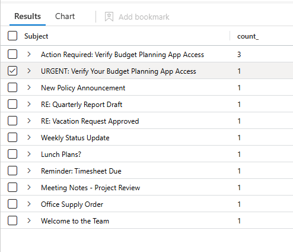

# ConsentStorm Lab

# Context

**Lab link**: [https://cyberdefenders.org/blueteam-ctf-challenges/consentstorm/](https://cyberdefenders.org/blueteam-ctf-challenges/consentstorm/)

**Suggested Tools**: Entra ID Sign-in Logs, Entra ID Audit Logs, Azure Activity Logs, Office 365 Audit Logs, Azure Diagnostics Logs, Microsoft Sentinel, KQL Query Editor

**Tactics**: Initial Access, Persistence, Privilege Escalation, Defense Evasion, Credential Access, Discovery, Lateral Movement, Collection, Exfiltration

# Scenario

On January 21, 2026, the Security Operations Center (SOC) at NexGen Energy received alerts indicating suspicious activity within their Microsoft Entra ID and Azure environment.

The incident appears to have started when an employee in the Finance department received what looked like a legitimate email from a colleague. After interacting with the email, unusual OAuth consent activity and unauthorized access patterns were detected across multiple accounts and Azure resources.

Initial triage suggests the attacker gained access to sensitive cloud resources, pivoted through multiple accounts, and potentially accessed confidential financial data. Threat intelligence indicates the TTPs may be associated with a known APT group.

Your task is to investigate the full scope of this breach, trace the attacker's movements, and document the techniques used throughout the attack chain.

# Initial Access

Q1- What is the email address of the attacker in the initial phishing email?

**Answer**: `david@nexgenenrgy.com`

**Explanation**: Since we only have `AuditLogs_CL` to search for suspicious email subjects, use `extend` to extract the subject, then `summarize` by `Subject`. Identify the suspicious-looking subject and filter on it to narrow the results. Target user is `marcus.reid@nexgenenergy.com`.

```sql
# Summarize all subjects
AuditLogs_CL
| where OperationName contains "Send"
| where parse_json(tostring(parse_json(TargetResources)[0].modifiedProperties))[0].displayName == "Subject"
| extend Subject = tostring(parse_json(tostring(parse_json(TargetResources)[0].modifiedProperties))[0].newValue)
| summarize count() by Subject
| order by count_ desc

# Filter by suspicious subject
AuditLogs_CL
| where OperationName contains "Send"
| where parse_json(tostring(parse_json(TargetResources)[0].modifiedProperties))[0].displayName == "Subject"
| extend Subject = tostring(parse_json(tostring(parse_json(TargetResources)[0].modifiedProperties))[0].newValue)
| where Subject contains "Verify"
```




When in doubt, use this query to search all Microsoft Sentinel table fields for a specific value. #azure-sentinel

```sql
search *
| where * contains "value"
| order by TimeGenerated desc
```

Q2- What is the display name of the malicious OAuth application that the user granted consent to, and how many permissions were requested?

**Answer**: `BudgetPlannerApp`, 5

**Explanation**: Querying the audit logs directly reveals the targeted OAuth application and the 5 requested OAuth 2.0 scopes/permissions. These are Microsoft Graph API scopes granted to the **`BudgetPlannerApp`** service principal.

```sql
AuditLogs_CL
| where OperationName contains "Consent to application"
```


Q3- After gaining initial access, how many phishing emails did the attacker send from the compromised account?

**Answer**: 3

**Explanation**: The target user in question #1 is `marcus.reid@nexgenenergy.com`, so we can adjust our KQL query to use this account as the source.

```sql
AuditLogs_CL
| where OperationName contains "Send"
| where parse_json(tostring(parse_json(TargetResources)[0].modifiedProperties))[0].displayName == "Subject"
| extend Subject = tostring(parse_json(tostring(parse_json(TargetResources)[0].modifiedProperties))[0].newValue)
| where Subject contains "Verify" and InitiatedByUserPrincipalName contains "marcus"
| project Subject, InitiatedByUserPrincipalName
```


Q4- What is the name of the malicious document that was uploaded to SharePoint?

**Answer**: `Immediate_Review.doc`

Explanation: Of all the file upload operations to SharePoint, this is the only one that stands out, and it was performed by the same compromised user.

```sql
OfficeActivity_CL
| where ActivityDisplayName contains "File uploaded"
```


# Discovery

Q5- The attacker enumerated the compromised user's OneDrive files and discovered a PowerShell script containing credentials. What is the name of this script?

**Answer**: `Provisioning-Script.ps1`

**Explanation**: Searching for PowerShell scripts reveals two results, and one matches the description of the relevant artifact.

```sql
search "*ps1"
```


Q6- What is the attacker's first IP address used in this attack, and from which country does this IP originate?

**Answer**: 51.89.156.153, China

**Explanation**: Even though a real-time geo lookup places this address in the UK, Sentinel logs may have used location data from a stale internal source. 


## **GeoIP Discrepancy**

Never Trust Sentinel's Location Field Alone

When investigating suspicious sign-ins in Microsoft Sentinel, always cross-reference the `NetworkLocationDetails` location field against an external GeoIP source (ip-api.com, ipinfo.io, or AbuseIPDB). Sentinel resolves IP geolocation using its own internal database at authentication time, which can be stale or incorrect — particularly for IPs belonging to large hosting providers like OVH, where IP blocks are frequently reassigned and BGP routing can misattribute the country. Always verify the ASN/org owner and check if the IP is a datacenter/VPS rather than residential, as this is a strong indicator of VPN or proxy use by the attacker. Treat Sentinel's location as a low-confidence hint, not ground truth.

Q7- The attacker enumerated Azure resource groups using the service account whose credentials were discovered in the victim's OneDrive script. How many resource groups were successfully enumerated, and how many were blocked due to access restrictions?

**Answer**: 2, 2

**Explanation:** The question is ambiguous. There are 4 allowed and 4 blocked read attempts in total, but the prompt appears to be asking for the number of unique resource groups rather than the number of attempts. Each resource group has 2 `resourceGroups/read` entries marked `Succeeded`, which is expected when a script or tool enumerates resource groups and generates multiple API calls per group.

```sql
AzureActivity_CL
| where CallerIpAddress contains "51.89.156.153"
| where OperationName == "Microsoft.Resources/subscriptions/resourceGroups/read"
| summarize count() by ResourceGroup, ActivityStatus
```


Q8- Which resources were blocked by ABAC restrictions?

**Answer**: `RG-FinanceCore`, `kv-FinanceCore`

**Explanation**: These two resources were blocked by ABAC restrictions. The attacker also appears to have targeted a Key Vault to extract credentials.

```sql
AzureActivity_CL
| where CallerIpAddress contains "51.89.156.153"
| where ActivitySubStatus contains "ABAC"
| summarize count() by Resource
```


Q9- The attacker explored the Automation Account to find credentials. What is the name of the Automation Account that was accessed?

**Answer**: `AutomateOps`

**Explanation**: Reviewing Automation Account activity reveals the name of the Automation Account that was accessed. The resource ID is `/subscriptions/12345678-1234-1234-1234-123456789012/resourceGroups/RG-SharedOps/providers/Microsoft.Automation/automationAccounts/AutomateOps`. 

```sql
AzureActivity_CL
| where CallerIpAddress contains "51.89.156.153" and OperationName contains "automationAccounts"
```


# Credential Access

Q10- What is the name of the second service account that the attacker compromised using the credentials discovered in the runbook?

**Answer**: `svc-automation@nexgenenergy.com`

**Explanation**: By filtering for the attacker's IP address, we identify another service account similar to the one above.

```sql
search "svc-automation@nexgenenergy.com" and "51.89.156.153"
```


Q11- After bypassing ABAC restrictions, the attacker accessed the Key Vault and retrieved a secret. What is the name of the secret that was retrieved?

**Answer**: `jessica-turner-cred`

**Explanation**: Focus on successful Key Vault operations to identify the name of the secret the attacker retrieved.

```sql
AzureActivity_CL
| where CallerIpAddress contains "51.89.156.153" and OperationName contains "vault" and ActivityStatus contains "Succeeded"
```


Q12- The attacker used the credentials from the Key Vault to authenticate as a high-privilege account. What is the user principal name of this account?

**Answer**: `jessica.turner@nexgenenergy.com`

**Explanation**: Using the high-privilege account credentials retrieved from the Key Vault, the attacker attempted to create a Temporary Access Pass for another account.

```sql
search "51.89.156.153" and "jessica.turner"
```


# Persistence

Q13- The second service account added a new client secret to the `BudgetPlannerApp` to maintain persistent access. What is the Key ID of this secret?

**Answer**: `0309ccc7-c9ea-4b95-a8ee-e886b6c25422`

**Explanation**: Filtering on the exact parameters from the question yields a single event that reveals the Key ID of the newly added client secret for the target application, maintaining persistent access.

```sql
search "51.89.156.153" and "svc-automation@nexgenenergy.com" and "BudgetPlannerApp"
```


Q14- The high-privilege account created a time-limited credential for another user account. At what time was this credential created? (Hint: ActivityDateTime)

**Answer**: 01/21/2026 04:56:50

Explanation: This is the same event shown in Question 12, and the `ActivityDateTime [UTC]` field provides the timestamp.

```sql
search "51.89.156.153" and "jessica.turner@nexgenenergy.com"
```


# Privilege Escalation

Q15- The first service account was added to a high-privilege group to escalate privileges. What group was the account added to, and when did this group membership modification occur?

**Answer**: `Finance-Operations`, 01/21/2026 03:48:00

**Explanation**: Filtering by the first compromised service account and the relevant add to group activity, we find our answer.

```sql
search "51.89.156.153" and "svc-provisioner" and OperationName contains "Add member to group"
```


Q16- To bypass ABAC restrictions, the attacker modified a resource tag. What is the tag key and value that was added to the resource?

**Answer**: `CostCenter`, `FIN001`

Explanation: The attacker bypassed ABAC restrictions by adding a tag to the `Microsoft.KeyVault/vaults` resource type.

```sql
AzureActivity_CL
| where CallerIpAddress contains "51.89.156.153" and OperationName contains "tags/write"
```


# Lateral Movement

Q17- What is the second IP address used by the attacker during the final phase of the attack?

**Answer**: 176.31.90.129

**Explanation**: Next, following the precise timeline from the previous Temporary Access Pass activity, filter by the user ID provided with the Temporary Access Pass. This reveals the new IP address the attacker used at the start of the lateral movement phase.

```sql
search "david.chen@nexgenenergy.com"
```


# Collection and Exfiltration

Q18- Using the temporary access pass, the attacker authenticated as the final target account. What is the name of the first file that was accessed?

**Answer**: `Investor-Presentation-2026.pptx`

**Explanation**: Filter for file access events for the user compromised via the Temporary Access Pass, then sort by time to identify the first file the attacker accessed.


Q19- How many files in total were accessed by the attacker on the final target account?

**Answer**: 7

**Explanation**: Count the events from the previous activity.

```sql
search "david.chen@nexgenenergy.com" and ActivityDisplayName contains "File accessed"
| summarize count()
```

# Attribution and MITRE Mapping

Q20- Based on the IOCs (Indicators of Compromise) identified in this investigation, what threat actor group is responsible for this attack?

**Answer**: Storm-0558

**Explanation**: Basic OSINT research on VirusTotal suggests this group name: [https://www.virustotal.com/gui/ip-address/51.89.156.153/community](https://www.virustotal.com/gui/ip-address/51.89.156.153/community)


Q21- What is the MITRE ATT&CK technique ID for the 'Illicit Consent Grant' attack pattern used in the initial compromise phase?

**Answer**: T1528

**Explanation**: “Illicit Consent Grant” maps to MITRE ATT&CK T1528 (Steal Application Access Token), because the attacker tricks a user into approving a malicious OAuth app so it can act like the user without needing the password.

Q22- What is the MITRE ATT&CK technique ID for the 'Persistence' phase where the attacker created a Temporary Access Pass?

**Answer**: T1556

**Explanation**: A Temporary Access Pass is like the attacker convincing the system to issue a special spare key that works for a limited time. They didn’t just steal the original key, they changed how the lock can be opened (at least temporarily). That’s “modifying the authentication process,” which is what T1556 is about. In this lab’s Q22, the attacker creates a TAP to keep/control access later, so persistence via `auth-process` tampering matches well.⁠

# Detection Engineering

Q23- What is the operation name recorded in the `AzureDiagnostics` logs when a secret is successfully retrieved from a Key Vault?

**Answer**: `SecretGet`

**Explanation**: A simple filter reveals the operation name recorded when a secret is retrieved from a Key Vault.

```sql
AzureDiagnostics_CL
| where OperationName contains "Secret"
```


# Mitigation and Prevention

Q24- What authentication control, if enabled on the initial compromised user's account, would have prevented the attacker from granting consent to the malicious application?

**Answer**: Do not allow user consent

**Explanation**: “Do not allow user consent” means regular users aren’t allowed to click “Accept” when an app asks for OAuth permissions. So even if they get tricked by a phishing link, they can’t grant the malicious app access; an admin would have to approve any consent instead. Reference: [https://www.microsoftsecurityinsights.com/p/stop-letting-users-increase-your](https://www.microsoftsecurityinsights.com/p/stop-letting-users-increase-your)

Q25- What is the maximum validity period (in hours) for a Temporary Access Pass created in Azure AD?

**Answer**: 8

**Explanation**: The default maximum lifetime is often configured to 8 hours, administrators can adjust the policy to allow a maximum of 43,200 minutes.