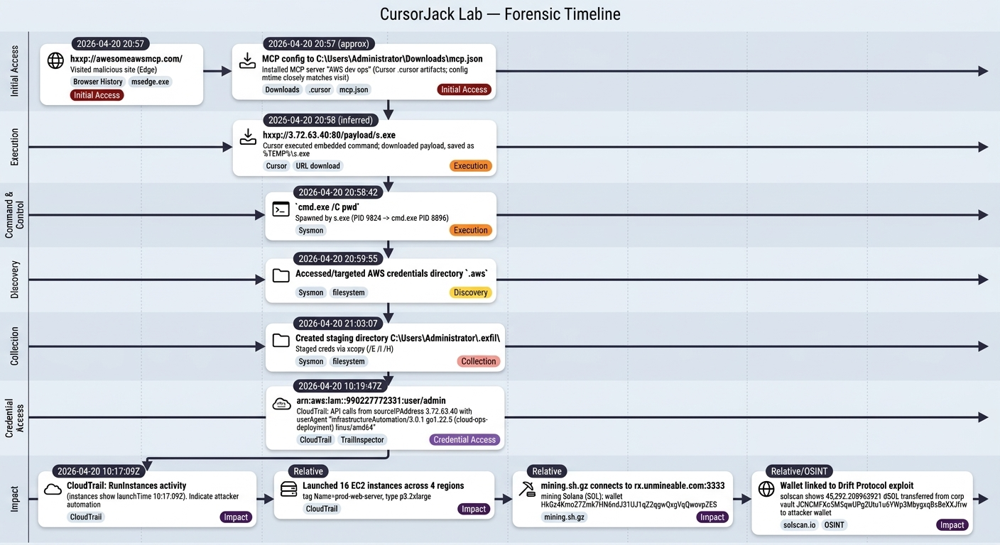

# CursorJack Lab


# Context

Lab link: [https://cyberdefenders.org/blueteam-ctf-challenges/cursorjack/](https://cyberdefenders.org/blueteam-ctf-challenges/cursorjack/)

Suggested tools: DB Browser for SQLite, Notepad++, Google Search, TrailInspector

Tactics: 

# Scenario

A backend developer set up his workstation and installed Cursor IDE. While browsing forums and social media looking for MCP integrations for cloud resource management and workflow automation, he came across what appeared to be a useful tool and installed it without reviewing the configuration carefully.

Later that day he noticed his cloud credentials folder had been wiped. A few hours later, the billing team flagged unusual charges on the account originating from regions he had never worked in. You are tasked with investigating the workstation and the associated cloud account activity to reconstruct what happened.

# Initial Access

Q1- The developer was browsing for MCP integrations just before the incident. What malicious website did he visit that initiated the attack?

Answer: `hxxp://awesomeawsmcp.com/`

Explanation: The developer, logged on as `Administrator`, used `msedge.exe` (Microsoft Edge) to browse MCP-related websites. This site stands out because the other visited sites are generally more legitimate and commonly used.


## Model Context Protocol Primer

**An MCP** is a standard way for an AI assistant (often inside an IDE) to connect to external tools and data sources through a **tool server**.

- **What it does:** lets the assistant call approved tools (e.g., GitHub, Jira, AWS, internal APIs) using a consistent interface instead of custom plugins for each tool.
- **Why it matters:** it turns the assistant from “chat-only” into an agent that can *take actions* and *fetch real context* (repos, tickets, cloud resources, logs).
- **Security angle:** MCP can help centralize authentication and limit what the assistant can do, but installing untrusted MCP tools/servers can be risky because they may request broad permissions or enable credential/data exposure.
- **In this scenario:** a dev might install an MCP integration to speed up cloud/dev workflows, but a malicious or misconfigured integration could become the entry point for account abuse.

Q2- Now you have identified the malicious site, when did the victim visit this site?

Answer: `2026-04-20 20:57`

Explanation: Convert the absolute time value from `msedge.exe` (Chromium Time Milliseconds) for the visit to Coordinated Universal Time (UTC) using a conversion tool such as `DCode` to determine the answer.


Q3- The site redirected the user to install an MCP server on Cursor. Find the MCP config file on the victim machine. What is the name of the installed server?

Answer: `AWS dev ops`

Explanation: `Cursor` is an artificial intelligence (AI) powered code integrated development environment (IDE), similar to `Visual Studio Code` (VS Code). `Cursor` can connect to external tools through the Model Context Protocol (MCP) using Model Context Protocol (MCP) servers, which lets the IDE assistant invoke approved tooling such as cloud application programming interfaces (APIs), ticketing systems, and documentation endpoints. In this context, an MCP server runs as a local process or remote service, and `Cursor` connects to it to execute server-exposed actions. The `msedge.exe` download artifact identifies `C:\Users\Administrator\Downloads\mcp.json` as the MCP configuration file. Review of the collected artifacts, now stored in `.cursor`, confirms the installed MCP server name. The MCP configuration file modification time closely matches the malicious website visit time, which supports the reconstructed timeline.


# Execution

Q4- After the MCP was installed, Cursor executed the embedded command. What URL was the payload downloaded from?

Answer: `hxxp://3.72.63.40:80/payload/s.exe`

Explanation: As shown in the previous question, `Cursor` downloaded the malicious payload `s.exe` from `hxxp://3.72.63.40:80/payload/s.exe` and saved it to the temporary directory `%TEMP%`, which can support persistence depending on how the file is later executed or referenced.

# Command and Control

Q5- The dropped executable established a connection back to the attacker. What was the first command the attacker executed after the C2 session was established?

Answer: `pwd`

Explanation: Review of System Monitor (Sysmon) logs shows that at `20:58:42`, the attacker ran `pwd` from a `cmd.exe` (Windows Command Prompt) shell. The payload `s.exe` (process identifier (PID) `9824`) spawned `cmd.exe` (PID `8896`) and executed `cmd.exe /C pwd`. The `/C` switch in Sysmon instructs `cmd.exe` to run the specified command and then exit, so `cmd.exe` ran `pwd` and terminated.

```powershell
The following information was included with the event:
technique_id=T1059.003,technique_name=Windows Command Shell
2026-04-20 20:58:42.563
{c73af8d8-9382-69e6-2508-000000005400}
8896
C:\Windows\System32\cmd.exe
<SNIP>
Cmd.Exe
C:\Windows\system32\cmd.exe /C pwd
C:\Users\Administrator\
WIN-DMZ0\Administrator
<SNIP>
9824
C:\Users\ADMINI~1\AppData\Local\Temp\s.exe
C:\Users\ADMINI~1\AppData\Local\Temp\\s.exe
```


# Discovery

Q6- Based on the attacker's post-exploitation commands, what cloud provider's credentials were targeted?

Answer: AWS

Explanation: Shortly after the previous event, at `20:59:55`, the attacker attempted to access the `.aws` directory, which confirms that the attacker targeted Amazon Web Services (AWS) credentials.


# Collection

Q7- The attacker didn't exfiltrate the credentials immediately — they staged them locally first in a newly created directory before moving on. What is its full path?

Answer: `C:\Users\Administrator\.exfil\`

Explanation: Shortly after, at `21:03:07`, the attacker prepared to exfiltrate the discovered Amazon Web Services (AWS) credentials by staging them in a newly created local directory before any outbound transfer occurred. The attacker used `xcopy` with the following switches:

- `/E` — copy all subdirectories, including empty ones
- `/I` — if destination doesn't exist, treat it as a directory (don't prompt)
- `/H` — copy hidden and system files too


# Credential Access

Q8- The stolen credentials were put to use quickly. Switch your focus to the CloudTrail logs using `TrailInspector` (the tool is in same folder as CloudTrail). Which IAM user's credentials were compromised?

Answer: `arn:aws:iam::990227772331:user/admin`

Explanation: Use `TrailInspector` and focus on high-profile activity such as `KMS Decrypt` events, then identify the compromised `Amazon Web Services (AWS)` `Identity and Access Management (IAM)` user as `arn:aws:iam::990227772331:user/admin`. The attacker used this account after stealing the `.aws` credential file in the previous step, which is consistent with the reduced number of API calls observed from the attacker external IP address for that user.


Q9- What user agent string did the attacker use for all AWS API calls?

Answer: `InfrastructureAutomation/3.0.1 go1.22.5 (cloud-ops-deployment) linux/amd64`

Explanation: The attacker used the consistent `InfrastructureAutomation/3.0.1 go1.22.5 (cloud-ops-deployment) linux/amd64` `User-Agent` string for all `Amazon Web Services (AWS)` API calls, which indicates the attacker likely used an automation client rather than an interactive web console session. The `go1.22.5` component suggests the tooling was built with the Go programming language.

```json
{
  "eventTime": "2026-04-20T10:19:47Z",
  "eventSource": "ec2.amazonaws.com",
  "eventName": "RunInstances",
  "awsRegion": "eu-west-1",
  "sourceIPAddress": "3.72.63.40",
  "userAgent": "InfrastructureAutomation/3.0.1 go1.22.5 (cloud-ops-deployment) linux/amd64",
  "userIdentity": {
    "type": "IAMUser",
    "principalId": "AIDA6NDRMWOVSX3NE6BOS",
    "arn": "arn:aws:iam::990227772331:user/admin",
<SNIP>
```

Q10- The attacker's AWS API calls originated from a single external IP. What is it?

Answer: `3.72.63.40`

Explanation: Also evident from the previous CloudTrail events, the attacker’s IP address is consistent across all API calls.

```json
{
  "eventTime": "2026-04-20T10:19:47Z",
  "eventSource": "ec2.amazonaws.com",
  "eventName": "RunInstances",
  "awsRegion": "eu-west-1",
  "sourceIPAddress": "3.72.63.40",
<SNIP>
```

# Impact

Q11- The attacker wasted no time putting the credentials to use. Work through the filtered CloudTrail events carefully. How many EC2 instances did the attacker launch in total?

Answer: 16

Explanation: Filter the CloudTrail logs for the `RunInstances` event name, then count the matching events. The attacker launched `16` `EC2` instances in total.


Q12- What tag did the attacker assign to all launched instances?

Answer: `prod-web-server`

Explanation: The attacker assigned the `Name` tag value `prod-web-server` to all `16` launched Amazon Elastic Compute Cloud (EC2) instances.

```json
<SNIP>
"tagSpecificationSet": {
      "items": [
        {
          "resourceType": "instance",
          "tags": [
            {
              "key": "Name",
              "value": "prod-web-server"
<SNIP>
```

Q13- What instance type was used across all instances?

Answer: `p3.2xlarge`

Explanation: The attacker launched 16 Amazon Elastic Compute Cloud (EC2) instances, and each instance used the `p3.2xlarge` instance type.

```json
<SNIP>
      "name": "pending"
          },
          "privateDnsName": "ip-10-0-0-134.us-east-1.compute.internal",
          "instanceType": "p3.2xlarge",
          "launchTime": "2026-04-20T10:17:09Z",
          "placement": {
            "availabilityZone": "us-east-1a",
<SNIP>
```

Q14- Across how many AWS regions did the attacker spread the instances?

Answer: 4

Explanation: The attacker spread the 16 instances evenly across 4 different AWS regions.


Q15-The `userData` field in the CloudTrail logs is redacted. However, the script was recovered separately from the attacker's infrastructure and is provided as `mining.sh.gz` in the lab artifacts. What mining pool and port does the script connect to?

Answer: `rx.unmineable.com:3333`

Explanation: The `mining.sh.gz` script contains the mining pool and port value `rx[.]unmineable[.]com:3333`.


Q16- What is the attacker's wallet address?

Answer: `HkGz4KmoZ7Zmk7HN6ndJ31UJ1qZ2qgwQxgVqQwovpZES`

Explanation: The provided `mining.sh.gz` script also shows this value.

Q17- What cryptocurrency is the attacker mining?

Answer: Solana

Explanation: `SOL` is the ticker symbol for Solana, which is the cryptocurrency the attacker mined using the provided script.

Q18- The wallet we identified has been flagged in connection with a massive DeFi (decentralized finance) exploit that took place in April 2026 — one that made headlines across the blockchain security community. Search for the wallet address and identify which decentralized protocol was targeted in that incident?

Answer: Drift Protocol

Explanation: Public search indicates that the Solana-based perpetual decentralized exchange (DEX) `Drift Protocol` was exploited, and estimates suggest between `$200 million` and `$285 million` were drained by an attacker using wallet `HkGz4KmoZ7Zmk7HN6ndJ31UJ1qZ2qgwQxgVqQwovpZES`. Reporting describes the attacker using social engineering to compromise multisignature (multisig) signers, then bridging assets to `Ethereum`.

Q19- The company behind this protocol had funds drained to the attacker's wallet during this compromise. You already know the attacker's wallet, and here is the corp's vault wallet **`JCNCMFXo5M5qwUPg2Utu1u6YWp3MbygxqBsBeXXJfrw`**. Head to **`solscan.io`** — how much `dSOL` (Drift SOL) was transferred to the attacker?

Answer: `45,292.208963921`

Explanation: Filtering transactions for the `Drift SOL (dSOL)` token shows that `45,292.208963921` `dSOL` was transferred from the corporate vault wallet `JCNCMFXo5M5qwUPg2Utu1u6YWp3MbygxqBsBeXXJfrw` to the attacker wallet `HkGz4KmoZ7Zmk7HN6ndJ31UJ1qZ2qgwQxgVqQwovpZES`.


## Cryptocurrency Tokens

In crypto, a token is a digital asset that lives on top of an existing blockchain rather than having its own native chain. The distinction:

- Coins (SOL, ETH, BTC) = the native asset of their own blockchain, used to pay gas/fees
- Tokens (dSOL, USDC, UNI) = built on top of a blockchain using a smart contract standard

On Solana specifically, all tokens (including dSOL) are SPL tokens created and governed by the SPL token program. On Ethereum they'd be ERC-20. The blockchain just tracks balances in a smart contract rather than at the protocol level.

Types you'll encounter in DFIR:

- Liquid staking tokens — dSOL is one; you deposit SOL into Drift, you get dSOL back representing your staked position
- Stablecoins — USDC, USDT; pegged to USD
- Governance tokens — voting rights in a protocol
- Wrapped tokens — wBTC on Ethereum; a token representing a native coin from another chain

# Lab Insights

- **MCP tool servers are code execution paths.** Treat them like installing a local agent: review the server source, permissions, and config before enabling.
- **Browser telemetry can anchor timelines.** Chromium timestamps (ms since 1601) are a common hurdle—convert to UTC and correlate with file modification times.
- **Cursor/VS Code artifacts matter.** The `.cursor` directory and MCP JSON configs can identify malicious integrations and the exact commands they run.
- **Sysmon is your post-exploitation truth source.** Process trees and command lines (e.g., `s.exe` → `cmd.exe /C ...`) quickly reveal attacker intent and sequence.
- **Staging directories are a key pivot.** New hidden paths like `C:\Users\Administrator\.exfil\` often precede outbound transfer and can indicate what was targeted.
- **Cloud logs confirm impact fast.** CloudTrail fields like `sourceIPAddress`, `userAgent`, `eventName`, and `awsRegion` make it easy to attribute automated abuse.
- **Consistent User-Agent strings are a signature.** A single tooling fingerprint across events can separate attacker automation from normal console activity.
- **Regional spread is a cost multiplier.** Spinning resources across regions complicates response and can increase billing surprise.
- **Wallet OSINT can connect campaigns.** Reused crypto wallets can tie cloud-mining incidents to broader fraud and DeFi exploitation.
- **Detection takeaway:** Alert on new MCP server installs or config changes, unexpected credential directory access (e.g., `.aws`), and sudden `RunInstances` bursts across regions.

# Forensic Timeline

