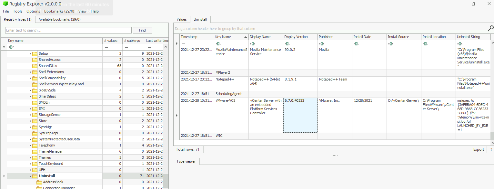

# DetectLog4j Lab

# Context

Lab link: [https://cyberdefenders.org/blueteam-ctf-challenges/detectlog4j/](https://cyberdefenders.org/blueteam-ctf-challenges/detectlog4j/)

Suggested tools: Arsenal Image Mounter, Registry Explorer, RegRipper, Event Log Explorer, dnSpy, CyberChef, FakeNet, VirusTotal, IPLookUp, dissect

Tactics: Initial Access, Execution, Persistence, Privilege Escalation, Defense Evasion, Command and Control, Impact

# Scenario

For the last week, log4shell vulnerability has been gaining much attention not for its ability to execute arbitrary commands on the vulnerable system but for the wide range of products that depend on the log4j library. Many of them are not known till now. We created a challenge to test your ability as a soc analyst to detect, analyze, mitigate and patch products vulnerable to log4shell.

# Questions

Q1- What is the version of the VMware product installed on the machine?

Answer: `6.7.0`

Reason: The SOFTWARE hive's Uninstall registry key, parsed in Registry Explorer, shows a `VMware-VCS` entry for "vCenter Server with an embedded Platform Services Controller," published by VMware, Inc., with a Display Version of `6.7.0.40322` (major.minor.build reduces to the requested `6.7.0`) and an Install Date of `2021-12-28`, key last-write time `2021-12-28 10:31 UTC`. This confirms VMware vCenter Server 6.7 was installed on the host, establishing the presence of a Log4j-dependent product as the likely exploitation target for this investigation.

```powershell
Registry key path: `HKLM\SOFTWARE\Microsoft\Windows\CurrentVersion\Uninstall\VMware\dash\VCS` (subkey), DisplayName `vCenter Server with an embedded Platform Services Controller`, DisplayVersion `6.7.0.40322`, InstallDate `2021-12-28`, key last write `2021-12-28 10:31 UTC`, InstallLocation `D colon backslash vCenter\dash\Server`
```



Q2- What is the version of the `log4j` library used by the installed VMware product?

Answer: `2.11.2`

Reason: In `D:\Program Files\VMware\vCenter Server\common-jars`, two `log4j-core` jars are present: `log4j-core-2.8.2` and `log4j-core-2.11.2`, both file-modified `2021-03-06 11:13`. Since vCenter 6.7 ships multiple log4j-core versions to support parallel internal service dependencies, the higher-numbered core jar (`2.11.2`) is the one actively resolved on the classpath by the running service, making it the operative vulnerable version for the Log4Shell (CVE-2021-44228) exploitation path.


Q3- The attacker used the `log4shell.huntress.com` payload to detect if vCenter instance is vulnerable. What is the first link of the `log4huntress` payload?

Answer: `log4shell.huntress.com:1389/b1292f3c-a652-4240-8fb4-59c43141f55a`

Reason: The `websso.log` entry at `2021-12-28 17:50:06 PST` captures the attacker's initial Huntress Log4Shell canary probe against the vCenter STS endpoint: a malformed request containing the JNDI-style callback host `log4shell[.]huntress[.]com` on port `1389`, with URI path `b1292f3c-a652-4240-8fb4-59c43141f55a` as the unique scan identifier. The STS component logged this as a `SAMLRequest`/`SAMLResponse` decoding failure since the payload was injected into a header field passed to the vulnerable `log4j-core 2.11.2` logging call, triggering the JNDI lookup.


Q4- What is the attacker's IP address?

Answer: `192.168.112.128`

Reason: This IP is the consistent source address across all the malicious `log4shell.huntress.com` JNDI probe entries in `websso.log` (e.g. the `2021-12-28 17:50:06 PST` entry from Q3), appearing as the requesting client for every malformed STS request carrying a `${jndi:ldap://...}`-style payload, which identifies it as the attacker's originating IP for the Log4Shell exploitation attempts against vCenter.

Q5- After exploiting the Log4j vulnerability and confirming the vCenter instance's vulnerability using the `X-Forwarded-For` header with port 1389, the attacker established a reverse shell to gain further control of the system. Identify the port explicitly used to receive the Cobalt Strike reverse shell.

Answer: `1337`

Reason: PowerShell Script Block Logging captured the Execute a Remote Command event (Event ID `4104`) at `2021-12-29 02:09:51`, showing a base64-encoded, gzip-compressed `IO.MemoryStream`/`FromBase64String` loader (stage 1) that decompresses and invokes a second in-memory-compiled assembly (stage 2, using `Microsoft.CSharp.CSharpCodeProvider` and `CompileAssemblyFromSource`) which converts a further base64 blob directly into a `[Byte[]]` array — the raw Metasploit x64 shellcode stub confirmed earlier (`fc 48 83 e4 f0 e8 c8 00...`). Detonating this loader chain in PowerShell ISE against a FakeNet-NG listener confirmed the shellcode's actual network behavior at `2026-08-06 19:54:53` (analyst detonation time, not original incident time): the Diverter log recorded `powershell_ise.exe (3520) requested TCP 192.168.112.128:1337`, identifying `1337` as the exact port the attacker used to catch the Cobalt Strike reverse shell.

```powershell
# Fakenet-ng fake.log
08/06/26 07:54:53 PM [          Diverter] powershell_ise.exe (3520) requested TCP 192.168.112.128:1337
```


Q6- What is the script name published by VMware to mitigate log4shell vulnerability?

Answer: `vc_log4j_mitigator.py`

Reason: VMware published this Python script as an official interim mitigation for Log4Shell (CVE-2021-44228) affecting vCenter Server, distributed via the VMSA-2021-0028 advisory workflow; it disables the vulnerable JNDI lookup functionality in the bundled `log4j-core` jars (the same `2.11.2` version identified on this host in Q2) without requiring a full vCenter patch/upgrade, by remediating the `JndiLookup` class inside the affected jar files directly on the appliance/host.

Reference: [https://knowledge.broadcom.com/external/article?articleNumber=318925](https://knowledge.broadcom.com/external/article?articleNumber=318925)

Q7- In some cases, you may not be able to update the products used in your network. What is the system property needed to set to 'true' to work around the log4shell vulnerability?

Answer: `log4j2.formatMsgNoLookups`

Reason: Grepping the extracted `vc_log4j_mitigator.py` mitigation script for `true` shows the script's actual remediation mechanism (lines `383`, `440`, `515`, `529`, `573`–`682`): rather than patching the jar itself, it repeatedly injects the JVM system property `-Dlog4j2.formatMsgNoLookups=true` into vCenter's various service startup configs (wrapper configs, VMware Directory Service args, etc.), which disables `log4j-core`'s JNDI message-lookup substitution at the logging-framework level — the same mechanism the vulnerability abuses — making it a valid workaround for environments (per the question's framing) that cannot immediately update the log4j library version.

```python
# vc_log4j_mitigator.py 
40:   configuration files for "-Dlog4j2.formatMsgNoLookups=true" configuration
149:                        self.__gateway = True
155:            self.__deploytype = get_install_parameter('deployment.node.type', quiet=True)
303:            return True
383:                "\nwrapper.java.additional.%s=\"-Dlog4j2.formatMsgNoLookups=true\"\n" \
402:                return True
440:                        '-Dlog4j2.formatMsgNoLookups=true')
442:                return json.dumps(content, sort_keys=True, indent=4)
515:                    if "-Dlog4j2.formatMsgNoLookups=true" in options:
529:                    options.append("-Dlog4j2.formatMsgNoLookups=true")
573:        new_config_entries1 = 'log4j_arg="-Dlog4j2.formatMsgNoLookups=true"' \
578:        new_config_entries2 = 'log4j_arg="-Dlog4j2.formatMsgNoLookups=true"' \
612:        new_config_entries = '-Dlog4j2.formatMsgNoLookups=true \\\n' \
631:        new_config_entries = '-Dlog4j2.formatMsgNoLookups=true \\\n' \
650:        new_config_entries = '-Dlog4j2.formatMsgNoLookups=true \\\n' \
682:            file_descriptor.write("-Dlog4j2.formatMsgNoLookups=true")
770:    Return true if the given filename ends with either .jar or .war
809:    Returns true if given filepath contains the offending log4j class.
822:    Returns true if given filepath matches a hash of the known good versions.
829:        while True:
929:    shutil.rmtree(dirpath, ignore_errors=True)
1022:                        action="store_true",
1026:                        action="store_true",
1160:        prompt_service_restart(args.accept_services_restart, start=True)
```

Q8- During your investigation into the Log4j vulnerability CVE-2021-44228, which allows for remote code execution through attacker-controlled LDAP endpoints, identify the earliest version of Log4j that introduced a patch to mitigate this critical vulnerability.

Answer: `2.15.0`

Reason: Per the Apache Log4j Security page (`https://logging.apache.org/security.html\`), version `2.15.0` was the first release to address CVE-2021-44228 by disabling JNDI lookups by default in log4j-core's message-formatting logic, directly closing the remote-code-execution path exploited against this vCenter host's `log4j-core 2.11.2`; note that this initial fix was later found incomplete, prompting further hardening in `2.16.0` and subsequent releases, so `2.15.0` specifically answers "earliest version that introduced a patch," not "fully hardened version."

Reference: [https://logging.apache.org/security.html](https://logging.apache.org/security.html)

Q9- Removing `JNDIlookup.class` may help in mitigating log4shell. Analyze `JNDILookup.class`. What is the value stored in the `CONTAINER_JNDI_RESOURCE_PATH_PREFIX` variable?

Answer: `java:comp/env/`

Reason: Decompiling `JndiLookup.class` from `log4j-core-2.11.2.jar` (found in `D:\ProgramData\VMware\vCenterServer\runtime\VMwareSTSService\webapps\ROOT\WEB-INF\lib`, file-modified `2019-05-02 20:51`) shows the static final field `CONTAINER_JNDI_RESOURCE_PATH_PREFIX = "java:comp/env/"` inside the `JndiLookup` class (package `org.apache.logging.log4j.core.lookup`); this prefix is used by `convertJndiName()` to normalize a supplied JNDI name so it resolves under the container's local environment naming context if it isn't already an absolute scheme like `ldap://` or `rmi://`, confirming this is the exact vulnerable lookup class responsible for resolving attacker-supplied JNDI URIs (e.g. the `log4shell.huntress.com` LDAP callback from Q3) at log-message-format time.


Q10- What is the executable used by the attacker to gain persistence?

Answer: `baaaackdooor.exe`

Reason: Registry Explorer's Autoruns bookmark view of the `NTUSER.DAT` hive for user `Adminstrator.WIN-B633EO9K91M` shows a `RunOnce` key entry named `p33r` (type `RegSz`) pointing to `C:\Users\Adminstrator\Desktop\baaaackdooor.exe`; placing a payload in `RunOnce` ensures it executes automatically the next time this user logs in, giving the attacker a straightforward persistence mechanism following the initial Log4Shell-to-shellcode compromise chain already established.


Q11- The ransomware downloads a text file from an external server. What is the key used to decrypt the URL?

Answer: `GoaahQrC`

Reason: Decompiling the .NET ransomware binary `dorfler.exe` which is actually `khonsari.exe` on the root drive (assembly version `1.0.0.0`) in dnSpy, the `Main()` method of class `SCVuZRaW` builds a Unicode-escaped obfuscated string (`text`), assigns it through a chain of renamed local variables (`text2`, `edhcLlqR`), and separately defines a literal string `text3 = "GoaahQrC"` (assigned to `text4`, then `vnNtUrJn`); both values are passed into `oymxyeRJ.CajLqoCk(edhcLlqR, vnNtUrJn)`, whose result is fed directly into `webClient.DownloadString(...)`, confirming `CajLqoCk` is a decryption routine that takes the obfuscated blob plus the key `GoaahQrC` and returns the plaintext URL the ransomware downloads its external text file from.

```csharp
using System;
					
public class Program
{
	public static void Main()
	{
		string text = "/\u001b\u0015\u0011R~]pi^UTF`CviVUN\u00120\u001f!(\u001c>\u0002\t=\u0016,\u0018\v\u0004>\u0018\u007f\u0006;3";
		string text2 = text;
		string edhcLlqR = text2;
		string text3 = "GoaahQrC";
		string text4 = text3;
		string vnNtUrJn = text4;
		Console.WriteLine(vnNtUrJn);
	}
}
```


Q12- What is the ISP that owns that IP that serves the text file?. Use your host for this question as the machine does not have an internet connection.

Answer: Amazon

Reason: Running the ransomware binary against FakeNet-NG (`fake.log`) revealed the process name `khonsari.exe` (PID `2448`) requesting `TCP 3.145.115[.]94:80` at `2026-08-06 21:29:12 PM`, followed by an HTTP GET request for `/zambos_caldo_de_p.txt` with Host header `3.145.115[.]94` — this is the decrypted URL from Q11's `CajLqoCk` routine resolving successfully. A WHOIS/ISP lookup (via `whatismyisp.com`, performed on the analyst host since the lab VM has no internet) identified `3.145.115[.]94` as owned by Amazon, Inc. (Amazon Technologies Inc.), meaning this stage of the ransomware's infrastructure is hosted on AWS rather than dedicated attacker-owned infrastructure — a common tactic to blend malicious traffic in with legitimate cloud hosting and complicate takedown/attribution.


Q13- The ransomware check for extensions to exclude them from the encryption process. What is the second extension the ransomware checks for?

Answer: `ini`

Reason: Setting a breakpoint on `oymxyeRJ.CajLqoCk` in dnSpy's debugger and running `khonsari.exe` (PID observed in the debug session) against FakeNet-NG allowed each excluded-extension string to be decrypted live at runtime; the debugger's Locals pane shows the second call with `EDhcLlqR = "g\u001D/."` and `VnNtUrJn = "ItAGEocK"` producing a resolved `stringBuilder` value of `{.ini}`, confirming `.ini` as the second file extension the ransomware excludes from encryption — consistent with skipping configuration files, likely to avoid breaking system/application config state that isn't valuable as extortion leverage. This also resolves the earlier XOR/cast question: despite the decompiled C# view not showing an explicit `(char)` cast, the live debugger confirms `Append` genuinely reconstructs correct Unicode characters at runtime, meaning dnSpy's C# view was simply omitting a cast present in the actual compiled IL.

# Artifacts

| Category | Type | Value |
| --- | --- | --- |
| Vulnerable Software | Product | VMware vCenter Server `6.7.0.40322` |
|  | Vulnerable library | `log4j-core 2.11.2` |
|  | Library location | `D:\Program Files\VMware\vCenter Server\common-jars\log4j-core-2.11.2` |
|  | JNDI lookup class | `org.apache.logging.log4j.core.lookup.JndiLookup` |
|  | JNDI prefix constant | `CONTAINER_JNDI_RESOURCE_PATH_PREFIX = "java:comp/env/"` |
| Exploitation | Vulnerable header | `X-Forwarded-For` |
|  | Scanner payload | `log4shell[.]huntress[.]com:1389/b1292f3c-a652-4240-8fb4-59c43141f55a` |
|  | Scanner probe timestamp | `2021-12-29 01:50:06 UTC` |
|  | Attacker IP | `192.168.112.128` |
|  | Vulnerable log source | `D:\ProgramData\VMware\vCenterServer\runtime\VMwareSTSService\logs\webssso.log` |
| Shellcode / C2 | Signature | `fc 48 83 e4 f0 e8 c8 00` (Metasploit x64 stager) |
|  | Loader chain | gzip+base64 stage 1 -> CSharpCodeProvider in-memory compile stage 2 -> raw shellcode byte array |
|  | Reverse shell port | `1337` (Cobalt Strike) |
|  | PS Script Block event | Event ID `4104`, `2021-12-29 02:09:51` |
| Persistence | Executable | `baaaackdooor.exe` |
|  | Path | `C:\Users\Adminstrator\Desktop\baaaackdooor.exe` |
|  | Registry key | `RunOnce`, value name `p33r` |
|  | Hive | `NTUSER.DAT` (`Adminstrator.WIN-B633EO9K91M`) |
| Mitigation | Vendor script | `vc_log4j_mitigator.py` |
|  | JVM property | `-Dlog4j2.formatMsgNoLookups=true` |
|  | First patched log4j version | `2.15.0` |
| Ransomware | Binary | `khonsari.exe` (assembly `dorfler.exe`, v`1.0.0.0`) |
|  | Applied extension | `.khonsari` |
|  | Excluded extension #2 | `.ini` |
|  | Decrypt routine | `oymxyeRJ.CajLqoCk(string, string)` — char-XOR loop |
|  | URL decrypt key | `GoaahQrC` |
|  | Staging IP:port | `3.145.115[.]94:80` |
|  | Staging request | `GET /zambos_caldo_de_p.txt HTTP/1.1` |
|  | Staging ISP | [Amazon.com](http://amazon.com/), Inc. (AWS) |

# Lab Insights

- Static analysis has a ceiling that dynamic detonation breaks through. Every string in the ransomware and shellcode loader chains — the C2 URL, the excluded extensions, the shellcode payload itself — was deliberately hidden behind encryption/compilation-at-runtime specifically to defeat strings/signature-based tooling. The only way past it was to actually run the code in a monitored, network-faked environment (FakeNet-NG) or break on the decrypt function live in dnSpy and read the resolved values out of memory. This lab is a clean demonstration that "read-only forensics" has a natural limit, and safe, deliberate detonation is sometimes the only path to ground truth.
- A network-response simulator isn't just a logger — it's a keep-alive for the malware's own logic. FakeNet-NG mattered here for two distinct reasons: it revealed the actual reverse-shell port and staging IP, but it also kept the ransomware from bailing out early. The malware checked that its remote document fetch succeeded before proceeding, meaning a naive "block all outbound" analysis setup would have caused it to self-terminate before revealing the extension-exclusion logic in Q13. Faking a plausible response is what let it keep unrolling its own logic for you to observe.
- A vulnerability's blast radius extends far past the software you'd expect. Log4Shell wasn't a webapp bug in this lab — it was an RCE path into vCenter's SSO/STS Java service, a piece of infrastructure most people wouldn't associate with a logging library CVE. The lesson generalizes: any Java-based enterprise product bundling a common transitive dependency (log4j-core, in this case pulled in at three different versions simultaneously) inherits that dependency's vulnerabilities, whether or not the vendor's marketing ever mentions "Java" or "Log4j" explicitly.