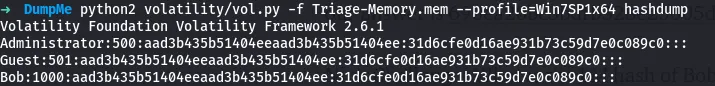

# DumpMe Lab

# Context

Lab link: [https://cyberdefenders.org/blueteam-ctf-challenges/dumpme/](https://cyberdefenders.org/blueteam-ctf-challenges/dumpme/)

Suggested tools: Execution, Stealth, Command and Control

Tactics: Volatility 2, `sha1sum`

# Scenario

A SOC analyst took a memory dump from a machine infected with a meterpreter malware. As a Digital Forensicators, your job is to analyze the dump, extract the available indicators of compromise (IOCs) and answer the provided questions.

# Questions

Q1- What is the SHA1 hash of `Triage-Memory.mem` (memory dump)?

Answer: `c95e8cc8c946f95a109ea8e47a6800de10a27abd`

Reason: The SHA1 hash of the acquired memory image `Triage-Memory.mem` was computed as `c95e8cc8c946f95a109ea8e47a6800de10a27abd` to establish chain of custody prior to analysis, ensuring the integrity of the artifact can be verified against this baseline at any later stage of the investigation.

```bash
$ sha1sum Triage-Memory.mem                 
c95e8cc8c946f95a109ea8e47a6800de10a27abd  Triage-Memory.mem
```

Q2- What volatility profile is the most appropriate for this machine? (ex: `Win10x86_14393`)

Answer: `Win7SP1x64`

Reason: The memory image `Triage-Memory.mem` was identified as originating from a `Win7SP1x64` system, the first suggested profile returned by Volatility 2's `imageinfo` plugin, with the image itself timestamped `2019-03-22 05:46:00 UTC` and a `KDBG` offset of `0xf800029f80a0` confirming a Windows kernel structure was successfully located for profile derivation.

```bash
$ python2 /opt/volatility2/vol.py -f Triage-Memory.mem imageinfo 
          Suggested Profile(s) : Win7SP1x64, Win7SP0x64, Win2008R2SP0x64, Win2008R2SP1x64_24000, Win2008R2SP1x64_23418, Win2008R2SP1x64, Win7SP1x64_24000, Win7SP1x64_23418
                     AS Layer1 : WindowsAMD64PagedMemory (Kernel AS)
                     AS Layer2 : FileAddressSpace (/home/kali/ctf_stuff/defsec/temp/Triage-Memory.mem)
                      PAE type : No PAE
                           DTB : 0x187000L
                          KDBG : 0xf800029f80a0L
          Number of Processors : 2
     Image Type (Service Pack) : 1
                KPCR for CPU 0 : 0xfffff800029f9d00L
                KPCR for CPU 1 : 0xfffff880009ee000L
             KUSER_SHARED_DATA : 0xfffff78000000000L
           Image date and time : 2019-03-22 05:46:00 UTC+0000
     Image local date and time : 2019-03-22 01:46:00 -0400
```

Q3- What was the process ID of `notepad.exe`?

Answer: `3032`

Reason: The process `notepad.exe` was found running with PID `3032` (parent PID `1432`), created at `2019-03-22 05:32:22 UTC`, as listed by Volatility 2's `pslist` plugin which enumerates active processes by walking the kernel's `PsActiveProcessHead` linked list.

```bash
$ python2 /opt/volatility2/vol.py -f Triage-Memory.mem --profile=Win7SP1x64 pslist | grep -i notepad    
Volatility Foundation Volatility Framework 2.6.1
0xfffffa80054f9060 notepad.exe            3032   1432      1       60      1      0 2019-03-22 05:32:22 UTC+0000 
```

Q4- Name the child process of `wscript.exe`.

Answer: `UWkpjFjDzM.exe`

Reason: The process `wscript.exe` (PID `5116`, spawned at `2019-03-22 05:35:32 UTC`) spawned a child process named `UWkpjFjDzM.exe` (PID `3496`) one second later at `2019-03-22 05:35:33 UTC`, a randomized filename and script-driven parentage consistent with a malicious dropper executing a payload via Windows Script Host.

```bash
$ python2 /opt/volatility2/vol.py -f Triage-Memory.mem --profile=Win7SP1x64 pstree | grep -i wscript -A 1
Volatility Foundation Volatility Framework 2.6.1
.. 0xfffffa8005a80060:wscript.exe                    5116   3952      8    312 2019-03-22 05:35:32 UTC+0000
... 0xfffffa8005a1d9e0:UWkpjFjDzM.exe                3496   5116      5    109 2019-03-22 05:35:33 UTC+0000
```

Q5- What was the IP address of the machine at the time the RAM dump was created?

Answer: `10.0.0.101`

Reason: The compromised host held IP address `10.0.0.101` at the time of memory acquisition, identified via a UDP socket bound by `svchost.exe` (PID `2888`) at `2019-03-22 05:32:20 UTC`, using Volatility 2's `netscan` plugin, the correct network-artifact scanner for Vista/Win7+ systems since it locates `_TCP_LISTENER`/`_TCP_ENDPOINT`/`_UDP_ENDPOINT` pool objects directly rather than relying on the legacy XP-era `connscan`/`sockscan` plugins.

```bash
$ python2 /opt/volatility2/vol.py -f Triage-Memory.mem --profile=Win7SP1x64 netscan                      
Volatility Foundation Volatility Framework 2.6.1
Offset(P)          Proto    Local Address                  Foreign Address      State            Pid      Owner          Created
0x13e057300        UDPv4    10.0.0.101:55736               *:*                                   2888     svchost.exe    2019-03-22 05:32:20 UTC+0000
```

Q6- Based on the answer regarding the infected PID, can you determine the IP of the attacker?

Answer: `10.0.0.106`

Reason: The malicious process `UWkpjFjDzM.exe` (PID `3496`) held an established TCP connection from local port `49217` to `10.0.0.106:4444`, identifying `10.0.0.106` as the attacker's command-and-control host; port `4444` is the well-known default listener port for Metasploit/Meterpreter handlers, corroborating the lab's stated Meterpreter infection.

```bash
$ python2 /opt/volatility2/vol.py -f Triage-Memory.mem --profile=Win7SP1x64 netscan | grep 3496
Volatility Foundation Volatility Framework 2.6.1
0x13e397190        TCPv4    10.0.0.101:49217               10.0.0.106:4444      ESTABLISHED      3496     UWkpjFjDzM.exe 
```

Q7- How many processes are associated with `VCRUNTIME140.dll`?

Answer: 5

Reason: Five processes were found with `VCRUNTIME140.dll` mapped into their address space, spanning both a Microsoft Office ClickToRun component (loaded at `2019-03-22 05:32:05 UTC`) and four separate Office 16 process instances loading the same DLL between `2019-03-22 05:33:49 UTC` and `2019-03-22 05:35:09 UTC`, as enumerated by Volatility 2's `dlllist` plugin walking each process's loaded-module list (PEB `Ldr` data).

```bash
$ python2 /opt/volatility2/vol.py -f Triage-Memory.mem --profile=Win7SP1x64 dlllist | grep -i "VCRUNTIME140.dll"
Volatility Foundation Volatility Framework 2.6.1
0x000007fefa5c0000            0x16000             0xffff 2019-03-22 05:32:05 UTC+0000   C:\Program Files\Common Files\Microsoft Shared\ClickToRun\VCRUNTIME140.dll
0x00000000745f0000            0x15000             0xffff 2019-03-22 05:33:49 UTC+0000   C:\Program Files (x86)\Microsoft Office\root\Office16\VCRUNTIME140.dll
0x00000000745f0000            0x15000             0xffff 2019-03-22 05:34:37 UTC+0000   C:\Program Files (x86)\Microsoft Office\root\Office16\VCRUNTIME140.dll
0x00000000745f0000            0x15000                0x3 2019-03-22 05:34:49 UTC+0000   C:\Program Files (x86)\Microsoft Office\root\Office16\VCRUNTIME140.dll
0x00000000745f0000            0x15000             0xffff 2019-03-22 05:35:09 UTC+0000   C:\Program Files (x86)\Microsoft Office\root\Office16\VCRUNTIME140.dll
```

Q8- After dumping the infected process, what is its MD5 hash?

Answer: `690ea20bc3bdfb328e23005d9a80c290`

Reason: The infected process `UWkpjFjDzM.exe` (PID `3496`) was extracted from memory using Volatility 2's `procdump` plugin, which reconstructs a PE executable from the process's memory-resident image, yielding an MD5 hash of `690ea20bc3bdfb328e23005d9a80c290` for the dumped binary `executable.3496.exe`, suitable for cross-referencing against threat intelligence sources such as VirusTotal.

```bash
$ python2 /opt/volatility2/vol.py -f Triage-Memory.mem --profile=Win7SP1x64 procdump -p 3496 -D ./procs
Volatility Foundation Volatility Framework 2.6.1
Process(V)         ImageBase          Name                 Result
------------------ ------------------ -------------------- ------
0xfffffa8005a1d9e0 0x0000000000400000 UWkpjFjDzM.exe       OK: executable.3496.exe
                                                                                                                                                                         
$ md5sum procs/executable.3496.exe                                                                     
690ea20bc3bdfb328e23005d9a80c290  procs/executable.3496.exe
```

Q9- What is the LM hash of Bob's account?

Answer: `aad3b435b51404eeaad3b435b51404ee`

Reason: The account `Bob` (RID `1000`) was found with LM hash `aad3b435b51404eeaad3b435b51404ee`, extracted via Volatility 2's `hashdump` plugin which locates the `SAM` and `SYSTEM` registry hives in memory to decrypt cached credential hashes; this specific value is the well-known constant representing a blank/disabled LM hash (a Windows default since LM hashing is deprecated), meaning it does not itself indicate a blank password and the NTLM hash `31d6cfe0d16ae931b73c59d7e0c089c0` should be used for any cracking attempt instead.

```bash
$ python2 /opt/volatility2/vol.py -f Triage-Memory.mem --profile=Win7SP1x64 hashdump | grep -i bob
Volatility Foundation Volatility Framework 2.6.1
Bob:1000:aad3b435b51404eeaad3b435b51404ee:31d6cfe0d16ae931b73c59d7e0c089c0:::
```



Q10- What memory protection constants does the VAD node at `0xfffffa800577ba10` have?

Answer: `PAGE_READONLY`

Reason: The VAD (Virtual Address Descriptor) node at `0xfffffa800577ba10`, covering the memory range `0x30000`-`0x33fff`, was mapped with protection constant `PAGE_READONLY`, indicating this region is a non-executable, read-only mapped segment (`VadNone` type), as reported by Volatility 2's `vadinfo` plugin which walks the process's VAD tree to enumerate memory region metadata and permissions.

```bash
$ python2 /opt/volatility2/vol.py -f Triage-Memory.mem --profile=Win7SP1x64 vadinfo | grep -i "0xfffffa800577ba10" -A 5
Volatility Foundation Volatility Framework 2.6.1
VAD node @ 0xfffffa800577ba10 Start 0x0000000000030000 End 0x0000000000033fff Tag Vad 
Flags: NoChange: 1, Protection: 1
Protection: PAGE_READONLY
Vad Type: VadNone
ControlArea @fffffa8005687a50 Segment fffff8a000c4f870
NumberOfSectionReferences:          1 NumberOfPfnReferences:           0
```

Q11- What memory protection did the VAD starting at `0x00000000033c0000` and ending at `0x00000000033dffff` have?

Answer: `PAGE_NOACCESS`

Reason: The VAD node spanning `0x33c0000`-`0x33dffff` (32 pages, private memory) carried protection constant `PAGE_NOACCESS`, meaning any attempt to read, write, or execute this region would trigger an access violation, a common technique for guard pages or reserved-but-inaccessible regions surrounding an allocation such as a stack or heap boundary.

```bash
$ python2 /opt/volatility2/vol.py -f Triage-Memory.mem --profile=Win7SP1x64 vadinfo | grep -i "0x00000000033c0000" -A 4 | grep -i "0x00000000033dffff" -A 4
Volatility Foundation Volatility Framework 2.6.1
VAD node @ 0xfffffa80052652b0 Start 0x00000000033c0000 End 0x00000000033dffff Tag VadS
Flags: CommitCharge: 32, PrivateMemory: 1, Protection: 24
Protection: PAGE_NOACCESS
Vad Type: VadNone
```

Q12- There was a VBS script that ran on the machine. What is the name of the script? (submit without file extension)

Answer: `vhjReUDEuumrX`

Reason: A VBS script named `vhjReUDEuumrX.vbs` was located in the user's temp directory and executed silently via `wscript.exe` using the `//B //NOLOGO` flags (suppressing script errors and the WSH logo banner), consistent with the earlier-observed `wscript.exe` → `UWkpjFjDzM.exe` parent-child chain at `2019-03-22 05:35:32 UTC`, indicating the script was the dropper stage responsible for launching the Meterpreter payload.

```bash
$ python2 /opt/volatility2/vol.py -f Triage-Memory.mem --profile=Win7SP1x64 cmdline | grep -i vbs   
Volatility Foundation Volatility Framework 2.6.1
Command line : "C:\Windows\System32\wscript.exe" //B //NOLOGO %TEMP%\vhjReUDEuumrX.vbs
```

Q13- An application was run at `2019-03-07 23:06:58 UTC`. What is the name of the program? (Include extension)

Answer: `Skype.exe`

Reason: The Shimcache (Application Compatibility Cache) recorded execution of `Skype.exe`, located at `C:\Program Files (x86)\Microsoft\Skype for Desktop\Skype.exe`, with a last-modified timestamp of `2019-03-07 23:06:58 UTC`; Shimcache entries track file metadata used for application compatibility, and their presence is commonly used as evidence of program execution.

```bash
$ python2 /opt/volatility2/vol.py -f Triage-Memory.mem --profile=Win7SP1x64 shimcache | grep "2019-03-07 23:06:58 UTC"
Volatility Foundation Volatility Framework 2.6.1
2019-03-07 23:06:58 UTC+0000   \??\C:\Program Files (x86)\Microsoft\Skype for Desktop\Skype.exe
```

Q14- What was written in `notepad.exe` at the time when the memory dump was captured?

Answer: `flag<REDBULL_IS_LIFE>`

Reason: The unsaved contents of the `notepad.exe` process (PID `3032`) memory buffer contained the string `flag<REDBULL_IS_LIFE>`, recovered by dumping the process's memory space and extracting UTF-16LE (little-endian wide-character) strings, since Windows GUI text controls like Notepad's edit buffer store text in that encoding rather than single-byte ASCII.

```bash
$ python2 /opt/volatility2/vol.py -f Triage-Memory.mem --profile=Win7SP1x64 memdump -p 3032 -D ./procs
$ strings -e l procs/3032.dmp | grep -i "flag<"
flag<REDBULL_IS_LIFE>
flag<Th>
flag<Th>
flag<TheK>
flag<TheK>
```

Q15- What is the short name of the file at file record `59045`?

Answer: `EMPLOY~1.XLS`

Reason: MFT record `59045` corresponds to a file with two `$FILE_NAME` attributes: the 8.3 short name `Users\Bob\DOCUME~1\EMPLOY~1\EMPLOY~1.XLS` and the long name `EmployeeInformation.xlsx`, last modified at `2019-03-17 07:04:43 UTC`, indicating a sensitive employee data spreadsheet located in Bob's Documents folder, extracted via Volatility 2's `mftparser` plugin which recovers Master File Table entries directly from the memory image's cached NTFS metadata.

```bash
$ python2 /opt/volatility2/vol.py -f Triage-Memory.mem --profile=Win7SP1x64 mftparser | grep -i 59045 -C 20
Volatility Foundation Volatility Framework 2.6.1

[...]

$DATA
0000000000: 7b 22 74 72 65 65 5f 73 69 7a 65 22 3a 35 33 30   {"tree_size":530
0000000010: 35 30 2c 22 74 69 6d 65 73 74 61 6d 70 22 3a 31   50,"timestamp":1
0000000020: 35 35 33 31 36 30 39 35 39 30 34 35 2c 22 73 68   553160959045,"sh
0000000030: 61 32 35 36 5f 72 6f 6f 74 5f 68 61 73 68 22 3a   a256_root_hash":
[...]
0000000160: 4c 45 48 36 32 79 45 69 35 4a 70 6a 62 75 2f 55   LEH62yEi5Jpjbu/U
--
2019-03-08 03:05:02 UTC+0000 2019-03-08 03:05:02 UTC+0000   2019-03-08 03:05:02 UTC+0000   2019-03-08 03:05:02 UTC+0000   Users\Bob\AppData\Local\Google\Chrome\USERDA~1\SAFEBR~1\CERTCS~1.STO

$FILE_NAME
Creation                       Modified                       MFT Altered                    Access Date                    Name/Path
------------------------------ ------------------------------ ------------------------------ ------------------------------ ---------
2019-03-08 03:05:02 UTC+0000 2019-03-08 03:05:02 UTC+0000   2019-03-08 03:05:02 UTC+0000   2019-03-08 03:05:02 UTC+0000   Users\Bob\AppData\Local\Google\Chrome\USERDA~1\SAFEBR~1\CertCsdDownloadWhitelist.store

$DATA

$OBJECT_ID
Object ID: 40000000-0000-0000-0010-000000000000
[...]
MFT entry found at offset 0x2193d400
Attribute: In Use & File
Record Number: 59045
Link count: 2
[..]

$FILE_NAME
Creation                       Modified                       MFT Altered                    Access Date                    Name/Path
------------------------------ ------------------------------ ------------------------------ ------------------------------ ---------
2019-03-17 06:50:07 UTC+0000 2019-03-17 07:04:43 UTC+0000   2019-03-17 07:04:43 UTC+0000   2019-03-17 07:04:42 UTC+0000   Users\Bob\DOCUME~1\EMPLOY~1\EMPLOY~1.XLS

$FILE_NAME
Creation                       Modified                       MFT Altered                    Access Date                    Name/Path
------------------------------ ------------------------------ ------------------------------ ------------------------------ ---------
2019-03-17 06:50:07 UTC+0000 2019-03-17 07:04:43 UTC+0000   2019-03-17 07:04:43 UTC+0000   2019-03-17 07:04:42 UTC+0000   Users\Bob\DOCUME~1\EMPLOY~1\EmployeeInformation.xlsx

$OBJECT_ID
Object ID: 00fe50d2-4841-e911-8751-000c2958bc5f
```

Q16- This box was exploited and is running Meterpreter. What was the infected PID?

Answer: `3496`

Reason: The infected process running the Meterpreter payload was `UWkpjFjDzM.exe` with PID `3496`, first observed as a child of `wscript.exe` at `2019-03-22 05:35:33 UTC` and confirmed by its established C2 connection to `10.0.0.106:4444`, corroborating the earlier process-tree, network, and process-dump findings that all converge on this single PID as the malicious implant.

# Attack Tree

```bash
[Initial Execution]  attacker (10.0.0.106) → victim (10.0.0.101, Win7SP1x64)
    └── wscript.exe (PID 5116, PPID 3952) — 2019-03-22 05:35:32 UTC
        │   executes %TEMP%\vhjReUDEuumrX.vbs  ← dropper script
        └── [Stage 1 — Execution]
            └── UWkpjFjDzM.exe (PID 3496, PPID 5116) — 2019-03-22 05:35:33 UTC
                │   dropped/spawned by wscript.exe, procdump MD5 690ea20bc3bdfb328e23005d9a80c290
                ├── [Stage 2 — Command and Control]
                │   └── TCP 10.0.0.101:49217 → 10[.]0[.]0[.]106:4444  ← ESTABLISHED Meterpreter session
                └── [Stage 3 — Collection]
                    └── access to Users\Bob\DOCUME~1\EMPLOY~1\EmployeeInformation.xlsx
                        MFT record 59045, modified 2019-03-17 07:04:43 UTC  ← sensitive HR data staged/exposed
```

# Artifacts

| Category | Type | Value |
| --- | --- | --- |
| Host | OS Profile | `Win7SP1x64` |
|  | Host IP | `10.0.0.101` |
|  | Memory Image SHA1 | `c95e8cc8c946f95a109ea8e47a6800de10a27abd` |
| Process | Legitimate victim process | `notepad.exe` (PID `3032`) |
|  | Script host (dropper) | `wscript.exe` (PID `5116`) |
|  | Meterpreter implant | `UWkpjFjDzM.exe` (PID `3496`) |
| Dropped File | VBS dropper script | `%TEMP%\vhjReUDEuumrX.vbs` |
|  | Dumped implant MD5 | `690ea20bc3bdfb328e23005d9a80c290` |
| Network | C2 IP | `10.0.0.106` |
|  | C2 Port | `4444` |
| Credentials | Account | `Bob` (RID `1000`) |
|  | NTLM hash | `31d6cfe0d16ae931b73c59d7e0c089c0` |
| Collection | Staged/accessed file | `Users\Bob\Documents\EmployeeInformation.xlsx` |
|  | MFT record number | `59045` |

# Lab Insights

- Memory captures the ephemeral, disk does not. The unsaved `notepad.exe` buffer content and the live `ESTABLISHED` TCP session to `10[.]0[.]0[.]106:4444` existed nowhere on disk — only a RAM acquisition preserved them. This is the core value proposition of memory forensics over static disk imaging: transient attacker activity (open C2 sockets, unsaved documents, decrypted in-memory payloads) is invisible to any tool that only examines the filesystem after the fact.
- Correct profile identification is a hard dependency, not a formality. Every subsequent plugin (`pslist`, `netscan`, `hashdump`, `mftparser`) silently assumes the analyst has already anchored Volatility to the right kernel structures via `imageinfo`/KDBG. Get the profile wrong and every downstream artifact — process lists, hashes, timestamps — becomes unreliable without any obvious error, making profile confirmation the one step that can't be skipped or assumed.
- PID is the correlation anchor across a Windows memory investigation. `UWkpjFjDzM.exe` (PID `3496`) was the pivot that tied together five independent plugin outputs — `pstree` (parentage), `netscan` (C2 socket), `procdump` (binary hash), `vadinfo` (memory protections), and `memdump`/strings — the same role PID/ProcessGuid plays in live EDR telemetry, just reconstructed from a single static snapshot instead of a running timeline.
- Not every artifact is equally trustworthy, and knowing why matters more than citing it. Shimcache exists for compatibility shimming, not execution logging, and only weakly corroborates that a binary ran; the LM hash constant looked like a per-user secret but is actually a fixed value present on nearly every modern Windows account. Both cases show the same discipline: understand why an artifact exists before treating its presence as proof of anything specific.
- Virtual memory abstraction shapes what forensic tools can and can't see. VAD nodes, protections, and process dumps all operate purely in a process's virtual address space — physical memory placement is irrelevant to both the attacker (who can never touch it directly) and the analyst (who reconstructs evidence through the same virtual lens the OS itself uses), which is why plugins like `vadinfo`/`malfind` hunt for anomalous virtual protections (e.g. writable+executable regions) rather than scanning raw physical pages.