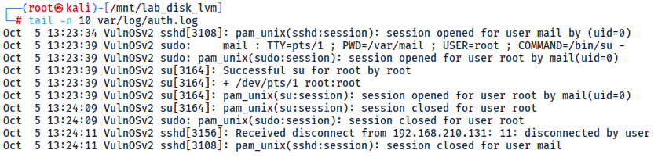

# Hacked Lab

# Context

Lab link: [https://cyberdefenders.org/blueteam-ctf-challenges/hacked/](https://cyberdefenders.org/blueteam-ctf-challenges/hacked/)

Suggested tools: FTKImager, R-Studio, `unshadow`, John The Ripper, RockYou

Tactics: Initial Access, Execution, Persistence, Privilege Escalation, Stealth, Credential Access, Command and Control

# Scenario

A SOC analyst has been called to analyze a compromised Linux web server. Figure out how the threat actor gained access, what modifications were applied to the system, and what persistent techniques were utilized. (e.g. backdoors, users, sessions, etc.).

# Questions

Q1- What is the system timezone?

Answer: Europe/Brussels

Reason: The `Webserver.E01` image was mounted for analysis by attaching it as a raw device with `ewfmount`, identifying the partition layout with `mmls`/`fdisk -l`, and loop-mounting the LVM physical volume with `losetup`; the `VulnOSv2-vg` volume group was then activated using `vgscan` and `vgchange -ay`, and its root logical volume was mounted read-only with the `norecovery` option to avoid journal replay on the evidence filesystem. The system timezone was determined to be `Europe/Brussels`, as recorded in the `/etc/timezone` configuration file on the mounted root filesystem.

```bash
$ cat etc/timezone 
Europe/Brussels
```

**Quick E01 Mounting Guide with LVM**

```bash
# 1. Mount the EWF forensic image so it appears as a block device
sudo ewfmount Webserver.E01 /mnt/lab_disk

# 2. Identify the file type of the exposed raw image
file /mnt/lab_disk/ewf1

# 3. Show partition table with fdisk
fdisk -l /mnt/lab_disk/ewf1

# 4. Show detailed partition layout (Sleuth Kit)
mmls /mnt/lab_disk/ewf1

# 5. Attach the raw image to a loop device and create partition nodes
#    (in this case it became /dev/loop0)
sudo losetup -P -f --show /mnt/lab_disk/ewf1

# 6. Confirm partitions appeared (expect p1, p2, p5)
ls -l /dev/loop0*

# 7. Mount the small normal Linux partition (p1) read-only
sudo mkdir -p /mnt/lab_disk_p1
sudo mount -o ro /dev/loop0p1 /mnt/lab_disk_p1

# 8. Detect and activate the LVM volume group that lives on the logical partition (p5)
sudo vgscan
sudo vgchange -ay

# 9. List the logical volumes that became available
sudo lvdisplay
# or simply:
ls /dev/mapper/
# (you should see: VulnOSv2--vg-root  and  VulnOSv2--vg-swap_1)

# 10. Mount the root logical volume read-only
sudo mkdir -p /mnt/lab_disk_lvm
sudo mount -o ro,noload /dev/mapper/VulnOSv2--vg-root /mnt/lab_disk_lvm

# ========== CLEANUP (run when finished) ==========

# 11. Unmount the logical volume
sudo umount /mnt/lab_disk_lvm

# 12. Unmount the normal partition
sudo umount /mnt/lab_disk_p1

# 13. Deactivate the LVM volume group
sudo vgchange -an

# 14. Detach the loop device
sudo losetup -d /dev/loop0

# 15. Unmount the EWF FUSE mount
sudo umount /mnt/lab_disk

# 16. (Optional) Remove the empty mount directories
sudo rmdir /mnt/lab_disk_lvm /mnt/lab_disk_p1 /mnt/lab_disk
```

Q2- Who was the last user to log in to the system?

Answer: `mail`

Reason: The last user to log in to the compromised system was the `mail` account, authenticating over SSH via `sshd[3108]` at `Oct 5 13:23:34` (system local time, `Europe/Brussels`) from source IP `192.168.210.131`, as recorded in `/var/log/auth.log`. Following authentication, the `mail` user immediately escalated privileges using `sudo` to spawn an interactive `su -` shell as `root` at `13:23:39`, with the session closing and the SSH connection disconnecting by the remote peer at `13:24:11`.



Q3- What was the source port the user `mail` connected from?

Answer: `57708`

Reason: The `mail` account's final successful SSH authentication, corresponding to `sshd[3108]` (the session immediately preceding the privilege escalation to `root` documented in Q2), originated from source IP `192.168.210.131` on source port `57708`, as recorded in `/var/log/auth.log`. Earlier `mail` login attempts from the same source IP were observed on ports `57686`, `57704`, and `57706`, indicating repeated authentication activity against this account prior to the final session.

```bash
$ var/log/auth.log
Oct 5 13:13:53 VulnOSv2 sshd[2624]: Accepted password for mail from 192.168.210.131 port 57686 ssh2
Oct 5 13:18:54 VulnOSv2 sshd[2825]: Accepted password for mail from 192.168.210.131 port 57704 ssh2
Oct 5 13:20:59 VulnOSv2 sshd[2999]: Failed password for mail from 192.168.210.131 port 57706 ssh2
Oct 5 13:21:03 VulnOSv2 sshd[2999]: Accepted password for mail from 192.168.210.131 port 57706 ssh2
Oct 5 13:23:34 VulnOSv2 sshd[3108]: Accepted password for mail from 192.168.210.131 port 57708 ssh2
```

Q4- How long was the last session for user `mail`? (Minutes only)

Answer: 1

Reason: The final SSH session for the `mail` account, tied to `sshd[3108]` from source `192.168.210.131:57708`, opened at `13:23:34` and closed at `13:24:11` per the corresponding `pam_unix(sshd:session)` open/close entries in `/var/log/auth.log`, a duration of approximately 37 seconds, rounding to `1` minute. Within that window the attacker escalated to `root` via `sudo`/`su`, matching the timeline established in Q2 and Q3.

```bash
$ grep -i 57708 var/log/auth.log -A 10
Oct  5 13:23:34 VulnOSv2 sshd[3108]: Accepted password for mail from 192.168.210.131 port 57708 ssh2
Oct  5 13:23:34 VulnOSv2 sshd[3108]: pam_unix(sshd:session): session opened for user mail by (uid=0)
Oct  5 13:23:39 VulnOSv2 sudo:     mail : TTY=pts/1 ; PWD=/var/mail ; USER=root ; COMMAND=/bin/su -
Oct  5 13:23:39 VulnOSv2 sudo: pam_unix(sudo:session): session opened for user root by mail(uid=0)
Oct  5 13:23:39 VulnOSv2 su[3164]: Successful su for root by root
Oct  5 13:23:39 VulnOSv2 su[3164]: + /dev/pts/1 root:root
Oct  5 13:23:39 VulnOSv2 su[3164]: pam_unix(su:session): session opened for user root by mail(uid=0)
Oct  5 13:24:09 VulnOSv2 su[3164]: pam_unix(su:session): session closed for user root
Oct  5 13:24:09 VulnOSv2 sudo: pam_unix(sudo:session): session closed for user root
Oct  5 13:24:11 VulnOSv2 sshd[3156]: Received disconnect from 192.168.210.131: 11: disconnected by user
Oct  5 13:24:11 VulnOSv2 sshd[3108]: pam_unix(sshd:session): session closed for user mail
```

Q5- Which server service did the last user use to log in to the system?

Answer: `sshd`

Reason: The `mail` user authenticated to the system exclusively via the `sshd` service, as shown consistently across all related entries in `/var/log/auth.log`, including the final session's `Accepted password for mail from 192.168.210.131 port 57708 ssh2` and corresponding `pam_unix(sshd:session)` open/close records.

Q6- What type of authentication attack was performed against the target machine?

Answer: brute-force

Reason: The brute-force phase of the attack targeted the `root` account exclusively, beginning at `12:39:26` and continuing through `12:52:52` on `Oct 5`, generating 450 `Failed password for root` entries and 210 corresponding `PAM service(sshd) ignoring max retries` / `maximum authentication attempts exceeded` errors, all originating from source IP `192.168.210.131` as recorded in `/var/log/auth.log`. No `Accepted password for root` entry exists anywhere in the log, indicating the brute-force against `root` was unsuccessful; the attacker's first successful authentication instead occurred at `13:13:53` against the `mail` account from the same source IP, roughly 21 minutes after the `root` brute-force activity ceased.


Q7- How many IP addresses are listed in the `/var/log/lastlog` file?

Answer: 2

Reason: Running `strings` against the binary `/var/log/lastlog` file revealed two distinct IP addresses recorded across its last-login entries: `192.168.56.101`, associated with a `pts/0` session, and `192.168.210.131`, associated with a `pts/1` session and matching the attacker source IP identified in the brute-force and `mail` account compromise established in Q2-Q6.

```bash
$ strings var/log/lastlog
'3*Wtty1
]pts/1
192.168.210.131
2*Wpts/0
192.168.56.101
)Wtty1
```

Q8- How many users have a login shell?

Answer: 5

Reason: Filtering `/etc/passwd` for accounts configured with `/bin/bash` as their login shell identified five such users: `root`, `mail`, `php`, `vulnosadmin`, and `postgres`. All other entries in the file use non-interactive shells (e.g. `/usr/sbin/nologin` or `/bin/false`), consistent with system/service accounts that cannot be used for direct login.

```bash
$ cat etc/passwd | grep -i bash
root:x:0:0:root:/root:/bin/bash
mail:x:8:8:mail:/var/mail:/bin/bash
php:x:999:999::/usr/php:/bin/bash
vulnosadmin:x:1000:1000:vulnosadmin,,,:/home/vulnosadmin:/bin/bash
postgres:x:107:116:PostgreSQL administrator,,,:/var/lib/postgresql:/bin/bash
```

Q9- What is the password of the mail user?

Answer: `forensics`

Reason: The password hash for the `mail` account was extracted by merging `etc/passwd` and `etc/shadow` with `unshadow` into a combined crackable file, then cracking it with `john` using the `rockyou.txt` wordlist. The recovered plaintext password for `mail` is `forensics`, matching the account used for the attacker's initial successful SSH authentication and subsequent privilege escalation to `root` established in Q2-Q4.

```bash
$ unshadow etc/passwd etc/shadow > /root/temp/pass.txt               

$ john --wordlist=/usr/share/wordlists/rockyou.txt /root/temp/pass.txt 
Using default input encoding: UTF-8
Loaded 5 password hashes with 5 different salts (sha512crypt, crypt(3) $6$ [SHA512 512/512 AVX512BW 8x])
Remaining 4 password hashes with 4 different salts
Cost 1 (iteration count) is 5000 for all loaded hashes
Will run 4 OpenMP threads
Press 'q' or Ctrl-C to abort, almost any other key for status
forensics        (php)     
forensics        (mail)     
2g 0:00:00:17 0.93% (ETA: 13:42:58) 0.1137g/s 8906p/s 24624c/s 24624C/s penske..marinell
```

Q10- Which user account was created by the attacker?

Answer: `php`

Reason: The attacker created a new local account, `php`, at `13:06:38` on `Oct 5`, using `useradd -d /usr/php -m --system --shell /bin/bash --skel /etc/skel -G sudo php` executed as `root` via `sudo` from `TTY=pts/0`, as recorded in `/var/log/auth.log`. The account was assigned `UID 999`, given an interactive `/bin/bash` shell, and added directly to the `sudo` group, granting it full administrative privileges. This matches the earlier-observed password change for `php` (Q4) and its presence among the five login-shell accounts identified in Q8, confirming `php` as an attacker-created backdoor account rather than a legitimate service user.

```bash
$ grep -i useradd var/log/auth.log | grep Oct
Oct  5 13:06:38 VulnOSv2 sudo:     root : TTY=pts/0 ; PWD=/tmp ; USER=root ; COMMAND=/usr/sbin/useradd -d /usr/php -m --system --shell /bin/bash --skel /etc/skel -G sudo php
Oct  5 13:06:38 VulnOSv2 useradd[2525]: new group: name=php, GID=999
Oct  5 13:06:38 VulnOSv2 useradd[2525]: new user: name=php, UID=999, GID=999, home=/usr/php, shell=/bin/bash
Oct  5 13:06:38 VulnOSv2 useradd[2525]: add 'php' to group 'sudo'
Oct  5 13:06:38 VulnOSv2 useradd[2525]: add 'php' to shadow group 'sudo'
```

Q11- How many user groups exist on the machine?

Answer: 58

Reason: Enumerating `/etc/group` on the mounted root filesystem showed 58 total lines, each representing one defined group on the system, including both standard system/service groups and the attacker-added `php`/`sudo` membership established in Q10.

```bash
$ cat etc/group | wc -l
58
```

Q12- How many users have `sudo` access?

Answer: 2

Reason: Checking group membership in `/etc/group` showed the `sudo` group (`GID 27`) contains two secondary members: `php` and `mail`. This confirms both the attacker-created `php` backdoor account (Q10) and the initially compromised `mail` account (Q2-Q4) held administrative privileges via `sudo` group membership, explaining how the attacker was able to escalate to `root` through both accounts.

```bash
$ cat etc/group | grep sudo
sudo:x:27:php,mail
```

Q13- What is the home directory of the PHP user?

Answer: `/usr/php`

Reason: Per `/etc/passwd`, the `php` account's home directory is `/usr/php`, matching the `-d /usr/php` flag used when the attacker created the account via `useradd` in Q10. This nonstandard path (outside the usual `/home` tree) is worth flagging as a stealth choice intended to blend the backdoor account in with legitimate system paths.

```bash
$ cat etc/passwd | grep -i php
php:x:999:999::/usr/php:/bin/bash
```

Q14- What command did the attacker use to gain root privilege? (Answer contains two spaces).

Answer: `sudo su -`

Reason: The attacker escalated to `root` privileges using the command `sudo su -`, executed by the `mail` account, as recorded in `/var/log/auth.log`. This was confirmed successful on five separate occasions between `13:14:04` and `13:23:39` on `Oct 5`, each attempt followed by a corresponding `su[PID]: Successful su for root by root` entry.

```bash
$ grep -i "\/bin\/su" var/log/auth.log -A 2
Oct  5 13:14:04 VulnOSv2 sudo:     mail : TTY=pts/1 ; PWD=/var/mail ; USER=root ; COMMAND=/bin/su -
Oct  5 13:14:04 VulnOSv2 sudo: pam_unix(sudo:session): session opened for user root by mail(uid=0)
Oct  5 13:14:04 VulnOSv2 su[2721]: Successful su for root by root
[...]
```

Q15- Which file did the user `root` delete?

Answer: `37292.c`

Reason: The `root/.bash_history` file recorded the command `rm 37292.c`, indicating the attacker deleted a file named `37292.c` after operating as `root`. The `.c` extension and numeric filename are consistent with a downloaded local privilege-escalation exploit source file, likely compiled and removed afterward to reduce forensic footprint on disk.

```bash
$ cat root/.bash_history
[...]
cd /tmp/
ll
rm 37292.c
[...]
```

Q16- Recover the deleted file, open it and extract the exploit author name.

Answer: `rebel`

Reason: The deleted file `37292.c` was successfully recovered from the `VulnOSv2-vg` root volume using `R-Studio`, extracted to `/root/temp/37292.c`. Its header comment identifies it as `ofs.c`, a local root exploit for `overlayfs` targeting `CVE-2015-1328`, authored by `rebel`, dated `2015-06-15`, and effective against Ubuntu kernels `12.04, 14.04, 14.10, 15.04` prior to that date. This confirms the attacker's privilege escalation method following initial access as the `mail` user, consistent with the vulnerable kernel version `3.13.0-24-generic` observed in earlier login records and the compiled `ofs-lib.so` artifact found alongside the deleted source in `/tmp`.

```bash
$ head /root/temp/37292.c 
# Exploit Title: ofs.c - overlayfs local root in ubuntu
# Date: 2015-06-15
# Exploit Author: rebel
# Version: Ubuntu 12.04, 14.04, 14.10, 15.04 (Kernels before 2015-06-15)
# Tested on: Ubuntu 12.04, 14.04, 14.10, 15.04
# CVE : CVE-2015-1328     (http://people.canonical.com/~ubuntu-security/cve/2015/CVE-2015-1328.html)
```


Q17- What is the content management system (CMS) installed on the machine?

Answer: Drupal

Reason: The system runs `Drupal 7` as its content management system (CMS), confirmed by the presence of the `etc/drupal/7` configuration directory tree containing Apache configuration, `.htaccess`, and the standard `sites/all/modules` structure. This aligns with the Drupal-versioned module archives (`libraries-7.x-1.0.zip`, `token-7.x-1.6.zip`, `views-7.x-3.13.zip`) observed in `/tmp` during the file recovery in Q16, and with the `/var/www/html/jabc` web root and `scripts/update.php` file the attacker inspected per their `.bash_history`.

```bash
$ tree etc/drupal | head
etc/drupal
└── 7
    ├── apache2.conf
    ├── htaccess
    └── sites
        ├── all
        │   ├── modules
        │   │   ├── addressfield
        │   │   │   ├── addresses.txt
        │   │   │   ├── addressfield.address_formats.inc
```

Q18- What is the version of the CMS installed on the machine?

Answer: `7.26`

Reason: The Drupal CMS version installed on the target is `7.26`, as declared in the `VERSION` constant within `var/www/html/jabc/includes/bootstrap.inc`. This version predates `7.32` and is therefore vulnerable to the well-known `Drupalgeddon` pre-authentication SQL injection vulnerability.

```bash
$ grep -i version var/www/html/jabc/includes/bootstrap.inc 
 * The current system version.
define('VERSION', '7.26');
```

Q19- Which port was listening to receive the attacker's reverse shell?

Answer: `4444`

Reason: Analysis of `/var/log/apache2/access.log` identified a `POST` request to `/jabc/?q=user/password` at `13:01:27` on `05/Oct/2019` exploiting the `Drupal 7.26` `#post_render` callback injection (`SA-CORE-2014-005`), passing a base64-encoded PHP payload via the `name` parameter. Decoding the payload with CyberChef (`URL Decode` → `From Base64`) revealed PHP code establishing a `stream_socket_client` TCP reverse shell connection to `$ip = '192.168.210.131'` on `$port = 4444`, confirming `4444` as the port the attacker used to receive the reverse shell.


# Attack Chain

| Time (UTC) | Stage | Detail | MITRE |
| --- | --- | --- | --- |
| 2019-10-05 10:39:26 | Credential Access | Brute-force SSH login attempts against root begin from `192.168.210.131`. | T1110.001 |
| 2019-10-05 10:52:52 | Credential Access | Brute-force against root ends after 450 failed attempts and 210 maximum authentication attempts exceeded errors; root was never compromised via this method. | T1110.001 |
| 2019-10-05 11:01:27 | Initial Access | Exploitation of Drupal 7.26 `#post_render assert()` code injection (SA-CORE-2014-005 / CVE-2014-3704) via `POST /jabc/?q=user/password`, delivering a base64-encoded PHP payload. | T1190 |
| 2019-10-05 11:01:27 | Command and Control | PHP `stream_socket_client` reverse shell connects back to `192.168.210.131:4444`. | T1071 |
| ~2019-10-05 11:02-11:06 | Privilege Escalation | Attacker compiles and runs local kernel exploit `37292.c` (`ofs.c`, CVE-2015-1328, `overlayfs`) in `/tmp` within the initial web-shell session (`TTY=pts/0`), elevating from the web service account to root. | T1068 |
| 2019-10-05 11:06:38 | Persistence | Backdoor account `php` created via `useradd -d /usr/php -m --system --shell /bin/bash --skel /etc/skel -G sudo php`, granting sudo membership. | T1136.001 |
| 2019-10-05 11:13:53 | Initial Access | Attacker authenticates over SSH as mail from `192.168.210.131`. | T1078 |
| 2019-10-05 11:14:04-11:23:39 | Privilege Escalation | mail escalates to root five separate times via `sudo su -`, each confirmed by a matching Successful su for root by root entry. | T1548.003 |
| ~2019-10-05 11:14-11:21 | Collection / Credential Access | Attacker reviews `/etc/passwd`, `flag.txt`, `.psql_history`, the Drupal web root `/var/www/html/jabc`, `.htaccess`, and edits `scripts/update.php`, per `root/.bash_history` ordering. | T1005, T1552.001 |
| ~2019-10-05 11:14-11:21 | Defense Evasion | Attacker opens `/etc/lastlog` directly in vim, consistent with manual tampering of login-record evidence. | T1070.002 |
| 2019-10-05 11:21:34-11:21:39 | Persistence | Password set for the `php` backdoor account (`passwd php`) from an interactive root shell. | T1098 |
| 2019-10-05 11:23:39-11:24:09 | Defense Evasion | Attacker deletes the compiled exploit source `tmp/37292.c` (`rm 37292.c`), removing tool evidence from disk. | T1070.004 |
| 2019-10-05 11:24:11 | Command and Control | Final SSH session for mail disconnects; captured evidence window ends. | T1071 |

## Attack Tree

```bash
Drupal 7.26 #post_render assert() RCE (CVE-2014-3704)  ← 192[.]168[.]210[.]131 → 192[.]168[.]210[.]130 (VulnOSv2)
    └── POST hxxp://target/jabc/?q=user/password (base64 PHP payload)
        └── stream_socket_client reverse shell → 192[.]168[.]210[.]131:4444  ← C2 established
            ├── [Stage 1 — Privilege Escalation]
            │   └── compile & run 37292.c (ofs.c, CVE-2015-1328, overlayfs)  ← author "rebel"
            │       └── root shell obtained on TTY=pts/0
            ├── [Stage 2 — Persistence]
            │   ├── useradd php -G sudo (UID 999, /usr/php, /bin/bash)  ← backdoor account
            │   └── passwd php  ← credential set for backdoor
            ├── [Stage 3 — Discovery / Collection]
            │   ├── vim /etc/passwd
            │   ├── cat root/flag.txt
            │   ├── cat .psql_history
            │   └── review /var/www/html/jabc (.htaccess, scripts/update.php)
            ├── [Stage 4 — Defense Evasion]
            │   ├── vim /etc/lastlog  ← manual log tampering
            │   └── rm tmp/37292.c  ← exploit source deleted post-use
            └── [Stage 5 — Follow-on Access]
                └── SSH login as `mail` from 192[.]168[.]210[.]131
                    └── sudo su -  (×5)  ← repeated root escalation via mail:sudo
```

# Artifacts

| Category | Type | Value |
| --- | --- | --- |
| Reconnaissance | Brute-force source IP | `192.168.210.131` |
|  | Target account | root |
|  | Failed attempts | 450 |
|  | Attack window | 10:39:26-10:52:52 UTC |
| Initial Access | CVE | CVE-2014-3704 (SA-CORE-2014-005, Drupalgeddon) |
|  | Vulnerable application | Drupal 7.26 |
|  | Exploited endpoint | `/jabc/?q=user/password` |
|  | Technique | #post_render assert() code injection |
| Command and Control | C2 IP | `192.168.210.131` |
|  | C2 port | 4444 |
|  | Mechanism | `stream_socket_client` PHP reverse shell |
| Privilege Escalation | Exploit file | `tmp/37292.c` (`ofs.c`) |
|  | CVE | CVE-2015-1328 (overlayfs) |
|  | Exploit author | rebel |
|  | Vulnerable kernel | `3.13.0-24-generic` |
|  | Compile artifacts | `ccOOU3I8.c`, `ccK6FJ39.s`, `ccnpfgGI.o`, `ccsuW6mH.o`, `ccHf490f.ld`, `cciXjdFO.le`, `ofs-lib.so` |
| Persistence | Backdoor account | php (UID 999) |
|  | Home directory | `/usr/php` |
|  | Shell | `/bin/bash` |
|  | Privileged group | sudo (php, mail) |
| Credentials | mail password | forensics |
|  | webmin password | webmin1980 |
|  | Cracking method | unshadow + john + rockyou.txt |
| Defense Evasion | Tampered file | `/etc/lastlog` (edited via vim) |
|  | Deleted file | `tmp/37292.c` |
| Web Application | CMS | Drupal 7.26 |
|  | Web root | `/var/www/html/jabc` |
|  | Edited file | `scripts/update.php` |
| Host Indicators | Hostname | VulnOSv2 |
|  | System timezone | Europe/Brussels |
|  | Last logged-in user | mail |
|  | Sensitive file accessed | `root/flag.txt` |

# Lab Insights

- Loud attacks and quiet compromises rarely coincide. The 13-minute SSH brute-force against `root` generated hundreds of log entries and was the most visually obvious activity in the logs, yet it failed completely. The actual breach was a single unauthenticated `POST` request against a nearly two-year-unpatched CMS endpoint. Volume of attack traffic is not a reliable signal of where compromise actually occurred, and an analyst anchoring on the noisiest activity first would have missed the real entry point.
- A low-privilege RCE is only as limiting as the kernel underneath it. The Drupal exploit alone only granted the attacker a web-service-level shell, but an unpatched, multi-year-old kernel vulnerability closed that gap almost instantly. This chain is a clean illustration of why patch cadence has to cover the full stack. A hardened CMS sitting on a stale kernel, or vice versa, still yields full root.
- Persistence was layered rather than singular. Rather than relying on one backdoor, the attacker created a new privileged account, granted an existing service account sudo rights, and kept SSH as a durable channel back in. Any single remediation step (deleting `php`, resetting `mail`'s password) would have left the other mechanisms intact, reinforcing the value of auditing all persistence categories together rather than closing one hole and declaring victory.
- Anti-forensic effort was opportunistic, not disciplined. The attacker deleted the compiled exploit source and directly edited `/etc/lastlog`, showing some awareness of forensic exposure, but left an intact, sequential `.bash_history` and recoverable deleted files behind. Partial cleanup like this is common and is exactly what makes reconstruction possible; a fully disciplined actor would have cleared history entirely or used `unset HISTFILE` from the start.
- Tooling decay cuts both ways. Reconstructing this timeline required working around this analysis host's own deprecated `utmp`/`wtmp` tooling (`utmpdump` removed in favor of `wtmpdb`), a small but pointed parallel to the target's own patch debt that enabled the breach. Unmaintained software creates friction and blind spots regardless of which side of the investigation it sits on.