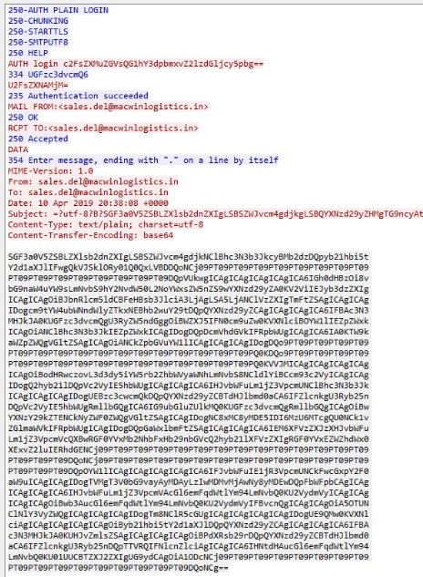

# HawkEye Lab

# Table of Contents
- [Context](#context)
- [Scenario](#scenario)
- [Questions](#questions)
  * [DHCP Option 12 Hostname Disclosure](#dhcp-option-12-hostname-disclosure)
  * [Tshark Network Forensics 101](#tshark-network-forensics-101)
- [Attack Chain](#attack-chain)
  * [Attack Tree](#attack-tree)
- [Artifacts](#artifacts)
- [Lab Insights](#lab-insights)

# Context

Lab link: [https://cyberdefenders.org/blueteam-ctf-challenges/hawkeye/](https://cyberdefenders.org/blueteam-ctf-challenges/hawkeye/)

Suggested tools: Wireshark, Brim, Apackets, MaxMind Geo IP, VirusTotal

Tactics: Initial Access, Execution, Defense Evasion, Credential Access, Discovery, Collection, Command and Control, Exfiltration

# Scenario

An accountant at your organization received an email regarding an invoice with a download link. Suspicious network traffic was observed shortly after opening the email. As a SOC analyst, investigate the network trace and analyze exfiltration attempts.

# Questions

Q1- How many packets does the capture have?

Answer: 4003

Reason: Analysis of the HawkEye Keylogger network capture `stealer.pcap` confirmed a total of `4003` packets, established via a full packet count using Wireshark's command-line companion `tshark`. This baseline packet count sets the scope for the investigation into the exfiltration incident and confirms the capture is intact and non-truncated for subsequent protocol-level analysis.

```bash
$ tshark -r stealer.pcap | wc -l
4003
```

Q2- At what time was the first packet captured (UTC)?

Answer: `2019-04-10 20:37`

Reason: The first packet in the capture was recorded at `2019-04-10 20:37:07 UTC`, a TCP SYN from `10[.]4[.]10[.]132` to `10[.]4[.]10[.]4` on port 88 (Kerberos), representing routine internal domain traffic rather than the malicious activity itself. Establishing this earliest timestamp anchors the capture window and gives a baseline against which the later phishing delivery and exfiltration events can be measured.

```bash
$ tshark -r stealer.pcap -t ud | head -n 1
    1 2019-04-10 20:37:07.129730Z  10.4.10.132 → 10.4.10.4    TCP 66 49190 → 88 [SYN] Seq=0 Win=8192 Len=0 MSS=1460 WS=256 SACK_PERM
```

Q3- What is the duration of the capture?

Answer: 01:03:41

Reason: The capture spans a total duration of `01:03:41`, running from the first packet at `2019-04-10 20:37:07 UTC` to the last packet at `2019-04-10 21:40:48 UTC`, both endpoints confirmed via first/last-line extraction of the full UTC-timestamped packet list. This roughly one-hour window brackets the entire incident from the phishing delivery through the observed exfiltration activity, giving the timeframe within which all subsequent IOC and credential-theft evidence must fall.

```bash
$ tshark -r stealer.pcap -t ud | head -n 1 && tshark -r stealer.pcap -t ud | tail -n 1
    1 2019-04-10 20:37:07.129730Z  10.4.10.132 → 10.4.10.4    TCP 66 49190 → 88 [SYN] Seq=0 Win=8192 Len=0 MSS=1460 WS=256 SACK_PERM
 4003 2019-04-10 21:40:48.690963Z  10.4.10.132 → 10.4.10.4    TCP 54 49228 → 445 [ACK] Seq=3836 Ack=1073 Win=64512 Len=0
```

Q4- What is the most active computer at the link level?

Answer: `00:08:02:1c:47:ae`

Reason: The most active computer at the link level was the host with MAC address `00:08:02:1c:47:ae`, identified via `tshark`'s Ethernet endpoint statistics as generating the highest total traffic in the capture at 4003 packets and 2,390 kB, spanning the full capture window from `2019-04-10 20:37:07 UTC` to `2019-04-10 21:40:48 UTC`. This Layer 2 dominance is consistent with it being the compromised endpoint at the center of the incident, since every packet in the capture traverses this host's interface.

```bash
$ tshark -r stealer.pcap -n -q -z endpoints,eth
================================================================================
Ethernet Endpoints
Filter:<No Filter>
                       | Packets | |  Bytes  | | Tx Packets | | Tx Bytes | | Rx Packets | | Rx Bytes |
00:08:02:1c:47:ae            4003   2,390 kB         1993      212 kB            2010      2,177 kB    
20:e5:2a:b6:93:f1            3352   2,241 kB         1776      2,132 kB          1576      109 kB      
a4:1f:72:c2:09:6a             513   113 kB            234      45 kB              279      68 kB       
01:00:5e:7f:ff:fa              74   28 kB               0      0 bytes             74      28 kB       
ff:ff:ff:ff:ff:ff              31   3,534 bytes         0      0 bytes             31      3,534 bytes 
01:00:5e:00:00:16              23   1,258 bytes         0      0 bytes             23      1,258 bytes 
01:00:5e:00:00:fc              10   750 bytes           0      0 bytes             10      750 bytes   
================================================================================
```

Q5- Manufacturer of the NIC of the most active system at the link level?

Answer: Hewlett-Packard

Reason: The network interface card (NIC) manufacturer of the most active host at the link level, MAC `00:08:02:1c:47:ae`, is confirmed as `Hewlett Packard`, resolved offline via the Kismet OUI database rather than an online lookup. This confirms the compromised endpoint at `2019-04-10 20:37:07 UTC` through `21:40:48 UTC` was HP-manufactured hardware, consistent with a typical corporate workstation and matching the accountant's machine described in the incident scenario.

```bash
$ zcat /usr/share/kismet/kismet_manuf.txt.gz | grep -i "00:08:02"
00:08:02        Hewlett Packard
```

Q6- Where is the headquarter of the company that manufactured the NIC of the most active computer at the link level?

Answer: Palo Alto

Reason: Hewlett Packard's corporate headquarters is located in `Palo Alto, California`, consistent with its identification as the NIC manufacturer of the most active link-level host `00:08:02:1c:47:ae` in the capture. This is background/attribution context rather than pcap-derived evidence, included here to round out the hardware identification chain established in Q4 and Q5.

Q7- The organization works with private addressing and netmask /24. How many computers in the organization are involved in the capture?

Answer: 3

Reason: Three computers in the organization's 10.4.10.0/24 subnet were involved in the capture: `10.4.10.132`, `10.4.10.2`, and `10.4.10.4`, identified via a deduplicated scan of all source and destination IPv4 addresses filtered to RFC 1918 private ranges. The fourth address, `10.4.10.255`, was excluded as the subnet's broadcast address rather than an actual host, since a /24 network's last address is reserved for broadcast traffic and does not correspond to a physical computer.

```bash
$ tshark -r stealer.pcap -T fields -e ip.src -e ip.dst | tr '\t' '\n' | sort -u | grep -E '^(10\.|172\.(1[6-9]|2[0-9]|3[01])\.|192\.168\.)'
10.4.10.132
10.4.10.2
10.4.10.255 # excluded
10.4.10.4
```

Q8- What is the name of the most active computer at the network level?

Answer: `Beijing-5cd1-PC`

Reason: The most active computer at the network level, IP `10.4.10.132`, self-identified as `Beijing-5cd1-PC` in a DHCP Inform request (frame 3263) sent at `2019-04-10 20:47:56 UTC`, extracted from the Option 12 hostname field of that packet. This hostname ties the previously established link-level identifiers, MAC `00:08:02:1c:47:ae` and HP NIC manufacturer, to a concrete machine name, giving a unified identity for the compromised host at the center of the incident.

```bash
$ tshark -r stealer.pcap -Y "dhcp && ip.addr==10.4.10.132"
 3263 649.194871  10.4.10.132 → 255.255.255.255 DHCP 342 DHCP Inform   - Transaction ID 0xc0361803
 3264 649.195335    10.4.10.4 → 10.4.10.132  DHCP 342 DHCP ACK      - Transaction ID 0xc0361803
 
$ tshark -r stealer.pcap -Y "dhcp && ip.addr==10.4.10.132" -T fields -e dhcp.option.hostname
Beijing-5cd1-PC
```

## DHCP Option 12 Hostname Disclosure

**Theme:** Passive host-identification via DHCP metadata leakage
**MITRE ATT&CK:** T1590.005 (Gather Victim Network Information: IP Addresses) / T1018-adjacent (Remote System Discovery, passive variant)

**Offsec**

DHCP and its parent protocol BOOTP encode optional fields as TLVs appended after the fixed header. Option 12 ("Host Name") is one of these — populated by default on most client stacks with the machine's locally configured computer name, and transmitted in every meaningful client-to-server exchange: DISCOVER, REQUEST, and INFORM.

The INFORM case is the interesting pivot for an attacker or analyst working a live segment or a pcap: a DHCPINFORM (message type 8) is sent by a client that *already has* an IP — often domain-joined Windows machines on a static or long-lease address — simply asking the server for auxiliary config (DNS, domain suffix, etc.) on boot or network-profile change. Because Option 12 rides along regardless of *why* the client is talking to the DHCP server, INFORM traffic leaks hostnames completely decoupled from the DORA lease cycle — meaning even machines that never renew a lease during your capture window will still disclose themselves.

None of this requires any interaction beyond capturing broadcast traffic, since DHCP is unauthenticated and unencrypted by design — a host without an IP can't do a secure handshake, so the protocol has to be cleartext at the point of first contact.

**101 example (attacker's view):**

```
tcpdump -i eth0 -n 'udp port 67 or udp port 68' -w dhcp_capture.pcap
tshark -r dhcp_capture.pcap -Y "bootp.option.type==12" -T fields -e ip.src -e bootp.option.hostname
```

That alone, from a passive tap or a rogue AP, yields a self-reported asset inventory: hostnames mapped to source IPs, no exploitation required — pure protocol-design leakage.

**Companion options worth correlating in the same pass:**

- Option 81 (Client FQDN) — often more complete than 12, includes domain suffix
- Option 60 (Vendor Class Identifier) — OS/device fingerprint (MSFT 5.0, android-dhcp, IoT/printer strings)
- Option 55 (Parameter Request List) — ordered option-request fingerprint, conceptually similar to JA3/p0f
- DHCPv6 analog: Option 39 (Client FQDN)

**Defsec**

- Treat DHCP broadcast domains as inherently untrusted for hostname confidentiality — there's no config flag that disables Option 12 broadcast without breaking normal client behavior, so the control has to live elsewhere.
- Segment/VLAN isolate DHCP broadcast domains so passive capture requires a foothold already inside the segment, not just physical/wireless proximity.
- On switched infrastructure, DHCP snooping + port security limits who can *see* broadcast DHCP traffic in the first place, not just who can spoof a server.
- For blue-team detection value, flip this around: unexpected Option 12 hostnames appearing on a segment (naming convention mismatch, unregistered asset, honeypot-triggering name) are a cheap passive-recon tripwire — log DHCP Option 12/81/60 centrally and diff against your asset inventory.
- Wireless environments (open or WPA2-PSK guest SSIDs) are the highest-yield version of this attack surface, since DHCP broadcasts to every associated client by design.

Q9- What is the IP of the organization's DNS server?

Answer: `10.4.10.4`

Reason: The organization's DNS server was identified as `10.4.10.4`, confirmed via a DNS query from `10.4.10.132` at `2019-04-10 20:37:33 UTC` (frame 116) for the SRV record `_ldap._tcp.Default-First-Site-Name._sites.PizzaJukebox-DC.pizzajukebox.com`, which `10.4.10.4` answered directly as the authoritative resolver. This query also reveals the organization's Active Directory domain, `pizzajukebox.com`, and its domain controller hostname, `pizzajukebox-DC`, giving useful context for the broader network topology alongside the DHCP server role already established for the same IP.

```bash
$ tshark -r stealer.pcap dns | head -n 2
  116  26.247746  10.4.10.132 → 10.4.10.4    DNS 134 Standard query 0x9a2c SRV _ldap._tcp.Default-First-Site-Name._sites.PizzaJukebox-DC.pizzajukebox.com
  117  26.248011    10.4.10.4 → 10.4.10.132  DNS 213 Standard query response 0x9a2c No such name SRV _ldap._tcp.Default-First-Site-Name._sites.PizzaJukebox-DC.pizzajukebox.com SOA pizzajukebox-dc.pizzajukebox.com
```

Q10- What domain is the victim asking about in packet 204?

Answer: `proforma-invoices[.]com`

Reason: In packet 204, captured at approximately `2019-04-10 20:37:53 UTC` (46.66 seconds into the capture), the victim host `10.4.10.132` issued a DNS A-record query to `10.4.10.4` for the domain `proforma-invoices[.]com`. This query aligns with the phishing scenario's invoice-themed lure and marks the first network-visible indicator of the victim following the malicious download link, making this domain a primary IOC for the delivery stage of the attack chain.

```bash
$ tshark -r stealer.pcap -Y "frame.number==204"
  204  46.661287  10.4.10.132 → 10.4.10.4    DNS 81 Standard query 0xa002 A proforma-invoices.com
```

Q11- What is the IP of the domain in the previous question?

Answer: `217.182.138.150`

Reason: The domain `proforma-invoices[.]com` resolved to `217[.]182[.]138[.]150`, confirmed via the DNS response in frame 206 at `2019-04-10 20:37:54 UTC` (47.45 seconds into the capture), one second after the victim's query in frame 204. This external IP is the same address previously seen dominating traffic in the IPv4 endpoint statistics from Q7's context, confirming it as the malicious hosting/delivery infrastructure the victim connected to immediately after resolving the invoice-lure domain.

```bash
$ tshark -r stealer.pcap dns | grep -i "proforma-invoices.com"
  204  46.661287  10.4.10.132 → 10.4.10.4    DNS 81 Standard query 0xa002 A proforma-invoices.com
  206  47.447289    10.4.10.4 → 10.4.10.132  DNS 97 Standard query response 0xa002 A proforma-invoices.com A 217.182.138.150
```

Q12- Indicate the country to which the IP in the previous section belongs.

Answer: France

Reason: GeoIP lookup on `217[.]182[.]138[.]150` resolved to `France` (FR), specifically Dunkirk in the Hauts-de-France region, hosted under autonomous system AS16276 (OVH SAS), a well-known bulletproof/budget European hosting provider frequently abused for malicious infrastructure. This confirms the malicious domain `proforma-invoices[.]com` from Q10/Q11 was hosted on French OVH infrastructure at the time of the incident on `2019-04-10 20:37:54 UTC`.

```bash
$ curl http://ipinfo.io/217.182.138.150
{
  "ip": "217.182.138.150",
  "hostname": "ns3072569.ip-217-182-138.eu",
  "city": "Dunkirk",
  "region": "Hauts-de-France",
  "country": "FR",
  "loc": "51.0344,2.3768",
  "org": "AS16276 OVH SAS",
  "postal": "59140",
  "timezone": "Europe/Paris",
  "readme": "https://ipinfo.io/missingauth"
}
```

Q13- What operating system does the victim's computer run?

Answer: Windows NT 6.1

Reason: The victim's HTTP `User-Agent` string reveals the operating system as `Windows NT 6.1`, which corresponds to `Windows 7` (64-bit, per the WOW64 flag indicating a 32-bit process running on a 64-bit OS), extracted from a deduplicated scan of all HTTP User-Agent headers in the capture. The string is spoofed to present as Internet Explorer 7 (`MSIE 7.0`) with Trident/7.0 rendering engine, a combination inconsistent with genuine IE7 and a known pattern of malware/downloader tools using hardcoded or templated User-Agent strings rather than a real browser making the request.

```bash
$ tshark -r stealer.pcap -Y "http.user_agent" -T fields -e http.user_agent | sort -u
Mozilla/4.0 (compatible; MSIE 7.0; Windows NT 6.1; WOW64; Trident/7.0; SLCC2; .NET CLR 2.0.50727; .NET CLR 3.5.30729; .NET CLR 3.0.30729; Media Center PC 6.0; .NET4.0C; .NET4.0E)
```

Q14- What is the name of the malicious file downloaded by the accountant?

Answer: `tkraw_Protected99.exe`

Reason: The malicious file downloaded by the accountant was named `tkraw_Protected99.exe`, retrieved via an HTTP GET to `/proforma/tkraw_Protected99.exe` on the malicious host `217[.]182[.]138[.]150`, shortly after the victim resolved `proforma-invoices[.]com` at `2019-04-10 20:37:54 UTC`. The `Protected` naming convention in the filename is consistent with a crypter or packer wrapping the payload, a common technique to evade static antivirus signature detection prior to execution.

```bash
$ tshark -r stealer.pcap -Y "http.response" -T fields -e http.request.uri
/proforma/tkraw_Protected99.exe
```

Q15- What is the md5 hash of the downloaded file?

Answer: `71826ba081e303866ce2a2534491a2f7`

Reason: The downloaded payload `tkraw_Protected99.exe`, reassembled from the HTTP transfer captured at `2019-04-10 20:37:54 UTC`, has an MD5 hash of `71826ba081e303866ce2a2534491a2f7`, computed directly on the file object exported from the PCAP via `tshark`'s HTTP object extraction. This hash is the primary file-based IOC for the sample and the value to pivot on for VirusTotal/threat-intel lookups to confirm HawkEye Keylogger family attribution.

```bash
$ tshark -r stealer.pcap --export-objects http,extracted_objects
$ md5sum extracted_objects/tkraw_Protected99.exe
71826ba081e303866ce2a2534491a2f7  extracted_objects/tkraw_Protected99.exe
```

Q16- What software runs the webserver that hosts the malware?

Answer: LiteSpeed

Reason: The web server hosting the malicious payload identified itself via the HTTP Server response header as `LiteSpeed`, extracted from the 200 OK response in frame 3155, the same transaction that delivered `tkraw_Protected99.exe` around `2019-04-10 20:37:54 UTC`. LiteSpeed is a lightweight, high-performance web server often chosen by budget/bulletproof hosting providers, consistent with the OVH SAS French infrastructure already identified as hosting `proforma-invoices[.]com` in Q11 and Q12.

```bash
$ tshark -r stealer.pcap -Y "http.response && frame.number==3155" -T fields -e http.server
LiteSpeed
```

Q17- What is the public IP of the victim's computer?

Answer: `173.66.146.112`

Reason: The victim computer's public-facing IP address is `173.66.146.112`, disclosed by the malware itself when it queried the IP-echo service `bot.whatismyipaddress.com` shortly after the payload download, reassembled from TCP stream 15 via `tshark`'s follow-stream feature. This self-reconnaissance step is a common pre-exfiltration/pre-beacon behavior, letting the malware operator confirm the victim's real internet-routable address (as opposed to the internal `10.4.10.132`) before establishing outbound C2 or exfil connections.

```bash
$ tshark -r stealer.pcap -Y 'http.host == "bot.whatismyipaddress.com"' -T fields -e tcp.stream | head -n 1
15
                                                                                                                                                                                                                          
$ tshark -r stealer.pcap -q -z follow,tcp,ascii,15 | tail -n 2                                            
173.66.146.112
===================================================================
```

Q18- In which country is the email server to which the stolen information is sent?

Answer: United States

Reason: The stolen credentials were exfiltrated via SMTP to a mail server geolocated to the `United States` (Phoenix, Arizona), hosted on GoDaddy infrastructure (AS398101) at IP `23.229.162.69`, identified by extracting the destination IP directly from the first SMTP packet in the capture and querying it against `ipinfo.io`. This confirms the final exfiltration channel for the HawkEye keylogger's stolen data used commodity/shared hosting rather than dedicated malicious infrastructure, a common tactic to blend outbound traffic with legitimate mail service usage and avoid IP-reputation-based blocking.

```bash
$ curl "http://ipinfo.io/$(tshark -r stealer.pcap -Y smtp -T fields -e ip.dst | head -n 1)"
{
  "ip": "23.229.162.69",
  "hostname": "69.162.229.23.host.secureserver.net",
  "city": "Phoenix",
  "region": "Arizona",
  "country": "US",
  "loc": "33.4484,-112.0740",
  "org": "AS398101 GoDaddy.com, LLC",
  "postal": "85003",
  "timezone": "America/Phoenix",
  "readme": "https://ipinfo.io/missingauth"
}
```

Q19- Analyzing the first extraction of information. What software runs the email server to which the stolen data is sent?

Answer: `Exim 4.91`

Reason: The SMTP server receiving the stolen data announced itself via its ESMTP banner as running `Exim 4.91`, hosted on `p3plcpnl0413.prod.phx3.secureserver.net` (confirming the GoDaddy/Phoenix infrastructure from Q18), captured in TCP stream 16. The banner's local timestamp `Wed, 10 Apr 2019 13:38:15 -0700` converts to `2019-04-10 20:38:15 UTC`, placing this first exfiltration connection roughly one minute after the malicious payload download at `20:37:54 UTC`, indicating rapid execution and immediate data theft following infection.

```bash
$ tshark -r stealer.pcap -q -z follow,tcp,ascii,16 | grep 220
220-p3plcpnl0413.prod.phx3.secureserver.net ESMTP Exim 4.91 #1 Wed, 10 Apr 2019 13:38:15 -0700 
220-We do not authorize the use of this system to transport unsolicited, 
220 and/or bulk e-mail.
```

Q20- To which email account is the stolen information sent?

Answer: `sales.del@macwinlogistics[.]in`

Reason: The stolen data was exfiltrated to the recipient email address `sales.del@macwinlogistics[.]in`, extracted from the To: header of the SMTP message body within TCP stream 16, at approximately `2019-04-10 20:38:15 UTC` immediately following the Exim banner exchange. This attacker-controlled drop-box address is the primary human-facing IOC for the campaign's data-collection operator, distinct from the GoDaddy-hosted SMTP relay infrastructure itself, which was likely a compromised or abused legitimate mail server rather than attacker-owned.

```bash
$ tshark -r stealer.pcap -q -z follow,tcp,ascii,16 | grep "To: "
To: sales.del@macwinlogistics.in
```

Q21- What is the password used by the malware to send the email?

Answer: `Sales@23`

Reason: The malware authenticated to the exfiltration mail server using the SMTP AUTH LOGIN password `Sales@23`, recovered by decoding the base64-encoded credential string `U2FsZXNAMjM=` sent in response to the server's 334 continuation prompt within TCP stream 16, around `2019-04-10 20:38:15 UTC`. SMTP AUTH LOGIN transmits credentials as base64 rather than encrypting them, so this plaintext-equivalent password was fully recoverable directly from the pcap, confirming the malware used a pre-provisioned, attacker-owned mailbox at `sales.del@macwinlogistics[.]in` to relay stolen data rather than an anonymous open relay.

```bash
$ tshark -r stealer.pcap -q -z follow,tcp,ascii,16 | grep -i "334" -C 3 | tail -n 1
U2FsZXNAMjM=
$ echo "U2FsZXNAMjM=" | base64 -d
Sales@23
```

Q22- Which malware variant exfiltrated the data?

Answer: `Reborn v9`

Reason: Base64-decoding the full SMTP message body in TCP stream 16 (sent around `2019-04-10 20:38:15 UTC`) revealed the exfiltrated report's header text identifying the malware as `HawkEye Keylogger - Reborn v9`, confirming the specific variant behind this incident. "Reborn" is a well-documented HawkEye fork/rebrand line sold commercially on underground forums, and the report header format ("`Passwords Logs`" at the top of the decoded body) is a signature layout characteristic of this builder's default exfiltration template.

```bash
# Decoded base64 blob from SMTP stream 16
HawkEye Keylogger - Reborn v9
Passwords Logs
roman.mcguire \ BEIJING-5CD1-PC

==================================================
URL               : hxxps://login.aol.com/account/challenge/password
Web Browser       : Internet Explorer 7.0 - 9.0
User Name         : roman.mcguire914@aol.com
Password          : P@ssw0rd$
Password Strength : Very Strong
User Name Field   : 
Password Field    : 
Created Time      : 
Modified Time     : 
Filename          : 
==================================================

==================================================
URL               : hxxps://www.bankofamerica.com/
Web Browser       : Chrome
User Name         : roman.mcguire
Password          : P@ssw0rd$
Password Strength : Very Strong
User Name Field   : onlineId1
Password Field    : passcode1
Created Time      : 4/10/2019 2:35:17 AM
Modified Time     : 
Filename          : C:\Users\roman.mcguire\AppData\Local\Google\Chrome\User Data\Default\Login Data
==================================================

==================================================
Name              : Roman McGuire
Application       : MS Outlook 2002/2003/2007/2010
Email             : roman.mcguire@pizzajukebox.com
Server            : pop.pizzajukebox.com
Server Port       : 995
Secured           : No
Type              : POP3
User              : roman.mcguire
Password          : P@ssw0rd$
Profile           : Outlook
Password Strength : Very Strong
SMTP Server       : smtp.pizzajukebox.com
SMTP Server Port  : 587
==================================================
```



Q23- What are the `bankofamerica` access credentials? (`username`:`password`)

Answer: `roman.mcguire`:`P@ssw0rd$`

Reason: The stolen Bank of America credentials harvested by HawkEye Reborn v9 belong to `roman.mcguire` : `P@ssw0rd$`, extracted from the decoded SMTP exfiltration body in TCP stream 16 and sourced from Chrome's saved-password store at `C:\Users\roman.mcguire\AppData\Local\Google\Chrome\User Data\Default\Login Data`, originally captured/created on `2019-04-10 02:35:17 (local)` per the log's own timestamp. This confirms the malware's credential-harvesting module pulled directly from the browser's local password database rather than intercepting live keystrokes for this particular entry, and identifies the victim account holder's likely real name, `roman.mcguire`, tying the technical artifacts to a specific individual.

Q24- Every how many minutes does the collected data get exfiltrated?

Answer: 10

Reason: Seven distinct SMTP exfiltration connections (streams 16, 21, 24, 27, 29, 35, 37) were identified, all initiated from `10.4.10.132` to `23.229.162.69:587`. Comparing the SYN timestamps of consecutive streams shows a consistent interval of roughly 604 seconds between each exfiltration attempt: `68.78s → 673.21s` (604.4s), `673.21s → 1277.47s` (604.3s), and `1277.47s → 1883.23s` (605.8s), confirming HawkEye Reborn v9 beacons its stolen data out on a fixed `10`-minute interval rather than triggering exfil per-event.

```bash
$ tshark -r stealer.pcap -Y "smtp" -T fields -e tcp.stream | sort -u
16
21
24
27
29
35
37

$ for s in 16 21 24 27 29 35 37; do tshark -r stealer.pcap -Y "tcp.stream==$s" | head -n 1; done
 3172  68.784554  10.4.10.132 → 23.229.162.69 TCP 66 49206 → 587 [SYN] Seq=0 Win=8192 Len=0 MSS=1460 WS=256 SACK_PERM
 3303 673.205357  10.4.10.132 → 23.229.162.69 TCP 66 49211 → 587 [SYN] Seq=0 Win=8192 Len=0 MSS=1460 WS=256 SACK_PERM
 3390 1277.468789  10.4.10.132 → 23.229.162.69 TCP 66 49214 → 587 [SYN] Seq=0 Win=8192 Len=0 MSS=1460 WS=256 SACK_PERM
 3475 1883.232788  10.4.10.132 → 23.229.162.69 TCP 66 49217 → 587 [SYN] Seq=0 Win=8192 Len=0 MSS=1460 WS=256 SACK_PERM
 3590 2487.360816  10.4.10.132 → 23.229.162.69 TCP 66 49219 → 587 [SYN] Seq=0 Win=8192 Len=0 MSS=1460 WS=256 SACK_PERM
 3845 3091.532146  10.4.10.132 → 23.229.162.69 TCP 66 49225 → 587 [SYN] Seq=0 Win=8192 Len=0 MSS=1460 WS=256 SACK_PERM
 3923 3695.655993  10.4.10.132 → 23.229.162.69 TCP 66 49227 → 587 [SYN] Seq=0 Win=8192 Len=0 MSS=1460 WS=256 SACK_PERM
```

## Tshark Network Forensics 101

- `r file | wc -l` - Raw packet count of the capture; run first to confirm the capture is intact and scope the investigation.
`tshark -r stealer.pcap | wc -l`
Output: `4003`
- `t ud` - Prints every packet's timestamp as absolute UTC instead of relative/local time; anchors every subsequent finding to a UTC timeline.
`tshark -r stealer.pcap -t ud | head -n 1`
Output: `1 2019-04-10 20:37:07.129730Z 10.4.10.132 → 10.4.10.4 TCP 66 49190 → 88 [SYN]`
- `n -q -z endpoints,eth` - Link-layer (MAC) endpoint statistics with vendor resolution disabled; identifies the most active host by raw traffic volume at Layer 2.
`tshark -r stealer.pcap -n -q -z endpoints,eth`
Output: `00:08:02:1c:47:ae 4003 2,390 kB`
- `T fields -e ip.src -e ip.dst | sort -u` - Deduplicated list of every source/destination IP seen; combine with a private-range grep to enumerate internal hosts.
`tshark -r stealer.pcap -T fields -e ip.src -e ip.dst | tr '\t' '\n' | sort -u | grep -E '^(10.|172.(1[6-9]|2[0-9]|3[01]).|192.168.)'`
Output: `10.4.10.132` / `10.4.10.2` / `10.4.10.4`
- `Y "dhcp && ip.addr==<ip>" -T fields -e dhcp.option.hostname` - Extracts a host's self-reported computer name from DHCP Option 12; works because DHCP is unauthenticated plaintext broadcast.
`tshark -r stealer.pcap -Y "dhcp && ip.addr==10.4.10.132" -T fields -e dhcp.option.hostname`
Output: `Beijing-5cd1-PC`
- `Y "dns"` - Filters to DNS query/response traffic; reveals domain lookups, resolved IPs, and internal AD/LDAP naming.
`tshark -r stealer.pcap -Y dns`
Output: `204 ... A proforma-invoices.com` / `206 ... A proforma-invoices.com A 217.182.138.150`
- `Y "frame.number==<n>"` - Pulls a single packet by its index once a frame number is known from a prior filtered result; use `O <proto>` for full tree detail or `x` for raw hex+ASCII.
`tshark -r stealer.pcap -Y "frame.number==3166" -O http`
Output: full HTTP response tree including headers and reassembled body
- `Y "http.user_agent" -T fields -e http.user_agent | sort -u` - Deduplicated User-Agent strings; useful as a weak behavioral IOC (client-controlled, easily spoofed, not proof of real OS).
`tshark -r stealer.pcap -Y "http.user_agent" -T fields -e http.user_agent | sort -u`
Output: `Mozilla/4.0 (compatible; MSIE 7.0; Windows NT 6.1; ...)`
- `-export-objects http,<dir>` - Reassembles and writes every HTTP response body to disk as individual files; the CLI equivalent of Wireshark's Export Objects, needed to hash/analyze a downloaded payload.
`tshark -r stealer.pcap --export-objects http,extracted_objects`
Output: `extracted_objects/tkraw_Protected99.exe`
- `Y "tcp.stream==<n>"` - Filters to every packet in one TCP conversation using tshark's per-connection stream index; the safe way to scope export/decode operations to a single exchange without breaking reassembly.
`tshark -r stealer.pcap -Y "tcp.stream==16" | head -n 1`
Output: `3172 68.784554 10.4.10.132 → 23.229.162.69 TCP [SYN]`
- `q -z follow,tcp,ascii,<stream>` - Reassembles an entire TCP stream into a single readable ASCII transcript, in order; the most reliable way to read a full protocol exchange (SMTP, HTTP) when field extraction truncates or a body needs full context.
`tshark -r stealer.pcap -q -z follow,tcp,ascii,16 | grep "To: "`
Output: `To: sales.del@macwinlogistics.in`
- `Y "smtp" -T fields -e tcp.stream | sort -u` - Enumerates every distinct SMTP session in the capture; reveals repeated/periodic exfiltration behavior when compared across streams.
`tshark -r stealer.pcap -Y "smtp" -T fields -e tcp.stream | sort -u`
Output: `16` / `21` / `24` / `27` / `29` / `35` / `37`
- `for s in <streams>; do tshark -r file -Y "tcp.stream==$s" | head -n 1; done` - Batch-extracts the first (SYN) packet timestamp from a list of streams; used to measure the interval between repeated exfiltration events instead of checking each stream by hand.
`for s in 16 21 24 27; do tshark -r stealer.pcap -Y "tcp.stream==$s" | head -n 1; done`
Output: SYN timestamps at `68.78s`, `673.21s`, `1277.47s`, `1883.23s` (~604s apart, ~10 min interval)

# Attack Chain

| Time (UTC) | Stage | Detail | MITRE |
| --- | --- | --- | --- |
| `2019-04-10 20:37:07` | (Baseline) | Capture start; earliest packet observed on `10.4.10.0/24` internal segment. | -- |
| `2019-04-10 20:37:53` | Initial Access | Victim host `Beijing-5cd1-PC` (`10.4.10.132`) resolves invoice-lure domain `proforma-invoices[.]com` following a phishing email click. | `T1566.002` |
| `2019-04-10 20:37:54` | Initial Access | DNS response resolves lure domain to `217[.]182[.]138[.]150` (OVH SAS, Dunkirk, France). | `T1566.002` |
| `2019-04-10 20:37:54` | Execution | Victim downloads `tkraw_Protected99.exe` via HTTP GET from `hxxp://proforma-invoices[.]com/proforma/tkraw_Protected99.exe`, served by `LiteSpeed`. MD5 `71826ba081e303866ce2a2534491a2f7`. | `T1204.002` |
| `2019-04-10 20:38:15` | Discovery | Malware queries `bot.whatismyipaddress[.]com` to determine the victim's public egress IP, `173.66.146.112`. | `T1016` |
| `2019-04-10 20:38:15` | Credential Access | HawkEye Keylogger "Reborn v9" harvests saved credentials from Chrome's local login store, including Bank of America (`roman.mcguire` : `P@ssw0rd$`). | `T1555.003` |
| `2019-04-10 20:38:15` | Command and Control | First outbound SMTP session (TCP stream 16) to `23.229.162.69:587` (`Exim 4.91`, GoDaddy-hosted, Phoenix AZ, US), authenticating via AUTH LOGIN with base64-decoded password `Sales@23`. | `T1071.003` |
| `2019-04-10 20:38:15` | Exfiltration | Stolen credential report emailed to attacker-controlled drop address `sales.del@macwinlogistics[.]in`. | `T1048.003` |
| `2019-04-10 20:48:20` | Exfiltration | Second periodic exfiltration cycle (TCP stream 21), ~604s after the first. | `T1048.003` |
| `2019-04-10 20:58:24` | Exfiltration | Third periodic exfiltration cycle (TCP stream 24). | `T1048.003` |
| `2019-04-10 21:08:30` | Exfiltration | Fourth periodic exfiltration cycle (TCP stream 27); pattern continues at a fixed ~10-minute interval through streams 29, 35, 37 to capture end. | `T1048.003` |
| `2019-04-10 21:40:48` | (Baseline) | Capture ends; last packet observed. | -- |

## Attack Tree

```bash
[Phishing Email — Invoice Lure]  ← attacker → accountant (Beijing-5cd1-PC, 10.4.10.132)
    └── victim clicks download link
        └── DNS resolves proforma-invoices[.]com → 217[.]182[.]138[.]150  ← 2019-04-10 20:37:54 UTC
            └── [Stage 1 — Delivery & Execution]
            │   └── HTTP GET /proforma/tkraw_Protected99.exe (LiteSpeed, OVH/France)
            │       └── payload executes as HawkEye Keylogger "Reborn v9"
            │           ├── MD5: 71826ba081e303866ce2a2534491a2f7
            │           └── UA spoofed: MSIE 7.0 / Trident 7.0 (weak IOC only)
            └── [Stage 2 — Discovery & Collection]
                └── queries bot.whatismyipaddress[.]com → public IP 173.66.146.112  ← 2019-04-10 20:38:15 UTC
                    └── harvests Chrome saved credentials
                        └── Bank of America: roman.mcguire : P@ssw0rd$
                            └── [Stage 3 — C2 & Exfiltration]
                                └── SMTP AUTH LOGIN → 23.229.162.69:587 (Exim 4.91, GoDaddy/Phoenix US)
                                │   └── password: Sales@23 (base64-decoded)
                                └── report emailed to sales.del@macwinlogistics[.]in
                                    └── repeats every ~10 min (streams 16→21→24→27→29→35→37)
```

# Artifacts

| Category | Type | Value |
| --- | --- | --- |
| Delivery | Vector | Phishing email with invoice-themed download link |
|  | Lure domain | `proforma-invoices[.]com` |
|  | Hosting IP | `217[.]182[.]138[.]150` |
|  | Hosting location | `Dunkirk, France (AS16276 OVH SAS)` |
|  | Web server software | `LiteSpeed` |
| Dropped File | Filename | `tkraw_Protected99.exe` |
|  | Download path | `/proforma/tkraw_Protected99.exe` |
|  | MD5 hash | `71826ba081e303866ce2a2534491a2f7` |
|  | Malware family | `HawkEye Keylogger - Reborn v9` |
| Host Indicators | Victim hostname | `Beijing-5cd1-PC` |
|  | Victim internal IP | `10.4.10.132` |
|  | Victim MAC address | `00:08:02:1c:47:ae` |
|  | NIC manufacturer | `Hewlett Packard` |
|  | Victim OS (UA-reported, weak IOC) | `Windows NT 6.1 (Windows 7)` |
|  | Victim public IP | `173.66.146.112` |
|  | Compromised user account | `roman.mcguire` |
| Network | Internal DNS/DHCP server | `10.4.10.4` |
|  | AD domain | `pizzajukebox.com` |
|  | Domain controller | `pizzajukebox-DC` |
|  | IP-echo recon service | `bot.whatismyipaddress[.]com` |
| Credential Access | Stolen credential set | Bank of America: `roman.mcguire` : `P@ssw0rd$` |
|  | Credential source | `C:\Users\roman.mcguire\AppData\Local\Google\Chrome\User Data\Default\Login Data` |
| Exfiltration / C2 | SMTP relay IP:port | `23.229.162.69:587` |
|  | SMTP server software | `Exim 4.91` |
|  | SMTP hosting | `Phoenix, Arizona, US (AS398101 GoDaddy.com, LLC)` |
|  | SMTP AUTH password | `Sales@23` |
|  | Exfil destination mailbox | `sales.del@macwinlogistics[.]in` |
|  | Exfil interval | `~10 minutes` (streams 16→21→24→27→29→35→37) |

# Lab Insights

- Plaintext protocols leak more than they intend to. DHCP, SMTP AUTH LOGIN, and even the malware's own IP-echo check were all readable in full without decryption, because none of these protocols were ever designed to carry secrets over the wire in the clear. The lesson generalizes past this lab: any legacy or unauthenticated protocol touching a host will volunteer identifying metadata (hostnames, credentials, self-disclosed IPs) to anyone capturing traffic, making protocol choice itself a forensic weak point independent of the malware's own obfuscation.
- Self-reported data is reconnaissance, not incidental noise. The malware's User-Agent string, its DHCP hostname broadcast, and its query to an IP-echo service were all things the compromised host said about itself rather than things an analyst observed directly. Some of this (UA) is trivially spoofable and should be weighted as weak evidence, while other self-reports (DHCP Option 12, the actual egress-IP check) are functionally reliable because the protocol or the malware's own operational need forces honesty. Distinguishing which self-reported artifacts are trustworthy versus performative is a recurring judgment call in network forensics.
- Commodity infrastructure is chosen specifically to blend in. Every piece of attacker infrastructure in this incident, from the LiteSpeed-hosted delivery site on OVH to the Exim-based SMTP relay on GoDaddy, was legitimate, low-cost, shared hosting rather than dedicated malicious infrastructure. This is a deliberate evasion strategy: traffic to well-known hosting providers and standard mail server software doesn't trigger the same reputation-based scrutiny that traffic to purpose-built C2 infrastructure would, letting exfiltration hide in the statistical noise of ordinary internet traffic.
- Timing regularity is itself an indicator. The exfiltration traffic wasn't distinguishable from legitimate SMTP by protocol or destination alone, but its near-exact ~10-minute periodicity across seven separate sessions was a clear behavioral fingerprint no human sender would produce. When content-based signatures are weak or absent, timing-interval analysis across a cluster of related connections can surface automation that content inspection alone would miss.
- Offline enrichment kept the investigation self-contained. MAC vendor identification, GeoIP attribution, and hostname recovery were all achievable using local databases and a single unauthenticated API call, without needing a paid threat-intel platform or online sandbox. This matters operationally: an analyst working air-gapped or resource-constrained environments can still reconstruct most of an incident's who/what/where using tooling that ships with the OS or requires no persistent internet dependency.