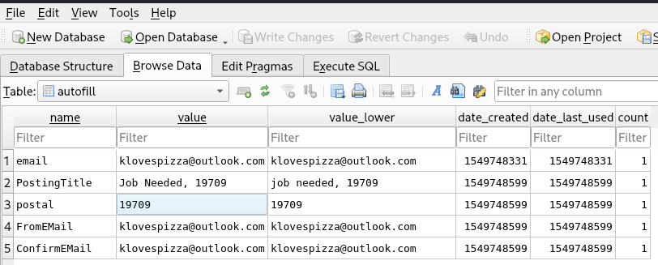

# HireMe Lab

# Context

Lab link: [https://cyberdefenders.org/blueteam-ctf-challenges/hireme/](https://cyberdefenders.org/blueteam-ctf-challenges/hireme/)

Suggested tools: FTK Imager, Autopsy, Registry Explorer, `LECmd`, RegRipper, OST Viewer

Tactics: Execution, Credential Access, Discovery, Command and Control

# Scenario

Karen is a security professional looking for a new job. A company called "TAAUSAI"  offered her a position and asked her to complete a couple of tasks to prove her technical competency. As a soc analyst Analyze the provided disk image and answer the questions based on your understanding of the cases she was assigned to investigate.

# Questions

Q1- What is the administrator's username?

Answer: `Karen`

Reason: After mounting the `.ad1` image using `4n6mount`, the disk image's SAM (Security Account Manager) hive at `Windows\System32\config\SAM` shows a single local user profile, `Karen` (RID `1001`, SID `S-1-5-21-1649836244-3544936428-1548601679-1001`), created `2019-01-26 19:40:22 UTC` and last logged in `2019-03-22 23:22:01 UTC`. Group membership parsed from the same hive's `Administrators` group (`LastWrite` `2019-01-26 19:42:35 UTC`) confirms Karen's SID is listed alongside the built-in Administrator SID (`...-500`), establishing her as the administrator account referenced in the case.

```bash
$ regripper -r ./Windows/System32/config/SAM -p samparse | grep Karen -A 5
Launching samparse v.20220921
Username        : Karen [1001]
SID             : S-1-5-21-1649836244-3544936428-1548601679-1001
Full Name       : 
User Comment    : 
Account Type    : 
Account Created : Sat Jan 26 19:40:22 2019 Z
                                                                                                                                   
$ regripper -r ./Windows/System32/config/SAM -p samparse | grep Administrators -A 5 
Launching samparse v.20220921
Group Name    : Administrators [2]
LastWrite     : Sat Jan 26 19:42:35 2019 Z
Group Comment : Administrators have complete and unrestricted access to the computer/domain
Users :
  S-1-5-21-1649836244-3544936428-1548601679-500
  S-1-5-21-1649836244-3544936428-1548601679-1001
```

Q2- What is the OS's build number?

Answer: 16299

Reason: Windows OS build information stored in the `SOFTWARE` hive's `Microsoft\Windows NT\CurrentVersion` key identifies the installed build as `16299`, which corresponds to Windows 10 version 1709 ("Fall Creators Update"), confirming the `CurrentBuild` value read directly from the registry rather than an OS-reported string.

```bash
$ reglookup -p "Microsoft/Windows NT/CurrentVersion/CurrentBuild" ./Windows/System32/config/SOFTWARE
PATH,TYPE,VALUE,MTIME
/Microsoft/Windows NT/CurrentVersion/CurrentBuild,SZ,16299,
```

Q3- What is the hostname of the computer?

Answer: `TOTALLYNOTAHACK`

Reason: The `SYSTEM` hive's `ControlSet001\Control\ComputerName\ComputerName` key identifies the machine hostname as `TOTALLYNOTAHACK`, with the key itself last written `2019-01-26 20:25:35 UTC` corresponding to the original system setup timeframe.

```bash
$ reglookup -p "ControlSet001/Control/ComputerName/ComputerName" ./Windows/System32/config/SYSTEM
PATH,TYPE,VALUE,MTIME
/ControlSet001/Control/ComputerName/ComputerName,KEY,,2019-01-26 20:25:35
/ControlSet001/Control/ComputerName/ComputerName/,SZ,mnmsrvc,
/ControlSet001/Control/ComputerName/ComputerName/ComputerName,SZ,TOTALLYNOTAHACK,
```

Q4- A messaging application was used to communicate with a fellow Alpaca enthusiast. What is the name of the software?

Answer: Skype

Reason: Enumeration of installed applications via the `SOFTWARE` hive's `WOW6432Node\Microsoft\Windows\CurrentVersion\Uninstall` key identifies `Skype version 8.41` as the messaging application installed on the system, corroborated by the presence of the matching installer `Skype-8.41.0.54.exe` observed on the separate `PacaLady` partition.

```bash
$ reglookup -p "Wow6432Node/Microsoft/Windows/CurrentVersion/Uninstall" ./Windows/System32/config/SOFTWARE | \
  grep DisplayName
/WOW6432Node/Microsoft/Windows/CurrentVersion/Uninstall/Dropbox/DisplayName,SZ,Dropbox,
/WOW6432Node/Microsoft/Windows/CurrentVersion/Uninstall/Google Chrome/DisplayName,SZ,Google Chrome,
/WOW6432Node/Microsoft/Windows/CurrentVersion/Uninstall/Skype_is1/DisplayName,SZ,Skype version 8.41,
/WOW6432Node/Microsoft/Windows/CurrentVersion/Uninstall/{099218A5-A723-43DC-8DB5-6173656A1E94}/DisplayName,SZ,Dropbox Update Helper,
/WOW6432Node/Microsoft/Windows/CurrentVersion/Uninstall/{60EC980A-BDA2-4CB6-A427-B07A5498B4CA}/DisplayName,SZ,Google Update Helper,
/WOW6432Node/Microsoft/Windows/CurrentVersion/Uninstall/{90160000-008C-0000-0000-0000000FF1CE}/DisplayName,SZ,Office 16 Click-to-Run Extensibility Component,
/WOW6432Node/Microsoft/Windows/CurrentVersion/Uninstall/{90160000-008C-0409-0000-0000000FF1CE}/DisplayName,SZ,Office 16 Click-to-Run Localization Component,

# ll
total 112379
-rw-r--r-- 1 root root     2560 Dec 31  1969 '$AttrDef'
-rw-r--r-- 1 root root        0 Dec 31  1969 '$BadClus'
-rw-r--r-- 1 root root    99904 Dec 31  1969 '$Bitmap'
-rw-r--r-- 1 root root     8192 Dec 31  1969 '$Boot'
drwxr-xr-x 1 root root      552 Dec 31  1969 '$Extend'
-rw-r--r-- 1 root root     4096 Dec 31  1969 '$I30'
-rw-r--r-- 1 root root 14417920 Dec 31  1969 '$LogFile'
-rw-r--r-- 1 root root   262144 Dec 31  1969 '$MFT'
-rw-r--r-- 1 root root     4096 Dec 31  1969 '$MFTMirr'
drwxr-xr-x 1 root root      224 Dec 31  1969 '$RECYCLE.BIN'
-rw-r--r-- 1 root root       56 Dec 31  1969 '$Secure'
-rw-r--r-- 1 root root       56 Dec 31  1969 '$TXF_DATA'
-rw-r--r-- 1 root root   131072 Dec 31  1969 '$UpCase'
-rw-r--r-- 1 root root        0 Dec 31  1969 '$Volume'
-rw-r--r-- 1 root root  1447178 Dec 31  1969  7z1900-x64.exe
-rw-r--r-- 1 root root    53451 Dec 31  1969  AlpacaCare.docx
-rw-r--r-- 1 root root     3893 Dec 31  1969  AlpacaCare.docx.FileSlack
-rw-r--r-- 1 root root   882680 Dec 31  1969  antimalwaresetup.exe
-rw-r--r-- 1 root root  1169944 Dec 31  1969  HashTab_v6.0.0.34_Setup.exe
-rw-r--r-- 1 root root 16381325 Dec 31  1969 'RandomDocuments-ChallengeII (1).7z'
-rw-r--r-- 1 root root 16381325 Dec 31  1969  RandomDocuments-ChallengeII.7z
-rw-r--r-- 1 root root 63820768 Dec 31  1969  Skype-8.41.0.54.exe
drwxr-xr-x 1 root root      392 Dec 31  1969 'System Volume Information'
```

Q5- What is the zip code of the administrator's post?

Answer: 19709

Reason: Chrome's `Web Data` SQLite database at `Users\Karen\AppData\Local\Google\Chrome\User Data\Default\Web Data`, table `autofill`, contains a form submission with `PostingTitle` value `Job Needed, 19709` and a separate `postal` field explicitly recording `19709`, associated with the email `klovespizza@outlook.com` and dated `2019-02-09 21:43:19 UTC` (`date_created`/`date_last_used` epoch `1549748599`), identifying `19709` as the zip code tied to Karen's online post.



```bash
$ sqlitebrowser ./Users/Karen/AppData/Local/Google/Chrome/User\ Data/Default/Web\ Data &
```

Q6- What are the initials of the person who contacted the admin user from TAAUSAI?

Answer: MS

Reason: Karen's Outlook OST at `Users\Karen\AppData\Local\Microsoft\Outlook\klovespizza@outlook.com.ost`, parsed to `mbox` via `readpst`, contains an inbox message dated `2019-03-07 21:16:10 -0500` (`2019-03-08 02:16:10 UTC`) relayed through Craigslist's anonymized email relay (`7066d7539fdf30539e2e43ba5fd21606@reply.craigslist.org`) from a sender identifying as "Micheal Scotch" of "The Alpaca Association of USA International (TAAUSAI)," referencing Karen's Craigslist job-seeking post and offering a high-paying technical job, establishing the sender's initials as MS.

```bash
$ readpst -o /home/kali/ctf_stuff/defsec/temp ./Users/Karen/AppData/Local/Microsoft/Outlook/klovespizza@outlook.com.ost

$ mousepad /home/kali/ctf_stuff/defsec/temp/Inbox.mbox

From: "Alpaca Activists" <7066d7539fdf30539e2e43ba5fd21606@reply.craigslist.org>
To: 7066d7539fdf30539e2e43ba5fd21606@res.craigslist.org
Subject: Job Offer *High paying
Date: Thu, 7 Mar 2019 21:16:10 -0500

[...]

----boundary-LibPST-iamunique-372617539_-_-
Content-Type: text/html; charset="utf-8"

<meta http-equiv="Content-Type" content="text/html; charset=utf-8"><div dir="ltr"><div>Hello Ms. Karen,<div><br></div><div>My name is Micheal Scotch and I work with The Alpaca Association of USA International (TAAUSAI). We here at the TAAUSAI are passionate about fighting for Alpaca animal rights in the United States of America and across the world, but we need your help!</div><div><br></div><div>We came across your Craigslist entry&nbsp;<a href="https://vermont.craigslist.org/res/6815562978.html" target="_blank">here</a>&nbsp;and wanted to know if you'd be interested in a high paying technical job involving the use of computers. Don't worry about your skill level, we'll supply you with what you need.</div><div><br></div><div>Let us know what you think.</div><div><br></div><div>Best,</div><div>- Micheal Scotch</div><div><br class="gmail-Apple-interchange-newline"></div></div><div dir="ltr" class="gmail_signature" data-smartmail="gmail_signature"><div dir="ltr"><div><div dir="ltr">_ _ _<br><div>The Alpaca Association of USA International (TAAUSAI)</div><div><br></div><div><br></div></div></div></div></div></div>
<p><br>
<hr>Original craigslist post:<br>
<a href="https://vermont.craigslist.org/res/6815562978.html">https://vermont.craigslist.org/res/6815562978.html</a><br>
About craigslist mail:<br>
<a href="https://craigslist.org/about/help/email-relay">https://craigslist.org/about/help/email-relay</a><br>
Please flag unwanted messages (spam, scam, other):<br>
<a href="https://craigslist.org/mf/dfe67012ce76a52fa2c843c0a72c399bf3fb5bd2.1">https://craigslist.org/mf/dfe67012ce76a52fa2c843c0a72c399bf3fb5bd2.1</a><hr></p>

----boundary-LibPST-iamunique-372617539_-_---
```


Q7- How much money was TAAUSAI willing to pay upfront?

Answer: 150000

Reason: A follow-up email from "M.S." of TAAUSAI, found in Karen's parsed Outlook `mbox`, states TAAUSAI was "willing to pay $150,000 USD upfront, and more at the completion of the job," and provides a direct contact address of [taausai@gmail.com](mailto:taausai@gmail.com) for replies, confirming the upfront payment offer as $150,000 USD.

```bash
meta http-equiv="Content-Type" content="text/html; charset=utf-8"><div dir="ltr"><div dir="ltr">Hello Ms. Karen,<div><br></div><div><div>We are attempting to reach out to you again to see if you'd still be interested in working with us. As we previously mentioned, this is a high paying technical job involving computers. That may sound scary, but all you need to know is how to turn a computer on. We'll provide you with resources about on how to do the rest.</div><div><br></div><div>Let us know if you're interested. We're willing to pay $150,000 USD upfront, and more at the completion of the job.&nbsp;</div><div><br></div><div>Feel free to reply to this email, or send us a message at&nbsp;<a href="mailto:taausai@gmail.com">taausai@gmail.com</a>.&nbsp;</div><div><br></div><div>We look forward to hearing back from you soon!</div><div><br></div><div>Best,</div><div>M.S.</div>-- <br><div dir="ltr" class="gmail_signature"><div dir="ltr"><div><div dir="ltr">_ _ _<br><div>The Alpaca Association of USA International (TAAUSAI)</div><div><br></div><div><br></div></div></div></div></div></div></div></div>
```

Q8- What country is the admin user meeting the hacker group in?

Answer: Egypt

Reason: A follow-up email from TAAUSAI directed Karen to meet the group in person, providing GPS coordinates `27°22'50.10"N`, `33°37'54.62"E` in place of a written address. Converting these DMS coordinates resolves to Ra's Ghareb, Hurghada Road, El Gouna, 84513, Egypt, establishing Egypt as the in-person meeting location for the tasking related to the target Bob Redliubeht, CEO of "Alpacamybags Luxury Alpaca handbags.”

```bash
<meta http-equiv="Content-Type" content="text/html; charset=utf-8"><div dir="ltr"><div dir="ltr">Hey there!<div><br></div><div>So here's what we need you to do:</div><div><br></div><div>We have been conducting an investigation on Bob Redliubeht (the CEO of Alpacamybags Luxury Alpaca handbags) and we believe he's been mistreating some of his Alpacas. We have heard complaints that he refuses to provide Alpacas with scarfs and beanies during the winter!&nbsp;</div><div><br></div><div>What we need you to do is gain his trust and then hack his machine. We will give you more information about this in person. Meet us here &quot;27°22’50.10″N, 33°37’54.62″E&quot;</div></div></div><br><div class="gmail_quote"><div dir="ltr" class="gmail_attr">On Sun, Mar 17, 2019 at 2:48 AM Karen Alice &lt;<a href="mailto:klovespizza@outlook.com">klovespizza@outlook.com</a>&gt; wrote:<br></div><blockquote class="gmail_quote" style="margin:0px 0px 0px 0.8ex;border-left:1px solid rgb(204,204,204);padding-left:1ex">
```


Q9- What is the machine's timezone? (Use the three-letter abbreviation)

Answer: UTC

Reason: The `SYSTEM` hive's `ControlSet001\Control\TimeZoneInformation\TimeZoneKeyName` value is set to `UTC`, confirming the machine's configured timezone as Coordinated Universal Time with no offset, meaning all subsequent timestamp analysis in this investigation can be treated as already aligned to UTC without conversion.

```bash
# reglookup -p "ControlSet001/Control/TimeZoneInformation/TimeZoneKeyName" ./Windows/System32/config/SYSTEM
PATH,TYPE,VALUE,MTIME
/ControlSet001/Control/TimeZoneInformation/TimeZoneKeyName,SZ,UTC,
```

Q10- When was `AlpacaCare.docx` last accessed?

Answer: `2019-03-17 21:52`

Reason: The `$MFT` (Master File Table) record for `AlpacaCare.docx` (record 49, sequence 6), parsed with `analyzeMFT.py` from the `PacaLady` partition, shows a `$STANDARD_INFORMATION` Access timestamp of `2019-03-17T21:52:20.041Z`, matching the FN Access value and confirming the machine's UTC timezone requires no offset conversion, establishing the last access time as `2019-03-17 21:52 UTC`. This timestamp is nearly identical to the file's Creation and Modification times in the same MFT record, indicating the file was placed on this disk and immediately accessed without further interaction afterward.

```bash
$ python analyzeMFT.py -f '/mnt/ad1/ro/root/Horcrux.E01:Partition 3 [3122MB]:PacaLady [NTFS]/[root]/$MFT' -o mft.csv --csv

$ grep -a -i "AlpacaCare.docx" mft.csv
49,Valid,In Use,File,6,5,0,AlpacaCare.docx,,2019-03-17T21:52:20.041Z,2019-03-17T21:52:20.046Z,2019-03-17T21:52:20.041Z,2019-03-17T21:52:20.049Z,2019-03-17T21:52:20.041Z,2019-03-17T21:52:20.046Z,2019-03-17T21:52:20.041Z,2019-03-17T21:52:20.046Z,,,,,True,False,True,False,False,True,False,False,False,False,False,False,False,[],None,,None,"{'name': '', 'non_resident': True, 'content_size': None, 'start_vcn': 0, 'last_vcn': 13}",None,None,None,None,None,None,None,,,,
```

Q11- There was a second partition on the drive. What is the letter assigned to it?

Answer: `A`

Reason: The `SYSTEM` hive's `MountedDevices` key lists a `\DosDevices\A:` entry whose disk signature (`%95Bq%C2`) matches the signature on `\DosDevices\C:`, confirming both letters point to partitions on the same physical disk rather than separate volumes, and identifying `A:` as the drive letter Windows assigned to the second (PacaLady) NTFS partition on the drive.

```bash
$ reglookup -p "MountedDevices" ./Windows/System32/config/SYSTEM | grep '\\DosDevices\\'
/MountedDevices/\DosDevices\C:,BINARY,%95Bq%C2%00%00`%22%00%00%00%00,
/MountedDevices/\DosDevices\D:,BINARY,\%00?%00?%00\%00S%00C%00S%00I%00#%00C%00d%00R%00o%00m%00&%00V%00e%00n%00_%00N%00E%00C%00V%00M%00W%00a%00r%00&%00P%00r%00o%00d%00_%00V%00M%00w%00a%00r%00e%00_%00S%00A%00T%00A%00_%00C%00D%000%000%00#%005%00&%002%006%000%00e%006%00d%006%006%00&%000%00&%000%000%000%000%000%000%00#%00{%005%003%00f%005%006%003%000%00d%00-%00b%006%00b%00f%00-%001%001%00d%000%00-%009%004%00f%002%00-%000%000%00a%000%00c%009%001%00e%00f%00b%008%00b%00}%00,
/MountedDevices/\DosDevices\A:,BINARY,%95Bq%C2%00%00%F0%FF%07%00%00%00,
```

Q12- What is the answer to the question Company's manager asked Karen?

Answer: `TheCardCriesNoMore`

Reason: Karen's parsed Outlook `mbox` contains an email reply reading "The answer is TheCardCriesNoMore," identified as the response to a security-style question posed by the company's manager as part of the TAAUSAI hiring/tasking process, appearing consistently across multiple message parts of the same email.

```bash
$ grep -i "The Answer is" /home/kali/ctf_stuff/defsec/temp/Inbox.mbox 
<p class="MsoNormal"><span>The answer is TheCardCriesNoMore<u></u><u></u></span></p>
<p class="MsoNormal">The answer is TheCardCriesNoMore<u></u><u></u></p>
<p class="MsoNormal">The answer is TheCardCriesNoMore<u></u><u></u></p>
<p class="MsoNormal" style="mso-margin-top-alt:auto;mso-margin-bottom-alt:auto">The answer is TheCardCriesNoMore<o:p></o:p></p>
```

Q13- What is the job position offered to Karen? (3 words, 2 spaces in between)

Answer: cyber security analyst

Reason: Karen's parsed Outlook `mbox` contains an email stating "The job position we think you'll be an awesome fit for is an entry level cyber security analysts," identifying the position offered to Karen by TAAUSAI as cyber security analyst.

```bash
$ grep -i "job position" /home/kali/ctf_stuff/defsec/temp/Inbox.mbox -n

2254:<p class="MsoNormal">The job position we think you'll be an awesome fit for is an entry level cyber security analysts. We want someone who's willing to learn and don't really care about what you know coming in. We'll be in&nbsp;touch with more information about
```

Q14- When was the admin user password last changed?

Answer: `03/21/2019 19:13:09`

Reason: The SAM hive's `samparse` output for Karen's account (RID 1001) records a `Pwd Reset Date` of `Thu Mar 21 19:13:09 2019 Z`, identifying `2019-03-21 19:13:09 UTC` as the last time the administrator account's password was changed, one day before the account's most recent recorded login (`2019-03-22 23:22:01 UTC`).

```bash
# regripper -r ./Windows/System32/config/SAM -p samparse | grep Karen -A 10
Launching samparse v.20220921
Username        : Karen [1001]
SID             : S-1-5-21-1649836244-3544936428-1548601679-1001
Full Name       : 
User Comment    : 
Account Type    : 
Account Created : Sat Jan 26 19:40:22 2019 Z
Name            :  
Password Hint   : forensics is boring
Last Login Date : Fri Mar 22 23:22:01 2019 Z
Pwd Reset Date  : Thu Mar 21 19:13:09 2019 Z
Pwd Fail Date   : Thu Mar 21 19:14:49 2019 Z
```

Q15- What version of Chrome is installed on the machine?

Answer: `72.0.3626.121`

Reason: The `SOFTWARE` hive's `WOW6432Node\Google\Update\Clients` key contains Google Update command-line entries referencing the install path `C:\Program Files (x86)\Google\Chrome\Application\72.0.3626.121\Installer\setup.exe`, identifying the installed Chrome version as `72.0.3626.121`.

```bash
$ reglookup -p "Wow6432Node/Google/Update/Clients" ./Windows/System32/config/SOFTWARE | grep Application
/WOW6432Node/Google/Update/Clients/{8A69D345-D564-463c-AFF1-A69D9E530F96}/Commands/on-os-upgrade/CommandLine,SZ,%22C:\Program Files (x86)\Google\Chrome\Application\72.0.3626.121\Installer\setup.exe%22 --on-os-upgrade --system-level --verbose-logging,
/WOW6432Node/Google/Update/Clients/{8A69D345-D564-463c-AFF1-A69D9E530F96}/Commands/store-dmtoken/CommandLine,SZ,%22C:\Program Files (x86)\Google\Chrome\Application\72.0.3626.121\Installer\setup.exe%22 --store-dmtoken=%251 --system-level --verbose-logging,
```

Q16- What is the URL used to download Skype?

Answer: `hxxps://download.skype.com/s4l/download/win/Skype-8.41.0.54.exe`

Reason: Chrome's `History` database `downloads_url_chains` table records download id `7` with a three-hop redirect chain: an initial request to `go.skype.com/windows.desktop.download` (chain_index 0), redirecting to `get.skype.com/go/getskype-skypeforwindows` (chain_index 1), and finally resolving to `download.skype.com/s4l/download/win/Skype-8.41.0.54.exe` ( ``2), identifying `hxxps://download.skype.com/s4l/download/win/Skype-8.41.0.54.exe` as the actual URL from which the Skype installer was downloaded, consistent with a legitimate first-party Skype/Microsoft distribution domain and its known redirect pattern.


```bash
$ sqlitebrowser ./Users/Karen/AppData/Local/Google/Chrome/User\ Data/Default/History
```

Q17- What is the domain name of the website Karen browsed on Alpaca care that the file `AlpacaCare.docx` is based on?

Answer: `palominoalpacafarm[.]com`

Reason: Extraction of the OOXML document.xml embedded within `AlpacaCare.docx` (unzipped as a standard Office Open XML container) reveals hyperlink fields and relationship targets referencing `http://palominoalpacafarm.com/`, with multiple page and category paths on the same domain also present in `word/_rels/document.xml.rels`, identifying `palominoalpacafarm[.]com` as the source website Karen browsed and referenced when authoring the alpaca care document.

```bash
$ awk '{ s=$0; while (match(s, /http[^" ]*\.com[^"]*/)) { print substr(s, RSTART, RLENGTH); s = substr(s, RSTART+RLENGTH) } }' ./word/document.xml | grep -v microsoft
http://palominoalpacafarm.com/
```

# Artifacts

| Category | Type | Value |
| --- | --- | --- |
| Host Identity | Hostname | `TOTALLYNOTAHACK` |
|  | OS Build | `16299` |
|  | Timezone | `UTC` |
|  | Admin Account | `Karen` (RID `1001`) |
|  | Password Hint | `forensics is boring` |
|  | Password Reset Date | `2019-03-21 19:13:09 UTC` |
|  | Last Login | `2019-03-22 23:22:01 UTC` |
|  | Second Partition Drive Letter | `A:` |
| Recruitment Chain | Recruiter Name | Micheal Scotch (M.S.) |
|  | Recruiter Organization | The Alpaca Association of USA International (TAAUSAI) |
|  | Contact Email | `taausai@gmail.com` |
|  | Anonymized Relay | `7066d7539fdf30539e2e43ba5fd21606@reply.craigslist.org` |
|  | Job Offer | Cyber security analyst |
|  | Upfront Payment | $150,000 USD |
|  | Verification Answer | `TheCardCriesNoMore` |
|  | Meeting Location | Ra's Ghareb, Hurghada Road, El Gouna, Egypt |
|  | Meeting Coordinates | 27°22'50.10"N, 33°37'54.62"E |
|  | Named Target | Bob Redliubeht (CEO, Alpacamybags Luxury Alpaca handbags) |
| Software | Browser | Google Chrome `72.0.3626.121` |
|  | Messaging App | Skype `8.41.0.54` |
|  | Skype Download URL | `hxxps://download[.]skype[.]com/s4l/download/win/Skype-8.41.0.54.exe` |
|  | Redirect Hop 1 | `hxxps://go[.]skype[.]com/windows.desktop.download` |
|  | Redirect Hop 2 | `hxxps://get[.]skype[.]com/go/getskype-skypeforwindows` |
| Documents | File | `AlpacaCare.docx` |
|  | MFT Record | `49` (sequence `6`) |
|  | Filesystem Created/Modified/Accessed | `2019-03-17 21:52:20 UTC` |
|  | Embedded Metadata Create Date | `2019-03-13 04:38:00 UTC` |
|  | Embedded Metadata Modify Date | `2019-03-13 04:46:00 UTC` |
|  | Source Website | `palominoalpacafarm[.]com` |
| Location Data | Craigslist Post Zip Code | `19709` |
|  | Associated Email | `klovespizza@outlook.com` |

# Lab Insights

- Multiple timestamp sources tell different true stories, not contradictory ones. AlpacaCare.docx produced three distinct timestamp readings — embedded OOXML metadata (2019-03-13, document authored), NTFS $MFT SI/FN (2019-03-17, file placed on this specific disk), and a broken stat reading through the 4n6mount FUSE view (epoch zero, pure tooling artifact). The lesson isn't that the evidence disagreed — it's that each source answers a different question (content authored vs. filesystem-placed vs. nothing at all), and treating any one as universally authoritative without knowing what it actually measures produces false timeline conflicts.
- Acquisition method defines what's forensically recoverable, before any tool touches the evidence. The Zone.Identifier ADS on Skype-8.41.0.54.exe was provably real (recorded in $MFT metadata) but unrecoverable through any mounting or extraction technique tried, because the source Horcrux.ad1 was a Custom Content (logical) FTK Imager acquisition targeting specific folder paths — not a full sector image — and logical acquisitions of this kind typically don't capture named alternate data streams by default. Recognizing the acquisition type early (checked via the .txt sidecar log) would have shortened a long tooling detour into a two-minute conclusion.
- Social-engineering recruitment chains anonymize the entry point but not the follow-through. The initial contact arrived through Craigslist's relay address, stripping any directly attributable sender identity at first contact — but every subsequent step (a named individual, a real organization alias, a direct Gmail address, GPS coordinates for an in-person meeting, and a large upfront cash offer) reconstructed a full recruitment-to-tasking narrative purely from mailbox content. Anonymization at the initial touchpoint is a weak control when the actor needs sustained communication to close the recruitment.