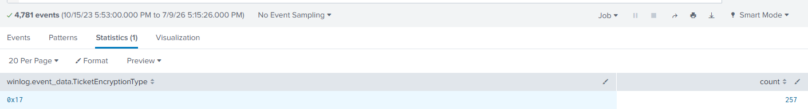

# Kerberoasted Lab

# Table of Contents
- [Context](#context)
- [Scenario](#scenario)
- [Questions](#questions)
  * [WMI Event Subscription Persistence](#wmi-event-subscription-persistence)
- [Attack Chain](#attack-chain)
  * [Text Tree](#text-tree)
- [Artifacts](#artifacts)
- [Lab Insights](#lab-insights)

# Context

Lab link: [https://cyberdefenders.org/blueteam-ctf-challenges/kerberoasted/](https://cyberdefenders.org/blueteam-ctf-challenges/kerberoasted/)

Suggested tools: Splunk, ELK

Tactics: Credential Access, Discovery

# Scenario

As a diligent cyber threat hunter, your investigation begins with a hypothesis: 'Recent trends suggest an upsurge in Kerberoasting attacks within the industry. Could your organization be a potential target for this attack technique?' This hypothesis lays the foundation for your comprehensive investigation, starting with an in-depth analysis of the domain controller logs to detect and mitigate any potential threats to the security landscape.

Note: Your Domain Controller is configured to audit Kerberos Service Ticket Operations, which is necessary to investigate Kerberoasting attacks. Additionally, Sysmon is installed for enhanced monitoring.

# Questions

Q1- To mitigate Kerberoasting attacks effectively, we need to strengthen the encryption Kerberos protocol uses. What encryption type is currently in use within the network?

Answer: RC4-HMAC

Reason: Kerberos service ticket requests in the environment show exclusive use of `RC4-HMAC` (`etype` `0x17`), the weakest supported Kerberos encryption type. `RC4-HMAC` ticket hashes derive from a single unsalted MD4 hash of the account's NT LAN Manager (NTLM) password hash, making them far faster to crack offline with tools like Hashcat than `AES128` (`0x11`) or `AES256` (`0x12`) tickets, which use per-realm salted PBKDF2 key derivation. This confirms the environment permits (or has fallen back to) `RC4-HMAC` ticket issuance, the condition Kerberoasting depends on: any low-privilege domain account can request service tickets for Service Principal Name (SPN) registered accounts and harvest crackable `RC4-HMAC` hashes.

```sql
index="kerberoasted"
| stats count by winlog.event_data.TicketEncryptionType
```



Q2- What is the username of the account that sequentially requested Ticket Granting Service (TGS) for two distinct application services within a short timeframe?

Answer: `johndoe`

Reason: Filtering Security Event ID `4769` (Ticket Granting Service (TGS) request) for non-machine source and target accounts shows the user `johndoe` requesting service tickets for two distinct application services, `SQLService` and `FileShareService`, only `24` milliseconds apart at `2023-10-16 07:37:34 UTC`. This timing is inconsistent with normal interactive use and matches the pattern of an automated Kerberoasting tool enumerating Service Principal Names (SPNs) in rapid succession. By comparison, the other active account, `janesmith`, shows service ticket requests spaced minutes apart, reflecting organic usage.

```sql
index="kerberoasted" "event.code"=4769 NOT winlog.event_data.ServiceName="*$*" NOT winlog.event_data.ServiceName="krbtgt" NOT winlog.event_data.TargetUserName="*$*"
| table _time, host, winlog.event_data.TargetUserName, winlog.event_data.ServiceName

_time	                  host	winlog.event_data.TargetUserName	winlog.event_data.ServiceName
2023-10-16 07:37:34.740	DC01	johndoe@CYBERCACTUS.LOCAL	        FileShareService
2023-10-16 07:37:34.716	DC01	johndoe@CYBERCACTUS.LOCAL	        SQLService
```


Q3- We must delve deeper into the logs to pinpoint any compromised service accounts for a comprehensive investigation into potential successful kerberoasting attack attempts. Can you provide the account name of the compromised service account?

Answer: `SQLService`

Reason: Pivoting from the two roasted service tickets to Event ID `4624` (successful logon) filtered on `AuthenticationPackageName=NTLM`, a hallmark of credential-based authentication rather than legitimate Kerberos service-account logons, shows `SQLService` authenticating via NTLM four times between `2023-10-16 07:37:34 UTC` and `07:57:08 UTC`, beginning seconds after `johndoe`'s roasted Ticket Granting Service (TGS) request for that same service at `07:37:34.716 UTC`. `FileShareService` shows no corresponding NTLM logons, indicating its ticket was requested but its password was not successfully cracked. This confirms `SQLService` as the compromised account.

```sql
index="kerberoasted" "event.code"=4624 winlog.event_data.AuthenticationPackageName=NTLM
| table _time, host, winlog.event_data.TargetUserName
```


Q4- To track the attacker's entry point, we need to identify the machine initially compromised by the attacker. What is the machine's IP address?

Answer: `10.0.0.154`

Reason: Extending the NTLM logon query with the source `IpAddress` field shows all four NTLM authentications, `johndoe`'s initial session and every subsequent `SQLService` logon, originating from the same source, `10.0.0.154`. This establishes the host as the attacker's foothold: it was used both to conduct the Kerberoasting request (as `johndoe`) and to authenticate with the cracked `SQLService` credentials moments later, confirming a single compromised workstation as the entry point for the attack chain.

```sql
index="kerberoasted" "event.code"=4624 winlog.event_data.AuthenticationPackageName=NTLM
| table _time, host, winlog.event_data.TargetUserName, winlog.event_data.IpAddress
```


Q5- To understand the attacker's actions following the login with the compromised service account, can you specify the service name installed on the Domain Controller (DC)?

Answer: `iOOEDsXjWeGRAyGl`

Reason: Querying the System channel for Event ID `7045` (new service installation) on `DC01` reveals a service named `iOOEDsXjWeGRAyGl` installed at `2023-10-16 07:48:10 UTC`, just seconds after the compromised `SQLService` account's second NTLM logon at `07:48:07 UTC`. The random, non-human-readable naming convention is characteristic of remote service-creation tooling such as PsExec or Impacket, indicating the attacker pivoted from cracked service-account credentials directly to remote code execution on the domain controller (DC) itself, establishing persistence and lateral movement at the highest-value host in the environment.

```sql
index="kerberoasted" "event.code"=7045 host="DC01" 
| table _time, winlog.event_data.ServiceName
```


Q6- To grasp the extent of the attacker's intentions, What's the complete registry key path where the attacker modified the value to enable Remote Desktop Protocol (RDP)?

Answer: `HKLM\System\CurrentControlSet\Control\Terminal Server\fDenyTSConnections`

Reason: Querying Sysmon Event ID `13` (registry value set) filtered for "Terminal" shows `reg.exe`, running from `C:\Windows\SysWOW64\`, modifying `HKLM\System\CurrentControlSet\Control\Terminal Server\fDenyTSConnections` to `0x00000000` at `2023-10-16 07:48:38.442 UTC` on `DC01.cybercactus.local`, executed under the `NT AUTHORITY\SYSTEM` context. Setting `fDenyTSConnections` to `0` explicitly enables Remote Desktop Protocol (RDP), which is disabled (`1`) by default. This occurs seconds after the malicious service installation identified in Q5, confirming the attacker escalated from remote code execution to establishing a persistent, interactive remote access channel into the domain controller (DC).

```sql
index="kerberoasted" "event.code"=13 "Terminal"
```


Q7- To create a comprehensive timeline of the attack, what is the UTC timestamp of the first recorded Remote Desktop Protocol (RDP) login event?

Answer: `2023-10-16 07:50`

Reason: Filtering Security Event ID `4624` (successful logon) for `LogonType=10` (`RemoteInteractive`, the logon type generated specifically by RDP sessions) returns the first successful RDP authentication at `2023-10-16 07:50:29.151 UTC`, roughly two minutes after `fDenyTSConnections` was set to `0` at `07:48:38 UTC`. This confirms the attacker moved from enabling RDP to actively using it almost immediately. The timestamp anchors the transition point in the attack timeline from remote command execution (`reg.exe`/service install) to full interactive remote desktop access on the domain controller (DC).

```sql
index="kerberoasted" "event.code"=4624 "winlog.event_data.LogonType"=10
| table _time

_time
2023-10-16 07:50:29.151
2023-10-16 07:50:29.151
```

Q8- To unravel the persistence mechanism employed by the attacker, what is the name of the WMI event consumer responsible for maintaining persistence?

Answer: `Updater`

Reason: Querying Sysmon Event ID `19` (`WmiEventFilter`, filter registration) shows a WMI Event Filter named `Updater` created at `2023-10-16 07:58:06.364 UTC` with the query `SELECT * FROM __InstanceCreationEvent WITHIN 60 WHERE TargetInstance ISA 'Win32_NTLogEvent' AND Targetinstance.EventCode = '4625' And Targetinstance.Message Like '%johndoe%'`. This is designed to trigger every `60` seconds whenever a failed logon (Event Code `4625`) referencing the `johndoe` account occurs. This is a Windows Management Instrumentation (WMI) Event Subscription persistence mechanism (MITRE T1546.003): the `Updater` filter defines the trigger condition, and it is paired with a corresponding `WmiEventConsumer` (Sysmon Event ID `20`) that executes the attacker's payload whenever the condition fires. This gives the attacker a durable, fileless foothold on the domain controller (DC) that survives reboots and re-triggers specifically on `johndoe` account activity, likely to detect and react if the compromised account is disabled or its password reset.

```sql
index="kerberoasted" "event.code"=19
```


Q9- Which class does the WMI event subscription filter target in the WMI Event Subscription you've identified?

Answer: `Win32_NTLogEvent`

Reason: The WMI Event Filter query identified in Q8, `SELECT * FROM __InstanceCreationEvent WITHIN 60 WHERE TargetInstance ISA 'Win32_NTLogEvent' AND Targetinstance.EventCode = '4625' And Targetinstance.Message Like '%johndoe%'`, targets the `Win32_NTLogEvent` Windows Management Instrumentation (WMI) class, which represents entries written to the Windows Event Log. By monitoring this class for new instances matching Event Code `4625` (failed logon) and a message containing `johndoe`, the attacker's persistence mechanism re-triggers its consumer action every time a failed logon attempt for that account is logged. This ties the WMI Event Subscription's activation condition directly to activity on the compromised account.

## WMI Event Subscription Persistence

Windows Management Instrumentation (WMI) Event Subscription is a persistence technique in which an attacker registers a permanent, boot-surviving trigger inside the WMI repository itself rather than relying on a scheduled task, registry Run key, or service. Because the subscription lives inside the WMI Common Information Model (CIM) repository (`OBJECTS.DATA`), it blends into legitimate administrative tooling and often evades analysts who only check conventional persistence locations.

**Mechanism**

A WMI event subscription has three components, each independently registered:

- `EventFilter`: defines the trigger condition, expressed as a WMI Query Language (WQL) query (for example, firing on system startup, user logon, or a periodic interval via `Win32_LocalTime` or `__InstanceModificationEvent`).
- `EventConsumer`: defines the action taken when the filter matches. The most common malicious consumer type is `CommandLineEventConsumer`, which executes an arbitrary command line (frequently `powershell.exe` with an encoded payload), though `ActiveScriptEventConsumer` (VBScript/JScript) is also seen.
- `FilterToConsumerBinding`: the object that binds a specific `EventFilter` to a specific `EventConsumer`, completing the subscription. Neither the filter nor the consumer alone does anything; the binding is what activates the chain.

Once bound, the subscription persists across reboots without any process, scheduled task, or service being visibly created in the traditional sense; the WMI provider host (`WmiPrvSE.exe`) executes the consumer action whenever the filter's query evaluates true.

**Why It Evades Detection**

WMI subscriptions do not appear in `services.msc`, Task Scheduler, or standard registry Run key audits, since the artifact is stored in the CIM repository rather than in the registry or file system in the conventional sense. Execution is proxied through `WmiPrvSE.exe`, a legitimate, frequently-running system process, so process-creation telemetry alone shows a trusted parent rather than an obviously malicious one. Analysts relying solely on autoruns tools that do not explicitly enumerate WMI subscriptions will miss the artifact entirely.

**Detection Method**

Sysmon's `19`/`20`/`21` event triad directly instruments WMI subscription activity and is the primary telemetry source for this technique:

- Event ID `19`: `WmiEventFilter` activity, logged when a filter is registered. The event includes the filter `Name` and the WQL `Query`, which frequently reveals the trigger logic in plaintext (for example, an interval-based startup trigger) even when the consumer payload is obfuscated.
- Event ID `20`: `WmiEventConsumer` activity, logged when a consumer is registered. For `CommandLineEventConsumer`, this includes the `CommandLineTemplate` field, which often contains the executed command or script directly.
- Event ID `21`: `WmiEventConsumerToFilter` activity, logged when the binding is created, completing the subscription and correlating a specific filter to a specific consumer.

```sql
index="sysmon" (EventID=19 OR EventID=20 OR EventID=21)| stats values(EventID) as EventIDs by Name, Query, CommandLineTemplate
```

Because the subscription artifact also lives independently of Sysmon logging in the WMI repository file (`OBJECTS.DATA`, typically at `C:\Windows\System32\wbem\Repository\`), offline forensic acquisition and repository parsing (for example with `PyWMIPersistenceFinder` or similar CIM repository parsers) should be used to cross-reference live telemetry, particularly in incident response cases where Sysmon was not deployed prior to compromise.

**Critical Keywords**

`WmiEventFilter`, `EventConsumer`, `CommandLineEventConsumer`, `FilterToConsumerBinding`, `WmiPrvSE.exe`, `OBJECTS.DATA`, Windows Query Language (WQL)

**Significance**

WMI Event Subscription persistence is favored by advanced threat actors specifically because it survives reboots, requires no dropped binary in common locations, and is invisible to tooling that does not explicitly query the WMI repository. Its presence in an environment is a strong indicator of a deliberate, capability-aware adversary rather than commodity malware.

**MITRE ATT&CK Mapping**

T1546.003 (Event Triggered Execution: Windows Management Instrumentation Event Subscription)

# Attack Chain

| Time (UTC) | Stage | Detail | MITRE |
| --- | --- | --- | --- |
| 2023-10-16 07:37:34.716 | Credential Access | johndoe requests TGS for SQLService SPN (`RC4-HMAC`/0x17) | T1558.003 |
| 2023-10-16 07:37:34.740 | Discovery | johndoe requests TGS for FileShareService SPN, 24ms later | T1558.003 |
| 2023-10-16 07:37:34 – 07:57:08 | Credential Access | SQLService authenticates via NTLM 4x, from `10.0.0.154`, using cracked `RC4-HMAC` ticket | T1558.003 |
| 2023-10-16 07:48:10 | Persistence | Service `iOOEDsXjWeGRAyGl` installed on `DC01` | T1543.003 |
| 2023-10-16 07:48:38.442 | Defense Evasion | reg.exe sets fDenyTSConnections to 0 on `DC01`, enabling RDP | T1112, T1021.001 |
| 2023-10-16 07:50:29.151 | Lateral Movement | First successful RDP login (LogonType 10) to `DC01` | T1021.001 |
| 2023-10-16 07:58:06.364 | Persistence | WMI Event Filter Updater created, targeting Win32_NTLogEvent (EventCode 4625, johndoe) | T1546.003 |

Try the plain-text paste shortcut on this version — that should be the actual fix.

## Text Tree

```sql
[Kerberoasting — TGS Request]  johndoe → DC01.cybercactus.local
    └── RC4-HMAC (0x17) service ticket requested for SPN accounts  ← weak encryption enables offline cracking
        ├── [Stage 1 — Credential Access]
        │   ├── TGS request: SQLService        @ 07:37:34.716 UTC
        │   └── TGS request: FileShareService   @ 07:37:34.740 UTC  ← 24ms apart, automated tool signature
        │
        └── [Stage 2 — Credential Use]
            └── SQLService cracked offline (RC4-HMAC → NTLM hash)
                └── NTLM logon as SQLService from 10[.]0[.]0[.]154  ← foothold host, x4 logons 07:37:34–07:57:08 UTC
                    ├── [Stage 3 — Persistence]
                    │   └── Service iOOEDsXjWeGRAyGl installed on DC01  @ 07:48:10 UTC  ← PsExec/Impacket-style remote svc
                    │
                    ├── [Stage 4 — Defense Evasion / Lateral Movement]
                    │   └── reg.exe sets fDenyTSConnections = 0  @ 07:48:38.442 UTC  ← RDP enabled on DC01
                    │       └── RDP logon (LogonType 10) to DC01  @ 07:50:29.151 UTC  ← first interactive access
                    │
                    └── [Stage 5 — Persistence (WMI)]
                        └── WMI Event Filter "Updater" registered  @ 07:58:06.364 UTC
                            └── Trigger: Win32_NTLogEvent, EventCode 4625, message LIKE '%johndoe%'  ← re-arms on failed johndoe logons
```

# Artifacts

| Category | Type | Value |
| --- | --- | --- |
| Network | Attacker/Foothold IP | 10[.]0[.]0[.]154 |
| Host | Domain | cybercactus[.]local |
|  | Domain Controller | `DC01`.cybercactus[.]local |
|  | Compromised User | `johndoe` |
|  | Compromised Service Account | `SQLService` |
|  | Non-Compromised (Roasted) SPN | `FileShareService` |
|  | Malicious Service Name | `iOOEDsXjWeGRAyGl` |
|  | Persistence Mechanism | WMI Event Filter: Updater |
|  | WMI Target Class | `Win32_NTLogEvent` |
|  | Registry Key (RDP Enable) | `HKLM\System\CurrentControlSet\Control\Terminal Server\fDenyTSConnections` |
| Encryption | Kerberos Ticket Encryption | `RC4-HMAC` (0x17) |
| Process | Registry Modification Tool | reg.exe (`C:\Windows\SysWOW64\reg.exe`) |
| Timestamp | First Kerberoasting TGS Request | 2023-10-16 07:37:34.716 UTC |
|  | Malicious Service Install | 2023-10-16 07:48:10 UTC |
|  | RDP Enabled via Registry | 2023-10-16 07:48:38.442 UTC |
|  | First RDP Logon | 2023-10-16 07:50:29.151 UTC |
|  | WMI Persistence Filter Created | 2023-10-16 07:58:06.364 UTC |

# Lab Insights

- Kerberoasting doesn't require exploitation — it requires permission. The entire attack chain was possible because the domain still allowed RC4-HMAC ticket issuance. No vulnerability was exploited to steal SQLService's credentials; a low-privilege, authenticated user simply asked for a ticket the domain was willing to hand out in a crackable format. Enforcing AES-only Kerberos encryption (or flagging any RC4-HMAC TGS request as anomalous) closes this path entirely, independent of password strength.
- Timing deltas are a stronger signal than any single event. No individual TGS request, NTLM logon, or registry change looked overtly malicious in isolation — each is a normal administrative or authentication action. What exposed the attacker was the spacing: two SPN requests 24ms apart, an NTLM logon seconds after a roasted ticket, a service install seconds after that logon. Detection here depended on correlating cadence across events, not matching any single one against a blocklist.
- Privilege escalation via cracked service accounts skips the "escalation" step entirely. Service accounts tied to SPNs (like SQLService) are frequently over-privileged relative to their function, so cracking one credential can hand an attacker a shortcut straight to remote code execution and registry-level changes on a domain controller — no separate privilege escalation exploit needed. The account's existing rights did all the work.
- Persistence mechanisms are increasingly self-camouflaging. The WMI event subscription didn't just persist — it was designed to re-arm itself only on activity tied to the original compromised account (johndoe failed logons), keeping its footprint dormant and contextually blended in rather than continuously active. This reflects a broader trend where persistence is built to minimize its own telemetry signature between triggers, rather than just surviving reboots.
- Native tooling did all the heavy lifting. reg.exe, WMI, and NTLM authentication — every action in this chain used built-in Windows functionality, no custom malware or dropped binaries were required to move from credential theft to domain controller persistence. This underscores why baseline behavioral logging (Sysmon EID 13/19/20/21, Security 4624/4769) is non-negotiable: signature-based detection has nothing to catch here.