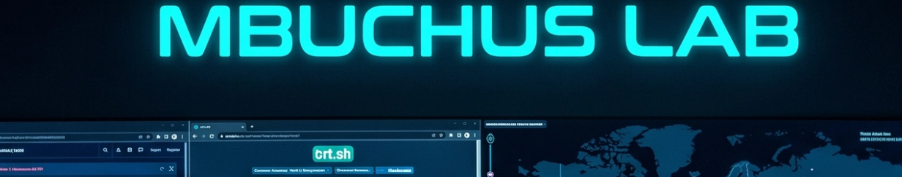

# MBuchus Lab



# Table of Contents
- [Context](#context)
- [Scenario](#scenario)
- [Questions](#questions)
- [Lab Insights](#lab-insights)

# Context

**Lab link**: [https://cyberdefenders.org/blueteam-ctf-challenges/mbuchus/](https://cyberdefenders.org/blueteam-ctf-challenges/mbuchus/)

**Suggested tools**: AlienVault OTX, OSINT, VirusTotal, ViewDNSInfo, crt.sh, IPLookUp

**Tactics**: Resource Development, Command and Control

# Scenario

In March 2024, the security team at a mid-sized investment advisory firm noticed a wave of support tickets from employees reporting system slowdowns and suspicious pop-ups after searching for financial recovery tools online. Internal traffic logs showed multiple connections to an unfamiliar domain, **`treasurybanks.org`**, shortly before endpoints began exhibiting abnormal behavior. Preliminary threat intelligence suggests this domain is part of a broader infrastructure serving malicious content under the guise of legitimate financial assistance.

Your task is to investigate artifacts from one of the compromised endpoints to uncover the attack chain. Determine how the initial access was gained, what was downloaded, and how attacker infrastructure—including certificates, domains, and cloud providers—played a role in the campaign.

Utilize OSINT, VirusTotal, and crt.sh to analyze a multi-stage malvertising campaign, identifying initial access, malware payloads, and attacker infrastructure.

# Questions

Q1- What type of malicious advertising method was used to initially lure victims to the fake financial websites?

Answer: Malvertising

Explanation: Malvertising uses online advertisements (through legitimate ad networks or compromised ad placements) to redirect users to malicious websites or deliver malware.

Q2- What filename was downloaded by users who visited the fraudulent fund recovery site?

Answer: `q-report-53394.zip`

Explanation: Palo Alto Networks Unit 42 published a primary reference for this malvertising campaign. That write-up includes indicators of compromise and related artifacts in a GitHub text file: `https://github.com/PaloAltoNetworks/Unit42-timely-threat-intel/blob/main/2024-03-26-IOCs-for-Matanbuchus-infection-with-Danabot.txt`. The malicious site prompts the victim to download a ZIP archive as the next stage in the infection chain.

Q3- Which malware family was identified inside the ZIP archive downloaded by users?

Answer: Matanbuchus

Explanation: `Matanbuchus` is loader malware offered by its developers as Malware-as-a-Service (`MaaS`). It enables follow-on infections by staging additional payloads after initial execution. Because it is offered as a service, the delivered payloads and operator objectives can vary between campaigns. `Matanbuchus` has been observed in attacks targeting US universities and high schools, and a Belgian high-tech organization. Reference: `malpedia.caad.fkie.fraunhofer.de/details/win.matanbuchus`

Q4- What is the primary function of the malware delivered in this campaign?

Answer: Loader

Explanation: A loader is a program whose primary job is not to cause damage itself, but to download and run other malware on the system. It serves as an initial foothold and delivery mechanism.

Q5- What is the SHA-256 fingerprint of the TLS certificate used by the **`treasurybanks.org`** domain and its subdomains?

Answer: `329ec925f80dbd831c09b436cbf1b2200119bc43f95e84286f54f8a40aef73c5` 

Explanation: Search `crt.sh` for the parent certificate entry that lists additional Subject Alternative Names (SANs). In that certificate transparency record, copy the certificate `SHA-256` fingerprint associated with `treasurybanks[.]org` and any listed subdomains (SANs).

Q6- What legitimate command-line tool filename was copied to the Temp directory before the JavaScript payload executed?

Answer: `curl.exe`

Explanation: The malware copies the legitimate `curl.exe` to the Temp directory (for example, `C:\Users\Admin\AppData\Local\Temp\TNheBOJElq.exe`) before `wscript.exe` runs the JavaScript payload. The copied `curl.exe` then retrieves additional payloads, similar to `wget`.

```powershell
- SHA256 hash: 43aa76bec0e160c4e4a587e452b3303fa7ac72f08521bcbdcae2c370d669e451
- File size: 1,797 bytes
- File name: q-report-60033.js
- File type: ASCII text, with very long lines (1028), with CRLF, LF line terminators
- File description: JavaScript file from zip archive, run by wscript.exe if victim double-clicks it.

- SHA256 hash: 6cf60c768a7377f7c4842c14c3c4d416480a7044a7a5a72b61ff142a796273ec  <-- not malicious
- File size: 601,544 bytes
- File location: C:\Users\Admin\AppData\Local\Temp\TNheBOJElq.exe
- File description: Copy of C:\Windows\system32\curl.exe, not malicious.
```

Q7- Which Certificate Authority issued the valid SSL certificates used across the campaign domains?

Answer: GeoTrust

Explanation: This is easy to confirm in the `crt.sh` certificate transparency record (ID `12296951595`), which lists the issuing Certificate Authority in the certificate profile. Reference: `https://crt.sh/?id=12296951595`. 


Q8- When was the **`treasurybanks.org`** domain registered according to the current WHOIS information displayed on **`VirusTotal`**?

Answer: `2023-07-18`

Explanation: This value comes from `VirusTotal` in the `Whois` section for `treasurybanks[.]org`.


Q9- Which cloud infrastructure provider hosted the IP that served the **`treasurybanks.org`** site?

Answer: Alibaba Cloud

Explanation: Based on historical campaign data and using a service such as `ipinfo.io`, Alibaba Cloud hosted the infrastructure that served this domain.


Q10- What autonomous system (ASN) was associated with an earlier IP address tied to **`treasurybanks.org`** before it changed to another infrastructure?

Answer: `AS22612`

Explanation: Use `viewdns.info` to identify the previous IP address, then look up that IP in `ipinfo.io` to determine the associated Autonomous System Number (ASN).


Q11- One attacker-controlled domain had a name that hinted at something astro-related and resolved to a network device login panel, unlike the campaign’s other phishing domains. Based on historical DNS records, who was the first recorded IP address owner associated with this domain in 2011?

Answer: ND-CA-ASN

Explanation: Research from `embeeresearch.io` Transport Layer Security (TLS) certificate threat intelligence writing identified an attacker-controlled, astronomy-themed domain, `astrologytop[.]com`. Unlike the campaign’s other phishing domains, `astrologytop[.]com` resolved to a network device login panel. Based on historical Domain Name System (DNS) records, the first recorded Internet Protocol (IP) address owner associated with this domain in `2011` was `ND-CA-ASN`, located in Toronto, Canada.

Q12- What registrar service did the attacker use to register the **`treasurybanks.org`** domain?

Answer: Namecheap

Explanation: Use a historical domain tool such as `viewdns.info` to look up the IP address history, then confirm the Internet Protocol (IP) address ownership in a WHOIS record using a tool such as `search.arin.net`.


# Lab Insights

- Attack chain, high level, follows a classic multi-stage flow: malvertising, fake site, ZIP archive, script, then a loader.
    - Initial lure: malvertising drives victims to a fraudulent “fund recovery” site.
    - Delivery: victims download `q-report-53394.zip`, which contains a JavaScript payload (for example, `q-report-60033.js`) that `wscript.exe` executes.
    - Execution helper: the chain copies and renames the legitimate `curl.exe` into `%TEMP%` to fetch next-stage payloads. This technique can blend in because the activity uses a trusted binary.
    - MITRE ATT&CK mapping: the script execution aligns with Command and Scripting Interpreter (T1059), and the network retrieval aligns with Ingress Tool Transfer (T1105).
- Infrastructure and open-source intelligence (OSINT) angle, campaign legitimacy is supported with valid Transport Layer Security (TLS) certificates and repeatable indicators.
    - Domain of interest: `treasurybanks[.]org` is the central infrastructure pivot mentioned in network logs.
    - TLS: the certificate fingerprint is explicitly captured as `329ec925f80dbd831c09b436cbf1b2200119bc43f95e84286f54f8a40aef73c5`, and the issuing Certificate Authority (CA) is `GeoTrust`. This enables clustering related domains using Subject Alternative Name (SAN) values and certificate transparency (CT) logs.
    - Domain registration and hosting:
        - WHOIS date (via VirusTotal (VT)): `2023-07-18`
        - Registrar: `Namecheap`
        - Hosting: `Alibaba Cloud`
        - Prior infrastructure pivot: an earlier Internet Protocol (IP) address mapped to Autonomous System Number (ASN) `AS22612`, which can help with historical linkage and hunting.
- Detection and hunting insights you can extract from these notes.
    - Endpoint detections: alert on `wscript.exe` executing from user-writable locations, such as `Downloads` and `%TEMP%`, followed by outbound network activity, and `curl.exe` appearing in `%TEMP%` with a random name.
    - Network detections: hunt for outbound connections to `treasurybanks[.]org` and SAN-related domains from the same TLS certificate chain using `crt.sh`, plus infrastructure hosted in `Alibaba Cloud` ranges used by this cluster.
    - Threat intelligence enrichment: the notes already point to a strong external reference set, including Unit 42 Indicators of Compromise (IOCs) and Malpedia, so you can convert this into a small IOC and tactics, techniques, and procedures (TTP) checklist for future labs.
