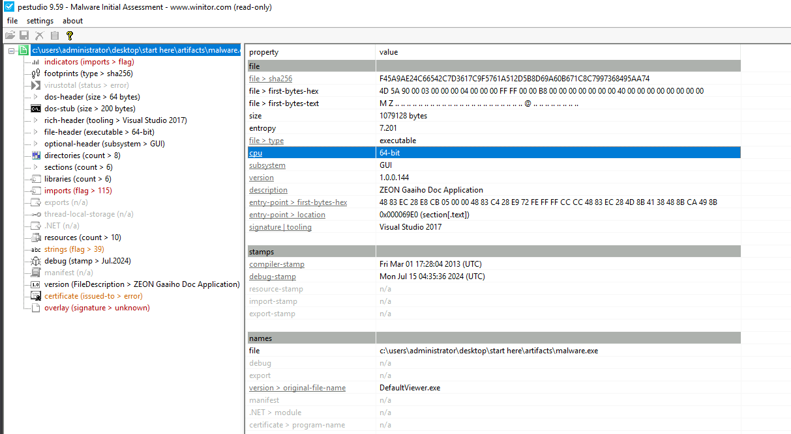
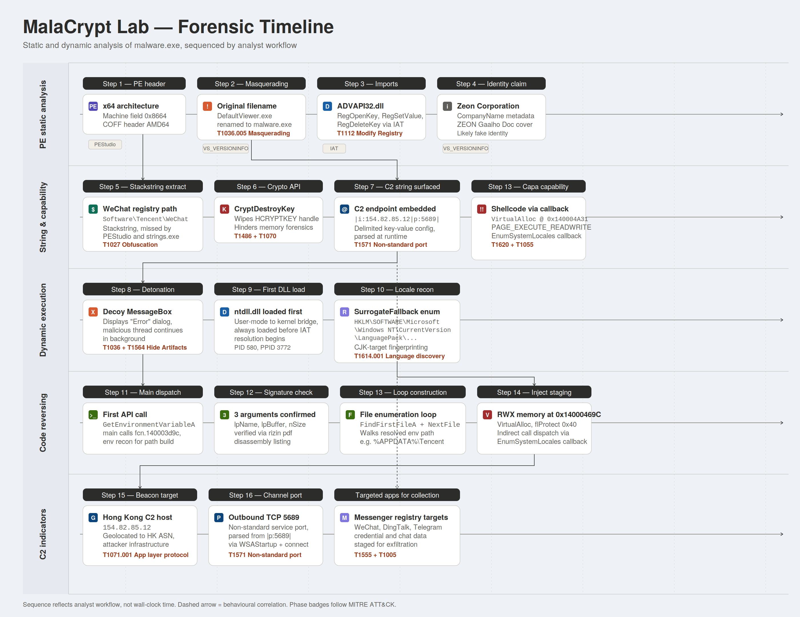

# MalaCrypt Lab

# Context

Lab link: [https://cyberdefenders.org/blueteam-ctf-challenges/malacrypt/](https://cyberdefenders.org/blueteam-ctf-challenges/malacrypt/)

Suggested tools: floss, PEStudio, ProcMon, Cutter, CAPA

Tactics: Execution, Defense Evasion, Discovery, Collection

# Scenario

During routine monitoring at MalaCrypt company, a suspicious binary named "malware.exe" was found on a device. Initial checks of its hash values against threat intelligence platforms yielded no results, suggesting the attacker may have altered the malware to evade detection. As a security analyst, the next action is to investigate further, using alternative methods beyond hash-based detection, considering that attackers often modify hashes to bypass initial security checks.

# Questions

**Q1**- Understanding the type of binary architecture allows us to determine the types of registers being used. What architecture is this binary built for?

Answer: `x64`

Reason: Opening `malware.exe` in PEStudio and examining the file summary panel reveals the binary targets the 64-bit (x86-64) architecture, meaning it uses the 64-bit general purpose register set (`RAX`, `RBX`, `RCX`, etc.) rather than the 32-bit equivalents (`EAX`, `EBX`, `ECX`). This architecture identification is read from the Portable Executable (PE) header, specifically the `Machine` field within the COFF File Header, where a value of `0x8664` corresponds to AMD64/x86-64 and `0x014C` would indicate a 32-bit (x86) binary. Knowing the target architecture upfront determines which disassembler mode, debugger build, and sandbox profile to use during subsequent static and dynamic analysis.



**Q2**- Executables are sometimes renamed or altered to evade detection or disguise their true purpose. What is the original name of the executable?

Answer: `DefaultViewer.exe`

Reason: Examining the version section in PEStudio reveals the `OriginalFilename` field, which contains the name the developer assigned the binary at compile time, in this case `DefaultViewer.exe`, indicating the file was renamed to `malware.exe` to disguise its origin. The `OriginalFilename` value resides inside the binary's `VS_VERSIONINFO` resource, a structured metadata block embedded in the Portable Executable (PE) at compile time by the linker. Because this value is baked into the resource section rather than derived from the filename on disk, it persists across renames and provides a reliable pivot for identifying the binary's true identity. Analysts commonly cross-reference `OriginalFilename` against other version fields such as `CompanyName`, `ProductName`, and `InternalName` to detect masquerading, a technique tracked under MITRE ATT&CK as `T1036.005` (Match Legitimate Name or Location).


**Q3**- Some DLL files are responsible for accessing Windows registries. Which DLL file is utilized to manipulate the Windows Registry?

Answer: `ADVAPI32.dll`

Reason: Reviewing the libraries section in PEStudio shows the Dynamic Link Libraries (DLLs) imported by the binary, among which `ADVAPI32.dll` stands out as the library responsible for Windows Registry manipulation. It exposes functions such as `RegOpenKey`, `RegSetValue`, and `RegDeleteKey` that allow a process to read, write, and delete registry entries. These imports appear in the PE Import Address Table (IAT), which the Windows loader populates at runtime by resolving each function name to its address inside the mapped DLL. The presence of `ADVAPI32.dll` registry APIs is a strong static indicator that the binary interacts with the registry hive, commonly abused for persistence via `Run` and `RunOnce` keys, configuration storage, or tampering with security settings. This behavior maps to MITRE ATT&CK `T1547.001` (Registry Run Keys / Startup Folder) for persistence and `T1112` (Modify Registry) for defense evasion or configuration changes.

```bash
PEStudio > libraries > ADVAPI32.dll
  - RegOpenKey
  - RegSetValue
  - RegDeleteKey
```

## Windows API Execution Flow

The execution path from a user-mode binary down to the kernel follows a layered model:

Binary, then DLL (which exports the Windows API functions), then `ntdll.dll` (the user-mode to kernel-mode transition layer), then `syscall` into the kernel, then the target resource. The Dynamic Link Library (DLL) is the container for the Windows API functions. When the binary imports `ADVAPI32.dll` and calls `RegOpenKey`, the flow is:

- The binary calls `RegOpenKey`, which the loader resolved at process startup through the Import Address Table (IAT) to its address inside `ADVAPI32.dll`.
- `ADVAPI32.dll` handles the user-mode logic such as parameter validation and handle translation, then calls the corresponding native function in `ntdll.dll` (for example, `NtOpenKey`).
- `ntdll.dll` issues the `syscall` instruction, which transitions execution from user mode (Ring 3) to kernel mode (Ring 0).
- The kernel's Configuration Manager performs the actual registry operation against the hive files on disk or in memory, then returns the result back up the stack.

The DLL and the Windows API are not separate layers, the API functions are exported by the DLL. The DLL is the packaging, the API is the set of documented functions inside it. This distinction matters during analysis because malware can bypass the documented `ADVAPI32.dll` entry points and call `ntdll.dll` natives directly, or even issue a raw `syscall`, to evade user-mode API hooks placed by Endpoint Detection and Response (EDR) products. That evasion technique maps to MITRE ATT&CK `T1106` (Native API).

```bash
Binary
  └── ADVAPI32.dll        (Win32 API: RegOpenKey)
        └── ntdll.dll     (Native API: NtOpenKey)
              └── syscall (Ring 3 -> Ring 0)
                    └── Kernel (Configuration Manager)
                          └── Registry hive
```

**Q4**- Certain strings may reveal specific information. What is the name of the Chinese messaging app discovered in the basic static analysis?

Answer: WeChat

Reason: Running FLARE Obfuscated String Solver (FLOSS) against `malware.exe` with its stackstring extraction capability reveals the registry path `Software\Tencent\WeChat`, identifying WeChat as the Chinese messaging application referenced in the binary. The string was not visible through PEStudio's strings section (21,000 entries, no WeChat match) nor through the Sysinternals `strings.exe` tool, even with the `-u` Unicode flag, because it is constructed dynamically on the stack at runtime rather than stored as a plain literal in the binary's `.rdata` or `.data` section. This obfuscation technique requires FLOSS's emulation-based stackstring extraction to surface it.

A stackstring is built one character (or a few bytes) at a time using `MOV` instructions that write immediate values directly to stack memory, so the full string never appears contiguously inside the file on disk. Static string scanners like PEStudio and `strings.exe` only match byte sequences already present in the binary, which is why they miss it. FLOSS works around this by emulating the binary's instructions with a lightweight CPU emulator (vivisect), reconstructing the strings as they would appear in memory at runtime. This evasion technique maps to MITRE ATT&CK `T1027` (Obfuscated Files or Information).

```bash
# PEStudio strings section: no WeChat match
# strings.exe -u malware.exe | Select-String "wechat": no output
.\floss.exe "...\malware.exe" > floss_strings.txt
INFO: floss.results: Software\Tencent\WeChat
```


## Stackstrings

A stackstring is a string that is not stored as a contiguous sequence of bytes inside the binary on disk, but is instead assembled at runtime by writing individual characters or small byte chunks directly onto the stack using `MOV` instructions with immediate operands. Once execution reaches the relevant function, the stack memory holds the fully reconstructed string, which the program then references like any normal string pointer. How it looks in assembly:

```nasm
mov     byte ptr [rsp+0x20], 'S'
mov     byte ptr [rsp+0x21], 'o'
mov     byte ptr [rsp+0x22], 'f'
mov     byte ptr [rsp+0x23], 't'
mov     byte ptr [rsp+0x24], 'w'
mov     byte ptr [rsp+0x25], 'a'
mov     byte ptr [rsp+0x26], 'r'
mov     byte ptr [rsp+0x27], 'e'
mov     byte ptr [rsp+0x28], 0x00
lea     rcx, [rsp+0x20]
```

More optimized variants pack 4 or 8 bytes at a time using `MOV` with `DWORD` or `QWORD` immediates, or apply a simple `XOR` decoding loop against a key before use.

A stackstring in cyber forensics:

- Evades static string analysis. Tools that scan the binary's `.rdata`, `.data`, and `.text` sections for printable byte sequences (PEStudio, `strings.exe`, `grep`) will not find the string because it never exists contiguously on disk.
- Hides Indicators of Compromise (IOCs). Malware authors use stackstrings to conceal Command and Control (C2) domains, registry paths, mutex names, file paths, User-Agent strings, and target process names from triage tooling and Antivirus (AV) signature scanners.
- Forces deeper analysis. Surfacing stackstrings requires either emulation-based tooling such as FLARE Obfuscated String Solver (FLOSS), dynamic analysis in a sandbox or debugger where the strings materialize in memory, or manual reverse engineering in a disassembler like IDA Pro or Ghidra.
- Useful triage signal. A binary with very few meaningful static strings but heavy use of stack writes followed by `LEA` (Load Effective Address) instructions referencing local stack offsets is itself suspicious, indicating likely string obfuscation.
- MITRE ATT&CK mapping. Stackstring construction falls under `T1027` (Obfuscated Files or Information) and is often paired with `T1140` (Deobfuscate/Decode Files or Information) when the stack bytes are additionally encoded.

```bash
# Extract stackstrings with FLOSS
.\floss.exe malware.exe > floss_strings.txt

# Filter FLOSS output to just the stackstring section
.\floss.exe --only stackstrings malware.exe
```

**Q5**- The Windows API can be used for malicious purposes. Which Windows API is used to destroy previously generated encryption keys? 

Answer: `CryptDestroyKey`

Reason: Examining the imported functions in PEStudio's strings section and confirmed in the FLOSS output, `CryptDestroyKey` is the Windows Cryptography Application Programming Interface (CryptoAPI) function used to destroy previously generated encryption keys. Its presence indicates the malware is performing cryptographic operations, consistent with ransomware-like behavior, and actively cleaning up key handles to prevent recovery of encrypted data.

`CryptDestroyKey` is exported by `ADVAPI32.dll` and operates on an `HCRYPTKEY` handle obtained earlier from companion functions such as `CryptGenKey` (generates a new session key), `CryptImportKey` (imports a key blob from an attacker-controlled source), or `CryptDeriveKey` (derives a key from a hash or password). When called, it zeroes the key material in memory and releases the handle, leaving no usable copy in the process address space. For ransomware, this destruction step typically follows the encryption loop: the binary generates a per-victim symmetric key, encrypts the target files, exfiltrates or asymmetrically wraps the key for the attacker, then calls `CryptDestroyKey` to ensure the plaintext key cannot be recovered through memory forensics or by attaching a debugger to a still-running process.

When triaging, analysts look for the canonical CryptoAPI import cluster (`CryptAcquireContext`, `CryptGenKey`, `CryptEncrypt`, `CryptDestroyKey`, `CryptReleaseContext`) appearing together, which is a strong static signal of file-encrypting malware or ransomware. This behavior maps to MITRE ATT&CK `T1486` (Data Encrypted for Impact) for the encryption activity itself and `T1070` (Indicator Removal) for the deliberate destruction of key material to hinder recovery and forensic analysis.


**Q6**- Knowing the attacker's IP can help trace the source of the attack and gather information about their location and network. What IP address is found in the executable that belongs to Hong Kong?

Answer: `154.82.85.12`

Reason: Searching the FLOSS output file with a regular expression (regex) Internet Protocol (IP) pattern reveals two addresses: `1.0.0.144`, a likely version string or internal reference, and `154[.]82[.]85[.]12`, which appears in a structured connection string `|i:154[.]82[.]85[.]12|p:5689|` suggesting a Command and Control (C2) callback configuration. Geolocating `154[.]82[.]85[.]12` confirms it belongs to Hong Kong, making it the attacker-controlled IP address embedded in the binary.

The `|i:<ip>|p:<port>|` token format is a recognizable delimited key-value layout, where `i` denotes the IP address and `p` denotes the destination port (`5689/TCP` in this case). Malware authors frequently embed C2 endpoints in this kind of compact, self-parsing structure so the binary can split the string at runtime to populate connection parameters passed to `WSAStartup`, `socket`, and `connect`. The fact that the IP only surfaces after FLOSS stackstring extraction (not from `strings.exe` or PEStudio) confirms it was constructed dynamically on the stack to evade static IOC scraping. The `1.0.0.144` value is almost certainly a four-part version number (`major.minor.build.revision`) embedded via `VS_VERSIONINFO`, not a routable host, and analysts dismiss it after correlating its location with the version resource block.

This embedded C2 configuration maps to MITRE ATT&CK `T1071.001` (Application Layer Protocol: Web Protocols) or more generally `T1571` (Non-Standard Port) given the use of `5689/TCP`, alongside `T1027` (Obfuscated Files or Information) for the stackstring concealment of the IP itself.

```powershell
PS C:\Users\Administrator\Desktop\Start Here\Tools\Miscellaneous> Select-String -Path floss_strings.txt -Pattern "\b\d{1,3}\.\d{1,3}\.\d{1,3}\.\d{1,3}\b"
floss_strings.txt:3150:154.82.85.12
floss_strings.txt:9574:|i:154.82.85.12|p:5689|
floss_strings.txt:9579:1.0.0.144
floss_strings.txt:9581:1.0.0.144
```

**Q7**- In dynamic analysis, we examine the behavior of the malware and identify any suspicious activities. What message is displayed on the screen when the binary is executed?

Answer: `Error`

Reason: Executing `malware.exe` directly on the isolated lab Virtual Machine (VM) triggers a Windows message box displaying the word `Error`, a common decoy tactic used by malware to make the victim believe the file failed to run, while malicious activity continues in the background undetected. This decoy dialog is generated through a `MessageBoxA` or `MessageBoxW` call from `USER32.dll`, typically wired up early in the binary's execution path so the popup appears almost immediately after launch. While the user clicks `OK` and dismisses the window assuming the program crashed, the main malicious thread continues running: dropping payloads, writing persistence keys under `Software\Tencent\WeChat`, initializing cryptographic key material via `CryptGenKey`, and beaconing to the embedded C2 endpoint at `154[.]82[.]85[.]12:5689`. The minimal, generic `Error` text with no error code or context is itself a strong indicator of a decoy, since legitimate applications produce descriptive error messages tied to specific failure conditions.

This deception technique maps to MITRE ATT&CK `T1036` (Masquerading) for the fake-failure presentation and `T1564` (Hide Artifacts) for concealing the ongoing malicious execution behind a benign-looking user interface element. Confirming the deception requires correlating the dialog with concurrent process activity observed in `Procmon`, network captures showing outbound connections to the C2 IP address, and registry writes occurring after the `OK` button was clicked.

```bash
Desktop\Start Here\Artifacts\malware.exe
  └── USER32.dll!MessageBoxA("Error", "Error", MB_OK)   # decoy dialog
  └── [background thread] → registry writes, key generation, C2 beacon to 154[.]82[.]85[.]12:5689
```


**Q8**- Identifying the executed DLLs gives us insight into the attacker's strategies and goals. What is the name of the first DLL file that is loaded after the binary is executed?

Answer: `ntdll.dll`

Reason: Filtering Process Monitor (ProcMon) by `malware.exe` and monitoring `Load Image` events upon execution shows that the first Dynamic Link Library (DLL) loaded after the binary itself is `ntdll.dll`. This is expected behavior on Windows, as `ntdll.dll` is the lowest user-mode layer and is always the first DLL mapped into any process, providing the bridge between user space and the kernel.

The Windows loader maps `ntdll.dll` into every process at creation time, before any imports listed in the binary's Import Address Table (IAT) are resolved, because `ntdll.dll` itself contains the loader code (`LdrInitializeThunk`, `LdrLoadDll`) responsible for resolving and mapping all subsequent DLLs. In the ProcMon timeline, the binary image at `0x7ff685350000` is followed immediately by `ntdll.dll` at `0x7ffb74e50000`, then `kernel32.dll` and `KernelBase.dll`, which is the canonical load order for any modern Windows process. The `Load Image` events also confirm the binary is running as Process Identifier (PID) `580` with a parent PID of `3772`, useful for later parent-child process tree reconstruction.

Beyond confirming normal startup, this view establishes a baseline of expected DLL loads against which later, suspicious loads (such as injected modules, side-loaded DLLs, or unsigned libraries from non-standard paths) can be flagged. Any deviation from the standard `ntdll.dll`, `kernel32.dll`, `KernelBase.dll`, `user32.dll`, `win32u.dll` sequence near process start warrants investigation. Abnormal DLL loading patterns map to MITRE ATT&CK `T1055` (Process Injection) when a foreign module appears in the address space, or `T1574.002` (DLL Side-Loading) when a malicious DLL is loaded from the binary's working directory ahead of the legitimate system copy.

```bash
Time of Day      Operation    Path
2:52:10.0849211  Load Image   C:\Users\Administrator\Desktop\Start Here\Artifacts\malware.exe
2:52:10.0849723  Load Image   C:\Windows\System32\ntdll.dll
2:52:10.0858144  Load Image   C:\Windows\System32\kernel32.dll
2:52:10.0862547  Load Image   C:\Windows\System32\KernelBase.dll
2:52:10.0878117  Load Image   C:\Windows\System32\user32.dll
2:52:10.0879509  Load Image   C:\Windows\System32\win32u.dll
```

**Q9**- Registry enumeration involves listing all the keys and values in the Windows Registry that a process has accessed to understand its structure and contents. What is the full path of the registry key associated with fallback handling in language packs that was successfully enumerated?

Answer: `HKLM\SOFTWARE\Microsoft\Windows NT\CurrentVersion\LanguagePack\SurrogateFallback`

Reason: Filtering Process Monitor (ProcMon) for successful registry enumeration events by `malware.exe` reveals access to `HKLM\SOFTWARE\Microsoft\Windows NT\CurrentVersion\LanguagePack\SurrogateFallback`, a registry key used by Windows for fallback handling when a character in the preferred language pack has no direct representation. This access indicates the malware is enumerating system language configuration, likely for environmental reconnaissance.

Language and locale enumeration is a common pre-execution check in targeted malware, used to determine whether the infected host matches the intended victim profile or, conversely, whether it should abort to avoid running on the attacker's own region. Given the prior discovery of the `Software\Tencent\WeChat` registry path and the Hong Kong-based Command and Control (C2) endpoint at `154[.]82[.]85[.]12:5689`, the language pack lookup fits a pattern where the binary may be selectively activating only on hosts configured for specific Chinese locales (`zh-CN`, `zh-HK`, `zh-TW`) where WeChat would plausibly be installed. The `SurrogateFallback` subkey specifically governs how Windows substitutes glyphs for Unicode characters outside the Basic Multilingual Plane, so reading it provides an indirect signal about which language packs are present and active.

This behavior maps to MITRE ATT&CK `T1614` (System Location Discovery) and its sub-technique `T1614.001` (System Language Discovery), both of which describe adversaries inspecting locale settings to scope execution geographically. The same goal is sometimes accomplished through Application Programming Interface (API) calls like `GetUserDefaultLangID` or `GetSystemDefaultUILanguage` rather than direct registry reads, so analysts correlate registry telemetry with import table entries to build a complete picture of the reconnaissance technique.


**Q10**- Tracing Windows API calls helps understand what the malware is intended to do by analyzing specific patterns or arguments used in these calls. What is the first Windows API call made from the function that is called from the **main function**?

Answer: `GetEnvironmentVariableA`

Reason: To identify the first Windows Application Programming Interface (API) call from the function invoked by `main`, `malware.exe` was loaded into Cutter and the `main` function was located in the function list on the left panel. The callgraph view showed `main` making a single call to `fcn.140003d9c`, which itself branches out to multiple functions including `GetEnvironmentVariableA`, `FindFirstFileA`, `FindNextFileA`, and `FindClose`. Since the callgraph does not indicate call order, the disassembly view of `fcn.140003d9c` was examined top-to-bottom, revealing `GetEnvironmentVariableA` as the first Windows API call. This suggests the malware begins by reading environment variables, likely for reconnaissance or to locate specific paths on the victim system.

Cutter is a graphical user interface (GUI) front-end built on the rizin reverse engineering framework, used for static disassembly, callgraph navigation, and decompilation of binaries like `malware.exe`. A callgraph is a directed visualization where each node represents a function and each edge represents a call from one function to another, but the layout is purely structural and does not encode execution order, which is why the linear disassembly view at offset `0x140003d9c` was required to determine sequence. The `main` function itself is small (size `0xa`, zero edges, zero basic blocks beyond the entry per the metadata panel), acting purely as a thin wrapper that hands off control to `fcn.140003d9c` where the real logic lives.

`GetEnvironmentVariableA` is exported by `kernel32.dll` and retrieves the value of a named environment variable from the process environment block. Common targets in this kind of reconnaissance include `USERPROFILE`, `APPDATA`, `LOCALAPPDATA`, `TEMP`, and `COMPUTERNAME`, which malware uses to construct file paths for payload drops or persistence. The subsequent presence of `FindFirstFileA`, `FindNextFileA`, and `FindClose` in the same function strongly suggests an enumeration loop, where the resolved environment variable is concatenated with a search mask (for example `%APPDATA%\Tencent\WeChat\*`) and then walked to discover files of interest, correlating with the earlier `Software\Tencent\WeChat` registry path finding.


## FLIRT in Reverse Engineering

FLIRT (Fast Library Identification and Recognition Technology) is a Radare2 and Cutter feature that automatically identifies known library functions by matching their byte sequences against precomputed signatures, then renames them accordingly. The technology originated in Interactive Disassembler (IDA) Pro and was later ported into the open-source rizin and Radare2 ecosystems. When function labels appear as `flirt.wcsdup`, `flirt.write_text_ansi_nolo`, or `flirt.wsopen_s`, Cutter is reporting that the function's binary pattern matches a known C Runtime (CRT) library function, in this case routines shipped with the Microsoft Visual C++ (MSVC) runtime.

Without FLIRT, these recognized functions would appear as anonymous `fcn.140XXXXXX` blobs alongside the attacker's own code, forcing the analyst to manually triage every function in the binary. FLIRT signatures let Cutter declare "that blob is actually `wcsdup` from the C runtime," removing boilerplate noise so analysis time concentrates on functions that are genuinely attacker-authored.

How FLIRT works under the hood:

- Signature files are precomputed from common static libraries such as `libcmt.lib`, `msvcrt.lib`, and `ucrt.lib`. Each signature captures the first 32 bytes of a function plus a Cyclic Redundancy Check (CRC) over a longer span, with variable bytes (relocations, immediates) masked out.
- During analysis, the disassembler hashes each function in the binary and looks up matches in the loaded signature database.
- A match attaches the original symbol name (`wcsdup`, `memcpy`, `_initterm`, etc.) to the function, which propagates into the callgraph and decompiler output.

In practice, the function list in Cutter falls into three triage categories:

- `flirt.*` functions are compiler or runtime library code, generally safe to ignore during malware analysis unless statically linked malicious code happens to collide with a signature.
- `fcn.140XXXXXX` functions are unidentified and potentially malicious, deserving direct attention since they represent the attacker's own logic.
- Named Windows API calls such as `GetEnvironmentVariableA` and `FindFirstFileA` are imported Operating System (OS) functions resolved through the Import Address Table (IAT), and tracing their call sites reveals attacker intent at the OS interaction boundary.

FLIRT essentially strips away the boilerplate so the attacker's actual code stands out. The same goal is achieved in other tools through Ghidra's Function ID, IDA Pro's native FLIRT, and BinDiff or Diaphora for cross-binary comparison.

Relevance in cyber forensics:

- Speeds up triage by eliminating thousands of compiler-emitted functions from the analyst's working set, especially in large statically linked binaries where CRT bloat can exceed the size of the malicious code itself.
- Anchors decompiler output, since named CRT functions like `strcpy_s` or `malloc` give the surrounding pseudocode clear semantic context instead of opaque `fcn.*` references.
- Adversaries occasionally fight back through compiler flag changes, custom CRT builds, or function-level obfuscation that breaks the byte patterns FLIRT relies on, which is itself a behavioral signal worth noting during analysis.

```bash
# In Cutter, FLIRT signatures are managed under:
Cutter > Edit > Preferences > Plugins > Rizin > FLIRT signatures

# In rizin CLI, applying a signature file manually:
[0x00000000]> zfs /path/to/libcmt.sig
[0x00000000]> aaa
```

**Q11**- Understanding the number of arguments passed helps identify the data type being transmitted or processed. How many arguments does the API mentioned in the previous question accept?

Answer: 3

Reason: To identify the number of arguments, `malware.exe` was loaded into Cutter and the `main` function was located in the function list. The callgraph showed `main` making a single call to `fcn.140003d9c`, which was then navigated to in the Disassembly view. Since text cannot be copied directly from Cutter's disassembly panel, the rizin (`r2`) console (Tools > Console) was used to run `pdf @ 0x140003d9c`, which printed the full disassembly of the function as plain text. The first Windows Application Programming Interface (API) call found was `GetEnvironmentVariableA`, annotated with its full signature confirming it accepts three arguments: `lpName` (the environment variable name to query), `lpBuffer` (buffer to store the result), and `nSize` (buffer size).

The `pdf` (print disassembly function) command is the rizin equivalent of selecting a function and dumping its full instruction listing, with the `@` operator setting a temporary seek offset so the function at `0x140003d9c` is disassembled without permanently moving the cursor. Cutter renders rich graphical disassembly but intentionally restricts copy operations to preserve the panel's interactive state, so dropping into the console is the standard workaround when text extraction is needed for documentation, scripting, or pasting into a writeup.


**Q12**- Identifying specific details within a binary can provide insights into the target's identity or the attacker's intent. What is the name of the company embedded in the binary?

Answer: Zeon Corporation

Reason: Searching the FLOSS output file reveals Zeon Corporation embedded in the binary's metadata — this was extracted alongside other version information strings, providing insight into either the attacker's intended target or a cover
identity used to make the binary appear legitimate.

```powershell
PS C:\> Select-String -Path floss_strings.txt -Pattern "Zeon"

...
# FileDescription
# ZEON Gaaiho Doc Application
# CompanyName
# Zeon Corporation
# OriginalFilename
# DefaultViewer.exe
...
```

**Q13**- Injecting shellcode through a **Windows callback** function involves placing the shellcode into a process and using a callback mechanism. What is the memory location of **VirtualAlloc** as identified in the Capa rules related to this technique?

Answer: `0x140004a31`

Reason: Running `capa -vv` against `malware.exe` reveals the rule "execute shellcode via Windows callback function" matching at function `0x14000469C`, with the nested Application Programming Interface (API) match explicitly identifying `kernel32.VirtualAlloc @ 0x140004A31`, the exact instruction address where memory is allocated as `PAGE_EXECUTE_READWRITE` (`0x40`), a prerequisite for shellcode execution via a Windows callback.

Common Analysis Platform for Adversarial-techniques (capa) is a Mandiant-authored static analysis tool that scans binaries against a curated rule set written in YAML, where each rule describes a capability through combinations of API calls, string references, numeric constants, basic block characteristics, and control-flow patterns. The `-vv` (very verbose) flag expands the output to show every matched feature with its disassembly offset, which is what surfaces the specific `VirtualAlloc` call site and the `0x40` constant used as the `flProtect` argument.

`VirtualAlloc` is exported by `kernel32.dll` and reserves or commits a region of pages in the calling process's virtual address space. The fourth argument, `flProtect`, controls page protection, and the value `0x40` corresponds to the constant `PAGE_EXECUTE_READWRITE`, which permits the region to be simultaneously written to and executed. Legitimate software rarely needs this combination, since Data Execution Prevention (DEP) best practices call for separating writable and executable memory. Allocating Read-Write-Execute (RWX) memory is therefore a strong static indicator of shellcode staging: the binary writes payload bytes into the freshly allocated region and then transfers execution to it, often through an indirect call or by registering the address as a callback parameter to an unrelated Windows function such as `EnumSystemLocales`, `EnumResourceTypesA`, or `CreateTimerQueueTimer`.

The callback abuse pattern, also highlighted in the capa output through the `EnumSystemLocales` reference, is a defense evasion technique where the attacker passes a pointer to the RWX-allocated shellcode as the callback parameter to a benign-looking Windows API. The API then invokes the shellcode internally as part of its normal callback dispatch, hiding the execution behind a legitimate caller in the call stack. This sidesteps naive sandbox heuristics that flag direct `CreateThread` or `VirtualProtect` execution paths. The technique was popularized in research from Mandiant, ROP Gadget, and the `AlternativeShellcodeExec` repository referenced in the capa rule description.

This behavior maps to MITRE ATT&CK `T1055.011` (Process Injection: Extra Window Memory Injection) and `T1055.012` (Process Injection: Process Hollowing) in adjacent variants, with the core RWX allocation and callback-driven execution falling under `T1055` (Process Injection) and `T1106` (Native API). The `PAGE_EXECUTE_READWRITE` allocation itself is tracked as a behavioral signal for `T1027` (Obfuscated Files or Information) when the payload bytes written into the region are decoded immediately before the callback fires.

```bash
capa.exe -vv "C:\Users\Administrator\Desktop\Start Here\Artifacts\malware.exe"
# execute shellcode via Windows callback function
# function @ 0x14000469C
#   api: kernel32.VirtualAlloc @ 0x140004A31
#   number: 0x40 = PAGE_EXECUTE_READWRITE @ 0x140004A92

execute shellcode via Windows callback function
namespace    load-code/shellcode
author       ervin.ocampo@mandiant.com, jakub.jozwiak@mandiant.com
scope        function
att&ck       Defense Evasion::Reflective Code Loading [T1620]
mbc          Defense Evasion::Hijack Execution Flow::Abuse Windows Function Calls [F0015.006]
references   https://github.com/ChaitanyaHaritash/Callback_Shellcode_Injection, https://www.trendmicro.com/en_us/research/22/k/earth-preta-spear-phishing-governments-worldwide.html, http://ropgadget.com
/posts/abusing_win_functions.html, https://github.com/aahmad097/AlternativeShellcodeExec/
description  Detect usage of various WinAPI functions that accept callback functions as parameters in order to execute arbitrary shellcode
function @ 0x14000469C
  and:
    match: allocate RWX memory @ 0x140004A1E
      and:
        match: allocate memory @ 0x140004A1E
          or:
            api: kernel32.VirtualAlloc @ 0x140004A31
        number: 0x40 = PAGE_EXECUTE_READWRITE @ 0x140004A92
    or:
      api: EnumSystemLocales @ 0x140004ABF

execute shellcode via indirect call
namespace  load-code/shellcode
author     ronnie.salomonsen@mandiant.com
scope      function
mbc        Memory::Allocate Memory [C0007]
function @ 0x14000469C
  and:
    match: allocate RWX memory @ 0x140004A1E
      and:
        match: allocate memory @ 0x140004A1E
          or:
            api: kernel32.VirtualAlloc @ 0x140004A31
        number: 0x40 = PAGE_EXECUTE_READWRITE @ 0x140004A92
    or:
      characteristic: indirect call @ 0x140004730, 0x140004732, 0x140004754, 0x140004764, and 4 more...
```

# Lab Insights

## Binary Profile

- Type: 64-bit Portable Executable (PE) (x86-64), originally named `DefaultViewer.exe`, renamed to evade hash-based detection
- Claimed identity: Zeon Corporation (embedded in version metadata, likely fake)
- Hash: Modified to bypass threat intelligence lookups, no VirusTotal hits

## Obfuscation Techniques

- Stackstrings: Critical strings (WeChat, DingTalk, Telegram, Command and Control (C2) Internet Protocol (IP)) built character-by-character at runtime, invisible to PEStudio and `strings.exe`, only surfaced by FLARE Obfuscated String Solver (FLOSS) emulation
- Decoy error message: Displays a fake `Error` `MessageBox` on execution to make the victim think the binary failed to run
- Anti-Virtual Machine (Anti-VM) checks: References VMware and VirtualBox detection strings, likely alters behavior in sandbox environments
- Exclusive OR (XOR) encoding plus Advanced Encryption Standard (AES) encryption: Data obfuscated in transit and at rest

## Execution Flow Pattern

1. Process starts, `ntdll.dll` loaded first (always, on every Windows process)
2. `main` calls a single dispatcher function (`fcn.140003d9c`)
3. First Windows Application Programming Interface (API): `GetEnvironmentVariableA`, environment reconnaissance
4. File enumeration via `FindFirstFileA` and `FindNextFileA`
5. Registry reads and writes, targeting WeChat, DingTalk, and TelegramDesktop keys
6. Memory allocation via `VirtualAlloc` with `PAGE_EXECUTE_READWRITE` (`0x40`)
7. Shellcode injected and executed via a Windows callback function

## Key Indicators of Compromise (IOCs)

| Type | Value |
| --- | --- |
| C2 IP | `154[.]82[.]85[.]12` (Hong Kong) |
| C2 Port | `5689` |
| Registry target | `Software\Tencent\WeChat` |
| Registry target | `Software\DingTalk` |
| Registry target | `Software\TelegramDesktop\Capabilities\UrlAssociations` |
| VirtualAlloc call | `0x140004A31` |
| Shellcode function | `0x14000469C` |

## Attacker Intent

- Target profiling: Language pack and font cache enumeration suggests the malware fingerprints Chinese, Japanese, and Korean (CJK) language environments before acting, consistent with MITRE ATT&CK `T1614.001` (System Language Discovery)
- Messaging app targeting: WeChat, DingTalk, and Telegram registry keys suggest credential theft or surveillance of communications, mapping to `T1555` (Credentials from Password Stores) and `T1005` (Data from Local System)
- Shellcode delivery: Read-Write-Execute (RWX) memory allocation plus callback execution equals fileless second-stage payload, harder to detect on disk, mapping to `T1055` (Process Injection)
- Encryption key cleanup: `CryptDestroyKey` used to destroy keys post-use, hindering forensic recovery, mapping to `T1070` (Indicator Removal)

## Tool Effectiveness by Analysis Stage

| Stage | Tool | Finding |
| --- | --- | --- |
| Static | PEStudio | Architecture, original name, imports, company |
| Static | FLOSS | Stackstrings: C2 IP, messaging app registry paths |
| Static | Common Analysis Platform for Adversarial-techniques (`capa`) | Capabilities map: AES, shellcode, anti-VM, registry |
| Dynamic | Process Monitor (ProcMon) | Dynamic Link Library (DLL) load order, registry enumeration, file access |
| Code | Cutter and rizin (`r2`) | Call graph, first API, `VirtualAlloc` address |

## Key Lessons

- Hash-based detection alone is insufficient, attackers trivially modify binaries to break Indicator of Compromise (IOC) lookups
- Stackstrings are a common obfuscation technique invisible to standard `strings.exe` and PEStudio string panels
- `capa -vv` is required to get API-level addresses, not just function-level matches
- `ntdll.dll` is always first, it is the universal user-mode to kernel bridge containing the loader code that maps every subsequent DLL
- `flirt.*` functions in Cutter are compiler boilerplate, focus on `fcn.*` and named Windows API calls to isolate attacker-authored logic
- RWX memory allocation (`VirtualAlloc` with `flProtect = 0x40`) is a strong shellcode indicator, since legitimate software rarely needs simultaneous write and execute permissions on the same page

# Forensic Timeline

