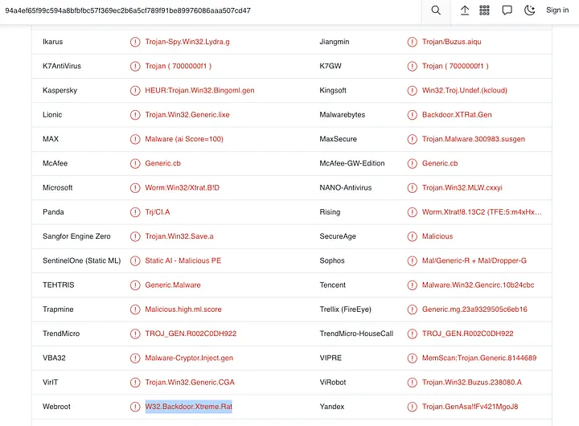

# MrRobot Lab

# Table of Contents
- [Context](#context)
- [Scenario](#scenario)
- [Questions](#questions)
  * [Volatility 2 Windows Memory Forensics 101](#volatility-2-windows-memory-forensics-101)
- [Attack Chain](#attack-chain)
  * [Attack Tree](#attack-tree)
- [Artifacts](#artifacts)
- [Lab Insights](#lab-insights)

# Context

Lab link: [https://cyberdefenders.org/blueteam-ctf-challenges/mrrobot/](https://cyberdefenders.org/blueteam-ctf-challenges/mrrobot/)

Suggested tools: Volatility 2, Volatility 3, Rstudio

Tactics: Initial Access, Execution, Privilege Escalation, Defense Evasion, Credential Access, Discovery, Lateral Movement, Collection, Exfiltration

# Scenario

An employee reported that his machine started to act strangely after receiving a suspicious email for a security update. The incident response team captured a couple of memory dumps from the suspected machines for further inspection. Analyze the dumps and help the SOC analysts team figure out what happened!

# Questions

Q1- Machine:Target1 What email address tricked the front desk employee into installing a security update?

Answer: `th3wh1t3r0s3@gmail[.]com`

Reason: The evidence and answer confirmed for Q1. `OUTLOOK.EXE` (PID `3196`, PPID `2116`) was running on Target1 at process-create time `2015-10-09 11:31:32 UTC`, identified via `pstree` output from the memory image `Target1-1dd8701f.vmss`. A subsequent hex-decoded memory scan of that process recovered an email header showing `From: The Whit3R0s3 <th3wh1t3r0s3@gmail[.]com>`, confirming the sender who social-engineered the front desk employee into installing the fake "security update," consistent with the phishing pretext described in the lab brief.

```bash
$ python2 /home/kali/tools/volatility2/vol.py -f temp_extract_dir/pos01/POS-01-c4e8f786.vmss imageinfo
Volatility Foundation Volatility Framework 2.6.1
INFO    : volatility.debug    : Determining profile based on KDBG search...
          Suggested Profile(s) : Win7SP1x86_23418, Win7SP0x86, Win7SP1x86_24000, Win7SP1x86
                     AS Layer1 : IA32PagedMemoryPae (Kernel AS)
                     AS Layer2 : VMWareAddressSpace (Unnamed AS)
                     AS Layer3 : FileAddressSpace (/home/kali/ctf_stuff/defsec/temp/temp_extract_dir/pos01/POS-01-c4e8f786.vmss)
                      PAE type : PAE
                           DTB : 0x185000L
                          KDBG : 0x82763be8L
          Number of Processors : 2
     Image Type (Service Pack) : 0
                KPCR for CPU 0 : 0x82764c00L
                KPCR for CPU 1 : 0x807c5000L
             KUSER_SHARED_DATA : 0xffdf0000L
           Image date and time : 2015-10-09 12:52:56 UTC+0000
     Image local date and time : 2015-10-09 08:52:56 -0400

$ python2 /home/kali/tools/volatility2/vol.py -f temp_extract_dir/target1/Target1-1dd8701f.vmss --profile=Win7SP1x86_23418 pstree > ~/ctf_stuff/defsec/ccd_mr_robot/target01_pstree.txt 
Volatility Foundation Volatility Framework 2.6.1

$ grep -i outlook ~/ctf_stuff/defsec/ccd_mr_robot/target01_pstree.txt 
. 0x85cd3d40:OUTLOOK.EXE                             3196   2116     22   1678 2015-10-09 11:31:32 UTC+0000

Rule: r1
Owner: Process OUTLOOK.EXE Pid 3196
0x086dffe1  46 72 6f 6d 3a 20 54 68 65 20 57 68 69 74 33 52   From:.The.Whit3R
0x086dfff1  30 73 33 20 3c 74 68 33 77 68 31 74 33 72 30 73   0s3.<th3wh1t3r0s
0x086e0001  33 40 67 6d 61 69 6c 2e 63 6f 6d 3e 0d 0a 54 6f   3@gmail.com>..To
0x086e0011  3a 20 3c 66 72 6f 6e 74 64 65 73 6b 40 61 6c 6c   :.<frontdesk@all
0x086e0021  73 61 66 65 63 79 62 65 72 73 65 63 2e 63 6f 6d   safecybersec.com
```

Q2- Machine:Target1 What is the filename that was delivered in the email?

Answer: `AnyConnectInstaller.exe`

Reason: A memory-resident string dump of the `OUTLOOK.EXE` process (PID `3196`) from Target1's memory image recovered the full HTML body of the phishing email received at `2015-10-09 11:31:32 UTC`, addressed to "Mr. Wellick" and framed as a mandatory VPN software update from "AllSafe," containing a download link to `hxxp://180[.]76[.]254[.]120/AnyConnectInstaller.exe` — confirming `AnyConnectInstaller.exe` as the malicious filename delivered via the lure.

```bash
$ python2 /home/kali/tools/volatility2/vol.py -f temp_extract_dir/target1/Target1-1dd8701f.vmss --profile=Win7SP1x86_23418 memdump -p 3196 -D 3196
$ strings 3196/3196.dmp | grep .exe

<meta http-equiv="Content-Type" content="text/html; charset=utf-8"><div dir="ltr">Hello Mr. Wellick,<div><br></div><div>In ord   er to provide the best service, in the most secure manner, AllSafe has recently updated our remote VPN software. Please download the update from the link below.</div><div><br></div><div><a href="http://180.76.254.120/AnyConnectInstaller.exe">
```

Q3- Machine:Target1 What is the name of the rat's family used by the attacker?

Answer: `XTREMERAT`

Reason: A `filescan` sweep of Target1's memory image located six file table entries for `AnyConnectInstaller.exe` across both the `anyconnect` and `frontdesk` user profiles, including copies under `\Device\HarddiskVolume2\Users\frontdesk\Downloads\AnyConnectInstaller.exe`. The entry at offset `0x3e0bc5e0` was extracted with `dumpfiles` and hashed, yielding `md5: 23a9329505c6eb16840901524ca7bdc9`, which VirusTotal identified via the Webroot vendor detection as `W32.Backdoor.Xtreme.Rat`, confirming the `XTREMERAT` malware family used as the payload behind the fake AnyConnect VPN "security update" delivered at `2015-10-09 11:31:32 UTC`.



```bash
$ python2 /home/kali/tools/volatility2/vol.py -f temp_extract_dir/target1/Target1-1dd8701f.vmss --profile=Win7SP1x86_23418 filescan | grep AnyConnectInstaller
Volatility Foundation Volatility Framework 2.6.1
0x000000003df12dd0      2      0 RW-rwd \Device\HarddiskVolume2\Users\anyconnect\AnyConnect\AnyConnectInstaller.exe
0x000000003df1cf00      4      0 R--r-d \Device\HarddiskVolume2\Users\anyconnect\AnyConnect\AnyConnectInstaller.exe
0x000000003e0bc5e0      7      0 R--r-d \Device\HarddiskVolume2\Users\frontdesk\Downloads\AnyConnectInstaller.exe
0x000000003e2559b0      8      0 R--rwd \Device\HarddiskVolume2\Users\frontdesk\Downloads\AnyConnectInstaller.exe
0x000000003e2ae8e0      8      0 RWD--- \Device\HarddiskVolume2\Users\anyconnect\AnyConnect\AnyConnectInstaller.exe
0x000000003ed57968      4      0 R--r-d \Device\HarddiskVolume2\Users\frontdesk\Downloads\AnyConnectInstaller.exe

$ python2 /home/kali/tools/volatility2/vol.py -f temp_extract_dir/target1/Target1-1dd8701f.vmss --profile=Win7SP1x86_23418 dumpfiles -Q 0x000000003e0bc5e0 -D 3196 
Volatility Foundation Volatility Framework 2.6.1
ImageSectionObject 0x3e0bc5e0   None   \Device\HarddiskVolume2\Users\frontdesk\Downloads\AnyConnectInstaller.exe
DataSectionObject 0x3e0bc5e0   None   \Device\HarddiskVolume2\Users\frontdesk\Downloads\AnyConnectInstaller.exe

$ md5sum 3196/file.None.0x858aef78.dat           
23a9329505c6eb16840901524ca7bdc9  3196/file.None.0x858aef78.dat
```

Q4- Machine:Target1 The malware appears to be leveraging process injection. What is the PID of the process that is injected?

Answer: `2996`

Reason: The VirusTotal sandbox report for the `XTREMERAT` payload listed `iexplore.exe` (C:\Program Files (x86)\Internet Explorer\iexplore.exe) among its spawned processes, indicating the malware injects into a legitimate Internet Explorer process to blend in with normal system activity. Cross-referencing this against Target1's memory image with `pslist` confirmed a matching `iexplore.exe` process at PID `2996` (PPID `2984`), created at `2015-10-09 11:31:27 UTC` — just prior to the phishing email's process-create timestamp of `11:31:32 UTC` — identifying PID `2996` as the injection target.


```bash
$ python2 /home/kali/tools/volatility2/vol.py -f temp_extract_dir/target1/Target1-1dd8701f.vmss --profile=Win7SP1x86_23418 pslist | grep iexplore.exe
Volatility Foundation Volatility Framework 2.6.1
0x85d0d030 iexplore.exe           2996   2984      6      463      1      0 2015-10-09 11:31:27 UTC+0000
```

Q5- Machine:Target1 What is the unique value the malware is using to maintain persistence after reboot?

Answer: `MrRobot`

Reason: The VirusTotal sandbox report's registry activity summary listed a Run key entry at `HKEY_CURRENT_USER\SOFTWARE\Microsoft\Windows\CurrentVersion\Run\MrRobot`, showing the malware creates an autostart value named `MrRobot` under the standard Run key to survive reboot and re-launch the payload at user logon.


Q6- Machine:Target1 Malware often uses a unique value or name to ensure that only one copy runs on the system. What is the unique name the malware is using?

Answer: `fsociety0.dat`

```bash
$ python2 /home/kali/tools/volatility2/vol.py -f temp_extract_dir/target1/Target1-1dd8701f.vmss --profile=Win7SP1x86_23418 handles -p 2996 | grep -i mutant
Volatility Foundation Volatility Framework 2.6.1
0x8560f0c0   2996       0xa4   0x100000 Mutant           RasPbFile
0x85d11700   2996      0x150   0x1f0001 Mutant           fsociety0.dat
0x85928fe0   2996      0x3bc   0x1f0001 Mutant           ZonesLockedCacheCounterMutex
0x83fc4450   2996      0x5b4   0x1f0001 Mutant           TeamViewerHooks_LogBuffer
```

Q7- Machine:Target1 It appears that a notorious hacker compromised this box before our current attackers. Name the movie he or she is from.

Answer: Hackers

Reason: A `filescan` sweep of Target1's memory image, filtered to exclude the known front-desk/AnyConnect user paths, revealed a distinct user profile `\Users\zerocool` along with related AppData artifacts, and a remote share reference to `\10.1.1.21\c$\Users\gideon`. The username `zerocool` is the handle of the character Dade Murphy in the 1995 film `Hackers`, indicating the box carries evidence of an earlier compromise by an unrelated actor using that alias, predating the current `XTREMERAT` intrusion.

```bash
$ python2 /home/kali/tools/volatility2/vol.py -f temp_extract_dir/target1/Target1-1dd8701f.vmss --profile=Win7SP1x86_23418 filescan | grep -i users | grep -i -v -E "front-desk|frontdesk|public|FRONTD~1|anyconnect"
Volatility Foundation Volatility Framework 2.6.1
0x000000003de575d0      7      0 R--rwd \Device\HarddiskVolume2\Users\desktop.ini
0x000000003de77800      8      0 R--rwd \Device\HarddiskVolume2\Users\zerocool\AppData\Roaming\Microsoft\Windows\SendTo\Desktop.ini
0x000000003fda7430      8      0 R--rwd \Device\HarddiskVolume2\Users\zerocool\AppData\Roaming\Microsoft\Internet Explorer\Quick Launch\desktop.ini
0x000000003fdd5f80      1      1 R--rw- \Device\Mup\;Z:000000000002e898\10.1.1.21\c$\Users\gideon
```

Q8- Machine:Target1 What is the NTLM password hash for the administrator account?

Answer: `79402b7671c317877b8b954b3311fa82`

Reason: A `hashdump` extraction against Target1's memory image recovered the SAM database entry for the `Administrator` account (RID `500`), yielding LM hash `aad3b435b51404eeaad3b435b51404ee` (the standard blank/disabled-LM constant) and NTLM hash `79402b7671c317877b8b954b3311fa82`, confirming the NTLM password hash for the local administrator account.

```bash
$ python2 /home/kali/tools/volatility2/vol.py -f temp_extract_dir/target1/Target1-1dd8701f.vmss --profile=Win7SP1x86_23418 hashdump | grep -i admin
Volatility Foundation Volatility Framework 2.6.1
Administrator:500:aad3b435b51404eeaad3b435b51404ee:79402b7671c317877b8b954b3311fa82:::
```

Q9- Machine:Target1 The attackers appear to have moved over some tools to the compromised front desk host. How many tools did the attacker move?

Answer: 3

Reason: The evidence and answer confirmed for Q9. A `filescan` sweep of Target1's memory image for files under `Windows\Temp\` revealed four executables — `wce.exe`, `getlsasrvaddr.exe`, `Rar.exe`, and `nbtscan.exe` — but `getlsasrvaddr.exe` is a helper binary bundled with Windows Credential Editor (`wce.exe`) rather than an independent tool, reducing the distinct tool count to three: WCE for credential dumping, WinRAR for archiving stolen data, and `nbtscan` for NetBIOS network discovery.

```bash
$ python2 /home/kali/tools/volatility2/vol.py -f temp_extract_dir/target1/Target1-1dd8701f.vmss --profile=Win7SP1x86_23418 filescan | grep -i 'Windows\\Temp\\' | grep -i ".exe"
Volatility Foundation Volatility Framework 2.6.1
0x000000003df31038      8      0 R--r-- \Device\HarddiskVolume2\Windows\Temp\wce.exe #1
0x000000003e1eee10      7      0 R--r-d \Device\HarddiskVolume2\Windows\Temp\getlsasrvaddr.exe # part of WCE suite
0x000000003fa633f0      1      0 R--rw- \Device\HarddiskVolume2\Windows\Temp\Rar.exe #2
0x000000003fc3fb80      6      0 R--r-d \Device\HarddiskVolume2\Windows\Temp\nbtscan.exe #3
```

Q10- Machine:Target1 What is the password for the front desk local administrator account?

Answer: `flagadmin@1234`

Reason: A `consoles` scan of Target1's memory image recovered a captured command shell buffer showing `wce.exe -w` being executed from `C:\Windows\Temp`, which dumps cleartext credentials from LSASS memory. The output revealed the credential pair `Administrator\front-desk-PC:flagadmin@1234`, confirming the front desk local administrator account password as `flagadmin@1234`.

```bash
$ python2 /home/kali/tools/volatility2/vol.py -f temp_extract_dir/target1/Target1-1dd8701f.vmss --profile=Win7SP1x86_23418 consoles
C:\Windows\Temp>wce.exe -w
WCE v1.42beta (Windows Credentials Editor) - (c) 2010-2013 Amplia Security - by Hernan Ochoa (hernan@ampliasecurity.com)

Administrator\front-desk-PC:flagadmin@1234   
```

Q11- Machine:Target1 What is the `std` create data timestamp for the nbtscan.exe tool?

Answer: `2015-10-09 10:45:12 UTC`

Reason: An `mftparser` sweep of Target1's memory image, filtered for `nbtscan`, recovered both the `$STANDARD_INFORMATION` (SI) and `$FILE_NAME` (FN) attributes for `Windows\Temp\nbtscan.exe`. The SI Creation timestamp reads `2015-10-09 10:45:12 UTC`, identical to its FN Creation timestamp, indicating the file was written to disk at that time with no divergence between the two attribute sets — consistent with a straightforward file drop rather than a timestomped artifact.

```bash
$ python2 /home/kali/tools/volatility2/vol.py -f temp_extract_dir/target1/Target1-1dd8701f.vmss --profile=Win7SP1x86_23418 mftparser > mft_info

$ grep -i nbtscan mft_info -C 10

$STANDARD_INFORMATION
Creation                       Modified                       MFT Altered                    Access Date                    Type
------------------------------ ------------------------------ ------------------------------ ------------------------------ ----
2015-10-09 10:45:12 UTC+0000 2015-10-09 10:45:12 UTC+0000   2015-10-09 11:05:34 UTC+0000   2015-10-09 10:45:12 UTC+0000   Archive

$FILE_NAME
Creation                       Modified                       MFT Altered                    Access Date                    Name/Path
------------------------------ ------------------------------ ------------------------------ ------------------------------ ---------
2015-10-09 10:45:12 UTC+0000 2015-10-09 10:45:12 UTC+0000   2015-10-09 10:45:12 UTC+0000   2015-10-09 10:45:12 UTC+0000   Windows\Temp\nbtscan.exe
```

Q12- Machine:Target1 The attackers appear to have stored the output from the `nbtscan.exe` tool in a text file on a disk called `nbs.txt`. What is the IP address of the first machine in that file?

Answer: `10.1.1.2`

Reason: A `filescan` sweep of Target1's memory image located `Windows\Temp\nbs.txt` at offset `0x3fdb7808`, extracted via `dumpfiles`. The recovered contents show the output of the `nbtscan` NetBIOS discovery tool, listing four hosts on the `ALLSAFECYBERSEC` domain: `AD01` (domain controller), `EX01`, `FRONT-DESK-PC`, and `GIDEON-PC`. The first entry in the file is `10.1.1.2` (`ALLSAFECYBERSEC\AD01`), confirming the attacker's network discovery scan identified the domain controller as the first result.

```bash
$ python2 /home/kali/tools/volatility2/vol.py -f temp_extract_dir/target1/Target1-1dd8701f.vmss --profile=Win7SP1x86_23418 filescan | grep nbs.txt
Volatility Foundation Volatility Framework 2.6.1
0x000000003fdb7808      8      0 -W-r-- \Device\HarddiskVolume2\Windows\Temp\nbs.txt
                                                                                                                                                
$ python2 /home/kali/tools/volatility2/vol.py -f temp_extract_dir/target1/Target1-1dd8701f.vmss --profile=Win7SP1x86_23418 dumpfiles -Q 0x000000003fdb7808 -D .   
Volatility Foundation Volatility Framework 2.6.1
DataSectionObject 0x3fdb7808   None   \Device\HarddiskVolume2\Windows\Temp\nbs.txt
                                                                                                                                                
$ cat file.None.0x83eda598.dat 
10.1.1.2        ALLSAFECYBERSEC\AD01            SHARING DC
10.1.1.3        ALLSAFECYBERSEC\EX01            SHARING
10.1.1.20       ALLSAFECYBERSEC\FRONT-DESK-PC   SHARING
10.1.1.21       ALLSAFECYBERSEC\GIDEON-PC       SHARING
```

Q13- Machine:Target1 What is the full IP address and the port was the attacker's malware using?

Answer: `180.76.254.120:22`

Reason: A `netscan` sweep of Target1's memory image filtered on the injected `iexplore.exe` process (PID `2996`) revealed an established TCP connection from `10.1.1.20:49205` to `180.76.254.120:22`, confirming the `XTREMERAT` malware's command-and-control channel used the remote IP `180.76.254.120` over port `22`.

```bash
$ python2 /home/kali/tools/volatility2/vol.py -f temp_extract_dir/target1/Target1-1dd8701f.vmss --profile=Win7SP1x86_23418 netscan | grep 2996
Volatility Foundation Volatility Framework 2.6.1
0x3e0eedf8         TCPv4    10.1.1.20:49205                180.76.254.120:22    ESTABLISHED      2996     iexplore.exe 
```

Q14- Machine:Target1 It appears the attacker also installed legit remote administration software. What is the name of the running process?

Answer: `TeamViewer.exe`

Reason: A `netscan` sweep of Target1's memory image filtered on "Team" identified `TeamViewer.exe` (PID `2680`) with active connections at `2015-10-09 12:10:57 UTC`, including outbound sessions to TeamViewer's relay infrastructure at `192.96.201.138:5938` and `107.6.97.19:5938`, alongside a companion process `TeamViewer_Des...` (PID `1092`). This confirms the attacker installed the legitimate remote administration tool `TeamViewer.exe` to maintain an additional, less suspicious remote-access channel into the host.

```bash
$ python2 /home/kali/tools/volatility2/vol.py -f temp_extract_dir/target1/Target1-1dd8701f.vmss --profile=Win7SP1x86_23418 netscan | grep "Team"
Volatility Foundation Volatility Framework 2.6.1
0x3fa082e0         UDPv4    0.0.0.0:59560                  *:*                                   2680     TeamViewer.exe 2015-10-09 12:10:57 UTC+0000
0x3fa19180         TCPv4    127.0.0.1:6039                 0.0.0.0:0            LISTENING        2680     TeamViewer.exe 
0x3fa72a80         TCPv4    127.0.0.1:6039                 127.0.0.1:49298      ESTABLISHED      2680     TeamViewer.exe 
0x3fa95df8         TCPv4    10.1.1.20:49297                192.96.201.138:5938  ESTABLISHED      2680     TeamViewer.exe 
0x3fc426a8         TCPv4    10.1.1.20:49291                107.6.97.19:5938     ESTABLISHED      2680     TeamViewer.exe 
0x3fcdd8b0         TCPv4    127.0.0.1:49298                127.0.0.1:6039       ESTABLISHED      1092     TeamViewer_Des 
```

Q15- Machine:Target1 It appears the attackers also used a built-in remote access method. What IP address did they connect to?

Answer: `10.1.1.21`

Reason: A `netscan` sweep of Target1's memory image filtered on port `3389` revealed an established connection from `mstsc.exe` (PID `2844`), the built-in Windows Remote Desktop client, to `10.1.1.21:3389` — matching the `GIDEON-PC` host previously identified in the `nbtscan` output. This confirms the attacker used RDP, a built-in Windows remote access method, to pivot from the compromised front desk host to `10.1.1.21`.

```bash
$ python2 /home/kali/tools/volatility2/vol.py -f temp_extract_dir/target1/Target1-1dd8701f.vmss --profile=Win7SP1x86_23418 netscan | grep "3389"
Volatility Foundation Volatility Framework 2.6.1
0x3fb7a560         TCPv4    10.1.1.20:49301                10.1.1.21:3389       ESTABLISHED      2844     mstsc.exe 
```

Q16- Machine:Target2 It appears the attacker moved latterly from the front desk machine to the security admins (Gideon) machine and dumped the passwords. What is Gideon's password?

Answer: `t76fRJhS`

Reason: On `Target2`, a `consoles` scan recovered a `cmd.exe` command history showing the attacker running `wce.exe -w > gideon/w.tmp`, redirecting Windows Credential Editor's cleartext credential dump to a file in the `gideon` user directory. The file `\Users\gideon\w.tmp` was located via `filescan` at offset `0x3fcf2798` and extracted with `dumpfiles`, revealing the credential pair `gideon\ALLSAFECYBERSEC:t76fRJhS`, confirming the lateral movement from the front desk host to Gideon's machine and recovery of his cleartext password as `t76fRJhS`.

```bash
$ python2 /home/kali/tools/volatility2/vol.py -f temp_extract_dir/target2/target2-6186fe9f.vmss --profile=Win7SP1x86_23418 consoles

'CommandHistory: 0xe9198 Application: cmd.exe Flags: Allocated, Reset
CommandCount: 18 LastAdded: 17 LastDisplayed: 17
FirstCommand: 0 CommandCountMax: 50
ProcessHandle: 0x60
Cmd #0 at 0xe6030: cd C:\Users
Cmd #1 at 0xe6ea8: dir
Cmd #2 at 0xee3d0: wce.exe -w > gideon/w.tmp'

$ python2 /home/kali/tools/volatility2/vol.py -f temp_extract_dir/target2/target2-6186fe9f.vmss --profile=Win7SP1x86_23418 filescan | grep "w.tmp"
Volatility Foundation Volatility Framework 2.6.1
0x000000003fcf2798      8      0 -W-r-- \Device\HarddiskVolume2\Users\gideon\w.tmp

$ python2 /home/kali/tools/volatility2/vol.py -f temp_extract_dir/target2/target2-6186fe9f.vmss --profile=Win7SP1x86_23418 dumpfiles -Q 0x000000003fcf2798 -D .
Volatility Foundation Volatility Framework 2.6.1
DataSectionObject 0x3fcf2798   None   \Device\HarddiskVolume2\Users\gideon\w.tmp

$ mv file.None.0x85a35da0.dat w.tmp

$ cat w.tmp
WCE v1.42beta (Windows Credentials Editor) - (c) 2010-2013 Amplia Security - by Hernan Ochoa (hernan@ampliasecurity.com)
Use -h for help.

gideon\ALLSAFECYBERSEC:t76fRJhS
GIDEON-PC$\ALLSAFECYBERSEC:s9O3t%sd1q>:u5Za8Xrx_3Eg;(\qapu<"Rn$#QQJlsD m#;z2hbJkr*tLe>0)F[S)'USh3BKJILn3-?vt]q=s-Cp.ws9wVik[]5?#F\*l/J19+`PYco:au;T
```

Q17- Machine:Target2 Once the attacker gained access to "Gideon," they pivoted to the AllSafeCyberSec domain controller to steal files. It appears they were successful. What password did they use?

Answer: `123qwe!@#`

Reason: A `consoles` scan of Target2 filtered on "rar" recovered the attacker's command history showing files copied to `z:\crownjewels` via `copy c:\users\gideon\rar.exe z:\crownjewels`, followed by two password-protected RAR archiving attempts: `rar crownjewlez.rar *.txt -hp123qwe!@#` and a later retry `rar a -hp123!@#qwe crownjewlez.rar *.txt`. The first command reflects the password actually used to archive and stage the stolen `.txt` files for exfiltration from the domain controller share, confirming the password as `123qwe!@#`.

```bash
$ python2 /home/kali/tools/volatility2/vol.py -f temp_extract_dir/target2/target2-6186fe9f.vmss --profile=Win7SP1x86_23418 consoles | grep rar
Volatility Foundation Volatility Framework 2.6.1
'Cmd #12 at 0xf2418: copy c:\users\gideon\rar.exe z:\crownjewels
Cmd #15 at 0xe6f38: rar
Cmd #16 at 0xf2478: rar crownjewlez.rar *.txt -hp123qwe!@#
Cmd #17 at 0xf24d0: rar a -hp123!@#qwe crownjewlez.rar *.txt'
```

Q18- Machine:Target2 What was the name of the RAR file created by the attackers?

Answer: `crownjewlez.rar`

Reason: The same `consoles` command history recovered from Target2 shows the attacker creating a password-protected archive named `crownjewlez.rar` via `rar crownjewlez.rar *.txt -hp123qwe!@#`, staging all `.txt` files from the compromised domain controller share for exfiltration.

Q19- Machine:Target2 How many files did the attacker add to the RAR archive?

Answer: 3

Reason: A UTF-16LE `strings` pass over a memory dump of PID `3048`, filtered for `crownjewlez.rar` and `.txt`, recovered the archive's contents alongside unrelated system/browser artifacts. Excluding the cookie and log files that share the `.txt` extension but are not part of the exfiltrated data, three files were identified as added to the archive: `SecretSauce1.txt`, `SecretSauce2.txt`, and `SecretSauce3.txt`, confirming the attacker archived three files from the domain controller.

```bash
$ python2 /home/kali/tools/volatility2/vol.py -f temp_extract_dir/target2/target2-6186fe9f.vmss --profile=Win7SP1x86_23418 memdump -p 3048 -D 3048/

$ strings -e -l 3048.dmp | grep -E "crownjewlez.rar|.txt"

\Users\gideon.ALLSAFECYBERSEC\AppData\Roaming\Microsoft\Windows\Cookies\Low\gideon@google[1].txt
\Device\HarddiskVolume2\Users\gideon.ALLSAFECYBERSEC\AppData\Local\Temp\FXSAPIDebugLogFile.txt
crownjewlez.rar
SecretSauce1.txt
SecretSauce2.txt
SecretSauce3.txt
```

Q20- Machine:Target2 The attacker appears to have created a scheduled task on Gideon's machine. What is the name of the file associated with the scheduled task?

Answer: `1.bat`

Reason: A `filescan` sweep of Target2 excluding standard Microsoft task paths located `\Windows\Tasks\At1.job` at offset `0x3fd05bd8`, extracted via `dumpfiles`. Because `.job` files use a binary format that `file` misidentifies, a UTF-16LE `strings` pass recovered the embedded command path `c:\users\gideon\1.bat`, the run-as account `SYSTEM`, and the creation method `NetScheduleJobAdd`, confirming the attacker created a scheduled task to execute `1.bat` with SYSTEM privileges on Gideon's machine.

```bash
$ python2 /home/kali/tools/volatility2/vol.py -f temp_extract_dir/target2/target2-6186fe9f.vmss --profile=Win7SP1x86_23418 filescan | grep -i tasks | grep -i -v microsoft
Volatility Foundation Volatility Framework 2.6.1
<SNIP>
0x000000003fd05bd8      8      0 -W-r-d \Device\HarddiskVolume2\Windows\Tasks\At1.job

$ python2 /home/kali/tools/volatility2/vol.py -f temp_extract_dir/target2/target2-6186fe9f.vmss --profile=Win7SP1x86_23418 dumpfiles -Q 0x000000003fd05bd8 -D .

$ strings -e l At1.job                                  
c:\users\gideon\1.bat
SYSTEM
Created by NetScheduleJobAdd.
```

Q21- Machine:POS What is the malware CNC's server?

Answer: `54.84.237.92`

Reason: A `malfind` scan of the POS machine's memory image identified injected `MZ`-headed executable code (an embedded PE file) at address `0x50000` within both `iexplore.exe` processes (PID `3208` and PID `3136`), each marked with `PAGE_EXECUTE_READWRITE` protection — a classic indicator of shellcode/process injection consistent with the injection pattern seen on Target1. A `netscan` filter on those PIDs revealed a `CLOSE_WAIT` connection from the injected `iexplore.exe` (PID `3208`) to `54.84.237.92:80`, confirming the malware's command-and-control server as `54.84.237.92`.

```bash
$ python2 /home/kali/tools/volatility2/vol.py -f temp_extract_dir/pos01/POS-01-c4e8f786.vmss --profile=Win7SP1x86_23418 malfind

$ grep -i iexplore mal.txt -C 5
0x00000000365b0038 0000             ADD [EAX], AL
0x00000000365b003a 0000             ADD [EAX], AL
0x00000000365b003c 0000             ADD [EAX], AL
0x00000000365b003e 0000             ADD [EAX], AL

Process: iexplore.exe Pid: 3208 Address: 0x50000
Vad Tag: VadS Protection: PAGE_EXECUTE_READWRITE
Flags: CommitCharge: 11, MemCommit: 1, PrivateMemory: 1, Protection: 6

0x0000000000050000  4d 5a 90 00 03 00 00 00 04 00 00 00 ff ff 00 00   MZ..............
0x0000000000050010  b8 00 00 00 00 00 00 00 40 00 00 00 00 00 00 00   ........@.......
--
0x0000000000050038 0000             ADD [EAX], AL
0x000000000005003a 0000             ADD [EAX], AL
0x000000000005003c d800             FADD DWORD [EAX]
0x000000000005003e 0000             ADD [EAX], AL

Process: iexplore.exe Pid: 3136 Address: 0x50000
Vad Tag: VadS Protection: PAGE_EXECUTE_READWRITE
Flags: CommitCharge: 11, MemCommit: 1, PrivateMemory: 1, Protection: 6

0x0000000000050000  4d 5a 90 00 03 00 00 00 04 00 00 00 ff ff 00 00   MZ..............
0x0000000000050010  b8 00 00 00 00 00 00 00 40 00 00 00 00 00 00 00   ........@.......

$ python2 /home/kali/tools/volatility2/vol.py -f temp_extract_dir/pos01/POS-01-c4e8f786.vmss --profile=Win7SP1x86_23418 netscan | grep -E "3208|3136"
Volatility Foundation Volatility Framework 2.6.1
0x3e135df8         TCPv4    10.1.1.10:58751                54.84.237.92:80      CLOSE_WAIT       3208     iexplore.exe 
```

Q22- Machine:POS What is the common name of the malware used to infect the POS system?

Answer: `dexter`

Reason: A VirusTotal lookup on the C2 IP `54.84.237.92` returned multiple vendor detections referencing the same malware family, including Alibaba's `TrojanPSW:Win32/Dexter.d51543ef`, AliCloud's `Trojan:Win/Dexter.A`, and Avast/AVG's `Win32:Dexter-J [Spy]`, confirming the malware infecting the POS system as `Dexter`, a known POS-targeting credential/card-data-stealing trojan.


Q23- Machine:POS In the POS malware whitelist. What application was specific to `Allsafecybersec`?

Answer: `allsafe_protector.exe`

Reason: The evidence and answer confirmed for Q23. The injected code at address `0x50000` within `iexplore.exe` (PID `3208`) was extracted with `dlldump` and identified via `file` as a valid PE32 executable. A `strings` pass over the dumped module revealed an embedded process whitelist containing standard Windows system binaries (`svchost.exe`, `smss.exe`, `csrss.exe`, `winlogon.exe`, `lsass.exe`, `spoolsv.exe`, `alg.exe`, `wuauclt.exe`) alongside one company-specific entry, `allsafe_protector.exe`, confirming this as the AllSafeCyberSec-specific application the Dexter malware was configured to avoid or ignore.

```bash
$ python2 /home/kali/tools/volatility2/vol.py -f temp_extract_dir/pos01/POS-01-c4e8f786.vmss --profile=Win7SP1x86_23418 dlldump -p 3208 -b 0x50000 -D .

$ file module.3208.3fd324d8.50000.dll
module.3208.3fd324d8.50000.dll: PE32 executable for MS Windows 6.00 (GUI), Intel i386, 5 sections

$ strings module.3208.3fd324d8.50000.dll | grep exe     
allsafe_protector.exe
svchost.exe
iexplore.exe
explorer.exe
smss.exe
csrss.exe
winlogon.exe
lsass.exe
spoolsv.exe
alg.exe
wuauclt.exe
.exe;.bat;.reg;.vbs;
```

Q24- Machine:POS What is the name of the file the malware was initially launched from?

Answer: `allsafe_update.exe`

Reason: An `iehistory` scan of the POS machine's memory image filtered on the known C2 IP `54.84.237.92` recovered repeated Internet Explorer history entries for the `pos` user profile, all pointing to `hxxp://54[.]84[.]237[.]92/allsafe_update.exe`, confirming `allsafe_update.exe` as the file from which the Dexter malware was initially launched — disguised as an AllSafeCyberSec update, mirroring the same social-engineering pretext used against Target1.

```bash
$ python2 /home/kali/tools/volatility2/vol.py -f temp_extract_dir/pos01/POS-01-c4e8f786.vmss --profile=Win7SP1x86_23418 iehistory | grep 54.84.237.92
Volatility Foundation Volatility Framework 2.6.1
Location: Visited: pos@http://54.84.237.92/allsafe_update.exe
Location: Visited: pos@http://54.84.237.92/allsafe_update.exe
Location: :2015100920151010: pos@http://54.84.237.92/allsafe_update.exe
Location: :2015100920151010: pos@:Host: 54.84.237.92
Location: :2015100920151010: pos@http://54.84.237.92/allsafe_update.exe
URL: pos@http://54.84.237.92/allsafe_update.exe
URL: pos@http://54.84.237.92/allsafe_update.exe
Location: Visited: pos@http://54.84.237.92/allsafe_update.exe
Location: Visited: pos@http://54.84.237.92/allsafe_update.exe
```

## Volatility 2 Windows Memory Forensics 101

- `imageinfo` — Determines the OS profile and KDBG address from an unknown memory image; run first against any new capture before choosing `-profile`.
`python2 vol.py -f target1.vmss imageinfo`
Output: Suggested Profile(s): `Win7SP1x86_23418`, `Win7SP0x86`, ... / Image date and time: 2015-10-09 12:53:02 UTC+0000
- `pstree` — Shows parent/child process relationships as indentation depth; used to locate `OUTLOOK.EXE` and confirm its process-create timestamp.
`python2 vol.py -f Target1-1dd8701f.vmss --profile=Win7SP1x86_23418 pstree`
Output: `. 0x85cd3d40:OUTLOOK.EXE 3196 2116 22 1678 2015-10-09 11:31:32 UTC+0000`
- `pslist` — Flat process list with PID/PPID/thread-handle counts and create time; used to locate the injected `iexplore.exe` and confirm its PID against a VirusTotal sandbox report.
`python2 vol.py -f Target1-1dd8701f.vmss --profile=Win7SP1x86_23418 pslist | grep iexplore.exe`
Output: `0x85d0d030 iexplore.exe 2996 2984 6 463 1 0 2015-10-09 11:31:27 UTC+0000`
- `memdump` — Dumps a single process's full addressable memory to disk for offline strings/grep analysis, scoped by `p` (PID) or `o` (EPROCESS offset).
`python2 vol.py -f Target1-1dd8701f.vmss --profile=Win7SP1x86_23418 memdump -p 3196 -D 3196`
Output: `Writing OUTLOOK.EXE [ 3196] to 3196.dmp`
- `yarascan` — Scans process memory (optionally scoped with `p`) for a byte/string pattern via YARA, with `Y` for a quick ad-hoc literal string or `y`/`-yara-rules` for a full regex-capable rule file. Requires `yara-python` compatible with vol2.6.1's `malfind.py` (v4.x breaks it — use `yara-python==3.6.3`, ideally in an isolated virtualenv).
`python2 vol.py -f POS-01-c4e8f786.vmss --profile=Win7SP1x86_24000 yarascan -p 3376 -Y "From:"`
Output: `Rule: r1 / Owner: Process OUTLOOK.EXE Pid 3376` / hex+ASCII match dump
- `filescan` — Enumerates filemory (open/cached handles),independent of the on-disk MFT; used repeatedly to locate dropped tools, staged archives, and scheduled task
`python2 vol.py -f Target1-1dd8701f.vmss --profile=Win7SP1x86_23418 filescan | grep -i 'Windows\Temp\' | grep -i`
Output: `0x000000003df31038 8 0 R--r-- \Device\HarddiskVolume2\Windows\Temp\wce.exe` - `dumpfiles` — Extracts a fil's offset (`Q`) from memory to disk, using its ImageSectionObject/DataSectionObject. `python2 vol.py -f Target1-1dx86_23418 dumpfiles -Q0x000000003e0bc5e0 -D 3196`
    
    Output: `DataSectionObject 0x\Device\HarddiskVolume2\Users\frontdesk\Downloads\AnyConnectInstaller.exe` - `handles` — Lists open kernes (`p`); filtered on Mutanttype to recover the malware's mutex used to prevent multiple running instances. `python2 vol.py -f Target1-1dx86_23418 handles -p 2996 |grep -i mutant` Output: `0x85d11700 2996 0x15at`
    
- `hashdump` — Extracts NTLM/LM password hashes from the SAM database resident in memory, without needing regi
`python2 vol.py -f Target1-1dd8701f.vmss --profile=Win7SP1x86_23418 hashdump | grep -i admin`
Output: `Administrator:500:aad3b435b57671c317877b8b954b3311fa82:::`
- `consoles` — Recovers command-line console/`cmd.exe` history buffers held in memory, including commands from toolteractively.
`python2 vol.py -f target2-6186fe9f.vmss --profile=Win7SP1x86_23418 consoles` Output: `Cmd #2 at 0xee3d0: w`
- `netscan` — Enumerates network connections/sockets (TCP/UDP) tracked in memory, scopedby PID grep; used to identifions, and RDP pivots.
`python2 vol.py -f Target1-1dd8701f.vmss --profile=Win7SP1x86_23418 netscan | grep 2996`Output: `TCPv4 10.1.1.20:4920ED 2996 iexplore.exe`
- `mftparser` — Parses NTFS Master File Table (MFT) records resident in memory, dumping both `$STANDARD_INFORMATION` (tamp attributes per file,used to check for timestomping divergence.
`python2 vol.py -f Target1-1dx86_23418 mftparser`
Output: `$SI Creation: 2015-10-09 10:45:12 UTC+0000` / `$FN Creation: 2015-10-09 10:45:12 UTC+0000`
- `dlldump` — Extracts a loaded module/DLL (or injected PE) from a process's memory
space at a given base addresstatic analysis (file,strings).
`python2 vol.py -f POS-01-c4e86_23418 dlldump -p 3208 -b0x50000 -D .`
Output: `module.3208.3fd324d8`xecutable via file, whitelist strings recovered via `strings ... | grep exe`
- `iehistory` — Recovers Inter entries (visited URLs, cache index records) resident in memory, per user profile.
`python2 vol.py -f POS-01-c4e86_23418 iehistory | grep54.84.237.92`
Output: `URL: pos@http://54.8`

# Attack Chain

| Time (UTC) | Stage | Detail | MITRE |
| --- | --- | --- | --- |
| 2015-10-09 11:31:27 | Execution | `iexplore.exe` (PID 2996) created on Target1, later confirmed as the process injected with the XtremeRAT payload | T1055 |
| 2015-10-09 11:31:32 | Initial Access | Phishing email from `th3wh1t3r0s3@gmail[.]com` received in `OUTLOOK.EXE` (PID 3196) on Target1, posing as an AllSafe VPN update notice | T1566.001 |
| 2015-10-09 11:31:32 | Execution | Victim downloads and runs `AnyConnectInstaller.exe` from `hxxp://180[.]76[.]254[.]120/AnyConnectInstaller.exe`, delivering XtremeRAT | T1204.002 |
| — | Defense Evasion | XtremeRAT injects into `iexplore.exe` (PID 2996) to blend with legitimate process activity | T1055 |
| — | Persistence | Run key `HKCU\SOFTWARE\Microsoft\Windows\CurrentVersion\Run\MrRobot` created for reboot survival | T1547.001 |
| — | Defense Evasion | Mutex `fsociety0.dat` created to prevent duplicate XtremeRAT instances | T1480 |
| — | Command and Control | Established C2 session `10.1.1.20:49205` -> `180[.]76[.]254[.]120:22` | T1071 |
| 2015-10-09 10:45:12 | Discovery | Tool staging: `wce.exe`, `getlsasrvaddr.exe`, `Rar.exe`, `nbtscan.exe` dropped to `Windows\Temp` | T1105 |
| — | Discovery | `nbtscan.exe` output saved to `nbs.txt`, identifying `AD01` (`10.1.1.2`, DC), `EX01` (`10.1.1.3`), `FRONT-DESK-PC` (`10.1.1.20`), `GIDEON-PC` (`10.1.1.21`) | T1046 |
| — | Credential Access | `wce.exe -w` dumps local Administrator NTLM hash `79402b7671c317877b8b954b3311fa82` | T1003.001 |
| 2015-10-09 12:10:57 | Persistence | Legitimate `TeamViewer.exe` installed as secondary remote-access channel, connecting to `192[.]96[.]201[.]138:5938` / `107[.]6[.]97[.]19:5938` | T1219 |
| — | Lateral Movement | RDP session via `mstsc.exe` (PID 2844) from Target1 to `10.1.1.21:3389` (Gideon-PC) | T1021.001 |
| — | Credential Access | On Gideon-PC, `wce.exe -w > gideon/w.tmp` dumps cleartext credential `gideon\ALLSAFECYBERSEC:t76fRJhS` | T1003.001 |
| — | Lateral Movement | Gideon's credentials used to pivot to the domain controller and access a mapped share (`z:\crownjewels`) | T1021 |
| — | Collection | `rar crownjewlez.rar *.txt -hp123qwe!@#` archives `SecretSauce1.txt`, `SecretSauce2.txt`, `SecretSauce3.txt` from the DC share | T1560.001 |
| — | Persistence | Scheduled task `At1.job` created via `NetScheduleJobAdd`, executing `c:\users\gideon\1.bat` as SYSTEM | T1053.005 |
| — | Initial Access | POS machine infected via download of `allsafe_update.exe` from `hxxp://54[.]84[.]237[.]92/allsafe_update.exe` (per IE history) | T1566 |
| — | Defense Evasion | Dexter malware injects into `iexplore.exe` (PID 3208, PID 3136), embedding a full PE (MZ header) at `0x50000` with `PAGE_EXECUTE_READWRITE` protection | T1055 |
| — | Defense Evasion | Embedded process whitelist includes `allsafe_protector.exe` alongside standard OS binaries, avoiding detection by that specific security tool | T1027 |
| — | Command and Control | C2 connection `10.1.1.10:58751` -> `54[.]84[.]237[.]92:80` (`CLOSE_WAIT`) | T1071.001 |

## Attack Tree

```bash
[Stage 1 — Initial Access: Target1]
th3wh1t3r0s3@gmail[.]com  ← phishing sender → Mr. Wellick (front desk)
    └── OUTLOOK.EXE (PID 3196)  ← email received 2015-10-09 11:31:32 UTC
        └── hxxp://180[.]76[.]254[.]120/AnyConnectInstaller.exe  ← fake VPN update lure
            └── AnyConnectInstaller.exe executed
                └── XtremeRAT dropped (md5: 23a9329505c6eb16840901524ca7bdc9)
                    │
                    ├── [Stage 2 — Defense Evasion / Persistence]
                    │   └── injects into iexplore.exe (PID 2996)  ← PAGE_EXECUTE_READWRITE
                    │       ├── Run key: HKCU\...\Run\MrRobot
                    │       └── Mutex: fsociety0.dat
                    │
                    ├── [Stage 3 — C2]
                    │   └── iexplore.exe (PID 2996) → 180[.]76[.]254[.]120:22  ESTABLISHED
                    │
                    ├── [Stage 4 — Discovery / Credential Access]
                    │   └── tools staged to Windows\Temp
                    │       ├── nbtscan.exe → nbs.txt
                    │       │   ├── 10.1.1.2  AD01 (DC)
                    │       │   ├── 10.1.1.3  EX01
                    │       │   ├── 10.1.1.20 FRONT-DESK-PC
                    │       │   └── 10.1.1.21 GIDEON-PC
                    │       └── wce.exe -w → Administrator NTLM 79402b7671c317877b8b954b3311fa82
                    │
                    └── [Stage 5 — Lateral Movement]
                        ├── TeamViewer.exe installed  ← secondary RAT channel
                        │   └── → 192[.]96[.]201[.]138:5938 / 107[.]6[.]97[.]19:5938
                        └── mstsc.exe (PID 2844) → 10.1.1.21:3389 (RDP)
                            │
                            [Stage 6 — Target2 / Gideon-PC]
                            └── wce.exe -w > gideon/w.tmp
                                └── gideon\ALLSAFECYBERSEC:t76fRJhS  ← cleartext cred recovered
                                    └── pivot to Domain Controller (z:\crownjewels)
                                        └── rar crownjewlez.rar *.txt -hp123qwe!@#
                                            ├── SecretSauce1.txt
                                            ├── SecretSauce2.txt
                                            └── SecretSauce3.txt  ← staged for exfil
                                        └── At1.job → c:\users\gideon\1.bat  (SYSTEM, NetScheduleJobAdd)

[Stage 7 — Independent Compromise: POS Machine]
hxxp://54[.]84[.]237[.]92/allsafe_update.exe  ← visited via IE (fake AllSafe update)
    └── allsafe_update.exe executed
        └── Dexter malware dropped
            ├── injects into iexplore.exe (PID 3208, PID 3136)  ← MZ header @ 0x50000, RWX
            │   └── whitelist includes allsafe_protector.exe  ← evasion of company AV
            └── C2: 10.1.1.10:58751 → 54[.]84[.]237[.]92:80  CLOSE_WAIT
```

# Artifacts

| Category | Type | Value |
| --- | --- | --- |
| Delivery | Phishing sender | `th3wh1t3r0s3@gmail[.]com` |
| Delivery | Lure theme | Fake AllSafe VPN "security update" notice |
| Delivery | Delivery URL (Target1) | `hxxp://180[.]76[.]254[.]120/AnyConnectInstaller.exe` |
| Delivery | Delivery URL (POS) | `hxxp://54[.]84[.]237[.]92/allsafe_update.exe` |
| Dropped File | Payload (Target1) | `AnyConnectInstaller.exe` |
| Dropped File | Payload (POS) | `allsafe_update.exe` |
| Dropped File | Path (frontdesk) | `\Users\frontdesk\Downloads\AnyConnectInstaller.exe` |
| Dropped File | Path (anyconnect) | `\Users\anyconnect\AnyConnect\AnyConnectInstaller.exe` |
| Malware | Family (Target1/Target2) | XtremeRAT |
| Malware | Hash (XtremeRAT) | `md5: 23a9329505c6eb16840901524ca7bdc9` |
| Malware | Detection | VirusTotal / Webroot: `W32.Backdoor.Xtreme.Rat` |
| Malware | Family (POS) | Dexter |
| Malware | Detection (Dexter) | VirusTotal — Alibaba `TrojanPSW:Win32/Dexter.d51543ef`, Avast/AVG `Win32:Dexter-J [Spy]` |
| Process Injection | Injected process (Target1) | `iexplore.exe` PID `2996` |
| Process Injection | Injected process (POS) | `iexplore.exe` PID `3208`, PID `3136` |
| Process Injection | Injected memory marker | `MZ` header at `0x50000`, `PAGE_EXECUTE_READWRITE` |
| Persistence | Registry Run key | `HKCU\SOFTWARE\Microsoft\Windows\CurrentVersion\Run\MrRobot` |
| Persistence | Scheduled task | `At1.job` → `c:\users\gideon\1.bat` (run as `SYSTEM`, via `NetScheduleJobAdd`) |
| Defense Evasion | Mutex (XtremeRAT) | `fsociety0.dat` |
| Defense Evasion | Dexter process whitelist | `allsafe_protector.exe`, `svchost.exe`, `iexplore.exe`, `explorer.exe`, `smss.exe`, `csrss.exe`, `winlogon.exe`, `lsass.exe`, `spoolsv.exe`, `alg.exe`, `wuauclt.exe` |
| Credential Access | Local Administrator NTLM (Target1) | `79402b7671c317877b8b954b3311fa82` |
| Credential Access | Gideon cleartext credential | `gideon\ALLSAFECYBERSEC:t76fRJhS` |
| Credential Access | Credential dump tool | `wce.exe` (Windows Credential Editor) + `getlsasrvaddr.exe` helper |
| Discovery | Scanner tool | `nbtscan.exe` |
| Discovery | Scan output file | `nbs.txt` |
| Discovery | Host: DC | `10.1.1.2` — `AD01` |
| Discovery | Host | `10.1.1.3` — `EX01` |
| Discovery | Host | `10.1.1.20` — `FRONT-DESK-PC` |
| Discovery | Host | `10.1.1.21` — `GIDEON-PC` |
| Collection / Exfiltration | Archive tool | `Rar.exe` |
| Collection / Exfiltration | Archive name | `crownjewlez.rar` |
| Collection / Exfiltration | Archive password | `123qwe!@#` |
| Collection / Exfiltration | Archived files | `SecretSauce1.txt`, `SecretSauce2.txt`, `SecretSauce3.txt` |
| Lateral Movement | Remote access (built-in) | `mstsc.exe` (PID `2844`) → `10.1.1.21:3389` (RDP) |
| Lateral Movement | Remote access (dual-use) | `TeamViewer.exe` (PID `2680`) |
| Network / C2 | C2 (XtremeRAT) | `10.1.1.20:49205 -> 180[.]76[.]254[.]120:22` |
| Network / C2 | C2 (Dexter) | `10.1.1.10:58751 -> 54[.]84[.]237[.]92:80` |
| Network / C2 | TeamViewer relay (1) | `192[.]96[.]201[.]138:5938` |
| Network / C2 | TeamViewer relay (2) | `107[.]6[.]97[.]19:5938` |
| Host Indicators | Prior unrelated compromise | User profile `zerocool` (reference to film Hackers) |
| Host Indicators | Remote share reference | `\10.1.1.21\c$\Users\gideon` |

# Lab Insights

- LOLBINs and legitimate tools are the real attack surface, not just malware binaries. Every stage of persistence, credential theft, and lateral movement in this lab rode on trusted or dual-use software — regsvr32.exe, wce.exe, TeamViewer.exe, mstsc.exe, and even a legacy AT .job scheduled task — rather than exotic custom tooling. The actual malware (XtremeRAT, Dexter) only handled initial foothold and injection; everything after that leaned on binaries a defender would normally whitelist, which is exactly why process whitelisting alone (as seen in Dexter's own allsafe_protector.exe whitelist entry) is a two-way street — attackers build evasion lists for defenders' tools just as defenders build them for attacker tools.
- Memory forensics recovers intent, not just artifacts. The email body, the C2 IP, the archive password, and the scheduled task's target script were all sitting in plaintext in process memory or console history buffers, long after any disk-based log would have rotated or been cleared. This lab's evidence chain barely touched the filesystem — nearly every finding came from filescan/dumpfiles/consoles/memdump pulling live or recently-freed memory, reinforcing that a memory capture at the right moment tells you what the attacker was thinking, not just what they left behind.
- Independent compromises can hide in the same environment. The zerocool artifact (a reference to the film Hackers) on Target1 turned out to be an unrelated, earlier intrusion with no connection to the XtremeRAT/Dexter campaign — a reminder that finding one attacker's fingerprints doesn't mean you've found all of them. Every host in a breach should be treated as potentially compromised by more than one actor until proven otherwise, especially in environments with a documented history of security lapses.
- Tooling compatibility is part of the investigation, not a distraction from it. The yara-python 4.x vs Volatility 2.6.1 mismatch, the virtualenv Python-2-discovery failure, and the missing Crypto.Hash/distorm3 dependencies inside the isolated venv all cost real time — but each was a deterministic, explainable environment issue rather than a flaw in the analysis itself. Recognizing "is this the evidence lying to me, or is this my tool breaking" quickly is its own forensic skill, and it's one that gets sharper with a documented pattern library rather than re-debugging the same class of failure lab after lab.
- Ambiguous platform wording is a real cost, separate from analytical accuracy. Two questions in this lab (tool count vs. suite count, and "password used to pivot" vs. "password used to archive") demonstrated that a technically complete and correct investigation can still stall on how a question is phrased. Distinguishing "I got the evidence wrong" from "the answer key's framing doesn't match the evidence" is worth doing explicitly, so submission attempts aren't wasted re-litigating already-solid analysis.