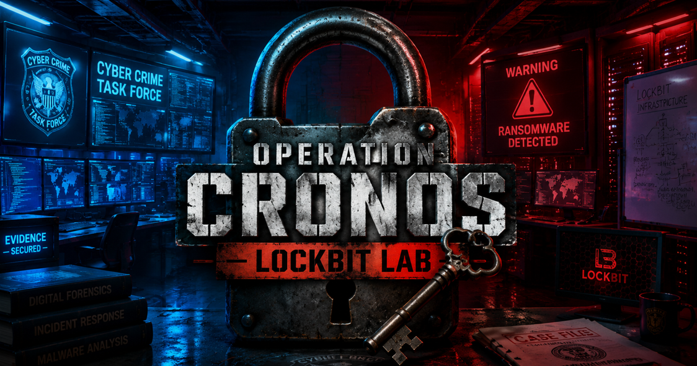

# Operation Cronos - Lockbit Lab

<p align="center">
  
</p>

# Table of Contents
- [Context](#context)
- [Scenario](#scenario)
- [Attribution and Origins](#attribution-and-origins)
- [From RaaS Business to Market Leader](#from-raas-business-to-market-leader)
- [Peak Power and High Profile Victims](#peak-power-and-high-profile-victims)
- [Operation Cronos Build Up and Public Strike](#operation-cronos-build-up-and-public-strike)
- [What Cronos Actually Damaged](#what-cronos-actually-damaged)
- [LockBitSupp Counterattack and Unmasking](#lockbitsupp-counterattack-and-unmasking)
- [Post Cronos Reality Propaganda Pressure and Survival](#post-cronos-reality-propaganda-pressure-and-survival)
- [Artifacts](#artifacts)
- [Lab Insights](#lab-insights)

# Context

Lab link: [https://cyberdefenders.org/blueteam-ctf-challenges/operation-cronos-lockbit/](https://cyberdefenders.org/blueteam-ctf-challenges/operation-cronos-lockbit/)

Suggested tools: Google Search, Threat Intelligence Reports, OSINT

Tactics: Impact

# Scenario

You are a cybercrime investigator, and this is your starting point. Your task is not to analyze the malware — it is to follow the intelligence. From one hash, you will identify a ransomware operation that extorted over half a billion dollars from victims across every continent, trace the two-year international investigation that dismantled it from the inside, and track what happened to the group — and the ecosystem around it — in the months and years that followed.

# Attribution and Origins

**Q1**- Investigators recovered a ransom-related file hash from the compromised environment. Submitting the hash to VirusTotal returns a positive match to a known ransomware family. Which ransomware family are these artifacts associated with?

Answer: LockBit

Reason: A SHA-256 hash recovered from the compromised environment, `9feed0c7fa8c1d32390e1c168051267df61f11b048ec62aa5b8e66f60e8083af`, was submitted to VirusTotal, where 52 of 55 security vendors flagged the file as malicious. VirusTotal's popular threat label identifies the sample as `ransomware.lockbit/encoder`, and the platform's family labels list both `lockbit` and `encoder`. Threat categories assigned to the file include `ransomware` and `trojan`. Given the high vendor consensus and consistent family labeling, the ransomware encoder is confirmed to belong to the LockBit family.


**Q2**- Before the ransomware adopted the brand name identified in Q1, it appeared on Russian-language cybercrime forums under a different name. What earlier name did this ransomware use, and in what year was it first publicly observed on those forums?

Answer: ABCD, 2019

Reason: Before adopting the LockBit brand, the ransomware was initially observed in 2019, when its earliest version used the `.ABCD` file extension to rename encrypted files. The ransomware did not begin using the `LockBit` extension and branding until January 2020, when a variant bearing that name first appeared on Russian-language cybercrime forums.

```bash
Source: Akamai glossary - "What is LockBit Ransomware"
URL: https://www.akamai.com/glossary/what-is-lockbit-ransomware
```

**Q3**- The ransomware’s transformation from a standalone malware family into a scalable criminal business began when it formalized its affiliate model, recruiting other cybercriminals to deploy its tools in exchange for a cut of ransom payments. When did LockBit formally launch its Ransomware-as-a-Service operations?

Answer: 2020

Reason: LockBit's transformation into a Ransomware-as-a-Service (RaaS) operation began in January 2020, when the threat actor group tracked by Symantec as `Syrphid` shifted from a standalone malware family to an affiliate-based business model, recruiting outside operators to deploy the ransomware in exchange for a percentage of ransom payments. Symantec further attributes `Syrphid` as the group behind LockBit, with the group active since 2019 and the U.S. Federal Bureau of Investigation (FBI) estimating it has extorted up to $500 million from victims since then.

```bash
Active since: 2019
Source: Symantec/Security.com - "Ransomware 2025: A Resilient and Persistent Threat" white paper, p.4
URL: https://www.security.com/sites/default/files/2025-02/2025_02_Ransomware_2025.pdf
```

# From RaaS Business to Market Leader

**Q4**-SOCRadar’s LockBit 3.0 profile describes the financial impact of a 2021 LockBit attack against Atento, a customer relationship management company. The report notes that the incident caused both revenue loss and mitigation expenses, showing that the cost of ransomware can extend beyond the ransom itself. According to SOCRadar’s LockBit 3.0 profile, how many million dollars in total financial loss did Atento report from the 2021 LockBit attack?

Answer: 42.1

Reason: SOCRadar's LockBit 3.0 dark web profile cites Atento, a customer relationship management (CRM) company, reporting a total financial loss of `$42.1 million` from a LockBit attack in its financial performance report published in 2021. The reported loss comprised `$34.8 million` in revenue loss and `$7.3 million` in mitigation expenses, illustrating how ransomware costs extend well beyond the ransom demand itself.

```bash
Total reported loss: $42.1 million
Breakdown: $34.8M revenue loss + $7.3M mitigation expenses
Report published: 2021
Source: SOCRadar - "Dark Web Profile: LockBit 3.0 Ransomware"
URL: https://socradar.io/blog/dark-web-profile-lockbit-3-0-ransomware/
```

**Q5**- LockBit’s core extortion model was double extortion: encrypt the victim’s systems and steal data, then threaten to publish it unless the ransom was paid. In some cases, operators added a third pressure tactic, making the model triple extortion. What third pressure tactic did LockBit add to double extortion?

Answer: DDoS

Reason: Beyond 1: encrypting systems and 2: threatening to leak stolen data, LockBit announced plans to escalate to triple extortion by adding distributed denial-of-service (DDoS) attacks against victims as a third layer of pressure to coerce ransom payment. The announcement followed a retaliatory DDoS attack against LockBit's own data leak site, which temporarily disrupted the gang's ability to publish data stolen from `Entrust`. In response, the LockBit operator known as `LockBitSupp` stated an intent to combine encryption, data leaks, and DDoS attacks going forward.

```bash
Context: Announced after LockBit's own leak site was hit by a DDoS attack tied to the Entrust breach (2022)
Source: Financial Post - "LockBit ransomware gang adding DDoS attacks to its threats"
URL: https://financialpost.com/technology/lockbit-ransomware-gang-adding-ddos-attacks-to-its-threats
```

**Q6**- LockBit’s administrators treated the group’s brand as something worth promoting. In 2022, LockBitSupp — the online identity used by the person who built, ran, and spoke for LockBit — ran a publicity campaign offering money to anyone willing to get the LockBit logo permanently tattooed on their body. How many dollars did LockBitSupp offer for getting a LockBit logo tattoo?

Answer: 1000

Reason: As part of LockBit's brand-building publicity efforts, the `LockBit` forum persona, distinct from the `LockBitSupp` handle, ran a stunt on the XSS forum offering `$1,000` to anyone who got a permanent LockBit logo tattoo. Public reporting indicates LockBit spent approximately `$20,000` paying people who completed the tattoos, though some forum members later complained of being scammed after getting tattoos without receiving payment.

```bash
Tattoo payment offer: $1,000 per person
Total reported payout: $20,000
Persona responsible: "LockBit" (distinct from "LockBitSupp")
Source: Trend Micro - "LockBit Attempts to Stay Afloat With a New Version"
URL: https://www.trendmicro.com/es_es/research/24/b/lockbit-attempts-to-stay-afloat-with-a-new-version.html
```

**Q7**- By the time LockBit matured, it was no longer an emerging threat but one of the most widely deployed ransomware families in the world. In what year did LockBit become the most deployed ransomware variant globally?

Answer: 2022

Reason: By 2022, LockBit had grown from its 2019 `ABCD` origins into the most deployed ransomware variant across the world, marking its peak as the dominant force in the global ransomware landscape ahead of the law enforcement takedown carried out under `Operation Cronos`.

```bash
Year as #1 global ransomware variant: 2022
Source: Europol - "Law Enforcement Disrupt World's Biggest Ransomware Operation"
URL: https://www.europol.europa.eu/media-press/newsroom/news/law-enforcement-disrupt-worlds-biggest-ransomware-operation
```

**Q8**- In its Ransomware Trends and Statistics 2023 Report, Cyberint described LockBit as the most active ransomware group of 2023, continuing the dominance it gained after Conti shut down. The report measured LockBit’s activity by both victim count and share of monitored ransomware attacks. How many victims did Cyberint attribute to LockBit in 2023, and what percentage of total monitored ransomware attacks did that represent?

Answer: 1047, 24

Reason: Cyberint's Ransomware Trends and Statistics 2023 Report attributed approximately `1,047` victims to LockBit in 2023, accounting for over `24%` of all ransomware attacks monitored that year, confirming LockBit's continued dominance as the most active ransomware group following Conti's shutdown.

```bash
2023 victims attributed to LockBit: 1,047
Share of monitored ransomware attacks: 24%+
Context: LockBit claimed the title of most active ransomware group in 2022 following Conti's shutdown, and maintained that position through 2023
Source: Cyberint - "Ransomware Trends and Statistics 2023 Report"
URL: https://cyberint.com/blog/research/ransomware-trends-and-statistics-2023-report/
```

# Peak Power and High Profile Victims

**Q9**- In January 2023, LockBit hit a major UK national institution in an attack that caused immediate and visible disruption to the public. Which UK institution was hit, resulting in severe disruption to international deliveries?

Answer: Royal Mail

Reason: On January 10, 2023, LockBit struck Royal Mail, the UK's national postal service, causing severe disruption to international deliveries and demonstrating the real-world public impact of the group's attacks beyond corporate victims. The attack disabled systems used to process customs documentation for outbound mail, forcing Royal Mail to halt nearly all international shipping and ask customers not to send overseas parcels or letters. A LockBit affiliate caused printers at one of Royal Mail's distribution sites to print ransom notes. Full restoration of international services took approximately six weeks.

```bash
Victim: Royal Mail (UK)
Date: January 10, 2023
Impact: Severe disruption to international deliveries, lasting approximately six weeks
Source: BBC News
URL: https://www.bbc.com/news/technology-68344987
```

**Q10**- In June 2023, LockBit claimed to have breached TSMC, the world’s largest semiconductor manufacturer. The claim was later clarified as a supplier breach rather than a direct compromise of TSMC itself, but LockBit still used TSMC’s name to issue one of its largest public ransom demands. How many million dollars did LockBit demand in this incident?

Answer: 70

Reason: In June 2023, LockBit's `National Hazard Agency` sub-group claimed a breach of Taiwan Semiconductor Manufacturing Company (TSMC), the world's largest semiconductor manufacturer, by posting the company's name on LockBit's dark web leak site, and demanded a `$70 million` ransom, one of the largest publicly reported ransomware demands recorded that year. TSMC quickly clarified that the actual compromise was limited to one of its contractors and did not affect TSMC's own business operations or customer data.

```bash
Victim claimed: TSMC (actual: a TSMC contractor)
Claiming sub-group: National Hazard Agency (LockBit affiliate)
Ransom demand: $70 million
Date: June 2023
Source: Infosecurity Europe - "Top 10: Highest Ransomware Payment Demands"
URL: https://www.infosecurityeurope.com/en-gb/blog/threat-vectors/biggest-ransomware-demands.html
```

**Q11**- In November 2023, LockBit hit the US broker-dealer of a major international bank. The attack disrupted systems and affected settlement of more than $9 billion worth of Treasury-backed securities. Which bank’s US broker-dealer was attacked?

Answer: Industrial and Commercial Bank of China

Reason: On November 8, 2023, LockBit attacked ICBC Financial Services, the U.S. broker-dealer arm of the Industrial and Commercial Bank of China (ICBC), disrupting trade settlement in the U.S. Treasury market. The attack temporarily left ICBC Financial Services owing `$9 billion` to Bank of New York Mellon (BNY Mellon), its Treasury repo clearing counterparty, an amount substantially exceeding the subsidiary's net capital. The disruption also contributed to a market-wide spike in Treasury settlement fails, which rose to `$62.2 billion` that day, one of the most significant financial-sector incidents attributed to the group.

```bash
Victim: ICBC Financial Services (U.S. broker-dealer arm of ICBC)
Date: November 8, 2023
Impact: $9B temporary debt to BNY Mellon; market-wide Treasury settlement fails rose to $62.2B
Source: Reuters (reporting corroborated by CNBC, Resecurity, Finadium)
URL: https://www.reuters.com/world/china/chinas-largest-bank-icbc-hit-by-ransomware-software-ft-2023-11-09/
```

**Q12**- Also in November 2023, LockBit published stolen internal data from one of the world’s largest aerospace companies after ransom negotiations broke down. Which aerospace company did LockBit leak data from?

Answer: Boeing

Reason: On November 10, 2023, after ransom negotiations broke down, LockBit published roughly `43GB` of stolen internal data from Boeing, one of the world's largest aerospace companies, marking another high-profile victim in LockBit's campaign against major global enterprises. LockBit first claimed the breach on its leak site on October 27, giving Boeing a November 2 deadline to begin negotiations and releasing a 4GB sample of the data to pressure the company before publishing the full dataset when Boeing remained silent. Most of the published data consisted of configuration backups for IT management software and logs for monitoring and auditing tools. Boeing stated the incident did not impact flight safety but did not disclose further details about how its network was breached.

```bash
Victim: Boeing
Initial claim posted: October 27, 2023
Full data leak date: November 10, 2023
Leaked data volume: ~43GB
Source: Cyber Security Hub (CSHub) - "LockBit hackers publish 43GB of stolen Boeing data following cyber attack"
URL: https://www.cshub.com/attacks/news/lockbit-hackers-publish-43gb-of-stolen-boeing-data-following-cyber-attack
```

# Operation Cronos Build Up and Public Strike

**Q13**- While LockBit was posting victims to its leak site and collecting ransoms, the damage it was inflicting had reached a scale that demanded an unprecedented response. Thousands of victims, hundreds of millions of dollars in ransom payments, and affiliates operating across every continent. No single agency had the reach, the jurisdiction, or the resources to take this ransom group on alone. The only answer was a coordinated international task force built across a dozen countries. That task force became Operation Cronos. When was the Eurojust case for Operation Cronos officially opened?

Answer: 2022-04

Reason: Given the global scale of LockBit's operations, thousands of victims, hundreds of millions of dollars in ransom payments, and affiliates spread across multiple continents, the response required coordination well beyond what any single national agency could mount alone. This need led to Operation Cronos, a coordinated international task force. The Eurojust case underpinning Operation Cronos was officially opened in April 2022, at the request of French authorities, with Eurojust hosting five coordination meetings to facilitate judicial cooperation ahead of the joint action.

```bash
Eurojust case opened: April 2022
Requesting authority: France
Source: Europol - "Law Enforcement Disrupt World's Biggest Ransomware Operation"
URL: https://www.europol.europa.eu/media-press/newsroom/news/law-enforcement-disrupt-worlds-biggest-ransomware-operation
```

**Q14**- Operation Cronos required sustained coordination across law-enforcement agencies, prosecution authorities, and technical teams from multiple countries. How many countries participated as core taskforce members?

Answer: 10

Reason: Operation Cronos was supported by 10 core taskforce countries — France, Germany, the Netherlands, Sweden, Australia, Canada, Japan, the United Kingdom, the United States, and Switzerland — each contributing law enforcement, prosecutorial, or technical resources to the coordinated takedown.

```powershell
Source: Europol - "Law Enforcement Disrupt World's Biggest Ransomware Operation"
URL: https://www.europol.europa.eu/media-press/newsroom/news/law-enforcement-disrupt-worlds-biggest-ransomware-operation
```

**Q15**- Multiple agencies across the world contributed to the operation, but one national agency led the overall effort. Which UK agency led Operation Cronos?

Answer: National Crime Agency

Reason: The UK's National Crime Agency (NCA) led the overall effort behind Operation Cronos, coordinating the multinational law enforcement campaign against LockBit's infrastructure and affiliates.

```powershell
Source: Europol - "Law Enforcement Disrupt World's Biggest Ransomware Operation"
URL: https://www.europol.europa.eu/media-press/newsroom/news/law-enforcement-disrupt-worlds-biggest-ransomware-operation
```

**Q16**- After a long covert investigation, Operation Cronos moved into its public phase. On that day, LockBit's dark web sites began showing signs of disruption — first it gave connection errors, then something the criminal underground had never seen before: a law enforcement seizure banner replacing LockBit's own leak site, displaying the flags and badges of every agency that had taken part in the operation. On what date did the seizure banner appear on LockBit's sites?

Answer: 2024-02-19

Reason: At 4:00 PM ET on February 19, 2024, Operation Cronos moved into its action phase: authorities disrupted and dismantled LockBit's ransomware-as-a-service (RaaS) infrastructure, seized funds, and arrested two individuals, placing a seizure notice on LockBit's dark web leak site. At 6:30 PM ET that same day, the seizure notice was replaced with a more detailed site outlining Operation Cronos's activities. This marked one of the first instances of the criminal underground witnessing a law enforcement takedown of a major RaaS operation at this scale.

```bash
Seizure banner date: 2024-02-19, 4:00 PM ET (initial seizure notice)
Follow-up update: 2024-02-19, 6:30 PM ET (detailed Operation Cronos site replaces seizure notice)
Source: Akamai - "Learning From the LockBit Takedown"
URL: https://www.akamai.com/blog/security/learning-from-the-lockbit-takedown
```

**Q17**- Europol's official post-operation disclosure revealed the full technical scope of what Operation Cronos had dismantled — not just a website takedown, but a simultaneous strike against LockBit's entire server infrastructure across multiple countries. How many total servers were seized, and across how many countries?

Answer: 34, 8

Reason: Operation Cronos seized 34 servers across 8 countries, Netherlands, Germany, Finland, France, Switzerland, Australia, the United States, and the United Kingdom, in a coordinated strike, dismantling LockBit's backend infrastructure rather than merely defacing the group's public-facing leak site.

```bash
Servers seized: 34
Countries: 8 (Netherlands, Germany, Finland, France, Switzerland, Australia, United States, United Kingdom)
Source: Akamai - "Learning From the LockBit Takedown"
https://www.akamai.com/blog/security/learning-from-the-lockbit-takedown
```

**Q18**- In addition to seizing servers, Operation Cronos included a financial-disruption component targeting cryptocurrency infrastructure used in ransom payment flows. Over how many cryptocurrency accounts were frozen as part of the operation?

Answer: 200

Reason: Beyond server seizures, Operation Cronos struck LockBit's financial infrastructure by freezing more than 200 cryptocurrency accounts, disrupting the group's ability to access and move extorted funds.

```bash
Cryptocurrency accounts frozen: 200+
Source: Akamai - "Learning From the LockBit Takedown"
URL: https://www.akamai.com/blog/security/learning-from-the-lockbit-takedown
```

**Q19**- This disruption was also paired with physical arrests of suspected LockBit-associated actors in Europe, made at the request of French judicial authorities. In which two countries were LockBit actors arrested during the operation?

Answer: Poland, Ukraine

Reason: Operation Cronos also resulted in physical arrests of suspected LockBit-associated actors in Poland and Ukraine, part of the coordinated international takedown. The arrests were carried out at the request of French judicial authorities.

```bash
Arrest locations: Poland, Ukraine
Requesting authority: French judicial authorities
Sources:
- Arrest locations: Akamai - "Learning From the LockBit Takedown" (https://www.akamai.com/blog/security/learning-from-the-lockbit-takedown)
- French judicial authority detail: OCCRP / Australian Federal Police reporting on the same operation
```

# What Cronos Actually Damaged

**Q20**- One of the most direct outcomes of Operation Cronos was the recovery of decryption keys from LockBit’s seized infrastructure, giving victims a way to recover data without paying a ransom. Over how many decryption keys did the NCA recover?

Answer: 1000

Reason: Among the most direct victim-facing outcomes of Operation Cronos, the FBI, NCA, and Europol jointly recovered approximately 1,000 potential decryption keys from LockBit's seized infrastructure, giving affected organizations a path to recover their data without paying ransom.

```bash
Decryption keys recovered: ~1,000 (described as "potential")
Recovering agencies: FBI, UK NCA Cyber Division, Europol (joint effort)
Source: Akamai - "Learning From the LockBit Takedown"
URL: https://www.akamai.com/blog/security/learning-from-the-lockbit-takedown
```

**Q21**- Trend Micro also published a detailed analysis of what investigators found inside LockBit's seized infrastructure. When investigators accessed the admin panel, they found two numbers that revealed the true scale of the operation from the inside — the number of victims recorded by LockBit itself and the number of affiliate accounts registered on the platform. What were those two numbers?

Answer: 1912, 193

Reason: Trend Micro's analysis of LockBit's seized admin panel revealed the internal scale of the operation from the inside: a listing tab showing the number `1912`, which Trend Micro assessed likely represented LockBit's total victim count at the time the screenshot was taken, and a confirmed `193` affiliate accounts (excluding the admin account), exposing figures the group had never disclosed publicly.

```bash
Victim count (inferred): ~1,912 (interpreted from a number shown in the panel's listing tab, not an explicitly labeled field)
Affiliate accounts (confirmed): 193, excluding the admin account
Source: Trend Micro - "Unveiling the Fallout: Operation Cronos' Impact on LockBit Following Landmark Disruption"
URL: https://www.trendmicro.com/en/research/24/c/operation-cronos-aftermath.html
```

**Q22**- Also in Trend Micro analysis, two Russian nationals were indicted and sanctioned by OFAC — the US Treasury's Office of Foreign Assets Control, responsible for enforcing economic and trade sanctions. One of them, Ivan Kondratyev, also known as Bassterlord, led a recognized LockBit subgroup. What was the name of that subgroup?

Answer: National Hazard Agency

Reason: Trend Micro suspects that Ivan Kondratyev (alias "Bassterlord"), indicted alongside Artur Sungatov as part of Operation Cronos, led the LockBit subgroup known as National Hazard Agency, the same subgroup earlier tied to the claimed TSMC contractor breach. Trend Micro frames this attribution as a suspected rather than confirmed link.

```bash
Bassterlord -> National Hazard Agency link: "suspected"/"believed" per Trend Micro (not confirmed)
Indictment: Confirmed (Trend Micro, corroborated by DOJ)
Source for above: Trend Micro - "Unveiling the Fallout: Operation Cronos' Impact on LockBit Following Landmark Disruption"
URL: https://www.trendmicro.com/en/research/24/c/operation-cronos-aftermath.html

Separately sourced details (not from this article):
- National Hazard Agency / TSMC contractor breach claim: Infosecurity Europe - "Top 10: Highest Ransomware Payment Demands"
- Nationalities and OFAC sanctions: would need DOJ/Treasury press release to confirm
```

**Q23**- As part of the sanctions against Artur Sungatov and Ivan Kondratyev, OFAC included cryptocurrency wallet addresses in their SDN designations to help exchanges and financial institutions block transactions linked to both individuals. How many wallet addresses were included in total?

Answer: 10

Reason: OFAC's SDN designations against LockBit affiliates Artur Sungatov and Ivan Kondratyev included `10` cryptocurrency wallet addresses total, nine attributed to Kondratyev and one to Sungatov, enabling exchanges and financial institutions to identify and block transactions tied to both sanctioned individuals.

```bash
Total wallet addresses sanctioned: 10
Kondratyev: 9 addresses (8 Bitcoin, 1 Ethereum)
Sungatov: 1 address (Bitcoin)
Source: Chainalysis - "U.S. and U.K. Disrupt Lockbit Ransomware Group and Indict Two Russian Nationals While OFAC Levies Sanctions"
URL: https://www.chainalysis.com/blog/lockbit-takedown-sanctions-february-2024/
```

# LockBitSupp Counterattack and Unmasking

**Q24**- For a couple of days after Operation Cronos, LockBit was silent. No word, no new victims, no response. But then LockBitSupp reappeared with a bold PGP-signed statement admitting the vulnerability that had allowed law enforcement in — and simultaneously announced that rebuilt infrastructure was back online. Find this statement, on what date did LockBitSupp release this statement?

Answer: 2024-02-24

Reason: After a brief silence following the takedown, LockBitSupp resurfaced on February 24, 2024, at approximately 21:00 GMT with a PGP-signed statement speculating, though not confirming, that a PHP remote code execution vulnerability (suspected to be CVE-2023-3824) was used to breach the infrastructure, while simultaneously announcing that rebuilt servers, now running an updated PHP version, were already back online.

```bash
Statement date: February 24, 2024, ~21:00 GMT
Suspected (not confirmed) CVE: CVE-2023-3824 (PHP RCE, CVSS 9.8)
Claimed cause of 4-day downtime: rewriting source code for PHP version compatibility
Source: Gridinsoft - "LockBit is Back With New Claims and Victims"
URL: https://blog.gridinsoft.com/lockbit-is-back/
```


**Q25**- In his post-disruption statement, LockBitSupp admitted that running an outdated version of PHP had allowed law enforcement to gain access to LockBit’s infrastructure. He named a specific publicly documented vulnerability that he had failed to patch. Which CVE did he claim was used to compromise LockBit’s servers?

Answer: CVE-2023-3824

Reason: LockBitSupp admitted that his own negligence in failing to update PHP on LockBit's servers, which were running the outdated, vulnerable version 8.1.2, left the infrastructure exposed. He speculated, without confirming, that CVE-2023-3824, a known PHP remote code execution vulnerability, was the entry point law enforcement used, while acknowledging he could not rule out an unknown ("0day") PHP vulnerability instead.

```bash
Admitted fact: Outdated, unpatched PHP 8.1.2 was running on LockBit's servers due to personal negligence
Speculated (not confirmed) entry point: CVE-2023-3824
Source: Gridinsoft - "LockBit is Back With New Claims and Victims"
URL: https://blog.gridinsoft.com/lockbit-is-back/
```

**Q26**- In the same statement, LockBitSupp claimed the FBI acted when it did because LockBit was about to publish stolen documents from a specific US government domain. He framed Operation Cronos not as a law-enforcement victory, but as the FBI protecting politically sensitive material. Which US government domain did LockBitSupp claim the stolen documents came from?

Answer: `fultoncountyga.gov`

Reason: LockBitSupp speculated, without confirming, that the FBI timed Operation Cronos specifically to prevent the publication of stolen Fulton County, Georgia government data, claiming the cache included documents tied to the prosecution of former President Trump that he believed could affect the upcoming US election. He framed this as the actual trigger for the takedown's timing, rather than the publicly stated law enforcement rationale.

```bash
Claim type: Speculation by LockBitSupp, not a confirmed/admitted fact
Alleged motive: Preventing the leak of Fulton County data including Trump-related prosecution documents, due to potential election impact
Complicating detail: The Fulton County leak site entry was reportedly removed on Feb 16, 2024 (before the takedown), typically indicating payment or negotiation, though Fulton County's commission chairman denied paying
Source: Nagomi Security weekly roundup, citing BleepingComputer and Krebs on Security reporting
URL: https://nagomisecurity.com/blog/this-week-in-cybersecurity-news-2-26-14-lockbit-0-edition
```

**Q27**- LockBitSupp disputed the FBI’s claims about the number of decryptors obtained and provided his own figures. Across five years of LockBit operations, approximately how many decryptors did LockBitSupp claim existed in total? Enter the number only.

Answer: 40000

Reason: LockBitSupp disputed the FBI's decryptor figures, claiming the approximately 1,000 decryptors seized represented only about 2.5% of LockBit's total decryptor population, which would imply roughly 40,000 decryptors existed across the group's operational history. He further claimed most of the seized decryptors were "protected" and unusable by law enforcement, a claim directly at odds with law enforcement's own statements that the seized keys were being distributed to help victims recover data.

```bash
LockBitSupp's claim: ~1,000 decryptors seized = ~2.5% of total (implying ~40,000 total decryptors existed)
Status: Unverified, self-reported claim by the threat actor, disputed implicitly by law enforcement's own statements
Source: Barracuda - "LockBit to FBI: 'You can't stop me'"
URL: https://blog.barracuda.com/2024/02/26/lockbit-to-fbi-cant-stop-me
```

**Q28**- Three months after the infrastructure seizure, Operation Cronos entered its second phase. In May 2024, the identity behind the alias LockBitSupp was publicly revealed. Law enforcement charged him with 26 criminal counts carrying a maximum sentence of 185 years in prison, and the US Department of State announced a $10 million reward for information leading to his arrest. Who was identified as LockBitSupp?

Answer: Dmitry Yuryevich Khoroshev

Reason: In May 2024, the second phase of Operation Cronos unmasked LockBitSupp as Dmitry Yuryevich Khoroshev, a 31-year-old Russian national from Voronezh, Russia, charged with 26 criminal counts in a New Jersey grand jury indictment. The United States, United Kingdom, and Australia jointly sanctioned Khoroshev, and the U.S. Department of State separately maintains a $10 million reward for information leading to his arrest. LockBitSupp, contacted directly by KrebsOnSecurity, denied being Khoroshev.

```bash
Identified individual: Dmitry Yuryevich Khoroshev, 31, of Voronezh, Russia
Indictment: 26 counts, New Jersey grand jury
Joint sanctioning parties: United States, United Kingdom, Australia
Reward: $10 million (U.S. Department of State)
Disputed: LockBitSupp denied the identification when contacted by Krebs
Source: Krebs on Security - "U.S. Charges Russian Man as Boss of LockBit Ransomware Group"
URL: https://krebsonsecurity.com/2024/05/u-s-charges-russian-man-as-boss-of-lockbit-ransomware-group/
```

**Q29**- Despite being unmasked, sanctioned, and indicted, LockBitSupp was not captured. Operating from an unknown location, he agreed to a direct interview with **Click Here**, denied being the person law enforcement had identified, dismissed Operation Cronos as a bluff, and made clear he had no intention of stopping. When the journalist asked if he had a message for the world, what was his response?

Answer: Join my affiliate program and get rich with me

Reason: Despite being unmasked and sanctioned, LockBitSupp gave a defiant interview to the Click Here podcast (Recorded Future News), denying his identification as Khoroshev and dismissing Operation Cronos's impact. Conducted over an encrypted messaging app and translated from Russian, the interview saw him claim that law enforcement pressure "only motivates me and makes me work harder," and that the group's goal remained "to attack 1 million companies." Asked for a message to the world, he replied simply, "Join my affiliate program and get rich with me." On the identification itself, he wrote in a Tox away-message: "The FBI is bluffing, I'm not Dmitry, I feel sorry for the real Dmitry."

```bash
Interview source: Click Here podcast / Recorded Future News
Quotes confirmed: "only motivates me and makes me work harder"; "to attack 1 million companies"; "Join my affiliate program and get rich with me"; identity denial via Tox message
Source: The Record (Recorded Future News) - "In interview, LockbitSupp says authorities outed the wrong guy"
URL: https://therecord.media/lockbitsupp-interview-ransomware-cybercrime-lockbit
```

# Post Cronos Reality Propaganda Pressure and Survival

**Q30**- One month after the interview, LockBit was back in the headlines, claiming to have breached one of the most significant financial institutions in the world and threatening to release 33 terabytes of stolen banking data containing Americans’ banking secrets if a ransom was not paid within 48 hours. What domain did LockBit list as the breached institution on its leak site in June 2024?

Answer: `federalreserve.gov`

Reason: On June 23, 2024, LockBit listed `federalreserve.gov` on its dark web leak site, claiming to have breached the US Federal Reserve and threatening to release 33 terabytes of data described as containing "Americans' banking secrets" unless a ransom was paid by a June 25 deadline. When the countdown expired, however, the data LockBit actually published was traced to a different, much smaller victim: Evolve Bank & Trust, an Arkansas-based financial services company. There is no evidence the Evolve data was obtained from the Federal Reserve itself, and multiple security researchers and outlets concluded the Federal Reserve breach claim was false, likely an exaggerated or fabricated claim made to rebuild relevance and credibility following Operation Cronos.

```bash
Claimed victim: US Federal Reserve
Actual confirmed victim: Evolve Bank & Trust (Arkansas)
Claim status: Debunked/unverified - no evidence Fed was breached
Claimed data volume: 33 TB
Date claim posted: June 23, 2024
Deadline given: June 25, 2024
Sources: SecurityWeek, TechTarget, Malwarebytes, BankInfoSecurity, BleepingComputer, American Banker, Security Affairs, Cybernews (independently corroborating)
```

**Q31**- Within the 48-hour deadline, a representative of the alleged victim made contact with LockBit to negotiate. LockBit publicly mocked the negotiation on its leak site, suggesting the offer was insultingly low and demanding that the institution replace the negotiator. According to LockBit’s leak-site post, how many dollars had reportedly been offered?

Answer: 50000

Reason: During the 48-hour window of its claimed (and later discredited) Federal Reserve breach, LockBit publicly posted on its leak site that an alleged negotiator had offered just $50,000 to settle, an amount LockBit mocked as insultingly low, and demanded the institution replace its negotiator. No independent confirmation exists that any actual negotiation took place; given that the underlying breach claim was itself fabricated, with the real victim later identified as Evolve Bank & Trust, this negotiation claim should be treated as part of LockBit's unverified self-promotional narrative rather than a confirmed exchange.

```bash
Claimed quote: "You better hire another negotiator within 48 hours, and fire this clinical idiot who values Americans' bank secrecy at $50,000."
Status: Unverified claim from LockBit's own leak site post; no independent confirmation any negotiation occurred
Context: Posted during the same window as the debunked Federal Reserve breach claim (actual victim: Evolve Bank & Trust)
Source: PYMNTS - "FinTech Banking Partner Evolve Bancorp Hit by Major Ransomware Attack" (quote originally relayed via Cyber Daily)
URL: https://www.pymnts.com/cybersecurity/2024/fintech-banking-partner-evolve-bancorp-hit-by-major-ransomware-attack/
```

**Q32**- After the deadline passed, the story shifted. LockBit had made a dramatic claim about the source of the stolen data, but reporting on the released files told a different story. The data appeared to belong to a different financial institution, making the incident look less like a confirmed breach of a major government body and more like a weakened LockBit trying to generate attention after Operation Cronos. Which financial institution did the released data actually appear to belong to?

Answer: Evolve Bank & Trust

Reason: Once the leaked files were examined, the data attributed to the Federal Reserve actually appeared to belong to Evolve Bank & Trust, exposing LockBit's claim as an attention-grabbing exaggeration rather than a confirmed breach of a major government institution, a sign of the group's diminished credibility post-Cronos.

```bash
Confirmed actual data source: Evolve Bank & Trust
Claimed (unconfirmed) source: US Federal Reserve
Assessment: Exaggerated/false claim, widely characterized by security researchers as a credibility-rebuilding attempt post-Operation Cronos
Sources: SecurityWeek, TechTarget, Malwarebytes, BankInfoSecurity, American Banker, Security Affairs, BleepingComputer, Cybernews (independently corroborating)
```

**Q33**- The pressure on Lockbit did not stop. On October 1, 2024, Operation Cronos entered its third phase, revealing that a senior member of another major sanctioned Russian cybercrime organization had been operating as a LockBit affiliate. Which Evil Corp member was identified as a LockBit affiliate?

Answer: Aleksandr Ryzhenkov

Reason: On October 1, 2024, in a further Operation Cronos disclosure, the UK's National Crime Agency unmasked the LockBit affiliate known as "Beverley" as Aleksandr Ryzhenkov, a Russian national described by authorities as Evil Corp leader Maksim Yakubets' "right-hand man" and "second in command" at Evil Corp, revealing direct operational overlap between two major sanctioned Russian cybercrime groups. Ryzhenkov became a LockBit affiliate in 2022 and is believed to have targeted at least 60 victims. The UK, US, and Australia jointly sanctioned him, and US prosecutors separately indicted him. The announcement coincided with additional arrests in the UK, France, and Spain, and the seizure of nine servers tied to LockBit infrastructure.

```bash
Unmasked individual: Aleksandr Ryzhenkov ("Beverley")
Role: Evil Corp's "second in command" / Maksim Yakubets' "right-hand man"
LockBit affiliate since: 2022
Victims targeted (as LockBit affiliate): at least 60
Sanctioning parties: UK, US, Australia
Source: TechCrunch - "UK unmasks LockBit ransomware affiliate as high-ranking hacker in Russia state-backed cybercrime gang"
URL: https://techcrunch.com/2024/10/01/uk-unmasks-lockbit-ransomware-affiliate-evil-corp-cybercrime-gang/
```

**Q34**- A year after Operation Cronos, in May 2025, LockBit found itself on the receiving end of another breach. Its dark web infrastructure was compromised, its MySQL database was dumped, and its admin and affiliate panels were defaced with a taunting message. What message was left on LockBit’s compromised panels?

Answer: Don't do crime CRIME IS BAD xoxo from Prague

Reason: In May 2025, LockBit's remaining infrastructure was breached by unknown attackers who defaced its internal dashboards with the taunting message: "Don't do crime, CRIME IS BAD xoxo from Prague." The attackers leaked a database containing Bitcoin addresses, negotiation transcripts, and affiliate credentials, a final ironic twist in which the group that had built its identity on breaching others found itself breached in turn.

```bash
Date: May 2025
Defacement message: "Don't do crime, CRIME IS BAD xoxo from Prague."
Leaked data: Bitcoin addresses, negotiation transcripts, stolen affiliate credentials
Attribution: Unknown attackers
Source: OpenText Cybersecurity - "Hack the hacker: How LockBit's ransomware empire crumbled" (single source, not yet independently cross-verified in this thread)
URL: https://cybersecurity.opentext.com/blog/hack-the-hacker-how-lockbits-ransomware-empire-crumbled/
```

**Q35**- After the infrastructure seizure, indictments, unmasking, Federal Reserve embarrassment, and May 2025 database breach, LockBit was still trying to rebuild. In 2025, a new variant emerged: LockBit 5.0. The variant introduced cross-platform encryption capabilities targeting both Windows and Linux systems, including VMware ESXi servers. What was the codename used for LockBit 5.0?

Answer: `ChuongDong`

Reason: LockBit 5.0, tracked under the name "ChuongDong," is the 2025 variant introducing cross-platform encryption capability across Windows, Linux, and VMware ESXi systems. Announced on underground forums in September 2025, it represents the group's continued attempt to modernize its toolkit despite the cumulative damage from Operation Cronos. Roughly 80% of observed attacks using the variant have targeted Windows systems, with Linux and ESXi comprising the remainder.

```bash
Variant: LockBit 5.0 ("ChuongDong")
Announced: September 2025, on underground forums
Platforms targeted: Windows, Linux, VMware ESXi
Windows share of observed attacks: ~80%
Note: "ChuongDong" naming attribution not specified in this source; worth cross-checking against another vendor before treating as a widely-adopted designation
Source: eSentry - "LockBit 5.0 Has A New Trick"
URL: https://www.esentry.io/articles/lockbit-5-0-has-a-new-trick
```

# Artifacts

**Threat Identification**

| Type | Value |
| --- | --- |
| File hash (`SHA-256`) | `[REDACTED]` |
| Ransomware family | LockBit |
| Original/early name | `ABCD` |
| First observed | 2019 |
| Ransomware-as-a-Service (RaaS) launch | January 2020 |

**Sanctioned/Indicted Individuals**

| Type | Value |
| --- | --- |
| LockBitSupp identity | Dmitry Yuryevich Khoroshev |
| Criminal counts | 26 |
| Max sentence | 185 years |
| US Department of State (DoS) reward for arrest | $10,000,000 |
| Affiliate (National Hazard Agency lead) | Ivan Kondratyev (alias `Bassterlord`) |
| Co-sanctioned affiliate | Artur Sungatov |
| Evil Corp/LockBit affiliate overlap | Aleksandr Ryzhenkov |
| Exploited Common Vulnerabilities and Exposures (CVE) (admin's own claim) | `CVE-2023-3824` |

**Cryptocurrency Indicators**

| Type | Value |
| --- | --- |
| Office of Foreign Assets Control (OFAC) sanctioned wallet addresses (total) | 10 |
| Wallets attributed to Kondratyev | 9 |
| Wallets attributed to Sungatov | 1 |
| Crypto accounts frozen (Operation Cronos) | 200+ |

**Victims**

| Type | Value |
| --- | --- |
| Atento financial loss (2021) | $42.1 million |
| Royal Mail (January 2023) | UK postal disruption |
| Taiwan Semiconductor Manufacturing Company (TSMC) ransom demand (June 2023, contractor breach) | $70 million |
| Industrial and Commercial Bank of China (ICBC) US broker-dealer (November 2023) | $9B+ Treasury settlement disruption |
| Boeing leaked data (November 2023) | ~`43GB` |
| Federal Reserve claim (June 2024) | actual data belonged to Evolve Bank & Trust |
| Stolen data volume claimed (Federal Reserve incident) | 33 TB |
| Reported negotiation offer (mocked by LockBit) | $50,000 |

**Operation Cronos Infrastructure Actions**

| Type | Value |
| --- | --- |
| Eurojust case opened | April 2022 |
| Lead agency | National Crime Agency (NCA) |
| Core taskforce countries | 10 |
| Seizure banner date | `2024-02-19` |
| Servers seized | 34 |
| Countries (server seizure) | 8 |
| Arrests | Poland, Ukraine |
| Decryption keys recovered | 1,000+ |
| Victims recorded internally (admin panel) | 1,912 |
| Affiliate accounts registered (admin panel) | 193 |
| LockBitSupp counter-claim (decryptors) | ~40,000 |

**Activity/Statistics**

| Type | Value |
| --- | --- |
| Global #1 ransomware variant year | 2022 |
| 2023 victims (Cyberint) | 1,047 |
| 2023 share of monitored attacks | 24%+ |
| Tattoo publicity stunt offer | $1,000/person |
| Total tattoo payout | ~$20,000 |
| Triple extortion tactic | Distributed Denial-of-Service (DDoS) |

**Post-Cronos Events**

| Type | Value |
| --- | --- |
| LockBitSupp PGP statement date | `2024-02-24` |
| Claimed FBI motive (government domain) | `fultoncountyga[.]gov` |
| Click Here interview quote | "Join my affiliate program and get rich with me" |
| Self-breach defacement (May 2025) | "Don't do crime, CRIME IS BAD xoxo from Prague" |
| LockBit 5.0 codename | `ChuongDong` |
| LockBit 5.0 capability | Cross-platform encryption (Windows/Linux/ESXi) |

# Lab Insights

- Disruption doesn't require a single point of failure to break — it requires dozens. Operation Cronos succeeded not through one decisive strike but through the simultaneous combination of server seizures, crypto account freezes, arrests, decryptor recovery, and public unmasking. RaaS groups built distributed, redundant infrastructure precisely to survive partial takedowns, so law enforcement had to match that distribution with an equally multi-pronged, multi-country response rather than a single warrant or arrest.
- The criminal's own operational security failure became the investigation's entry point. LockBitSupp's admission that an unpatched PHP CVE let investigators in mirrors a recurring theme in ransomware takedowns: the same opportunism and cost-cutting that lets affiliates scale fast also leaves the infrastructure itself vulnerable. A RaaS business model optimized for rapid affiliate onboarding and ransom throughput rarely treats its own backend with the security rigor it demands of its extortion targets.
- Public image management is a liability once law enforcement controls the narrative. LockBit invested heavily in brand recognition — tattoo bounties, a chatty spokesperson persona, victim leak-site theatrics — to project menace and credibility to affiliates and victims alike. That same visibility became a vulnerability after Cronos: every defiant interview, inflated claim, and walked-back victim (Federal Reserve → Evolve Bank) gave researchers and journalists material to publicly erode the group's credibility in near real time.
- Takedowns degrade rather than eliminate persistent threat actors. Despite seizure, indictment, sanctions, and a $10M bounty, LockBitSupp continued operating, rebuilt infrastructure within days, and the group later shipped LockBit 5.0. The lesson echoed across ransomware enforcement actions generally: legal and technical disruption raises cost and shrinks credibility, but full elimination typically requires the threat actor's actual arrest, not just infrastructure seizure — and absent that, "dismantled" should be read as "degraded."
- Attribution work increasingly crosses ransomware-group boundaries. The discovery that an Evil Corp senior member was operating as a LockBit affiliate shows that the cybercrime ecosystem is better modeled as overlapping networks of individuals moving between brands than as fixed, siloed organizations — a pattern investigators should expect and actively hunt for in future RaaS takedowns.