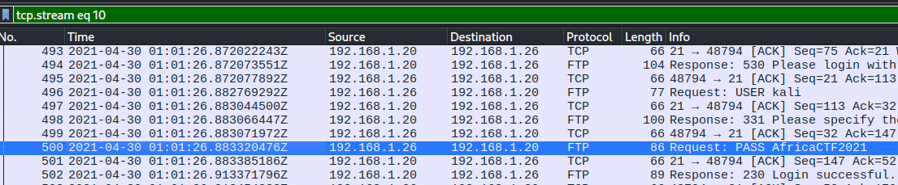

# PacketMaze Lab

# Context

Lab link: [https://cyberdefenders.org/blueteam-ctf-challenges/packetmaze/](https://cyberdefenders.org/blueteam-ctf-challenges/packetmaze/)

Suggested tools: Brim, Suricata runner, Suricata Rules, Network Miner, Wireshark, MAC lookup

Tactics: Initial Access

# Scenario

A company's internal server has been flagged for unusual network activity, with multiple outbound connections to an unknown external IP. Initial analysis suggests possible data exfiltration. Investigate the provided network logs to determine the source and method of compromise.

# Questions

Q1- What is the FTP password?

Answer: `AfricaCTF2021`

Reason: The FTP password used to authenticate to the internal server was recovered by inspecting plaintext FTP control-channel traffic in the packet capture. FTP transmits credentials in cleartext, so filtering on the FTP protocol in Wireshark exposes the `USER` and `PASS` commands exchanged between the client at `192.168.1.26` and the FTP server at `192.168.1.20`. The PASS command sent at `2021-04-30 01:01:26.883320476Z` reveals the password `AfricaCTF2021`, confirming successful authentication to the FTP service.



Q2- What is the IPv6 address of the DNS server used by `192.168.1.26`?

Answer: `fe80::c80b:adff:feaa:1db7`

Reason: The DNS server queried by `192.168.1.26` (Intel MAC `c8:09:a8:57:47:93`) over IPv6 was identified by pivoting from the known source MAC address after establishing IPv4 DNS activity between `192.168.1.26` and `192.168.1.10`. Filtering on `dns && eth.addr == c8:09:a8:57:47:93` surfaces a link-local IPv6 DNS query at `2021-04-30 01:01:16.463814590Z`, sent from `fe80::b011:ed39:8665:3b0a` to the DNS server address `fe80::c80b:adff:feaa:1db7`, confirming the host also resolves names over IPv6 to a server on the same segment as its IPv4 counterpart.

```bash
dns && eth.addr == c8:09:a8:57:47:93
```


Q3- What domain is the user looking up in packet `15174`?

Answer: `www.7-zip.org`

Reason: The domain queried in packet `15174` was identified with a direct `tshark` frame filter isolating that packet number and extracting the DNS query name field. The output shows `192.168.1.26` resolving `http://www.7-zip.org\`, indicating the user retrieved or intended to retrieve the 7-Zip archive utility, an artifact worth tracking forward in the timeline given its common use for staging or compressing files ahead of exfiltration.

```bash
$ tshark -r NetworkCapture-2021-04-29.pcapng -Y 'frame.number == 15174' -T fields -e dns.qry.name
www.7-zip.org
```

Q4- How many UDP packets were sent from `192.168.1.26` to `24.39.217.246`? Please enter a numeric answer.

Answer: 10

Reason: The number of UDP packets sent from `192.168.1.26` to `24.39.217.246` was determined using Wireshark's Statistics → Conversations view, filtered to the UDP tab. Two separate conversation streams exist between the two hosts, stream ID `51` with `1` packet from A to B and stream ID `49` with `9` packets from A to B, totaling `10` UDP packets sent in the A→B direction from `192.168.1.26` to `24.39.217.246`.


Q5- What is the MAC address of the system under investigation in the PCAP file?

Answer: `c8:09:a8:57:47:93`

Reason: The MAC address of the system under investigation, `192.168.1.26`, was extracted with a `tshark` filter isolating traffic to or from that IP and pulling the source Ethernet address field, taking the first result. This confirms `c8:09:a8:57:47:93` (Intel-registered NIC) as the physical interface identifier for the host of interest, consistent with the MAC address already observed in the earlier DNS conversation filtering for Q2.

```bash
$ tshark -r NetworkCapture-2021-04-29.pcapng -Y 'ip.addr == 192.168.1.26' -T fields -e eth.src | head -n 1
c8:09:a8:57:47:93
```

Q6- What was the camera model name used to take picture `20210429_152157.jpg`?

Answer: LM-Q725K

Reason: The camera model used to take `20210429_152157.jpg` was determined by first carving all FTP-transferred file objects out of the capture using tshark's export-objects feature for the `ftp-data` protocol, then inspecting the recovered image's EXIF metadata with `exiftool`. The metadata field `Camera Model Name` returns `LM-Q725K`, an LG smartphone model, indicating the photo was captured on a mobile device and subsequently exfiltrated or transferred via the FTP session observed earlier in this capture.

```bash
$ tshark -r NetworkCapture-2021-04-29.pcapng --export-objects ftp-data,exports
$ exiftool 20210429_152* | grep -i model
Camera Model Name               : LM-Q725K
```

Q7- What is the ephemeral public key provided by the server during the TLS handshake in the session with the session ID: `da4a0000342e4b73459d7360b4bea971cc303ac18d29b99067e46d16cc07f4ff`?

Answer: `04edcc123af7b13e90ce101a31c2f996f471a7c8f48a1b81d765085f548059a550f3f4f62ca1f0e8f74d727053074a37bceb2cbdc7ce2a8994dcd76dd6834eefc5438c3b6da929321f3a1366bd14c877cc83e5d0731b7f80a6b80916efd4a23a4d`

Reason: The server's ephemeral public key for the TLS session identified by session ID `da4a0000342e4b73459d7360b4bea971cc303ac18d29b99067e46d16cc07f4ff` was extracted with a `tshark` filter matching that exact session ID and pulling the `tls.handshake.server_point` field, which holds the server's ECDHE public key point sent during the Server Key Exchange portion of the handshake. This value represents the uncompressed elliptic-curve point (leading `04` byte) used to derive the session's shared secret under (EC)DHE key exchange.

```bash
$ tshark -r NetworkCapture-2021-04-29.pcapng -Y 'tls.handshake.session_id == da4a0000342e4b73459d7360b4bea971cc303ac18d29b99067e46d16cc07f4ff' -T fields -e tls.handshake.server_point
04edcc123af7b13e90ce101a31c2f996f471a7c8f48a1b81d765085f548059a550f3f4f62ca1f0e8f74d727053074a37bceb2cbdc7ce2a8994dcd76dd6834eefc5438c3b6da929321f3a1366bd14c877cc83e5d0731b7f80a6b80916efd4a23a4d
```

Q8- What is the first `TLS 1.3` client random that was used to establish a connection with `protonmail.com`?

Answer: `24e92513b97a0348f733d16996929a79be21b0b1400cd7e2862a732ce7775b70`

Reason: The first TLS 1.3 client random used to establish a connection with `protonmail.com` was recovered by isolating the relevant handshake frame and applying the `-O tls` filter to display only the expanded TLS protocol tree, then grepping for the `Random` field within the Client Hello. This returns `24e92513b97a0348f733d16996929a79be21b0b1400cd7e2862a732ce7775b70`, the 32-byte client-generated random value that, along with the server random, feeds into the TLS 1.3 key schedule used to derive the session's traffic keys.

```bash
$ tshark -r NetworkCapture-2021-04-29.pcapng -Y 'frame.number == 17992' -V -O tls | grep -i random
            Random: 24e92513b97a0348f733d16996929a79be21b0b1400cd7e2862a732ce7775b70
                Random Bytes: b97a0348f733d16996929a79be21b0b1400cd7e2862a732ce7775b70
```

Q9- Which country is the manufacturer of the `FTP server's MAC` address registered in?

Answer: United States

Reason: The FTP server's MAC address was resolved by extracting the source Ethernet address from the first FTP packet, then cross-referencing the resulting OUI (`08:00:27`) against the IEEE-registered vendor database via [macvendorlookup.com](http://macvendorlookup.com/). Despite the company name `PCS Systemtechnik GmbH` sounding German, the registered address associated with that OUI block is `600 Suffold St, Lowell MA 01854`, placing the registration country as `United States`. Notably, `08:00:27` is the well-known default OUI prefix assigned to VirtualBox virtual NICs, suggesting the FTP server itself is likely a virtual machine rather than physical hardware.

```bash
$ tshark -r NetworkCapture-2021-04-29.pcapng -Y 'ftp' -T fields -e eth.src | head -n 1
08:00:27:a6:1f:86
```


Q10- What time was a `non-standard folder` created on the FTP server on the 20th of April?

Answer: `17:53`

Reason: The creation time of the non-standard folder on the FTP server was found by following the TCP stream carrying the FTP directory listing response. Comparing timestamps across the returned directory entries, all standard user-profile folders (`Desktop`, `Downloads`, `Music`, `Pictures`, `Public`, `Templates`, `Videos`) share the default creation date of `Feb 23 06:37`, while a single anomalous directory named `ftp`, owned by the unprivileged `nobody` UID/GID `65534`, was created separately on `Apr 20 17:53`, standing out both by its distinct timestamp and its non-standard ownership and permission bits (`dr-xr-x---`) relative to the rest of the listing.

```bash
$ tshark -r NetworkCapture-2021-04-29.pcapng -Y 'ftp' -q -z follow,tcp,ascii,11                             

===================================================================
Follow: tcp,ascii
Filter: tcp.stream eq 11
Node 0: 192.168.1.26:34570
Node 1: 192.168.1.20:9713
        584
drwxr-xr-x    2 1000     1000         4096 Feb 23 06:37 Desktop
drwxr-xr-x    2 1000     1000         4096 Apr 29 16:42 Documents
drwxr-xr-x    2 1000     1000         4096 Feb 23 06:37 Downloads
drwxr-xr-x    2 1000     1000         4096 Feb 23 06:37 Music
drwxr-xr-x    2 1000     1000         4096 Feb 23 06:37 Pictures
drwxr-xr-x    2 1000     1000         4096 Feb 23 06:37 Public
drwxr-xr-x    2 1000     1000         4096 Feb 23 06:37 Templates
drwxr-xr-x    2 1000     1000         4096 Feb 23 06:37 Videos
dr-xr-x---    4 65534    65534        4096 Apr 20 17:53 ftp

===================================================================
```

Q11- What URL was visited by the user and connected to the IP address `104.21.89.171`?

Answer: `hxxp://dfir.science/`

Reason: The URL visited that connected to 104.21.89.171 was identified by filtering HTTP traffic to that specific IP and inspecting the verbose protocol tree for a Location header, which indicates an HTTP redirect response. The capture shows the client's request was redirected via a Location: `hxxps://dfir.science/` header, confirming the site accessed was `hxxp://dfir[.]science/`, which the server then upgraded to HTTPS.

```bash
$ tshark -r NetworkCapture-2021-04-29.pcapng -Y 'ip.addr == 104.21.89.171 && http' -V | grep -i location
    Location: https://dfir.science/
```

# Attack Tree

```bash
  [Host under investigation: 192.168.1.26 (MAC c8:09:a8:57:47:93)]
      │
      ├── [DNS Resolution Activity]
      │   └── IPv4 queries to 192.168.1.10 (01:00:53 -> 01:01:11)
      │       └── cutover to IPv6 resolver fe80::c80b:adff:feaa:1db7 at 01:01:16  ← config change, cause unconfirmed
      │           └── continued resolution: t-ring.msedge.net, connectivity-check.ubuntu[.]com, geo.prod.do.dsp.mp.microsoft[.]com
      │
      ├── [Web Browsing over TLS]
      │   ├── hxxp://dfir[.]science/ -> 104.21.89.171  ← HTTP 301 redirect to https
      │   ├── DNS lookup: www.7-zip[.]org (frame 15174)  ← possible tool staging
      │   └── TLS 1.3 session to protonmail[.]com  ← client random 24e92513b97a0348f733d16996929a79be21b0b1400cd7e2862a732ce7775b70
      │
      ├── [FTP Session -> 192.168.1.20 (MAC 08:00:27:a6:1f:86, VirtualBox VM, US-registered OUI)]
      │   └── Authentication: PASS AfricaCTF2021 (2021-04-30 01:01:26)  ← cleartext credential capture
      │       ├── Directory recon (tcp.stream 11): standard home folders + anomalous "ftp" dir
      │       │   └── "ftp" dir created Apr 20 17:53, owner nobody:nobody (65534), dr-xr-x---  ← non-standard staging/drop folder
      │       └── File transfer via ftp-data: 20210429_152157.jpg
      │           └── EXIF Camera Model Name: LM-Q725K (LG smartphone)  ← personal photo moved off/onto server
      │
      └── [Unresolved UDP Traffic -> 24.39.217.246]
          └── 10 packets (streams 49, 51) A->B  ← purpose not yet established, candidate for further pivot
```

# Artifacts

| Category | Type | Value |
| --- | --- | --- |
| Host Identity | Investigated host IP | `192.168.1.26` |
|  | Investigated host MAC | `c8:09:a8:57:47:93` |
|  | FTP server IP | `192.168.1.20` |
|  | FTP server MAC | `08:00:27:a6:1f:86` |
|  | FTP server MAC vendor | PCS Systemtechnik GmbH (VirtualBox default OUI) |
|  | FTP server MAC registered country | United States |
| Authentication | FTP password | `AfricaCTF2021` |
| Network | Internal DNS server (IPv4) | `192.168.1.10` |
|  | Internal DNS server (IPv6) | `fe80::c80b:adff:feaa:1db7` |
|  | External IP (HTTP redirect) | `104.21.89.171` |
|  | External IP (unresolved UDP) | `24.39.217.246` |
| Web Activity | Redirected URL | `hxxp://dfir[.]science/` |
|  | DNS lookup | `www[.]7-zip[.]org` |
|  | TLS 1.3 destination | `protonmail[.]com` |
|  | TLS 1.3 client random | `24e92513b97a0348f733d16996929a79be21b0b1400cd7e2862a732ce7775b70` |
|  | TLS ephemeral server public key (ECDHE) | `04edcc123af7b13e[...]b7f80a6b80916efd4a23a4d` |
| FTP Server Artifacts | Non-standard directory | `ftp` |
|  | Directory owner | `65534:65534` |
|  | Directory permissions | `dr-xr-x---` |
|  | Directory creation time | `Apr 20 17:53` |
|  | Transferred file | `20210429_152157.jpg` |
|  | Transferred file camera model | `LM-Q725K` |

# Lab Insights

- Cleartext protocols remain a live liability, not a legacy concern. The FTP credential (`AfricaCTF2021`) was recovered from a single unencrypted `PASS` command with no decryption or brute-forcing required. Despite the same host simultaneously negotiating TLS 1.3 for web traffic to services like ProtonMail, it authenticated to an internal file server in the clear — a reminder that endpoint-level protocol hygiene doesn't improve just because the OS and browser support modern crypto elsewhere.
- Directory listings double as a timeline artifact. The FTP server's default home-folder structure carried a uniform creation timestamp from provisioning, which made the single outlier — a restrictively-permissioned `ftp` folder owned by the unprivileged `nobody` account and created weeks later — trivial to spot by comparison alone. Anomaly detection in file listings often comes down to establishing what "default" looks like first, then hunting for the one row that breaks the pattern.
- Protocol metadata can re-attribute evidence across systems. Recovering a JPEG's EXIF `Camera Model Name` turned a network-layer artifact (an FTP file transfer) into a statement about a completely different piece of hardware (an LG smartphone) that never appeared directly in the capture. This is a useful pattern generally: file-carving from network traffic often yields secondary artifacts whose own metadata extends the investigation beyond what any packet header alone could show.
- A quiet DNS resolver cutover is a config-change fingerprint, not just noise. The host's clean switch from IPv4 to IPv6 DNS resolution mid-session (rather than interleaved dual-stack queries) stood out precisely because RFC 6724 address selection would normally produce a consistent preference from the start, not a hard pivot partway through. Timing anomalies like this are worth flagging even without an immediate causal artifact, since they mark a boundary worth testing against everything else on the timeline.