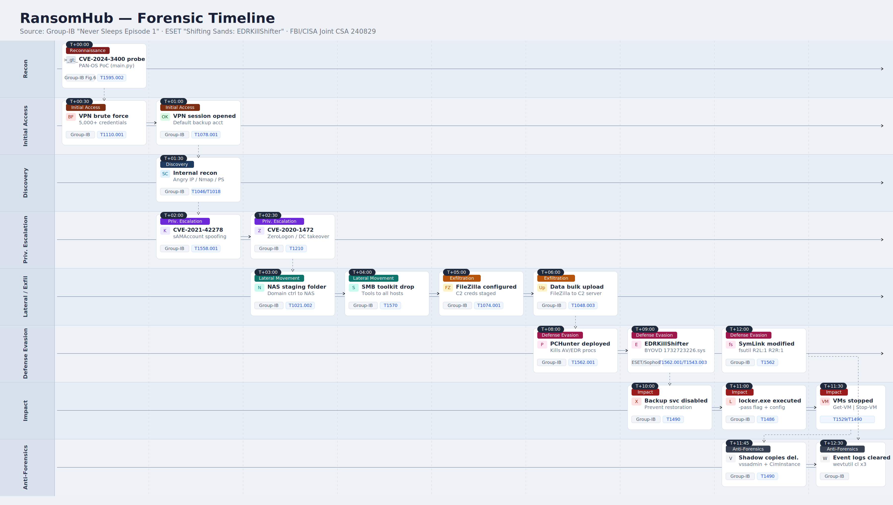

# RaaS Unfold - RansomHub Lab


# Context

Lab link: [https://cyberdefenders.org/blueteam-ctf-challenges/raas-unfold-ransomhub/](https://cyberdefenders.org/blueteam-ctf-challenges/raas-unfold-ransomhub/)

Suggested tools: VirusTotal, Google Search

Tactics: Impact

# Scenario

The incident response team was tasked by Wowza Unlimited's parent company to investigate the attack. They obtained the hash of the ransomware responsible for encrypting all files. This hash can help determine the ransomware's capabilities and identify its operator. Your job is to find all relevant information related to this ransomware—this is critical for helping leadership decide whether to pay the ransom or alert the authorities.

Malware hash: `[REDACTED]`

# Questions

**Q1**- What ransomware group is linked to this file hash according to threat intelligence sources?

Answer: Ransomhub

Reason: Searching the file hash `[REDACTED]` on VirusTotal (VT) and examining the Detection tab reveals that this sample is attributed to the RansomHub ransomware group. Multiple vendor detections cluster around the family labels `ransomhub` and `rnsmhub`, which are vendor-specific normalizations of the same family name, confirming the attribution. The presence of the `sliver` label is also notable, as Sliver is an open-source command-and-control (C2) framework that RansomHub operators are known to deploy during the pre-encryption intrusion phase (MITRE ATT&CK T1219: Remote Access Software).

- **Source**: VirusTotal > Detection tab > Family Labels
- **Labels**: `ransomhub`, `rnsmhub`, `sliver`
- **Group**: RansomHub

**Q2**- When did the group first appear and start advertising its affiliate program on the dark-web forum?

Answer: `2024-02-02`

Reason: According to Group-IB threat intelligence, RansomHub first appeared and began advertising its affiliate program on dark web forums on `February 2, 2024`. Group-IB's research explicitly anchors their tracking of the group from this date, marking it as the point at which RansomHub became an observable Ransomware-as-a-Service (RaaS) operation, a model where the core developers lease the ransomware to recruited affiliates who conduct the actual intrusions in exchange for a cut of ransom payments.

- **Source**: Group-IB > RansomHub RaaS Threat Research
- **Reference**: [https://www.group-ib.com/blog/ransomhub-raas/](https://www.group-ib.com/blog/ransomhub-raas/)

**Q3**- Analysis indicates that this ransomware shares significant code, features, and infrastructure with a previously known family. Which earlier ransomware variants is it believed to be a rebranded version of?

Answer: Knight

Reason: Threat intelligence analysis from Picus Security indicates that RansomHub shares significant code, features, and infrastructure with Knight ransomware (itself previously known as Cyclops), and is widely assessed to be a rebranded continuation of that lineage. The evolution from Cyclops to Knight to RansomHub reflects a common tactic in the ransomware ecosystem where operators rebrand after law enforcement pressure or reputational damage, retaining the underlying codebase while presenting a new identity to attract fresh affiliates and evade detection signatures tied to the old name (MITRE ATT&CK T1036: Masquerading).

- **Source:** Picus Security > RansomHub Threat Intelligence Analysis

**Reference**: [https://www.picussecurity.com/resource/blog/ransomhub](https://www.picussecurity.com/resource/blog/ransomhub)

**Q4**- What forum username (handle) advertised the ransomware affiliate program on the dark-web forum?

Answer: `koley`

Reason: According to Group-IB's threat research, RansomHub's affiliate RaaS program was first announced on the RAMP dark-web forum, a known cybercriminal forum used for recruiting ransomware affiliates, on `2024-02-02`, via a user account operating under the handle `koley`. This forum post served as the group's public debut and recruitment pitch to prospective affiliates, marking the formal launch of their RaaS operation.

- **Source:** Group-IB > RansomHub RaaS Threat Research
- **Forum:** RAMP dark-web forum
- **Handle:** `koley`**Date:** `2024-02-02`
- **Reference**: [https://www.group-ib.com/blog/ransomhub-raas/](https://www.group-ib.com/blog/ransomhub-raas/)


**Q5**- When the ransomware operator announced its affiliation program, which instant-messaging platform did they prefer for the communication and what was their ID?

Answer: qTox

Reason: According to ESET Research's analysis of RansomHub, the operator `koley` listed qTox as their preferred communication platform for affiliate contact. qTox is the open-source desktop client for the Tox peer-to-peer encrypted messaging protocol, which requires no registration or phone number and operates without a central server, making it a common choice for threat actors seeking operational anonymity. The contact ID published in the affiliate program advertisement was `4D598799696AD5399FABF7D40C4D1BE9F05D74CFB311047D7391AC0BF64BED47B56EEE66A528`.

- **Platform:** qTox
- **ID:** `4D598799696AD5399FABF7D40C4D1BE9F05D74CFB311047D7391AC0BF64BED47B56EEE66A528`
- **Reference**: [https://www.welivesecurity.com/en/eset-research/shifting-sands-ransomhub-edrkillshifter/](https://www.welivesecurity.com/en/eset-research/shifting-sands-ransomhub-edrkillshifter/)

**Q6**- In the affiliation program, affiliates are prohibited from attacking companies from 4 regions, what are they?

Answer: CIS, Cuba, North Korea, China

Reason: According to Group-IB's analysis of RansomHub's affiliate panel and RAMP forum advertisement, affiliates are explicitly prohibited from attacking companies located in four regions: the Commonwealth of Independent States (CIS), the post-Soviet bloc, Cuba, North Korea, and China. This geographic restriction is a standard feature of Russian-linked RaaS groups, serving as an informal safe harbor to avoid attracting law enforcement attention from those jurisdictions. Notably, Group-IB observed that the ransomware itself only checks the system language rather than enforcing geographic boundaries technically, meaning the restriction is a policy rule rather than a hard technical control (MITRE ATT&CK T1614.001: System Language Discovery).

- **Source:** Group-IB > RansomHub RaaS Threat Research
- **Reference:** [https://www.group-ib.com/blog/ransomware-debris/](https://www.group-ib.com/blog/ransomware-debris/)

**Q7**- This ransomware group has a history of identifying perimeter defenses and exploiting the Palo Alto Networks's PAN-OS using the CVE that resurfaced in 2024. What is the CVE number that was exploited by this group?

Answer: CVE-2024-3400

Reason: RansomHub affiliates were observed attempting to exploit `CVE-2024-3400`, a critical command injection vulnerability in Palo Alto Networks PAN-OS that allows an unauthenticated attacker to execute arbitrary code with root privileges on the firewall appliance (MITRE ATT&CK T1190: Exploit Public-Facing Application). According to The Hacker News and Group-IB's incident analysis, the threat actor attempted to weaponize a publicly available proof-of-concept (PoC) exploit against the victim's perimeter firewall. When that attempt failed to produce the expected result, the attacker pivoted to a brute-force attack against the VPN service on the same device to achieve initial access instead (MITRE ATT&CK T1110: Brute Force).

- **Source:** The Hacker News > CVE-2024-3400 Coverage; Group-IB > RansomHub RaaS Incident Analysis
**CVE:** `CVE-2024-3400`
- **Affected Product:** Palo Alto Networks PAN-OS
- **Reference**: [https://thehackernews.com/2025/02/ransomhub-becomes-2024s-top-ransomware.html](https://thehackernews.com/2025/02/ransomhub-becomes-2024s-top-ransomware.html)

**Q8**- What is the SHA-256 hash of the PoC script used in the Palo Alto exploitation?

Answer: `53473d4ce45ba3250281d83480db7dad65e2330e080b79bd0d93b21d024f912b`

Reason: The proof-of-concept (PoC) script used in the `CVE-2024-3400` exploitation attempt was identified by Group-IB's Digital Forensics and Incident Response (DFIR) team as originating from a publicly available GitHub repository (`pwnj0hn/CVE-2024-3400`). The SHA-256 hash of the exact `main.py` file from that repository is `[REDACTED]`, which can be used as an Indicator of Compromise (IOC) to detect if this specific script was staged or executed in an environment under investigation.

- **Source:** Group-IB > "Never Sleeps Episode 1" > Figure 6
- **File:** `main.py` (`pwnj0hn/CVE-2024-3400`)
- **SHA256:** `[REDACTED]`**CVE:** `CVE-2024-3400` (Palo Alto Networks PAN-OS command injection)
- **Reference**: [https://www.group-ib.com/blog/ransomhub-never-sleeps-episode-1/](https://www.group-ib.com/blog/ransomhub-never-sleeps-episode-1/)
- **Reference**: [https://raw.githubusercontent.com/pwnj0hn/CVE-2024-3400/main/main.py](https://raw.githubusercontent.com/pwnj0hn/CVE-2024-3400/main/main.py)

**Q9**- A well-known Active Directory vulnerability was exploited by the ransomware affiliate, enabling domain access without valid user credentials. Identify the associated CVE.

Answer: CVE-2020-1472

Reason: The ransomware affiliate exploited `CVE-2020-1472`, commonly known as ZeroLogon, a critical vulnerability in Microsoft's Active Directory (AD) NetLogon Remote Protocol (MS-NRPC). ZeroLogon allows an unauthenticated attacker on the local network to establish a vulnerable Netlogon session with a domain controller by exploiting a cryptographic flaw in the authentication handshake, ultimately granting full domain administrator privileges without requiring any valid credentials (MITRE ATT&CK T1210: Exploitation of Remote Services). In this incident, exploitation of ZeroLogon gave the affiliate complete control of the domain controller, the nerve center of the Windows infrastructure, enabling unrestricted lateral movement across the entire environment (MITRE ATT&CK T1021: Remote Services).

- **Source:** Group-IB > "Never Sleeps Episode 1"
- **CVE:** `CVE-2020-1472` (ZeroLogon)
- **Target:** Microsoft AD MS-NRPC
- **Impact:** Unauthenticated domain controller takeover

**Q10**- According to ESET Research, what is the name of the threat actor responsible for compromising a North American governmental institution in August 2024?

Answer: QuadSwitcher

Reason: According to ESET Research's "Shifting Sands: RansomHub's EDRKillShifter" report, the threat actor responsible for compromising a North American governmental institution in `August 2024` was internally designated QuadSwitcher, a name coined by ESET for tracking convenience since the actor had no previously established identity. ESET assessed with high confidence that QuadSwitcher operated as an affiliate across four different ransomware gangs simultaneously, a behavior that gave rise to the name and reflects the increasingly fluid nature of modern RaaS ecosystems where skilled affiliates maintain no loyalty to a single operator.

- **Source:** ESET Research > "Shifting Sands: RansomHub's EDRKillShifter"
- **Actor:** QuadSwitcher (ESET internal designation)
- **Target:** North American governmental institution
- **Date:** `August 2024`
- **Note:** Affiliate operating across 4 ransomware gangs concurrently
- **Reference**: [https://www.welivesecurity.com/en/eset-research/shifting-sands-ransomhub-edrkillshifter/](https://www.welivesecurity.com/en/eset-research/shifting-sands-ransomhub-edrkillshifter/)

**Q11**- This threat actor deployed AnyDesk on their target using a PowerShell script. What was the password set by that script?

Answer: `J9kzQ2Y0qO`

Reason: According to ESET Research's analysis of the QuadSwitcher intrusion, the threat actor installed AnyDesk on the compromised governmental institution using a PowerShell script named `anydes.ps1`, a script traced back to the Conti pentesting guide leak, a trove of internal tools and manuals published after Conti's internal data was exfiltrated in `2022`. The script established a persistent remote access channel by setting a hardcoded AnyDesk password, allowing the attacker to return to the environment at will (MITRE ATT&CK T1133: External Remote Services).

- **Source:** ESET Research > "Shifting Sands: RansomHub's EDRKillShifter"; GitHub > `ForbiddenProgrammer/conti-pentester-guide-leak`
- **Script:** `anydes.ps1` (from Conti leak)
- **Tool:** AnyDesk (`C:\ProgramData\anydesk.exe`)

```powershell
cmd.exe /c echo J9kzQ2Y0qO | C:\ProgramData\anydesk.exe --set-password
```

**Q12**- To execute the ransomware, a passphrase must be supplied during runtime. Which command-line flag is used to provide the passphrase?

Answer: `-pass`

Reason: The RansomHub ransomware requires a passphrase to be supplied at execution time via the `-pass` command-line flag, which is used to decrypt the configuration file embedded within the binary itself. Without the correct passphrase the binary terminates immediately and prints `bad config` to the console, serving as both an operational security measure and a gatekeeping mechanism ensuring only authorized affiliates who possess the passphrase can detonate the payload (MITRE ATT&CK T1480: Execution Guardrails). This design was consistently observed across all RansomHub variants, covering Windows, Linux, ESXi, and SFTP targets, as documented in Group-IB's technical analysis.

- **Source:** Group-IB > "Never Sleeps Episode 1" > Figure 24
- **Flag:** `-pass`
- **Purpose:** Decrypt embedded config file at runtime
- **Behavior without flag:** Terminates with `bad config`**Scope:** All RansomHub variants (Windows, Linux, ESXi, SFTP)

**Q13**- What message does the ransomware display to the console when an incorrect passphrase is supplied?

Answer: `bad config`

Reason: When an incorrect passphrase is supplied via the `-pass` flag at runtime, RansomHub prints `bad config` to the console and immediately terminates without performing any encryption. This behavior reflects the ransomware's core design: the passphrase is required to decrypt the embedded configuration file, and if decryption fails due to a wrong passphrase or a tampered binary, the process aborts entirely. This prevents unauthorized detonation by researchers, law enforcement, or rival threat actors who may have obtained the binary without the corresponding credential (MITRE ATT&CK T1480: Execution Guardrails).

- **Source:** Group-IB > "Never Sleeps Episode 1"
- **Flag:** `-pass <wrong_value>`
- **Output:** `bad config`
- **Result:** Process terminates, no encryption occurs

**Q14**- What is the name of the tool used by the ransomware as a loader to terminate AV/EDR processes using vulnerable drivers?

Answer: EDRKillShifter

Reason: On `2024-05-08`, RansomHub operators introduced their own Endpoint Detection and Response (EDR) killer tool, named EDRKillShifter by Sophos and analyzed in depth by ESET, designed to terminate, blind, or crash security products on victim systems by abusing a vulnerable driver, a technique known as Bring Your Own Vulnerable Driver (BYOVD) (MITRE ATT&CK T1562.001: Impair Defenses). EDRKillShifter is a custom tool developed and maintained by the RansomHub operators themselves and distributed to affiliates through the same web panel as the encryptor. It is protected by a 64-character password that also shields the shellcode acting as a middle execution layer, preventing researchers from recovering the targeted process list or the embedded vulnerable driver without the correct credential.

- **Source:** ESET Research > "Shifting Sands: RansomHub's EDRKillShifter"; named by Sophos
- **Tool:** EDRKillShifter
- **Type:** EDR killer (BYOVD)
- **Introduced:** `2024-05-08`
- **Distribution:** RansomHub affiliate web panel
- **Protection:** 64-character password (shared mechanism with encryptor)

**Q15**- What programming language was used to develop the final payload/killer code delivered by the loader?

Answer: Go

Reason: According to Sophos's analysis of EDRKillShifter, the final payload delivered by the loader is written in the Go programming language. After the loader decrypts and executes the shellcode using the 64-character passphrase, the unpacked Go binary drops one of several vulnerable legitimate drivers and exploits it to gain kernel-level privileges sufficient to unhook and terminate EDR protection (MITRE ATT&CK T1562.001: Impair Defenses). Go is an increasingly common choice among ransomware developers, and RansomHub's encryptor is also written in Go, due to its cross-platform compilation, static linking producing self-contained binaries with no external dependencies, and relative ease of obfuscation.

- **Source:** Sophos > "EDR Kill Shifter" blog
- **Language:** Go (Golang)
- **Stage:** Final payload (post-shellcode unpack)
- **Technique:** BYOVD, drops and exploits a legitimate vulnerable driver
- **Reference**: [https://www.sophos.com/en-us/blog/edr-kill-shifter](https://www.sophos.com/en-us/blog/edr-kill-shifter)

**Q16**- The ransomware executes a PowerShell command to enumerate and forcefully stop virtual machines. What are the two PowerShell cmdlets used in this command, joined by a pipe?

Answer: `Get-VM | Stop-VM -force`

Reason: As documented in Group-IB's "Never Sleeps Episode 1" analysis (Figure 25), RansomHub executes a base64-encoded PowerShell command to enumerate and forcefully stop all running virtual machines (VMs) prior to encryption. The command pipes two cmdlets: `Get-VM` to enumerate all Hyper-V VMs on the system, and `Stop-VM -Force` to shut them down without waiting for a graceful shutdown. Stopping VMs before encryption ensures that VM disk files are not locked by the hypervisor, allowing the ransomware to encrypt the underlying `.vhdx` files and maximizing damage to virtualized infrastructure (MITRE ATT&CK T1490: Inhibit System Recovery).

- **Source:** Group-IB > "Never Sleeps Episode 1" > Figure 25
- **Purpose:** Unlock VM disk files prior to encryption

```powershell
Get-VM | Stop-VM -Force
```


**Q17**- The ransomware issues commands to clear important Windows log files. How many log files are targeted?

Answer: 3

Reason: As part of its anti-forensics routine, RansomHub issues `wevtutil cl` commands to clear three Windows event log channels, Security, System, and Application, using the Windows Event Utility (`wevtutil`). Clearing these logs is a deliberate defense evasion measure designed to destroy evidence of the attacker's activity, including logon events, privilege escalation, lateral movement, and service installations, making post-incident forensic reconstruction significantly harder for responding analysts (MITRE ATT&CK T1070.001: Indicator Removal: Clear Windows Event Logs).

- **Source:** Group-IB > "Never Sleeps Episode 1"
- **Tool:** `wevtutil` (Windows Event Utility)
- **Logs cleared:** `Security`, `System`, `Application`

```bash
cmd.exe /c wevtutil cl Security
cmd.exe /c wevtutil cl System
cmd.exe /c wevtutil cl Application
```

**Q18**- What are the last four bytes consistently observed in files encrypted by this ransomware?

Answer: `0x00ABCDEF`

Reason: According to the FBI/CISA joint cybersecurity advisory on RansomHub (August 2024), every file encrypted by the ransomware consistently ends with the four-byte sequence `0x00ABCDEF` appended as a footer marker. This static trailer serves as a reliable binary signature that analysts and security tools can use to identify RansomHub-encrypted files, even without prior knowledge of the file extension or ransom note, and can anchor YARA rules or file carving signatures for bulk triage across an affected environment.

- **Source:** FBI/CISA Joint Cybersecurity Advisory > IC3 Advisory `240829.pdf` > Figure 6
- **Bytes:** `0x00ABCDEF` (last 4 bytes of every encrypted file)
- **Format:** Appended footer, consistent across all encrypted files
- **Use:** File identification and YARA signature anchor
- **Reference**: [https://www.ic3.gov/CSA/2024/240829.pdf](https://www.ic3.gov/CSA/2024/240829.pdf)


**Q19**- What is the message on the first line of the ransom note?

Answer: `we are the ransomhub.`

Reason: The RansomHub ransom note opens with the line `we are the ransomhub.`, written entirely in lowercase, a stylistic choice consistent across RansomHub ransom notes as documented in Group-IB's incident analysis. This deliberate lowercase formatting is a minor but consistent branding detail that can serve as a textual Indicator of Compromise (IOC) when triaging ransom notes found across an affected environment, distinguishing RansomHub notes from those of other groups that use different capitalization conventions.

- **Source:** Group-IB > "Never Sleeps Episode 1" > Figure 32; Group-IB > RansomHub RaaS (August 2024) > Figure 11
- **First line:** `we are the ransomhub.`**Format:** All lowercase
- **File name:** `README_<random 6 char>.txt`

**Q20**- What is the URL of this ransomware group's Data Leak Site (DLS) panel?

Answer: `hxxp://ransomxifxwc5eteopdobynonjctkxxvap77yqifu2emfbecgbqdw6qd.onion/`

Reason: The RansomHub Data Leak Site (DLS), the dark web panel where the group publishes exfiltrated victim data to pressure non-paying targets, is hosted on the Tor network. This URL was embedded directly in the ransom note delivered to victims alongside a clearnet proxy link, giving victims a way to initiate contact with the operators.

- **Source:** ESET Research > "Shifting Sands: RansomHub's EDRKillShifter"; Group-IB > RansomHub RaaS (August 2024) > Figure 3
- **DLS URL (defanged):** `hxxp://ransomxifxwc5eteopdobynonjctkxxvap77yqifu2emfbecgbqdw6qd[.]onion/`

# Artifacts

## Identifiers

| Type | Value |
| --- | --- |
| RAMP forum handle | `koley` |
| qTox ID | `4D598799696AD5399FABF7D40C4D1BE9F05D74CFB311047D7391AC0BF64BED47B56EEE66A528` |
| AnyDesk password | `J9kzQ2Y0qO` |

## CVEs

| CVE | Description |
| --- | --- |
| `CVE-2024-3400` | Palo Alto Networks PAN-OS command injection (unauthenticated RCE) |
| `CVE-2020-1472` | ZeroLogon, unauthenticated domain takeover via MS-NRPC |
| `CVE-2021-42278` | sAMAccount spoofing (Kerberos privilege escalation) |

## Infrastructure

| Type | Value |
| --- | --- |
| DLS (defanged) | `hxxp://ransomxifxwc5eteopdobynonjctkxxvap77yqifu2emfbecgbqdw6qd[.]onion/` |
| Clearnet proxy (defanged) | `hxxps://ransomxifxwc5eteopdobynonjctkxxvap77yqifu2emfbecgbqdw6qd[.]onion[.]ly/` |

## Tools

| Name | Description |
| --- | --- |
| EDRKillShifter | BYOVD EDR killer, written in Go, named by Sophos |
| `anydes.ps1` | AnyDesk installer script, Conti leak origin |
| `locker.exe` | RansomHub encryptor binary |

## Forensic Indicators

| Indicator | Value |
| --- | --- |
| Encrypted file footer | `0x00ABCDEF` (last 4 bytes of every encrypted file) |
| Ransom note filename | `README_<6-char-random>.txt` |
| Ransom note first line | `we are the ransomhub.` |
| Runtime flag | `-pass` (64-character passphrase required) |
| Bad passphrase output | `bad config` |

# Attack Chain

| Time (UTC) | Stage | Detail | MITRE |
| --- | --- | --- | --- |
| `T+00:00` | Reconnaissance | Attacker probed perimeter for `CVE-2024-3400` on Palo Alto PAN-OS firewall using public PoC (`main.py`, `pwnj0hn`) | `T1595.002` |
| `T+00:30` | Initial Access | `CVE-2024-3400` exploit produced no result; attacker pivoted to brute force of VPN service using 5,000+ credential dictionary | `T1110.001` |
| `T+01:00` | Initial Access | Default backup solution account matched; VPN session established through perimeter firewall | `T1078.001` |
| `T+01:30` | Discovery | Internal reconnaissance conducted using Angry IP Scanner, Nmap, and PowerShell scripts to enumerate hosts and services | `T1046`, `T1018` |
| `T+02:00` | Privilege Escalation | `CVE-2021-42278` (sAMAccount spoofing) exploited to obtain Kerberos Ticket Granting Ticket (TGT) impersonating the domain controller | `T1558.001` |
| `T+02:30` | Privilege Escalation | `CVE-2020-1472` (ZeroLogon) exploited against MS-NRPC to gain unauthenticated domain administrator privileges | `T1210` |
| `T+03:00` | Lateral Movement | Full domain control established; attacker accessed primary NAS and created shared folder as staging point | `T1021.002` |
| `T+04:00` | Lateral Movement | Attacker toolkit distributed across compromised hosts via SMB shared folder | `T1570` |
| `T+05:00` | Collection | FileZilla configured on sensitive data hosts with attacker-controlled C2 server credentials (IP, port, username) | `T1074.001` |
| `T+06:00` | Exfiltration | Sensitive data bulk-uploaded via FileZilla to external attacker C2 servers | `T1048.003` |
| `T+08:00` | Defense Evasion | PCHunter uploaded and executed to identify and terminate endpoint security processes | `T1562.001` |
| `T+09:00` | Defense Evasion | EDRKillShifter loader deployed; drops vulnerable kernel driver `1732723226.sys` as service `Kill1732723226`; kills AV/EDR in loop | `T1562.001`, `T1543.003` |
| `T+10:00` | Impact | Backup service disabled to prevent data restoration post-encryption | `T1490` |
| `T+11:00` | Impact | `locker.exe` uploaded to critical hosts and executed with `-pass` flag to decrypt embedded config | `T1486` |
| `T+11:30` | Impact | Base64-encoded PowerShell `Get-VM | Stop-VM -Force` executed to forcefully shut down all virtual machines | `T1529` |
| `T+11:45` | Impact | Shadow copies deleted via `vssadmin Delete Shadows /all /quiet` and `Get-CimInstance Win32_ShadowCopy | Remove-CimInstance` | `T1490` |
| `T+12:00` | Defense Evasion | SymLink evaluation modified via `fsutil behavior set SymlinkEvaluation R2L:1` and `R2R:1` | `T1562` |
| `T+12:30` | Defense Evasion | Security, System, and Application event logs cleared via `wevtutil cl security/system/application` | `T1070.001` |
| `T+13:00` | Impact | Files encrypted with AES-CBC; `0x00ABCDEF` footer appended to each file; `README_<random>.txt` ransom note dropped per directory | `T1486` |

## Text Tree

```bash
[CVE-2024-3400 Probe — PAN-OS Firewall]  ← pwnj0hn PoC; no result
      └── [Initial Access — Brute Force]
          └── VPN credential dictionary (5,000+ entries)  ← T1110.001
              └── Default backup account matched → VPN session established  ← T1078.001
                  └── [Discovery — Internal Recon]
                      └── Angry IP Scanner + Nmap + PowerShell host/service enum  ← T1046, T1018
                          └── [Privilege Escalation]
                              ├── CVE-2021-42278 (sAMAccount spoofing) → TGT impersonating DC  ← T1558.001
                              └── CVE-2020-1472 (ZeroLogon) → unauthenticated domain admin  ← T1210
                                  └── [Lateral Movement — Domain Control]
                                      ├── Primary NAS accessed → shared folder created as staging point  ← T1021.002
                                      └── Toolkit distributed across hosts via SMB share  ← T1570
                                          ├── [Collection + Exfiltration]
                                          │   ├── FileZilla configured → C2 server creds (IP, port, user)  ← T1074.001
                                          │   └── Bulk data upload via FileZilla to attacker C2  ← T1048.003
                                          └── [Defense Evasion]
                                              ├── PCHunter → identify + kill endpoint security processes  ← T1562.001
                                              ├── EDRKillShifter → drops 1732723226.sys as Kill1732723226 svc → AV/EDR kill loop  ← T1562.001, T1543.003
                                              ├── fsutil SymlinkEvaluation R2L:1 R2R:1  ← T1562
                                              └── wevtutil cl security/system/application → logs cleared  ← T1070.001
                                                  └── [Impact]
                                                      ├── Backup service disabled  ← T1490
                                                      ├── locker.exe deployed with -pass flag → config decrypted  ← T1486
                                                      ├── PowerShell Get-VM | Stop-VM -Force → all VMs halted  ← T1529
                                                      ├── vssadmin Delete Shadows /all /quiet + Remove-CimInstance → shadow copies destroyed  ← T1490
                                                      └── AES-CBC file encryption → 0x00ABCDEF footer appended → README_<random>.txt ransom note dropped  ← T1486
```

# Lab Insights

- RaaS is a franchise, not a gang. RansomHub's structure reveals that modern ransomware operations function more like a business franchise than a criminal organization. The operators supply the tooling, infrastructure, and rules of
engagement; the affiliates supply the access and execution. This separation means attribution is inherently layered — the malware points to RansomHub, but the intrusion tradecraft points to the affiliate. Defenders who focus only on
the encryptor miss the more important investigative target.
- Rebranding is a feature, not a bug. The Cyclops to Knight to RansomHub lineage demonstrates that ransomware operators deliberately shed identities under law enforcement pressure while retaining the underlying codebase. The code
similarity and shared affiliate panel between Knight and RansomHub is what enabled researchers to make the connection — a reminder that binary analysis and infrastructure overlap are more durable attribution signals than a group's
self-declared name.
- The perimeter is still the weakest link. This incident began with an attempted zero-day exploit and ended with a successful dictionary attack against a default credential — two ends of the sophistication spectrum both targeting the
same exposed VPN. The lesson is that a hardened, patched firewall appliance still fails if the service it protects is accessible with a guessable password and no MFA.
- Operational security is built into the toolchain. Nearly every component of RansomHub's kit — the encryptor, EDRKillShifter, the qTox contact — requires a password or passphrase to activate or access. This design means that even
when defenders obtain the binary, they cannot fully analyze it without the credential. The group has essentially productized opsec, baking it into the affiliate panel distribution model itself.
- OSINT labs demand source triangulation, not single-source trust. The qTox ID required ESET's report; the PoC hash required fetching the live GitHub file rather than trusting a local copy; the affiliate program details required the
original August 2024 Group-IB post rather than the newer episode. No single source held the complete picture, and several answers were wrong until the right source was found — a direct parallel to real threat intel work where
coverage gaps between vendors are as important as the reports themselves.

# Forensic Timeline

