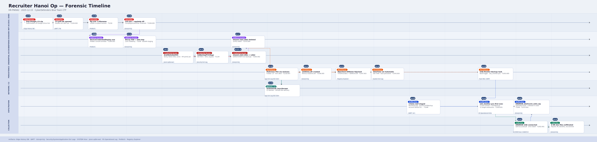

# Recruiter - Hanoi Op Lab


# Context

Lab link: [https://cyberdefenders.org/blueteam-ctf-challenges/recruiter-hanoi-op/](https://cyberdefenders.org/blueteam-ctf-challenges/recruiter-hanoi-op/)

Suggested tools: DB Browser for SQLite, Registry Explorer, MFTECmd, Timeline Explorer, EvtxECmd, Eric Zimmerman Tools, PECmd

Tactics: Execution, Persistence, Privilege Escalation, Defense Evasion, Credential Access

# Scenario

Wowza Enterprise operates a public job application portal that allows interested candidates to submit their personal information and CVs. The HR team regularly reviews submitted resumes and schedules interviews with suitable candidates.

During a routine CV review, Patinthida, an HR specialist at Wowza Enterprise, noticed something unusual. One candidate had submitted their resume as a ZIP archive. Upon extracting and opening the contents, a PDF file was launched from an unexpected and unfamiliar location on the workstation. Alarmed by this behavior, Patinthida immediately shut down her workstation and contacted the IT team for assistance.

Your task is to investigate what occurred on this workstation, reconstruct the sequence of events, and determine whether Wowza Enterprise experienced a potential security breach.

# Initial Access

**Q1**- What is the name of the ZIP file downloaded by the victim?

Answer: `Dup-Dungfu_CV.zip`

Reason: The victim Patinthida downloaded a malicious resume archive named `Dup-Dungfu_CV.zip` from a Google Drive share link on `Sun, 14 Dec 2025 09:29:09 GMT`. This was recovered by opening her Edge browser History SQLite database in DB Browser for SQLite and inspecting the `downloads` table, where row #4 records the download's target path, originating URL, referrer, MIME type, and Chrome/WebKit timestamps, confirming the file was saved directly into a folder she had created for CV review. This activity maps to MITRE ATT&CK T1566.002 (Spearphishing Link via external file-sharing service).

- Source: Edge History DB -> `downloads` table, row #4
- DB path: `C:\Users\Patinthida\AppData\Local\Microsoft\Edge\User Data\Default\History`
- Saved to: `C:\Users\Patinthida\Documents\CV_Review\Dup-Dungfu_CV.zip`
- URL: `hxxps://drive.usercontent.google[.]com/download?id=1icHhro2rQA6u86klCDiWtEdcdNn8Jb2e&export=download`
- Referrer: `hxxps://drive.google[.]com/`
- MIME: `application/x-zip-compressed` (received as `application/octet-stream`)


**Q2**- When was this zip file was downloaded?

Answer: `2025-12-15 13:55`

Reason: The actual local download-completion time is recovered from the same `downloads` table row #4 by converting the `end_time` column, a Chromium/WebKit timestamp stored as microseconds since `1601-01-01 UTC`, using a decoder such as DCode, which resolves to `2025-12-15 13:55 UTC`. This is distinct from the `Sun, 14 Dec 2025 09:29:09 GMT` string also present in that row, which is the file's server-side HTTP Last-Modified header rather than a record of the local download event. This distinction is a critical reminder to verify which timestamp field is actually being interpreted before anchoring a forensic timeline to it, as conflating server-side metadata with local event times can introduce a roughly 28-hour error into the investigation.

- Source: Edge History DB -> `downloads` table, row #4, `end_time` column
- Raw value: `13410280553395801` (Chromium/WebKit epoch, microseconds since `1601-01-01 00:00:00 UTC`)
- Converted: `2025-12-15 13:55 UTC` (via DCode)
- Caution: not to be confused with `Sun, 14 Dec 2025 09:29:09 GMT` in the same row, which is the file's HTTP Last-Modified header (server-side), not a local event time


**Q3**- What are the two files that were extracted from the ZIP file?

Answer: `CV.pdf.lnk`, `CV.png`

Reason: Rather than sweeping the timeline forward from the ZIP's own Master File Table (MFT) record, a full-text search of the parsed `$MFT` CSV in Timeline Explorer for the string `Dup-Dungfu_CV.zip` directly surfaced two Zone.Identifier Alternate Data Stream (ADS) entries, the hidden NTFS streams Windows attaches to internet-sourced files as part of its Mark of the Web (MOTW) mechanism. Both streams, attached to `CV.png` and `CV.pdf.lnk` in `Users\Patinthida\Documents\Interview_Candidate`, carry `ZoneId=3` (Internet zone) and, critically, a `ReferrerUrl` field pointing directly at `C:\Users\Patinthida\Documents\CV_Review\Dup-Dungfu_CV.zip`, explicitly recording that both files were extracted from that archive. The presence of MOTW on files extracted from a ZIP confirms Windows processed the archive with zone propagation intact, a behavior that has become inconsistent across extraction tools, making these ADS entries a particularly reliable provenance artifact when present.

- Method: Timeline Explorer full-text search of parsed `$MFT` CSV for `Dup-Dungfu_CV.zip`
- Found via: `Zone.Identifier` ADS entries (MOTW provenance tracking)
- Extracted to: `C:\Users\Patinthida\Documents\Interview_Candidate\`
    - `CV.pdf.lnk:Zone.Identifier` (MFT entry `36533`, parent entry `115040`)
    - `CV.png:Zone.Identifier` (MFT entry `101113`, parent entry `115040`)
- `Zone.Identifier` contents (identical on both):

```
[ZoneTransfer]
ZoneId=3
ReferrerUrl=C:\Users\Patinthida\Documents\CV_Review\Dup-Dungfu_CV.zip
```

- `ZoneId=3` -> "Internet" security zone (MOTW)

```powershell
PS C:\Users\Administrator\Desktop\Start Here\Tools\ZimmermanTools\net6> MFTECmd.exe -f "C:\Users\Administrator\Desktop\Start Here\Artifacts\Recruiter_Evidence\C\`$MFT" --csv "C:\Users\Administrator\Desktop"
MFTECmd version 1.2.2.1

Author: Eric Zimmerman (saericzimmerman@gmail.com)
https://github.com/EricZimmerman/MFTECmd

Command line: -f C:\Users\Administrator\Desktop\Start Here\Artifacts\Recruiter_Evidence\C\$MFT --csv C:\Users\Administrator\Desktop

File type: Mft

Processed C:\Users\Administrator\Desktop\Start Here\Artifacts\Recruiter_Evidence\C\$MFT in 31.5766 seconds

C:\Users\Administrator\Desktop\Start Here\Artifacts\Recruiter_Evidence\C\$MFT: FILE records found: 134,471 (Free records: 150) File size: 131.5MB
        CSV output will be saved to C:\Users\Administrator\Desktop\20260607175901_MFTECmd_$MFT_Output.csv
```


## NTFS SI vs FN Timestamp Divergence

Every file record in the NTFS Master File Table (MFT) carries two independent sets of MACB timestamps (Modified, Accessed, Created, Born/Entry Modified), stored in two separate typed attributes identified by hex codes.

`0x10` = `$STANDARD_INFORMATION` (SI)

- Maintained by NTFS at the file record level
- Updated by filesystem-level operations: copies, metadata edits, attribute changes
- The timestamps most tools surface by default (Windows Explorer, `dir`, most parsers)
- Primary target for timestomping tools (`timestomp`, `SetFileTime` API abuse), making SI alone untrustworthy when anti-forensics are suspected
- Maps to MITRE ATT&CK T1070.006 (Timestomp)

`0x30` = `$FILE_NAME` (FN)

- Maintained by NTFS as part of the directory index entry for the filename
- Updated on file creation, rename, move, and hard link operations, not by most userland writes
- Harder to stomp without kernel-level access, so tends to retain more original values after tampering
- Multiple FN attributes exist if the file has multiple hard links or both a long and 8.3 short name

Divergence patterns and what they signal:

- SI newer than FN: primary indicator of timestomping or a copy/metadata update that reset SI without touching FN
- FN newer than SI: points toward rename, move, or directory re-link activity
- SI equals FN exactly: either an untouched file or a thorough stomp that hit both, which is itself suspicious

Corroboration sources:

- `$UsnJrnl` (`$J` stream): records the fact of change and reason codes with timestamps, captures events the MFT no longer reflects after overwrites
- `$LogFile`: NTFS transaction journal, logs filesystem operations as redo/undo records, useful for catching activity overwritten in the MFT
- Prefetch, LNK timestamps, browser/email artifacts, and Windows Event Logs round out the picture

Never anchor a timeline to SI or FN alone. Build the story using both, then cross-reference against the corroboration sources above before drawing conclusions.

**Q4**- When did the user open the malicious 'CV' triggering the entire execution chain?

Answer: `2025-12-15 13:56`

Reason: The malicious open is pinned to `2025-12-15 13:56 UTC` via the `$FILE_NAME` (FN / `0x30`) Last Access timestamp on the `CV.pdf.lnk:Zone.Identifier` MFT record (entry `36533`), a value of `2025-12-15 13:56:05`, roughly one minute after the ZIP finished downloading at `13:55`. This timing is consistent with the victim extracting the archive and immediately double-clicking what appeared to be a PDF resume.

The competing `$STANDARD_INFORMATION` (SI / `0x10`) Last Access value of `2025-12-17 11:15:41` was rejected because it falls inside the same `11:49`-`11:53 AM` cluster of `LastWriteTime` values seen across unrelated top-level folders (`$Extend`, `Users`, `Windows`, etc.) on `12/17`. This cluster pattern is strong evidence that SI was overwritten by a volume-wide event, most likely the forensic acquisition or an antivirus (AV) indexing sweep, rather than reflecting the victim's actual interaction with the file. This is a textbook SI contamination scenario and illustrates exactly why FN timestamps serve as the more reliable anchor when SI divergence is present and explainable by external activity.

- Source: `$MFT` entry `36533` -> `CV.pdf.lnk:Zone.Identifier`
    - FN (`0x30`) Last Access: `2025-12-15 13:56:05` -> correct anchor (frozen at extraction and open, never rewritten by volume-wide activity)
    - SI (`0x10`) Last Access: `2025-12-17 11:15:41` -> rejected (contaminated by later volume-wide activity)
- Corroboration: SI value falls within the `11:4911:53 AM` `12/17/2025` cluster of `LastWriteTime` values seen across `$Extend`, `$Recycle.Bin`, `ProgramData`, `Users`, `Windows` -> consistent with forensic acquisition or system-wide scan touching SI metadata across the volume


# Execution

**Q5**- Upon opening the malicious 'CV', a sequence of commands was executed using a native Windows file transfer utility. Once you identify the utility, refer to its manual or documentation. Which command-line flag allows this utility to read and execute commands from a file?

Answer: `-s:filename`

Reason: A `FTP.EXE-3CF78E07.pf` Prefetch entry confirmed `ftp.exe`, Windows' native File Transfer Protocol (FTP) client, was executed during the infection chain. Running `ftp /?` from `cmd.exe` revealed its full flag set, including `-s:filename`, which loads and auto-runs a text file of FTP commands on startup. This is a classic Living off the Land Binary (LOLBin) technique for scripted file transfer and exfiltration without interactive prompts, abusing a trusted system binary to blend into normal Windows activity and avoid detection. This maps to MITRE ATT&CK T1218 (System Binary Proxy Execution) and T1048 (Exfiltration Over Alternative Protocol).

- Found via: Prefetch entry `FTP.EXE-3CF78E07.pf` -> confirmed `ftp.exe` execution
- Doc source: `ftp /?` (cmd.exe)
- Flag: `s:filename`
- Meaning: specifies a text file containing FTP commands; the commands automatically run after FTP starts

**Q6**- After the malicious file was executed, a LOLBin was launched to conceal the console window from the victim. What is this binary?

Answer: `DeviceCredentialDeployment.exe`

Reason: `DeviceCredentialDeployment.exe` is a legitimate Windows binary abused for its ability to spawn a process with a hidden console window, making it a LOLBin of particular value to attackers seeking to suppress visible execution artifacts. Confirmation came from a Prefetch entry, `DEVICECREDENTIALDEPLOYMENT.EX-5324A311.pf`, whose filename was truncated by Windows' `.pf` naming convention, which caps the executable-name prefix at roughly 29 characters. This truncation masked it from an initial literal-name search and serves as a reminder to account for Prefetch truncation when hunting by binary name. Its `LastWriteTime` of `12/15/2025 1:56 PM` aligns precisely with the `13:56 UTC` execution window already anchored to the malicious CV's launch, corroborating the timeline across two independent artifact types. This technique maps to MITRE ATT&CK T1218 (System Binary Proxy Execution) and T1564.003 (Hide Artifacts: Hidden Window).

- Evidence: `C:\Windows\Prefetch\DEVICECREDENTIALDEPLOYMENT.EX-5324A311.pf`
- Timestamp: `12/15/2025 1:56 PM` (`LastWriteTime`)
- Note: filename truncated by Prefetch's ~29-character naming cap, masked it from direct literal-name search
- Corroborates: `13:56 UTC` execution window (`CV.pdf.lnk` FN Last Access)


**Q7**- During execution, two additional files were created in the same directory as the legitimate PDF file. What are the **final names** of these two files?

Answer: `ssh.exe`, `apphelp.dll`

Reason: This is a more complex question that demands a breakdown of steps:

**Step 1 — Identify the “legitimate” PDF file:**

The scenario states the malicious shortcut launched a PDF from an unexpected and unfamiliar location. Searching `$MFT` for PDFs created near the `CV.pdf.lnk` execution moment (`2025-12-15 13:56:05`) surfaced `Dup-Dungfu_CV.pdf` (entry `101153` seq `2`, parent entry `1372` = `ProgramData`):

- Location: `ProgramData` is a system and application staging path, not a user document folder, matching the "unfamiliar location" descriptor
- Timing: Created `0x10` = `2025-12-15 13:56:22`, roughly 17 seconds after the LNK opened, tight enough to be cause-and-effect rather than coincidence
- Naming: `Dup-Dungfu_CV.pdf` directly echoes `Dup-Dungfu_CV.zip`, the genuine resume content dropped as a decoy to keep the lure convincing while the real payload executes in the background

Note: The “legitimate” PDF can be (and almost certainly is) completely benign in isolation: extract it, open it in a sandbox, and you'd see a real resume with zero embedded exploit code. Its "maliciousness" isn't a property of the file's content — it's a property of its role in the sequence.

**Step 2 — Pivot the filter to the containing folder:**

Rather than searching by filename, which would miss anything with an unrelated name, the `$UsnJrnl` (`$J`) was filtered on Parent Entry Number `1372` (`ProgramData`, parent sequence `1`) across `13:56:20`-`13:56:27 UTC`, capturing every record for anything created, modified, renamed, or deleted in that folder during the execution burst.

**Step 3 — Reconstruct each entry's lifecycle:**

| Entry | Name | Created | Deleted? |
| --- | --- | --- | --- |
| `101126` seq `2` | `ssh.exe` | `13:56:20` | No |
| `101153` seq `2` | `Dup-Dungfu_CV.pdf` | `13:56:22` | No (decoy anchor) |
| `101163` seq `2` | `b64.tmp` | `13:56:23` | Yes, FileDelete and Close same second |
| `101197` seq `2` | `b64.tmp` (renamed in) | `13:56:23` | Yes, FileDelete and Close at `13:56:24` |
| `101163` seq `3` | `apphelp.dll` | `13:56:24` | No, reused entry `101163`'s freed slot after `b64.tmp` was deleted |

**Step 4 — Isolate the final names:**

Two entries (`101163` seq `2` and `101197` seq `2`, both transiting through the name `b64.tmp`) were created and deleted within 1-2 seconds. This is classic base64 blob staging: write an encoded payload to disk, decode and assemble it, then delete the scratch file. They leave no final artifact on disk. The remaining two, `ssh.exe` and `apphelp.dll`, never received a FileDelete event, making them the actual persistent drops sitting alongside the decoy PDF. Both names match real Windows component names, consistent with a masquerading and Dynamic Link Library (DLL) sideloading setup, mapping to MITRE ATT&CK T1036.005 (Masquerading: Match Legitimate Name or Location) and T1574.002 (Hijack Execution Flow: DLL Side-Loading).

## NTFS User Journal Sequence Number Correlation

The `$MFT` is a snapshot. It shows the current state of every file and folder on the volume, one frame frozen at acquisition time, with no memory of what came before. A file that was created, renamed three times, and deleted leaves no trace in the `$MFT` — its slot is simply vacant or already reused. To reconstruct lifecycle events like renames, deletes, and transient staging files, the `$UsnJrnl` (`$J`) is required.

The `$J` is the movie. It is a chronological log of every change operation NTFS recorded: creates, renames, data extends, closes, deletes, security changes, and more. Each record carries a reason code (`FileCreate`, `RenameNewName`, `FileDelete`, etc.), a timestamp, and critically, a reference to the file that changed. That reference is where the correlation problem begins.

**The problem with entry numbers alone**: MFT slots are a finite, recyclable resource. When a file is deleted, NTFS does not retire that slot — it hands it to the next file that needs one. This means "entry `101163`" is ambiguous over time. Depending on when a `$J` record was written, entry `101163` could refer to completely different files at different points in the volume's history. Joining `$J` records on entry number alone produces false continuity: two unrelated files that shared a slot get merged into one fabricated biography.

The fix: Entry Number + Sequence Number as a compound key: Every MFT slot carries a sequence number that increments each time the slot is reused. The pairing of entry number and sequence number uniquely identifies not just a slot, but a specific occupancy of that slot. A `$J` record for entry `101163` seq `2` and a record for entry `101163` seq `3` describe two completely unrelated files. The sequence number is what separates their stories.

This is also what the File Reference Number encodes. The 64-bit hex value seen in `$J` records packs both values into one identifier: the lower 48 bits carry the entry number, the upper 16 bits carry the sequence number. Decoding it produces an unambiguous pointer to one specific file occupying one specific slot at one specific time, not whatever currently sits in that slot.

The same logic governs parent entry and sequence number pairs. If a directory's slot is ever reused, a child file's parent pointer could silently resolve to a completely different directory that inherited the slot later. The parent sequence number is what confirms the pointer still resolves to the intended folder.

Live example from the execution burst at `13:56 UTC`:

The `$J` filter on parent entry `1372` (`ProgramData`) across `13:56:20`-`13:56:27 UTC` produced records for entry `101163` at two different sequence numbers:

- `101163` seq `2` = `b64.tmp`, created `13:56:23`, deleted `13:56:23`, lived under one second as a base64 staging scratch file
- `101163` seq `3` = `apphelp.dll`, created `13:56:24`, the instant the slot was vacated, never deleted, persists as a payload drop

An entry-number-only join would treat these as a single file changing names from `b64.tmp` to `apphelp.dll`. The sequence number is what proves they are two unrelated files whose biographies happened to share the same MFT slot one second apart. Without it, the transient staging behavior of `b64.tmp` and the persistence of `apphelp.dll` collapse into one misleading record.

**Retention caveat**: `$J` is a capped rolling log. Activity outside its retention window ages out with no recovery path from `$J` alone. `$LogFile`, the NTFS transaction journal, captures lower-level record operations but has even shorter retention. Outside both windows, `$MFT` shows only final state with no rename or lifecycle history. Entry/sequence correlation is the richest reconstruction method available, but only while `$J` retains the relevant records.

**Q8**- From the previous question, the identified executable was renamed from its original name before being dropped. What is its original name?

Answer: `CompMgmtLauncher.exe`

Reason: `ssh.exe` carried a clear copied-content signature in its `$MFT` record: its `$STANDARD_INFORMATION` (SI) Modified timestamp (`2019-12-07 09:09:37`) predated its Created timestamp (`2025-12-15 13:56:20`), and it carried a `$CI.CATALOGHINT` Extended Attribute (EA) pointing to a legitimate Microsoft signing catalog. Together these indicated the bytes were copied wholesale from an existing Windows component and written out under a new name and path, a classic masquerading technique.

Three Prefetch-based attempts to identify the source binary (against `Everything64.exe`, `SearchFilterHost.exe`, and `SearchIndexer.exe`) failed against the confirmed 16-character-plus-extension format. The breakthrough came from pivoting the `$MFT` search to an exact byte-for-byte match: searching for any file sharing `ssh.exe`'s precise size of `91136` bytes surfaced `C:\Windows\System32\CompMgmtLauncher.exe` (MFT entry `45499`). Two independent timestamp fossils confirmed the match. First, `CompMgmtLauncher.exe`'s SI Created timestamp matched `ssh.exe`'s SI Modified value exactly at `2019-12-07 09:09:37`, the original file's creation time surviving the copy operation intact. Second, `CompMgmtLauncher.exe`'s FN Last Access landed at `2025-12-15 13:56:19`, one second before `ssh.exe`'s Created timestamp of `13:56:20`, capturing the read-then-write of the copy operation across two consecutive clock ticks.

This identification also retroactively explained `ssh.exe`'s stealer-like Prefetch DLL footprint. The heavy `SHELL32`, `OLE32`, `COMBASE`, `PROPSYS`, and `WINDOWS.STORAGE` activity alongside a reference to `Computer Management.lnk` is simply `CompMgmtLauncher.exe` doing its normal job as the launcher binary for the Computer Management Microsoft Management Console (MMC) console, operating under a disguised name and location. This also foreshadows the lab's later privilege escalation tactic, since `CompMgmtLauncher.exe` is a documented User Account Control (UAC) auto-elevation abuse vector.

- Source file: `C:\Windows\System32\CompMgmtLauncher.exe` (MFT entry `45499`, seq `1`)
- Dropped as: `C:\ProgramData\ssh.exe` (MFT entry `101126`, seq `2`)
- Correlating evidence (`$MFT` parse via MFTECmd):
    - File size match: `91136` bytes == `91136` bytes
    - Timestamp fossil: `CompMgmtLauncher.exe` Created `0x10` = `2019-12-07 09:09:37` / `ssh.exe` Modified `0x10` = `2019-12-07 09:09:37` (preserved on copy)
    - Copy-event capture: `CompMgmtLauncher.exe` Last Access `0x30` = `2025-12-15 13:56:19` / `ssh.exe` Created `0x10` = `2025-12-15 13:56:20` (+1 second)

# Credential Access

**Q9**- The threat actor discovered the victim user's password from her note-taking application. What is the password of the user used for HR portal?

Answer: `AraiWaSahai555`

Reason: The investigation hinged on first identifying which application held the note. Prefetch initially pointed at Microsoft Sticky Notes and Notepad as the only candidates that touched personal documents. A single Notepad session led to a dead end: the file it referenced, `note.txt` in `CV_Review`, contained unrelated HR candidate-review content, later deleted to the Recycle Bin as routine housekeeping. This was confirmed by tracing its MFT slot `115060` across all three of its sequence generations via `$UsnJrnl` (`$J`).

The breakthrough came from `UserAssist`, which showed Sticky Notes with a Run Counter of `11`, a Focus Count of `28`, and over `13` minutes of cumulative focus time, directly contradicting the "launched once, barely touched" impression left by its single Prefetch trace and reopening a thread that had been prematurely closed. Pulling `$J` for `plum.sqlite`'s MFT slot (entry `131970`, sequence `13`) confirmed the database received real `DataExtend` writes at two points: once at creation (`13:31:45`) and again roughly 3 hours later (`16:29:54`), landing approximately 90 seconds after the victim's final Notepad session. That timing is the exact behavioral signature of reading something in one application and then typing it into another.

The catch: opening `plum.sqlite` in a standard SQLite browser, even read-only and paired with its `-wal` companion, repeatedly produced an empty `4KB` shell. The act of opening or checkpointing the database silently destroyed the original Write-Ahead Log (WAL) content, a chain-of-custody trap likely caused by a salt or generation mismatch causing the engine to discard rather than merge the WAL's frames. This maps to a real-world evidence handling risk: standard database tooling can alter or destroy the artifact being examined.

The fix was to stop asking the database engine to interpret the file and instead carve the WAL's raw bytes directly for printable text. PowerShell regex against a Latin1-decoded read (which preserves every byte 1:1, unlike UTF-8) and a Python string-carving script both surfaced the password repeatedly, wrapped in Rich Text Format (RTF) bold markers (`\b...\b0`) and tied consistently to the same note Globally Unique Identifier (GUID), exactly where the note's title and body content were serialized together.

- Note title (id=`e7058c62-6b90-44ce-9cbc-e71b099a1c55`): `HR Portal password`
- Note body (id=`efeadc34-75fb-4d9f-b6a8-2926d4321e0e`): `\b AraiWaSahai555\b0`
- Password: `AraiWaSahai555`

```python
import re

# Read the raw WAL (Write-Ahead Log) file bytes into memory for string carving
with open("plum.sqlite-wal", "rb") as f:
    data = f.read()

# Regex pattern to find printable ASCII text sequences between 4 and 250 characters long
# \x20-\x7E covers the full printable ASCII range (space through tilde)
strings = re.findall(b"[\x20-\x7E]{4,250}", data)

# Write the recovered strings to a clean text file for review
with open("extracted_strings.txt", "w", encoding="utf-8", errors="ignore") as out:
    for s in strings:
        decoded_str = s.decode("utf-8", errors="ignore")
        # Strip leading/trailing whitespace before length check to avoid writing blank or whitespace-only lines
        if len(decoded_str.strip()) > 0:
            out.write(decoded_str + "\n")

print("Carving complete! Open 'extracted_strings.txt' to review your notes.")
```


**Q10**- After obtaining credentials, the threat actor identified a special privilege assigned to the user that allows file content retrieval even when the file's security descriptor does not explicitly grant access. What is this privilege?

Answer: `SeBackupPrivilege`

Reason: Confirmed via Event ID `4672` ("Special privileges assigned to new logon") in the Security event log on `HR-PWG62`, recorded at `2025-12-15 14:13:58 UTC`, roughly 17 minutes after the initial LNK execution that kicked off the infection chain (`13:56:05`), placing this discovery firmly inside the active intrusion window rather than as background noise. The `PrivilegeList` field names `SeBackupPrivilege` explicitly, tied to `SubjectUserName: Patinthida` (the same compromised account from the earlier chain) under `SubjectLogonId 0x3e3a5c`.

This privilege lets its holder bypass an object's Discretionary Access Control List (DACL) read-checks entirely, provided the caller opens the target with backup-intent semantics (for example, the `FILE_FLAG_BACKUP_SEMANTICS` flag on `CreateFile`, or the `BackupRead`/`BackupWrite` API family) and has the privilege actively enabled in its token (not merely present-but-dormant). For an attacker, this is a clean route to read normally-protected files such as registry hives (`SAM`, `SYSTEM`, `SECURITY`), `NTDS.dit`, or other users' locked documents, without needing full Administrator or SYSTEM rights or triggering access-denied errors.

Its appearance here, on a standard HR workstation account mid-intrusion, is a strong signal the threat actor was actively probing for, and found, a privilege-based path to sensitive file content as a follow-on step after initial credential access. This maps to MITRE ATT&CK T1003.002 (OS Credential Dumping: Security Account Manager) as the likely objective, with T1134 (Access Token Manipulation) as a plausible enabler if `SeBackupPrivilege` was not natively assigned to Patinthida's account and required token adjustment to surface.

```xml
<Event xmlns="http://schemas.microsoft.com/win/2004/08/events/event">
- <System>
  <Provider Name="Microsoft-Windows-Security-Auditing" Guid="{54849625-5478-4994-A5BA-3E3B0328C30D}" />
  <EventID>4672</EventID>
  <TimeCreated SystemTime="2025-12-15T14:13:58.100595000Z" />
  <EventRecordID>2339</EventRecordID>
  <Computer>HR-PWG62</Computer>
  </System>
- <EventData>
  <Data Name="SubjectUserSid">S-1-5-21-731523648-3438838900-2215536667-1001</Data>
  <Data Name="SubjectUserName">Patinthida</Data>
  <Data Name="SubjectDomainName">HR-PWG62</Data>
  <Data Name="SubjectLogonId">0x3e3a5c</Data>
  <Data Name="PrivilegeList">SeBackupPrivilege</Data>
  </EventData>
</Event>
```

## **Abuse of Semantically Scoped Windows Privileges**

**Pattern Summary**

An attacker operating under a non-administrative account leverages a Windows privilege designed for a legitimate system function whose underlying implementation bypasses normal DACL/SACL enforcement. Because the privilege is already present in the token (assigned by policy, group membership, or service account configuration), no elevation is required — the attacker simply enables it and invokes the API family that honors it.

**Mechanism**

Windows enforces object access through two distinct layers: discretionary ACLs (DACL) evaluated at handle open time, and privilege checks performed by the kernel for specific API families. Several privileges short-circuit the DACL evaluation entirely when the calling token holds them. The DACL is not violated — it is structurally irrelevant to the code path the privileged API takes.

**Privilege Inventory**

- `SeBackupPrivilege` — opens any file/registry key with `FILE_FLAG_BACKUP_SEMANTICS`, bypassing read ACLs. Path to SAM/SYSTEM/NTDS.dit extraction.
- `SeRestorePrivilege` — write-side twin. Overwrites protected files and registry keys without access-denied.
- `SeDebugPrivilege` — opens any process with `PROCESS_ALL_ACCESS` regardless of object ACL. Primary path to LSASS memory reads (T1003.001).
- `SeTakeOwnershipPrivilege` — takes ownership of any securable object, then resets the DACL to grant arbitrary access.
- `SeImpersonatePrivilege` — impersonates any token obtainable by the process. Abused via Potato-family attacks to reach SYSTEM.
- `SeLoadDriverPrivilege` — loads arbitrary kernel drivers, bypassing user-mode security boundaries entirely.

**Detection Focus**

Privilege enable events (`EID 4703`) for the above privileges on non-service, non-backup accounts. API calls to `NtOpenFile` with backup semantics flags, `OpenProcess` against LSASS, `ZwLoadDriver`, or `SetThreadToken` outside expected service contexts. Privileges present in a token that are inconsistent with the account's stated function warrant immediate investigation regardless of whether any access-denied events were generated — by design, none will be.

**MITRE**

T1134 (Access Token Manipulation), T1548 (Abuse Elevation Control Mechanism), T1003.001 (LSASS Memory)

**Q11**- Using the previously discovered privilege, the threat actor created backups of sensitive registry data in order to extract password hashes. To evade detection, the backups were saved using filenames that mimic hive log files. What are the names of the two files created? (List them according to their chronological sequence of creation)

Answer: `ntusers.dat.LOG1`, `ntusers.dat.LOG2`

Reason: `$J` (the USN Change Journal, NTFS's running log of every file/directory create-modify-delete-rename event) was parsed via NTFS Log Tracker, filtering for `File_Created` events in the window following the `14:13:58 UTC` `SeBackupPrivilege` assignment from Q10. The timing is the critical finding: `ntusers.dat.LOG1` was created at `2025-12-15 14:13:58 UTC`, the same second as the Event ID (EID) 4672 privilege-assignment record. The threat actor went from privilege granted to first hive backup written instantaneously, with `ntusers.dat.LOG2` following approximately 82 seconds later at `2025-12-15 14:15:20 UTC`. Both files landed directly in `\Users\Patinthida\`, the compromised user's own profile root.

The filename choice is the defense-evasion signature worth calling out. Legitimate Windows systems contain `NTUSER.DAT.LOG1` and `NTUSER.DAT.LOG2` as transaction-log companions to every user's `NTUSER.DAT` registry hive in every profile directory. An analyst skimming filenames would likely pass over `ntusers.dat.LOG1` and `ntusers.dat.LOG2` as routine OS noise. This is the same masquerading playbook (T1036.005) observed in Q7 and Q8, where `ssh.exe` and `apphelp.dll` posed as `CompMgmtLauncher.exe`.

Functionally, these files are almost certainly `SeBackupPrivilege`-enabled raw copies of sensitive registry hives (`SAM`, `SECURITY`, `SYSTEM`) staged for offline password hash extraction, continuing the chain directly from the privilege identified in Q10 into active credential harvesting (T1003.002, OS Credential Dumping: Security Account Manager (SAM)).

```
Line      Tag         Time Stamp (UTC 0)      USN         File Name               Full Path
310507    Unchecked   2025-12-15 14:13:58     44292288    ntusers.dat.LOG1        \Users\Patinthida\ntusers.dat.LOG1
310574    Unchecked   2025-12-15 14:15:20     44299960    ntusers.dat.LOG2        \Users\Patinthida\ntusers.dat.LOG2
```


**Q12**- After exfiltrating the backup files, the threat actor deleted them. When was the second backup file removed?

Answer: `2025-12-15 14:17`

Reason: The same `$J` pivot used in Q11 surfaces the next event in `ntusers.dat.LOG2`'s lifecycle. Scanning forward past the `File_Created` entry at `2025-12-15 14:15:20 UTC` for a `File_Deleted` reason flag on `\Users\Patinthida\ntusers.dat.LOG2` yields a combined `File_Closed` / `File_Deleted` event at `2025-12-15 14:17:01 UTC`, only 1 minute and 41 seconds after creation.

The gap is the behavioral fingerprint. The sequence is: create the masquerading hive backup, exfiltrate it, delete it. The file was on disk only long enough to be moved off-host, indicating this was a transient staging artifact by design, not an oversight. This cleanup step is textbook Defense Evasion (T1070.004, Indicator Removal: File Deletion), and the tight creation-to-deletion window is a reliable behavioral indicator that distinguishes deliberate anti-forensic cleanup from normal file churn. A `$J` entry is one of the few artifacts that survives this deletion, since the journal records the event regardless of whether the file itself still exists on disk.

```
Line      Tag         Time Stamp (UTC 0)      USN         File Name             Full Path                             Event Info
310596    Unchecked   2025-12-15 14:17:01     44302336    ntusers.dat.LOG2      \Users\Patinthida\ntusers.dat.LOG2    File_Closed / File_Deleted
```

# Persistence

**Q13**- After obtaining the local Administrator hash, the threat actor remotely installed a malicious Windows Installer package. What is the full command-and-control (C2) address used during this operation?

Answer: `hxxp://wzdsawsd.xyz/devops`

Reason: With no Sysmon telemetry available, the investigative pivot was the Windows Application event log. Event ID (EID) 1040 ("Beginning a Windows Installer transaction") records the full source path passed to `msiexec.exe` at the moment an installation starts. At `2025-12-15 14:20:14 UTC`, approximately three minutes after `ntusers.dat.LOG2` was deleted, EID 1040 logged the source URI as `hxxp://wzdsawsd[.]xyz/devops`, exposing the threat actor's command and control (C2) domain and staging path verbatim.

The corresponding EID 1033 at the same timestamp recorded the installed product as `Foobar 1.0` by `Acme Ltd.` with an exit status of `1603` (Fatal error during installation), a deliberate masquerade of a legitimate-looking software package that fails to install cleanly. The `1603` status does not mean the attack failed. Malicious MSIs routinely embed CustomActions, arbitrary code execution steps baked into the installer sequence, that fire and complete before any rollback occurs, meaning the payload likely executed despite the reported failure.

Invoking `msiexec /i` with a remote HTTP source means the MSI was fetched directly from the C2 during execution without necessarily being written to disk as a standalone file first. This is a deliberate reduced-footprint technique (T1218.007, Signed Binary Proxy Execution: Msiexec) that bypasses the MFT and `$J` artifact trail and makes the Application event log the critical evidence source here. `hxxp://wzdsawsd[.]xyz/devops` is a high-confidence IOC domain and should be pivoted across all remaining artifact sources.

```
EID 1040 -- Application Log -- 2025-12-15 14:20:14 UTC
Beginning a Windows Installer transaction: hxxp://wzdsawsd[.]xyz/devops
Client Process Id: 2364

EID 1033 -- Application Log -- 2025-12-15 14:20:14 UTC
Product Name:    Foobar 1.0
Product Version: 1.0.0
Manufacturer:    Acme Ltd.
Status:          1603 (Fatal error during installation)
```

**Q14**- To establish persistence, the threat actor modified the startup configuration of a Windows service from Manual to Automatic. What is the name of this service?

Answer: `W32Time`

Reason: Event ID (EID) 7040 ("The start type of the service was changed") in the System event log, logged at `2025-12-15 14:24:42 UTC`, places this event approximately four minutes after the malicious MSI transaction at `14:20:14 UTC`, squarely in the post-installation persistence phase.

The event parameters tell the full story: `W32Time` (Windows Time, the native service responsible for Network Time Protocol (NTP) clock synchronization) had its start type changed from `demand start` (Manual) to `auto start` (Automatic), meaning the service now launches at every system boot. This is a well-worn persistence technique (T1543.003, Create or Modify System Process: Windows Service). `W32Time` is a native, signed Windows service present on every system, making its reconfiguration virtually invisible to analysts scanning for new or unsigned services. The service already exists, already appears legitimate, and no new binary is written to disk.

The Security `UserID` field (`S-1-5-21-731523648-3438838900-2215536667-1000`, resolving to the `Admin` local account) identifies the same principal acting throughout Q12 and Q13, consistent with the `Admin` credential material harvested via the SAM hive backup in Q11.

EID 7040 on `W32Time` or any service not expected to change start type is a high-signal, low-noise detection opportunity for this class of persistence. The rarity of legitimate `W32Time` start-type changes in normal enterprise operation makes this event a reliable behavioral indicator with minimal false-positive pressure.

```
EID 7040 -- System Log -- 2025-12-15 14:24:42 UTC
Computer:   HR-PWG62
UserID:     S-1-5-21-731523648-3438838900-2215536667-1000 (Admin)
param1:     Windows Time
param2:     demand start  (previous -- Manual)
param3:     auto start    (new -- Automatic)
param4:     W32Time
```

## **Abuse of Windows Service Host via Service DLL Hijack**

An attacker with registry write access replaces the `ServiceDll` value of a legitimate shared-process Windows service with a path to a malicious DLL. At next service start or system boot, `svchost.exe` loads the attacker's DLL into its process space and calls its `ServiceMain` export, executing the payload entirely within a trusted, signed Microsoft process.

**Mechanism**

Services of type `0x20` (shared process) do not run their own executable. `svchost.exe` reads `HKLM\SYSTEM\CurrentControlSet\Services\<ServiceName>\Parameters\ServiceDll` at startup and loads whatever DLL is specified. The DLL becomes the service. Swapping this value requires no new process, no new service name, and no unsigned binary in the service list. The running process inventory shows only legitimate `svchost.exe` instances, indistinguishable from normal operation by process name or count alone.

**Why Native Services Are Preferred Targets**

Services like `W32Time`, `AppID`, or `SENS` are present on every Windows system, rarely monitored for configuration drift, and run under privileged accounts (`LocalService`, `NetworkService`, `SYSTEM`). Modifying an existing service avoids the detection pressure on newly created services and unsigned binaries that most EDR rules prioritize.

**Compounding Factor: Process Sharing**

A single `svchost.exe` instance hosts multiple services simultaneously. A hijacked `ServiceDll` loads alongside legitimate Microsoft DLLs in the same process, with the same creation time and the same security context. Module enumeration shows a mix of trusted and malicious DLLs with no obvious process-level anomaly.

**Detection Focus**

Registry writes to any `Parameters\ServiceDll` value outside of known-good baselines, particularly outside patch/update windows. Cross-reference `svchost.exe` instances via `tasklist /svc` against expected service groupings under `HKLM\SOFTWARE\Microsoft\Windows NT\CurrentVersion\Svchost`. Enumerate loaded modules per PID and diff against a clean baseline. Parent process for all `svchost.exe` instances must be `services.exe` -- any deviation is an immediate escalation indicator.

**MITRE**

T1543.003 (Create or Modify System Process: Windows Service), T1574.011 (Hijack Execution Flow: Services Registry Permissions Weakness)

**Q15**- A new DLL was created to be loaded during startup of the previously modified service. What is the name of this DLL, and which MITRE ATT&CK Persistence technique ID corresponds to this behavior?

Answer: `w64time.dll`, `T1547.003`

Reason: Three chained artifacts across `$J`, the registry, and the System event log reconstruct a complete persistence installation sequence spanning `2025-12-15 14:21:46 UTC` to `14:24:42 UTC`, approximately one to four minutes after the malicious MSI transaction in Q13.

At `14:21:46 UTC`, `$J` recorded `w64time.dll` created in `\Windows\System32\`. The filename is deliberate masquerading (T1036.005): `w64time.dll` is visually near-identical to the legitimate `w32time.dll` at a glance, consistent with the naming convention pattern established in Q11 with `ntusers.dat.LOG1` and `ntusers.dat.LOG2`.

At `14:23:40 UTC`, Registry Explorer confirms the `DllName` value under `ControlSet001\Services\W32Time\TimeProviders\NtpClient` was overwritten from the legitimate NTP client DLL to `C:\Windows\System32\w64time.dll`. The Windows Time service exposes a time provider plugin mechanism: any DLL registered under `TimeProviders` is loaded directly by the `W32Time` service process at startup, running under `SYSTEM` context with no additional execution chain required.

At `14:24:42 UTC`, EID 7040 sealed the persistence by flipping `W32Time` from Manual to Automatic start. On every subsequent boot, the Service Control Manager (SCM) starts `W32Time` automatically, `W32Time` enumerates and loads all registered time providers, and `w64time.dll` executes under full `SYSTEM` privilege without any further attacker interaction.

The `TimeProviders` subkey is rarely included in baseline audits, `W32Time` is universally present on domain-joined machines, and the DLL filename passes casual visual inspection. This is T1547.003 (Boot or Logon Autostart Execution: Time Providers), a high-stealth, low-footprint persistence mechanism that survives reboots entirely within a trusted, signed service process.

```
$J -- File Created
  Time (UTC):  2025-12-15 14:21:46
  File:        w64time.dll
  Full Path:   \Windows\System32\w64time.dll
  Event:       File_Created

Registry -- Time Provider DllName overwritten
  Hive:        SYSTEM
  Key:         ControlSet001\Services\W32Time\TimeProviders\NtpClient
  Last Write:  2025-12-15 14:23:40
  Value:       DllName (RegSz)
  Data:        C:\Windows\System32\w64time.dll

EID 7040 -- System Log
  Time (UTC):  2025-12-15 14:24:42
  Computer:    HR-PWG62
  param1:      Windows Time
  param2:      demand start  (Manual -- previous)
  param3:      auto start    (Automatic -- new)
  param4:      W32Time
  UserID:      S-1-5-21-731523648-3438838900-2215536667-1000 (Admin)
```

# Exfiltration

**Q16**- The threat actor dropped a well-known file transfer utility to exfiltrate data from the workstation. What account ID and key were used by this tool?

Answer: `0052b7149572e510000000001`, `K0058kgxfJI4Pu19P0vM6VCJmKLWbJE`

Reason: The exfiltration tooling was identified by chance during routine review of PowerShell Operational logs. EID 4104 ScriptBlock logging at `2025-12-15 14:40:01 UTC` referenced `C:\Windows\System32\rc.exe` invoking a cloud sync operation, which flagged as anomalous for a system binary name with no legitimate Windows counterpart. `rc.exe` is `rclone` renamed, a deliberate masquerading move (T1036.003, Masquerading: Rename System Utilities) designed to blend into `System32` among legitimate binaries.

That discovery drove the MFT pivot. Knowing `rclone` was present, MFTECmd with `--dr` recovered the deleted `rclone.conf` at entry `115569` from `.\Users\Admin\.config\rclone`, still resident in the MFT record at 99 bytes. The configuration confirms the exfiltration destination as Backblaze B2 bucket `ExfilBackup` under remote `backup:`, authenticated with hardcoded credentials. The ScriptBlock reveals the collection scope: a document-focused sweep across `*.doc`, `*.docx`, `*.pdf`, `*.txt`, `*.xls`, `*.xlsx`, `*.ppt`, `*.pptx`, `*.odt`, `*.rtf`, and `*.csv`, consistent with targeted intelligence collection rather than opportunistic bulk exfiltration (T1048, Exfiltration Over Alternative Protocol). Transfer logs were written to `$env:TEMP\usb_backup_log.txt`, a secondary artifact worth recovering.

The `account` value `0052b7149572e510000000001` and key `K0058kgxfJI4Pu19P0vM6VCJmKLWbJE` are high-confidence IOCs and should be submitted to Backblaze immediately for account identification, suspension, and preservation of any uploaded objects.

```
EID 4104 -- PowerShell Operational -- 2025-12-15 14:40:01 UTC
  Tool:     C:\Windows\System32\rc.exe  (rclone, renamed)
  Remote:   backup:ExfilBackup  (Backblaze B2)
  Log:      $env:TEMP\usb_backup_log.txt
  Targets:  *.doc *.docx *.pdf *.txt *.xls *.xlsx *.ppt *.pptx *.odt *.rtf *.csv

MFT Entry:  115569  Seq: 3
Parent:     .\Users\Admin\.config\rclone
File:       rclone.conf (99 bytes, resident -- recovered from MFT slack)
Created:    2025-12-15 14:29:19 UTC ($FN)
In Use:     No (deleted)

[backup]
type    = b2
account = 0052b7149572e510000000001
key     = K0058kgxfJI4Pu19P0vM6VCJmKLWbJE
```


```powershell
PS C:\Users\Administrator\Desktop\resident\Resident> ls *115569*

Directory: C:\Users\Administrator\Desktop\resident\Resident
Mode                LastWriteTime         Length Name
----                -------------         ------ ----
-a----         6/8/2026   9:29 PM             99 115569-3_rclone.conf.bin

PS C:\Users\Administrator\Desktop\resident\Resident> type .\115569-3_rclone.conf.bin
[backup]
type = b2
account = 0052b7149572e510000000001
key = K0058kgxfJI4Pu19P0vM6VCJmKLWbJE
```

**Q17**- To facilitate data exfiltration, the threat actor dropped a script and created a scheduled task to execute it. What are the names of the script and the scheduled task?

Answer: `usb_monitor.ps1`, `USB Monitor Backup`

Reason: The scheduled task XML was recovered as a resident file at `C:\Windows\System32\Tasks\USB Monitor Backup`, the standard Windows task definition location, confirming registration by `HR-PWG62\Admin` at `2025-12-15 14:39:38 UTC`. Twenty-three seconds later, at `14:40:01 UTC`, EID 4104 captured the first execution, closing the loop between task registration and the PowerShell ScriptBlock recovered in Q16.

The task is configured with a `BootTrigger` and `RunLevel` of `HighestAvailable`, meaning it survives reboots and executes with the highest privilege available to the `Admin` account (T1053.005, Scheduled Task/Job: Scheduled Task). The action launches `powershell.exe` with `-WindowStyle Hidden` suppressing any console window and `-ExecutionPolicy Bypass` sidestepping local execution policy without modifying it persistently, a common combination for covert script execution (T1059.001, PowerShell).

The script path `C:\Windows\Tasks\usb_monitor.ps1` is the masquerading element worth highlighting (T1036). The legacy `C:\Windows\Tasks\` directory is distinct from `C:\Windows\System32\Tasks\` where task XML definitions live, is rarely audited, and placing a script there alongside legitimate task infrastructure makes it visually plausible as a system file. The task name "USB Monitor Backup" reinforces the same social engineering logic, sounding mundane and operational rather than suspicious.

This task is the persistence container for the `rclone` exfiltration chain documented in Q16, tying the full execution path together: boot triggers task, task launches hidden PowerShell, PowerShell calls `rc.exe`, documents exfiltrate to Backblaze B2.

```
Task XML:   C:\Windows\System32\Tasks\USB Monitor Backup
Created:    2025-12-15 14:39:38 UTC
Author:     HR-PWG62\Admin
Trigger:    BootTrigger
RunLevel:   HighestAvailable
Command:    powershell.exe -WindowStyle Hidden -ExecutionPolicy Bypass
            -File C:\Windows\Tasks\usb_monitor.ps1

First execution: 2025-12-15 14:40:01 UTC (EID 4104, PowerShell Operational)
```

**Q18**- Identify the name of the bucket used for data exfiltration.

Answer: `ExfilBackup`

Reason: No additional artifact analysis was required for this question. The bucket name was already in hand from the EID 4104 ScriptBlock recovered during Q16 and Q17. `usb_monitor.ps1` hardcodes `$RCLONE_BUCKET = "ExfilBackup"` and `$RCLONE_REMOTE = "backup:"`, mapping directly to the credentials recovered from `rclone.conf`: account `0052b7149572e510000000001`, key `K0058kgxfJI4Pu19P0vM6VCJmKLWbJE`.

The full exfiltration path is confirmed: `usb_monitor.ps1` calls `rc.exe` (renamed `rclone`) pointing at remote `backup:ExfilBackup` over HTTPS to Backblaze B2 (T1048, Exfiltration Over Alternative Protocol). The bucket name `ExfilBackup` is an additional IOC for the Backblaze preservation request noted in Q16.

```
Source:  EID 4104 -- PowerShell Operational -- 2025-12-15 14:40:01 UTC
Script:  C:\Windows\Tasks\usb_monitor.ps1

$RCLONE_BUCKET = "ExfilBackup"
$RCLONE_REMOTE = "backup:"
Tool:    rc.exe (rclone) -> Backblaze B2 bucket ExfilBackup
```

**Q19**- How many file extensions are the targeted of the data exfiltration script?

Answer: 11

Reason: The `usb_monitor.ps1` script block was already recovered from the PowerShell Operational log (`Event ID 4104`) at `2025-12-15 14:40:01 UTC`. The `$FILE_EXTENSIONS` array contains 11 extensions that target Office documents and text-based files: `*.doc`, `*.docx`, `*.pdf`, `*.txt`, `*.xls`, `*.xlsx`, `*.ppt`, `*.pptx`, `*.odt`, `*.rtf`, `*.csv`.

**Q20**- During the incident, the user plugged in a departmental USB flash drive, which triggered the data exfiltration script. When was this USB flash drive first connected to the machine?

Answer: `2025-12-15 14:41`

Reason: `ControlSet001\Enum\USBSTOR` parsed via Registry Explorer returned a single entry: a Generic Flash-Disk (`Ven_Generic`, `Prod_Flash-Disk`, `Rev_1.08`) with serial `0111216128&0`. The `First Installed` timestamp of `2025-12-15 14:41:16 UTC` confirms this was the device's first-ever connection to `HR-PWG62`, ruling out a returning device with a prior legitimate history on this host.

The connection window is the behavioral signature: connected at `14:41:16 UTC`, last removed at `14:43:18 UTC`, a total dwell time of approximately two minutes. That interval is inconsistent with routine USB use and consistent with a targeted grab-and-go operation, physically copying pre-staged or already-exfiltrated material directly off the host (T1052.001, Exfiltration Over Physical Medium: USB).

The timing places this one minute after the `usb_monitor.ps1` first execution at `14:40:01 UTC` documented in Q16 through Q18, suggesting the USB connection was anticipated or coordinated: the cloud exfiltration via `rc.exe` and the physical USB copy occurred within the same two-minute window, indicating a dual-channel exfiltration strategy. The device serial `0111216128&0` and disk GUID `{7c08f8ef-d9a6-11f0-b904-000c29e573bf}` are IOCs for cross-referencing against any other hosts in the environment that may have seen this device.

```
Hive:            SYSTEM -- ControlSet001\Enum\USBSTOR
Device:          Generic Flash-Disk USB Device
Vendor:          Ven_Generic  Prod_Flash-Disk  Rev_1.08
Serial:          0111216128&0
Disk GUID:       {7c08f8ef-d9a6-11f0-b904-000c29e573bf}
First Installed: 2025-12-15 14:41:16 UTC
Last Connected:  2025-12-15 14:43:08 UTC
Last Removed:    2025-12-15 14:43:18 UTC
Connection window: ~2 minutes
```

**Q21**- What is the name of the ZIP file uploaded to the threat actor's bucket when the USB flash drive was connected?

Answer: `HRDRIVE_20251215_1441.zip`

Reason: The full `usb_monitor.ps1` ScriptBlock captured in EID 4104 reveals the archive naming convention: `${friendlyName}_${utcTime}.zip`, where `friendlyName` derives from the USB device label and `utcTime` is the connection timestamp, producing `HRDRIVE_20251215_1441.zip`. Archiving is handled entirely by .NET's `[System.IO.Compression.ZipFile]::CreateFromDirectory()`, meaning no external archiver process (`7z.exe`, `WinRAR`, etc.) spawns, leaving no additional process execution artifact to hunt (T1560.001, Archive Collected Data: Archive via Utility).

`$J` documents the complete file lifecycle across five USN records at `\Users\Admin\AppData\Local\Temp\HRDRIVE_20251215_1441.zip`. The file was created at `14:41:23 UTC`, seven seconds after USB connection at `14:41:16 UTC`, written and closed at `14:41:24 UTC`, then deleted at `14:41:31 UTC`. The seven-second window between `File_Closed` and `File_Deleted` represents the full upload duration to Backblaze B2 bucket `ExfilBackup` via `rc.exe`, after which the script removes the local staging copy (T1070.004, Indicator Removal: File Deletion). The pattern mirrors the `ntusers.dat.LOG2` cleanup in Q12: create, use, delete, with `$J` as the only surviving evidence of the file's existence.

The USB device label `HRDRIVE` embedded in the filename is an additional IOC, suggesting the physical device may be identifiable by label across other hosts in the environment.

```
Script:   usb_monitor.ps1 (EID 4104 -- 2025-12-15 14:40:01 UTC)
Archive:  HRDRIVE_20251215_1441.zip
Method:   [System.IO.Compression.ZipFile]::CreateFromDirectory()
Staging:  $env:TEMP\HRDRIVE_20251215_1441.zip
FRN:      0x000300000001C3B0

$J lifecycle:
  14:41:23 -- File_Created
  14:41:24 -- Data_Added / Data_Overwritten / File_Closed
  14:41:31 -- File_Deleted (post-upload cleanup)
```

```powershell
# Create zip filename
$zipFileName = "${friendlyName}_${utcTime}.zip"
$zipPath = Join-Path $env:TEMP $zipFileName
```

**Q22**- How many Excel spreadsheets were exfiltrated from the department's USB flash drive?

Answer: 6

Reason: `$J` filtered for `.xlsx` entries in the `14:41 UTC` window surfaces six spreadsheets, each generating 11 USN records, the characteristic read pattern produced by `ZipFile::CreateFromDirectory()` iterating over directory contents during archive creation (T1560.001, Archive Collected Data: Archive via Utility). The uniform record count across all six files confirms they were processed in the same archiving operation rather than accessed independently.

The file set is entirely HR-sensitive material: `Employee_Master_List.xlsx`, `Payroll_March_2025.xlsx`, `Benefits_Enrollment_2025.xlsx`, `Attendance_2025.xlsx`, `Leave_Requests_2025.xlsx`, and `Interview_Notes.xlsx`. The contents span Personally Identifiable Information (PII), compensation data, and recruitment records, consistent with the `HRDRIVE` USB label identifying a departmental HR storage device (T1005, Data from Local System). The breadth of document types suggests the threat actor copied the entire accessible directory rather than targeting specific files, maximizing collection in the constrained two-minute USB window documented in Q19.

The combination of cloud exfiltration to Backblaze B2 and physical USB copy means this data left the host via two independent channels within the same four-minute window, complicating containment: even if the B2 bucket is seized, the USB copy represents an unrecoverable second path.

```
$J -- .xlsx files accessed during zip creation (14:41 UTC)
  Attendance_2025.xlsx           (11 USN records)
  Benefits_Enrollment_2025.xlsx  (11 USN records)
  Employee_Master_List.xlsx      (11 USN records)
  Interview_Notes.xlsx           (11 USN records)
  Leave_Requests_2025.xlsx       (11 USN records)
  Payroll_March_2025.xlsx        (11 USN records)

Sensitivity: PII, payroll, benefits, recruitment data
Exfil channels: Backblaze B2 (rc.exe) + physical USB copy
```

# Artifacts

**Network Indicators**

| Type | Value |
| --- | --- |
| C2 domain | `wzdsawsd[.]xyz` |
| C2 URL (MSI delivery) | `hxxp://wzdsawsd[.]xyz/devops` |
| Exfil destination | Backblaze B2 -- bucket `ExfilBackup` |

**Cloud Credentials**

| Type | Value |
| --- | --- |
| Backblaze B2 Account ID | `0052b7149572e510000000001` |
| Backblaze B2 Key | `K0058kgxfJI4Pu19P0vM6VCJmKLWbJE` |
| B2 Remote name | `backup:` |
| B2 Bucket | `ExfilBackup` |

**Host Indicators**

| Type | Value |
| --- | --- |
| Malicious archive | `C:\Users\Patinthida\Documents\CV_Review\Dup-Dungfu_CV.zip` |
| LNK lure | `C:\Users\Patinthida\Documents\Interview_Candidate\CV.pdf.lnk` |
| Renamed binary | `C:\ProgramData\ssh.exe` (source: `CompMgmtLauncher.exe`) |
| Payload DLL | `C:\ProgramData\apphelp.dll` |
| Decoy PDF | `C:\ProgramData\Dup-Dungfu_CV.pdf` |
| Hive backup 1 (deleted) | `C:\Users\Patinthida\ntusers.dat.LOG1` |
| Hive backup 2 (deleted) | `C:\Users\Patinthida\ntusers.dat.LOG2` |
| Persistence DLL | `C:\Windows\System32\w64time.dll` |
| Exfil tool (renamed rclone) | `C:\Windows\System32\rc.exe` |
| Exfil config (deleted) | `C:\Users\Admin\.config\rclone\rclone.conf` |
| Exfil script | `C:\Windows\Tasks\usb_monitor.ps1` |
| Exfil log | `%TEMP%\usb_backup_log.txt` |
| Staged archive (deleted) | `%TEMP%\HRDRIVE_20251215_1441.zip` |

**Persistence Indicators**

| Type | Value |
| --- | --- |
| Scheduled task name | `USB Monitor Backup` |
| Scheduled task XML | `C:\Windows\System32\Tasks\USB Monitor Backup` |
| Hijacked service | `W32Time` |
| Hijacked registry key | `HKLM\SYSTEM\ControlSet001\Services\W32Time\TimeProviders\NtpClient\DllName` |

**USB Device**

| Type | Value |
| --- | --- |
| Device name | `Generic Flash-Disk USB Device` |
| Vendor / Product | `Ven_Generic Prod_Flash-Disk Rev_1.08` |
| Serial number | `0111216128&0` |
| Disk GUID | `{7c08f8ef-d9a6-11f0-b904-000c29e573bf}` |
| USB label | `HRDRIVE` |
| First connected | `2025-12-15 14:41:16 UTC` |
| Last removed | `2025-12-15 14:43:18 UTC` |

**Compromised Credentials**

| Type | Value |
| --- | --- |
| Victim account | `HR-PWG62\Patinthida` |
| HR portal password | `AraiWaSahai555` |
| Privilege abused | `SeBackupPrivilege` |
| Admin account SID | `S-1-5-21-731523648-3438838900-2215536667-1000` |

**Exfiltrated Files**

| Type | Value |
| --- | --- |
| Archive | `HRDRIVE_20251215_1441.zip` |
| Spreadsheet | `Employee_Master_List.xlsx` |
| Spreadsheet | `Payroll_March_2025.xlsx` |
| Spreadsheet | `Benefits_Enrollment_2025.xlsx` |
| Spreadsheet | `Attendance_2025.xlsx` |
| Spreadsheet | `Leave_Requests_2025.xlsx` |
| Spreadsheet | `Interview_Notes.xlsx` |

# Attack Chain

| Time (UTC) | Stage | Detail | MITRE |
| --- | --- | --- | --- |
| 2025-12-15 13:55 | Initial Access | `Dup-Dungfu_CV.zip` downloaded from Google Drive share link to `C:\Users\Patinthida\Documents\CV_Review\` | T1566.002 |
| 2025-12-15 13:56 | Execution | Victim opened `CV.pdf.lnk` (double-extension LNK lure), triggering the infection chain | T1204.002 |
| 2025-12-15 13:56 | Execution | `ftp.exe` launched with `-s:filename` flag to execute scripted file transfer commands | T1218, T1048 |
| 2025-12-15 13:56 | Defense Evasion | `DeviceCredentialDeployment.exe` spawned to hide console window from victim | T1218, T1564.003 |
| 2025-12-15 13:56 | Execution | `ssh.exe` (`CompMgmtLauncher.exe` renamed) and `apphelp.dll` dropped to `C:\ProgramData\`; `b64.tmp` (x2) used as base64 staging scratch and deleted within seconds | T1036.005, T1574.002 |
| 2025-12-15 13:56 | Defense Evasion | `Dup-Dungfu_CV.pdf` decoy dropped to `C:\ProgramData\` to maintain lure credibility | T1036 |
| 2025-12-15 14:13 | Credential Access | EID 4672: `SeBackupPrivilege` surfaced on Patinthida's logon session, enabling DACL-bypass reads on protected files | T1134, T1003.002 |
| 2025-12-15 14:13 | Credential Access | `ntusers.dat.LOG1` created in `\Users\Patinthida\` -- masquerading SAM/SYSTEM hive backup via `SeBackupPrivilege` | T1003.002, T1036.005 |
| 2025-12-15 14:15 | Credential Access | `ntusers.dat.LOG2` created in `\Users\Patinthida\` -- second registry hive backup | T1003.002, T1036.005 |
| 2025-12-15 14:17 | Defense Evasion | `ntusers.dat.LOG2` deleted 1m41s after creation following offline hash extraction | T1070.004 |
| 2025-12-15 14:20 | Persistence | `msiexec.exe` fetched and executed malicious MSI from `hxxp://wzdsawsd[.]xyz/devops`; "Foobar 1.0" exits 1603 but CustomActions fire before rollback | T1218.007 |
| 2025-12-15 14:21 | Persistence | `w64time.dll` created in `C:\Windows\System32\` (visually mimics `w32time.dll`) | T1547.003, T1036.005 |
| 2025-12-15 14:23 | Persistence | `W32Time\TimeProviders\NtpClient\DllName` registry value overwritten to `C:\Windows\System32\w64time.dll` | T1547.003, T1574.011 |
| 2025-12-15 14:24 | Persistence | W32Time service start type changed from Manual to Automatic (EID 7040, actor: `Admin`) | T1543.003 |
| 2025-12-15 14:29 | Exfiltration | `rclone.conf` created at `.\Users\Admin\.config\rclone\` with hardcoded Backblaze B2 credentials | T1048 |
| 2025-12-15 14:39 | Exfiltration | `usb_monitor.ps1` dropped to `C:\Windows\Tasks\`; USB Monitor Backup scheduled task registered with BootTrigger by `HR-PWG62\Admin` | T1053.005, T1059.001, T1036 |
| 2025-12-15 14:40 | Exfiltration | `usb_monitor.ps1` first executed; EID 4104 captures full script block revealing `rc.exe` (rclone), bucket `ExfilBackup`, and 11 target extensions | T1059.001, T1048, T1036.003 |
| 2025-12-15 14:41 | Collection | Generic Flash-Disk USB (serial `0111216128&0`, label `HRDRIVE`) first connected to `HR-PWG62` | T1052.001 |
| 2025-12-15 14:41 | Collection | `HRDRIVE_20251215_1441.zip` assembled in `%TEMP%\` from 6 HR Excel spreadsheets via `.NET ZipFile::CreateFromDirectory()` | T1560.001, T1005 |
| 2025-12-15 14:41 | Exfiltration | `HRDRIVE_20251215_1441.zip` uploaded to Backblaze B2 bucket `ExfilBackup` via `rc.exe`; staging file deleted 7s post-upload | T1048, T1070.004 |
| 2025-12-15 14:43 | Exfiltration | USB drive physically removed from `HR-PWG62` after ~2-minute dwell | T1052.001 |

## Text Tree

```powershell
[Initial Access -- 2025-12-15 13:55 UTC]
└── Dup-Dungfu_CV.zip downloaded from drive.google[.]com ← Google Drive share link
    └── [Execution -- 13:56 UTC]
        └── CV.pdf.lnk opened ← double-extension LNK lure, victim sees "PDF"
            ├── ftp.exe -s:filename ← LOLBin scripted file transfer (T1218)
            ├── DeviceCredentialDeployment.exe ← hidden console window (T1564.003)
            └── C:\ProgramData\ drops
                ├── ssh.exe ← CompMgmtLauncher.exe renamed (UAC bypass vector)
                ├── apphelp.dll ← DLL sideload payload
                ├── b64.tmp (x2, created + deleted <2s) ← base64 staging scratch
                └── Dup-Dungfu_CV.pdf ← decoy, maintains lure credibility
                    └── [Credential Access -- 14:13 UTC]
                        ├── EID 4672: SeBackupPrivilege on Patinthida's token ← DACL bypass
                        ├── ntusers.dat.LOG1 -> \Users\Patinthida\ ← masquerading hive backup
                        ├── ntusers.dat.LOG2 -> \Users\Patinthida\ (14:15)
                        └── ntusers.dat.LOG2 deleted 14:17 ← post-exfil cleanup, $J only record
                            └── [Persistence -- 14:20 UTC] ← Admin hash extracted offline
                                ├── msiexec.exe -> hxxp://wzdsawsd[.]xyz/devops ← remote MSI C2
                                ├── w64time.dll created C:\Windows\System32\ (14:21) ← mimics w32time.dll
                                ├── W32Time\TimeProviders\NtpClient\DllName overwritten (14:23)
                                └── W32Time set Automatic via EID 7040 (14:24) ← survives reboot
                                    └── [Exfiltration -- 14:29-14:43 UTC]
                                        ├── rclone.conf created \Users\Admin\.config\rclone\ (14:29)
                                        │   └── account 0052b7149572e510000000001 -> B2 ExfilBackup
                                        ├── usb_monitor.ps1 dropped C:\Windows\Tasks\ (14:39)
                                        ├── USB Monitor Backup task registered BootTrigger (14:39)
                                        └── usb_monitor.ps1 first exec EID 4104 (14:40)
                                            └── rc.exe (rclone) -> backup:ExfilBackup ← renamed, System32
                                                └── Generic Flash-Disk connected 14:41:16 ← label: HRDRIVE
                                                    ├── HRDRIVE_20251215_1441.zip built %TEMP% (14:41:23)
                                                    │   └── 6x .xlsx: Employee_Master_List, Payroll_March_2025,
                                                    │           Benefits_Enrollment_2025, Attendance_2025,
                                                    │           Leave_Requests_2025, Interview_Notes
                                                    ├── ZIP uploaded to ExfilBackup (14:41:24-31)
                                                    ├── ZIP deleted post-upload (14:41:31) ← $J only survivor
                                                    └── USB removed 14:43:18 ← ~2min dwell, physical copy irrecoverable
```

# Lab Insights

- **The filename is the tell, if you know what normal looks like:** Three independent masquerading threads ran simultaneously: `ssh.exe` disguising `CompMgmtLauncher.exe`, `ntusers.dat.LOG1`/`LOG2` impersonating legitimate transaction log companions, and `w64time.dll` mimicking `w32time.dll` at a glance. In each case the name was designed to pass visual inspection in context. The counter is not inspection -- it's diffing against a known-good baseline. If you cannot say "this file is expected to exist with this name in this location," you cannot clear it.
- **`$J` is the lab's most indispensable artifact:** The USN Change Journal documented file drops, base64 staging, hive backup windows, persistence DLL creation, and the full exfil archive lifecycle -- all in events the MFT alone would not have preserved because the files were deleted. The practical lesson is symmetric: `$J` is irreplaceable when present, but its rolling retention window is a hard ceiling. Activity outside it is simply gone, not hidden. Recovery strategy must account for that window before drawing conclusions from absence.
- **Privilege abuse leaves no access-denied trail by design.**`SeBackupPrivilege` was already sitting in Patinthida's token -- the attacker did not escalate, they discovered and enabled a privilege that short-circuits DACL enforcement on the exact API code path needed to copy registry hives. No access-denied events were generated because the privilege exists precisely to prevent them. Detection lives at the EID 4703 privilege-enable event and API call semantics, not at the outcome -- by the time a hive copy lands on disk, the window to catch the enablement has already closed.
- **Deleted artifacts still narrate the full story.** Every critical staging file was cleaned up: `b64.tmp`, both hive backups, `rclone.conf`, the `HRDRIVE` archive. The threat actor ran a consistent post-operation deletion playbook. But `$J` retains lifecycle records regardless of file state, MFT resident data survives in unrecycled slots, and SQLite WAL frames survive outside the engine's checkpointing path. The attacker's cleanup created gaps in the file system -- the journals filled every one of them.
- **Script block logging is the single artifact that survives tool renaming.**`rc.exe` had no file signature linking it to `rclone`, and `rclone.conf` was deleted. EID 4104 captured the full script body on first execution, handing over the tool identity, cloud credentials, bucket name, file targets, and staging path in one record. Without script block logging enabled, this entire exfiltration chain has no equivalent pivot point -- no file to hash, no process name to alert on, no config to recover.
- **Dual-channel exfiltration collapses the containment assumption.**
Cloud upload via `rclone` and physical USB copy executed within a four-minute window. Seizing the B2 bucket addresses one channel. The USB's physical copy is irrecoverable by the defender regardless of what happens on the cloud side. When parallel exfiltration channels are identified, containment strategy must shift from "stop the transfer" to "assume both succeeded" -- the data is already out, and the focus moves to scope and notification rather than interception.

# Forensic Timeline

