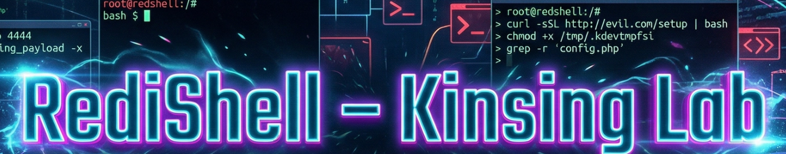

# RediShell - Kinsing Lab

# Context

**Lab link**: [https://cyberdefenders.org/blueteam-ctf-challenges/redishell-kinsing/](https://cyberdefenders.org/blueteam-ctf-challenges/redishell-kinsing/)

**Suggested tools**: Wireshark

**Tactics**: Initial Access, Execution, Privilege Escalation, Credential Access

# Scenario

Before the ransomware deployment, the attackers established initial access through a misconfigured CI/CD server running in a Docker container within Wowza's development network. Security monitoring detected unusual outbound connections from the container subnet to a suspicious external IP address. A packet capture was initiated automatically but was terminated when the attacker discovered and killed the monitoring process. Your task is to analyze this network traffic to understand how the attackers gained their initial foothold and moved laterally within the containerized environment.

# Initial Access & Reconnaissance

Q1- Security monitoring flagged suspicious HTTP traffic targeting the container subnet. Identifying the first system that received malicious requests is essential for establishing the initial point of compromise. What is the IP address of the first compromised system?

**Answer**: 172.16.10.10

**Explanation**: This is the first HTTP packet observed in the Wireshark timeline.

Q2- Identifying attacker IP is critical for threat intelligence and blocking future connections. What is the attacker's command and control (C2) IP address?

**Answer**: 185.220.101.50

**Explanation**: This is the external address initiating the first `GET` request to the container and matches the source seen in the previous step.

Q3- What web application and version was exploited for initial access?

**Answer**: Jenkins, 2.387.1

**Explanation**: Reviewing the same HTTP exchange shows the `X-Jenkins` response header, which identifies both the application name and version.

Q4- Before fully exploiting a vulnerability, attackers often perform a proof-of-concept test to confirm code execution capabilities. What file did the attacker initially read to test the vulnerability? (Provide full path)

**Answer**: /etc/passwd

**Explanation**: Within requests to the vulnerable Jenkins script console, the attacker attempts multiple payloads via the `/script` endpoint; the request that reads `/etc/passwd` stands out in the same packet sequence.

Q5- Identifying this vulnerable endpoint helps understand the attack vector and informs remediation efforts. What is the URI path of the vulnerable endpoint exploited by the attacker?

**Answer**: /script

**Explanation**: The malicious requests target the `/script` URI path, as shown in the same HTTP traffic.

# Execution

Q6- After confirming code execution, the attacker established a reverse shell connection back to their C2 infrastructure. What port number did the attacker use for the initial reverse shell listener?

**Answer**: 4444

**Explanation**: The conversation history highlights an interactive command session associated with a reverse shell; the destination port for that session indicates the listener port on the attacker’s C2 host.

# Discovery

Q7- Once inside the compromised container, the attacker uploaded a well-known enumeration script to identify privilege escalation vectors. What privilege escalation enumeration script did the attacker download after gaining shell access?

**Answer**: `linpeas`

**Explanation**: In the subsequent C2 conversation (port 2345), the attacker downloads and executes the `linpeas.sh` enumeration script.

# Credential Access

Q8- What file did the attacker read to obtain lateral movement credentials? (Provide full path)

**Answer**: `/var/jenkins_home/credentials.txt`

**Explanation**: The attacker uses standard shell commands to locate and read a file containing Telnet credentials in cleartext.

Q9- What username and password combination did the attacker use for authentication to the second system? (Format: username:password)

**Answer**: `redis_user:R3d1s_Us3r_P@ss!`

**Explanation**: This credential pair appears in the `linpeas` output and is subsequently used by the attacker to authenticate to the second system.

# Lateral Movement

Q10- The attacker used a legacy protocol to connect to the second target system. What unencrypted protocol did the attacker use for lateral movement?

**Answer**: Telnet

**Explanation**: The traffic shows a Telnet session (unencrypted), consistent with the authentication activity referenced in the prior step.

Q11- After successfully authenticating with harvested credentials, the attacker gained access to a second container in the environment. Identifying this system helps map the scope of the compromise. What is the IP address of the second compromised system?

**Answer**: 172.16.10.20

**Explanation**: This IP address is corroborated by Wireshark conversation history and by the second `linpeas` execution on the newly accessed container.

Q12- The Telnet login banner and subsequent enumeration revealed the hostname and the version of the data storage service running on the second compromised container. This information is crucial for identifying potential vulnerabilities. What is the hostname of the second compromised container and the version of the vulnerable data storage service? (Format: hostname, version)

**Answer**: redis-db.corp.local, 5.0.7

**Explanation**: The hostname and Redis version are visible in the Telnet login banner and are also reflected in the `linpeas` output collected from the second container.

# Privilege Escalation

Q13- After gaining user-level access to the second container, the attacker uploaded a custom exploit file targeting a vulnerability in the container's data storage service. What file did the attacker upload for privilege escalation on the second system?

**Answer**: `exploit.lua`

**Explanation**: The file name is observed in the attacker’s Telnet session activity during the privilege escalation attempt.

Q14- What is the full path of the SUID binary exploited for privilege escalation? #linux-uid

**Answer**: `/usr/local/bin/redis-backup`

**Explanation**: The subsequent commands in the same TCP stream show the attacker enumerating SUID executables and identifying `/usr/local/bin/redis-backup` as the target.

Q15- What was the first command the attacker executed after privilege escalation?

**Answer**: `whoami`

**Explanation**: The command immediately follows the privilege escalation step in the same session activity.

Q16- The Lua exploit file uploaded by the attacker targets a specific vulnerability in the Redis scripting subsystem. What CVE number is associated with the Redis Lua subsystem vulnerability used for privilege escalation?

**Answer**: CVE-2025-49844

**Explanation**: The CVE number associated with the critical Redis Lua subsystem vulnerability, also known as "RediShell," is CVE-2025-49844.  This Use-After-Free (UAF) bug allows authenticated users to execute arbitrary native code on the Redis host by escaping the Lua sandbox, carrying a CVSS score of 10.0 (Critical).  The vulnerability was patched by the Redis project on October 3, 2025.

# Use-After-Free (UAF) Vulnerability

A Use-After-Free (UAF) vulnerability occurs when a program frees a block of memory but retains a pointer to it, then later dereferences that "dangling pointer" — at this point, the memory may have been reallocated for a different purpose, so an attacker can strategically place malicious data in that reclaimed region, causing the program to treat attacker-controlled content as legitimate code or data structures, which can lead to arbitrary code execution, privilege escalation, or system crashes.

The risk here is that the **pointer carries the trust and context of its original privileged allocation**, so when the program dereferences it, it does so with the authority and assumptions of that original context; the memory contents only become the weapon *after* an attacker exploits that trusted pointer to smuggle in their own data, meaning the pointer is the vulnerability and the memory contents are just the payload delivery mechanism.

# Defense Evasion - Container Escape

Q17- With root access inside the container, the attacker's next objective was escaping to the underlying host system. What is the name of the script executed to escape from the container to the host system?

**Answer**: `escape.sh`

**Explanation**: Continuing the same Wireshark TCP stream reveals execution of a second script named `escape.sh`.

Q18- The container escape script established a new reverse shell connection to the attacker's C2 infrastructure. What port was used for the reverse shell connection after escaping the container?

**Answer**: 5555

**Explanation**: The subsequent network activity shows a new reverse shell connection; the destination port in that connection indicates the post-escape listener port.

Q19- What CVE number is associated with the container escape vulnerability?

**Answer**: CVE-2022-0492

**Explanation**: **CVE-2022-0492** (nicknamed "Carpediem") is a critical privilege escalation vulnerability in the Linux kernel's `cgroup` v1 subsystem that allows attackers to escape Docker or Kubernetes containers and gain `root` access on the host without requiring specific authorization capabilities like `CAP_SYS_ADMIN`.  First disclosed in February 2022, this flaw exploits the `release_agent` mechanism, enabling a container user to execute arbitrary binaries on the host by manipulating the `notify_on_release` and `release_agent` files within the `cgroup` hierarchy. 

# Persistence & Impact

Q20- After successfully escaping to the host system, the attacker created a file to document their access. What is the full path of the proof-of-compromise file created by the attacker on the host system?

**Answer**: `/tmp/you_have_been_hacked.txt`

**Explanation**: The file path is shown at the end of the `escape.sh` output, indicating creation of a proof-of-compromise artifact on the host.

Q21- To facilitate uploading additional tools to the compromised host, the attacker installed a Python-based HTTP server that supports file uploads. What server did the attacker install on the host system?

**Answer**: `uploadserver`

**Explanation**: `uploadserver` is built on top of Python’s built-in `http.server`, so it reports the `SimpleHTTP/0.6` server banner and can appear indistinguishable from `SimpleHTTPServer` based on that header alone. Because the package installation occurs over TLS (pip over TLS 1.3), the package name is not visible in the capture; however, other observable traffic indicates the use of an upload-capable HTTP server. It is visible however in the interleaved TCP stream details.

Q22- Using the upload server, the attacker transferred files necessary for installing a kernel-level rootkit, which would provide persistent, stealthy access to the compromised host. What files did the attacker upload to the host system for rootkit installation? (List all files, comma-separated)

**Answer**: kernel-rootkit.c, Makefile, install-rootkit.sh

**Explanation**: The Python-based HTTP upload server is used to transfer all three files required to build and install the rootkit. This activity is visible by filtering for `POST` requests to the host.

# Defense Evasion - Anti-Forensics

Q23- Before concluding their session, the attacker discovered that network traffic was being captured and took action to terminate the monitoring process. What is the full command executed by the attacker to terminate the network packet capture process?

**Answer**: kill -9 24918

**Explanation**: The command appears in the Wireshark TCP stream after the HTTP server installation. In the stream view, client keystrokes and server echoes are interleaved because both directions are rendered together, which is typical for interactive terminal sessions.

