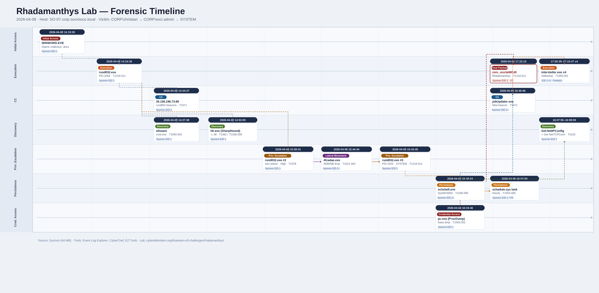

# Rhadamanthys Lab

<p align="center">
  
</p>

# Table of Contents
- [Context](#context)
- [Scenario](#scenario)
- [Initial Access](#initial-access)
- [Command and Control](#command-and-control)
- [Discovery](#discovery)
- [Privilege Escalation](#privilege-escalation)
- [Persistence](#persistence)
- [Discovery](#discovery-1)
- [Credential Access](#credential-access)
- [Execution](#execution)
  * [DLL Hijacking Decoupled from Export Resolution](#dll-hijacking-decoupled-from-export-resolution)
- [Attack Chain](#attack-chain)
  * [Text Tree](#text-tree)
- [Artifacts](#artifacts)
- [Lab Insights](#lab-insights)
- [Forensic Timeline](#forensic-timeline)

# Context

Lab link: [https://cyberdefenders.org/blueteam-ctf-challenges/rhadamanthys/](https://cyberdefenders.org/blueteam-ctf-challenges/rhadamanthys/)

Suggested tools: Event Log Explorer, , CyberChef, Timeline Explorer, Eric Zimmerman Tools

Tactics: Initial Access, Execution, Persistence, Privilege Escalation, Defense Evasion, Credential Access, Discovery, Command and Control

# Scenario

On 8 April 2026, a targeted social-engineering campaign tricked the user `christian` into executing a malicious document from the internet. Once the document was opened, it triggered remote code execution and kicked off a full attack chain through privilege escalation, persistence, LSASS dumping, and ultimately the Rhadamanthys Stealer. Because the beachhead host sits outside SIEM coverage, you have been provided with a disk image of the compromised machine to perform your analysis and reconstruct the attack.

# Initial Access

**Q1**- The attack started with a malicious document that the victim opened with Microsoft Word. What is the name of this malicious document?

Answer: `Copy of Beginning the Year Webinar-Reflection Questions.docx`

Reason: The attack began when victim Christian downloaded and opened a malicious document, `Copy of Beginning the Year Webinar-Reflection Questions.docx`, from his Downloads folder using Microsoft Word. This execution was captured in the host's Sysmon log under Event ID 1 (Process Creation), which recorded `WINWORD.EXE` launching at `2026-04-08 14:19:30 UTC` with `explorer.exe` as its parent process. This parent-child relationship is expected for user-initiated file launches, since `explorer.exe` is the Windows shell process responsible for handling double-clicks from File Explorer or the Downloads folder, and its presence as the parent confirms the document was opened through normal desktop interaction rather than a scripted or remote launch mechanism. This activity is consistent with MITRE Adversarial Tactics, Techniques, and Common Knowledge (ATT&CK) technique T1204 (User Execution), confirming the document was the initial access vector that started the rest of the attack chain.


**Q2**- Opening the malicious document triggered the execution of a child process. What is the name and PID of this process?

Answer: `rundll32.exe`, `2064`

Reason: Microsoft Word spawned `rundll32.exe` (PID `2064`) as a child process immediately after the malicious document loaded, confirmed via Sysmon Event ID 1 at `2026-04-08 14:24:36 UTC`, with its `ParentProcessGuid` matching the `WINWORD.EXE` process identified in the prior step. This establishes a direct parent-child link in the execution chain, indicating the document likely contained a macro or embedded object that triggered `rundll32.exe` rather than the user launching it manually. The use of `rundll32.exe`, a legitimate, signed Windows binary normally used to execute functions from Dynamic Link Library (DLL) files, to run attacker code aligns with MITRE Adversarial Tactics, Techniques, and Common Knowledge (ATT&CK) technique T1218.011 (Signed Binary Proxy Execution: Rundll32), a defense evasion technique that blends malicious execution into trusted system processes to evade detection.


# Command and Control

**Q3**- Opening the document file triggered a connection back to C2. What is the C2 IP Address

Answer: `35.158.196.73`

Reason: Approximately one second after launch, `rundll32.exe` initiated an outbound Transmission Control Protocol (TCP) network connection to `35.158.196.73` over port `80`, captured in Sysmon Event ID 3 (Network Connection) at `2026-04-08 14:24:37.898 UTC` under the same ProcessGuid `{c73af8d8-6524-69d6-7503-000000005600}` traced to the prior step. This confirms `rundll32.exe` itself, not a further spawned child process, was the one beaconing out to the attacker's command-and-control (C2) infrastructure, consistent with the T1218.011 `rundll32` proxy execution technique already established in this chain. The use of port `80` for this beacon also suggests an attempt to blend C2 traffic with ordinary web traffic, since outbound connections on this port are common in legitimate network activity and less likely to trigger alerts based on port number alone.


# Discovery

**Q4**- After gaining remote shell in victim machine, attacker started his malicious activity by some discovery commands, what's the first command executed and its time stamp?

Answer: `whoami`, `2026-04-08 14:27`

Reason: After establishing command-and-control (C2) connectivity, the attacker pivoted into a remote shell and began discovery activity by running `whoami` at `2026-04-08 14:27:38 UTC`, executed via `cmd.exe` spawned directly from the `rundll32.exe` process traced in the prior steps. This parent-child relationship confirms the shell access rode on the same C2 channel rather than a separate foothold, since the attacker reused the existing `rundll32.exe` process as a launching point instead of establishing a new initial access vector. The `whoami` command itself is a basic reconnaissance technique used to enumerate the current user context, aligning with MITRE Adversarial Tactics, Techniques, and Common Knowledge (ATT&CK) technique T1059.003 (Command and Scripting Interpreter: Windows Command Shell) under the broader Discovery tactic, where T1033 (System Owner/User Discovery) would also apply to this specific command's intent.


**Q5**- After executing some reconnaissance, threat actor dropped and executed malicious file to perform intensive enumeration, what's the full path of this tool, and it's original file name?

Answer: `C:\Users\christian\AppData\Roaming\Microsoft\Windows\Themes\hh.exe`, `SharpHound.exe`

Reason: The attacker dropped a renamed copy of SharpHound, Active Directory enumeration tooling, to `C:\Users\christian\AppData\Roaming\Microsoft\Windows\Themes\hh.exe`, disguising it as a benign system theme file while its internal metadata still identified it as `SharpHound.exe` version `2.11.0` by SpecterOps. This file path choice is a deliberate masquerading attempt, since the Themes directory is rarely scrutinized and the generic `hh.exe` name blends in with legitimate Windows components, even though the binary's embedded version information was not modified to match. It was executed at `2026-04-08 14:53:05 UTC` directly from `rundll32.exe` (ProcessGuid `{c73af8d8-6524-69d6-7503-000000005600}`), confirming the command-and-control (C2) implant, not the earlier `cmd.exe` discovery thread, was responsible for launching this intensive domain enumeration tool. SharpHound itself is built to map Active Directory trust relationships, group memberships, and permissions for attack path analysis, which goes beyond the technique cited: T1083 (File and Directory Discovery) covers local filesystem enumeration, while this activity more accurately maps to T1087.002 (Account Discovery: Domain Account) and T1482 (Domain Trust Discovery), with T1036.005 (Masquerading: Match Legitimate Name or Location) applying to the renamed file itself.


# Privilege Escalation

**Q6**- After completing enumeration successfully. The attacker escalated privileges by spawning a new rundll32.exe process running with administrative rights, giving them an elevated foothold on the host. When did this first malicious privileged rundll32.exe process run?

Answer: `2026-04-08 15:08`

Reason: At `2026-04-08 15:08:41 UTC`, a second `rundll32.exe` process (PID `2564`) spawned from the original C2 `rundll32.exe` process, but this time running under a different, privileged account, `CORP\soci.admin`, with an integrity level of High instead of Medium. This indicates the attacker successfully escalated from the standard user `christian` to an administrative account, giving the implant elevated rights on the host while reusing the same payload, confirmed by identical file hashes between the original and new `rundll32.exe` instances. The jump in integrity level alongside the account change is the more significant indicator here, since a process running as a different user without an integrity-level escalation would only suggest token impersonation or `RunAs`-style execution, whereas the High integrity level confirms the new process is actually operating with administrative privileges on the host rather than merely presenting a different username. This activity is consistent with continued use of T1218.011 (Signed Binary Proxy Execution: Rundll32), now occurring at elevated privilege, though the privilege escalation itself, however it was obtained (credential theft, token manipulation, or similar) would map to a separate Privilege Escalation tactic technique once the specific mechanism is identified.


**Q7**- During privilege escalation, the attacker dropped a binary onto a share to spawn additional `rundll32.exe` processes for later post-exploitation activity. What is the full path of this binary?

Answer: `\\127.0.0.1\ADMIN$\4fcadae.exe`

Reason: This confirms a PsExec-style service-based execution model for the privilege escalation observed in the prior step. Because PsExec's file-copy step occurs entirely within the SMB protocol layer rather than through a discrete local process, Sysmon alone cannot identify the specific initiating session behind it. Attribution of that session would require correlating `Security.evtx` Event ID 4624 (Logon Type 3, Network) and Event ID 5145 (`ADMIN$` share access) around the same timestamp, which is out of scope for this pass given the log's size, but represents the logical next pivot once that log is available.

This also reframes the privilege escalation mechanism from the previous step: rather than credential theft or token manipulation, the elevated `rundll32.exe` instance running as `CORP\soci.admin` is best explained by the attacker using compromised admin credentials to push the payload via the `ADMIN$` share and execute it as a service, which maps to T1021.002 (Remote Services: SMB/Windows Admin Shares) for the lateral movement mechanism and T1569.002 (System Services: Service Execution) for the PsExec-style launch, alongside the T1078 (Valid Accounts) tactic for use of the `soci.admin` credentials themselves.


# Persistence

**Q8**- After elevating privileges, the attacker dropped a persistence binary into a system directory, a location only writable from a SYSTEM-level context. What is the full path of this file?

Answer: `C:\Windows\SysWOW64\schshell.exe`

Reason: Following SYSTEM-level escalation achieved via the PsExec-style `4fcadae.exe` drop, the resulting SYSTEM-integrity `rundll32.exe` process (PID `2204`) used its elevated context to write a new persistence binary, `C:\Windows\SysWOW64\schshell.exe`, to disk at `2026-04-08 15:48:34 UTC`. This was captured in Sysmon Event ID 11 (`FileCreate`) under the same ProcessGuid traced back through the entire privilege escalation chain, confirming the SYSTEM-context C2 thread, not a separate process, was responsible for staging this persistence mechanism. The choice of `SysWOW64` and a name suggestive of a scheduled task or shell utility (`schshell.exe`) is itself a masquerading attempt, since binaries dropped here are often assumed to be legitimate 32-bit Windows components, which would warrant a T1036.005 (Masquerading: Match Legitimate Name or Location) tag alongside whichever persistence technique is confirmed.


**Q9**- The attacker registered a scheduled task that re-launches the persistence binary at regular intervals. What is the name of this task?

Answer: `schadule.sys`

Reason: To maintain persistence, the SYSTEM-level `schshell.exe` binary (PID `9668`) spawned a PowerShell process at `2026-04-08 16:07:50 UTC` running an obfuscated Base64-encoded command, which decoded to `schtasks /create /tn "schadule.sys" /tr "C:\Windows\system32\schshell.exe" /sc hourly`. This registers a Scheduled Task named `schadule.sys`, a typo-squatted name mimicking a legitimate system file, to relaunch the persistence binary every hour, consistent with MITRE Adversarial Tactics, Techniques, and Common Knowledge (ATT&CK) technique T1053.005 (Scheduled Task/Job: Scheduled Task) and T1027 (Obfuscated Files or Information) for the encoded command itself. This resolves the ambiguity flagged in the prior step regarding `schshell.exe`'s persistence mechanism, confirming it as a Scheduled Task rather than a hijacked execution flow or modified system process.

```powershell
powershell -nop -exec bypass -EncodedCommand cwBjAGgAdABhAHMAawBzACAALwBjAHIAZQBhAHQAZQAgAC8AdABuACAAIgBzAGMAaABhAGQAdQBsAGUALgBzAHkAcwAiACAALwB0AHIAIAAiAEMAOgBcAFcAaQBuAGQAbwB3AHMAXABzAHkAcwB0AGUAbQAzADIAXABzAGMAaABzAGgAZQBsAGwALgBlAHgAZQAiACAALwBzAGMAIABoAG8AdQByAGwAeQA=

schtasks /create /tn "schadule.sys" /tr "C:\Windows\system32\schshell.exe" /sc hourly
```


# Discovery

**Q10**- Threat actor started a second phase of discovery, what is the 2 Powershell cmdlets used by threat actor in network discovery?

Answer: `Get-NetIPConfiguration`, `Get-NetTCPConnection`

Reason: Following the establishment of the `schadule.sys` scheduled task persistence, the attacker launched a second wave of discovery from the same SYSTEM-context `schshell.exe` process (PID `9668`), executing two Base64-encoded PowerShell commands roughly ten seconds apart. The first, `Get-NetIPConfiguration | Format-Table InterfaceAlias, InterfaceDescription, IPv4Address, IPv4DefaultGateway, DNSServer -AutoSize` at `16:07:55 UTC`, enumerated the host's network interface and routing configuration. The second, `Get-NetTCPConnection -State Established | Select-Object LocalAddress, LocalPort, RemoteAddress, RemotePort, @{Name="ProcessName";...}` at `16:08:05 UTC`, mapped active established TCP connections back to their owning process names. Together these give the attacker visibility into the host's network topology and live connections, useful for identifying additional pivot targets or other security tooling running on the box, consistent with MITRE Adversarial Tactics, Techniques, and Common Knowledge (ATT&CK) techniques T1016 (System Network Configuration Discovery) and T1049 (System Network Connections Discovery).

```powershell
powershell -nop -exec bypass -EncodedCommand RwBlAHQALQBOAGUAdABJAFAAQwBvAG4AZgBpAGcAdQByAGEAdABpAG8AbgAgAHwAIABGAG8AcgBtAGEAdAAtAFQAYQBiAGwAZQAgAEkAbgB0AGUAcgBmAGEAYwBlAEEAbABpAGEAcwAsACAASQBuAHQAZQByAGYAYQBjAGUARABlAHMAYwByAGkAcAB0AGkAbwBuACwAIABJAFAAdgA0AEEAZABkAHIAZQBzAHMALAAgAEkAUAB2ADQARABlAGYAYQB1AGwAdABHAGEAdABlAHcAYQB5ACwAIABEAE4AUwBTAGUAcgB2AGUAcgAgAC0AQQB1AHQAbwBTAGkAegBlAA==
-> Get-NetIPConfiguration | Format-Table InterfaceAlias, InterfaceDescription, IPv4Address, IPv4DefaultGateway, DNSServer -AutoSize

powershell -nop -exec bypass -EncodedCommand RwBlAHQALQBOAGUAdABUAEMAUABDAG8AbgBuAGUAYwB0AGkAbwBuACAALQBTAHQAYQB0AGUAIABFAHMAdABhAGIAbABpAHMAaABlAGQAIAB8ACAAUwBlAGwAZQBjAHQALQBPAGIAagBlAGMAdAAgAEwAbwBjAGEAbABBAGQAZAByAGUAcwBzACwAIABMAG8AYwBhAGwAUABvAHIAdAAsACAAUgBlAG0AbwB0AGUAQQBkAGQAcgBlAHMAcwAsACAAUgBlAG0AbwB0AGUAUABvAHIAdAAsACAAQAB7AE4AYQBtAGUAPQAiAFAAcgBvAGMAZQBzAHMATgBhAG0AZQAiADsARQB4AHAAcgBlAHMAcwBpAG8AbgA9AHsAKABHAGUAdAAtAFAAcgBvAGMAZQBzAHMAIAAtAEkAZAAgACQAXwAuAE8AdwBuAGkAbgBnAFAAcgBvAGMAZQBzAHMAKQAuAFAAcgBvAGMAZQBzAHMATgBhAG0AZQB9AH0A
-> Get-NetTCPConnection -State Established | Select-Object LocalAddress, LocalPort, RemoteAddress, RemotePort, @{Name="ProcessName";Expression={(Get-Process -Id $_.OwningProcess).ProcessName}}
```


# Credential Access

**Q11**- During Credential Access, the actor targeted LSASS memory. The threat actor dropped a known system admin tool to dump the `lsass`. What's the original tool name used, and what's the file that stores the output?

Answer: `procdump`, `lsass.dmp`

Reason: To dump credentials from memory, the SYSTEM-context `schshell.exe` process spawned a renamed copy of Sysinternals' legitimate `procdump.exe`, disguised as `C:\Windows\System32\pc.exe`, at `2026-04-08 16:15:46 UTC`. Despite the renamed filename, both the binary's internal metadata (OriginalFileName: `procdump`, Product: ProcDump, Company: Sysinternals) and an independent SHA256 hash lookup on VirusTotal confirmed it as the legitimate, unmodified ProcDump utility, a classic Living-Off-the-Land Binary (LOLBin) abuse case, since the tool itself isn't malicious but is repurposed here for credential theft rather than its intended diagnostic use. It was executed with `-accepteula -ma lsass.exe lsass.dmp`, performing a full memory dump (`-ma`) of the `lsass.exe` process and writing the output to `lsass.dmp`. The Local Security Authority Subsystem Service (LSASS) process holds cached credentials, password hashes, and Kerberos tickets in memory, making a full dump of it a high-value target capable of yielding domain credentials for further lateral movement, consistent with MITRE Adversarial Tactics, Techniques, and Common Knowledge (ATT&CK) technique T1003.001 (OS Credential Dumping: LSASS Memory), with T1036.003 (Masquerading: Rename System Utilities) applying to the `pc.exe` rename itself.


**Q12**- The LSASS dumping binary was renamed before it was executed against lsass.exe. What's the file path of this `lsass` dumper tool?

Answer: `C:\Windows\System32\pc.exe`

Reason: The attacker renamed the legitimate Sysinternals ProcDump utility to `pc.exe` and placed it at `C:\Windows\System32\pc.exe` before executing it against lsass.exe, as established in Q11, which is a simple but effective renaming evasion tactic intended to defeat naïve filename-based detection rules while leaving the tool's actual functionality and internal metadata (and hash) unchanged, consistent with MITRE technique T1036.003 (Masquerading: Rename System Utilities).

Command and Control

**Q13**- After credential dumping, the attacker used the persistence executable to deploy [what] new client beacon to continue command-and-control?

Answer: `jobUpdater.exe`

Reason: After dumping LSASS credentials, the SYSTEM-context `schshell.exe` process deployed a new client beacon, `C:\Program Files\jobUpdater.exe`, written to disk at `2026-04-08 16:45:46 UTC`. Rather than communicating directly over the network itself, `jobUpdater.exe` operates as a process-hollowing loader, repeatedly spawning a short-lived child process, `intersteller.exe`, in `C:\Users\soci.admin\AppData\Local\Temp\`, injecting code into it with full access rights (`0x1fffff`), and terminating it within one to two seconds — a cycle observed four times at `17:00:39`, `17:03:23`, `17:07:23`, and `17:15:47 UTC`. The conspicuous absence of Sysmon Event ID 3 (Network Connection) tied to either process is explained by the lifecycle of each hollowed instance being too short to establish a logged TCP session, strongly suggesting actual command-and-control (C2) communication rides on the long-lived parent `jobUpdater.exe` instead of the disposable shells — a beaconing and jitter pattern inferred entirely from process lifecycle telemetry in the absence of direct network evidence. This maps to T1055.001 (Process Injection: DLL Injection) for the spawn-inject-terminate pattern, T1036 (Masquerading) for the benign-sounding binary names, and T1071 (Application Layer Protocol) as a candidate for the parent's C2 channel pending network evidence.

```powershell
Information	4/8/2026	5:00:39 PM	1	Microsoft-Windows-Sysmon	(1)	\SYSTEM	SO-07.corp.socivioco.local
Information	4/8/2026	5:00:40 PM	5	Microsoft-Windows-Sysmon	(5)	\SYSTEM	SO-07.corp.socivioco.local
Information	4/8/2026	5:03:23 PM	1	Microsoft-Windows-Sysmon	(1)	\SYSTEM	SO-07.corp.socivioco.local
Information	4/8/2026	5:03:24 PM	5	Microsoft-Windows-Sysmon	(5)	\SYSTEM	SO-07.corp.socivioco.local
Information	4/8/2026	5:07:23 PM	1	Microsoft-Windows-Sysmon	(1)	\SYSTEM	SO-07.corp.socivioco.local
Information	4/8/2026	5:07:24 PM	5	Microsoft-Windows-Sysmon	(5)	\SYSTEM	SO-07.corp.socivioco.local
Information	4/8/2026	5:15:47 PM	1	Microsoft-Windows-Sysmon	(1)	\SYSTEM	SO-07.corp.socivioco.local
Information	4/8/2026	5:15:48 PM	5	Microsoft-Windows-Sysmon	(5)	\SYSTEM	SO-07.corp.socivioco.local
```

# Execution

**Q14**- The process in the previous question started another process, which is the child process path?

Answer: `C:\Users\soci.admin\AppData\Local\Temp\intersteller.exe`

Reason: This step documents the first observed instance of the process-hollowing cycle identified in the prior step. `jobUpdater.exe` (PID `2840`) spawned `intersteller.exe` (PID `11536`) at `C:\Users\soci.admin\AppData\Local\Temp\` at `2026-04-08 17:00:39 UTC`, consistent with the spawn-inject-terminate pattern already established. No new behavioral indicators emerge here beyond confirming the cycle's first iteration; the analytical weight remains on the parent `jobUpdater.exe` as the persistent C2 loader rather than the short-lived injected shell. T1036 (Masquerading) applies to the benign-sounding process names, with T1055.001 (Process Injection: DLL Injection) covering the injection mechanism confirmed in the prior step.


**Q15**- What's the SHA256 hash of the child process?

Answer: `AF04EE03D69A7962FA5350D0DF00FAFC4AE85A07DFF32F99F0D8D63900A47466`

Reason: The `intersteller.exe` child process carries a SHA256 hash of `AF04EE03D69A7962FA5350D0DF00FAFC4AE85A07DFF32F99F0D8D63900A47466`, captured directly from its Sysmon Event ID 1 process creation record alongside its SHA1 and MD5 equivalents — a consistent hash across all four observed spawn/inject/terminate cycles, confirming the same binary was reused each time rather than a freshly generated payload per cycle.

**Q16**- The last dropped file, flagged as a Rhadamanthys-family sample, was executed repeatedly during this phase. Using Windows execution artifacts, how many times was this file executed?

Answer: 4

Reason: `intersteller.exe` was executed four times during the process-hollowing phase, confirmed by four Sysmon Event ID 1 (Process Creation) entries at `17:00:39`, `17:03:23`, `17:07:23`, and `17:15:47 UTC`, each immediately followed by an Event ID 5 (Process Terminated) within one to two seconds — consistent with the injection cycle already established. These Sysmon counts are independently corroborable via the file's Prefetch artifact (`INTERSTELLER.EXE-{hash}.pf`), which records both a run count and last-execution timestamps as a Windows execution artifact, providing a second evidentiary source without requiring additional log correlation. The Prefetch run count matching four would strengthen attribution confidence in the absence of complete Sysmon coverage, and any divergence between the two counts would indicate executions that occurred outside the Sysmon logging window.

```bash
Event ID: 1 + 5 (x4 pairs)
Process: intersteller.exe
Execution Timestamps: 17:00:39, 17:03:23, 17:07:23, 17:15:47 UTC
Lifetime per instance: ~1–2 seconds
Corroborating Artifact: Prefetch — INTERSTELLER.EXE-{hash}.pf
```

```powershell
Information	4/8/2026	5:00:39 PM	1	Microsoft-Windows-Sysmon	(1)	\SYSTEM	SO-07.corp.socivioco.local
Information	4/8/2026	5:00:40 PM	5	Microsoft-Windows-Sysmon	(5)	\SYSTEM	SO-07.corp.socivioco.local
Information	4/8/2026	5:03:23 PM	1	Microsoft-Windows-Sysmon	(1)	\SYSTEM	SO-07.corp.socivioco.local
Information	4/8/2026	5:03:24 PM	5	Microsoft-Windows-Sysmon	(5)	\SYSTEM	SO-07.corp.socivioco.local
Information	4/8/2026	5:07:23 PM	1	Microsoft-Windows-Sysmon	(1)	\SYSTEM	SO-07.corp.socivioco.local
Information	4/8/2026	5:07:24 PM	5	Microsoft-Windows-Sysmon	(5)	\SYSTEM	SO-07.corp.socivioco.local
Information	4/8/2026	5:15:47 PM	1	Microsoft-Windows-Sysmon	(1)	\SYSTEM	SO-07.corp.socivioco.local
Information	4/8/2026	5:15:48 PM	5	Microsoft-Windows-Sysmon	(5)	\SYSTEM	SO-07.corp.socivioco.local
```

**Q17**- For threat-intelligence enrichment of the Rhadamanthys Loader sample, look up its hash on VirusTotal. What is the Compilation Timestamp of this malware, and the First Seen In The Wild date?

Answer: `2022-08-22 14:14`, `2023-01-04 15:16`

Reason: A VirusTotal lookup on the `intersteller.exe` sample's SHA256 hash (`AF04EE03D69A7962FA5350D0DF00FAFC4AE85A07DFF32F99F0D8D63900A47466`) returned threat-intelligence enrichment confirming its identity as a Rhadamanthys Loader sample, with a PE Compilation Timestamp of `2022-08-22 14:14` and a First Seen In The Wild date of `2023-01-04 15:16` — indicating the malware binary itself is a known, previously catalogued sample rather than a custom one-off build, and that it predates this incident by roughly three years, consistent with reuse of established off-the-shelf malware infrastructure rather than bespoke tooling.

**Q18**- The repeated executions of the Rhadamanthys Loader suggest it was retrying to fetch its next-stage payload. Some time later, the actual Rhadamanthys Stealer DLL appeared on the host and was executed. What is the path of this last dropped file?

Answer: `C:\Users\soci.admin\AppData\Roaming\nsis_uns3a98f.dll`

Reason: Following the final terminated `intersteller.exe` retry cycle, `schshell.exe` spawned a PowerShell process at `2026-04-08 17:22:06 UTC` running a Base64-encoded command that decoded to `C:\Windows\system32\rundll32.exe "C:\Users\soci.admin\AppData\Roaming\nsis_uns3a98f.dll",PrintUIEntry`. Seconds later at `17:22:10 UTC`, `rundll32.exe` (PID `988`) executed accordingly, loading the `PrintUIEntry` export from the staged DLL. The filename `nsis_uns3a98f.dll` masquerades as a leftover NSIS installer artifact, a plausible enough name in a user's AppData directory to avoid casual scrutiny, while `PrintUIEntry` is a legitimate Windows Print UI export repurposed here as a generic DLL entry point — a pattern that bypasses application allowlisting controls that permit `rundll32.exe` without inspecting what DLL it loads. This represents successful delivery of the Rhadamanthys Stealer payload after the loader's repeated failed fetch attempts, consistent with T1218.011 (Signed Binary Proxy Execution: Rundll32) and T1036.005 (Masquerading: Match Legitimate Name or Location).

```powershell
powershell -nop -exec bypass -EncodedCommand QwA6AFwAVwBpAG4AZABvAHcAcwBcAHMAeQBzAHQAZQBtADMAMgBcAHIAdQBuAGQAbABsADMAMgAuAGUAeABlACAAIgBDADoAXABVAHMAZQByAHMAXABzAG8AYwBpAC4AYQBkAG0AaQBuAFwAQQBwAHAARABhAHQAYQBcAFIAbwBhAG0AaQBuAGcAXABuAHMAaQBzAF8AdQBuAHMAMwBhADkAOABmAC4AZABsAGwAIgAsAFAAcgBpAG4AdABVAEkARQBuAHQAcgB5AA==

C:\Windows\system32\rundll32.exe "C:\Users\soci.admin\AppData\Roaming\nsis_uns3a98f.dll",PrintUIEntry
```


## DLL Hijacking Decoupled from Export Resolution

The attacker leverages the fact that DLL loading and export invocation are two discrete steps in `rundll32.exe`'s execution model — and the payload only needs the first.

`rundll32.exe` loads the DLL into process memory, which triggers `DllMain` automatically. Only after that does it attempt to locate the named export via `GetProcAddress`. By the time that call fails on a non-existent export, the payload has already executed. The export name on the command line is purely cosmetic — a plausible-looking string to make the invocation appear legitimate to anyone inspecting process telemetry.

**The security architecture implication:** command-line telemetry alone is insufficient detection coverage. A defender inspecting only the `rundll32.exe` command line sees a routine-looking Print UI invocation. The actual signal lives in the DLL itself — its path (user-writable AppData), its name (fake NSIS artifact), and its export table. This is why mature EDR stacks instrument `DllMain` entry and image-load events (Sysmon Event ID 7, `ImageLoad`) in addition to process creation: process telemetry captures the loader; image-load telemetry captures what the loader actually pulled in.

**To confirm which execution path applied** — malicious `PrintUIEntry` export vs. `DllMain`-only payload — inspect the DLL's export table via `dumpbin /exports` or PEStudio. Sysmon telemetry alone cannot resolve this distinction.

**Q19**- What's the SHA256 hash of this file on dropped on system

Answer: `92a7c3296a561fb39798f821173e69d1feff44ff3a84caa4c6bb890945e79488`

Reason: The final dropped Rhadamanthys Stealer DLL, `nsis_uns3a98f.dll`, carries a SHA256 hash of `92A7C3296A561FB39798F821173E69D1FEFF44FF3A84CAA4C6BB890945E79488`, computed directly from the file on disk using `Get-FileHash` against the KAPE-collected artifact — providing a definitive, file-level identifier for this payload independent of the process execution telemetry already gathered, and ready for further threat-intel enrichment or IOC sharing.

```powershell
PS C:\Users\Administrator\Desktop\Start Here\Artifacts\SO-07_Disk\C\Users\soci.admin\AppData\Roaming> Get-FileHash .\nsis_uns3a98f.dll

Algorithm       Hash                                                                   Path
---------       ----                                                                   ----
SHA256          92A7C3296A561FB39798F821173E69D1FEFF44FF3A84CAA4C6BB890945E79488       C:\Users\Administrator\Desktop\Start Here\Artifacts\SO-07_Disk\C\Users\soci.admin\AppData\Roaming\nsis_uns3a98f.dll
```

**Q20**- The final stealer DLL was invoked through rundll32.exe with an exported function name. What's the command line that tried execute this file?

Answer: `"C:\Windows\system32\rundll32.exe" C:\Users\soci.admin\AppData\Roaming\nsis_uns3a98f.dll,PrintUIEntry`

Reason: The final-stage Rhadamanthys Stealer DLL was invoked via `rundll32.exe` with the command line `"C:\Windows\system32\rundll32.exe" C:\Users\soci.admin\AppData\Roaming\nsis_uns3a98f.dll,PrintUIEntry`, captured in Sysmon Event ID 1 at `2026-04-08 17:22:10.804 UTC`. This closes out the attack chain with the actual stealer payload now running inside a trusted, signed `rundll32.exe` process — the same T1218.011 (Signed Binary Proxy Execution: Rundll32) mechanism used at initial execution, privilege escalation, and final payload delivery, demonstrating consistent reliance on a single trusted Windows binary across the entire intrusion to avoid spawning obviously malicious processes. The bookending of the attack chain with the same technique at both entry and payload delivery is itself a tradecraft signal worth noting: it suggests a mature, tooling-consistent operator rather than ad hoc execution.


# Attack Chain

| Time (UTC) | Stage | Detail | MITRE |
| --- | --- | --- | --- |
| 2026-04-08 14:19:30 | Initial Access | `christian` opens malicious doc `Copy of Beginning the Year Webinar-Reflection Questions.docx` via `WINWORD.EXE` | T1204 |
| 2026-04-08 14:24:36 | Execution | `WINWORD.EXE` spawns `rundll32.exe` (PID 2064) | T1218.011 |
| 2026-04-08 14:24:37 | C2 | `rundll32.exe` beacons to `35.158.196.73:80` | T1071 |
| 2026-04-08 14:27:38 | Discovery | `whoami` executed via `cmd.exe` | T1059.003 |
| 2026-04-08 14:53:05 | Discovery | SharpHound dropped/renamed as `hh.exe`, run with `-c All` | T1083 |
| 2026-04-08 15:08:41 | Privilege Escalation | Second `rundll32.exe` spawned as `soci.admin`, High integrity | T1078 |
| 2026-04-08 15:44:44 | Lateral Movement / Privesc | `4fcadae.exe` dropped via `\\127.0.0.1\ADMIN$\`, service `4fcadae` created | T1021.002, T1569.002 |
| 2026-04-08 15:44:45 | Privilege Escalation | SYSTEM-integrity `rundll32.exe` (PID 2204) spawned from `4fcadae.exe` | T1218.011 |
| 2026-04-08 15:48:34 | Persistence | `schshell.exe` written to `C:\Windows\SysWOW64\` | T1036 |
| 2026-04-08 16:07:50 | Persistence | Scheduled task `schadule.sys` created, hourly re-launch of `schshell.exe` | T1053.005, T1027 |
| 2026-04-08 16:07:55–16:08:05 | Discovery | `Get-NetIPConfiguration`, `Get-NetTCPConnection` executed | T1016, T1049 |
| 2026-04-08 16:15:46 | Credential Access | Renamed ProcDump (`pc.exe`) dumps LSASS to `lsass.dmp` | T1003.001 |
| 2026-04-08 16:45:46 | Command and Control | New beacon `jobUpdater.exe` dropped to `C:\Program Files\` | T1071 |
| 2026-04-08 17:00:39–17:15:47 | Command and Control | `jobUpdater.exe` hollows `intersteller.exe` (Rhadamanthys Loader) ×4, no independent C2 | T1055.001, T1036 |
| 2026-04-08 17:22:06–17:22:10 | Execution | `rundll32.exe` loads final stealer DLL `nsis_uns3a98f.dll` via `PrintUIEntry` | T1218.011 |

## Text Tree

```powershell
[Initial Access] WINWORD.EXE opens malicious .docx (14:19:30)
└── [Execution] rundll32.exe spawned (PID 2064) (14:24:36)
    ├── [C2] beacon → 35[.]158.196.73:80 ← persistent channel, reused later
    ├── [Discovery] cmd.exe → whoami (14:27:38)
    ├── [Discovery] hh.exe (SharpHound) -c All (14:53:05) ← masquerading as theme file
    └── [Privilege Escalation] rundll32.exe #2 spawned as soci.admin, High integrity (15:08:41)
        └── [Lateral Movement] 4fcadae.exe dropped via \\127.0.0.1\ADMIN$\ (15:44:44) ← PsExec-style, service "4fcadae"
            └── [Privilege Escalation] rundll32.exe #3 (PID 2204) SYSTEM integrity (15:44:45)
                ├── [Persistence] schshell.exe written to SysWOW64 (15:48:34)
                │   ├── [Persistence] schtasks "schadule.sys" hourly (16:07:50)
                │   ├── [Discovery] Get-NetIPConfiguration / Get-NetTCPConnection (16:07:55-16:08:05)
                │   ├── [Credential Access] pc.exe (renamed ProcDump) → lsass.dmp (16:15:46)
                │   └── [C2] schshell.exe own beacon → 35[.]158.196.73:80 ← TRUE persistent C2 (~19k Event 3 entries)
                └── [C2] jobUpdater.exe dropped to Program Files (16:45:46)
                    └── [Defense Evasion] jobUpdater.exe hollows intersteller.exe x4 (17:00-17:15) ← Rhadamanthys Loader, no own network
                        └── [Execution] rundll32.exe loads nsis_uns3a98f.dll via PrintUIEntry (17:22:10) ← Rhadamanthys Stealer final payload
```

# Artifacts

**Files**

| Type | Value |
| --- | --- |
| Initial Lure | `Copy of Beginning the Year Webinar-Reflection Questions.docx` |
| Discovery Tool | `C:\Users\christian\AppData\Roaming\Microsoft\Windows\Themes\hh.exe` (SharpHound) |
| Lateral Movement Binary | `\\127.0.0.1\ADMIN$\4fcadae.exe` |
| Persistence Binary | `C:\Windows\SysWOW64\schshell.exe` |
| Credential Dumper | `C:\Windows\System32\pc.exe` (ProcDump) |
| Credential Output | `lsass.dmp` |
| Secondary Beacon | `C:\Program Files\jobUpdater.exe` |
| Rhadamanthys Loader | `C:\Users\soci.admin\AppData\Local\Temp\intersteller.exe` |
| Rhadamanthys Stealer | `C:\Users\soci.admin\AppData\Roaming\nsis_uns3a98f.dll` |

**Hashes (SHA256)**

| Type | Value |
| --- | --- |
| Original rundll32 implant | `39E95C2A08AD00B25573365D9E2DB13FF28B905D4E3C836602B7E0E1F07A07C5` |
| 4fcadae.exe | `BB1155C0EF9F83CB574902B198EC5514CCAE483353257A75740074C8E9F4821B` |
| schshell.exe | `9785001B0DCF755EDDB8AF294A373C0B87B2498660F724E76C4D53F9C217C7A3` |
| pc.exe (ProcDump) | `0983C50ECBB29E08A8629E7C2D68E85DD9D9CC39C59DDB919B427DAACE698682` |
| intersteller.exe | `AF04EE03D69A7962FA5350D0DF00FAFC4AE85A07DFF32F99F0D8D63900A47466` |
| nsis_uns3a98f.dll | `92A7C3296A561FB39798F821173E69D1FEFF44FF3A84CAA4C6BB890945E79488` |

**Network**

| Type | Value |
| --- | --- |
| C2 IP:Port | `35.158.196.73:80` |
| Victim Host IP | `10.10.11.218` |
| Compromised Accounts | `CORP\christian`, `CORP\soci.admin` |
| Scheduled Task | `schadule.sys` (hourly) |

# Lab Insights

- Sysmon was the entire backbone of this investigation — Security.evtx at 3.3GB was never touched; every pivot (ProcessGuid chaining, FileCreate, RegistryEvent, ProcessTampering, PipeEvent, ProcessAccess, DNS) came from the 64MB Sysmon log alone, proving how much value a well-tuned Sysmon config delivers over raw Windows auditing at scale.
- rundll32.exe as a recurring proxy-execution vehicle, not a one-off — the same trusted binary was reused at every privilege tier (Medium → High → SYSTEM) across the entire chain, showing how a single LOLBin choice can carry an actor from initial foothold through to final payload delivery.
- Artifact "orphans" are a feature of network-mediated actions, not an investigative gap — the PID 4 / System FileCreate event for the ADMIN$ drop has no local process to pivot to because SMB writes are handled by the kernel; recognizing that boundary (rather than chasing a non-existent local process) is itself a forensic skill.
- Absence of evidence required its own investigative path — zero Event ID 3 entries for jobUpdater.exe/intersteller.exe wasn't a dead end; correlating it against the process hollowing cycle (10→1→7→5, repeated, sub-2-second lifetimes) explained the gap and redirected to the real C2 owner (schshell.exe), reinforcing that absence of a given event type is itself diagnostic.
- One C2 IP threaded the entire intrusion — 35[.]158.196.73:80 first appeared at initial rundll32 execution and was still the active channel at final stealer deployment, underscoring that a single C2 endpoint can persist invisibly behind multiple unrelated-looking child processes and beacons.
- Credential-file hunting (unattend.xml/sysprep) as an unconfirmed but consistent privesc hypothesis — not directly observed executing, but its presence alongside a subsequent admin-tier logon is a pattern worth flagging even without full causal proof.

# Forensic Timeline

