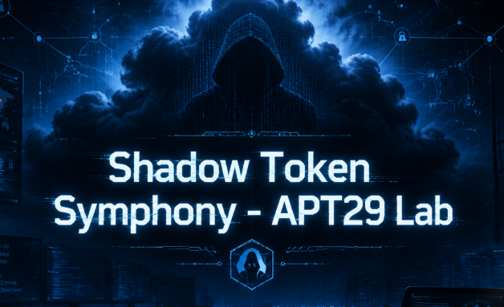
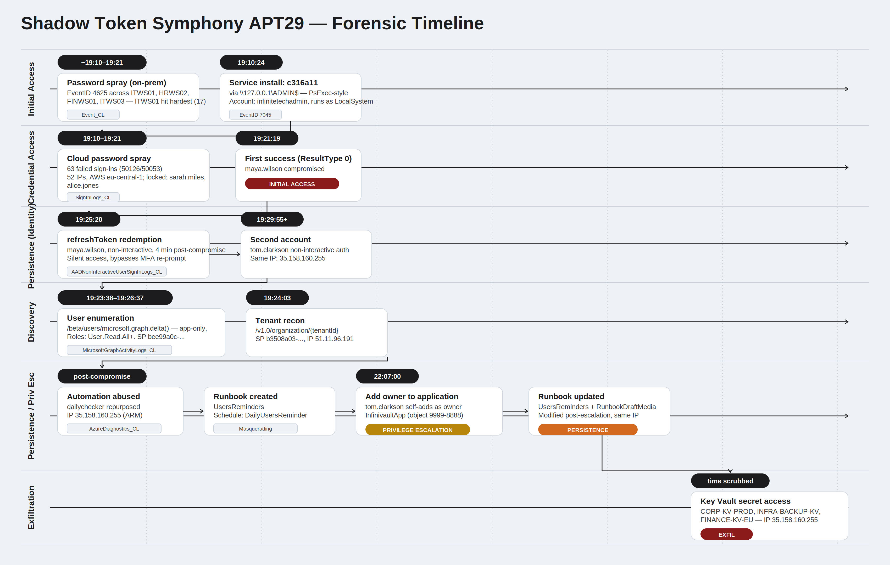

# Shadow Token Symphony - APT29 Lab

<p align="center">
  
</p>

# Table of Contents
- [Context](#context)
- [Scenario](#scenario)
- [Initial Reconnaissance and Machine Compromise](#initial-reconnaissance-and-machine-compromise)
- [Password Spray Attack Detection and Analysis](#password-spray-attack-detection-and-analysis)
- [Token Manipulation and Authentication Persistence](#token-manipulation-and-authentication-persistence)
- [Lateral Movement and Reconnaissance Activities](#lateral-movement-and-reconnaissance-activities)
  * [Microsoft Graph Primer and Forensic Relevance](#microsoft-graph-primer-and-forensic-relevance)
- [Establishing Automated Persistence](#establishing-automated-persistence)
- [Privilege Escalation and Administrative Access](#privilege-escalation-and-administrative-access)
- [Persistence Enhancement and Data Exfiltration](#persistence-enhancement-and-data-exfiltration)
- [Attack Chain](#attack-chain)
  * [Text Tree](#text-tree)
- [Artifacts](#artifacts)
- [Lab Insights](#lab-insights)
- [Forensic Timeline](#forensic-timeline)

# Context

Lab link: [https://cyberdefenders.org/blueteam-ctf-challenges/shadow-token-symphony-apt29/](https://cyberdefenders.org/blueteam-ctf-challenges/shadow-token-symphony-apt29/)

Suggested tools: Microsoft Sentinel

Tactics: Initial Access, Execution, Persistence, Privilege Escalation, Defense Evasion, Credential Access, Discovery, Lateral Movement

# Scenario

InfiniteTechSolutions recently experienced suspicious activity in their Azure environment. Using Microsoft Sentinel, the security team detected unusual login patterns, unauthorized service installations, and anomalous API calls targeting their Microsoft Graph endpoint. Multiple user accounts appear to have been compromised, and there are signs of privilege escalation and persistent access mechanisms being established. The incident occurred in July 2025, with activities spanning across various systems including workstations and cloud services.


Your objective is to use Microsoft Sentinel to analyze the provided logs, identifying the attack timeline, compromised accounts, malicious activities, and persistence mechanisms used by the attacker.

**📝 Important Note**: Please be aware that the logs may take some time to be ingested into Microsoft Sentinel. Additionally, role assignments required to complete the lab may take around 10 minutes to be fully assigned to your user account.

# Initial Reconnaissance and Machine Compromise

**Q1**- Analyze the Windows Event logs to identify the scope of initial reconnaissance activities. How many distinct computer names experienced login failures?

Answer: 4

Reason: Querying `Event_CL` for Event ID 4625 (failed logon) across all endpoints revealed login failures on all four machines: `ITWS01`, `ITWS03`, `FINWS01`, and `HRWS02`. This broad simultaneous spray pattern is consistent with APT29's credential harvesting tradecraft under MITRE ATT&CK T1110.003 (Password Spraying), targeting every reachable host to maximize the chance of a valid hit before account lockout policies trigger. Unlike targeted brute-force attempts against a single account, password spraying distributes a small number of attempts across many accounts and hosts, deliberately staying below per-account lockout thresholds.

```sql
Event_CL
| where EventID == 4625
| distinct Computer
| count

4
```

**Q2**- During the initial compromise phase, which machine appears to be the primary target based on the volume of failed authentication attempts?

Answer: `ITWS01`

Reason: Summarizing Event ID 4625 failures by computer shows `ITWS01` leading with 17 failed attempts, ahead of `HRWS02` (11), `FINWS01` (10), and `ITWS03` (9). The concentration on an IT workstation aligns with APT29's preference for privileged accounts early in the attack chain (MITRE ATT&CK T1078, Valid Accounts), as IT staff typically hold admin rights enabling broader lateral movement. Finance and HR workstations received fewer attempts but were not ignored, consistent with a maximize-coverage-while-prioritizing-yield approach.

```sql
Event_CL
| where EventID == 4625
| summarize count() by Computer
| order by count_ desc 

Computer,"count_"
ITWS01,17
HRWS02,11
FINWS01,10
ITWS03,9
```

**Q3**- Investigate service installation activities on the compromised machine. What is the name of the suspicious service that was installed?

Answer: `c316a11`

Reason: On `ITWS01`, Event ID 7045 reveals a suspicious service named `c316a11` installed from `\\127.0.0.1\ADMIN$\c316a11.exe`, running as `LocalSystem` with on-demand start. The randomized hex name and `ADMIN$` delivery path are signatures of Impacket's `psexec.py` or a similar SMB-based remote execution tool (MITRE ATT&CK T1569.002, System Services: Service Execution), indicating the attacker had already obtained valid credentials and used them to push and execute a binary via the admin share. The `LocalSystem` context is significant: services running under this account have unrestricted local privileges, giving the attacker full control over the host without needing further privilege escalation.

```sql
Event_CL
| where Computer == "ITWS01"
| where EventID == 7045

time
2025-07-01T19:10:24Z

RenderedDescription
A service was installed in the system. Service Name: c316a11 Service File Name: \\127.0.0.1\ADMIN$\c316a11.exe Service Type: user mode service Service Start Type: demand start Service Account: LocalSystem
```

**Q4**- Examine the service installation event more closely. Which privileged account was used to install the malicious service on the target machine?

Answer: `infinitetechadmin`

Reason: The raw Event ID 7045 record identifies `ITWS01\infinitetechadmin` as the installing principal. Despite the service running as `LocalSystem`, the actor authenticated as `infinitetechadmin` to push the binary via `ADMIN$`, confirming credential compromise prior to service installation (MITRE ATT&CK T1078.001, Valid Accounts: Local Accounts). This closes the loop between the earlier password spray and lateral movement: the spray yielded a valid privileged credential, which was then used to deploy the service binary.

```sql
Event_CL
| where Computer == "ITWS01"
| where EventID == 7045

time
2025-07-01T19:10:24Z

UserName
ITWS01/infinitetechadmin
```

# Password Spray Attack Detection and Analysis

**Q5**- Following the initial compromise, the attacker launched a password spray attack against Azure AD. How many total failed authentication attempts were recorded in the Azure sign-in logs after the service installation?

Answer: 63

Reason: Filtering `SignInLogs_CL` for `ResultType == 50126` (invalid credentials) returns 63 failed authentication attempts across 10 user accounts, all within a roughly 2-minute window starting at `2025-07-01T19:14:15 UTC`, immediately following the `ITWS01` service installation. Sub-second inter-attempt spacing with waves repeating every ~7 seconds rules out manual activity and confirms automated tooling (MITRE ATT&CK T1110.003, Password Spraying).

Each attempt rotates across AWS Frankfurt egress ranges (`3.66.x`, `3.70.x`, `3.71.x`, `3.72.x`, `18.153.x`), distributing load below per-IP lockout thresholds. The combination of consistent `ResultType 50126`, tight temporal clustering, and deliberate IP rotation are the three strongest pivots confirming this as a coordinated cloud-targeted spray, likely extending the same campaign that compromised `infinitetechadmin` on-premises.

```sql
SignInLogs_CL
| where ResultType == "50126"
| summarize AttemptCount = count() by UserPrincipalName, IPAddress, bin(TimeGenerated, 1s)
| order by TimeGenerated asc
```


**Q6**- During the password spray attack, some accounts became locked due to repeated failed attempts. Which user accounts were affected by account lockouts?

Answer: Sarah Miles, Alice Jones

Reason: Filtering `SignInLogs_CL` for `ResultType == 50053` (account locked out) identifies `sarah.miles@infinitechsolutions[.]xyz` and `alice.jones@infinitechsolutions[.]xyz` as the two accounts that hit lockout thresholds during the spray. Neither appeared in the on-premises Event ID 4625 failures, making these cloud-only lockouts triggered exclusively by the Azure Active Directory (AD) spray wave (MITRE ATT&CK T1110.003, Password Spraying).

The lockouts indicate the actor exceeded attempt thresholds on these two accounts before rotating away, suggesting they were prioritized targets within the spray, possibly due to prior reconnaissance identifying them as high-value or less protected.

```sql
SignInLogs_CL
| where ResultType == "50053"
| project TimeGenerated, UserPrincipalName, IPAddress, ResultType, ResultDescription
| order by TimeGenerated asc
```


**Q7**- Create an incident rule and set the **`authenticationThreshold`** to the correct value, then analyze the attack pattern. How many unique IP addresses were involved in the password spray attack?

Answer: 52

Reason: Querying `SignInLogs_CL` for result codes `50126` and `50053` combined returns 52 unique source IPs, all resolving to AWS `eu-central-1` (Frankfurt) ranges. Including both result codes is necessary for complete infrastructure coverage since lockout-triggered attempts originate from the same spray tooling and egress pool as the password failures.

52 IPs across a single AWS region points to a cloud-hosted spray framework, likely leveraging ephemeral EC2 instances or a proxy pool to distribute attempts at scale (MITRE ATT&CK T1583.006, Acquire Infrastructure: Web Services). Blocking individual IPs is insufficient given this rotation breadth; detections should pivot on the AWS `eu-central-1` Autonomous System Number (ASN) or `ResultType` clustering patterns instead.

```sql
SignInLogs_CL
| where ResultType in ("50126", "50053")
| summarize DistinctIPs = dcount(IPAddress) by IPAddress
| count

52
```

**Q8**- Determine the exact timestamp when the attackers achieved their first successful authentication after initiating the password spray attack.

Answer: `2025-07-01 19:21`

Reason: Sorting `SignInLogs_CL` by `CreatedDateTime` descending and isolating the first `ResultType == 0` row shows `maya.wilson@infinitechsolutions[.]xyz` authenticating successfully at `2025-07-01T19:21:19 UTC`, roughly 5 minutes after the spray began. This timestamp marks the moment credential guessing paid off and the attacker gained valid cloud access (MITRE ATT&CK T1078.004, Valid Accounts: Cloud Accounts).

The 5-minute gap between spray start and successful logon is consistent with automated tooling cycling through a credential list until a hit is confirmed, with the AWS Frankfurt infrastructure absorbing lockout pressure across the two accounts identified earlier.

```sql
SigninLogs_CL
| where ResultType == 0
| order by CreatedDateTime desc
| take 1
| project CreatedDateTime, UserPrincipalName, IPAddress, ResultType
```


**Q9**- Identify which user account was successfully compromised during the password spray attack.

Answer: Maya Wilson

Reason: The successful sign-in event at `2025-07-01T19:21:19 UTC` confirms `maya.wilson@infinitechsolutions[.]xyz` as the sole compromised account from the spray wave, the only targeted user to authenticate without a preceding failure code in the same session. This clean first-attempt success from an AWS Frankfurt IP distinguishes it from legitimate user behavior and confirms the attacker had already validated the correct credential offline before submitting it (MITRE ATT&CK T1078.004, Valid Accounts: Cloud Accounts).

**Q10**- Examine the technical details of the successful compromise. What User-Agent string was recorded, providing insights into the attacker's browser and operating system?

Answer: `Mozilla/5.0 (Windows NT 10.0; Win64; x64) AppleWebKit/537.36 (KHTML, like Gecko) Chrome/138.0.0.0 Safari/537.36 Edg/138.0.0.0 OS/10.0.14393`

Reason: The successful sign-in's `UserAgent` reads `Mozilla/5.0 (Windows NT 10.0; Win64; x64) AppleWebKit/537.36 (KHTML, like Gecko) Chrome/138.0.0.0 Safari/537.36 Edg/138.0.0.0 OS/10.0.14393`, consistent with Edge-on-Chromium on Windows 10. Whether spoofed or genuine, a well-formed browser string originating from the same AWS Frankfurt infrastructure that drove the spray should be treated as attacker-controlled.

When anchoring to a single sign-in event, `Id` (the log's own unique Globally Unique Identifier (GUID)) is the correct pivot. `CorrelationId` spans all rows emitted by a single auth transaction, including Multi-Factor Authentication (MFA) challenge and token issuance steps, so filtering by it can return multiple rows for what is logically one sign-in.

```sql
SigninLogs_CL
| where Id == "8730c45d-962d-47b5-a53b-97ce33b80b00"
| project CreatedDateTime, UserPrincipalName, IPAddress, UserAgent, CorrelationId, Id
```


# Token Manipulation and Authentication Persistence

**Q11**- Analyze the non-interactive authentication method used by the attackers. What type of authentication token was leveraged for maintaining access?

Answer: `refreshToken`

Reason: Filtering `AADNonInteractiveUserSignInLogs_CL` for `maya.wilson@infinitechsolutions[.]xyz` and attacker IP `35.158.160.255` shows `IncomingTokenType` transitioning from `none` to `refreshToken` at `2025-07-01T19:25:20 UTC`, roughly 4 minutes after the initial compromise. This confirms the attacker pivoted from the password-spray foothold into silent token-based session reuse (MITRE ATT&CK T1550.001, Use Alternate Authentication Material), eliminating the need to re-submit credentials and bypassing any subsequent Multi-Factor Authentication (MFA) prompts tied to interactive logons.

The shift to `refreshToken` is the key persistence mechanism: as long as the token remains valid and unrevoked, the attacker maintains access without triggering further `ResultType 0` interactive sign-in events, making this transition a critical detection pivot.

```sql
AADNonInteractiveUserSignInLogs_CL
| where UserPrincipalName == "maya.wilson@infinitechsolutions.xyz"
    and IPAddress == "35.158.160.255"
| project CreatedDateTime, UserPrincipalName, IPAddress, IncomingTokenType, AppDisplayName
| order by CreatedDateTime asc
```


**Q12**- Calculate the time interval between the initial successful compromise and the first non-interactive authentication event. How many minutes elapsed between these two events?

Answer: 4

Reason: The 4-minute gap between the interactive sign-in at `19:21:19.731 UTC` and the first `refreshToken` non-interactive event at `19:25:20.309 UTC` confirms automated post-exploitation tooling, not manual follow-up. Purpose-built frameworks such as `AADInternals` or `TokenTactics` are designed to immediately harvest and replay tokens following a successful authentication, operating faster than any manual workflow (MITRE ATT&CK T1550.001, Use Alternate Authentication Material).

This sub-5-minute credential-to-persistence pipeline reinforces that the spray and follow-on access were fully scripted end-to-end.

```sql
AADNonInteractiveUserSignInLogs_CL
| where UserPrincipalName == "maya.wilson@infinitechsolutions.xyz"
    and IPAddress == "35.158.160.255"
| project CreatedDateTime, IncomingTokenType
| order by CreatedDateTime asc
```

**Q13**- Investigate privilege escalation patterns in the non-interactive authentication logs. Which additional privileged user account shows suspicious non-interactive authentication activity after the initial compromise?

Answer: Tom Clarkson

Reason: Pivoting `AADNonInteractiveUserSignInLogs_CL` on attacker IP `35.158.160.255` surfaces a second account, `tom.clarkson@infinitechsolutions[.]xyz`, authenticating non-interactively shortly after Maya Wilson's compromise. A correlated `AuditLogs_CL` event showing an "Add owner to application" operation against `InfinivaultApp` confirms his elevated privileges: this action is restricted to Application or Cloud Application Administrators in Entra ID (MITRE ATT&CK T1098.001, Account Manipulation: Additional Cloud Credentials).

The attacker's use of Tom's session to modify application ownership suggests lateral movement within the directory layer, positioning the attacker to control `InfinivaultApp` and potentially abuse its permissions or credentials independently of any user account.

```sql
# Confirm privileged activities
AuditLogs_CL
| where Identity contains "Tom Clarkson"
| project ActivityDisplayName, TargetResources, TimeGenerated

# List second compromised user non-interactive sign ins using same IOCs
AADNonInteractiveUserSignInLogs_CL
| where IPAddress == "35.158.160.255"
| where Identity !contains "Maya Wilson"
| project Identity, UserPrincipalName, CreatedDateTime
```


# Lateral Movement and Reconnaissance Activities

**Q14**- Examine Microsoft Graph API activity logs for reconnaissance behaviors. From which IP address were Graph API queries targeting user enumeration initiated?

Answer: `48.211.64.27`

Reason: Filtering `MicrosoftGraphActivityLogs_CL` for `/users` requests with an empty `UserPrincipalName` isolates app-only Graph calls, all originating from `48.211.64.27`. The `RequestUri` shows repeated `microsoft.graph.delta()` calls against `/beta/users`, a delta query endpoint built for full-directory synchronization, with the `Roles` claim including `User.Read.All`. This confirms bulk user enumeration performed via a service principal using application permissions, rather than a delegated lookup tied to a signed-in user (MITRE ATT&CK T1087.004, Account Discovery: Cloud Account).

App-only access of this kind indicates the attacker had already compromised or abused a service principal's client credentials, likely connected to the `InfinivaultApp` ownership change identified previously, enabling directory-wide enumeration without further interactive authentication.

```sql
MicrosoftGraphActivityLogs_CL
| where RequestUri contains "/users"
| where UserPrincipalName == ""
| project IPAddress, RequestUri, Roles, ServicePrincipalId, TokenIssuedAt
```


**Q15**- Identify the specific Graph API endpoint that was queried to perform bulk user enumeration with delta synchronization capabilities.

Answer: `/beta/users/microsoft.graph.delta()`

Reason: The `RequestUri` field for the `48.211.64.27` enumeration calls found in the previous questions consistently targets `/beta/users/microsoft.graph.delta()`, the Graph delta query endpoint that returns a full snapshot of all directory users along with a token for retrieving only subsequent changes. This makes it an efficient mechanism for bulk-syncing the entire user list in one or a few calls rather than paging through the standard `/users` endpoint (MITRE ATT&CK T1087.004, Account Discovery: Cloud Account). Use of the delta endpoint over standard pagination reinforces that the actor prioritized speed and completeness, consistent with scripted enumeration designed to harvest the full directory before defenders could detect and respond.

## Microsoft Graph Primer and Forensic Relevance

Microsoft Graph is the single front door to Microsoft 365 and Entra ID. Every object that lives somewhere in that ecosystem, users, groups, mail, files, Teams messages, devices, security alerts, app registrations, gets exposed through one consistent REST surface at `graph.microsoft.com`. Instead of an investigator or a developer having to learn separate APIs for Exchange, SharePoint, Entra ID, and Teams, everything routes through Graph, which then dispatches the request to whichever backend actually owns that data.

This is exactly what makes Graph the center of gravity in cloud DFIR. Once an attacker has a valid token, Graph becomes their universal reconnaissance and exfiltration tool. One API, one token, and depending on what that token can do, they can enumerate every user, pull group memberships and org structure, read mail and OneDrive files, inspect application and service principal configs, or even modify objects outright, as seen when Tom Clarkson's session added an owner to `InfinivaultApp`. The `MicrosoftGraphActivityLogs_CL` table is the camera pointed at all of this: it shows what a token actually did once it was in attacker hands.

The critical nuance, and the part most easily overstated, is that reaching Graph is not the same as having full access. Graph enforces authorization per call, gated by whatever permissions the token actually carries. A token scoped only to `User.Read.All` can enumerate `/users`, `/users/{id}`, and `/users/{id}/memberOf`, but a call to `/me/messages` or `/sites` with that same token returns a 403 Forbidden. Each Graph resource family carries its own dedicated permission: users and directory data require `User.Read.All` or `Directory.Read.All`, mail requires `Mail.Read` or `Mail.ReadWrite`, SharePoint sites require `Sites.Read.All`, OneDrive files require `Files.Read.All`, Teams and chats require `Chat.Read` or `Team.ReadBasic.All`, groups require `GroupMember.Read.All`, and applications or service principals require `Application.Read.All`. The token's audience claim simply confirms it is valid to present to Graph at all; what it can actually touch is decided endpoint by endpoint, against the specific permissions encoded in the token.

This is textbook OAuth2 structure: authentication and authorization are separate concerns. Authentication proves identity and gets a token issued. Authorization is enforced separately, per call, by checking the token's claims, `Roles` for app-only access, `scp` for delegated access, against what each endpoint demands. An attacker who steals credentials or a token does not grant themselves new permissions in the process. They inherit whatever was already provisioned on that identity or service principal beforehand. In the case worked through here, the compromised service principal carried a wide set of high-value roles including `Application.Read.All`, `GroupMember.Read.All`, `Organization.Read.All`, `SecurityIncident.ReadWrite.All`, and `ThreatIntelligence.Read.All`, which is what gave the attacker reach well beyond simple user enumeration.

It is also worth being precise about scope. Graph covers the Microsoft 365 and Entra ID layer: identities, productivity data, directory objects, security signals. It does not extend to core Azure infrastructure, virtual machines, storage accounts, networking, key vaults. That layer sits behind Azure Resource Manager at `management.azure.com`, a separate control plane entirely. So Graph is best described as full access to every identity and productivity-layer object a token's permissions allow, not full access to every object in Azure.

The forensic takeaway: when scoping the blast radius of a compromised token, the question is never "did this token reach Graph." It is "what does the `Roles` or `scp` claim on this token actually contain." That claim is the real map of attacker capability, and it is the artifact that should anchor any analysis of what a stolen identity could do.

**Q16**- Analyze reconnaissance activities from alternative IP addresses. Besides user enumeration, what other component was targeted for reconnaissance from a different IP address?

Answer: `organization`

Reason: Pivoting `MicrosoftGraphActivityLogs_CL` to app-only calls outside the known enumeration IP surfaces a single event from `51.11.96.191` hitting `/v1.0/organization/{tenantId}`, the Graph endpoint that returns tenant-level metadata such as organization name, verified domains, technical contacts, and directory Stock Keeping Unit (SKU)/licensing information. This is a lighter-weight reconnaissance step than user enumeration, profiling the tenant itself rather than its user base (MITRE ATT&CK T1592.004, Gather Victim Org Information: Identify Roles), likely to confirm tenant identity and scope before further action.

A single call to this endpoint from a third IP, distinct from both the spray infrastructure and the `48.211.64.27` enumeration source, suggests either a separate stage of reconnaissance or a different tool/actor session validating the target environment. Worth correlating the timestamp against the broader timeline to determine whether this preceded or followed the user enumeration activity.

```sql
MicrosoftGraphActivityLogs_CL
| where UserPrincipalName == ""
| where IPAddress !contains "48.211.64.27"
| project IPAddress, RequestUri, Roles, ServicePrincipalId, TokenIssuedAt
```


# Establishing Automated Persistence

**Q17**- Investigate Azure resource abuse for persistence mechanisms. What is the name of the Azure Automation account that was compromised and repurposed by the attackers?

Answer: `DAILYCHECKER`

Reason: Filtering `AzureDiagnostics_CL` for the `MICROSOFT.AUTOMATION` resource provider reveals all activity scoped to a single Automation Account, `dailychecker`, in the `infinitetechsolutions` resource group, with the first logged action originating from `35.158.160.255`, the same AWS-infrastructure IP tied to the earlier cloud-side compromise. This confirms the attacker pivoted from a stolen identity into abusing this Azure Resource Manager (ARM) control-plane resource (MITRE ATT&CK T1098.001, Account Manipulation: Additional Cloud Credentials, or potentially T1547, Boot or Logon Autostart Execution depending on the runbook's trigger configuration).

Automation Accounts are a well-known persistence and execution vector in Azure because their runbooks can execute arbitrary PowerShell or Python under a Managed Identity or Run As account, often with elevated permissions scoped well beyond what an interactive user session would have. The reuse of the same source IP across both the Entra ID-layer compromise and this ARM-layer resource confirms a single continuous attacker session rather than two unrelated incidents.

```sql
AzureDiagnostics_CL
| where ResourceProvider contains "MICROSOFT.AUTOMATION"
| project TimeGenerated, ResourceId, ResourceProvider, Resource, ResourceType, CallerIPAddress
```


**Q18**- Examine the malicious automation components created within the compromised account. What is the name of the runbook that was established for persistent access?

Answer: `UsersReminders`

Reason: Filtering `AzureDiagnostics_CL` for runbook-related resource events within `dailychecker` surfaces the `targetResourcesUris` field pointing to `runbooks/UsersReminders`, a runbook created by the attacker inside the compromised Automation Account. The innocuous naming convention is a deliberate evasion tactic, designed to blend in with legitimate notification or reminder jobs while serving as a persistence mechanism for ongoing automated access (MITRE ATT&CK T1036.005, Masquerading: Match Legitimate Name or Location).

Runbooks executed under an Automation Account's Managed Identity or Run As certificate inherit whatever Azure role assignments that identity holds, often Contributor or higher at the subscription or resource group scope, making `UsersReminders` a high-value foothold if left undetected. The combination of a benign-sounding name and execution context tied to the same attacker IP confirms this was purpose-built for blending into routine administrative noise rather than triggering alerts on unusual or randomly-named resources.

```sql
AzureDiagnostics_CL
| where ResourceProvider == "MICROSOFT.AUTOMATION"
    and TargetResourceUris contains "runbooks"
| project TimeGenerated, CallerIpAddress, TargetResourceUris, OperationName
| order by TimeGenerated asc
```


**Q19**- Analyze the scheduling mechanism for the malicious automation. What is the name of the schedule that was linked to ensure regular execution of the malicious runbook?

Answer: `DailyUsersReminder`

Reason: Filtering `AzureDiagnostics_CL` for schedule-related resource events within the `dailychecker` Automation Account reveals `targetResourcesScheduleNames = DailyUsersReminder`, the recurring trigger linked to the `UsersReminders` runbook. This schedule ensures the malicious automation executes on a regular cadence without requiring further attacker interaction, a durable persistence mechanism that survives credential rotation or session expiry as long as the runbook and schedule remain undetected (MITRE ATT&CK T1053.005, Scheduled Task/Job: Scheduled Task, the cloud-native equivalent applied to Azure Automation).

This is the persistence payoff for the entire attack chain: identity compromise, token theft, directory enumeration, and Automation Account abuse converge into a self-sustaining foothold that no longer depends on the original stolen credential staying valid. Remediation requires not just revoking the compromised identity but explicitly deleting the `UsersReminders` runbook and `DailyUsersReminder` schedule, since standard credential rotation or password resets would not disrupt this mechanism.

```sql
AzureDiagnostics_CL
| where ResourceProvider == "MICROSOFT.AUTOMATION"
    and isnotempty(TargetResourcesScheduleNames)
| project TimeGenerated, CallerIpAddress, TargetResourcesScheduleNames, OperationName
| order by TimeGenerated asc
```


# Privilege Escalation and Administrative Access

**Q20**- Several hours after the initial compromise, attackers performed a significant privilege escalation action. What specific administrative operation was executed to expand their access rights?

Answer: `Add owner to application`

Reason: `AuditLogs_CL` confirms the privilege escalation action: "Add owner to application," executed by `tom.clarkson@infinitechsolutions[.]xyz` at `2025-07-01T22:07:00 UTC`, roughly 2 hours 45 minutes after Maya Wilson's initial compromise, against `InfinivaultApp`. Granting ownership of an app registration hands the attacker control over that application's credentials and permissions going forward (MITRE ATT&CK T1098.001, Account Manipulation: Additional Cloud Credentials), letting them mint new client secrets or certificates on it at will. This converts a single privileged action into a durable, independent access path: even if Tom Clarkson's account is fully remediated, the attacker retains ownership-level control over `InfinivaultApp` and can re-establish access through it without needing any further user compromise. Combined with the Automation Account persistence identified earlier, this represents a second, parallel persistence mechanism operating on the application identity layer rather than the infrastructure layer.

```sql
AuditLogs_CL 
| where OperationName contains "Add owner to application"
| project ActivityDateTime, Identity, Result, TargetResources
```


**Q21**- Identify the target of the privilege escalation activity. Which user account was granted elevated permissions through the administrative action?

Answer: `tom.clarkson@infinitechsolutions.xyz`

Reason: The `InitiatedBy` field on the "Add owner to application" event shows `tom.clarkson@infinitechsolutions[.]xyz` as both the actor and the beneficiary. Tom Clarkson's already-compromised account added itself as an owner of `InfinivaultApp`, granting elevated control over that app's credentials and configuration to the same identity already under attacker control, rather than escalating a separate, previously-unprivileged identity (MITRE ATT&CK T1098.001, Account Manipulation: Additional Cloud Credentials).

This self-grant pattern is a meaningful distinction: it is not privilege escalation in the sense of compromising a new, higher-privileged account, but rather privilege expansion, using an existing compromised session to extend reach into an additional resource the account did not previously control. It indicates the attacker recognized Tom Clarkson's session already carried sufficient directory permissions to perform the action outright, with no further credential theft required.

```sql
AuditLogs_CL 
| where OperationName contains "Add owner to application"
| project InitiatedBy
```


**Q22**- Examine the application context of the privilege escalation. What unique identifier was assigned to the application that became associated with the newly privileged user?

Answer: `9999-8888`

Reason: The `TargetResources` field on the same "Add owner to application" audit event shows `InfinivaultApp` carrying object ID `9999-8888`, the unique application identifier now under Tom Clarkson's ownership. This object ID is the durable pivot for tracking all subsequent activity tied to this specific app registration, giving the attacker a foothold to manage credentials and permissions on it going forward (MITRE ATT&CK T1098.001, Account Manipulation: Additional Cloud Credentials).

Anchoring on the object ID rather than the application's display name is the correct approach for ongoing investigation, since display names can be changed by an owner at any time while the object ID remains immutable for the lifetime of the app registration. Any future credential additions, permission grants, or sign-in activity tied to `9999-8888` should be treated as part of the same persistence chain established here.

```sql
AuditLogs_CL 
| where OperationName contains "Add owner to application"
| project TargetResources
```


# Persistence Enhancement and Data Exfiltration

**Q23**- After obtaining elevated privileges, attackers attempted to modify existing persistence mechanisms. What specific Azure resource type was targeted for updates within the automation account?

Answer: `Runbook`

Reason: Filtering `AzureDiagnostics_CL` for `Update` operations scoped to the `dailychecker` Automation Account shows `targetResourcesResources = Runbook`, along with its associated `RunbookDraftMedia` draft content, being modified at the `UsersReminders` runbook Uniform Resource Identifier (URI). This indicates the attacker updated the existing persistence runbook itself, likely revising its embedded script or payload, rather than creating a brand-new resource (MITRE ATT&CK T1053.005, Scheduled Task/Job: Scheduled Task).

Modifying the existing runbook rather than deploying a fresh one keeps the attacker's footprint smaller and avoids generating a second wave of creation events that might draw scrutiny. The presence of `RunbookDraftMedia` specifically points to the draft authoring stage, meaning the updated content had not yet necessarily been published to the live runbook version, worth confirming against a subsequent `Publish` operation if one exists in the logs.

```sql
AzureDiagnostics_CL
| where ResourceProvider contains "MICROSOFT.AUTOMATION"
| where OperationName contains "write" or OperationName contains "update"
| project TimeGenerated, OperationName, ResourceType, targetResourcesResources, targetResourcesUris
```


**Q24**- Trace the source of the persistence modification activities. From which IP address were the automation account updates initiated?

Answer: `35.158.160.255`

Reason: Adding `CallerIPAddress` to the same filtered `AzureDiagnostics_CL` query confirms `35.158.160.255` as the source of the runbook update activity, the same AWS infrastructure IP tied to the original cloud-side compromise and the earlier Automation Account creation. This reinforces a single consistent attacker infrastructure thread spanning initial access through persistence modification (MITRE ATT&CK T1053.005, Scheduled Task/Job: Scheduled Task).

The consistent source IP across token theft, runbook creation, and runbook update strengthens attribution to a single continuous operator session rather than multiple independent actors or tools. This also narrows the indicator set for containment: blocking or monitoring `35.158.160.255` covers the entire persistence-build phase of this incident, not just one isolated action.

```sql
AzureDiagnostics_CL
| where ResourceProvider contains "MICROSOFT.AUTOMATION"
| where OperationName contains "write" or OperationName contains "update"
| project TimeGenerated, CallerIPAddress, OperationName, ResourceType, targetResourcesResources, targetResourcesUris
```


**Q25**- Investigate the data exfiltration phase of the attack. Which Azure Key Vaults were accessed during the secret extraction activities?

Answer: `CORP-KV-PROD`, `INFRA-BACKUP-KV`, `FINANCE-KV-EU`

Reason: Filtering `AzureDiagnostics_CL` for `KEYVAULT` resource provider events sourced from attacker IP `35.158.160.255` and summarizing distinct `Resource` values reveals three compromised vaults: `CORP-KV-PROD`, `INFRA-BACKUP-KV`, and `FINANCE-KV-EU`. Out of the five Key Vaults shown in the original architecture diagram, the attacker targeted production, backup, and finance-specific vaults specifically, consistent with a deliberate hunt for high-value secrets such as credentials, connection strings, and financial API keys rather than indiscriminate access (MITRE ATT&CK T1552.001, Unsecured Credentials: Credentials In Files, or T1555, Credentials from Password Stores, depending on what was retrieved).

The selectivity here is notable: skipping two of the five available vaults suggests the attacker had prior knowledge of which vaults held the most valuable secrets, likely gained from the directory and application enumeration performed earlier in the session, rather than blindly enumerating every Key Vault in the subscription.

```sql
AzureDiagnostics_CL
| where ResourceProvider contains "KEYVAULT"
| where CallerIPAddress contains "35.158.160.255"
| summarize by Resource
```


# Attack Chain

| Time (UTC) | Stage | Detail | MITRE |
| --- | --- | --- | --- |
| 2025-07-01 ~19:10–19:21 | Initial Access, Password Spray | Distributed failed-login attempts (Event ID 4625) across four endpoints, `ITWS01`, `HRWS02`, `FINWS01`, `ITWS03`; `ITWS01` hit hardest with 17 failures | T1110.003 |
| 2025-07-01 19:10:24 | Execution, Malicious Service | Service `c316a11` installed on `ITWS01` via `ADMIN$` share using compromised `infinitetechadmin` account, Impacket/PsExec-style | T1021.002, T1543.003 |
| 2025-07-01 19:10–19:21 | Credential Access, Cloud Password Spray | 63 failed Azure AD sign-ins (`ResultType 50126`/`50053`) from 52 unique AWS `eu-central-1` IPs; sub-second multi-account bursts indicate automated tooling; `sarah.miles` and `alice.jones` locked out | T1110.003 |
| 2025-07-01 19:21:19 | Initial Access, Cloud Account Compromise | First successful sign-in (`ResultType 0`); `maya.wilson` account compromised | T1078.004 |
| 2025-07-01 19:23:38–19:26:37 | Discovery, User Enumeration | Bulk `/beta/users/microsoft.graph.delta()` calls (app-only, `Roles: User.Read.All`+) from `48.211.64.27` via service principal `bee99a0c-...` | T1087.004 |
| 2025-07-01 19:24:03 | Discovery, Tenant Recon | `/v1.0/organization/{tenantId}` queried from `51.11.96.191` via service principal `b3508a03-...` | T1087.004, T1614 |
| 2025-07-01 19:25:20 | Persistence, Token Abuse | First non-interactive `refreshToken` redemption for `maya.wilson`, 4 minutes after compromise; silent access without re-auth/MFA | T1550.001 |
| 2025-07-01 19:29:55+ | Lateral Movement, Second Account | `tom.clarkson` begins non-interactive authentication from same attacker IP `35.158.160.255` | T1078.004 |
| 2025-07-01 (post-compromise) | Persistence, Rogue Automation | Automation account `dailychecker` repurposed; runbook `UsersReminders` created, linked to schedule `DailyUsersReminder`, from `35.158.160.255` | T1053.007, T1098.003 |
| 2025-07-01 22:07:00 | Privilege Escalation | `tom.clarkson` executes "Add owner to application," self-adding as owner of `InfinivaultApp` (object ID `9999-8888`) | T1098.001 |
| 2025-07-01 (post-22:07, exact time scrubbed) | Persistence Enhancement | Existing `UsersReminders` runbook updated (including `RunbookDraftMedia`) from `35.158.160.255`, after privilege escalation | T1053.007, T1098.003 |
| 2025-07-01 (same attacker IP, time scrubbed) | Exfiltration, Key Vault Secret Access | `CORP-KV-PROD`, `INFRA-BACKUP-KV`, `FINANCE-KV-EU` accessed from `35.158.160.255` | T1530, T1552.001 |

## Text Tree

```sql
APT29 - Shadow Token Symphony (InfiniteTechSolutions)
│
├── [Initial Access] Password Spray - On-Prem
│   └── EventID 4625 failures across ITWS01/HRWS02/FINWS01/ITWS03  ← ITWS01 hit hardest (17 failures)
│
├── [Execution] Malicious Service Install
│   └── Service `c316a11` pushed via ADMIN$ share  ← infinitetechadmin, Impacket/PsExec-style
│
├── [Credential Access] Password Spray - Cloud
│   ├── 63 failed sign-ins (ResultType 50126/50053)
│   ├── 52 unique attacker IPs, AWS eu-central-1 (Frankfurt)  ← sub-second bursts = automated tooling
│   └── Lockouts: sarah.miles, alice.jones
│
├── [Initial Access] Cloud Account Compromise
│   └── maya.wilson successful sign-in @ 19:21:19 UTC
│
├── [Discovery] Microsoft Graph Reconnaissance
│   ├── User enumeration via /beta/users/microsoft.graph.delta()  ← 48[.]211.64.27, app-only token
│   └── Tenant/org profiling via /v1.0/organization/{tenantId}  ← 51[.]11.96.191
│
├── [Persistence] Token Abuse
│   └── First refreshToken redemption @ 19:25:20 UTC  ← 4 min after compromise, MFA bypass via silent refresh
│
├── [Lateral Movement] Second Identity
│   └── tom.clarkson non-interactive auth begins  ← same attacker IP 35[.]158.160.255
│
├── [Persistence] Rogue Azure Automation
│   ├── Automation Account `dailychecker` repurposed
│   ├── Runbook `UsersReminders` created
│   └── Schedule `DailyUsersReminder` linked  ← recurring execution trigger
│
├── [Privilege Escalation] App Ownership Grab
│   └── tom.clarkson self-adds as owner of `InfinivaultApp` (id 9999-8888) @ 22:07:00 UTC
│
├── [Persistence Enhancement] Runbook Modification
│   └── `UsersReminders` runbook updated post-escalation  ← 35[.]158.160.255
│
└── [Exfiltration] Key Vault Secret Access
    └── CORP-KV-PROD, INFRA-BACKUP-KV, FINANCE-KV-EU accessed  ← 35[.]158.160.255
```

# Artifacts

**Identities**

| Type | Value |
| --- | --- |
| Compromised Account (initial) | `maya.wilson@infinitechsolutions.xyz` |
| Compromised Account (privileged) | `tom.clarkson@infinitechsolutions.xyz` |
| Locked-Out Accounts | `sarah.miles@infinitechsolutions.xyz`, `alice.jones@infinitechsolutions.xyz` |
| Privileged Service Account (on-prem) | `infinitetechadmin` |
| Service Principal (enumeration) | `bee99a0c-4d3e-4151-b220-cf8709b42be5` |
| Service Principal (org recon) | `b3508a03-39b4-4084-8c61-9fc719f9707b` |

**Network**

| Type | Value |
| --- | --- |
| Attacker IP (primary, AWS eu-central-1) | `35.158.160.255` |
| Attacker IP (Graph enumeration) | `48.211.64.27` |
| Attacker IP (org recon) | `51.11.96.191` |
| Password Spray IP Range | 52 unique IPs, AWS eu-central-1 (Frankfurt) |

**Hosts**

| Type | Value |
| --- | --- |
| Primary Compromised Endpoint | `ITWS01` |
| Other Targeted Endpoints | `HRWS02`, `FINWS01`, `ITWS03` |

**Malicious Artifacts**

| Type | Value |
| --- | --- |
| Malicious Service | `c316a11` |
| Compromised Application | `InfinivaultApp` (object ID `9999-8888`) |
| Abused Automation Account | `dailychecker` |
| Malicious Runbook | `UsersReminders` |
| Malicious Schedule | `DailyUsersReminder` |

**Cloud Resources Exfiltrated**

| Type | Value |
| --- | --- |
| Key Vault | `CORP-KV-PROD` |
| Key Vault | `INFRA-BACKUP-KV` |
| Key Vault | `FINANCE-KV-EU` |

**Tooling Indicators**

| Type | Value |
| --- | --- |
| User-Agent | `Mozilla/5.0 (Windows NT 10.0; Win64; x64) AppleWebKit/537.36 (KHTML, like Gecko) Chrome/138.0.0.0 Safari/537.36 Edg/138.0.0.0 OS/10.0.14393` |
| Token Type Abused | `refreshToken` |

# Lab Insights

- Stolen tokens inherit whatever permissions already exist on the identity — nothing more, nothing less. The attacker never needed to grant themselves new Graph permissions; the compromised service principal already carried an over-broad role set (`User.Read.All`, `Application.ReadWrite.OwnedBy`, `GroupMember.Read.All`, etc.). The real vulnerability here wasn't the spray itself — it was pre-existing over-permissioned app registrations waiting to be inherited.
- Refresh tokens are the actual MFA bypass mechanism, not a side detail. MFA is enforced once, at interactive sign-in. Every subsequent refresh-token redemption is silent and unauthenticated by a human, which is exactly why the attacker pivoted to non-interactive AUTH within 4 minutes of compromise — it converts a one-time credential win into indefinite access until the token is revoked.
- "Add owner to application" is a privilege escalation primitive disguised as routine app management. Owning an app registration doesn't grant a user new personal permissions — it grants control over what that app can do, including minting new client secrets without admin consent. This is a much quieter escalation path than role assignment and easy to miss if you're only watching for classic admin-role-grant events.
- Microsoft Graph is the common-denominator pivot point across the whole post-compromise chain. Enumeration, tenant recon, and app manipulation all flowed through the same API surface once a token existed — meaning MicrosoftGraphActivityLogs_CL was the single highest-value table in this investigation, more so than any individual resource-specific log.
- Resource naming as camouflage. `dailychecker`, `UsersReminders`, `DailyUsersReminder` — every persistence artifact was named to look like mundane scheduled housekeeping. Worth building detection logic around behavior (an Automation Account runbook reaching out to identity/Graph endpoints) rather than trusting names to signal intent.
- Diagnostic log gaps are a real-world constraint, not just a lab quirk. `AzureDiagnostics_CL` lacked true event-level timestamps for Automation/Key Vault activity, forcing reliance on `CallerIPAddress` correlation and relative sequencing instead of precise timing — a good rehearsal for cases where ingestion time is the only clock you get.
- `CorrelationId`/`Id` is the cloud-identity analog of `ProcessGuid`/`RunspaceId`. Every log domain in this investigation (endpoint, identity, cloud-app) had its own "instance vs. lifecycle" pivot pair — recognizing that pattern early sped up every subsequent table this lab introduced.

# Forensic Timeline

